# 四、使用 Seaborn 简化可视化

## 学习目标

本章结束时，您将能够:

*   解释为什么 Seaborn 比 Matplotlib 好
*   高效设计视觉上吸引人的绘图
*   创造有洞察力的图表

在本章中，我们将看到 Seaborn 与 Matplolib 的不同之处，并使用图构建有效的图。

## 简介

与 **Matplotlib** 不同， **Seaborn** 不是一个独立的 Python 库。它建立在 Matplotlib 的基础上，并提供了一个更高层次的抽象，使视觉上吸引人的统计可视化。Seaborn 的一个简洁的特性是能够与熊猫库中的数据帧集成。

通过 Seaborn，我们试图使可视化成为数据探索和理解的中心部分。在内部，Seaborn 对包含完整数据集的数据帧和数组进行操作。这使它能够执行语义映射和统计聚合，这对显示信息可视化是必不可少的。Seaborn 也可以单独用来改变 Matplotlib 可视化的样式和外观。

Seaborn 最突出的特点如下:

*   不同主题的开箱即用的美丽绘图
*   内置调色板，可用于显示数据集中的模式
*   面向数据集的接口
*   仍然允许复杂可视化的高级抽象

### 海鸟的优势

Seaborn 建立在 Matplotlib 之上，也解决了使用 Matplotlib 的一些主要痛点。

使用 Matplotlib 处理数据帧会增加一些不方便的开销。例如:简单地浏览数据集可能会占用大量时间，因为您需要一些额外的数据争论，以便能够使用 Matplotlib 绘制数据框中的数据。

然而，Seaborn 是为在数据帧和完整数据集阵列上运行而构建的，这使得这个过程更加简单。它在内部执行必要的语义映射和统计聚合，以生成信息图。以下是使用 Seaborn 库进行绘图的示例:

```py
import seaborn as sns
import pandas as pd
sns.set(style="ticks")
data = pd.read_csv("data/salary.csv")
sns.relplot(x="Salary", y="Age", hue="Education", style="Education",
col="Gender", data=data)
```

这将创建以下图:

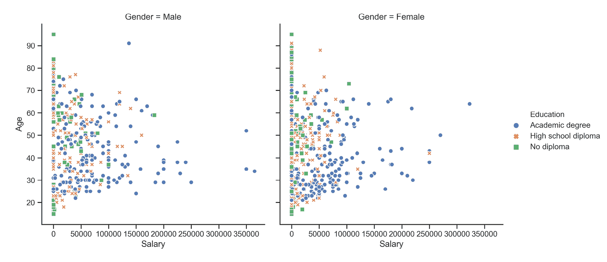

###### 图 4.1:海底关系图

幕后，西博恩用 Matplotlib 绘制绘图。尽管许多任务只需使用 Seaborn 就可以完成，但进一步的定制可能需要使用 Matplotlib。我们只提供了数据集中变量的名称以及它们在图中扮演的角色。与 Matplotlib 不同，没有必要将变量转换为可视化的参数。

其他痛点是默认的 Matplotlib 参数和配置。Seaborn 中的默认参数提供了更好的可视化效果，无需额外定制。我们将在接下来的主题中详细讨论这些默认参数。

对于已经熟悉 Matplotlib 的用户来说，Seaborn 的扩展微不足道，因为核心概念大多相似。

## 控制图表审美

正如我们之前提到的，Matplotlib 是高度可定制的。但这也有一个影响，那就是很难知道要调整什么样的设置来实现视觉上吸引人的绘图。相比之下，Seaborn 提供了几个定制的主题和一个高级界面来控制 Matplotlib 图形的外观。

下面的代码片段在 Matplotlib 中创建了一个简单的线图:

```py
%matplotlib inline
import matplotlib.pyplot as plt
plt.figure()
x1 = [10, 20, 5, 40, 8]
x2 = [30, 43, 9, 7, 20]
plt.plot(x1, label='Group A')
plt.plot(x2, label='Group B')
plt.legend()
plt.show()
```

这是 Matplotlib 默认参数下的图:

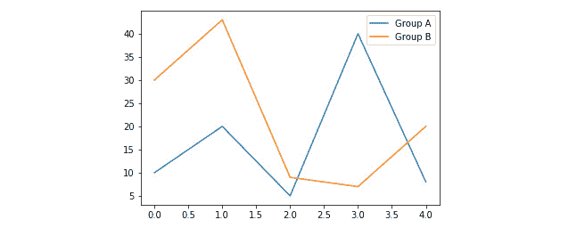

###### 图 4.2: Matplotlib 线出图

要切换到 Seaborn 默认值，只需调用`set()`功能:

```py
%matplotlib inline
import matplotlib.pyplot as plt
import seaborn as sns
sns.set()
plt.figure()
x1 = [10, 20, 5, 40, 8]
x2 = [30, 43, 9, 7, 20]
plt.plot(x1, label='Group A')
plt.plot(x2, label='Group B')
plt.legend()
plt.show()
```

绘图如下:

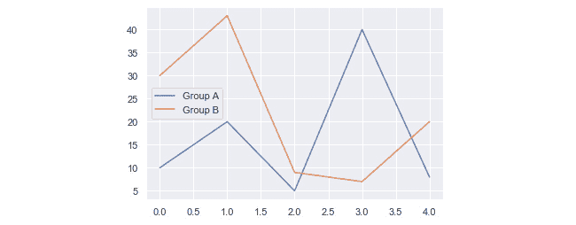

###### 图 4.3:海伯恩线图

Seaborn 将 Matplotlib 的参数分为两组。第一组包含绘图美学的参数，而第二组缩放图形的各种元素，以便可以在不同的上下文中轻松使用，例如用于演示、海报等的可视化。

### 海鸟体形风格

为了控制风格，Seaborn 提供了两种方法:`set_style(style, [rc])`和`axes_style(style, [rc])`。

`seaborn.set_style(style, [rc])`设定绘图的审美风格。

**参数:**

*   `style`:参数字典或以下预配置集合之一的名称:`darkgrid`、`whitegrid`、`dark`、`white`或`ticks`
*   `rc`(可选):参数映射以覆盖预设的 Seaborn 样式字典中的值

这里有一个例子:

```py
%matplotlib inline
import matplotlib.pyplot as plt
import seaborn as sns
sns.set_style("whitegrid")
plt.figure()
x1 = [10, 20, 5, 40, 8]
x2 = [30, 43, 9, 7, 20]
plt.plot(x1, label='Group A')
plt.plot(x2, label='Group B')
plt.legend()
plt.show()
```

这将产生以下图:

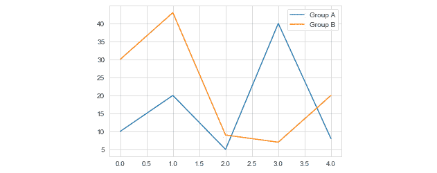

###### 图 4.4:白色网格样式的海伯恩线图

`seaborn.axes_style(style, [rc])`返回绘图审美风格的参数字典。该函数可在 with 语句中用于临时更改样式参数。

以下是参数:

*   `style`:参数字典或以下预配置集合之一的名称:`darkgrid`、`whitegrid`、`dark`、`white`或`ticks`
*   `rc`(可选):参数映射以覆盖预设的 Seaborn 样式字典中的值。

这里有一个例子:

```py
%matplotlib inline
import matplotlib.pyplot as plt
import seaborn as sns
sns.set()
plt.figure()
x1 = [10, 20, 5, 40, 8]
x2 = [30, 43, 9, 7, 20]
with sns.axes_style('dark'):
    plt.plot(x1, label='Group A')
    plt.plot(x2, label='Group B')
plt.legend()
plt.show()
```

审美只是暂时的改变。结果如下图所示:

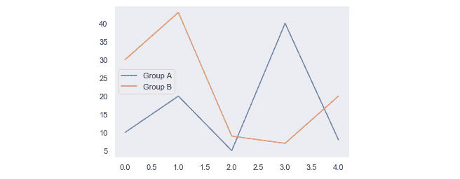

###### 图 4.5:深轴风格的海伯恩线图

为了进一步定制，您可以将参数字典传递给`rc`参数。您只能替代属于样式定义一部分的参数。

### 去除斧刺

有时，可能需要移除顶部和右侧的轴刺。

`seaborn.despine(fig=None, ax=None, top=True, right=True, left=False, bottom=False, offset=None, trim=False)`从绘图中移除顶部和右侧的刺。

下面的代码有助于移除轴脊:

```py
%matplotlib inline
import matplotlib.pyplot as plt
import seaborn as sns
sns.set_style("white")
plt.figure()
x1 = [10, 20, 5, 40, 8]
x2 = [30, 43, 9, 7, 20]
plt.plot(x1, label='Group A')
plt.plot(x2, label='Group B')
sns.despine()
plt.legend()
plt.show()
```

这将产生以下图:

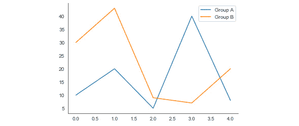

###### 图 4.6:去毛刺的海底线图

### 上下文

一组单独的参数控制绘图元素的比例。这是一种使用相同代码创建适合在需要更大或更小图的环境中使用的图的简便方法。为了控制上下文，可以使用两个函数。

`seaborn.set_context(context, [font_scale], [rc])`设置绘图环境参数。这不会改变绘图的整体风格，但会影响标签、线条等的大小。基础上下文是`notebook`，其他上下文是`paper`、`talk`和`poster`，它们分别是按 0.8、1.3 和 1.6 缩放的`notebook`参数的版本。

以下是参数:

*   `context`:参数字典或以下预配置集合之一的名称:纸张、笔记本、谈话或海报
*   `font_scale`(可选):独立缩放字体元素大小的缩放因子
*   `rc`(可选):参数映射以覆盖预设的 Seaborn 上下文词典中的值

以下代码有助于设置上下文:

```py
%matplotlib inline
import matplotlib.pyplot as plt
import seaborn as sns
sns.set_context("poster")
plt.figure()
x1 = [10, 20, 5, 40, 8]
x2 = [30, 43, 9, 7, 20]
plt.plot(x1, label='Group A')
plt.plot(x2, label='Group B')
plt.legend()
plt.show()
```

上述代码生成以下输出:


###### 图 4.7:带有海报背景的 Seaborn 线条图

`seaborn.plotting_context(context, [font_scale], [rc])`返回一个参数字典来缩放图形的元素。此函数可与语句一起使用，以临时更改上下文参数。

以下是参数:

*   `context`:参数字典或以下预配置集合之一的名称:纸张、笔记本、谈话或海报
*   `font_scale`(可选):独立缩放字体元素大小的缩放因子
*   `rc`(可选):参数映射以覆盖预设的 Seaborn 上下文词典中的值

### 活动 20:使用箱线图比较不同测试组的智商得分

在本活动中，我们将使用 Seaborn 库的方框图来比较不同测试组的智商得分:

1.  使用 pandas 读取位于子文件夹数据中的数据。
2.  访问列中每个组的数据，将它们转换为列表，并将该列表分配给每个相应组的变量。
3.  通过使用每个相应组的数据，使用前面的数据创建熊猫数据框。
4.  使用 Seaborn 的`boxplot`功能为不同测试组的每个智商分数创建一个方框图。
5.  使用`whitegrid`样式，将上下文设置为说话，去掉除底部的轴刺以外的所有轴刺。给绘图加上一个标题。
6.  执行上述步骤后，最终输出应如下所示:

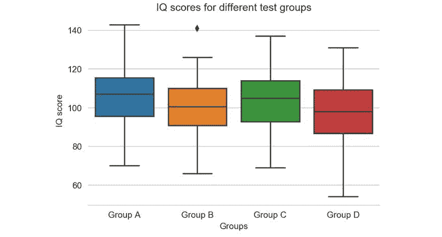

###### 图 4.8:各组的智商得分

#### 注意:

这项活动的解决方案可以在第 292 页找到。

## 色盘

颜色是你视觉化的一个非常重要的因素。如果使用有效，颜色可以显示数据中的模式，如果使用不当，颜色可以隐藏模式。Seaborn 使选择和使用适合您任务的**调色板**变得容易。`color_palette()`功能为许多可能的颜色生成方式提供了一个界面。

`seaborn.color_palette([palette], [n_colors], [desat])`返回颜色列表，从而定义调色板。

以下是参数:

*   `palette`(可选):调色板名称或无返回当前调色板。
*   `n_colors`(可选):调色板中的颜色数量。如果指定的颜色数量大于调色板中的颜色数量，颜色将被循环使用。
*   `desat`(可选):将每种颜色去饱和的比例。

您可以使用`set_palette()`设置所有绘图的调色板。该函数接受与`color_palette()`相同的参数。在接下来的章节中，我们将解释调色板如何被分成不同的组。

### 分类调色板

**分类调色板**最适合区分没有固有顺序的离散数据。Seaborn 中有六个默认主题:`deep`、`muted`、`bright`、`pastel`、`dark`和`colorblind`。以下代码提供了每个主题的代码和输出:

```py
import seaborn as sns
palette1 = sns.color_palette("deep")
sns.palplot(palette1)
```

下图显示了前面代码的输出:

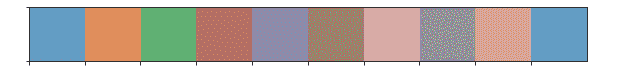

###### 图 4.9:深调色板

```py
palette2 = sns.color_palette("muted")
sns.palplot(palette2)
```

下图显示了前面代码的输出:

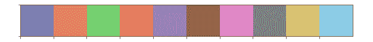

###### 图 4.10:静音调色板

下图显示了一个明亮的调色板:

```py
palette3 = sns.color_palette("bright")
sns.palplot(palette3)
```


###### 图 4.11:明亮的调色板

下图显示了柔和的调色板:

```py
palette4 = sns.color_palette("pastel")
sns.palplot(palette4)
```


###### 图 4.12:彩色调色板

下图显示了深色调色板:

```py
palette5 = sns.color_palette("dark")
sns.palplot(palette5)
```


###### 图 4.13:深色调色板

```py
palette6 = sns.color_palette("colorblind")
sns.palplot(palette6)
```

下图显示了前面代码的输出:


###### 图 4.14:色盲调色板

### 顺序调色板

**当数据范围从相对较低或不感兴趣的值到相对较高或感兴趣的值时，顺序调色板**是合适的。下面的代码片段，以及它们各自的输出，让我们对**顺序调色板**有了更好的了解:

```py
custom_palette2 = sns.light_palette("brown")
sns.palplot(custom_palette2)
```

下图显示了前面代码的输出:


###### 图 4.15:定制棕色调色板

在下面的代码中，通过将`reverse`参数设置为`True`，也可以反转前面的调色板:

```py
custom_palette3 = sns.light_palette("brown", reverse=True)
sns.palplot(custom_palette3)
```

下图显示了前面代码的输出:


###### 图 4.16:定制反转棕色调色板

### 发散调色板

`Diverging color palettes`用于由明确定义的中点组成的数据。重点放在高值和低值上。例如:如果您从某个基线人口中绘制某个特定区域的人口变化，最好使用不同的颜色图来显示人口的相对增加和减少。下面的代码片段和输出提供了对发散图的更好理解，其中我们使用了`coolwarm`模板，该模板内置于 Matplotlib 中:

```py
custom_palette4 = sns.color_palette("coolwarm", 7)
sns.palplot(custom_palette4)
```

下图显示了前面代码的输出:


###### 图 4.17:冷暖色调色板

您可以使用`diverging_palette()`功能创建自定义发散调色板。我们可以传递两个**色调**作为参数，以及调色板的总数。下面的代码片段和输出提供了更好的洞察力:

```py
custom_palette5 = sns.diverging_palette(440, 40, n=7)
sns.palplot(custom_palette5)
```

下图显示了前面代码的输出:


###### 图 4.18:自定义发散调色板

### 活动 21:使用热图寻找航班乘客数据中的模式

在本活动中，我们将使用热图来查找航班乘客数据中的模式:

1.  使用 pandas 读取位于子文件夹数据中的数据。给定的数据集包含 2001 年至 2012 年航班乘客的月度数据。
2.  使用热图可视化给定的数据。
3.  使用自己的彩色地图。确保最低值是最暗的颜色，最高值是最亮的颜色。
4.  执行上述步骤后，预期输出应该如下:

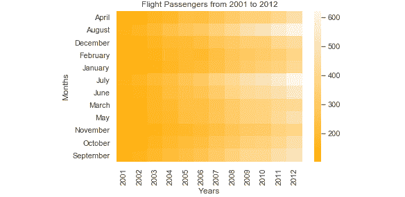

###### 图 4.19:航班乘客数据热图

#### 注意:

这项活动的解决方案可以在第 294 页找到。

## 海伯恩有趣的绘图

在上一章中，我们讨论了 Matplotlib 中的各种绘图，但仍有一些可视化的内容需要讨论。

### 条形图

在最后一章中，我们已经解释了如何用 Matplotlib 创建条形图。创建带有子组的条形图非常繁琐，但是 Seaborn 提供了一种非常方便的方法来创建各种条形图。它们也可以在 Seaborn 中使用，表示每个矩形高度的中心趋势估计，并使用误差线表示该估计的不确定性。

下面的示例让您很好地了解了这是如何工作的:

```py
import pandas as pd
import seaborn as sns
data = pd.read_csv("data/salary.csv")
sns.set(style="whitegrid")
sns.barplot(x="Education", y="Salary", hue="District", data=data)
```

结果如下图所示:

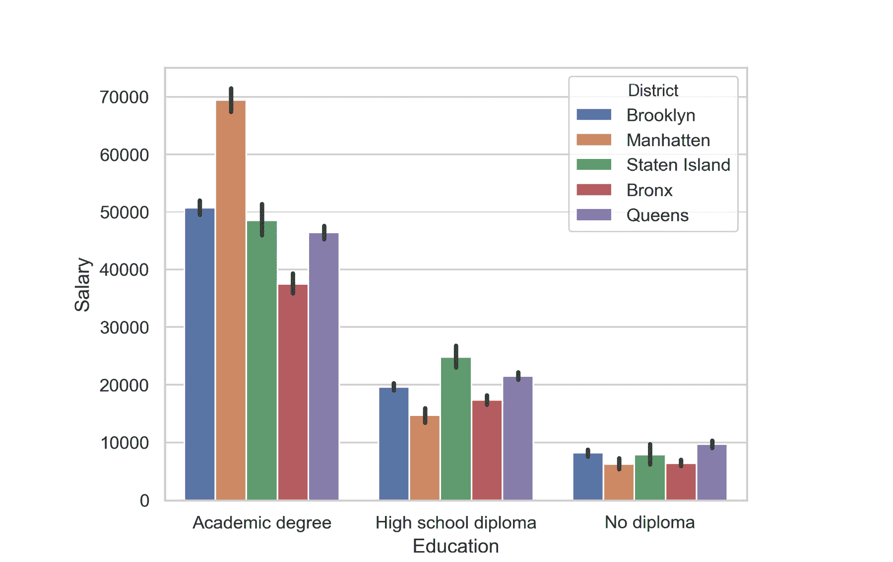

###### 图 4.20:海底酒吧图

### 活动 22:重温电影对比

在本活动中，我们将使用条形图来比较电影分数。你将得到五部烂番茄的电影。Tomatometer 是对电影给予正面评价的认可 Tomatometer 影评人的百分比。受众分数是 5 分中给出 3.5 分或更高分数的用户的百分比。在五部电影中比较这两个分数:

1.  使用 pandas 读取位于子文件夹数据中的数据。
2.  将数据转换为适用于 Seaborn 条形图功能的可用格式。
3.  使用 Seaborn 创建一个视觉上吸引人的条形图，比较所有五部电影的两个分数。
4.  执行上述步骤后，预期的输出应该如下所示:

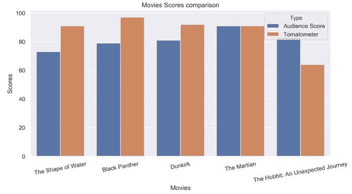

###### 图 4.21:电影评分对比

#### 注意:

这项活动的解决方案可以在第 295 页找到。

### 核密度估计

可视化数据集变量的分布通常很有用。Seaborn 提供了检查单变量和双变量分布的便捷函数。一种可能的方法是使用`distplot()`函数来观察 Seaborn 中的单变量分布。这将绘制直方图并拟合**核密度估计值** ( **KDE** ，如下例所示:

```py
%matplotlib inline
import numpy as np
import pandas as pd
import matplotlib.pyplot as plt
import seaborn as sns
x = np.random.normal(size=50)
sns.distplot(x)
```

结果如下图所示:

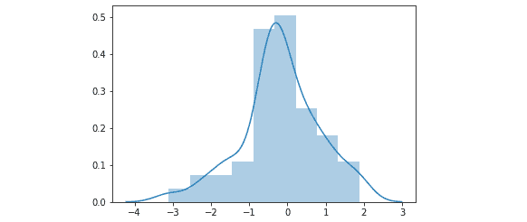

###### 图 4.22:单变量分布直方图的 KDE

为了直观显示 KDE，Seaborn 提供了`kdeplot()`功能:

```py
sns.kdeplot(x, shade=True)
```

下图显示了 KDE 曲线，以及曲线下的阴影区域:

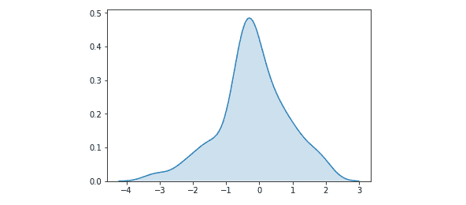

###### 图 4.23:单变量分布的 KDE

### 绘制二元分布

为了可视化**二元分布**，我们将介绍三个不同的图。前两个图使用`jointplot()`函数，该函数创建了一个多面板图，显示了两个变量之间的联合关系和相应的边际分布。

散点图将每个观察点显示为`x`和`y`轴上的点。此外，还显示了每个变量的直方图:

```py
import pandas as pd
import seaborn as sns
data = pd.read_csv("data/salary.csv")
sns.set(style="white")
sns.jointplot(x="Salary", y="Age", data=data)
```

下图显示了带有边缘直方图的散点图:

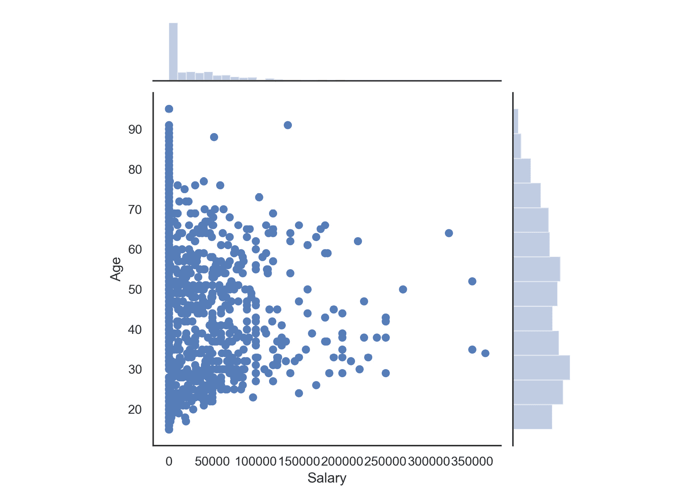

###### 图 4.24:带有边缘直方图的散点图

也可以使用 KDE 程序来可视化二元分布。联合分布显示为等高线图，如以下代码所示:

```py
sns.jointplot('Salary', 'Age', data=subdata, kind='kde', xlim=(0, 500000), ylim=(0, 100))
```

结果如下图所示:

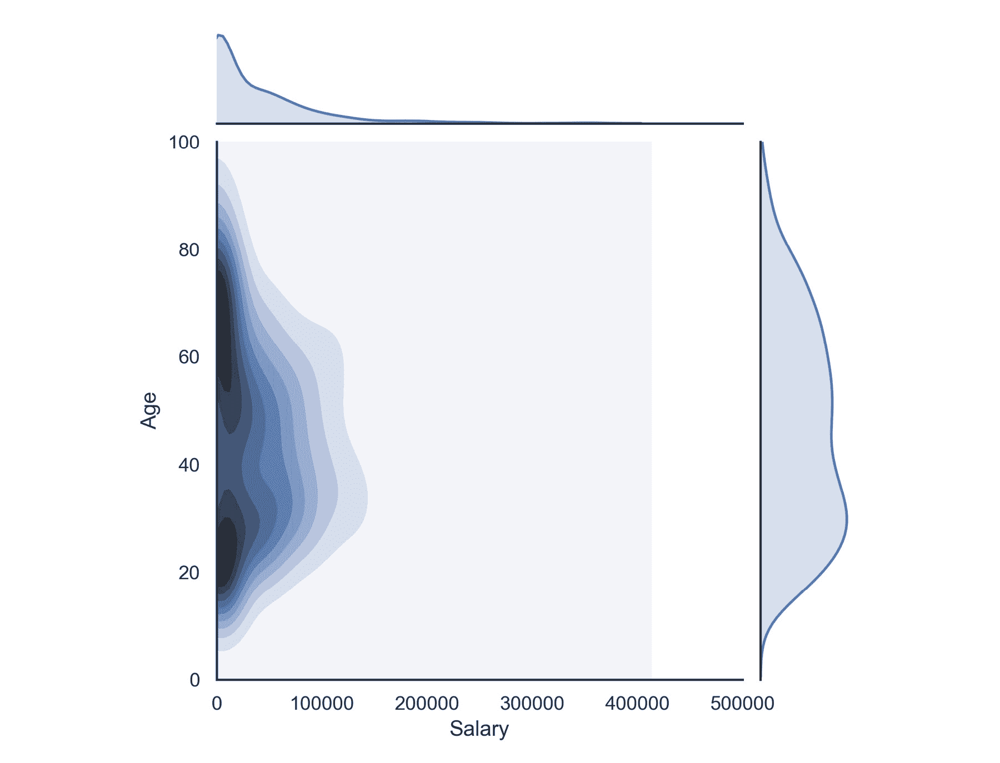

###### 图 4.25:等高线图

### 可视化成对关系

为了可视化数据集中的多个成对二元分布，Seaborn 提供了`pairplot()`函数。该函数创建一个矩阵，其中非对角线元素显示每对变量之间的关系，对角线元素显示边际分布。

下面的例子让我们对此有了更好的理解:

```py
%matplotlib inline
import numpy as np
import pandas as pd
import matplotlib.pyplot as plt
import seaborn as sns
mydata = pd.read_csv("data/basic_details.csv")
sns.set(style="ticks", color_codes=True)
g = sns.pairplot(mydata, hue="Groups")
```

配对图，也称为**相关图**，如下图所示。所有变量对的散点图显示在非对角线上，而 kde 显示在对角线上。组以不同的颜色突出显示:

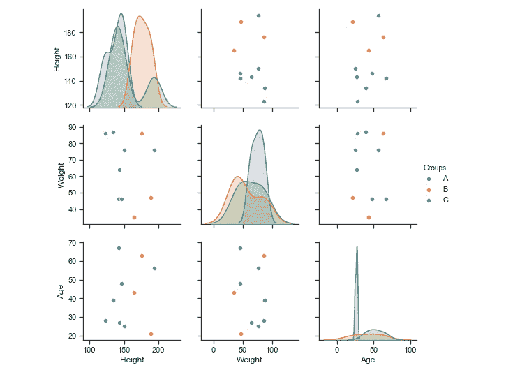

###### 图 4.26:海伯恩配对图

### 小提琴绘图

可视化统计测量的另一种方法是使用**小提琴绘图**。他们将箱线图与我们之前描述的核密度估计过程相结合。它对变量的分布提供了更丰富的描述。此外，方框图中的四分位数和触须值显示在小提琴内部。

以下示例演示了小提琴绘图的用法:

```py
import pandas as pd
import seaborn as sns
data = pd.read_csv("data/salary.csv")
sns.set(style="whitegrid")  
sns.violinplot('Education', 'Salary', hue='Gender', data=data, split=True, cut=0)
```

结果如下:

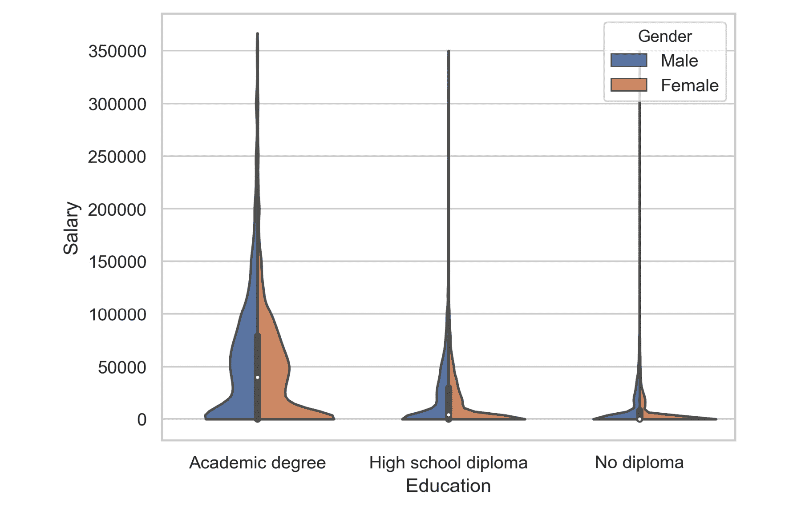

###### 图 4.27:Seaborn 小提琴图

### 活动 23:使用小提琴图比较不同测试组的智商得分

在本活动中，我们将使用 Seaborn 图书馆提供的小提琴图来比较不同测试组的智商得分:

1.  使用 pandas 读取位于子文件夹数据中的数据。
2.  访问列中每个组的数据，将它们转换为列表，并将该列表分配给每个相应组的变量。
3.  通过使用每个相应组的数据，使用前面的数据创建熊猫数据帧。
4.  使用 Seaborn 的`violinplot`功能为不同测试组的每个智商分数创建一个方框图。
5.  使用`whitegrid`样式，将上下文设置为说话，去掉除底部的轴刺以外的所有轴刺。给绘图加上一个标题。
6.  执行上述步骤后，最终输出应该如下所示:

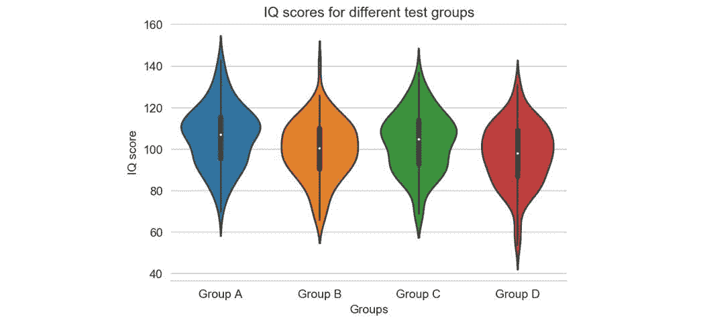

###### 图 4.28:显示不同组智商得分的小提琴图

#### 注意:

这项活动的解决方案可以在第 297 页找到。

## 海底多绘图

在前一个主题中，我们介绍了一个多绘图，即配对绘图。在这个话题中，我们想谈谈一种不同的方式来创造灵活的多绘图。

### FacetGrid

**面网格**对于分别可视化多个变量的特定图非常有用。一个面网格最多可以绘制三个维度:`row`、`col`和`hue`。前两个与数组的行和列有明显的对应关系。`hue`是第三维度，用不同的颜色显示。`FacetGrid`类必须用数据框和构成网格的行、列或色调维度的变量名称初始化。这些变量应该是**分类**或**离散**。

`seaborn.FacetGrid(data, row, col, hue, …)`初始化用于绘制条件关系的多绘图网格。

以下是一些有趣的参数:

*   `data`:整齐的(“长格式”)数据帧，其中每一列对应一个变量，每一行对应一个观察值
*   `row, col, hue`:定义给定数据子集的变量，这些数据将绘制在网格中的独立面上
*   `sharex, sharey`(可选):跨行/列共享`x` / `y`轴
*   `height`(可选):每个面的高度(英寸)

初始化网格还没有在上面画出任何东西。为了可视化这个网格上的数据，必须使用`FacetGrid.map()`方法。您可以提供任何绘图功能以及要绘图的数据框中变量的名称。

`FacetGrid.map(func, *args, **kwargs)`对网格的每个面应用绘图功能。

以下是参数:

*   `func`:取数据和关键字参数的标绘函数。
*   `*args`:数据中标识要绘制的变量的列名。每个变量的数据按照变量指定的顺序传递给`func`。
*   `**kwargs`:传递给绘图函数的关键字参数。

以下示例使用散点图可视化 FacetGrid:

```py
import pandas as pd
import matplotlib.pyplot as plt
import seaborn as sns
data = pd.read_csv("data/salary.csv")
g = sns.FacetGrid(subdata, col='District')
g.map(plt.scatter, 'Salary', 'Age')
```

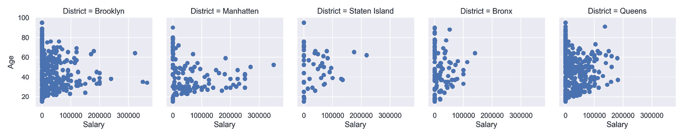

###### 图 4.29:带有散点图的面网格

### 活动 24:排名前 30 的 YouTube 频道

在本活动中，我们将使用由 Seaborn 库提供的`FacetGrid()`功能来可视化前 30 个 YouTube 频道的订户总数和总浏览量。使用包含两列的 FacetGrid 可视化给定数据。第一列应该显示每个 YouTube 频道的订户数量，而第二列应该显示浏览量。以下是实施此活动的步骤:

1.  使用 pandas 读取位于子文件夹数据中的数据。
2.  访问列中每个组的数据，将它们转换为列表，并将该列表分配给每个相应组的变量。
3.  通过使用每个相应组的数据，使用前面的数据创建熊猫数据框。
4.  创建一个包含两列的 FacetGrid 来可视化数据。
5.  执行上述步骤后，最终输出应该如下所示:

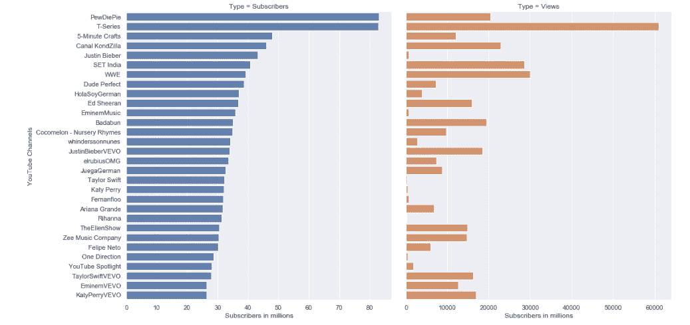

###### 图 4.30:前 30 个 YouTube 频道的订户和浏览量

#### 注意:

这项活动的解决方案可以在第 299 页找到。

## 回归图

许多数据集包含多个定量变量，目标是找到这些变量之间的关系。我们之前提到了几个显示两个变量联合分布的函数。估计两个变量之间的关系是有帮助的。我们在这个主题中只讨论线性回归；但是，如果需要，Seaborn 提供了更广泛的回归功能。

为了可视化通过线性回归确定的线性关系，`regplot()`函数由 Seaborn 提供。下面的代码片段给出了一个简单的例子:

```py
import numpy as np
import seaborn as sns
x = np.arange(100)
y = x + np.random.normal(0, 5, size=100)
sns.regplot(x, y)
```

`regplot()`函数绘制散点图、回归线和该回归的 95%置信区间，如下图所示:

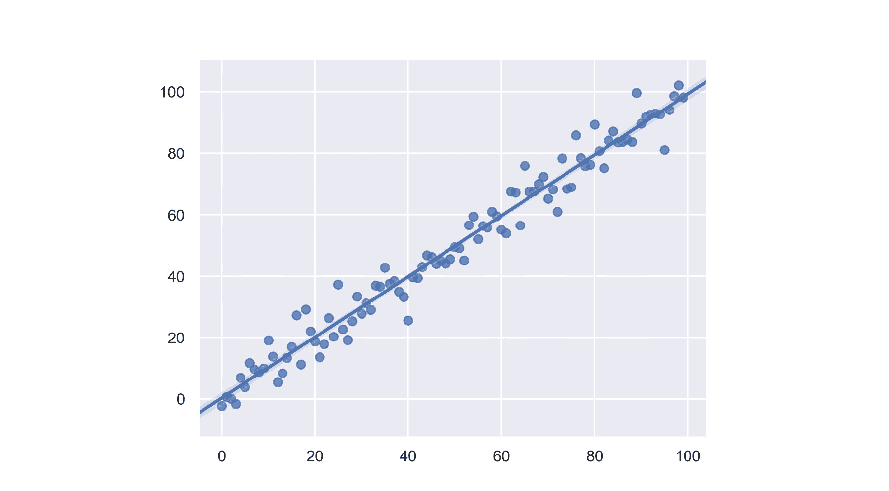

###### 图 4.31:Seaborn 回归图

### 活动 25:线性回归

在本练习中，我们将使用回归图来可视化线性关系:

1.  使用 pandas 读取位于子文件夹数据中的数据。
2.  过滤数据，这样你最终得到的样本就包含了一个体重和最长寿命。仅考虑哺乳动物类和体重低于 200，000 的样本。
3.  创建一个回归图来可视化变量之间的线性关系。
4.  执行上述步骤后，输出应该如下所示:

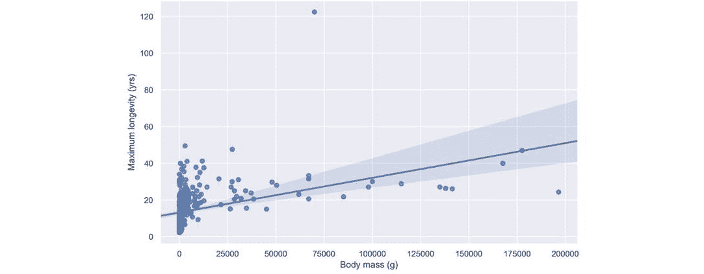

###### 图 4.32:动物属性关系的线性回归

#### 注意:

这项活动的解决方案可以在第 300 页找到。

## 方形

在这一点上，我们将简单谈谈**树图**。树形图将分层数据显示为一组嵌套的矩形。每个组由一个矩形表示，矩形的面积与其值成正比。使用配色方案，可以表示层次结构:组、子组等等。与饼图相比，树形图可以有效利用空间。Matplotlib 和 Seaborn 不提供树地图，因此使用了建立在 Matplotlib 之上的 **Squarify** 库。Seaborn 是创建调色板的一个很好的补充。

下面的代码片段是一个基本的树图示例。它需要 Squarify 库:

```py
%matplotlib inline
import matplotlib.pyplot as plt
import seaborn as sns
import squarify
colors = sns.light_palette("brown", 4)
squarify.plot(sizes=[50, 25, 10, 15], label=["Group A", "Group B", "Group C", "Group D"], color=colors)
plt.axis("off")
plt.show()
```

结果如下图所示:


###### 图 4.33:树形图

### 活动 26:重新审视水的使用

在本练习中，我们将使用树形图来可视化用于不同目的的水的百分比:

1.  使用 pandas 读取位于子文件夹数据中的数据。
2.  使用树状图来可视化用水量。
3.  显示每个图块的百分比，并添加标题。
4.  执行上述步骤后，预期输出应该如下:

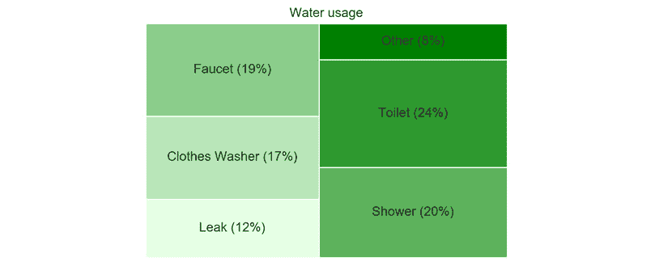

###### 图 4.34:用水量树形图

#### 注意:

这项活动的解决方案可以在第 301 页找到。

## 总结

在这一章中，我们展示了 Seaborn 如何帮助创造视觉上吸引人的形象。我们讨论了控制图形美学的各种选项，例如图形样式、控制脊椎和设置可视化的上下文。我们详细讨论了调色板。为了可视化单变量和双变量分布，引入了进一步的可视化。此外，我们还讨论了可用于创建多图的 FacetGrids，以及作为分析两个变量之间关系的方法的回归图。最后，我们讨论了用于创建树图的 Squarify 库。在下一章中，我们将向您展示如何使用 Geoplotlib 库以各种方式可视化地理空间数据。