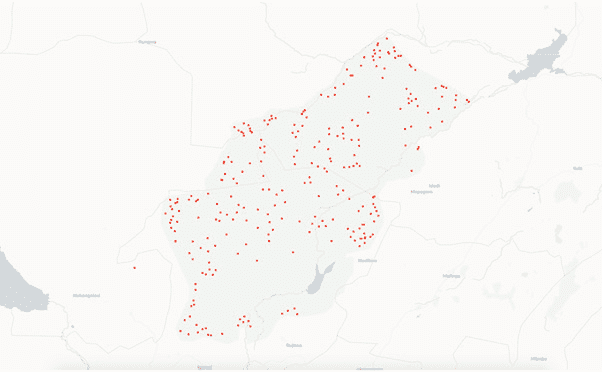

# 五、绘制地理空间数据

## 学习目标

本章结束时，您将能够:

*   利用地理地图创建令人惊叹的地理可视化
*   识别不同类型的地理空间图表
*   演示包含用于绘图的地理空间数据的数据集
*   解释绘制地理空间信息的重要性

在本章中，我们将使用 geoplotib 库来可视化不同的地理空间数据。

## 简介

**geoblotlib**是一个用于地理空间数据可视化的开源 Python 库。它有广泛的地理可视化，并支持硬件加速。它还为具有数百万个数据点的大型数据集提供了性能渲染。如前几章所述，Matplotlib 提供了可视化地理数据的方法。但是，Matplotlib 并不是为这个任务而设计的，因为它的接口复杂，使用起来不方便。Matplotlib 还限制了地理数据的显示方式。**底图**和**制图**库支持该功能，因此您可以在世界地图上绘图。但是，这些包不支持在**地图图块**上绘制。

另一方面，Geoplotlib 正是为此目的而设计的，因此它不仅提供了**地图图块**，还允许交互性和简单的动画。它提供了一个简单的界面，允许访问强大的地理空间可视化。

#### 注意

为了更好地了解 geo lotlib 的可用功能，您可以访问以下链接:[https://github . com/Andrea-cuttone/geo lotlib/wiki/User-Guide](https://github.com/andrea-cuttone/geoplotlib/wiki/User-Guide)。

为了理解 Geoplotlib 的概念、设计和实现，让我们简单了解一下它的概念架构。馈入地理乐库的两个输入是您的**数据源**和**地图图块**。正如我们将在后面看到的，地图切片可以被不同的提供者替换。这些输出不仅描述了在 Jupyter 笔记本中渲染图像的可能性，还描述了在交互式窗口中工作的可能性，该窗口允许**缩放**和**平移**地图。**地理乐库**组件的模式如下:


###### 图 5.1:地质图书馆的概念架构

**geo lotlib**使用了可以上下叠加的图层概念，为甚至复杂的可视化提供了强大的界面。它附带了几个易于设置和使用的常见可视化层。

从上图中我们可以看到**geo lotlib**建立在 **NumPy** / **SciPy** 、 **Pyglet** / **OpenGL** 之上。这些库负责数值运算和渲染。这两个组件都基于 Python，因此可以使用完整的 Python 生态系统。

### 地质图书馆的设计原则

仔细看看 Geoplotlib 的内部设计，我们可以看到它是围绕三个设计原则构建的:

*   **Simplicity**: Looking at the example provided here, we can quickly see that Geoplotlib abstracts away the complexity of plotting map tiles and the already provided layers such as **dot-density** and **histogram**. It has a simple API that provides common visualizations. These visualizations can be created using custom data with only a few lines of code. If our dataset comes with **lat** and **lon** columns, we can display those **datapoints** as dots on a map with five lines of code, like this:

    ```py
    import geoplotlib
    from geoplotlib.utils import read_csv dataset = read_csv('./data/poaching_points_cleaned.csv')
    geoplotlib.dot(dataset)
    geoplotlib.show()
    ```

    除此之外，每个以前使用过 Matplotlib 的人理解 Geoplotlib 的语法都不会有问题，因为它的语法是受 Matplotlib 的语法启发的。

*   **Integration**: Geoplotlib visualizations are purely Python-based. This means that the generic Python code can be executed and other libraries such as **pandas** can be used for **data wrangling** purposes. We can manipulate and enrich our datasets using pandas **DataFrames** and later simply convert them into a Geoplotlib `DataAccessObject`, which we need for optimum compatibility, like this:

    ```py
    import pandas as pd
    from geoplotlib.utils import DataAccessObject
    pd_dataset = pd.read_csv('./data/poaching_points_cleaned.csv')
    # data wrangling with pandas DataFrames here
    dataset = DataAccessObject(pd_dataset)
    ```

    Geoplotlib 完全集成到 Python 生态系统中。这使我们甚至可以在 Jupyter 笔记本中在线绘制地理数据。这种可能性允许我们快速迭代地设计可视化。

*   **性能**:正如我们之前提到的，由于使用 NumPy 进行加速数值运算和 **OpenGL** 进行加速图形渲染，Geoplotlib 能够处理大量数据。

### 地理空间可视化

**choropoleth 图**、 **Voronoi 镶嵌**和 **Delaunay 三角测量**是本章将使用的几个地理空间可视化。这里提供了对它们的解释:

**氯普勒斯图**

这种地理图以阴影或彩色的方式显示一个国家的州等区域。阴影或颜色由一个或一组数据点决定。它给出了一个地理区域的抽象视图，以可视化不同区域之间的关系和差异。在图 5.21 中，我们可以看到美国每个州的阴影是由肥胖的百分比决定的。阴影越深，百分比越高。

**沃罗诺伊镶嵌**

在 **Voronoi 镶嵌**中，每对数据点基本上由一条与两个数据点具有相同距离的线分开。这种分离会创建单元格，对于每个给定点，这些单元格会标记哪个数据点更接近。数据点越接近，单元格越小。

Delaunay 三角剖分

一个**德劳奈三角测量**与沃罗诺伊镶嵌相关。当将每个数据点连接到共享一条边的其他数据点时，我们最终得到一个三角化的图。数据点越接近，三角形就越小。这给了我们一个关于特定区域点密度的视觉线索。当与颜色梯度相结合时，我们获得了关于兴趣点的见解，这可以与热图进行比较。

### 练习 6:可视化简单地理空间数据

在本练习中，我们将了解 Geoplotlib 绘图方法在**点密度**、**直方图**和 **Voronoi** 图中的基本用法。为此，我们将利用世界各地发生的各种偷猎事件的数据:

1.  Open the Jupyter Notebook `exercise06.ipynb` from the `Lesson05` folder to implement this exercise.

    为此，您需要导航到该文件的路径。在命令行终端中，键入:`jupyter-lab`

2.  现在，您应该已经熟悉了使用 Jupyter 笔记本的过程。
3.  打开`exercise06.ipynb`文件。
4.  一如既往，首先，我们希望导入我们需要的依赖项。在这种情况下，我们将在没有熊猫的情况下工作，因为`geoplotlib`有自己的`read_csv`方法，使我们能够将. csv 文件读入`DataAccessObject` :

    ```py
    # importing the necessary dependencies
    import geoplotlib
    from geoplotlib.utils import read_csv
    ```

5.  The data is being loaded in the same way as with the pandas `read_csv` method:

    ```py
    dataset = read_csv('./data/poaching_points_cleaned.csv')
    ```

    #### 注意

    前面的数据集可以在这里找到:[https://bit.ly/2Xosg2b](https://bit.ly/2Xosg2b)。

6.  The dataset is stored in a `DataAccessObject` class that's provided by Geoplotlib. It does not have the same capabilities as pandas **DataFrames**. It's meant for the simple and quick loading of data so that you can create a visualization. If we print out this object, we can see the difference better. It gives us a basic overview of what columns are present and how many rows the dataset has:

    ```py
    # looking at the dataset structure
    Dataset
    ```

    下图显示了前面代码的输出:

    

    ###### 图 5.2:数据集结构

    正如我们在前面的截图中看到的，数据集由 268 行和 6 列组成。每行由`id_report`唯一标识。`date_report`栏注明偷猎事件发生的日期。另一方面，`created_date`一栏注明了报告的创建日期。描述列提供了有关该事件的基本信息。`lat`和`lon`栏陈述了偷猎发生地的地理位置。

7.  Geoplotlib is compatible with pandas DataFrames as well. If you need to do some pre-processing with the data, it might make sense to use pandas right away:

    ```py
    # csv import with pandas
    import pandas as pd
    pd_dataset = pd.read_csv('./data/poaching_points_cleaned.csv')
    pd_dataset.head()
    ```

    下图显示了前面代码的输出:

    

    ###### 图 5.3:数据集的前五个条目

    #### 注意

    Geoplotlib 要求您的数据集具有`lat`和`lon`列。这些列是纬度和经度的地理数据，用于确定如何绘图。

8.  To start with, we'll be using a simple **DotDensityLayer** that will plot each row of our dataset as a single point on a map. Geoplotlib comes with the `dot` method, which creates this visualization without further configurations:

    #### 注意

    在这里设置好 DotDensityLayer 之后，我们需要调用`show`方法，这个方法会用给定的图层渲染地图。

    ```py
    # plotting our dataset with points
    geoplotlib.dot(dataset)
    geoplotlib.show()
    ```

    下图显示了前面代码的输出:

    

    ###### 图 5.4:偷猎点的点密度可视化

    只看数据集中的`lat`和`lon`值，不会给我们很好的思路。如果不在地图上可视化我们的数据点，我们就无法得出结论并深入了解数据集。在看渲染图的时候，我们可以看到有一些比较受欢迎的点比较多，也有一些不太受欢迎的点比较少。

9.  We now want to look at the point density some more. To better visualize the density, we have a few options. One of them is to use a **histogram plot**. We can define a `binsize`, which will allow us to set the size of the hist bins in our visualization. **Geoplotlib** provides the `hist` method, which will create a **Histogram Layer** on top of our map tiles:

    ```py
    # plotting our dataset as a histogram
    geoplotlib.hist(dataset, binsize=20)
    geoplotlib.show()
    ```

    下图显示了前面代码的输出:

    

    ###### 图 5.5:偷猎点的直方图可视化

    直方图让我们更好地理解数据集的**密度分布**。看最后的绘图，可以看出有一些偷猎的热点。这也突出了没有任何偷猎事件的地区。

10.  **Voronoi plots** are also good for visualizing the density of data points. Voronoi introduces a little bit more complexity with several parameters such as `cmap`, `max_area`, and `alpha`. Here, `cmap` denotes the color of the map, `alpha` denotes the color of the alpha, and `max_area` denotes a constant that determines the color of the **Voronoi areas**. They are useful if you want to better fit your visualization into the data:

    ```py
    # plotting a voronoi map
    geoplotlib.voronoi(dataset, cmap='Blues_r', max_area=1e5, alpha=255)
    geoplotlib.show()
    ```

    下图显示了前面代码的输出:


###### 图 5.6:挖角点的 Voronoi 可视化

如果我们将沃罗诺伊可视化与直方图进行比较，我们可以看到一个吸引了很多注意力的区域。图的中右边缘显示了相当大的深蓝色区域，中心更暗，这在直方图中很容易被忽略。

恭喜你！我们刚刚介绍了地理图书馆的基础知识。它有更多的方法，但是它们都有一个相似的 API，使得使用其他方法变得简单。既然我们看了一些非常基本的可视化，现在就看你来解决第一个活动了。

### 活动 27:在地图上绘制地理空间数据

在本活动中，我们将利用之前学习的使用 Geoplotlib 绘制数据的技能，并将其应用于在欧洲人口超过 10 万的城市中寻找密集区域的任务:

1.  从`Lesson05`文件夹中打开 Jupyter 笔记本`activity27.ipynb`执行本活动。
2.  在开始处理数据之前，我们需要导入依赖项。
3.  使用`pandas`加载数据集。
4.  加载数据集后，我们希望列出其中存在的所有数据类型。
5.  一旦我们可以看到我们的数据类型是正确的，我们将把我们的`Latitude`和`Longitude`列映射到`lat`和`lon`列。
6.  现在，将数据点绘制成点状图。
7.  为了离解决我们给定的任务更近一步，我们需要获得每个国家的城市数量(前 20 个条目)，并过滤掉人口大于零的国家。
8.  将剩余数据绘制成点状图。
9.  再次，过滤人口超过 100，000 的城市的剩余数据。
10.  为了更好地理解地图上数据点的密度，我们想要使用 **Voronoi 镶嵌图层**。
11.  将数据进一步过滤到德国和英国等国家的城市。
12.  最后，使用 **Delaunay 三角测量图层**找到人口最密集的区域。
13.  观察点图的预期输出:


###### 图 5.7:简化数据集的点密度可视化

下面是沃罗诺伊图的预期输出:


###### 图 5.8:人口稠密城市的沃罗诺伊可视化

以下是 Delaunay 三角测量的预期输出:


###### 图 5.9:德国和英国城市的德劳奈三角可视化

#### 注意:

这项活动的解决方案可以在第 303 页找到。

### 练习 7:用 GeoJSON 数据绘制坐标图

在本练习中，我们不仅想处理 **GeoJSON** 数据，还想了解如何创建**cholopleth 可视化**。它们对于在阴影区域显示统计变量特别有用。在我们的例子中，这些区域将是美国各州的轮廓。让我们用给定的 GeoJSON 数据创建一个 choropleth 可视化:

1.  从`Lesson05`文件夹打开 Jupyter 笔记本`exercise07.ipynb`执行本练习。
2.  加载本练习的依赖项:

    ```py
    # importing the necessary dependencies
    import json
    import geoplotlib
    from geoplotlib.colors import ColorMap
    from geoplotlib.utils import BoundingBox
    ```

3.  在我们创建实际的可视化之前，我们需要了解数据集的轮廓。由于 Geoplotlib 的`geojson`方法只需要一个到数据集的路径，而不是一个 DataFrame 或对象，所以我们不需要加载它。但是，由于我们仍然想看看我们处理的是什么类型的数据，所以我们必须打开 GeoJSON 文件，并将其作为`json`对象加载。有鉴于此，我们可以通过**简单索引** :

    ```py
    # displaying one of the entries for the states
    with open('data/National_Obesity_By_State.geojson') as data:
        dataset = json.load(data)
        first_state = dataset.get('features')[0]

        # only showing one coordinate instead of all points
        first_state['geometry']['coordinates'] = first_state['geometry']['coordinates'][0][0]
        print(json.dumps(first_state, indent=4))
    ```

    来访问其成员
4.  The following output describes one of the features that displays the general structure of a GeoJSON file. The properties of interest for us are the NAME, Obesity, and the geometry coordinates:

    

    ###### 图 5.10:geojson 文件的一般结构

    #### 注意

    地理空间应用更喜欢 GeoJSON 文件来保存和交换地理数据。

5.  Depending on the information present in the GeoJSON file, we might need to extract some of it for later mappings. For the **obesity database**, we want to extract the names of all the states of the US. The following code does the same:

    ```py
    # listing the states in the dataset
    with open('data/National_Obesity_By_State.geojson') as data:
        dataset = json.load(data)
        states = [feature['properties']['NAME'] for feature in dataset.get('features')]
        print(states)
    ```

    下图显示了前面代码的输出:

    

    ###### 图 5.11:美国所有城市列表

6.  If your GeoJSON file is valid, meaning that it has the expected structure, you can then use the `geojson` method of Geoplotlib. By only providing the path to the file, it will plot the coordinates for each feature in a blue color by default:

    ```py
    # plotting the information from the geojson file
    geoplotlib.geojson('data/National_Obesity_By_State.geojson')
    geoplotlib.show()
    ```

    调用`show`方法后，地图将显示北美。在下图中，我们已经可以看到每个州的边界:

    

    ###### 图 5.12:绘制了各州轮廓的地图

7.  要指定一种代表每个状态肥胖的颜色，我们必须为`geojson`方法提供`color`参数。我们可以根据用例提供不同的类型。我们不希望给每个州分配一个单一的值，而是希望用黑暗来代表肥胖人口的百分比。为此，我们必须为`color`房产提供一个方法。我们的方法只是将`Obesity`属性映射到一个`ColorMap`类对象，该类对象有足够的级别来进行良好的区分:

    ```py
    # converting the obesity into a color
    cmap = ColorMap('Reds', alpha=255, levels=40)
    def get_color(properties):
        return cmap.to_color(properties['Obesity'], maxvalue=40,scale='lin')
    ```

8.  然后，我们将颜色映射提供给我们的`color`参数。然而，这不会填满这些区域。因此，我们还必须将`fill`参数设置为`True`。此外，我们还希望保持我们国家的轮廓清晰可见。在这里，我们可以利用**geo lotlib**是基于图层的概念，所以我们可以简单地再次调用相同的方法，提供白色并将`fill`参数设置为`false`。我们还想确保我们的视图显示的是国家`USA`。为此，我们再次使用 Geoplotlib 提供的常量之一:

    ```py
    # plotting the shaded states and adding another layer which plots the state outlines in white
    # our BoundingBox should focus the USA
    geoplotlib.geojson('data/National_Obesity_By_State.geojson', fill=True, color=get_color)
    geoplotlib.geojson('data/National_Obesity_By_State.geojson', fill=False, color=[255, 255, 255, 255])
    geoplotlib.set_bbox(BoundingBox.USA)
    geoplotlib.show()
    ```

9.  执行上述步骤后，预期输出如下:


###### 图 5.13:cholopleth 可视化显示不同状态下的肥胖

一个新的窗口将会打开，显示美国这个国家，其各州的区域被不同深浅的红色填满。较暗的区域代表较高的肥胖百分比。

#### 注意

为了给用户更多关于这个图的信息，我们还可以使用`f_tooltip`参数为每个状态提供一个工具提示，从而显示肥胖人群的名称和百分比。

恭喜你！您已经使用 Geoplotlib 构建了不同的图和可视化。在本练习中，我们观察了显示来自 GeoJSON 文件的数据和创建**弦线图**。

在以下主题中，我们将介绍更高级的自定义，这些自定义将为您提供创建更强大可视化的工具。

## 瓷砖供应商

Geoplotlib 支持不同**图块提供者**的使用。这意味着任何**开放街道地图**平铺服务器都可以作为我们可视化的背景。一些受欢迎的免费瓷砖供应商是**雄蕊水彩**、**雄蕊化妆水、雄蕊化妆水 Lite 和暗物质**。

可以通过两种方式更改切片提供程序:

*   **Make use of built-in tile providers**

    Geoplotlib 包含一些带有快捷方式的内置切片提供程序。下面的代码显示了如何使用它:

    ```py
    geoplotlib.tiles_provider('darkmatter')
    ```

*   **Provide a custom object to the tiles_provider method**

    通过为 Geoplotlib 的`tiles_provider()`方法提供一个自定义对象，您不仅可以访问加载地图切片的`url`，还可以看到可视化右下角显示的`attribution`。我们还能够为下载的切片设置不同的**缓存目录**。下面的代码演示如何提供自定义对象:

    ```py
    geoplotlib.tiles_provider({
    	'url': lambda zoom, xtile, ytile:
    		'http://a.tile.stamen.com/watercolor/%d/%d/%d.png' % (zoom, xtile, ytile),
    	'tiles_dir': 'tiles_dir',
    	'attribution': 'Python Data Visualization | Packt'
    })
    ```

    `tiles_dir`中的缓存是强制性的，因为每次滚动或放大地图时，我们都会查询尚未下载的新地图切片。这可能会导致磁贴提供商在短时间内由于许多请求而拒绝您的请求。

在下面的练习中，我们将快速了解如何切换地图切片提供程序。起初，它可能看起来并不强大，但如果利用得当，它可以让你的可视化更上一层楼。

### 练习 8:直观地比较不同的瓷砖供应商

本快速练习将教您如何为可视化效果切换地图切片提供程序。Geoplotlib 为一些可用且最受欢迎的地图切片提供映射。但是，我们也可以提供一个自定义对象，其中包含一些图块提供者的`url`:

1.  Open the Jupyter Notebook `exercise08.ipynb` from the `Lesson05` folder to implement this exercise.

    为此，您需要导航到该文件的路径，并在命令行终端中键入:`jupyter-lab`

2.  在本练习中，我们将不使用任何数据集，因为我们希望关注地图切片和切片提供者。所以我们唯一需要做的导入就是`geoplotlib`本身:

    ```py
    # importing the necessary dependencies
    import geoplotlib
    ```

3.  We know that Geoplotlib has a layers approach to **plotting**. This means that we can simply display the map tiles without adding any plotting layer on top:

    ```py
    # displaying the map with the default tile provider
    geoplotlib.show()
    ```

    下图显示了前面代码的输出:

    

    ###### 图 5.14:带有默认图块提供者的世界地图

    这将显示一个完全空白的世界地图，因为我们还没有指定任何图块提供者。默认情况下，它将使用 **CartoDB 正电子**地图切片。

4.  Geoplotlib provides several **shorthand accessors** to common map tile providers. The `tiles_provider` method allows us to simply provide the name of the provider:

    ```py
    # using map tiles from the dark matter tile provider
    geoplotlib.tiles_provider('darkmatter')
    geoplotlib.show()
    ```

    下图显示了前面代码的输出:

    

    ###### 图 5.15:带有暗物质地图图块的世界地图

    在本例中，我们使用了`darkmatter`地图图块。如你所见，这些非常暗，会让你的视觉效果突出。

    #### 注意

    我们也可以以类似的方式使用不同的地图图块，如**水彩**、**色粉**、**色粉-lite** 、**正电子**。

5.  When using tile providers that are not covered by `geoplotlib`, we can pass a **custom object** to the `tiles_provider` method. It maps the current viewport information to the `url`. The `tiles_dir` parameter defines where the tiles should be cached. When changing the `url`, you also have to change `tiles_dir` to see the changes immediately. The `attribution` gives you the option to display custom text in the right lower corner:

    ```py
    # using custom object to set up tile provider
    geoplotlib.tiles_provider({
        'url': lambda zoom, xtile, ytile: 'http://a.tile.openstreetmap.fr/hot/%d/%d/%d.png' % (zoom, xtile, ytile),
        'tiles_dir': 'custom_tiles',
        'attribution': 'Custom Tiles Provider - Humanitarian map style | Packt Courseware'
    })
    geoplotlib.show()
    ```

    下图显示了前面代码的输出:

    

###### 图 5.16:来自自定义图块提供者对象的人道主义贴图图块

一些地图切片提供程序有严格的请求限制，因此如果缩放速度过快，可能会导致警告消息。

恭喜你！现在，您已经知道如何更改切片提供程序，从而为可视化增加一层可定制性。这也向我们介绍了另一层复杂性。这完全取决于我们最终产品的概念，以及我们是要使用“默认”地图切片还是一些艺术地图切片。

下一个主题将涵盖如何创建自定义图层，这些图层可以远远超出我们在本书中描述的范围。我们将看看`BaseLayer`类的基本结构，以及创建自定义图层需要什么。

## 自定义图层

现在，我们已经介绍了使用内置图层可视化地理空间数据的基础知识，以及更改切片提供程序的方法，现在我们将专注于定义我们自己的自定义图层。**自定义图层**允许您创建更复杂的数据可视化。它们也有助于增加更多的交互性和动画。创建一个自定义图层首先要定义一个新的类，这个类扩展了 Geoplotlib 提供的`BaseLayer`类。除了初始化类级变量的`__init__`方法，我们还必须至少扩展已经提供的`BaseLayer`类的`draw`方法。

根据可视化的性质，您可能还想实现**使**无效的方法，该方法负责地图投影更改，例如放大您的可视化。`draw`和`invalidate`方法都接收一个`Projection`对象，该对象负责二维视口上的经纬度映射。这些映射的点可以交给`BatchPainter`对象的一个实例，该实例提供诸如点、线和形状等图元，以将这些坐标绘制到地图上。

#### 注意

由于 Geoplotlib 在 OpenGL 上运行，这个过程性能很高，甚至可以快速绘制复杂的可视化。有关如何创建自定义图层的更多示例，请访问 Geoplotlib 的以下 GitHub 存储库:[https://GitHub . com/Andrea-cuttone/Geoplotlib/tree/master/examples](https://github.com/andrea-cuttone/geoplotlib/tree/master/examples)。

### 活动 28:使用自定义图层

在本练习中，我们将了解如何创建一个自定义图层，该图层不仅允许您显示地理空间数据，还允许您随着时间的推移制作数据点的动画。我们将更深入地了解 Geoplotlib 是如何工作的，以及图层是如何创建和绘制的。我们的数据集不仅包含**空间**信息，还包含**时间**信息，这使我们能够在地图上绘制航班随时间的变化:

1.  从`Lesson05`文件夹中打开 Jupyter 笔记本`activity28.ipynb`执行本活动。
2.  首先，确保导入必要的依赖项。
3.  使用`pandas`加载`flight_tracking.csv`数据集。
4.  看一下数据集及其特征。
5.  因为我们的数据集有命名为`Latitude`和`Longitude`的列，而不是`lat`和`lon`，所以将这些列重命名为它们的短版本。
6.  我们的自定义图层将动画显示飞行数据，这意味着我们需要处理数据的`timestamp`。**日期**和**时间**是两个独立的栏目，所以我们需要合并这两个栏目。使用提供的`to_epoch`方法，创建一个新的**时间戳**列。
7.  创建一个新的`TrackLayer`，扩展 Geoplotlib 的`BaseLayer`。
8.  对于`TrackLayer`，执行`__init__`、`draw`、`bbox`的方法。拨打`TrackLayer`时，使用提供的`BoundingBox`关注利兹。
9.  执行上述步骤后，预期输出如下:


###### 图 5.17:聚焦利兹的飞行跟踪可视化

#### 注意:

这项活动的解决方案可以在第 311 页找到。

## 总结

在这一章中，我们介绍了地质图书馆的基本和先进的概念和方法。它让我们快速了解了内部流程，以及如何将库实际应用到我们自己的问题陈述中。大多数情况下，内置绘图应该非常适合您的需求。一旦你对动画甚至交互式可视化感兴趣，你就必须创建自定义图层来启用这些功能。

在下一章中，我们将获得一些使用 Bokeh 库的实践经验，并构建可以轻松集成到网页中的可视化。一旦我们使用完 Bokeh，我们将以一个章节来结束这个章节，这个章节让你有机会使用一个新的数据集和一个你选择的库，这样你就可以想出你自己的可视化。这将是用 Python 巩固数据可视化之旅的最后一步。