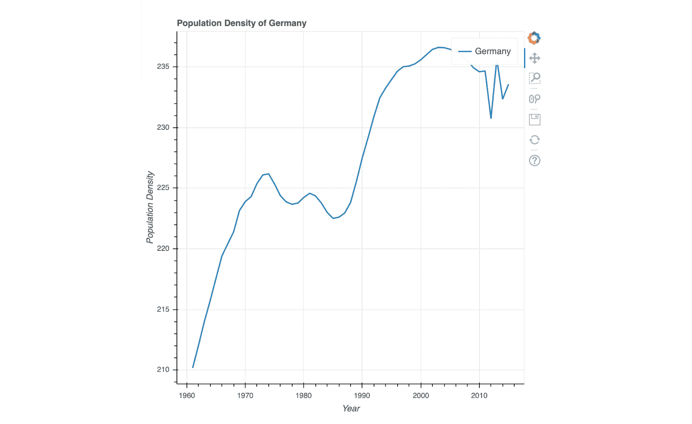

# 六、让事物与 Bokeh 互动

## 学习目标

本章结束时，您将能够:

*   使用 Bokeh 创建有洞察力的基于网络的可视化
*   解释两种绘图界面的区别
*   确定何时使用 Bokeh 服务器
*   创建交互式可视化

在本章中，我们将使用 Bokeh 库设计交互式图。

## 简介

**Bokeh** 从 2013 年就有了，2018 年发布了 1.0.4 版本。它的目标是现代网络浏览器向用户呈现交互式可视化，而不是静态图像。以下是 Bokeh 的一些特点:

*   **简单可视化**:通过其不同的界面，针对多种技能水平的用户，从而为快速简单的可视化提供了一个 API，但也提供了更复杂且极具可定制性的可视化。
*   **出色的动画可视化**:它提供了高性能，因此可以处理大型甚至流式数据集，这使得它成为动画可视化和数据分析的首选。
*   **交互可视化交互**:这是一种基于网络的方法，可以很容易地将几个绘图结合起来，创建独特而有影响力的仪表板，并带有可以相互连接的可视化，以创建交互可视化交互。
*   **支持多种语言**:除了 Matplotlib 和 geoplotlib，Bokeh 不仅有 Python 的库，还有 JavaScript 本身的库，以及其他几种流行的语言。
*   **执行任务的多种方式**:前面提到的交互性可以通过多种方式添加。最简单的内置方式是可以在可视化中缩放和平移，这已经让用户可以更好地控制他们想要看到的内容。除此之外，我们还可以授权用户过滤和转换数据。
*   **漂亮的图表造型**:技术栈基于后端的 Tornado，由前端的 D3 提供动力，解释了图表漂亮的默认造型。

由于我们在整本书中都在使用 Jupyter Notebook，值得一提的是，Bokeh，包括它的交互性，在 Notebook 中是原生支持的。

### Bokeh 概念

Bokeh 的基本概念在某些方面可以与 Matplotlib 相媲美。在 Bokeh 中，我们有一个图形作为根元素，它有子元素，如标题、轴和**字形**。字形必须添加到图形中，图形可以采用不同的形状，如圆形、条形和三角形来表示图形。以下层次结构显示了 Bokeh 的不同概念:


###### 图 6.1:Bokeh 概念

### Bokeh 的界面

基于界面的方法为用户提供了不同程度的复杂性，这些用户要么只是想要创建一些具有极少可定制参数的基本图，要么想要完全控制其可视化并想要定制其图的每个元素。这种分层方法分为两个级别:

*   **标绘**:此图层可自定义。
*   **Models interface**: This layer is complex and provides an open approach to designing charts.

    #### 注意

    模型界面是所有绘图的基本构件。

以下是接口中分层方法的两个级别:

*   **bokeh.plotting**

    这个中级接口有一个类似于 Matplotlib 的 API。工作流程是创建一个图形，然后用不同的字形丰富这个图形，这些字形在图形中呈现数据点。与 Matplotlib 类似，轴、网格和**检查器**等子元素的合成(它们提供了通过缩放、平移和悬停来浏览数据的基本方式)无需额外配置即可完成。

    这里需要注意的重要一点是，即使它的设置是自动完成的，我们也能够配置这些子元素。使用该界面时， **BokehJS** 使用的场景图的创建也是自动处理的。

*   **bokeh.models**

    这个低级接口由两个库组成:称为 **BokehJS** 的 JavaScript 库，用于在浏览器中显示图表，以及提供开发人员界面的 Python 库。在内部，Python 中创建的定义创建了 JSON 对象，这些对象保存了浏览器中 JavaScript 表示的声明。

    模型界面展示了对 Bokeh 绘图和**小部件**(使用户能够与显示的数据交互的元素)的组装和配置的完全控制。这意味着开发人员有责任确保**场景图**(描述可视化的对象集合)的正确性。

### 输出

输出 Bokeh 图很简单。根据您的需求，有三种方法可以做到这一点:

*   `.show()`方法:基本选项是在一个 HTML 页面中简单显示绘图。这是通过。`show()`方法。
*   内联`.show()`方法:使用 Jupyter Notebook 时，`.show()`方法将允许您在笔记本内显示图表(使用内联绘图时)。
*   `.output_file()`方法:您也可以使用`.output_file()`方法直接将可视化保存到文件中，而没有任何开销。这将在给定的路径上用给定的名称创建一个新文件。

提供可视化的最有力的方法是使用 Bokeh 服务器。

### Bokeh 服务器

正如我们之前提到的，Bokeh 创建**场景图** JSON 对象，BokehJS 库将解释这些对象以创建可视化输出。此过程允许您为其他语言创建统一的格式，以创建相同的 Bokeh 图和可视化效果，与所使用的语言无关。

如果我们想得更远一点，如果我们也能保持可视化彼此同步呢？这将使我们能够创建更复杂的可视化方式，并利用 Python 提供的工具。我们不仅可以过滤数据，还可以在服务器端进行计算和操作，这将实时更新可视化。

除此之外，由于我们有了一个数据入口点，我们可以创建由流而不是静态数据集提供的可视化。这种设计使我们能够拥有功能更强大的更复杂的系统。

看一下这个架构的方案，我们可以看到文档是在服务器端提供的，然后转移到浏览器客户端，浏览器客户端再将其插入到 BokehJS 库中。这个插入将触发 BokehJS 的解释，然后 BokehJS 将创建可视化本身。下图描述了博凯服务器的工作情况:


###### 图 6.2:Bokeh 服务器的工作原理

### 演示

在 Bokeh 中，演示文稿通过使用不同的功能，如交互、样式、工具和布局，帮助使可视化更具交互性。

**互动**

Bokeh 最有趣的特点可能是它的交互。基本上有两种交互方式:**被动**和**主动**。

被动交互是用户可以采取的既不改变数据也不改变显示数据的动作。在 Bokeh，这被称为**检查员**。正如我们之前提到的，检查器包含缩放、平移和悬停在数据上等属性。这种工具允许用户进一步检查其数据，并且可能通过只查看可视化数据点的放大子集来获得更好的见解。

主动交互是直接改变显示数据的动作。这包括选择数据子集或基于参数过滤数据集等操作。**小部件**是最突出的活跃交互，因为它们允许用户简单地用处理程序操作显示的数据。小部件可以是按钮、滑块和复选框等工具。回到关于输出样式的小节，这些小部件可以在两者中使用——所谓的独立应用和 Bokeh 服务器。这将有助于我们巩固最近学习的理论概念，使事情更加清晰。Bokeh 中的一些交互是选项卡窗格、下拉列表、多选、单选按钮组、文本输入、检查按钮组、数据表和滑块。

### 积分

嵌入 Bokeh 可视化有两种形式，如下所示:

**HTML 文档**:这些是独立的 HTML 文档。这些文件非常完备。

**Bokeh 应用**:它们由 Bokeh Server 支持，这意味着它们提供了连接的可能性，例如:用于更高级可视化的 Python 工具。

与带有 Seaborn 的 Matplotlib 相比，Bokeh 有点复杂，并且像其他库一样有它的缺点，但是一旦您关闭了基本的工作流程，您就能够利用 Bokeh 带来的好处，这些好处是您可以通过简单地添加交互功能并为用户提供动力来扩展视觉表示的方式。

#### 注意

一个有趣的特性是`to_bokeh`方法，它允许你在没有配置开销的情况下用 Bokeh 绘制 Matplotlib 图形。有关该方法的更多信息，请访问以下链接:[https://bokeh . pydata . org/en/0 . 12 . 3/docs/user _ guide/compat . html](https://bokeh.pydata.org/en/0.12.3/docs/user_guide/compat.html)。

在接下来的练习和活动中，我们将巩固理论知识并构建几个简单的可视化来理解 Bokeh 及其两个界面。在我们介绍了基本用法之后，我们将比较绘图和`models`界面，看看使用它们的区别，并使用向可视化添加交互性的小部件。

#### 注意

本章中的所有练习和活动都是使用 Jupyter 笔记本和 Jupyter 实验室开发的。文件可从以下链接下载:[https://bit.ly/2T3Afn1](https://bit.ly/2T3Afn1)。

### 练习 9:与 Bokeh 一起绘图

在本练习中，我们希望使用更高级别的界面，该界面侧重于为快速可视化创建提供一个简单的界面。参考介绍，用 Bokeh 的不同接口进行回查。在本练习中，我们将使用`world_population`数据集。这个数据集显示了多年来不同国家的人口。我们将使用绘图界面深入了解德国和瑞士的人口密度:

1.  从`Lesson06`文件夹打开`exercise09_solution.ipynb` Jupyter 笔记本，执行本练习。为此，您需要在命令行终端中导航到该文件的路径，并键入`jupyter-lab.`
2.  如前所述，我们将在本练习中使用绘图界面。我们必须从绘图中导入的唯一元素是图形(将初始化绘图)和`show`方法(显示绘图):

    ```py
    # importing the necessary dependencies
    import pandas as pd
    from bokeh.plotting import figure, show
    ```

3.  需要注意的一点是，如果我们想在 Jupyter 笔记本中显示我们的绘图，我们还必须从 Bokeh 的`io`界面导入并调用`output_notebook`方法:

    ```py
    # make bokeh display figures inside the notebook
    from bokeh.io import output_notebook
    output_notebook()
    ```

4.  用熊猫加载我们的`world_population`数据集:

    ```py
    # loading the dataset with pandas
    dataset = pd.read_csv('./data/world_population.csv', index_col=0)
    ```

5.  A quick test by calling `head` on our DataFrame shows us that our data has been successfully loaded:

    ```py
    # looking at the dataset
    dataset.head()
    ```

    下图显示了前面代码的输出:

    

    ###### 图 6.3:使用 head 方法加载世界人口数据集的前五行

6.  为了填充我们的 x 轴和 y 轴，我们需要做一些数据提取。x 轴将包含我们专栏中的所有年份。y 轴将保存各国的人口密度值。我们从德国开始:

    ```py
    # preparing our data for Germany
    years = [year for year in dataset.columns if not year[0].isalpha()] de_vals = [dataset.loc[['Germany']][year] for year in years]
    ```

7.  After extracting the wanted data, we can create a new plot by calling the Bokeh figure method. By providing parameters such as `title`, `x_axis_label`, and `y_axis_label`, we can define the descriptions displayed on our plot. Once our plot is created, we can add glyphs to it. In our example, we will use a simple line.By providing the `legend` parameter next to the x and y values, we get an informative legend in our visualization:

    ```py
    # plotting the population density change in Germany in the given years
    plot = figure(title='Population Density of Germany', x_axis_label='Year', y_axis_label='Population Density')
    plot.line(years, de_vals, line_width=2, legend='Germany')
    show(plot)
    ```

    下图显示了前面代码的输出:

    

    ###### 图 6.4:根据德国的人口密度数据创建线图

8.  我们现在想添加另一个国家。在这种情况下，我们将使用`Switzerland`。我们将使用与`Germany`相同的技术提取`Switzerland` :

    ```py
    # preparing the data for the second country
    ch_vals = [dataset.loc[['Switzerland']][year] for year in years]
    ```

    的数据
9.  We can simply add several layers of glyphs on to our figure plot. We can also stack different glyphs on top of one another, thus giving specific data-improved visuals. In this case, we want to add an orange line to our plot that displays the data from `Switzerland`. In addition to that, we also want to have circles for each entry in the data, giving us a better idea about where the actual data points reside. By using the same legend name, Bokeh creates a combined entry in the legend:

    ```py
    # plotting the data for Germany and Switzerland in one visualization, 
    # adding circles for each data point for Switzerland
    plot = figure(title='Population Density of Germany and Switzerland', x_axis_label='Year', y_axis_label='Population Density')
    plot.line(years, de_vals, line_width=2, legend='Germany')
    plot.line(years, ch_vals, line_width=2, color='orange', legend='Switzerland')
    plot.circle(years, ch_vals, size=4, line_color='orange', fill_color='white', legend='Switzerland')
    show(plot)
    ```

    下图显示了前面代码的输出:

    

    ###### 图 6.5:将瑞士添加到图中

10.  When looking at a larger amount of data for different countries, it makes sense to have a plot for each of them separately. This can be achieved by using one of the layout interfaces. In this case, we are using the `gridplot`:

    ```py
    # plotting the Germany and Switzerland plot in two different visualizations
    # that are interconnected in terms of view port
    from bokeh.layouts import gridplot
    plot_de = figure(title='Population Density of Germany', x_axis_label='Year', y_axis_label='Population Density', plot_height=300)
    plot_ch = figure(title='Population Density of Switzerland', x_axis_label='Year', y_axis_label='Population Density', plot_height=300, x_range=plot_de.x_range, y_range=plot_de.y_range)
    plot_de.line(years, de_vals, line_width=2)
    plot_ch.line(years, ch_vals, line_width=2)
    plot = gridplot([[plot_de, plot_ch]])
    show(plot)
    ```

    下图显示了前面代码的输出:

    

    ###### 图 6.6:使用网格点显示相邻的国家绘图

11.  As the name suggests, we can arrange the plots in a grid. This also means that we can quickly get a vertical display when changing the two-dimensional list that was passed to the `gridplot` method:

    ```py
    # plotting the above declared figures in a vertical manner
    plot_v = gridplot([[plot_de], [plot_ch]])
    show(plot_v)
    ```

    下面的屏幕截图显示了前面代码的输出:


###### 图 6.7:使用 gridplot 方法垂直排列可视化效果

恭喜你！我们刚刚介绍了 Bokeh 的基础知识。使用`plotting`界面可以很容易地快速可视化。这确实有助于您理解正在处理的数据。

然而，这种简单是通过抽象出复杂性来实现的。我们通过使用`plotting`界面失去了很多控制。在下一个练习中，我们将比较`plotting`和`models`界面，向您展示`plotting`增加了多少抽象。

### 练习 10:比较绘图和模型界面

在本练习中，我们要比较两个界面:**绘制**和**模型**。我们将通过使用高级绘图界面创建基本绘图来比较它们，然后使用低级模型界面重新创建该绘图。这将向我们展示这两个界面之间的差异，并为我们后面的练习提供一个很好的方向，以了解如何使用`models`界面:

1.  从`Lesson06`打开 Jupyter 笔记本`exercise10_solution.ipynb`进行本练习。为此，您需要再次导航到该文件的路径。在命令行终端中，键入`jupyter-lab`。
2.  如前所述，本练习将使用`plotting`界面。我们必须从绘图中导入的唯一元素是`figure`(将初始化绘图)和`show`方法(显示绘图):

    ```py
    # importing the necessary dependencies
    import numpy as np
    import pandas as pd
    ```

3.  需要注意的一点是，如果我们想在 Jupyter 笔记本中显示我们的绘图，我们还必须从 Bokeh 的`io`界面导入并调用`output_notebook`方法:

    ```py
    # make bokeh display figures inside the notebook
    from bokeh.io import output_notebook
    output_notebook()
    ```

4.  就像我们之前做的几次一样，我们将使用熊猫来加载我们的`world_population`数据集:

    ```py
    # loading the dataset with pandas
    dataset = pd.read_csv('./data/world_population.csv', index_col=0)
    ```

5.  A quick test by calling `head` on our DataFrame shows us that our data has been successfully loaded:

    ```py
    # looking at the dataset
    dataset.head()
    ```

    下面的屏幕截图显示了前面代码的输出:

    

    ###### 图 6.8:使用 head 方法加载世界人口数据集的前五行

6.  在这部分练习中，我们将使用之前看到的`plotting`界面。正如我们之前看到的，我们基本上只需要导入`figure`来创建，`show`来显示我们的绘图:

    ```py
    # importing the plotting dependencies 
    from bokeh.plotting import figure, show
    ```

7.  我们的数据在两个图中都保持不变，因为我们只想改变我们创建可视化的方式。我们需要以列表的形式显示数据集中的年份、整个数据集每年的平均人口密度以及`Japan` :

    ```py
    # preparing our data of the mean values per year and Japan
    years = [year for year in dataset.columns if not year[0].isalpha()]
    mean_pop_vals = [np.mean(dataset[year]) for year in years]
    jp_vals = [dataset.loc[['Japan']][year] for year in years]
    ```

    的每年平均人口密度
8.  When using the `plotting` interface, we can create a plot element that gets all the attributes about the plot itself, such as the title and axis labels. We can then use the plot element and "apply" our `glyphs` elements to it. In this case, we will plot the global mean with a line and the mean of `Japan` with crosses:

    ```py
    # plotting the global population density change and the one for Japan 
    plot = figure(title='Global Mean Population Density compared to Japan', x_axis_label='Year', y_axis_label='Population Density')
    plot.line(years, mean_pop_vals, line_width=2, legend='Global Mean')
    plot.cross(years, jp_vals, legend='Japan', line_color='red')
    show(plot)
    ```

    下面的屏幕截图显示了前面代码的输出:


###### 图 6.9:全球平均人口密度与日本人口密度的对比线图

正如我们在前面的图表中看到的，我们已经有了许多元素。这意味着我们已经有了正确的 x 轴标签，y 轴的匹配范围，我们的图例被很好地放置在右上角，没有太多的配置。

**使用模型界面**

1.  与其他接口相比，`models`接口的级别要低得多。我们已经可以看到这一点时，看看进口清单，我们需要一个可比的阴谋。在列表中，我们可以看到一些熟悉的名字，如`Plot`、`Axis`、`Line`、`Cross` :

    ```py
    # importing the models dependencies 
    from bokeh.io import show
    from bokeh.models.grids import Grid
    from bokeh.models.plots import Plot 
    from bokeh.models.axes import LinearAxis
    from bokeh.models.ranges import Range1d
    from bokeh.models.glyphs import Line, Cross
    from bokeh.models.sources import ColumnDataSource
    from bokeh.models.tickers import SingleIntervalTicker, YearsTicker
    from bokeh.models.renderers import GlyphRenderer
    from bokeh.models.annotations import Title, Legend, LegendItem
    ```

2.  在构建我们的图之前，我们必须找出 y 轴的`min`和`max`值，因为我们不想有太大或太小的值范围。因此，我们得到全局和`Japan`的所有平均值，没有任何无效值，然后得到它们的最小值和最大值。然后这些值被传递给`Range1d`的构造器，它会给我们一个范围，以后可以在绘图构造中使用。对于 x 轴，我们预先定义了我们的年份列表:

    ```py
    # defining the range for the x and y axis
    extracted_mean_pop_vals = [val for i, val in enumerate(mean_pop_vals) if i not in [0, len(mean_pop_vals) - 1]]
    extracted_jp_vals = [jp_val['Japan'] for i, jp_val in enumerate(jp_vals) if i not in [0, len(jp_vals) - 1]]
    min_pop_density = min(extracted_mean_pop_vals)
    min_jp_densitiy = min(extracted_jp_vals)
    min_y = int(min(min_pop_density, min_jp_densitiy))
    max_pop_density = max(extracted_mean_pop_vals)
    max_jp_densitiy = max(extracted_jp_vals)
    max_y = int(max(max_jp_densitiy, max_pop_density))
    xdr = Range1d(int(years[0]), int(years[-1]))
    ydr = Range1d(min_y, max_y)
    ```

3.  一旦我们有了 y 轴的`min`和`max`值，我们就可以创建两个`Axis`对象，用于显示轴线和轴的标签。由于我们还需要不同值之间的刻度，我们必须传入一个`Ticker`对象，为我们创建这个设置:

    ```py
    # creating the axis
    axis_def = dict(axis_line_color='#222222', axis_line_width=1, major_tick_line_color='#222222', major_label_text_color='#222222',major_tick_line_width=1)
    x_axis = LinearAxis(ticker = SingleIntervalTicker(interval=10), axis_label = 'Year', **axis_def)
    y_axis = LinearAxis(ticker = SingleIntervalTicker(interval=50), axis_label = 'Population Density', **axis_def)
    ```

4.  创建标题和绘图本身很简单。我们可以将一个`Title`对象传递给`Plot`对象的标题属性:

    ```py
    # creating the plot object
    title = Title(align = 'left', text = 'Global Mean Population Density compared to Japan')
    plot = Plot(x_range=xdr, y_range=ydr, plot_width=650, plot_height=600, title=title)
    ```

5.  If we try to display our plot now using the show method, we will get an error, since we have no renderers defined at the moment. First, we need to add elements to our plot:

    ```py
    # error will be thrown because we are missing renderers that are created when adding elements
    show(plot)
    ```

    下面的屏幕截图显示了前面代码的输出:

    

    ###### 图 6.10:带标题的空图

6.  当处理数据时，我们总是需要将数据插入到数据源对象中。这可用于将数据源映射到将在绘图中显示的字形对象:

    ```py
    # creating the data display
    line_source = ColumnDataSource(dict(x=years, y=mean_pop_vals))
    line_glyph = Line(x='x', y='y', line_color='#2678b2', line_width=2)
    cross_source = ColumnDataSource(dict(x=years, y=jp_vals))
    cross_glyph = Cross(x='x', y='y', line_color='#fc1d26')
    ```

7.  向图中添加对象时，必须使用正确的`add`方法。对于布局元素，如`Axis`对象，我们必须使用`add_layout`方法。显示我们数据的`Glyphs`必须用`add_glyph`方法添加:

    ```py
    # assembling the plot
    plot.add_layout(x_axis, 'below')
    plot.add_layout(y_axis, 'left')
    line_renderer = plot.add_glyph(line_source, line_glyph)
    cross_renderer = plot.add_glyph(cross_source, cross_glyph)
    ```

8.  If we now try to show our plot, we can finally see that our lines are in place:

    ```py
    show(plot)
    ```

    下面的屏幕截图显示了前面代码的输出:

    

    ###### 图 6.11:显示直线和轴的基于模型界面的图

9.  仍然缺少一些元素。其中一个是右上角的传说。为了给我们的绘图增加一个传奇，我们又不得不使用一个对象。每个`LegendItem`对象将在图例中显示为一行:

    ```py
    # creating the legend
    legend_items= [LegendItem(label='Global Mean', renderers=[line_renderer]), LegendItem(label='Japan', renderers=[cross_renderer])]
    legend = Legend(items=legend_items, location='top_right')
    ```

10.  创建网格很简单:我们只需为 x 轴和 y 轴实例化两个`Gridobjects`。这些网格将获得之前创建的 x 轴和 y 轴的刻度:

    ```py
    # creating the grid
    x_grid = Grid(dimension=0, ticker=x_axis.ticker)
    y_grid = Grid(dimension=1, ticker=y_axis.ticker)
    ```

11.  To add the last final touches, we, again, use the `add_layout` method to add the grid and the legend to our plot. After this, we can finally display our complete plot, which will look like the one we created in the first task, with only four lines of code:

    ```py
    # adding the legend and grids to the plot
    plot.add_layout(legend)
    plot.add_layout(x_grid)
    plot.add_layout(y_grid)
    show(plot)
    ```

    下面的屏幕截图显示了前面代码的输出:


###### 图 6.12:用绘图界面完成可视化的完全再现

恭喜你！可以看到，`models`界面不应该用于简单的绘图。它旨在为有特定需求的经验丰富的用户提供 Bokeh 的全部功能，这些用户需要的不仅仅是`plotting`界面。之前看过`models`界面，在我们的下一个话题中会派上用场，这个话题是关于小部件的。

## 添加小部件

Bokeh 最强大的功能之一是它能够使用**小部件**来交互更改可视化中显示的数据。为了理解交互性在可视化中的重要性，想象一下看到一个关于股票价格的静态可视化，它只显示去年的数据。如果这是你专门搜索的，那就足够合适了，但如果你有兴趣看到当前年份，甚至视觉上将其与最近几年进行比较，那些绘图就行不通了，会增加额外的工作，因为你必须为每一年创建它们。将它与让用户选择想要的日期范围的简单图进行比较，我们已经可以看到它的优势。有无穷无尽的选项来组合小部件和讲述你的故事。您可以通过限制值并仅显示您希望它们看到的内容来指导用户。开发可视化背后的故事非常重要，如果用户有与数据交互的方式，那么这样做就容易得多。

Bokeh 小部件与 Bokeh 服务器结合使用时效果最佳。然而，使用 Bokeh 服务器方法超出了本书的内容，因为我们需要处理简单的 Python 文件，并且不能利用 Python 笔记本的功能。相反，我们将使用仅适用于旧的 Jupyter 笔记本的混合方法。

### 练习 11:基本交互小部件

*添加小部件*主题的第一个练习将向您温和地介绍不同的小部件，以及如何结合可视化使用它们的一般概念。我们将查看基本的小部件，并构建一个简单的图，显示所选股票的前 25 个数据点。可以通过下拉菜单更改显示的库存。

本练习的数据集是`stock_prices`数据集。这意味着我们将在一段时间内查看数据。由于这是一个大型且可变的数据集，因此在其上显示和解释不同的小部件(如滑块和下拉菜单)会更容易。该数据集在 GitHub 存储库的数据文件夹中可用；这是它的链接:https://bit.ly/2UaLtSV。

我们将查看不同的可用小部件以及如何使用它们，然后使用其中一个小部件构建一个基本的图。关于如何触发更新，有几个不同的选项，这些选项也将在下面的步骤中解释。下表解释了本练习中涉及的小部件:


###### 图 6.13:一些带有示例的基本小部件

1.  从`Lesson06`文件夹打开`exercise11_solution.ipynb` Jupyter 笔记本，执行本练习。由于在本例中我们需要使用 Jupyter Notebook，我们将在命令行中键入以下内容:`jupyter notebook.`
2.  将打开一个新的浏览器窗口，列出当前目录中的所有文件。点击`exercise11_solution.ipynb`，将在新的选项卡中打开。
3.  本练习将首先向您介绍基本的小部件，然后向您展示如何使用它们创建基本的可视化。因此，我们将在整个代码中的合适位置添加更多的导入。为了导入我们的数据集，我们需要熊猫:

    ```py
    # importing the necessary dependencies
    import pandas as pd
    ```

4.  同样，我们希望在 Jupyter 笔记本中显示我们的绘图，因此我们必须从 Bokeh 的`io`界面导入并调用`output_notebook`方法:

    ```py
    # make bokeh display figures inside the notebook
    from bokeh.io import output_notebook
    output_notebook()
    ```

5.  下载数据集并移动到本章的数据文件夹后，我们可以导入我们的`stock_prices.csv`数据:

    ```py
    # loading the Dataset with geoplotlib
    dataset = pd.read_csv('./data/stock_prices.csv')
    ```

6.  A quick test by calling `head` on our DataFrame shows us that our data has been successfully loaded:

    ```py
    # looking at the dataset
    dataset.head()
    ```

    下面的屏幕截图显示了前面代码的输出:

    

    ###### 图 6.14:使用 head 方法加载 stock_prices 数据集的前五行

7.  由于日期列没有关于小时、分钟和秒的信息，我们希望避免稍后在可视化中显示它们，而只显示年、月和日。因此，我们将创建一个保存日期值的格式化短版本的新列。请注意，单元格的执行将需要一些时间，因为它是一个相当大的数据集。请耐心等待:

    ```py
    # mapping the date of each row to only the year-month-day format
    from datetime import datetime
    def shorten_time_stamp(timestamp):
        shortened = timestamp[0]
        if len(shortened) > 10:
            parsed_date=datetime.strptime(shortened, '%Y-%m-%d %H:%M:%S')
            shortened=datetime.strftime(parsed_date, '%Y-%m-%d')
        return shortened
    dataset['short_date'] = dataset.apply(lambda x: shorten_time_stamp(x), axis=1)
    ```

8.  Taking another look at our updated dataset, we can see a new column called **short_date** that holds the date without the hour, minute, and second information:

    ```py
    # looking at the dataset with shortened date
    dataset.head()
    ```

    下面的屏幕截图显示了前面代码的输出:


###### 图 6.15:添加了`short_date`列的数据集

**查看基本部件**

1.  在第一个任务中，交互小部件添加了 IPython 的交互元素。我们必须特别导入它们:

    ```py
    # importing the widgets
    from ipywidgets import interact, interact_manual
    ```

2.  We'll be using the "syntactic sugar" way of adding a decorator to a method, that is, by using annotations. This will give us an interactive element that will be displayed below the executable cell. In this example, we'll simply print out the result of the interactive element:

    ```py
    # creating a checkbox
    @interact(Value=False)
    def checkbox(Value=False):
    print(Value)
    ```

    下面的屏幕截图显示了前面代码的输出:

    

    ###### 图 6.16:如果选中，交互式复选框将从假切换到真

    #### 注意

    `@interact()`被称为**装饰器**，它将带注解的方法包装到交互组件中。这允许我们显示下拉菜单的变化并做出反应。每当下拉列表的值发生变化时，就会执行该方法。

3.  一旦我们有了第一个元素，所有其他元素都是以完全相同的方式创建的，只是改变了装饰器中参数的数据类型。
4.  Use the following code for the dropdown:

    ```py
    # creating a dropdown
    options=['Option1', 'Option2', 'Option3', 'Option4']
    @interact(Value=options)
    def slider(Value=options[0]):
    print(Value)
    ```

    下面的屏幕截图显示了前面代码的输出:

    

    ###### 图 6.17:交互式下拉列表

    对输入文本使用以下代码:

    ```py
    # creating an input text
    @interact(Value='Input Text')
    def slider(Value):
    print(Value)
    ```

    下面的屏幕截图显示了前面代码的输出:

    

    ###### 图 6.18:交互式文本输入

    使用以下代码应用多个小部件:

    ```py
    # multiple widgets with default layout
    options=['Option1', 'Option2', 'Option3', 'Option4']
    @interact(Select=options, Display=False)
    def uif(Select, Display):
    print(Select, Display)
    ```

    下面的屏幕截图显示了前面代码的输出:

    

    ###### 图 6.19:默认情况下，垂直显示两个小部件

    使用以下代码应用 int 滑块:

    ```py
    # creating an int slider with dynamic updates
    @interact(Value=(0, 100))
    def slider(Value=0):
    print(Value)
    ```

    下面的屏幕截图显示了前面代码的输出:

    

    ###### 图 6.20:交互式 int 滑块

    使用以下代码应用一个在释放鼠标时触发的 int 滑块:

    ```py
    # creating an int slider that only triggers on mouse release
    from ipywidgets import IntSlider
    slider=IntSlider(min=0, max=100, continuous_update=False)
    @interact(Value=slider)
    def slider(Value=0.0):
    print(Value)
    ```

    下面的屏幕截图显示了前面代码的输出:

    

    ###### 图 6.21:只在鼠标释放时触发的交互式 int 滑块

    #### 注意:

    虽然图 6.20 和 6.21 的输出看起来是一样的，但在图 6.21 中，滑块仅在鼠标释放时触发。

5.  If we don't want to update our plot every time we change our widget, we can also use the `interact_manual` decorator, which adds an execution button to the output:

    ```py
    # creating a float slider 0.5 steps with manual update trigger
    @interact_manual(Value=(0.0, 100.0, 0.5))
    def slider(Value=0.0):
    print(Value)
    ```

    下面的屏幕截图显示了前面代码的输出:


###### 图 6.22:带有手动更新触发器的交互式 int 滑块

#### 注意

与之前的单元格相比，这个单元格包含`interact_manual`装饰器，而不是交互。这将添加一个执行按钮，它将触发值的更新，而不是每次更改都触发。这在处理较大的数据集时非常有用，因为重新计算的时间会很长。因此，您不想为每一个小步骤触发执行，而只想在选择了正确的值后触发执行。

**创建基本图并添加部件**

在本任务中，我们将使用股价数据集创建一个基本的可视化。这将是你的第一次交互式可视化，你可以动态改变显示在图表中的股票。我们将习惯于前面提到的交互小部件之一:下拉菜单。这将是我们可视化交互的要点:

1.  为了能够创建绘图，我们首先需要从绘图界面导入已经熟悉的图形和显示方法。由于我们也希望有一个面板有两个选项卡显示不同的绘图风格，我们还需要`models`界面中的`Panel`和`Tabs`类:

    ```py
    # importing the necessary dependencies 
    from bokeh.models.widgets import Panel, Tabs
    from bokeh.plotting import figure, show
    ```

2.  为了更好地构建我们的笔记本，我们想编写一个适应性强的方法，获取股票数据的一个子部分作为参数，并构建一个双标签`Pane`对象，让我们在可视化中的两个视图之间切换。第一个选项卡将包含给定数据的折线图，而第二个选项卡将包含相同数据的基于圆的表示。一个图例将显示当前查看股票的名称:

    ```py
    # method to build the tab-based plot
        def get_plot(stock):
    stock_name=stock['symbol'].unique()[0]
    line_plot=figure(title='Stock prices', 
    x_axis_label='Date', x_range=stock['short_date'],
    y_axis_label='Price in $USD')
    line_plot.line(stock['short_date'], stock['high'], legend=stock_name)
    line_plot.xaxis.major_label_orientation = 1
    circle_plot=figure(title='Stock prices', x_axis_label='Date', x_range=stock['short_date'], y_axis_label='Price in $USD')
    circle_plot.circle(stock['short_date'], stock['high'], legend=stock_name)
    circle_plot.xaxis.major_label_orientation = 1
    line_tab=Panel(child=line_plot, title='Line')
    circle_tab=Panel(child=circle_plot, title='Circles')
    tabs = Tabs(tabs=[ line_tab, circle_tab ])
    return tabs
    ```

3.  在我们建立交互之前，我们必须获得数据集中所有股票名称的列表。一旦我们这样做了，我们就可以使用这个列表作为交互元素的输入。随着下拉菜单的每次交互，我们显示的数据将会更新。为了简单起见，我们只想在这个任务中显示每只股票的前 25 个条目。默认情况下，应该显示苹果的股票。它在数据集中的符号是 **AAPL** :

    ```py
    # extracing all the stock names
    stock_names=dataset['symbol'].unique()
    ```

4.  We can now add the drop-down widget in the decorator and call the method that returns our visualization in the show method with the selected stock. This will give us a visualization that is displayed in a pane with two tabs. The first tab will display an interpolated line and the second tab will display the values as circles:

    ```py
    # creating the dropdown interaction and building the plot
    # based on selection
    @interact(Stock=stock_names)
        def get_stock_for(Stock='AAPL'):
    stock = dataset[dataset['symbol'] == Stock][:25]
    show(get_plot(stock))
    ```

    下面的屏幕截图显示了前面代码的输出:


###### 图 6.23:显示 AAPL 数据的行选项卡

下面的屏幕截图显示了步骤 16 中的代码输出:


###### 图 6.24:显示 AAPL 数据的圆形标签

#### 注意

我们已经可以看到每个日期都显示在 x 轴上。如果我们想显示更大的时间范围，我们必须定制 x 轴上的刻度。这可以使用 ticker 对象来完成。

恭喜你！我们刚刚介绍了小部件的基础知识以及如何在 Jupyter Notebook 中使用它们。

#### 注意

如果您想了解更多关于使用小部件的信息，以及在 Jupyter 中可以使用哪些小部件，可以参考这些链接:[【https://bit.ly/2Sx9txZ】](https://bit.ly/2Sx9txZ)和[https://bit.ly/2T4FcM1](https://bit.ly/2T4FcM1)。

### 活动 29:使用小部件扩展绘图

在这个活动中，你将结合你已经学到的关于 Bokeh 的知识。您还需要在与熊猫合作时获得的技能，以进行额外的数据帧处理。我们将创建一个交互式可视化，让我们探索 2016 年里约奥运会的最终结果。

我们的可视化将显示参与坐标系的每个国家，其中 x 轴代表赢得的奖牌数量，y 轴代表运动员数量。使用交互式小部件，我们将能够过滤掉显示的国家，包括赢得奖牌的最大数量和运动员轴的最大数量。

在选择使用哪种交互性时，有很多选择。我们将专注于只有两个小部件，以使您更容易理解概念。最终，我们将拥有一个可视化工具，允许我们根据各国在奥运会上获得的奖牌和运动员数量对其进行筛选，并将鼠标悬停在单个数据点上时，我们将获得关于每个国家的更多信息:

1.  从`Lesson06`文件夹打开`activity29.ipynb` Jupyter 笔记本，执行本活动。
2.  不要忘记使用`bokeh.io`界面启用到笔记本输出。导入熊猫并加载数据集。确保通过显示数据集的前五个元素来加载数据集。
3.  从 Bokeh 导入`figure`和`show`，从`ipywidgets`导入`interact`和`widgets`开始。
4.  当开始创建我们的可视化时，我们必须导入我们将要使用的工具。从 Bokeh 导入`figure`和`show`，从`ipywidgets`导入`interact`和`widgets`接口。
5.  提取必要的数据后，我们将设置交互元素。向下滚动，直到到达显示`getting the max amount of medals and athletes of all countries`的单元格。从数据集中提取这两个数字。
6.  提取最大奖牌数和运动员数后，创建最大运动员数的`IntSlider`(垂直方向)和最大奖牌数的`IntSlider`(水平方向)小部件。
7.  实施我们的绘图前的最后一步准备是设置`@interact`方法，它将显示整个可视化。我们将在这里编写的唯一代码是`get_plot`方法的返回值`show`，该方法获取所有交互元素值作为参数。
8.  在实现了修饰方法之后，我们现在可以在我们的笔记本中向上移动并使用`get_plot`方法。
9.  首先，我们希望过滤掉我们的国家数据集，该数据集包含所有将运动员放入`olympic games`的国家。我们需要检查他们的奖牌和运动员数量是否少于或等于我们作为参数传递的最大值。
10.  一旦过滤掉数据集，我们就可以创建数据源了。该数据源将用于工具提示和圆形标志符号的打印。
11.  之后，我们将使用图形方法创建一个新的图，该图具有以下属性:标题为`Rio Olympics 2016 - Medal comparison`，x_axis_label 为`Number of Medals`，y_axis_label 为`Num of Athletes.`
12.  最后一步是执行从`get_plot`单元格开始到底部的每个单元格，再次确保所有实现都被捕获。
13.  When executing the cell that contains the `@interact` decorator, you will see the scatter plot that displays a circle for every country displaying additional information such as the short code of the country, the amount of athletes, and the number of gold, silver, and bronze medals.

    #### 注意:

    这项活动的解决方案可以在第 315 页找到。

## 总结

在这一章中，我们看到了另一个以全新的焦点创建可视化的选项:基于网络的 Bokeh 图。我们还发现了一些方法，可以让我们的可视化更具互动性，真正给用户一个以完全不同的方式探索数据的机会。正如我们在本章第一部分中提到的，Bokeh 是一个相对较新的工具，它使开发人员能够使用他们最喜欢的语言来创建易于移植的网络可视化。在使用了 Matplotlib、Seaborn、geoplotlib 和 Bokeh 之后，我们可以看到一些公共接口和使用这些库的类似方式。了解了本书中介绍的工具后，理解新的绘图工具将变得简单。

在下一章，也是最后一章，我们将介绍一个新的、尚未覆盖的数据集，您将使用它来创建可视化。最后一章将让你巩固你在本书中学到的概念和工具，并进一步提高你的技能。