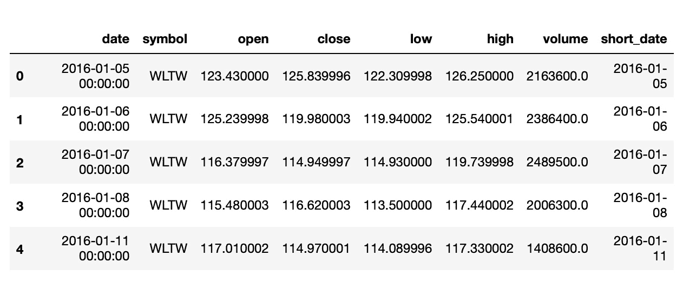

# 八、附录

## 关于

包括这一部分是为了帮助学生完成课程中的活动。它包括学生为实现活动目标而要执行的详细步骤。

## 第 1 章:数据可视化和数据探索的重要性

### 活动 1:使用 NumPy 计算给定数字的平均值、中值、方差和标准差

**解决方案:**

让我们使用 NumPy 来计算平均值、中位数、方差和标准差:

1.  导入必要的库:

    ```py
    # importing the necessary dependencies
    import numpy as np
    ```

2.  使用 NumPy 的`genfromtxt`方法加载`normal_distribution.csv`数据集:

    ```py
    # loading the dataset
    dataset = np.genfromtxt('./data/normal_distribution.csv', delimiter=',')
    ```

3.  First, we want to print a subset of the first two rows of the dataset:

    ```py
    # looking at the first two rows of the dataset
    dataset[0:2]
    ```

    前面代码的输出如下:

    

    ###### 图 1.22:数据集的前两行

4.  Once we know that our dataset has been successfully loaded, we can start solving our first task, which is calculating the mean of the third row.

    第三行可以通过索引`dataset[2]`进入:

    ```py
    # calculate the mean of the third row
    np.mean(dataset[2])
    ```

    前面代码的输出如下:

    

    ###### 图 1.23:第三行的平均值

5.  The last element of an ndarray can be indexed the same way a regular Python List can be accessed. `dataset[:, -1]` will give us the last column of every row:

    ```py
    # calculate the mean of the last column
    np.mean(dataset[:,-1])
    ```

    前面代码的输出如下:

    

    ###### 图 1.24:最后一列的平均值

6.  The double-indexing mechanism of NumPy gives us a nice interface to extract sub-selection. In this task, we are asked to get a sub-matrix of the first three elements of every row of the first three columns:

    ```py
    # calculate the mean of the intersection of the first 3 rows and first 3 columns
    np.mean(dataset[0:3, 0:3])
    ```

    前面代码的输出如下:

    

    ###### 图 1.25:交叉点的平均值

7.  Moving to the next set of tasks that cover the usage of the median, we will see that the API is consistent between the different methods.:

    ```py
    # calculate the median of the last row
    np.median(dataset[-1])
    ```

    前面代码的输出如下:

    

    ###### 图 1.26:最后一行的中位数

8.  Reverse indexing also works when defining a range. So, if we want to get the last three columns, we can use `dataset[:, -3:]`:

    ```py
    # calculate the median of the last 3 columns
    np.median(dataset[:, -3:])
    ```

    前面代码的输出如下:

    

    ###### 图 1.27:最后 3 列的中位数

9.  As we saw in the previous exercise, we can aggregate the values along an `axis`. If we want to calculate the rows, we use `axis=1`:

    ```py
    # calculate the median of each row
    np.median(dataset, axis=1)
    ```

    前面代码的输出如下:

    

    ###### 图 1.28:使用轴计算每行的中位数

10.  The last method we'll cover here is variance. Again, NumPy provides us with a consistent API, which makes doing this easy. To calculate the variance for each column, we have to use `axis 0`:

    ```py
    # calculate the variance of each column
    np.var(dataset, axis=0)
    ```

    前面代码的输出如下:

    

    ###### 图 1.29:每列的差异

11.  When only looking at a very small subset of the matrix (2x2) elements, we can apply what we learned in the statistical overview to observe that the value is way smaller than the whole dataset:

    #### 注意

    数据集的一小部分不显示整体的属性。

    ```py
    # calculate the variance of the intersection of the last 2 rows and first 2 columns
    np.var(dataset[-2:, :2])
    ```

    前面代码的输出如下:

    

    ###### 图 1.30:数据集一小部分的方差

12.  The values of the variance might seem a little bit strange at first.

    你可以随时回到*离差测量*主题来回顾你到目前为止所学的内容。

    记住，方差不是标准差:

    ```py
    # calculate the standard deviation for the dataset
    np.std(dataset)
    ```

    前面代码的输出如下:

    

###### 图 1.31:完整数据集的标准差

恭喜你！您已经使用 NumPy 完成了第一项活动。在接下来的活动中，这些知识将得到进一步巩固。

### 活动 2:索引、切片、拆分和迭代

**解决方案:**

让我们使用 NumPy 的特性来索引、切片、分割和迭代数组。

**索引**

1.  导入必要的库:

    ```py
    # importing the necessary dependencies
    import numpy as np
    ```

2.  使用 NumPy 加载`normal_distribution.csv`数据集。通过查看数组来确保一切正常，就像在前面的活动中一样:

    ```py
    # loading the Dataset
    dataset = np.genfromtxt('./data/normal_distribution.csv', delimiter=',') 
    ```

3.  First, we want to use simple indexing for the second row, as we did in our first exercise. For a clearer understanding, all the elements are saved to a variable:

    ```py
    # indexing the second row of the dataset (second row)
    second_row = dataset[1]
    np.mean(second_row)
    ```

    前面代码的输出如下:

    

    ###### 图 1.32:整个第二行平均值的截图

4.  Now, we need to reverse index the last row and calculate the mean of that row. Always remember that providing a negative number as the index value will index the list from the end:

    ```py
    # indexing the last element of the dataset (last row)
    last_row = dataset[-1]
    np.mean(last_row)
    ```

    前面代码的输出如下:

    

    ###### 图 1.33:计算最后一行的平均值

5.  Two-dimensional data can be accessed the same as with a Python List by using `[0][0]`, where the first pair of brackets accesses the row and the second one accesses the column.

    但是，我们也可以使用逗号分隔符号，如`[0, 0]:`

    ```py
    # indexing the first value of the second row (1st row, 1st value)
    first_val_first_row = dataset[0][0]
    np.mean(first_val_first_row)
    ```

    前面代码的输出如下:

    

    ###### 图 1.34:计算单个值的平均值不会出错

6.  The last value of the second last row can easily be accessed with reverse indexing. Remember that `-1` means the last element:

    ```py
    # indexing the last value of the second to last row (we want to use the combined access syntax here) 
    last_val_second_last_row = dataset[-2, -1]
    np.mean(last_val_second_last_row)
    ```

    前面代码的输出如下:

    

    ###### 图 1.35:逗号分隔符号的使用

    **切片**

7.  To create a 2x2 matrix that starts at the second row and second column, we use `[1:3, 1:3]`:

    ```py
    # slicing an intersection of 4 elements (2x2) of the first two rows and first two columns
    subsection_2x2 = dataset[1:3, 1:3]
    np.mean(subsection_2x2)
    ```

    前面代码的输出如下:

    

    ###### 图 1.36:2 x2 子集平均值的屏幕截图

8.  Introducing the second column into the indexing allows us to add another layer of complexity. The third value allows us to only select certain values like every other element by providing the value of 2\. This means it skips the values between and only takes each second element from the used list. In this task, we want to have every other element, so we provide an indexing of `::2`, which, as we already discussed, will take every other element of the whole list:

    ```py
    # selecting every second element of the fifth row 
    every_other_elem = dataset[6, ::2]
    np.mean(every_other_elem)
    ```

    前面代码的输出如下:

    

    ###### 图 1.37:选择第七行的每隔一个元素

9.  Negative numbers can also be used to reverse the elements in a slice:

    ```py
    # reversing the entry order, selecting the first two rows in reversed order
    reversed_last_row = dataset[-1, ::-1]
    np.mean(reversed_last_row)
    ```

    前面代码的输出如下:

    

###### 图 1.38:元素顺序相反的最后一行切片

**分裂**

1.  水平分割我们的数据可以用`hsplit`方法完成。请注意，如果数据集不能用给定的切片数分割，它将抛出一个错误:

    ```py
    # splitting up our dataset horizontally on indices one third and two thirds
    hor_splits = np.hsplit(dataset,(3)) 
    ```

2.  我们现在需要将前三分之一垂直分成两个相等的部分。还有一种`vsplit`方法正是这么做的；它的工作原理与`hsplit` :

    ```py
    # splitting up our dataset vertically on index 2
    ver_splits = np.vsplit(hor_splits[0],(2)) 
    ```

    相同
3.  When comparing the shapes, we can see that the subset has the required half of rows and the third half of columns:

    ```py
    # requested subsection of our dataset which has only half the amount of rows and only a third of the columns
    print("Dataset", dataset.shape)
    print("Subset", ver_splits[0].shape)
    ```

    前面代码的输出如下:

    

    ###### 图 1.39:比较原始数据集和子集的形状

    **迭代**

4.  Looking at the given piece of code, we can see that the index is simply incremented with each element.

    这仅适用于一维数据。如果我们想索引多维数据，这是行不通的:

    ```py
    # iterating over whole dataset (each value in each row)
    curr_index = 0
    for x in np.nditer(dataset):
        print(x, curr_index)
        curr_index += 1 
    ```

    前面代码的输出如下:

    

    ###### 图 1.40:迭代整个数据集

5.  `ndenumerate` is the right method to use for this task. In addition to the value, it returns the index. This works with multi-dimensional data, too:

    ```py
    # iterating over whole dataset with indices matching the position in the dataset
    for index, value in np.ndenumerate(dataset):
        print(index, value) 
    ```

    前面代码的输出如下:

    

###### 图 1.41:用多维数据枚举数据集

恭喜你！我们已经介绍了 NumPy 的大多数基本数据争论方法。在下一个活动中，我们将了解更高级的功能，这些功能将为您提供更好地了解数据的工具。

### 活动 3:过滤、排序、组合和整形

**解决方案:**

让我们使用 NumPy 的过滤功能对数据进行排序、堆叠、组合和整形:

1.  导入必要的库:

    ```py
    # importing the necessary dependencies
    import numpy as np
    ```

2.  Load the `normal_distribution.csv` dataset using NumPy. Make sure that everything works by having a look at the ndarray, like in the previous activity:

    ```py
    # loading the Dataset
    dataset = np.genfromtxt('./data/normal_distribution.csv', delimiter=',')
    ```

    **过滤**

3.  获取大于 105 的值可以通过在括号中提供条件来完成:

    ```py
    # values that are greater than 105
    vals_greater_five = dataset[dataset > 105]
    ```

4.  要使用更复杂的条件，我们可能要使用 NumPy 的`extract`方法。但是，我们也可以使用括号符号进行相同的检查:

    ```py
    # values that are between 90 and 95
    vals_between_90_95 = np.extract((dataset > 90) & (dataset < 95), dataset)
    ```

5.  The `where` method of `numpy` allows us to only get `indices (rows, cols)` for each of the matching values. In this task, we want to print them out nicely. We can combine `rows` with the respective `cols using List comprehension`. In this example, we have simply added the column to the respective row:

    ```py
    # indices of values that have a delta of less than 1 to 100
    rows, cols = np.where(abs(dataset - 100) < 1)
    one_away_indices = [[rows[index], cols[index]] for (index, _) in np.ndenumerate(rows)]
    ```

    #### 注意

    **列表理解**是 Python 映射数据的方式。它们是创建新列表的便捷符号，对旧列表的每个元素都应用了一些操作。

    例如，如果我们想将这个列表中每个元素的值增加一倍，`list = [1, 2, 3, 4, 5]`，我们将使用类似如下的列表理解:`doubled_list=[x*x for x in list]`。这将为我们提供以下列表:`[1, 4, 9, 16, 25]`。为了更好地理解列表理解，请访问[https://docs . python . org/3/tutorial/data structures . html #列表理解](https://docs.python.org/3/tutorial/datastructures.html#list-comprehensions)。

    **排序**

6.  对数据集中的每一行进行排序都是通过使用`sort`方法进行的。如笔记本中所述，这将始终采用最后一个轴，在这种情况下是每行排序的正确轴:

    ```py
    # values sorted for each row
    row_sorted = np.sort(dataset)
    ```

7.  对于多维数据，我们可以使用`axis`参数来定义应该对哪个数据集进行排序。`0`，在本例中，是指基于列的排序:

    ```py
    # values sorted for each column
    col_sorted = np.sort(dataset, axis=0)
    ```

8.  If we want to keep the order of our dataset and only want to know which indices the values in a sorted dataset would have, we can use `argsort`. In combination with fancy indexing, we can get access to sorted elements easily:

    ```py
    # indices of positions for each row
    index_sorted = np.argsort(dataset)
    ```

    **组合**

9.  Use combining features to add the second half of the first column back together, add the second column to our combined dataset, and add the third column to our combined dataset.

    ```py
    # split up dataset from activity03
    thirds = np.hsplit(dataset, (3))
    halfed_first = np.vsplit(thirds[0], (2))
    # this is the part we've sent the client in activity03
    halfed_first[0]
    ```

    前面代码的输出如下:

    

    ###### 图 1.42:分割数据集

10.  根据我们想要组合数据的方式，我们必须使用`vstack`或`hstack`。两者都将数据集列表堆叠在一起:

    ```py
    # adding the second half of the first column to the data
    first_col = np.vstack([halfed_first[0], halfed_first[1]])
    ```

11.  在 vstacking 分割数据集的后半部分后，我们再次将初始数据集的三分之一堆叠在一起。我们现在想将剩下的另外两个数据集添加到我们的`first_col`数据集。我们可以通过使用`hstack`方法来做到这一点，该方法将我们已经组合的`first_col`与三个分割数据集中的第二个:

    ```py
    # adding the second column to our combined dataset
    first_second_col = np.hstack([first_col, thirds[1]])
    ```

    相结合
12.  To reassemble our initial dataset, one third is still missing. We can `hstack` the last one-third column onto our dataset, which is the same thing we did with our second-third column in the previous step:

    ```py
    # adding the third column to our combined dataset
    full_data = np.hstack([first_second_col, thirds[2]])
    ```

    **重塑**

13.  第一个子任务是将数据集重塑为单个列表。这是使用`reshape`方法完成的:

    ```py
    # reshaping to a list of values
    single_list = np.reshape(dataset, (1, -1))
    ```

14.  如果我们为我们不知道的维度提供-1，NumPy 会自己计算出这个维度:

    ```py
    # reshaping to a matrix with two columns
    two_col_dataset = dataset.reshape(-1, 2)
    ```

### 活动 4:用熊猫计算给定数字的平均值、中位数和方差

**解决方案:**

让我们利用熊猫的特征，如平均值、中位数和方差，对我们的数据进行一些计算:

1.  导入必要的库:

    ```py
    # importing the necessary dependencies
    import pandas as pd
    ```

2.  导入熊猫后，我们可以使用`read_csv`方法加载前面提到的数据集。我们希望使用包含国家名称的第一列作为我们的索引。我们将使用`index_col`参数。整行应该是这样的:

    ```py
    # loading the Dataset
    dataset = pd.read_csv('./data/world_population.csv', index_col=0)
    ```

3.  First, we want to print a subset of the dataset with the first two rows. We can, again, use the Python List syntax to create a subset of the DataFrame of the first two rows:

    ```py
    # looking at the first two rows of the dataset
    dataset[0:2]
    ```

    前面代码的输出如下:

    

    ###### 图 1.43:打印的前两行

4.  Once we know that our dataset has been successfully loaded, we can start solving the given tasks.

    第三行可以通过索引`dataset.iloc[[2]]`来访问。要获得国家的平均值而不是年度列，我们需要通过`axis`参数:

    ```py
    # calculate the mean of the third row
    dataset.iloc[[2]].mean(axis=1)
    ```

    前面代码的输出如下:

    

    ###### 图 1.44:计算第三行的平均值

5.  The last element of a DataFrame can, just like with NumPy ndarrays and Python Lists, be indexed using `-1` as the index. So, `dataset.iloc[[-1]]` will give us the last row:

    ```py
    # calculate the mean of the last row
    dataset.iloc[[-1]].mean(axis=1)
    ```

    前面代码的输出如下:

    

    ###### 图 1.45:计算最后一行的平均值

6.  Besides using `iloc` to access rows based on their index, we can also use `loc`, which works based on the index column. This can be defined by using `index_col=0` in the `read_csv` call:

    ```py
    # calculate the mean of the country Germany
    dataset.loc[["Germany"]].mean(axis=1)
    ```

    前面代码的输出如下:

    

    ###### 图 1.46:对一个国家进行索引并计算德国的平均值

7.  Moving to the next set of tasks, which cover the usage of the median, we will see that the API is consistent between the different methods. This means that we have to keep providing `axis=1` to our method calls to make sure that we are aggregating for each country:

    ```py
    # calculate the median of the last row
    dataset.iloc[[-1]].median(axis=1)
    ```

    前面代码的输出如下:

    

    ###### 图 1.47:最后一行中值法的用法

8.  Slicing rows in pandas is similar to doing so in NumPy. We can use reverse indexing to get the last three columns with `dataset[-3:]`:

    ```py
    # calculate the median of the last 3 rows
    dataset[-3:].median(axis=1)
    ```

    前面代码的输出如下:

    

    ###### 图 1.48:最后三列的中位数

9.  When handling larger datasets, the order in which methods are executed matters. Think about what `head(10)` does for a moment. It simply takes your dataset and returns the first 10 rows in it, cutting down your input to the `mean()` method drastically.

    当使用更多内存密集型计算时，这肯定会产生影响，因此请注意顺序:

    ```py
    # calculate the median of the first 10 countries
    dataset.head(10).median(axis=1)
    ```

    前面代码的输出如下:

    

    ###### 图 1.49:使用轴计算前 10 行的中间值

10.  The last method we'll cover here is the variance. Again, pandas provides us with a consistent API, which makes its usage easy. Since we only want to display the last five columns, we will make use of the `tail` method:

    ```py
    # calculate the variance of the last 5 columns
    dataset.var().tail()
    ```

    前面代码的输出如下:

    

    ###### 图 1.50:最后五列之间的差异

11.  As mentioned in the introduction to pandas, it's interoperable with several features of NumPy.

    这里有一个如何在熊猫数据框中使用 NumPy`mean`方法的例子。在某些情况下，NumPy 有更好的功能，但 pandas 及其数据帧有更好的格式:

    ```py
    # NumPy pandas interoperability
    import numpy as np
    print("pandas", dataset["2015"].mean())
    print("numpy", np.mean(dataset["2015"]))
    ```

    前面代码的输出如下:

    

###### 图 1.51:对熊猫数据帧使用 NumPy 的平均方法

恭喜你！您已经完成了与熊猫的第一次活动，这向您展示了与 NumPy 和熊猫合作时的一些相似之处和不同之处。在接下来的活动中，这些知识将得到巩固。你还将被介绍熊猫更复杂的特征和方法。

### 活动 5:使用熊猫进行索引、切片和迭代

**解决方案:**

让我们使用索引、切片和迭代操作来显示 1970 年、1990 年和 2010 年德国、新加坡、美国和印度的人口密度。

**索引**

1.  导入必要的库:

    ```py
    # importing the necessary dependencies
    import pandas as pd
    ```

2.  导入熊猫后，我们可以使用`read_csv`方法加载上述数据集。我们希望使用包含国家名称的第一列作为我们的索引。我们将使用`index_col`参数。完整的一行应该是这样的:

    ```py
    # loading the dataset
    dataset = pd.read_csv('./data/world_population.csv', index_col=0)
    ```

3.  To index the row with the `index_col` "United States", we need to use the `loc` method:

    ```py
    # indexing the USA row
    dataset.loc[["United States"]].head()
    ```

    前面代码的输出如下:

    

    ###### 图 1.52:用 loc 方法索引美国

4.  Reverse indexing can also be used with pandas. To index the second to last row, we need to use the `iloc` method, which accepts int-type data, meaning an index:

    ```py
    # indexing the last second to last row by index
    dataset.iloc[[-2]]
    ```

    前面代码的输出如下:

    

    ###### 图 1.53:索引第二行到最后一行

5.  Columns are indexed using their header. This is the first line of the CSV file. To get the column with the header `2000`, we can use normal indexing. Remember, the `head()` method simply returns the first five rows:

    ```py
    # indexing the column of 2000 as a Series
    dataset["2000"].head()
    ```

    前面代码的输出如下:

    

    ###### 图 1.54:索引所有 2000 列

6.  Since the double brackets notation again returns a DataFrame, we can chain method calls to get distinct elements. To get the population density of India in 2000, we first want to get the data for the year 2000 and only then select India using the `loc()` method:

    ```py
    # indexing the population density of India in 2000 (Dataframe)
    dataset[["2000"]].loc[["India"]]
    ```

    前面代码的输出如下:

    

    ###### 图 1.55:2000 年印度的人口密度

7.  If we want to only retrieve a Series object, we have to replace the double brackets with single ones. This will give us the distinct value instead of the new DataFrame:

    ```py
    # indexing the population density of India in 2000 (Series)
    dataset["2000"].loc["India"]
    ```

    前面代码的输出如下:

    

    ###### 图 1.56:2000 年印度的人口密度

    **切片**

8.  To create a slice with the rows 2 to 5, we have to use the `iloc()` method again. We can simply provide the same slicing syntax as NumPy:

    ```py
    # slicing countries of rows 2 to 5
    dataset.iloc[1:5]
    ```

    前面代码的输出如下:

    

    ###### 图 1.57:第 2 行至第 5 行中的国家

9.  Using the `loc()` method, we can also access dedicated rows by their `index_col` (which was defined in the `read_csv` call). To get several rows in a new DataFrame, we can use the nested brackets to provide a list of elements:

    ```py
    # slicing rows Germany, Singapore, United States, and India 
    dataset.loc[["Germany", "Singapore", "United States", "India"]]
    ```

    前面代码的输出如下:

    

    ###### 图 1.58:切片国家德国、新加坡、美国和印度

10.  Since the double bracket queries return new DataFrames, we can chain methods and therefore access distinct subframes of our data:

    ```py
    # slicing a subset of Germany, Singapore, United States, and India 
    # for years 1970, 1990, 2010 <
    country_list = ["Germany", "Singapore", "United States", "India"]
    dataset.loc[country_list][["1970", "1990", "2010"]]
    ```

    前面代码的输出如下:

    

    ###### 图 1.59:1970 年、1990 年和 2010 年德国、新加坡、美国和印度的人口密度切片

    **迭代**

11.  To iterate our dataset and print out the countries up until `Angola`, we can use the `iterrows()` method. The index will be the name of our row, and the row will hold all columns:

    ```py
    # iterating over the first three countries (row by row)
    for index, row in dataset.iterrows():
        # only printing the rows until Angola
        if index == 'Angola':
            break
        print(index, '\n', row[["Country Code", "1970", "1990", "2010"]], '\n')
    ```

    前面代码的输出如下:

    

###### 图 1.60:迭代所有国家，直到安哥拉

恭喜你！我们已经介绍了大多数使用熊猫的基本数据争论方法。在下一个活动中，我们将了解更高级的功能，如过滤、排序和整形，为下一章做准备。

### 活动 6:过滤、排序和整形

**解决方案:**

让我们用熊猫来过滤、分类和重塑我们的数据。

**过滤**

1.  导入必要的库:

    ```py
    # importing the necessary dependencies
    import pandas as pd
    ```

2.  导入熊猫后，我们可以使用`read_csv`方法加载前面提到的数据集。我们希望使用包含国家名称的第一列作为我们的索引。我们将使用`index_col`参数。完整的一行应该是这样的:

    ```py
    # loading the dataset
    dataset = pd.read_csv('./data/world_population.csv', index_col=0)
    ```

3.  Instead of using the bracket syntax, we can also use the `filter` method to filter for specific items. Here, we also provide a list of elements that should be kept:

    ```py
    # filtering columns 1961, 2000, and 2015
    dataset.filter(items=["1961", "2000", "2015"]).head()
    ```

    前面代码的输出如下:

    

    ###### 图 1.61:过滤 1961 年、2000 年和 2015 年的数据

4.  If we want to filter for specific values in a specific column, we can use conditions. To get all countries that had a higher population density than 500 in 2000, we simply pass this condition in brackets:

    ```py
    # filtering countries that had a greater population density than 500 in 2000
    dataset[(dataset["2000"] > 500)][["2000"]]
    ```

    前面代码的输出如下:

    

    ###### 图 1.62:过滤掉 2000 列中大于 500 的值

5.  One powerful parameter of the `filter` method is `regex`. This allows us to search for arbitrary columns or rows (depending on the index given) that match a certain `regex`. To get all the columns that start with 2, we can simply pass `^2`, which means it starts with `2`:

    ```py
    # filtering for years 2000 and later
    dataset.filter(regex="^2", axis=1).head()
    ```

    前面代码的输出如下:

    

    ###### 图 1.63:检索从 2 开始的所有列

6.  Using the `axis` parameter, we can decide on which dimension the filtering should happen. To filter the rows instead of the columns, we can pass `axis=0`. This will be helpful for situations like when we want to filter all the rows that start with `A`:

    ```py
    # filtering countries that start with A
    dataset.filter(regex="^A", axis=0).head()
    ```

    前面代码的输出如下:

    

    ###### 图 1.64:检索以 A 开头的行

7.  If we want all the rows or columns that contain some specific value or character, we can use the `like` query. For example, if we want to have only countries that contain the word "land", such as Switzerland:

    ```py
    # filtering countries that contain the word land
    dataset.filter(like="land", axis=0).head()
    ```

    前面代码的输出如下:

    

    ###### 图 1.65:检索包含“土地”一词的所有国家

    **排序**

8.  Sorting in pandas can be done by using the `sort_values` or `sort_index` methods. If we want to get the countries with the lowest population density for a specific year, we can sort by this specific column:

    ```py
    # values sorted by column 1961
    dataset.sort_values(by=["1961"])[["1961"]].head(10)
    ```

    前面代码的输出如下:

    

    ###### 图 1.66:按 1961 年的值排序

9.  Just for comparison, we want to do the same sorting for `2015`. This will give us some nice insights into our data. We can see that the order of the countries with the lowest population density changed a bit, but that the first three entries are unchanged:

    ```py
    # values sorted by column 2015
    dataset.sort_values(by=["2015"])[["2015"]].head(10)
    ```

    前面代码的输出如下:

    

    ###### 图 1.67:基于 2015 年值的排序

10.  The default sorting order is `ascending`. This means that we have to provide a separate parameter if we want to sort in `descending` order, showing us the biggest values first:

    ```py
    # values sorted by column 2015 in descending order
    dataset.sort_values(by=["2015"], ascending=False)[["2015"]].head(10)
    ```

    前面代码的输出如下:

    

    ###### 图 1.68:按降序排序

    **重塑**

11.  As we mentioned before, reshaping data with pandas can be a very complex task, so we'll only do an easier reshape. We want to get DataFrames where the columns are `country codes` and the only row is the year `2015`. Since we only have one `2015` label, we need to duplicate it as many times as our dataset length. This will lead to every value receiving the 2015 row index:

    ```py
    # reshaping to 2015 as row and country codes as columns
    dataset_2015 = dataset[["Country Code", "2015"]]
    dataset_2015.pivot(index=["2015"] * len(dataset_2015), columns="Country Code", values="2015")
    ```

    前面代码的输出如下:

    

###### 图 1.69:对于 2015 年的值，将数据集重塑为单行

你现在已经完成了关于熊猫的主题，这一章到此结束。我们已经了解了帮助您争论和处理数据的基本工具。熊猫本身是一个令人难以置信的强大和大量使用的数据争论和理解工具。

## 第二章:关于绘图你需要知道的一切

### 活动 7:员工技能比较

**解决方案**:

1.  条形图和雷达图非常适合比较多个组的多个变量。
2.  **建议回应**:条形图对于比较不同员工的技能属性很有帮助，但是对于一个员工来说，不利于获得整体印象。雷达图非常适合比较员工和技能属性的价值。
3.  **Suggested response**:

    条形图:添加标题和标签，使用不同的颜色

    雷达图:为不同的员工增加一个标题和不同的颜色

### 活动 8:二十年来发生的道路事故

**解决方案**:

1.  **建议回应**:我们看一下图 2.20，可以看到 2015 年 1、7 月份事故数量已经减少到 100 起。4 月和 10 月发生了大约 300 起事故。
2.  **建议回应**:如果我们看一下每个月的趋势，也就是过去二十年的 1 月、4 月、7 月和 10 月，我们可以看到 1 月份发生的事故数量有减少的趋势。

**设计实践**:

*   选择视觉有问题的人容易看到的颜色和对比度，这样你的绘图就更具包容性。

### 活动 9:智能手机销售单位

**解决方案**:

1.  **建议回应**:如果对比一下三四季度各个厂商的表现，我们得出苹果表现异常出色的结论。与其他制造商相比，2016 年和 2017 年第三季度至第四季度，他们的销售单位都以更高的速度增长。
2.  **建议回应**:如果我们看一下各个厂商的销量走势，可以看到 2017 年第三季度之后，除了小米以外的所有公司的销量都出现了不一致的情况。如果看小米的表现，2017 年一季度之后一直有上升趋势。

### 活动 10:不同时间间隔的列车频率

**解决方案**:

1.  **建议回应**:如果我们关注前面的直方图，可以清楚的识别出大部分列车在下午 6 点和 8 点到达。
2.  **建议响应**:如果下午 4-6 点之间的列车数量增加 50 辆，柱状图将如下所示:


###### 图 2.45:下午 4-6 点之间列车班次增加 50

### 活动 11:确定理想的可视化

**解决方案:**

**首次可视化** : **建议响应:**

1.  提出的可视化有多个缺点:首先，饼图应该显示整体关系的一部分，这不是这个任务的情况，因为我们只考虑前 30 个优酷。其次，30 个值太多，无法在饼图中可视化。第三，切片不是按照大小排序的。此外，由于没有指定测量单位，因此很难量化切片。另一方面，在下面的横条图中，更容易看出每个 YouTube 频道的订户数量(百万):


###### 图 2.46:显示前 30 名优酷的水平条形图

**第二次可视化** : **建议响应:**

1.  这也是使用错误图表类型的一个例子。折线图用于比较没有任何时间关系的不同类别。此外，图例和标签等信息缺失。下图显示了应该如何使用比较条形图表示数据:


###### 图 2.47:显示两天赌场数据的比较条形图

## 第三章:深入 Matplotlib

### 活动 12:使用线图可视化股票趋势

**解决方案:**

让我们用一个线形图来可视化股票趋势:

1.  Open the `activity12_solution.ipynb` Jupyter Notebook from the `Lesson03` folder to implement this activity.

    导航到该文件的路径，并在命令行终端键入以下内容:`jupyter-lab`

2.  导入必要的模块，并在 Jupyter 笔记本中进行绘图:

    ```py
    # Import statements
    import matplotlib.pyplot as plt
    import numpy as np
    import pandas as pd
    %matplotlib inline
    ```

3.  使用熊猫读取数据文件夹中的数据。`read_csv()`功能将. csv 文件读入**数据框** :

    ```py
    # load datasets
    google = pd.read_csv('./data/GOOGL_data.csv')
    facebook = pd.read_csv('./data/FB_data.csv')
    apple = pd.read_csv('./data/AAPL_data.csv')
    amazon = pd.read_csv('./data/AMZN_data.csv')
    microsoft = pd.read_csv('./data/MSFT_data.csv')
    ```

4.  使用 **Matplotlib** 创建一个**折线图**，可视化所有五家公司过去五年的收盘价(整个数据序列)。添加标签、标题和图例，使可视化不言自明。使用`plt.grid()`功能为您的绘图添加网格:

    ```py
    # Create figure
    plt.figure(figsize=(16, 8), dpi=300)
    # Plot data
    plt.plot('date', 'close', data=google, label='Google')
    plt.plot('date', 'close', data=facebook, label='Facebook')
    plt.plot('date', 'close', data=apple, label='Apple')
    plt.plot('date', 'close', data=amazon, label='Amazon')
    plt.plot('date', 'close', data=microsoft, label='Microsoft')
    # Specify ticks for x and y axis
    plt.xticks(np.arange(0, 1260, 40), rotation=70)
    plt.yticks(np.arange(0, 1450, 100))
    # Add title and label for y-axis
    plt.title('Stock trend', fontsize=16)
    plt.ylabel('Closing price in $', fontsize=14)
    # Add grid
    plt.grid()
    # Add legend
    plt.legend()
    # Show plot
    plt.show()
    ```

### 活动 13:创建用于电影比较的条形图

**解决方案:**

让我们创建一个条形图来比较不同电影的评分:

1.  Open the `activity13_solution.ipynb` Jupyter Notebook from the `Lesson03` folder to implement this activity.

    导航到该文件的路径，并在命令行终端键入以下内容:`jupyter-lab.`

2.  导入必要的模块，并在 Jupyter 笔记本中进行绘图。；

    ```py
    # Import statements
    import numpy as np
    import pandas as pd
    import matplotlib.pyplot as plt
    %matplotlib inline
    ```

3.  用熊猫读取数据文件夹中的数据:

    ```py
    # Load dataset
    movie_scores = pd.read_csv('./data/movie_scores.csv')
    ```

4.  使用 Matplotlib 创建一个视觉上吸引人的条形图，比较所有五部电影的两个分数。使用电影标题作为 x 轴的标签。对 y 轴刻度使用 20 的间隔百分比，对 5 的间隔使用次要刻度。给绘图添加一个图例和合适的标题:

    ```py
    # Create figure
    plt.figure(figsize=(10, 5), dpi=300)
    # Create bar plot
    pos = np.arange(len(movie_scores['MovieTitle']))
    width = 0.3
    plt.bar(pos - width / 2, movie_scores['Tomatometer'], width, label='Tomatometer')
    plt.bar(pos + width / 2, movie_scores['AudienceScore'], width, label='Audience Score')
    # Specify ticks
    plt.xticks(pos, rotation=10)
    plt.yticks(np.arange(0, 101, 20))
    # Get current Axes for setting tick labels and horizontal grid
    ax = plt.gca()
    # Set tick labels
    ax.set_xticklabels(movie_scores['MovieTitle'])
    ax.set_yticklabels(['0%', '20%', '40%', '60%', '80%', '100%'])
    # Add minor ticks for y-axis in the interval of 5
    ax.set_yticks(np.arange(0, 100, 5), minor=True)
    # Add major horizontal grid with solid lines
    ax.yaxis.grid(which='major')
    # Add minor horizontal grid with dashed lines
    ax.yaxis.grid(which='minor', linestyle='--')
    # Add title
    plt.title('Movie comparison')
    # Add legend
    plt.legend()
    # Show plot
    plt.show()
    ```

5.  有些功能要求您明确指定**轴**。要获得对当前轴的引用，请使用`ax = plt.gca()`。对于 x 轴和 y 轴，可以分别使用`plt.xticks([xticks])`和`plt.yticks([yticks])`指定刻度。`Axes.set_xticklabels([labels])`和`Axes.set_yticklabels([labels])`可用于设置刻度标签。要添加次要的 y 记号，请使用`Axes.set_yticks([ticks], minor=True)`。要为主要刻度添加水平网格，请使用`Axes.yaxis.grid(which='major')`，要为次要刻度添加虚线水平网格，请使用`Axes.yaxis.grid(which='minor', linestyle='--')`。

### 活动 14:创建堆叠条形图以可视化餐厅表现

**解决方案:**

让我们创建一个堆叠条形图来可视化餐厅的表现:

1.  Open the `activity14_solution.ipynb` Jupyter Notebook from the `Lesson03` folder to implement this activity.

    导航到该文件的路径，并在命令行终端键入以下内容:`jupyter-lab.`

2.  导入必要的模块，并在 Jupyter 笔记本中进行绘图:

    ```py
    # Import statements
    import pandas as sb
    import numpy as np
    import matplotlib.pyplot as plt
    import seaborn as sns
    %matplotlib inline
    ```

3.  加载数据集:

    ```py
    # Load dataset
    bills = sns.load_dataset('tips')
    ```

4.  Use the given dataset and create a matrix where the elements contain the sum of the total bills for each day and smokers/non-smokers:

    ```py
    days = ['Thur', 'Fri', 'Sat', 'Sun']
    days_range = np.arange(len(days))
    smoker = ['Yes', 'No']
    bills_by_days = [bills[bills['day'] == day] for day in days]
    bills_by_days_smoker = [[bills_by_days[day][bills_by_days[day]['smoker'] == s] for s in smoker] for day in days_range]
    total_by_days_smoker = [[bills_by_days_smoker[day][s]['total_bill'].sum() for s in range(len(smoker))] for day in days_range]
    totals = np.asarray(total_by_days_smoker)
    ```

    这里，`asarray()`函数用于将任何给定的输入转换成数组。

5.  创建一个堆积条形图，将吸烟者和非吸烟者每天的总账单堆积在一起。添加图例、标签和标题:

    ```py
    # Create figure
    plt.figure(figsize=(10, 5), dpi=300)
    # Create stacked bar plot
    plt.bar(days_range, totals[:, 0], label='Smoker')
    plt.bar(days_range, totals[:, 1], bottom=totals[:, 0], label='Non-smoker')
    # Add legend
    plt.legend()
    # Add labels and title
    plt.xticks(days_range)
    ax = plt.gca()
    ax.set_xticklabels(days)
    ax.yaxis.grid()
    plt.ylabel('Daily total sales in $')
    plt.title('Restaurant performance')
    # Show plot
    plt.show()
    ```

### 活动 15:使用堆叠面积图比较智能手机销量

**解决方案:**

让我们使用堆叠面积图来比较智能手机制造商的销售单位:

1.  Open the `activity15_solution.ipynb` Jupyter Notebook from the `Lesson03` folder to implement this activity.

    导航到该文件的路径，并在命令行终端键入以下内容:`jupyter-lab.`

2.  导入必要的模块，并在 Jupyter 笔记本中进行绘图:

    ```py
    # Import statements
    import pandas as pd
    import numpy as np
    import matplotlib.pyplot as plt
    %matplotlib inline
    ```

3.  用熊猫读取数据文件夹中的数据:

    ```py
    # Load dataset
    sales = pd.read_csv('./data/smartphone_sales.csv')
    ```

4.  创建一个视觉上吸引人的堆叠面积图。添加图例、标签和标题:

    ```py
    # Create figure
    plt.figure(figsize=(10, 6), dpi=300)
    # Create stacked area chart
    labels = sales.columns[1:]
    plt.stackplot('Quarter', 'Apple', 'Samsung', 'Huawei', 'Xiaomi', 'OPPO', data=sales, labels=labels)
    # Add legend
    plt.legend()
    # Add labels and title
    plt.xlabel('Quarters')
    plt.ylabel('Sales units in thousands')
    plt.title('Smartphone sales units')
    # Show plot
    plt.show()
    ```

### 活动 16:使用直方图和箱线图来可视化智商

**解决方案:**

让我们使用直方图和箱线图来可视化不同群体的智商:

1.  Open the `activity16_solution.ipynb` Jupyter Notebook from the `Lesson03` folder to implement this activity.

    导航到该文件的路径，并在命令行终端键入以下内容:`jupyter-lab.`

2.  导入必要的模块，并在 Jupyter 笔记本中进行绘图:

    ```py
    # Import statements
    import numpy as np
    import matplotlib.pyplot as plt
    %matplotlib inline
    ```

3.  使用以下代码生成智商分数样本:

    ```py
    # IQ samples
    iq_scores = [126,  89,  90, 101, 102,  74,  93, 101,  66, 120, 108,  97,  98, 105, 119,  92, 113,  81, 104, 108,  83, 102, 105, 111, 102, 107, 103,  89,  89, 110,  71, 110, 120,  85, 111,  83, 122, 120, 102, 84, 118, 100, 100, 114,  81, 109,  69,  97,  95, 106, 116, 109, 114,  98,  90,  92,  98,  91,  81,  85,  86, 102,  93, 112,  76, 89, 110,  75, 100,  90,  96,  94, 107, 108,  95,  96,  96, 114, 93,  95, 117, 141, 115,  95,  86, 100, 121, 103,  66,  99,  96, 111, 110, 105, 110, 91, 112, 102, 112,  75]
    ```

4.  为给定的智商分数绘制一个包含 10 个面元的直方图。智商分数呈正态分布，平均值为 100，标准差为 15。将平均值可视化为垂直的红色实线，用垂直虚线表示标准偏差。添加标签和标题:

    ```py
    # Create figure
    plt.figure(figsize=(6, 4), dpi=150)
    # Create histogram
    plt.hist(iq_scores, bins=10)
    plt.axvline(x=100, color='r')
    plt.axvline(x=115, color='r', linestyle= '--')
    plt.axvline(x=85, color='r', linestyle= '--')
    # Add labels and title
    plt.xlabel('IQ score')
    plt.ylabel('Frequency')
    plt.title('IQ scores for a test group of a hundred adults')
    # Show plot
    plt.show()
    ```

5.  创建一个方框图来可视化相同的智商分数。添加标签和标题:

    ```py
    # Create figure
    plt.figure(figsize=(6, 4), dpi=150)
    # Create histogram
    plt.boxplot(iq_scores)
    # Add labels and title
    ax = plt.gca()
    ax.set_xticklabels(['Test group'])
    plt.ylabel('IQ score')
    plt.title('IQ scores for a test group of a hundred adults')
    # Show plot
    plt.show()
    ```

6.  以下是不同测试组的智商分数:

    ```py
    group_a = [118, 103, 125, 107, 111,  96, 104,  97,  96, 114,  96,  75, 114,
           107,  87, 117, 117, 114, 117, 112, 107, 133,  94,  91, 118, 110,
           117,  86, 143,  83, 106,  86,  98, 126, 109,  91, 112, 120, 108,
           111, 107,  98,  89, 113, 117,  81, 113, 112,  84, 115,  96,  93,
           128, 115, 138, 121,  87, 112, 110,  79, 100,  84, 115,  93, 108,
           130, 107, 106, 106, 101, 117,  93,  94, 103, 112,  98, 103,  70,
           139,  94, 110, 105, 122,  94,  94, 105, 129, 110, 112,  97, 109,
           121, 106, 118, 131,  88, 122, 125,  93,  78]
    group_b = [126,  89,  90, 101, 102,  74,  93, 101,  66, 120, 108,  97,  98,
                105, 119,  92, 113,  81, 104, 108,  83, 102, 105, 111, 102, 107,
                103,  89,  89, 110,  71, 110, 120,  85, 111,  83, 122, 120, 102,
                84, 118, 100, 100, 114,  81, 109,  69,  97,  95, 106, 116, 109,
                114,  98,  90,  92,  98,  91,  81,  85,  86, 102,  93, 112,  76,
                89, 110,  75, 100,  90,  96,  94, 107, 108,  95,  96,  96, 114,
                93,  95, 117, 141, 115,  95,  86, 100, 121, 103,  66,  99,  96,
                111, 110, 105, 110,  91, 112, 102, 112,  75]
    group_c = [108,  89, 114, 116, 126, 104, 113,  96,  69, 121, 109, 102, 107,
           122, 104, 107, 108, 137, 107, 116,  98, 132, 108, 114,  82,  93,
            89,  90,  86,  91,  99,  98,  83,  93, 114,  96,  95, 113, 103,
            81, 107,  85, 116,  85, 107, 125, 126, 123, 122, 124, 115, 114,
            93,  93, 114, 107, 107,  84, 131,  91, 108, 127, 112, 106, 115,
            82,  90, 117, 108, 115, 113, 108, 104, 103,  90, 110, 114,  92,
           101,  72, 109,  94, 122,  90, 102,  86, 119, 103, 110,  96,  90,
           110,  96,  69,  85, 102,  69,  96, 101,  90]
    group_d = [ 93,  99,  91, 110,  80, 113, 111, 115,  98,  74,  96,  80,  83,
           102,  60,  91,  82,  90,  97, 101,  89,  89, 117,  91, 104, 104,
           102, 128, 106, 111,  79,  92,  97, 101, 106, 110,  93,  93, 106,
           108,  85,  83, 108,  94,  79,  87, 113, 112, 111, 111,  79, 116,
           104,  84, 116, 111, 103, 103, 112,  68,  54,  80,  86, 119,  81,
            84,  91,  96, 116, 125,  99,  58, 102,  77,  98, 100,  90, 106,
           109, 114, 102, 102, 112, 103,  98,  96,  85,  97, 110, 131,  92,
            79, 115, 122,  95, 105,  74,  85,  85,  95]
    ```

7.  为不同测试组的每个智商分数创建一个方框图。添加标签和标题:

    ```py
    # Create figure
    plt.figure(figsize=(6, 4), dpi=150)
    # Create histogram
    plt.boxplot([group_a, group_b, group_c, group_d])
    # Add labels and title
    ax = plt.gca()
    ax.set_xticklabels(['Group A', 'Group B', 'Group C', 'Group D'])
    plt.ylabel('IQ score')
    plt.title('IQ scores for different test groups')
    # Show plot
    plt.show()
    ```

### 活动 17:使用散点图来可视化各种动物之间的相关性

**解决方案:**

让我们借助散点图来可视化各种动物之间的相关性:

1.  Open the `activity17_solution.ipynb` Jupyter Notebook from the `Lesson03` folder to implement this activity.

    导航到该文件的路径，并在命令行终端键入以下内容:`jupyter-lab.`

2.  导入必要的模块，并在 Jupyter 笔记本中进行绘图:

    ```py
    # Import statements
    import pandas as pd
    import numpy as np
    import matplotlib.pyplot as plt
    %matplotlib inline
    ```

3.  用熊猫读取数据文件夹中的数据:

    ```py
    # Load dataset 
    data = pd.read_csv('./data/anage_data.csv')
    ```

4.  给定的数据集不完整。过滤数据，这样你最终得到的样本就包含了一个体重和最长寿命。根据动物种类对数据进行分类。这里，`isfinite()`函数检查给定元素的有限性:

    ```py
    # Preprocessing
    longevity = 'Maximum longevity (yrs)'
    mass = 'Body mass (g)'
    data = data[np.isfinite(data[longevity]) & np.isfinite(data[mass])]
    # Sort according to class
    amphibia = data[data['Class'] == 'Amphibia']
    aves = data[data['Class'] == 'Aves']
    mammalia = data[data['Class'] == 'Mammalia']
    reptilia = data[data['Class'] == 'Reptilia']
    ```

5.  创建散点图，可视化体重和最大寿命之间的相关性。根据数据样本的类别，使用不同的颜色对数据样本进行分组。添加图例、标签和标题。x 轴和 y 轴都使用对数刻度:

    ```py
    # Create figure
    plt.figure(figsize=(10, 6), dpi=300)
    # Create scatter plot
    plt.scatter(amphibia[mass], amphibia[longevity], label='Amphibia')
    plt.scatter(aves[mass], aves[longevity], label='Aves')
    plt.scatter(mammalia[mass], mammalia[longevity], label='Mammalia')
    plt.scatter(reptilia[mass], reptilia[longevity], label='Reptilia')
    # Add legend
    plt.legend()
    # Log scale
    ax = plt.gca()
    ax.set_xscale('log')
    ax.set_yscale('log')
    # Add labels
    plt.xlabel('Body mass in grams')
    plt.ylabel('Maximum longevity in years')
    # Show plot
    plt.show()
    ```

### 活动 18:创建带有边缘直方图的散点图

**解决方案:**

1.  Open the `activity18_solution.ipynb` Jupyter Notebook from the `Lesson03` folder to implement this activity.

    导航到该文件的路径，并在命令行终端键入以下内容:`jupyter-lab.`

2.  导入必要的模块，并在 Jupyter 笔记本中进行绘图:

    ```py
    # Import statements
    import pandas as pd
    import numpy as np
    import matplotlib.pyplot as plt
    %matplotlib inline
    ```

3.  用熊猫读取数据文件夹中的数据:

    ```py
    # Load dataset
    data = pd.read_csv('./data/anage_data.csv')
    ```

4.  给定的数据集不完整。过滤数据，这样你最终得到的样本就包含了一个体重和最长寿命。选择所有`aves`类且体重小于 20，000 的样本:

    ```py
    # Preprocessing
    longevity = 'Maximum longevity (yrs)'
    mass = 'Body mass (g)'
    data = data[np.isfinite(data[longevity]) & np.isfinite(data[mass])]
    # Sort according to class
    aves = data[data['Class'] == 'Aves']
    aves = data[data[mass] < 20000]
    ```

5.  创建具有受约束布局的图形。创建一个 4x4 大小的**网格像素**。创建大小为 3x3 的散点图和大小为 1x3 和 3x1 的边缘直方图。添加标签和图形标题:

    ```py
    # Create figure
    fig = plt.figure(figsize=(8, 8), dpi=150, constrained_layout=True)
    # Create gridspec
    gs = fig.add_gridspec(4, 4)
    # Specify subplots
    histx_ax = fig.add_subplot(gs[0, :-1])
    histy_ax = fig.add_subplot(gs[1:, -1])
    scatter_ax = fig.add_subplot(gs[1:, :-1])
    # Create plots
    scatter_ax.scatter(aves[mass], aves[longevity])
    histx_ax.hist(aves[mass], bins=20, density=True)
    histx_ax.set_xticks([])
    histy_ax.hist(aves[longevity], bins=20, density=True, orientation='horizontal')
    histy_ax.set_yticks([])
    # Add labels and title
    plt.xlabel('Body mass in grams')
    plt.ylabel('Maximum longevity in years')
    fig.suptitle('Scatter plot with marginal histograms')
    # Show plot
    plt.show()
    ```

### 活动 19:在网格中绘制多个图像

**解决方案:**

1.  Open the `activity19_solution.ipynb` Jupyter Notebook from the `Lesson03` folder to implement this activity.

    导航到该文件的路径，并在命令行终端键入以下内容:`jupyter-lab.`

2.  导入必要的模块，并在 Jupyter 笔记本中进行绘图:

    ```py
    # Import statements
    import os
    import numpy as np
    import matplotlib.pyplot as plt
    import matplotlib.image as mpimg
    %matplotlib inline
    ```

3.  从数据文件夹加载所有四个图像:

    ```py
    # Load images
    img_filenames = os.listdir('data')
    imgs = [mpimg.imread(os.path.join('data', img_filename)) for img_filename in img_filenames]
    ```

4.  在 2x2 网格中可视化图像。移除轴并给每个图像一个标签:

    ```py
    # Create subplot
    fig, axes = plt.subplots(2, 2)
    fig.figsize = (6, 6)
    fig.dpi = 150
    axes = axes.ravel()
    # Specify labels
    labels = ['coast', 'beach', 'building', 'city at night']
    # Plot images
    for i in range(len(imgs)):
        axes[i].imshow(imgs[i])
        axes[i].set_xticks([])
        axes[i].set_yticks([])
        axes[i].set_xlabel(labels[i])
    ```

## 第 4 章:使用 Seaborn 简化可视化

### 活动 20:使用箱线图比较不同测试组的智商得分

**解决方案:**

让我们使用 Seaborn 库来比较不同测试组的智商得分:

1.  从`Lesson04`文件夹打开`activity20_solution.ipynb` Jupyter 笔记本，执行本活动。导航到该文件的路径，并在命令行终端键入以下内容:`jupyter-lab`。
2.  导入必要的模块，并在 Jupyter 笔记本中进行绘图。

    ```py
    %matplotlib inline
    import numpy as np
    import pandas as pd
    import matplotlib.pyplot as plt
    import seaborn as sns
    ```

3.  使用熊猫`read_csv()`功能读取数据文件夹中的数据:

    ```py
    mydata = pd.read_csv("./data/scores.csv")
    ```

4.  访问列中每个测试组的数据。使用`tolist()`方法将其转换为列表。一旦每个测试组的数据被转换成一个列表，将这个列表分配给每个测试组的变量:

    ```py
    group_a = mydata[mydata.columns[0]].tolist()
    group_b = mydata[mydata.columns[1]].tolist()
    group_c = mydata[mydata.columns[2]].tolist()
    group_d = mydata[mydata.columns[3]].tolist()
    ```

5.  Print the variables of each group to check whether the data inside it is converted into a list. This can be done with the help of the `print()` function:

    ```py
    print(group_a)
    ```

    A 组的数据值如下图所示:

    

    ###### 图 4.35:A 组的值

    ```py
    print(group_b)
    ```

    乙组的数据值如下图所示:

    

    ###### 图 4.36:乙组的数值

    ```py
    print(group_c)
    ```

    C 组的数据值如下图所示:

    

    ###### 图 4.37:C 组的值

    ```py
    print(group_d)
    ```

    D 组的数据值如下图所示:

    

    ###### 图 4.38:D 组的值

6.  一旦我们有了每个测试组的数据，我们就需要从这个给定的数据构建一个数据框架。这可以借助熊猫提供的`pd.DataFrame()`功能来完成。

    ```py
    data = pd.DataFrame({'Groups': ['Group A'] * len(group_a) + ['Group B'] * len(group_b) + ['Group C'] * len(group_c) + ['Group D'] * len(group_d),
                         'IQ score': group_a + group_b + group_c + group_d})
    ```

7.  Now, since we have the DataFrame, we need to create a box plot using the `boxplot()` function that's provided by Seaborn. Within this function, we need to specify the titles for both the axes along with the DataFrame we are using. The title for the x-axis would be `Groups` and the title for the y-axis would be `IQ score`. As far as the DataFrame is concerned, we will pass `data` as a parameter. Here, `data` is the DataFrame that we obtained from the previous step.

    ```py
    plt.figure(dpi=150)
    # Set style
    sns.set_style('whitegrid')
    # Create boxplot
    sns.boxplot('Groups', 'IQ score', data=data)
    # Despine
    sns.despine(left=True, right=True, top=True)
    # Add title
    plt.title('IQ scores for different test groups')
    # Show plot
    plt.show() 
    ```

    `despine()`功能有助于从图中移除顶部和右侧的刺。这里，我们还切除了左侧脊柱。使用`title()`功能，我们已经为我们的绘图设置了标题。`show()`功能有助于可视化绘图。

从图 4.8 中，我们可以得出结论，通过使用方框图，A 组的智商得分优于其他组。

### 活动 21:使用热图寻找航班乘客数据中的模式

**解决方案:**

让我们借助热图找出航班乘客数据中的模式:

1.  从`Lesson04`文件夹打开`activity21_solution.ipynb` Jupyter 笔记本，执行本活动。导航到该文件的路径，并在命令行终端键入以下内容:`jupyter-lab`。
2.  导入必要的模块，并在 Jupyter 笔记本中进行绘图:

    ```py
    %matplotlib inline
    import numpy as np
    import pandas as pd
    import matplotlib.pyplot as plt
    import seaborn as sns
    ```

3.  使用熊猫的`read_csv()`功能读取数据文件夹中的数据:

    ```py
    mydata = pd.read_csv("./data/flight_details.csv")
    ```

4.  现在，我们可以使用`pivot()`函数为我们的数据框提供有意义的行和列标签:

    ```py
    data = mydata.pivot("Months", "Years", "Passengers")
    ```

5.  使用 Seaborn 库的`heatmap()`功能来可视化这些数据。在这个函数中，我们传递数据帧和颜色映射等参数。由于我们从前面的代码中获得了数据，我们将把它作为`heatmap()`函数中的**数据框**传递。此外，我们将创建自己的颜色映射，并将其作为第二个参数传递给这个函数。

    ```py
    sns.set()
    plt.figure(dpi=150)
    sns.heatmap(data, cmap=sns.light_palette("orange", as_cmap=True, reverse=True))
    plt.title("Flight Passengers from 2001 to 2012")
    plt.show()
    ```

从图 4.23 中，我们可以得出结论，2012 年 7 月和 8 月的航班乘客数量最高。

### 活动 22:重温电影对比

**解决方案:**

让我们使用 Seaborn library 提供的条形图来比较五部不同电影的电影评分:

1.  从`Lesson04`文件夹打开`activity22_solution.ipynb` Jupyter 笔记本，执行本活动。导航到该文件的路径，并在命令行终端键入以下内容:`jupyter-lab`。
2.  导入必要的模块，并在 Jupyter 笔记本中进行绘图:

    ```py
    %matplotlib inline
    import numpy as np
    import pandas as pd
    import matplotlib.pyplot as plt
    import seaborn as sns
    ```

3.  使用熊猫的`read_csv()`功能读取数据文件夹中的数据:

    ```py
    mydata = pd.read_csv("./data/movie_scores.csv")
    ```

4.  从这个给定的数据构造一个数据帧。这可以借助熊猫提供的`pd.DataFrame()`功能来完成。下面的代码让我们对此有了更好的了解:

    ```py
    movie_scores = pd.DataFrame({"Movie Title": list(mydata["MovieTitle"]) * 2,
                    "Score": list(mydata["AudienceScore"]) + list(mydata["Tomatometer"]),
                    "Type": ["Audience Score"] * len(mydata["AudienceScore"]) + ["Tomatometer"] * len(mydata["Tomatometer"])})
    ```

5.  Make use of the `barplot()` function provided by Seaborn. Provide `Movies` and `Scores` as parameters so that their data is displayed on both axes. Provide `Type` as `hue`, on the basis of which the comparison needs to be made. The last parameter needs a DataFrame as input. Thus, we provide the `movie_scores` DataFrame, which we obtained from the previous step.

    下面的代码对此有更好的理解:

    ```py
    sns.set()
    plt.figure(figsize=(10, 5), dpi=300)
    # Create bar plot
    ax = sns.barplot("Movie Title", "Score", hue="Type", data=movie_scores)
    plt.xticks(rotation=10)
    # Add title
    plt.title("Movies Scores comparison")
    plt.xlabel("Movies")
    plt.ylabel("Scores")
    # Show plot
    plt.show()
    ```

我们比较了 AudienceScore 和 Tomatometer 对 5 部不同电影的评分，并得出结论，电影《T0》和《火星人》的评分相匹配。

### 活动 23:使用小提琴图比较不同测试组的智商得分

**解决方案:**

让我们使用 Seaborn 库来比较不同测试组的智商得分:

1.  从`Lesson04`文件夹打开`activity23_solution.ipynb` Jupyter 笔记本，执行本活动。导航到该文件的路径，并在命令行终端键入以下内容:`jupyter-lab`。
2.  导入必要的模块，并在 Jupyter 笔记本中进行绘图:

    ```py
    %matplotlib inline
    import numpy as np
    import pandas as pd
    import matplotlib.pyplot as plt
    import seaborn as sns
    ```

3.  使用熊猫的`read_csv()`功能读取数据文件夹中的数据:

    ```py
    mydata = pd.read_csv("./data/scores.csv")
    ```

4.  访问列中每个测试组的数据。使用`tolist()`方法将其转换为列表。一旦每个测试组的数据被转换成一个列表，将这个列表分配给每个测试组的变量。

    ```py
    group_a = mydata[mydata.columns[0]].tolist()
    group_b = mydata[mydata.columns[1]].tolist()
    group_c = mydata[mydata.columns[2]].tolist()
    group_d = mydata[mydata.columns[3]].tolist()
    ```

5.  Print the variables of each group to check whether the data inside it has been converted into a list. This can be done with the help of the `print()` function:

    ```py
    print(group_a)
    ```

    

    ###### 图 4.39:A 组的值

    ```py
    print(group_b)
    ```

    

    ###### 图 4.40:乙组的数值

    ```py
    print(group_c)
    ```

    

    ###### 图 4.41:C 组的值

    ```py
    print(group_d)
    ```

    

    ###### 图 4.42:D 组的值

6.  一旦我们获得了每个测试组的数据，我们需要从这个给定的数据中构建一个数据框架。这可以通过熊猫提供的`pd.DataFrame()`功能来实现。

    ```py
    data = pd.DataFrame({'Groups': ['Group A'] * len(group_a) + ['Group B'] * len(group_b) + ['Group C'] * len(group_c) + ['Group D'] * len(group_d),
                         'IQ score': group_a + group_b + group_c + group_d})
    ```

7.  Now, since we have the DataFrame, we need to create a violin plot using the `violinplot()` function that's provided by Seaborn. Within this function, we need to specify the titles for both the axes along with the DataFrame we are using. The title for the x-axis will be `Groups` and the title for the y-axis will be `IQ score`. As far as the DataFrame is concerned, we will pass `data` as a parameter. Here, `data` is the DataFrame that we obtained from the previous step.

    ```py
    plt.figure(dpi=150)
    # Set style
    sns.set_style('whitegrid')
    # Create boxplot
    sns.violinplot('Groups', 'IQ score', data=data)
    # Despine
    sns.despine(left=True, right=True, top=True)
    # Add title
    plt.title('IQ scores for different test groups')
    # Show plot
    plt.show() 
    ```

    `despine()`功能有助于从图中移除顶部和右侧的刺。这里，我们还切除了左侧脊柱。使用`title()`功能，我们已经为我们的绘图设置了标题。`show()`功能有助于可视化绘图。

我们可以得出结论，A 组的智商得分比其他组好。

### 活动 24:排名前 30 的 YouTube 频道

**解决方案:**

让我们通过使用由 Seaborn 图书馆提供的`FacetGrid()`功能来可视化前 30 个 YouTube 频道的订户总数和总浏览量:

1.  从`Lesson04`文件夹打开`activity24_solution.ipynb` Jupyter 笔记本，执行本活动。导航到该文件的路径，并在命令行终端键入以下内容:`jupyter-lab`。
2.  导入必要的模块，并在 Jupyter 笔记本中进行绘图:

    ```py
    %matplotlib inline
    import numpy as np
    import pandas as pd
    import matplotlib.pyplot as plt
    import seaborn as sns
    ```

3.  使用熊猫的`read_csv()`功能读取数据文件夹中的数据:

    ```py
    mydata = pd.read_csv("./data/youtube.csv")
    ```

4.  访问列中每个测试组的数据。使用`tolist()`方法将其转换为列表。一旦每个测试组的数据被转换成一个列表，将这个列表分配给每个测试组的变量。

    ```py
    channels = mydata[mydata.columns[0]].tolist()
    subs = mydata[mydata.columns[1]].tolist()
    views = mydata[mydata.columns[2]].tolist()
    ```

5.  Print the variables of each group to check whether the data inside it has been converted into a list. This can be done with the help of the `print()` function:

    ```py
    print(channels)
    ```

    

    ###### 图 4.43:YouTube 频道列表

    ```py
    print(subs)
    ```

    

    ###### 图 4.44:每个 YouTube 频道的订户列表

    ```py
    print(views)
    ```

    

    ###### 图 4.45:每个 YouTube 频道的视图列表

6.  一旦我们获得了`channels`、`subs`和`views`的数据，我们需要从这个给定的数据构建一个数据框架。这可以通过熊猫提供的`pd.DataFrame()`功能来实现。

    ```py
    data = pd.DataFrame({'YouTube Channels': channels + channels, 'Subscribers in millions': subs + views, 'Type': ['Subscribers'] * len(subs) + ['Views'] * len(views)})
    ```

7.  现在，既然我们有了数据框架，我们需要使用 Seaborn 提供的`FacetGrid()`函数创建一个 FacetGrid。这里，`data`是我们从上一步获得的数据帧。

    ```py
    sns.set()
    g = sns.FacetGrid(data, col='Type', hue='Type', sharex=False, height=8)
    g.map(sns.barplot, 'Subscribers in millions', 'YouTube Channels')
    plt.show()
    ```

我们可以得出结论，PewDiePie 的 YouTube 频道拥有最高的订户数量，而 T-Series 拥有最高的浏览量。

### 活动 25:线性回归

**解决方案:**

让我们通过使用由 Seaborn 库提供的`regplot()`函数来可视化回归图中最大寿命和体重之间的线性关系:

1.  从`Lesson04`文件夹打开`activity25_solution.ipynb` Jupyter 笔记本，执行本活动。导航到该文件的路径，并在命令行终端键入以下内容:`jupyter-lab`。
2.  导入必要的模块，并在 Jupyter 笔记本中进行绘图:

    ```py
    %matplotlib inline
    import numpy as np
    import pandas as pd
    import matplotlib.pyplot as plt
    import seaborn as sns
    ```

3.  使用熊猫的`read_csv()`功能读取数据文件夹中的数据:

    ```py
    mydata = pd.read_csv("./data/anage_data.csv")
    ```

4.  过滤数据，这样你最终得到的样本就包含了一个体重和最长寿命。只考虑`Mammalia`级和体重低于 20 万的样本。这个预处理可以在下面的代码中看到:

    ```py
    longevity = 'Maximum longevity (yrs)'
    mass = 'Body mass (g)'
    data = mydata[mydata['Class'] == 'Mammalia']
    data = data[np.isfinite(data[longevity]) & np.isfinite(data[mass]) & (data[mass] < 200000)]
    ```

5.  预处理完成后，我们需要使用 Seaborn 库提供的`regplot()`函数绘制数据。在下面的代码中，我们在`regplot()`函数中提供了三个参数。前两个参数为`mass`和`longevity`，其中 x 轴显示体重数据，y 轴显示最大寿命数据。在第三个参数中，我们需要提供一个名为`data`的数据帧，它是我们从上一步中获得的:

    ```py
    # Create figure
    sns.set()
    plt.figure(figsize=(10, 6), dpi=300)
    # Create scatter plot
    sns.regplot(mass, longevity, data=data)
    # Show plot
    plt.show()
    ```

我们可以得出结论，`Mammalia`级的体重和最大寿命之间存在线性关系。

### 活动 26:重新审视水的使用

**解决方案:**

让我们通过使用树图来可视化用水量，树图可以在 Squarify 库的帮助下创建:

1.  从`Lesson 04`文件夹打开`activity26_solution.ipynb` Jupyter 笔记本，执行本活动。导航到该文件的路径，并在命令行终端键入以下内容:`jupyter-lab`。
2.  导入必要的模块，并在 Jupyter 笔记本中进行绘图:

    ```py
    %matplotlib inline
    import numpy as np
    import pandas as pd
    import matplotlib.pyplot as plt
    import seaborn as sns
    import squarify
    ```

3.  使用熊猫的`read_csv()`功能读取数据文件夹中的数据:

    ```py
    mydata = pd.read_csv("./data/water_usage.csv")
    ```

4.  通过访问前面数据集中的每一列来创建标签列表。这里，`astype('str')`函数用于将提取的数据转换为类型字符串。

    ```py
    # Create figure
    plt.figure(dpi=200)
    # Create tree map
    labels = mydata['Usage'] + ' (' + mydata['Percentage'].astype('str') + '%)'
    ```

5.  为了创建给定数据的树形图可视化，我们使用了`squarify`库的`plot()`功能。这个函数有三个参数。第一个参数是所有百分比的列表，第二个参数是所有标签的列表，这是我们在上一步中得到的。第三个参数是可以使用 Seaborn 库的`light_pallete()`功能创建的颜色。

    ```py
    squarify.plot(sizes=mydata['Percentage'], label=labels, color=sns.light_palette('green', mydata.shape[0]))
    plt.axis('off')
    # Add title
    plt.title('Water usage')
    # Show plot
    plt.show()
    ```

## 第 5 章:绘制地理空间数据

### 活动 27:在地图上绘制地理空间数据

**解决方案:**

让我们在地图上绘制地理空间数据，并找到欧洲人口超过 10 万的城市的人口密集区:

1.  从`Lesson05`文件夹打开`activity27.ipynb` Jupyter 笔记本，执行本活动。
2.  在开始处理数据之前，我们需要导入依赖项:

    ```py
    # importing the necessary dependencies
    import numpy as np
    import pandas as pd
    import geoplotlib
    ```

3.  Load the dataset using pandas:

    ```py
    #loading the Dataset (make sure to have the dataset downloaded)
    Dataset = pd.read_csv('./data/world_cities_pop.csv', dtype = {'Region': np.str})
    ```

    #### 注意

    如果我们导入数据集时没有将`Region`列的`dtype`定义为`String`，我们将收到一条警告，告诉我们它具有混合数据类型。我们可以通过显式定义此列中值的类型来消除此警告，这可以通过使用`dtype`参数来实现。

4.  To see the `dtype` of each column, we can use the `dtypes` attribute of a DataFrame:

    ```py
    # looking at the data types of each column
    Dataset.dtypes
    ```

    下图显示了前面代码的输出:

    

    ###### 图 5.18:数据集每一列的数据类型

    #### 注意

    在这里，我们可以看到每一列的数据类型。由于`String`类型不是一个原始数据类型，它被显示为一个对象。

5.  We use the `head()` method of pandas DataFrames to display the first five entries:

    ```py
    # showing the first 5 entries of the dataset
    dataset.head()
    ```

    下图显示了前面代码的输出:

    

    ###### 图 5.19:数据集的前五个条目

6.  大多数数据集不会是您想要的格式。其中一些可能将它们的`Latitude`和`Longitude`值隐藏在不同的列中。这就是需要*第一章数据可视化和数据探索*的数据角力技巧的地方。对于给定的数据集，转换很简单——我们只需要将`Latitude`和`Longitude`列映射到`lat`和`lon`列，这是通过赋值完成的:

    ```py
    # mapping Latitude to lat and Longitude to lon
    dataset['lat'] = dataset['Latitude']
    dataset['lon'] = dataset['Longitude']
    ```

7.  Our dataset is now ready for the first plotting. We'll use a DotDensityLayer here, which is a good way to start and see all of our data points:

    ```py
    # plotting the whole dataset with dots
    geoplotlib.dot(dataset)
    geoplotlib.show()
    ```

    下图显示了前面代码的输出:

    

    ###### 图 5.20:所有城市的点密度可视化

8.  Before we start breaking down our data to get a better and more workable dataset, we want to understand the outlines of our full data. We'll do this by displaying the number of countries and the number of cities that our dataset holds:

    ```py
    # amount of countries and cities
    print(len(dataset.groupby(['Country'])), 'Countries')
    print(len(dataset), 'Cities')
    ```

    下图显示了前面代码的输出:

    

    ###### 图 5.21:按国家和城市分组

9.  To see each grouped element on its own, we use the `size()` method, which returns a Series object:

    ```py
    # amount of cities per country (first 20 entries)
    dataset.groupby(['Country']).size().head(20)
    ```

    下图显示了前面代码的输出:

    

    ###### 图 5.22:每个国家的城市数量

10.  We also want to display the average amount of cities per country. Aggregation is an important concept in pandas that helps us in achieving this:

    ```py
    # average num of cities per country
    dataset.groupby(['Country']).size().agg('mean')
    ```

    下图显示了前面代码的输出:

    

    ###### 图 5.23:每个国家的平均城市数量

11.  We now want to reduce the amount of data we are working with. One approach would be to remove all cities that don't have a population value:

    #### 注意

    分解和过滤你的数据是获得好的洞察力的最重要的方面之一。杂乱的可视化可以隐藏信息。

    ```py
    # filter for countries with a population entry (Population > 0)
    dataset_with_pop = dataset[(dataset['Population'] > 0)]
    print('Full dataset:', len(dataset))
    print('Cities with population information:', len(dataset_with_pop))
    ```

    下图显示了前面代码的输出:

    

    ###### 图 5.24:有人口信息的城市

12.  Displaying the first five items from the new dataset gives us a basic indication of what values will be present in the **Population** column:

    ```py
    # displaying the first 5 items from dataset_with_pop
    dataset_with_pop.head()
    ```

    下图显示了前面代码的输出:

    

    ###### 图 5.25:缩减数据集的前五项

13.  Now. we can take a look at our reduced dataset with the help of a dot-densityplot:

    ```py
    # showing all cities with a defined population with a dot density plot
    geoplotlib.dot(dataset_with_pop)
    geoplotlib.show()
    ```

    在新的点图中，我们已经可以感受到清晰度方面的一些改进。我们的地图上仍然有太多的点。给定活动定义，我们可以通过只查看人口超过 10 万的城市来进一步过滤数据集。

14.  To further filter our dataset, we can use the same approach that we used previously:

    ```py
    # dataset with cities with population of >= 100k
    dataset_100k = dataset_with_pop[(dataset_with_pop['Population'] >= 100_000)]
    print('Cities with a population of 100k or more:', len(dataset_100k))
    ```

    下图显示了前面代码的输出:

    

    ###### 图 5.26:人口超过 10 万的城市

15.  In addition to just plotting our 100k dataset, we also want to fix our viewport to a specific bounding box. Since our data is spread across the world, we can use the in-built `WORLD` constant of the `BoundingBox` class:

    ```py
    # displaying all cities >= 100k population with a fixed bounding box (WORLD) in a dot density plot
    from geoplotlib.utils import BoundingBox
    geoplotlib.dot(dataset_100k)
    geoplotlib.set_bbox(BoundingBox.WORLD)
    geoplotlib.show()
    ```

    下图显示了前面代码的输出:

    

    ###### 图 5.27:人口超过 10 万的城市的点密度可视化

16.  Comparing it with the previous plots, it gives us a better view on where large amounts of cities are with a population of more than 100k. We now want to find the areas of these cities that are the most densely packed. As we've seen in the previous exercise, `Voronoi` is convenient for such insights:

    ```py
    # using filled voronoi to find dense areas
    geoplotlib.voronoi(dataset_100k, cmap='hot_r', max_area=1e3, alpha=255)
    geoplotlib.show()
    ```

    结果可视化正是我们所寻找的。在沃罗诺伊绘图中，我们可以看到明显的倾向。德国、英国、尼日利亚、印度、日本、爪哇、美国东海岸和巴西脱颖而出。我们现在可以过滤我们的数据，只看那些国家，找到最适合的。

    #### 注意

    您也可以使用`ColorMap`类创建自定义颜色映射渐变。

17.  The last step is to reduce our dataset to countries in Europe, such as Germany and Great Britain. We can use operators when supplying conditions to filter our data. This operator will allow us to filter for Germany and Great Britain at the same time:

    ```py
    # filter 100k dataset for cities in Germany and GB
    dataset_europe = dataset_100k[(dataset_100k['Country'] == 'de') | (dataset_100k['Country'] == 'gb')]
    print('Cities in Germany or GB with population >= 100k:', len(dataset_europe))
    ```

    

    ###### 图 5.28:德国和英国人口超过 10 万的城市

18.  Using Delaunay triangulation to find the area with the most densely packed cities, we can see one more hotspot. The areas around Cologne, Birmingham, and Manchester really stick out:

    ```py
    #using Delaunay triangulation to find the most densely populated area
    geoplotlib.delaunay(dataset_europe, cmap='hot_r')
    geoplotlib.show()
    ```

    通过使用`hot_r`彩色地图，我们可以快速获得良好的视觉表现，并使感兴趣的区域突出。

恭喜你！您已经使用 Geoplotlib 完成了第一项活动。我们利用不同的绘图来获得我们需要的信息。在接下来的活动中，我们将查看 Geoplotlib 的更多自定义功能，以更改地图切片提供程序并创建自定义绘制图层。

### 活动 28:使用自定义图层

**解决方案:**

让我们创建一个自定义图层**，**将允许我们显示地理空间数据并随着时间的推移对数据点进行动画处理 **:**

1.  在第一步中，我们只需要`pandas`进行数据导入:

    ```py
    # importing the necessary dependencies
    import pandas as pd
    ```

2.  Use the `read_csv` method of `pandas` to load the `.csv` file:

    ```py
    # loading the dataset from the csv file
    dataset = pd.read_csv('./data/flight_tracking.csv')
    ```

    #### 注意

    前面的数据集可以在这里找到:[https://bit.ly/2DyPHwD](https://bit.ly/2DyPHwD)。

3.  We need to understand the structure of our dataset by looking at the provided features:

    ```py
    # displaying the first 5 rows of the dataset
    dataset.head()
    ```

    

    ###### 图 5.29:数据集的前五个元素

4.  请记住，地理图书馆需要名称为`lat`和`lon`的`latitude`和`longitude`列。使用熊猫中提供的`rename`方法重命名列:

    ```py
    # renaming columns latitude to lat and longitude to lon
    dataset = dataset.rename(index=str, columns={"latitude": "lat", "longitude": "lon"})
    ```

5.  Taking another look at the first five elements of the dataset, we can now observe that the names of the columns have changed to `lat` and `lon`:

    ```py
    # displaying the first 5 rows of the dataset
    dataset.head()
    ```

    

    ###### 图 5.30:包含 lat 和 lon 列的数据集

6.  Since we want to get a visualization over time in this activity, we need to work with `date` and `time`. If we take a closer look at our dataset, it shows us that `date` and `time` are separated by two columns.

    我们需要使用`to_epoch`方法将日期和时间合并成一个时间戳。下面的代码可以做到这一点:

    ```py
    # method to convert date and time to an unix timestamp
    from datetime import datetime
    def to_epoch(date, time):
        try:
            timestamp = round(datetime.strptime('{} {}'.format(date, time), '%Y/%m/%d %H:%M:%S.%f').timestamp())
            return timestamp
        except ValueError:
            return round(datetime.strptime('2017/09/11 17:02:06.418', '%Y/%m/%d %H:%M:%S.%f').timestamp())
    ```

7.  使用前面的方法，我们现在可以使用 pandas DataFrame 提供的`apply`方法创建一个名为`timestamp`的新列，该列保存 unix 时间戳:

    ```py
    # creating a new column called timestamp with the to_epoch method applied
    dataset['timestamp'] = dataset.apply(lambda x: to_epoch(x['date'], x['time']), axis=1)
    ```

8.  Taking another look at our dataset, we now have a new column that holds the unix timestamps:

    ```py
    # displaying the first 5 rows of the dataset
    dataset.head()
    ```

    

    ###### 图 5.31:添加了时间戳列的数据集

    由于我们的数据集现在已经准备好与所有必要的列一起使用，我们可以开始编写我们的自定义层了。一旦到达数据集中提供的`timestamp`，该图层将显示每个点。它将显示几秒钟，然后消失。我们需要跟踪定制层中的当前时间戳。巩固我们在本主题理论部分所学的内容，我们有一个`__init__`方法来构建我们的定制`TrackLayer`。

9.  In our `draw` method, we filter our dataset for all the elements that are in the mentioned time range and use each element of the filtered list to display it on the map with color that's provided by the `colorbrewer` method.

    由于我们的数据集只包含来自特定时间范围的数据，并且我们总是递增时间，所以我们想要检查在当前时间戳之后是否还有任何带有`timestamps`的元素。如果没有，我们希望将当前时间戳设置为数据集中可用的最早时间戳。下面的代码显示了我们如何创建自定义图层:

    ```py
    # custom layer creation
    import geoplotlib
    from geoplotlib.layers import BaseLayer
    from geoplotlib.core import BatchPainter
    from geoplotlib.colors import colorbrewer
    from geoplotlib.utils import epoch_to_str, BoundingBox
    class TrackLayer(BaseLayer):
        def __init__(self, dataset, bbox=BoundingBox.WORLD):
            self.data = dataset
            self.cmap = colorbrewer(self.data['hex_ident'], alpha=200)
            self.time = self.data['timestamp'].min()
            self.painter = BatchPainter()
            self.view = bbox
        def draw(self, proj, mouse_x, mouse_y, ui_manager):
            self.painter = BatchPainter()
            df = self.data.where((self.data['timestamp'] > self.time) & (self.data['timestamp'] <= self.time + 180))
            for element in set(df['hex_ident']):
                grp = df.where(df['hex_ident'] == element)
                self.painter.set_color(self.cmap[element])
                x, y = proj.lonlat_to_screen(grp['lon'], grp['lat'])
                self.painter.points(x, y, 15, rounded=True)
            self.time += 1
            if self.time > self.data['timestamp'].max():
                self.time = self.data['timestamp'].min()
            self.painter.batch_draw()
            ui_manager.info('Current timestamp: {}'.format(epoch_to_str(self.time)))

        # bounding box that gets used when layer is created
        def bbox(self):
            return self.view
    ```

10.  由于我们的数据集只包含来自英国利兹周边地区的数据，因此我们需要定义一个自定义`BoundingBox`，将我们的视图集中在该地区:

    ```py
    # bounding box for our view on Leeds
    from geoplotlib.utils import BoundingBox
    leeds_bbox = BoundingBox(north=53.8074, west=-3, south=53.7074 , east=0)
    ```

11.  地质图书馆有时要求你提供一个`DataAccessObject`而不是熊猫数据框。Geoplotlib 提供了一种将任何熊猫数据帧转换成`DataAccessObject` :

    ```py
    # displaying our custom layer using add_layer
    from geoplotlib.utils import DataAccessObject
    data = DataAccessObject(dataset)
    geoplotlib.add_layer(TrackLayer(data, bbox=leeds_bbox))
    geoplotlib.show()
    ```

    的便捷方法

恭喜你！您已经使用 Geoplotlib 完成了自定义图层活动。我们已经应用了几个预处理步骤来按照我们想要的方式塑造数据集。我们还编写了一个自定义图层来显示时间空间中的空间数据。我们的自定义层甚至有一个动画级别。这是我们将在下一章详细讨论的内容。

## 第六章:让事物与 Bokeh 互动

### 活动 29:使用小部件扩展绘图

**解决方案:**

1.  从`Lesson06`文件夹打开`activity29_solution.ipynb` Jupyter 笔记本，执行本活动。
2.  导入必要的库:

    ```py
    # importing the necessary dependencies
    import pandas as pd
    ```

3.  同样，我们希望在 Jupyter 笔记本中显示我们的绘图，因此我们必须从 Bokeh 的`io`界面导入并调用`output_notebook`方法:

    ```py
    # make bokeh display figures inside the notebook
    from bokeh.io import output_notebook
    output_notebook()
    ```

4.  下载数据集并移动到本章的数据文件夹后，我们可以导入我们的`olympia2016_athletes.csv`数据:

    ```py
    # loading the Dataset with geoplotlib
    dataset = pd.read_csv('./data/olympia2016_athletes.csv')
    ```

5.  A quick test by calling `head` on our DataFrame shows us that our data has been successfully loaded:

    ```py
    # looking at the dataset
    dataset.head()
    ```

    下图显示了前面代码的输出:


###### 图 6.25:使用 head 方法加载奥林匹亚 2016 _ 运动员数据集的前五行

**构建交互式可视化**

1.  为了创建我们的可视化，我们需要一些额外的导入。我们将再次导入`figure`并从绘图界面显示，这将为我们提供创建绘图所需的工具。正如我们在前面的练习中看到的，小部件来自`ipywidgets`库。在这里，我们将再次使用`interact`作为`decorator`，以及`widgets`界面，该界面使我们能够访问不同的小部件:

    ```py
    # importing the necessary dependencies 
    from bokeh.plotting import figure, show
    from ipywidgets import interact, widgets
    ```

2.  和前面的练习一样，我们需要先做一些数据提取。在本活动中，我们将需要来自数据集的独特国家列表、每个国家的运动员数量以及每个国家获得的奖牌数量，分为金、银和铜:

    ```py
    # extract countries and group Olympians by country and their sex
    # and the number of medals per country by sex
    countries = dataset['nationality'].unique()
    athletes_per_country = dataset.groupby('nationality').size()
    medals_per_country = dataset.groupby('nationality')['gold', 'silver','bronze'].sum()
    ```

3.  在我们进入并实现这个可视化的绘图之前，我们想要设置我们的小部件和`@interact`方法，该方法稍后将在执行时显示绘图。执行这个空的`get_plot()`方法单元，然后继续创建小部件。我们稍后将实现这一点。
4.  在本活动中，我们将使用两个`IntSlider`小部件来控制一个国家允许拥有的运动员和/或奖牌数量的最大数量，以便在可视化中显示。我们需要两个值来设置小部件:所有国家的最大奖牌数量和所有国家的最大运动员数量:

    ```py
    # getting the max amount of medals and athletes of all countries
    max_medals = medals_per_country.sum(axis=1).max()
    max_athletes = athletes_per_country.max() 
    ```

5.  使用这些最大值作为两个小部件的最大值将为我们提供合理的滑块值，如果我们应该增加数据集中运动员或奖牌的数量，这些值将被动态调整。我们需要两个`IntSlider`对象来处理我们的`max_athletes`和`max_medals`的输入。为了看起来像我们实际的可视化，我们希望`max_athletes_slider`以垂直方向显示，而`max_medals_slider`以水平方向显示。在可视化中，它们应该显示为`Max. Athletes`和`Max. Medals` :

    ```py
    # setting up the interaction elements
    max_athletes_slider=widgets.IntSlider(value=max_athletes, min=0, max=max_athletes, step=1, description='Max. Athletes:', continuous_update=False, orientation='vertical', layout={'width': '100px'})
    max_medals_slider=widgets.IntSlider(value=max_medals, min=0, max=max_medals, step=1, description='Max. Medals:', continuous_update=False, orientation='horizontal')
    ```

6.  设置好小部件后，我们可以实现每次更新交互小部件时都会调用的方法。正如我们在前面的练习中看到的，我们将为此使用`@interact`装饰器。我们将在装饰器中提供已经创建的小部件的变量名，而不是值范围或列表。由于我们已经设置了将返回一个图的空方法，所以一旦从`get_plot`方法:

    ```py
    # creating the interact method 
    @interact(max_athletes=max_athletes_slider, max_medals=max_medals_slider)
    def get_olympia_stats(max_athletes, max_medals):
        show(get_plot(max_athletes, max_medals))
    ```

    返回结果，我们就可以调用其中的方法调用来显示结果
7.  正如我们在前面的练习中提到的，我们还可以利用这里描述的小部件:[https://ipywidgets . read the docs . io/en/stable/examples/Widget % 20 list . html](https://ipywidgets.readthedocs.io/en/stable/examples/Widget%20List.html)。
8.  一旦您构建了小部件，在执行时，您将看到它们显示在单元格下面。我们现在准备向上滚动，并与 Bokeh 一起实现绘制。
9.  The two arguments we get passed are `max_athletes` and `max_medals`. Both of them are `int` values. First, we want to filter down our countries dataset that contains all the countries that placed athletes in the Olympic Games. We need to check whether they have less than or equal medals and athletes than our max values, passed as arguments. Once we have a filtered down dataset, we can create our DataSource. This DataSource will be used both for the tooltips and the printing of the circle glyphs.

    #### 注意

    有大量关于如何使用和设置工具提示的文档，您可以通过以下链接访问这些文档:[https://bokeh . pydata . org/en/latest/docs/user _ guide/tools . html](https://bokeh.pydata.org/en/latest/docs/user_guide/tools.html)。

10.  使用具有以下属性的`figure`方法创建新的绘图:`'Rio Olympics 2016 - Medal comparison'`的标题、`'Number of Medals'`的`x_axis_label`和`'Num of Athletes'`的`y_axis_label`:

    ```py
    # creating the scatter plot
    def get_plot(max_athletes, max_medals):
    filtered_countries=[]
    for country in countries:
    if (athletes_per_country[country] <= max_athletes and 
    medals_per_country.loc[country].sum() <= max_medals):
    filtered_countries.append(country)
    data_source=get_datasource(filtered_countries)
    TOOLTIPS=[ ('Country', '@countries'),('Num of Athletes', '@y'),('Gold', '@gold'),('Silver', '@silver'),('Bronze', '@bronze')]
    plot=figure(title='Rio Olympics 2016 - Medal comparison', x_axis_label='Number of Medals', y_axis_label='Num of Athletes', plot_width=800, plot_height=500, tooltips=TOOLTIPS)
    plot.circle('x', 'y', source=data_source, size=20, color='color', alpha=0.5)
    return plot  
    ```

11.  为了用不同的颜色显示每个国家，我们希望随机创建六位数十六进制代码的颜色。以下方法可以做到这一点:

    ```py
    # get a 6 digit random hex color to differentiate the countries better
    import random	
    def get_random_color():
    return '%06x' % random.randint(0, 0xFFFFFF)
    ```

12.  我们将使用一个 Bokeh `ColumnDataSource`来处理我们的数据，并使它容易被我们的工具提示和字形访问。由于我们想在工具提示中显示附加信息，我们需要我们的数据源有`color`字段，它保存所需数量的随机颜色；`countries`字段，保存过滤后的国家列表；`gold`、`silver`和`bronze`字段，分别保存每个国家的`gold`、`silver`和`bronze`奖牌数量；`x`栏，保存每个`country`的奖牌总数；以及`y`场地，该场地容纳每个`country`的运动员人数:

    ```py
    # build the DataSource
    def get_datasource(filtered_countries):
    return ColumnDataSource(data=dict(
    color=[get_random_color() for _ in filtered_countries],
    countries=filtered_countries,
    gold=[medals_per_country.loc[country]['gold'] for country in filtered_countries],
    silver=[medals_per_country.loc[country]['silver'] for country in filtered_countries],
    bronze=[medals_per_country.loc[country]['bronze'] for country in 
    x=[medals_per_country.loc[country].sum() for country in filtered_countries],
    y=[athletes_per_country.loc[country].sum() for country in filtered_countries]
    ))
    ```

13.  实现完成后，我们可以再次使用`@interact`装饰器执行最后一个单元格。这一次，它将显示我们的散点图和我们的交互小部件。我们会看到每个国家都有不同的颜色。悬停在它们上方，我们将获得关于每个国家的更多信息，例如其简称、运动员人数以及他们获得的金、银和铜牌数量。生成的可视化应该如下所示:


###### 图 6.26:显示散点图的最终交互式可视化

您已经构建了一个完整的可视化来显示和探索 2016 年奥运会的数据。我们在可视化中添加了两个小部件，允许我们过滤显示的国家。正如我们之前提到的，当使用交互功能和 Bokeh 时，您可能想多读一点关于 Bokeh Server 的内容。它会给你更多的选择来表达你的创造力，通过创建动画绘图和可视化，可以由几个人同时探索。

## 第七章:结合我们所学的知识

### 活动 30:在纽约市数据库上实现 Matplotlib 和 Seaborn

**解决方案:**

1.  从`Lesson07`文件夹中打开 Jupyter 笔记本`activity30_solution.ipynb`执行本活动。导入所有必要的库:

    ```py
    # Import statements
    import pandas as pd
    import numpy as np
    import seaborn as sns
    import matplotlib
    import matplotlib.pyplot as plt
    import squarify
    sns.set()
    ```

2.  使用熊猫读取位于`data`子目录

    ```py
    p_ny = pd.read_csv('./data/pny.csv')
    h_ny = pd.read_csv('./data/hny.csv')
    ```

    的两个`.csv`文件
3.  使用给定的 PUMA(基于 2010 年人口普查定义的公共使用微数据区域代码，即人口达到或超过 100，000 的区域)范围，进一步将数据集划分为纽约市各区(布朗克斯、曼哈滕、斯塔登岛、布鲁克林和皇后区):

    ```py
    # PUMA ranges
    bronx = [3701, 3710]
    manhatten = [3801, 3810]
    staten_island = [3901, 3903]
    brooklyn = [4001, 4017]
    queens = [4101, 4114]
    nyc = [bronx[0], queens[1]]
    def puma_filter(data, puma_ranges):
        return data.loc[(data['PUMA'] >= puma_ranges[0]) & (data['PUMA'] <= puma_ranges[1])]
    h_bronx = puma_filter(h_ny, bronx)
    h_manhatten = puma_filter(h_ny, manhatten)
    h_staten_island = puma_filter(h_ny, staten_island)
    h_brooklyn = puma_filter(h_ny, brooklyn)
    h_queens = puma_filter(h_ny, queens)
    p_nyc = puma_filter(p_ny, nyc)
    h_nyc = puma_filter(h_ny, nyc)
    ```

4.  在数据集中，每个样本都有一个特定的`weight`，它反映了整个数据集的`weight`。因此，我们不能简单地计算中位数。使用下面代码中给定的`weighted_median`函数计算中位数:

    ```py
    # Function for a 'weighted' median
    def weighted_frequency(values, weights):
      weighted_values = []
      for value, weight in zip(values, weights):
        weighted_values.extend(np.repeat(value, weight))
      return weighted_values
    def weighted_median(values, weights):
      return np.median(weighted_frequency(values, weights))
    ```

5.  In this subtask, we will create a plot containing multiple subplots that visualize information with regards to NYC wages. Visualize the median household income for the US, New York, New York City, and its districts. Visualize the average wage by gender for the given occupation categories for the population of NYC. Visualize the wage distribution for New York and NYC. Use the following yearly wage intervals: 10k steps between 0 and 100k, 50k steps between 100k and 200k, and >200k:

    ##### 第 07 课/活动 30/活动 30_solution.ipynb

    ```py
    # Data wrangling for median housing income
    income_adjustement = h_ny.loc[0, ['ADJINC']].values[0] / 1e6
    def median_housing_income(data):
    //[…]
    h_queens_income_median = median_housing_income(h_queens)
    # Data wrangling for wage by gender for different occupation categories
    occ_categories = ['Management,\nBusiness,\nScience,\nand Arts\nOccupations', 'Service\nOccupations',
                    'Sales and\nOffice\nOccupations', 'Natural Resources,\nConstruction,\nand Maintenance\nOccupations',
                     'Production,\nTransportation,\nand Material Moving\nOccupations']
    //[…]
    wages_female = wage_by_gender_and_occupation(p_nyc, 2)
    # Data wrangling for wage distribution
    wage_bins = {'<$10k': [0, 10000], '$10-20k': [10000, 20000], '$20-30k': [20000, 30000], '$30-40k': [30000, 40000], '$10-20k': [40000, 50000],
                '$50-60k': [50000, 60000], '$60-70k': [60000, 70000], '$70-80k': [70000, 80000], '$80-90k': [80000, 90000], '$90-100k': [90000, 100000],
                '$100-150k': [100000, 150000], '$150-200k': [150000, 200000], '>$200k': [200000, np.infty]}
    //[…]
    wages_ny = wage_frequency(p_ny)
    # Create figure with four subplots
    fig, (ax1, ax2, ax3) = plt.subplots(3, 1, figsize=(7, 10), dpi=300)
    # Median household income in the US
    us_income_median = 60336
    # Median household income
    ax1.set_title('Median Household Income', fontsize=14)
    //[…]
    ax1.set_xlabel('Yearly household income in $')
    # Wage by gender in common jobs
    ax2.set_title('Wage by Gender for different Job Categories', fontsize=14)
    x = np.arange(5) + 1
    //[…]
    ax2.set_ylabel('Average Salary in $')
    # Wage distribution
    ax3.set_title('Wage Distribution', fontsize=14)
    x = np.arange(len(wages_nyc)) + 1
    width = 0.4
    //[…]
    ax3.vlines(x=9.5, ymin=0, ymax=15, linestyle='--')
    # Overall figure
    fig.tight_layout()
    plt.show()
    ```

    [https://bit.ly/2StchfL](https://bit.ly/2StchfL)

    下图显示了前面代码的输出:

    

    ###### 图 7.15:与纽约和美国相比，纽约市的工资统计数据

6.  Use a tree map to visualize the percentage for the given occupation subcategories for the population of NYC:

    ##### 第 07 课/活动 30/活动 30_solution.ipynb

    ```py
    # Data wrangling for occupations
    occ_subcategories = {'Management,\nBusiness,\nand Financial': [10, 950],
    //[..]                    
    def occupation_percentage(data):
        percentages = []
        overall_sum = np.sum(data.loc[(data['OCCP'] >= 10) & (data['OCCP'] <= 9750), ['PWGTP']].values)
        for occ in occ_subcategories.values():
            query = data.loc[(data['OCCP'] >= occ[0]) & (data['OCCP'] <= occ[1]), ['PWGTP']].values
            percentages.append(np.sum(query) / overall_sum)
        return percentages
    occ_percentages = occupation_percentage(p_nyc)
    # Visualization of tree map
    plt.figure(figsize=(16, 6), dpi=300)
    //[..]
    plt.axis('off')
    plt.title('Occupations in New York City', fontsize=24)
    plt.show()
    ```

    [https://bit.ly/2StchfL](https://bit.ly/2StchfL)

    下图显示了前面代码的输出:

    

    ###### 图 7.16:纽约市的职业

7.  Use a heatmap to show the correlation between difficulties (self-care difficulty, hearing difficulty, vision, difficulty, independent living difficulty, ambulatory difficulty, veteran service-connected disability, and cognitive difficulty) and age groups (<5, 5-11, 12-14, 15-17, 18-24, 25-34, 35-44, 45-54, 55-64, 65-74, and 75+) in New York City:

    ```py
    # Data wrangling for New York City population difficulties
    difficulties = {'Self-care difficulty': 'DDRS', 'Hearing difficulty': 'DEAR',
                   'Vision difficulty': 'DEYE', 'Independent living difficulty': 'DOUT',
                   'Ambulatory difficulty': 'DPHY', 'Veteran service connected disability': 'DRATX',
                   'Cognitive difficulty': 'DREM'}
    age_groups = {'<5': [0, 4], '5-11': [5, 11], '12-14': [12, 14], '15-17': [15, 17], '18-24': [18, 24], '25-34': [25, 34],
                 '35-44': [35, 44], '45-54': [45, 54], '55-64': [55, 64], '65-74': [65, 74], '75+': [75, np.infty]}
    def difficulty_age_array(data):
        array = np.zeros((len(difficulties.values()), len(age_groups.values())))
        for d, diff in enumerate(difficulties.values()):
            for a, age in enumerate(age_groups.values()):
                age_sum = np.sum(data.loc[(data['AGEP'] >= age[0]) & (data['AGEP'] <= age[1]), ['PWGTP']].values)
                query = data.loc[(data['AGEP'] >= age[0]) & (data['AGEP'] <= age[1]) & (data[diff] == 1), ['PWGTP']].values
                array[d, a] = np.sum(query) / age_sum
        return array
    array = difficulty_age_array(p_nyc)
    # Heatmap
    plt.figure(dpi=300)
    ax = sns.heatmap(array * 100)
    ax.set_yticklabels(difficulties.keys(), rotation=0)
    ax.set_xticklabels(age_groups.keys(), rotation=90)
    ax.set_xlabel('Age Groups')
    ax.set_title('Percentage of NYC population with difficulties', fontsize=14)
    plt.show()
    ```

    下图显示了前面代码的输出:


###### 图 7.17:纽约市困难人口的百分比

### 活动 31:Bokeh 股价可视化

**解决方案:**

1.  从`Lesson07`文件夹打开`activity31_solution.ipynb` Jupyter 笔记本，执行本活动。导入熊猫库:

    ```py
    # importing the necessary dependencies
    import pandas as pd
    ```

2.  在 Jupyter 笔记本中显示我们的绘图。我们要从博凯的`io`界面导入调用`output_notebook`方法:

    ```py
    # make bokeh display figures inside the notebook
    from bokeh.io import output_notebook
    output_notebook()
    ```

3.  下载数据集并移动到本章的数据文件夹后，我们可以导入我们的`stock_prices.csv`数据:

    ```py
    # loading the Dataset with geoplotlib
    dataset = pd.read_csv('./data/stock_prices.csv')
    ```

4.  A quick test by calling head on our DataFrame shows us that our data has been successfully loaded:

    ```py
    # looking at the dataset
    dataset.head()
    ```

    下图显示了前面代码的输出:

    

    ###### 图 7.18:我们导入数据的负责人

5.  由于`date`列没有关于小时、分钟和秒的信息，我们希望避免稍后在可视化中显示它们，而只显示年、月和日。因此，我们将创建一个保存日期值的格式化短版本的新列。单元格的执行将需要一些时间，因为它是一个相当大的数据集。请耐心等待:

    ```py
    # mapping the date of each row to only the year-month-day format
    from datetime import datetime
    def shorten_time_stamp(timestamp):
      shortened = timestamp[0]  
      if len(shortened) > 10:
        parsed_date=datetime.strptime(shortened, '%Y-%m-%d %H:%M:%S')
        shortened=datetime.strftime(parsed_date, '%Y-%m-%d')  
      return shortened
    dataset['short_date'] = dataset.apply(lambda x: shorten_time_stamp(x), axis=1)
    ```

6.  Taking another look at our updated dataset, we can see a new column called `short_date` that holds the date without the hour, minute, and second information:

    ```py
    # looking at the dataset with shortened date
    dataset.head()
    ```

    下图显示了前面代码的输出:



###### 图 7.19:添加了短日期列的数据集

**构建交互式可视化**

1.  为了创建我们的可视化，我们需要一些额外的导入。我们将再次导入`figure`并从绘图界面显示这一点，这将为我们提供创建绘图所需的工具。正如我们在前面的练习中看到的，小部件来自`ipywidgets`库。在这里，我们将再次使用`@interact`作为装饰器，并使用`widgets`界面，该界面让我们可以访问不同的小部件:

    ```py
    # importing the necessary dependencies
    from bokeh.plotting import figure, show
    from ipywidgets import interact, widgets
    ```

2.  在我们进入并实现绘制方法之前，我们想要设置交互性小部件。在执行绘图之前，向下滚动到显示`#extracing the necessary data`的单元格。仍然要确保执行下面的单元格，即使这会简单地通过并且现在什么也不做。我们想在这里开始实现我们的可视化。在下面的单元格中，我们将提取提供给小部件元素的必要数据。在第一个单元格中，我们希望提取以下信息:数据集中存在的唯一股票名称列表、2016 年所有`short_dates`的列表、根据 2016 年的前一个日期列表生成的唯一日期的排序列表，以及值为`open-close`和`volume`的列表。
3.  一旦我们有了这些信息，我们就可以开始构建我们的小部件了:

    ```py
    # extracing the necessary data
    stock_names=dataset['symbol'].unique()
    dates_2016=dataset[dataset['short_date'] >= '2016-01-01']['short_date']
    unique_dates_2016=sorted(dates_2016.unique())
    value_options=['open-close', 'volume']
    ```

4.  给定从前面单元格提取的信息，我们现在可以定义`widgets`并为其提供可用的选项。正如我们在介绍中提到的，我们希望有几个交互式功能，包括两个下拉菜单，我们可以选择两个应该相互比较的股票。默认情况下，第一个下拉菜单应选择名为`Compare:`的 AAPL 股票，而默认情况下，第二个下拉菜单应选择名为`to:` :

    ```py
    # setting up the interaction elements
    drp_1=widgets.Dropdown(options=stock_names,
                           value='AAPL',
                           description='Compare:')
    drp_2=widgets.Dropdown(options=stock_names,
                           value='AON', description='to:')
    ```

    的 AON 股票
5.  然后，我们需要`SelectionRange`，这将允许我们从提取的唯一 2016 年日期列表中选择一系列日期。默认选择前 25 个日期，命名为`From-To`。确保禁用`continuous_update`参数。调整布局宽度至`500px`以确保日期显示正确:

    ```py
    range_slider=widgets.SelectionRangeSlider(options=unique_dates_2016, 
                                              index=(0,25), 
                                              continuous_update=False,
                                              description='From-To',
                                              layout={'width': '500px'})
    ```

6.  Add a `RadioButton` group that provides the `open-close` and `volume` options. By default, `open-close` should be selected, named `Metric`:

    ```py
    range_slider=widgets.SelectionRangeSlider(options=unique_dates_2016, 
                                              index=(0,25), 
                                              continuous_update=False,
                                              description='From-To',
                                              layout={'width': '500px'})
    value_radio=widgets.RadioButtons(options=value_options,
                                     value='open-close',
                                     description='Metric')  
    ```

    #### 注意

    正如我们在前面的练习中提到的，我们还可以利用这里描述的小部件:[https://bit.ly/2Te9jAf](https://bit.ly/2Te9jAf)。

7.  设置好小部件后，我们可以实现每次更新交互小部件时都会调用的方法。正如我们在前面的练习中看到的，我们将为此使用`@interact`装饰器。
8.  我们将在装饰器中提供已经创建的小部件的变量名，而不是值范围或列表。该方法将获得四个参数:`stock_1`、`stock_2`、`date`和`value`。由于我们已经设置了将返回前面的绘图的空方法，所以一旦从`get_stock_for_2016`方法返回结果，我们就可以用内部的方法调用来调用`show()`来显示结果。
9.  一旦您构建了小部件，在执行时，您将看到它们显示在单元格下面:

    ```py
    # creating the interact method 
    @interact(stock_1=drp_1, stock_2=drp_2, date=range_slider,	value=value_radio)
    def get_stock_for_2016(stock_1, stock_2, date, value):
    show(get_plot(stock_1, stock_2, date, value))
    ```

10.  我们现在准备向上滚动，并与 Bokeh 一起实现绘制。目前，我们在最后一个单元格中的`show()`不会将任何元素渲染到我们的可视化中。我们将从所谓的蜡烛棒可视化开始，它通常用于股票价格数据。
11.  The already defined method gets our `plot` object, a `stock_name`, a `stock_range` containing the data of only the selected date range that was defined with the widgets, and a color for the line. We will use those arguments to create the candle sticks. They basically contain a segment that creates the vertical line, and either a green or red vbar to color code whether the close price is lower than the open price. Once you have created the candles, we also want to have a continuous line running through the mean (`high`, `low`) point of each candle. So, you have to calculate the mean for every (high/low) pair and then plot those data points with a line with the given color:

    ```py
    def add_candle_plot(plot, stock_name, stock_range, color):
    inc_1 = stock_range.close > stock_range.open
    dec_1 = stock_range.open > stock_range.close
    w = 0.5
    plot.segment(stock_range['short_date'], stock_range['high'], 
                     stock_range['short_date'], stock_range['low'], 
                     color="grey")
    plot.vbar(stock_range['short_date'][inc_1], w, 
                  stock_range['high'][inc_1], stock_range['close'][inc_1], 
                  fill_color="green", line_color="black",
                  legend=('Mean price of ' + stock_name), muted_alpha=0.2)
    plot.vbar(stock_range['short_date'][dec_1], w, 
                  stock_range['high'][dec_1], stock_range['close'][dec_1], 
                  fill_color="red", line_color="black",
                  legend=('Mean price of ' + stock_name), muted_alpha=0.2)
    stock_mean_val=stock_range[['high', 'low']].mean(axis=1)
    plot.line(stock_range['short_date'], stock_mean_val, 
                  legend=('Mean price of ' + stock_name), muted_alpha=0.2,
                  line_color=color, alpha=0.5)
    ```

    #### 注意

    请确保在这里引用 Bokeh 库中提供的示例。你可以把里面的代码改编成我们的参数:[https://bokeh . pydata . org/en/latest/docs/gallery/烛台. html](https://bokeh.pydata.org/en/latest/docs/gallery/candlestick.html) 。

12.  执行完`add_candle_plot`方法后，向下滚动并再次运行`@interact`单元格。现在，您将看到为两个选定的股票显示的蜡烛。最后缺少的步骤是如果选择了`volume`值，则执行线条的绘制。
13.  一个额外的交互功能是有一个交互图例，允许我们`mute`，意思是灰色出来，可视化中的每只股票:

##### 第 07 课/活动 31/活动 31_solution.ipynb

```py
# method to build the plot
def get_plot(stock_1, stock_2, date, value):    
//[..]
  plot.xaxis.major_label_orientation = 1
  plot.grid.grid_line_alpha=0.3
  if value == 'open-close':
    add_candle_plot(plot, stock_1_name, stock_1_range, 'blue')
    add_candle_plot(plot, stock_2_name, stock_2_range, 'orange')
  if value == 'volume':
  plot.line(stock_1_range['short_date'], stock_1_range['volume'], 
    legend=stock_1_name, muted_alpha=0.2)
  plot.line(stock_2_range['short_date'], stock_2_range['volume'], 
    legend=stock_2_name, muted_alpha=0.2,
    line_color='orange')
  plot.legend.click_policy="mute"
  return plot
```

[https://bit.ly/2GRneWR](https://bit.ly/2GRneWR)T2】

#### 注意

要使我们的图例具有交互性，请查看图例功能的文档:[https://bokeh . pydata . org/en/latest/docs/user _ guide/interaction/legends . html](https://bokeh.pydata.org/en/latest/docs/user_guide/interaction/legends.html)。

在我们的实现完成之后，我们可以用我们的`@interact`装饰器再次执行最后一个单元格。这一次，它将显示我们的烛台图，一旦我们切换到音量单选按钮，我们将看到在给定日期交易的音量显示。生成的可视化应该有点像这样:


###### 图 7.20:显示烛台图的最终交互式可视化

下图显示了体积图的最终交互式可视化:


###### 图 7.21:显示体积图的最终交互式可视化

恭喜你！

您已经构建了一个完整的可视化来显示和探索股价数据。我们在可视化中添加了几个小部件，允许我们选择要比较的股票，将显示的数据限制在特定的日期范围内，甚至显示两种不同的图表。

正如我们之前提到的，当使用交互功能和 Bokeh 时，您可能想多读一点关于 Bokeh Server 的内容。它会给你更多的选择来表达你的创造力，通过创建动画绘图和可视化，可以由几个人同时探索。

### 活动 32:使用 Geoplotlib 分析 Airbnb 数据

**解决方案:**

1.  从`Lesson07`文件夹打开`activity032_solution.ipynb` Jupyter 笔记本，执行本活动。首先进口熊猫、熊猫和地质公园:

    ```py
    # importing the necessary dependencies
    import numpy as np
    import pandas as pd
    import geoplotlib
    ```

2.  使用熊猫的`read_csv`方法加载`.csv`文件。如果你的电脑有点慢，使用较小的数据集:

    ```py
    # loading the Dataset
    dataset = pd.read_csv('./data/airbnb_new_york.csv')
    # dataset = pd.read_csv('./data/airbnb_new_york_smaller.csv')
    ```

3.  Understand the structure of our dataset by looking at the provided features:

    ```py
    # print the first 5 rows of the dataset
    dataset.head()
    ```

    下图显示了前面代码的输出:

    

    ###### 图 7.22:显示数据集的前五个元素

4.  请记住，地理图书馆需要名称为`lat`和`lon`的`latitude`和`longitude`列。因此，我们将为`lat`和`lon`添加新列，并为其分配相应的值列:

    ```py
    # mapping Latitude to lat and Longitude to lon
    dataset['lat'] = dataset['latitude']
    dataset['lon'] = dataset['longitude']
    ```

5.  当创建根据住宿价格改变颜色的颜色图时，我们需要一个值，该值可以很容易地进行比较，并检查它是否比任何其他列表都小或大。因此，我们将创建一个名为`dollar_price`的新列，该列将价格列的值作为浮动保存:

    ```py
    # convert string of type $<numbers> to <nubmers> of type float
    def convert_to_float(x):
        try:
            value=str.replace(x[1:], ',', '')
            return float(value)
        except:
            return 0.0
    # create new dollar_price column with the price as a number
    # and replace the NaN values by 0 in the ratings column
    dataset['price'] = dataset['price'].fillna('$0.0')
    dataset['review_scores_rating'] = dataset['review_scores_rating'].fillna(0.0)
    dataset['dollar_price'] = dataset['price'].apply(lambda x: convert_to_float(x))
    ```

6.  This dataset has 96 columns. When working with such a huge dataset, it makes sense to think about what data we really need and create a subsection of our dataset that only holds the data we need. Before we can do that, we'll take a look at all the columns that are available and an example for that column. This will help us decide what information is suitable:

    ```py
    # print the col name and the first entry per column
    for col in dataset.columns:
    print('{}\t{}'.format(col, dataset[col][0]))
    ```

    下图显示了前面代码的输出:

    

    ###### 图 7.23:每个列标题都有一个来自数据集的示例条目

7.  目前，我们只想使用帮助我们构建所描述的可视化的字段。这些字段是`id`、`latitude`(作为`lat`)、`longitude`(作为`lon`)、`price`(在`$`中)和【T7:

    ```py
    # create a subsection of the dataset with the above mentioned columns
    columns=['id', 'lat', 'lon', 'dollar_price', 'review_scores_rating']
    sub_data=dataset[columns]
    ```

8.  Taking another look at our dataset, we now have a new column that holds the unix timestamps:

    ```py
    # print the first 5 rows of the dataset
    sub_data.head()
    ```

    下图显示了前面代码的输出:

    

    ###### 图 7.24:仅保留五列后显示前五行

9.  Even though we know that our data holds Airbnb listings for New York City, at the moment, we have no feeling about the amount, distribution, and character of our dataset. The simplest way to get a first glance at the data is to plot every listing with a simple dot map:

    ```py
    # import DataAccessObject and create a data object as an instance of that class
    from geoplotlib.utils import DataAccessObject
    data = DataAccessObject(sub_data)
    # plotting the whole dataset with dots
    geoplotlib.dot(data)
    geoplotlib.show()
    ```

    下图显示了前面代码的输出:

    

    ###### 图 7.25:由点创建的简单点图

10.  最后一步是编写自定义图层。这里，我们要定义一个`ValueLayer`，它扩展了 Geoplotlib 的`BaseLayer`。对于提到的交互功能，我们需要一个额外的导入。`pyglet`为我们提供了按键操作的选项。给定数据，我们希望用当前选定属性定义的颜色绘制地图上的每个点，或者`price`或者`rating`。
11.  为了避免非描述性输出，我们还需要调整彩色地图的比例。评级在 0 到 100 之间，而价格可以高得多。使用线性(`lin`)等级和对数(`log`)价格等级会让我们对数据有更好的了解。
12.  The view (bounding box) of our visualization will be set to New York and text information with the currently selected attribute will be displayed in the upper right corner:

    

    ###### 图 7.26:喷射彩色地图比例尺

13.  为了给每个点分配不同的颜色，我们只需分别绘制每个点。这肯定不是最有效的解决方案，但目前可以。我们将需要以下实例变量:`self.data`保存数据集，`self.display,`保存当前选择的属性名，`self.painter,`保存`BatchPainter`类的实例，`self.view,`保存`BoundingBox`，`self.cmap,`保存带有`jet`颜色模式的颜色映射，以及 255 和 100 级别的 alpha。
14.  Inside the `invalidate` method, which holds the logic of projection of the data to points on the map, we have to switch between the `lin` and `log` scales, depending on the attribute that is currently selected. The color is then determined by placing the value between 0/1 and the maximum (`max_val`) value, which also has to be taken from the dataset based on what attribute is currently being displayed:

    ##### 第 07 课/活动 32/活动 32_solution.ipynb

    ```py
    # custom layer creation
    import pyglet
    import geoplotlib
    //[..]
    class ValueLayer(BaseLayer):
        def __init__(self, dataset, bbox=BoundingBox.WORLD):
    //[..]
        def invalidate(self, proj):
            # paint every point with a color that represents the currently selected attributes value
            self.painter = BatchPainter()
            max_val = max(self.data[self.display])
            scale = 'log' if self.display == 'dollar_price' else 'lin'
            for index, id in enumerate(self.data['id']):
    //[..]

        def draw(self, proj, mouse_x, mouse_y, ui_manager):
            # display the ui manager info
            ui_manager.info('Use left and right to switch between the displaying of price and ratings. Currently displaying: {}'.format(self.display))
            self.painter.batch_draw()

        def on_key_release(self, key, modifiers):

    //[..]
        # bounding box that gets used when layer is created
        def bbox(self):
            return self.view
    ```

    [https://bit.ly/2VoQveT](https://bit.ly/2VoQveT)

15.  由于我们的数据集只包含来自纽约的数据，我们希望在开始时将视图设置为纽约。因此，我们需要一个带有给定参数的`BoundingBox`类的实例。除了自定义的`BoundingBox`之外，我们还将使用我们在*第 5 章，绘制地理空间数据* :

    ```py
    # bounding box for our view on New York
    from geoplotlib.utils import BoundingBox
    ny_bbox = BoundingBox(north=40.897994, west=-73.999040, south=40.595581, east=-73.95040)
    # displaying our custom layer using add_layer
    geoplotlib.tiles_provider('darkmatter')
    geoplotlib.add_layer(ValueLayer(data, bbox=ny_bbox))
    geoplotlib.show()
    ```

    中看到的`darkmatter`图块提供者
16.  启动可视化后，我们可以看到我们的视口聚焦在纽约。每个住宿都显示一个点，该点根据价格或点击左箭头或右箭头的评级进行着色。我们可以看到，越靠近曼哈顿中心，一般的颜色越接近黄色/橙色。另一方面，在评级可视化中，我们可以看到曼哈顿中心的住宿似乎比外面的住宿评级低:


###### 图 7.27:纽约 Airbnb 点地图，根据价格着色

下图显示了基于评级的彩色点图:


###### 图 7.28:纽约 Airbnb 点阵图，根据收视率进行着色

恭喜你！

您通过编写自己的自定义图层来显示和可视化遍布纽约的 Airbnb 住宿的价格和评级信息，从而创建了一个交互式可视化。正如我们现在可以看到的，为 Geoplotlib 编写定制层是一个关注您感兴趣的属性的好方法。

感谢您选修本课程，通过 Python 提高您的数据可视化技能。