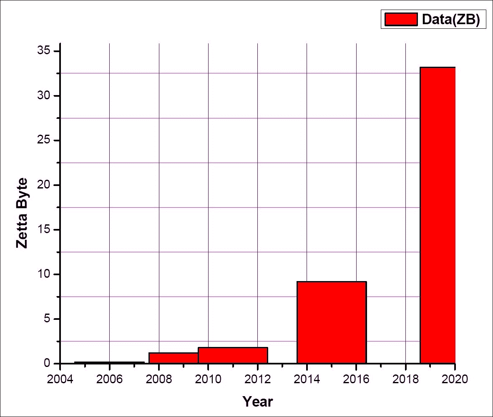
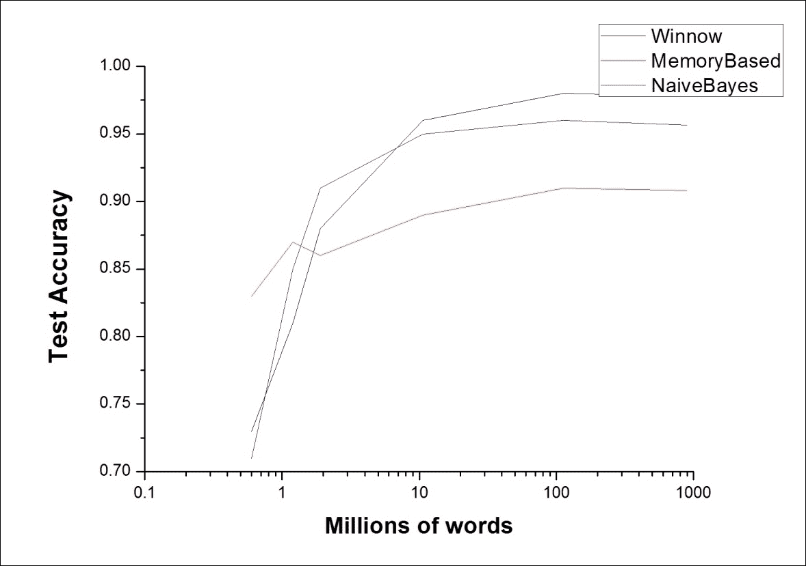
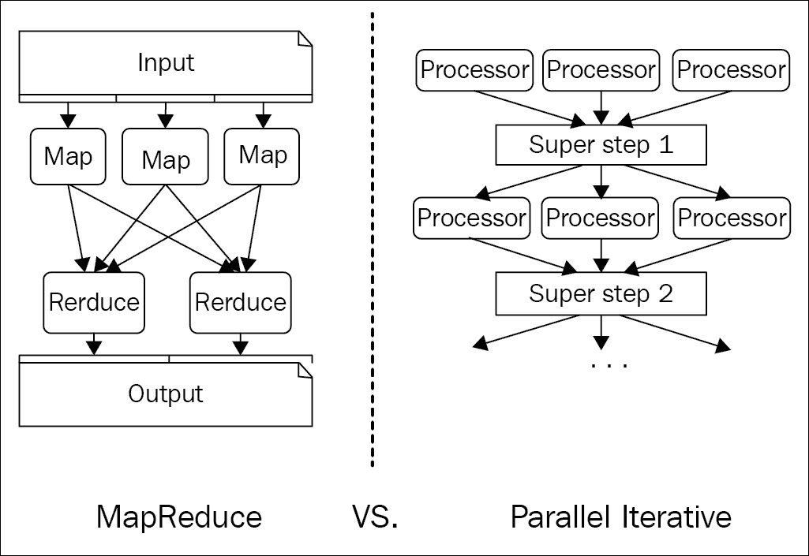
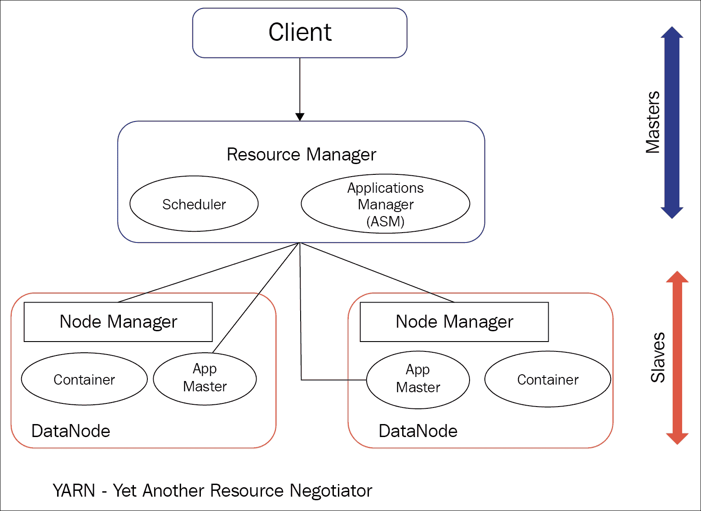
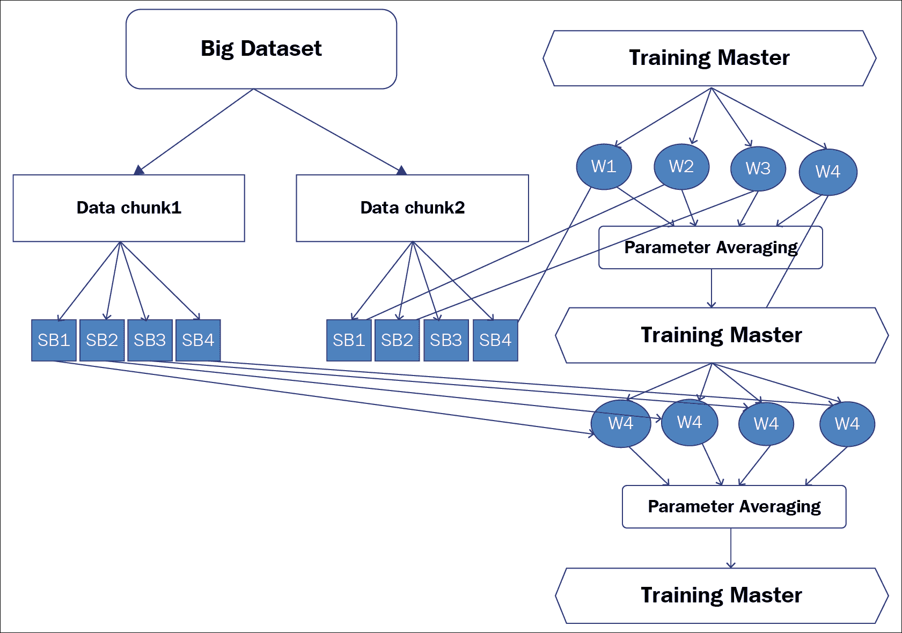
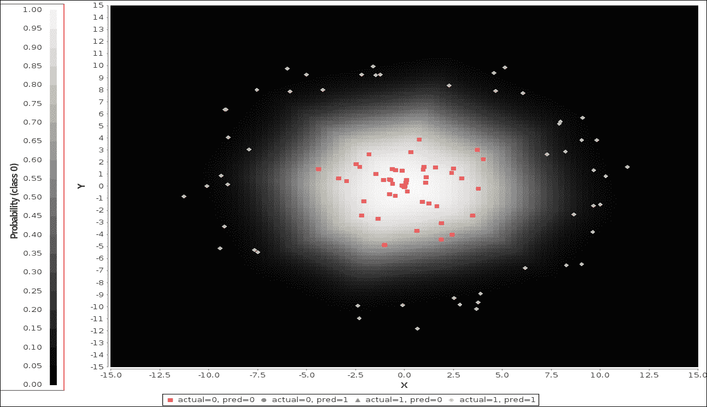

# 二、大规模数据的分布式深度学习

|   | *“在我们信任的上帝中，所有其他人都必须带来数据”* |   |
|   | - *W .爱德华兹·德明* |

在这个指数级增长的数字世界中，大数据和深度学习是两个最热门的技术趋势。深度学习和大数据是数据科学世界中两个相互关联的主题，就技术增长而言，两者相互关联且同等重要。

数字数据和云存储遵循一个被称为摩尔定律的一般定律[50]，该定律大致指出世界数据每两年翻一番；然而，存储该数据的成本以大致相同的速度下降。这种丰富的数据产生了更多的特征和验证，因此，为了从中提取所有有价值的信息，应该建立更好的深度学习模型。

海量的数据有助于为多个行业带来巨大的机遇。此外，大数据及其分析部分在数据挖掘领域产生了许多挑战，如利用数据和从中检索隐藏信息。在人工智能领域，深度学习算法在学习过程中以大规模数据提供最佳输出。因此，随着数据以前所未有的速度增长，深度学习在提供所有大数据分析解决方案方面也发挥着至关重要的作用。

本章将深入探讨深度学习模型如何处理大数据，并揭示相关挑战。本章的后半部分将介绍 Deeplearning4j，这是一个开源的分布式框架，提供了与 Hadoop 和 Spark 的集成，用于部署大规模数据的深度学习。本章将提供示例来展示如何使用 Deeplearning4j 实现基本的深度神经网络，以及它与 Apache Spark 和 Hadoop YARN 的集成。

以下是本章将涉及的重要主题:

*   海量数据的深度学习
*   大数据深度学习的挑战
*   分布式深度学习和 Hadoop
*   深度学习 4j:一个用于深度学习的开源分布式框架
*   在 Hadoop Yarn 上设置深度学习 4j

# 对海量数据的深度学习

在这个 Exa-Byte 规模的时代，数据正以指数级的速度增长。数据的增长被许多组织和研究人员以各种方式分析，也有许多不同的目的。根据**国际数据公司** ( **IDC** 的调查，互联网每天处理大约 2pb 的数据[51]。2006 年，数字数据的规模约为 0.18 ZB，而 2011 年这一数字已增至 1.8 ZB。到 2015 年，预计其规模将达到 10 个 ZB，到 2020 年，其在世界上的数量将达到约 30 个 ZB 至 35 个 ZB。这个数据山的时间线见*图 2.1* 。数字世界中的这些海量数据被正式称为大数据。

|   | *“大数据世界火了”* |   |
|   | - *《经济学人》，2011 年 9 月* |



图 2.1:图中显示了大约 20 年时间跨度内数据的增长趋势

在 200 米物体中，脸书几乎有 21pb[52]，而捷豹 ORNL 有超过 5 PB 的数据。这些存储的数据增长如此之快，以至于到 2018 年至 2020 年可能会使用 Exa-Byte 规模的存储系统。

这种数据爆炸无疑对传统的数据密集型计算构成了直接威胁，并指出需要一些分布式和可扩展的存储体系结构来查询和分析大规模数据。大数据的一般思路是，原始数据极其复杂、各式各样且日益增长。理想的大数据集由大量无监督的原始数据和一些可忽略的结构化/分类数据组成。因此，在处理这些非平稳结构化数据时，传统的数据密集型计算往往会失败。因此，多样性不受限制的大数据需要复杂的方法和工具，这些方法和工具可以用来提取模式和分析大规模数据。大数据的增长主要是由于计算处理能力的提高和现代系统以较低成本存储数据的能力。

考虑到大数据的所有这些特征，它可以分为四个不同的维度，通常被称为四个 Vs: **卷**、**品种**、**速度**和**准确性**。下图*图 2.2* 通过提供所有 4V 的数据展示了大数据的不同特征:


图 2.2:图中描绘了 4Vs 大数据的可视化表示

在当前这个数据密集型技术时代，数据的速度、数据收集和获取的不断升级的速度与大数据的其他参数一样重要，即**卷**和**品种**。按照生成这些数据的给定速度，如果不明智地收集和分析这些数据，就有丢失重要数据的巨大风险。尽管可以选择将这种快速移动的数据保留到大容量存储中，以便在以后进行批处理，但处理这种高速数据的真正重要性在于组织可以多快地将原始数据转换为结构化和可用的格式。具体来说，如果不立即保留数据并以系统的方式进行处理，对时间敏感的信息(如机票、酒店费用或某些电子商务产品的价格等)将变得过时。大数据中参数的准确性关系到数据分析后所得结果的准确性。随着数据日益复杂，保持对大数据隐藏信息的信任面临重大挑战。

为了提取和分析这些极其复杂的数据，需要一个更好的、计划良好的模型。在理想情况下，模型在处理大数据时应该比处理小数据时表现得更好。然而，情况并非总是如此。在这里，我们将展示一个例子来详细讨论这一点。

如图*图 2.3* 所示，在数据集较小的情况下，最佳算法的性能要比最差算法好 *n%* 。但是，随着数据集(大数据)大小的增加，性能也会成倍提高到一些 *k % > > n %* 。从[53]中可以很好地找到这种痕迹，这清楚地表明了大规模训练数据集对模型性能的影响。然而，如果使用任何最简单的模型，只使用大数据集就能获得最佳性能，这将是完全误导的。

从[53]我们可以看出，算法 1 基本上是一个朴素贝叶斯模型，算法 2 属于基于记忆的模型，算法 3 对应的是 Winnow。下图显示了一个小数据集，Winnow 的性能低于基于内存的性能。而在处理大数据集时，朴素贝叶斯和 Winnow 都显示出比基于内存的模型更好的性能。所以，看一下*图 2.3* ，真的很难推断这些简单模型中的任何一个在大数据集的环境下在什么基础上工作得更好。对于基于内存的方法在大数据集上相对较差的性能，一个直观的解释是，该算法由于将大量数据加载到内存中的延迟而遭受损失。因此，这纯粹是一个与内存相关的问题，仅使用大数据无法解决这个问题。因此，性能的主要原因应该是模型有多复杂。因此，深度学习模式的重要性开始发挥作用。

### 注

大数据。心胸狭窄。没有进步！大数据。大脑瓜。突破！[54]

深度学习与大数据形成鲜明对比。深度学习已经成功地在各种行业产品中实现，并被各种研究人员利用这种大规模的数字数据广泛实践。脸书、苹果和谷歌等著名科技公司每天都在收集和分析这些海量数据，并在过去几年中积极推进各种深度学习相关项目。

谷歌对从各种来源收集的海量非结构化数据部署深度学习算法，这些来源包括谷歌街景、图像搜索引擎、谷歌翻译和安卓语音识别。



图 2.3:不同类型算法的准确率随数据集大小的增加而变化

苹果的 Siri 是苹果手机的虚拟个人助理，提供大量不同的服务，如体育新闻、天气报告、用户问题的答案等。Siri 的整个应用都是基于深度学习，从不同的苹果服务中收集数据，获得其智能。其他行业，主要是微软和 IBM，也在使用深度学习作为他们的主要领域来处理这些海量的非结构化数据。IBM 的类脑计算机、沃森和微软的必应搜索引擎主要使用深度学习技术来利用大数据。

当前的深度学习架构由数百万甚至数十亿个数据点组成。此外，数据增长的规模防止了模型过度拟合的风险。计算能力的快速增长也使得高级模型的训练变得更加容易。

*表 2.1* 展示了在最近的研究中，如何使用流行的深度学习模型来实践大数据，以从数据中获取最大信息:

<colgroup><col> <col> <col> <col></colgroup> 
| **车型** | **计算能力** | **数据集** | **平均运行时间** |
| 卷积神经网络[55] | 两个英伟达 GTX 580 3 GB 图形处理器。 | 在 120 万张高分辨率图像的训练集中，大约有 90 个周期。 | 五到六天。 |
| 深度信念网络[41] | NVIDIA GTX 280 1 GB GPU。 | 一百万张图片。 | 大约一天。 |
| 稀疏自编码器[ 66] | 1000 个 CPU，每个 CPU 有 16000 个内核。 | 1000 万张 200*200 像素图像。 | 大约三天。 |

表 2.1:大规模深度学习模型的最新研究进展。部分信息取自[55]

深度学习算法在分层学习方法的帮助下，基本上用于从输入原始数据中提取有意义的通用表示。基本上，在更高的层次上，数据的更复杂和抽象的表示从先前的层和多层次学习模型的不太抽象的数据中学习。尽管深度学习也可以从大量已标记(已分类)的数据中学习，但当模型可以从未标记/未分类的数据中学习时，它们通常看起来很有吸引力[56]，因此有助于生成一些有意义的模式和大的非结构化数据的表示。

在处理大规模无监督数据时，深度学习算法可以比浅层学习架构更好地提取数据点之间的一般模式和关系。以下是深度学习算法在使用大规模未标记数据进行训练时的一些主要特征:

*   从更高层次的抽象和表示中，可以从深度学习模型中获得大数据的语义和关系知识
*   即使是一个简单的线性模型也可以有效地处理从庞大数据集的过于复杂和抽象的表示中获得的知识
*   这种来自无监督数据的大量数据表示为学习其他数据类型(如文本、音频、视频、图像等)打开了大门

因此，可以肯定地得出结论，深度学习将成为提供大数据情感分析、预测分析等的重要组成部分，特别是随着**图形处理单元** ( **GPU** )容量的增强处理能力和进步。本章的目的不是广泛涵盖大数据，而是阐述大数据和深度学习之间的关系。后续章节将介绍深度学习的关键概念、应用和挑战，同时处理大规模未分类的数据。

# 大数据深度学习的挑战

大数据的潜力当然值得关注。然而，为了在这个规模上充分提取有价值的信息，我们需要新的创新和有前途的算法来解决许多相关的技术问题。例如，为了训练模型，大多数传统的机器学习算法将数据加载到内存中。但是在有大量数据的情况下，这种方法肯定是不可行的，因为系统可能会耗尽内存。为了克服所有这些棘手的问题，并利用深度学习技术充分利用大数据，我们将需要头脑 Storm。

尽管如前一节所述，大规模深度学习在过去十年中取得了许多成就，但该领域仍处于发展阶段。大数据不断提高其 4V 的局限性。因此，为了解决所有这些问题，需要对模型进行更多的改进。

## 海量数据带来的深度学习挑战(前五)

大规模数据量对深度学习提出了巨大挑战。大数据具有非常高的维度(属性)、大量的示例(输入)和种类繁多的分类(输出)，通常会增加模型的复杂性，以及算法的运行时间复杂性。堆积如山的数据使得深度学习算法的训练几乎不可能使用集中存储及其有限的处理能力。为了缓冲巨大数据量带来的挑战，应该使用具有并行服务器的分布式框架。升级后的深度网络模型已经开始使用 CPU 和 GPU 集群来提高训练速度，而不会影响算法的准确性。各种新的模型并行和数据并行策略已经发展出来。

在这些类型中，模型或数据被分割成块，这些块可以适合内存中的数据，然后通过向前和向后传播被分发到各个节点[57]。Deeplearning4j 是一个基于 Java 的用于深度学习的分布式工具，它为此使用了数据并行，下一节将对此进行解释。

大量数据总是与嘈杂的标签和数据不完整相关联。这在大规模深度学习的培训过程中构成了重大挑战。大数据的很大一部分包含在未标记或非结构化数据中，其中主要存在有噪声的标签。为了克服这个问题，在很大程度上需要对数据集进行一些手动管理。例如，所有的搜索引擎都用来收集过去一年的数据。对于这些数据，我们需要某种过滤，特别是去除冗余和低值数据。先进的深度学习方法对于处理这种嘈杂、冗余的数据至关重要。此外，相关算法应该能够容忍这些混乱的数据集。还可以实现一些更有效的代价函数和更新的训练策略，以充分克服噪声标签的影响。此外，使用半监督学习[58] [59]有助于增强与这种噪声数据相关的解决方案。

## 从多种多样的数据中深度学习的挑战(第二个 V)

这是大数据的第二个维度，它代表了所有类型的格式，具有不同的分布和众多的来源。呈指数级增长的数据来自不同的来源，包括来自各种日志文件的大量音频流、图像、视频、动画、图形和非结构化文本。这些不同的数据具有不同的特征和行为。数据集成可能是处理这种情况的唯一方法。正如[第 1 章](1.html "Chapter 1. Introduction to Deep Learning")、*深度学习简介*所述，深度学习具有表示从结构化/非结构化数据中学习的能力。深度学习可以以分层的方式执行无监督学习，即每次执行一个级别的训练，较高级别的特征由直接较低的级别定义。深度学习的这一特性可以用来解决数据集成问题。自然的解决方案是从每个单独的数据源中学习数据表示，然后在后续的层次上集成所学的特性。

已经有一些实验[60] [61]成功地证明了深度学习可以很容易地用于异构数据源，因为它在系统性能方面有显著的提高。然而，在接下来的几年里，深度学习仍有许多未解的问题需要解决。目前，大多数深度学习模型主要在双模态(仅来自两个来源的数据)上进行测试，但是在处理多模态时，系统性能会得到提高吗？可能会出现多个数据源提供冲突信息的情况；在这些情况下，该模型将如何消除此类冲突，并以建设性和富有成效的方式整合数据？由于深度学习能够学习中间表示和与各种数据相关的潜在因素，因此它似乎非常适合于将各种数据源与多种模式相集成。

## 从高速数据中深度学习的挑战(第三个五)

数据增长的极快速度对深度学习技术提出了巨大挑战。对于数据分析，以这种速度创建的数据也应该得到及时处理。在线学习是从这种高速数据中学习的解决方案之一[62-65]。然而，在线学习使用顺序学习策略，整个数据集应该保存在内存中，这对传统机器来说变得极其困难。虽然传统的神经网络已经被修改为在线学习[67-71]，但是在这个领域，深度学习仍然有很大的进步空间。作为在线学习的替代方法，随机梯度下降方法[72]，[73]也应用于深度学习。在这种类型中，具有已知标签的一个训练示例被馈送到下一个标签以更新模型参数。此外，为了加速学习，更新也可以在小批量的基础上进行[74]。这个小批量可以在运行时间和计算机内存之间提供良好的平衡。在下一节中，我们将解释为什么小批量数据对于分布式深度学习最重要。

与这种高速数据相关的一个更大的挑战是，这种数据在本质上是极其多变的。随着时间的推移，数据的分发过于频繁。理想情况下，随时间变化的数据被分成小块，从小时间段中获取。基本思想是，数据在一段时间内保持稳定，并且还具有某种主要的相关性[75] [76]。因此，大数据的深度学习算法应该具有以流的形式学习数据的特性。能够从这些非平稳数据中学习的算法对于深度学习来说确实至关重要。

## 深度学习保持数据准确性的挑战(四五)

数据准确性，不精确或不确定的数据，有时会被忽视，尽管它与大数据的其他 3v 同样重要。随着大数据的巨大多样性和速度，组织不能再依赖传统模型来衡量数据的准确性。根据定义，非结构化数据包含大量不精确和不确定的数据。例如，社交媒体数据在本质上是过度不确定的。尽管有一些工具可以自动化数据的规范化和清理，但它们大多处于工业化前阶段。

# 分布式深度学习和 Hadoop

从本章前面的部分，我们已经对深度学习和大数据之间的关系为什么以及如何给研究界带来重大变化有了足够的了解。此外，随着时间的推移，一个集中的系统不会对这种关系有实质性的帮助。因此，将深度学习网络分布在多个服务器上已经成为当前深度学习实践者的主要目标。然而，在分布式环境中处理大数据总是伴随着一些挑战。其中大部分在上一节中有深入的解释。这些包括处理高维数据、具有太多特征的数据、可用于存储的内存量、处理海量大数据集等等。此外，大数据集对 CPU 和内存时间的计算资源要求很高。因此，处理时间的减少已经成为一个极其重要的标准。以下是分布式深度学习的主要挑战:

*   我们如何在节点的主内存中保存数据集块？
*   我们如何保持数据块之间的协调，以便以后可以将它们移动到一起，从而产生最终结果？
*   如何才能让分布式并行处理变得极具调度性和协调性？
*   我们如何实现跨数据集的管弦乐搜索过程以实现高性能？

在大数据集上使用分布式深度学习有多种方式。然而，当我们谈论大数据时，在防御过去五年的大部分挑战方面表现非常出色的框架是 Hadoop 框架[77-80]。Hadoop 允许并行和分布式处理。它无疑是最受欢迎和使用最广泛的框架，与其他传统框架相比，它可以更高效地存储和处理数据山。几乎所有的主要技术公司，如谷歌、脸书等，都使用 Hadoop 以复杂的方式部署和处理他们的数据。谷歌设计的大多数软件都使用 Hadoop，这需要使用数据海洋。Hadoop 的主要优势是它在数千个商品服务器上存储和处理大量数据的方式，带来了一些组织良好的结果[81]。从我们对深度学习的一般理解中，我们可以得出这样的结论:深度学习确实需要那种分布式计算能力，才能从输入数据中产生一些奇妙的结果。大数据集可以分割成块，分布在多个商品硬件上进行并行训练。此外，深度神经网络的完整阶段可以分成子任务，然后这些子任务可以并行处理。

### 注

Hadoop 已经成为所有数据湖的汇聚点。对已经存在于 Hadoop 中的数据进行深度学习的需求已经变得非常重要。

Hadoop 的运作理念是*移动计算比移动数据*【86】【87】更便宜。Hadoop 允许跨商品服务器集群对大规模数据集进行分布式处理。它还提供了高效的负载平衡，具有非常高的容错度，并且可以通过最少的努力实现高度的横向扩展。它可以检测和容忍应用层的故障，因此适合在商用硬件上运行。为了实现数据的高可用性，默认情况下，Hadoop 保持三倍的复制因子，每个数据块的副本放在另外两台独立的机器上。因此，如果一个节点出现故障，可以立即从其他两个节点进行恢复。Hadoop 的复制因子可以根据数据的价值和对数据的其他相关要求轻松增加。

Hadoop 最初主要是为了处理批处理任务而构建的，因此它最适合深度学习网络，在深度学习网络中，主要任务是找到大规模数据的分类。学习如何对数据进行分类的特征选择主要是在大批量数据集上完成的。

Hadoop 具有极强的可配置性，可以根据用户需求轻松优化。例如，如果用户希望保留更多的数据副本以获得更好的可靠性，他可以增加复制因子。但是，副本数量的增加最终会增加存储需求。在这里，我们将不再解释数据的特性和配置，而是主要讨论 Hadoop 的一部分，它将被广泛用于分布式深度神经网络。

在新版本的 Hadoop 中，我们在本书中主要使用的部分是 HDFS、地图缩减和**另一个资源协商者** ( **Yarn**)。Yarn 已经在很大程度上主导了 Hadoop 的地图缩减(在下一部分中解释)。目前，Yarn 负责将作品分配给 Hadoop 的数据节点(数据服务器)。 **Hadoop 分布式文件系统** ( **HDFS** )则是一个分布式文件系统，它分布在名为 NameNode 的集中式元数据服务器下的所有数据节点上。为了实现高可用性，在更高的版本中，一个辅助名称节点被集成到 Hadoop 框架中，其目的是在特定检查点之后拥有主名称节点的元数据副本。

## 地图-缩小

Map-Reduce 范式[83]是谷歌在 2004 年开发的分布式编程模型，它与在一群机器上用并行和分布式算法处理巨大数据集相关联。整个地图缩减应用对于大规模数据集非常有用。基本上，它有两个主要组成部分，一个叫做 Map，另一个叫做 Reduce，还有一些中间阶段，比如洗牌、排序和分区。在映射阶段，大的输入作业被分解成小的，每个作业被分配到不同的内核。然后在这些机器上的每个小作业上执行操作。缩减阶段将所有分散和转换的输出放入一个单独的数据集。

详细解释 Map-Reduce 的概念超出了本章的范围；感兴趣的读者可以通过*“Map-Reduce:大型集群上的简化数据处理”*【83】来深入了解这一点。

## 迭代地图-缩小

深度学习算法本质上是迭代的——模型从优化算法中学习，优化算法经历多个步骤，从而导致最小误差点。对于这些类型的模型，Map-Reduce 应用的工作效率似乎不如其他用例。

迭代 Map-Reduce，一个下一代的 Yarn 框架(不同于传统的 Map-Reduce)对数据进行多次迭代，数据只通过一次。尽管迭代地图缩减和地图缩减的体系结构在设计上是不同的，但是对这两种体系结构的高级理解是简单的。迭代地图缩减只是一系列地图缩减操作，其中第一个地图缩减操作的输出成为下一个操作的输入，以此类推。在深度学习模型的情况下，映射阶段将特定迭代的所有操作放在分布式系统的每个节点上。然后，它将该海量输入数据集分发到集群中的所有机器。模型的训练在集群的每个节点上执行。

在将聚合的新模型发送回每台机器之前，缩减阶段会获取从映射阶段收集的所有输出，并计算参数的平均值。同样的操作被迭代归约算法反复迭代，直到学习过程完成，误差最小化到几乎为零。

*图 2.4* 比较了两种方法的高级功能。左图是地图缩减的框图，右边是迭代地图缩减的特写。每个“处理器”都是一个工作的深层网络，它在较大数据集的小块上学习。在“超级步骤”阶段，在将整个模型重新分配到整个集群之前，对参数进行平均，如下图所示:



图 2.4:地图缩减和并行迭代缩减中的功能差异

## 又一个资源协商者(Yarn)

Yarn 的主要思想是将作业调度和资源管理从数据处理中分离出来。因此，数据可以继续在系统中与 Map-Reduce 批处理作业并行处理。Yarn 拥有一个中央资源管理器，主要根据需要管理 Hadoop 系统资源。节点管理器(特定于节点)负责管理和监控集群中各个节点的处理。该处理由 ApplicationMaster 专门控制，它从中央资源管理器监视资源，并与节点管理器一起监视和执行任务。下图概述了 Yarn 的体系结构:



图 2.5:Yarn 的高级体系结构概述

Hadoop 的所有这些组件主要用于分布式深度学习，以克服前面提到的所有挑战。下面的小节展示了分布式深度学习的更好性能需要满足的标准。

## 分布式深度学习设计的重要特征

以下是分布式深度学习设计的重要特征:

1.  **Small batch processing**: In distributed deep learning, the network must intake and process data quickly in parallel. To process and provide results more accurately, every node of the cluster should receive small chunks of data of approximately 10 elements at a time.

    例如，假设 Yarn 的主节点正在为 200 GB 的大数据集协调 20 个工作节点。主节点会将数据集拆分为 20 个小批量数据的 10 GB，为每个工作人员分配一个小批量。工作人员将并行处理数据，并在主机完成计算后立即将结果发送回主机。所有这些结果将由主节点汇总，结果的平均值将最终重新分配给各个工作人员。

    深度学习网络在处理近 10 个小批量数据时表现良好，而不是处理 100 或 200 个大批量数据。小批量的数据使网络能够从不同方向的数据中深入学习，随后会重新编译，为模型提供更广泛的知识。

    另一方面，如果批量太大，网络会试图快速学习，从而使错误最大化。相反，更小的批量会降低学习速度，并导致当网络接近最小错误率时出现分歧的可能性。

2.  **Parameter Averaging**: Parameter averaging is a crucial operation for the training of distributed deep network. In a network, parameters are generally the weight and biases of the node layers. As mentioned in the small batch processing section, once training is completed for several workers, they will pass different sets of parameters back to the master. With every iteration, the parameters are averaged, updated, and sent back to the master for further operations.

    参数平均的顺序过程可以概括如下:

    *   主机配置初始网络并设置不同的超参数
    *   基于训练主数据的配置，大数据集被分成几个较小数据集的块
    *   对于训练数据集的每个分割，直到错误率接近零，执行以下操作:
        *   主设备将参数从主设备分配给每个工人
        *   每个工作人员用其专用的数据集块开始模型的训练
        *   计算参数的平均值并返回给主机。
    *   培训结束，主人将拥有一份培训网络
3.  在分布式训练的情况下，参数平均具有以下两个重要优势:
    *   它通过同时生成结果来实现并行性。
    *   通过将给定数据集分布到多个较小的数据集，有助于防止过度拟合。网络然后学习平均结果，而不仅仅是从不同的小批量中汇总结果。

*图 2.6* 显示了小批量处理和参数平均操作的组合示意图:



图 2.6:图中显示了分布式深度学习架构的高层架构

# 深度学习 4j——一个用于深度学习的开源分布式框架

**深度学习 4j**(**DL4J**)【82】是为 JVM 编写的开源深度学习框架，主要用于商业级。该框架完全是用 Java 编写的，因此包含了名称“4j”。由于与 Java 一起使用，Deeplearning4j 开始受到更广泛的受众和从业者的欢迎。

这个框架基本上是由一个与 Hadoop 和 Spark 集成的分布式深度学习库组成的。借助 Hadoop 和 Spark，我们可以非常容易地分发模型和大数据集，并运行多个图形处理器和中央处理器来执行并行操作。Deeplearning4j 在执行图像、声音、文本、时间序列数据等模式识别方面取得了巨大成功。除此之外，它还可以应用于各种客户使用案例，例如面部识别、欺诈检测、业务分析、推荐引擎、图像和语音搜索以及传感器数据的预测性维护。

下图*图 2.7* 显示了 Deeplearning4j 的通用高级架构框图:


图 2.7:深度学习的高级架构框图 4j [82]

## 深度学习的主要特征 4j

Deeplearning4j 自带各种吸引人的功能，这使其完全区别于现有的其他 Deeplearning 工具，如 antano、Torch 等。

*   **分布式架构**:deep learning 4j 中的训练可以通过两种方式进行——使用分布式多线程深度学习，或者使用传统的普通单线程深度学习技术。培训在商品节点集群中进行。因此，深度学习 4j 能够快速处理任意数量的数据。使用迭代约简方法并行训练神经网络，该方法适用于 Hadoop YARN 和 Spark。它还与 Cuda 内核集成进行纯 GPU 操作，并与分布式 GPU 协同工作。

Deeplearning4j 操作可以作为作业在 Hadoop Yarn 或 Spark 上运行。在 Hadoop 中，迭代缩减工作人员在 HDFS 的每个块上工作，并同步并行处理数据。当处理完成时，它们将转换后的参数推回到它们的主节点，在那里获取参数的平均值，并更新每个工作节点的模型。

在 Deeplearning4j 中，分布式运行时是可以互换的，它们就像一个巨大的模块化架构中的目录，可以换入或换出。

*   **数据并行**:神经网络的分布式训练有两种方式:一种是数据并行，一种是模型并行。深度学习 4j 遵循数据并行性进行训练。在数据并行中，我们可以将大数据集分割成小数据集的块，并将其分布到运行在不同服务器上的并行模型中进行并行训练。

*   **JVM 的科学计算能力**:对于 Java 和 Scala 中的科学计算，Deeplearning4j 包括一个 N 维数组类，使用了**Java 的 N 维数组** ( **ND4J** )。ND4J 的功能比 Numpy 提供给 Python 的要快得多，而且大部分是用 C++编写的。它有效地基于生产环境中的矩阵操作和线性代数库。ND4J 的大部分例程都是为了以最小的内存需求快速运行而设计的。
*   **机器学习的矢量化工具**:对于各种文件格式和数据类型的矢量化，Canova 已经和 Deeplearning4j 合并。Canova 使用输入/输出系统执行矢量化，类似于 Hadoop 如何使用 Map-Reduce。Canova 主要设计用于从**命令行界面** ( **CLI** )对文本、CSV、图像、声音、视频等进行矢量化。

## 深度学习 4j 功能概述

以下是深度学习 4j 的功能概述:

*   Deeplearning4j 可以说是有史以来构建的最完整、生产就绪、开源的 Deeplearning 库
*   与基于网络的工具相比，它有更多专为深度网络设计的功能
*   Deeplearning4j 非常容易使用；即使是非专家也可以应用它的惯例来解决计算密集型问题
*   这些工具提供了广泛的适用性，因此，这些网络同样适用于图像、声音、文本和时间序列
*   它是完全分布式的，可以并行运行多个 GPU，不像 antao[84]是不分布式的，Torch7 [85]也没有像 DL4J 那样自动化它的分发

# 在 Hadoop Yarn 上设置深度学习 4j

Deeplearning4j 主要用于具有多层的网络。要开始使用 Deeplearning4j，需要熟悉先决条件，以及如何安装所有相关软件。大部分文档可以在[https://deeplearning4j.org/](https://deeplearning4j.org/)【88】deep learning 4j 官网轻松找到。

在本章的这一部分，我们将帮助您熟悉 Deeplearning4j 的代码。首先，我们将展示用 Deeplearning4j 实现多层神经网络的简单操作。本节的后半部分将讨论使用 Deeplearning4j 库进行分布式深度学习。Deeplearning4j 使用 Apache Spark 在多个分布式 GPU 上训练分布式深度神经网络。本节的后半部分还将介绍针对深度学习 4j 的 Apache Spark 的设置。

## 熟悉深度学习 4j

这一部分将主要介绍深度学习的“你好世界”项目。我们将借助两个简单的深度学习问题来解释图书馆的基本功能。

在 Deeplearning4j，`MultiLayerConfiguration`中，库的一个类可以被认为是构建块的基础，它负责组织神经网络的层和相应的超参数。这门课可以被认为是神经网络深度学习 4j 的核心组成部分。在整本书中，我们将使用这个类来配置不同的多层神经网络。

### 注

超参数是决定神经网络学习过程的主要支柱。它们主要包括如何初始化模型的权重，应该更新多少次，模型的学习速率，使用哪些优化算法等等。

在第一个例子中，我们将展示如何在 Deeplearning4j 的帮助下为多层感知器分类器分类数据模式。

以下是将在此程序中使用的示例训练数据集:

```scala
  0, -0.500568579838,  0.687106471955 
  1,  0.190067977988, -0.341116711905 
  0,  0.995019651532,  0.663292952846 
  0, -1.03053733564,   0.342392729177 
  1,  0.0376749555484,-0.836548188848 
  0, -0.113745482508,  0.740204108847 
  1,  0.56769119889,  -0.375810486522 

```

首先，我们需要初始化网络的各种超参数。下面这段代码将为程序设置 ND4J 环境:

```scala
Nd4j.ENFORCE_NUMERICAL_STABILITY = true; 
int batchSize = 50; 
int seed = 123; 
double learningRate = 0.005; 

```

纪元数设置为`30`:

```scala
int nEpochs = 30;  
int numInputs = 2; 
int numOutputs = 2; 
int numHiddenNodes = 20; 

```

以下代码将把训练数据加载到网络中:

```scala
RecordReader rr = new CSVRecordReader(); 
rr.initialize(new FileSplit(new File("saturn_data_train.csv"))); 
DataSetIterator trainIter = new RecordReaderDataSetIterator      
                            (rr,batchSize,0,2); 

```

随着训练数据的加载，我们用下面的代码将测试数据加载到模型中:

```scala
RecordReader rrTest = new CSVRecordReader(); 
rrTest.initialize(new FileSplit(new File("saturn_data_eval.csv"))); 
DataSetIterator trainIter = new RecordReaderDataSetIterator
                            (rrTest,batchSize,0,2); 

```

网络模型的所有层的组织以及超参数的设置可以通过以下代码来完成:

```scala
MultiLayerConfiguration conf = new NeuralNetConfiguration.Builder() 
.seed(seed)
.iterations(1)                          
.optimizationAlgo(OptimizationAlgorithm.STOCHASTIC_GRADIENT_DESCENT) 
.learningRate(learningRate) 
.updater(Updater.NESTEROVS).momentum(0.9)
.list() 
.layer(0, new DenseLayer.Builder().nIn(numInputs).nOut(numHiddenNodes) 
   .weightInit(WeightInit.XAVIER) 
   .activation("relu")
   .build()) 
 .layer(1, new OutputLayer.Builder(LossFunction.NEGATIVELOGLIKELIHOOD) 
   .weightInit(WeightInit.XAVIER)                         
   .activation("softmax")
   .nIn(numHiddenNodes).nOut(numOutputs).build())
 .pretrain(false)
 .backprop(true)
 .build(); 

```

现在，我们已经加载了训练和测试数据集，模型的初始化可以通过调用`init()`方法来完成。这也将从给定的输入开始模型的训练:

```scala
MultiLayerNetwork model = new MultiLayerNetwork(conf); 
model.init(); 

```

为了检查某个内部之后的输出，让我们在每次`5`参数更新时打印分数:

```scala
model.setListeners(new ScoreIterationListener(5));      
for ( int n = 0; n < nEpochs; n++) 
{ 

```

最后，通过调用`.fit()`方法训练网络:

```scala
 model.fit( trainIter ); 
}  
System.out.println("Evaluating the model....");  
Evaluation eval = new Evaluation(numOutputs); 
while(testIter.hasNext())
  { 
    DataSet t = testIter.next(); 
    INDArray features = t.getFeatureMatrix(); 
    INDArray lables = t.getLabels(); 
    INDArray predicted = model.output(features,false); 
    eval.eval(lables, predicted); 
  } 
System.out.println(eval.stats()); 

```

这样模型的训练就完成了。在下一部分中，将绘制数据点，并计算相应的数据精度，如以下代码所示:

```scala
double xMin = -15;
double xMax = 15; 
double yMin = -15; 
double yMax = 15; 

int nPointsPerAxis = 100; 
double[][] evalPoints = new double[nPointsPerAxis*nPointsPerAxis][2]; 
int count = 0; 
for( int i=0; i<nPointsPerAxis; i++ )
{ 
 for( int j=0; j<nPointsPerAxis; j++ )
 { 
   double x = i * (xMax-xMin)/(nPointsPerAxis-1) + xMin; 
   double y = j * (yMax-yMin)/(nPointsPerAxis-1) + yMin; 

   evalPoints[count][0] = x; 
   evalPoints[count][1] = y; 

   count++; 
 } 
} 

INDArray allXYPoints = Nd4j.create(evalPoints); 

INDArray predictionsAtXYPoints = model.output(allXYPoints); 

```

以下代码将在将所有训练数据绘制到图形中之前，将这些数据存储在一个数组中:

```scala

rr.initialize(new FileSplit(new File("saturn_data_train.csv"))); 
rr.reset(); 
int nTrainPoints = 500; 
trainIter = new RecordReaderDataSetIterator(rr,nTrainPoints,0,2); 
DataSet ds = trainIter.next(); 
PlotUtil.plotTrainingData(ds.getFeatures(), ds.getLabels(),allXYPoints, predictionsAtXYPoints, nPointsPerAxis); 

```

通过网络运行测试数据并生成预测可以通过以下代码来完成:

```scala
rrTest.initialize(new FileSplit(new File("saturn_data_eval.csv"))); 
rrTest.reset(); 
int nTestPoints = 100; 
testIter = new RecordReaderDataSetIterator(rrTest,nTestPoints,0,2); 
ds = testIter.next(); 
INDArray testPredicted = model.output(ds.getFeatures()); 
PlotUtil.plotTestData(ds.getFeatures(), ds.getLabels(), testPredicted, allXYPoints, predictionsAtXYPoints, nPointsPerAxis); 

```

当执行前面的代码时，它将运行大约 5-10 秒，这取决于您的系统配置。在此期间，您可以查看控制台，它将显示您的模型的最新训练分数。

一项评估显示如下:

```scala
o.d.o.l.ScoreIterationListener - Score at iteration 0 is    
                                 0.6313823699951172 
o.d.o.l.ScoreIterationListener - Score at iteration 5 is 
                                 0.6154170989990234 
o.d.o.l.ScoreIterationListener - Score at iteration 10 is     
                                 0.4763660430908203 
o.d.o.l.ScoreIterationListener - Score at iteration 15 is 
                                 0.52469970703125 
o.d.o.l.ScoreIterationListener - Score at iteration 20 is    
                                 0.4296367645263672 
o.d.o.l.ScoreIterationListener - Score at iteration 25 is 
                                 0.4755714416503906 
o.d.o.l.ScoreIterationListener - Score at iteration 30 is 
                                 0.3985047912597656 
o.d.o.l.ScoreIterationListener - Score at iteration 35 is 
                                 0.4304619598388672 
o.d.o.l.ScoreIterationListener - Score at iteration 40 is   
                                 0.3672477722167969 
o.d.o.l.ScoreIterationListener - Score at iteration 45 is 
                                 0.39150180816650393 
o.d.o.l.ScoreIterationListener - Score at iteration 50 is 
                                 0.3353725051879883 
o.d.o.l.ScoreIterationListener - Score at iteration 55 is 
                                 0.3596681213378906 

```

最后，程序将使用 Deeplearning4j 为模型输出不同的训练统计信息，如下所示:

```scala
Evaluating the model.... 
Examples labeled as 0 classified by model as 0: 48 times 
Examples labeled as 1 classified by model as 1: 52 times 

```

在背景中，我们可以可视化数据的绘图，这将给出土星看起来像什么的印象。在下一部分中，我们将展示如何将 Hadoop Yarn 和 Spark 与深度学习 4j 集成。下图*图 2.8* 用图形表示程序的输出:



图 2.8:执行前面的程序时，绘制了分散的数据点。数据点给出了土星的印象

## 集成 Hadoop YARN 和 Spark 进行分布式深度学习

要在 Hadoop 上使用 Deeplearning4j，我们需要包含`deeplearning-hadoop`依赖项，如以下代码所示:

```scala
<!-- https://mvnrepository.com/artifact/org.Deeplearning4j/Deeplearning4j-hadoop --> 
<dependency> 
    <groupId>org.Deeplearning4j</groupId> 
    <artifactId>Deeplearning4j-hadoop</artifactId> 
    <version>0.0.3.2.7</version> 
</dependency> 

```

同样，对于 Spark，我们必须包含`deeplearning-spark`依赖项，如以下代码所示:

```scala
<!-- https://mvnrepository.com/artifact/org.Deeplearning4j/dl4j-spark-nlp_2.11 --> 
<dependency> 
    <groupId>org.Deeplearning4j</groupId> 
    <artifactId>dl4j-spark-nlp_2.11</artifactId> 
    <version>0.5.0</version> 
</dependency> 

```

解释 Apache Spark 的详细功能超出了本书的范围。感兴趣的读者可以在[http://spark.apache.org/](http://spark.apache.org/)了解同样的内容。

## 为 Hadoop Yarn 上的 Spark 配置内存分配的规则

如前一节所述，Apache Hadoop Yarn 是一个集群资源管理器。当 Deeplearning4j 通过 Spark 向 Yarn 簇提交培训作业时，Yarn 簇负责管理资源的分配，例如中央处理器内核、每个执行器消耗的内存量等。然而，为了从 Deeplearning4j on YARN 中获得最佳性能，需要进行一些仔细的内存配置。具体如下:

*   需要使用`spark.executor.memory`指定执行器 JVM 内存量。
*   需要使用`spark.yarn.executor.memoryOverhead`指定 Yarn 容器内存开销。
*   `spark.executor.memory`和`spark.yarn.executor.memoryOverhead`的总和必须始终小于 Yarn 分配给容器的内存量。
*   ND4j 和 JavaCPP 应该知道堆外内存的分配；这可以使用`org.bytedeco.javacpp.maxbytes`系统属性来完成。
*   `org.bytedeco.javacpp.maxbytes`必须小于`spark.yarn.executor.memoryOverhead`。

深度学习 4j 的当前版本使用参数平均来执行神经网络的分布式训练。以下操作的执行方式与前一节参数平均部分所述的方式完全相同:

```scala
SparkDl4jMultiLayer sparkNet = new SparkDl4jMultiLayer(sc,conf, 
                               new ParameterAveragingTrainingMaster
                              .Builder(numExecutors(),dataSetObjSize 
                              .batchSizePerWorker(batchSizePerExecutor) 
                              .averagingFrequency(1) 
                              .repartionData(Repartition.Always) 
                              .build()); 
sparkNet.setCollectTrainingStats(true); 

```

要列出来自 HDFS 的所有文件以便在不同的节点上运行代码，请运行以下代码:

```scala
Configuration config = new Configuration(); 
FileSystem hdfs = FileSystem.get(tempDir.toUri(), config); 
RemoteIterator<LocatedFileStatus> fileIter = hdfs.listFiles
  (new org.apache.hadoop.fs.Path(tempDir.toString()),false); 

List<String> paths = new ArrayList<>(); 
while(fileIter.hasNext())
  { 
   String path = fileIter.next().getPath().toString(); 
   paths.add(path); 
  } 

```

代码包中将提供一个完整的代码，说明如何使用 Yarn 和 HDFS 设置 Spark。为了简单起见，为了便于理解，这里只显示了部分代码。

现在，我们将展示一个示例来演示如何使用 Spark，并使用 Deeplearning4j 将数据加载到内存中。我们将使用一个基本的数据向量示例来展示对一些 CSV 数据的一些预处理操作。

示例数据集如下所示:

```scala
2016-01-01 17:00:00.000,830a7u3,u323fy8902,1,USA,100.00,Legit 
2016-01-01 18:03:01.256,830a7u3,9732498oeu,3,FR,73.20,Legit 
2016-01-03 02:53:32.231,78ueoau32,w234e989,1,USA,1621.00,Fraud 
2016-01-03 09:30:16.832,t842uocd,9732498oeu,4,USA,43.19,Legit 
2016-01-04 23:01:52.920,t842uocd,cza8873bm,10,MX,159.65,Legit 
2016-01-05 02:28:10.648,t842uocd,fgcq9803,6,CAN,26.33,Fraud 
2016-01-05 10:15:36.483,rgc707ke3,tn342v7,2,USA,-0.90,Legit 

```

该计划的问题陈述如下:

*   删除一些不必要的列
*   过滤掉数据，只保留数值为`MerchantCountryCode`列的`USA`和`MX`的例子
*   替换`TransactionAmountUSD`列中的无效条目
*   解析数据字符串，并从中收集一天中的小时，以创建新的`HourOfDay`列

```scala
Schema inputDataSchema = new Schema.Builder() 
     .addColumnString("DateTimeString") 
     .addColumnsString("CustomerID", "MerchantID")  
     .addColumnInteger("NumItemsInTransaction") 
     .addColumnCategorical("MerchantCountryCode",  
      Arrays.asList("USA","CAN","FR","MX")) 
     .addColumnDouble("TransactionAmountUSD",0.0,null,false,false)  
     .addColumnCategorical("FraudLabel",Arrays.asList("Fraud","Legit"))
     .build(); 

System.out.println("\n\nOther information obtainable from schema:"); 
System.out.println("Number of columns: " + 
                   inputDataSchema.numColumns()); 
System.out.println("Column names: " +              
                   inputDataSchema.getColumnNames()); 
System.out.println("Column types: " +  
                   inputDataSchema.getColumnTypes()); 

```

以下部分将定义我们要对数据集执行的操作:

```scala
TransformProcess tp = new TransformProcess.Builder(inputDataSchema) 
.removeColumns("CustomerID","MerchantID") 
.filter(new ConditionFilter(
 new CategoricalColumnCondition("MerchantCountryCode", 
 ConditionOp.NotInSet, new HashSet<>(Arrays.asList("USA","MX"))))) 

```

在非结构化数据中，数据集通常是有噪声的，因此我们需要处理一些无效数据。如果美元值为负，程序会将其替换为`0.0`。我们将保持正美元数额不变。

```scala
.conditionalReplaceValueTransform( 
  "TransactionAmountUSD",       
  new DoubleWritable(0.0),      
  new DoubleColumnCondition("TransactionAmountUSD",ConditionOp.LessThan
  , 0.0))   

```

现在，根据问题陈述格式化`DateTime`格式，使用以下代码:

```scala
.stringToTimeTransform("DateTimeString","YYYY-MM-DD HH:mm:ss.SSS",            
 DateTimeZone.UTC) 
.renameColumn("DateTimeString", "DateTime") 
.transform(new DeriveColumnsFromTimeTransform.Builder("DateTime") 
   .addIntegerDerivedColumn("HourOfDay", DateTimeFieldType.hourOfDay()) 
   .build())
.removeColumns("DateTime")
.build(); 

```

执行所有这些操作后，会创建一个不同的模式，如下所示:

```scala
Schema outputSchema = tp.getFinalSchema(); 

System.out.println("\nSchema after transforming data:"); 
System.out.println(outputSchema); 

```

下面这段代码将设置 Spark 执行所有操作:

```scala
SparkConf conf = new SparkConf(); 
conf.setMaster("local[*]"); 
conf.setAppName("DataVec Example"); 

JavaSparkContext sc = new JavaSparkContext(conf); 

String directory = new  ClassPathResource("exampledata.csv").getFile()
.getParent(); 

```

要直接从 HDFS 获取数据，必须通过`hdfs://{the filepath name}`:

```scala
JavaRDD<String> stringData = sc.textFile(directory); 

```

输入数据使用`CSVRecordReader()`方法解析如下:

```scala
RecordReader rr = new CSVRecordReader(); 
JavaRDD<List<Writable>> parsedInputData = stringData.map(new  StringToWritablesFunction(rr)); 

```

Spark 的预定义转换执行如下:

```scala
SparkTransformExecutor exec = new SparkTransformExecutor(); 
JavaRDD<List<Writable>> processedData = exec.execute(parsedInputData, 
tp); 

JavaRDD<String> processedAsString = processedData.map(new 
WritablesToStringFunction(","));  

```

如前所述，要将数据保存回 HDFS，只需将文件路径放在`hdfs://`之后即可:

```scala
processedAsString.saveAsTextFile("hdfs://your/hdfs/save/path/here") 

List<String> processedCollected = processedAsString.collect(); 
List<String> inputDataCollected = stringData.collect(); 

System.out.println("\n ---- Original Data ----"); 
for(String s : inputDataCollected) System.out.println(s); 

System.out.println("\n ---- Processed Data ----"); 
for(String s : processedCollected) System.out.println(s); 

```

当使用深度学习 4j 使用 Spark 执行该程序时，我们将获得以下输出:

```scala
14:20:12 INFO MemoryStore: Block broadcast_0 stored as values in memory (estimated size 104.0 KB, free 1390.9 MB) 
16/08/27 14:20:12 INFO MemoryStore: ensureFreeSpace(10065) called with curMem=106480, maxMem=1458611159 
16/08/27 14:20:12 INFO MemoryStore: Block broadcast_0_piece0 stored as bytes in memory (estimated size 9.8 KB, free 1390.9 MB) 
16/08/27 14:20:12 INFO BlockManagerInfo: Added broadcast_0_piece0 in memory on localhost:46336 (size: 9.8 KB, free: 1391.0 MB) 
16/08/27 14:20:12 INFO SparkContext: Created broadcast 0 from textFile at BasicDataVecExample.java:144 
16/08/27 14:20:13 INFO SparkTransformExecutor: Starting execution of stage 1 of 7 
16/08/27 14:20:13 INFO SparkTransformExecutor: Starting execution of stage 2 of 7 
16/08/27 14:20:13 INFO SparkTransformExecutor: Starting execution of stage 3 of 7 
16/08/27 14:20:13 INFO SparkTransformExecutor: Starting execution of stage 4 of 7 
16/08/27 14:20:13 INFO SparkTransformExecutor: Starting execution of stage 5 of 7 

```

以下是输出:

```scala
---- Processed Data ---- 
17,1,USA,100.00,Legit 
2,1,USA,1621.00,Fraud 
9,4,USA,43.19,Legit 
23,10,MX,159.65,Legit 
10,2,USA,0.0,Legit 

```

与此示例类似，在 Spark 中，许多其他数据集可以以定制的方式进行处理。从下一章开始，我们将展示针对特定深度神经网络的深度学习 4j 代码。Apache Spark 和 Hadoop YARN 的实现是一个通用的过程，不会根据神经网络而改变。读者可以根据自己的需求，使用该代码在集群或本地部署深层网络代码。

# 总结

与传统的机器学习算法相比，深度学习模型有能力解决大量输入数据带来的挑战。深度学习网络旨在从非结构化数据中自动提取复杂的数据表示。这一特性使得深度学习成为从大数据中学习隐藏信息的宝贵工具。然而，由于数据量和种类日益增加的速度，深度学习网络需要以分布式方式存储和处理。Hadoop 作为针对此类需求使用最广泛的大数据框架，在这种情况下极为方便。我们解释了对分布式深度学习架构至关重要的 Hadoop 的主要组件。深入阐述了分布式深度学习网络的关键特征。Deeplearning4j 是一个开源的分布式深度学习框架，它与 Hadoop 集成实现了上述不可或缺的需求。Deeplearning4j 完全用 Java 编写，可以通过迭代 Map-Reduce 以分布式方式更快地处理数据，并且可以解决大规模数据带来的许多问题。我们提供了两个示例，让您了解基本的 Deeplearning4j 代码和语法。我们还提供了一些与 Hadoop YARN 和 Hadoop 分布式文件系统集成的 Spark 配置的代码片段。

本书的下一章将介绍卷积神经网络，一种流行的深度学习网络。本章将讨论卷积方法，以及如何将其用于构建主要用于图像处理和图像识别的高级神经网络。本章将提供如何使用深度学习实现卷积神经网络的信息。