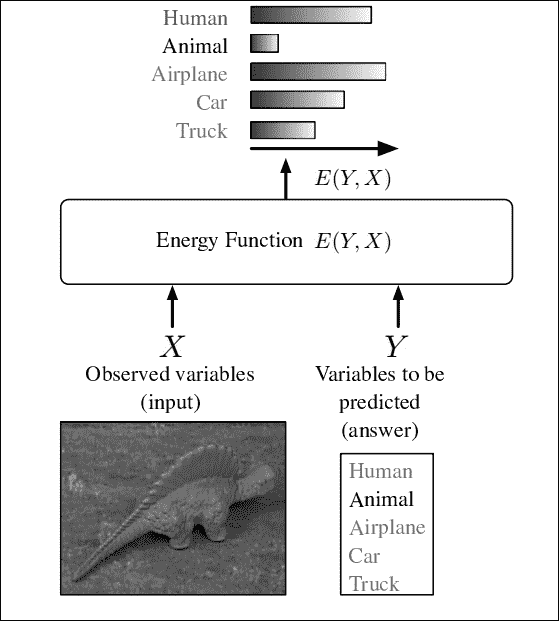
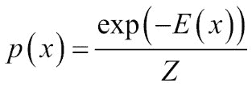
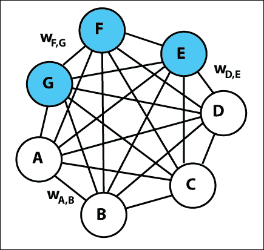
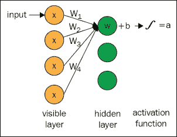
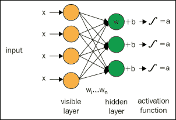
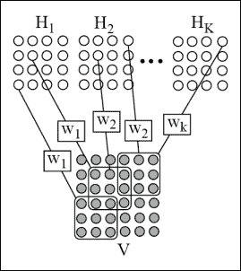
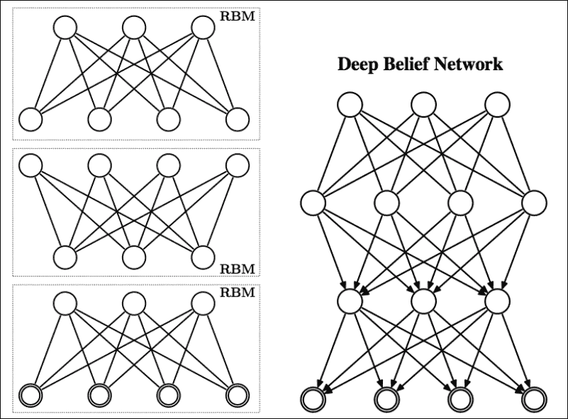
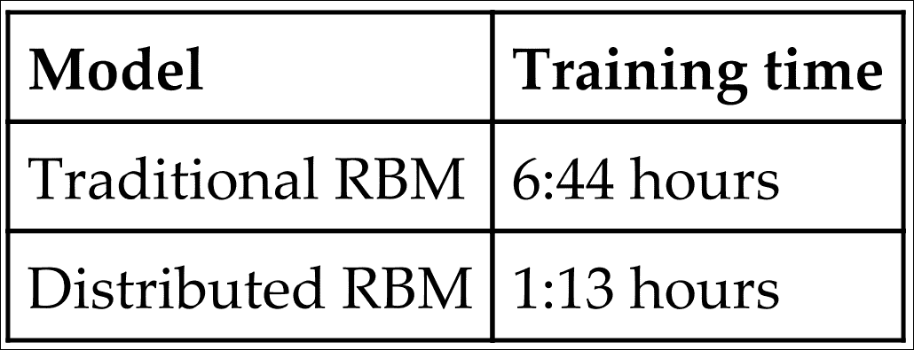

# 五、受限玻尔兹曼机

|   | *“我不能创造的，我不明白。”* |   |
|   | - *理查德·费曼* |

到目前为止，在这本书里，我们只讨论了区分模型。这些在深度学习中的用途是模拟未观察变量 y 对观察变量 *x* 的依赖关系。数学上表述为 *P(y|x)* 。在本章中，我们将讨论深度学习中使用的深度生成模型。

生成模型是这样的模型，当给定一些隐藏参数时，它可以从这些参数中随机生成一些可观察的数据值。该模型在标签序列和观察上的联合概率分布上工作。

生成模型用于机器和深度学习，或者作为生成条件概率密度函数的中间步骤，或者直接从概率密度函数中建模观察值。

**受限玻尔兹曼机** ( **RBMs** )是一种流行的生成模型，将在本章中讨论。RBM 基本上是概率图形模型，也可以解释为随机神经网络。

### 注

**随机神经网络**可以定义为一种通过向网络中提供随机变量而生成的人工神经网络。随机变化可以以各种方式提供，例如提供随机权重或通过给定网络的神经元随机传递函数。

在这一章中，我们将讨论一种叫做 RBM 的特殊类型的玻尔兹曼机，这是这一章的主题。我们将讨论**基于能源的模型** ( **电子商务管理系统**)如何与 RBM 相关，以及它们的功能。本章后面我们将介绍**深信网** ( **DBN** )，它是 RBM 的延伸。本章将讨论这些在分布式环境中的大规模实现。这一章将以 RBM 和 DBN 的深度学习 4j 为例来结束。

本章的组织如下:

*   基于能源的模型
*   玻尔兹曼机
*   受限玻尔兹曼机
*   卷积受限玻尔兹曼机
*   深度信念网络
*   分布式深度信念网络
*   深度学习在 RBM 和 DBN 的实施 4j

# 基于能量的模型

深度学习和统计建模的主要目标是编码变量之间的依赖关系。通过从已知变量的值中了解这些依赖关系，模型可以回答关于未知变量的问题。

**基于能量的模型**(**EBMs**)【120】通过识别定标器能量来收集依赖关系，定标器能量通常是对变量的每个配置的兼容性的度量。在循证医学中，预测是通过设定观察变量的值和寻找未观察变量的值来进行的，这使得总能量最小化。循证医学中的学习包括制定一个能量函数，该函数将低能量赋给未观测变量的正确值，将高能量赋给不正确的值。基于能量的学习可以被视为分类、决策或预测任务的概率估计的替代方法。

为了清楚地了解循证医学是如何工作的，让我们看一个简单的例子。

如图 F *图 5.1* 所示，我们来考虑两组变量，观察到的和未观察到的，分别是 *X* 和 *Y* 。图中的变量 *X* 代表图像中像素的集合。变量 *Y* 是离散的，包含分类所需对象的可能类别。变量 *Y* 在这种情况下，由六个可能的值组成，即:飞机、动物、人、汽车、卡车，以上都不是。该模型用作能量函数，将测量 *X* 和 *Y* 之间映射的正确性。

该模型使用了一个惯例，即小的能量值意味着变量的高度相关的配置。另一方面，随着能量值的增加，变量的不相容性也同样增加。与 *X* 和 *Y* 变量相关的函数称为能量函数，表示如下:


在能量模型的情况下，输入 *X* 是从周围环境中收集的，并且模型生成输出 Y，该输出更可能回答关于观测变量 *X* 的问题。模型需要产生值 *Y <sup>/</sup>* ，从一组 *Y** 中选择，这将使能量函数 *E(Y，X)* 的值最小。数学上，这表示如下:


下面的*图 5.1* 描述了上一节提到的整体示例的框图:



图 5.1:图中显示了一个能量模型，该模型计算观察到的变量 X 和未观察到的变量 Y 之间的兼容性。图像中的 X 是一组像素，Y 是用于对 X 进行分类的级别集。该模型发现选择“动物”会使能量函数值最小。图片取自[121]

深度学习中的循证医学与概率有关。概率与 *e* 的负能量成正比:


EBMs 通过公式函数 *E(x)* 间接定义概率。指数函数确保概率总是大于零。这也意味着，在基于能量的模型中，人们总是可以根据观察到的和未观察到的变量自由选择能量函数。尽管基于能量的模型中的分类概率可以任意接近零，但它永远不会达到零。

前面方程形式的分布是玻尔兹曼分布的一种形式。因此，电子制动系统通常被称为**玻尔兹曼机**。我们将在本章的后续章节中解释玻尔兹曼机及其各种形式。

# 玻尔兹曼机

玻尔兹曼机[122]是对称连接的神经元单元网络，用于给定数据集上的随机决策。最初，他们被引入学习二进制向量的概率分布。玻尔兹曼机具有简单的学习算法，这有助于它们推断和得出关于包含二进制向量的输入数据集的有趣结论。在具有多层特征检测器的网络中，学习算法变得非常慢；但是，每次使用一层特征检测器，学习速度会快得多。

为了解决学习问题，玻尔兹曼机由一组二进制数据向量组成，并更新相应连接上的权重，以便数据向量成为权重所奠定的优化问题的良好解决方案。为了解决学习问题，玻尔兹曼机对这些权重进行了大量的小更新。

二维二进制向量上的玻尔兹曼机可以定义为*x{ 0，1} <sup> d </sup>* 。如前一节所述，玻尔兹曼机是一种基于能量的函数，其联合概率函数可以使用下面给出的能量函数来定义:



这里， *E(x)* 为能量函数， *Z* 为确定*<sub>x</sub>P(x)= 1*的配分函数。玻尔兹曼机的能量函数如下:


这里， *W* 是模型参数的权重矩阵， *b* 是偏差参数的向量。

玻尔兹曼机，如 EBMs，对观察到的和未观察到的变量进行工作。当观察到的变量不是更高的数时，玻尔兹曼机工作得更有效。在这些情况下，未观察到的或隐藏的变量表现得像多层感知器的隐藏单元，并显示出可见单元之间的高阶相互作用。

玻尔兹曼机在隐藏层之间以及可见单元之间都有层间连接。*图 5.2* 显示了玻尔兹曼机的图示:



图 5.2:图 5 显示了一个简单的玻尔兹曼机的图形表示。图中的无向边表示节点之间的依赖关系，w <sub>i，j</sub> 表示节点 I 和 j 之间关联的权重。图中显示了 3 个隐藏节点和 4 个可见节点

玻尔兹曼机的一个有趣的特性是，学习规则不会随着隐藏单元的增加而改变。这最终有助于学习二进制特征，以捕获输入数据中的高阶结构。

玻尔兹曼机表现为离散变量上概率质量函数的通用逼近器。

### 注

在统计学习中，**最大似然估计** ( **最大似然估计**)是通过找到一个或多个参数的值来找到给定观测值的统计模型的参数的过程，这最大化了用参数进行观测的可能性。

## 玻尔兹曼机是如何学习的

玻尔兹曼机的学习算法一般基于最大似然估计方法。当用基于最大似然估计的学习规则训练玻尔兹曼机时，连接模型两个单元的特定权重的更新将仅依赖于这两个相关单元。网络的其他单元参与修改生成的统计数据。因此，可以在不让网络其他人知道的情况下更新权重。换句话说，网络的其余部分只能知道最终的统计数据，但不知道统计数据是如何计算的。

## 短缺

在玻尔兹曼机中，由于有许多隐藏层，网络变得极其庞大。这使得模型通常很慢。玻尔兹曼机停止对大规模数据的学习，因为机器的规模也同时呈指数级增长。对于大型网络，权重通常非常大，平衡分布也变得非常高。不幸的是，这给玻尔兹曼机带来了一个重大问题，最终导致达到分布平衡状态的时间更长。

这种限制可以通过限制两层之间的连通性来克服，从而通过一次学习一个潜在层来简化学习算法。

# 受限玻尔兹曼机

**受限玻尔兹曼机** ( **RBM** )是用于深度学习的深度概率模型构建块的经典示例。RBM 本身不是深度模型，但可以作为构建其他深度模型的基础。事实上，径向基函数是由一层观察变量和一层隐藏变量组成的无向概率图形模型，可以用来学习输入的表示。在本节中，我们将解释如何使用 RBM 来构建许多更深层次的模型。

让我们考虑两个例子来看看 RBM 的用例。RBM 主要采用二元因素分析。假设我们有一家餐馆，想让顾客给食物打分，从 0 到 5。在传统的方法中，我们将尝试根据变量的隐藏因素来解释每个食品和顾客。例如，像意大利面和千层面这样的食物会与意大利因素有很强的联系。另一方面，RBM 采用了不同的方法。他们没有要求每个顾客对食物进行连续评分，而是简单地提到他们是否喜欢，然后 RBM 会试图推断各种潜在因素，这有助于解释每个顾客食物选择的激活。

另一个例子是根据某人喜欢的电影类型来猜测他的电影选择。假设 X 先生在给定的电影集上提供了他的五个二进制偏好。RBM 的工作是根据隐藏的单位激活他的偏好。所以，在这种情况下，这五部电影会向所有隐藏单元发送消息，要求它们更新自己。然后，RBM 会根据之前给这个人的一些偏好，以很高的概率激活隐藏单元。

## 基本架构

RBM 是一个浅层的两层神经网络，用作构建深层模型的基础。RBM 的第一层称为观察层或可见层，第二层称为潜层或隐层。它是一个二分图，在观察层的任何变量之间，或者在潜在层的任何单元之间，都不允许有相互联系。如图*图 5.3* 所示，各层之间没有层内通信。由于这种限制，该模型被称为**受限玻尔兹曼机**。每个节点都用于处理输入的计算，并通过随机(随机确定)决定是否传递输入来参与输出。

### 注

二部图是这样一种图，其中顶点可以分成两个不相交的集合，这样每条边都将一个集合的顶点连接到另一个集合。但是，同一集合的顶点之间没有任何联系。顶点集通常被称为图的一部分。

RBM 的两层背后的主要直觉是，有一些可见的随机变量(例如，来自不同顾客的食物评论)和一些潜在的变量(例如菜系、顾客的国籍或其他内部因素)，训练 RBM 的任务是找到这两组变量如何相互关联的概率。

为了从数学上表述 RBM 的能量函数，让我们用向量 *v* 来表示由一组*n<sub>v</sub>T3】二元变量组成的观测层。 *n <sub>h</sub>* 二进制随机变量的隐藏或潜在层表示为 *h* 。*

类似于玻尔兹曼机，RBM 也是一个基于能量的模型，其中联合概率分布由其能量函数决定:


图 5.3:图中显示了一个简单的 RBM。该模型是一个对称的二部图，其中每个隐藏节点连接到每个可见节点。隐藏单位表示为 h <sub>i</sub> ，可见单位表示为 v <sub>i</sub>

具有二进制可见和潜在单位的 RBM 的能量函数如下:


这里， *a* 、 *b* 和 *W* 是不受约束的、可学习的实值参数。从前面的*图 5.3* 我们可以看到模型被拆分成两组变量， *v* 和 *h* 。单元之间的相互作用由矩阵 *W* 描述。

## 成果预算制如何运作

因此，我们现在已经了解了 RBM 的基本架构，在本节中，我们将讨论该模型的基本工作过程。RBM 得到了一个它应该从中学习的数据集。模型的每个可见节点从数据集的一个项目接收一个低级特征。例如，对于灰度图像，最低级别项目是图像的一个像素值，可见节点将接收到该像素值。因此，如果图像数据集有 n 个像素，处理它们的神经网络也必须在可见层上拥有 n 个输入节点:


图 5.4:图中显示了一条输入路径的 RBM 计算

现在，让我们通过两层网络传播一个单像素值 *p* 。在隐藏层的第一个节点，将 *p* 乘以权重 *w* ，并添加到偏差中。最后的结果被输入到激活函数，激活函数产生节点的输出。给定输入像素 *p* ，该操作产生的结果可以被称为通过该节点的信号强度。*图 5.4* 显示了单输入 RBM 涉及的计算的可视化表示。


RBM 的每个可见节点都与一个单独的权重相关联。来自不同单元的输入在一个隐藏的节点上合并。输入的每个 *p* (像素)乘以与之相关的单独权重。产品被总结并添加到一个偏见。该结果通过激活函数传递，以生成节点的输出。下面的*图 5.5* 显示了 RBMs 可视层的多个输入所涉及的计算的可视化表示:



图 5.5:图中显示了具有多个输入和一个隐藏单元的 RBM 的计算

前面的*图 5.5* 显示了如何使用与每个可见节点相关联的权重来计算隐藏节点的最终结果。



图 5.6:图中显示了一个 RBM 涉及多个可见单元和隐藏单元的计算

如前所述，径向基函数类似于二部图。此外，该机器的结构基本上类似于对称二分图，因为从所有可见节点接收的输入被传递到 RBM 的所有潜在节点。

对于每个隐藏节点，每个输入 p 乘以其各自的权重 *w* 。因此，对于单个输入 *p* 和 *m* 数量的隐藏单元，该输入将具有与之相关联的 *m* 权重。在*图 5.6* 中，输入 *p* 将有三个权重，总共 12 个权重:可见层的四个输入节点和下一层的三个隐藏节点。两层之间关联的所有权重形成一个矩阵，其中行等于可见节点，列等于隐藏单元。在上图中，第二层的每个隐藏节点接受四个输入乘以它们各自的权重。乘积的最终和再加到一个偏差上。然后，这个结果通过激活算法，为每个隐藏层产生一个输出。*图 5.6* 表示在这种情况下发生的整体计算。

有了堆叠的 RBM，它将形成更深层的神经网络，其中第一个隐藏层的输出将作为输入传递给下一个隐藏层。这将通过尽可能多的隐藏层传播，以达到所需的分类层。在接下来的部分，我们将解释如何使用 RBM 作为深度神经网络。

# 卷积受限玻尔兹曼机

非常高维的输入，如图像或视频，给传统机器学习模型的内存、计算和操作要求带来巨大压力。在[第三章](3.html "Chapter 3.  Convolutional Neural Network")、*卷积神经网络*中，我们已经展示了用小核的离散卷积运算代替矩阵乘法是如何解决这些问题的。展望未来，Desjardins 和 Bengio [123]已经表明，当应用于成果管理制时，这种方法也能很好地工作。在本节中，我们将讨论这个模型的功能。


图 5.7:图中显示了观察到的变量或 RBM 的可见单位可以与图像的小批量相关联来计算最终结果。权重连接代表一组过滤器

此外，在正常的径向基函数中，可见单元通过不同的参数和权重与所有隐藏变量直接相关。根据空间局部特征来描述图像理想地需要较少的参数，这可以被更好地概括。这有助于从高维图像中检测和提取相同的局部特征。因此，使用 RBM 从图像中检索所有全局特征用于对象检测并不那么令人鼓舞，尤其是对于高维图像。一种简单的方法是在从输入图像中采样的小批量上训练 RBM，将其放在 Hadoop 的数据节点上的块中以生成本地特征。这种被称为基于面片的 RBM 的方法的表示如图 5.7 所示。然而，这有一些潜在的局限性。Hadoop 分布式环境中使用的基于补丁的 RBM 不遵循小批量的空间关系，而是将每个映像的小批量视为附近补丁中的独立补丁。这使得从相邻面片中提取的特征是独立的，并且有些明显冗余。

为了处理这种情况，使用了**卷积受限玻尔兹曼机** ( **CRBM** )，这是传统 RBM 模型的扩展。CRBM 在结构上几乎类似于 RBM，这是一个两层模型，其中可见和隐藏的随机变量被构造成矩阵。因此，在 CRBM，可以为可见单元和隐藏单元定义位置和邻域。在 CRBM，可见矩阵代表图像，矩阵的小窗口定义图像的小批量。CRBM 的隐藏单元被划分成不同的特征地图，以在可见单元的多个位置定位多个特征的存在。要素地图中的单位在可见单位的不同位置表示相同的要素。CRBM 的隐藏-可见连接完全是局部的，权重通常在隐藏单元的集群中分割。

CRBM 的隐藏单元用于从重叠的小型可见单元批次中提取特征。此外，相邻迷你批次的特征相互补充，并协作来对输入图像进行建模。

*图 5.8* 为 CRBM，可见单元矩阵 **V** 和隐藏单元矩阵 **H** ，与 *K 3*3* 滤波器连接，即 **W <sub>1</sub>** 、 **W <sub>2</sub>** 、 **W <sub>3</sub>** ，... **W <sub>K</sub>** 。图中隐藏单元拆分为 **K** 称为特征图的子矩阵，**H<sub>1</sub>T29】**H<sub>2</sub>T33】，... **H <sub>K</sub>** 。每个隐藏单元 **H <sub>i</sub>** 表示在可见单元的 *3*3* 邻域存在特定特征。****

与基于补丁的 RBM 不同，CRBM 在整个输入图像或图像的大区域上进行训练，以学习局部特征并利用重叠的小批次的空间关系，在 Hadoop 上以分布式方式进行处理。重叠小批量的隐藏单元在 CRBM 中相互依赖和合作。因此，一个隐藏的单元，一旦被解释，就不需要在邻域重叠的小批量中被再次解释。这反过来有助于减少功能的冗余。



图 5.8:CRBM 涉及的计算如图所示

## 堆叠卷积受限玻尔兹曼机

CRBMs 可以堆叠在一起，形成深度神经网络。**堆叠卷积受限玻尔兹曼机** ( **堆叠 CRBMs** )可以采用自下而上的方法逐层训练，类似于全连接神经网络的逐层训练。在每个 CRBM 滤波层之后，在堆叠网络中，实现确定性子采样方法。对于特征的二次采样，在非重叠图像区域中执行最大池化。汇集层，如[第 3 章](3.html "Chapter 3.  Convolutional Neural Network")、*卷积神经网络*所述，有助于最小化特征的维度。除此之外，它还使特征对小的移动具有鲁棒性，并有助于传播更高级的特征以在输入图像的区域上生长。

深层 CRBMs 需要池化操作，因此每个连续层的空间大小都会减小。尽管大多数传统卷积模型对各种空间大小的输入都能很好地工作，但对于玻尔兹曼机来说，改变输入大小变得有些困难，这主要有几个原因。首先，能量函数的配分函数随着输入的大小而变化。其次，卷积网络通过增加与输入大小成比例的汇集函数的大小来获得大小不变性。然而，扩大玻尔兹曼机的汇集区域是非常困难的。

对于 CRBMs 来说，位于图像边界的像素也带来了困难，而玻尔兹曼机本质上是对称的这一事实又加剧了困难。这可以通过对输入进行隐式零填充来消除。请记住，零填充输入通常由较小的输入像素驱动，这些像素在需要时可能不会被激活。

# 深度信念网络

**深度信念网络** ( **数据库网络**)是最受欢迎的非卷积模型之一，可以在 2006-07 年成功部署为深度神经网络[124] [125]。深度学习的复兴可能始于 2006 年 DBNs 的发明。在引入数据库网络之前，深度模型的优化非常困难。通过超越**支持向量机** ( **支持向量机**，数据库网络已经表明深度模型可以真正成功；虽然，与其他生成式或无监督学习算法相比，DBNs 的受欢迎程度有所下降，目前很少使用。然而，它们在深度学习的历史中仍然发挥着非常重要的作用。

### 注

只有一个隐藏层的 DBN 只是一个 RBM。

数据库网络是由一层以上的隐藏变量组成的生成模型。隐藏变量本质上一般是二元的；然而，可见单位可能由二进制或实数组成。在分布式数据库网络中，每一层的每一个单元都与其相邻层的每一个单元相连接，尽管可能存在具有稀疏连接单元的 DBN。中间层之间没有连接。如图*图 5.9* 所示，数据库网络基本上是由若干个 RBM 组成的多层网络。上面两层之间的连接是无方向的。但是，所有其他层之间的连接是定向的，箭头指向最接近数据的层。

除了堆栈的第一层和最后一层，DBN 的每一层都有两个用途。首先，它作为其前一层的隐藏层，并作为其下一层的可见层或输入。DBNs 主要用于视频序列和图像的聚类、识别和生成。



图 5.9:由三个成果管理制组成的 DBN 如图所示

## 贪婪分层训练

2006 年提出了一种贪婪的分层训练算法来训练数据库网络[126]。这个算法一次训练 DBN 一层。在这种方法中，首先训练 RBM，它将实际数据作为输入并对其建模。

一级 DBN 就是 RBM。贪婪分层方法的核心思想是，在训练了一个 m 级 DBN 的顶级 RBM 之后，在一个( *m+1* )级 DBN 中添加参数的同时，参数的解释发生了变化。在 RBM，在层( *m-1* )和 *m* 之间，层 *m* 的概率分布是根据那个 RBM 的参数定义的。然而，在 DBN 的情况下，层 *m* 的概率分布是根据上层的参数来定义的。这个过程可以无限地重复，以连接任意多层的数据库网络。

# 分布式深度信念网络

到目前为止，DBNs 在语音和电话识别[127]、信息检索[128]、人体运动建模[129]等众多应用中取得了很大成就。然而，RBM 和 DBNs 的顺序实现都有各种限制。在大规模数据集上，由于所涉及的长时间、耗时的计算、算法的内存需求等，模型在应用中表现出各种缺点。为了处理大数据，成果管理制和数据库网络需要分布式计算来提供可扩展、一致和高效的学习。

为了使数据库网络默认存储在计算机集群上的大规模数据集，数据库网络应该获得一种基于 Hadoop 和 Map-Reduce 的分布式学习方法。[130]中的论文展示了一种针对 RBM 每一级的键值对方法，其中预训练是在 Map-Reduce 框架中的分布式环境中分层完成的。学习是在 Hadoop 上通过迭代计算方法对训练 RBM 进行的。因此，分布式数据库网络的分布式训练是通过堆叠多个径向基函数实现的。

## 受限玻尔兹曼机的分布式训练

如前所述，RBM 的能量函数由下式给出:


让一个输入数据集 *I = {x <sub>i</sub> = i= 1，2，...N}* 用于 RBM 的分布式学习。如前一节所述，对于 DBN 的学习，首先通过使用贪婪的分层无监督训练来初始化 RBM 的每个级别中的权重和偏差。分布式训练的目的是学习重量和相关偏差 *b* 和 *c* 。对于使用地图缩减的分布式 RBM，一个地图缩减作业在每个时代都是必不可少的。

对于矩阵-矩阵乘法，使用 Gibbs 抽样，并且对于 RBMs 的训练，花费大部分计算时间。因此，为了缩短计算时间，吉布斯采样可以在地图阶段分布在运行 Hadoop 框架上不同数据节点的多个数据集之间。

### 注

Gibbs 抽样是一种**马尔可夫链蒙特卡罗** ( **MCMC** )算法，用于在传统的直接抽样变得困难时，确定根据指定的多元概率分布估计的观测序列。

最初，初始化训练所需的不同参数，例如可见层和隐藏层的神经元数量、输入层偏差 *a* 、隐藏层偏差 *b* 、权重 *W* 、时期数量(比如说 *N* )、学习速率等等。时代的数量表示地图和缩减阶段将重复 *N* 次。对于每个时期，映射器针对数据节点的每个块运行，并执行吉布斯采样以计算 *W* 、 *a* 和 *b* 的近似梯度。然后，减速器用下一个时期所需的计算增量更新这些参数。因此，从第二个时期开始，映射阶段的输入值，即 *W* 、 *a* 和 *b* 的更新值，是根据前一个时期减速器的输出来计算的。

输入数据集 I 被分成许多块，并存储在不同的块中，在每个数据节点上运行。运行在块上的每个映射器将计算存储在该块上的特定块的权重和偏差的近似梯度。然后，减速器计算相应参数的增量，并相应地更新它们。该过程将结果参数和更新值视为该特定时期的地图缩减阶段的最终结果。在每个时期之后，如果是最终时期，缩减器决定是否存储学习的权重，或者是否增加时期索引并将键值对值传播到下一个映射器。

## 深度信念网络的分布式训练

对于隐藏层数为 *L* 的分布式数据库神经网络的分布式训练，采用预训练 *L* 径向基函数神经网络进行学习。底层 RBM 按照讨论的那样进行训练，但是，对于其余的( *L-1* )径向基函数，输入数据集会针对每个级别进行更改。

*m <sub>第</sub>T3】级( *L  m > 1* ) RBM 的输入数据将是( *m-1* ) <sub>第</sub>级 RBMs 的隐藏节点的条件概率:*


### 分布式反向传播算法

这是反向传播算法的分布式训练的第二阶段，以调整全局网络。在此过程中，在计算权重梯度时，前馈和反向传播方法占据了大部分计算时间。因此，对于每个时期，为了更快地执行，这个过程应该在输入数据集的每个小批量上并行运行。

在程序的第一步，学习到的重量为一个 *L* 级 DBN，即 *W1* 、 *W2* 、*...WL* 被载入内存，其他超参数被初始化。在这个微调阶段，map 和 reduce 阶段的主要工作类似于 RBMs 分布式训练。映射器将确定权重的梯度，并最终更新权重增量。缩减器从一个或多个权重更新权重增量，并将输出传递给映射器以执行下一次迭代。

该过程的主要目的是通过将标签层放置在全局网络的顶部并迭代地调整整个层的权重来获得模型的一些辨别能力。

### 成果管理制和数据库管理系统的性能评价

论文[130]在 Hadoop 集群上进行了分布式 RBM 和 DBN 的实验，以提供与传统顺序方法的比较研究。在 MNIST 数据集上进行了手写数字识别实验。训练集有 60，000 个图像，测试集有 10，000 个图像。HDFS 的数据块大小设置为 64 MB，复制因子为 4。所有节点都设置为最多运行 26 个映射器和 4 个缩减器。感兴趣的读者可以修改块大小和复制因子，以查看使用这些参数的实验的最终结果。

#### 训练时间大幅提升

本实验的目的是在训练时间方面比较分布式径向基函数和数据库网络与传统的训练策略(顺序的)。顺序程序在一个中央处理器上执行，而分布式程序在一个节点的 16 个中央处理器上执行。这两个实验都是在前面提到的 MNIST 数据集上进行的。获得的结果汇总在*表 5.1* 和*表 5.2:* 中



表 5.1:该表显示了完成分布式和顺序式成果管理制培训所需的时间


表 5.2:该表表示完成分布式和顺序数据库网络的训练所需的时间

表中显示的数据清楚地描述了使用 Hadoop 的分布式成果管理制和数据库网络相对于传统的顺序方法的优势。模型的分布式方法的训练时间比顺序方法有了显著的改进。此外，使用 Hadoop 框架进行分发的一个关键优势是，它可以根据训练数据集的大小以及用于分发它的机器数量进行非常好的扩展。

本章的下一节将演示使用 Deeplearning4j 的两种模型的编程方法。

# 使用深度学习实现 4j

本章的这一部分将提供如何使用 Deeplearning4j 编写成果管理制和数据库网络代码的基本思路。读者将能够学习使用本章中提到的各种超参数的语法。

要使用 Deeplearning4j 实现成果管理制和数据库网络，整个想法非常简单。整个实现可以分为三个核心阶段:加载数据或准备数据、网络配置以及模型的训练和评估。

在本节中，我们将首先讨论基于虹膜数据集的径向基函数，然后讨论数据库网络的实现。

## 受限玻尔兹曼机

对于 RBMs 的构建和训练，首先我们需要定义和初始化模型所需的超参数:

```scala
Nd4j.MAX_SLICES_TO_PRINT = -1; 
Nd4j.MAX_ELEMENTS_PER_SLICE = -1; 
Nd4j.ENFORCE_NUMERICAL_STABILITY = true; 
final int numRows = 4; 
final int numColumns = 1; 
int outputNum = 10; 
int numSamples = 150; 

```

这里的 batchsize 可以初始化为`150`，也就是说数据集的`150`个样本一次提交给 Hadoop 框架。请放心，所有其他参数都已初始化，就像我们在前面几章中所做的那样。

```scala
int batchSize = 150; 
int iterations = 100; 
int seed = 123; 
int listenerFreq = iterations/2; 

```

在下一阶段，基于定义的`batchsize`和每批样本数量，将虹膜数据集加载到系统中:

```scala
log.info("Load data....");
DataSetIterator iter = new IrisDataSetIterator(batchSize, numSamples); 
DataSet iris = iter.next();

```

这里，使用`NeuralNetConfiguration.Builder()`将 RBM 创建为图层。类似地，受限玻尔兹曼的对象用于存储属性，例如分别应用于观察层和隐藏层的变换-高斯和校正线性变换:

```scala
NeuralNetConfiguration conf = new NeuralNetConfiguration.Builder()
.regularization(true)       
 .miniBatch(true) 
.layer(new RBM.Builder().l2(1e-1).l1(1e-3) 
    .nIn(numRows * numColumns)       
    .nOut(outputNum)
```

`ReLU`用于激活功能:

```scala
.activation("relu") 

```

`weightInit()`函数用于权重的初始化，表示放大进入每个节点的输入信号所需的系数的起始值:

```scala
.weightInit(WeightInit.RELU) 
 .lossFunction(LossFunctions.LossFunction.RECONSTRUCTION
     _CROSSENTROPY.k(3) 

```

可见单元使用高斯变换，隐藏层使用校正线性变换。这在深度学习 4j 中非常简单。我们需要通过参数`VisibleUnit`。`GAUSSIAN`和`HiddenUnit.RECTIFIED`里面的`.visibleUnit`和`.hiddenUnit`方法:

```scala
.hiddenUnit(HiddenUnit.RECTIFIED).visibleUnit(VisibleUnit.GAUSSIAN) 
 .updater(Updater.ADAGRAD).gradientNormalization(Gradient
     Normalization.ClipL2PerLayer) 
    .build())       
  .seed(seed)    
  .iterations(iterations) 

```

反向传播步长在此定义:

```scala
.learningRate(1e-3)
  .optimizationAlgo(OptimizationAlgorithm.LBFGS)       
  .build();       

Layer model = LayerFactories.getFactory(conf.getLayer()).create(conf);       
model.setListeners(new ScoreIterationListener(listenerFreq));

log.info("Evaluate weights....");       
INDArray w = model.getParam(DefaultParamInitializer.WEIGHT_KEY);       
log.info("Weights: " + w);
```

要缩放到数据集，可以使用数据集类的对象调用`scale()`:

```scala
iris.scale(); 

```

在早期过程中完成评估后，模型现在已经完全准备好接受训练。可以使用`fit()`方法以类似的方式对其进行训练，就像对早期模型所做的那样，并将`getFeatureMatrix`作为参数:

```scala
log.info("Train model....");       
for(int i = 0; i < 20; i++)
  {       
   log.info("Epoch "+i+":");model.fit(iris.getFeatureMatrix()); }
```

## 深度信念网络

正如本章所解释的，DBN 是限制性商业惯例数量的叠加版本。在这一部分中，我们将展示如何使用 Deeplearning4j 以编程方式部署数据库网络。程序的流程将遵循其他模型的标准程序。使用 Deeplearning4j 实现简单的数据库网络非常简单。该示例将展示如何使用数据库网络训练和遍历输入 MNIST 数据。

对于 MNIST 数据集，下面一行指定 batchsize 和示例数，用户将指定这些示例一次在 HDFS 加载数据:

```scala
log.info("Load data....");
DataSetIterator iter = new MnistDataSetIterator(batchSize,numSamples,
true);

```

在下一阶段，将通过将 10 个成果管理制堆叠在一起来构建模型。下面这段代码将指定使用 Deeplearning4j 执行此操作的方式:

```scala
log.info("Build model....");
MultiLayerConfiguration conf = new NeuralNetConfiguration.Builder()
  .seed(seed)
  .iterations(iterations)
  .optimizationAlgo(OptimizationAlgorithm.LINE_GRADIENT_DESCENT)
  .list()
  .layer(0, new RBM.Builder().nIn(numRows * numColumns).nOut(1000)
  .lossFunction(LossFunctions.LossFunction.RMSE_XENT).build())
  .layer(1, new RBM.Builder().nIn(1000).nOut(500)
  .lossFunction(LossFunctions.LossFunction.RMSE_XENT).build())
  .layer(2, new RBM.Builder().nIn(500).nOut(250)
  .lossFunction(LossFunctions.LossFunction.RMSE_XENT).build())
  .layer(3, new RBM.Builder().nIn(250).nOut(100)
  .lossFunction(LossFunctions.LossFunction.RMSE_XENT).build())
  .layer(4, new RBM.Builder().nIn(100).nOut(30)
  .lossFunction(LossFunctions.LossFunction.RMSE_XENT).build())  
  .layer(5, new RBM.Builder().nIn(30).nOut(100)
  .lossFunction(LossFunctions.LossFunction.RMSE_XENT).build())  
  .layer(6, new RBM.Builder().nIn(100).nOut(250)
  .lossFunction(LossFunctions.LossFunction.RMSE_XENT).build())
  .layer(7, new RBM.Builder().nIn(250).nOut(500)
  .lossFunction(LossFunctions.LossFunction.RMSE_XENT).build())
  .layer(8, new  RBM.Builder().nIn(500).nOut(1000)
  .lossFunction(LossFunctions.LossFunction.RMSE_XENT).build())
  .layer(9, new OutputLayer.Builder(LossFunctions.LossFunction.
   RMSE_XENT).nIn(1000).nOut(numRows*numColumns).build())
  .pretrain(true)
  .backprop(true)
  .build();

MultiLayerNetwork model = new MultiLayerNetwork(conf);
model.init();

```

在最后一部分，将使用加载的 MNIST 数据集通过调用`fit()`方法来训练代码:

```scala
log.info("Train model....");
while(iter.hasNext())
  {
   DataSet next = iter.next();
   model.fit(new DataSet(next.getFeatureMatrix(),next.
   getFeatureMatrix()));
  }

```

执行代码后，该过程将给出以下输出:

```scala
Load data.... 
Build model.... 
Train model.... 

o.d.e.u.d.DeepAutoEncoderExample - Train model.... 
o.d.n.m.MultiLayerNetwork - Training on layer 1 with 1000 examples 
o.d.o.l.ScoreIterationListener - Score at iteration 0 is 394.462 
o.d.n.m.MultiLayerNetwork - Training on layer 2 with 1000 examples 
o.d.o.l.ScoreIterationListener - Score at iteration 1 is 506.785 
o.d.n.m.MultiLayerNetwork - Training on layer 3 with 1000 examples 
o.d.o.l.ScoreIterationListener - Score at iteration 2 is 255.582 
o.d.n.m.MultiLayerNetwork - Training on layer 4 with 1000 examples 
o.d.o.l.ScoreIterationListener - Score at iteration 3 is 128.227 

......................................... 

o.d.n.m.MultiLayerNetwork - Finetune phase 
o.d.o.l.ScoreIterationListener - Score at iteration 9 is 132.45428125 

........................... 

o.d.n.m.MultiLayerNetwork - Finetune phase 
o.d.o.l.ScoreIterationListener - Score at iteration 31 is 135.949859375 
o.d.o.l.ScoreIterationListener - Score at iteration 32 is 135.9501875 
o.d.n.m.MultiLayerNetwork - Training on layer 1 with 1000 examples 
o.d.o.l.ScoreIterationListener - Score at iteration 33 is 394.182 
o.d.n.m.MultiLayerNetwork - Training on layer 2 with 1000 examples 
o.d.o.l.ScoreIterationListener - Score at iteration 34 is 508.769 
o.d.n.m.MultiLayerNetwork - Training on layer 3 with 1000 examples 

............................ 

o.d.n.m.MultiLayerNetwork - Finetune phase 
o.d.o.l.ScoreIterationListener - Score at iteration 658 is 142.4304375 
o.d.o.l.ScoreIterationListener - Score at iteration 659 is 142.4311875 

```

# 总结

RBM 是一个生成模型，当一些潜在或隐藏的参数被提供给它时，它可以随机产生可见的数据值。在本章中，我们讨论了玻尔兹曼机的概念和数学模型，玻尔兹曼机是一种基于能量的模型。这一章接着讨论并给出了 RBM 的视觉表现。此外，本章还讨论了 CRBM 算法，它是卷积和径向基函数的结合，用于提取高维图像的特征。然后，我们转向流行的数据库网络，这些网络只不过是基于结果的管理系统的堆叠实现。本章进一步讨论了在 Hadoop 框架中分发成果管理制和数据库网络培训的方法。

我们通过为这两个模型提供代码示例来结束这一章。本书的下一章将介绍另一种称为自编码器的生成模型及其各种形式，如去噪自编码器、深度自编码器等。