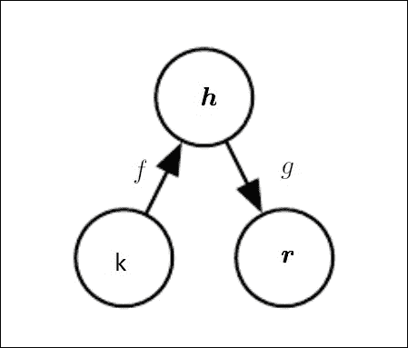
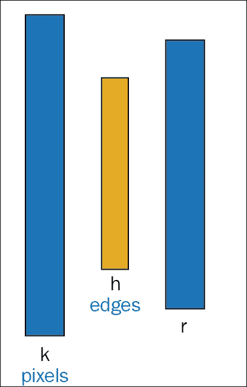
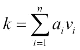
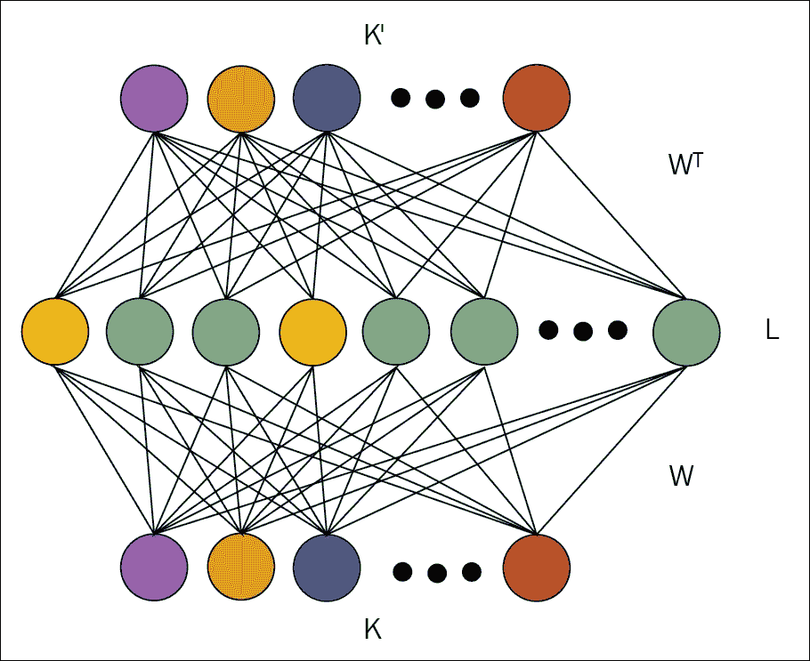

# 六、自编码器

|   | *“人们担心计算机会变得太聪明，接管世界，但真正的问题是它们太愚蠢，它们已经接管了世界。”* |   |
|   | -- *佩德罗·多明戈斯* |

在最后一章中，我们讨论了一个称为受限玻尔兹曼机的生成模型。在本章中，我们将介绍另一种称为**自编码器**的生成模型。自编码器是一种人工神经网络，通常用于降维、特征学习或提取。

随着本章的继续，我们将详细讨论自编码器的概念及其各种形式。我们还将解释术语*正则化自编码器*和*稀疏自编码器*。将讨论稀疏编码的概念以及稀疏自编码器中稀疏因子的选择标准。稍后，我们将讨论深度学习模型 deep autoencoder，以及它使用 Deeplearning4j 的实现。去噪自编码器是传统自编码器的另一种形式，这将在本章的结尾部分讨论。

总的来说，本章分为以下几个小节:

*   自编码器
*   稀疏自编码器
*   深度自编自编自编自编自编自编自编自编自编自编自编自编自编自编自编自编自编自编自编自编自编自编自编自编自编自编自编
*   去噪自编码器
*   自编码器的应用

# 自锚

自编码器是具有一个隐藏层的神经网络，它被训练来学习试图将其输入重构为其输出的恒等式函数。换句话说，自编码器试图通过投影到由隐藏节点定义的低维子空间来复制输入数据。隐藏层 *h* 描述了一个代码，用于表示输入数据及其结构。因此，该隐藏层被迫从其输入训练数据集学习结构，以便它可以在输出层复制输入。

自编码器的网络可以分为两部分:编码器和解码器。编码器由函数 *h=f (k)* 描述，试图重构或复制的解码器由 *r = g (h)* 定义。autoencoder 的基本思想应该是只复制优先输入的那些方面，而不是创建输入的精确副本。它们被设计成这样一种方式，即限制隐藏层仅大致复制，而不是来自输入数据的所有内容。因此，如果自编码器学会为所有的 *k* 值完全设置 *g(f(k) = k* ，它就不会被称为有用的。*图 6.1* 表示自编码器的总体结构，通过代码的内部隐藏层 *h* 将输入 *k* 映射到输出 *r* :



图 6.1:自编码器的一般框图。这里，输入 k 通过隐藏状态或内部表示 h 映射到输出 r。编码器 f 将输入 k 映射到隐藏状态 h，解码器 g 执行 h 到输出 r 的映射

再举一个例子，让我们考虑一下*图 6.2* 。该图显示了一个用于输入图像块的自编码器的实际表示 *k* ，它学习隐藏层 *h* 以输出 *r* 。输入层 *k* 是来自图像块的强度值的组合。隐藏层节点帮助将高维输入层投影到隐藏节点的低维激活值中。隐藏节点的这些激活值被合并在一起以生成输出层 *r* ，其是输入像素的近似。在理想情况下，与输入层节点相比，隐藏层的节点数量通常较少。出于这个原因，他们被迫以仍然可以生成输出层的方式减少信息。



图 6.2:图 6 显示了自编码器如何从输入像素的近似值中学习输出结构的一个实际例子。

将输入的结构复制到输出可能听起来效率不高，但实际上，自编码器的最终结果并不完全取决于解码器的输出。相反，训练自编码器背后的主要思想是复制输入任务的有用属性，这将反映在隐藏层中。

从自编码器中提取所需特征或信息的常见方法之一是将隐藏层 *h* 限制为具有比输入 *k* 更小的尺寸 *(d <sup>/</sup> )* ，尺寸 *d、*即 *d <sup>/</sup> < d* 。由此产生的较小维度层可以称为输入 *k* 的损失压缩表示。隐藏层尺寸小于输入尺寸的自编码器称为*欠采样*。

所描述的学习过程可以数学地表示为最小化损失函数 *L* ，其给出如下:


简单来说， *L* 可以定义为一个损失函数，它惩罚 *g (f (k))* 与输入 *k* 不同。

利用线性解码器功能，自编码器学习形成空间基础，类似于**主成分分析** ( **主成分分析**)程序。收敛后，隐藏层将形成训练数据集的主子空间作为输入所跨越的空间的基础。然而，与主成分分析不同，这些过程不一定需要生成正交向量。因此，具有非线性编码器功能 *f* 和非线性解码器功能 *g* 的自编码器可以学习更强大的主成分分析非线性泛化能力。这将最终在很大程度上增加编码器和解码器的容量。然而，随着容量的增加，自编码器开始显示不需要的行为。

然后，它可以学习在不注意提取所需信息的情况下复制整个输入。从理论上讲，自编码器可能是一维代码，但实际上，一个非常强大的非线性编码器可以学习用代码 *i* 表示每个训练示例 *k(i)* 。解码器然后将这些整数 *(i)* 映射到特定训练示例的值。因此，使用容量更大的自编码器时，仅复制输入数据集中的有用要素会完全失败。

### 注

主成分分析是一种统计方法，它应用正交变换将一组可能相关的观测变量转换成一组称为主成分的线性相关变量。主成分分析法的主成分数小于或等于原始输入变量数。

类似于提到的欠采样自编码器的边缘情况问题，其中隐藏层的尺寸小于输入的尺寸，自编码器，其中隐藏层或代码被允许具有相等的输入尺寸，经常面临相同的问题。

隐藏代码的维数大于输入维数的自编码器称为过完备自编码器。这种类型的自编码器更容易出现上述问题。即使是线性编码器和解码器也可以执行从输入到输出的学习，而无需学习输入数据集的任何期望属性。

## 正则化自编码器

通过为隐藏层选择合适的尺寸，以及根据模型分布的复杂性选择编码器和解码器的容量，可以成功地构建任何类型架构的自编码器。能够提供相同功能的自编码器称为正则化自编码器。

除了将输入复制到输出的能力之外，正则化自编码器还具有损失函数，这有助于模型拥有其他属性。这些包括对缺失输入的鲁棒性、数据表示的稀疏性、表示导数的小性等。即使是非线性且*过完备的*正则化自编码器也能够至少了解一些关于数据分布的信息，而不管模型的容量如何。正则化自编码器[131]能够借助重构误差和正则化器之间的有效对立来捕获训练分布的结构。

# 稀疏自编码器

分布式稀疏表示是深度学习算法中学习有用特征的关键之一。它不仅是一种连贯的数据表示模式，而且有助于捕捉大多数真实世界数据集的生成过程。在本节中，我们将解释自编码器如何促进数据的稀疏性。我们将从介绍稀疏编码开始。当一个输入触发神经网络中相对少量节点的激活时，代码被称为稀疏的，这些节点组合起来以稀疏的方式表示它。在深度学习技术中，使用类似的约束来生成稀疏代码模型，以实现常规的自编码器，这些自编码器用稀疏常数训练，称为稀疏自编码器。

## 稀疏编码

稀疏编码是一种无监督方法，用于学习多组*过完备的*基，以便以连贯有效的方式表示数据。稀疏编码的主要目标是确定一组向量 *(n) v <sub>i</sub>* ，使得输入向量 *k* 可以表示为这些向量的线性组合。

从数学上讲，这可以表示如下:



这里*a<sub>I</sub>T3】是与每个向量相关的系数 *v <sub>i</sub>* <sub>。</sub>*

借助 PCA，我们可以连贯地学习一整套基向量；然而，我们想要学习一组*过完备的*基向量来表示输入向量 *k* ，其中 *n > m* 。使*过完备*基的原因是基向量通常能够捕捉输入数据固有的模式和结构。然而，过完备有时会引起退化，以此为基础，系数 *a <sub> i </sub>* 不能唯一地识别输入向量 *k* 。为此，在稀疏编码中引入了一个称为稀疏性的附加标准。

简单地说，稀疏性可以被定义为具有很少的非零分量或者具有很少的不接近零的分量。如果对于给定的输入向量，非零系数的数量或者离零很远的系数的数量应该很少，则系数集合 *a <sub>i</sub>* 被称为稀疏的。

有了对稀疏编码的基本理解，我们现在可以进入下一部分，了解稀疏编码概念如何用于自编码器来生成稀疏自编码器。

## 稀疏自编码器

当输入数据集保持某种结构时，如果输入特征是相关的，那么即使是简单的自编码器算法也可以发现这些相关性。此外，在这种情况下，一个简单的自编码器最终将学习一个低维表示，这类似于主成分分析。

这种看法是基于这样一个事实，即隐藏层的数量相对较少。然而，通过对网络施加其他约束，即使有大量的隐藏层，网络仍然可以从输入向量中发现期望的特征。

稀疏自编码器通常用于学习特征以执行其他任务，如分类。添加了稀疏性约束的自编码器必须响应其所训练的输入数据集的独特统计特征，而不是简单地充当身份函数。



图 6.3:图中显示了一个稀疏自编码器的典型例子

稀疏自编码器是一种带有稀疏执行器的自编码器，它有助于指导单层网络学习隐藏层代码。这种方法最大限度地减少了重构错误，同时限制了重构输出所需的码字数量。这种稀疏化算法可以看作是一个分类问题，它将输入限制在一个单一的类值，这有助于减少预测误差。

在这一部分，我们将用一个简单的架构来解释稀疏自编码器。*图 6.3* 显示了稀疏自编码器的最简单形式，由单个隐藏层 *h* 组成。隐藏层 *h* 通过权重矩阵 *W* 连接到输入向量 *K* ，形成编码步骤。在解码步骤中，隐藏层 h 借助于捆绑权重矩阵 *W <sup>T</sup>* 输出到重构向量 *K`* 。在网络中，激活函数表示为 *f* ，偏置项表示为 *b* 。激活函数可以是任何函数:线性函数、乙状线函数或 ReLU 函数。

计算隐藏代码 *l* 的稀疏表示的公式如下:


重构输出是隐藏表示，使用以下公式线性映射到输出:


通过重构误差的反向传播进行学习。所有参数均经过优化，以最小化均方误差，如下所示:


现在我们已经有了网络设置，我们可以添加稀疏化组件，它驱动向量 *L* 朝向稀疏表示。这里，我们将使用 k 稀疏自编码器来实现层的稀疏表示。(不要混淆 K-稀疏表示的 *k* 和输入向量的 *K* 。为了区分这两者，我们分别用小 *k* 和大写 *K* 来表示这两个。)

### k-稀疏自编码器

k-Sparse 自编码器[132]是基于一个具有绑定权重和线性激活函数的自编码器。k 稀疏自编码器的基本思想非常简单。在自编码器的前馈阶段，一旦我们计算出隐藏代码 *l = WK + b* ，而不是从所有隐藏单元重建输入，该方法搜索 *k* 最大的隐藏单元，并将剩余隐藏单元的值设置为零。

确定 *k* 最大隐藏单位有替代方法。通过对隐藏单元的活动进行排序或使用 ReLU，调整具有阈值的隐藏单元，直到我们确定 *k* 最大的活动。这个寻找 *k* 最大活动的选择步骤是非线性的。选择步骤的行为类似于正则化，这有助于防止在通过重构输入来构建输出时使用大量隐藏单元。

#### 如何选择稀疏度 k

如果我们实施低稀疏度，比如说 *k=10* ，那么在 k 稀疏自编码器的训练过程中可能会出现问题。一个常见的问题是，在最初的几个时期，算法将积极地开始将单个隐藏单元分配给训练案例组。这些现象可以与 k-means 聚类方法进行比较。在连续的时代，这些隐藏的单位将被选择和重新实施，但其他隐藏的单位不会被调整。

这个问题可以通过以适当的方式调度稀疏级别来解决。让我们假设我们的目标是稀疏度为 10。在这种情况下，我们可以从较大的稀疏度开始，比如说 *k=100* 或 *k=200* 。因此，k 稀疏自编码器可以训练所有存在的隐藏单元。渐渐地，在半个历元内，我们可以将 *k=100* 的稀疏度线性降低到 *k=10* 。这大大增加了所有隐藏单位被选中的几率。然后，我们将在下半个纪元保持 *k=10* 。这样，这种调度将保证即使在低稀疏度的情况下，所有的过滤器都将被训练。

#### 稀疏度的影响

在设计或实现 k 稀疏自编码器时， *k* 值的选择非常关键。 *k* 的值决定了理想的稀疏级别，这有助于使该算法非常适合各种数据集。例如，一个应用可以用于预训练深度辨别神经网络或浅层网络。

如果我们对 *k* 取一个较大的值(比如说在 MNIST 数据集上 *k=200* ，算法将倾向于识别和学习数据集的非常局部的特征。这些特性有时表现得过于过早，不能用于浅层体系结构的分类。浅层架构通常有一个简单的线性分类器，它没有足够的架构强度来合并所有这些特性并获得相当高的分类率。然而，相似的局部特征对于预先训练深度神经网络是非常理想的。

对于稀疏级别的较小值(比如说 MNIST 数据集上的 *k=10* ，使用较小的隐藏单元集从输入中重建输出。这最终导致从数据集中检测全局特征，而不是像前面的情况那样检测局部特征。这些局部性较小的特征适用于分类任务的浅层体系结构。相反，这些类型的情况对于深度神经网络来说并不理想。

# 深度自编码器

到目前为止，我们只讨论了简单自编码器的单层编码器和单层解码器。然而，具有多个编码器和解码器的深度自编码器带来更多优势。

前馈网络在深度时表现更好。自编码器基本上是前馈网络；因此，基本前馈网络的优点也可以应用于自编码器。编码器和解码器是自编码器，也像前馈网络一样工作。因此，我们也可以在这些组件中利用前馈网络的深度优势。

在这种情况下，我们还可以谈论通用逼近器定理，该定理确保具有至少一个隐藏层和足够隐藏单元的前馈神经网络可以以任何精度产生任何任意函数的逼近。遵循这个概念，具有至少一个隐藏层并包含足够的隐藏单元的深度自编码器可以很好地逼近从输入到代码的任何映射。

### 注

人们可以用两层网络以任何精度逼近任何连续函数。在人工神经网络的数学理论中，通用逼近函数指出，前馈网络可以逼近 *R <sup>n</sup>* 的紧致子集的任何连续函数，如果它至少有一个具有有限数量神经元的隐层。

与浅层架构相比，深层自编码器具有许多优势。自编码器不平凡的深度抑制了表示一些函数的计算。此外，自编码器的深度大大减少了学习功能所需的训练数据量。甚至在实验中，已经发现与浅自编码器相比，深自编码器提供更好的压缩。

为了训练深度自编码器，通常的做法是训练一堆浅自编码器。因此，为了训练深度自编码器，经常会遇到一系列浅自编码器。在接下来的小节中，我们将深入讨论深度自编码器的概念。

## 深度自编码器的训练

这里介绍的深度自编码器的设计是基于 MNIST 手写数字数据库的。在论文[133]中，解释了一个结构良好的深度自编码器的构建和训练过程。训练深度自编码器的基础是通过三个阶段，即:预训练、展开和微调。

1.  **Pre-training**: The first phase of training a deep autoencoder is 'pre-training'. The main purpose of this phase is to work on binary data, generalize in to a real-valued data, and then to conclude that it works well for various datasets.

    我们已经有足够的见解，单层隐藏单元不是在一大组图像中建模结构的合适方式。深度自编码器由多层受限玻尔兹曼机组成。在[第 5 章](5.html "Chapter 5.  Restricted Boltzmann Machines")、*受限玻尔兹曼机*中，我们给出了关于受限玻尔兹曼机如何工作的足够信息。使用相同的概念，我们可以继续构建深度自编码器的结构:

    

    图 6.4:深度自编码器的预训练包括学习一堆受限玻尔兹曼机(RBMs)，其中每个 RBM 拥有一层特征检测器。一台受限玻尔兹曼机的学习特性被用作“输入数据”来训练堆栈的下一个 RBM。在预训练阶段之后，所有的 RBM 被展开或展开以构建深度自编码器。然后，使用误差导数的反向传播方法对这种深度自编码器进行微调。

    当 RBM 的第一层由数据流驱动时，该层开始学习特征检测器。这种学习可以被视为下一层学习的输入数据。这样，第一层的特征检测器成为学习受限玻尔兹曼机的下一层的可见单元。这个逐层学习的过程可以根据需要重复多次。这个过程在预先训练深度自编码器的权重方面确实非常有效。在每一层之后捕获的特征在下面隐藏单元的活动之间具有一串高阶相关性。*第一部分图 6.4* 给出了该程序的流程图。在处理基准数据集 MNIST 时，深度自编码器将在每个 RBM 之后使用二进制转换。为了处理实值数据，深度自编码器在每个受限玻尔兹曼机层之后使用高斯校正变换。

    

    图 6.5:编码器和解码器的数量或向量在各阶段如何变化的图示。

2.  **Unrolling**: Once the multiple layers of feature detectors of the deep autoencoders are pre-trained, the whole model is unrolled to generate the encoder and decoder networks, which at first use the same weights. We will explain each of the designs of each part given in the second part of the image separately to have a better understanding of this phase.
    *   **编码器**:对于 *28x28* 像素图像的 MNIST 数据集，网络将获得 784 像素的输入。根据经验法则，深度自编码器第一层的参数数量应该稍大一些。如*图 6.4* 、 **2000** 参数取网络第一层。这听起来可能不合理，因为采用更多参数作为输入会增加网络过度拟合的机会。然而，在这种情况下，增加参数的数量将最终增加输入的特征，这又使得自编码器数据的解码成为可能。
    *   As shown in *Figure 6.4*, the layers would be **2000**, **1000**, **500**, and **30**-nodes wide respectively. A snapshot of this phenomenon is depicted in *Figure 6.5*. In the end, the encoder will produce a vector **30** numbers long. This **30** number vector is the last layer of the encoder of the deep autoencoder. A rough outline for this encoder will be as follows:

        

    *   **Decoder**: The **30** number vectors found at the end of the encoding phase are the encoded version of the 28x28 pixel images. The second part of the deep autoencoder is the decoder phase, where it basically learns how to decode the condensed vector. Hence, the output of the encoder phase (**30**-number vectors) becomes the input of the decoder phase. This half of the deep autoencoder is a feed-forward network, where the encoded condensed vector proceeds towards the reconstructed input after each layer. The layers shown in *Figure 6.4* are **30**, **500**, **1000**, and **2000**. The layers initially possess the same weights as their counterparts in the pre-training network; it is just that the weights are transposed as shown in the figure. A rough outline for this encoder will be as follows:

        

        所以，解码半个深度自编码器的主要目的是学习如何重建图像。该操作在第二前馈网络中执行，第二前馈网络也执行反向传播，反向传播通过重构熵发生。

3.  **微调**:在微调阶段，随机活动被确定性的实值概率所取代。通过使用反向传播方法，与整个深度自编码器的每一层相关联的权重被微调用于最佳重建。

## 使用深度学习实现深度自编码器 4j

所以，你现在有足够的想法如何建立一个深度自编码器使用一些有限的玻尔兹曼机。在本节中，我们将解释如何借助 Deeplearning4j 设计深度自编码器。

我们将使用与上一节相同的 MNIST 数据集，并保持深度自编码器的设计与我们之前解释的相似。

正如在前面的示例中已经解释的那样，从原始 MNIST 数据集使用了 1024 个示例的小批量大小，该数据集可以划分为多个 Hadoop 块。每个工作人员将在 Hadoop 分布式文件系统上并行运行这些 *N* 多个数据块。实现深度自编码器的代码流程简单明了。

步骤如下所示:

1.  在 HDFS 批量加载 MNIST 数据集。每批将包含`1024`个实例。
2.  开始建立模型。
3.  执行编码操作。
4.  执行解码操作。
5.  通过调用`fit()`方法训练模型。

```scala
final int numRows = 28;
```

设置 Hadoop 环境所需的初始配置。`batchsize`设置为`1024`。

```scala
final int numColumns = 28; 
int seed = 123; 
int numSamples = MnistDataFetcher.NUM_EXAMPLES; 
int batchSize = 1024; 
int iterations = 1; 
int listenerFreq = iterations/5; 

```

将数据加载到 HDFS:

```scala
log.info("Load data...."); 
DataSetIterator iter = new  MnistDataSetIterator(batchSize,numSamples,true); 

```

我们现在都准备好构建模型，添加受限玻尔兹曼机的层数来构建深度自编码器:

```scala
log.info("Build model...."); 
MultiLayerConfiguration conf = new NeuralNetConfiguration.Builder() 
  .seed(seed) 
  .iterations(iterations) 
  .optimizationAlgo(OptimizationAlgorithm.LINE_GRADIENT_DESCENT) 

```

为了用指定的层(这里是八层)创建一个列表生成器，我们调用。`list()`方法:

```scala
 .list(8) 

```

现在下一步是构建模型的编码阶段。这可以通过随后将受限玻尔兹曼机添加到模型中来实现。编码阶段有四层受限玻尔兹曼机，其中每一层分别有`2000`、`1000`、`500`和`30`节点:

```scala
  .layer(0, new RBM.Builder().nIn(numRows *    
  numColumns).nOut(2000).lossFunction(LossFunctions.LossFunction
  .RMSE_XENT).build()) 
  .layer(1, new RBM.Builder().nIn(2000).nOut(1000)
  .lossFunction(LossFunctions.LossFunction.RMSE_XENT).build()) 
  .layer(2, new RBM.Builder().nIn(1000).nOut(500)
  .lossFunction(LossFunctions.LossFunction.RMSE_XENT).build()) 
  .layer(3, new RBM.Builder().nIn(500).nOut(30)
  .lossFunction(LossFunctions.LossFunction.RMSE_XENT).build()) 

```

编码器之后的下一个阶段是解码器阶段，我们将以类似的方式再使用四个受限玻尔兹曼机:

```scala
  .layer(4, new RBM.Builder().nIn(30).nOut(500)
  .lossFunction(LossFunctions.LossFunction.RMSE_XENT).build())  
  .layer(5, new RBM.Builder().nIn(500).nOut(1000)
  .lossFunction(LossFunctions.LossFunction.RMSE_XENT).build()) 
  .layer(6, new RBM.Builder().nIn(1000).nOut(2000)
  .lossFunction(LossFunctions.LossFunction.RMSE_XENT).build()) 
  .layer(7, new OutputLayer.Builder(LossFunctions.LossFunction.MSE)
  .activation("sigmoid").nIn(2000).nOut(numRows*numColumns).build()) 

```

由于现在已经构建了所有的中间层，我们可以通过调用`build()`方法来构建模型:

```scala
 .pretrain(true).backprop(true) 
  .build(); 

```

实现的最后一个阶段是训练深度自编码器。可以通过调用`fit ()`方法来完成:

```scala
MultiLayerNetwork model = new MultiLayerNetwork(conf); 
model.init(); 

model.setListeners(new ScoreIterationListener(listenerFreq)); 

log.info("Train model...."); 
while(iter.hasNext())
  { 
   DataSet next = iter.next(); 
   model.fit(new DataSet(next.getFeatureMatrix(),next
   .getFeatureMatrix())); 
  } 

```

# 去噪自编码器

从输入重建输出并不总是能保证期望的输出，有时会以简单地复制输入而告终。为了防止这种情况，在[134]中，提出了一种不同的策略。在该建议的体系结构中，不是在输入数据的表示中放置一些约束，而是基于清除部分损坏的输入来构建重建标准。

> *“一个好的表示是可以从一个被破坏的输入中稳健地获得的，并且对于恢复相应的干净输入是有用的。”*

去噪自编码器是一种以损坏的数据作为输入的自编码器，模型被训练成预测原始的、干净的和未损坏的数据作为其输出。在本节中，我们将解释设计去噪自编码器背后的基本思想。

## 去噪自编码器的体系结构

去噪自编码器背后的主要思想是引入一个损坏过程，即 *Q (k <sup>/</sup> | k)* ，并从损坏的输入 *k <sup>/</sup>* 重建输出 *r* 。*图 6.6* 显示了去噪自编码器的整体表示。在去噪自编码器中，对于训练数据 *k* 的每一个小批次，应该使用 *Q (k <sup>/</sup> | k)* 生成相应的损坏的*k<sup>/</sup>/T17】。从那里，如果我们把初始输入看作是被破坏的输入 *k <sup>/</sup>* ，那么整个模型可以看作是一个基本编码器的一种形式。被破坏的输入 *k <sup>/</sup>* 被映射生成隐藏表示 *h* 。*

因此，我们得到以下结果:


从这个隐藏的表示中，重构的输出 *r* 可以使用 *r = g (h)* 来导出。去噪自编码器重新组织数据，然后尝试了解数据以重建输出。这种数据重组或数据混洗产生噪声，模型从噪声中学习特征，这允许对输入进行分类。在网络训练期间，它产生一个模型，该模型通过损失函数计算该模型和基准之间的距离。其思想是最小化训练集的平均重建误差，以使输出 r 尽可能接近原始未被破坏的输入 *k* 。


图 6.6:设计去噪自编码器的步骤。原始输入为 k；从 k 导出的损坏输入表示为 k <sup>/</sup> 。最终输出表示为 r。

## 堆叠去噪自编码器

构建堆叠去噪自编码器来初始化深度神经网络的基本概念类似于堆叠多个限制性玻尔兹曼机来构建 Deep credit 网络或传统的深度自编码器。仅在每个单独层的初始去噪训练中需要产生损坏的输入，以帮助学习有用的特征提取。

一旦我们知道编码函数 *f* 达到隐藏状态，它就被用在原始的、未被破坏的数据上，以达到下一个级别。一般来说，不会出现损坏或噪声来生成表示，这将作为训练下一层的未损坏输入。堆叠式去噪自编码器的一个关键功能是在输入通过时进行逐层无监督预训练。一旦一个层被预先训练以对来自前一层的输入执行特征选择和提取，就可以进行下一阶段的监督微调，就像传统的深度自编码器一样。

*图 6.7* 展示了设计堆叠式去噪自编码器的详细表示。学习和堆叠去噪自编码器的多个层的整个过程如下图所示:


图 6.7:堆叠去噪自编码器的表示

## 使用深度学习实现堆叠去噪自编码器 4j

通过创建一个拥有自编码器作为其隐藏层的`MultiLayerNetwork`，可以使用深度学习 4j 构建堆叠去噪自编码器。自编码器有一些`corruptionLevel`，称为噪声。

在这里，我们设置了建立模型所需的初始配置。出于说明的目的，采用了一组`1024`数量的例子。输入数和输出数分别取为`1000`和`2`。

```scala
int outputNum = 2;
int inputNum = 1000;
int iterations = 10;
int seed = 123;
int batchSize = 1024;

```

输入数据集的加载与深度自编码器部分所述相同。因此，我们将直接跳到如何构建堆栈去噪自编码器。我们采用了一个五隐藏层深度模型来说明该方法:

```scala
log.info ("Build model....");
MultiLayerConfiguration conf = new NeuralNetConfiguration.Builder ()
.seed(seed)
.gradientNormalization(GradientNormalization
  .ClipElementWiseAbsoluteValue)
.gradientNormalizationThreshold (1.0)
.iterations(iterations)
.updater(Updater.NESTEROVS)
.momentum(0.5)
.momentumAfter(Collections.singletonMap(3, 0.9))
.optimizationAlgo(OptimizationAlgorithm.CONJUGATE_GRADIENT)
.list()
.layer(0, new AutoEncoder.Builder()
.nIn(inputNum)
.nOut(500)
.weightInit(WeightInit.XAVIER)
.lossFunction(LossFunction.RMSE_XENT)

```

以下代码表示有多少输入数据将被损坏:

```scala
.corruptionLevel (0.3)
    .build())
  .layer(1, new AutoEncoder.Builder()
    .nIn(500)
    .nOut(250)
    .weightInit(WeightInit.XAVIER).lossFunction
    (LossFunction.RMSE_XENT)
    .corruptionLevel(0.3)
    .build())
  .layer(2, new AutoEncoder.Builder()
    .nIn(250)
    .nOut(125)
    .weightInit(WeightInit.XAVIER).lossFunction         
    (LossFunction.RMSE_XENT)
    .corruptionLevel(0.3)
    .build())
  .layer(3, new AutoEncoder.Builder()
     .nIn(125)
     .nOut(50)
     .weightInit(WeightInit.XAVIER).lossFunction
     (LossFunction.RMSE_XENT)
     .corruptionLevel(0.3)
     .build())
   .layer(4, new OutputLayer.Builder   
   (LossFunction.NEGATIVELOGLIKELIHOOD)
     .activation("softmax")
     .nIn(75)
     .nOut(outputNum)
     .build())
   .pretrain(true)
.backprop(false)
.build();

```

模型建立后，通过调用`fit()`方法进行训练:

```scala
try {
     model.fit(iter);
    } 
catch(Exception ex)
   {
     ex.printStackTrace();
   }

```

# 自编码器的应用

自编码器可以成功地应用于许多用例中，因此在深度学习领域获得了广泛的应用。在本节中，我们将讨论自编码器的重要应用和用途:

*   **降维**:如果你还记得的话，在[第一章](1.html "Chapter 1. Introduction to Deep Learning")、*深度学习入门*中，我们引入了‘维度诅咒’的概念。降维是深度学习最早的应用之一。最初研究自编码器是为了克服维数灾难的问题。从这一章中，我们已经对深度自编码器如何处理高维数据以降低最终输出的维数有了一个合理的想法。
*   **信息检索**:自编码器一个比较重要的应用是在信息检索方面。信息检索基本上意味着在数据库中搜索与输入的查询相匹配的一些条目。在高维数据中搜索通常是一项繁琐的任务；然而，随着数据集的降维，在某些类型的低维数据中，搜索会变得非常高效。从自编码器获得的降维可以生成低维和二进制性质的代码。这些可以存储在键值存储的数据结构中，其中键是二进制代码向量，值是相应的条目。这样的键值存储通过返回与查询匹配的所有数据库条目来帮助我们执行信息检索。这种通过降维和二进制编码来检索信息的方法被称为语义散列法[135]。
*   **图像搜索**:如深度自编码器部分所述，深度自编码器能够将更高维度的图像数据集压缩到非常少的向量，比如 30 个。因此，这使得高维图像的图像搜索更加容易。一旦图像被上传，搜索引擎会将其压缩成小向量，然后将该向量与其索引中的所有其他向量进行比较。对于搜索查询，包含相似数字的向量将被返回并转换成映射图像。

# 总结

自编码器是最流行和应用最广泛的生成模型之一，本章已经讨论过了。自编码器基本上帮助两个阶段:一个是编码器阶段，另一个是解码器阶段。在本章中，我们用适当的数学解释详细阐述了这两个阶段。接下来，我们解释了一种特殊的自编码器，称为稀疏自编码器。我们还通过解释深度自编码器讨论了如何在深度神经网络世界中使用自编码器。深度自编码器由多层受限玻尔兹曼机组成，这些机器参与网络的编码器和解码器阶段。我们解释了如何使用 Deeplearning4j 部署深度自编码器，方法是将输入数据集的块加载到 Hadoop 分布式文件系统中。在本章的后面，我们介绍了最流行的自编码器形式，称为去噪自编码器，以及其深度网络版本，称为堆叠去噪自编码器。还展示了使用 Deeplearning4j 的堆叠去噪自编码器的实现。我们通过概述自编码器的常见应用来结束本章。

在下一章中，我们将借助 Hadoop 讨论深度学习的一些常见有用应用。