# 第一章：使用 K-最近邻算法进行分类

最近邻算法根据邻居对数据实例进行分类。通过*k*-最近邻算法确定的数据实例的类别是*k*个最近邻居中出现次数最多的类别。

在本章中，我们将涵盖以下主题：

+   如何通过 Mary 及其温度偏好示例实现 k-NN 算法的基本原理

+   如何选择正确的*k*值，以便算法能够正确执行，并且在使用意大利地图示例时具有最高的准确度

+   如何调整值的比例并为 k-NN 算法做准备，以房屋偏好为例

+   如何选择一个合适的度量标准来测量数据点之间的距离

+   如何在高维空间中消除不相关的维度，以确保算法在文本分类示例中能够准确执行

# Mary 及其温度偏好

例如，如果我们知道我们的朋友 Mary 在 10°C 时感觉冷，在 25°C 时感觉温暖，那么在一个温度为 22°C 的房间里，最近邻算法会猜测她会感觉温暖，因为 22 比 10 更接近 25。

假设我们想知道 Mary 在何时感到温暖，何时感到寒冷，如前面的例子所示，但此外，风速数据在询问 Mary 是否感到温暖或寒冷时也可用：

| **温度（°C）** | **风速（km/h）** | **Mary 的感知** |
| --- | --- | --- |
| 10 | 0 | 冷 |
| 25 | 0 | 温暖 |
| 15 | 5 | 冷 |
| 20 | 3 | 温暖 |
| 18 | 7 | 冷 |
| 20 | 10 | 冷 |
| 22 | 5 | 温暖 |
| 24 | 6 | 温暖 |

我们可以通过图表来表示数据，如下所示：

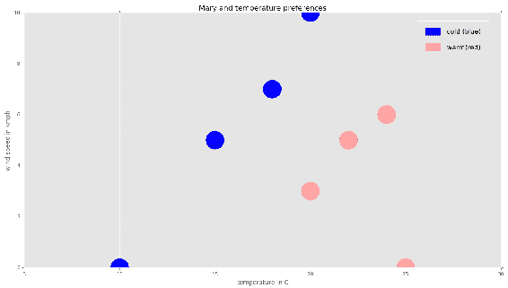

现在，假设我们想通过使用*1*-NN 算法来了解当温度为 16°C、风速为 3 km/h 时，Mary 的感受：

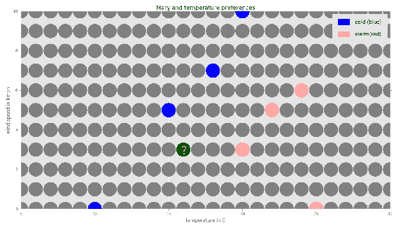

为了简化起见，我们将使用曼哈顿距离度量法来测量网格上相邻点之间的距离。邻居*N[1]=(x[1],y[1])*到邻居*N[2]=(x[2],y[2])*的曼哈顿距离*d[Man]*定义为*d[Man]=|x[1]**-* *x[2]|+|y[1]**-* *y[2]|*。

让我们给网格标上邻居的距离，看看哪个已知类别的邻居距离我们希望分类的点最近：

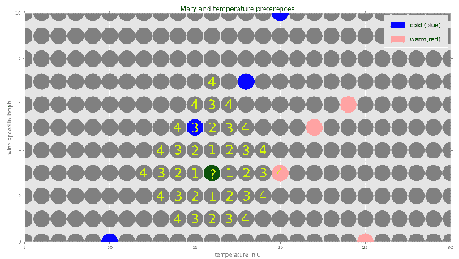

我们可以看到，距离该点最近的已知类别的邻居是温度为 15°C（蓝色）且风速为 5 km/h 的邻居。它与该点的距离为三单位。它的类别是蓝色（冷）。最近的红色（温暖）邻居与该点的距离为四单位。由于我们使用的是 1-最近邻算法，我们只需要查看最近的邻居，因此该点的类别应为蓝色（冷）。

通过对每个数据点应用这个过程，我们可以完成图表，如下所示：

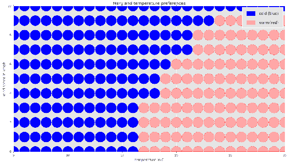

请注意，有时数据点可能距离两个已知类别的距离相同：例如，20°C 和 6 km/h。在这种情况下，我们可以偏好一个类别，或者忽略这些边界情况。实际结果取决于算法的具体实现。

# k 近邻算法的实现

现在，我们将在 Python 中实现 k-NN 算法来查找玛丽的温度偏好。在本节结束时，我们还将实现上一节中生成的数据的可视化，即*玛丽和她的温度偏好*。完整的可编译代码和输入文件可以在本书附带的源代码中找到。最重要的部分已提取并在此呈现：

```py
# source_code/1/mary_and_temperature_preferences/knn_to_data.py # Applies the knn algorithm to the input data.
# The input text file is assumed to be of the format with one line per
# every data entry consisting of the temperature in degrees Celsius,
# wind speed and then the classification cold/warm.

import sys
sys.path.append('..')
sys.path.append('../../common')
import knn # noqa
import common # noqa

# Program start
# E.g. "mary_and_temperature_preferences.data"
input_file = sys.argv[1]
# E.g. "mary_and_temperature_preferences_completed.data"
output_file = sys.argv[2]
k = int(sys.argv[3])
x_from = int(sys.argv[4])
x_to = int(sys.argv[5])
y_from = int(sys.argv[6])
y_to = int(sys.argv[7])

data = common.load_3row_data_to_dic(input_file)
new_data = knn.knn_to_2d_data(data, x_from, x_to, y_from, y_to, k)
common.save_3row_data_from_dic(output_file, new_data)
```

```py
# source_code/common/common.py # ***Library with common routines and functions*** def dic_inc(dic, key):
    if key is None:
        pass
    if dic.get(key, None) is None:
        dic[key] = 1
    else:
        dic[key] = dic[key] + 1
```

```py
# source_code/1/knn.py
# ***Library implementing knn algorithm***

def info_reset(info):
    info['nbhd_count'] = 0
    info['class_count'] = {}

# Find the class of a neighbor with the coordinates x,y.
# If the class is known count that neighbor.
def info_add(info, data, x, y):
    group = data.get((x, y), None)
    common.dic_inc(info['class_count'], group)
    info['nbhd_count'] += int(group is not None)

# Apply knn algorithm to the 2d data using the k-nearest neighbors with
# the Manhattan distance.
# The dictionary data comes in the form with keys being 2d coordinates
# and the values being the class.
# x,y are integer coordinates for the 2d data with the range
# [x_from,x_to] x [y_from,y_to].
def knn_to_2d_data(data, x_from, x_to, y_from, y_to, k):
    new_data = {}
    info = {}
    # Go through every point in an integer coordinate system.
    for y in range(y_from, y_to + 1):
        for x in range(x_from, x_to + 1):
            info_reset(info)
            # Count the number of neighbors for each class group for
            # every distance dist starting at 0 until at least k
            # neighbors with known classes are found.
            for dist in range(0, x_to - x_from + y_to - y_from):
                # Count all neighbors that are distanced dist from
                # the point [x,y].
                if dist == 0:
                    info_add(info, data, x, y)
                else:
                    for i in range(0, dist + 1):
                        info_add(info, data, x - i, y + dist - i)
                        info_add(info, data, x + dist - i, y - i)
                    for i in range(1, dist):
                        info_add(info, data, x + i, y + dist - i)
                        info_add(info, data, x - dist + i, y - i)
                # There could be more than k-closest neighbors if the
                # distance of more of them is the same from the point
                # [x,y]. But immediately when we have at least k of
                # them, we break from the loop.
                if info['nbhd_count'] >= k:
                    break
            class_max_count = None
            # Choose the class with the highest count of the neighbors
            # from among the k-closest neighbors.
            for group, count in info['class_count'].items():
                if group is not None and (class_max_count is None or
                   count > info['class_count'][class_max_count]):
                    class_max_count = group
            new_data[x, y] = class_max_count
    return new_data
```

**输入**：

前面的程序将使用以下文件作为输入数据的来源。该文件包含了有关玛丽温度偏好的已知数据表：

```py
# source_code/1/mary_and_temperature_preferences/
marry_and_temperature_preferences.data
10 0 cold
25 0 warm
15 5 cold
20 3 warm
18 7 cold
20 10 cold
22 5 warm
24 6 warm
```

**输出**：

我们通过使用 k-NN 算法（`k=1`邻居）在`mary_and_temperature_preferences.data`输入文件上运行前面的实现。该算法将所有具有整数坐标的点分类到大小为`(30-5=25) by (10-0=10)`的矩形区域内，因此，矩形的大小为`(25+1) * (10+1) = 286`个整数点（加一是为了计算边界上的点）。使用`wc`命令，我们发现输出文件确实包含 286 行——每个点对应一个数据项。通过使用`head`命令，我们显示输出文件中的前 10 行：

```py
$ python knn_to_data.py mary_and_temperature_preferences.data mary_and_temperature_preferences_completed.data 1 5 30 0 10

$ wc -l mary_and_temperature_preferences_completed.data 
286 mary_and_temperature_preferences_completed.data

$ head -10 mary_and_temperature_preferences_completed.data 
7 3 cold
6 9 cold
12 1 cold
16 6 cold
16 9 cold
14 4 cold
13 4 cold
19 4 warm
18 4 cold
15 1 cold
```

**可视化**：

在本章前面描述的可视化中，使用了`matplotlib`库。数据文件被加载后，显示为散点图：

```py
# source_code/common/common.py
# returns a dictionary of 3 lists: 1st with x coordinates,
# 2nd with y coordinates, 3rd with colors with numeric values
def get_x_y_colors(data):
    dic = {}
    dic['x'] = [0] * len(data)
    dic['y'] = [0] * len(data)
    dic['colors'] = [0] * len(data)
    for i in range(0, len(data)):
        dic['x'][i] = data[i][0]
        dic['y'][i] = data[i][1]
        dic['colors'][i] = data[i][2]
    return dic
```

```py
# source_code/1/mary_and_temperature_preferences/
mary_and_temperature_preferences_draw_graph.py import sys
sys.path.append('../../common')  # noqa
import common
import numpy as np
import matplotlib.pyplot as plt
import matplotlib.patches as mpatches
import matplotlib
matplotlib.style.use('ggplot')

data_file_name = 'mary_and_temperature_preferences_completed.data'
temp_from = 5
temp_to = 30
wind_from = 0
wind_to = 10

data = np.loadtxt(open(data_file_name, 'r'),
                  dtype={'names': ('temperature', 'wind', 'perception'),
                         'formats': ('i4', 'i4', 'S4')})

# Convert the classes to the colors to be displayed in a diagram.
for i in range(0, len(data)):
    if data[i][2] == 'cold':
        data[i][2] = 'blue'
    elif data[i][2] == 'warm':
        data[i][2] = 'red'
    else:
        data[i][2] = 'gray'
# Convert the array into the format ready for drawing functions.
data_processed = common.get_x_y_colors(data)

# Draw the graph.
plt.title('Mary and temperature preferences')
plt.xlabel('temperature in C')
plt.ylabel('wind speed in kmph')
plt.axis([temp_from, temp_to, wind_from, wind_to])
# Add legends to the graph.
blue_patch = mpatches.Patch(color='blue', label='cold')
red_patch = mpatches.Patch(color='red', label='warm')
plt.legend(handles=[blue_patch, red_patch])
plt.scatter(data_processed['x'], data_processed['y'],
            c=data_processed['colors'], s=[1400] * len(data))
plt.show()
```

# 意大利地图示例 - 选择 k 值

在我们的数据中，我们获得了一些来自意大利及其周围地区地图的点（大约 1%）。蓝色点代表水域，绿色点代表陆地；白色点是未知的。从我们所拥有的部分信息中，我们希望预测白色区域是水域还是陆地。

仅绘制地图数据的 1%会使其几乎不可见。如果我们从意大利及其周围地区的地图中获取大约 33 倍的数据，并将其绘制在图中，结果将如下所示：

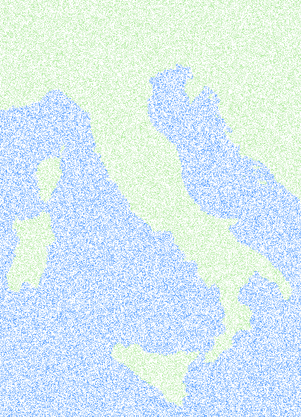

# 分析

对于这个问题，我们将使用 k-NN 算法——这里的*k*表示我们将查看*k*个最接近的邻居。给定一个白色点，如果它的*k*个最接近的邻居大多数位于水域区域，它将被分类为水域；如果它的*k*个最接近的邻居大多数位于陆地区域，它将被分类为陆地。我们将使用欧几里得度量来计算距离：给定两个点，*X=[x[0],x[1]]*和*Y=[y[0],y[1]]*，它们的欧几里得距离定义为*d[Euclidean] = sqrt((x[0]-y[0])²+(x[1]-y[1])²)*。

欧几里得距离是最常用的度量。给定纸面上的两点，它们的欧几里得距离就是通过尺子量测得的两点之间的长度，如下图所示：

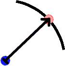

为了将 k-NN 算法应用到不完整的地图中，我们必须选择*k*值。由于一个点的最终分类是其*k*个最接近邻居的多数类别，因此*k*应为奇数。让我们将此算法应用于*k=1,3,5,7,9*的值。

将此算法应用到不完整地图上的每一个白点，将得到以下完整地图：

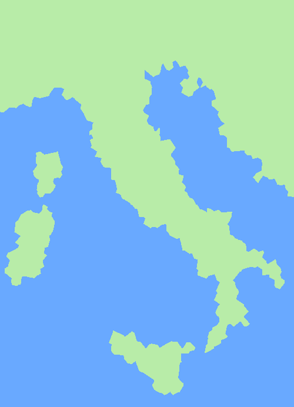

k=1

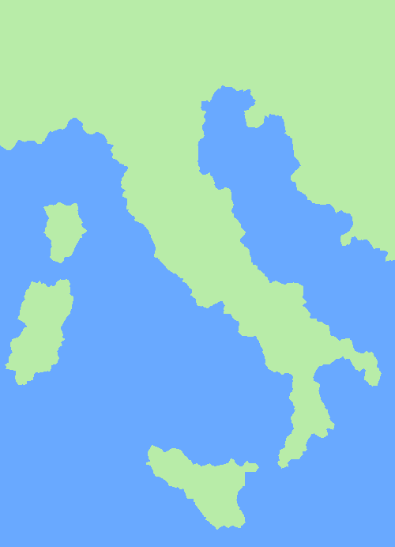

k=3


k=5

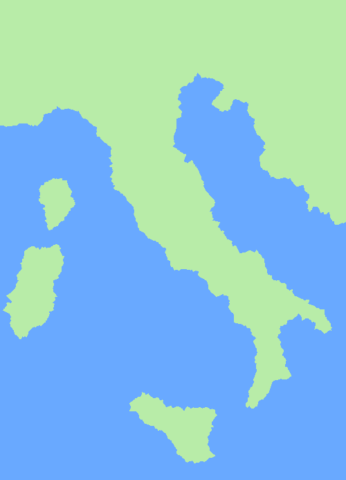

k=7


k=9

正如你所注意到的，*k*的最高值会导致一个边界更平滑的完整地图。这里展示了意大利的实际完整地图：


我们可以使用这个实际的完整地图来计算不同*k*值下错误分类点的百分比，从而确定 k-NN 算法在不同*k*值下的准确性：

| **k** | **错误分类点的百分比** |
| --- | --- |
| 1 | 2.97 |
| 3 | 3.24 |
| 5 | 3.29 |
| 7 | 3.40 |
| 9 | 3.57 |

因此，对于这种特定类型的分类问题，k-NN 算法在*k=1*时达到了最高准确性（最小误差率）。

然而，在现实生活中，问题在于我们通常没有完整的数据或解决方案。在这种情况下，我们需要选择一个适合部分可用数据的*k*值。有关这一点，请参阅本章末尾的*问题 4*。

# 房屋拥有情况 – 数据重缩放

对于每个人，我们都知道他们的年龄、年收入，以及是否拥有房屋：

| **年龄** | **年收入（美元）** | **房屋拥有情况** |
| --- | --- | --- |
| 23 | 50,000 | 非拥有者 |
| 37 | 34,000 | 非拥有者 |
| 48 | 40,000 | 拥有者 |
| 52 | 30,000 | 非拥有者 |
| 28 | 95,000 | 拥有者 |
| 25 | 78,000 | 非拥有者 |
| 35 | 130,000 | 拥有者 |
| 32 | 105,000 | 拥有者 |
| 20 | 100,000 | 非拥有者 |
| 40 | 60,000 | 拥有者 |
| 50 | 80,000 | 彼得 |

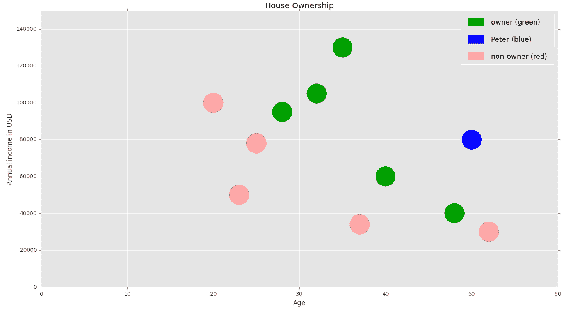

房屋拥有情况与年收入

目标是预测 50 岁、年收入 80,000 美元的彼得是否拥有房屋，并可能成为我们保险公司的潜在客户。

# 分析

在这种情况下，我们可以尝试应用 1-NN 算法。然而，我们需要小心如何衡量数据点之间的距离，因为收入范围远大于年龄范围。收入为 11.5 万美元和 11.6 万美元之间相差 1,000 美元。这两个数据点在收入上差距很大。但相对而言，这些数据点之间的差异实际上并没有那么大。由于我们认为年龄和年收入这两个度量大致同等重要，我们将根据以下公式将它们都缩放到 0 到 1 之间：

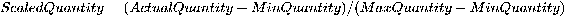

在我们特定的案例中，这简化为以下内容：

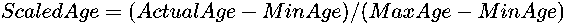

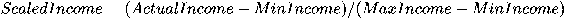

缩放后，我们得到以下数据：

| **年龄** | **缩放后的年龄** | **年收入（美元）** | **缩放后的年收入** | **房屋所有权状态** |
| --- | --- | --- | --- | --- |
| 23 | 0.09375 | 50,000 | 0.2 | 非拥有者 |
| 37 | 0.53125 | 34,000 | 0.04 | 非拥有者 |
| 48 | 0.875 | 40,000 | 0.1 | 拥有者 |
| 52 | 1 | 30,000 | 0 | 非拥有者 |
| 28 | 0.25 | 95,000 | 0.65 | 拥有者 |
| 25 | 0.15625 | 78,000 | 0.48 | 非拥有者 |
| 35 | 0.46875 | 130,000 | 1 | 拥有者 |
| 32 | 0.375 | 105,000 | 0.75 | 拥有者 |
| 20 | 0 | 100,000 | 0.7 | 非拥有者 |
| 40 | 0.625 | 60,000 | 0.3 | 拥有者 |
| 50 | 0.9375 | 80,000 | 0.5 | ? |

现在，如果我们使用欧几里得度量应用 1-NN 算法，我们会发现 Peter 很可能拥有一套房子。请注意，如果不进行重新缩放，算法将得出不同的结果。有关更多信息，请参见*练习 1.5*。

# 文本分类 – 使用非欧几里得距离

我们给出以下与关键词**算法**和**计算机**相关的词频数据，适用于信息学和数学学科分类中的文档：

| **每千字算法词汇** | **每千字计算机词汇** | **学科分类** |
| --- | --- | --- |
| 153 | 150 | 信息学 |
| 105 | 97 | 信息学 |
| 75 | 125 | 信息学 |
| 81 | 84 | 信息学 |
| 73 | 77 | 信息学 |
| 90 | 63 | 信息学 |
| 20 | 0 | 数学 |
| 33 | 0 | 数学 |
| 105 | 10 | 数学 |
| 2 | 0 | 数学 |
| 84 | 2 | 数学 |
| 12 | 0 | 数学 |
| 41 | 42 | ? |

那些高频出现**算法**和**计算机**词汇的文档属于`信息学`类。`数学`类的文档偶尔也包含大量的**算法**词汇，例如涉及欧几里得算法的数论领域的文档。但由于`数学`类在算法领域的应用较少，**计算机**一词在这些文档中的出现频率较低。

我们想要分类一份文档，该文档中每千字出现 41 次**算法**，每千字出现 42 次**计算机**：

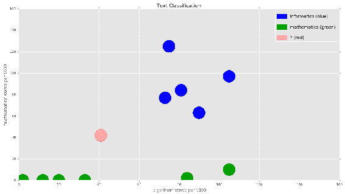

# 分析

例如，使用 1-NN 算法和曼哈顿距离或欧几里得距离，结果会将该文档归类为 `mathematics` 类别。然而，直观上我们应该使用不同的度量方法来衡量文档之间的距离，因为该文档中的 **computer** 词汇出现频率远高于其他已知的 `mathematics` 类文档。

另一个可选的度量方法是，测量文档实例之间词汇的比例或角度。你可以使用角度的余弦值，*cos(θ)*，然后使用著名的点积公式来计算 *cos(θ)*。

设我们使用 *a=(a[x],a[y]), b=(b[x],b[y])*，使用以下公式：

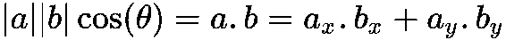

这将得出以下结果：

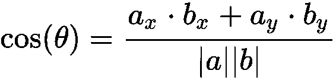

使用余弦距离度量方法，你可以将该文档归类为 `informatics` 类：

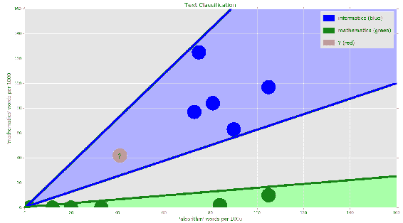

# 文本分类 – 高维空间中的 k-NN

假设我们有一些文档，并希望基于它们的词频来分类其他文档。例如，出现在《金色圣经》项目古腾堡电子书中的 120 个最常出现的词汇如下：

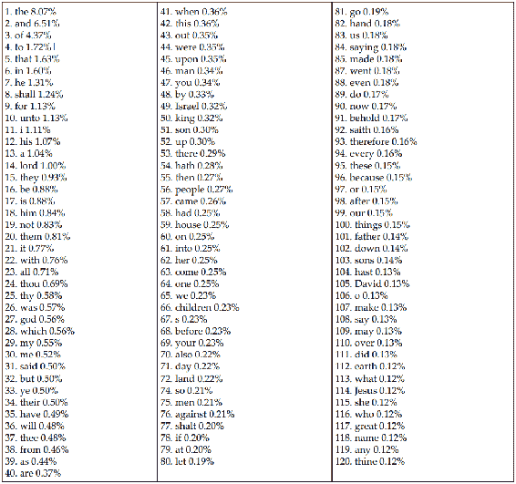

任务是设计一种度量方法，给定每个文档的词频，能够准确判断这些文档在语义上的相似度。因此，这样的度量方法可以被 k-NN 算法用来基于现有文档对新文档中的未知实例进行分类。

# 分析

假设我们考虑，例如，语料库中最常出现的 *N* 个词。然后，我们统计每个 *N* 个词在给定文档中的出现频率，并将它们放入一个 *N* 维向量中，代表该文档。接着，我们定义两个文档之间的距离为这两个文档的词频向量之间的距离（例如，欧几里得距离）。

这种方法的问题在于，只有某些词汇才代表书籍的实际内容，其他词汇之所以出现在文本中，是因为语法规则或它们的一般基础意义。例如，在《圣经》中，120 个最常出现的词语中，每个词的意义不同。下表中，我们标出了那些在《圣经》中既频繁出现又具有重要意义的词语：

|

1.  lord - 使用频率 1.00%

1.  god - 0.56%

|

1.  Israel - 0.32%

1.  king - 0.32%

|

1.  David - 0.13%

1.  Jesus - 0.12%

|

这些词汇在数学文本中出现的可能性较低，但在宗教或基督教相关的文本中出现的可能性较高。

然而，如果我们只看《圣经》中六个最常见的词，它们在检测文本意义方面其实没有什么用：

|

1.  the - 8.07%

1.  and - 6.51%

|

1.  of - 4.37%

1.  to - 1.72%

|

1.  that - 1.63%

1.  in - 1.60%

|

与数学、文学及其他学科相关的文本，在这些词汇的频率上会有类似的表现。差异主要可能来源于写作风格。

因此，为了确定两个文档之间的相似性距离，我们只需要查看重要词汇的频率统计。一些词汇不太重要——这些维度最好减少，因为它们的包含可能最终导致结果的误解。因此，我们需要做的就是选择那些对分类文档至关重要的词汇（维度）。为此，请参考*问题 6*。

# 摘要

在本章中，我们了解到*k*-最近邻算法是一种分类算法，它将给定数据点的*k*-最近邻中多数类别分配给该数据点。两个点之间的距离是通过度量来衡量的。我们介绍了几种距离的例子，包括欧几里得距离、曼哈顿距离、切线距离和余弦距离。我们还讨论了如何通过不同参数的实验和交叉验证，帮助确定应使用哪个参数*k*以及哪个度量。

我们还学到了数据点的维度和位置是由其特征决定的。大量的维度可能导致 k-NN 算法的准确性较低。减少重要性较小的特征维度可以提高准确性。同样，为了进一步提高准确性，每个维度的距离应该根据该维度特征的重要性进行缩放。

在下一章，我们将讨论朴素贝叶斯算法，该算法基于贝叶斯定理使用概率方法对元素进行分类。

# 问题

在本节中，我们将讨论以下问题：

+   玛丽和她的温度偏好问题

+   意大利地图 – 选择*k*的值

+   房屋所有权

为了尽可能最佳地学习本章的内容，请先独立分析这些问题，然后再查看本章末尾的*分析*部分。

# 玛丽和她的温度偏好问题

**问题 1**：假设你知道你的朋友玛丽在-50°C 时感到寒冷，而在 20°C 时感到温暖。那么 1-NN 算法会怎么判断玛丽的感受呢？在 22°C、15°C 和-10°C 的温度下，她会感到温暖还是寒冷？你认为算法预测玛丽对温度的感知是正确的吗？如果不是，请给出你的理由，并指出为什么算法没有给出合适的结果，以及需要改进哪些方面，以便算法能够做出更好的分类。

**问题 2**：你认为 1-NN 算法会比使用*k*-NN 算法（其中*k*>1）产生更好的结果吗？

**问题 3**：我们收集了更多数据，发现玛丽在 17°C 时感觉温暖，在 18°C 时却感觉寒冷。根据我们自己的常识，温度越高，玛丽应该越觉得温暖。你能解释数据中不一致的可能原因吗？我们如何改进数据分析？我们是否也应该收集一些非温度数据？假设我们只有一条温度数据，你认为仅用这些数据，*1*-NN 算法是否仍然能够得出更好的结果？我们应该如何选择*k*值来让*k*-NN 算法表现得更好？

# 意大利地图 – 选择 k 值

**问题 4**：我们得到意大利部分地图用于意大利地图问题。然而，假设完整数据不可用。因此，我们无法对不同*k*值的所有预测点计算误差率。你应如何选择*k*值，来使用*k*-NN 算法，完成意大利地图并最大化其准确性？

# 房屋所有权

**问题 5**：使用与房屋所有权问题相关部分的数据，通过欧几里得度量找出离彼得最近的邻居：

a) 不进行数据重新缩放

b) 使用缩放后的数据

最近的邻居是否在：

a) 与该邻居相同？

b) 哪个邻居拥有房屋？

**问题 6**：假设你想通过某种度量和 1-NN 算法，在古腾堡语料库（[www.gutenberg.org](http://www.gutenberg.org/)）中找到与某本选定书籍（例如《圣经》）相似的书籍或文档。你会如何设计一种度量来衡量这两本书的相似度？

# 分析

**问题 1**：8°C 比-50°C 更接近 20°C。因此，算法会将玛丽在-8°C 时归类为感觉温暖。但如果我们运用常识和知识，这种判断不太可能成立。在更复杂的例子中，由于我们缺乏专业知识，可能会被分析结果误导，得出错误的结论。但请记住，数据科学不仅仅依赖数据分析，还需要实际的专业知识。为了得出合理的结论，我们应该对问题和数据有深刻的理解。

算法进一步指出，在 22°C 时，玛丽应该感觉温暖，这是毫无疑问的，因为 22°C 高于 20°C，人类在较高的温度下会感觉更温暖；这再次是我们常识的一个简单应用。对于 15°C，算法会认为玛丽感觉温暖，但如果我们使用常识，可能无法对这个结论完全确信。

为了能够使用我们的算法得到更好的结果，我们应该收集更多数据。例如，如果我们发现玛丽在 14°C 时感到寒冷，那么我们就有一个与 15°C 非常接近的数据实例，因此，我们可以更有信心地推测玛丽在 15°C 时也会觉得寒冷。

**问题 2**：我们处理的数据只是单维的，并且也分为两部分，冷和暖，具有以下特性：温度越高，人感觉越暖。即使我们知道 Mary 在温度-40、-39、…、39 和 40 时的感觉，我们的数据实例仍然非常有限——大约每摄氏度只有一个实例。因此，最好只查看一个最接近的邻居。

**问题 3**：数据中的差异可能是由于进行的测试不准确所致。这可以通过进行更多实验来缓解。

除了不准确性，还有其他因素可能会影响 Mary 的感觉：例如风速、湿度、阳光、Mary 的穿着（她是穿着外套和牛仔裤，还是仅仅穿着短裤和无袖上衣，甚至是泳衣），以及她是湿的还是干的。我们可以将这些附加维度（风速和她的穿着）添加到数据点的向量中。这将为算法提供更多且更高质量的数据，因此可以期望得到更好的结果。

如果我们只有温度数据，但数据量更多（例如，每摄氏度有 10 个分类实例），那么我们可以增加*k*值，查看更多的邻居以更准确地确定温度。但这纯粹依赖于数据的可用性。我们可以调整算法，使其基于某个距离*d*内的所有邻居来进行分类，而不是仅仅基于*k*个最接近的邻居进行分类。这将使算法在数据量较大且距离较近时以及数据实例与我们想要分类的实例距离较近时都能有效工作。

**问题 4**：为此，你可以使用交叉验证（请参考*附录 A – 统计学*中的*交叉验证*部分）来确定具有最高准确性的*k*值。例如，你可以将来自意大利部分地图的可用数据分为学习数据和测试数据，80%的分类像素将交给 k-NN 算法来完成地图。然后，剩余的 20%分类像素将用于根据 k-NN 算法计算正确分类的像素百分比。

**问题 5**：

a) 在没有数据重缩放的情况下，Peter 最近的邻居年收入为 78,000 美元，年龄为 25 岁。这个邻居没有房子。

b) 在数据重缩放之后，Peter 最近的邻居年收入为 60,000 美元，年龄为 40 岁。这个邻居拥有房子。

**问题 6**：为了设计一个准确衡量两个文档相似度距离的度量，我们需要选择能够构成文档频率向量维度的重要单词。那些不能确定文档语义意义的单词，通常在所有文档中具有大致相同的词频。因此，我们可以创建一个包含文档相对词频的列表。例如，我们可以使用以下定义：

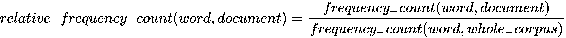

然后，文档可以通过一个*N*维向量来表示，该向量由*相对频率最高的*N*个单词的词频组成。这样的向量通常会包含比由*频率最高的*N*个单词组成的向量更重要的单词。
