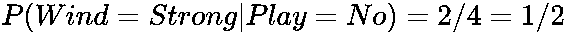
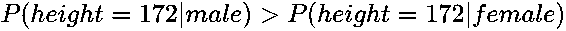
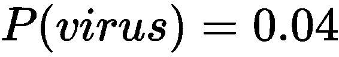

# 第二章：朴素贝叶斯

朴素贝叶斯分类算法根据贝叶斯定理将最可能的类别分配给一组元素。

假设 *A* 和 *B* 是概率事件。*P(A)* 是 *A* 为 `true` 的概率。*P(A|B)* 是在 *B* 为 `true` 的情况下，*A* 为 `true` 的条件概率。如果是这种情况，那么贝叶斯定理声明如下：


*P(A)* 是在没有 *P(B)* 和 *P(B|A)* 概率知识的情况下，*A* 为 `true` 的先验概率。*P(A|B)* 是考虑到 *B* 为 `true` 额外知识的条件概率。

在本章中，您将学习以下主题：

+   如何在简单的医学检测示例中以基础方式应用贝叶斯定理来计算医学测试的正确概率

+   如何通过证明贝叶斯定理的陈述及其扩展来掌握贝叶斯定理

+   如何在国际象棋的示例中将贝叶斯定理应用于独立和依赖变量

+   如何在医学测试和国际象棋的离散随机变量示例中应用贝叶斯定理，以及如何在性别分类的连续随机变量示例中使用连续随机变量的概率分布应用贝叶斯定理

+   如何在 Python 中实现算法，利用贝叶斯定理计算后验概率

到本章结束时，您将能够通过解决问题验证您对朴素贝叶斯的理解。您还将能够辨别在什么情况下贝叶斯定理是合适的分析方法，以及在何时不适用。

# 医学测试 – 贝叶斯定理的基本应用

一位病人接受了一项特殊的癌症检测，准确率为`test_accuracy=99.9%`——如果结果为阳性，那么 99.9%的接受检测的患者会患有该特定类型的癌症。反之，99.9%接受检测的患者如果结果为阴性，则不会患有该特定类型的癌症。

假设病人接受了检测且结果为阳性。那么该病人患某种特定类型癌症的概率是多少？

# 分析

我们将使用贝叶斯定理来确定病人患癌症的概率：


为了确定病人患癌症的先验概率，我们必须了解癌症在人群中的发生频率。假设我们发现每 10 万人中就有 1 人患有这种癌症。因此，*P(cancer)=1/100,000*。因此，*P(test_positive|cancer) = test_accuracy=99.9%=0.999*，这是由检测的准确性给出的。

*P(test_positive)* 需要按以下方式计算：


因此，我们可以计算以下内容：


所以，即使测试结果是阳性，且测试的准确率为 99.9%，患者患所测试癌症的概率也只有大约 1%。与测试的高准确率相比，测试后患癌症的概率相对较低，但远高于在测试前已知的 1/100,000（0.001%）的概率，这是基于该癌症在整个群体中的发生率。

# 贝叶斯定理及其扩展

在本节中，我们将陈述并证明贝叶斯定理及其扩展。

# 贝叶斯定理

贝叶斯定理指出如下：


# 证明

我们可以通过使用初等集合论在事件*A*和*B*的概率空间上证明这个定理。换句话说，在这里，概率事件将被定义为概率空间中可能结果的集合：


图 2.1：两个事件的概率空间

如你在上面的图示中所见，我们可以陈述如下关系：


将这些关系重新排列，我们得到如下：


这实际上就是贝叶斯定理：


这完成了证明。

# 扩展贝叶斯定理

我们可以通过考虑更多的概率事件来扩展贝叶斯定理。假设事件*B1,…,Bn*在给定*A*的情况下是条件独立的。让*~A*表示*A*的补集。那么，我们有如下结果：


# 证明

由于事件*B1,…,Bn*在给定*A*（以及给定*~A*）的情况下是条件独立的，我们得到如下结论：


应用贝叶斯定理的简易形式和这一事实，我们得到如下结果：


这完成了证明。

# 下棋 – 独立事件

假设我们给定了以下数据表。这告诉我们，基于一系列与天气相关的条件，我们的朋友是否愿意在公园外和我们下棋：

| **温度** | **风力** | **阳光** | **是否下棋** |
| --- | --- | --- | --- |
| 寒冷 | 强风 | 阴天 | 否 |
| 温暖 | 强风 | 阴天 | 否 |
| 温暖 | 无 | 晴天 | 是 |
| 热 | 无 | 晴天 | 否 |
| 热 | 微风 | 阴天 | 是 |
| 温暖 | 微风 | 晴天 | 是 |
| 寒冷 | 微风 | 阴天 | 否 |
| 寒冷 | 无 | 晴天 | 是 |
| 热 | 强风 | 阴天 | 是 |
| 温暖 | 无 | 阴天 | 是 |
| 温暖 | 强风 | 晴天 | ? |

我们希望通过使用贝叶斯定理来判断，如果温度是温暖的，风速较强，且阳光明媚，我们的朋友是否愿意在公园与我们下棋。

# 分析

在这种情况下，我们可能希望将*Temperature*、*Wind*和*Sunshine*作为独立随机变量。扩展后的贝叶斯定理公式如下：


让我们计算表格中所有已知值的列数，以确定各个概率。

*P(Play=Yes)=6/10=3/5*，因为有 10 列完整数据，其中*6*列的*Play*属性值为*Yes*。

*P(Temperature=Warm|Play=Yes)=3/6=1/2*，因为有*6*列的*Play*属性值为*Yes*，其中有*3*列的*Temperature*属性值为*Warm*。同样地，我们得到以下内容：

+   **

+   **

+   * *

+   **

+   **

+   **

因此：

 和 

因此，我们得到以下内容：


这意味着，在给定的天气条件下，我们的朋友很可能会高兴地与我们在公园下棋，概率大约为*67%*。由于这是多数，我们可以将数据向量(*Temperature=Warm, Wind=Strong, Sunshine=Sunny*)归类为*Play=Yes*类别。

# 实现一个朴素贝叶斯分类器

在本节中，我们将实现一个程序，通过使用贝叶斯定理来计算一个数据项属于某一类别的概率：

```py
# source_code/2/naive_bayes.py 
# A program that reads the CSV file with the data and returns
# the Bayesian probability for the unknown value denoted by ? to
# belong to a certain class.
# An input CSV file should be of the following format:
# 1\. items in a row should be separated by a comma ','
# 2\. the first row should be a heading - should contain a name for each
# column of the data.
# 3\. the remaining rows should contain the data itself - rows with
# complete and rows with the incomplete data.
# A row with complete data is the row that has a non-empty and
# non-question mark value for each column. A row with incomplete data is
# the row that has the last column with the value of a question mark ?.
# Please, run this file on the example chess.csv to understand this help
# better:
# $ python naive_bayes.py chess.csv

import imp
import sys
sys.path.append('../common')
import common  # noqa

# Calculates the Bayesian probability for the rows of incomplete data and
# returns them completed by the Bayesian probabilities. complete_data
# are the rows with the data that is complete and are used to calculate
# the conditional probabilities to complete the incomplete data.
def bayes_probability(heading, complete_data, incomplete_data,
                      enquired_column):
    conditional_counts = {}
    enquired_column_classes = {}
    for data_item in complete_data:
        common.dic_inc(enquired_column_classes,
                       data_item[enquired_column])
        for i in range(0, len(heading)):
            if i != enquired_column:
                common.dic_inc(
                    conditional_counts, (
                        heading[i], data_item[i],
                        data_item[enquired_column]))

    completed_items = []
    for incomplete_item in incomplete_data:
        partial_probs = {}
        complete_probs = {}
        probs_sum = 0
        for enquired_group in enquired_column_classes.items():
            # For each class in the of the enquired variable A calculate
            # the probability P(A)*P(B1|A)*P(B2|A)*...*P(Bn|A) where
            # B1,...,Bn are the remaining variables.
            probability = float(common.dic_key_count(
                enquired_column_classes,
                enquired_group[0])) / len(complete_data)
            for i in range(0, len(heading)):
                if i != enquired_column:
                    probability = probability * (float(
                        common.dic_key_count(
                            conditional_counts, (
                                heading[i], incomplete_item[i],
                                enquired_group[0]))) / (
                        common.dic_key_count(enquired_column_classes,
                                             enquired_group[0])))
            partial_probs[enquired_group[0]] = probability
            probs_sum += probability

        for enquired_group in enquired_column_classes.items():
            complete_probs[enquired_group[0]
                           ] = partial_probs[enquired_group[0]
                                             ] / probs_sum
        incomplete_item[enquired_column] = complete_probs
        completed_items.append(incomplete_item)
    return completed_items

# Program start
if len(sys.argv) < 2:
    sys.exit('Please, input as an argument the name of the CSV file.')

(heading, complete_data, incomplete_data,
 enquired_column) = common.csv_file_to_ordered_data(sys.argv[1])

# Calculate the Bayesian probability for the incomplete data
# and output it.
completed_data = bayes_probability(
    heading, complete_data, incomplete_data, enquired_column)
print completed_data
```

我们使用公共库中的字典部分：

```py
# source_code/common/common.py 
# Increments integer values in a dictionary.
def dic_inc(dic, key):
    if key is None:
        pass
    if dic.get(key, None) is None:
        dic[key] = 1
    else:
        dic[key] = dic[key] + 1

def dic_key_count(dic, key):
    if key is None:
        return 0
    if dic.get(key, None) is None:
        return 0
    else:
        return int(dic[key])
```

**输入**：

我们将与下棋相关的表格数据（例如，关于下棋的数据）保存在以下 CSV 文件中：

```py
source_code/2/naive_bayes/chess.csv
Temperature,Wind,Sunshine,Play
Cold,Strong,Cloudy,No
Warm,Strong,Cloudy,No
Warm,None,Sunny,Yes
Hot,None,Sunny,No
Hot,Breeze,Cloudy,Yes
Warm,Breeze,Sunny,Yes
Cold,Breeze,Cloudy,No
Cold,None,Sunny,Yes
Hot,Strong,Cloudy,Yes
Warm,None,Cloudy,Yes
Warm,Strong,Sunny,? 
```

**输出**：

我们提供`chess.csvfile`作为输入，使用 Python 程序计算数据项(*Temperature=Warm, Wind=Strong, Sunshine=Sunny*)属于文件中现有类别的概率，分别为`Play=Yes`和`Play=No`。正如我们之前发现的，该数据项属于`Play=Yes`类别，因为其概率较高。因此，我们将数据项归类到该类别中：

```py
$ python naive_bayes.py chess.csv
[
    ['Warm', 'Strong', 'Sunny', {
        'Yes': 0.66666666666666_66,
        'No': 0.33333333333333337
    }]
]
```

# 玩棋——依赖事件

假设我们想要了解我们的朋友是否愿意在英国剑桥的公园与我们下棋。但这次，我们提供了不同的输入数据：

| **Temperature** | **Wind** | **Season** | **Play** |
| --- | --- | --- | --- |
| 冷 | 强风 | 冬季 | 否 |
| 温暖 | 强风 | 秋季 | 否 |
| 温暖 | 无 | 夏季 | 是 |
| 热 | 无 | 春季 | 否 |
| 热 | 微风 | 秋季 | 是 |
| 温暖 | 微风 | 春季 | 是 |
| 冷 | 微风 | 冬季 | 否 |
| 冷 | 无 | 春季 | 是 |
| 热 | 强风 | 夏季 | 是 |
| 温暖 | 无 | 秋季 | 是 |
| 温暖 | 强风 | 春季 | ? |

所以，现在我们想知道，当数据中**温度**为**温暖**，**风**为**强风**，**季节**为**春季**时，我们朋友是否会在英国剑桥的公园玩耍，答案会如何变化。

# 分析

我们可能会倾向于使用贝叶斯概率来计算我们朋友是否会在公园与我们下棋。然而，我们应该小心，问一下这些事件的概率是否相互独立。

在之前的例子中，我们使用了贝叶斯概率，给定的概率变量是**温度**、**风**和**阳光**。这些变量是合理独立的。常识告诉我们，特定的**温度**和**阳光**与特定的**风速**之间并没有强相关性。的确，阳光明媚的天气会带来更高的气温，但即使温度很低，阳光明媚的天气也很常见。因此，我们认为即使是**阳光**和**温度**作为随机变量也是合理独立的，并应用了贝叶斯定理。

然而，在这个例子中，**温度**和**季节**是紧密相关的，特别是在像英国这样的位置——我们所说的公园所在地。与靠近赤道的国家不同，英国的气温全年变化很大。冬天很冷，夏天很热。春天和秋天的气温介于其中。

因此，我们不能在这里应用贝叶斯定理，因为这些随机变量是相关的。然而，我们仍然可以通过对部分数据使用贝叶斯定理来进行一些分析。通过消除足够的相关变量，剩余的变量可能会变得独立。由于**温度**比**季节**更为具体，且这两个变量是相关的，因此我们只保留**温度**变量。剩下的两个变量，**温度**和**风**，是独立的。

因此，我们得到以下数据：

| **温度** | **风** | **下棋** |
| --- | --- | --- |
| 冷 | 强风 | 否 |
| 温暖 | 强风 | 否 |
| 温暖 | 无 | 是 |
| 热 | 无 | 否 |
| 热 | 微风 | 是 |
| 温暖 | 微风 | 是 |
| 冷 | 微风 | 否 |
| 冷 | 无 | 是 |
| 热 | 强风 | 是 |
| 温暖 | 无 | 是 |
| 温暖 | 强风 | ? |

我们可以保留重复的行，因为它们提供了该特定数据行发生的更多证据。

**输入**：

保存该表格，我们得到以下 CSV 文件：

```py
# source_code/2/chess_reduced.csv
Temperature,Wind,Play
Cold,Strong,No
Warm,Strong,No
Warm,None,Yes
Hot,None,No
Hot,Breeze,Yes
Warm,Breeze,Yes
Cold,Breeze,No
Cold,None,Yes
Hot,Strong,Yes
Warm,None,Yes
Warm,Strong,?
```

**输出**：

我们将保存的 CSV 文件输入到`naive_bayes.py`程序中，得到了以下结果：

```py
python naive_bayes.py chess_reduced.csv
[['Warm', 'Strong', {'Yes': 0.49999999999999994, 'No': 0.5}]]
```

第一个类别 `Yes` 有 50%的概率为真。由于使用 Python 的非精确浮点数算术导致数值上的差异。第二个类别 `No` 也有相同的 50%概率为真。因此，根据我们目前的数据，我们无法对向量的类别（`温暖`，`强`）做出合理的结论。然而，您可能已经注意到，这个向量已经在具有结果类别 `No` 的表格中出现。因此，我们的猜测是，这个向量应该刚好存在于一个类别 `No` 中。但是，要有更高的统计置信度，我们需要更多的数据或涉及更多的独立变量。

# 性别分类 – 连续随机变量的贝叶斯方法

到目前为止，我们已经得到了属于有限数量类别中的一个概率事件，例如，一个温度被分类为冷、温暖或热。但是如果我们获得的是以°C 为单位的温度，我们如何计算后验概率呢？

在这个例子中，我们得到了五名男性和五名女性的身高数据，如下表所示：

| **身高（厘米）** | **性别** |
| --- | --- |
| 180 | 男性 |
| 174 | 男性 |
| 184 | 男性 |
| 168 | 男性 |
| 178 | 男性 |
| 170 | 女性 |
| 164 | 女性 |
| 155 | 女性 |
| 162 | 女性 |
| 166 | 女性 |
| 172 | ? |

假设下一个人的身高为 172 厘米。那么这个人更可能是什么性别，以及概率是多少？

# 分析

解决这个问题的一种方法是为数值赋予类别；例如，身高在 170 厘米和 179 厘米之间的人将属于同一类。使用这种方法，我们可能会得到一些非常宽的类，例如，具有较高厘米范围的类，或者具有更精确但成员较少的类，因此我们不能充分利用贝叶斯分类器的全部潜力。同样地，使用这种方法，我们不会考虑身高区间（170, 180）和（180, 190）之间的类比考虑（170, 180）和（190, 200）之间的类更接近。

让我们在这里回顾一下贝叶斯公式：


在这里表达出最终形式的公式消除了归一化 *P(身高|男性)* 和 *P(身高)* 以获得基于身高判断一个人是男性的正确概率的需要。

假设人们的身高服从正态分布，我们可以使用正态概率分布来计算 *P(男性|身高)*。我们假设 *P(男性)=0.5*，即被测量的人是男性或女性的可能性相等。正态概率分布由总体的均值μ和方差 *σ²* 决定：


下表显示了按性别分组的平均身高和方差：

| **性别** | **平均身高** | **身高方差** |
| --- | --- | --- |
| 男性 | 176.8 | 37.2 |
| 女性 | 163.4 | 30.8 |

因此，我们可以计算以下内容：


请注意，这些不是概率值，而是概率密度函数的值。然而，从这些值中，我们可以观察到，身高为 172 厘米的人更有可能是男性而不是女性，原因如下：



更准确地说：


因此，身高为*172*厘米的人是男性的概率为*68.9%*。

# 总结

在这一章中，我们学习了朴素贝叶斯算法及其在不同场景下的应用。

贝叶斯定理如下所述：


这里，*P(A|B)*是条件概率，即在*B*为真的情况下，*A*为真的概率。它用于更新在新的观测值下，*A*为真时的概率值。这个定理可以扩展到含有多个随机变量的命题：


随机变量*B1,...,Bn*在给定*A*的条件下需要相互独立。这些随机变量可以是离散的或连续的，并且遵循概率分布，例如正态（高斯）分布。

我们还研究了离散随机变量。我们了解到，最佳做法是通过收集足够的数据，确保在给定任何条件（具有值*A*）的情况下，为离散随机变量的每个值收集一个数据项。

随着独立随机变量的增多，我们可以更准确地确定后验概率。然而，更大的危险在于，这些变量中的某些可能是相关的，导致最终结果不准确。当变量相关时，我们可以去除一些相关变量，只考虑相互独立的变量，或考虑采用其他算法来解决数据科学问题。

在下一章中，我们将学习如何使用决策树算法对元素进行分类。

# 问题

**问题 1**：一名患者接受病毒*V*的检测，测试的准确率为 98%。该病毒*V*在患者所在地区每 100 人中有 4 人感染：

a) 如果患者检测结果为阳性，患者感染病毒*V*的概率是多少？

b) 如果测试结果为阴性，患者仍然感染病毒的概率是多少？

**问题 2**：除了评估患者是否感染病毒*V*（见**问题 1**）外，医生通常还会检查其他症状。根据一位医生的说法，大约 85%的患者在出现发热、恶心、腹部不适和乏力等症状时，感染了病毒*V*：

a) 如果病人出现了之前提到的症状，并且病毒检测结果为阳性，病人感染病毒*V*的概率是多少？

b) 如果病人出现了之前提到的症状，但测试结果为阴性，病人感染病毒的概率有多大？

**问题 3**：在某个岛屿上，每两个海啸中就有一个是由地震引发的。过去 100 年内发生了 4 次海啸和 6 次地震。一个地震站记录到岛屿附近海洋发生了地震。这个地震会导致海啸的概率是多少？

**问题 4**：病人接受四项独立测试，以确定是否患有某种疾病：

| **Test1 阳性** | **Test2 阳性** | **Test3 阳性** | **Test4 阳性** | **疾病** |
| --- | --- | --- | --- | --- |
| 是 | 是 | 是 | 否 | 是 |
| 是 | 是 | 否 | 是 | 是 |
| 否 | 是 | 否 | 否 | 否 |
| 是 | 否 | 否 | 否 | 否 |
| 否 | 否 | 否 | 否 | 否 |
| 是 | 是 | 是 | 是 | 是 |
| 是 | 否 | 是 | 是 | 是 |
| 否 | 是 | 否 | 否 | 否 |
| 否 | 否 | 是 | 是 | 否 |
| 是 | 是 | 否 | 是 | 是 |
| 是 | 否 | 是 | 否 | 是 |
| 是 | 否 | 否 | 是 | 是 |
| 否 | 是 | 是 | 否 | ? |

我们接诊了一位新病人，第二项和第三项测试为阳性，而第一项和第四项测试为阴性。该病人患有该疾病的概率是多少？

**问题 5**：我们给出以下包含在邮件中的词汇及这些邮件是否为垃圾邮件的数据：

| **Money** | **Free** | **Rich** | **Naughty** | **Secret** | **Spam** |
| --- | --- | --- | --- | --- | --- |
| 否 | 否 | 是 | 否 | 是 | 是 |
| 是 | 是 | 是 | 否 | 否 | 是 |
| 否 | 否 | 否 | 否 | 否 | 否 |
| 否 | 是 | 否 | 否 | 否 | 是 |
| 是 | 否 | 否 | 否 | 否 | 否 |
| 否 | 是 | 否 | 是 | 是 | 是 |
| 否 | 是 | 否 | 是 | 否 | 是 |
| 否 | 否 | 否 | 是 | 否 | 是 |
| 否 | 是 | 否 | 否 | 否 | 否 |
| 否 | 否 | 否 | 否 | 是 | 否 |
| 是 | 是 | 是 | 否 | 是 | 是 |
| 是 | 否 | 否 | 否 | 是 | 是 |
| 否 | 是 | 是 | 否 | 否 | 否 |
| 是 | 否 | 是 | 否 | 是 | ? |

a) 创建一个朴素贝叶斯算法来判断一封邮件是否为垃圾邮件。当一封邮件包含**Money**、**Rich**和**Secret**这几个词，但不包含**Free**和**Naughty**时，算法的结果是什么？

b) 你同意算法的结果吗？在这里使用的朴素贝叶斯算法，作为分类邮件的好方法吗？请证明你的回答。

**问题 6**：这是一个性别分类问题。假设我们有关于十个人的以下数据：

| **身高（厘米）** | **体重（千克）** | **发长** | **性别** |
| --- | --- | --- | --- |
| 180 | 75 | 短 | 男 |
| 174 | 71 | 短 | 男 |
| 184 | 83 | 短 | 男 |
| 168 | 63 | 短 | 男 |
| 178 | 70 | 长 | 男 |
| 170 | 59 | 长 | 女 |
| 164 | 53 | 短 | 女 |
| 155 | 46 | 长 | 女 |
| 162 | 52 | 长 | 女 |
| 166 | 55 | 长 | 女 |
| 172 | 60 | 长 | ? |

第 11 个人，身高 172 cm，体重 60 kg，长发的情况下，他是男性的概率是多少？

# 分析

**问题 1**：在患者接受测试之前，他们患有病毒的概率是 4%，`P(virus)=4%=0.04`。测试的准确性为 `test_accuracy=98%=0.98`。我们应用医学测试示例中的公式：


因此，我们有以下公式：


这意味着，如果测试结果为阳性，患者患有病毒 *V* 的概率约为 67%：

  


如果测试结果为阴性，患者仍然可能携带病毒 *V*，概率为 0.08%。

**问题 2**：在这里，我们可以假设给定患者已感染病毒 *V* 的情况下，症状和阳性测试结果是条件独立的事件。我们有以下变量：




由于我们有两个独立的随机变量，因此我们将使用扩展的贝叶斯定理：

a) 


所以，患者如果有病毒 *V* 的症状，并且测试结果为阳性，则该患者有大约 92% 的概率是感染了病毒。

请注意，在前一个问题中，我们得知在测试结果为阳性的情况下，患者患有病毒的概率仅约为 67%。但是，在加入另一个独立随机变量后，即使症状评估仅对 85% 的患者可靠，概率也提高到了 92%。这意味着通常，加入尽可能多的独立随机变量来计算后验概率，以提高准确性和信心，是一个非常好的选择。

b) 在这里，患者有病毒 *V* 的症状，但测试结果为阴性。因此，我们有以下内容：


因此，某患者在测试中结果为阴性，但有病毒症状*V*，其感染病毒的概率为 0.48%。

**问题 3**：我们应用了贝叶斯定理的基本形式：


记录到的地震后，发生海啸的概率为 33%。

请注意，这里我们将*P(海啸)*设置为过去 100 年某一天发生海啸的概率。我们也使用了一天作为单位来计算*P(地震)*的概率。如果我们将单位改为小时、周、月等，*P(海啸)*和*P(地震)*的结果仍然会保持不变。计算中的关键在于比例*P(海啸):P(地震)=4:6=2/3:1*，也就是说，海啸发生的概率大约是地震的 66%。

**问题 4**：我们将数据输入程序，计算从观测数据得出的后验概率，得到以下结果：

*[['否', '是', '是', '否', {'是': 0.0, '否': 1.0}]]*

根据这个计算，患者应当没有感染病毒。然而，*'否'*的概率似乎相当高。为了获得更精确的健康概率估计，获取更多的数据可能是个好主意。

**问题 5**：

a) 算法的结果如下：

*[['是', '否', '是', '否', '是', {'是': 0.8459918784779665, '否': 0.15400812152203341}]]*

因此，根据朴素贝叶斯算法，当应用于表格中的数据时，电子邮件是垃圾邮件的概率大约为 85%。

b) 这种方法可能不如预期，因为垃圾邮件中某些词语的出现并不是独立的。例如，包含“money”（钱）一词的垃圾邮件，通常会试图说服受害者相信他们可以通过垃圾邮件发送者获得金钱，因此其他词语，如**Rich**（富有）、**Secret**（秘密）或**Free**（免费）等，更有可能出现在这类邮件中。最近邻算法在垃圾邮件分类中可能表现得更好。你可以通过交叉验证来验证实际方法。

**问题 6**：对于这个问题，我们将使用扩展的贝叶斯定理，适用于连续和离散随机变量：


让我们通过以下表格总结给定的信息：

| **性别** | **平均身高** | **身高方差** |
| --- | --- | --- |
| 男性 | 176.8 | 37.2 |
| 女性 | 163.4 | 30.8 |
| **性别** | **平均体重** | **体重方差** |
| 男性 | 72.4 | 53.8 |
| 女性 | 53 | 22.5 |

从这些数据中，让我们确定确定最终为男性的概率所需的其他值：


因此，身高 172 厘米、体重 60 公斤且有长发的人是男性的概率为 20.3%。因此，他们更可能是女性。
