# 第三章：决策树

决策树是将数据按树状结构排列的方式，在每个节点处，根据该节点的属性值将数据分成不同的分支。

为了构建决策树，我们将使用标准的 ID3 学习算法，该算法选择一个属性，能以最好的方式对数据样本进行分类，从而最大化信息增益——这是一个基于信息熵的度量方法。

本章我们将涵盖以下主题：

+   决策树是什么，如何通过游泳偏好的示例在决策树中表示数据

+   信息熵和信息增益的概念，首先在理论上进行说明，然后在*信息论*部分通过游泳偏好的示例进行实际应用

+   如何使用 ID3 算法从训练数据构建决策树，并在 Python 中实现

+   如何通过游泳偏好的示例，使用构建的决策树对新的数据项进行分类

+   如何使用决策树对第二章中的国际象棋问题进行替代分析，采用朴素贝叶斯方法，并比较两种算法结果的差异

+   你将在*问题*部分验证自己的理解，并了解何时使用决策树作为分析方法

+   如何在决策树构建过程中处理数据不一致性，使用*购物问题*示例进行说明

# 游泳偏好——通过决策树表示数据

我们可能有一些偏好，决定是否游泳。这些偏好可以记录在表格中，如下所示：

| **泳衣** | **水温** | **游泳偏好** |
| --- | --- | --- |
| 无 | 冷 | 否 |
| 无 | 温暖 | 否 |
| 小 | 冷 | 否 |
| 小 | 温暖 | 否 |
| 好 | 冷 | 否 |
| 好 | 温暖 | 是 |

这张表中的数据可以通过以下决策树呈现：

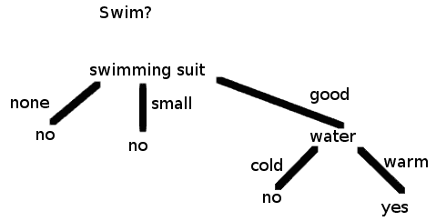

图 3.1：游泳偏好示例的决策树

在根节点，我们问一个问题——你有泳衣吗？问题的回答将可用数据分成三个组，每个组有两行。如果属性是`泳衣 = 无`，那么这两行的游泳偏好都是`否`。因此，不需要再问水温的问题，因为所有具有`泳衣 = 无`属性的样本都会被分类为`否`。`泳衣 = 小`属性也一样。对于`泳衣 = 好`，剩下的两行可以分为两类——`否`和`是`。

如果没有更多的信息，我们将无法正确分类每一行。幸运的是，对于每一行，还有一个问题可以问，这个问题能够正确地将其分类。对于`水=冷`的行，游泳偏好是`否`；对于`水=温暖`的行，游泳偏好是`是`。

总结一下，从根节点开始，我们在每个节点上提问，并根据答案向下移动树直到到达叶节点，在那里我们可以找到与这些答案对应的数据项的类别。

这就是我们如何使用现成的决策树来分类数据样本。但同样重要的是，知道如何从数据中构建决策树。

哪个属性在什么节点上有一个问题？这如何影响决策树的构建？如果我们改变属性的顺序，最终得到的决策树能否比另一棵树更好地进行分类？

# 信息论

信息论研究信息的量化、存储和传递。我们引入了信息熵和信息增益的概念，它们用于使用 ID3 算法构建决策树。

# 信息熵

任何给定数据的**信息熵**是表示该数据项所需的最小信息量的度量。信息熵的单位是熟悉的——比特、字节、千字节等等。信息熵越低，数据就越规律，数据中出现的模式也就越多，从而表示该数据所需的信息量越小。这就是为什么计算机上的压缩工具可以将大型文本文件压缩到更小的大小，因为单词和短语不断重复，形成了模式。

# 抛硬币

假设我们抛一枚不偏的硬币。我们想知道结果是正面还是反面。我们需要多少信息来表示这个结果？无论是正面还是反面，两个单词都由四个字符组成，如果我们用一个字节（8 位）来表示一个字符，按照 ASCII 表的标准，那么我们需要四个字节，或者 32 位，来表示这个结果。

但信息熵是表示结果所需的最小数据量。我们知道结果只有两种可能——正面或反面。如果我们同意用 0 表示正面，用 1 表示反面，那么 1 比特足以有效地传达结果。在这里，数据是硬币抛掷结果可能性的空间。它是集合`{head, tail}`，可以表示为集合`{0, 1}`。实际的结果是该集合中的一个数据项。结果表明，这个集合的熵是 1。因为正面和反面的概率都是 50%。

现在假设硬币是偏的，每次抛出时正面朝上的概率是 25%，反面朝上的概率是 75%。这时，概率空间`{0,1}`的熵是多少？我们当然可以用 1 比特的信息表示结果。但是我们能做得更好吗？1 比特当然是不可分割的，但也许我们可以将信息的概念推广到非离散的量。

在前面的例子中，除非我们查看硬币，否则我们对前一次抛硬币的结果一无所知。但在偏向硬币的例子中，我们知道结果更可能是反面。如果我们在文件中记录了*n*次抛硬币的结果，将正面表示为 0，反面表示为 1，那么其中大约 75%的比特将为 1，25%的比特将为 0。这样的文件大小将为*n*比特。但由于它更有规律（1 的模式占主导地位），一个好的压缩工具应该能够将其压缩到小于*n*比特。

为了学习压缩背后的理论以及表示数据项所需的信息量，让我们来看一下信息熵的精确定义。

# 信息熵的定义

假设我们给定了一个概率空间*S*，其中包含元素*1, 2, ..., n*。从概率空间中选择元素*i*的概率为*p[i]*。该概率空间的信息熵定义如下：

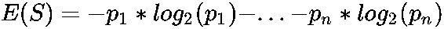

在前面的公式中，*log[2]*是二进制对数。

因此，公正抛硬币的概率空间的信息熵如下：

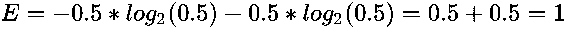

当硬币偏向时，正面出现的概率为 25%，反面为 75%，此时该空间的**信息熵**如下：

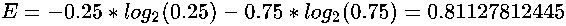

这个值小于 1。因此，例如，如果我们有一个大文件，其中约 25%的比特是 0，75%的比特是 1，那么一个好的压缩工具应该能够将其压缩到大约 81.12%的大小。

# 信息增益

信息增益是通过某一过程获得的信息熵量。例如，如果我们想知道三次公正的抛硬币结果，那么信息熵为 3。但如果我们能查看第三次抛掷的结果，那么剩下两次抛掷的结果的信息熵为 2。因此，通过查看第三次抛掷，我们获得了一位信息，所以信息增益为 1。

我们也可以通过将整个集合*S*划分为按相似模式分组的集合，来获得信息熵。如果我们按属性*A*的值对元素进行分组，那么我们将信息增益定义如下：

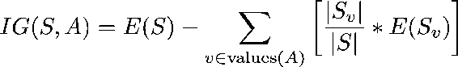

这里，*S[v]* 是集合*S*中所有属性*A*值为*v*的元素集合。

# 游泳偏好 – 信息增益计算

让我们通过将`游泳衣`作为属性，计算游泳偏好示例中六行数据的**信息增益**。因为我们关心的是给定数据行是否会被分类为`否`或`是`，即是否应该去游泳的问题，因此我们将使用游泳偏好来计算熵和信息增益。我们用`游泳衣`属性来划分集合*S*：

*S[none]={(none,cold,no),(none,warm,no)}*

*S[small]={(small,cold,no),(small,warm,no)}*

*S[good]={(good,cold,no),(good,warm,yes)}*

*S* 的信息熵为：

*E(S)=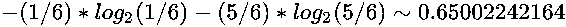*

划分后的信息熵为：

*E(S[none])=-(2/2)*log2=-log2=0*，原因类似。

*E(S[good])=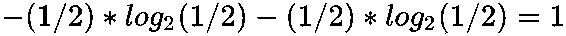*

因此，信息增益为：

*IG(S,泳装)=E(S)-[(2/6)*E(S[none])+(2/6)*E(S[small])+(2/6)*E(S[good])]*

*=0.65002242164-(1/3)=0.3166890883*

如果我们选择 `水温` 属性来划分集合 *S*，那么信息增益 *IG(S,水温)* 会是多少？水温将集合 *S* 划分为以下集合：

*S[cold]={(none,cold,no),(small,cold,no),(good,cold,no)}*

*S[warm]={(none,warm,no),(small,warm,no),(good,warm,yes)}*

它们的熵如下：

*E(S[cold])=0*，因为所有实例都被分类为否。

*E(S[warm])=-(2/3)*log2-(1/3)*log2~0.91829583405*

因此，使用 *水温* 属性划分集合 *S* 得到的信息增益如下：

*IG(S,水温)=E(S)-[(1/2)*E(S[cold])+(1/2)*E(S[warm])]*

*= 0.65002242164-0.5*0.91829583405=0.19087450461*

这小于 *IG(S,泳装)*。因此，我们可以通过根据 `泳装` 属性划分集合 *S*（其实例的分类）来获得更多信息，而不是使用 `水温` 属性。这一发现将成为 ID3 算法在下一节构建决策树的基础。

# ID3 算法 – 决策树构建

ID3 算法基于信息增益从数据中构建决策树。一开始，我们从集合 *S* 开始。集合 *S* 中的数据项有各种属性，根据这些属性，我们可以对集合 *S* 进行划分。如果某个属性 *A* 有值 *{v[1], ..., v[n]}*，那么我们将集合 *S* 划分为 *S[1]*, ..., *S[n]*，其中集合 *S[i]* 是集合 *S* 的一个子集，包含属性 *A* 对应值为 *v[i]* 的元素。

如果集合 *S* 中的每个元素都有属性 *A[1], ..., A[m]*，那么我们可以根据任意可能的属性划分集合 *S*。ID3 算法根据产生最大信息增益的属性来划分集合 *S*。现在假设它有属性 *A[1]*，那么对于集合 *S*，我们有划分 *S[1], ..., S[n]*，其中 *A[1]* 的可能值为 *{v[1], ..., v[n]}*。

由于我们还没有构建树，因此首先放置一个根节点。对于 *S* 的每一个划分，从根节点放置一条新分支。每一条分支代表选定属性的一个值。一条分支包含该属性具有相同值的数据样本。对于每一条新分支，我们可以定义一个新节点，该节点将包含其祖先分支的数据样本。

一旦我们定义了一个新的节点，我们就选择剩余属性中信息增益最高的属性，以便进一步划分该节点上的数据，然后定义新的分支和节点。这个过程可以重复进行，直到节点上的所有属性用完，或者更早地，当节点上的所有数据具有相同的分类（我们感兴趣的类）时。在游泳偏好示例的情况下，游泳偏好只有两个可能的类别——`no`类和`yes`类。最后的节点称为**叶节点**，并决定数据项的分类。

# 游泳偏好 – 通过 ID3 算法构建的决策树

在这里，我们一步一步地描述 ID3 算法如何从给定的游泳偏好示例数据中构建决策树。初始集合由六个数据样本组成：

```py
S={(none,cold,no),(small,cold,no),(good,cold,no),(none,warm,no),(small,warm,no),(good,warm,yes)}
```

在前面的章节中，我们计算了两个属性的增益，以及唯一的非分类属性`游泳衣`和`水温`的增益，计算如下：

```py
IG(S,swimming suit)=0.3166890883
IG(S,water temperature)=0.19087450461
```

因此，我们会选择`游泳衣`属性，因为它具有较高的信息增益。此时还没有画出树，所以我们从根节点开始。由于`游泳衣`属性有三个可能的值——`{none, small, good}`，我们为每个值绘制三个可能的分支。每个分支将有一个来自划分集*S：S[none]*，*S[small]*，和*S[good]*的划分。我们在分支的末端添加节点。*S*[*none*]数据样本具有相同的游泳偏好类别=`no`，因此我们不需要用进一步的属性来分支该节点并划分集合。因此，包含数据*S[none]*的节点已经是叶节点。对于包含数据*S[small]*的节点也一样。

但是，包含数据的节点，*S[good]*，有两种可能的游泳偏好类别。因此，我们会进一步分支该节点。剩下的唯一非分类属性是`水温`。因此，使用数据*S[good]*计算该属性的信息增益就没有必要了。从节点*S[good]*开始，我们会有两个分支，每个分支都来自集合*S[good]*的一个划分。一个分支将包含数据样本*S[good,][cold]={(good,cold,no)}*；另一个分支将包含划分*S[good,][warm]={(good,warm,yes)}*。这两个分支将以一个节点结束。每个节点将是叶节点，因为每个节点的数据样本在分类游泳偏好属性上具有相同的值。

结果决策树有四个叶节点，并且是*图 3.1 – 游泳偏好示例的决策树*中的树。

# 实现

我们实现了一个 ID3 算法，它从 CSV 文件中给定的数据构建决策树。所有的源代码都位于章节目录中。源代码中最重要的部分如下：

```py
# source_code/3/construct_decision_tree.py
# Constructs a decision tree from data specified in a CSV file.
# Format of a CSV file:
# Each data item is written on one line, with its variables separated
# by a comma. The last variable is used as a decision variable to
# branch a node and construct the decision tree.

import math
# anytree module is used to visualize the decision tree constructed by
# this ID3 algorithm.
from anytree import Node, RenderTree
import sys
sys.path.append('../common')
import common
import decision_tree

# Program start csv_file_name = sys.argv[1]
verbose = int(sys.argv[2])  # verbosity level, 0 - only decision tree

# Define the enquired column to be the last one.
# I.e. a column defining the decision variable.
(heading, complete_data, incomplete_data,
 enquired_column) = common.csv_file_to_ordered_data(csv_file_name)

tree = decision_tree.constuct_decision_tree(
    verbose, heading, complete_data, enquired_column)
decision_tree.display_tree(tree)
```

```py
# source_code/common/decision_tree.py
# ***Decision Tree library ***
# Used to construct a decision tree and a random forest.
import math
import random
import common
from anytree import Node, RenderTree
from common import printfv

# Node for the construction of a decision tree.
class TreeNode: 
    def __init__(self, var=None, val=None):
        self.children = []
        self.var = var
        self.val = val

    def add_child(self, child):
        self.children.append(child)

    def get_children(self):
        return self.children

    def get_var(self):
        return self.var

    def get_val(self):
        return self.val

    def is_root(self):
        return self.var is None and self.val is None

    def is_leaf(self):
        return len(self.children) == 0

    def name(self):
        if self.is_root():
            return "[root]"
        return "[" + self.var + "=" + self.val + "]"

# Constructs a decision tree where heading is the heading of the table
# with the data, i.e. the names of the attributes.
# complete_data are data samples with a known value for every attribute.
# enquired_column is the index of the column (starting from zero) which
# holds the classifying attribute.
def construct_decision_tree(verbose, heading, complete_data, enquired_column):
    return construct_general_tree(verbose, heading, complete_data,
                                  enquired_column, len(heading))

# m is the number of the classifying variables that should be at most
# considered at each node. *m needed only for a random forest.*
def construct_general_tree(verbose, heading, complete_data,
                           enquired_column, m):
    available_columns = []
    for col in range(0, len(heading)):
        if col != enquired_column:
            available_columns.append(col)
    tree = TreeNode()
    printfv(2, verbose, "We start the construction with the root node" +
                        " to create the first node of the tree.\n")
    add_children_to_node(verbose, tree, heading, complete_data,
                         available_columns, enquired_column, m)
    return tree

# Splits the data samples into the groups with each having a different
# value for the attribute at the column col.
def split_data_by_col(data, col):
    data_groups = {}
    for data_item in data:
        if data_groups.get(data_item[col]) is None:
            data_groups[data_item[col]] = []
        data_groups[data_item[col]].append(data_item)
    return data_groups

# Adds a leaf node to node.
def add_leaf(verbose, node, heading, complete_data, enquired_column):
    leaf_node = TreeNode(heading[enquired_column],
                         complete_data[0][enquired_column])
    printfv(2, verbose,
            "We add the leaf node " + leaf_node.name() + ".\n")
    node.add_child(leaf_node)

# Adds all the descendants to the node.
def add_children_to_node(verbose, node, heading, complete_data,
                         available_columns, enquired_column, m):
    if len(available_columns) == 0:
        printfv(2, verbose, "We do not have any available variables " +
                "on which we could split the node further, therefore " +
                "we add a leaf node to the current branch of the tree. ")
        add_leaf(verbose, node, heading, complete_data, enquired_column)
        return -1

    printfv(2, verbose, "We would like to add children to the node " +
            node.name() + ".\n")

    selected_col = select_col(
        verbose, heading, complete_data, available_columns,
        enquired_column, m)
    for i in range(0, len(available_columns)):
        if available_columns[i] == selected_col:
            available_columns.pop(i)
            break

    data_groups = split_data_by_col(complete_data, selected_col)
    if (len(data_groups.items()) == 1):
        printfv(2, verbose, "For the chosen variable " +
                heading[selected_col] +
                " all the remaining features have the same value " +
                complete_data[0][selected_col] + ". " +
                "Thus we close the branch with a leaf node. ")
        add_leaf(verbose, node, heading, complete_data, enquired_column)
        return -1

    if verbose >= 2:
        printfv(2, verbose, "Using the variable " +
                heading[selected_col] +
                " we partition the data in the current node, where" +
                " each partition of the data will be for one of the " +
                "new branches from the current node " + node.name() +
                ". " + "We have the following partitions:\n")
        for child_group, child_data in data_groups.items():
            printfv(2, verbose, "Partition for " +
                    str(heading[selected_col]) + "=" +
                    str(child_data[0][selected_col]) + ": " +
                    str(child_data) + "\n")
        printfv(
            2, verbose, "Now, given the partitions, let us form the " +
                        "branches and the child nodes.\n")
    for child_group, child_data in data_groups.items():
        child = TreeNode(heading[selected_col], child_group)
        printfv(2, verbose, "\nWe add a child node " + child.name() +
                " to the node " + node.name() + ". " +
                "This branch classifies %d feature(s): " +
                str(child_data) + "\n", len(child_data))
        add_children_to_node(verbose, child, heading, child_data, list(
            available_columns), enquired_column, m)
        node.add_child(child)
    printfv(2, verbose,
            "\nNow, we have added all the children nodes for the " +
            "node " + node.name() + ".\n")

# Selects an available column/attribute with the highest
# information gain.
def select_col(verbose, heading, complete_data, available_columns,
               enquired_column, m):
    # Consider only a subset of the available columns of size m.
    printfv(2, verbose,
            "The available variables that we have still left are " +
            str(numbers_to_strings(available_columns, heading)) + ". ")
    if len(available_columns) < m:
        printfv(
            2, verbose, "As there are fewer of them than the " +
                        "parameter m=%d, we consider all of them. ", m)
        sample_columns = available_columns
    else:
        sample_columns = random.sample(available_columns, m)
        printfv(2, verbose,
                "We choose a subset of them of size m to be " +
                str(numbers_to_strings(available_columns, heading)) +
                ".")

    selected_col = -1
    selected_col_information_gain = -1
    for col in sample_columns:
        current_information_gain = col_information_gain(
            complete_data, col, enquired_column)
        # print len(complete_data),col,current_information_gain
        if current_information_gain > selected_col_information_gain:
            selected_col = col
            selected_col_information_gain = current_information_gain
    printfv(2, verbose,
            "Out of these variables, the variable with " +
            "the highest information gain is the variable " +
            heading[selected_col] +
            ". Thus we will branch the node further on this " +
            "variable. " +
            "We also remove this variable from the list of the " +
            "available variables for the children of the current node. ")
    return selected_col

# Calculates the information gain when partitioning complete_data
# according to the attribute at the column col and classifying by the
# attribute at enquired_column.
def col_information_gain(complete_data, col, enquired_column):
    data_groups = split_data_by_col(complete_data, col)
    information_gain = entropy(complete_data, enquired_column)
    for _, data_group in data_groups.items():
        information_gain -= (float(len(data_group)) / len(complete_data)
                             ) * entropy(data_group, enquired_column)
    return information_gain

# Calculates the entropy of the data classified by the attribute
# at the enquired_column.
def entropy(data, enquired_column):
    value_counts = {}
    for data_item in data:
        if value_counts.get(data_item[enquired_column]) is None:
            value_counts[data_item[enquired_column]] = 0
        value_counts[data_item[enquired_column]] += 1
    entropy = 0
    for _, count in value_counts.items():
        probability = float(count) / len(data)
        entropy -= probability * math.log(probability, 2)
    return entropy
```

**程序输入**：

我们将游泳偏好示例的数据输入程序以构建决策树：

```py
# source_code/3/swim.csv
swimming_suit,water_temperature,swim
None,Cold,No
None,Warm,No
Small,Cold,No
Small,Warm,No
Good,Cold,No
Good,Warm,Yes 
```

**程序输出**：

我们从 `swim.csv` 数据文件构建了一个决策树，冗余度设置为 `0`。建议读者将冗余度设置为 `2`，以便查看决策树构建过程的详细解释：

```py
$ python construct_decision_tree.py swim.csv 0 Root
├── [swimming_suit=Small]
│ ├── [water_temperature=Cold]
│ │ └── [swim=No]
│ └── [water_temperature=Warm]
│   └── [swim=No]
├── [swimming_suit=None]
│ ├── [water_temperature=Cold]
│ │ └── [swim=No]
│ └── [water_temperature=Warm]
│   └── [swim=No]
└── [swimming_suit=Good]
    ├── [water_temperature=Cold]
    │   └── [swim=No]
    └── [water_temperature=Warm]
        └── [swim=Yes]
```

# 使用决策树进行分类

一旦我们从具有属性 *A[1], ..., A[m]* 和类别 *{c[1], ..., c[k]}* 的数据中构建了决策树，我们就可以使用该决策树将一个具有属性 *A[1], ..., A[m]* 的新数据项分类到类别 *{c[1], ..., c[k]}* 中。

给定一个我们希望分类的新数据项，我们可以将每个节点，包括根节点，视为对数据样本的一个问题：*该数据样本在选定属性 A[i] 上的值是什么？* 然后，根据答案，我们选择决策树的一个分支并继续前进到下一个节点。然后，关于数据样本会再问一个问题，继续这样下去，直到数据样本到达叶节点。叶节点与某个类别 *{c[1], ..., c[k]}* 相关联；例如，*c[i]*。然后，决策树算法将该数据样本分类到该类别 *c[i]* 中。

# 使用游泳偏好决策树对数据样本进行分类

让我们使用 ID3 算法为游泳偏好示例构建决策树。现在我们已经构建了决策树，我们希望使用它将一个数据样本，*(好，冷，？)* 分类到 *{否, 是}* 这两个类别中的一个。

从树的根开始一个数据样本。第一个从根分支出的属性是 `泳衣`，所以我们询问样本的 `泳衣` 属性值 (*好，冷，？*)。我们得知该属性值为 `泳衣=好`；因此，沿着带有该值的数据样本的最右分支向下移动。我们到达了一个带有 `水温` 属性的节点，并问：*对于该数据样本，水温属性的值是什么（好，冷，？）*？我们得知对于该数据样本，水温为 `冷`；因此，我们向下移动到左侧分支进入叶节点。这个叶节点与 `游泳偏好=否` 类别相关联。因此，决策树会将数据样本 (*好，冷，？*) 分类为该游泳偏好类别；换句话说，完成它（通过用确切的数据替换问号），变为数据样本 (***好，冷，否***)。

因此，决策树表示，如果你有一件好的泳衣，但水温很冷，那么根据表中收集的数据，你仍然不想游泳。

# 下棋——使用决策树分析

我们再来一个来自第二章的例子，*朴素贝叶斯*：

| **温度** | **风力** | **阳光** | **游玩** |
| --- | --- | --- | --- |
| 冷 | 强风 | 多云 | 否 |
| 冷 | 强风 | 多云 | 否 |
| 温暖 | 无风 | 晴天 | 是 |
| 炎热 | 无风 | 晴天 | 否 |
| 炎热 | 微风 | 多云 | 是 |
| 温暖 | 微风 | 晴天 | 是 |
| 冷 | 微风 | 多云 | 否 |
| 冷 | 无风 | 晴天 | 是 |
| 热 | 强风 | 阴天 | 是 |
| 温暖 | 无风 | 阴天 | 是 |
| 温暖 | 强风 | 晴天 | ? |

我们想知道我们的朋友是否愿意在公园里和我们下棋。这一次，我们希望使用决策树来找到答案。

# 分析

我们有初始的数据集*S*，如下所示：

```py
S={(Cold,Strong,Cloudy,No),(Warm,Strong,Cloudy,No),(Warm,None,Sunny,Yes), (Hot,None,Sunny,No),(Hot,Breeze,Cloudy,Yes),(Warm,Breeze,Sunny,Yes),(Cold,Breeze,Cloudy,No),(Cold,None,Sunny,Yes),(Hot,Strong,Cloudy,Yes),(Warm,None,Cloudy,Yes)}
```

首先，我们确定三个非分类属性的*信息增益*：`temperature`（温度）、`wind`（风速）、`sunshine`（阳光）。`temperature`的可能值为`Cold`（冷）、`Warm`（温暖）和`Hot`（热）。因此，我们将集合*S*划分为三个子集：

```py
Scold={(Cold,Strong,Cloudy,No),(Cold,Breeze,Cloudy,No),(Cold,None,Sunny,Yes)}
Swarm={(Warm,Strong,Cloudy,No),(Warm,None,Sunny,Yes),(Warm,Breeze,Sunny,Yes),(Warm,None,Cloudy,Yes)}
Shot={(Hot,None,Sunny,No),(Hot,Breeze,Cloudy,Yes),(Hot,Strong,Cloudy,Yes)}
```

我们首先计算这些集合的信息熵：

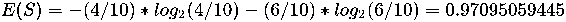

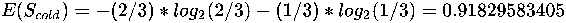

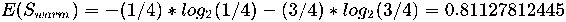

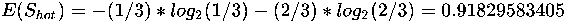

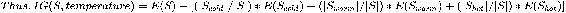

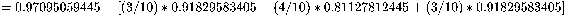

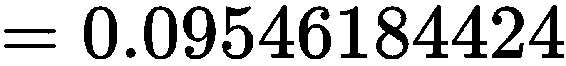

`wind`（风速）属性的可能值为`None`（无风）、`Breeze`（微风）和`Strong`（强风）。因此，我们将集合*S*划分为三个子集：

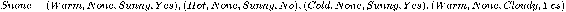

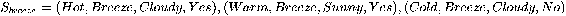

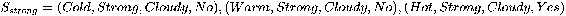

这些集合的信息熵如下：

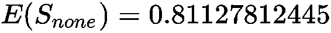

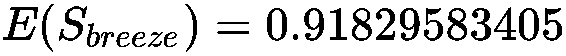

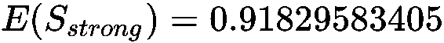

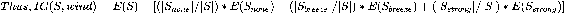

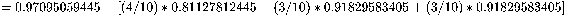


最后，第三个属性`Sunshine`（阳光）有两个可能值：`Cloudy`（阴天）和`Sunny`（晴天）。因此，它将集合*S*划分为两个子集：

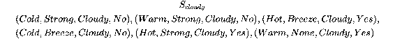

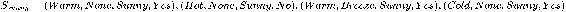

这些集合的信息熵如下：

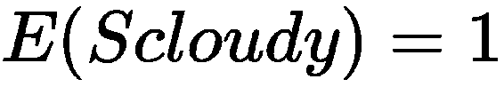

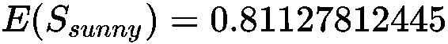

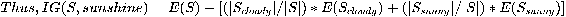

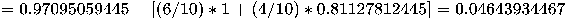

*IG(S,wind)*和*IG(S,temperature)*大于*IG(S,sunshine)*。这两个值相等，因此我们可以选择任意一个属性来形成三个分支；例如，选择第一个属性`Temperature`（温度）。在这种情况下，每个分支会包含数据样本*S[cold]*、*S[warm]*和*S[hot]*。在这些分支上，我们可以进一步应用算法来形成剩余的决策树。相反，我们可以使用程序来完成这个过程：

**输入**：

```py
source_code/3/chess.csv
Temperature,Wind,Sunshine,Play
Cold,Strong,Cloudy,No
Warm,Strong,Cloudy,No
Warm,None,Sunny,Yes
Hot,None,Sunny,No
Hot,Breeze,Cloudy,Yes
Warm,Breeze,Sunny,Yes
Cold,Breeze,Cloudy,No
Cold,None,Sunny,Yes
Hot,Strong,Cloudy,Yes
Warm,None,Cloudy,Yes
```

**输出**：

```py
$ python construct_decision_tree.py chess.csv 0
Root
├── [Temperature=Cold]
│ ├── [Wind=Breeze]
│ │ └── [Play=No]
│ ├── [Wind=Strong]
│ │ └── [Play=No]
│ └── [Wind=None]
│   └── [Play=Yes]
├── [Temperature=Warm]
│ ├── [Wind=Breeze]
│ │ └── [Play=Yes]
│ ├── [Wind=None]
│ │ ├── [Sunshine=Sunny]
│ │ │ └── [Play=Yes]
│ │ └── [Sunshine=Cloudy]
│ │   └── [Play=Yes]
│ └── [Wind=Strong]
│   └── [Play=No]
└── [Temperature=Hot]
    ├── [Wind=Strong]
    │ └── [Play=Yes]
    ├── [Wind=None]
    │ └── [Play=No]
    └── [Wind=Breeze]
        └── [Play=Yes]
```

# 分类

现在我们已经构建了决策树，我们想用它来将一个数据样本*(warm,strong,sunny,?)*分类到集合*{no,yes}*中的一个类别。

我们从根节点开始。该实例的`temperature`属性值是什么？是`温暖`，因此我们进入中间分支。该实例的`wind`属性值是什么？是`强`，因此该实例将归类为`否`，因为我们已经到达了叶节点。

因此，根据决策树分类算法，我们的朋友不会在公园与我们下棋。请注意，朴素贝叶斯算法得出的结论恰好相反。要选择最佳的方法，需要对问题有一定的理解。在其他时候，准确性更高的方法是考虑多个算法或多个分类器结果的方法，正如在第四章中所示的**随机森林**算法。

# 去购物 – 处理数据不一致性

我们有以下关于我们朋友简的购物偏好的数据：

| **温度** | **雨** | **购物** |
| --- | --- | --- |
| 冷 | 无 | 是 |
| 温暖 | 无 | 否 |
| 冷 | 强 | 是 |
| 冷 | 无 | 否 |
| 温暖 | 强 | 否 |
| 温暖 | 无 | 是 |
| 冷 | 无 | ? |

我们希望通过决策树来找出，如果外部温度寒冷且没有雨，简是否会去购物。

# 分析

在这里，我们需要小心，因为某些数据实例在相同属性下有相同的值，但类别不同；即`(cold,none,yes)`和`(cold,none,no)`。我们编写的程序会形成以下决策树：

```py
    Root
    ├── [Temperature=Cold]
    │    ├──[Rain=None]
    │    │    └──[Shopping=Yes]
    │    └──[Rain=Strong]
    │         └──[Shopping=Yes]
    └── [Temperature=Warm]
         ├──[Rain=None]
         │    └──[Shopping=No]
         └── [Rain=Strong]
              └── [Shopping=No]

```

但在叶节点`[Rain=None]`且父节点为`[Temperature=Cold]`时，有两个数据样本分别属于`否`和`是`两个类别。因此，我们无法准确地分类一个实例`(cold,none,?)`。为了使决策树算法更有效，我们需要在叶节点提供权重最大、即占多数的类别。一个更好的方法是为数据样本收集更多属性值，这样我们就可以更准确地做出决策。

因此，鉴于现有数据，我们无法确定简是否会去购物。

# 概要

在这一章中，我们了解了决策树 ID3 算法如何从输入数据中首先构建决策树，然后使用构建好的树对新数据实例进行分类。决策树是通过选择信息增益最高的属性来进行分支构建的。我们研究了信息增益如何衡量在信息熵增益方面能够学到的知识量。

我们还了解到，决策树算法可能与其他算法，如朴素贝叶斯算法，产生不同的结果。

在下一章中，我们将学习如何将多种算法或分类器组合成一个决策森林（称为**随机森林**），以获得更准确的结果。

# 问题

**问题 1**：以下多重集合的信息熵是多少？

a) {1,2}，b) {1,2,3}，c) {1,2,3,4}，d) {1,1,2,2}，e) {1,1,2,3}

**问题 2**：偏置硬币的概率空间的信息熵是多少？该硬币显示正面概率为 10%，反面为 90%？

**问题 3**：让我们来看一下第二章中的另一个例子，*朴素贝叶斯*，关于下棋的例子：

a) 表中每个非分类属性的信息增益是多少？

b) 根据给定的表格，构建出的决策树是什么？

c) 如何根据构建的决策树对数据样本`(温暖, 强风, 春季, ?)`进行分类？

| **温度** | **风速** | **季节** | **感受** |
| --- | --- | --- | --- |
| 寒冷 | 强风 | 冬季 | 否 |
| 温暖 | 强风 | 秋季 | 否 |
| 温暖 | 无 | 夏季 | 是 |
| 热 | 无 | 春季 | 否 |
| 热 | 微风 | 秋季 | 是 |
| 温暖 | 微风 | 春季 | 是 |
| 寒冷 | 微风 | 冬季 | 否 |
| 寒冷 | 无 | 春季 | 是 |
| 热 | 强风 | 夏季 | 是 |
| 温暖 | 无 | 秋季 | 是 |
| 温暖 | 强风 | 春季 | ? |

**问题 4**：**玛丽与温度偏好**：让我们来看一下第一章中的例子，*使用 K 近邻进行分类*，关于玛丽的温度偏好：

| **温度（°C）** | **风速（km/h）** | **玛丽的感知** |
| --- | --- | --- |
| 10 | 0 | 寒冷 |
| 25 | 0 | 温暖 |
| 15 | 5 | 寒冷 |
| 20 | 3 | 温暖 |
| 18 | 7 | 寒冷 |
| 20 | 10 | 寒冷 |
| 22 | 5 | 温暖 |
| 24 | 6 | 温暖 |

我们想使用决策树来判断我们的朋友玛丽在温度为 16°C，风速为 3 km/h 的房间中会感觉温暖还是寒冷。

你能解释一下如何在这里使用决策树算法吗？并说明使用它对于这个例子的益处？

# 分析

**问题 1**：以下是多重集的熵值：

a) 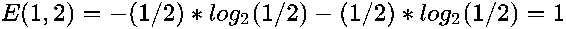

b) 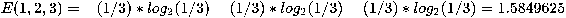

c) 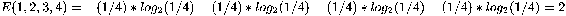

d) 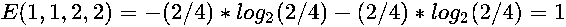

e) 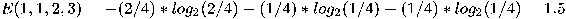

需要注意的是，具有多个类别的多重集的信息熵大于 1，因此我们需要多个比特来表示结果。但对于每个具有多个类别元素的多重集，这种情况都成立吗？

**问题 2**：*！[](img/bcd665ff-2e2f-444c-9b5f-bc9e17a3eae3.png)*

**问题 3**：a) 三个属性的信息增益如下：

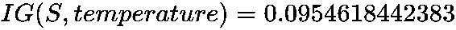

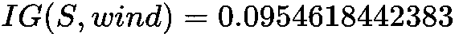

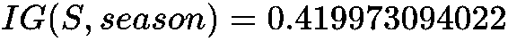

b) 因此，我们会选择`季节`属性作为从根节点分支的依据，因为它具有最高的信息增益。或者，我们可以将所有输入数据放入程序中，构建决策树，如下所示：

```py
    Root
    ├── [Season=Autumn]
    │    ├──[Wind=Breeze]
    │    │    └──[Play=Yes]
    │    ├──[Wind=Strong]
    │    │    └──[Play=No]
    │    └──[Wind=None]
    │         └──[Play=Yes]
    ├── [Season=Summer]
    │    ├──[Temperature=Hot]
    │    │    └──[Play=Yes]
    │    └──[Temperature=Warm]
    │         └──[Play=Yes]
    ├── [Season=Winter]
    │    └──[Play=No]
    └── [Season=Spring]
         ├── [Temperature=Hot]
         │    └──[Play=No]
         ├── [Temperature=Warm]
         │    └──[Play=Yes]
         └── [Temperature=Cold]
              └── [Play=Yes]

```

c) 根据构建的决策树，我们将数据样本`(warm,strong,spring,?)`分类为`Play=Yes`，方法是从根节点向下走到最底层分支，然后通过走中间分支到达叶子节点。

**问题 4**：在这里，决策树算法在没有对数据进行任何处理的情况下可能表现不佳。如果我们考虑每一种温度类别，那么 25°C 仍然不会出现在决策树中，因为它不在输入数据中，因此我们无法分类玛丽在 16°C 和 3 km/h 的风速下的感受。

我们可以选择将温度和风速划分为区间，以减少类别数，从而使得最终的决策树能够对输入实例进行分类。但正是这种划分，即 25°C 和 3 km/h 应该归类到哪些区间，才是分析这种问题的基本过程。因此，未经任何重大修改的决策树无法很好地分析这个问题。
