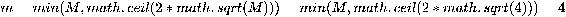

# 第四章：随机森林

随机森林是由一组随机决策树组成的（类似于第三章中描述的*决策树*），每棵树都是在数据的随机子集上生成的。随机森林通过大多数随机决策树投票所选的类别来分类特征。与决策树相比，随机森林通常能够提供更准确的分类，因为它们的偏差和方差较低。

本章将涵盖以下主题：

+   作为随机森林构建的一部分，树袋法（或自助聚合）技术，但也可以扩展到数据科学中的其他算法和方法，以减少偏差和方差，从而提高准确性

+   如何构建一个随机森林并使用通过游泳偏好示例构建的随机森林对数据项进行分类

+   如何在 Python 中实现一个构建随机森林的算法

+   使用下棋的例子，分析 Naive Bayes 算法、决策树和随机森林的区别

+   随机森林算法如何克服决策树算法的缺点，并通过购物的例子展示其优势

+   如何通过购物的例子展示随机森林如何表达其对特征分类的置信度

+   如何通过减少分类器的方差来获得更准确的结果，在*问题*部分进行讨论

# 随机森林算法简介

通常，为了构建一个随机森林，首先我们需要选择它包含的树的数量。随机森林通常不会过拟合（除非数据非常嘈杂），因此选择更多的决策树不会降低预测的准确性。随机森林通常不会过拟合（除非数据非常嘈杂），因此增加决策树的数量不会显著降低预测准确性。重要的是要选择足够数量的决策树，以便在随机选择用于构建决策树的数据时，更多的数据用于分类。另一方面，树木越多，所需的计算能力越大。此外，增加决策树的数量并不会显著提高分类准确度。

在实践中，你可以在特定数量的决策树上运行算法，增加它们的数量，并比较较小和较大森林的分类结果。如果结果非常相似，那么就没有必要增加树木的数量。

为了简化演示，本书中我们将使用少量的决策树来构建随机森林。

# 随机森林构建概述

我们将描述如何以随机的方式构建每棵树。我们通过随机选择*N*个训练特征来构建决策树。这个从数据中随机选择并进行替换的过程，称为**自助聚合（bootstrap aggregating）**，或**树袋法（tree bagging）**。自助聚合的目的是减少分类结果中的方差和偏差。

假设一个特征有*M*个变量，这些变量用于使用决策树对特征进行分类。当我们在节点上做出分支决策时，在 ID3 算法中，我们选择产生最大信息增益的变量。在这里，在随机决策树中，每个节点我们最多只考虑*m*个变量。我们不考虑那些已经被随机选择且没有替换的*M*个变量中的变量。然后，在这*m*个变量中，我们选择产生最大信息增益的变量。

随机决策树的其余构建过程与第三章中的决策树构建过程相同，参见*决策树*部分。

# 游泳偏好——涉及随机森林的分析

我们将使用来自第三章的关于游泳偏好的示例。我们有相同的数据表，具体如下：

| **泳衣** | **水温** | **游泳偏好** |
| --- | --- | --- |
| 无 | 冷 | 否 |
| 无 | 温暖 | 否 |
| 小 | 冷 | 否 |
| 小 | 温暖 | 否 |
| 好 | 冷 | 否 |
| 好 | 温暖 | 是 |

我们希望从这些数据构建一个随机森林，并使用它来对一个项目`(好,冷,?)`进行分类。

# 分析

我们给定了*M=3*个变量，根据这些变量可以对特征进行分类。在随机森林算法中，我们通常不会在每个节点使用所有三个变量来形成树枝。我们只会使用从*M*中随机选择的一个子集(*m*)的变量。所以我们选择*m*使得*m*小于或等于*M*。*m*的值越大，每个构建的树中的分类器就越强。然而，正如前面提到的，更多的数据会导致更多的偏差。但是，因为我们使用多棵树（每棵树的*m*较小），即使每棵构建的树是一个弱分类器，它们的联合分类准确度仍然较强。为了减少随机森林中的偏差，我们可能希望选择一个略小于*M*的*m*参数。

因此，我们选择节点中考虑的最大变量数量为：*m=min(M,math.ceil(2*math.sqrt(M)))=min(M,math.ceil(2*math.sqrt(3)))=3*。

我们提供以下特征：

```py
[['None', 'Cold', 'No'], ['None', 'Warm', 'No'], ['Small', 'Cold', 'No'], ['Small', 'Warm', 'No'], ['Good', 'Cold', 'No'], ['Good', 'Warm', 'Yes']]
```

在构建随机森林中的随机决策树时，我们只会随机选择这些特征的一个子集，并且进行替换。

# 随机森林构建

我们将构建一个由两棵随机决策树组成的随机森林。

# 随机决策树构建编号 0

我们得到六个特征作为输入数据。在这些特征中，我们随机选择六个特征并带有替换地用于构建这个随机决策树：

```py
[['None', 'Warm', 'No'], ['None', 'Warm', 'No'], ['Small', 'Cold', 'No'], ['Good', 'Cold', 'No'], ['Good', 'Cold', 'No'], ['Good', 'Cold', 'No']]
```

我们从根节点开始构建，创建树的第一个节点。我们想要向`[root]`节点添加子节点。

我们有以下可用变量：`['swimming_suit', 'water_temperature']`。由于这些变量少于`m=3`参数的数量，我们将考虑这两个变量。在这些变量中，信息增益最高的是游泳衣。

因此，我们将根据该变量继续分支节点。我们还将从当前节点的子节点可用变量列表中移除此变量。使用`swimming_suit`变量，我们在当前节点上划分数据，如下所示：

+   `swimming_suit=Small`的划分：`[['Small', 'Cold', 'No']]`

+   `swimming_suit=None`的划分：`[['None', 'Warm', 'No'], ['None', 'Warm', 'No']]`

+   `swimming_suit=Good`的划分：`[['Good', 'Cold', 'No'], ['Good', 'Cold', 'No'], ['Good', 'Cold', 'No']]`

使用前述的划分，我们创建了分支和子节点。

现在我们向`[root]`节点添加一个子节点`[swimming_suit=Small]`。该分支对一个特征进行分类：`[['Small', 'Cold', 'No']]`。

我们希望向`[swimming_suit=Small]`节点添加子节点。

我们有以下可用变量：`['water_temperature']`。由于这里只有一个变量，且少于`m=3`参数，因此我们将考虑这个变量。信息增益最高的是`water_temperature`变量。因此，我们将根据该变量继续分支节点。我们还将从当前节点的子节点可用变量列表中移除此变量。对于选定的变量`water_temperature`，所有剩余特征的值都是`Cold`。因此，我们在此分支的末尾加上一个叶节点，添加`[swim=No]`。

现在我们向`[root]`节点添加一个子节点`[swimming_suit=None]`。该分支对两个特征进行分类：`[['None', 'Warm', 'No'], ['None', 'Warm', 'No']]`。

我们希望向`[swimming_suit=None]`节点添加子节点。

我们有以下可用变量：`['water_temperature']`。由于这里只有一个变量，且少于`m=3`参数，因此我们将考虑这个变量。信息增益最高的是`water_temperature`变量。因此，我们将根据该变量继续分支节点。我们还将从当前节点的子节点可用变量列表中移除此变量。对于选定的变量`water_temperature`，所有剩余特征的值都是`Warm`。因此，我们在此分支的末尾加上一个叶节点，添加`[swim=No]`。

现在我们向`[root]`节点添加一个子节点`[swimming_suit=Good]`。该分支对三个特征进行分类：`[['Good', 'Cold', 'No'], ['Good', 'Cold', 'No'], ['Good', 'Cold', 'No']]`

我们希望向`[swimming_suit=Good]`节点添加子节点。

我们可以使用以下变量：`['water_temperature']`。由于这里只有一个变量，它小于`m=3`参数，因此我们会考虑这个变量。信息增益最高的变量是`water_temperature`变量。因此，我们将继续在这个变量上分支。我们还会将该变量从当前节点子节点的可用变量列表中移除。对于选择的变量`water_temperature`，所有剩余特征的值相同：`Cold`。所以，我们以叶节点结束这个分支，添加`[swim=No]`。

现在，我们已经将所有子节点添加到`[root]`节点。

# 随机决策树 1 的构建

我们提供了六个特征作为输入数据。我们从中随机选择六个特征，并允许重复，以构建这个随机决策树：

```py
[['Good', 'Warm', 'Yes'], ['None', 'Warm', 'No'], ['Good', 'Cold', 'No'], ['None', 'Cold', 'No'], ['None', 'Warm', 'No'], ['Small', 'Warm', 'No']]
```

随机决策树 1 的其余构建过程与之前的随机决策树 0 类似。唯一的区别是，树是使用不同的随机生成子集（如之前所见）构建的。

我们从根节点开始构建，以创建树的第一个节点。我们希望向`[root]`节点添加子节点。

我们可以使用以下变量：`['swimming_suit', 'water_temperature']`。由于这里只有一个变量，它小于`m=3`参数，因此我们会考虑这个变量。在这些变量中，信息增益最高的是`swimming_suit`变量。

因此，我们将在这个变量上继续分支。我们还会将该变量从当前节点子节点的可用变量列表中移除。使用`swimming_suit`变量，我们将当前节点的数据划分如下：

+   `swimming_suit=Small`的划分：`[['Small', 'Warm', 'No']]`

+   `swimming_suit=None`的划分：`[['None', 'Warm', 'No'], ['None', 'Cold', 'No'], ['None', 'Warm', 'No']]`

+   `swimming_suit=Good`的划分：`[['Good', 'Warm', 'Yes'], ['Good', 'Cold', 'No']]`

现在，给定划分后，让我们创建分支和子节点。我们向`[root]`节点添加一个子节点`[swimming_suit=Small]`。这个分支分类了一个特征：`[['Small', 'Warm', 'No']]`。

我们希望向`[swimming_suit=Small]`节点添加子节点。

我们可以使用以下变量：`['water_temperature']`。由于这里只有一个变量，它小于`m=3`参数，因此我们会考虑这个变量。信息增益最高的变量是`water_temperature`变量。因此，我们将继续在这个变量上分支。我们还会将该变量从当前节点子节点的可用变量列表中移除。对于选择的变量`water_temperature`，所有剩余特征的值相同：`Warm`。所以，我们以叶节点结束这个分支，添加`[swim=No]`。

我们将一个子节点`[swimming_suit=None]`添加到`[root]`节点。此分支分类了三个特征：`[['None', 'Warm', 'No']]`、`[['None', 'Cold', 'No']]`和`[['None', 'Warm', 'No']]`。

我们想要为`[swimming_suit=None]`节点添加子节点。

我们有以下可用的变量：`['water_temperature']`。由于这里只有一个变量，这个数量小于`m=3`参数，我们将考虑这个变量。信息增益最高的是`water_temperature`变量。因此，我们将基于这个变量进一步拆分节点。我们还将从当前节点的子节点的可用变量列表中移除此变量。使用`water_temperature`变量，我们将数据在当前节点中进行如下分区：

+   `water_temperature=Cold`的分区：`[['None', 'Cold', 'No']]`。

+   `water_temperature=Warm`的分区：`[['None', 'Warm', 'No']]`；现在，根据这些分区，让我们创建分支和子节点。

我们将一个子节点`[water_temperature=Cold]`添加到`[swimming_suit=None]`节点。此分支分类了一个特征：`[['None', 'Cold', 'No']]`。

我们没有任何可用的变量可以进一步拆分该节点；因此，我们在当前树分支上添加一个叶节点。我们添加了`[swim=No]`叶节点。我们将一个子节点`[water_temperature=Warm]`添加到`[swimming_suit=None]`节点。此分支分类了两个特征：`[['None', 'Warm', 'No']]`和`[['None', 'Warm', 'No']]`。

我们没有任何可用的变量可以进一步拆分该节点；因此，我们在当前树分支上添加一个叶节点。我们添加了`[swim=No]`叶节点。

现在，我们已经将所有子节点添加到`[swimming_suit=None]`节点。

我们将一个子节点`[swimming_suit=Good]`添加到`[root]`节点。此分支分类了两个特征：`[['Good', 'Warm', 'Yes']]`和`[['Good', 'Cold', 'No']]`。

我们想要为`[swimming_suit=Good]`节点添加子节点。

我们有以下可用的变量：`['water_temperature']`。由于这里只有一个变量，这个数量小于`m=3`参数，我们将考虑这个变量。信息增益最高的是`water_temperature`变量。因此，我们将基于这个变量进一步拆分节点。我们还将从当前节点的子节点的可用变量列表中移除此变量。使用`water_temperature`变量，我们将数据在当前节点中进行如下分区：

+   `water_temperature=Cold`的分区：`[['Good', 'Cold', 'No']]`。

+   `water_temperature=Warm`的分区：`[['Good', 'Warm', 'Yes']]`。

现在，根据这些分区，让我们创建分支和子节点。

我们将一个子节点`[water_temperature=Cold]`添加到`[swimming_suit=Good]`节点。此分支分类了一个特征：`[['Good', 'Cold', 'No']]`。

我们没有任何可用的变量来进一步划分节点；因此，我们向当前树的分支添加了一个叶节点。我们添加了`[swim=No]`叶节点。

我们在`[swimming_suit=Good]`节点下添加了一个子节点`[water_temperature=Warm]`。该分支分类一个特征：`[['Good', 'Warm', 'Yes']]`。

我们没有任何可用的变量来进一步划分节点；因此，我们向当前树的分支添加了一个叶节点。我们添加了`[swim=Yes]`叶节点。

现在，我们已经添加了`[swimming_suit=Good]`节点的所有子节点。

我们也已经添加了`[root]`节点的所有子节点。

# 构建的随机森林

我们已经完成了随机森林的构建，随机森林由两个随机决策树组成，如下方代码块所示：

```py
Tree 0:
    Root
    ├── [swimming_suit=Small]
    │ └── [swim=No]
    ├── [swimming_suit=None]
    │ └── [swim=No]
    └── [swimming_suit=Good]
      └── [swim=No]
Tree 1:
    Root
    ├── [swimming_suit=Small]
    │ └── [swim=No]
    ├── [swimming_suit=None]
    │ ├── [water_temperature=Cold]
    │ │ └── [swim=No]
    │ └──[water_temperature=Warm]
    │   └── [swim=No]
    └── [swimming_suit=Good]
      ├──  [water_temperature=Cold] 
      │ └── [swim=No]
      └──  [water_temperature=Warm]
        └── [swim=Yes]
The total number of trees in the random forest=2.
The maximum number of the variables considered at the node is m=3.
```

# 使用随机森林进行分类

因为我们只使用了原始数据的一个子集来构建随机决策树，所以可能没有足够的特征来构建能够分类每个特征的完整树。在这种情况下，树不会为应该分类的特征返回任何类别。因此，我们只会考虑能够分类特定类别特征的树。

我们希望分类的特征是`['Good', 'Cold', '?']`。随机决策树通过相同的方法对特征进行分类，就像在第三章《决策树》中那样。树 0 为`No`类别投票。树 1 为`No`类别投票。获得最多投票的类别是`No`。因此，构建的随机森林将特征`['Good', 'Cold', '?']`分类为`No`类别。

# 随机森林算法的实现

我们使用上一章节中的修改版决策树算法实现了一个随机森林算法。我们还在程序中添加了一个选项，可以设置详细模式，描述算法在特定输入上的整个工作过程——如何用随机决策树构建一个随机森林，以及如何使用这个构建好的随机森林来分类其他特征。

鼓励你参考上一章节中的`decision_tree.construct_general_tree`函数：

```py
# source_code/4/random_forest.py import mathimport randomimport sys
sys.path.append('../common')
import common # noqa
import decision_tree # noqa
from common import printfv # noqa

#Random forest construction
def sample_with_replacement(population, size):
    sample = []
    for i in range(0, size):
        sample.append(population[random.randint(0, len(population) - 1)])
    return sample

def construct_random_forest(verbose, heading, complete_data,
 enquired_column, m, tree_count):
    printfv(2, verbose, "*** Random Forest construction ***\n")
    printfv(2, verbose, "We construct a random forest that will " +
            "consist of %d random decision trees.\n", tree_count)
    random_forest = []
    for i in range(0, tree_count):
        printfv(2, verbose, "\nConstruction of a random " +
                "decision tree number %d:\n", i)
        random_forest.append(construct_random_decision_tree(
            verbose, heading, complete_data, enquired_column, m))
    printfv(2, verbose, "\nTherefore we have completed the " +
            "construction of the random forest consisting of %d " +
            "random decision trees.\n", tree_count)
    return random_forest

def construct_random_decision_tree(verbose, heading, complete_data,
 enquired_column, m):
    sample = sample_with_replacement(complete_data, len(complete_data))
    printfv(2, verbose, "We are given %d features as the input data. " +
            "Out of these, we choose randomly %d features with the " +
            "replacement that we will use for the construction of " +
            "this particular random decision tree:\n" +
            str(sample) + "\n", len(complete_data),
            len(complete_data))
# The function construct_general_tree from the module decision_tree
# is written in the implementation section in the previous chapter
# on decision trees.
    return decision_tree.construct_general_tree(verbose, heading,
                                                sample,
                                                enquired_column, m)

# M is the given number of the decision variables, i.e. properties
# of one feature.
def choose_m(verbose, M):
    m = int(min(M, math.ceil(2 * math.sqrt(M))))
    printfv(2, verbose, "We are given M=" + str(M) +
            " variables according to which a feature can be " +
            "classified. ")
    printfv(3, verbose, "In random forest algorithm we usually do " +
            "not use all " + str(M) + " variables to form tree " +
            "branches at each node. ")
    printfv(3, verbose, "We use only m variables out of M. ")
    printfv(3, verbose, "So we choose m such that m is less than or " +
            "equal to M. ")
    printfv(3, verbose, "The greater m is, a stronger classifier an " +
            "individual tree constructed is. However, it is more " +
            "susceptible to a bias as more of the data is considered. " +
            "Since we in the end use multiple trees, even if each may " +
            "be a weak classifier, their combined classification " +
            "accuracy is strong. Therefore as we want to reduce a " +
            "bias in a random forest, we may want to consider to " +
            "choose a parameter m to be slightly less than M.\n")
    printfv(2, verbose, "Thus we choose the maximum number of the " +
            "variables considered at the node to be " +
            "m=min(M,math.ceil(2*math.sqrt(M)))" +
            "=min(M,math.ceil(2*math.sqrt(%d)))=%d.\n", M, m)
    return m

#Classification
def display_classification(verbose, random_forest, heading,
 enquired_column, incomplete_data):
    if len(incomplete_data) == 0:
        printfv(0, verbose, "No data to classify.\n")
    else:
        for incomplete_feature in incomplete_data:
            printfv(0, verbose, "\nFeature: " +
                    str(incomplete_feature) + "\n")
            display_classification_for_feature(
                verbose, random_forest, heading,
                enquired_column, incomplete_feature)

def display_classification_for_feature(verbose, random_forest, heading,
 enquired_column, feature):
    classification = {}
    for i in range(0, len(random_forest)):
        group = decision_tree.classify_by_tree(
            random_forest[i], heading, enquired_column, feature)
        common.dic_inc(classification, group)
        printfv(0, verbose, "Tree " + str(i) +
                " votes for the class: " + str(group) + "\n")
    printfv(0, verbose, "The class with the maximum number of votes " +
            "is '" + str(common.dic_key_max_count(classification)) +
            "'. Thus the constructed random forest classifies the " +
            "feature " + str(feature) + " into the class '" +
            str(common.dic_key_max_count(classification)) + "'.\n")

# Program start
csv_file_name = sys.argv[1]
tree_count = int(sys.argv[2])
verbose = int(sys.argv[3])

(heading, complete_data, incomplete_data,
 enquired_column) = common.csv_file_to_ordered_data(csv_file_name)
m = choose_m(verbose, len(heading))
random_forest = construct_random_forest(
    verbose, heading, complete_data, enquired_column, m, tree_count)
display_forest(verbose, random_forest)
display_classification(verbose, random_forest, heading,
                       enquired_column, incomplete_data)
```

**输入**：

作为已实现算法的输入文件，我们提供了来自游泳偏好示例的数据：

```py
# source_code/4/swim.csv
swimming_suit,water_temperature,swim
None,Cold,No
None,Warm,No
Small,Cold,No
Small,Warm,No
Good,Cold,No
Good,Warm,Yes
Good,Cold,?
```

**输出**：

我们在命令行中输入以下命令来获取输出：

```py
$ python random_forest.py swim.csv 2 3 > swim.out
```

`2`表示我们希望构建两棵决策树，`3`表示程序的详细级别，包含了构建随机森林、分类特征以及随机森林图的详细解释。最后一部分，`> swim.out`，表示输出被写入到`swim.out`文件中。此文件可以在章节目录`source_code/4`中找到。程序的输出之前曾用于撰写游泳偏好问题的分析。

# 下棋示例

我们将再次使用第二章的示例，*朴素贝叶斯*，以及第三章，*决策树*，如下所示：

| **温度** | **风** | **阳光** | **是否玩耍** |
| --- | --- | --- | --- |
| 寒冷 | 强风 | 多云 | 否 |
| 温暖 | 强风 | 多云 | 否 |
| 温暖 | 无风 | 阳光 | 是 |
| 热 | 无风 | 阳光 | 否 |
| 热 | 微风 | 多云 | 是 |
| 温暖 | 微风 | 阳光 | 是 |
| 寒冷 | 微风 | 多云 | 否 |
| 寒冷 | 无风 | 阳光 | 是 |
| 热 | 强风 | 多云 | 是 |
| 温暖 | 无风 | 多云 | 是 |
| 温暖 | 强风 | 阳光 | ? |

然而，我们希望使用由四棵随机决策树组成的随机森林来进行分类结果的预测。

# 分析

我们提供了*M=4*个变量用于特征分类。因此，我们选择在节点中考虑的变量的最大数量为：



我们提供了以下特征：

```py
[['Cold', 'Strong', 'Cloudy', 'No'], ['Warm', 'Strong', 'Cloudy', 'No'], ['Warm', 'None', 'Sunny',
'Yes'], ['Hot', 'None', 'Sunny', 'No'], ['Hot', 'Breeze', 'Cloudy', 'Yes'], ['Warm', 'Breeze',
'Sunny', 'Yes'], ['Cold', 'Breeze', 'Cloudy', 'No'], ['Cold', 'None', 'Sunny', 'Yes'], ['Hot', 'Strong', 'Cloudy', 'Yes'], ['Warm', 'None', 'Cloudy', 'Yes']]
```

在构建随机森林中的随机决策树时，我们将仅随机选择这些特征中的一部分，并对其进行替换。

# 随机森林构建

我们将构建一个随机森林，由四棵随机决策树组成。

**随机决策树构建 0**

我们提供了 10 个特征作为输入数据。在这些特征中，我们随机选择所有特征及其替换项来构建这棵随机决策树：

```py
[['Warm', 'Strong', 'Cloudy', 'No'], ['Cold', 'Breeze', 'Cloudy', 'No'], ['Cold', 'None', 'Sunny', 'Yes'], ['Cold', 'Breeze', 'Cloudy', 'No'], ['Hot', 'Breeze', 'Cloudy', 'Yes'], ['Warm', 'Strong', 'Cloudy', 'No'], ['Hot', 'Breeze', 'Cloudy', 'Yes'], ['Hot', 'Breeze', 'Cloudy', 'Yes'], ['Cold', 'Breeze', 'Cloudy', 'No'], ['Warm', 'Breeze', 'Sunny', 'Yes']]
```

我们从根节点开始构建，以创建树的第一个节点。我们希望为`[root]`节点添加子节点。

我们有以下可用的变量：`['Temperature', 'Wind', 'Sunshine']`。由于这些变量的数量少于`m=4`的参数，因此我们考虑所有的变量。在这些变量中，信息增益最高的是`Temperature`变量。因此，我们将基于此变量进一步分支当前节点。同时，我们会将该变量从当前节点的子节点可用变量列表中移除。利用`Temperature`变量，我们将当前节点的数据划分如下：

+   `Temperature=Cold`的划分：`[['Cold', 'Breeze', 'Cloudy', 'No'], ['Cold', 'None', 'Sunny', 'Yes'], ['Cold', 'Breeze', 'Cloudy', 'No'], ['Cold', 'Breeze', 'Cloudy', 'No']]`

+   `Temperature=Warm`的划分：`[['Warm', 'Strong', 'Cloudy', 'No'], ['Warm', 'Strong', 'Cloudy', 'No'], ['Warm', 'Breeze', 'Sunny', 'Yes']]`

+   `Temperature=Hot`的划分：`[['Hot', 'Breeze', 'Cloudy', 'Yes'], ['Hot', 'Breeze', 'Cloudy', 'Yes'], ['Hot', 'Breeze', 'Cloudy', 'Yes']]`

现在，给定这些划分，让我们创建分支和子节点。

我们为`[root]`节点添加一个子节点`[Temperature=Cold]`。此分支对四个特征进行分类：`[['Cold', 'Breeze', 'Cloudy', 'No']`，`['Cold', 'None', 'Sunny', 'Yes']`，`['Cold', 'Breeze', 'Cloudy', 'No']`，`['Cold', 'Breeze', 'Cloudy', 'No']]`。

我们希望为`[Temperature=Cold]`节点添加子节点。

我们有以下可用变量：`['Wind', 'Sunshine']`。由于这些变量的数量少于`m=3`参数，我们考虑了这两个变量。信息增益最高的是`Wind`变量。因此，我们将在此变量上进一步分支。我们还会将该变量从当前节点子节点的可用变量列表中移除。使用`Wind`变量，我们将当前节点的数据划分如下：

+   `Wind=None`的划分为：`[['Cold', 'None', 'Sunny', 'Yes']]`

+   `Wind=Breeze`的划分为：`[['Cold', 'Breeze', 'Cloudy', 'No'], ['Cold', 'Breeze', 'Cloudy', 'No'], ['Cold', 'Breeze', 'Cloudy', 'No']]`

现在，根据这些划分，让我们创建分支和子节点。

我们在`[Temperature=Cold]`节点下添加了一个子节点`[Wind=None]`。这个分支对单一特征进行分类：`[['Cold', 'None', 'Sunny', 'Yes']]`。

我们想要在`[Wind=None]`节点下添加子节点。

我们有以下变量：`available['Sunshine']`。由于这些变量的数量少于`m=3`参数，我们考虑了这两个变量。信息增益最高的是`Sunshine`变量。因此，我们将在此变量上进一步分支。我们还会将该变量从当前节点子节点的可用变量列表中移除。对于所选变量`Sunshine`，所有剩余特征的值相同：`Sunny`。因此，我们将分支终止，并添加叶子节点`[Play=Yes]`。

我们在`[Temperature=Cold]`节点下添加了一个子节点`[Wind=Breeze]`。这个分支对三个特征进行分类：`[['Cold', 'Breeze', 'Cloudy', 'No'], ['Cold', 'Breeze', 'Cloudy', 'No'], ['Cold', 'Breeze', 'Cloudy', 'No']]`。

我们想要在`[Wind=Breeze]`节点下添加子节点。

我们有以下可用变量：`['Sunshine']`。由于这些变量的数量少于`m=3`参数，我们考虑了这两个变量。信息增益最高的是`Sunshine`变量。因此，我们将在此变量上进一步分支。我们还会将该变量从当前节点子节点的可用变量列表中移除。对于所选变量`Sunshine`，所有剩余特征的值相同：`Cloudy`。因此，我们将分支终止，并添加叶子节点`[Play=No]`。

现在，我们已经为`[Temperature=Cold]`节点添加了所有子节点。

我们在`[root]`节点下添加了一个子节点`[Temperature=Warm]`。这个分支对三个特征进行分类：`[['Warm', 'Strong', 'Cloudy', 'No'], ['Warm', 'Strong', 'Cloudy', 'No'], ['Warm', 'Breeze', 'Sunny', 'Yes']]`。

我们想要在`[Temperature=Warm]`节点下添加子节点。

我们仍然剩下的可用变量是`['Wind', 'Sunshine']`。由于这些变量的数量少于`m=3`的参数，我们考虑这两个变量。信息增益最高的是`Wind`变量。因此，我们将在这个变量上进一步分支节点。我们还会从当前节点的可用变量列表中移除这个变量。使用`Wind`变量，我们将当前节点中的数据进行划分，每个数据分区将对应当前节点的一个新分支，`[Temperature=Warm]`。我们得到以下分区：

+   `Wind=Breeze`的分区为：`[['Warm', 'Breeze', 'Sunny', 'Yes']]`

+   `Wind=Strong`的分区为：`[['Warm', 'Strong', 'Cloudy', 'No'], ['Warm', 'Strong', 'Cloudy', 'No']]`

现在，根据这些分区，让我们形成分支和子节点。

我们在`[Temperature=Warm]`节点上添加一个子节点，`[Wind=Breeze]`。这个分支对一个特征进行分类：`[['Warm', 'Breeze', 'Sunny', 'Yes']]`。

我们希望为`[Wind=Breeze]`节点添加子节点。

我们剩下的可用变量是`['Sunshine']`。由于这些变量的数量少于`m=3`的参数，我们考虑这两个变量。信息增益最高的是`Sunshine`变量。因此，我们将在这个变量上进一步分支节点。我们还会从当前节点的可用变量列表中移除这个变量。对于选择的变量`Sunshine`，所有剩余特征的值相同：`Sunny`。所以，我们以一个叶子节点结束这个分支，添加`[Play=Yes]`。

我们在`[Temperature=Warm]`节点上添加一个子节点，`[Wind=Strong]`。这个分支对两个特征进行分类：`[['Warm', 'Strong', 'Cloudy', 'No'],` 和 `['Warm', 'Strong', 'Cloudy', 'No']]`

我们希望为`[Wind=Strong]`节点添加子节点。

我们剩下的可用变量是`['Sunshine']`。由于这些变量的数量少于`m=3`的参数，我们考虑这两个变量。信息增益最高的是`Sunshine`变量。因此，我们将在这个变量上进一步分支节点。我们还会从当前节点的可用变量列表中移除这个变量。对于选择的变量`Sunshine`，所有剩余特征的值相同：`Cloudy`。所以，我们以一个叶子节点结束这个分支，添加`[Play=No]`。

现在，我们已经为`[Temperature=Warm]`节点添加了所有子节点。

我们在`[root]`节点上添加一个子节点，`[Temperature=Hot]`。这个分支对三个特征进行分类：`[['Hot', 'Breeze', 'Cloudy', 'Yes'], ['Hot', 'Breeze', 'Cloudy', 'Yes'],` 和 `['Hot', 'Breeze', 'Cloudy', 'Yes']]`。

我们希望为`[Temperature=Hot]`节点添加子节点。

我们可以使用以下变量：`['风', '阳光']`。由于这些变量少于`m=3`参数，所以我们考虑这两个变量。信息增益最高的是`风`变量。因此，我们将在该变量上进一步分支节点。我们还将从当前节点的可用变量列表中移除此变量。对于选择的变量`风`，所有剩余的特征值相同：`微风`。因此，我们以一个叶子节点结束该分支，添加`[Play=Yes]`。

现在，我们已经将所有子节点添加到`[root]`节点。

**构建随机决策树 1、2、3**

我们以类似的方式构建接下来的三棵树。需要注意的是，由于构建是随机的，执行另一个正确构建的读者可能会得到不同的结果。然而，如果在随机森林中有足够数量的随机决策树，那么分类结果应该在所有随机构建中非常相似。

完整的构建可以在`source_code/4/chess.out`文件中的程序输出中找到。

**构建的随机森林**：

```py
Tree 0:
Root
├── [Temperature=Cold]
│ ├── [Wind=None]
│ │ └── [Play=Yes]
│ └── [Wind=Breeze]
│   └── [Play=No]
├── [Temperature=Warm]
│ ├── [Wind=Breeze]
│ │ └── [Play=Yes]
│ └── [Wind=Strong]
│   └── [Play=No]
└── [Temperature=Hot]
  └── [Play=Yes]

Tree 1:
Root
├── [Wind=Breeze]
│ └── [Play=No]
├── [Wind=None]
│ ├── [Temperature=Cold]
│ │ └── [Play=Yes]
│ ├── [Temperature=Warm]
│ │ ├── [Sunshine=Sunny]
│ │ │ └── [Play=Yes]
│ │ └── [Sunshine=Cloudy]
│ │   └── [Play=Yes]
│ └── [Temperature=Hot]
│   └── [Play=No]
└── [Wind=Strong]
    ├── [Temperature=Cold]
    │ └── [Play=No]
    └── [Temperature=Warm]
        └── [Play=No]

Tree 2: 
    Root
    ├── [Wind=Strong]
    │ └── [Play=No]
    ├── [Wind=None]
    │ ├── [Temperature=Cold]
    │ │ └── [Play=Yes]
    │ └── [Temperature=Warm]
    │   └── [Play=Yes]
    └── [Wind=Breeze]
      ├── [Temperature=Hot]
      │ └── [Play=Yes]
      └── [Temperature=Warm]
        └── [Play=Yes]

Tree 3:
    Root
    ├── [Temperature=Cold]
    │ └── [Play=No]
    ├── [Temperature=Warm]
    │ ├──[Wind=Strong]
    │ │ └──[Play=No]
    │ ├── [Wind=None]
    │ │ └── [Play=Yes]
    │ └──[Wind=Breeze]
    │   └── [Play=Yes]
    └── [Temperature=Hot]
      ├── [Wind=Strong]
      │ └── [Play=Yes]
      └── [Wind=Breeze]
        └── [Play=Yes]
The total number of trees in the random forest=4.
The maximum number of the variables considered at the node is m=4.
```

# 分类

给定构建的随机森林，我们将特征`['Warm', 'Strong', 'Sunny', '?']`分类：

+   **树 0 投票给类别**：`No`

+   **树 1 投票给类别**：`No`

+   **树 2 投票给类别**：`No`

+   **树 3 投票给类别**：`No`

拥有最多投票数的类别是`No`。因此，构建的随机森林将特征`['Warm', 'Strong', 'Sunny', '?']`分类为`No`类别。

**输入**：

为了执行前面的分析，我们使用了本章早些时候实现的程序。首先，我们将表格中的数据插入到以下 CSV 文件中：

```py
# source_code/4/chess.csv Temperature,Wind,Sunshine,Play  
Cold,Strong,Cloudy,No  
Warm,Strong,Cloudy,No  
Warm,None,Sunny,Yes  
Hot,None,Sunny,No  
Hot,Breeze,Cloudy,Yes  
Warm,Breeze,Sunny,Yes  
Cold,Breeze,Cloudy,No  
Cold,None,Sunny,Yes  
Hot,Strong,Cloudy,Yes  
Warm,None,Cloudy,Yes  
Warm,Strong,Sunny,? 
```

**输出**：

我们通过执行以下命令行来生成输出：

```py
$ python random_forest.py chess.csv 4 2 > chess.out
```

这里的数字`4`表示我们希望构建四棵决策树，而`2`是程序的冗长程度，包含了树是如何构建的解释。最后一部分，`> chess.out`，意味着输出会写入到`chess.out`文件中。该文件可以在章节目录`source_code/4`中找到。我们不会将所有的输出都放在这里，因为它非常大且重复。相反，其中一些内容已经包含在前面的分析中，以及在随机森林的构建中。

# 去购物——通过随机性克服数据不一致性并测量置信度

我们从上一章的问题开始。我们有关于我们朋友简（Jane）购物偏好的以下数据：

| **温度** | **雨** | **购物** |
| --- | --- | --- |
| 冷 | 无 | 是 |
| 温暖 | 无 | 否 |
| 冷 | 强 | 是 |
| 冷 | 无 | 否 |
| 温暖 | 强 | 否 |
| 温暖 | 无 | 是 |
| 冷 | 无 | ? |

在上一章中，决策树无法对特征 `(Cold, None)` 进行分类。因此，这次我们希望使用随机森林算法来判断，如果温度寒冷且没有降雨，简会不会去购物。

# 分析

为了使用随机森林算法进行分析，我们使用已实现的程序。

**输入**：

我们将表格中的数据插入以下 CSV 文件：

```py
# source_code/4/shopping.csv Temperature,Rain,Shopping  
Cold,None,Yes  
Warm,None,No  
Cold,Strong,Yes  
Cold,None,No  
Warm,Strong,No  
Warm,None,Yes 
Cold,None,? 
```

**输出**：

我们希望使用比前面的示例和解释中更多的树来获得更精确的结果。我们希望构建一个包含 20 棵树的随机森林，并且输出的详细程度为低级别——级别 0。因此，我们在终端中执行以下操作：

```py
$ python random_forest.py shopping.csv 20 0
***Classification***
Feature: ['Cold', 'None', '?'] 
Tree 0 votes for the class: Yes 
Tree 1 votes for the class: No 
Tree 2 votes for the class: No 
Tree 3 votes for the class: No 
Tree 4 votes for the class: No 
Tree 5 votes for the class: Yes 
Tree 6 votes for the class: Yes 
Tree 7 votes for the class: Yes 
Tree 8 votes for the class: No 
Tree 9 votes for the class: Yes 
Tree 10 votes for the class: Yes 
Tree 11 votes for the class: Yes 
Tree 12 votes for the class: Yes 
Tree 13 votes for the class: Yes 
Tree 14 votes for the class: Yes 
Tree 15 votes for the class: Yes 
Tree 16 votes for the class: Yes 
Tree 17 votes for the class: No 
Tree 18 votes for the class: No 
Tree 19 votes for the class: No
The class with the maximum number of votes is 'Yes'. Thus the constructed random forest classifies the feature ['Cold', 'None', '?'] into the class 'Yes'.

```

然而，我们应该注意到，只有 20 棵树中的 12 棵投了“是”的票。因此，虽然我们有了明确的答案，但它可能不那么确定，类似于我们使用普通决策树时得到的结果。然而，与决策树中的数据不一致导致无法得出答案不同的是，在这里我们得到了一个答案。

此外，通过衡量每个类别的投票权重，我们可以衡量答案正确的置信度。在此案例中，特征`['Cold', 'None', '?']`属于`*Yes*`类别，置信度为 12/20，或者 60%。为了更精确地确定分类的确定性，需要使用一个更大的随机决策树集成。

# 总结

在本章中，我们了解到随机森林是一组决策树，其中每棵树都是从初始数据中随机选择的样本构建的。这个过程叫做**自助聚合**。它的目的是减少随机森林在分类时的方差和偏差。在构建决策树的过程中，通过仅考虑每个分支的随机变量子集，进一步减少偏差。

我们还了解到，一旦构建了随机森林，随机森林的分类结果就是所有树中的多数投票。多数票的水平也决定了答案正确的置信度。

由于随机森林由决策树组成，因此它适用于所有决策树表现良好的问题。因为随机森林可以减少决策树分类器中的偏差和方差，所以它们的性能优于决策树算法。

在下一章中，我们将学习将数据聚类到相似簇中的技术。我们还将利用该技术将数据分类到已创建的簇中。

# 问题

**问题** **1**：让我们以第二章《朴素贝叶斯》中的下棋例子为例，如何根据随机森林算法对 `(Warm, Strong, Spring, ?)` 数据样本进行分类？

| **温度** | **风力** | **季节** | **是否玩** |
| --- | --- | --- | --- |
| 寒冷 | 强风 | 冬季 | 否 |
| 温暖 | 强风 | 秋季 | 否 |
| 温暖 | 无 | 夏季 | 是 |
| Hot | None | Spring | No |
| Hot | Breeze | Autumn | Yes |
| Warm | Breeze | Spring | Yes |
| Cold | Breeze | Winter | No |
| Cold | None | Spring | Yes |
| Hot | Strong | Summer | Yes |
| Warm | None | Autumn | Yes |
| Warm | Strong | Spring | ? |

**问题 2**：只使用一棵树和一个随机森林是一个好主意吗？请说明你的理由。

**问题 3**：交叉验证能否改善随机森林分类的结果？请说明你的理由。

# 分析

**问题 1**：我们运行程序来构建随机森林并对特征（`Warm, Strong, Spring`）进行分类。

**输入**：

```py
source_code/4/chess_with_seasons.csv Temperature,Wind,Season,Play  
Cold,Strong,Winter,No  
Warm,Strong,Autumn,No  
Warm,None,Summer,Yes  
Hot,None,Spring,No  
Hot,Breeze,Autumn,Yes  
Warm,Breeze,Spring,Yes  
Cold,Breeze,Winter,No  
Cold,None,Spring,Yes  
Hot,Strong,Summer,Yes  
Warm,None,Autumn,Yes  
Warm,Strong,Spring,? 
```

**输出**：

我们在随机森林中构建了四棵树，具体如下：

```py
$ python random_forest.py chess_with_seasons.csv 4 2 > chess_with_seasons.out
```

整个构建过程和分析结果存储在`source_code/4/chess_with_seasons.out`文件中。由于涉及随机性，你的构建结果可能有所不同。从输出中，我们提取出随机森林图，该图由随机决策树组成，依据的是我们运行过程中生成的随机数。

再次执行前面的命令很可能会导致不同的输出和不同的随机森林图。然而，由于随机决策树的多样性及其投票权的结合，分类结果很可能相似。单个随机决策树的分类可能会受到显著的方差影响。然而，多数投票将所有树的分类结果结合起来，从而减少了方差。为了验证你的理解，你可以将你的分类结果与以下随机森林图中的分类进行比较。

**随机森林图和分类：**

我们来看看随机森林图的输出和特征的分类：

```py
Tree 0:
    Root
    ├── [Wind=None]
    │ ├── [Temperature=Cold]
    │ │ └── [Play=Yes]
    │ └── [Temperature=Warm]
    │   ├── [Season=Autumn]
    │   │ └── [Play=Yes]
    │   └── [Season=Summer]
    │     └── [Play=Yes]
    └── [Wind=Strong]
      ├── [Temperature=Cold]
      │ └── [Play=No]
      └── [Temperature=Warm]
        └── [Play=No]
Tree 1:
    Root
    ├── [Season=Autumn]
    │ ├──[Wind=Strong]
    │ │ └──[Play=No]
    │ ├── [Wind=None]
    │ │ └── [Play=Yes]
    │ └──[Wind=Breeze]
    │   └── [Play=Yes]
    ├── [Season=Summer]
    │   └── [Play=Yes]
    ├── [Season=Winter]
    │   └── [Play=No]
    └── [Season=Spring]
      ├── [Temperature=Cold]
      │ └── [Play=Yes]
      └── [Temperature=Warm]
        └── [Play=Yes]

Tree 2:
    Root
    ├── [Season=Autumn]
    │ ├── [Temperature=Hot]
    │ │ └── [Play=Yes]
    │ └── [Temperature=Warm]
    │   └── [Play=No]
    ├── [Season=Spring]
    │ ├── [Temperature=Cold]
    │ │ └── [Play=Yes]
    │ └── [Temperature=Warm]
    │   └── [Play=Yes]
    ├── [Season=Winter]
    │ └── [Play=No]
    └── [Season=Summer]
      ├── [Temperature=Hot]
      │ └── [Play=Yes]
      └── [Temperature=Warm]
        └── [Play=Yes]
Tree 3:
    Root
    ├── [Season=Autumn]
    │ ├──[Wind=Breeze]
    │ │ └── [Play=Yes]
    │ ├── [Wind=None]
    │ │ └── [Play=Yes]
    │ └──[Wind=Strong]
    │   └── [Play=No]
    ├── [Season=Spring]
    │ ├── [Temperature=Cold]
    │ │ └── [Play=Yes]
    │ └── [Temperature=Warm]
    │   └── [Play=Yes]
    ├── [Season=Winter]
    │ └── [Play=No]
    └── [Season=Summer]
      └── [Play=Yes]
The total number of trees in the random forest=4.
The maximum number of the variables considered at the node is m=4.

Classication
Feature: ['Warm', 'Strong', 'Spring', '?']
Tree 0 votes for the class: No
Tree 1 votes for the class: Yes
Tree 2 votes for the class: Yes
Tree 3 votes for the class: Yes
The class with the maximum number of votes is 'Yes'. Thus the constructed random forest classifies the feature ['Warm', 'Strong', 'Spring', '?'] into the class 'Yes'.
```

**问题 2**：当我们在随机森林中构建一棵树时，我们只使用数据的随机子集，并进行有放回抽样。这样做是为了消除分类器对某些特征的偏向。然而，如果只使用一棵树，这棵树可能恰好包含有偏向的特征，并且可能缺少一些重要特征，无法提供准确的分类。因此，使用仅有一棵决策树的随机森林分类器可能会导致非常差的分类结果。因此，我们应该在随机森林中构建更多的决策树，以便从减少偏差和方差的分类中获益。

**问题 3**：在交叉验证过程中，我们将数据分为训练数据和测试数据。训练数据用于训练分类器，测试数据用于评估哪些参数或方法最适合改进分类。交叉验证的另一个优点是减少了偏差，因为我们只使用部分数据，从而减少了过拟合特定数据集的可能性。

然而，在决策森林中，我们以一种替代的方式解决交叉验证所解决的问题。每个随机决策树仅在数据的子集上构建——从而减少了过拟合的可能性。最终，分类是这些树的结果的组合。最终的最佳决策，并不是通过在测试数据集上调优参数来做出的，而是通过对所有树进行多数投票，从而减少偏差。

因此，决策森林算法的交叉验证并不会太有用，因为它已经内置于算法中了。
