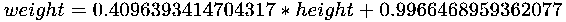

# 第六章：回归分析

回归分析是估计因变量之间关系的过程。例如，如果变量*y* 线性依赖于变量*x*，那么回归分析将尝试估算方程中的常数*a* 和 *b*，该方程表示变量*y* 与 *x* 之间的线性关系。

在本章中，您将学习以下主题：

+   通过对完美数据进行简单线性回归来执行回归分析的核心思想，以便从第一原理推导华氏度与摄氏度转换示例。

+   使用 Python 库**scipy.linalg**中的最小二乘法进行线性回归分析，应用于华氏度与摄氏度转换、基于身高的体重预测以及基于距离的飞行时间预测的完美数据和实际数据。

+   使用*梯度下降算法*来找到最佳拟合的回归模型（采用最小均方误差规则），并学习如何在 Python 中实现它。

+   使用最小二乘法建立非线性回归模型，应用于弹道飞行分析示例和*问题 4*，*细菌种群预测*。

# 华氏度与摄氏度转换 – 对完美数据的线性回归

华氏度和摄氏度之间的关系是线性的。给定一个包含华氏度和摄氏度数据对的表格，我们可以估计常数，推导出华氏度与摄氏度之间的转换公式，或者反过来：

| **⁰F** | **⁰C** |
| --- | --- |
| 5 | -15 |
| 14 | -10 |
| 23 | -5 |
| 32 | 0 |
| 41 | 5 |
| 50 | 10 |

# 从第一原理的分析

我们希望推导出一个将*F*（华氏度）转换为*C*（摄氏度）的公式，如下所示：


这里，*a* 和 *b* 是需要找到的常数。** 函数的图像是一条直线，因此，它唯一由两个点确定。因此，我们实际上只需要表格中的两个点，比如，*(F1,C1)* 和 *(F2,C2)*。然后，我们将得到以下内容：


现在，我们有以下内容：

。

因此，我们得到以下内容：


这里，我们取前两个数据对*(F1,C1)*=*(5,-15)*和*(F2,C2)*=*(14,-10)*。这将给我们以下内容：


因此，从华氏度计算摄氏度的公式如下：


让我们通过表格中的数据验证这一点：

| **⁰F** | **⁰C** | **(5/9)*F-160/9** |
| --- | --- | --- |
| 5 | -15 | -15 |
| 14 | -10 | -10 |
| 23 | -5 | -5 |
| 32 | 0 | 0 |
| 41 | 5 | 5 |
| 50 | 10 | 10 |

我们可以看到公式完美地拟合了 100%的输入数据。我们所处理的数据是完美的。在后续的示例中，我们将看到我们推导出的公式并不完全符合数据。我们的目标是推导出一个最适合数据的公式，以使预测值与实际数据之间的差异最小化。

# 线性回归的最小二乘法

给定输入变量  和输出变量 ，我们希望找到变量 a 和 b，使得  对于每个*i*值从 1 到*n*都成立。如果数据是完美的，这是可能的。在实际数据中，我们希望* y[i] *尽可能接近 ，也就是说，我们希望最小化  的绝对值。对于一个特定的项，这等价于最小化 。

通常使用平方函数而不是绝对值，因为平方函数具有更理想的数学性质。

最小二乘法找出 a 和 b，使得以下项（称为**误差**）最小化：


# 使用最小二乘法在 Python 中进行分析

我们使用 `scipy.linalg` Python 库中的 `lstsq` 最小二乘法来计算摄氏度和华氏度变量之间的线性依赖关系。

`lstsq` 函数用作 `lstsq(M, y)`，其中 *M* 是矩阵 `M = x[:, np.newaxis]**[0, 1]`，由输入向量 *x* 构造，*y* 是输出向量。换句话说，*y* 是依赖于 *x* 的变量。

**输入**：

```py
# source_code/6/fahrenheit_celsius.py
import numpy as np
from scipy.linalg import lstsq

#temperature data
fahrenheit = np.array([5,14,23,32,41,50])
celsius = np.array([-15,-10,-5,0,5,10])

M = fahrenheit[:, np.newaxis]**[0, 1]
model, _, _, _ = lstsq(M,celsius)
print "Intercept =", model[0]
print "fahrenheit =", model[1] 
```

**输出**：

```py
$ python fahrenheit_celsius.py Intercept = -17.777777777777782
fahrenheit = 0.5555555555555558
```

因此，我们可以看到摄氏度（*C*）和华氏度（*F*）之间的以下近似线性依赖关系：


请注意，这与我们之前的计算相对应。

# 可视化

这是用于通过直线从华氏度预测摄氏度的线性模型。其含义是，只有当*(F,C)*点在绿色线上时，*F*才能转换为*C*，反之亦然：


# 根据身高预测体重——使用实际数据的线性回归

这里，我们通过线性回归使用以下数据来预测一个人的体重：

| **身高（厘米）** | **体重（公斤）** |
| --- | --- |
| 180 | 75 |
| 174 | 71 |
| 184 | 83 |
| 168 | 63 |
| 178 | 70 |
| 172 | ? |

我们想要估算一个人的体重，已知他的身高是 172 厘米。

# 分析

在前一个示例中，华氏度与摄氏度的转换数据完美地符合线性模型。因此，我们甚至可以进行简单的数学分析（求解基本方程）来获得转换公式。然而，现实世界中的大多数数据并不完全符合一个模型。对于这种分析，找到一个拟合给定数据且误差最小的模型是非常有益的。我们可以使用最小二乘法来找到这样的线性模型。

**输入**：

我们将前面表格中的数据放入向量中，并尝试拟合线性模型：

```py
# source_code/6/weight_prediction.py
import numpy as np
from scipy.linalg import lstsq

height = np.array([180,174,184,168,178])
weight = np.array([75,71,83,63,70])

M = height[:, np.newaxis]**[0, 1]
model, _, _, _ = lstsq(M,weight)
print "Intercept =", model[0]
print "height coefficient =", model[1] 
```

**输出**：

```py
$ python weight_prediction.py Intercept = -127.68817204301082
height coefficient = 1.1317204301075274
```

因此，表示体重与身高之间线性关系的公式如下：！[](img/81cec6b9-0970-4ad3-b255-304c7f8c1399.png)

因此，我们估计身高为 172 厘米的人体重大约为！[](img/579661d9-3e22-4898-ac48-e45e1e769ff9.png)。

# 梯度下降算法及其实现

为了更好地理解如何利用线性回归从基本原理出发预测一个值，我们需要研究梯度下降算法，并将其在 Python 中实现。

# 梯度下降算法

梯度下降算法是一种迭代算法，通过更新模型中的变量来拟合数据，使误差尽可能小。更一般地说，它找到一个函数的最小值。

我们希望通过使用线性公式来表达体重与身高的关系：


我们使用*n*个数据样本！[](img/1340e2f8-9993-4f60-a81c-1b5d3238f829.png)来估计参数！[](img/ab3c0555-5e0e-47b7-b37d-46fa6859b84d.png)，以最小化以下平方误差：


梯度下降算法通过在*(∂/∂ p[j]) E(p)*的方向上更新*p[i]*参数来实现这一点，具体为：


在这里，*learning_rate*决定了*E(p)*收敛速度的最小值。更新*p*参数将导致*E(p)*收敛到某个值，前提是*learning_rate*足够小。在 Python 程序中，我们使用*learning_rate*为 0.000001。然而，这种更新规则的缺点是*E(p)*的最小值可能只是局部最小值。

要通过编程更新*p*参数，我们需要展开对*E(p)*的偏导数。因此，我们更新*p*参数如下：


我们将继续更新*p*参数，直到其变化非常微小；即，直到*p[0]*和*p[1]*的变化小于某个常数*acceptable_error*。一旦*p*参数稳定，我们可以利用它从身高估计体重。

# 实现

```py
# source_code/6/regression.py
# Linear regression program to learn a basic linear model.
import math
import sys
sys.path.append('../common')
import common # noqa

# Calculate the gradient by which the parameter should be updated.
def linear_gradient(data, old_parameter):
    gradient = [0.0, 0.0]
    for (x, y) in data:
        term = float(y) - old_parameter[0] - old_parameter[1] * float(x)
        gradient[0] += term
        gradient[1] += term * float(x)
    return gradient

# This function will apply gradient descent algorithm
# to learn the linear model.
def learn_linear_parameter(data, learning_rate,
 acceptable_error, LIMIT):
    parameter = [1.0, 1.0]
    old_parameter = [1.0, 1.0]
    for i in range(0, LIMIT):
        gradient = linear_gradient(data, old_parameter)
        # Update the parameter with the Least Mean Squares rule.
        parameter[0] = old_parameter[0] + learning_rate * gradient[0]
        parameter[1] = old_parameter[1] + learning_rate * gradient[1]
        # Calculate the error between the two parameters to compare with
        # the permissible error in order to determine if the calculation
        # is sufficiently accurate.
        if abs(parameter[0] - old_parameter[0]) <= acceptable_error
        and abs(parameter[1] - old_parameter[1]) <= acceptable_error:
            return parameter
        old_parameter[0] = parameter[0]
        old_parameter[1] = parameter[1]
    return parameter

# Calculate the y coordinate based on the linear model predicted.
def predict_unknown(data, linear_parameter):
    for (x, y) in data:
        print(x, linear_parameter[0] + linear_parameter[1] * float(x))

# Program start
csv_file_name = sys.argv[1]
# The maximum number of the iterations in the batch learning algorithm.
LIMIT = 100
# Suitable parameters chosen for the problem given.
learning_rate = 0.0000001
acceptable_error = 0.001

(heading, complete_data, incomplete_data,
 enquired_column) = common.csv_file_to_ordered_data(csv_file_name)
linear_parameter = learn_linear_parameter(
    complete_data, learning_rate, acceptable_error, LIMIT)
print("Linear model:\n(p0,p1)=" + str(linear_parameter) + "\n")
print("Unknowns based on the linear model:")
predict_unknown(incomplete_data, linear_parameter)
```

**输入**：

我们使用前一个示例中的数据 *身高预测体重* 并将其保存在 CSV 文件中：

```py
# source_code/6/height_weight.csv
height,weight
180,75 
174,71 
184,83 
168,63 
178,70 
172,? 
```

**输出**：

```py
$ python regression.py height_weight.csv Linear model:
(p0,p1)=[0.9966468959362077, 0.4096393414704317]

Unknowns based on the linear model:
('172', 71.45461362885045)  
```

线性模型的输出意味着体重可以通过身高来表示，如下所示：



因此，一个身高为 172 厘米的人预测的体重大约是：


请注意，这个 71.455 公斤的预测与使用最小二乘法预测得到的 67.016 公斤略有不同。这可能是因为 Python 梯度下降算法仅找到了局部最小值。

# 可视化——最小二乘法与梯度下降算法的比较

通过使用基于身高的体重预测，我们可以可视化最小二乘法和梯度下降算法的线性预测模型，以下是在 Python 中实现的代码：


# 基于距离的飞行时间预测

给定一个包含航班起点、终点和飞行时间的表格，我们希望估算从斯洛伐克布拉迪斯拉发到荷兰阿姆斯特丹的拟议飞行时间：

| **起点** | **终点** | **距离（公里）** | **飞行时长** | **飞行时长（小时）** |
| --- | --- | --- | --- | --- |
| 伦敦 | 阿姆斯特丹 | 365 | 1 小时 10 分钟 | 1.167 |
| 伦敦 | 布达佩斯 | 1462 | 2 小时 20 分钟 | 2.333 |
| 伦敦 | 布拉迪斯拉发 | 1285 | 2 小时 15 分钟 | 2.250 |
| 布拉迪斯拉发 | 巴黎 | 1096 | 2 小时 5 分钟 | 2.083 |
| 布拉迪斯拉发 | 柏林 | 517 | 1 小时 15 分钟 | 2.250 |
| 维也纳 | 都柏林 | 1686 | 2 小时 50 分钟 | 2.833 |
| 维也纳 | 阿姆斯特丹 | 932 | 1 小时 55 分钟 | 1.917 |
| 阿姆斯特丹 | 布达佩斯 | 1160 | 2 小时 10 分钟 | 2.167 |
| 布拉迪斯拉发 | 阿姆斯特丹 | 978 | ? | ? |

# 分析

我们可以推理，飞行时间由两部分组成——第一部分是起飞和着陆的时间；第二部分是飞机在空中以某一速度飞行的时间。第一部分是一个常数。第二部分与飞机的速度成线性关系，我们假设所有航班的速度在表格中是相似的。因此，飞行时间可以通过一个线性公式来表示，涉及飞行距离。

**输入**：

```py
source_code/6/flight_time.py import numpy as np
from scipy.linalg import lstsq

distance = np.array([365,1462,1285,1096,517,1686,932,1160])
time = np.array([1.167,2.333,2.250,2.083,2.250,2.833,1.917,2.167])

M = distance[:, np.newaxis]**[0, 1]
model, _, _, _ = lstsq(M,time)
print "Intercept =", model[0]
print "distance coefficient =", model[1]
```

**输出**：

```py
$ python flight_time.py Intercept = 1.2335890147536381
distance coefficient = 0.0008386790405704925
```

根据线性回归，平均飞行的起飞和着陆时间大约为 1.2335890 小时。飞行 1 公里的时间为 0.0008387 小时；换句话说，飞机的速度为每小时 1192 公里。对于像前述表格中的短途航班，飞机的实际通常速度大约是每小时 850 公里。这为我们的估算留出了改进的空间（参见 *问题 3*）。

因此，我们推导出了以下公式：


利用这个，我们估算从布拉迪斯拉发到阿姆斯特丹的航程（978 公里）大约需要 *0.0008387*978 + 1.2335890 = 2.0538376* 小时，约为 2 小时 03 分钟，这比从维也纳到阿姆斯特丹的时间（1 小时 55 分钟）稍长，比从布达佩斯到阿姆斯特丹的时间（2 小时 10 分钟）稍短。

# 弹道飞行分析——非线性模型

一艘星际飞船降落在一个大气层几乎不存在的行星上，并以不同的初速度发射了三枚携带探测机器人的投射物。当机器人降落在表面后，测量它们的距离并记录数据，结果如下：

| **速度 (米/秒)** | **距离 (米)** |
| --- | --- |
| 400 | 38,098 |
| 600 | 85,692 |
| 800 | 152,220 |
| ? | 300,000 |

为了使携带第四个机器人的投射物落地在距飞船 300 公里的地方，应该以什么速度发射？

# 分析

对于这个问题，我们需要理解投射物的轨迹。由于该行星的大气层较弱，轨迹几乎等同于没有空气阻力的弹道曲线。从地面发射的物体所经过的距离 *d*，忽略行星表面的曲率，近似由以下方程给出：


其中 *v* 是物体的初速度，τ 是物体发射的角度，*g* 是行星对物体施加的重力。请注意，角度 *τ* 和重力 *g* 是不变的。因此，可以定义一个常量为 。这意味着，可以通过以下方程用速度来解释探测行星上的旅行距离：


尽管 *d* 和 *v* 之间没有线性关系，但 *d* 和 *v* 的平方之间有线性关系。因此，我们仍然可以应用线性回归来确定 *d* 和 *v* 之间的关系。

# 使用 Python 的最小二乘法进行分析

**输入**：

```py
source_code/6/speed_distance.py import numpy as np
from scipy.linalg import lstsq

distance = np.array([38098, 85692, 152220])
squared_speed = np.array([160000,360000,640000])

M = distance[:, np.newaxis]**[0, 1]
model, _, _, _ = lstsq(M,squared_speed)
print "Intercept =", model[0]
print "distance coefficient =", model[1]
```

**输出**：

```py
$ python speed_distance.py Intercept = -317.7078806050511
distance coefficient = 4.206199498720391
```

因此，通过回归可以预测速度平方与距离之间的关系，如下所示：


截距项的存在可能是由测量误差或方程中其他力的影响所造成的。由于它相对较小，最终的速度应该能被合理估计出来。将 300 公里的距离代入方程，我们得到如下结果：


因此，为了使投射物从源头到达 300 公里的距离，我们需要以大约 1123.157 米/秒的速度发射它。

# 总结

在这一章中，我们学习了回归分析。我们可以将变量看作是相互依赖的函数关系。例如，*y* 变量是 *x* 的函数，记作 *y=f(x)*。函数 *f(x)* 拥有常数参数。如果 *y* 线性依赖于 *x*，那么 *f(x)=a*x+b*，其中 *a* 和 *b* 是 *f(x)* 函数中的常数参数。

我们看到，回归是一种估算这些常数参数的方法，目的是使得估算出的 *f(x)* 尽可能接近 *y*。这通常通过计算 *f(x)* 和 *y* 之间的平方误差来衡量，以 *x* 数据样本为基础。

我们还介绍了梯度下降法，通过更新常数参数，沿着最陡的下降方向（即误差的偏导数）来最小化误差，从而确保参数快速收敛到使误差最小的值。

最后，我们学习了`scipy.linalg` Python 库，它支持使用基于最小二乘法的`lstsq`函数估算线性回归。

在下一章中，你将把回归分析应用于时间相关数据的分析。

# 问题

**问题 1：云存储费用预测**：我们的软件应用程序每月生成数据，并将这些数据与前几个月的数据一起存储在云存储中。我们得到以下云存储费用账单，并希望估算使用云存储的第一年的运营费用：

| **使用云存储的月份** | **每月费用（欧元）** |
| --- | --- |
| 1 | 120.00 |
| 2 | 131.20 |
| 3 | 142.10 |
| 4 | 152.90 |
| 5 | 164.30 |
| 1 到 12 | ? |

**问题 2：华氏度与摄氏度转换**：在本章前面我们看过的例子中，我们制定了一个将华氏度转换为摄氏度的公式。现在，制定一个将摄氏度转换为华氏度的公式。

**问题 3：基于距离的飞行时间预测**：你认为为什么线性回归模型得出的飞行速度估算为 1192 km/h，而实际速度大约是 850 km/h？你能提出一种更好的方法来建模基于飞行距离和时间的飞行时长估算吗？

**问题 4：细菌种群预测**：实验室观察到了一种细菌——大肠杆菌，并通过各种在 5 分钟间隔进行的测量估算了其种群数量，具体数据如下：

| **时间** | **种群数量（百万）** |
| --- | --- |
| 10:00 | 47.5 |
| 10:05 | 56.5 |
| 10:10 | 67.2 |
| 10:15 | 79.9 |
| 11:00 | ? |

假设细菌继续以相同的速度生长，那么在 11:00 时，预计细菌数量是多少？

# 分析

**问题 1**：每个月，我们都需要支付存储在云端的数据费用，包括本月新增的数据。我们将使用线性回归来预测一般月份的费用，然后计算前 12 个月的费用来计算全年的费用。

**输入**：

```py
source_code/6/cloud_storage.py
import numpy as np
from scipy.linalg import lstsq

month = np.array([1,2,3,4,5])
bill = np.array([120.0,131.2,142.1,152.9,164.3])

M = month[:, np.newaxis]**[0, 1]
model, _, _, _ = lstsq(M,bill)
print "Intercept =", model[0]
print "month_data =", model[1]
```

**输出**：

```py
$ python cloud_storage.py Intercept = 109.00999999999992
month_data = 11.030000000000008
```

这意味着基础费用为*base_cost*=*109.01*欧元，然后每月存储新增数据的费用为*month_data*=*11.03*欧元。因此，第*n*^(月)账单的公式如下：


记住，前*n*个数字的和是 。因此，前*n*个月的费用将如下所示：


全年的费用将如下所示：


**可视化**

1.  在下图中，我们可以观察到模型的线性特性，由蓝线表示。另一方面，线性线上的点的和是二次的，并由线下的区域表示：


**问题 2**：有多种方法可以获得将摄氏度转换为华氏度的公式。我们可以使用最小二乘法，并从初始的 Python 文件中提取以下几行：

*M = fahrenheit[:, np.newaxis]**[0, 1]*

*model, _, _, _ = lstsq(M,celsius)*

然后我们将其更改为以下内容：

*M = celsius[:, np.newaxis]**[0, 1]*

*model, _, _, _ = lstsq(M,fahrenheit)*

然后，我们将得到期望的反向模型：

```py
Intercept = 32.000000000000014
celsius = 1.7999999999999998
```

因此，可以通过以下方式将摄氏度转换为华氏度：


另外，我们可以通过修改以下公式得到前面的公式：


**问题 3**：估计的速度如此之高，因为即使是短途航班也需要相当长的时间；例如，从伦敦到阿姆斯特丹的航班，两个城市之间的距离仅为 365 公里，但需要约 1.167 小时。然而，另一方面，如果距离只稍微变化，则飞行时间也只会略有变化。这导致我们估计初始设置时间非常长。因此，飞行速度必须非常快，因为只剩下少量时间来完成某个距离的旅行。

如果我们考虑非常长的航班，其中初始设置时间与飞行时间的比率要小得多，我们可以更准确地预测飞行速度。

**问题 4**：在 5 分钟间隔内，细菌数量分别为 47.5、56.5、67.2 和 79.9 百万。这些数字之间的差值为 9、10.7 和 12.7。序列是递增的。因此，我们需要查看相邻项的比率，以观察序列的增长方式：56.5/47.5=1.18947，67.2/56.5=1.18938，79.9/67.2=1.18899。相邻项的比率接近，因此我们有理由相信，生长中的细菌数量可以通过模型的指数分布进行估算：


其中 *n* 是细菌数量（单位：百万），*b* 是常数（底数），字母 *m* 是指数，表示自 10:00 以来的分钟数，10:00 是第一次测量的时间，47.7 是当时的细菌数量（单位：百万）。

为了估算常数*b*，我们使用序列项之间的比率。我们知道 *b⁵* 大约等于 *(56.5/47.5 + 67.2/56.5 + 79.9/67.2)/3=1.18928*。因此，常数*b* 大约等于 *b=1.18928^(1/5)=1.03528*。于是，细菌数量（单位：百万）如下：


在 11:00，也就是比 10:00 晚 60 分钟时，估算的细菌数量如下：


