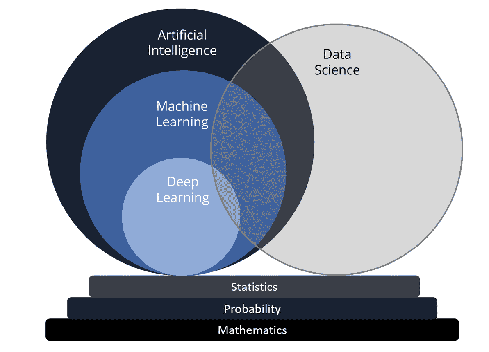
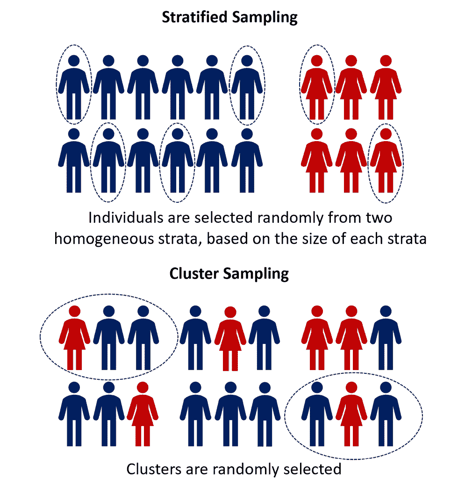
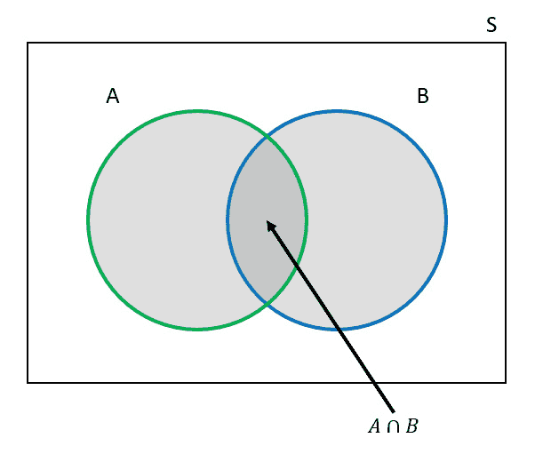
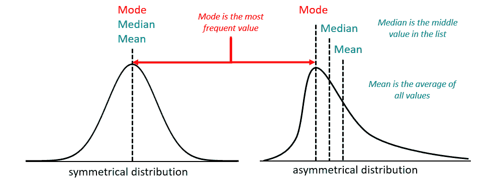
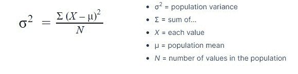
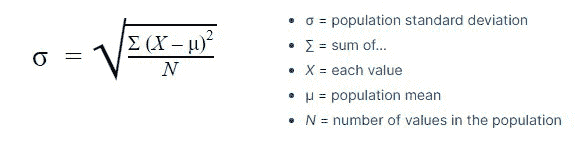

# 第一章：引入数据科学

**数据科学**并不是一个新词；事实上，它是在 1960 年代由丹麦计算机科学先驱彼得·诺尔（Peter Naur）创造的，他使用“数据科学”这一术语来描述在数学、统计学和计算机科学等多个领域中与数据打交道的过程。

然而，数据科学的现代应用在 1990 年代和 2000 年代初期开始成形，数据科学家作为一种职业，越来越普遍地出现在各行各业中。

随着人工智能的指数级发展，有人可能会认为数据科学变得不那么相关了。

然而，理解数据的科学方法，即定义数据科学的方法，是成功构建基于机器学习和人工智能的解决方案的基础。

本书将探索这些不同的术语，提供统计学和机器学习理论的坚实基础，以及可以应用于统计学、机器学习和人工智能模型的概念，并讨论如何引导数据科学团队和项目走向成功。

本章向读者介绍了统计学和数据科学如何交织在一起，以及一些统计学的基本概念，这些概念可以帮助你更好地处理数据。

我们将探讨数据科学、人工智能和机器学习之间的区别，解释统计学与数据科学的关系，阐明描述性统计与推论统计的概念，以及概率和理解数据形态（分布）的基本方法。

尽管某些读者可能会觉得本章涉及的是基础性知识，但其目的是为所有读者，尤其是那些来自非技术背景的读者，提供对这些概念的坚实理解，帮助他们在深入数据科学的世界之前打下基础。对于更有经验的读者，本章作为快速回顾，帮助建立贯穿全书的共同语言。

在接下来的部分，我们将详细讨论数据科学、人工智能和机器学习这些术语，它们之间的关系，以及它们的不同之处。

本章涵盖以下主题：

+   数据科学、人工智能和机器学习——它们有什么区别？

+   统计学与数据科学

+   描述性统计与推论统计

+   概率

+   描述我们的样本

+   概率分布

# 数据科学、人工智能和机器学习——它们有什么区别？

你可能听过“数据科学”、“人工智能”和“机器学习”这些术语被交替使用，但它们是不同的概念，具有独特的特点。

人工智能是一个广泛的领域，专注于开发能够执行通常需要人类智能的任务的计算机系统，如视觉感知、语音识别、决策和语言翻译。机器学习是人工智能的一个子集，它涉及训练计算机系统从数据中学习，并在特定任务上改进其表现，而无需明确编程。

机器学习算法使计算机系统能够从数据中学习并识别模式，进而用于进行预测或决策。虽然所有机器学习都属于人工智能的范畴，但并非所有人工智能都包含机器学习，因为某些人工智能系统可能依赖于基于规则或符号推理的方法。

深度学习是机器学习的一种特定类型，它利用具有多层的人工神经网络从原始数据中提取更高层次的特征。这种技术在图像和语音识别等任务中非常有效。

数据科学是一个多学科领域，涉及从数据中提取和分析相关的洞见。它专注于发现数据中的隐藏模式和关系，以得出有意义的结论。数据科学家利用机器学习算法进行预测并指导决策。

所有这些领域都建立在数学、概率论和统计学的基础上。理解这些核心概念对于任何有意从事数据科学、人工智能或机器学习事业的人来说都是至关重要的。

以下是试图可视化这些领域之间关系的尝试：

图 1.1：数据科学、机器学习和人工智能之间关系的可视化表示

在这里，深度学习是机器学习的一个子集，而人工智能是一个更广泛的领域，它包括机器学习以及其他执行智能任务的方法。

作为一种实践，数据科学与所有这些领域有所交集，因为它可以利用最适合的任何方法，从数据中提取洞见、预测和建议。

所有这些领域都建立在数学、概率和统计学的基础上。因此，在接下来的章节中，我们将探讨数据科学的这些数学和统计学基础。

## 数据科学的数学和统计学基础

本书面向的是以商业为导向的决策者，而**不是**技术专家，因此你可能会想，为什么我们从谈论数学开始。

事实上，数据科学的核心基于数学和统计学基础，因此即使你不是数据科学家或机器学习/人工智能工程师，拥有基本的数学和统计学概念理解，仍然是与数据科学家合作或领导数据科学、机器学习或人工智能项目时最重要的工具之一，无论是在解读数据科学家和机器学习工程师带来的模型和结果时，还是在更好地理解某些数据和模型的局限性时，或者在评估哪些业务场景适合使用数据科学时。

研究发现，87%的数据科学项目永远无法投入生产。换句话说，只有大约十分之一的项目能够进入到为公司带来实际价值的阶段。

这些结果乍一看可能不尽如人意，但其中也有积极的一面。在许多情况下，缺失的关键部分是强有力的执行领导力，能够判断哪些应用场景适合数据科学，提供高质量、相关的数据，并以一种数据科学能够成功应用的方式来框定使用场景。

了解一些关于数据科学所需的数学和统计学核心概念，不仅能帮助你更好地理解数据科学，还能为你提供规划和引导数据科学项目的方向，确保从一开始就能够取得更成功的结果。

在本书中，我们不会试图提供与人工智能和机器学习相关的全面数学基础，因为这需要完成整个学位才能达到。然而，在本章中，我们将帮助你理解统计学的基础知识。

# 统计学与数据科学

英国数学家卡尔·皮尔逊曾说过：“*统计学是科学的语法。*”

如果你正在开始领导组织中的数据科学、机器学习或人工智能项目，或者仅仅是与数据科学家和机器学习工程师合作，那么拥有统计学基础知识是非常必要的。

对统计学知识的基础理解对于那些准备领导数据科学领域项目或团队的人至关重要。它使他们能够在从数据中提取有价值见解时获得竞争优势。统计学在此过程中发挥着重要作用，它提供了多种工具和技术来识别模式并深入挖掘现有数据中的洞察力。掌握统计学能够帮助人们批判性思考、创造性地解决问题，并做出数据驱动的决策。在本节中，我们将涵盖与数据科学相关的基本统计学知识。

## 什么是统计学？

在深入讨论之前，定义**统计学**的含义会很有帮助，因为这个术语可以有多种不同的含义。它可以用于以下几种情况：

+   表示整个统计学学科

+   指代用于收集、处理和解释定量数据的方法

+   指代收集的各类数据

+   指代用于解释收集到的数据的计算数据（例如均值）

在本书中，我们采用第二种定义来解释统计学——即用于收集、处理和解释定量数据的方法。

今天，几乎没有哪个行业不受统计思维的影响。例如，在市场调研中，统计学用于抽样调查并比较各组之间的结果，以了解哪些见解具有统计显著性；在生命科学中，统计学用于衡量和评估药物的有效性；在金融服务中，统计学用于建模和理解风险。

我相信你对许多统计学的应用都很熟悉，可能曾在学校、大学或职业生涯中学习过统计学，本章接下来的内容对你来说可能并不完全是新信息。即使如此，复习一遍仍然很有帮助，因为不幸的是，职业生涯中不可能暂停去完成一门统计学课程。

当你领导数据科学、机器学习（ML）或人工智能（AI）项目时，理解统计学是一项基本技能，无论你是使用简单的统计模型，还是理解所使用的数据，或者在训练和评估深度学习 AI 模型时了解模型的表现。

牢记这一点，让我们深入探讨概率与统计学中的一些核心概念。

# 描述性统计与推论性统计

理解有两种不同类型的统计学是很重要的：描述性统计学（用于总结或描述观察结果的方法）和推论性统计学（利用这些观察结果作为做出估计或预测的基础）——也就是说，关于尚未调查的情况的推论。

看看以下两个示例陈述。它们哪个是“描述性”统计，哪个是“推论性”统计？

+   根据我们的预测，我们预计明年的销售收入将增长 35%。

+   我们在客户群体中的平均评分为 8 分（满分 10 分）。

第一个陈述是推论性的，因为它超越了过去的观察，对未来做出推论，而第二个陈述是描述性的，因为它总结了历史观察。

在数据科学中，通常首先通过描述性统计学来探索数据，这属于所谓的**探索性数据分析**（**EDA**）的一部分，旨在对数据进行概况化和理解。之后，可以利用在数据集上训练的统计模型或机器学习（ML）模型（称为模型训练）对未见过的数据进行推论（称为模型推论或执行）。当我们在本书后面介绍机器学习基础时，我们将再次探讨这一主题。

描述性统计学和推论性统计学的区别取决于**样本**和**总体**之间的差异，这两个术语是统计学中的两个重要概念。

在统计学术语中，**群体**不仅指的是人群的群体，也同样可以指交易、产品或零售店的群体。关键是“群体”指的是研究组中的每一个示例。数据科学家未必对群体中的每个属性感兴趣——他们可能只对零售店的销售收入或产品的价格感兴趣。

然而，即使数据科学家对群体的某一特征感兴趣，他们通常也无法研究群体中的所有成员。通常，他们必须从群体中选择一个样本——一个相对较小的样本。这通常是由于时间和费用的限制，或者由于数据的可用性，仅能获得数据样本。

在这种情况下，可以使用描述性统计学来总结样本数据，而推断性统计学则使数据科学家能够超越可用数据，将信息推广到整个群体。

总结一下，描述性统计学涉及总结一个样本，而推断性统计学则关注将样本推广到整个群体，进行推断。

从样本到群体的这些推论有多准确？这正是统计学的核心内容之一：衡量不确定性和误差。在使用统计模型或甚至机器学习模型的结果时，理解不确定性的概念并能度量它是非常有用的，不应回避这一点。有时候，商业利益相关者可能不想看到误差范围与简单统计技术的输出结果，因为他们想要完全确定的结果。否则，任何不确定性与结果一起展示时，可能会被过度放大。

然而，在进行推断时，我们很少能够观察到整个群体，也无法让模型泛化到每个可能的边缘情况，从而对任何结果有绝对的确定性。

然而，我们可以比人类直觉做得更好，更科学的做法是采取更科学的立场，理解和衡量推断和预测中的误差范围和不确定性。我们每天在无意识中都会做出部分信息和一定不确定性的决策。例如，如果你曾预定过酒店，你可能查看了一些酒店的样本，并阅读了一些顾客的评论，但最终仍然需要基于这些样本做出选择。你可能看到一家酒店只有一个五星级评论，另一家酒店有 1,000 条评论，平均评分为 4.8 星。虽然第一家酒店的平均评分更高，但你会选择哪一家酒店？大概是后者，因为你可以推测评分的误差范围较小，但更重要的是，仍然存在一些误差范围，因为并非每个顾客都可能留下评论。

在数据科学、机器学习（ML）和人工智能（AI）领域，调查和理解不确定性是至关重要的，尤其是在处理数据科学时，明确哪些误差范围对于你的业务案例是可以接受的，这对于决定是否将模型部署到生产环境中至关重要。

## 抽样策略

在数据科学中，抽样是从更大的人群中选择一个数据子集的过程。抽样可以是决策者得出推论并对总体进行预测的强大工具，但选择正确的抽样策略以确保结果的有效性和可靠性至关重要。

### 随机抽样

随机抽样是最常见且直接的抽样策略。在这种方法中，总体中的每个成员都有相等的机会被选入样本。这可以通过多种技术实现，例如简单随机抽样、分层随机抽样或聚类抽样。

简单随机抽样是从总体中随机选择个体而不进行任何限制或分层。分层随机抽样则是根据某些特征将总体划分为不同的层或子群体，然后从每个层中随机选择个体。聚类抽样则是将总体划分为多个聚类，并随机选择整个聚类纳入样本。

随机抽样在总体庞大且同质时非常有用，即所有成员具有相似特征。然而，当总体多样且子群体之间存在显著差异时，它可能不是最佳策略。

### 方便抽样

方便抽样涉及从总体中选择那些容易接近或可用的个体。这可以包括位于方便位置的个体，如在同一个办公室或大楼中的人，或者是那些可以轻松参与研究的个体。

尽管方便抽样可以是一种快速简便的数据收集方式，但它并不是最可靠的策略。样本可能无法代表总体，因为它可能会排除某些子群体或过度代表其他子群体。

### 分层抽样

分层抽样涉及根据某些特征将总体划分为子群体，然后从每个子群体中选择个体纳入样本。当总体多样且子群体之间存在显著差异时，这一策略可能会非常有用。

在分层抽样中，样本的大小与总体中每个子群体的大小成比例。这确保了每个子群体在样本中得到充分代表，从而使结果能够更准确地推断到总体。

### 聚类抽样

簇抽样涉及将总体分成簇，并随机选择完整的簇纳入样本中。当总体地理分布较广，或访问簇比访问个体更容易时，这一策略非常有用。

簇抽样涉及将总体分成簇，簇通常基于地理位置接近或其他共同特征。然后，从这些簇中随机选择几个簇，并将所选簇内的所有成员纳入样本中。当总体分布较广，或更容易访问和调查整个簇而非个体时，这一策略特别有用。

簇抽样通常比其他抽样方法更具成本效益和效率，尤其是在处理分布广泛的大规模人群时。然而，如果簇的代表性不足，簇抽样可能会导致比简单随机抽样更高的抽样误差：

图 1.2：分层随机抽样和簇抽样

抽样是决策者用于推断和预测总体的一个重要工具。抽样策略的选择取决于总体的特征和所提出的研究问题。随机抽样、分层抽样和簇抽样都是有效的策略，但需要考虑每种方法可能带来的偏差和局限性。通过选择合适的抽样策略，决策者可以确保其结果的可靠性和有效性，并能基于数据做出更有信息支持的决策。

### 随机变量

一旦我们拥有了样本的成员，接下来该怎么做呢？

这就是随机变量概念的应用场景。

在数据科学中，随机变量是由机会决定其值的变量。随机变量常用于建模不确定事件或结果，它们在统计分析、机器学习和决策制定中起着至关重要的作用。

随机变量是用来为随机过程的每个可能结果分配数值的数学函数。例如，掷硬币时，可以将 0 分配给反面，1 分配给正面，从而使随机变量*X*取值为 0 或 1：

X = {1, 如果是正面；0，如果是反面}

随机变量有两种类型：离散型和连续型。离散型随机变量只能取有限个或可数个值，而连续型随机变量可以取指定范围内的任意值。

例如，掷一个六面骰子的结果是一个离散型随机变量，因为它只能取值 1、2、3、4、5 或 6。而一个人的身高是一个连续型随机变量，因为它可以在某个范围内取任意值。

随机变量通常在抽样策略的上下文中使用，因为它们提供了一种建模和分析样本中不确定结果的方法。

例如，假设决策者想要估计某大学学生的平均身高。一种可能的抽样策略是简单随机抽样，从该大学所有学生的总体中随机选取一个学生样本。

### 概率分布

随机变量的概率分布描述了该变量每个可能值的发生概率。对于离散随机变量，概率分布通常通过**概率质量函数**（**PMF**）表示，给出每个可能值的概率。对于连续随机变量，概率分布通常通过**概率密度函数**（**PDF**）表示，给出每个点在范围内的概率密度。

# 概率

概率是一种衡量某件事发生可能性的方法。如前所述，在数据科学、机器学习和决策制定中，我们通常会处理不确定的事件或结果。概率帮助我们理解和量化这种不确定性。

例如，当我们抛硬币时，我们不知道它是会正面朝上还是反面朝上。它正面朝上的概率是 50%，反面朝上的概率也是 50%。

## 概率分布

概率分布是一种展示每个可能结果的可能性的方法。例如，当我们掷一个六面骰子时，每个数字出现的概率是相同的——1/6。意味着概率分布对于每个结果是均等的。

## 条件概率

条件概率是指在已知另一个事件或结果已经发生的情况下，某个事件或结果发生的可能性。例如，如果我们知道一个人的身高超过六英尺，那么他成为篮球运动员的条件概率要高于随机选中的人是篮球运动员的概率。

假设有两个不同的事件 A 和 B，它们在一个称为样本空间 S 的范围内有一定的发生概率，样本空间 S 包含所有可能发生的事件。

例如，A 可以是消费者购买某个品牌产品的事件，而 B 可以是消费者访问该品牌网站的事件。在下面的图示中，事件 A 的概率 P(A) 和事件 B 的概率 P(B) 通过下图中阴影区域表示。事件 A 和 B 同时发生的概率由 A 和 B 重叠的阴影区域表示。在数学符号中，这可以写作 P(A ∩ B)，表示 A 和 B 的**交集**的概率。这个交集意味着 A 和 B 都发生：

图 1.3：一个维恩图，展示了两个事件（A 和 B）在样本空间（S）中发生的概率。

事件 A 发生的条件概率，**给定**事件 B 已发生，可以通过以下公式计算：

在我们的例子中，这将是**给定**消费者访问了品牌网站后购买该品牌产品的概率。通过理解不同事件的概率及其相互关系，我们可以计算条件概率等内容，这有助于我们基于数据理解事件发生的可能性。

# 描述我们的样本

现在我们已经理解了总体、样本和随机变量的概念，我们可以使用哪些工具来描述和理解我们的数据样本呢？

## 集中趋势度量

期望值是一个统计度量，表示随机变量的平均值，按其发生的概率加权。它提供了一种估计概率分布集中趋势的方法，并且对决策制定和预测不确定事件或结果非常有用。

集中趋势度量，包括均值、中位数和众数，是描述数据集的中心值或典型值的统计度量。

均值是数据集的算术平均数，通过将所有数值相加并除以数值的数量来计算。它是常用的集中趋势度量，且对离群值（显著高于或低于大多数数据点的数值，通常远离均值）敏感。均值可能会受到极端值的影响，如果存在离群值，可能无法代表整个数据集。

中位数是数据集中的中间值，具有相等数量的值在其之上和之下。它是一个稳健的集中趋势度量，比均值更不容易受到离群值的影响。中位数对于偏斜的数据集很有用，因为均值可能无法准确地代表数据的中心。

众数是数据集中出现频率最高的值。它是另一种集中趋势度量，对于具有离散值的数据集或当最频繁的值特别重要时很有用。众数可用于分类数据和数值数据。

下图展示了均值、中位数和众数在两种不同数据分布中的差异。假设这个数据集显示了消费者产品的价格范围，例如一个在线酒商的葡萄酒瓶价格。

对于对称分布，这三种度量值是相等的；然而，对于不对称的数据，它们是不同的。选择使用哪种度量可能取决于数据的分布。均值常常会被极端离群值所偏移——例如，一瓶非常昂贵的葡萄酒价格并不能反映网站上大多数瓶葡萄酒的售价，因此，你可能希望使用中位数来更好地理解数据集中的平均值，而不是因价格较高的个别产品而对商店产生恐惧！

图 1.4：对称分布和非对称分布的众数、中位数和均值

总体而言，期望值和集中趋势的度量是重要的统计概念，在数据科学、机器学习和决策中起着至关重要的作用。它们为你提供了一种理解和描述数据集特征的方法，并帮助决策者根据不确定事件或结果的分析做出更明智的决策。

## 离散度的度量

离散度度量是描述数据集分布广度或变化性的统计指标。它们为我们提供了一种理解数据变异性的方法，并可以用于比较不同的数据集。

### 范围

范围是一个简单的离散度度量，它表示数据集中最大值和最小值之间的差异。它的计算方法简单，能提供数据分布的大致估计。例如，班级学生身高的范围将是最高和最低学生身高之间的差值。

### 方差和标准差

方差和标准差是更高级的离散度度量，它们提供了数据变异性的更准确和精确的估计。

方差是衡量数据集中每个值与均值之间距离的指标。它的计算方法是将每个值与均值之间的差的平方求和，然后除以数据集中的总值数：

标准差是方差的平方根：

例如，假设一家公司想比较两个不同部门的工资。可以计算每个部门工资的标准差，以确定各自部门内工资的变动情况。标准差较大的部门，其工资变动性较大，标准差较小的部门则变动性较小。

### 四分位距

**四分位距**（**IQR**）是衡量离散度的指标，它表示数据集的第 75 百分位数与第 25 百分位数之间的差值。换句话说，它是数据中间 50%的范围。对于存在离群值的数据集，它比范围更不容易受到极端值的影响。

例如，假设一位老师想比较两班学生的考试成绩。一班有几位学生成绩极高或极低，而另一班的成绩则较为均衡。可以计算每班的 IQR，以确定大多数学生成绩的范围。

离散度度量是重要的统计指标，它们为我们提供了关于数据集变异性的信息。

## 自由度

**自由度**是统计学中的一个基本概念，指的是在分析中可以变化的独立值或数量的个数，而不破坏任何约束条件。在进行各种统计检验和模型分析时，理解自由度至关重要，例如 t 检验、方差分析（ANOVA）和回归分析。

更简单地说，自由度代表的是在估算统计参数时，你的数据中可以自由变化的信息量。这个概念在假设检验中非常重要，用于确定在零假设成立的情况下，观察到的结果发生的概率。

例如，假设你有一个包含十个观测值的样本，并且想要计算样本均值。计算出均值后，你还剩下九个自由度（10 - 1 = 9）。这是因为如果你知道九个观测值和样本均值，你就可以计算出第十个观测值的值。

计算自由度的通用公式如下：

df = n − p

在这里，我们有以下内容：

+   n 是样本中的观测值数量

+   p 是从数据中估算的参数数量

自由度在各种统计检验中被用来确定检验统计量和 p 值的临界值。例如，在进行两样本均值比较的 t 检验时，自由度用于从 t 分布表中选择合适的临界值。

理解自由度对于数据科学领域的领导者至关重要，因为它帮助他们解读统计检验结果并根据数据做出明智的决策。它还在确定模型的复杂性和避免过拟合方面起到重要作用，过拟合是指模型过于复杂，开始拟合数据中的噪声而不是潜在的模式。

## 相关性、因果性和协方差

相关性、因果性和协方差是数据科学、机器学习和决策制定中的重要概念。它们都涉及两个或多个变量之间的关系，可以用来进行预测和指导决策。

### 相关性

相关性是衡量两个变量之间关系的强度和方向的指标。它是一个统计度量，范围从 -1 到 1。相关性为 1 表示完全正相关，相关性为 0 表示没有相关性，相关性为 -1 表示完全负相关。

例如，假设我们想了解一个人的年龄与其收入之间的关系。如果我们观察到随着一个人年龄的增长，他们的收入也趋向增加，这就表明年龄与收入之间存在正相关关系。

### 因果性

因果性指的是两个变量之间的关系，其中一个变量导致另一个变量发生变化。因果性通常是从相关性中推断出来的，但需要注意的是，相关性不一定意味着因果性。

例如，假设我们观察到冰淇淋销售数量与城市中溺水人数之间的相关性。尽管这两个变量存在相关性，但假设其中一个导致另一个是不正确的。相反，可能存在一个第三个变量，例如温度，导致冰淇淋销量和溺水人数同时增加。

### 协方差

协方差是衡量两个变量联合变异性的指标。它衡量两个变量共同变化的程度。正协方差表明这两个变量倾向于一起增加或减少，而负协方差则表明这两个变量倾向于朝相反方向变化。

例如，假设我们想了解一个人的身高和体重之间的关系。如果我们观察到随着身高的增加，体重也倾向于增加，这将表明身高和体重之间存在正协方差。

相关性、因果关系和协方差是数据科学中的重要概念。通过理解这些概念，决策者可以更好地理解变量之间的关系，并基于数据分析做出更为明智的决策。

协方差衡量两个变量如何共同变化，指示它们之间线性关系的方向。然而，协方差值难以解释，因为它们受变量尺度的影响。相关性则是一个标准化的度量，范围从-1 到+1，使得理解和比较变量之间线性关系的强度和方向变得更加容易。

需要注意的是，相关性并不一定意味着因果关系，其他因素可能是导致变量间观察到的关系的原因。两个变量之间的强相关性并不自动意味着一个变量导致了另一个变量，因为可能存在影响这两个变量的隐藏混杂因素。

## 数据的形态

在处理数据样本时，了解数据的“形态”或数据的分布方式是很有帮助的。在这方面，我们可以考虑连续数据和离散数据的概率分布。这些概率分布可以用来描述和理解你的数据。概率分布可以帮助你识别数据中的模式或趋势。例如，如果你的数据遵循正态分布，这表明大多数值集中在均值附近，极端值较少。识别这些模式可以帮助决策或进一步分析。

# 概率分布

概率分布是描述随机事件或过程不同结果的可能性的数学函数。它们帮助我们理解随机变量的行为，并对未来事件做出预测。概率分布有两种主要类型：离散分布和连续分布。

## 离散概率分布

当随机事件的可能结果是可数的或有限的时，使用离散概率分布。让我们看一些常见的离散概率分布示例。

### 伯努利分布

这是最简单的离散概率分布。它模拟了一个单次试验，只有两种可能的结果：成功（通常表示为 1）或失败（通常表示为 0）。例如，抛硬币具有成功（正面）概率为 0.5 的伯努利分布。

### 二项分布

该分布模拟在固定数量的独立试验中成功的次数，其中每次试验成功的概率相同。例如，如果你抛硬币十次，你观察到的正面次数遵循参数为 n = 10（试验次数）和 p = 0.5（成功概率）的二项分布。

### 负二项分布

该分布模拟在具有相同成功概率的独立试验中，指定数量的成功之前的失败次数。例如，如果你玩一个需要赢三次才能结束的游戏，第三次赢之前的失败次数遵循负二项分布。

### 几何分布

这是负二项分布的特例，其中成功次数固定为 1。它模拟了在每次成功的独立试验中获得第一个成功之前的失败次数。例如，投掷骰子直到获得一个 6 的次数。

### 泊松分布

该分布模拟在固定时间或空间间隔内事件发生的数量，给定平均发生率。它通常用于建模罕见事件，如一年内地震次数或一小时内到达商店的客户数量。

## 连续概率分布

当随机事件的可能结果是连续的，如测量或时间时，使用连续概率分布。让我们看一些常见的连续概率分布示例。

### 正态分布

也称为高斯分布，这是最知名的连续概率分布。它模拟具有对称、钟形分布的连续变量，如身高、体重或智商分数。许多自然现象都服从正态分布。

### 标准正态分布

这是正态分布的一个特例，均值为零，标准差为一。它通常用于标准化变量并比较不同正态分布的值。

### 学生 t 分布

这个分布类似于正态分布，但尾部更重。它用于样本大小较小（通常小于 30）或人群标准差未知的情况。它通常用于假设检验和构建置信区间。

### 伽玛分布

该分布模型用于正值的连续变量，并且具有右偏分布。它通常用于建模等待时间，例如机器故障的时间或客户到达的时间。

### 指数分布

这是伽马分布的特例，其中形状参数等于 1。它模拟事件发生间隔的时间，这些事件以恒定的速率发生，例如客户到达的时间或放射性粒子衰变的时间。

### 卡方分布

该分布用于正值变量。它通常用于假设检验以及估计样本方差的置信区间。它也用于卡方独立性检验和拟合优度检验。

### F 分布

该分布用于正值或非负变量。它通常用于检验两个方差的相等性或回归模型的显著性。它是两个卡方分布的比值。

概率分布使我们能够理解和量化随机事件或过程中的不同结果的概率。通过了解不同类型的概率分布及其应用，数据科学领导者可以更好地对数据进行建模和分析，做出明智的决策，并改善预测。了解在特定情境下使用哪种分布对于准确的数据分析和决策至关重要。

# 概述

本章中，我们已涵盖了统计学中的许多核心概念，为您提供了更好地理解和解释数据的工具，并能够与数据科学家的输出结果合作。

在下一章中，我们将介绍不同类型的数据、需要注意和管理的数据质量问题，以及收集、存储和处理数据的不同方法。
