# 第二章：数据的表征与收集

在上一章中，我们集中讨论了概率和统计的基本概念，但这些概念如何转化为你组织内或项目中的数据呢？

在本章中，我们将涵盖你在组织内可能找到的不同类型的数据，如何收集和处理这些数据以应用上一章中介绍的统计技术，以及我们将在后续章节中讲解的更高级的机器学习和深度学习技术。

在我们深入讨论数据的不同类别以及收集、存储和处理数据的方法之前，我们需要提出一个根本性的问题：

“我组织中的哪些数据是有价值且有用的？”

起初，这可能看起来是一个琐碎且显而易见的问题，但许多数据科学项目在开始时未能正确评估数据的可行性，从而无法通过现有数据实现商业目标。

经常有决策者错误地认为现有数据可以用于已识别的商业应用场景。

外面的数据很多，但并非所有数据都是平等的，因此值得了解数据是否符合你的商业应用场景的标准。

在本章中，你将学习不同类型的数据，以及收集和处理数据的方法，以便为数据科学的应用场景做准备。

为了让你更清楚地了解如何挖掘组织内外有价值的数据，我们将讨论以下主题：

+   评估数据时需要考虑的关键标准

+   第一方数据、第二方数据和第三方数据之间的区别

+   结构化数据、非结构化数据和半结构化数据之间的区别

+   收集数据的技术和方法

+   存储和处理数据的技术与方法

+   我的团队如何在云、现场部署和混合解决方案等数据驱动解决方案的环境中找到合适的路径？

为了更好地理解如何挖掘组织内外有价值的数据，让我们探讨评估数据集时需要考虑的关键标准。

# 评估数据集时需要考虑的关键标准是什么？

在本节中，我们将理解评估数据集时需要考虑的关键标准。

## 数据量

如果你正在使用数据样本进行工作，是否有足够的数据来训练一个准确的模型，或对更广泛的群体做出推断？正如上一章所提到的，在统计学中，你通常需要使用有限的数据样本，而这个样本代表更广泛群体的能力通常取决于样本的大小。在机器学习中，基于更大数据集训练的模型通常比那些基于小样本训练的模型表现得更好。有一些更先进的技术，如数据增强和迁移学习，能够在这种情况下提供帮助，稍后会讨论这些技术，但初步的考虑是是否有足够的数据来满足关于准确度的业务需求。

以一个客户流失模型为例，该模型旨在预测哪些客户有可能流失。为了有效地泛化到当前和未来的客户，重要的是要评估是否有足够的历史数据以及足够多的客户关闭账户的案例。

## 数据速度

另一个需要考虑的因素是数据速度，也就是数据生成或传输的频率。有些数据可能更新不频繁，例如公司每季度的盈亏报告，而其他数据可能非常频繁，甚至是实时的，例如股票价格。数据团队构建的解决方案需要能够处理数据传输的频率。例如，批处理系统可能需要每天处理数据，而流处理系统（如 Kafka）则可能是处理实时数据所必需的。

数据的速度或频率也取决于业务使用场景。例如，一个监控新闻和社交媒体情感的公关问题追踪器可能需要每分钟获取一次数据，以便快速检测到新兴问题。另一个例子是预测性维护，制造设备中的物联网传感器数据输出将受益于实时流式传输，以便快速检测问题和缺陷，从而尽快解决。

## 数据多样性

对于某些使用场景，单一的数据来源可能不足以对群体做出准确的推断或为最终用户提供有力的洞察。例如，在市场调研行业中，单一调查的数据可能不足以提供品牌或公司所需的关于消费者行为的深入见解，结合其他数据源，如产品评论、消费者社交媒体数据或销售数据，将为理解消费者行为提供更丰富的背景。

## 数据质量

最后，需要评估的关键标准之一是数据的质量。数据质量和治理是一个独立的领域，但你必须考虑的一些方面如下：

+   **准确性**：数据是准确的，当它能反映现实情况时。这可以指财务交易的价值准确地反映了实际花费的金额，消费者调查的回应反映了受访者的真实意见，或者 CRM 中的客户详情为特定客户准确填写。数据不应总是被假定为准确，高数据准确性能够使模型训练和推理得到信任。“垃圾进，垃圾出”这一表达常用于描述这一事实。

+   **完整性**：数据是“完整的”，当某一特定使用场景所需的所有字段都已存在时。这并不意味着所有字段都必须完全填写。例如，如果一家公司希望了解不同供应商的产品平均价格，那么价格、数量和包装尺寸等字段是重要的，但其他字段，如成分、产品描述或产品图片 URL，在这种使用场景下就不那么重要。

+   **唯一性**：数据是唯一的，如果它在给定的数据集中只出现一次。有时，重复数据是可以预期的。例如，在一组财务交易数据中，同一客户可能会多次出现在不同的交易中，这是可以理解的。然而，在其他情况下，例如 CRM 中的客户主列表中，每个客户应当是唯一的，重复数据可能导致报告不准确。

+   **一致性**：一致性是数据中一个重要因素，它确保单个记录中的值以及多个数据集之间的值不相互冲突。例如，邮政编码应始终以代表地址所在地区的字符开头，任何给定个体的出生日期在不同数据集中应保持一致。通过确保数据一致性，可以将来自多个来源的信息关联起来，这可以增加数据集的价值，为数据提供更多的洞察。

+   **时效性**：与数据速度标准相关，数据的时效性也是数据质量的一个重要考虑因素。可能需要更近期的数据来准确反映当前的情况。例如，银行可能会有一个贷款违约模型，用于预测客户违约的概率。如果该模型是在旧的历史数据上训练的，而那时的宏观经济环境不同，利率较低，那么用于训练的数据可能不足以准确推断当前客户的情况。

+   **有效性**：有效性是衡量数据是否符合预期格式、类型和范围的标准。例如，一个有效的美国邮政编码必须在 00001 到 99950 之间，一个有效的电子邮件地址必须由电子邮件前缀和“@”符号分隔的电子邮件域名组成。通常，可以使用正则表达式（检查数据是否匹配某种模式的方式）或与标准数据集（如 ISO 标准）进行交叉验证来确保数据有效。拥有有效数据意味着它可以与其他来源的数据和谐地使用，并有助于确保自动化数据处理流程高效运行。

现在我们已经讨论了评估数据集的关键标准，了解数据可以来自不同的来源非常重要，比如第一方、第二方和第三方。接下来我们来看看这些不同类型的数据。

# 第一方、第二方和第三方数据

在任何中型或大型组织中，你都可以找到大量不同类型的数据，这些数据具有独特的用途，当有效利用时，可以提供有价值的洞见。即使你的组织没有容易获取或有用的内部数据来满足你已经确定的业务用例，仍然可以向外部数据来源寻求帮助。这时，理解第一方、第二方和第三方数据的概念就非常有用。

以下图表表示你的数据（较深色）与外部组织的数据（较浅色）如何交互，从而定义第一方、第二方和第三方数据：

+   **第一方数据**是你组织内部的数据，比如客户数据或员工数据。

+   **第二方数据**是与其他组织通过数据共享伙伴关系或协议共享的数据。

+   **第三方数据**是从外部来源收集的数据，比如专有或开源的 API：

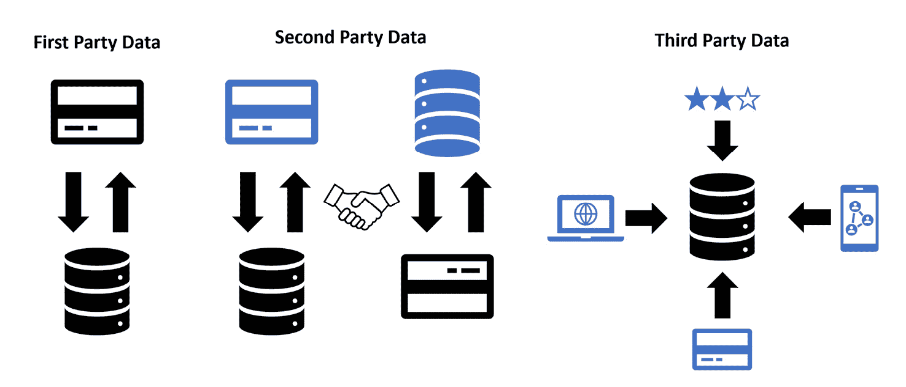

图 2.1：第一方、第二方和第三方数据如何与外部组织交互

让我们更详细地看看每一种数据。

## 第一方数据 —— 内部宝藏

首先，我们从第一方数据开始——即你的组织直接从客户、用户或其他来源收集的数据。你是否考虑过你们系统中蕴藏的丰富信息？客户互动、销售交易、网站分析，甚至员工记录，都是第一方数据的例子。这些数据非常宝贵，因为它们为组织提供了对客户、产品和服务的独特视角。

但是，为什么第一方数据如此重要呢？答案在于其准确性、相关性和控制力。由于这些数据是直接从来源处收集的，因此通常被认为是最可靠和准确的数据类型。此外，这些数据本身与您组织的特定需求和目标密切相关。最后，您的组织对第一方数据拥有完全的控制权，确保遵守隐私法规，并最大限度地减少潜在的数据泄露风险。

举个例子，考虑分析客户购买历史或网站行为所获得的洞察力。这些洞察如何帮助制定营销策略、产品开发，甚至客户支持？通过有效利用第一方数据，组织可以解锁大量的见解和机会。

## 第二方数据——通过合作架起桥梁

接下来，我们将讨论第二方数据，它本质上是另一家组织的第一方数据，这些数据为了互利而被共享或购买。虽然这最初可能看起来有些不合常理，但数据共享可以带来富有成效的合作和伙伴关系，扩展您的组织的影响力和知识储备。

那么，为什么第二方数据如此有价值呢？答案在于其独特性和合作潜力。第二方数据能够提供在公共领域中不易获得的独特见解，从而为您的组织提供竞争优势。此外，数据共享的过程可以带来合作机会，并促进战略伙伴关系的建立。

举个例子，假设一个零售公司与支付处理平台合作，目的是更好地理解客户的消费习惯和偏好。通过共享数据，两家组织都能从增强的洞察力和更明智的决策中获益。然而，确保所有参与方在共享第二方数据时都遵循严格的数据隐私和安全标准是至关重要的。

## 第三方数据——通过外部专业知识拓宽视野

最后，我们来看第三方数据，它是由专门从事数据聚合和出售业务的组织收集的。这些数据可以提供市场趋势、人口统计信息以及其他可能难以或耗时收集的宝贵信息。

为什么组织应该考虑第三方数据呢？答案在于其广泛性、专业化以及发掘新机会的潜力。第三方数据能够提供一系列广泛的数据集，包括行业特定信息、人口统计数据和地理位置数据。这些数据提供商通常在收集和分析数据方面具有专业知识，确保提供高质量的见解。

举个例子，想象一个快速消费品行业的公司希望扩展其产品种类。通过获取关于消费者偏好和市场趋势的第三方数据，公司可以做出关于产品开发和市场营销策略的明智决策。

另一个例子可能是公司希望了解如何通过社交倾听了解公司在网上如何谈论他们的品牌。这将涉及从诸如 X（前 Twitter）和 Reddit 等来源收集和分析第三方社交媒体数据。

然而，值得注意的是，第三方数据的质量可能有所不同，组织必须仔细评估他们购买的数据的可靠性和准确性。

虽然基于数据源对数据进行分类至关重要，但理解数据如何以不同方式进行结构化同样重要。在下一部分，我们将探讨结构化、非结构化和半结构化数据之间的差异。

# 结构化、非结构化和半结构化数据

在处理来自数据源的数据时，如何有效地对其进行分类？数据有三种主要分类：结构化数据、非结构化数据和半结构化数据。

作为决策者，理解结构化、非结构化和半结构化数据的细微差别及其应用，对于做出关于数据存储、管理和分析的明智决策非常有帮助。

## 结构化数据

结构化数据是以特定格式（如关系型数据库）组织的，易于搜索和分析。这类数据可以包括各种信息，例如客户姓名、地址、年龄和交易金额等等。结构化数据的优势在于它定义明确，更易于数据科学家和工程师使用，通常比其他形式的数据需要更少的预处理：

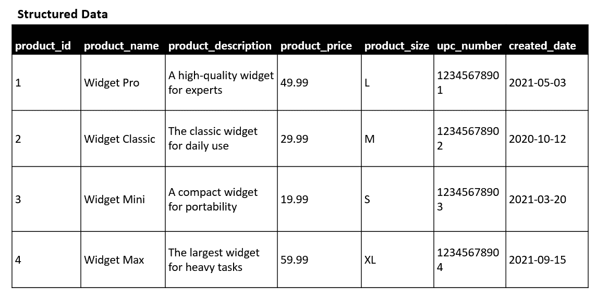

图 2.2：SQL 表中结构化数据的示例

## 非结构化数据

另一方面，非结构化数据没有预定义的格式或组织，涵盖了各种信息，包括文档、电子邮件、社交媒体帖子、图像和视频。非结构化数据可以带来价值。例如，您可以分析电子商务产品评论、电子邮件、社交媒体帖子或法律合同，以识别模式或洞察，或者分析图像或视频，用于如制造业中的质量控制等应用。

深度学习技术以及其在自然语言数据中的应用（通过**自然语言处理**（**NLP**））已经取得了巨大的进展，包括**大型语言模型**（**LLMs**）如 GPT-4。深度学习模型在图像和视频数据（**计算机视觉**）的应用也取得了很大进展。这种能力的爆炸性增长意味着，尽管由于相对于传统结构化数据的复杂性，非结构化数据有时会被大型、缓慢发展的组织忽视，但现在它对组织的价值比以往任何时候都更高。其他形式的非结构化数据，如音频数据和传感器数据，也可以通过深度学习模型进行分析。

本书稍后将更详细地介绍 NLP 和计算机视觉的一些应用：

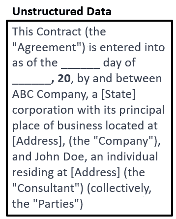

图 2.3：以法律合同形式呈现的非结构化数据示例

## 半结构化数据

半结构化数据弥合了结构化数据和非结构化数据之间的差距，提供了更灵活的数据组织方式。虽然它不像关系数据库中常见的数据模型那样遵循严格的结构，但它包含有助于组织数据的标签或标记。半结构化数据的例子包括 XML、JSON 或 HTML 文件，这些都是常见的数据标准。可以通过网络抓取从多个网站收集此类数据，例如产品价格和描述，用于竞争分析。此外，数据集成项目在将来自不同来源或系统的信息整合时，可以受益于半结构化数据的适应性。物联网设备通常生成半结构化数据，这些数据可以用于监控和优化各个领域的性能，如能源使用、制造或交通运输：

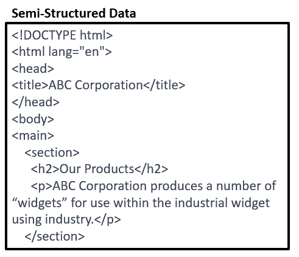

图 2.4：以 HTML 网页文件形式呈现的半结构化数据示例

为了成功应对数据世界的挑战，决策者应该考虑一些关键要点。

首先，了解您的组织所处理的数据类型，以便您可以就数据存储、管理和分析做出明智的决策。其次，利用结构化数据进行传统的业务分析，同时使用非结构化数据和半结构化数据进行更复杂的分析，如自然语言处理（NLP）或计算机视觉。最后，促进数据科学家、IT 专业人员和业务利益相关者之间的协作，确保不同类型数据在您组织的数据驱动项目中的高效理解、存储和使用。

通过理解结构化、非结构化和半结构化数据的区别和应用，您将更好地准备好引领您组织的数据科学、机器学习或人工智能项目走向成功。

现在，您已经清楚了解了不同类型和结构的数据，接下来的步骤是探索最能满足您组织需求的数据收集方法。

# 数据收集方法

想象您站在一片辽阔的田野边缘，您希望发现埋藏在地下的隐藏宝藏。您知道宝藏就在那儿，等待被发现，但如何开始寻找呢？这是组织在数据收集过程中面临的挑战。数据是数据驱动决策的命脉，收集数据的过程与最终能够提供的洞察同样重要。那么，如何收集准确、相关且有价值的数据呢？如何确保收集的数据能帮助您做出明智的决策？

作为决策者，了解收集数据的方法和最佳实践对于最大化数据科学在组织中的潜力至关重要。在本节中，我们将探讨数据收集、面临的挑战以及它所带来的机会，帮助您为数据驱动的旅程奠定坚实的基础。

如何判断哪种类型的数据适合您的组织？如何确保您收集的数据是相关的、准确的和可靠的？

解答这些问题的关键在于了解您组织的独特需求和目标。从明确您想要回答的具体问题、解决的难题或做出的决策开始。例如，零售商可能希望了解客户偏好，以优化产品供应，而医院可能希望研究患者结果，以提高护理质量。一旦您清楚了解了目标，就能确定哪些数据最能满足您的需求，并指导您的数据收集工作。

在收集数据时，选择适合您特定目标的数据收集方法是至关重要的。在市场研究中，调查、访谈、焦点小组和观察是一些最常用的方法，每种方法都有其优点和局限性。例如，调查能够从大量样本中提供丰富的定量数据，但可能缺乏通过访谈或焦点小组获得的定性数据的深度和细节。在选择数据收集方法时，您需要考虑诸如研究规模、可用资源以及所需的详细程度等因素。

您还可以考虑从组织的其他部门或外部收集数据，方法包括数据传输服务、**应用程序接口**（**APIs**）（不同应用程序之间高效互通的方式），或更间接的数据收集方法，如网页抓取。

想一想在收集数据时可能面临的挑战。样本足够大，能代表总体人口吗？数据收集过程中可能存在的偏差或错误来源是什么？如何确保您收集的数据是代表性和可靠的？数据收集的一个至关重要的方面是确保您的样本多样化且代表您研究的人口。

要注意可能导致结果偏倚的潜在抽样偏差，例如**非响应偏差**或**自我选择偏差**。

**非响应偏差**发生在某些人群不太可能回应您的调查或参与您的研究时，导致一个不具代表性的样本。**自我选择偏差**则是指个体自愿选择参与研究，这些自我选择的参与者可能在重要方面与总体人口不同。

为了减少这些偏差，考虑使用概率抽样方法，如我们在前一章中讨论的随机抽样。跟进非响应者以鼓励参与，并分析回应者和非响应者之间的差异。此外，避免仅依赖自愿参与，并积极招募来自不同背景的参与者。

一旦您使用适当的方法收集了这些数据，下一个关键步骤就是存储和处理它，以便您可以提取有意义的洞察。

# 存储和处理数据

如果您走进一家图书馆，您会发现书架上摆满了成百上千本书，每一本书都包含着宝贵的知识。现在，想象一下如果它们都随意散落在地板上，要找到您需要的确切书籍会有多困难。这就是企业在存储和处理数据时面临的挑战。组织、分类、处理和标记数据是将原始信息转化为有价值洞察力的重要步骤，这些洞察力可以推动有效的决策。

作为决策者，了解数据存储和处理的方式将使您能够在组织中充分释放数据科学的潜力。那么，您如何确保公司的数据被正确存储和处理，以促进准确且可操作的洞察力？为您的团队提供易于访问、可解释和可操作的数据的最佳实践是什么？让我们深入探讨数据存储和处理的世界，以回答这些问题。

想象一下贵公司的数据就像是一个庞大的信息海洋，持续增长和变化。为了航行在这片海洋中，你需要一个强大且可靠的存储系统，能够应对数据的体量、多样性和速度。现在有许多数据存储选项可供选择，从传统的数据库，如 SQL 和 NoSQL，到基于云的存储解决方案，如 Amazon S3 和 Google Cloud Storage。你如何为你的组织选择合适的选项？在选择数据存储系统时应考虑哪些因素？答案在于了解你的数据特性、组织的独特需求以及存储系统的能力：

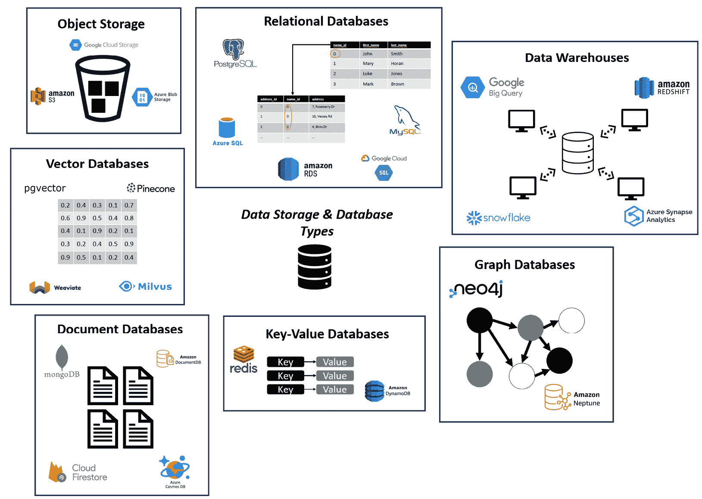

图 2.5：数据存储和数据库类型

#### 关系型数据库

关系型数据库长期以来一直是商业数据管理系统的基石，这得益于其有组织的表格、行和列结构，这些结构使得通过 SQL 进行高效查询和数据检索变得更加容易。它们是一种经过验证的解决方案，广泛的应用使得找到资源和人才变得更加容易。它们适用于管理结构化数据和复杂查询，并且遵循 ACID 原则，使得它们在确保数据完整性和一致性方面是一个稳固的选择。然而，关系型数据库在横向扩展方面可能会面临挑战，尤其是在处理大数据集时，它们并不设计用来处理非结构化或半结构化数据。一些著名的关系型数据库包括 MySQL、PostgreSQL 和 Microsoft SQL Server：

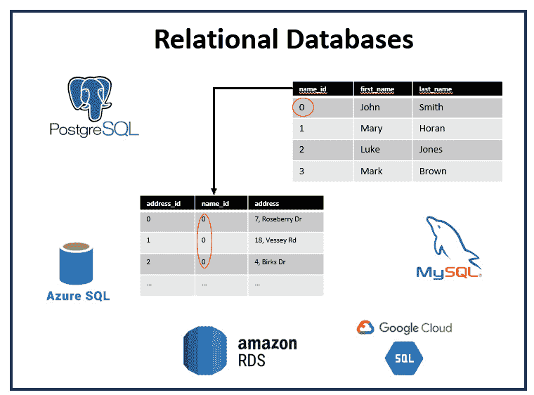

图 2.6：关系型数据库

#### 对象存储

相较之下，对象存储为管理非结构化数据提供了一种灵活的解决方案，如图像、视频和大文档。对象存储将数据作为对象而非文件或块进行处理，这使得它在扩展性和成本效益上具有优势，特别适合长期存储需求。对象存储在分布式系统和基于云的环境中表现出色，尽管它并不专为结构化数据管理或复杂查询设计，且与块存储相比，它的性能可能稍有滞后。Amazon S3、Google Cloud Storage 和 Microsoft Azure Blob Storage 是典型的对象存储解决方案：

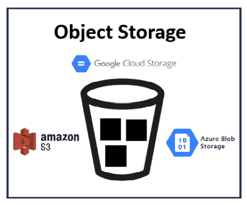

图 2.7：对象存储

#### 文档数据库

文档数据库提供了一种灵活的数据存储方法，能够处理半结构化数据，并且它们比关系型数据库提供了更灵活的架构。它们以文档的形式存储数据，支持横向扩展和分布式系统。尽管文档数据库功能强大，但它们比关系型数据库还不够成熟，并且可能不适合处理复杂的关系查询。MongoDB、Couchbase 和 Amazon DocumentDB 是一些流行的文档数据库示例：

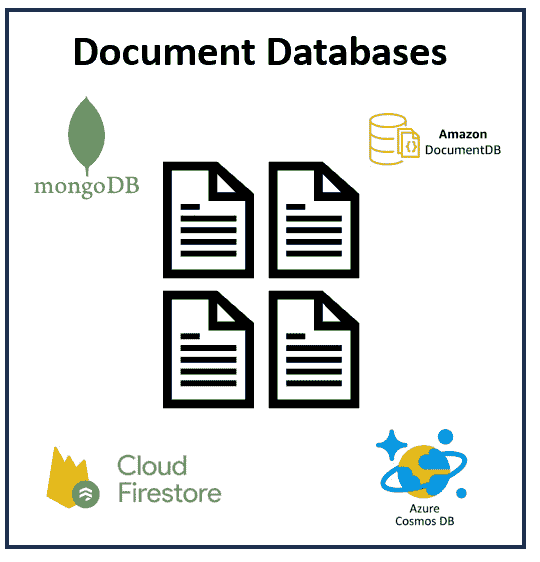

图 2.8：文档数据库

#### 图数据库

对于需要复杂数据关系的应用，图数据库在表示和查询数据实体之间的复杂连接方面表现优异。它们采用由节点、边和属性组成的图形结构，是社交网络、推荐系统和欺诈检测应用的绝佳选择。然而，图数据库相比关系型数据库还不够成熟，可能不适用于不需要复杂关系的场景。一些知名的图数据库包括 Neo4j 和 Amazon Neptune：

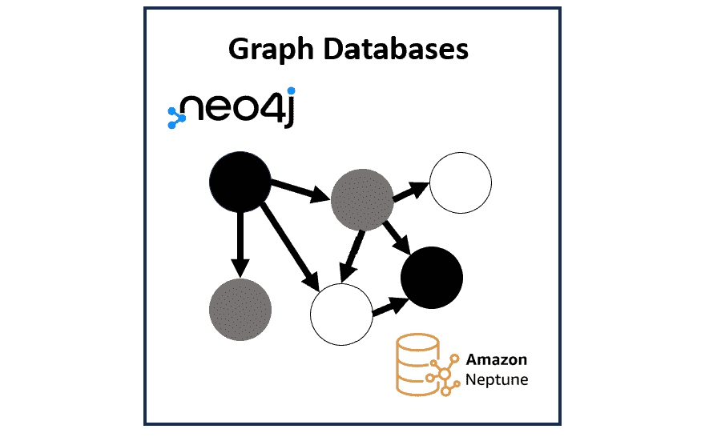

图 2.9：图数据库

#### 键值数据库

键值数据库注重简洁性和速度，将数据存储为键值对。它们最适合用于需要基于单一键进行数据检索并且不需要复杂查询的场景。凭借快速且高效的低延迟性能，它们能够轻松扩展，且非常适合用于缓存和实时应用。它们的局限性在于查询能力，并且无法处理复杂的关系或数据模型。Redis、Amazon DynamoDB 和 Riak 是键值数据库的例子：

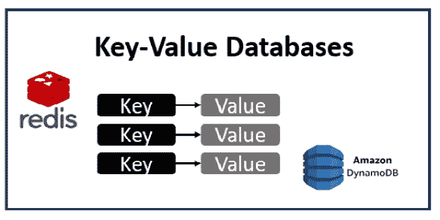

图 2.10：键值数据库

#### 数据仓库

数据仓库是集中的存储库，旨在存储和管理来自各种来源的大量结构化数据，使企业能够执行复杂查询、生成报告并提取有价值的洞察。与前面提到的优化用于实时事务处理和频繁更新的**在线事务处理**（**OLTP**）关系型数据库不同，数据仓库是为读密集型操作和复杂的分析工作负载而构建的。它们采用写时模式（schema-on-write），即数据在加载之前进行转换和结构化，以确保数据的一致性和质量。数据仓库有助于支持数据驱动的决策制定，并设计用于处理大规模数据处理和分析，使其成为现代商业智能和数据科学生态系统中的重要组成部分。一些知名的数据仓库包括 Google BigQuery、Amazon Redshift、Snowflake 和 Azure Synapse Analytics：

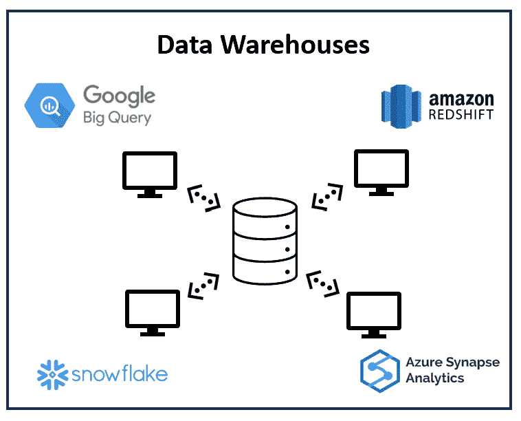

图 2.11：数据仓库

#### 向量数据库

向量数据库是一种新型的数据库，将数据存储为高维向量，这些向量是数据点在多维空间中的数值表示。与传统的处理结构化数据（如表格和行）的数据库不同，向量数据库擅长管理非结构化数据，如文本、图像和音频。它们支持快速准确的相似性搜索，非常适合推动高级应用，如推荐系统、语义搜索和问答系统。当与大型语言模型（LLM）通过**检索增强生成**（**RAG**）技术结合时，向量数据库通过帮助 LLM 快速访问最语义相似的信息，提供高度相关和上下文丰富的结果。这一强大的组合正在彻底改变许多自然语言处理和信息检索任务。向量数据库领域的关键玩家包括 pgvector、Pinecone、Milvus 和 Weaviate：

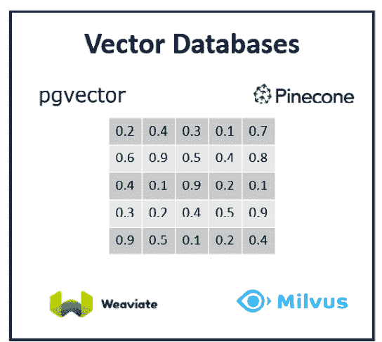

图 2.12: 向量数据库

理解各种数据库类型、它们的优缺点以及适用场景，将使决策者能够为组织的独特需求选择最合适的数据库技术。

# 云、局域网和混合解决方案——导航数据存储和分析的格局

作为高层管理人员和决策者，了解数据存储、分析和机器学习的各种选项对贵组织的数据驱动型战略的成功至关重要。在本章中，我们将探讨云、局域网（on-prem）和混合方式的优缺点，深入研究它们在业务决策中的独特应用和影响。

## 云计算——云端的可扩展服务

想象一下，无需投资昂贵的基础设施或管理复杂的硬件，就能访问几乎无限的计算资源、可扩展的存储和先进的分析能力。这就是云计算的承诺，一个使组织能够通过互联网上托管的远程服务器存储、处理和分析数据的范式。云计算彻底改变了企业对数据科学、机器学习和人工智能的应用方式。

那么，为什么云计算对组织如此具有吸引力呢？答案在于其灵活性、成本效益和易用性。云平台提供根据需要扩展资源的能力，确保组织仅为实际使用的资源付费。此外，云服务提供商负责维护、保护和更新其基础设施，从而节省了 IT 人员的宝贵时间。更重要的是，云计算使无缝协作成为可能，团队几乎可以在任何地方访问数据和分析工具。

例如，考虑一家希望分析大量客户数据以改进其营销策略的公司。通过利用基于云的机器学习工具和存储，该公司可以快速且高效地处理和分析数据，从中获得有价值的洞见，而无需承受过高的成本或让其本地基础设施不堪重负。云服务提供商通常提供不同的存储和计算层级，并具备按需扩展和缩减服务的能力，允许客户仅使用所需资源，从而节省成本。许多云服务提供商还提供现成的解决方案，处理复杂的人工智能任务，例如语音转文本（如 Amazon Transcribe）或翻译（如 Amazon Translate），这比在内部自行构建解决方案节省了客户的时间。

## 本地解决方案 —— 在自己的墙内保持控制

尽管云计算有诸多优势，一些组织仍然倾向于将他们的数据和分析基础设施保持在本地。本地解决方案包括将数据存储、处理和分析工具安置在组织的数据中心或设施中。

为什么一个组织会选择本地解决方案而非云计算？答案在于控制、安全性和定制化。本地解决方案允许组织完全控制其基础设施、数据和应用程序。这对于那些有严格安全或合规要求的公司，或处理敏感数据的公司尤为重要。此外，本地解决方案提供了更大的定制化潜力，使组织能够根据其特定需求量身定制基础设施。

想象一家金融机构，处理敏感的客户数据并必须遵守严格的规定。在这种情况下，本地解决方案可能更为合适，因为它允许组织对其数据保持控制，并确保符合行业标准。

## 混合解决方案 —— 兼具两全其美？

对于一些组织来说，云计算和本地解决方案之间的选择并非非黑即白。相反，他们选择采用混合方式，结合了云计算和本地基础设施的元素。混合解决方案使组织能够利用两种模式的优势，提供灵活性、可扩展性和控制力。

为什么一个组织应该考虑混合方案？答案在于它的多功能性和适应性。混合解决方案使组织能够在本地控制敏感数据，同时也能利用云资源的可扩展性和成本效益，用于处理不太敏感或资源密集的任务。

想象一个医疗保健组织，必须安全地存储病人记录，同时处理大量的医学研究数据。混合方案使组织能够将敏感的病人数据存储在本地，同时利用基于云的资源进行计算密集型的研究任务，从而有效平衡安全性和性能。

通过了解各种类型的数据库、它们的应用，以及云端、本地和混合解决方案的优缺点，你和你的团队可以做出明智的决策，选择最适合你们业务用例的数据存储和处理方式。

在正确的基础设施上收集和存储数据并不是故事的结局。数据只有在被处理、分析、建模并用于业务目的后，才变得有用。在接下来的章节中，我们将讨论数据处理。稍后在本书中，我们将深入探讨数据分析和机器学习，以便你能从数据中获取更多价值。

# 数据处理

一旦数据被安全存储，下一步就是处理数据以提取有意义的见解。数据处理包括清理、转换和分析数据，使其适合数据科学和决策制定。那么，如何确保数据的处理既准确又高效呢？可以使用哪些工具和技术将原始数据转化为有价值的信息？

数据处理通常涉及三个主要阶段：数据准备、数据转换和数据分析。在数据准备阶段，你的数据会被清理，任何不一致、错误或缺失的值都会被处理。这是一个重要步骤，确保你后续的分析基于准确和可靠的数据。现有许多专有和开源解决方案可以帮助你和团队完成这一过程。通常，邀请业务领域的专家也很有帮助，他们可以识别并协助解决数据中的任何问题。

接下来，数据转换涉及将数据转换为适合进一步分析的格式。这可能包括汇总数据、归一化变量或编码分类变量等任务。考虑一个零售公司，它希望分析销售数据以识别趋势并做出明智的决策。原始销售数据可能包括交易层级的信息，如客户姓名、产品 ID 和购买金额。为了使这些数据有意义，需要将其转换为一种易于解读和分析的格式，比如按产品类别汇总销售数据或计算每个客户的平均购买金额。

最后，数据分析和建模阶段涉及使用统计学和机器学习技术来发现数据中的模式、关系和趋势。这将是后续章节的主题。

# 总结

在数据收集、存储、处理、分析和机器学习的领域中导航并非易事。然而，理解不同的数据来源和类别、各种数据库，以及云端、本地和混合解决方案的优缺点，将使你能够做出明智的决策，更好地理解你所在组织的数据环境。

请考虑以下关键问题：

+   评估数据时需要考虑的关键标准是什么？

+   第一方、第二方和第三方数据有什么区别？

+   结构化数据、非结构化数据和半结构化数据有什么区别？

+   数据收集的方法有哪些？

+   存储和处理数据的方法有哪些？

+   如何在数据解决方案的领域中导航，并了解每种方法的优缺点？

这些知识将帮助你和你的团队就数据收集和技术做出正确决策，以最有利的方式服务于你的业务用例，并从数据中获得实际价值。

既然你已经对数据环境有了扎实的理解，下一步是通过**探索性数据分析**（**EDA**）来探索和理解你所收集的数据。EDA 使你能够总结数据集的主要特征，通常使用可视化方法，并在进行更高级的分析或建模之前，深入理解数据中的模式、趋势和潜在问题。

EDA 将帮助你发现有价值的见解，识别潜在的偏差或异常，并有效地将你的发现传达给利益相关者。这些基础知识将使你能够自信地做出数据驱动的决策，并为成功的机器学习和统计建模项目奠定基础。

让我们进入下一章，看看 EDA 如何帮助你解锁数据更多的潜力。
