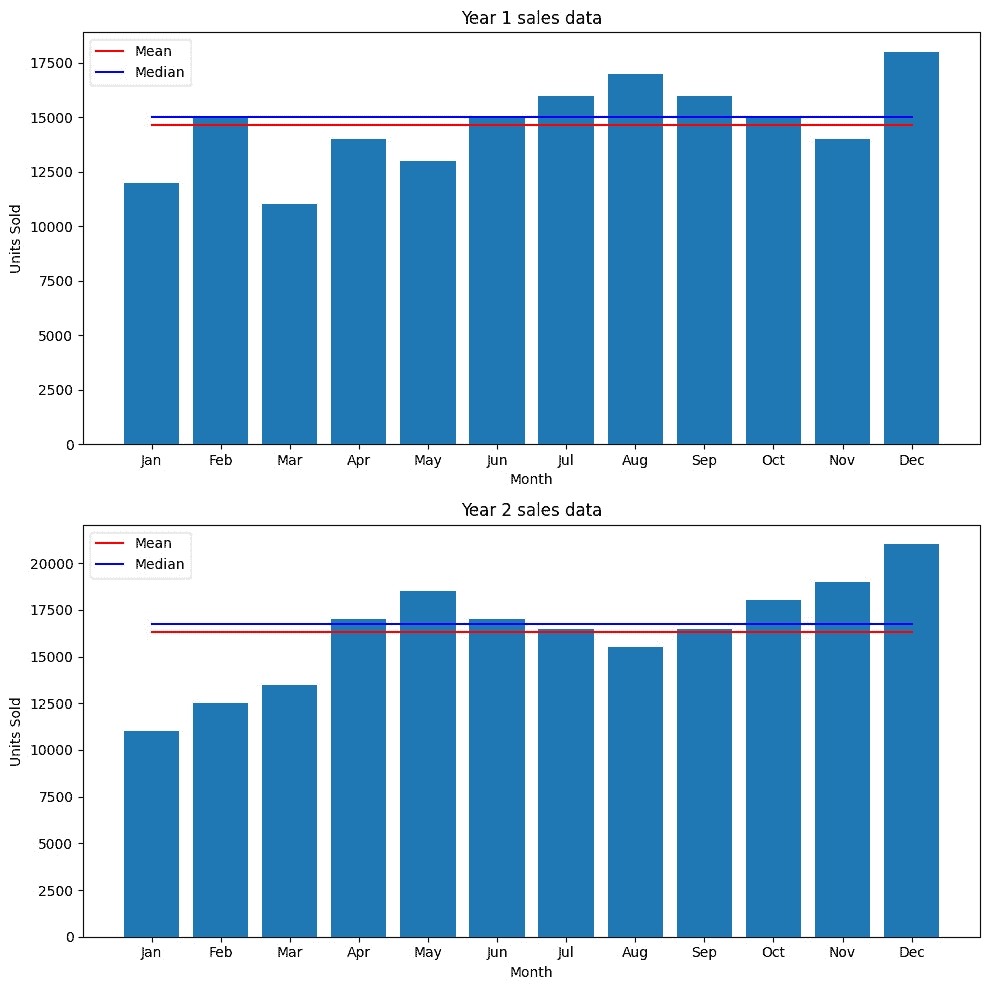
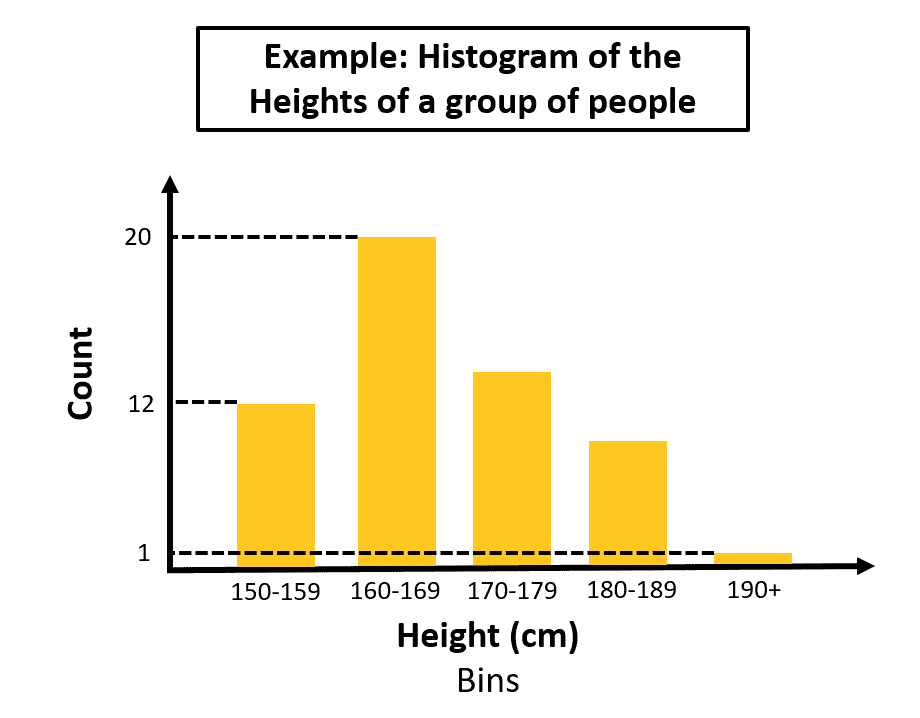
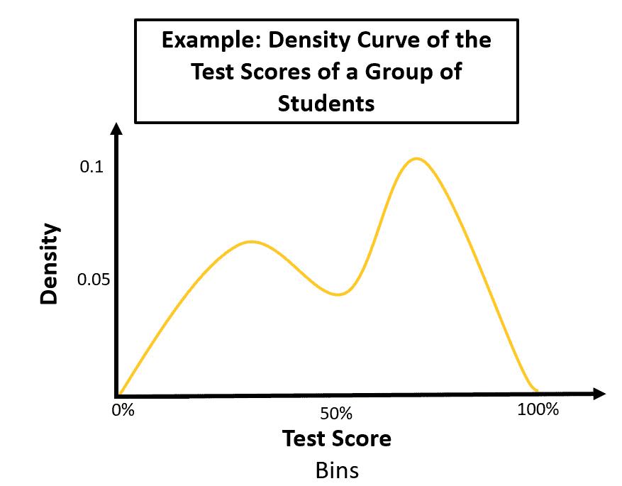
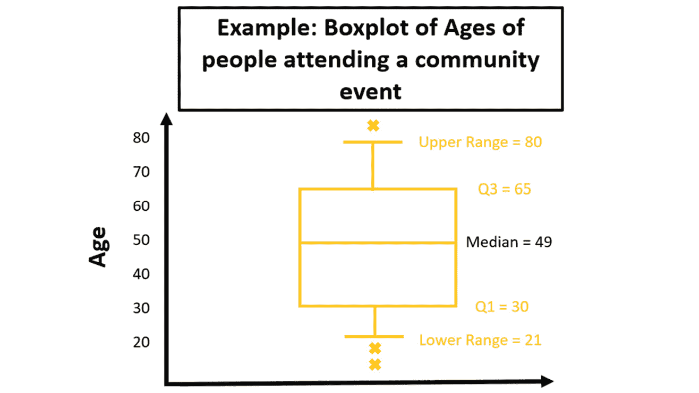
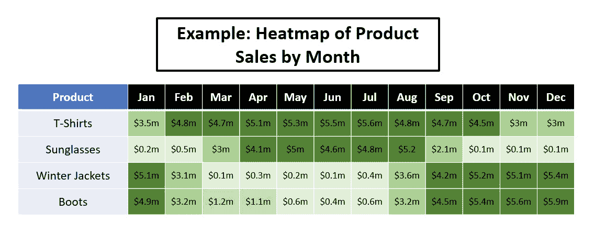
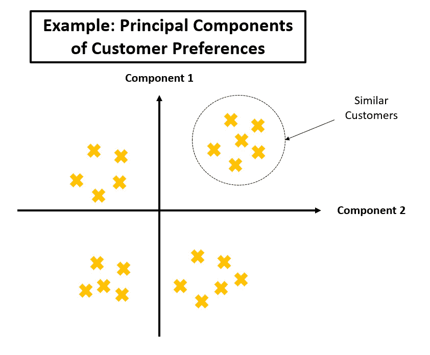
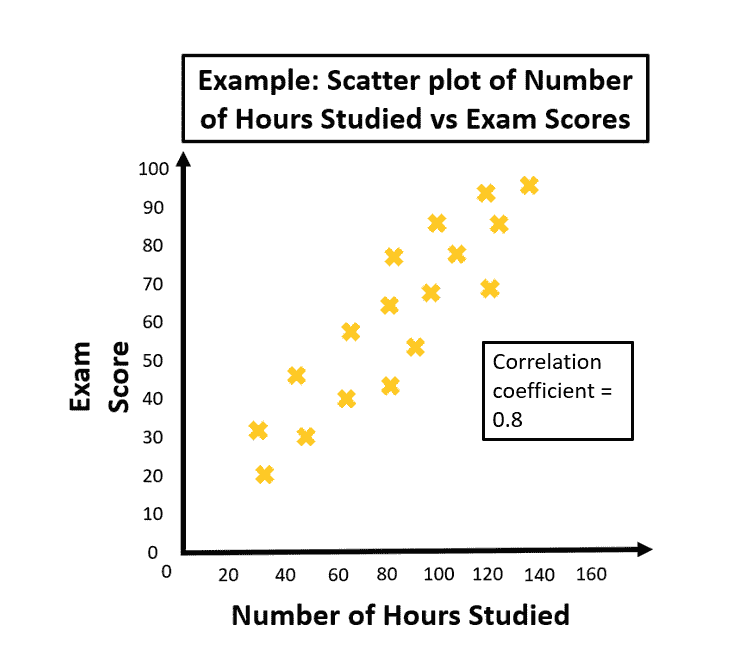
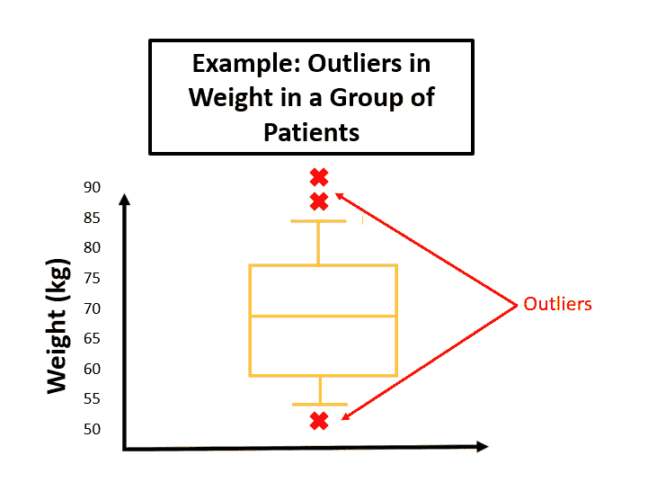

# 第三章：探索性数据分析

在上一章中，我们介绍了用于表征和收集数据的方法。那么，现在你已经收集了一些数据，接下来该做什么呢？嗯，这就是本章的主题。在本章中，我们将学习**探索性数据分析**（**EDA**）的过程。

EDA 是一种分析数据集的方法，可以总结数据集的主要特征，通常使用可视化方法。它用于理解数据，获取数据的背景信息，发展更多的假设，从而构建更好的模型和业务成果。

本章我们将更深入地进行实践，提供一些你可以尝试的代码示例。

如果你更愿意专注于阅读内容，可以跳过代码练习。这些练习是完全可选的，它们的目的是帮助强化我们在本书中将要学习的一些内容。

如果你从未使用过 Python，也不用担心；每个练习都会一步一步地讲解，并假设你没有任何 Python 使用经验。

本章涵盖以下主题：

+   开始使用 Google Colab

+   了解你拥有的数据

+   EDA 技巧和工具

让我们通过学习如何设置代码环境来开始，这样你就可以按照本章的练习进行操作。

# 开始使用 Google Colab

为了帮助你更好地理解本章将要涵盖的各种数据科学技巧，章节中将有一些可以用 Python 完成的实践练习。

为了设置一切，我们将使用**Google Colab**，因为如果你之前没有使用过 Python，它是一个很容易入门的地方。

## 什么是 Google Colab？

Google Colaboratory，通常称为 Google Colab，是一项免费的云服务，提供一个可以运行 Python 代码的环境。它就像在浏览器中拥有一台强大的计算机，特别适用于数据科学任务，包括但不限于统计学、机器学习和**自然语言处理**（**NLP**）。你无需安装任何东西，只要有网络连接的设备就可以使用。

## 设置 Google Colab 的逐步指南

按照以下步骤轻松设置 Colab：

1.  首先，你需要一个 Google 账户。如果你还没有，可以在这里创建：[`accounts.google.com/signup`](https://accounts.google.com/signup)。

1.  现在，打开你喜欢的网页浏览器，访问 Google Colab 网站：[`colab.research.google.com/`](https://colab.research.google.com/)。

1.  点击右上角的**登录**按钮，并使用你的 Google 账户登录。

1.  登录后，你将看到一个顶部有菜单的页面。点击**文件**，然后从下拉菜单中选择**新建笔记本**。这将打开一个新标签页，其中包含你的新笔记本。

1.  默认情况下，你的笔记本将被命名为`Untitled0.ipynb`。你可以通过点击页面顶部的名称来更改它。会弹出一个对话框，你可以在其中输入你想要的名称。一个好的建议是按照章节的编号和名称来命名每个笔记本（例如，`Chapter 3` `– Exploratory` `Data Analysis.ipynb`）。

1.  在笔记本中，你会看到一个带有播放按钮的单元格（它看起来像一个右箭头）。点击该单元格以激活它，输入`print("Hello, world!")`，然后点击播放按钮运行代码。

1.  要保存你的笔记本，你可以点击菜单中的**文件**并选择**保存**，或者直接使用*Ctrl* + *S*（Windows/Linux）或*Cmd* + *S*（Mac）快捷键。

就这样！你现在已经准备好开始使用 Python 在 Google Colab 上进行数据科学的旅程了。在阅读本书的过程中，你会发现一些已为你准备好的 Google Colab 笔记本，供你在考虑数据科学和机器学习的实际案例时练习技能。祝编码愉快！

现在，让我们回到本章的主题：**EDA**。

# 理解你所拥有的数据

一旦你完成了数据收集和存储的过程，你可能会想直接跳入训练机器学习模型或构建仪表板，以便向你的客户或利益相关者展示。

然而，在模型训练或展示结果之前，一个重要的阶段是探索和理解你所拥有的数据，以及数据的主要特征、模式和趋势，并识别潜在的异常值或离群点。

EDA 是数据分析过程中的一个基本步骤，涉及系统地检查数据集，以了解它们的主要特征，识别模式和趋势，并发现潜在的异常值或离群点。EDA 通常在更正式的统计或机器学习建模之前进行，它的主要目标是提供有助于进一步分析和模型开发的见解和背景。

EDA 的重要性不可过分强调。它不仅有助于决策者更好地理解他们的数据，还帮助识别数据中的潜在问题或偏差，这些问题或偏差可能会影响后续分析的准确性和可靠性。此外，EDA 还可以帮助开发出更有意义的数据可视化和表示方式，从而能够轻松地与利益相关者和团队成员进行沟通。

既然我们已经理解了 EDA 的重要性，让我们来探索一下可以用来执行 EDA 的各种工具和技术。

# EDA 技术和工具

数据科学家、分析师和决策者有许多 EDA 技术和工具可供使用。

以下小节提到了最常用的一些 EDA 方法。

## 描述性统计

最简单的探索性数据分析包括计算我们在前一章节中介绍的汇总统计，如均值、中位数、众数、标准差和范围，以提供对数据中心趋势和分散的初步理解。

### 代码示例

这里，我们将展示一个示例，展示如何计算一个年度月销售数据集的均值、中位数、众数、标准差和范围。

对于每个代码片段，你可以将其复制粘贴到 Google Colab 中，然后按下*Shift* + *Enter*来运行它们。

打开你的代码编辑器，并运行以下代码来计算均值：

```py
import pandas as pd # Define a toy dataset representing monthly sales figures for a year
sales_data_year1 = pd.Series([12000, 15000, 11000, 14000, 13000,     15000, 16000, 17000, 16000, 15000, 14000, 18000])
# Calculate mean (average)
mean_sales_year1 = sales_data_year1.mean()
print(f"The average monthly sales across the year is     {round(mean_sales_year1)} units.")
```

预期输出是`"年度平均月销量为` `14667 units."`.

现在，计算中位数（中间值）：

```py
median_sales_year1 = sales_data_year1.median()
print(f"The median monthly sales, a typical sales month,     is {round(median_sales_year1)} units.")
```

预期输出是`"中位数月销量，典型的销售月份，为` `15000 units."`.

接下来，计算标准差（衡量变化量的指标）：

```py
std_dev_sales_year1 = sales_data_year1.std()
print(f"The standard deviation,     showing the typical variation from the mean sales,     is {round(std_dev_sales_year1)} units.")
```

预期输出是`"标准差，显示典型销售量与平均销售量的变化，为` `2015 units."`.

现在，计算众数（最常见的值）：

```py
# mode() returns a Series; we want the first value
mode_sales_year1 = sales_data_year1.mode()[0]
print(f"The most common monthly sales volume is {mode_sales_year1}     units.")
```

预期输出是`"最常见的月销售量为` `15000 units."`.

最后，计算范围（最大值与最小值之间的差）：

```py
range_sales_year1 = sales_data_year1.max() - sales_data_year1.min()
print(f"The range of monthly sales volumes is {range_sales_1} units.")
```

预期输出是`"月销售量的范围为` `7000 units."`.

现在，让我们计算另一年的相同统计数据：

```py
# A dataset representing the following year's sales
sales_data_year2 = pd.Series([11000, 12500, 13500, 17000, 18500,     17000, 16500, 15500, 16500, 18000, 19000, 21000])
[YOUR CODE HERE TO CALCULATE THE SUMMARY STATISTICS]
```

对于两年的月销售数据，你能说些什么？

在继续之前，思考一下从这些汇总统计中可以得出什么结论。

你观察到这里提到的任何差异了吗？

+   平均销售量似乎从第一年到第二年有所增加，对企业来说是个好消息。

+   中位数销量也增加了，表明销售总体上有所增长，而不仅仅是受到几个高销售月份的影响。

+   第二年的标准差更高，表明该年销售更为变化或分散。

+   从第一年到第二年，最常见的月销售量发生了变化，显示销售绩效的变化。

+   销售量的范围也增加了，显示第二年销售量的分布范围更广。

在分析数据时，另一个有用的描述统计量是缺失或空数据的比例。例如，如果你有一个客户关系管理（**CRM**）系统的数据集，你可能想知道公司名称或职位字段为空的客户比例。这可以帮助你了解数据中的空缺部分，可以通过更好的数据收集或标注填补，或在训练机器学习或统计模型时需谨慎对待这些特征。

## 数据可视化

除了描述性统计，探索数据的一种有用方式是通过可视化来进行。利用直方图、箱线图、散点图和热图等图形表示可以帮助识别数据中的模式、趋势和异常值。

这些可视化图表可以使用专门的仪表盘软件，如微软的 PowerBI 和 Tableau，或 Python 数据可视化库，如`matplotlib`和`plotly`，轻松创建。

### 代码示例

通过我们前面计算的汇总统计数据，我们还可以通过可视化销售数据来获得更深刻的见解。Python 中的`matplotlib`库为我们提供了一个出色的平台，可以创建不同类型的数据可视化图表。在这里，我们将使用条形图来表示每个月的销售数据，并使用折线图来标示均值和中位数销售额。

打开你的代码编辑器并运行以下代码。此代码基于之前练习中提供的代码，因此在运行此代码之前，请确保先完成那个练习，并将其放在同一个笔记本中运行：

```py
import matplotlib.pyplot as plt
# Define the months
months = range(1, 13)
month_labels = ["Jan", "Feb", "Mar", "Apr", "May", "Jun", "Jul",     "Aug", "Sep", "Oct", "Nov", "Dec"]
# Define a figure to hold the subplots
fig, axs = plt.subplots(2, figsize=(10, 10))
# Add data for Year 1
axs[0].bar(months, sales_data_year1)
axs[0].plot([1, 12], [mean_sales_year1, mean_sales_year1],     color='red', label='Mean')  # Mean line
axs[0].plot([1, 12], [median_sales_year1, median_sales_year1],     color='blue', label='Median')  # Median line
axs[0].set_xticks(months)  # Add ticks for every month
axs[0].set_xticklabels(month_labels)  # Label the ticks
axs[0].set_xlabel('Month')  # Add x-axis title
axs[0].set_ylabel('Units Sold')  # Add y-axis title
axs[0].legend()
axs[0].set_title("Year 1 sales data")
# Add data for Year 2
axs[1].bar(months, sales_data_year2)
axs[1].plot([1, 12], [mean_sales_year2, mean_sales_year2],    color='red', label='Mean')  # Mean line
axs[1].plot([1, 12], [median_sales_year2, median_sales_year2],     color='blue', label='Median')  # Median line
axs[1].set_xticks(months)  # Add ticks for every month
axs[1].set_xticklabels(month_labels)  # Label the ticks
axs[1].set_xlabel('Month')  # Add x-axis title
axs[1].set_ylabel('Units Sold')  # Add y-axis title
axs[1].legend()
axs[1].set_title("Year 2 sales data")
# Show the plot
plt.tight_layout()
plt.show()
```

图表应如下所示：



图 3.1：第一年和第二年每月销售单位数

通过查看条形图，我们可以观察每个月的销售数据。红色线条代表均值，而蓝色线条代表中位数。正如你所看到的，第二年的销售数据更高，这与前一节的计算结果一致。

通过可视化，观察趋势、波动以及数据集中的其他特征变得更加容易，这些特征可能仅通过原始数据难以察觉。例如，在第二年，你可能会注意到销售数据存在某种波动，这导致了更高的标准差，或者你可能观察到均值和中位数之间的差距更大。

始终记住，数据可视化是数据探索过程中的关键步骤。它可以帮助你在进行更复杂的分析或建模技术之前，更好地理解数据。

## 直方图

直方图是一种简单易懂的可视化工具，帮助我们了解数据的分布情况和组织方式。可以将其视为一种条形图，其中每个条形代表一个数据范围或分组，称为“箱”。每个条形的高度显示该范围内有多少数据点。条形越高，表示该范围内的数据点越多。直方图可以帮助我们迅速理解数据的整体形态和分布，便于识别模式、趋势或发现异常值。

例如，假设我们有一组人的身高数据，单位为英寸。我们可以通过将身高分为若干组（如 150-159 厘米、160-169 厘米、170-179 厘米等）来创建直方图，以可视化这些信息。然后，我们可以统计每个身高范围内的人数，并用柱状图表示这些数据。例如，如果 150-159 厘米范围内有 12 人，那么该范围的柱状图就会有一定的高度；如果 160-169 厘米范围内有 20 人，那么该范围的柱状图会更高。

通过观察直方图，我们可以轻松看到大多数人的身高集中在哪些范围内（例如，如果许多人身高在 160-169 厘米之间，那个范围内的柱形条会更高），以及是否存在任何异常值（例如，如果只有一个人身高超过 190 厘米，那么该范围的柱形条会非常短）。这种可视化表示让即使是非技术人员也能快速掌握数据的分布和模式，使直方图成为理解和传达数据洞察的重要工具：



图 3.2：展示一组人群在不同身高范围内的计数的直方图

## 密度曲线

密度曲线是一条平滑、连续的线，代表数据分布的方式，易于非技术读者理解。它清晰地展示了数据的分布情况，并帮助我们可视化数据的整体形状和模式。曲线的绘制方式确保其下方的总面积为 1，这意味着它显示的是不同范围内数据点的相对频率或比例，而不是实际的计数。曲线在任何点的高度表示该值的密度，这意味着曲线较高的部分代表数据点更为集中的区域。

例如，假设我们有一组学生的考试成绩数据。

我们可以使用密度曲线代替直方图，后者通过条形图表示每个分数范围内学生的数量。密度曲线可以以更平滑、更具视觉吸引力的方式展示相同的信息。为了绘制这条曲线，我们需要估算考试成绩的频率分布，然后绘制一条平滑的线，紧密跟随数据的形状。曲线的峰值和谷值将分别指示成绩密集或稀疏的区域。

通过观察密度曲线，我们可以轻松看到考试成绩的总体分布，例如，大多数学生的成绩是否集中在某个特定范围内（该范围由曲线的峰值表示），或者是否存在一些异常模式，如多个峰值或分数分布较广。曲线还帮助我们识别数据的集中趋势（例如，众数，即曲线最高点的位置）和数据的离散程度（例如，较宽的曲线表示更大的分数范围）。这种平滑且直观的视觉表示使非技术读者也能轻松理解和解读数据的潜在模式和特征：



图 3.3：展示一组学生的考试成绩分布的密度曲线

## 箱型图

箱线图，又称为箱须图，是一种直观且易于理解的可视化工具，用于显示数据集分布的关键信息。它由一个矩形箱体和两条（须）线组成，代表数据的不同方面。箱线图特别适用于识别数据的中心趋势、分散度以及潜在的异常值，因此对非技术读者来说是优秀的工具。

要理解箱线图，让我们通过一个例子来解析其组成部分。想象我们有参加社区活动的人员年龄数据。我们可以使用箱线图清晰简洁地可视化年龄分布。图中的箱体代表数据的中间 50%，也称为**四分位距**（**IQR**）。箱体的下边缘称为**第一四分位数**（**Q1**），标志着 25%的参与者年龄更小；而上边缘，**第三四分位数**（**Q3**），标志着 75%的参与者年龄更小。箱体内部的线是中位数，代表数据集的确切中间年龄，其中 50%的参与者年龄更小，50%年龄更大。

从箱体伸出的须线帮助我们理解剩余数据的分布情况。通常来说，须线延伸至 1.5 倍 IQR 范围内的最小值和最大值。换句话说，它们显示了“典型”年龄范围，排除任何潜在的异常值。超出须线的任何数据点被视为异常值，通常作为单独的点或圆圈绘制。这些可以在图表中看作“X”。

通过观察箱线图，非技术读者可以快速掌握关于数据的重要信息，如中位数年龄（箱体内部的线）、年龄分布（箱体和须线的大小）以及与其他数据显著不同的异常年龄（异常值）。这种简单而强大的可视化工具提供了数据特征的清晰快照，对于理解和传达数据见解至关重要：



图 3.4：箱线图（箱须图），显示参加活动的人年龄的中位数、Q1、Q3 和较小及较大范围

## 热度图

热力图是一种直观易懂的数据表示方式，利用颜色显示二维网格中变量的值或频率。网格中的每个单元格对应两个变量的特定组合，单元格的颜色表示与该组合相关的值或频率。颜色范围通常从表示低值的某种颜色到表示高值的另一种颜色，中间有一个渐变。热力图特别适用于检查大数据集中的模式、趋势或变量之间的关系，因此对于非技术读者来说，是一个非常有价值的工具。

为了说明热力图的工作原理，我们来看一个例子。假设我们有一家商店不同产品在各个月份的销售数据。我们可以创建一个热力图来清晰简洁地可视化这些信息。在热力图中，一个轴（即行）表示产品，另一个轴（即列）表示月份。网格中的每个单元格对应特定月份某个产品的销售量。单元格的颜色表示销售额，颜色范围从浅绿色表示低销售额到深绿色表示高销售额。

通过查看热力图，非技术读者可以快速识别数据中的模式和趋势，例如哪些产品在某些月份销售较高，或者是否存在销售的季节性波动。颜色编码的单元格使得用户能够一目了然地发现高值和低值，帮助用户聚焦于感兴趣或需要关注的区域。例如，某个特定产品的一排深绿色单元格可能表示销售始终较高，而一列浅绿色单元格则可能表明某个特定月份的销售普遍较低。

总结来说，热力图提供了一种视觉上吸引人且易于解读的方式来展示复杂的数据，使非技术读者能够快速识别模式、趋势和变量之间的关系。这种强大的可视化技术简化了理解和传达数据洞察的过程，使热力图成为数据分析工具包中不可或缺的工具：



图 3.5：显示某示例时尚店不同产品类别每月销售情况的热力图

## 降维

降维是一种简化复杂数据的技术，它通过减少变量或维度的数量，同时尽可能保留原始信息。这一过程使非技术性读者更容易理解和分析数据，同时也提高了各种机器学习算法的性能。降维的思想是找到数据中最重要的特征或模式，并通过更少的维度来表示它们，有效地压缩数据的同时保留其本质结构。

一种流行的降维方法是**主成分分析**（**PCA**）。

PCA 是一种数学技术，它将原始数据转换为一组新的变量，称为主成分。这些主成分是以捕捉数据中最重要的模式和变化为标准来选择的。通过选择少数几个主成分，我们可以创建一个简化的数据表示，同时保留大部分关键信息。

为了说明这个概念，假设你有一个包含不同汽车信息的数据集，包括价格、燃油效率、马力和重量。这些属性中的每一个都代表数据中的一个维度。然而，这些维度中的一些可能是相关的或冗余的。例如，汽车的重量和马力通常是相关的——较重的汽车往往有更大的马力。

PCA 可以帮助识别这些关系，并将相关的维度合并为一个主成分。在这种情况下，PCA 可能会创建一个名为**性能**的新成分，结合马力和重量的相关信息。通过关注这个单一成分，我们可以简化数据，同时仍能捕捉到汽车性能的关键信息。

PCA 是一种复杂的数学技术，但作为决策者，你不需要理解所有技术细节。关键的 takeaway 是，PCA 通过识别最重要的模式并用更少的维度表示它们，帮助简化数据，使数据更容易理解和分析。

总之，像 PCA 这样的降维技术是简化复杂数据并使其更易于非技术性读者访问的宝贵工具。通过减少维度的数量，同时保留数据的本质结构，PCA 促进了数据洞察的更有效沟通，并提高了机器学习算法的性能。



图 3.6：基于客户偏好数据计算的主成分示意图

## 相关性分析

通过计算变量之间的相关系数，决策者可以识别数据特征之间的关系和依赖性，从而帮助做出进一步的分析和建模决策。

相关性分析是一种统计技术，用于评估两个变量之间关系的强度和方向。简而言之，它帮助我们了解一个变量的变化是否与另一个变量的变化相关，如果相关，那么它们之间的关系有多强。相关性分析对非技术性读者非常有价值，因为它提供了一种清晰易懂的衡量变量之间联系的方法。这可以用于识别模式、做出预测或为决策提供依据。

相关性分析的结果通常以相关系数的形式表示，这是一个介于-1 和 1 之间的数字。正相关系数（介于 0 和 1 之间）表示当一个变量增加时，另一个变量也趋向于增加。负相关系数（介于-1 和 0 之间）表示当一个变量增加时，另一个变量趋向于减少。相关系数越接近 1 或-1，变量之间的关系越强。相关系数接近 0 则表明变量之间几乎没有关系或没有关系。

例如，假设我们想要理解学生学习时间与考试成绩之间的关系。我们可以使用相关性分析来计算学习时间变量和考试成绩变量之间的相关系数。如果我们找到一个 0.8 的正相关系数，这表明学习时间和考试成绩之间存在强正相关关系，意味着学习时间更长的学生往往取得更高的成绩。相反，如果相关系数是-0.3，这表明存在弱负相关关系，意味着学习时间更多的学生可能成绩稍微较低：



图 3.7：一张图表，展示了学生群体中考试成绩与学习时间之间的相关性

需要注意的是，相关性并不意味着因果关系。两个变量之间的强相关性并不意味着一个变量导致了另一个变量的变化，它只是表明这两个变量之间存在某种关系。其他因素或变量可能是造成这种关系的原因。

总之，相关性分析是非技术读者评估变量之间关系的有力工具，提供了关联强度和方向的直接度量。通过这些信息，可以识别模式，指导决策，并为进一步研究生成假设，使相关性分析成为理解和传达数据洞察的重要方法。

## 异常值检测

识别和处理数据中的异常值可以帮助提高后续分析的准确性和可靠性。可以使用 Z 分数法或 IQR 方法等技术来检测和处理异常值。

根据数据的性质和分析的具体目标，选择最合适的探索性数据分析（EDA）技术和工具至关重要。

异常值检测是识别数据集中与大多数数据明显不同的数据点的过程。这些不寻常的数据点，称为异常值，可能是错误、异常或特殊情况的结果，需要进一步调查。识别异常值非常重要，因为它们可能对数据的分析和解读产生重大影响，可能导致结果偏差或得出错误结论。异常值检测对非技术读者尤其有价值，因为它有助于确保数据的准确性和可靠性，从而带来更好的洞察力和决策。

有几种方法可以用来检测异常值，包括 Z 分数法、IQR 方法和其他技术。

### Z 分数法

Z 分数衡量数据点与数据集的均值（平均值）之间的距离，以标准差为单位（标准差是衡量数据分布范围的指标）。高 Z 分数表示数据点远离均值，可能成为异常值。通常会选择一个 Z 分数阈值（例如，2 或 3），Z 分数超过此阈值的数据点被视为异常值。当数据呈正态分布（即符合钟形曲线）时，这种方法最为有效。

举个例子，假设我们有一组人的身高数据。如果我们发现某人的 Z 分数为 3.5，这意味着他们的身高与平均身高相差 3.5 个标准差，表明这个人非常高，可能被认为是异常值。

### IQR 方法

IQR 方法是另一种通过观察数据的分布来检测异常值的方法。IQR 是数据中 Q1 和 Q3 值之间的差异，表示数据中间 50% 的范围。通常，异常值被定义为低于 Q1 - 1.5IQR 或高于 Q3 + 1.5IQR 的数据点。这种方法比 Z 分数法更稳健，因为它对极端值不那么敏感，且适用于非正态分布的数据。

继续以身高为例，如果我们计算身高的四分位距（IQR），并发现有几个人的身高低于 Q1 - 1.5IQR 或高于 Q3 + 1.5IQR，我们会认为他们是异常值。

### 其他技巧

还有许多其他的异常值检测方法，包括机器学习算法，如聚类或分类模型，以及统计检验，如 Grubbs 检验或 Tukey 方法。选择哪种方法取决于数据的性质、数据的分布以及分析的具体目标。

总结来说，异常值检测是数据分析过程中的一个关键步骤，帮助非技术读者确保数据的准确性和可靠性。像 Z 分数和四分位距（IQR）等方法可以用来识别可能影响分析或揭示有趣模式的异常数据点。通过检测和理解异常值，数据科学团队可以做出更明智的决策，并从数据中获得更深刻的洞察：



图 3.8：一张展示包含患者体重（以千克为单位）数据集中的异常值的图表

# 概述

在本章中，我们学习了 EDA（探索性数据分析）是数据科学项目过程中的一个重要阶段，它为理解数据的特征和限制提供了手段，也可以在机器学习或统计模型开发之前发现数据中的有趣模式。

这种初步分析还使团队能够更有信心地展示结果并训练模型，因为他们对所处理的数据及其可能带来的问题有了更深入的理解。

在本章中，我们介绍了可以用于 EDA 的多种方法。并不是所有方法在每次分析中都需要使用，但希望这些工具能帮助你自己分析数据，并在面对这些可视化和分析时，给予你解释它们的知识。

在下一章中，我们将学习如何使用统计方法测试商业假设。这种技巧被称为显著性检验，它对于验证数据结果至关重要，确保你的决策基于统计严谨性。
