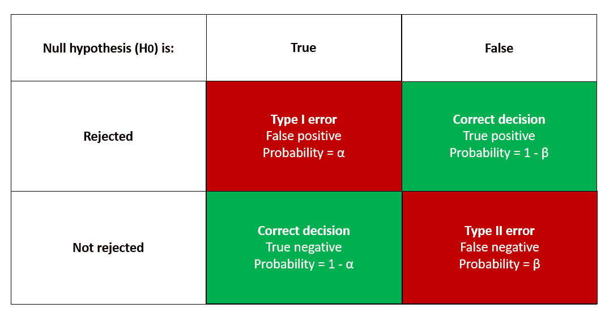
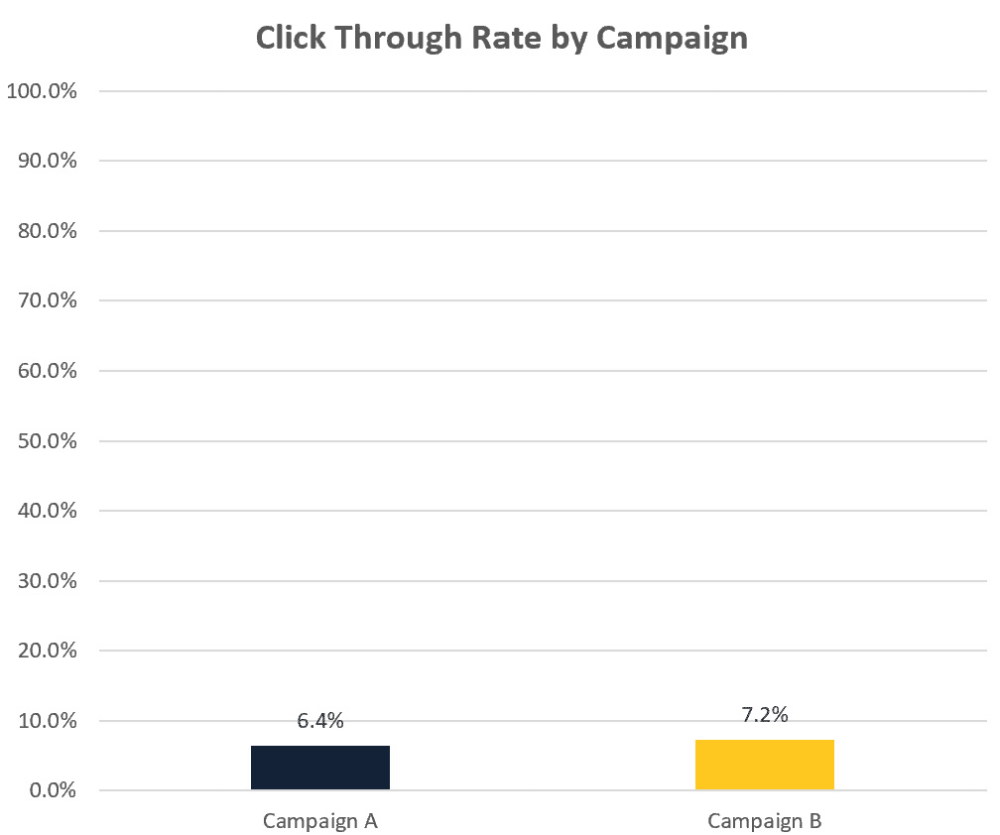
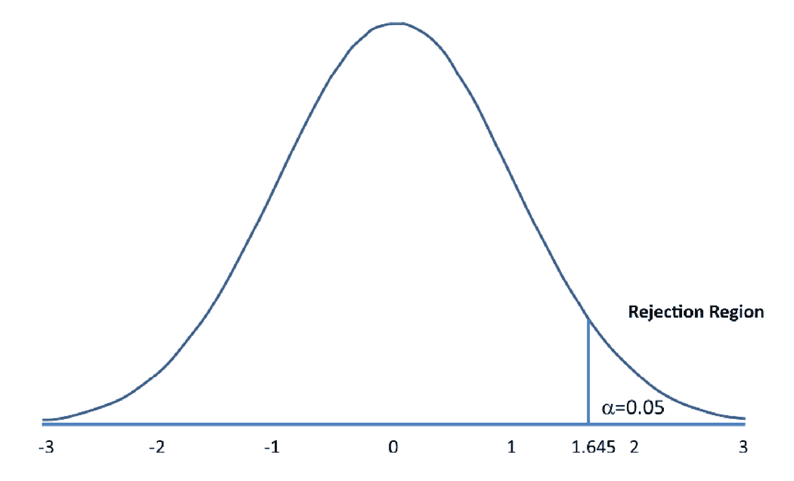

# 第四章：显著性的意义

我们不断被新的数据和统计信息所轰炸，无论是在商业领域，我们可能会看到销售数字或消费者调查结果，还是在新闻中，我们可能会看到经济统计数据或政治民意调查。

我们如何理解这些信息，判断什么结果是显著的，什么只是统计噪音？

这就是统计显著性概念变得重要的地方，我们将在本章中了解统计假设及如何在实践中进行假设检验（也叫显著性检验）。通过掌握这些技巧，你将能够更有信心地做出数据驱动的决策，避免因误导性结果而导致的高昂错误。

为了说明显著性检验的重要性，让我们考虑一个常见的场景。假设你的数据科学团队负责减少公司内的客户流失率，并且他们观察到过去一个季度客户流失的百分比增加了 2%（即离开或取消订阅）。这个变化是否值得关注，还是可能仅仅是随机的偶然结果？

显著性检验帮助你回答这个问题，并对团队的努力方向做出有根据的决策。

另一个例子可能是，你的团队对一个新的机器学习模型进行了 A/B 测试，结果显示该模型在准确率上比之前的模型提高了 4%。

显著性检验可以告诉我们这个改进是否具有统计学意义。

在本章中，我们将学习如何制定商业假设，并通过统计方法来检验它们。我们将了解统计假设、统计显著性的概念，以及如何在实践中进行假设检验。

这些工具将帮助你判断所使用的数据和指标的可靠性和相关性，从而让你能更有信心地做出决策。

本章将涵盖以下主题：

+   假设检验的概念

+   针对人口比例的显著性检验

+   针对人口平均数（均值）的显著性检验

+   案例研究演练

# 假设检验的概念

在每个组织中，我们都有想要测试的想法和概念，以便做出更有根据的决策。在许多情况下，决策是基于直觉或“凭感觉”做出的，但人类的直觉是易错的，因此我们需要一个框架来在做出关键决策之前测试这些想法。

让我们考虑一个你可能会作为数据科学领导者遇到的场景。假设你管理一个在线品牌，正在考虑在一个电子商务平台上进行促销活动，以增加某个特定产品的销量。在投入资源进行促销之前，你希望先确定其潜在的有效性。

这就是假设检验的作用所在——它提供了一个数据驱动的决策框架，帮助避免基于假设做出的代价高昂的错误。

在本节中，我们将简要介绍假设检验以及它如何帮助你在不同场景下做出明智决策。

## 什么是假设？

假设是关于特定情境或现象的陈述或主张，我们希望对其进行检验或验证。在我们的产品促销示例中，我们的假设可能是，“*促销活动将在市场上增加产品销量*。”

## 假设检验是如何工作的？

假设检验是统计学和数据科学中用于检验主张或假设有效性的一种方法。其基本思路是收集数据，对其进行分析，然后判断证据是否支持或反驳假设。

为了更好地理解这一过程，让我们将其分解成四个简单的步骤，我们将在本章稍后详细讲解每个步骤：

1.  **制定假设**：首先，我们需要陈述我们的替代假设，这就是我们想要检验的主张。此外，我们还需要定义原假设，它与我们原始的主张相反。在我们的品牌推广示例中，替代假设可能是，“*新的促销活动增加了产品的销量*。”

1.  **确定显著性水平**：在我们开始检验假设之前，需要决定一个显著性水平，它是一个用于判断观察到的差异是否可能由偶然因素引起，还是由实际效果引起的阈值。

1.  **收集相关数据**：现在，我们收集与假设相关的数据。在我们的示例中，我们可能会收集促销前后产品的销量数据。

1.  **进行统计检验**：接下来，我们对数据进行统计检验，以确定促销前后销量是否存在显著差异。

1.  **做出决策**：根据我们统计检验的结果，我们可以接受或拒绝原假设。如果检验显示销量有显著差异，我们可能得出结论认为促销活动有效，从而拒绝原假设。另一方面，如果检验结果没有显著差异，我们可能会接受原假设，即新的促销活动并未增加产品销量。

## 制定原假设和替代假设

在假设检验中，制定清晰且定义明确的原假设和替代假设对于做出准确和明智的决策至关重要。

在本节中，我们将深入探讨制定这些假设的过程，并解释它们为什么对有效的假设检验至关重要。

### 原假设（H0）

原假设，记作 H0，是一个假设，假定所研究的变量之间没有影响或关系。换句话说，它代表了“现状”或基线情景。原假设的目的是为假设检验提供起点，使我们能够评估证据，并决定它是否支持或反驳我们最初的主张。

在制定零假设时，确保它是可检验且具体的非常重要。

以下是一些零假设的例子：

+   “两种产品在顾客对质量的感知上没有差异”

+   “新的营销活动对产品销售没有影响”

+   “与上一季度相比，本季度品牌的认知度没有变化”

### 备择假设（H1）

备择假设，记作 H1，是与零假设直接相反的陈述，表示我们希望证明或调查的效应或关系。备择假设本质上是我们通过分析希望展示的内容。

与零假设类似，备择假设也应该是可检验的并且具体的。

以下是之前提到的示例的备择假设：

+   “两种产品在顾客对质量的感知上存在显著差异”

+   “新的营销活动对产品销售有积极影响”

+   “与上一季度相比，本季度品牌的认知度发生了变化”

### 选择正确的假设

选择适当的零假设和备择假设对于成功的假设检验至关重要。以下是一些帮助你选择正确假设的指导原则：

+   确保假设是互斥的。这意味着如果一个假设为真，另一个必须为假。

+   保持假设清晰和具体。模糊或不明确的假设可能导致混乱和错误的结论。

+   将假设与研究目标对齐。你的假设应当回答你希望通过分析解决的关键问题。

制定清晰的零假设和备择假设是假设检验过程中至关重要的一步。通过确立明确的起点（零假设）和期望结果（备择假设），你可以有效评估证据，并根据分析做出明智的决策。记住，保持假设的具体性、可检验性和互斥性，以确保假设检验的成功。

## 确定显著性水平

显著性水平，用符号 α（alpha）表示，是假设检验中的一个关键概念。它代表了犯第一类错误的概率，即当零假设为真时，我们却错误地拒绝了它。简单来说，它是我们在基于数据做决策时愿意承担的风险。

例如：假设你正在测试一个新的营销活动是否能提高销售额。显著性水平是指在营销活动无效时仍然得出其有效的结论的概率。

### 常见的显著性水平

显著性水平通常以百分比或小数的形式表示：

+   **1% (0.01)**：这个严格的显著性水平用于当我们希望非常有信心并最小化第一类错误时使用

+   **5% (0.05)**：这是最广泛使用的显著性水平，平衡了第一类错误和第二类错误的风险

这是一个例子：在一项市场研究中，如果采用 1%的显著性水平，就意味着得出客户喜欢新产品特性而实际并非如此的结论的概率仅为 1%。

### 选择合适的显著性水平

在选择显著性水平时，请考虑以下因素：

+   **错误的后果**：如果第一类错误更严重（例如发布有缺陷的产品），则使用较低的显著性水平。如果第二类错误更严重（例如未能检测出疾病），则使用较高的显著性水平。

+   **样本大小**：样本越大，可以使用较低的显著性水平；样本较小则可能需要较高的显著性水平，因为不确定性增加。

+   **领域惯例**：遵循你所在研究领域的既定惯例。

让我们考虑一个例子。

在一项评估新员工培训项目对生产力影响的研究中，实施一个无效的项目（假阳性）可能带来的后果，比未能采用一个有效的项目（假阴性）要轻微。在这种情况下，可能需要采用较高的显著性水平，例如 10%。

相反，考虑以下示例。

一家制药公司正在测试一种用于治疗严重疾病的新药。在这种情况下，推出一种无效的药物（假阳性）可能带来的后果，比未推出潜在有效的药物（假阴性）要严重得多。公司不想冒着危及患者健康的风险去发布一种无效或有害的药物，因此，采用较低的显著性水平，例如 1%，可能更为合适，以降低第一类错误的风险，并确保药物在推向市场前是安全有效的。

通过仔细考虑背景和潜在后果，你可以选择一个与目标一致的显著性水平，并为你的分析提供坚实的基础。

## 了解错误

在假设检验中，我们需要了解两种错误类型：第一类错误和第二类错误。当我们根据数据分析做出错误决策时，这些错误就会发生。让我们通过简单的解释和示例来探索这些错误。

### 第一类错误 – 假阳性

第一类错误发生在我们认为变量之间存在影响或关系时，但实际上并不存在。这就像是虚惊一场。

例如，假设你正在测试一种新药是否有效。如果你错误地得出结论认为药物有效，而实际上它无效，那就是第一类错误，也叫做**假阳性**。

### 第二类错误 – 假阴性

第二类错误发生在我们认为变量之间没有影响或关系时，但实际上是有的。这就像错失了一个机会。

以药物为例，如果你错误地得出结论认为药物无效，但它实际上是有效的，那就是第二类错误，也叫做**假阴性**。

你可以在这张图表中看到第一类和第二类错误的可视化：

图 4.1：第一类和第二类错误

在图表中，可以看到如果拒绝原假设，但没有关系或效应，那么这就是第一类错误（即**假阳性**）。

在图表中，可以看到如果接受原假设，但实际存在关系或效应，那么这就是第二类错误（即**假阴性**）。

图表还显示了正确的决策，**真阳性**和**真阴性**。

### 错误平衡

在假设检验中，我们希望尽量减少第一类错误和第二类错误，可以通过一些简单的策略来实现：

+   **选择正确的显著性水平**：这有助于管理第一类错误的风险。较低的显著性水平意味着较低的第一类错误概率，但可能会增加第二类错误的风险。

+   **使用更大的样本量**：更多的数据可以帮助减少发生第二类错误的风险。然而，由于时间或资源的限制，获取更多数据并非总是可行的。

+   **设计好你的检验**：一个好的检验可以帮助减少这两类错误。这可能涉及选择正确的统计检验方法或考虑其他可能影响结果的因素。

了解第一类错误和第二类错误对于准确的假设检验非常重要。通过考虑这些错误并做出明智的选择，你可以从数据中得出更好的结论。

## 理解 p 值

p 值是假设检验中的一个重要概念，它帮助我们理解数据与我们所检验的假设之间的关系。简单来说，*p*值是指在原假设为真时，观察到的数据（或更极端的结果）出现的概率。

我们将通过一个简单的解释，讲解 p 值及其与显著性检验的关系。

### p 值作为证据的度量

p 值为我们提供了一种衡量反驳原假设证据的方法。较小的 p 值（通常小于 0.05）意味着如果原假设为真，观察到的数据不太可能发生。换句话说，较小的 p 值表明变量之间可能存在真实的效应或关系，原假设可能是错误的。

另一方面，大 p 值意味着如果原假设为真，观察到的数据很可能会发生。在这种情况下，证据不支持替代假设，我们无法拒绝原假设。

### 显著性检验，比较 p 值与显著性水平

在显著性检验中，我们将 p 值与预设的显著性水平（α）进行比较。显著性水平代表我们愿意接受的最大第一类错误（在原假设为真时拒绝原假设）的概率。

如果 p 值小于或等于显著性水平（p ≤ α），我们拒绝原假设，并得出替代假设更有可能为真的结论。这意味着观察到的效应或关系在统计学上是显著的。

如果 *p*-值超过显著性水平（p > α），我们不能拒绝原假设，观察到的效应或关系在统计学上不显著。

### 示例

假设我们正在测试一种新药物，原假设（H0）是该药物没有效果。备择假设（H1）是该药物有效果。我们选择显著性水平为 5%（0.05）。

在进行检验后，我们得到 p 值为 0.02。由于 p 值（0.02）小于显著性水平（0.05），我们拒绝原假设，并得出结论：该药物具有统计学显著性效应。

p 值在显著性检验中扮演着重要角色，帮助我们衡量反驳原假设的证据。通过将 p 值与显著性水平进行比较，我们可以就是否拒绝原假设并接受备择假设做出有根据的决策。请记住，尽管 p 值是一个有用的工具，但它们应谨慎解释，并结合所有可用的信息来考虑，而不是盲目地接受为假设的绝对证据。

我们已经讨论了 p 值这一重要话题，解释了它如何作为反驳原假设的证据的度量。理解 p 值对于解释假设检验结果至关重要，无论是评估市场营销活动的影响，还是衡量机器学习算法的效果。

以下是关键要点：

+   较小的 p 值表明在原假设下，观察到的数据不太可能发生，这为备择假设提供支持。

+   较大的 p 值表明没有足够的证据拒绝原假设。

+   在显著性检验中，我们将 p 值与预定的显著性水平进行比较，以便就假设做出有根据的决策。

通过理解这些原理，企业高管和决策者可以基于数据做出更准确、更可靠的结论，从而减少代价高昂的错误。

在下一节中，*针对总体比例的显著性检验——就比例做出有根据的决策*，我们将在此基础知识上进行拓展。我们将探讨如何在实际场景中应用 *p*-值，特别是聚焦于总体比例的检验。这对于根据样本了解较大群体的特征尤为重要，比如市场研究。

# 针对总体比例的显著性检验——就比例做出有根据的决策

作为决策者，你通常需要比较比例以做出明智的选择。例如，你可能想知道两条产品线中，顾客满意度比例是否有显著差异，或者一个新的营销活动是否比之前的活动有更高的成功率。在这里，总体比例的显著性检验非常有用，因为它们可以帮助你比较不同组之间的比例，看看它们是否存在显著差异。

举个简单的例子，假设你想进行两次不同内容的电子邮件营销活动，并比较哪一封邮件更成功。成功的营销活动可以扩展给更多的收件人。这就是所谓的 A/B 测试，在部署机器学习模型更新时也可以采用这种方法，通过比较新模型与现有模型的结果来进行评估。

一个可能有用的指标来衡量活动成功与否是**点击率**（**CTR**），即收到邮件的人中点击链接的比例。

请看以下示例：

图 4.2 – 比较两次营销活动的点击比例（CTR）

你可以看到第二次活动的 CTR 更高，但你怎么知道这个差异是否显著，还是仅仅由于随机机会？

为了进行检验，你需要知道发送的电子邮件数量和点击的电子邮件数量，凭借这些数据，你可以进行比例的显著性检验。

在本节中，我们将探讨两种常用的总体比例显著性检验方法：**z**检验和**卡方**检验。我们会简化解释，并提供大量示例，帮助你理解这些概念并将其应用到工作中。

## z 检验 – 比较样本比例与总体比例

z 检验是一种统计工具，帮助你判断一个样本比例是否与预期的总体比例有显著差异。它回答了这个问题：“我在样本中看到的差异有意义吗，还是仅仅由随机机会造成的？”

### 理解 z 检验

在深入探讨 z 检验的原理之前，熟悉支撑这一统计方法的术语是很重要的。这些关键组成部分为有效解读结果打下基础：

+   **原假设（H**0**）**：原假设就像我们的起始假设。我们假设总体比例（P）等于我们感兴趣的特定值（P0）。

+   **备择假设（H**1**）**：备择假设与原假设相反。它表明总体比例（P）不等于、少于或大于特定值（P0）。

+   **Z 分数**：Z 分数是一个数值，表示我们的样本比例（P）与预期的总体比例（P0）相差多少标准差。

+   **P 值**：P 值帮助我们理解，如果零假设为真，观察到像我们这样极端的样本比例（或更极端的情况）有多大可能性。

### 执行 z 检验的简单步骤

所以，你已经掌握了*z*-检验的关键组成部分。接下来是什么？实际应用。无论你是在分析客户的行为和偏好，还是尝试比较两个机器学习模型的准确性，能够执行 z 检验都是一项不可或缺的技能。以下是帮助你完成这一过程的步骤：

1.  **设定假设**：第一步是制定零假设和备择假设。记住，零假设是你的起点，假设不存在效应或差异。

1.  **计算样本比例（P）**：将成功结果的数量除以样本大小*n*。这个比例代表了你在样本中感兴趣的特征或效应。

1.  **确定标准误差（SE）**：使用以下公式：

SE = √ P0(1 − P0) / n

其中，P0 是预期的总体比例（不要与 P 值混淆）。标准误差衡量你的样本比例与实际总体比例之间的差异预期。

1.  **计算 Z 分数**：Z 分数的计算公式为：

Z = (P − P0) / SE

它告诉你，样本比例离零假设比例有多少个标准误差。

1.  **查找 P 值**：根据 Z 分数，确定 P 值。你可以通过查找表或在线计算器（[`www.socscistatistics.com/pvalues/normaldistribution.aspx`](https://www.socscistatistics.com/pvalues/normaldistribution.aspx)）来确定 P 值。这将告诉你，在零假设为真的前提下，获得一个像你这样的 Z 分数有多大可能性。你选择的编程语言或软件（如 Excel、Python、R）也会包含用于计算 P 值和执行 z 检验的函数。

1.  **与显著性水平比较**：最后，将 P 值与预设的显著性水平（α）进行对比。如果 P ≤ α，那么你有理由拒绝零假设。

图 4.3 – 单尾 z 检验

上述图表展示了标准正态分布，这是用于执行 z 检验的分布。

由样本比例和总体比例计算得到的 Z 分数，决定了样本比例在该分布中的位置。

右侧的拒绝区域表示，如果样本比例与总体比例存在显著差异，Z 分数将落在该区域。

为了得出有显著性差异的结论，p 值（曲线下方超过 z 分数的区域）必须小于或等于显著性水平（0.05），这意味着 z 分数必须大于或等于临界值（在本例中为 1.645）。你可以说，样本比例与总体比例之间的差异不是由于随机机会造成的。

我们将通过一个更具体的例子来说明 z 检验。

## 简单易懂的 z 检验例子

现在我们已经了解了如何进行比例的 z 检验，接下来让我们看一个实际的例子。

假设我们认为 60%的人（*P*0 = 0.60）偏好某一品牌的咖啡，并希望通过实际数据检验这一假设。我们问了 200 人（*n* = 200），发现其中 130 人喜欢这个品牌（*x* = 130）。我们的样本比例为*p* = 130 / 200 = 0.65。

我们的原假设（H0）是总体比例（P）等于 0.60。备择假设（H1）是总体比例（P）不等于 0.60。

我们计算标准误差 SE 为 SE = √(0.60(1 − 0.6) / 200) ≈ 0.0346

接下来，我们计算 z 分数为 Z = (0.65 − 0.60) / 0.0346 ≈ 1.445

使用 z 表或软件，我们发现双尾 p 值约为 0.148。由于 p 值（0.148）大于显著性水平（假设为 0.05），我们不能拒绝原假设。换句话说，没有足够的证据表明偏好该品牌咖啡的人群比例与 60%不同。

现在我们已经展示了如何使用 z 检验来检验关于比例的假设，那么它还能用于什么呢？这是下一节的主题，我们将看到 z 检验如何用于检验关于总体平均值（均值）的假设。

# 总体均值（均值）显著性检验

在这一节中，我们将深入探讨关于均值的显著性检验，它用于判断一个样本均值是否显著不同于假设的总体均值。我们将涵盖各个方面，包括编写假设、t 检验的条件、何时使用 z 统计量或 t 统计量、示例，以及单尾检验和双尾检验。

## 编写关于均值的显著性检验假设

在进行均值的显著性检验时，你将首先制定原假设和备择假设：

+   **原假设（H**0**）**：原假设声明总体均值（μ）等于一个特定值（μ0）。

+   **备择假设（H**1**）**：备择假设声明总体均值（μ）不等于、小于或大于特定值（μ0），具体取决于研究问题。

## 关于均值的 t 检验条件

t 检验通常用于当总体标准差（σ）未知时检验均值的假设。进行*t*检验时应满足以下条件：

+   样本是随机选择的。

+   样本量较小（*n* < 30），或者总体分布是正态分布的。如果样本量较大（*n* ≥ 30），即使总体不是正态分布，*t* 检验仍然是稳健的。

## 在显著性检验中何时使用 z 或 t 统计量

+   当总体标准差（σ）已知，且样本量较大（*n* ≥ 30）时，使用 z 统计量

+   当总体标准差（σ）未知时，使用 t 统计量，并依赖样本标准差（s）作为估计值

## 示例 – 计算关于均值的 t 统计量

假设我们想测试样本中苹果的平均重量是否与假设的 150 克均值不同。我们有一个包含 25 个苹果的随机样本（n = 25），样本的平均重量为 155 克（x̄ = 155），样本标准差为 20 克（s = 20）。

零假设（H0）是总体均值（μ）等于 150 克。备择假设（H1）是总体均值（μ）不等于 150 克。

t 统计量可以使用以下公式计算：

t =  (x̄ − μ0) _ s _ √ n

t =  (155 − 150) _ 20 _ √ 25 =  5 _ 4 = 1.25

## 使用表格从 t 统计量估算 p 值

要根据 t 统计量找到 p 值，您需要使用 t 分布表或软件。在我们的示例中，t 统计量为 1.25，自由度（**df**）等于 n - 1，即 24。使用表格或软件，我们可以估算双尾的 p 值约为 0.22。

## 将 t 统计量的 p 值与显著性水平进行比较

现在，将 p 值与显著性水平（α）进行比较以做出决定。如果我们选择显著性水平 0.05，且 p 值（0.22）大于 α，那么我们无法拒绝零假设。这意味着我们没有足够的证据得出结论认为苹果的平均重量不同于 150 克。

## 单尾检验与双尾检验

在进行显著性检验之前，区分单尾检验和双尾检验这两种假设检验类型也是非常重要的：

+   **单尾检验**：单尾检验用于确定总体均值是否大于或小于假设的均值。在这种情况下，您将使用单尾的备择假设（例如，μ > μ0 或 μ < μ0）。单尾检验的 p 值表示在备择假设指定的方向上观察到如此极端或更极端的检验统计量的概率。

+   **双尾检验**：双尾检验用于确定总体均值是否与假设的均值不同，而不指定差异的方向。双尾的备择假设为 μ ≠ μ0。双尾检验的 p 值表示在任一方向上观察到如此极端或更极端的检验统计量的概率。

到目前为止，我们一直在考虑将显著性检验视为双尾检验。如果你想指定假设的方向，可以指定单尾检验，并且许多统计分析工具（如 Python、R、Excel）都允许你这样做。

总结来说，关于均值的显著性检验对于确定样本均值是否与假设的总体均值显著不同非常重要。我们已经覆盖了 t 检验的必要步骤和条件，何时使用 z 检验或 t 检验，以及单尾检验和双尾检验的区别。通过理解这些概念并将其应用于实际场景，你将能够有效地分析数据并得出有关总体均值的有意义结论。

# 通过案例分析

为了巩固我们在本章中所学的内容，让我们通过本章开始时使用的一个关于在线商店产品促销的例子来进行讲解。

假设我们有数据，显示了促销前 14 天和促销后 14 天的每日销售量。我们的假设是，促销后产品的每日销售量显著增加。

我们如何使用显著性检验来检验这个假设呢？

让我们回顾一下本章开始时设置的步骤：

1.  **制定假设**：首先，我们需要陈述我们的原假设和备择假设。

    **问题**：在继续阅读之前，你能尝试制定一个原假设和备择假设吗？

    1.  **原假设 (H**0**)**：我们的原假设是促销后每日平均销售量没有显著增加。

    1.  **备择假设 (H**1**)**：我们的备择假设是促销后每日平均销售量显著增加。

1.  **确定显著性水平**：其次，我们确定一个显著性水平。

    **问题**：在阅读以下内容之前，你能尝试决定一个显著性水平吗？

    我们将使用 0.05 的显著性水平，这在统计学的商业应用中是常见的；然而，根据你对拒绝原假设的信心程度，其他选择也是可以接受的。

1.  **收集** **相关数据**：

    现在，我们收集与我们的假设相关的数据。在我们的例子中，假设我们收集的数据表明，在促销前的 30 天里，平均每日销售额为 $9,000，而在促销后的 30 天里，平均每日销售额为 $9,200，样本标准差为 $50。

1.  **执行一个** **统计检验**：

    接下来，我们对数据进行统计检验，以确定促销前后的销售量是否存在显著差异。

    **问题**：在继续阅读之前，尝试回答以下问题：

    1.  我们是在测试总体比例的差异，还是总体均值的差异？

    1.  你认为哪种统计检验适用于这个案例呢？

    1.  我们应该使用单尾检验还是双尾检验？

    在这种情况下，我们正在检验总体均值的差异。样本量较小（n = 14），因此使用 t 检验比较合适。由于我们的备择假设是有方向性的（即促销后每日销售更高），我们应该使用单尾 t 检验。

    现在让我们使用我们的数据进行这个统计检验。我们有一个 14 天的随机样本（n = 14），样本平均重量为$9,200 (x̄ = 9,200)，样本标准差为$75 克 (s = 75)。

    零假设（H0）是总体均值（μ）等于$9,000。备择假设（H1）是总体均值（μ）大于$9,000。使用这些数值计算*t*统计量，我们得到：

t =  (x̄ − μ0) / (s / √n) = (9200 − 9000) / (75 / √14) = 200 / 20.04 = 9.98

1.  **做出决策**：根据我们统计检验的结果，我们可以接受或拒绝原假设。

    将这些值输入到计算器中，例如，通过以下链接进行单尾 t 检验表格查找：

    [`www.socscistatistics.com/tests/studentttest/`](https://www.socscistatistics.com/tests/studentttest/)

    我们发现 p < 0.001，这表明在促销后，产品的销量显著增加。

基于此次测试显示销售显著增长，我们可以得出结论，促销是有效的，并接受我们的原假设。这可能有助于未来在同一电商平台或其他平台上开展类似促销活动的决策。统计学为我们提供了一种更有信心和证据的决策机制，而非仅凭直觉或感觉，从而提高了做出正确决策的机会。

# 总结

恭喜你，成功应用了统计思维并测试了一个类似于真实商业用例的假设，今后在你的业务或生活中，可能也会有类似测试假设的应用场景。

在这一章中，我们学习了如何使用统计检验来验证不同的假设。我们了解了不同类型的错误、如何选择显著性水平，并理解了 p 值与显著性水平之间的关系。然后我们学习了总体比例的显著性检验和总体均值的显著性检验。最后，我们通过一个基于在线商店产品促销的案例研究，完成了一个实例分析。

在接下来的章节中，我们将转变方向，深入探讨回归分析。这一强大的统计技术不仅能够识别变量之间的关系，还能根据这些关系预测未来的结果。如果你曾想知道如何预测销售额、评估社交媒体营销的影响，或学习机器学习的基础技术，你绝对不容错过接下来的内容。
