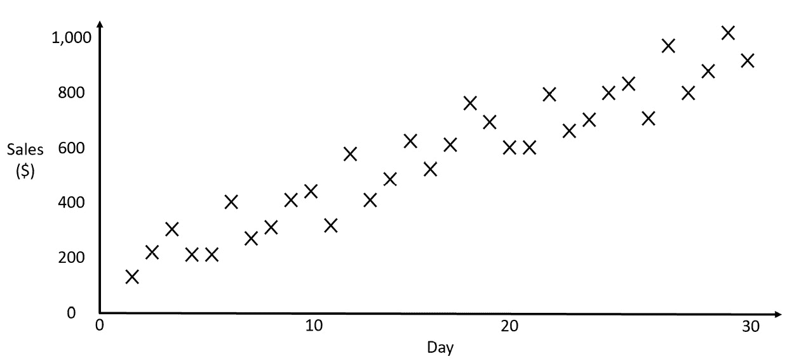
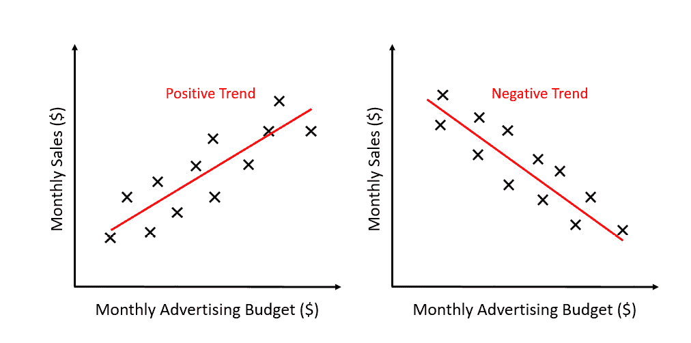
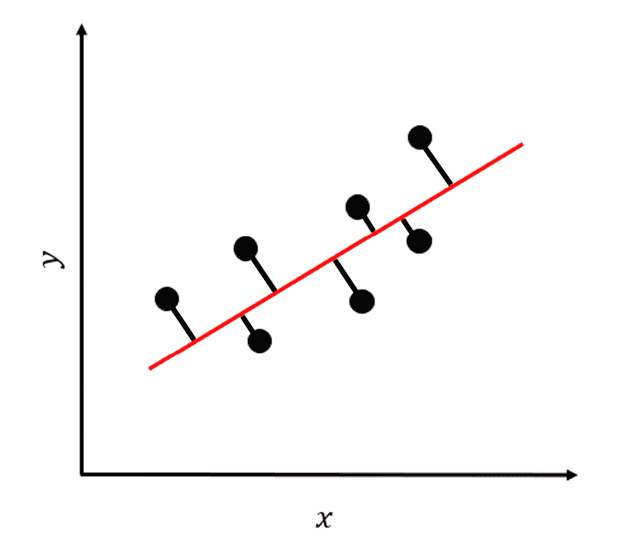
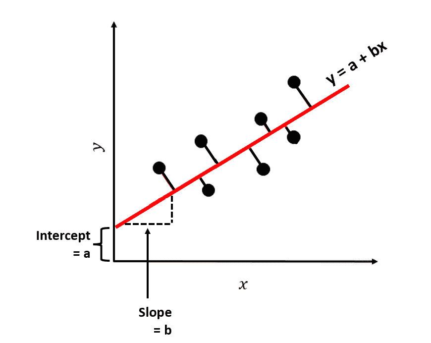
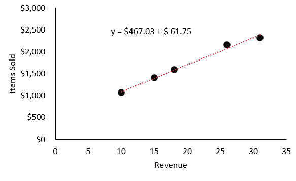

# 第五章：理解回归分析

在本章中，我们将学习*回归分析*，这是一种强大的统计工具，能够帮助决策者识别和理解变量之间的关系，发现趋势并预测未来趋势。

你可能会问自己以下问题：

# 我如何从理解回归分析中受益？

回归分析，简单来说，是一种统计方法，帮助揭示数据中的模式和关系。

在企业中，回归分析可以帮助决策者更好地理解不同因素或变量如何影响关键绩效指标，如销售额、收入或客户满意度。通过识别这些关系，企业可以做出更明智的决策，优化战略，并提高整体绩效。

以下是回归分析在商业环境中的一些应用场景：

+   **预测**：回归技术通过分析历史数据帮助企业预测未来趋势、销售额和需求。准确的预测对于战略规划、资源分配和预算编制至关重要。

+   **识别关系**：回归分析可以帮助企业揭示变量之间的关系，例如广告支出对销售的影响或定价对客户需求的影响。了解这些关系可以帮助企业优化战略。

+   **高效的资源配置**：通过理解不同因素如何影响企业绩效，公司可以更有效地配置资源，并做出更好的投资决策。

+   **风险管理**：回归分析可以帮助企业识别其运营中可能存在的风险和脆弱性，了解导致结果波动的因素。

+   **评估绩效**：企业可以通过回归分析评估不同部门、团队或员工的绩效，方法是分析投入（例如资源和时间）与产出（例如销售额和生产力）之间的关系。

+   **价格优化**：通过了解价格变化如何影响需求，企业可以使用回归分析来确定最佳定价策略，从而最大化收入和利润。

+   **政策评估**：回归分析可以帮助企业通过将结果与预期结果进行比较，评估各种政策和举措的有效性。

在深入回归分析的复杂性之前，首先了解一个基础概念是至关重要的——趋势线。尽管趋势线看似简单，但理解它们的细微差别可以带来丰富的洞察。

# 趋势线简介

在本节结束时，你将对趋势线有一个扎实的理解，这是回归分析的基础。

让我们从一个实际的例子开始。假设你拥有一家电子商务商店，并且已经记录了过去几个月的日销售额。手头有一份数字清单，你对数据中是否有任何模式感兴趣，这些模式可能会影响你的商业决策。这时，趋势线就派上用场了。

趋势线是一条表示数据集总体方向或模式的线。它使我们能够可视化数据点之间的关系，并帮助我们预测未来的数值。简单来说，它以最能说明整体趋势的方式连接这些点。

回到我们的电子商务商店场景，假设你将日销售额绘制在图表上，横轴表示天数，纵轴表示销售额。每天的销售额成为图表上的一个数据点。你的目标是绘制一条最佳拟合这些数据点的线，这些数据点代表你销售数据的一般趋势。正斜率表示销售额随时间增加，而负斜率则表示销售额减少。

你会如何拟合一条最佳匹配这些数据的线？它的斜率是正向的还是负向的？

图 5.1：一家电子商务商店的日销售额

然而，现实世界中的数据很少如此简单。由于节假日、促销甚至天气等各种因素，数据中可能会出现波动。这时，回归分析就显得尤为重要。回归分析帮助我们在拟合趋势线时考虑这些波动，从而更准确地表示整体模式。

再考虑另一个例子来进一步理解趋势线。作为市场经理，你可能对广告预算与产品销售之间的关系感兴趣。你可以将每月的广告预算绘制在横轴上，将每月的产品销售额绘制在纵轴上，每个数据点表示一个特定的广告预算及其相应的销售额。将趋势线拟合到这些数据上，能够让你看到是否存在一种趋势，表明更高的广告预算会带来更高的销售额：

图 5.2：比较每月广告预算与每月销售额时的正负趋势线

现在我们已经了解了什么是趋势，如何根据我们的数据估计趋势呢？这是下一节的主题。

# 将趋势线拟合到数据

在这一节中，我们将探讨将趋势线拟合到数据集的过程以及可以用来最小化误差并最大化准确性的技术。

拟合一条直线到数据上是一门艺术，它的核心是找到最能代表潜在模式或趋势的直线。那么我们如何定义“最佳”呢？答案就在于最小化**趋势线**生成的预测值与实际数据点之间的*误差*。实现这一目标的最常用方法被称为**最小****二乘法**技术。

想象你已经通过数据点绘制了一条直线，并且对于每个点，你测量了实际数据点与直线上相应点之间的垂直距离。这个距离被称为“残差”或“误差”。最小二乘法的目标是找到一条最小化残差平方和的直线。对残差进行平方处理至关重要，因为这样可以消除负值，并突出较大的偏差，确保拟合的直线尽可能地贴近数据。

看下面的图示，每个数据点由黑色圆点表示，我们尝试拟合的直线由一条长长的红线表示。我们尝试拟合的直线与数据点之间的“残差”或“误差”通过垂直于直线的红线来表示。我们在最小二乘法中最小化的正是所有这些距离的平方和：

图 5.3：通过一组数据点的最佳拟合直线及最佳拟合直线与数据点之间的残差/误差

为了说明这个过程，让我们回到我们的市场经理例子。当你绘制了广告预算和相应产品销售数据点后，你需要找到最能拟合数据的直线。通过应用最小二乘法技术，你将最小化趋势线预测销售值与实际销售数据点之间的总体误差。然后，这条直线将为你提供广告预算与产品销售之间关系的宝贵见解，帮助你做出更有依据的决策。

虽然将一条直线拟合到数据上起初可能看起来很复杂，但现代的软件工具和编程语言使这个过程比以往任何时候都更加简单。许多工具，如 Excel、Python 库、Tableau 和 PowerBI，提供了内置的函数，只需几次点击或几行代码就能拟合趋势线并执行回归分析。作为决策者，你不需要成为数学细节方面的专家，但理解这个概念及其应用对于有效地领导数据驱动的项目至关重要。

为数据集拟合趋势线是一项强大的技术，它帮助我们发现数据中的隐藏模式，从而做出更好的决策。通过最小化实际数据点和趋势线预测值之间的误差，我们可以提取有价值的洞见，推动商业决策并实现预期结果。在接下来的部分，我们将探索如何估计最佳拟合直线。

# 估计最佳拟合直线

在本节中，我们将深入探讨最小二乘法，这是估计最佳拟合直线的黄金标准。我们将探索这一技术背后的直觉，并通过各种例子展示其在揭示数据模式中的强大作用。

为了更好地理解最小二乘法，我们通过几个例子来进行讲解：

+   **例子 1**：一位校长想要了解学生学习时间与考试成绩之间的关系。校长将数据绘制在图表上，横轴表示学习时间，纵轴表示考试成绩。每个数据点代表一个学生的学习时间和相应的考试成绩。

    应用最小二乘法，校长旨在找到一条线，该线最小化平方残差之和——即实际考试成绩与趋势线预测成绩之间的垂直距离的平方和。一旦确定了最佳拟合直线，校长可以识别数据中的模式，例如较长的学习时间是否通常会导致较高的考试成绩，并利用这些信息来指导学校政策和学习项目。

+   **例子 2**：一位健身教练想要评估一个人每日卡路里摄入量与体重减轻之间的相关性。教练将数据绘制在图表上，横轴表示每日卡路里摄入量，纵轴表示体重减轻。每个数据点代表一个人的每日卡路里摄入量和相应的体重减轻。

确定最佳拟合直线后，教练可以分析卡路里摄入与体重减轻之间的关系，并根据客户的目标和饮食偏好提供量身定制的建议。

作为决策者，理解最小二乘法的核心概念及其在各种情境中的应用至关重要。在接下来的章节中，我们将以此为基础，深入探讨更高级的回归技术和工具。

# 计算最佳拟合直线的方程

在本节中，我们将深入探讨计算简单线性回归和多元线性回归的最佳拟合直线方程的过程。虽然方程看起来可能令人生畏，但我们会逐步分解它们，以确保清晰的理解。通过掌握最佳拟合直线背后的方程，你将更深入地理解线性回归的基本机制。

对于简单线性回归，最佳拟合直线的方程可以表示如下：

y = a + bx

这里，*y* 是因变量，*x* 是自变量，*a* 是 y 截距（直线与 *Y* 轴的交点），*b* 是斜率（决定直线的陡峭度）：

图 5.4：最佳拟合直线及其方程

要计算 *a* 和 *b*，我们可以使用以下公式：

b = ∑ i=1 n (x i − x̄)(y i − ȳ) _ (x i − x̄) 2

a = ȳ − bx̄

在这些公式中，xi 指定了各个数据点，x̄ 和 ȳ 分别表示 x 和 y 值的均值，Σ 表示求和。

我们通过一个示例来说明这一过程。

**示例**: 一位小企业主希望根据销售商品数量预测他们的月收入。该业主提供了过去 4 个月的数据：

+   **第 1 个月**: 销售商品数量 = 10, 收入 = $1,060

+   **第 2 个月**: 销售商品数量 = 15, 收入 = $1,400

+   **第 3 个月**: 销售商品数量 = 18, 收入 = $1,580

+   **第 4 个月**: 销售商品数量 = 26, 收入 = $2,150

+   **第 5 个月**: 销售商品数量 = 31, 收入 = $2,320

要找到最佳拟合直线的方程，按照以下步骤进行：

1.  计算 *x* 值（销售商品数量）和 *y* 值（收入）的均值：

x̄ = (10 + 15 + 18 + 26 + 31) ________________ 5 = 20

ȳ = (1,060 + 1,400 + 1,600 + 2,150 + 2,320) ________________ 5 = $1,702

1.  使用公式来找到斜率 *b* 和 y 截距 *a*，如前所示。在通过 *a* 和 *b* 的公式进行计算后，我们得到最佳拟合直线方程：

y = $467.03 + $61.75x

这是输出结果：

图 5.5：最佳拟合直线方程，估算了销售商品数量与收入的散点图

拥有最佳拟合直线方程 y = $467.03 + $61.75 后，小企业主可以自信地预测他们的月收入。例如，如果他们计划在下个月销售 22 件商品，可以通过将 *x*（销售商品数量）的值代入方程来估算收入：

y = $467.03 + $61.75(22) = $467.03 + $1,358.50 = $1,825.53

根据模型，企业主可以预期当他们销售 22 件商品时，月收入大约为$1,825.53。这个估算值对预算、资源分配和设定销售目标非常有用。通过不断更新模型并加入新的数据，企业主可以优化预测，做出明智的决策，促进小企业的增长与成功。

对于多元线性回归，过程更为复杂，因为它涉及多个自变量。一般方程如下所示：

y = a + b 1 x 1 + b 2 x 2 + … + b n x n

在这里，*a* 是常数，b1、b2、…、bn 是每个自变量 x1、x2、…、xn 的系数。在多元线性回归中，计算系数通常需要使用专业软件或编程语言，如 Python 或 R。

理解最佳拟合直线背后的方程对于理解线性回归的机制至关重要。通过计算这些方程，你将能够更好地解读和应用线性回归模型在实际场景中的结果。

现在我们知道如何估算最佳拟合直线（回归线）的方程，让我们学习如何解读方程中的参数。

有两个重要参数需要解读：回归线的 **斜率** 和 **截距**。

首先，我们将解释斜率；然后，我们将解释截距。

# 解释回归线的斜率

在本节中，我们将重点讨论回归线斜率的重要性，以及它如何帮助我们理解变量之间的关系。通过研究斜率，我们可以从回归模型中得出有意义的见解，并做出明智的决策。我们将通过各种例子来阐述这一概念，突出解释斜率的实际意义。

请记住，简单线性回归线的方程如下：

y = a + bx

斜率 *b* 表示因变量 *y* 在自变量 *x* 增加一个单位时的平均变化。换句话说，它告诉我们 *y* 会如何随着 *x* 的变化而变化。

让我们通过一些例子来更好地理解斜率的解释。

**例子 1**：一位健身教练开发了一个简单的线性回归模型，用来预测基于运动过程中消耗的卡路里数来预估体重减轻情况。最佳拟合直线的方程如下：

y = 5 − 0.01x

在这里，*y* 是体重减轻（以磅为单位），*x* 是消耗的卡路里数。斜率 -0.01 表明每增加一卡路里消耗，预计体重减轻平均增加 0.01 磅。在这种情况下，负斜率是预期的，因为燃烧更多卡路里应该导致体重减轻。

**例子 2**：一家电子商务公司建立了一个模型，通过市场营销支出来预测收入。最佳拟合直线的方程如下：

y = $10,000 + 2x

在这个情境中，*y* 代表每月收入，*x* 表示网站访问者的数量。截距表明即使没有营销支出，基础收入也为 $10,000。斜率 *2* 表明每增加一美元的营销支出，预计每月收入会增加 $2，平均而言。在这里，正斜率表明营销支出与收入之间存在正相关关系。

理解回归线的斜率至关重要，因为它量化了因变量和自变量之间的关系。正斜率意味着随着自变量的增加，因变量也会增加，而负斜率则表明随着自变量的增加，因变量会减少。

现在我们已经了解了如何解释回归线的斜率，让我们来探讨截距。

# 解释回归线的截距

在本节中，我们将探讨回归线截距的重要性，它为理解当自变量为零时因变量的基准水平提供了至关重要的背景。我们将通过不同的例子来展示回归线截距在线性回归模型中的实际意义。

在我们这个简单线性回归方程中，我们有以下公式：

y = a + bx

截距，*a*，表示当自变量 *x* 等于零时，因变量 *y* 的预期值。

让我们通过一些例子来更好地理解截距的解释。

**例子 1**：一家能源提供商开发了一个简单的线性回归模型，用于预测家庭根据消耗的**千瓦时数**（**kWh**）计算的每月电费。最佳拟合线的方程如下：

y = $20 + $0.12x

在这个例子中，*y* 代表每月电费，*x* 表示消耗的千瓦时数（kWh）。截距 *20* 表示当家庭消耗零千瓦时（即 *x* = 0）时，预期的每月电费为 $20。这个值可以解释为家庭无论是否有电力消耗都需要支付的基本费用或固定费用。

**例子 2**：一位市场分析师建立了一个模型，用于预测基于广告预算所产生的销售线索数量。最佳拟合线的方程如下：

y = 30 + 5x

这里，*y* 代表销售线索的数量，*x* 是以千美元为单位的广告预算。截距 *30* 表示当广告预算为零时（即 *x* = 0），预期产生的销售线索数量为 30。这个值可以理解为通过有机的、非广告方式（如推荐或搜索引擎流量）产生的基准线索数量。

需要注意的是，解读截距可能并不总是有意义，特别是当自变量 *x* 的值不能为零，或者回归模型在该范围内无效时。例如，当根据客户的年龄预测保险索赔数量时，年龄不可能为零，因此截距与特定含义无关。在这种情况下，截距主要用于微调回归线的位置，而不是提供直接的见解。

作为决策者，解读回归线的截距有助于你理解当自变量为零时因变量的基准水平，为你的数据提供有价值的背景信息。这一理解使你能够做出更加明智的决策，并利用变量之间的关系。

到此为止，我们已经了解了关于最佳拟合线的很多内容，但实际数据与最佳拟合线的匹配程度如何呢？这将是下一节的主题，我们将通过**残差**来衡量最佳拟合线与实际数据之间的差异。

# 理解残差

在本节中，我们将深入探讨残差的概念，重点关注其在线性回归中的作用，以及在评估模型的准确性和质量时的重要性。我们将通过各种示例来说明残差的意义，确保你对回归分析这一关键方面有全面的理解。

残差是实际观察值（数据点）与回归模型预测值（最佳拟合线）之间的差异。简单来说，残差代表了我们模型中的误差——我们的预测与现实之间的偏差。通过分析残差，我们可以评估回归模型的表现，并识别潜在的改进空间。

计算特定数据点的残差的公式如下：

残差 = 观察值 − 预测值

让我们通过一个示例来探讨残差的概念。

**示例**：一位销售经理建立了一个简单的线性回归模型，用来预测基于销售电话数量的月度收入。最佳拟合线的方程如下：

y = $1,000 + $50x

这里，*y* 是预测的月度收入，*x* 是销售电话的数量。

对于某个月份，团队进行了 30 次销售电话并产生了 2,300 美元的收入。为了计算这个月的残差，我们必须使用以下公式来找出预测收入：

预测收入 = $1,000 + $50 * 30 = $2,500

现在，我们可以计算残差：

残差 = 观察值 − 预测值

残差 = $2,300 − $2,500 = − $200

在这种情况下，残差为 -$200，表明实际收入比模型预测的收入低了$200。

在分析残差时，重要的是要寻找可能表明回归模型问题的模式或趋势。理想情况下，残差应该随机分布在零附近，没有明显的模式。如果残差呈现出趋势或系统模式，可能表明模型未能充分捕捉变量之间的潜在关系，需要进行调整。

这里提供了一些常见的残差模式及其潜在原因：

+   **U 型或倒 U 型模式**：这可能表明需要向模型添加二次项（变量的平方）来更好地捕捉变量之间的关系。

+   **残差随着预测值的增加或减少呈现增长或减少的模式**：这可能表明变量之间的关系不是严格线性的，可能需要进行转换（例如对数变换）。

通过理解和分析残差，决策者可以评估回归模型的准确性和可靠性，从而做出更好的预测和更有效的数据驱动决策。

我们如何利用残差评估模型与数据的拟合程度？这是我们将在下一节中探讨的内容。

# 在最小二乘回归中评估拟合度

在本节中，我们将讨论如何评估最小二乘回归中的拟合度，这是确定模型准确性和效果的关键步骤。

通过了解我们的模型与数据的拟合程度，我们可以做出更明智的决策并改善预测能力。我们将研究各种例子，并介绍用于评估回归分析拟合度的关键指标。

拟合度是衡量回归线如何代表因变量和自变量之间关系的指标。高拟合度的模型能够准确描述底层数据，而低拟合度的模型可能未能捕捉变量间真实的关系。为评估拟合度，我们通常使用两个关键指标：确定系数（R-squared）和**均方根误差（RMSE）**。

+   **确定系数（R-squared）**：R-squared 是一个从 0 到 1 的度量值，代表因变量 *y* 的总变异中有多少比例能被自变量 *x* 解释。接近 1 的 R-squared 值表明模型解释了数据中大部分的变异，而接近 0 的值则表明模型解释力较弱。然而，需要注意的是高 R-squared 值并不一定意味着模型好，可能是过度拟合或存在无关的变量导致的结果。

    **示例**: 一个汽车租赁公司建立了一个回归模型，以预测基于租用车辆数的日收入。该模型的 R 平方值为 0.85。这表明 85%的日收入变化可以通过租用车辆数来解释，表明两个变量之间存在强关系。

+   **RMSE**: RMSE 是衡量实际观察值与回归模型预测值之间平均差异的指标。较低的 RMSE 值表明模型的预测值接近真实值，而较高的 RMSE 值则表明预测与实际数据之间存在较大差异。

    **示例**: 一个服装零售商已经开发了一个回归模型，以预测基于广告支出的月销售额。该模型的 RMSE 为$500。这意味着，平均而言，模型预测的销售额与实际销售额相差$500。零售商可以利用这些信息评估模型的准确性，并确定是否需要调整。

评估拟合优度对于确定我们回归模型的有效性至关重要。通过理解诸如 R 平方和 RMSE 之类的关键指标，决策者可以评估其模型的可靠性。

# 总结

在本章中，我们介绍了趋势线的概念及其在数据集中可视化模式中的重要性。我们探讨了最小二乘法用于估计最佳拟合线，讨论了理解残差的重要性，并解释了如何解释回归线的斜率和截距。最后，我们讨论了如何使用 R 平方和 RMSE 评估模型的拟合优度。这些知识使您能够执行（或解释您团队的）回归分析，并将其应用于各种业务场景中。这些场景可能包括销售预测，优化广告预算以及评估不同因素对关键绩效指标的影响，从而进行基于数据的明智决策和业务增长。

随着我们进入*本指南的第二部分*，我们将打开分析能力的新维度：机器学习。您将学习如何从理解变量之间的关系转向预测未来结果，甚至进行自动化决策。

机器学习算法在许多行业中有着大量的应用，从优化供应链到帮助客户细分和目标营销，甚至自动化从文本数据中获取见解的过程。随着机器学习模型能力的增长，应用数量不断扩展，其中涵盖了太多应用以至于无法在此列举。然而，通过理解核心概念和一些众所周知的应用案例，您将能够更好地识别哪些业务问题可以恰当地作为机器学习问题来框定，并避免陷阱。

下一章将从机器学习简介开始，为更先进的技术和应用奠定基础。重点将放在机器学习如何为数据分析和商业决策带来可扩展性和自动化。

# 第二部分：机器学习——概念、应用与陷阱

本部分聚焦于机器学习，涵盖其重要性、机器学习技术的类型、监督学习与非监督学习、模型评估与解释，以及常见的陷阱和避免方法。本部分包含以下章节：

+   *第六章**, 机器学习简介*

+   *第七章**, 监督式机器学习*

+   *第八章**, 非监督式机器学习*

+   *第九章**, 解释与评估机器学习模型*

+   *第十章**, 机器学习中的常见陷阱*
