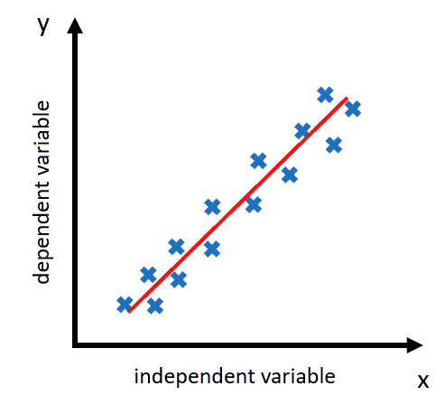

# 第六章：介绍机器学习

在数据驱动决策迅速发展的世界中，机器学习已经成为一个颠覆性的游戏规则改变者。作为决策者，理解这一强大工具的基础知识对于充分利用其潜力并在今天的竞争环境中保持领先地位至关重要。

在本章中，我们将揭开机器学习的神秘面纱，探索其在统计学中的根基以及它在**人工智能**（**AI**）中的关键角色。我们将细分不同类型的机器学习技术，并逐步讲解模型的训练、验证和测试过程。此外，我们还将深入探讨深度学习的激动人心的世界及其在各个行业中的变革性影响。

到本章结束时，你将掌握以下主题：

+   从传统统计学到机器学习的演变

+   机器学习在数据驱动决策中的重要性

+   机器学习在不同领域的多种应用

+   机器学习过程中的关键步骤

+   利用机器学习处理非结构化数据

+   深度学习与人工智能的关系

机器学习不仅仅是一个流行词，它是一个研究领域，能够帮助你发现隐藏的洞察，做出准确的预测，并自动化复杂的决策过程。

# 从统计学到机器学习

在这一部分，我们将超越已知的统计学范畴。我们即将探讨一个已经成为商业智能和创新的核心领域——机器学习。

## 什么是机器学习？

机器学习是人工智能（AI）的一个子领域，它利用统计技术使计算机系统能够从数据中学习。它的核心在于开发能够从数据中学习模式的算法，从而进行预测或决策。这里的关键词是*学习*，因为与计算机科学中的基于规则的算法不同，机器学习系统通过基于输入数据训练模型，然后利用该模型进行预测或理解数据中的模式，而不是遵循静态的程序指令。

简单来说，可以把它想象成一个孩子刚开始学习说话的过程。在听到父母、亲戚和朋友等人说话后，孩子无需被教导语言的具体语法规则，就能够学会语言和语法。

令人难以置信的是，孩子们能够学会母语中的所有语法复杂性——不同的时态、格和动词变化。而相比之下，成年人即便已经学习了外语的语法规则，也往往很难掌握一门外语。

机器学习算法的工作方式类似，通过从数据中的示例学习，而不是通过遵循硬编码的规则。

另一个例子是思考一个孩子学习识别动物的过程。孩子在看到几只狗的例子后，每次被告知这只动物是狗，孩子开始理解什么特征定义了狗。后来，当他们遇到一只与之前例子相似的新动物时，他们可以将其识别为狗。

需要注意的是，机器学习系统并非针对特定任务进行明确编程。相反，它们依赖于从数据中提取的模式和推理来完成这些任务。因此，机器学习系统的有效性在很大程度上取决于其训练数据的数量、质量和相关性。

机器学习的根本目标是创建能够独立学习、适应和改进的系统，从而减少人为干预和错误，同时提高在各个任务中的效率和准确性。

## 机器学习与统计学有什么关系？

在统计学方面，你可以将机器学习视为一种应用统计学，专注于预测和决策。统计学强调推理和理解变量之间的关系，而机器学习则侧重于预测的准确性。

让我们考虑一个例子：预测房价。统计学家可能会使用诸如面积、房间数量和位置等变量来创建一个模型，推断这些因素如何相互关联并影响价格。另一方面，机器学习模型将利用相同的数据，但其主要目标是尽可能准确地预测价格。它可能会发现复杂的关系，甚至是人类未能察觉的关系，从而提高预测的准确性。

理解统计学与机器学习之间的微妙差异和总体联系，将成为我们在这一激动人心的领域继续前行的宝贵指南。必须记住，两者都是你决策工具箱中的工具，各自有其独特的力量，并且在一起使用时会更强大。

# 为什么机器学习重要？

在当今快速变化的数字化环境中，机器学习是推动企业运营、竞争和成长的关键技术。其重要性不仅仅在于自动化日常任务。机器学习正在重塑各行各业，使企业能够从数据中提取有价值的洞察，从而做出更智能的决策，提高生产力，并获得竞争优势。以下是一些突显机器学习重要性的当前应用。

## 客户个性化与细分

当今的消费者期望个性化的体验。机器学习在实现这一目标方面发挥着重要作用。通过分析大量的客户数据，机器学习算法可以基于各种因素（包括购买行为、偏好或人口统计特征）识别出独特的客户群体。如此精细的细分使得企业能够提供具有上下文关联的优惠、推荐和服务，提升客户满意度和忠诚度。例如，像 Netflix 和 Spotify 这样的流媒体服务使用机器学习来提供个性化的内容推荐，根据每个用户的独特口味量身定制服务。

## 欺诈检测与安全

机器学习在欺诈检测和安全领域发挥着越来越重要的作用。传统的基于规则的系统可能不够灵活，无法应对复杂多变的威胁。而机器学习算法能够从欺诈事件中学习，检测可能表明欺诈活动的模式和异常。例如，信用卡公司利用机器学习来识别异常交易，这些交易可能表明信用卡欺诈，从而提高安全性并减少误报。

## 供应链与库存优化

高效的供应链管理和库存控制对企业至关重要，尤其是在零售和制造等行业。机器学习通过分析历史销售数据、市场趋势和其他相关因素，能够提供准确的需求预测。这些预测有助于保持最佳库存水平，减少持有成本，并防止缺货或过剩库存的情况发生。机器学习还可以优化供应链中的路径规划，缩短交货时间并降低成本。

## 预测性维护

由机器学习驱动的预测性维护可以在设备运行时间至关重要的行业中成为颠覆性技术，如制造业、航空业或能源行业。机器学习算法可以分析设备传感器的数据，检测到导致故障的模式，从而在设备发生故障之前安排维护。这样的预防性维护减少了停机时间，避免了不必要的问题和维修，节省了时间和资源。

## 医疗诊断与治疗

机器学习正在医疗领域掀起波澜，特别是在诊断方面。深度学习模型可以分析医学影像来检测疾病，有时其准确率甚至超过人类专家。例如，已经开发出可以检测医学影像中某些类型癌症的算法。机器学习还被用于预测患者风险，帮助医生做出更为明智的治疗决策。

在数据驱动决策的时代，机器学习是企业的重要工具。它能够从大量数据中提取可操作的洞察力，从而做出更明智的决策，提高运营效率，并带来显著的竞争优势。通过理解和利用机器学习，企业领导者可以推动组织的创新和增长。

问题

你能想到在你的行业或业务中，机器学习可以应用于哪些地方，或者你听说过它被应用的场景吗？在思考机器学习在你组织中的应用案例时，通常可以通过查看你所在行业中的典型应用来开始，而不是试图找到新的应用，因为并不是每个商业问题都能轻松地框定为机器学习问题。

现在我们已经理解了机器学习的定义并探讨了一些常见的应用，在接下来的章节中，我们将更深入地介绍机器学习*内部*的不同领域。

# 机器学习的不同类型

类似于一位工匠的工具箱，里面充满了为特定任务设计的各种工具，机器学习并非一种通用的解决方案。它是一个涵盖不同方法的广泛领域，每种方法都针对不同类型的问题和数据。 本节将探讨四种主要类型：

+   监督学习

+   无监督学习

+   半监督学习

+   强化学习

## 监督学习

想象一下在有导师的情况下学习一门新语言，导师会纠正你的错误并在你练习时指导你。监督学习的原理类似。你为机器提供输入数据（特征）和正确的输出（目标）。机器学习一个模型，将输入映射到输出，然后使用该模型对新的、未见过的数据进行预测。这种学习类型被称为“监督学习”，因为你在用正确的答案监督模型的学习过程。

一个常见的例子可能是你的银行账户使用的欺诈检测。数据可能包括你的交易信息、交易金额、交易时间、收款人等。一个在历史交易数据上训练的监督式机器学习模型（包括正常交易和欺诈交易）能够区分你的交易是更可能是正常交易还是欺诈交易，银行可能会冻结账户，直到调查清楚为止。

## 无监督学习

想象一下在没有导师的情况下学习一门语言，只使用目标语言的书籍或媒体。这种情况类似于无监督学习，其中机器接收到输入数据，但没有相应的输出标签。目标是识别数据中的潜在模式或结构。

一个例子是市场营销中的客户细分。一个无监督学习算法可以识别具有相似行为、偏好或特征的客户群体或“簇”，而无需明确告知这些群体可能是什么。

## 半监督学习

在理想的世界里，我们可以为每一条数据都打上标签。但现实中，标注数据的获取可能既昂贵又费时。这就是半监督学习的作用所在。它利用少量标注数据和剩余的未标注数据进行训练。

想象一个社交媒体公司试图识别有害内容。他们可能只有一小部分被标记为“有害”或“安全”的帖子，但却有数百万条未标记的帖子。半监督学习可以利用未标记的数据，提升对有害内容的理解。

## 强化学习

最后，考虑一个强化学习的场景。一个智能体通过在环境中执行动作来学习决策，以最大化累积奖励。

一个经典的例子是使用机器学习下棋。机器或智能体通过下许多局游戏来学习，赢了会获得奖励，输了会受到惩罚。随着时间的推移，智能体会学习哪些动作可能会最大化赢得比赛的机会。

图 6.1：不同类型的机器学习

## 迁移学习

最后，机器学习中还有一种引人注目的方法：迁移学习。这个概念基于这样一种思想：在一个领域中学到的知识可以迁移并应用到另一个相关的领域。

想象一下：你是一名熟练的网球选手，想要学习壁球。你在打网球时所培养的许多技能和技巧，如球拍处理、灵活性和战略性场地移动，都可以转移并适应到壁球上。你并不是从零开始——你是在将自己在一个领域（网球）学到的知识迁移到另一个领域（壁球）。

类似地，机器学习中的迁移学习利用从大型数据集（例如识别数百万张图像中的物体或动物）中获得的预训练模型知识。它将这种理解应用到另一个但相关的问题（例如从医学图像中诊断疾病）。

当你在特定任务上有有限数据，或者从零开始训练一个复杂模型在计算上代价过高或不可行时，迁移学习提供了显著的优势。在深度学习中，模型拥有数百万个参数已不罕见，迁移学习已经成为许多应用（从图像识别到自然语言处理任务）的事实标准。

通过应用迁移学习，模型可以实现更好的性能，减少训练数据需求，并节省宝贵的计算资源，从而在各种现实世界场景中提供实际的解决方案。

每种类型的机器学习都有其优势和应用，理解何时应用每种方法是有效利用机器学习进行决策的基本方面。

随着我们继续深入，我们将探讨如何应用这些工具为你的商业提供可操作的洞察。

# 常见的机器学习算法

机器学习使用许多算法来建模和理解复杂数据。在从数据中学习时，这些算法可以被看作是机器的“食谱”。虽然不需要理解每个算法的复杂运作，但了解一些常用算法及其一般应用是有帮助的。

## 线性回归

在*第五章*中，我们探讨了线性回归，这是一种传统上根植于统计学的技术。然而，线性回归也可以被视为监督式机器学习技术中最简单的例子之一。

线性回归，在机器学习的背景下，涉及训练模型以预测一个依赖变量（例如销售额），基于一个或多个独立变量（例如广告支出和市场状况）。该算法通过历史数据进行学习，识别模式和关系。例如，在商业环境中，公司可能会使用线性回归来预测销售额，基于过去的销售数据和其他相关因素，如市场营销预算、季节性趋势或经济指标。这种预测性的洞察可以帮助决策制定，例如预算分配或战略规划，展示了一个经典统计方法如何有效地适应现代商业分析的动态需求。

图 6.2：线性回归

## 逻辑回归

逻辑回归是用于在有两个可能结果时做出决策的工具，类似于在“是”和“否”之间做选择。与线性回归不同，后者预测的是值（例如房子可能卖多少钱），而逻辑回归预测的是某个事件发生的可能性，例如贷款是否会违约，或者电子邮件是否为垃圾邮件。

在此模型中，我们使用数据（例如支付逾期多少天）来计算一个介于 0 和 1 之间的概率。这告诉我们我们关注的事件（例如逾期支付）发生的可能性。这个过程涉及一个特殊的 S 形曲线，称为 Sigmoid 函数，你可以在图表中看到。该曲线表明，最初违约的概率较低，但随着支付逾期时间的增加，违约的可能性显著增加。

图 6.3：逻辑回归

例如，在前述的商业场景中，逻辑回归可以帮助预测公司未能按时支付发票的可能性，基于支付逾期的天数。

图表中的曲线展示了 S 形逻辑函数，也就是著名的 Sigmoid 函数。在逾期周数较低时，违约的概率较低；在大约 8 周时，违约概率为 0.5（50%）。我们可以把这个视为一个临界点，即公司违约的可能性大于支付账单的可能性。

随着周数的增加，违约的概率逐渐上升，直到达到一个点，此后进一步的延迟不再显著改变违约的概率。这是因为模型识别到了一种模式：一旦付款严重逾期，违约的可能性已经很高并且趋于稳定。

逻辑回归可以是一种实用的风险评估和决策方式，提供了复杂数学预测与易于理解且可操作的见解之间的平衡。

## 决策树

决策树是直观且易于理解的算法，广泛用于回归和分类任务。它们通过学习特征上的一系列明确的“如果-那么”规则来预测目标变量。它们就像在和数据进行“20 个问题”游戏，帮助你通过提问正确的问题来推断答案。

例如，在客户服务管理中，决策树可以帮助根据投诉的严重性对客户投诉进行分类。

图 6.4：投诉严重性决策树

可以从简单的问题开始，例如，“投诉是否与产品质量或服务相关？”根据答案，接着提出更具体的问题，比如“产品缺陷是设计问题还是故障问题？”这种一步步的提问方法有效地将投诉分类，从而提供量身定制的回复并加速解决过程。

通过将复杂的决策过程分解为一系列简单的问题，决策树提供了清晰且可操作的见解，使其在商业运营中无价。

## 随机森林

随机森林是一种“集成”方法，结合了多个决策树的见解，以提高预测准确性。你可以把它们看作是一支专家团队（各个决策树），每个专家提供自己的意见，最终的决策基于多数票。这种方法增强了单一决策树的优点，并平衡了它的弱点，从而产生更可靠的结果。

在实践中，随机森林通过让森林中的每棵树给出预测，并将最常见的结果作为最终预测来工作。

集成技术，如随机森林，通常甚至超越深度学习模型，尤其是在处理结构化的表格数据时。它们在多个领域中证明了其有效性，从检测欺诈活动到预测客户流失，展示了其在解决复杂问题中的多样性和鲁棒性。

## 支持向量机

**支持向量机**（**SVM**）是一种监督式机器学习技术，当你需要进行分类或预测某些结果时，它特别有用。

想象一下你有一堆属于两类的数据点。SVM 通过找到最大间隔超平面来帮助分隔这些类别——这是一条线（或者在数据更加复杂时是一个更复杂的边界），它最好地将这两个类别分开，并且在两侧拥有最大的间隔，这个间隔就是所谓的最大间隔。

最大间隔很重要，因为它帮助支持向量机（SVM）找到类别之间最稳健的分隔。通过最大化间隔，SVM 确保决策边界尽可能远离数据点，这使得分类对噪声不太敏感，并且更可能很好地推广到新的、未见过的数据。

举个商业例子，考虑一个银行，它想决定是否批准贷款。它们有诸如信用评分、收入水平和贷款金额等信息。SVM 可以通过分析这些数据并找到最大间隔超平面，将申请者分成两组：一组是可能还款的，另一组是高风险的。最大间隔确保银行的决策边界是稳健的，不太可能错误分类申请者。这种分隔帮助银行做出更明智、更安全的贷款决策，减少违约的风险。

图 6.5：支持向量机

## k-最近邻

**k-最近邻**（**k-NN**）是一种机器学习方法，用于根据数据进行预测或分类。可以把它想象成找到最接近的匹配项。在 k-NN 中，基本思想是相似的项目通常彼此靠近。

例如，在商业环境中，如客户服务，k-NN 可以帮助分类客户咨询。如果一个新的咨询进来，算法会查看与其最相似（或“最近”）的过去咨询。然后，根据最相似的咨询对新的咨询进行分类。这就像是说：“这个新的客户问题与这些以前的问题最相似，所以可能需要类似的回应。”这种方法通过使用过去数据中的模式，帮助快速分类和回应客户需求。

图 6.6：k-最近邻

## 神经网络

神经网络，特别是深度神经网络，是今天人工智能热潮的核心。它们是大多数现代机器学习的支柱，从语音识别到图像分类。它们通过模拟一个互联神经元网络，灵感来源于人脑，以学习数据中的模式。

图 6.7：一个简单的人工神经网络

想象一个生产电子组件的工厂。可以训练一个神经网络来检查这些组件，利用高分辨率相机拍摄的图像，检查它们在流水线上生产出来的情况。

网络学习如何识别一个完美组件应该是什么样的，然后将每个生产出来的物品与这个标准进行比较。它能够检测到即使是最小的偏差或缺陷，比如错位、不正确的尺寸或表面瑕疵，这些是人工检查员可能难以始终如一地发现的。

除了像这样的计算机视觉任务，神经网络也是许多先进机器学习模型的核心，例如语音识别模型和大型语言模型，包括 OpenAI 的 GPT 系列模型。

这些只是机器学习中使用的众多算法的一部分，每种算法都有其优缺点和应用领域。机器学习的魅力在于其灵活性：可以根据手头的问题选择或定制适当的算法。这种多样性使得机器学习在许多行业和领域中都具有应用价值。

在下一部分，我们将逐步讲解训练、测试和部署机器学习模型的过程。

# 机器学习过程

机器学习是一个广泛的领域，涵盖了多种训练模型的方法。每种机器学习方法都有其独特的模型开发和优化过程。

在无监督学习中，模型通过无标签数据来学习，发现隐藏的模式或结构。这个过程通常包括数据预处理、模型训练、模型评估和模型调优。

强化学习是一种机器学习类型，其中智能体通过与环境互动来学习做出决策。该过程包括环境设置、智能体训练、策略评估和策略改进。

对于有监督学习和迁移学习，建立一个可靠的机器学习模型涉及三个关键阶段：训练、验证和测试。这些阶段代表了一种结构化的方法，旨在使模型得以实现、优化其性能，并确保其适用于实际应用。

我们将重点介绍有监督机器学习模型的训练过程。

## 训练有监督的机器学习模型

训练是初始阶段，在此阶段有监督的机器学习模型从数据中学习。我们将一个“训练数据集”输入给模型，数据集包含输入数据和正确的输出。模型的任务是识别输入和输出之间的模式和关系。

例如，假设我们正在构建一个预测天气的机器学习模型。在训练阶段，我们将模型暴露于历史天气数据，如温度、湿度、风速以及天气状况，如“晴天”、“雨天”或“雪天”。模型将尝试识别这些天气变量与相应天气状况之间的模式。

## 监督学习模型的验证

模型训练完成后，我们需要对其进行微调。在这里，验证阶段起着至关重要的作用。我们使用一个单独的“验证集”来调整模型的参数，从而提升性能。

让我们回到天气预测模型的例子。在验证阶段，我们可能会使用另一部分历史天气数据，以观察模型基于训练阶段学习到的模式如何预测天气。如果它没有达到预期，我们将调整模型的参数或复杂性。这个过程会重复进行，直到模型在验证集上的表现令人满意为止。

## 测试监督学习模型

在训练和验证后，我们进入最后阶段——测试阶段。这一阶段是对我们模型性能的试金石。我们将模型暴露于一个“测试集”，这是一个模型之前没有见过的独立数据集。其目的是确保模型在训练和验证数据上表现良好，并且能很好地推广到新的、未见过的数据。

在我们的天气预测场景中，可能会有一组模型之前从未见过的最新天气数据。我们将使用这些数据来测试模型预测天气状况的准确性。如果模型表现良好，我们就可以放心地将其用于实时天气预测。

这三个阶段——训练、验证和测试——构成了开发和部署机器学习模型的基础。它们帮助我们确保模型有效学习、良好推广，并且在实际环境中能够进行可靠的预测。这通常是一个漫长的迭代过程，需要进行多次实验来训练、验证和测试模型，直到模型达到可以部署到生产环境的准确性水平。

## 评估机器学习模型

一旦机器学习模型训练完成，评估其性能是至关重要的，这有助于确定模型的有效性和可靠性。了解模型评估技巧有助于你判断模型的表现是优秀，还是需要调整和优化。本节概述了模型评估中使用的一些关键概念和指标。

### 训练集、验证集和测试集

构建机器学习模型涉及将可用数据分成三组：训练集、验证集和测试集。模型从训练集中学习，这是数据中最重要的一部分。验证集用于调整参数以提高模型在调优过程中的表现。测试集是模型在训练阶段未见过的数据，用来评估模型的最终表现，并提供模型对未见数据的泛化能力的衡量标准。

### 分类指标

对于目标是预测离散标签的分类问题，会使用几个指标：

+   **准确率**衡量所有预测中正确预测的比例。当类别平衡时，这是一个很好的衡量标准，但在类别不平衡时可能会产生误导。

+   **精准度**是所有正向预测中真正正向预测（正确预测的正例）所占的比例。它是模型精确度的衡量标准。

+   **召回率（灵敏度）**是所有实际为正例的预测中真正正例预测所占的比例。它衡量了模型的完整性。

为了说明为什么在类别不平衡时准确率可能会产生误导，考虑一个假设问题，即预测一种只影响 1% 人口的罕见疾病。

一个仅预测“没有疾病”的模型可能会获得 99% 的准确率，但却无法识别出任何实际的疾病病例。在这种情况下，精准度和召回率提供了更具信息量的评估模型表现的方式。

准确率、精准度和召回率可以基于我们在前一章节讨论过的第一类错误（假阳性）和第二类错误（假阴性）来计算。下图提供了这些指标如何与不同类型的预测相关的可视化表示：

图 6.8：准确率、精准度与召回率

列表示预测的类别（0 或 1），行表示实际的类别（0 或 1）。

绿色象限表示**正确**的预测：

+   **真阴性（TN）**：实际为 0；预测为 0

+   **真阳性（TP）**：实际为 1；预测为 1

红色象限表示**错误**的预测：

+   **假阴性（FN）**：实际为 1；预测为 0

+   **假阳性（FP）**：实际为 0；预测为 1

底部的公式展示了如何根据这四个象限中的计数计算准确率、精准度和召回率。

除了准确率、精准度和召回率，以下指标对于理解监督学习模型的表现非常有用，并且不容易受到类别不平衡问题的影响，从而避免准确率成为误导性指标：

+   **F1 分数**是精准度和召回率的调和平均数，当类别分布不均时，它提供了一个平衡的衡量标准。

+   **ROC 曲线下面积** (**AUC-ROC**) 是分类问题的综合性能度量。它指示模型区分类别的能力。

### 回归指标

对于回归问题，目标是预测连续值，我们有以下内容：

+   **平均绝对误差** (**MAE**) 衡量预测集合中误差的平均幅度，而不考虑它们的方向。

+   **均方误差** (**MSE**) 类似于 MAE，但是在求平均值之前会对误差进行平方。它对较大的误差给予更大的权重。

+   **R 平方（决定系数）** 表示因变量方差中可预测部分与自变量的关系。它指示模型的拟合优度。

了解这些度量标准对评估机器学习模型的质量和可靠性至关重要。重要的是要注意，没有单一的度量标准能够完整地反映全部情况。评估指标的选择应与业务目标和问题的性质相一致。

在接下来的部分中，我们将考虑在使用机器学习模型时非常重要的一点，即机器学习的风险和局限性。

# 机器学习的风险和局限性

尽管机器学习在商业和社会的各个方面都产生了革命性的影响，但认识到它带来的风险和局限性至关重要。了解这些可以指导决策者更好地采取、更明智地行动，并减少潜在的负面影响。

## 过拟合和欠拟合

过拟合发生在模型对训练数据学习过度时。它对训练集中的特定细节和噪音过于关注，导致在未见数据上表现不佳。过拟合模型具有低偏差但高方差。

另一方面，当模型过于简单以至于无法捕捉数据中所有相关关系时，就会发生欠拟合。它可能在训练数据和未见数据上表现不佳。欠拟合模型具有高偏差但低方差。

在创建能够很好泛化到未见数据的模型中，平衡过拟合和欠拟合之间的权衡是至关重要的。

## 偏差和方差

机器学习模型中的偏差指其倾向于通过不考虑数据中的所有信息而始终学习错误的东西。而方差则指模型对训练集中小波动的敏感性。高方差可能导致过拟合，使模型捕捉训练数据中的随机噪声。

图 6.9: 显示过拟合、欠拟合和正确拟合模型偏差-方差权衡的图表

## 平衡数据集

训练数据的质量和组成会显著影响机器学习模型。假设数据集不平衡，即某一类输出比其他类过于占优，那么模型可能会偏向于多数类，并在少数类上表现不佳。诸如过采样少数类、欠采样多数类或使用合成数据增强方法等技术可以帮助解决这个问题。

## 模型是现实的近似

重要的是要记住，机器学习模型本质上是对现实的近似。它们是基于所训练的数据和所做的假设构建的。因此，它们本质上是不完美的，存在一定的不确定性。它们不应被视为绝对的真理先知，而是帮助决策的工具，始终需要审视、修订和验证。

了解这些风险和局限性可以促使我们以更谨慎和负责任的方式对待机器学习。这种理解提醒我们，尽管机器学习可以成为强大的工具，但人类监督、持续监控和伦理考虑依然至关重要，以确保其积极和公正的应用。

# 机器学习在非结构化数据上的应用

传统上，机器学习主要应用于结构化数据——整齐的、表格化的数据，适合放入电子表格。然而，大多数数据的创建和存储都是非结构化的——它并没有预先整理成友好、整齐的格式。非结构化数据的例子包括文本文件、图像、音频文件和视频。幸运的是，机器学习能够很好地处理这种类型的数据，从而促使了自然语言处理（NLP）和计算机视觉等专业领域的发展。

## 自然语言处理（NLP）

NLP 是计算机科学、人工智能和语言学交叉的一个领域，专注于计算机如何以有价值的方式理解、解读和生成自然语言。

以下是自然语言处理（NLP）的应用：

+   **情感分析**：公司经常使用情感分析来了解客户对其产品或服务的意见。例如，NLP 可以分析社交媒体帖子、客户评论和反馈，判断客户对某产品的情感是积极的、消极的还是中立的。

+   **聊天机器人**：聊天机器人在客户服务中变得越来越受欢迎。它们利用 NLP 理解客户的查询，并有效地做出回应。

+   **自动摘要**：对长文档进行总结可以非常有价值，节省时间和精力。例如，企业可能会使用这一技术快速了解冗长市场研究报告的要点。

## 计算机视觉

计算机视觉旨在赋予机器理解和解读视觉数据的能力，类似于人类如何使用视力。

以下是计算机视觉的应用：

+   **图像识别**：计算机视觉最常见的应用之一是识别图像中的内容，从识别照片中的物品到在人群中识别面孔。

+   **医学影像**：计算机视觉在医疗领域被广泛使用，特别是在医学影像的解读方面。算法可以帮助检测 X 光、MRI 或 CT 扫描中的异常，这些异常可能表明存在癌症或脑损伤等疾病。

+   **自动驾驶车辆**：自动驾驶汽车在导航时极度依赖计算机视觉。它们使用计算机视觉来识别交通标志、行人和其他车辆，并理解路况。

与非结构化数据的工作打开了一个广阔的可能性世界。它使我们能够解决更复杂的问题，并从更广泛的数据源中生成洞察。理解如何应用自然语言处理（NLP）和计算机视觉技术可以显著提升你做出数据驱动决策的能力。

# 深度学习与人工智能

人工智能在近年来经历了巨大的进步，主要得益于深度学习这一领域的突破。随着我们继续探索机器学习，理解这些概念、它们之间的关系以及它们对现代技术景观的深远影响是至关重要的。

## 人工智能

人工智能的核心是追求创造能够执行需要人类智能的任务的机器。这些任务包括理解自然语言、识别模式、做出决策和感知环境。

人工智能可以大致分为两类：

+   **狭义人工智能**：这些系统被设计用来执行特定任务，如在音乐流媒体应用中推荐歌曲，或在导航应用中提供驾驶路线。目前我们所接触的大部分人工智能都属于这一类别。

+   **通用人工智能**：这些系统能够像人类一样理解、学习、适应并应用知识处理各种任务。尽管这一概念令人兴奋，并且在科幻小说中经常被夸大，但我们距离实现这种级别的人工智能仍然遥远。

## 深度学习

深度学习是机器学习的一个子集，在人工智能领域引起了轰动。它利用具有多层的人工神经网络（因此称为“深度”学习）来建模和理解数据集中的复杂模式。深度学习模型在处理大规模、高维度的数据集（如图像、音频或文本）时表现出色。

深度学习的显著应用包括以下内容：

+   **语音识别**：深度学习模型是语音助手（如 Siri、Alexa 或 Google Assistant）核心的一部分，帮助它们理解并回应各种语音命令。

+   **图像识别**：先进的图像识别技术，如生物识别安全系统中使用的面部识别，或是医学影像中用于识别疾病的技术，主要由深度学习驱动。

+   **自然语言处理**：虽然我们之前讨论过 NLP，但值得注意的是，该领域许多最近的进展，包括机器翻译和情感分析，都是由深度学习推动的。

深度学习对人工智能的影响是颠覆性的。通过使机器能够从大量数据中学习，它显著扩展了人工智能能够实现的可能性。它是许多看起来像科幻小说的人工智能应用背后的推动力。

然而，必须理解的是，人工智能不仅仅是深度学习。人工智能包括许多技术和方法，其中深度学习是最突出的例子之一。人工智能的格局仍在迅速发展，紧跟这些变化对于希望有效利用人工智能力量的决策者至关重要。

# 总结

在本章中，我们介绍了机器学习，了解了机器学习的不同类型，介绍了一些常见的机器学习算法，讲解了机器学习的流程，并讨论了一些机器学习的风险和局限性。我们已经涵盖了相当多的内容！

现在你已经对机器学习有了一个较为高层次的了解，在下一章中，我们将进一步深入探讨有监督学习，更好地理解它是什么，以及它的使用案例和技术。
