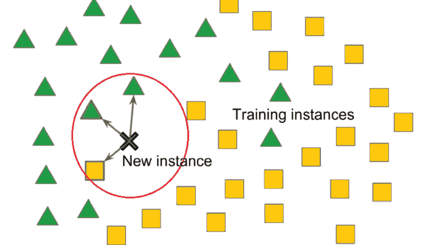

# 第七章：监督机器学习

在机器学习领域，监督学习是最常用且最有用的子领域之一。它通常是学生学习机器学习时接触的第一个领域，也是人们首次听到机器学习时所想到的，因为它涉及在标注或有标签的数据上学习，这类似于我们从正确的例子中学习。

监督机器学习的应用广泛多样。从邮箱中的垃圾邮件检测，到在你最喜欢的流媒体服务上推荐电视节目和电影的推荐系统，再到当银行的系统认为可能检测到欺诈交易时打来的电话，这些都是监督机器学习的应用。

本章将更详细地讨论训练和部署监督机器学习模型的步骤、一些核心的监督机器学习模型、训练和评估监督机器学习模型时需要考虑的因素，以及监督机器学习的应用。

本章涉及以下内容：

+   定义监督学习

+   监督学习中的步骤

+   回归和分类算法的特点

+   监督学习的应用

# 定义监督学习

在上一章所涵盖的基础上，我们将深入探讨监督学习。如前所述，监督学习涉及使用有标签数据训练模型，其中正确答案已经知道。这个过程类似于学生在知识渊博的老师指导下学习。

在商业背景下，假设你正在尝试根据历史数据预测未来的销售额。历史销售数据以及影响销售的因素（如营销支出、季节性等）构成了你的标注数据。你的机器学习模型从这些数据中学习，以预测未来的销售情况。

在深入了解监督机器学习的过程以及不同的监督学习算法之前，我们先来看看一些常见的应用。

## 监督学习的应用

监督学习在各行各业中都有广泛的应用，以下是一些示例：

+   **消费品** **与零售**：

    +   **需求预测**：零售商可以利用监督学习来预测产品需求。通过在历史销售数据上训练模型，数据包括产品特征、店铺位置、促销活动以及天气和假期等外部因素，再结合相应的销售数据，模型可以学习影响需求的模式。这使得零售商能够优化库存管理，减少缺货现象，并提高供应链效率。

+   **金融服务**：

    +   **信用风险评估**：金融机构可以使用监督学习来评估贷款申请人的信用状况。通过训练一个模型，使用历史贷款还款数据，以及相关特征如信用评分、收入和就业状况，模型可以学习预测申请人违约的可能性。这帮助机构做出明智的贷款决策并管理风险。

+   **公用事业**：

    +   **客户流失预测**：公用事业公司，如电力、燃气和水务公司，以及电信和宽带公司，可以使用监督学习来预测哪些客户可能会流失（即，转向竞争对手）。通过训练一个模型，利用历史客户数据，包括使用模式、客户服务互动和人口统计信息，以及流失标签，模型可以识别出流失风险较高的客户。这使得公司能够主动提供个性化的激励措施，如折扣或忠诚奖励，或根据识别出的流失驱动因素改善其服务的针对性方面，从而减少客户流失。

## 监督学习的两种类型

监督学习可以进一步分为两大类：**回归分析**和**分类分析**。它们之间的关键区别在于预测的输出类型。

### 回归分析

回归分析用于当输出变量是连续值时。目标是根据输入特征预测一个数值。以下是一些例子：

+   **销售预测**：公司可以利用回归分析，根据历史销售数据、营销支出和经济指标来预测下一个季度的销售数据。该模型学习这些输入特征与连续输出变量（销售数据）之间的关系。

+   **房价预测**：房地产公司可以使用回归分析，根据房屋的特征如建筑面积、卧室数量、位置和房龄来预测房价。模型通过过去的房产数据来估算连续的输出变量（房价）。

### 分类分析

分类分析用于当输出变量是分类值时。目标是预测输入属于哪个类别。以下是一些例子：

+   **人才招聘**：人力资源部门可以使用分类分析来筛选和甄选求职者。该模型通过训练过去申请人的数据集，包括他们的简历、资格和面试表现，以及招聘决策标签。根据新申请人的信息，模型可以预测他们是否有可能被接受为该职位，从而简化招聘流程。

+   **调查欺诈检测**：在市场研究调查中，尤其是在线提供的调查中，常常会出现大量的欺诈性回答，因为虚假的受访者试图通过填写调查来获取奖励，而不提供准确的答案。为防止这种情况，可以使用监督学习来分类和筛选欺诈性回答，关注的方面包括回答调查所花费的时间、选择的答案，甚至是 IP 地址的地理位置。

## 监督学习中的关键因素

正如我们在上一章中提到的，训练机器学习模型时有许多因素和风险需要考虑。像偏差-方差权衡、训练数据量、输入空间的维度以及目标值中的噪声等因素在监督学习中起着至关重要的作用。我们来探讨这些因素如何具体影响监督学习算法。

### 偏差-方差权衡——平衡简单与复杂

在监督学习中，重要的是找到模型过于简单（高偏差）和过于复杂（高方差）之间的平衡：

+   一个过于简单的模型可能会忽略数据中的重要模式，而一个过于复杂的模型可能会记住噪声和不相关的细节

+   目标是找到一个能捕捉潜在模式的模型，而不是被随机波动过度影响

### 训练数据量

+   用于训练模型的数据量对其表现**至关重要**。

+   一般来说，更多的训练数据能帮助模型更好地学习，并做出更准确的预测。

+   然而，还需要考虑数据点数量与输入变量（特征）数量之间的关系。如果特征的数量过多，而数据点的数量过少，模型可能会变得过于复杂，并且在新的、未见过的数据上表现不佳。

### 输入变量的数量

+   输入变量的数量，也称为特征或属性，可能会影响模型的性能

+   当处理大量输入变量（高维数据）时，模型变得更加复杂，可能需要更多数据才能有效学习

+   在这种情况下，诸如变量选择或维度缩减等技术可以用来识别最重要的变量并简化模型

### 目标数据的质量

+   用于训练的标注数据的质量对模型的表现至关重要

+   如果目标数据包含错误或不一致（噪声），它可能会在学习过程中误导模型，从而导致不准确的预测

+   数据清洗和异常值检测等技术有助于提高目标数据的质量，从而提升模型的性能

总结来说，在实施监督学习时，重要的是要考虑模型简洁性与复杂性之间的权衡，训练数据的数量和质量、输入变量的数量以及目标数据中的噪声存在。通过仔细管理这些因素，企业可以开发出有效的监督学习模型，做出准确的预测并支持决策。

# 监督学习中的步骤

在本节中，我们将更详细地探讨监督学习中的所有步骤。从数据准备到模型部署，我们将逐步介绍每个阶段，并提供见解和示例。

## 数据准备——奠定基础

任何监督学习项目的成功都取决于数据的质量。数据准备是一个重要的第一步，涉及以下内容：

+   **数据清洗**：识别并纠正错误、不完整或不一致的数据点，以确保数据集的完整性。

+   **特征选择**：选择对模型预测能力贡献最大的、最具信息量和相关性的属性，同时丢弃无关或冗余的特征。

+   **数据转换**：将原始数据转换为可以有效地被机器学习算法处理的格式。这可能涉及到数值特征的缩放、类别变量的编码或处理缺失值。

**示例**：一家零售公司在准备客户购买数据时，可能会清理不一致之处，选择关键特征，如购买历史和人口统计数据，并将它们转换为数值表示。

## 算法选择——选择合适的工具

由于有许多监督学习算法可供选择，选择最合适的算法至关重要。选择取决于问题的性质：

+   **回归算法**：用于预测连续目标变量。常见的选择包括线性回归、多项式回归、岭回归和套索回归。

+   **分类算法**：用于预测类别目标变量。常见的选择包括逻辑回归、**支持向量机**（**SVM**）、**k-近邻**（**k-NN**）、决策树和随机森林。

**示例**：一家房地产公司可能会使用回归算法，根据地点、面积和房产年龄等特征预测房价，而一家营销公司则可能使用分类算法，基于人口统计和互动数据预测客户行为。

## 模型训练——从数据中学习

一旦选择了算法，就该使用准备好的训练数据来训练模型了。这一步骤包括将输入特征和相应的目标值喂给算法，让它学习潜在的模式和关系。

在训练过程中，算法会迭代调整其内部参数，以最小化预测值与实际目标值之间的差异。这一过程使得模型能够捕捉输入与输出之间复杂的映射关系。

## 模型评估 – 评估性能

在部署您的训练模型之前，评估其性能至关重要。此步骤帮助您了解模型对未见数据的泛化能力，并确定改进的潜在领域。

+   **回归指标**：**平均绝对误差**（**MAE**）、**均方误差**（**MSE**）和**均方根误差**（**RMSE**）常用于衡量预测值与实际值之间的平均差异。

+   **分类指标**：准确率、精确率、召回率和 F1 分数提供了关于模型在不同类别中正确分类实例能力的见解。

通过在独立的验证集上评估您的模型，您可以评估其性能，并对进一步的改进或参数调整做出明智的决策。

## 预测和部署 – 将模型投入实际运行

一旦您对模型的性能有信心，就可以将其部署用于真实世界的预测。这一步骤涉及将训练好的模型集成到您的应用程序或系统中，使其能够基于新的、未见过的输入数据生成预测。

**示例**：一家消费品公司可以利用训练好的销售预测模型，基于市场支出、季节性和竞争对手活动等因素来预测未来需求，从而实现积极的库存管理和资源配置。

通过仔细遵循数据准备、算法选择、模型训练、评估和部署的关键步骤，您可以充分发挥监督学习的潜力。

在接下来的章节中，我们将深入探讨监督学习的特定算法，包括回归和分类算法。我们将探讨它们的特征以及它们如何分别用于预测连续和分类数据。

# 回归和分类算法的特征

在本节中，我们将探讨一系列不同的回归和分类算法的特性。我们将探索它们的实际应用以及它们如何用于推动各个行业的决策制定。

## 回归算法

我们已经涵盖了回归，这是监督机器学习的一种形式。当输出或目标变量是连续或数值时，使用回归算法。它们主要用于预测、预测趋势和确定变量之间的关系。除了我们已经介绍的普通最小二乘回归之外，还有其他更先进的回归变体。这些变体可以用来考虑变量之间的不同交互作用，或者通过应用所谓的**正则化**来减少过拟合。

### 多项式回归

**多项式回归**通过增加额外的预测变量来扩展线性回归，这些变量是通过将每个原始预测变量提升到一个幂次得到的——例如，x²或 x³。这为拟合数据提供了更广泛的函数范围。

在市场研究中，多项式回归可以捕捉输入变量与销售之间的非线性关系。例如，它可能揭示销售额随着广告支出的增加而增加，直到某个临界点，但超过该阈值后会趋于平稳或下降，从而帮助优化预算分配。

图 7.1：多项式回归

以这张多项式回归图为例，该图已经拟合了一组数据点。请记住，在普通最小二乘回归中，我们只能拟合出数据点之间的线性直线关系。然而，多项式回归使我们能够建模更复杂的变量关系，这些关系可能不像前面的例子那样简单、线性。

### 岭回归

在回归分析中，通常会有许多输入变量需要考虑，这可能导致过拟合等问题，或者出现**多重共线性**的问题，即输入变量之间存在高度相关性。这会导致模型推断的可靠性降低。

为了应对这个问题，存在不同形式的“正则化”回归方法，它们通过在回归方程中加入额外项来帮助减轻上述问题。

**岭回归**是一种正则化方法，用于分析受多重共线性影响的多元回归数据——当预测变量之间高度相关时。通过在回归估计中加入一定的偏差，岭回归可以减少标准误差。这在零售业中可能很有用，比如在考虑到不同广告渠道之间的多重共线性时，了解广告支出与销售额之间的关系。

### 套索回归

**套索**（**最小绝对收缩与选择算子**）**回归**是另一种线性回归的正则化技术，它允许在回归模型中选择变量，使得并非所有输入变量都对结果变量产生影响。这可以减少过拟合的可能性，尤其在处理高维数据时特别有用。在消费品行业中，套索回归可以用来预测需求，根据多个因素进行预测，同时避免过拟合。

图 7.2：正则化回归（例如，岭回归/套索回归）

## 分类算法

分类算法用于输出或目标变量是分类的或离散的情况。它们主要用于将数据分类为特定的组。

### 支持向量机（SVM）

支持向量机（SVM）是一种强大的分类算法，它通过寻找最佳超平面来分离不同的类别。它在高维空间中尤其有效，适用于维度数量超过样本数量的情况。在营销领域，SVM 可用于将客户细分为不同群体，以便进行定向广告。

图 7.3：支持向量机

### k-NN

k-NN 是一种简单、易于理解的算法，它根据邻近点的分类来对数据点进行分类。它广泛用于初步研究中，以便从数据中获得洞察。例如，在零售业中，k-NN 可用于预测客户是否会根据相似客户的行为进行购买。

图 7.4：k-NN

### 决策树与随机森林

决策树根据某些条件控制语句将数据划分为多个子集。它们易于理解和解释，非常适合用于探索性研究。随机森林是一种决策树的集成方法，可以提高预测准确性。在消费品行业，这些算法可以用于预测一个新产品是否会成功，基于价格、营销支出和竞争等特征。

图 7.5：决策树

以决策树为例，假设我们已将其拟合到数据上，预测一个患者是否患有较高或较低的 2 型糖尿病风险。我们可以看到，决策树可以基于它所训练的变量（例如年龄——他们是否大于或小于 45 岁？以及是否超重或是否有直系亲属患有 2 型糖尿病）来划分人群。这是一个简单的例子，但它说明了如何通过决策树进行预测。

## 监督学习中的关键考虑因素

在应用这些算法时，考虑诸如偏差-方差权衡、训练数据量、输入空间的维度以及目标值中的噪声等因素非常重要。在偏差和方差之间取得平衡，确保模型既不太简单（欠拟合），也不太复杂（过拟合）。拥有足够的训练数据、管理高维输入空间以及处理目标值中的噪声也是构建稳健模型的关键。

## 评估指标

评估指标在评估监督学习模型的性能中发挥着至关重要的作用。虽然上一章介绍了一些常见的指标，现在我们来探索它们在监督学习中的具体应用：

+   **回归评估指标**：

    +   **MAE**：MAE 衡量预测值和实际值之间的平均绝对差异。它提供了对模型的平均预测误差的清晰解释，单位与目标变量相同。

    +   **均方误差（MSE）**：MSE 计算预测值与实际值之间的平均平方差。它强调较大的误差，并对异常值敏感。对 MSE 取平方根得到 RMSE，它与目标变量的单位相同。

    +   **R 方**：R 方表示从输入特征中可以预测的目标变量方差的比例。其值范围从 0 到 1，值越高，表明模型对数据的拟合度越好。

+   **分类指标**：

    +   **准确率**：准确率衡量的是正确预测与总预测之间的比例。它是一个简单直观的指标，但在处理类别不平衡时可能会产生误导。

    +   **精确率**：精确率表示的是所有模型预测为正的结果中，实际为正的比例。它侧重于模型避免假阳性的能力。

    +   **召回率（敏感性）**：召回率衡量的是所有实际正例中被正确预测为正例的比例。它强调模型正确识别正例的能力。

    +   **F1 分数**：F1 分数是精确率和召回率的调和平均数。它提供了一个平衡的模型性能衡量，尤其在处理不平衡类别时尤为有效。

    +   **ROC 曲线下面积**（**AUC-ROC**）：AUC-ROC 评估模型在不同概率阈值下区分各类别的能力。它在需要根据具体问题要求调整决策阈值时尤为有用。

通过理解和应用这些评估指标，企业可以获得有关其监督学习模型性能的宝贵见解，识别改进领域，并根据模型预测做出明智的决策。

# 监督学习的应用

监督学习已经在多个行业中得到了应用。它使得许多企业能够基于历史数据预测未来的结果。接下来我们将探索更多监督学习算法在不同行业中的实际应用案例。

## 消费品

在消费品行业，监督学习正在被应用于各种场景：

+   **消费者趋势识别**：通过分析来自电子商务平台、社交媒体、搜索引擎、销售数据和调查的数据显示，公司可以识别新兴的消费者趋势——例如，预计将来会增长的流行产品类别、成分、口味和声明。这有助于开发新产品或对现有产品进行调整，以更好地符合消费者的偏好，从而可能提高收入。

+   **价格优化**：通过考虑历史销售数据、竞争者定价和市场营销活动等因素，公司可以确定其产品的最佳定价，以最大化利润。

## 零售

在零售行业，监督学习正在改变业务的各个方面：

+   **产品推荐**：通过分析顾客的购买历史和产品相似性，零售商可以推荐可能吸引特定顾客的产品，从而潜在地提高销售额和顾客忠诚度。

+   **顾客反馈分类**：通过对来自各种渠道（如呼叫中心、社交媒体和网站表单）的顾客反馈进行分类，零售商可以识别常见问题和顾虑。这些信息可以用来优先处理客户服务工作，并解决需要改进的领域。

+   **需求预测**：通过分析历史销售数据，零售商可以预测未来产品的需求。这有助于优化库存管理，减少缺货或过剩库存，并提高整体运营效率。

+   **劳动力优化**：通过预测顾客流量和销售模式，零售商可以优化员工排班，确保在高峰时段有足够的人员覆盖，同时在较慢的时段减少劳动力成本。

## 制造业

监督学习正在通过多种方式改变制造业：

+   **预测性维护**：通过分析设备的传感器数据，监督学习算法可以预测机器可能出现故障的时间，从而实现主动维护并减少停机时间。

+   **质量控制**：通过分析产品数据并识别模式，监督学习可以帮助检测生产过程中的缺陷或异常，从而确保更高的产品质量并减少浪费。

这些只是监督学习在几个主要行业中应用的一些例子，它们帮助推动了商业价值。

思考在你感兴趣的行业中，监督学习的潜在应用场景。是否有现成的、常见的监督学习应用场景，其他公司已经成功地在你的行业中应用？

在评估组织内潜在的应用场景时，清晰地理解预期的收益和实施成本非常重要。通过明确的价值主张，监督学习可以帮助转变这些行业的各个方面，并推动成功的结果。

**来源**：[`www.qualifai.co.uk/post/ai-use-cases-in-consumer-goods-retail`](https://www.qualifai.co.uk/post/ai-use-cases-in-consumer-goods-retail)

# 总结

在这一章中，我们探讨了监督学习在各个行业中的应用，了解了监督学习的步骤，讨论了重要的注意事项，并简要介绍了不同的算法和评估标准。

通过这些知识，你现在已经具备了在业务中利用监督学习的能力。

但请记住，旅程并没有到此为止。在下一章中，我们将深入探讨无监督学习——机器学习的另一个令人兴奋的领域。
