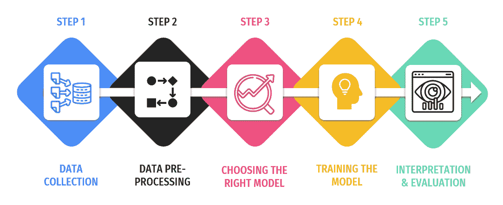
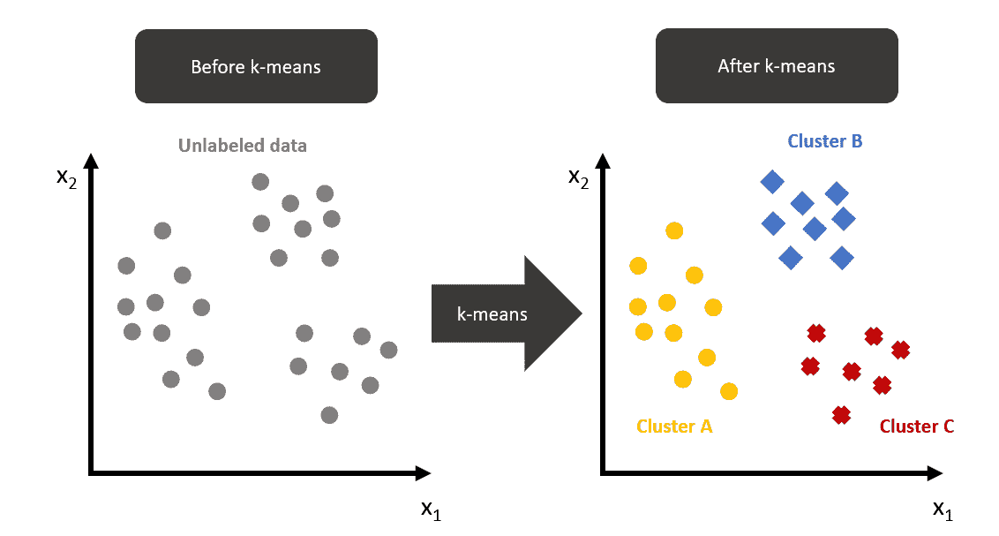
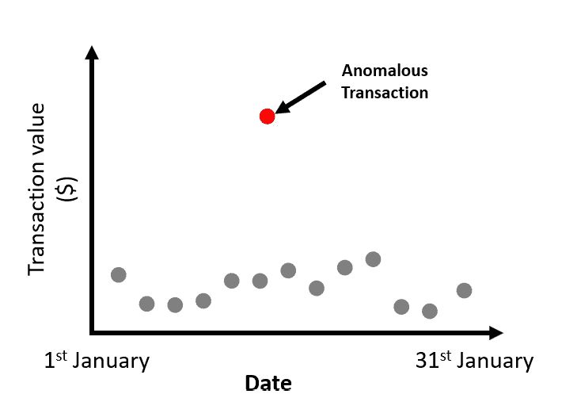

# 第八章：无监督机器学习

与更熟悉的**监督学习**（**SL**）不同，那里的数据已经整齐地标记，并且学习路径是预定义的，**无监督学习**（**UL**）则涉足未标记数据的领域，提供了发现隐藏模式和洞见的机会。

本章深入探讨 UL 领域，我们将学习一些 UL 的实际例子，UL 涉及的关键步骤以及聚类、异常检测、降维和关联规则学习等技术。

本章涵盖以下主题：

+   定义 UL

+   UL 中的步骤

+   聚类 - 揭示数据中的隐藏模式

+   关联规则学习

+   UL 的应用

# 定义 UL

UL 是一种**机器学习**（**ML**）类型，可以在没有任何先验训练的情况下发现数据中的模式。与其对应的 SL 不同，SL 中的模型使用标记数据进行训练，UL 算法处理未标记数据。其目的是对数据中的潜在结构或分布进行建模以了解更多信息。

想象一下，它就像一名侦探走进了一个犯罪现场，没有初始线索或嫌疑人。侦探的任务是揭示模式，找到隐藏的群体，或者建立场景中不同元素之间的关系。

## UL 的实际例子

为了使这个概念更具体化，让我们看一些实际例子：

+   **市场研究**：一家公司希望更好地了解其客户群体，并根据不同的消费者细分来定制其营销策略。他们拥有大量的数据（例如客户数据或消费者调查数据），但没有具体的类别或标签。UL 可以帮助识别客户群体中的不同组或细分。公司可以更好地了解这些不同细分的人口统计学、行为和观点，从而制定更有针对性的营销策略。

+   **消费品和零售**：一家电子商务店铺希望了解其客户的购买行为。使用 UL，他们可以发现不同产品之间的关联。例如，他们可能发现购买某个品牌遥控器的客户也购买某种电池类型和包装规格，从而使电子商务店可以自动推荐消费者可能添加到订单中的商品。

+   **供应商绩效分析**：通过基于供货时间、货物质量、成本、客户支持和可靠性等绩效指标对供应商进行聚类，公司可以了解其供应链的优势和劣势。这有助于做出关于优先考虑哪些供应商或重新评估供应商的决策。

UL 是一种强大的工具，可以揭示数据中的隐藏模式和关联。它就像是你团队中的侦探，能够理解看似无关的信息。无论您是希望更好地了解您的客户、优化营销策略还是发现新机会，UL 都能提供宝贵的洞见。

现在我们已经对 UL 有了清晰的理解，接下来让我们更深入地探讨这个过程。在接下来的部分中，我们将探索 UL 中的各个步骤，从数据收集到结果解释。

# UL 中的步骤

UL 是一种机器学习方法，它允许我们从没有标记响应的输入数据集得出推论。与 SL 不同，SL 有明确的目标或结果需要预测，而 UL 更侧重于发现数据中的隐藏模式和结构。那么这个过程是如何工作的呢？让我们将其拆解为易于理解的步骤：

图 8.1：无监督机器学习（UML）涉及的步骤

注

尽管图表呈现的是线性流程，但在实际操作中，这些步骤可能并不总是严格按照线性顺序进行。在整个过程中，数据评估等过程中获得的见解，可能会影响数据处理或模型选择的迭代和改进。

## 第一步 – 数据收集

与任何其他机器学习项目一样，UL（无监督学习）从数据收集开始。这可能是零售公司客户数据、医疗组织患者数据或科技公司用户行为数据。关键是收集尽可能多的相关数据，以帮助模型学习并做出准确的预测。

## 第二步 – 数据预处理

一旦数据收集完成，接下来需要对数据进行清洗和预处理。这一步包括处理缺失值、去除异常值和数据规范化。这一步非常重要，因为数据的质量直接影响模型学习的效果。

## 第三步 – 选择合适的模型

预处理之后，下一步是选择适合你数据的模型。有多种 UL 算法，例如 k 均值聚类、层次聚类和**基于密度的空间聚类（DBSCAN）**。模型的选择取决于当前的问题和数据的特性。

## 第四步 – 训练模型

现在进入激动人心的部分——训练模型。在这一过程中，模型通过没有监督的情况下学习识别数据中的模式和结构。例如，在市场调研的背景下，一个 UL 模型可以根据购买行为识别客户群体中的不同细分市场。

## 第五步 – 解释与评估

最后一步是解释结果并评估模型的性能。与有监督学习（SL）一样，无监督学习模型的性能也可以通过评估指标来评估。在 UL 中，评估指标可能有些棘手，因为我们没有明确的目标来与预测进行比较。然而，可以使用诸如轮廓系数（Silhouette Score）或**戴维斯-博尔丁指数**（**DBI**）来评估聚类质量。

在商业环境中，解释同样重要。例如，在零售环境中，了解不同客户细分的特征可以帮助为每个细分市场量身定制营销策略，最终提升销售额和客户满意度。

## 总结

到现在为止，您应该对无监督学习中的步骤有了一定了解，并知道它如何应用于商业背景。但我们仅仅是在表面上做了些探索。接下来，我们将深入探讨无监督学习中最常见的技术之一——聚类。敬请关注！

在下一节中，我们将深入探讨聚类算法的世界，了解它们如何工作、它们的应用以及如何将它们用于推动商业决策。

# 聚类——揭示数据中的隐藏模式

聚类是无监督学习工具包中的一项强大工具。那么它究竟是什么，又如何帮助商业决策者呢？让我们一起深入了解。

## 什么是聚类？

聚类是一种无监督学习（UL）方法，通过根据数据点的相似性将其分组。与有监督学习（SL）不同，后者有明确的目标或结果变量，UL（以及聚类）则完全是通过在没有预定义标签的情况下寻找数据中的隐藏结构和模式。

把聚类看作是一种发现和探索数据中未知领域的方法。这就像一个探险家在没有地图的情况下出发，只凭借他们的观察力去理解周围的景观。

## 聚类是如何工作的？

聚类过程涉及几个步骤：

1.  **特征选择**

    在此步骤中，您选择您认为有助于区分不同群体的数据特征或属性。例如，如果您正在对客户进行聚类，您可能会选择年龄、收入和购买历史等特征。

1.  **距离度量**

    +   要将相似的数据点聚集在一起，您需要定义“相似”的含义。这是通过衡量数据点之间的“距离”或“差异”来实现的。

    +   一种常见的距离度量是欧几里得距离，即两点之间的直线距离。您可以把它想象成“鸟飞直线”的距离，而其他的距离度量，如曼哈顿距离或余弦相似度，则考虑数据的不同方面。余弦距离是两点之间夹角的余弦值。

1.  **聚类算法**

    +   一旦有了特征和距离度量，您就可以应用聚类算法将相似的数据点分组在一起。

    +   不同的算法对簇的结构做出了不同的假设。以下是一些示例：

        +   k-means 算法试图将 n 个观测值分成 k 个簇，其中每个观测值属于离其最近均值的簇。

        +   层次聚类通过合并簇（聚合方法）或通过将数据集划分为更小的簇（分裂方法）来构建簇的层次结构。

        +   DBSCAN 将紧密聚集在一起的点分为一组，并将处于低密度区域的点标记为异常值。

1.  **评估**

    +   聚类后，您需要评估簇的质量。这有助于确定您的聚类是否合理，并且对您的问题有用。

    +   如 Silhouette Score 这类度量标准衡量一个对象与其所在聚类相比，与其他聚类的相似度。较高的轮廓系数表明该对象与其所属聚类匹配得较好，而与邻近聚类的匹配较差。

    +   **邓恩指数**（**DI**）是另一个度量标准，它衡量最小的聚类间距离与最大的聚类内距离之间的比例。较高的 DI 值表示聚类效果更好。

记住——聚类是一种探索性技术。它可以帮助发现数据中的模式和结构，这些模式和结构你之前可能未曾意识到。尝试不同的特征、距离度量和算法，看看你能在数据中发现什么见解。

## k-means 聚类

这里是一个名为 k-means 的聚类算法的示例：

图 8.2：k-means 聚类

在前面的图示中，我们来看看 k-means 过程前后每一侧的变化。

**k-means 之前（**左侧）：

在这一侧，在执行 k-means 聚类之前，数据点分布在由 x1 和 x2 轴定义的二维空间中。这些轴可以是变量，比如顾客在商店的总消费（x1）和访问次数（x2）。

在这个阶段，数据是没有标签的，意味着我们尚不知道每个数据点属于哪个聚类。

**k-means 之后（**右侧）：

在 k-means 聚类之后，数据点已根据它们之间的相似度分组为不同的聚类。这些聚类可以为数据中的潜在模式提供信息。

### k-means 聚类过程

要执行 k-means 聚类，我们需要选择希望在数据中识别的聚类数量。假设我们已经将数据可视化，并决定 *k*=3，这意味着我们希望找到三个聚类。

k-means 算法遵循以下步骤：

1.  **初始化**：从数据中随机选择 *k* 个点作为初始质心（每个聚类的中心）。

1.  **分配步骤**：根据数据点与质心之间的距离，将每个数据点分配给最近的质心。

1.  **更新步骤**：通过取分配给该聚类的所有点的均值，重新计算每个聚类的质心。

1.  重复 *步骤 2* 和 *3*，直到质心不再显著移动，或达到最大迭代次数。这表示聚类已经稳定。

应用 k-means 算法后，数据点根据它们所属的聚类被赋予不同的颜色。在这个例子中，已经识别出三个聚类：聚类 A、聚类 B 和聚类 C。

k-means 算法广泛使用，因为它相对简单且高效。然而，它假定聚类是球形且大小均匀的，而在真实数据中这种情况并非总是成立。此外，需要事先指定聚类数 k，如果不知道最佳聚类数可能会成为一个缺点。尽管存在这些局限性，k-means 仍然是探索性数据分析（EDA）和各个领域模式识别的强大工具，我们将在接下来的部分中详细探讨。

## 聚类的实际应用

聚类在各行业中有广泛应用：

+   **保险业中的风险评估**：在保险行业，聚类算法可以根据各种风险因素对保单持有人进行分组。例如，聚类可以识别汽车保险中具有相似驾驶习惯的个体群体或寿险中的健康档案。这种分段允许保险公司根据风险水平更准确地制定其保单和定价策略，从而实现更高效的风险管理和定价策略。

+   **公用事业中的能耗分析**：公用事业公司可以使用聚类分析客户的能源使用模式。通过根据客户的消费模式、高峰使用时间和季节变化将客户分组成簇，公用事业公司可以更好地理解需求，规划能源分配，甚至设计定制的节能计划。这还有助于确定需要基础设施改进或能源节约措施最有效的地区。

+   **数字媒体中的内容个性化**：在数字媒体和娱乐行业，聚类用于分析用户的偏好和观看习惯。通过根据用户与不同内容类型（如电影、音乐或文章的流派）的互动情况对用户进行聚类，媒体公司可以提供个性化的内容推荐。这不仅增强了用户体验，还增加了用户的参与度，潜在地增加了订阅保持率。

## 聚类评估指标

作为决策者，了解您的聚类模型表现如何非常重要。以下是一些需要考虑的度量标准：

+   **轮廓系数**：轮廓系数度量了数据被分组成簇的好坏程度。它的取值范围是从-1 到 1。接近 1 的分数意味着数据点与同一聚类中的其他数据点非常相似，但与其他聚类中的数据点不相似，这是理想的情况。本质上，它衡量了每个数据点属于其所在聚类的适当程度：分数越高，每个数据点在自己的聚类中的适应度就越好，而不是其他聚类。这一分数有助于验证数据簇内的一致性，并可用于通过比较不同聚类数的分数来确定最佳聚类数。

+   **DI**：DI 是一个更细致的聚类质量衡量标准，它同时考虑了聚类的紧凑性和聚类之间的分离度。它通过检查不同聚类中点之间的最小距离以及同一聚类中点之间的最大距离来完成这一点。较高的 DI 值表明聚类更加紧凑（数据点聚集得更紧密）且分离良好（每个聚类之间的距离较远）。这个指标尤其适用于你希望确保聚类之间具有明显区别的同时，聚类内部也具有一致性。

请记住——选择度量标准应与你的商业目标相一致。例如，如果你的目标是为精准营销创建高度独特的客户细分群体，那么较高的轮廓系数将是一个理想的选择。

## 总结

聚类是一种强大的无监督学习技术，可以揭示数据中的隐藏模式和结构。通过了解其过程和应用，你可以利用它的力量做出更有根据的商业决策。

在下一节中，我们将探讨另一种关键的无监督学习技术：关联规则学习。这种方法可以帮助你发现大数据集中变量之间有趣的关系——这是任何数据驱动决策者的重要技能。

# 关联规则学习

假设你在超市购物，注意到购买尿布的人通常也会购买啤酒。这不是一个随机的观察，而是一个强大的无监督学习（UL）技术——关联规则学习的结果。它揭示了大数据集中的隐藏模式，使企业能够做出基于数据的决策。

## 什么是关联规则学习？

关联规则学习是一种机器学习方法，它识别出一组项目中经常出现的“如果-那么”关系，称为“规则”。就像是找出通常一起购买的产品之间的关系。这些规则可以用来预测未来的行为，从而帮助企业有效地制定营销策略。

## Apriori 算法——一个实际的例子

在关联规则学习中，最常用的算法之一是 Apriori 算法。让我们通过一个实际的例子来解析它是如何工作的。

假设你是零售店的决策者，你希望了解客户的购买模式，以优化产品陈列并提升销售。以下是如何使用 Apriori 算法：

1.  **设置最小支持度** **和置信度**

    这些是 Apriori 算法中的两个关键指标。**支持度**衡量一个项目集在所有交易中的频率，而**置信度**衡量当购买项目 X 时，购买项目 Y 的可能性。

1.  **生成** **项目集**

    算法将首先创建一个符合最小支持度阈值的所有单个项目（项目集）列表。

1.  **创建规则**

    对于每个项目集，算法将生成符合最小置信度阈值的规则。

1.  **排名规则**

    规则随后按照提升度进行排序，提升度是另一项度量标准，用于衡量在购买了商品 X 后，购买商品 Y 的可能性有多大，相比于单独购买商品 Y。

通过遵循这些步骤，你可能会发现诸如{尿布} -> {啤酒}这样的规则，这表明购买尿布的客户也很可能购买啤酒。这一见解可以用于战略性地在商店中摆放商品，从而增加销售。

## 评估指标

在关联规则学习中，关键的评估指标是支持度、置信度和提升度。这些指标有助于识别最相关的规则。然而，重要的是要找到一个平衡点。高支持度可能导致显而易见的规则，而高置信度可能导致过于具体的规则。提升度则通过衡量规则的强度相对于项目集的随机发生来提供平衡。

## 总结

关联规则学习是 UL 工具包中的一项强大工具。它能够揭示大数据集中的隐藏模式，帮助企业做出战略决策。无论你是在零售、营销还是任何处理大数据集的行业，关联规则学习都能提供宝贵的洞察。

在下一节，*UL 的应用*中，我们将探讨 UL 的更多应用，深入了解这些技术如何在各种商业场景中发挥作用。

# UL 的应用

正如我们所讨论的，UL 是一种不需要明确监督的机器学习方法，用于识别数据中的模式。它就像一名侦探，来到犯罪现场时没有目击者，但仍然必须从现有证据中拼凑出事件的经过。那么，这种“侦探工作”在商业世界中有哪些应用呢？让我们来探索一下。

## 市场细分

UL 最常见的应用之一是市场细分。拥有多样化客户群的企业使用聚类算法，根据客户的行为、人口统计特征和购买历史将其分组。这使得他们能够针对每个群体量身定制营销策略，从而最大化参与度和转化率。

以一家拥有数百万客户的全球零售品牌为例。他们可以使用 UL 将客户分为不同的群体，比如“年轻专业人士”、“父母”或“退休人员”，每个群体都有不同的购物习惯和偏好。公司随后可以为每个群体制定个性化的营销活动，提高客户满意度和忠诚度。

## 异常检测

UL 在检测数据中的异常值或离群点方面也非常出色。这在金融和网络安全等行业尤为重要，因为识别不寻常的模式可以防止欺诈或安全漏洞。

例如，一家银行可以使用无监督学习来监控交易，并标记出那些显著偏离客户常规行为的交易，如下图所示。无监督学习算法可以通过测量数据点与其分配聚类中心的距离来识别异常。距离聚类中心较远的数据点被认为是异常值。这可能表示存在欺诈活动，促使银行采取预防措施：

图 8.3：金融交易异常检测

## 特征提取

无监督学习（UL）也可以用于特征提取，通过减少数据的维度简化复杂数据集。这可以使其他机器学习（ML）任务变得更加高效和准确。

例如，一家汽车制造商可能拥有关于每辆车的数百个特征数据。无监督学习可以识别出最重要的特征，这些特征影响汽车的性能或受欢迎程度，从而让制造商在设计和营销过程中重点关注这些特征。

# 总结

我们已经了解到，无监督学习是一个多功能的工具，可以从数据中揭示隐藏的洞察，并且适用于许多商业用例，例如市场细分、异常检测和特征提取。

通过掌握无监督学习的能力，决策者可以利用它来揭示有价值的洞察，简化流程，并做出影响底线的基于数据的决策。

在本章中，我们已经涵盖了无监督学习的基本概念，概述了其关键步骤，并探讨了它在现实世界中的一些常见应用。我们还讨论了如何评估无监督学习模型在商业环境中的表现。

在这基础的机器学习知识上，下一章将更深入地探讨机器学习模型的解释与评估策略，帮助你掌握有效沟通洞察和依据机器学习项目做出决策的工具。
