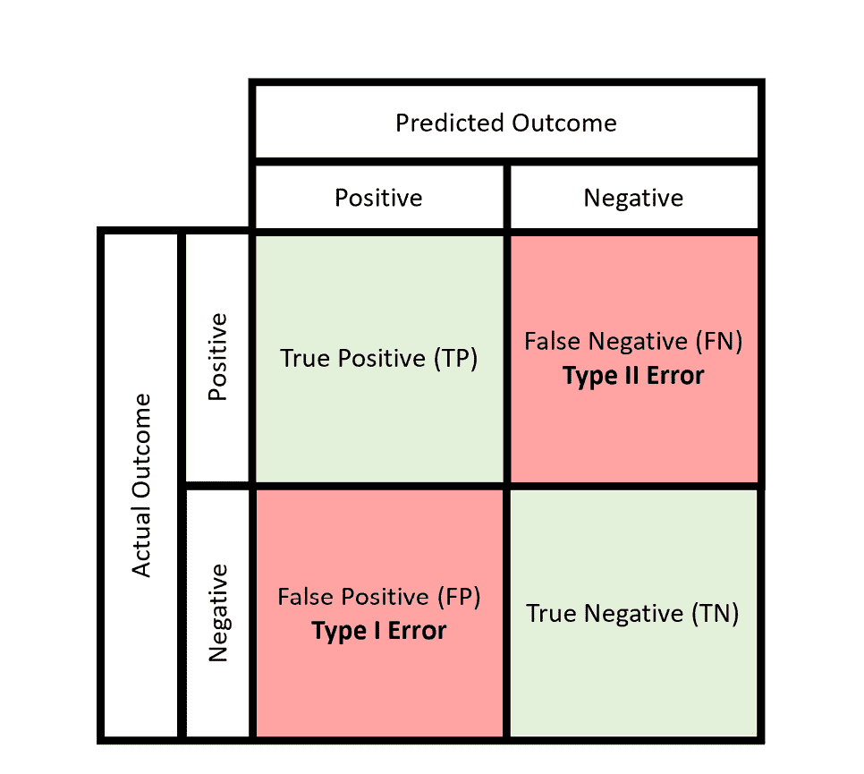
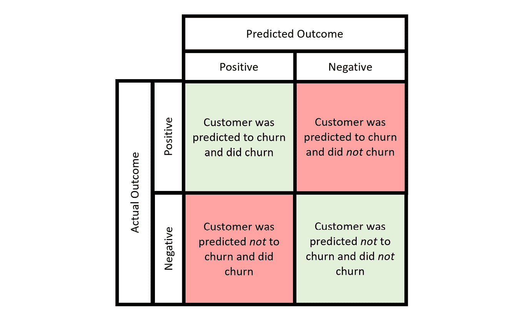
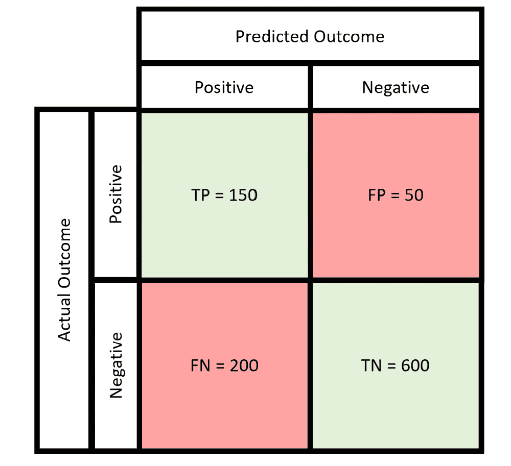
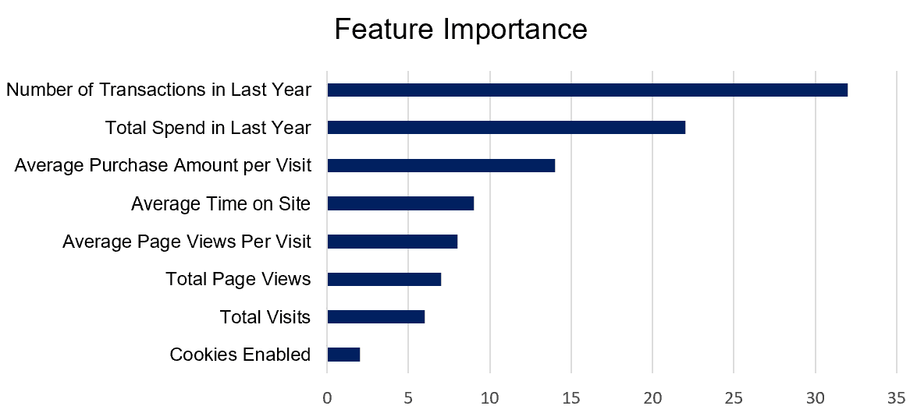
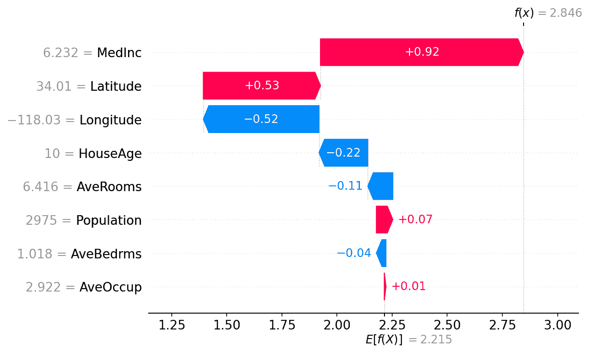

# 第九章：解释和评估机器学习模型

机器学习系统的承诺和潜力在于能够创建无需硬编码规则或启发式方法即可做出决策的系统，这是非常巨大的。然而，这个承诺往往并非那么简单，开发机器学习模型或领导开发团队时，需要非常小心，确保模型的准确性和可靠性。

在本章中，我们将探讨如何解释和评估不同的机器学习模型。

这是作为决策者，参与数据科学项目时，你能拥有的最重要的技能之一，甚至可能是最重要的技能。

尽管允许数据科学家自己评估模型并“批改自己的作业”可能很方便，但这是一个有风险的决定，最终不可避免地会导致问题。

本章内容包括以下主题：

+   我怎么知道这个模型是否准确？

+   理解评估指标

+   评估分类模型

+   解释机器学习模型的方法

# 我怎么知道这个模型是否准确？

作为决策者，你需要确保你所使用的机器学习模型能够提供可靠、准确的预测或洞察。然而，你如何才能确信呢？你应该使用哪些指标来评估你的模型？这些指标到底意味着什么？

让我们尝试理解评估机器学习模型时如何使用指标，并看看一些常见的例子。

## 在测试（留出）数据上评估

在我们深入了解不同类型的评估指标之前，你首先需要明白评估留出数据（即测试数据）的重要性。

模型评估的一个非常重要方面是使用留出数据（或测试数据）。这是模型在训练或验证过程中没有见过的数据子集。通过在留出数据上评估你的模型，你可以获得一个更真实的性能估计，反映其在现实世界中的表现。

这个测试数据应该遵循模型在实际生产环境中所遇到的数据分布。它不应当在训练过程中使用，甚至不能用来调整不同的模型超参数，并且需要小心避免数据在训练集和测试集之间，或者自变量与因变量（输出变量）之间泄漏。

只有通过一组好的测试数据，你才能准确评估模型，并对其在实际应用中的表现产生信心。

# 理解评估指标

在机器学习中，评估指标是用来量化模型预测质量的衡量标准。

如果能够正确理解和解释，它们可以为你提供一个衡量模型质量的标准，从而帮助你做出更明智的决策，判断是继续使用该模型，还是需要更多的工作来训练出一个更准确的模型。

机器学习中有许多评估指标，不同类型的机器学习模型需要不同的评估指标。

在考虑监督式机器学习时，我们在*第七章*中讨论过，模型分为两类：回归模型和分类模型，每种模型都有一套自己的评估指标。

首先，来看一些用于评估回归模型的常见指标。

## 回归模型评估

假设你是一个零售高管，正在预测下个季度的销售额。你已经为此目的建立了一个回归模型。那么，如何评估其准确性，以便你对下个季度的销售预测有一定信心呢？

三个常见的回归模型评估指标是 R-squared、**均方根误差** (**RMSE**) 和 **平均绝对误差** (**MAE**) 。我们将逐一讨论这些指标。

## R-squared

R-squared 指标，也称为决定系数，是回归分析中的一种统计度量，表示模型解释的因变量方差的比例。简单来说，它衡量了回归预测值与实际数据点的拟合程度。

### R-squared 公式

R-squared 的公式如下：

R² = 1 − SS res / SS tot

在这里我们看到以下符号：

+   SS res 是残差平方和，也叫做残差总和，衡量了模型预测的误差的变异性。

+   SS tot 是总平方和，衡量了因变量的总变异性。

平方和的计算如下：

+   SS res = ∑ (y i − ˆ y i )²

+   SS tot = ∑ (y i − _ y )²

在这些公式中，我们使用以下符号：

+   y i 是实际观察值

+   ˆ y i 是回归模型预测的值

+   _ y 是观察数据的均值

### 理解 R-squared

R-squared 为 1 表示回归预测完美地拟合了数据。

R-squared 为 0 表示模型没有解释响应数据围绕其均值的任何变化。

### R-squared 计算示例

假设你在一家零售公司工作，并且拥有一个包含你公司某一热销产品过去六个月销售量的月度数据集，以及该回归模型对这些销售量的预测数据：

观察数据 (y)：[725, 693, 654, 712, 722, 695]

预测数据 (ˆ y) ：[720, 695, 660, 715, 724, 698]

首先，计算观察数据的均值 (_ y )：

_ y = 725 + 693 + 654 + 712 + 722 + 695  ________________________ 6 = 700.17

接下来，计算 SS res 和 SS tot：

SS res = (725 − 720)² + (693 − 695)² + (654 − 660)² + (712 − 715)² + (722 − 724)² + (695 − 698)² = 87

SS tot = (725 − _ y )² + (693 − _ y )² + (654 − _ y )² + (712 − _ y )² + (722 − _ y )² + (695 − _ y )² = 3442.8

R² = 1 − 87 / 3442.8 = 0.97

所以，在这种情况下，我们的 R-squared 值大约为 0.97，表示回归模型可以解释 97%的观测数据。这是一个较高的值，表明模型对数据的拟合非常好（这可能是由于过拟合，后续章节将讨论）。

在解释 R-squared 值时，并没有普遍的“好”R-squared 值标准，但理解值越接近 1，模型对数据的解释越好，这有助于比较不同模型。

两个更易解释的评估指标是**RMSE**和**RAE**，我们现在将讨论它们。

## 均方根误差

RMSE 是回归分析中广泛使用的指标，衡量模型预测值与观测值之间的误差的平均大小。它提供了预测误差的标准差的估计。

与 R-squared 不同，RMS 误差（RMSE）提供了一个绝对的测量尺度，能够直接解释模型预测精度，单位是感兴趣变量的单位。它特别适用于评估预测模型的精度，并且对大误差敏感，使其成为评估模型性能的有用工具。

### RMSE 公式

计算 RMSE 的公式如下：

√  ____________  1 / n ∑ i=1 n (yi − ˆyi)²

我们看到以下符号：

+   n 是观测值的数量

+   yi 是实际观测值

+   ˆyi 是模型预测的值

这个公式有效地衡量了实际值与预测值之间平方差的平方根，提供了清晰的模型精度度量。

### RMSE 计算示例

继续使用 R-squared 示例中的零售商数据集，其中观测的月销售量（y）为[725, 693, 654, 712, 722, 695]，预测的销售量（ˆy）为[720, 695, 660, 715, 724, 698]，我们可以按以下方式计算 RMSE：

1.  计算实际值与预测值之间的平方差。

1.  计算这些平方差的平均值。

1.  对这个平均值取平方根，得到 RMSE。

让我们计算这个数据集的 RMSE。根据 R-squared 计算结果，我们知道实际值与预测值之间的平方差之和为：

SSres = ∑ (yi − ˆyi)² = 87

此外，我们知道观测值的数量是 n = 6（即 6 个月）。

将这些数值代入 RMSE 公式，我们可以得到如下结果：

RMSE = √  ____________  1 / n ∑ i=1 n (yi − ˆyi)²  = √  1 / 6 * 87  = 3.8

### 理解 RMSE 值

RMSE 值提供了对误差的平均了解，其单位与响应变量相同，因此更容易直观理解。较低的 RMSE 值表示模型与数据的拟合较好。

然而，像 R 方一样，RMSE 并没有绝对的“好”或“坏”阈值，因为它取决于数据的上下文以及其应用的具体领域。最好是进行比较性分析，以评估模型准确性的改进或跨不同模型或数据集的表现。

在我们的示例中，给定数据集的 RMSE 大约是 3.8。这意味着，平均而言，模型的预测与实际销售数据之间的差距为 3.8 单位。这看起来是一个非常准确的预测集合，但业务需求的背景以及它与其他模型的比较帮助我们更好地理解评估的准确性。

### 解释 RMSE 的实用提示

以下是一些解释 RMSE 的实用提示：

+   **比较分析**：使用 RMSE 来比较模型表现，特别是在调整模型或选择不同类型的模型时。

+   **单位敏感性**：记住 RMSE 对数据的尺度敏感，因此在解释时要考虑到你因变量的大小。

+   **与其他指标互补**：将 RMSE 与其他指标结合使用，如 R 方，以便更全面地了解模型的表现。虽然 RMSE 提供了响应变量单位内的准确性度量，R 方则提供了模型解释的方差的洞察。

现在，让我们考虑另一个回归模型评估指标：MAE。

## 平均绝对误差

MAE 是回归分析中用于量化预测值与实际观察结果之间误差平均大小的度量，且不考虑误差的方向。它计算预测值与实际值之间绝对差值的平均值，使其成为评估模型准确性的简单而清晰的指标。

### MAE 公式

计算 MAE 的公式如下：

MAE = 1 / n ∑ i=1 n |y i − ˆ y i|

如我们之前所见，以下适用：

+   n 是观察值的数量

+   y i 是实际观察值

+   ˆ y i 是模型的预测值

该公式强调误差的绝对值，从而将所有误差视为等权重，无论其方向如何。

### MAE 计算示例

继续使用之前为 R 方和 RMSE 计算所用的零售商示例，作为一个练习，你可以使用观察到的销售量数据（y）和预测数据（ˆ y）来计算 MAE，以便通过实际示例理解 MAE 是如何确定的。

提醒一下，差值的绝对值是该差值的正值。例如，|5 − 10| 的绝对值 = |− 5| = 5，另外，|7 − 4| 的绝对值 = |3| = 3。

该示例销售量数据及预测的 MAE 应该是这样的：

MAE = 3.5

看看你是否能利用先前提供的销售量值和预测来计算这个答案。

### 理解 MAE 值

MAE 提供了对平均误差大小的直观理解。较低的 MAE 值表明模型具有更好的预测精度。与 RMSE 不同，MAE 对异常值不太敏感，因为它在平均之前不会对误差进行平方处理。这一特点使得 MAE 在需要避免大误差的不成比例影响时尤其有用。

### 解读 MAE 的实用建议

以下是一些解读 MAE 的实用建议：

+   **误差解读**：使用 MAE 可以直接理解平均误差，其单位与数据相同。这使得它特别适合非技术型利益相关者。

+   **异常值敏感性**：考虑你的数据特性，判断是否需要强调或减少异常值的重要性。MAE 对所有误差一视同仁，使其成为对大误差具有鲁棒性的衡量标准。

+   **互补指标**：与 RMSE 一样，建议将 MAE 与其他指标一起使用，以全面了解模型的表现。MAE 在与 RMSE 结合使用时尤其有价值，因为这两个指标一起可以提供有关误差分布和异常值存在的洞察。

## 每个指标的使用时机和方法

现在我们已经了解了这些回归指标，值得讨论一下每个指标的使用时机以及它们如何互补：

**R 平方**：

**何时** **使用它**：

+   它非常适合评估模型的解释能力

+   它对于将模型的表现与基准模型或同一数据集上的其他模型进行比较非常有用

**如何** **使用它**：

更高的值（接近 1）表示拟合效果更好。

+   考虑将其与其他指标结合使用，以进行全面的模型评估

**RMSE**：

**何时** **使用它**：

+   它最适用于那些大误差特别不可接受的模型

+   它适用于在不同模型或模型版本之间进行比较，以评估预测精度的改进

**如何** **使用它**：

+   较低的值表示模型更准确

+   将其作为精度的主要指标，但要与 R 平方一起分析，以了解模型的拟合度和准确性

**MAE**：

**何时** **使用它**：

+   当你需要一个简单易懂的度量标准时使用它

+   在异常值存在但不应过度影响模型误差指标的情况下使用

**如何** **使用它**：

+   较低的值越好，表示预测值与实际值之间的契合度更高

+   考虑将 MAE 与 RMSE 结合使用，以便从多个角度了解误差分布并评估异常值的影响

## 实用的评估策略

以下是一些最受欢迎的策略：

+   **平衡方法**：利用这些指标的组合来获得模型性能的全面视图。R 平方提供了模型解释数据的能力的见解。RMSE 有助于识别错误的平均大小，并对较大错误施加惩罚。MAE 提供了一个简单的平均错误大小，方便了解典型错误的规模。

+   **情境解释**：始终将这些指标放在特定的业务或研究目标的背景下进行解释。一个良好的指标值在某个情境中可能是可接受的，但在另一个情境中可能不可接受，这取决于所需的精度或错误的成本。

+   **对比分析**：不仅要单独使用这些指标，还要在不同的模型或同一模型的不同迭代之间进行对比。这有助于选择最佳模型或优化模型以更好地达成目标。

+   **错误敏感性**：考虑预测任务的性质以及错误的后果。如果较大的错误问题更严重，那么 RMSE 将特别有用。如果一贯的错误，无论大小，都令人担忧，那么 MAE 将提供有价值的见解。

## 回归模型评估总结

通过合理利用 R 平方、RMSE 和 MAE，作为决策者，您可以在单一的准确性或拟合度维度之外，批判性地评估模型性能。这种多维度的评估方法使得回归模型的理解和评估更加细致，有助于选择、开发和优化模型，使其与特定的商业目标对齐。

现在我们已经了解了回归模型的评估指标，接下来我们将转向分类模型及其评估方法。

# 评估分类模型

假设您经营着一个拥有大量客户的业务，并且正在尝试预测哪些客户可能会在未来一年内停止使用您的服务。这是一个常见的二分类模型，称为客户流失模型；许多公司，无论是银行、电信公司、保险公司还是流媒体服务，都可以从了解哪些客户最有可能流失中受益，从而采取措施挽留这些客户。

例如，您可能已经在测试（留存）集上评估了您的客户流失模型的预测结果，比如上一年，您知道某个客户是否确实离开或留在公司。

重要说明

在这个例子中，我们将客户流失视为“正”结果，因为这是我们试图预测的结果（在此语境中，“正”或“负”与结果的情感或好坏无关）。

在评估模型预测结果时，您会观察到四种不同的结果类型：

+   **真正例**：真正例是指当我们的模型预测客户流失时，客户确实流失了（即，正确预测）。

+   **假阳性**：假阳性，也称为一类错误，是指我们的模型预测客户流失；然而，实际情况是客户**没有**流失。

+   **真阴性**：真阴性是指模型预测客户没有流失，实际情况也是客户没有流失（即另一个正确预测）。

+   **假阴性**：假阴性，也称为二类错误，是指我们的模型预测客户**没有**流失，但实际情况是客户确实流失了。

这四种结果中的每一种都能帮助我们了解模型（在测试集上的表现）在预测不同结果时的准确性。

我们可以使用不同的评估指标来计算这些结果的计数，稍后我们将展示这些指标。一种有用的方式是通过混淆矩阵来可视化分类结果：

图 9.1：二分类的混淆矩阵

为了加深我们对混淆矩阵的理解，接下来我们将把例子中的结果映射到混淆矩阵上：

图 9.2：客户流失二分类的混淆矩阵

从这些不同结果在测试（验证）数据集上的计数中，我们可以计算出有用的评估指标来评估机器学习分类模型。

让我们深入了解一些这些度量标准，并了解它们如何帮助我们理解模型的预测能力。

## 分类模型评估指标

首先，让我们考虑客户流失模型的例子。假设在我们的测试数据中，我们预测了 1,000 个客户的结果。在这些客户中，150 个被预测会流失，并且确实流失了（真阳性），而我们预测会流失的 50 个客户没有流失，仍然是客户（假阳性）。我们还预测了 600 个客户不会流失，结果他们确实没有流失（真阴性）。然而，我们预测不会流失的 200 个客户却流失了（假阴性）：

图 9.3：客户流失二分类的混淆矩阵结果

从这些值中，我们可以计算出几个有用的指标，帮助我们评估模型。让我们看看这些评估指标的一些内容。

## 精准度、召回率和 F1 分数

我们将首先查看的度量标准是精准度。

精准度让我们评估我们的模型在做正预测时的**精确度**。

更正式地说，精准度是正确预测的正例数量与分类模型所做的所有正预测数量之比。

它回答了这样一个问题：在所有被我的模型标记为正例的实例中，实际为正例的有多少？

### 精确度计算

计算精确度的公式如下：

精确度 =  真阳性（TP）  ____________________________ 真阳性（TP） + 假阳性（FP）

在我们的示例中，精确度的计算方式如下：

精确度 = 150 / (150 + 50) = 0.75

精确度的范围从 0 到 1，精确度为 1 表示模型在预测正向结果（即客户流失）时非常精准。在这里，精确度意味着当模型预测客户会流失时，实际上有四分之三的概率他们会流失。

### 理解精确度

精确度专注于模型在准确预测正类方面的表现。高精确度分数表示模型在其正类预测中的可靠性，即当它预测正向结果时，你可以相当有信心它的准确性。然而，精确度并没有考虑假阴性（实际上是正例，但被预测为负例），这部分会被另一个度量——召回率所涵盖，我们将在后续讨论。

### 何时使用精确度

下面是一些关于何时最好使用精确度的例子：

+   **高假阳性代价**：当假阳性的代价较高时，精确度尤其有用。例如，在电子邮件垃圾邮件检测中，要求高精确度，因为将重要电子邮件错误地标为垃圾邮件（假阳性）可能意味着错过关键信息。

+   **不平衡数据集**：在正例稀缺（不平衡数据集）的数据集中，精确度成为一个至关重要的度量，以确保模型做出的正向预测确实是正确的。

精确度是分类中的一个关键指标，帮助评估模型对正向预测的可靠性，在假阳性代价较大的情境下非常有用。

## 召回率

召回率，也称为敏感度或真正率，是一种关键的性能度量，用于分类任务中评估模型正确识别特定类别所有相关实例的能力。它在错过正例（假阴性）的代价较高的情况下尤为重要。

这是一个详细的解释：

召回率衡量的是模型正确识别的实际正例的比例。它回答了一个问题：在数据集中所有实际为正的实例中，有多少是被模型正确识别为正例的？

### 召回率公式

计算召回率的公式如下：

召回率 =  真阳性（TP）  ___________________________ 真阳性（TP） + 假阴性（FN）

在我们的示例中，召回率将根据以下方式计算：

召回率 = 150 / (150 + 200) ≈ 0.43

这意味着我们的模型正确识别的流失客户不到一半。

### 理解召回率

召回率关注模型在数据集中找到所有相关案例的能力。高召回率得分表示模型能够有效捕获大多数正类实例，最小化假阴性的数量。然而，它并未考虑负类预测的正确性，这一点由特异性来涵盖。

在我们这个例子中，可能召回率比精确度更重要，因为我们可能希望准确识别所有即将流失的客户，以便采取补救措施尝试挽留他们，即使这会导致一些潜在的假阳性。

在这种情况下，有时可以通过改变模型预测真假结果的**阈值**，以牺牲精确度为代价提高召回率，或反之亦然。

了解对于你的业务案例，哪一个更重要：减少假阳性（即提高精确度）还是减少假阴性（即提高召回率）是很重要的。

### 何时使用召回率

下面是一些适合使用召回率的例子：

+   **假阴性的高成本**：在一些情况下，召回率至关重要，尤其是当漏掉一个正类实例比错误地将负类实例识别为正类更为严重时。例如，在医学筛查疾病时，高召回率是必要的，以确保尽可能多地识别出阳性病例进行进一步检测。

+   **不平衡数据集**：在正类稀有的数据集中，最大化召回率可以确保模型不会忽视那些少数存在的正类实例。

+   **全面覆盖**：当目标是确保不漏掉任何正类实例，即使以增加假阳性为代价时，这个指标也很有用。

### 实际应用

虽然召回率是评估模型识别正类案例全面性的一个重要指标，但仅仅关注召回率可能会导致模型将过多实例分类为正类（高假阳性），从而降低精确度。这就是为什么召回率通常与精确度一起使用，以了解在捕获所有正类实例和正类预测的准确性之间的权衡。

召回率和精确度之间的平衡通过 F1-score 来量化，F1-score 提供了一个单一的指标，用来评估当召回率和精确度都被认为重要时的模型表现，我们现在就来看看。

## F1-score

F1-score 是一个有助于评估二分类模型的指标，尤其在精确度和召回率之间需要平衡的情况下特别有用。它在处理类别不平衡的数据集，或者当假阳性和假阴性的成本差异很大时，特别重要。

### F1-score 的定义

F1 分数是精度和召回率的调和平均数，提供了一个单一的度量，平衡了模型正确识别正例的能力（召回率）和这些正例识别的准确性（精度）。与算术平均数不同，调和平均数对较小的数值赋予更高的权重，这意味着 F1 分数会更多地受到较低精度或召回率的影响。这使得 F1 分数成为衡量模型准确性的严格标准，尤其是在你需要在精度和召回率之间找到平衡时非常有用。

### F1 分数的公式

计算 F1 分数的公式如下：

F1 分数 = 2 × 精度 × 召回率  _____________  精度 + 召回率

理解 F1 分数

F1 分数的范围从 0 到 1，其中 1 表示完美的精度和召回率，0 表示最差。较高的 F1 分数表明模型在精度和召回率之间有良好的平衡，能够准确识别较大比例的实际正例，同时最小化假阳性和假阴性的数量。

### 何时使用 F1 分数

以下是 F1 分数最佳使用时机的一些例子：

+   **类别不平衡**：在某些场景中，当一个类别的实例远多于另一个类别，而且假阳性和假阴性的成本都非常关键时，F1 分数特别有用。

+   **权衡分析**：当你需要根据模型在精度（正向预测的质量）和召回率（正向预测的完整性）之间的平衡来评估模型时，这种方法是理想的。

+   **比较模型评估**：在比较模型并希望在精度和召回率之间找到平衡时，F1 分数提供了一个单一的度量来评估性能，从而简化了决策过程。

### 实际应用

F1 分数是模型评估过程中的一个重要工具，能够提供比单独评估精度或召回率更为细致的评估。然而，考虑到你的应用的具体背景，仍然非常重要。

在某些情况下，精度可能比召回率更重要，反之亦然。可能需要根据情况调整对其中一个的重视程度。

F1 分数假设精度和召回率同等重要，但这可能并不总是与商业目标或成本考量一致。

F1 分数是评估二分类模型准确性的强大指标，特别是在复杂场景中，其中既需要正确识别正例的能力，也需要保证这些识别的精确度。

除了评估机器学习模型的准确性之外，理解它们做出决策的方式也很重要。这通常是一个困难的过程，因为许多机器学习模型对用户来说可能看起来像一个“黑匣子”。然而，一些机器学习模型比其他模型更容易解释，并且即使对于那些不太容易解释的模型，也存在一些“可解释人工智能”领域的技术，旨在揭示这些不透明模型决策过程的一些技术。

# 解释机器学习模型的方法

将解释和解释机器学习模型的方法纳入您的分析工具包可以提高透明度，并提供有关机器学习模型决策过程的见解。

在一些行业中，可解释性是需要考虑的重要方面；例如，在敏感领域（如医学和法律），不透明的“黑匣子”模型在需要了解机器学习模型如何做出预测的推理背后的场景中是不足够的。

让我们首先看一个简单的例子，使用系数来理解回归模型。

## 理解回归模型 - 系数的力量

想象一下，您正在使用回归模型根据各种因素（如营销支出、季节性和产品价格）预测未来销售。在这种情况下，解释系数变成了解码每个因素对销售直接影响的方式。

营销支出的正系数表明增加营销预算可能会促进销售，而产品价格的负系数可能表明较高的价格可能会阻止客户购买。理解这些系数使您能够有效地优先考虑投资和战略举措。

## 解码分类模型 - 揭示特征重要性

在部署分类模型时，例如识别哪些客户最有可能流失或标记潜在的欺诈交易时，理解特征重要性至关重要。该方法根据它们对模型预测影响的程度对属性（例如客户行为模式和交易大小）进行排名。通过专注于最具影响力的因素，您可以更精确地制定干预措施，无论是通过个性化的留存策略还是有针对性的欺诈防范措施。

想象一下，您有一个机器学习模型，预测客户在接下来的一年中的预期支出。这个机器学习模型已经通过一系列不同的特征训练来预测客户的价值。通过生成特征重要性图（通过模型训练）可以解释哪些特征对模型在预测中更为重要：

图 9.4：特征重要性图

在前面的例子中，可以看到与客户之前交易次数和支出相关的特征在预测其下一年支出时对模型更为重要，这与页面浏览量和是否启用 cookies 等较为冗余的信息形成对比。

## 超越特定模型——使用 SHAP 值获得普遍洞察

无论是处理回归、分类还是任何其他预测模型，**SHAP**（**SHapley Additive exPlanations**）提供了一种强大的、与模型无关的解释方法。SHAP 值剖析每个预测，揭示每个特征的贡献。

例如，如果贷款申请被预测为高风险，SHAP 可以准确展示诸如申请人的信用评分、收入和贷款金额等因素如何影响这一评估。这种洞察力对于优化风险模型、解答客户关于决策结果的疑问，以及确保符合可解释性监管要求至关重要。

图 9.5：SHAP 值瀑布图

例如，在前面的图表中，展示了一个关于房价数据集的个体预测的 SHAP 图。此时，可以看到每个特征对最终预测的贡献。例如，可以看到房屋的年龄（HouseAge）对预测的房价产生了负面影响。

这是一个非常有用的工具，特别适用于解释那些本身并不具备可解释性的模型的单个预测。你可以想象，在某些情况下，可能需要对模型的决策进行审计或解释，例如在投诉或调查之后，没有像 SHAP 这样的工具，企业可能会面临一个困难的局面。

# 总结

本章关于*解释和评估机器学习模型*的内容强调了在数据科学项目中理解、解释和评估**机器学习**（**ML**）模型的关键重要性。它突出了机器学习系统在没有硬编码规则的情况下做出决策的潜力，这带来了重大的机会，但要实现这一潜力是复杂的，需要仔细评估模型以确保准确性和可靠性。

本章的主要收获包括以下几点：

+   在测试（保留）数据上评估机器学习模型是必须的，以便获得其在现实世界情境中表现的实际估算。

+   回归模型中诸如 R 方、RMSE 和 MAE 等各种评估指标的重要性，以及分类模型中的精度、召回率和 F1 分数。这些指标帮助决策者理解模型的准确性、拟合数据的效果及其预测能力。

关于特征重要性和解释预测的方法，如 SHAP 值，讨论了理解不同特征如何影响模型结果的工具。这对于解释复杂模型以及基于模型预测做出明智决策至关重要。

本章总结时强调，有效地评估和解释机器学习模型对于做出明智的商业决策至关重要。通过理解评估指标、使用保留数据以及解释特征重要性，利益相关者可以增强对模型准确性和实用性的信心。

在进入下一章《机器学习中的常见陷阱》时，我们在评估和解释模型的基础上，探讨了机器学习项目中常见的挑战。这包括过拟合、欠拟合、数据质量、维度灾难、模型复杂度以及模型准确性与可解释性之间的权衡。理解这些挑战对于开发稳健、可靠且与业务目标一致的有效机器学习解决方案至关重要。

下一章将深入探讨这些挑战，提供有关如何应对机器学习项目复杂性的见解，并提出减轻常见陷阱的策略，从而提升机器学习应用在实际应用中的成功和影响力。
