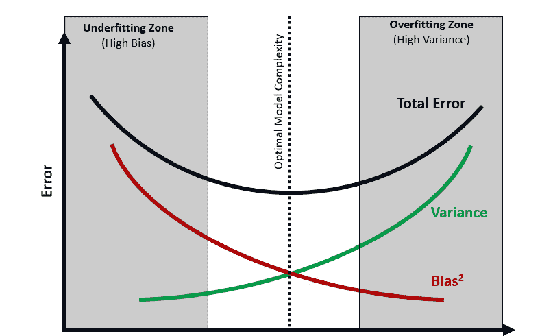

# 第十章：机器学习中的常见陷阱

想象一下：一位经验丰富的数据科学经理刚刚推出了一款新的推荐引擎来促进产品销售。该模型在测试中表现出色，但现在，客户兴趣却冷淡。问题是什么？模型过于精确地模拟了训练数据——早期采用者的独特口味，并未反映更广泛客户的偏好。

**机器学习**（**ML**）承诺带来令人难以置信的成果，但它也极易让人跌倒。根据一项对 500 多位开发者进行的调查（https://www.civo.com/newsroom/ai-project-failure），超过一半（53%）的受访者已经放弃了 1%到 25%的机器学习项目，另外 24%的受访者则放弃了 26%到 50%的项目。只有 11%的开发者表示他们从未放弃过项目。第一课是：机器学习不是一个只需要数据的魔法算法。它关乎理解哪种模型适合任务，确保你的数据真正传授正确的知识，并了解什么时候你的模型可能会出错。

本章涵盖以下主题：

+   理解复杂性

+   脏数据，损坏的模型——数据的数量和质量如何影响机器学习

+   克服过拟合和欠拟合

+   精通过拟合和欠拟合以实现最佳模型性能

+   训练-服务偏差和模型漂移

+   偏差和公平性

# 理解复杂性

首先，让我们承认机器学习是一个复杂的领域，它不仅仅是处理数字。它涉及复杂的算法、大量的数据以及解释和应用结果的能力。

想象一下，你是一个消费品公司的市场营销主管。你可以访问大量客户数据，并希望利用机器学习（ML）预测哪些客户最有可能购买你的新产品。

听起来很简单，对吧？但在许多地方，复杂性可能会悄然出现。我们将简要解释一些关键的考虑因素，然后再详细探讨每一个：

+   **数据质量与数量**：你的数据是否干净，并且能够代表你的目标群体？你是否拥有足够的高质量数据？

+   **模型选择与调优**：你是否为你的数据选择了合适的模型？你是否正确训练或微调了你的模型？

+   **过拟合和欠拟合**：你的模型是否过于复杂，仅仅记住了训练数据（过拟合）？还是它过于简单，错过了重要的模式（欠拟合）？

+   **训练-服务偏差**：你的模型在现实世界中的表现是否和在训练数据上表现的一样好？

+   **模型漂移**：随着底层数据的变化，你的模型会随着时间推移如何表现？

+   **公平性**：你的模型是否对某些群体存在偏见？它是否根据性别、年龄和种族等特征公平地对待不同的子群体？

这些是训练机器学习模型时需要牢记的一些关键因素，初看上去可能会让人感到有些压倒性。然而，通过逐一探讨每个问题，并结合一些具体的例子，到了本章结束时，你应该会更清楚该关注哪些问题。你还将了解你自己或你的团队可以采取哪些步骤来缓解将机器学习模型部署到生产环境中的挑战。

# 脏数据、损坏的模型——数据的数量和质量如何影响机器学习

在训练或使用机器学习和人工智能模型时，数据不仅是资产，也是成功的基础。没有高质量、具代表性的数据，即使是最复杂的机器学习模型也无济于事。但当你没有足够的数据，或者你拥有的数据存在偏见或不准确时，会发生什么呢？

以一个假设的例子为例，许多银行使用机器学习来标记潜在的欺诈交易并根据交易信息封锁账户。假设该模型仅在某些类型的账户上进行训练，例如有更多常规、小额交易的活期账户。假设银行决定将该模型也应用于储蓄账户，这些账户可能有较大且较少见的交易。此时，模型可能会错误地将大多数典型的储蓄账户交易标记为误报，导致客户感到沮丧，客服团队也感到压力山大。

以另一个例子为例，假设有一个基于大型语言模型的客户服务聊天机器人。假设这个聊天机器人主要在客户表达沮丧或不满时进行训练。该聊天机器人学会将大多数客户查询与负面情绪关联。结果可能是，聊天机器人变得过于道歉或防御，即使在中立的对话中也会如此。它可能误解简单的请求，曲解客户的意图，从而阻碍有效的客户支持。

在这一部分中，我们将探讨影响机器学习模型的数据数量和质量的常见因素，以及如何应对这些问题。

## 足够训练数据的重要性

想象你是一个教练，在为篮球比赛训练一支队伍。如果你只训练他们投罚球，那么当面对比赛中的其他方面（如防守或三分投篮）时，他们会表现得很吃力。类似地，使用不充分或不具代表性数据训练的机器学习模型，也难以做出准确的预测。

例如，在市场研究和消费品等行业，如果一个模型只用城市消费者的数据进行训练，那么当应用于农村消费者时，模型可能表现不佳。

对于许多机器学习模型，特别是深度学习模型，数据的数量至关重要。

### 缓解挑战

为了缓解这个挑战，我们必须采取以下措施：

+   **收集足够的数据量**：这可能看起来像是一种蛮力方法，但在许多情况下，提升机器学习模型，特别是深度学习模型准确度的最佳方式，是增加模型训练所用数据的数量。实现这一目标的一种方法是通过在更长时间内收集数据。

+   **收集多样化的数据**：确保你的训练数据涵盖模型可能遇到的广泛场景。这可以通过扩展数据获取的来源来实现，可以是内部数据源（第一方数据）或外部数据源（第二方和第三方数据）。然而，重要的是要扩展数据覆盖面，只包括与你模型在生产环境中会接触到的相关数据。例如，在前面的聊天机器人案例中，扩展数据以涵盖所有类型的客户互动可能有助于提升模型的准确性和可靠性。然而，添加无关的聊天机器人数据，例如来自不同公司或行业的数据，可能会产生相反的效果，导致模型的可靠性下降。

+   **使用数据增强技术**：数据增强是调整或增加你已有数据样本的过程。这些技术可以通过创建现有数据点的变体，人工扩大你的数据集。例如，在图像识别中，一种常见的数据增强方法是通过旋转、缩放、模糊和裁剪现有图像来增加训练数据的量。

+   **生成合成数据**：合成数据是指人工创建的数据，能够紧密模拟现实世界数据的特征和模式。当现实世界的数据稀缺、敏感或难以获取时，这种数据尤其有益。以**大型语言模型**（**LLM**）为例，这些模型可以用来生成逼真的合成数据，以便为特定任务对模型进行微调。LLM 擅长创建基于文本的数据，并可以微调以产生多样化和有针对性的变体，从而填补原始数据集的空白，确保模型更好地为各种现实世界场景做好准备。

## 处理不良数据质量

较差的数据质量，如缺失值、不一致性和明显错误，会显著阻碍机器学习模型的表现。想象一下，如果你用一本充满错别字和不正确公式的数学教材教别人数学——他们将难以正确理解概念。同样，基于有缺陷数据训练的模型将产生不可靠的结果。

以医疗技术行业中的一个图像识别模型为例，该模型被训练用来从 MRI 扫描中检测肿瘤。如果这个模型训练所用的图像标签不准确，可能会导致灾难性的后果，例如肿瘤未被检测到，或错误地标记为假阳性。在像这样的关键应用中，确保数据质量非常高是最重要的考虑因素之一，甚至可以说是最重要的。

再举一个例子。一个自然语言处理模型可能经过微调，用于社交媒体平台上的内容审核。如果训练数据标注不准确（例如，讽刺性的言论被标记为仇恨言论），或者缺乏多样的示例，模型就会遇到困难。这可能导致假阳性，合法内容可能被错误删除，从而限制言论自由。此外，数据质量差还可能导致模型产生假阴性，真实的仇恨言论可能会漏网，使平台对用户不安全。

### 缓解挑战

缓解数据质量差挑战的方法有很多，我们将在本节中描述这些方法。然而，通常，解决数据质量问题的最佳地方是在数据源头。

例如，考虑一个被训练用来在客户关系管理（CRM）系统中对客户进行分类的机器学习模型，判断其是否可能流失。客户及其所有信息是否已准确输入 CRM 系统？表单上是否有任何验证机制，确保未输入无效数据，或者是否有些客户的重要数据缺失？业务团队在输入数据时是否有流程可遵循？如果数据质量差或缺失数据，是否可以由业务团队手动修复，或者由数据科学团队自己修复？

这都是一些琐碎的工作，但如果等到数据进入数据科学家和机器学习工程师手中时，已经是低质量数据，那么通过我们将在这里解释的自动化过程也只能做得有限。正如那句著名的谚语所说，垃圾进，垃圾出。

以下是数据科学家、工程师和分析师可以用来缓解数据质量差的技术：

+   **数据清洗**：数据科学家可以在训练机器学习模型之前，应用多种技术来清洗数据，包括以下几种：

    +   **缺失值**：决定是删除缺失数据的条目，还是用估算值（例如均值或中位数）替代缺失值

    +   **重复数据**：删除冗余的条目，以免扭曲结果

    +   **不一致性**：纠正格式错误（例如日期格式），并标准化条目以便模型更好理解（例如将所有地址转换为小写字母）

+   **数据验证**：数据科学家可以应用技术来验证数据，并在训练机器学习模型之前排除或修复无效数据。同样重要的是，在模型投入生产后（即训练后和推理期间），也要应用相同的数据清洗和验证过程：

    +   **范围检查**：确保数值在可接受的范围内（例如，某人的年龄不能是负数）

    +   **格式检查**：验证数据是否符合特定格式（例如，电话号码、邮政编码）

    +   **跨领域检查**：确保相关数据字段的一致性（例如，如果国家是“美国”，州字段应该与美国各州的列表匹配）

## 结论

糟糕的数据会破坏你的机器学习模型，这一点非常简单。解决这些问题对成功至关重要，我们已经介绍了一些你可以在下一个数据科学项目中利用的技术。这些技术包括通过扩展训练数据的范围和覆盖面来改善数据收集、增加数据量以及在适当情况下合成数据，还包括通过数据清理和验证来提高数据的质量。这些艰苦的努力将为你的项目奠定成功的基础。数据的重要性无法过分强调，甚至有一个日益增长的方法叫做数据中心人工智能（[`datacentricai.org/`](https://datacentricai.org/)），这是系统性地工程化构建人工智能系统所使用的数据的学科。

接下来，我们将探讨另一个关键挑战：确保你的模型不仅仅是记住训练数据，而是能够学习如何推广到新的情况。这意味着要理解和避免过拟合与欠拟合。

当我们进入下一个部分时，我们将探讨机器学习中的一个关键方面——过拟合和欠拟合。我们如何确保模型不仅在当前数据上表现良好，而且在新的、未见过的数据上也能表现得很好？

# 克服过拟合和欠拟合

为模型选择合适的复杂度是一项微妙的平衡工作。如果模型过于复杂，可能会对训练数据过拟合，这意味着它在训练数据上表现很好，但在新的、未见过的数据上表现较差。另一方面，如果模型过于简单，可能会欠拟合数据，错过重要的模式，导致不准确的预测。

想象一下，你是一个市场研究员，试图预测消费者趋势。一个过拟合的模型可能会捕捉到过去趋势中的每一个微小波动，但无法推广到未来的趋势。而一个欠拟合的模型可能会完全错过重要的趋势。

## 导航训练-服务偏差和模型漂移

在理想的世界里，你的模型在现实世界中的表现应该和在训练数据上表现得一样好。但现实中很少发生这种情况。这种差异被称为**训练-服务偏差**。

此外，随着基础数据随时间变化，你的模型性能可能会下降。这就是所谓的**模型漂移**。

假设你正在开发一个机器学习模型，用于预测电信公司客户流失。在模型训练阶段，你使用的数据集包括客户信息，如人口统计数据、使用模式和客户服务互动。然而，当模型部署到生产环境（服务阶段）时，你发现供给模型的数据管道缺少一些重要特征，比如最新的客户服务互动数据。这种训练数据和服务环境中数据之间的不一致性是典型的训练-服务偏差问题。

在这种情况下，由于模型是在比服务环境中可用的数据集更全面的数据集上训练的，模型在生产中的表现可能会受到影响。服务阶段缺少的特征可能导致预测不准确，从而做出次优的决策。

为了解决训练-服务偏差问题，确保训练数据与服务环境中可用数据的一致性至关重要。这可能涉及定期化数据管道、监控数据质量以及实施数据验证检查，以便尽早发现任何不一致之处。

## 确保公平性

最后，确保模型公平性并避免歧视某些群体是很重要的。这尤其具有挑战性，特别是当训练数据本身存在偏见时。

比如，假设你是一个人力资源经理，使用机器学习筛选求职者。如果你的训练数据存在对某些群体的偏见，模型可能会不公平地拒绝这些群体中的合格候选人。

在本节中，我们探讨了机器学习为何难以实现，讨论了数据质量与数量、过拟合与欠拟合、训练-服务偏差、模型漂移和公平性等挑战。但不要气馁。在接下来的章节中，我们将深入分析这些挑战，并提供实际的解决策略。

# 精通过拟合和欠拟合，实现最佳模型性能

在机器学习中，获得可靠预测通常是主要目标。过拟合和欠拟合是实现这一目标的两个常见障碍。我们将详细分析这些概念，并概述构建更好模型的具体方法。

## 过拟合——当你的模型过于具体时

想象你的模型是一个准备考试的学生。当学生完美地记住了练习题，但在实际考试中难以回答同类问题的变化时，就会发生过拟合。类似地，过拟合模型过于关注训练数据的细节，包括随机噪音，而无法把握整体情况。

### 现实世界的后果

+   **市场调研**：一个过于依赖现有客户数据的模型无法预测具有不同特征的新客户行为。

+   **零售推荐**：一个仅基于忠实客户购买历史训练的系统，在试图吸引新顾客时，可能会提供不相关的建议。

## 欠拟合——当你的模型过于简单时

将欠拟合想象为一个仅掌握最基础概念的学生。不管考试题目是来自练习题还是新内容，他们都将不及格。同样，一个欠拟合的模型会忽略数据中的重要关系，整体表现较差。

### 现实世界的后果

+   **销售预测**：忽略季节性或营销推广等因素的模型会始终低估或高估潜在销售额

## 发现问题

+   **警示信号**：在训练数据上表现优秀，但在新数据上表现糟糕，是过拟合的典型迹象

+   **警告信号**：如果你的模型在训练数据和新数据上都表现不佳，可能是由于欠拟合

### 构建更好模型的解决方案

以下是一些构建优秀模型的解决方案：

+   **更多数据 = 更强的基础**：更大、更具多样性的数据集帮助模型识别真实的趋势，而不是训练样本中的随机波动。

+   **特征选择 = 激光聚焦**：仔细选择最相关的数据特征。去除那些只会增加混乱而非提供洞察的特征。

    +   **示例 – 预测客户流失**：假设你正在预测电信公司客户的流失。你的数据集包括了相关特征，如每月费用和客户服务电话，但也有一个无关的特征：最喜欢的冰淇淋口味。包含“最喜欢的冰淇淋口味”会增加噪声，使算法更难识别重要的模式。通过仅选择相关特征，你可以创建一个专注的模型，专注于推动流失的关键因素。记住，更多数据不一定更好。质量和相关性才是最重要的。

+   **正则化 = 防护栏**：正则化是一种技术，在训练过程中对模型添加惩罚，以防止其变得过于复杂并过度依赖训练数据的特殊性。

    +   **示例 – 预测房价**：在构建房价预测模型时，正则化起到了保护作用。它避免模型过度关注训练数据中一些特殊且昂贵的房屋，这些房屋具有独特的特征。通过添加这些惩罚，正则化帮助模型更好地对新、未见过的数据进行泛化，而不是被训练数据的细节所困扰。

+   **交叉验证 = 现实检查**：交叉验证是一种方法，帮助评估模型在新数据（即未见过的数据）上的表现，模拟现实世界的条件。

    +   **例子——电影评论的情感分析**：当构建一个预测电影评论情感的模型时，交叉验证提供了一个现实检查。你将数据拆分成多个子集，而不是在所有数据上训练模型并假设其表现良好。你在某些子集上训练模型，并在其他子集上进行测试。通过多次这样做，你可以更实际地估计模型在新数据上的表现。这有助于你发现模型是否仅仅是在记忆训练数据，而不是学习如何推广到新的评论。

观察欠拟合与过拟合之间权衡的一个方法是查看偏差-方差权衡图：

图 10.1：偏差-方差权衡

图表（*图 10.1*）展示了模型的**复杂度**、**泛化能力**和**在未见数据上的准确性**之间的关系。对于专注于业务的决策者，尤其是在数据科学、机器学习和人工智能领域，这是一个非常重要的概念，因为它直接影响到他们模型的实际表现。

### 理解坐标轴

+   **X 轴（模型复杂度）**：这表示你的模型的灵活性或复杂性。较简单的模型位于左侧，而更复杂的模型位于右侧。

+   **Y 轴（误差）**：这表示模型的整体误差，它是两个关键因素——偏差和方差——的结合。

### 图表的关键部分

让我们通过一个实际例子来探索这个图表。假设你正在构建一个模型，用来预测哪些客户可能停止使用你的产品或服务（流失）：

+   **偏差**：这指的是模型本身引入的系统性误差。它是模型预测与实际值之间的持续差异。高偏差意味着无论具体的数据点如何，模型总是会偏离正确答案。一个非常简单的模型可能只关注一个特征，比如客户的平均购买金额。这个模型很可能有高偏差，因为它忽略了许多复杂的因素，这些因素也在推动客户流失（例如，客户支持体验，竞争者产品）。

+   **高方差（过拟合）**：一个非常复杂的模型，具有大量特征，可能会完美地拟合训练数据。然而，它可能会捕捉到与你的历史数据无关的模式或随机波动，从而导致对新客户的预测不稳定（就像飞镖四处乱飞）。这个模型在训练数据上表现良好，但无法推广并可靠地预测新的流失客户。

+   **最佳平衡**：理想的模型应该足够复杂，能够捕捉到驱动客户流失的关键因素，同时不会对训练数据的具体细节过拟合。这个平衡将导致最低的整体误差率（图表中的**总误差**），成功地识别出那些真正面临流失风险的客户。

### 权衡

这个图表的关键要点是偏差和方差之间的权衡：

+   **更简单的模型（左侧）**：这些模型往往具有高偏差（系统性地偏离目标）但低方差（预测一致）。这是因为它们不够灵活，无法捕捉数据中的所有复杂性。

+   **更复杂的模型（右侧）**：这些模型往往具有低偏差（更好地拟合数据），但具有高方差（对于相似数据点，预测波动较大）。这是因为它们更加灵活，能够很好地拟合训练数据，但也有可能会记住数据中的噪声或无关模式，导致在新数据上表现不佳。

### 寻找最佳模型

目标是找到在偏差和方差之间取得平衡的最佳模型复杂度，以实现最低的总误差。这通常通过正则化等技术实现，正则化帮助约束模型的灵活性，减少方差，同时避免引入过多的偏差。

### 与商业决策的相关性

对于以业务为中心的决策者来说，理解偏差-方差权衡是非常有用的，因为这有助于你做到以下几点：

+   **评估模型的泛化能力**：你的模型在面对它从未见过的真实数据时，表现如何？

+   **对模型复杂度做出明智选择**：平衡准确预测的需求与过拟合和差的泛化能力的风险。

+   **避免常见陷阱**：了解欠拟合（高偏差）和过拟合（高方差）的迹象，可以帮助你诊断和解决模型的问题。

通过理解这种权衡，你可以做出更好的决策，确保你的数据科学项目和模型具有较好的泛化能力，并且对你的业务产生积极影响。

## 结论

最佳的机器学习模型并非完美地模仿过去，而是揭示帮助你做出准确预测的模式。通过理解和应对过拟合和欠拟合，你将使模型能够提供推动更好商业决策的洞察力。

随着我们深入探讨，我们将研究机器学习的另一个重要方面：训练-服务偏差和模型漂移。这些概念将进一步帮助你在业务中部署高效且可靠的机器学习模型。

# 训练-服务偏差和模型漂移

作为决策者，理解将机器学习模型部署到生产环境中的潜在陷阱非常重要。训练-服务偏差和模型漂移是其中的两个挑战。让我们一起探索这些概念，理解它们的影响，并学习如何减轻它们的影响。

## 训练-服务偏差

训练-服务偏差发生在用于训练模型的数据与用于提供预测的数据不一致时。这可能导致模型性能显著下降。比如，你是一家零售巨头，你已经训练了一个基于历史数据预测客户购买行为的模型。如果你的模型是用在线销售数据训练的，但却用于预测店内销售，偏差可能会导致预测不准确。

### 减轻训练-服务偏差

我们如何应对这个问题？以下是一些解决步骤：

+   **确保一致性**：确保用于训练和服务的数据是一致的。这包括数据源、特征提取方法和数据分布等方面。

+   **监控性能**：定期监控模型的性能。如果性能突然下降，可能是由于训练-服务偏差。

+   **定期更新模型**：使用最新的数据更新你的模型，确保其保持相关性和准确性。

## 模型漂移

模型漂移是指由于基础数据分布的变化，模型性能随时间发生变化。例如，一个营销公司使用模型预测消费者趋势。如果消费者行为发生突然变化，模型的预测可能会随着时间的推移变得不那么准确。

### 缓解模型漂移

解决模型漂移包括以下几个方面：

+   **监控模型性能**：密切关注模型的性能指标。如果模型性能逐渐下降，可能是由于模型漂移。

+   **重新训练模型**：定期使用新数据重新训练模型，确保它们跟上最新趋势。

+   **使用强健的模型**：某些模型比其他模型更容易受漂移影响。使用能够处理数据分布变化的强健模型可以帮助缓解这个问题。

## 关键要点

在本节中，我们探讨了部署机器学习模型时常见的两个陷阱：训练-服务偏差和模型漂移。我们学习了如何识别这些问题，并了解了缓解其影响的步骤。通过确保训练和服务数据的一致性、监控模型性能以及定期更新模型，我们可以确保它们保持有效且相关。

在接下来的内容中，我们将探讨机器学习模型的另一个关键方面：偏见与公平性。这将帮助我们理解模型如何可能对不同子群体产生偏见，以及如何确保我们的模型公平。

# 偏见与公平性

在机器学习中，偏见和公平性不仅仅是伦理考虑，它们是影响机器学习模型有效性的关键因素。我们已经遇到了偏见与欠拟合和过拟合的关系。接下来，我们将探讨模型如何完全且准确地代表数据中的所有群体——例如，数据集中不同的客户群体。

## 理解偏见

机器学习中的偏见指的是模型由于训练数据或模型设计的局限性，系统性地产生错误。产生这种偏见的原因可能有多种，包括以下几种：

+   **训练数据不足或不具代表性**：如果你的数据集未能充分捕捉现实世界的复杂性和多样性，模型可能会做出不准确的假设。

+   **数据收集过程中的固有偏见**：如果数据收集方式中存在历史偏见，模型可能会延续这些偏见。

### 示例 —— 贷款审批中的偏见

假设有一家银行使用机器学习模型来批准或拒绝贷款申请。如果用于构建该模型的训练数据中，某一特定群体的成功还款示例较少，模型可能会更频繁地拒绝该群体的申请，而不考虑申请人的个人信用状况。这就是偏见的一个例子。

## 理解公平性

公平性是一个更广泛的概念，关注模型决策的影响。如果一个模型系统性地偏袒某一群体而非另一群体，即使这种偏见本身并非故意的，仍然被认为是不公平的。

### 示例 – 广告中的公平性

想象一家在线零售商使用机器学习模型来决定将哪些客户作为促销对象。如果该模型系统性地排除某些群体的客户，导致他们无法收到促销优惠，那么这可能被认为是不公平的，从而错失机会并可能疏远顾客。

## 减少偏见并确保公平性

这里是一些解决这些问题的关键策略：

+   **代表性数据**：确保你的训练数据尽可能地代表真实世界中的群体。这可能涉及收集更多的数据，使用过采样等技术来补充代表性不足的群体，并且仔细处理现有数据集中的固有偏见。

+   **关注公平性的算法**：探索使用专门设计的算法，这些算法在训练过程中考虑公平性。

+   **监控与评估**：使用评估指标，如差异影响和机会平等差异，来衡量模型预测中潜在的偏见和差异。定期监控这些指标，识别公平性可能受到影响的领域。

## 关键要点

通过理解偏见和公平性，你可以采取措施构建既准确又公正的机器学习模型。这不仅出于伦理原因重要，也能确保你的模型做出有利于所有利益相关者的明智商业决策。

# 总结

在本章中，我们探讨了训练和部署机器学习模型中的一些常见问题，包括训练数据不足、数据质量差、过拟合和欠拟合、训练-服务偏差以及模型漂移。我们还探讨了偏见和公平性的概念、它们对商业结果的影响，以及如何减轻这些问题。

随着我们不断前进，请记住，数据科学不仅仅是构建模型，更是确保这些模型是可靠、公平并能造福所有利益相关者。

在下一章中，我们将探讨你可能遇到的不同类型的数据科学项目，并探讨如何应对它们。

# 第三部分：领导成功的数据科学项目和团队

本部分探讨了数据科学中的领导力方面，包括项目结构、团队组成、管理策略，以及持续学习和跟进新兴技术的重要性。本部分包含以下章节：

+   *第十一章**，数据科学项目的结构*

+   *第十二章**，数据科学团队*

+   *第十三章**，管理数据科学团队*

+   *第十四章**，继续作为数据科学领导者的旅程*
