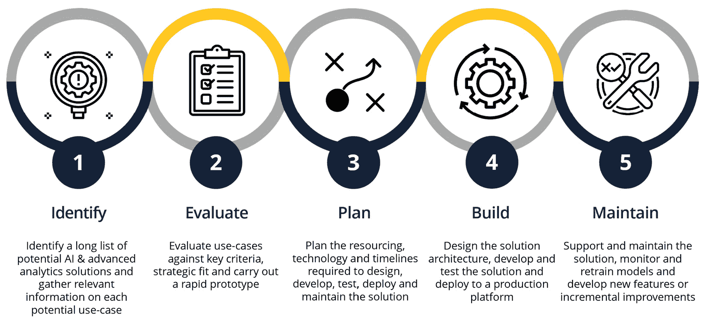
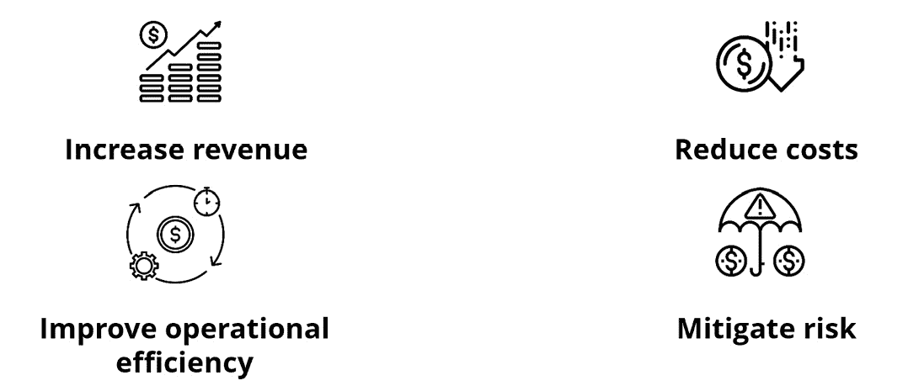
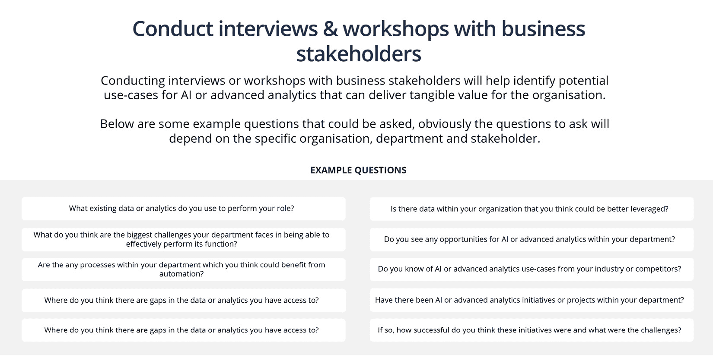
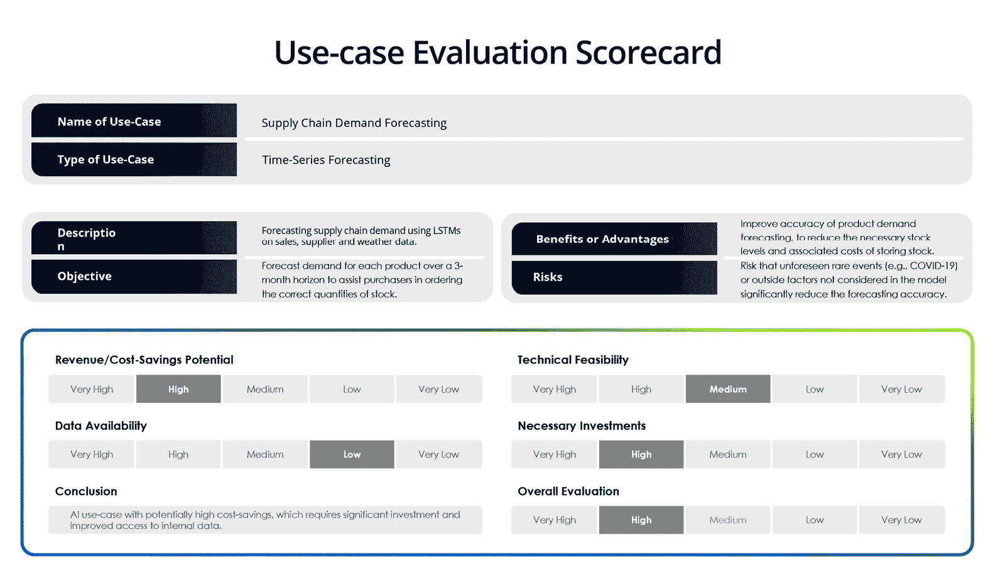

# 第十一章：数据科学项目的结构

数据科学项目在范围、目标和交付物方面可能会有很大差异。从探索性数据分析和构建报告、仪表板，到开发并将机器学习和人工智能模型部署到生产环境——数据科学项目的结构和方法需要根据具体情况量身定制。

在本章中，我们将探讨常见的数据科学项目类型及其相关流程和交付物。这将使你作为数据科学项目的领导者，具备规划和确定数据科学项目范围的知识，并了解在研究、开发、测试和部署数据产品中涉及的关键步骤。

到本章结束时，你将能够完成以下任务：

+   确定、优先排序和构建数据科学用例

+   区分不同类型的数据科学项目及其交付物

+   确定数据科学项目的范围和计划，并创建有用的文档，如需求文档、项目计划和测试策略

+   理解与数据科学项目相关的研究和开发过程

+   认识到在交付或部署数据产品之前彻底测试它的重要性

+   在生产环境中安全地部署并监控数据产品

无论你是在管理一个短期的数据科学项目，还是开发一个基于机器学习的软件应用程序，理解本章所涵盖的关键阶段和最佳实践，将帮助确保你的数据科学项目能够顺利成功。

# 各种类型的数据科学项目

在讨论数据科学项目的结构之前，让我们先来了解你可能遇到的不同类型的数据科学项目。数据科学、机器学习或人工智能项目的类型可能会大幅改变项目的结构方式。

数据科学项目的三个最广泛的类别如下：

+   数据产品

+   报告和分析

+   研究与方法论

在这些类别下有各种不同的项目，但这种区分非常有用。因为数据产品是部署并随着时间推移进行维护的，而一次性的报告、分析或研究则有有限的生命周期。

让我们更详细地了解这些内容。

## 数据产品

数据产品是可以利用数据、机器学习算法和人工智能技术，提供有价值的功能、洞察力或自动化决策能力的软件应用或系统，面向最终用户或其他系统。

这些产品旨在部署、维护并随着时间的推移不断改进。

以下是数据产品的一些关键特征：

+   它们由数据驱动，并通过机器学习或人工智能算法提供动力

+   通过功能、预测、推荐或自动化为用户持续提供价值

+   它们需要持续的维护、更新和监控，以确保性能和可靠性

+   它们通常涉及与其他系统或 API 的集成

+   可扩展性和效率是重要考虑因素

举个具体的例子，数据产品可能是食品送货应用中的交货时间预测模型。该模型可以通过 API 提供从下订单到送达用户食物所需时间的估计，根据餐馆到客户位置的距离、司机的位置和可用性以及交通状况，在送货过程中持续提供这些信息。在使用 Uber Eats、DoorDash 或 Deliveroo 等应用时，您可能已经看到了其中一个模型的输出。

正如你可以想象的那样，部署一个能够实时为成千上万客户提供服务的评分模型将是一个巨大的工程项目。大多数数据产品并不复杂；然而，这个例子的重点在于强调数据产品需要设计、工程、测试和维护的层次，而报告和纯研究则不需要。

数据产品不是“发布即忘记”；它们在部署后必须得到支持和维护。因此，请从最终目标出发，考虑如何以及由谁来维护一个成功的产品，以服务用户。

本章将主要关注如何规划和交付数据产品，我们稍后将在本章中介绍。但在此之前，让我们看一下您可能会遇到的另外两种数据科学项目的广泛类别。

## 报告和分析

报告和分析项目专注于分析和从数据中得出洞察，以支持决策或跟踪业务绩效。这些项目通常涉及收集、处理和可视化数据，为利益相关者提供有意义和可操作的信息。

报告和分析的一些关键特征如下：

+   重视数据探索、分析和解释

+   利用统计方法、数据可视化技术和商业智能工具

+   旨在揭示数据中的模式、趋势和关系

+   支持数据驱动的决策和战略规划

+   可交付成果通常包括报告、演示或交互式可视化

这些可交付成果中的许多是一次性的、临时性的输出，具有有限的生命周期，因此您可以相应地规划项目。这可能按以下结构进行：

1.  **收集需求**：收集业务和数据需求，并规划分析或建模方法。

1.  **收集数据**：从内部或外部来源收集所有相关数据。

1.  **处理数据**：清理和整理数据，使其符合分析和/或建模所需的结构。

1.  **分析与建模**：进行数据分析和统计或机器学习建模，以提供对数据的洞察和理解，从而支持业务需求。

1.  **报告**：利用数据可视化技术制作报告交付物，无论是报告、演示文稿还是互动可视化，目的是以一种易于观众解读的方式总结数据，并提供可操作的洞察和建议。

这个结构可能并非严格线性，可能在每个阶段都会有数据收集的迭代，或从业务中收集额外的需求或输入，直到最终交付物呈现出来。

最终的交付物应强调可操作的洞察和建议，并鼓励最终用户根据你有信心的洞察采取行动。通常，报告只是被浏览而没有采取进一步行动，这对业务的价值有限。

最后，让我们来看看第三种类型的数据科学/机器学习项目：研究与方法论。除非你在学术界或专注于推动机器学习或人工智能领域发展的研究公司或实验室工作，否则你可能不会遇到这种类型的项目。在行业中，许多公司依赖经过验证的技术或模型来开发他们的应用场景。

## 研究与方法论

研究和方法论项目旨在通过开发新的算法、技术或方法来推动人工智能、机器学习或数据科学领域的发展。这些项目通常涉及实验、基准测试和评估不同的方法，以突破可能性的边界并改进现有技术。

研究和方法论项目的一些关键特点如下：

+   强调创新、实验和推动当前技术的极限

+   涉及开发新的算法、模型或优化技术

+   需要对基础的数学和统计原理有深入理解

+   通常涉及比较分析和评估不同的方法

+   旨在通过出版物、开源代码或研究论文为科学界做出贡献

这种类型的项目可能遵循一个包含以下阶段的方法：

1.  **文献综述**：审查现有研究，识别其中的空白或改进的领域。

1.  **假设制定**：制定明确的研究问题和假设。

1.  **方法论开发**：设计并实现新的算法、模型或技术。

1.  **实验设置**：准备数据、定义评估指标并设置实验。

1.  **评估与分析**：进行实验，分析结果，并将其与最先进的模型进行比较。

1.  **文档编写与传播**：撰写研究论文、准备演示文稿，并与公司或更广泛的研究社区分享代码和发现。

现在我们已经看到了数据科学项目的主要类型，让我们重点关注旨在交付数据产品的数据科学项目的结构和阶段。这是公司和团队常常犯错的地方，因为设计和开发机器学习或人工智能解决方案充满了挑战。规划项目时需要具备适当的专业知识和资源至关重要。

# 数据产品的阶段

在领导新机器学习或基于人工智能产品的开发时，你将遇到几个阶段，理解这些阶段非常有用。本节将为你提供框架和工具，帮助你与机器学习和人工智能团队合作，开发成功的数据产品：

图 11.1：数据科学产品的阶段

虽然数据科学产品的阶段可以大致概括为识别、评估、规划、构建和维护，但需要注意的是，现代产品开发通常遵循敏捷方法论。实际上，这些阶段并不是严格的顺序进行，而是迭代和相互关联的。

团队通常在短期冲刺中工作，持续收集反馈、重新评估优先级并调整计划。这种方式提供了更多的灵活性、更快的迭代速度，并能在需要时做出调整，最终有助于开发出更符合用户需求和商业目标的产品。

因此，尽管这个框架提供了每个阶段关键考虑因素的有用概述，但请记住，这个过程比线性更具周期性，后期阶段的洞察往往会反过来影响和完善早期的假设和决策。

## 识别用例

在数据科学项目生命周期中，一个常被忽视的阶段是花时间识别“正确”的用例。许多组织从错误的前提开始，想要“做人工智能”、“做机器学习”或“做数据科学”，却没有明确的商业目标。这些公司最终投入了大量时间、精力和人力资源，却很少获得实际价值。

这可能看起来显而易见；然而，许多组织未能通过数据科学、机器学习或人工智能项目实现**投资回报**（**ROI**）。导致这种情况的一个重要因素是开发的解决方案未能对企业的盈利产生实质性影响。说起来容易，做起来难。

在识别正确的用例并预测其财务影响时，投入足够的时间和精力，这是任何数据科学项目的基础步骤。如果做到正确，你将为项目成功奠定基础。如果做错了，你可能会浪费时间和资源在无法带来实际价值的项目上。

在这个背景下，用例是指数据科学技术应用于解决商业问题或抓住机会的具体实践。然而，重要的是要认识到，数据科学并不总是最佳的解决方案。在许多情况下，传统的商业智能、软件工程，甚至简单的流程改进可能更为有效。

为了识别既具有技术可行性又能提供清晰商业价值的用例，最好遵循一种结构化的方法：

+   **理解价值链**：从了解你组织内的关键职能和流程开始。识别数据科学/机器学习/人工智能可以潜在提供价值的领域，无论是通过降低成本、增加收入、提高效率，还是降低风险。解决方案最终应该通过以下一种或多种方式直接或间接地为商业底线作出贡献：

图 11.2：数据科学用例目标

在这个阶段，开发一个潜在的数据科学、机器学习或人工智能用例的长清单。

尝试在不同的情境下估算每个用例的财务价值，例如通过基本情境、更乐观的情境和更悲观的情境。

+   **与利益相关者沟通**：与商业利益相关者进行研讨会和访谈，获取关于他们挑战、痛点和数据科学、机器学习/人工智能机会的见解。询问数据可用性、当前的分析能力和决策过程：

图 11.3：识别用例的示例商业问题

+   **框定数据科学用例**：根据这些洞察，开始框定与关键商业目标一致的潜在用例。重要的是，这些用例需要被框定为数据科学、机器学习或人工智能可以现实地解决的问题。邀请数据科学/机器学习专家来验证技术可行性。

## 评估用例

一旦你确定了一个长长的用例清单，你可以评估每个用例，决定团队应在哪些方面集中精力，并且能够自信地做出决策：

+   **根据价值和可行性优先排序**：收集每个潜在用例的信息，包括数据需求、技术需求和商业价值估算。利用这些信息，根据用例的潜在影响和成功的可能性进行优先排序。

+   **原型设计和测试**：在完全投入一个用例之前，如果有时间，可以通过使用样本数据开发一个快速原型，测试其技术可行性和潜在价值。如果原型表现出前景，可以批准该用例进行全面开发。

以下是一个示例用例的模板评分卡，你可以利用它来评估你已识别的用例：

图 11.4：用例评估模板评分卡

通过遵循这种务实的用例识别方法，你可以生成与业务目标紧密相关、具有清晰可衡量 KPI 的数据科学项目管道。这有助于避免常见的陷阱，比如追求那些不适合数据科学或不太可能产生有意义结果的用例。

在接下来的部分中，我们将探讨在识别出一个有前景的用例后，进行数据科学项目范围界定和规划的最佳实践。

## 规划数据产品

在规划数据产品时，顶尖的人工智能/机器学习团队摒弃了大量文档和僵化的长期计划。相反，他们采用更加敏捷、迭代的方法，强调协作、适应性以及增量交付价值。实践中是这样的：

+   确定清晰、可衡量的目标：

    +   与利益相关者合作，制定数据产品的具体、可实现的目标

    +   确保这些目标与组织的整体战略保持一致

    +   聚焦于结果，而不仅仅是输出

+   建立一个技术精湛、跨职能的团队：

    +   确定项目所需的关键技能（例如，机器学习/人工智能、数据工程、领域专长、UX/UI 设计和开发）

    +   组建一个精简、敏捷的团队，具备这些技能的混合

    +   引入团队外部的专业知识和见解，无论是来自客户、其他业务部门，还是外部顾问

+   评估数据和技术需求：

    +   确定支持产品所需的数据和基础设施

    +   规划数据治理、安全性和隐私

    +   选择能够快速实验和迭代的工具和平台

+   制定路线图：

    +   将项目拆分为可管理的小阶段，每个阶段都有明确的交付成果

    +   根据功能和任务的价值及可行性来进行优先级排序

    +   保持开放的心态，根据反馈和学习调整计划

+   培养协作的工作环境：

    +   使用工具来促进规划和沟通，包括团队文档空间（如 Notion）或沟通渠道（如 Slack）

    +   根据需要召开会议，但避免为了开会而开会，或引入官僚主义，这会在没有明确利益的情况下拖慢团队进度

    +   在团队成员之间推广同行评审文化，例如数据科学家、机器学习工程师和数据工程师，共同提高团队工作的质量

    +   鼓励开放沟通、持续反馈，并专注于迭代改进

### 实际案例——在营销领域规划一个数据科学项目

让我们考虑一个实际案例，规划一个营销行业的数据科学项目。一家公司希望利用数据科学优化其数字广告策略：

+   问题定义为“*我们如何利用数据科学提高数字广告活动的效果？*”相关利益方包括营销团队、销售团队和公司高层。

+   交付物是一个最小可行产品预测模型，能够预测不同广告策略的效果。所需的数据包括历史广告数据、销售数据和客户人口统计数据。

+   成功的衡量标准将是通过优化的广告策略带来的销售增长。约束条件包括 6 个月的时间表、技术团队的预算以及广告测试的预算，并且需要遵守数据隐私法规。

考虑你可能需要的团队、你和你的团队需要访问的数据和系统，以及团队如何部署和维护解决方案。

通过专注于规划的核心要素并拥抱敏捷思维，人工智能/机器学习团队可以有效地规划和执行数据产品开发，同时保持对变化的响应能力。重点是合作、灵活性，以及持续为用户和利益相关者提供价值。

# 开发数据产品

在开发数据产品时，遵循最佳实践可以决定解决方案是否真正创造价值，还是会让人失望。既然你对数据科学有一些了解，你明白数据产品能够推动业务成果的潜力，但你也知道，开发过程并不总是简单直白的。

在这一部分，我们将介绍数据产品开发的关键阶段，并探讨顶尖人工智能/机器学习团队在创建成功解决方案时所依赖的最佳实践。

## 数据准备与探索性分析

开发数据产品的第一阶段涉及获取和分析产品所依赖的数据。我们在*第二章*和*第三章*中介绍了许多此阶段的技术。

数据准备与探索性分析阶段包括以下任务：

+   确定并获取相关的数据来源

+   执行数据清洗、集成和预处理

+   进行探索性数据分析，以获取见解并指导特征工程

+   建立数据验证和质量控制流程

+   为训练和推理开发数据管道

最佳实践

投资于构建强大、可扩展的数据管道，以满足数据产品的需求，并确保训练与推理之间的数据质量和一致性。

## 模型设计与开发

第二阶段通常涉及机器学习和人工智能工程师最感兴趣的部分，因为他们有机会在设计和开发（训练）模型方面展现自己的专业技能。

这可能包括执行以下操作：

+   根据问题类型和数据特征选择合适的算法和建模技术

+   设计模型架构和超参数

+   使用适当的编程语言和框架实现模型

+   进行模型训练、调优和验证

最佳实践

采用交叉验证、正则化和集成方法等技术来提升模型性能和泛化能力。

## 评估与测试

在将模型部署到生产环境之前，确保彻底评估和测试模型是最重要的一步。

我们在*第九章*中讨论了许多评估指标。

以下是该阶段可能包括的一些步骤：

+   定义相关的评估指标和测试程序

+   使用适当的验证技术（例如，留出验证和 k 折交叉验证）评估模型性能

+   进行彻底的测试以验证模型行为并识别潜在问题

+   进行敏感性分析和压力测试，以确保模型的稳健性

最佳实践

使用定量指标和定性分析的结合，全面了解模型性能和局限性。

# 部署并监控数据产品

最后，您的团队进入了将模型部署到生产的阶段。这应该是每个成功的机器学习或人工智能产品项目的目标，但必须谨慎操作。需要遵循几个步骤和最佳实践：

+   **集成**：将模型集成到更广泛的系统架构中。这涉及确保模型能够与系统的其他组件（如数据库、API 和用户界面）进行通信。

+   **部署基础设施**：建立部署流程和基础设施。这包括设置必要的服务器、容器或云服务来托管模型。自动化工具，如 Docker、Kubernetes 和特定云服务，可以简化这一过程。

+   **在线测试**：除了离线评估和测试外，部署到生产之前一个重要的过程是在线测试——即在部署之前对实时数据进行测试。有多种策略可以实现这一目标：

    +   **A/B 测试**：如果您想比较两个或更多模型的性能，可以通过将流量随机分配到不同模型之间并测量关键指标来进行 A/B 测试。您应当使用 A/B 测试来进行模型选择和迭代改进。

    +   **金丝雀部署**：经过成功的影子测试后，执行金丝雀部署，将模型发布给少量用户或流量，同时将大多数用户保持在现有系统上。监控模型的表现，并收集来自这一有限发布的反馈。

+   **部署策略**：将模型部署到生产环境是一个关键步骤，任何机器学习或人工智能模型开发的目标应是成功部署。经过评估和测试后，您可以直接将模型部署到生产环境。然而，为了增加额外的安全层级，蓝绿部署是您可以实施的一种策略，以确保连续性：

    +   **蓝绿部署**：如果金丝雀部署成功，继续进行蓝绿部署。设置两个相同的生产环境（蓝色和绿色），将新模型部署到一个环境中，同时将现有系统保留在另一个环境中。将流量切换到新环境，并监控是否有任何问题。如果出现问题，快速切换回先前的环境。

+   **监控和日志记录**：为已部署的模型实施全面的监控和日志记录。这包括跟踪模型性能指标、系统健康状况和用户交互。设置警报以便在发现任何问题或异常时通知团队。

+   **反馈循环**：建立反馈循环，持续从生产系统收集数据和洞察。这些数据可以用来重新训练和更新模型，确保模型随着时间的推移保持准确和相关。

创建良好的控制测试是部署过程中的一项挑战性但至关重要的任务。它需要精心设计，以确保测试能准确反映现实世界的条件并提供有意义的洞察。

记住，具体的部署步骤和最佳实践可能会根据您组织的基础设施、需求和约束有所不同。重要的是将这些通用指南适应到您的具体背景。

最佳实践

采用 DevOps 和 MLOps 实践，简化数据产品在生产环境中的部署和管理。

# 数据产品开发的一般最佳实践

为确保成功的结果并保持高标准，顶级的数据科学、人工智能和机器学习团队在整个开发过程中都会采用以下跨领域的最佳实践：

+   **版本控制** **和可重复性：**

    +   实施强大的版本控制系统来管理代码、数据和模型。对于代码版本控制，Git 及其衍生软件如 GitHub、GitLab 和 Bitbucket 是常用的工具。对于数据和模型版本控制，像**数据版本控制**（**DVC**）和 MLflow 等软件也是跟踪数据、模型工件和模型训练实验的常用方法。

    +   通过记录依赖项、配置和实验设置来确保可重复性。

    +   使用容器化技术创建可重复的开发和部署环境。

+   **清晰的文档和** **知识管理**：

    +   为数据、代码和模型保持清晰和全面的文档

    +   建立知识共享实践，如维基、教程和内部论坛

    +   鼓励团队成员记录他们的工作、洞察和经验教训

+   **持续集成和持续** **交付**（**CI/CD**）：

    +   实施 CI/CD 流水线，以自动化构建、测试和部署过程

    +   通过自动化测试、代码审查和静态代码分析确保代码质量

    +   实现模型和应用程序快速、可靠地部署到生产环境中

+   **遵守负责任的机器学习/人工** **智能原则**：

    +   优先考虑机器学习/人工智能开发中的公平性、透明性和问责制

    +   进行彻底的测试和验证，以识别并减轻模型中的偏差

    +   提供模型决策的清晰解释，并在必要时确保可解释性

    +   为人工智能的开发和部署建立治理框架和伦理指南

+   **以用户为中心的方法**：

    +   将最终用户置于所有开发工作的核心

    +   收集用户反馈，并将其纳入迭代开发过程

    +   持续与用户验证解决方案，确保其满足他们的需求和期望

通过遵循这些最佳实践并根据具体情境进行调整，您可以应对数据产品开发中的许多复杂性。始终专注于为用户提供价值，拥抱持续学习和改进的文化，并促进一个鼓励创新和卓越的数据科学、人工智能和机器学习项目的协作环境。

在遵循所有开发和部署成功解决方案的流程和最佳实践之后，还有一个不容忽视的重要步骤：评估业务影响。

作为数据科学从业者，我们的工作只有在为我们服务的组织带来实际利益时才有价值。在开发这些解决方案时投入的时间、精力、成本和资源必须带来实际且可衡量的结果；否则，工作就只是一项技术性练习。

在下一部分，我们将探讨评估业务影响的方法，并讨论扩大解决方案影响力的策略。

# 评估影响

除了评估模型的准确性，还必须衡量数据产品的业务影响。这涉及到选择与组织目标和任务相符的相关指标或**关键绩效指标**（**KPIs**）。

这些指标或 KPIs 应提供清晰的图像，展示解决方案如何影响业务的底线。

让我们来看一些跨不同行业的数据科学、机器学习和人工智能解决方案的具体业务例子，以及如何衡量业务影响。

## 制造业中的预测性维护

+   **应用场景**：在制造公司内实施机器学习模型预测设备故障并优化维护计划

+   **指标/KPI**：为了衡量制造业的影响，可以跟踪以下指标：

    +   降低计划外停机时间

    +   提高设备可用性和运行时间

    +   降低维护成本

    +   提高**整体设备** **有效性**（**OEE**）

## 银行业的欺诈检测

+   **应用场景**：部署人工智能驱动的欺诈检测系统，识别和防止欺诈交易

+   **指标/KPI**：银行欺诈检测模型的 KPI 可以包括以下内容：

    +   降低欺诈交易

    +   提高欺诈检测准确率

    +   降低假阳性率

    +   通过预防欺诈活动节省成本

## 电信行业的客户流失预测

+   **应用场景**：使用机器学习模型预测客户流失并实施有针对性的保留策略

+   **指标/KPI**：与定制的流失与保留解决方案相关的 KPI 可能包括以下内容：

    +   降低客户流失率

    +   提高客户保持率

    +   提高**客户生命周期** **价值**（**CLV**）

    +   增加来自保留客户的收入

## 零售中的需求预测

+   **应用场景**：利用机器学习算法预测产品需求并优化库存管理

+   **指标/KPI**：为了衡量需求预测模型的影响，可以跟踪以下内容：

    +   降低库存持有成本

    +   降低缺货和销售损失

    +   提高库存周转率

    +   提高预测准确性

## 电子商务中的个性化推荐

+   **应用场景**：实施机器学习驱动的推荐引擎，为客户个性化推荐产品

+   **指标/KPI**：为了跟踪电子商务推荐引擎的效果，可以跟踪以下指标：

    +   提高转化率

    +   提高**平均订单** **价值**（**AOV**）

    +   提高客户参与度和忠诚度

    +   增加交叉销售和追加销售机会

## 能源领域的预测性维护

+   **应用场景**：应用机器学习技术预测设备故障并优化能源生产设施的维护

+   **指标/KPI**：

    +   降低计划外停机时间

    +   能源生产效率提升

    +   降低维护成本

    +   提高安全性和合规性指标

## 快餐餐厅的员工优化

+   **应用场景**：利用机器学习算法优化餐厅的人员配置和排班

+   **指标/KPI**：

    +   提高员工利用率和生产力

    +   降低加班和代理费用

    +   提升患者满意度和护理质量

    +   提高员工满意度和保留率

## 聊天机器人辅助的客户支持

+   **应用场景**：实施**大语言模型**（**LLM**）驱动的聊天机器人，为客户提供即时支持并处理常见查询

+   **指标/KPI**：

    +   降低客户支持成本

    +   客户响应时间的改善

    +   提升客户满意度

    +   转接率和人工代理的生产力

    +   扩展支持覆盖范围

这些额外的例子进一步说明了数据科学、机器学习和人工智能在各个行业中的广泛应用，以及可以用来衡量其影响的具体业务指标和 KPI。

通过将数据驱动的举措与关键业务目标对齐，并跟踪相关指标，组织可以展示其数据科学/机器学习/人工智能投资的实际价值和投资回报率。

想一想你所在组织或行业的核心业务指标和 KPI。哪些指标和 KPI 与企业的最终利润最为相关？

哪些使用案例将对这些 KPI 和整体业务表现产生最大的影响？

通过持续监控和报告这些业务影响指标，数据科学团队可以展示他们为组织带来的价值，并为其项目的投资提供正当理由。这不仅有助于确保对持续项目的支持，还为在整个企业扩展成功解决方案的影响铺平了道路。

# 总结

在本章中，我们涵盖了构建数据科学项目的基本要素，重点是开发有影响力的数据产品。

我们讨论了三种项目类别，强调了选择与组织目标一致且有潜力带来实际价值的使用案例的重要性。

我们提供了一个框架，用于基于可行性和影响评估及优先排序使用案例，确保你将资源投入到推动业务发展的项目中。

我们还探讨了数据产品开发的关键阶段，从数据准备到模型设计、评估和部署，同时遵循最佳实践，如负责任的人工智能原则、清晰的文档、版本控制和 CI/CD 实践。

最后，我们讨论了通过选择与公司目标一致的相关指标和 KPI 来评估数据产品的业务影响。通过展示数据科学项目的实际价值和投资回报率，你可以确保持续的支持，并扩大你解决方案在组织中的影响力。

现在你应该更清楚如何构建和运营一个数据科学、机器学习或人工智能项目。

然而，真正的实践经验无可比拟。当你将这些概念应用到你的项目中时，你将遇到独特的挑战和机遇，这将进一步提升你的技能。拥抱这些经历，从成功和失败中学习，并不断调整你的方法。

在下一章，我们将重点讨论如何建立和管理一个高效的数据科学团队，同时探索关键角色、技能、协作策略，以及培养创新和持续学习文化的最佳实践。
