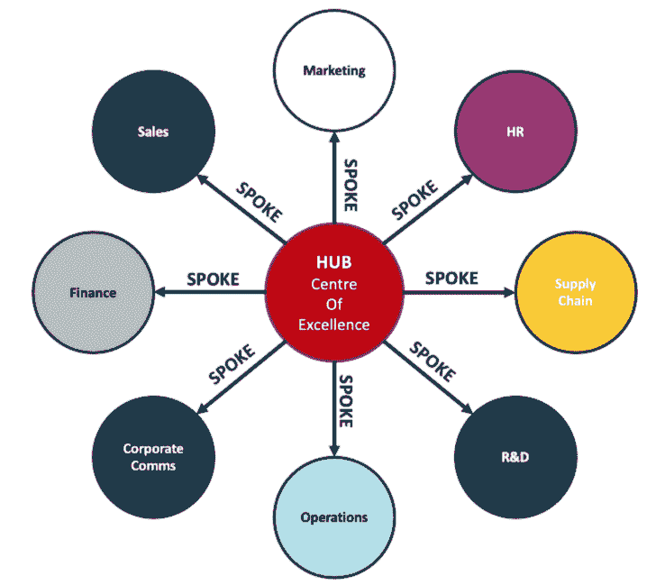

# 第十二章：数据科学团队

随着数据科学从一个新兴领域发展成为关键的商业职能，组织已经意识到，组建一个梦幻团队并不像雇佣一堆博士并指望一切顺利那样简单。

注意事项

数据科学不是一个人的努力，而是一个团队运动。

决策的质量不仅仅取决于个人的卓越，还取决于团队的集体智慧。

这需要一组富有远见的才能组合，从数据工程师的技术能力到产品经理的商业头脑，所有成员共同努力提取洞察、构建稳健的解决方案并推动影响。

通过与数据科学领导者和从业者的互动，我观察到，最有效的团队是那些拥抱认知多样性和心理安全原则的团队。它们将拥有不同背景、技能组合和思维方式的个体聚集在一起，为创新和问题解决创造了肥沃的土壤。它们还营造了一种环境，让团队成员感到有权利发言、挑战假设并从失败中学习。

在接下来的章节中，我们将深入探讨组成高效数据科学团队的关键角色，结合现实世界的例子和研究支持的洞察。我们将探讨每个角色如何参与决策过程，从框定问题到传达结果，以及这些角色之间的互动如何成就或破坏一个项目。

本章内容包括以下主题：

+   组建你的数据科学团队——关键角色与考虑事项

+   中心辐射模型

+   招聘的艺术

+   高效数据科学团队的运作方式

# 组建你的数据科学团队——关键角色与考虑事项

构建一个成功的数据科学团队需要精心策划的角色和技能组合。自从公司开始将数据科学、机器学习和人工智能引入其业务流程和产品以来，许多角色已发展壮大。

现在有许多不同的、 sometimes 重叠的角色，并非所有这些角色对每个团队都是必要的。

这里是组建团队时需要考虑的角色的细分，以及来自领先科技公司的洞察。

## 数据科学家

数据科学家是许多数据科学团队的核心，专注于将商业问题框定为机器学习任务，开发预测模型，并从数据中提取有价值的洞察。

### 职责

+   将商业问题框定为机器学习任务

+   开发预测模型

+   从数据中提取有价值的洞察

### 技能与知识

+   扎实的统计学、编程和领域知识基础

+   在某一领域的深厚专业知识与对整个数据科学流程的广泛理解

### 行业洞察

谷歌的数据科学团队强调“T 形”技能的重要性，每个成员在某一领域拥有深厚的专业知识，并对整个数据科学流程有广泛的理解。

## 机器学习工程师

机器学习工程师弥合了数据科学与软件工程之间的鸿沟，确保机器学习模型能够高效部署、扩展，并集成到生产环境中。

### 职责

+   在生产环境中部署和扩展机器学习模型

+   弥合数据科学与软件工程之间的鸿沟

+   确保模型高效、可靠，并能与现有系统无缝集成

### 技能与知识

+   精通机器学习和软件工程

+   了解生产级模型部署和扩展

### 行业洞察

Netflix 开创了“机器学习平台工程师”这一概念，负责构建工具和基础设施，以加速机器学习模型的部署。

## 数据工程师

数据工程师负责设计、构建和维护支持整个数据科学管道的数据基础设施，确保数据的高效收集、存储和处理。

### 职责

+   设计、构建和维护数据基础设施

+   确保数据的高效收集、存储和处理

+   使数据科学家能够专注于分析和建模

### 技能与知识

+   精通数据管道开发和管理

+   了解数据存储、处理和检索技术

### 行业洞察

Uber 在其数据工程能力上进行了大量投资，构建了一个强大的数据平台，支持组织内部的实时决策。

## MLOps 工程师

MLOps 工程师专注于简化机器学习模型的端到端生命周期，从实验到生产部署和监控，确保机器学习系统的可靠性、可扩展性和性能。

### 职责

+   精简机器学习模型的端到端生命周期

+   构建和维护用于机器学习模型持续交付的基础设施和流程

+   确保机器学习系统的可靠性、可扩展性和性能

### 技能与知识

+   机器学习运维和基础设施的专业知识

+   了解 DevOps 实践和工具

### 行业洞察

Uber 还在构建一个名为 Michelangelo 的 MLOps 平台上进行了大量投资，以支持其数据科学工作。

## 分析工程师

分析工程师将软件工程的最佳实践应用于数据管道和分析模型的开发，专注于构建和维护支撑商业智能和报告的数据基础设施。

### 职责

+   将软件工程的最佳实践应用于数据管道和分析模型

+   构建和维护支持商业智能和报告的数据基础设施

+   确保数据的可靠性、一致性和可访问性，支持决策制定

### 技能与知识

+   数据工程和数据分析的专业知识

+   了解软件工程的最佳实践

### 行业洞察

Airbnb 在开发分析工程角色方面走在了前沿，认识到需要一种专业技能来支持其数据驱动的文化。

## 软件工程师（全栈、前端、后端）

软件工程师在构建和维护利用机器学习和人工智能的 web 应用程序基础设施中发挥着重要作用，确保性能顺畅并提供个性化的数据驱动用户体验。

### 职责

+   构建并维护 web 应用程序基础设施

+   将机器学习模型集成到应用程序中

+   确保性能顺畅并提供个性化的数据驱动用户体验

### 技能和知识

+   精通 web 开发（全栈、前端或后端）

+   了解将机器学习模型集成到应用程序中的知识

### 行业洞察

Spotify 和 Netflix 等公司强调了软件工程与数据科学团队紧密合作的重要性，以提供个性化的数据驱动用户体验。

## 产品经理

产品经理定义数据驱动产品的愿景和路线图，优先排序功能，收集需求，并确保团队为最终用户提供价值。

### 职责

+   定义数据驱动产品的愿景和路线图

+   优先排序功能并收集需求

+   确保团队为最终用户提供价值

### 技能和知识

+   商业敏锐度和以客户为中心的方式

+   了解数据驱动产品的技术和商业方面

### 行业洞察

Meta（Facebook）强调了“数据产品经理”的角色，这些经理深刻理解数据驱动产品的技术和商业方面。

## 商业分析师

商业分析师充当数据科学团队与更广泛组织之间的桥梁，将业务需求转化为分析需求，支持数据映射，并帮助利益相关者理解数据驱动洞察的影响。

### 职责

+   充当数据科学团队与更广泛组织之间的桥梁

+   将业务需求转化为分析需求

+   支持数据映射并帮助利益相关者理解数据驱动洞察的影响

### 技能和知识

+   了解业务流程和需求

+   能够与技术和非技术利益相关者进行有效沟通

### 行业洞察

Airbnb 首创了“数据科学大使”的概念，这些大使嵌入到业务单元中，推动数据驱动决策的采纳。

## 数据故事讲述者/可视化专家

数据故事讲述者和可视化专家通过引人入胜的叙事和可视化，将复杂的数据洞察传达给非技术利益相关者，确保数据驱动的建议被理解并付诸实践。

### 职责

+   将复杂的数据洞察传达给非技术背景的利益相关者

+   创建引人注目的叙事和可视化

+   确保数据驱动的建议被理解并付诸实践

### 技能和知识

+   数据可视化和讲故事的专业知识

+   能够将复杂的概念简化，面向非技术受众

### 行业洞察

Spotify 已经投入大量资源，建立了一个强大的数据可视化实践社区，认识到在推动数据驱动文化中，有效沟通的重要性。

## 组建团队时的考虑事项

在组建数据科学团队时，考虑以下因素，以确保团队能够有效应对数据驱动项目的挑战：

+   **项目需求**：评估数据科学项目的具体需求。如果重点是开发数据产品，优先考虑机器学习工程师和数据工程师等角色。如果目标是推动战略决策，强调数据科学家和业务分析师等角色。

+   **业务领导力**：指派一位业务负责人，负责根据业务、最终用户和客户的需求设定优先级。此人应清楚地了解项目目标，并能够与数据科学团队及其他利益相关者进行有效沟通。

+   **技术领导力**：指派一位经验丰富的技术负责人，负责整体技术解决方案。此人应当深入了解数据科学流程，并能够指导团队做出符合项目目标的技术决策。

+   **协作与沟通**：在团队内培养协作与开放沟通的文化。鼓励团队成员分享知识、讨论挑战并共同寻找解决方案。定期的站立会议、代码评审和知识共享会议有助于建立一个强大而团结的团队。

+   **持续学习**：数据科学是一个快速发展的领域，因此支持团队成员的持续学习和技能发展至关重要。鼓励团队成员参加会议、研讨会和培训课程，保持对最新技术和最佳实践的了解。

+   **伦理考量**：由于数据科学和人工智能项目通常涉及敏感数据，并且有可能影响人们的生活，因此必须优先考虑伦理问题。确保团队了解数据隐私法规、机器学习中的公平性问题，以及数据和算法中的潜在偏见。培养负责任和透明的数据科学实践文化。

通过仔细考虑这些因素，并组建一个多样化、具备强大领导力的技能团队，你将能够推动成功的数据科学项目，为组织带来有意义的影响。

## 大型组织中的数据科学团队

一旦组织从只有一个数据科学团队发展到有多个团队时，就会出现如何构建团队结构以及团队间如何互动的问题。

或许你的数据科学或机器学习团队是唯一的团队，这个问题与你无关，但如果你领导一个需要组织多个团队的部门，理解不同的运营模型可以为你提供一些关于如何做的指导，具体取决于你希望实现的目标。

数据科学和分析部门有许多不同的运营模式，每种模式都有其优缺点。

其中包括以下几种：

+   **集中式**：一个庞大的数据科学中心团队，服务于业务的各个部门，通常隶属于 IT、技术或数据部门。

+   **联邦式**：嵌入在业务单元中的小型数据科学团队

集中式部门的优势在于部门内共享数据和技术、更专门化的角色以及改善的知识共享和内部能力开发。然而，这也意味着缺乏对业务需求和领域知识的深入理解。

联邦式团队更接近业务单元，因此更能理解其需求并具备更多的领域特定知识。

对于有多个数据科学团队的大型公司，还有一种适用的组织结构，这就是所谓的**轮毂和辐条**运营模型。

# 轮毂和辐条模型

轮毂和辐条运营模型可以在集中式部门（有助于内部能力开发和技能集中）与联邦式模型（更贴近不同业务部门）之间提供一个折衷方案。

## 什么是轮毂和辐条模型？

想象一下自行车轮。中心是轮毂，向外辐射的是辐条，连接到外圈。在数据科学的背景下，轮毂代表一个集中的数据科学、机器学习或人工智能团队，而辐条代表不同的业务单元或职能部门。该模型允许集中制定战略、治理和能力开发，同时为各个业务单元提供量身定制的支持。

+   **中心团队**：这是你的数据科学中心团队，由数据科学家、机器学习工程师、数据工程师和其他角色组成。他们负责制定整体数据战略、维护数据治理，并提供高层次的支持和专业知识。

+   **辐条**：这些是嵌入到各个业务单元中的数据专业人员。他们了解所在单元的具体需求和挑战，并与中心团队紧密合作，实施数据驱动的解决方案。他们可能是数据科学家，或仅仅是业务分析师/数据分析师。他们的工作可能涉及数据科学和分析，或者与所在部门合作，了解中央团队应提供的解决方案和洞察。

该模型在集中化与分散化之间提供了一种平衡，既保证了战略对齐，又提供了操作灵活性。

通常，组织会先建立一个集中式的数据科学、机器学习或人工智能团队来打造一项能力，然后再扩展到服务或在不同部门内运营。

以下是一个关于大型组织中中心辐射模型的示例说明，涵盖了不同的业务部门：

图 12.1：中心辐射模型

## 中心辐射模型的实际应用

让我们来看一下这个模型如何在不同的行业中发挥作用：

+   **制造业**：一家大型制造公司可能会建立一个机器学习团队，开发预测性维护解决方案（使用传感器数据准确预测何时机器可能出现故障或效率下降，进而需要维护或修理）。这一成功的解决方案可能会引起公司其他部门的兴趣，寻求符合他们需求的用例。例如，制造公司的**供应链**部门可能需要供需预测，以减少一次性所需库存量，减少缺货、缩短交货周期，并提高产品可用性。随后，财务部门可能也需要更准确的财务预测，以改善公司的资产负债表，并了解何时何地需要减少成本。随着时间的推移，一个服务于特定部门的小团队可以发展成为组织内部的核心能力，并服务多个用例。

+   **消费品与零售**：中心可以创建一个统一的消费者洞察和客户细分解决方案，而市场营销、销售和客户服务的辐射部门可以将这一模型应用于其具体职能。

## 构建中心辐射模型

创建一个成功的中心辐射模型需要精心规划和执行。以下是一些需要考虑的步骤：

1.  **识别中心**：首先识别你集中式数据科学团队所需的角色和技能。这包括数据科学家、机器学习工程师和数据工程师。

1.  **识别辐射部门**：接下来，识别那些可能从嵌入式数据专业人员中受益的业务单位。这些可能是如市场营销、销售、财务和运营等职能部门。

1.  **招聘合适的技能**：对于中心，你需要结合技术技能（如机器学习和数据工程）和战略技能（如数据治理和项目管理）。对于辐射部门，你需要既懂数据科学，又了解他们业务单元需求的人。

1.  **建立治理**：为中心和辐射部门如何协同工作创建明确的指导方针。这包括沟通协议、数据共享政策和决策流程。

1.  **衡量成功**：最后，建立衡量中心与辐射模型成功的指标。这些可以包括完成的数据驱动项目数量、决策速度和准确度的改善，以及收入或成本节约的增加。

中心与辐射模型是组织您的数据科学团队的强大方式，提供战略对齐和运营灵活性。这不仅仅是建立一个技术熟练的团队，还要创建一个能推动业务发展的凝聚力量。

随着我们进入下一节，我们将探讨在构建数据科学团队时如何招聘我们提到的角色。

# 招聘的艺术

组建一个高效的数据科学团队既是艺术也是科学。这不仅需要深入了解所需的技术技能，还需要能够识别出能在贵组织独特文化中蓬勃发展的个人。微软、OpenAI、Meta 和 Netflix 等顶尖科技公司已经掌握了这门艺术，构建了不仅技术精湛而且高度协作和商业敏锐的数据科学团队。

Jerome Pesenti，前 Meta AI 副总裁，曾表示：“在招聘人工智能和机器学习角色时，我们寻找具有坚实技术基础的人，同时也需要创造力、灵活性和真正能对社会产生影响的动力。最佳候选人不仅能开发强大的算法，还能批判性地思考如何负责任地部署 AI 系统，使之造福社会。”

寻找既有深厚技术专长又有真正影响力驱动力的人才是具有挑战性但又必不可少的，因为这是构建对业务有实质性影响的解决方案的关键。

成功招聘的一个关键方面是超越简历。尽管技术技能无疑很重要，但它们并非唯一需要考虑的因素。Google 前人力运营高级副总裁 Laszlo Bock 强调候选人“智力谦逊”的重要性。这意味着寻找那些不仅聪明而且能承认错误并向他人学习的个体。

强大的解决问题能力和建立令人难以置信解决方案的动力也是成功候选人的重要指标。DeepMind 的联合创始人兼 CEO Demis Hassabis 表示：“我们寻找那些对解决难题和构建了不起事物充满激情的人。AI 研究是一个长期的游戏，因此重要的是雇佣那些乐于不断学习并推动 AI 边界的人。”

在构建数据科学团队时，考虑到您组织的具体需求也很重要。您是希望构建数据产品、推动战略决策，还是两者兼顾？您的首次招聘将是最重要的，拥有优秀而敬业的技术负责人将有助于引领未来的招聘工作。

## 在哪里找到技术人才

在寻找顶尖数据科学/机器学习/人工智能（DS/ML/AI）人才时，虽然有更多的地方可以找到人才，但竞争也非常激烈。通常，表现出色的团队有一个强大的全职员工核心，并根据需要利用兼职或合同工以及外部顾问。这些人才池各有其优缺点。

### 全职员工

全职员工对于构建一个具有深厚机构知识并与公司目标长期对齐的强大核心团队至关重要。在招聘全职员工时，公司应超越传统渠道，如顶尖计算机科学项目，同时也应考虑以下内容：

+   来自顶级科技公司或创新型初创企业的经验丰富的员工，专注于前沿 AI 技术

+   拥有物理学、应用数学、统计学等定量学科的高级学位（MS、PhD），并具备强大的可转移技能的候选人

+   来自医疗、金融、机器人等行业的领域专家，他们可以为 AI 应用带来有价值的专业知识

### 兼职员工

利用合同工和兼职员工是一种快速引入专门技能、应对波动性工作量并测试潜在全职员工的有价值方式。一些优秀的合同 DS/ML/AI 人才来源包括：

+   专注于匹配顶尖技术自由职业者与公司合作的专业平台，如 Toptal、Upwork 和 Arc

+   顶级计算机科学、统计学等领域的 MS/PhD 项目校友网络

+   顾问市场平台，如 Catalant 和 Malt

+   专注于为 DS/ML/AI 人才提供招聘服务的人员配置公司

### 顾问和供应商合作伙伴

顾问和供应商合作伙伴在提供外部专业知识、加速关键项目并带来新视角方面具有巨大的价值。在以下几种情况下，利用顾问是非常有意义的：

+   启动高风险的“登月” AI 项目，在这些项目中，必须从一开始就拥有世界级的专业知识

+   实施重大的新机器学习平台或数据基础设施项目，需要具体技术的实际经验

+   为内部 DS/ML/AI 团队提供有针对性的培训和技能提升

+   对现有 AI 系统进行客观审计，以评估其公平性、稳健性、隐私保护等方面

一些顶尖的 DS/ML/AI 咨询公司和供应商合作伙伴包括：

+   麦肯锡分析（McKinsey Analytics）和 QuantumBlack

+   QualifAI 和 Stradigi AI（精品 AI 咨询公司）

无论使用哪种具体的人才来源组合，确保有明确的 DS/ML/AI 能力建设路线图，并确保全职团队、合同工和顾问之间有强有力的知识转移和协作都至关重要。多样化的视角和背景是关键，但团队必须在共同的目标和工作方式上保持一致。

# 高效能数据科学团队的运作方式

很少有团队能够发挥其最大潜力，即使是由高素质个体组成的团队，如果缺乏有效的合作、压抑的官僚主义或不完善的工具，项目也可能会崩溃。

以下是运营高效数据科学团队的一些指导原则。

## 跨职能合作至关重要

最具影响力的 DS/ML/AI 项目涉及数据科学家、ML 工程师、软件开发者、产品经理、设计师和主题专家之间的紧密合作伙伴关系。培养合作文化，打破这些职能之间的壁垒至关重要。

## 观点的多样性驱动创新

顶尖团队将来自不同背景的人汇聚一堂——不仅仅是在人口统计学方面，还包括学术训练、行业经验和思维方式。认知多样性帮助团队以更具创造性的方式解决问题。

## 从正确的问题开始

高效的团队不会仅仅跳进数据或算法中——他们首先确保深刻理解他们要解决的用户需求和业务目标。事先让产品、设计和业务利益相关者参与其中是关键。

## 投资于工具、基础设施和工作流程

随着现代 ML/AI 系统的复杂性，拥有正确的工具来管理数据、跟踪实验、版本控制模型等，对生产力有巨大的提升。标准化工作流程有助于团队扩展。通常，改进工具和基础设施的额外成本可以抵消团队为“让它运作”而花费在优化不完善工具上的额外时间。记住，数据科学/机器学习团队每花费一个小时在处理表现不佳的工具和基础设施上的成本，都可能大于使用更好的工具的成本。

## 持续适应和学习是必需的

鉴于 DS/ML/AI 领域的快速发展，高绩效团队会专门腾出时间进行学习——通过学术论文、会议、在线课程、内部知识分享等方式。好奇心是一个必备特质。

## 无情地专注于结果，而不是活动

最有效的 DS/ML/AI 团队专注于交付可衡量的影响，而不仅仅是发布代码或发表论文。这通常需要与官僚惯性作斗争，并抵制处理那些在智力上很有趣但无法创造实际价值的问题的诱惑。

例如，Google Brain 创始人 Andrew Ng 曾谈到在构建 Google AI 能力过程中，"战略性地专注于结果，而不仅仅是研究" 的重要性。他指出，许多公司犯了一个错误，把 AI 仅仅视为研究活动，而实际上，最具变革性的突破往往来自于研究团队与产品团队之间紧密合作，专注于现实世界的影响。

# 总结

在本章中，我们探讨了组建高效数据科学团队的关键角色和考虑因素，强调数据科学是一项需要多样化技能和专业知识的团队运动。我们讨论了组成数据科学团队的不同角色，包括数据科学家、机器学习工程师、数据工程师等，以及团队结构的不同模型，如嵌入式、集成式、轴心与轮辐模型。构建成功的数据科学团队需要仔细考虑您组织的具体需求，所需的技能和专业知识，以及最适合您项目的结构。

在深入了解这些角色和考虑因素之后，我们现在准备进入下一个关键步骤：*引入数据科学团队*。
