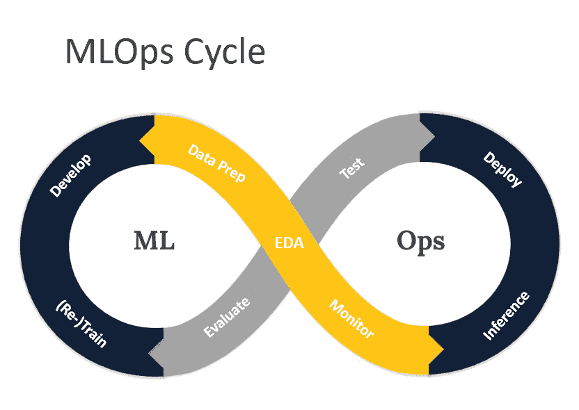

# 第十三章：管理数据科学团队

在管理数据科学团队时，你必须走一条与传统领导场景截然不同的道路。数据科学的不确定性——尤其是其对机器学习和人工智能的依赖——不仅需要技术专长，还要求有一种细致的领导方法。本章将简要探讨针对数据科学这一高风险、高创新环境的有效管理策略。

我们将从探讨数据科学团队的日常管理开始，强调创建一种重视快速实验、并从失败中积极学习的文化。

我们还将讨论如何管理数据科学项目中的固有不确定性，并通过 Netflix 的案例来帮助逐步交付价值。

此外，本章还将讨论研究导向型和生产导向型数据科学工作之间的平衡问题，重点介绍像 DeepMind 和 Google Brain 等组织采用的协作模式。伦理考量，尤其是在人工智能应用中的重要性，也将被讨论，并通过 Microsoft 和 Uber 的案例展示数据和模型治理的最佳实践。

目标是为领导者提供必要的理解和工具，以有效管理数据科学团队，确保在这个复杂且快速发展的领域中，项目成功和团队成长。

本章涵盖以下主题：

+   数据科学团队的日常管理

+   管理数据科学团队中的常见挑战

+   授权并激励你的数据科学团队

# 数据科学团队的日常管理

领导一个数据科学团队是一个独特的挑战，需要平衡创新和务实。为了推动具有影响力的数据科学，你必须营造一种实验文化，同时确保团队的努力能够创造商业价值。

## 促进快速实验和创新

成功的数据科学团队拥抱快速实验，并从失败中学习。作为领导者，要鼓励冒险精神，并庆祝从不成功的尝试中获得的经验教训。提供强大的工具和平台支持，如云计算服务，加速实验过程。Meta 以其“快速行动”的文化而闻名，这种文化鼓励在公司各个方面，包括人工智能和机器学习领域，进行快速实验和迭代。

## 管理固有的不确定性

数据科学项目本质上是不确定的，结果往往在开始时不明确。通过将项目结构化为一系列实验和里程碑来管理这种模糊性，每个里程碑都能产生新的洞察。对利益相关者保持透明，告知不确定性和潜在风险。敏捷方法有助于提供增量价值并维持利益相关者的参与。Netflix 的个性化算法展示了如何通过接受不确定性和持续迭代来推动显著的收益。

## 平衡研究和应用

数据科学团队必须平衡开放性研究与部署和维护生产模型。可以考虑创建专门的研究和应用工作流，同时促进两者之间的交叉影响。研究突破应为应用工作提供指导，而现实世界中的挑战应引导研究议程。DeepMind 和 Google Brain 等组织便体现了研究与应用之间的这种共生关系。

## 在数据科学和人工智能中有效沟通

有效沟通对于数据科学领导者至关重要。在讨论项目的技术方面时，使用精确的语言，明确说明算法、模型架构和评估指标。清晰解释模型的假设、局限性和潜在偏差。在与非技术性利益相关者沟通时，使用类比和可视化手段来传达复杂的概念，如神经网络或强化学习。突出团队工作的商业影响，例如改善客户定位或减少运营成本。定期分享项目进展，包括成功与面临的挑战。鼓励团队内部的开放对话，以促进协作和知识共享。

## 培养好奇心和持续学习的文化

顶尖科技公司认识到在其数据科学团队中培养好奇心和持续学习文化的重要性。正如 Google Brain 联合创始人、前百度首席科学家 Andrew Ng 所说：“*我相信创新能力和创造力是可以教授的过程。有方法可以让人们系统地创新或系统地* *变得有创造力。*”

为了培养这种文化，鼓励你的团队保持与最新研究和行业趋势的同步。提供参加会议、研讨会和在线课程的机会。通过定期的报告、午餐交流和内部论坛促进知识共享。鼓励团队成员追求个人项目并探索新想法，即使这些想法与当前的商业目标不完全一致。

## 接受同行评审和协作

建立同行评审与合作的文化对于维持高质量的工作并推动持续改进至关重要。鼓励团队成员定期与同事分享他们的代码、模型和发现，接受反馈和建议。实施结对编程或代码审查实践，以便发现错误、分享知识，并确保遵守最佳实践。创造一个心理安全的环境，让团队成员能够自由地给予和接收建设性的批评，并理解这些批评旨在改善工作，而非针对个人。通过拥抱同行评审与合作，你可以在数据科学团队中创造一种卓越和共同拥有的文化。

领导一个数据科学团队需要应对该领域独特的挑战。通过培养实验精神、管理不确定性、平衡研究与应用、有效沟通、培养好奇心和持续学习的文化，并拥抱同行评审与合作，你可以使团队在这个动态的领域中取得成功。

在下一部分，我们将探讨管理数据科学团队中的一些常见挑战以及如何应对它们。

# 管理数据科学团队的常见挑战

管理数据科学团队可能是一个复杂的任务，尤其是对于刚接触该领域的人来说。数据科学是一个多学科的领域，需要独特的技能组合，管理这样的团队可能会面临多个挑战。让我们探讨一些这些挑战以及如何克服它们。

## 挑战 1 – 招聘和留住顶尖人才

正如我们在上一章中讨论的，招聘和留住一支优秀团队是解决数据科学团队可能遇到的所有挑战的基础。

引用谷歌首席决策科学家 Cassie Kozyrkov 的话：“*找到并留住熟练的数据科学家是一个主要挑战，因为需求* *和竞争非常激烈。*”

一个强有力的入职培训过程对于让新员工成功至关重要，它帮助他们熟悉公司的工具、流程和文化。

### 克服这一挑战

有几种方法可以帮助你克服招聘和留住优秀人才的挑战：

+   **招聘**：

    +   不要只局限于从传统计算机科学背景的候选人中寻找人才，可以从技术初创公司、学术界或大型科技公司中寻找具有强大机器学习和领域专长的候选人。

    +   寻找具有“知识谦逊”的个人，他们能够从他人那里学习。

    +   在面试时，了解面试者在以前的职位上产生了什么影响。 他们建造了什么？ 他们取得了什么成就？ 这比他们担任过的职位或拥有的证书更为重要。

    +   建立一个全职员工基础，并根据需要利用兼职合同工和顾问来扩展团队。

+   **入职培训**：

    +   制定清晰的入职流程和文档，帮助新员工了解公司文化、工具和工作流程。这将帮助他们更快、更有效地融入团队。

    +   组织新员工与团队其他成员的会议，让他们建立必要的联系，并获得与工作相关的重要知识。

    +   为新员工提供一个初步的小项目，由资深团队成员进行一些监督，帮助他们快速上手并通过实践积累与工具和技术的熟悉度。

+   **留住人才**：

    +   给予值得信任的顶尖人才自主权，让他们发挥创造力并进行创新。优秀的人才希望能对自己的工作负责，而不是受到微观管理。前 Yahoo!总裁兼 CEO 玛丽莎·梅耶提到创新过程中良好环境的重要性，她说，“*在技术领域，关键是人，招募到最优秀的人，留住他们，培养创造性的环境，帮助找到创新的方式。*”苹果已故 CEO 史蒂夫·乔布斯也相信聪明员工的自主权：“*雇佣聪明的人并告诉他们该做什么没有意义；我们雇佣聪明的人是为了让他们告诉我们该做什么。*”

    +   向团队展示明确的使命，告诉他们你们正在努力实现的目标是什么。特斯拉和 SpaceX 的埃隆·马斯克提倡挑战性工作来留住顶尖人才：“*当人们知道目标是什么以及为什么时，他们工作会更好。*”

    +   为团队提供成长和发展的机会。理查德·布兰森曾说，“*好好训练员工，让他们有足够的能力离开，但对待他们要好到他们不想离开。*”

+   **解雇员工**：

    +   **在情况不合适时果断行动**：OpenAI CEO、前 Y Combinator 总裁 Sam Altman 强调，当员工显然不适合时，迅速解雇的重要性。在他关于招聘与解雇的博客中，Altman 表示，“*你不可能 100%正确地招聘到合适的人。当显然不行时，不太可能会变得好起来。与其拖延不如迅速分开，这样对所有人都有好处，而不是抱有不现实的希望事情会变得更好。*”他认为，拖延只是让所有人处境更糟。

    +   **要有同情心但要清晰明确**：虽然解雇员工从来不是一件容易的事，但重要的是要以同情心和清晰度来处理这种情况。正如 Altman 所建议的，“*解雇员工是创始人最痛苦的事情之一，但你必须尽早处理，信任这一切会比拖延更好。*”在传达这一决定时，要直接而诚实地说明解雇的原因，并为员工提供必要的支持，如遣散费或求职帮助。记住，你处理这些情况的方式将影响团队的士气和对领导的信任。

通过采取一种全面的人才管理方法，平衡技术技能、软技能和团队组成，数据科学领导者可以构建出能够带来变革性业务影响的高效团队。招聘和留人的基础对克服我们将要探讨的其他挑战至关重要。

## 挑战 2 – 将项目与业务目标对齐

数据科学领导者面临的关键挑战之一是确保他们团队的项目与公司的战略目标对齐。如果没有这种对齐，即使是最具技术含量的项目也可能无法带来有意义的业务价值。

### 克服挑战

为了将数据科学项目与业务目标对齐，请考虑以下策略：

+   **理解业务**：花时间深入理解公司业务模型和战略优先事项。参加领导会议，阅读公司报告，并与其他部门的同事互动，以获得业务的整体视角。

+   **与利益相关者合作**：与业务利益相关者密切合作，识别能够解决他们最紧迫挑战和机会的高影响力项目。在项目规划过程中让他们参与其中，确保项目范围和交付物能够满足他们的需求。

+   **优先排序与迭代**：采用数据驱动的方法，根据项目的潜在影响、可行性和与业务目标的对齐度来优先排序。愿意根据变化的业务需求对不再对齐的项目进行调整或停止。

+   **传达价值**：定期沟通你的团队项目为业务带来的价值。使用指标和案例研究来展示你的工作如何推动关键结果，例如收入增长、成本节约或提升客户体验。

通过将数据科学项目与业务目标对齐，领导者可以确保他们的团队交付具有高影响力的工作，推动组织的有意义结果。

## 挑战 3 – 管理固有的不确定性

数据科学项目通常涉及较高的不确定性，因为实验和模型的结果往往难以预测。管理这种不确定性是数据科学领导者面临的一个关键挑战，他们必须在探索与创新的需求与有限资源和时间表的现实之间找到平衡。

### 克服挑战

为了管理数据科学项目的固有不确定性，请考虑以下方法：

+   **拥抱风险**：

    +   鼓励你的团队采取经过深思熟虑的风险，进行实验来测试新想法和方法。创造一种重视学习和快速迭代而非完美的文化。

    +   特斯拉和 SpaceX 的 CEO 埃隆·马斯克强调了管理风险的重要性：“*当某件事足够重要时，即使概率不利于你，你也会去做*。”

+   **快速原型设计**：

    +   创建一个快速创建实验和原型功能的系统。对于机器学习，数据科学家和机器工程师能够快速运行实验、训练、评估并迭代机器学习模型是至关重要的。目标是尽可能减少训练和评估模型的周期时间。减少这个周期时间将使机器学习工程师能够训练出高性能模型并快速投入生产，之后这些模型可以迅速迭代和改进：

        +   投资时间创建可重用的管道来训练、评估、比较和部署机器学习模型，从长远来看可以节省时间

        +   开源软件，如 MLflow，和云平台，如 Azure AI Studio、AWS SageMaker、AWS Bedrock 和 Google Vertex AI，提供了训练和微调机器学习模型的功能，同时跟踪这些实验

    +   亚马逊创始人兼首席执行官杰夫·贝索斯强调实验的重要性：“*如果你每年做的实验数量翻倍，你的创造力也会翻倍*”

+   **快速失败**：认识到失败是创新过程的自然部分。重要的是不要让失败的项目拖延下去。一旦实验显然无法带来结果，或者项目正在失败，你必须迅速切断它。许多项目往往在这个时候仍然持续，浪费宝贵的时间和资源，而显然它们无法带来任何价值。有时，这种情况可能是模糊的，不确定是坚持还是转向。如果有任何数据表明项目不会带来明确、可衡量的价值，就要果断行动。如有必要，凭直觉做决定。

通过拥抱不确定性并使用管理风险的策略，数据科学领导者可以创建一个促进创新并推动突破性成果的环境。

## 挑战 4 – 扩展和实现模型

一旦数据科学团队开发出了成功的模型，接下来的挑战是将其扩展并实现实际应用。这不仅涉及基础设施和部署等技术问题，还包括将模型融入现有业务流程，并确保其长期可持续性的组织挑战。

### 克服挑战

为了有效地扩展和实现模型，请考虑以下策略：

+   **为生产做好计划**：从项目开始之初，就要规划模型如何部署和维护在生产环境中。这包括考虑数据管道、基础设施需求以及监控和维护需求等因素。

+   **消除机器学习** **与运营之间的差距**：

    +   在传统的软件工程中，DevOps 的概念引发了革命。这个概念消除了开发软件的团队与部署和操作它的团队之间的隔阂，形成了一个对产品端到端负责的团队。

    +   这一概念现在已扩展到基于机器学习的软件，其中**机器学习运维**（**MLOps**）提供了一个框架，帮助团队将机器学习模型投入生产，并在此过程中进行维护、迭代和改进。如*图 13.1*所示，MLOps 周期涵盖了开发、测试、部署和监控机器学习模型的关键阶段。

    +   诸如机器学习工程师、人工智能工程师和 MLOps 工程师等角色，已经与数据科学家一同崛起，并且现在期望这些职位的从业者具备工程技能，能够在生产环境中部署和监控可靠、稳健的模型：

图 13.1：机器学习模型的 MLOps 生命周期示例

+   **建立治理**：建立明确的模型部署、监控和维护的治理流程。这包括明确角色与责任，设定绩效指标和阈值，并创建模型更新与再训练的流程。

+   **持续监控和改进**：一旦模型投入生产，需持续监控其性能，并寻找改进的机会。这可能涉及用新数据重新训练模型、调整其超参数，或探索新的架构和技术。

通过为生产做好规划、与工程团队协作、建立治理流程，以及持续监控和改进模型，数据科学领导者可以确保他们团队的工作对业务产生持久影响。

## 挑战 5 – 以伦理方式部署稳健、可靠、公平的模型

随着数据科学模型日益融入关键业务流程和决策制定，确保这些模型稳健、可靠、公平成为一个主要挑战。存在偏见、脆弱或不透明的模型可能会导致意外后果，并破坏组织的信任。

### 克服这一挑战

为了部署稳健、可靠、公平的模型，请考虑以下策略：

+   **优先考虑模型可解释性**：开发可解释且易于理解的模型，以便其决策过程能够被理解和审计。使用特征重要性分析、决策树或 SHAP 值等技术，提供模型如何得出预测结果的可见性。

+   **测试公平性和偏见**：使用人口平衡、均等机会或反事实公平等技术，严格测试模型的偏见和公平性问题。积极主动地识别并减轻对受保护群体的任何不公平影响。

+   **建立伦理指南**：为人工智能模型的开发和部署制定明确的伦理指南和原则。这可能包括数据隐私、知情同意、人类监督和问责等方面的考量。

+   **促进跨学科协作**：将来自不同学科的专家汇聚在一起——不仅包括数据科学和工程，还包括社会科学、法律和伦理——以为人工智能模型的开发和部署提供支持。培养跨学科合作与对话的文化。

通过优先考虑模型的可解释性、测试公平性和偏见、建立伦理指南以及促进跨学科合作，数据科学领导者可以确保他们团队的模型以负责任和可信赖的方式部署。

# 赋能和激励你的数据科学团队

有效地赋能和激励数据科学团队需要激发他们内在的动力。正如丹尼尔·平克在他的书《Drive》中所讨论的，知识工作者的关键动机因素是自主性、精通和目标。

通过赋予数据科学团队自主决策的权力，使他们在自己领域中达到精通，并将他们的工作与更大目标联系起来，你可以挖掘出内在动机的深层潜力。一支赋能且富有动力的团队不仅会交付更好的结果，还能在工作中找到成就感和意义，从而促进长期的参与感和创新。

在接下来的部分中，我们将探讨数据科学团队如何与其他团队和利益相关者合作，并如何赋能其他团队使用数据。这将进一步提升你领导数据驱动型组织的能力。

## 与其他团队和外部利益相关者合作，并赋能他们使用数据

作为数据科学领导者，你的团队工作影响力必须超越你们自身。你们训练的机器学习模型、发现的统计见解或开发的人工智能应用需要在组织的其他部分或直接影响公司客户方面产生影响。

要真正推动数据驱动的决策，你必须与其他团队有效协作，赋能他们在工作中利用数据。这需要技术翻译、关系建设和推广的结合。

### 推动数据科学工作的采纳和影响

最终，数据科学的价值在于解决方案的采纳和推动业务影响。为此，数据科学领导者必须与工程、产品和业务团队密切合作，将解决方案整合到生产工作流中。

首先明确界定成功的指标，并将其与预期结果对齐。早期并频繁地让利益相关者参与，收集需求和反馈。在解决方案开发过程中，定期提供演示和试点结果，以建立认同感和信任。

在过渡到生产环境时，不要只是将模型交给工程团队。与团队密切合作，确保正确的部署、监控和维护。提供文档和培训，以便实现长期的所有权。

部署后，评估并传达解决方案的影响。广泛分享成功案例并与利益相关者庆祝胜利。Airbnb 将其数据科学成功的大部分归因于专注于量化和传达影响的这一焦点。

一个出色的机器学习团队将影响力模型交付至 Uber 工程团队的生产环境中。

这个团队开发了一个名为 Michaelangelo 的内部平台，用于部署安全和登录认证的机器学习模型，搜索自动完成和结果排序，接送预计时间和地图路线，定价，行程预计时间，产品个性化，乘客/司机匹配，安全派遣，支付欺诈检测，退款预防和客户支持：

您可以在[Uber 的实时机器学习应用](https://www.uber.com/en-GB/blog/from-predictive-to-generative-ai)中查看。Uber 乘客应用中几乎每个客户接触点都融入了某种机器学习技术。作为一个以技术为先的公司，Uber 拥有强大的工程团队优势，但未来最成功的公司，无论是银行、零售商还是保险公司，也将在其核心产品中部署机器学习和人工智能功能。

### 授权其他团队利用数据

除了直接交付解决方案外，数据科学领导者还可以通过授权其他团队有效处理数据来放大其影响。这涉及提供正确的工具、培训和支持，以实现常见数据任务的自助服务模型。

为团队提供培训和资源，提升其数据基础知识。创建一个实践社区，让人们能够相互学习并分享最佳实践。

通过授权其他团队直接处理数据，您可以扩展数据科学在整个组织中的影响。这实现了一个良性循环，更多人员开始对数据提出问题，发现新的机会，并推动数据驱动决策文化。

与其他团队有效合作并授权他们使用数据是数据科学领导力的关键方面。通过与专家合作，推动解决方案的采用，并为其他团队提供自助服务，您可以放大数据科学的影响并加速组织的数据成熟度。

# 总结

在本章中，我们探讨了管理数据科学团队时面临的独特挑战和机遇，包括培养快速实验的文化、管理固有的不确定性、平衡研究与生产工作、有效沟通、培养好奇心和持续学习、实施同行评审与协作、赋能团队、使项目与商业目标对齐、扩展和运营化模型、部署稳健、可靠、公正且伦理的人工智能、推动数据科学工作被采纳，以及赋能其他团队利用数据。尽管在管理数据科学团队时追求战术卓越至关重要，但实现数据科学的全部潜力需要那些能够驾驭推动数据驱动转型的战略挑战的领导者。

在下一章中，我们将探讨作为数据科学领导者，您如何在本书之外继续成长与学习，如何在不感到不知所措的情况下，保持与机器学习和人工智能发展的同步，如何运用您作为数据科学领导者所获得的技能来领导开发和部署未来解决方案的团队，无论是在生成性人工智能领域还是更广泛的领域。
