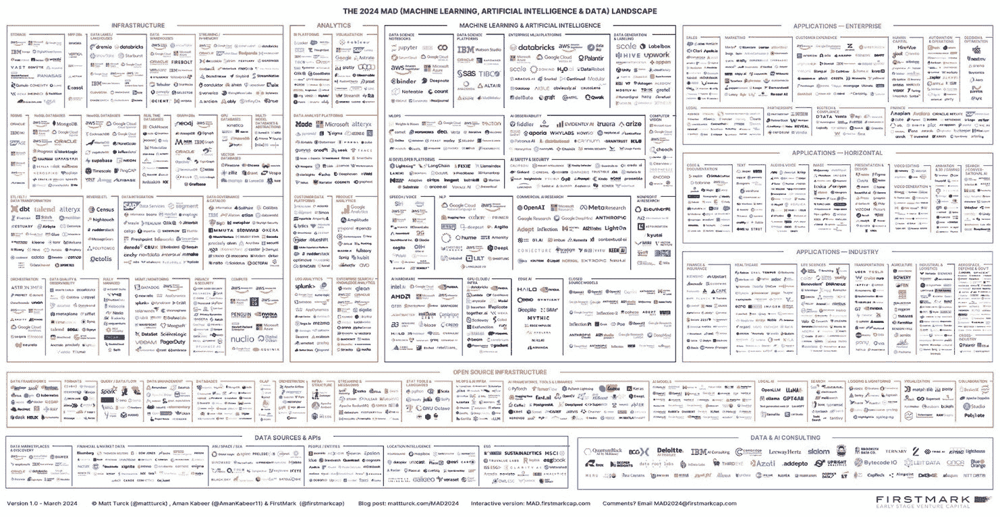
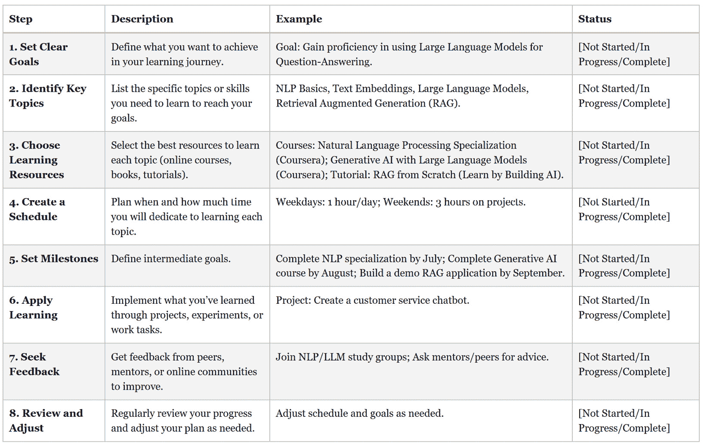

# 第十四章：继续作为数据科学领袖的职业旅程

作为数据科学领袖开始一份新职业，或者继续你已有的职业，既令人生畏，又充满激动。这本书为你提供了广泛的数据科学工具包。然而，这个领域正在不断发展。机器学习和人工智能正在迅速进步。

本章的最终目标是为你提供指导。你将学习如何与新兴技术保持同步。你可以专注于某一领域，成为该领域的思想领袖。或者，你也可以在数据科学、机器学习或人工智能等不同领域成为专家。

我们将讨论如何在组织内外建立网络，并推动数据驱动的思维。我们将探讨一些资源，帮助你保持对趋势的了解，并在职业生涯中持续学习。

数据科学、机器学习和人工智能的进展可能会让人感到不知所措。在本章中，我们将提供一些保持更新的建议，帮助你专注于重要的进展，并过滤掉杂音。

# 浏览新兴技术的领域

数据科学、机器学习和人工智能的进展速度非常快。每周都有开创性的研究论文发布，每月都有最先进的大型语言模型发布，每月也有新的深度学习框架发布。跟上这些进展可能感觉非常困难。整个领域广阔且多样，了解所有内容几乎不可能。

请看下面的机器学习、人工智能和数据技术工具及其在 2024 年的可视化图表。试图学习这些所有技术将是一项艰巨的任务。

图 14.1：2024 年机器学习、人工智能和数据领域的全貌

跟上最新动态是一个巨大的挑战。你如何保持更新？你如何在职业生涯中不断进步？

首先，记住这一点：你不需要知道所有的内容。你不需要精通每一个工具。专注于与你相关的内容。专注于你的工作和兴趣。

在接下来的部分中，我们将讨论如何将你的关注点缩小到与数据科学/机器学习/人工智能相关的行业和领域，这对你的职业生涯最为有益。

# 专注于某一行业

数据科学、机器学习和人工智能领域正在以指数速度发展。每天都有新的突破和发现。然而，尽管这些技术快速进步，它们在各行业的应用往往滞后于这些进展的速度。原因有很多，包括监管、数据隐私问题和合规要求。

然而，限制机器学习和人工智能在不同领域广泛应用的最重要因素之一是技能和知识的短缺，以及不知道如何应用它们。除非你在一个前沿实验室从事人工通用智能的研究，否则你很可能会聚焦于在某一特定行业内应用数据科学、机器学习或人工智能。

作为数据科学领导者，你可以通过拥有扎实的 DS/ML/AI 技术和发展趋势的理解，同时具备特定行业的领域专业知识来脱颖而出。这样的技能组合将使你能够识别最合适的应用场景，将 DS/ML/AI 技术应用于推动价值和创新。

确定应该聚焦于哪些行业或领域可能是一个困难的任务。你可能在职业生涯中跨足了不同的行业，但不确定自己是否会在某些行业中感到满意。为了帮助你做出决策，可以考虑以下因素：

+   **经验**：你在哪些行业工作过？是否有特别偏好的行业？如果有，为什么？你的经验可以为你提供宝贵的见解，帮助你识别哪些行业最适合你的技能和兴趣。

+   **兴趣**：是否有特别感兴趣的行业，无论你是否已经在其中工作过？例如，你是否对汽车行业、教育行业或医疗行业充满热情，愿意在这些领域工作？追随你的兴趣可能会带来更加充实和富有挑战性的职业生涯。

+   **技能组合**：你的技能是否最适合某一特定行业？例如，如果你对预测和时间序列分析有深入的理解，那么在金融行业工作可能会提供丰富的机会来运用这些技能。或者，如果你对自然语言处理和大语言模型有扎实的理解，那么涉及大量文本的行业，如法律或出版媒体，可能会引起你的兴趣。如果你有丰富的计算机视觉经验，在医学影像领域工作可能会是一个很好的知识应用方向。尝试将你的技术兴趣和专业知识与特定行业对接，以最大化你的影响力和价值。

+   **地点**：你的地理位置可能会影响你所能获得的机会。例如，如果你在伦敦工作，作为全球金融中心，你可能会在金融服务领域找到许多机会。类似地，如果你住在华盛顿 D.C.附近，你可能会在法律和政府部门找到很多机会。尽管远程工作和 DS/ML/AI 的数字化特性使得地理位置的限制有所减少，但仍然值得考虑你所在地区的本地机会。

+   **伦理学**：最后，你的伦理原则可能会鼓励或劝阻你在某些领域工作。例如，如果你反对赌博，你可能会想避免在博彩行业工作，而这个行业确实需要数据科学家。或者，如果你是和平主义者，你可能会选择避免在国防行业工作。相反，如果你有道德上的驱动力，希望在那些造福社会的行业工作，你可能会倾向于选择可再生能源、医疗保健或教育等行业。将你的工作与价值观对齐，能够带来更强的使命感和职业满足感，比如你若有意愿为社会作出贡献，可以选择可再生能源、医疗保健或教育等行业。

正如在某个行业内的专业化能够使你成为数据科学领域的领导者，同样，在数据科学、机器学习和人工智能这个广泛领域内专注于某个具体子领域，也能让你脱颖而出。在下一节中，我们将探讨数据科学/机器学习/人工智能中的一些子领域，帮助你思考可能希望专注的方向。

# 专业化某个领域

当“数据科学”这一术语还较为新颖，并且公司开始雇佣数据科学家时，数据科学家需要了解的领域范围要狭窄得多。拥有扎实的统计学理论与应用知识，以及有监督和无监督机器学习的知识——这些内容是我们在本书中已经涉及的——可能足以应对大多数应用型数据科学项目。

在学术界，情况有所不同，深度学习领域取得了快速进展，像自然语言处理、计算机视觉和强化学习等领域也取得了巨大突破。部分进展得益于理论上的突破，特别是在神经网络架构方面，另一部分则归功于研究人员可获取的大量计算资源和数据的增加。

这种学术进展使得数据科学、机器学习和人工智能等领域在各行业中的应用范围大大扩展。

数据科学、机器学习和人工智能的每个子领域，都可能是博士学位课题或整个学术生涯的主题，因此对于行业内的从业者来说，几乎不可能在每个子领域都获得超过表面层次的理解。

鉴于数据科学/机器学习/人工智能（DS/ML/AI）领域的广泛性，专注于对工作最有用的主题并专业化你的知识是非常有意义的。

让我们探讨一些子领域以及它们在实际场景中的应用。思考一下你所在的行业，以及每个领域的潜在应用，这样你就可以规划职业生涯中应该关注的重点：

+   **自然语言处理（NLP）和大型语言模型（LLM）**：自然语言处理和大型语言模型彻底改变了我们与文本数据互动的方式。像 OpenAI 和 Anthropic 这样的公司开发了强大的语言模型，如 GPT-3 和 Claude，这些模型能够生成类人文本、回答问题，甚至编写代码。这些模型被广泛应用于聊天机器人、虚拟助手、内容创作和语言翻译等领域。例如，受欢迎的语言学习应用 Duolingo 使用 NLP 提供个性化学习体验，并评估用户的口语能力。

+   **计算机视觉**：计算机视觉改变了机器感知和解释视觉数据的方式。它在自动驾驶、面部识别、医学影像等领域有着广泛的应用。例如，特斯拉在其自动驾驶功能中大量依赖计算机视觉，使其车辆能够在道路上导航并避开障碍物。在医疗保健领域，像 Zebra Medical Vision 这样的公司使用计算机视觉分析医学影像，检测癌症和骨质疏松等疾病的迹象。

+   **强化学习**：强化学习是机器学习的一个子领域，智能体通过在环境中做出决策来最大化奖励信号。它已被应用于机器人技术、游戏玩法，甚至是优化复杂系统，如数据中心。Alphabet 旗下的人工智能研究公司 DeepMind 使用强化学习训练智能体，使其能够在围棋和星际争霸 II 等游戏中达到超人水平。在能源领域，谷歌通过强化学习优化数据中心的冷却，减少了多达 40% 的能耗。

+   **时间序列分析与预测**：时间序列分析与预测在金融、经济学和供应链管理等领域至关重要。公司利用这些技术预测股价、预测需求并优化库存水平。Facebook（现为 Meta）使用时间序列分析预测用户互动，并检测平台中的异常情况。在零售行业，像沃尔玛和亚马逊这样的公司使用时间序列预测来预测需求并优化其供应链。

+   **推荐系统**：推荐系统用于根据用户的偏好和行为提供个性化推荐。它们在电子商务、流媒体服务和社交媒体中无处不在。例如，Netflix 使用推荐系统根据用户的观看历史推荐电影和电视节目。Spotify 使用类似的技术来创建个性化播放列表并向用户推荐新艺术家。在电子商务中，亚马逊的推荐系统通过根据用户的浏览和购买历史推荐产品，负责其销售的显著一部分。

+   **图形分析与图神经网络**：图形分析和图神经网络用于分析和学习以图形或网络形式表示的数据。它们在社交网络分析、欺诈检测和药物发现等方面有应用。LinkedIn 利用图形分析为用户的职业网络提供见解，并推荐潜在的联系。在制药行业，像诺华和辉瑞这样的公司利用图神经网络来发现新药，并预测其疗效和安全性。

+   **地理空间分析**：地理空间分析涉及分析和可视化具有地理组件的数据。它在城市规划、环境监测和物流等领域有广泛应用。Uber 利用地理空间分析来优化其共享出行服务，通过预测需求并高效地为司机规划路线。在农业领域，像拜耳和孟山都这样的公司利用地理空间分析来监测作物健康并优化肥料和农药的使用。

+   **边缘计算与边缘人工智能**：边缘计算与边缘人工智能涉及在网络边缘的设备上处理数据并运行机器学习模型，而不是在云端进行。这在物联网、自动驾驶汽车和工业自动化等领域有着广泛应用。特斯拉利用边缘计算和边缘人工智能，使其汽车能够基于来自摄像头和传感器的数据实时做出决策。在制造业，像西门子和博世这样的公司利用边缘人工智能来监测设备健康状况并预测维护需求。

+   **MLOps**：MLOps，或机器学习运维，是一个新兴领域，专注于机器学习模型在生产环境中的部署、监控和管理。它借鉴了 DevOps 的原则，并将其应用于机器学习生命周期。像 Uber 和 Netflix 这样的公司已经在 MLOps 方面投入了大量资源，以确保其机器学习模型的可靠性、可扩展性和可维护性。像 Kubeflow 和 MLflow 这样的工具已经出现，帮助组织优化其 MLOps 工作流程。

专注于这些领域之一可以让你成为那些希望利用数据科学/机器学习/人工智能力量的组织中的宝贵资产。通过在特定领域中发展深厚的专业知识，你可以把自己定位为那些寻求创新并希望领先一步的公司的首选资源。无论你选择专注于自然语言处理、计算机视觉、强化学习，还是其他任何激动人心的子领域，你都能找到大量机会，应用你的技能并在世界上产生真正的影响。

在数据科学、机器学习和人工智能这一迅速发展的领域中，持续学习不仅是有益的——它是必不可少的。在接下来的部分，我们将探讨如何有效地继续学习而不至于感到不堪重负，同时仍然专注于职业成长。

# 拥抱持续学习

作为数据科学的领导者，了解最新的进展、技术和工具对于推动创新和保持竞争力非常重要。然而，随着数据科学、机器学习和人工智能的快速发展，跟上进度可能会让人感到不堪重负。

这里有一些有效的学习方法，可以让你在不感到不堪重负的情况下继续学习，同时专注于职业发展。

## 在线课程

在线课程是学习新技能或加深对特定主题理解的好方法。Coursera、edX 和 Udacity 等平台提供来自顶级大学和行业领袖的各种数据科学、机器学习和人工智能课程。一些值得注意的课程包括：

+   **数据科学课程**：

    +   **约翰霍普金斯大学数据科学专业课程（Coursera）**：这个综合性系列课程涵盖从数据处理到创建数据产品的内容，适合初学者。

    +   **密歇根大学应用数据科学与 Python（Coursera）**：这个专业课程涵盖使用 Python 库如 pandas、Matplotlib 和 scikit-learn 进行数据分析、可视化和机器学习。

    +   **加州大学圣地亚哥分校数据科学微硕士（edX）**：这个课程非常适合那些希望理解数据科学核心概念的人，包括数据整理、分析和机器学习。

+   **机器学习课程**：

    +   **斯坦福大学机器学习（Coursera）**：由 Andrew Ng 教授，这是最受欢迎和最受推崇的机器学习入门课程之一。

    +   **deeplearning.ai 深度学习专业课程（Coursera）**：由 Andrew Ng 主讲，这个系列深入探讨神经网络和深度学习技术。

    +   **国立研究大学高等经济学院高级机器学习专业课程（Coursera）**：该课程专为具有坚实机器学习基础的学员设计，涵盖了贝叶斯方法和强化学习等高级主题。

+   **AI 课程**：

    +   **人工智能：现代方法（Peter Norvig 和 Sebastian Thrun 著，Udacity）**：该课程提供了 AI 技术的广泛概述，包括搜索算法、游戏玩法和优化。

    +   **哈佛大学 CS50 人工智能与 Python 入门（edX）**：作为专业证书项目的一部分，本课程是理论与实践 AI 知识的绝佳结合。

    +   **deeplearning.ai 深度学习专业课程（Coursera）**：聚焦于深度学习的基础和高级概念，涵盖神经网络、优化和超参数调整。

+   **生成式 AI 课程**：

    +   **Google Cloud 生成式 AI 入门**：本课程介绍了生成式 AI 的基础，包括大语言模型和伦理考虑，适合初学者。

    +   **AWS 生成式 AI 开发者工具包**：提供使用 AWS 产品的实践培训，适合那些已经在 AWS 生态系统中工作并希望扩展技能的人。

## 云认证

主要云服务提供商提供的认证可以帮助你了解如何在云平台上构建数据科学/机器学习/人工智能解决方案，并向雇主展示你的专业能力。以下是一些与数据科学、机器学习和人工智能相关的受认可认证：

### AWS（亚马逊 Web 服务）

+   **AWS 认证机器学习 -** **专业**：

    +   **概览**：该认证验证了你设计、实施、部署和维护机器学习解决方案的能力。它涵盖了使用 AWS 服务进行模型训练、调优和部署的最佳实践。

    +   **涵盖的技能**：数据工程、探索性数据分析、建模、机器学习实施和操作。

### Azure（微软 Azure）

+   **微软认证：Azure 人工智能** **工程师助理**：

    +   **概览**：该认证专注于实施利用 Azure 认知服务、Azure 机器学习和知识挖掘的人工智能解决方案。

    +   **涵盖的技能**：分析解决方案需求、设计人工智能解决方案、将人工智能模型集成到解决方案中，以及部署和维护人工智能解决方案。

+   **微软认证：Azure 数据** **科学家助理**：

    +   **概览**：验证应用数据科学和机器学习来实现并运行 Azure 上的机器学习工作负载的专业知识。

    +   **涵盖的技能**：数据准备、特征工程、建模和模型管理。

### GCP（谷歌云平台）

+   **谷歌云专业机器学习** **工程师**：

    +   **概览**：该认证证明了使用 GCP 设计、构建和生产化机器学习模型以解决业务挑战的能力。

    +   **涵盖的技能**：机器学习模型设计、开发与部署、扩展、自动化和监控。

如果你知道自己将与这些云服务提供商之一合作，这些认证可以帮助你或你的团队学习相关技能，以开始开发基于云的数据科学、机器学习和人工智能应用。

## 技术教程和文档

实践教程和官方文档在学习新工具或框架时是宝贵的资源。当你使用新技术、框架或库时，最佳的信息来源通常是官方文档或教程。

## 学习计划框架

以下检查清单可作为学习新主题、学习理论以及获得实践经验的简单框架。

图 14.2：学习计划检查清单

除了正式学习关键主题外，了解数据科学、机器学习和人工智能领域中的新兴发展、新闻和趋势也非常有用。在接下来的部分中，我们将探讨一些你可以用来保持更新的渠道，因为这是一个不断变化和发展的领域。

# 紧跟当前数据科学/机器学习/人工智能新闻和趋势

除了通过在线课程和认证进行持续学习外，保持对数据科学、机器学习和人工智能领域最新发展、趋势和新闻的了解对于数据科学领袖来说也至关重要。

这里有一些有效的方式帮助你保持最新动态：

### 行业博客和出版物

关注报道 DS/ML/AI 话题的信誉良好的博客和出版物，如以下内容：

+   *Towards* *Data Science*

+   *KDnuggets*

+   *Machine* *Learning Mastery*

+   *Google* *AI Blog*

+   *OpenAI Blog*

这些资源提供了关于领域内最新进展和应用的见解、教程和新闻。

### 播客

听播客和观看提供 AI 新闻、采访专家并讨论数据科学、机器学习和人工智能趋势的 YouTube 频道，如以下内容：

+   *Two* *Minute Papers*

+   *Data Skeptic*

+   *Matthew Berman*

+   *The AI Podcast by* *Lex Fridman*

+   *Matt Wolfe*

+   *Hard Fork*

+   *AI Explained*

播客是通勤或休息时间学习的好方式。

### 会议和网络研讨会

参加或观看主要会议和网络研讨会的录制，如以下内容：

+   NeurIPS（神经信息处理系统大会）

+   ICML（国际机器学习会议）

+   KDD（知识发现与数据挖掘大会）

+   AI 峰会

这些活动展示了领域内最新的研究、技术和最佳实践。

### AI 影响者

在社交媒体平台上关注思想领袖、研究人员和意见领袖，如 Twitter 和 LinkedIn。以下是一些值得关注的领先影响者：

+   *Andrew Ng (@AndrewYNg)：* AI 先锋，Coursera 联合创始人，Landing AI 创始人

+   *Fei-Fei Li (@drfeifei)*：斯坦福大学教授，斯坦福人本 AI 研究所的联合主任

+   *Yann LeCun (@ylecun)*：Meta 的首席 AI 科学家，纽约大学教授

+   *Cassie Kozyrkov (@quaesita)*：Google 首席决策科学家

+   *Andrej Karpathy (@karpathy)*：特斯拉前 AI 部门总监，具有影响力的研究员

+   *Demis Hassabis (@demishassabis)*：DeepMind 的首席执行官和联合创始人

+   *Jeff Dean (@JeffDean)*：Google Research 和 Google Health 的资深研究员及高级副总裁

+   *Sam Altman (@sama)*：OpenAI 的首席执行官，OpenAI 的联合创始人

+   *Ian Goodfellow (@goodfellow_ian)*：Apple 的机器学习总监，GANs 的发明者

+   *Ilya Sutskever (@ilyasut)*：OpenAI 的前联合创始人和前首席科学家

通过将这些方法融入到你的日常中，你可以有效地跟上数据科学、机器学习和人工智能快速发展的步伐。记得选择你消耗的内容，专注于高质量、相关的信息，确保它与你作为数据科学领袖的目标和兴趣相契合。

在接下来的部分中，我们将探讨如何在你的组织内成为数据科学、机器学习和人工智能的倡导者，推动其采纳和影响。

# 在你的组织内推广数据驱动的思维

作为数据科学领导者，你的角色不仅仅是保持对最新趋势和技术的关注。你还肩负着在组织内部推广数据驱动文化的机会和责任。通过宣扬数据科学、机器学习和人工智能的价值，你可以帮助同事和决策者理解这些技术的潜力，并激励他们接受数据驱动的思维。以下是一些实现这一目标的实际方法：

## 主办内部学习会议

+   定期组织午餐学习会或研讨会，向同事介绍数据科学/机器学习/人工智能的概念、工具和案例研究

+   邀请其他部门的嘉宾或外部专家分享他们的经验和见解

+   鼓励开放讨论和问答环节，促进互动并解答任何疑问或误解

## 在跨职能项目中进行合作

+   积极寻求与其他团队合作的机会，如市场营销、运营或产品开发

+   展示如何将数据科学/机器学习/人工智能应用于解决现实问题，并在这些领域推动商业价值

+   通过与来自不同背景的同事紧密合作，你可以帮助揭开数据科学的神秘面纱，并展示其实际应用

## 分享成功案例和经验教训

+   定期向组织内更广泛的受众传播数据科学项目的成功经验和教训

+   使用内部通讯、公司博客或团队会议分享数据科学/机器学习/人工智能如何有助于改善流程、做出更好的决策或推动创新

+   对所面临的挑战及实施的解决方案保持透明，以建立围绕数据驱动方法的信任和可信度

## 指导和提升同事的技能

+   为有兴趣学习更多数据科学及其应用的同事提供指导和建议

+   帮助他们培养基本的数据素养技能，并提供进一步学习的资源，如在线课程或推荐阅读材料

+   鼓励持续学习和实验的文化，让每个人都能在工作中自由探索和应用数据驱动技术

## 建立数据科学实践社区

+   为数据科学爱好者创建一个内部实践社区，包括数据科学家、分析师、工程师和业务相关方

+   定期组织聚会、讨论论坛或黑客马拉松，促进合作、知识分享和创意生成

+   利用此平台讨论最新的行业趋势、分享最佳实践，并为数据科学/机器学习/人工智能在组织中的潜在应用进行头脑风暴

通过积极推动数据驱动的思维，并在组织内宣传数据科学、机器学习和人工智能的价值，你可以帮助创造一个拥抱创新、持续学习和基于证据决策的文化。你的热情和专业知识可以成为转变同事解决问题方式并在数据和人工智能时代推动业务成功的催化剂。

虽然在组织内推广数据驱动思维非常重要，但同样重要的是在公司之外拓展人脉。在接下来的部分，我们将探讨如何在组织外建立一个支持你整个职业生涯的网络，并为你打开意想不到的机会。

# 在组织外拓展人脉。

与数据科学、机器学习和人工智能领域的专业人士建立强大的联系，能够为学习、合作和职业发展带来宝贵的机会。

以下是一些在组织外有效拓展人脉的方法：

## 参加行业会议和活动。

+   参加重要的 DS/ML/AI 会议，如 Big Data LDN 或 AI Summit，及时了解最新的研究和趋势。

+   参加研讨会、演讲和社交活动，与来自不同行业和背景的专家及从业者建立联系。

+   在活动中参与有意义的对话，交换想法，并在活动后与有价值的联系人跟进。

## 加入在线社区和论坛。

+   成为 LinkedIn、Reddit 或 Kaggle 等在线社区的活跃成员，这些平台汇聚了数据科学专业人士，大家分享知识并在项目上进行合作。

+   参与讨论，提供见解，并为开源项目做贡献，以建立你的专业声誉并与志同道合的人建立关系。

+   加入专注于特定 DS/ML/AI 主题或行业的相关小组或论坛，扩大你的社交圈并随时了解新兴趋势和机会。

## 参与本地聚会和用户小组。

+   参加你所在地区专注于数据科学、机器学习或人工智能的本地聚会和用户小组。

+   这些聚会提供了一个与来自不同公司的专业人士建立联系、分享经验，并相互学习成功与挑战的绝佳机会。

+   考虑展示你的工作或主持一场会议，展示你的专业知识并为社区做贡献。

## 合作开展副业项目或研究。

+   寻找与组织外的专业人士在副业项目、开源计划或研究论文上的合作机会。

+   与拥有互补技能或专业知识的潜在合作伙伴建立联系，共同解决有趣的问题或探索新想法。

+   这些合作能够带来宝贵的学习经验、拓展人脉，并为未来提供潜在的职业机会。

## 提供指导或寻求导师。

+   随着你在这一领域积累经验和专业知识，可以考虑为有志于数据科学的专业人士或学生提供指导。

+   分享你的知识，提供指导，帮助他们应对在数据科学/机器学习/人工智能领域建立成功职业生涯的挑战。

+   或者，寻找经验丰富的导师，他们可以提供宝贵的建议、支持和资源，帮助你在职业生涯中成长。

通过积极地在组织外进行人脉建设，你可以接触到丰富的知识、机会和关系，这些都能大大促进你作为数据科学领袖的成长。建立强大的职业网络需要时间和努力，但与多元化人才建立联系、保持对行业趋势的更新、发现新机会的好处是值得投资的。

# 总结

恭喜你完成了这本书的阅读，并踏上成为数据科学领袖的旅程。你现在应该已经牢固掌握了统计学和机器学习中的关键概念，以及成功作为数据科学领袖所需的技术和最佳实践。

我们涵盖了从基础到高级应用的广泛话题。我们还探索了建立团队、推广数据驱动文化以及紧跟最新发展动态的实际方面。

在过渡到新角色时，保持持续学习，与技术高超、志同道合的人合作，推动团队创新。

别忘了人类因素。要负责任地、伦理地使用这些强大的工具，造福社会。

带着自信和好奇心前行，永不停止学习，并将你的专业知识应用到实际中，产生真正的影响。

数据科学、机器学习和人工智能的未来充满希望，我们需要强有力的领袖来将这一承诺变为现实。成为一位拥有诚信、热情和动力的领导者——我相信你将能够创造伟大的事业。
