# 第一章：1\. 数据探索与清理

概述

在本章中，你将迈出使用 Python 和 Jupyter 笔记本的第一步，这些是数据科学家常用的工具。接下来，你将首次查看本书核心案例研究项目的数据集。你将开始培养对数据在建模前需要进行的质量保证检查的直觉。到本章结束时，你将能够使用 pandas，这是 Python 中处理表格数据的顶级包，进行探索性数据分析、质量保证和数据清理。

# 介绍

大多数企业拥有大量关于其运营和客户的数据。通过描述性图表、图形和表格来报告这些数据，是了解企业当前状况的好方法。然而，为了为未来的商业战略和运营提供量化指导，还需要进一步深入。这正是机器学习和预测建模技术派上用场的地方。本书将展示如何通过预测模型，从描述性分析转变为为未来运营提供具体指导的方法。

为了实现这个目标，我们将通过 Python 和许多它的包，介绍一些最广泛使用的机器学习工具。你还将获得执行成功项目所需的实用技能：在检查数据时保持好奇心，以及与客户的沟通。花时间仔细查看数据集，并批判性地检查它是否准确地满足预期目的，是值得的。你将在这里学习评估数据质量的几种技术。

在本章中，熟悉了基本的数据探索工具之后，我们将讨论几种典型的工作场景，说明你可能如何接收数据。然后，我们将开始对案例研究数据集进行全面的探索，帮助你学习如何发现潜在问题，以便当你准备进行建模时，能够有信心地进行操作。

# Python 和 Anaconda 包管理系统

本书中，我们将使用 Python 编程语言。Python 是数据科学的顶级语言，也是增长最快的编程语言之一。Python 受欢迎的一个常见原因是它易于学习。如果你有 Python 经验，那就太好了；不过，如果你有其他语言的经验，比如 C、Matlab 或 R，你应该也不会遇到太多困难。你应该熟悉计算机编程的一般结构，以便最大限度地利用本书。此类结构的示例包括`for`循环和`if`语句，它们指导程序的**控制流**。不论你曾使用什么语言，你很可能都对这些结构有所了解，而它们也同样出现在 Python 中。

Python 的一个关键特点是它与其他一些语言不同，它是零索引的；换句话说，一个有序集合的第一个元素的索引是`0`。Python 还支持负索引，其中索引`-1`表示有序集合中的最后一个元素，负索引从集合的末尾开始倒数。切片操作符`:`可以用来从有序集合中选择一个范围内的多个元素，既可以从开始位置选择，也可以选择到集合的末尾。

## 索引和切片操作符

这里，我们展示了索引和切片操作符是如何工作的。为了进行索引操作，我们将创建一个`range()` Python 函数。`range()`函数在技术上创建了一个`list()`函数，尽管你不需要关心这个细节。以下截图显示了打印在控制台上的前五个正整数的列表，以及一些索引操作，并将列表的第一个项更改为不同数据类型的新值：

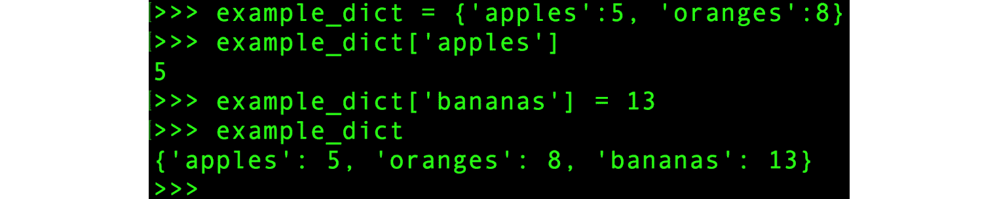

](img/B16925_01_01.jpg)

图 1.1：列表创建和索引

关于*图 1.1*需要注意几点：对于切片索引和`range()`函数，区间的端点是开放的，而起始点是闭合的。换句话说，注意当我们指定`range()`的起始和结束时，端点 6 不包括在结果中，但起始点 1 被包括在内。同样，当用切片`[:3]`索引列表时，它包括所有索引小于 3 的元素，但不包括索引为 3 的元素。

我们之前提到过有序集合，但 Python 也包括无序集合。其中一个重要的集合类型叫做`{}`，它包含**键:值**对，通过逗号分隔。以下截图展示了如何创建一个包含水果数量的字典——首先查看苹果的数量，然后添加一种新的水果类型及其数量：


](img/B16925_01_02.jpg)

图 1.2：一个字典示例

Python 还有许多其他独特的特点，我们这里只是给你一个大致的概念，不会涉及太多细节。实际上，你可能会使用像`pandas`和`numpy`这样的包来处理大多数 Python 中的数据。NumPy 提供了对数组和矩阵的快速数值计算，而 pandas 则提供了丰富的数据处理和探索功能，特别是对被称为**DataFrames**的数据表的操作。然而，熟悉一些 Python 的基础知识是很有帮助的，因为它是所有这些内容的基础。例如，索引在 NumPy 和 pandas 中的工作方式与在 Python 中相同。

Python 的一个优势是它是开源的，并且拥有一个活跃的开发者社区，创造了许多令人惊叹的工具。我们将在本书中使用其中的几个工具。使用不同贡献者提供的开源包的一个潜在陷阱是各个包之间的依赖关系。例如，如果您想安装 pandas，它可能依赖于某个版本的 NumPy，而您可能已经安装了该版本，也可能没有。包管理系统在这方面让生活变得更加轻松。当您通过包管理系统安装新包时，它会确保所有依赖关系都已满足。如果没有，它会提示您升级或根据需要安装新包。

对于本书，我们将使用**Anaconda**包管理系统，您应该已经安装了它。虽然我们这里只使用 Python，但也可以在 Anaconda 中运行 R。

注释：环境

推荐为本书创建一个新的 Python 3.x 环境。环境就像是 Python 的独立安装版本，其中已安装的包集可能不同，Python 的版本也可能不同。环境对于开发需要在不同版本的 Python 中部署的项目非常有用，这些项目可能依赖于不同的包版本。有关这方面的一般信息，请参阅 [`docs.conda.io/projects/conda/en/latest/user-guide/tasks/manage-environments.html`](https://docs.conda.io/projects/conda/en/latest/user-guide/tasks/manage-environments.html)。请在开始接下来的练习之前，查看*前言*中关于为本书设置 Anaconda 环境的具体说明。

## 练习 1.01：检查 Anaconda 并熟悉 Python

在本练习中，您将检查 Anaconda 安装中的包，并练习一些基本的 Python 控制流和数据结构，包括`for` 循环、`dict` 和 `list`。这将确认您已经完成了前言中的安装步骤，并展示 Python 语法和数据结构可能与您熟悉的其他编程语言有所不同。执行以下步骤以完成练习：

注释

在执行本章的练习和活动之前，请确保您已按照*前言*中提到的设置 Python 环境的说明进行操作。本练习的代码文件可以在此找到：[`packt.link/N0RPT`](https://packt.link/N0RPT)。

1.  打开终端（如果您使用的是 macOS 或 Linux）或在 Windows 中打开命令提示符窗口。如果您使用的是环境，请使用`conda activate <name_of_your_environment>`激活它。然后在命令行中键入`conda` `list`。您应该看到类似以下内容的输出：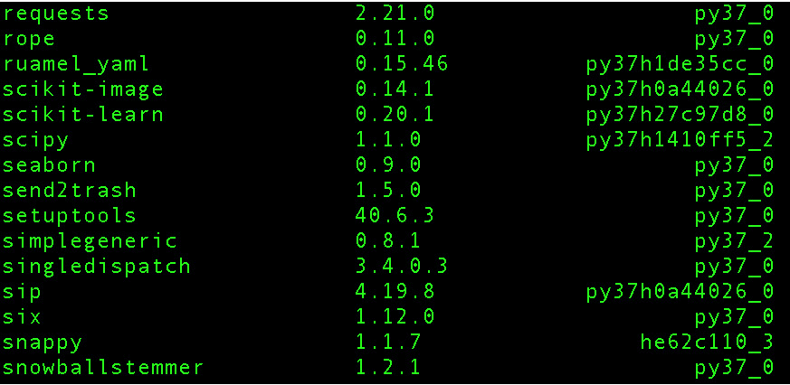

    图 1.3：从 conda list 中选择包

    你可以看到环境中安装的所有包，包括我们将直接交互的包，以及它们的依赖项，这些依赖项是它们正常运行所必需的。包管理系统的一个主要优势是能够管理包之间的依赖关系。

    注释

    有关 Anaconda 和命令行交互的更多信息，请查看此“备忘单”：[`docs.conda.io/projects/conda/en/latest/_downloads/843d9e0198f2a193a3484886fa28163c/conda-cheatsheet.pdf`](https://docs.conda.io/projects/conda/en/latest/_downloads/843d9e0198f2a193a3484886fa28163c/conda-cheatsheet.pdf)。

1.  在终端中输入`python`，打开命令行 Python 解释器。你应该会得到类似以下的输出：

    图 1.4：命令行 Python

    你应该看到一些关于 Python 版本的信息，以及 Python 命令提示符（`>>>`）。当你在此提示符后输入时，你正在编写 Python 代码。

    注释

    尽管本书中我们将使用 Jupyter notebook，但本练习的目标之一是通过在命令提示符下编写和运行 Python 程序的基本步骤。

1.  在命令提示符下编写`for`循环，使用以下代码打印从 0 到 4 的值（请注意，在命令行 Python 解释器中编写代码时，第二行和第三行开头的三个点会自动出现；如果你在 Jupyter notebook 中编写代码，这些点将不会出现）：

    ```py
    for counter in range(5):
    ...    print(counter)
    ... 
    ```

    当你在看到`...`提示符时按下*Enter*，你应该得到以下输出：

    

    图 1.5：命令行中 for 循环的输出

    请注意，在 Python 中，`for`循环的开始后面紧跟一个冒号，`for`循环打印由`range()`迭代器返回的值，这些值通过使用`counter`变量与`in`关键字反复访问。

    注释

    有关更多关于 Python 代码规范的详细信息，请参考以下链接：[`www.python.org/dev/peps/pep-0008/`](https://www.python.org/dev/peps/pep-0008/)。

    现在，我们将回到字典的示例。这里的第一步是创建字典。

1.  使用以下代码创建一个水果字典（`apples`、`oranges` 和 `bananas`）：

    ```py
    example_dict = {'apples':5, 'oranges':8, 'bananas':13}
    ```

1.  使用`list()`函数将字典转换为列表，如下所示的代码片段：

    ```py
    dict_to_list = list(example_dict)
    dict_to_list
    ```

    一旦运行前面的代码，你应该会得到以下输出：

    ```py
    ['apples', 'oranges', 'bananas']
    ```

    请注意，当这完成后，我们检查内容时，列表中仅捕获了字典的键。如果我们想要获取值，必须使用`.values()`方法指定。此外，请注意，字典键的列表恰好与我们创建字典时书写的顺序相同。然而，这并不保证，因为字典是无序集合类型。

    使用列表时，你可以通过`+`运算符将其他列表添加到现有列表中。作为示例，在下一步中，我们将现有的水果列表与只包含一种水果的新列表合并，并覆盖包含原始列表的变量，像这样：`list(example_dict.values());` 有兴趣的读者可以自行验证这一点。

1.  使用`+`运算符将现有的水果列表与只包含一个水果（`pears`）的新列表合并：

    ```py
    dict_to_list = dict_to_list + ['pears']
    dict_to_list
    ```

    你的输出将如下所示：

    ```py
    ['apples', 'oranges', 'bananas', 'pears']
    ```

    `sorted()`函数可以用于此；它将返回输入的排序版本。在我们的例子中，这意味着水果种类列表将按字母顺序排序。

1.  使用`sorted()`函数按字母顺序排序水果列表，如下所示：

    ```py
    sorted(dict_to_list)
    ```

    一旦运行前面的代码，你应该会看到以下输出：

    ```py
    ['apples', 'bananas', 'oranges', 'pears']
    ```

现在已经足够的 Python 知识了。我们将展示如何执行本书中的代码，所以在过程中你的 Python 知识应该会有所提升。在你打开 Python 解释器时，你可能希望运行*图 1.1*和*1.2*中展示的代码示例。当你使用完解释器后，可以输入`quit()`退出。

注意

随着你学习的深入，并且不可避免地想尝试新事物，请参考官方的 Python 文档：[`docs.python.org/3/`](https://docs.python.org/3/)。

# 数据科学问题的不同类型

作为数据科学家，你的大部分时间可能都会花在数据清理上：弄清楚如何获取数据、获取数据、检查数据、确保数据的正确性和完整性，并将数据与其他类型的数据结合。pandas 是 Python 中广泛使用的数据分析工具，它能帮助你加速数据探索过程，正如我们在本章中所看到的。然而，本书的一个关键目标是帮助你踏上成为机器学习数据科学家的旅程，而这需要你掌握**预测建模**的艺术和科学。这意味着使用数学模型或理想化的数学公式来学习数据中的关系，希望当新的数据到来时，能够做出准确且有用的预测。

对于预测建模的使用场景，数据通常以表格结构组织，包含**特征**和**响应变量**。例如，如果你想根据一些关于房子的特征来预测房价，如**面积**和**卧室数量**，这些特征将被视为特征，而**房价**则是响应变量。响应变量有时也称为**目标变量**或**因变量**，而特征有时也称为**自变量**。

如果你有一个包含 1,000 个房屋的数据集，其中包括这些特征的值和房屋的价格，那么你可以说你拥有 1,000 个**样本**的**标注**数据，其中标签是响应变量的已知值：不同房屋的价格。通常，表格数据结构被组织成不同的行表示不同的样本，而特征和响应占据不同的列，并且还有其他元数据，如样本 ID，如*图 1.6*所示：

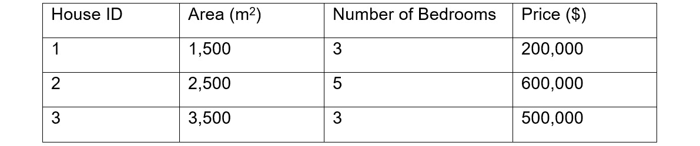

图 1.6：标注数据（房价是已知的目标变量）

**回归问题**

一旦你训练了一个模型，通过使用标注数据学习特征与响应之间的关系，你就可以利用它对那些你不知道价格的房屋进行预测，基于特征中包含的信息。在这种情况下，预测建模的目标是能够做出接近房屋真实价值的预测。由于我们预测的是一个连续尺度上的数值，这被称为**回归问题**。

**分类问题**

另一方面，如果我们试图对房屋做出定性预测，回答像“这栋房屋在未来 5 年内会出售吗？”或“房主会违约吗？”这样的**是**或**否**问题，那么我们将解决一个称为**分类问题**的问题。在这里，我们希望能够正确地回答是或否的问题。下图是一个示意图，展示了模型训练的工作原理，以及回归或分类模型的可能结果：

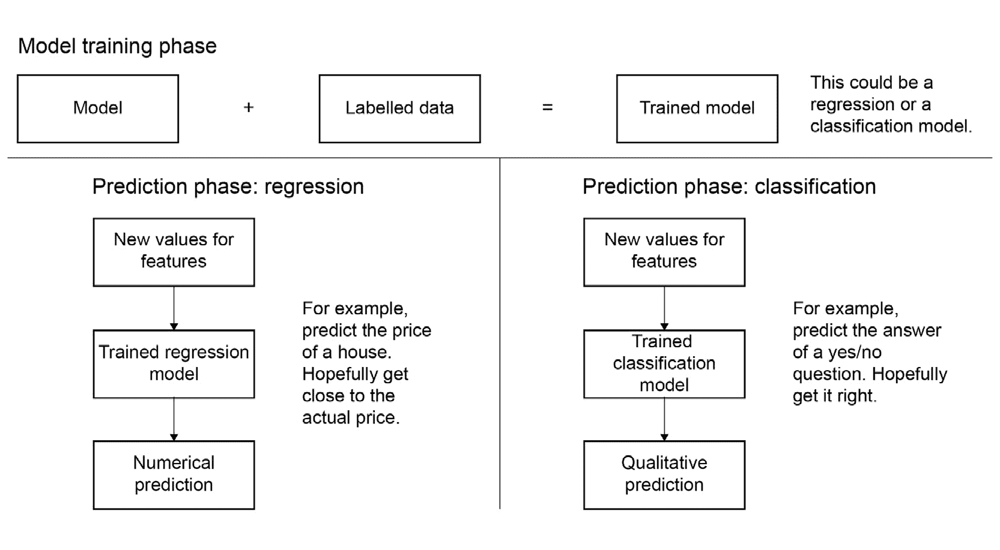

图 1.7：回归和分类的模型训练与预测示意图

分类和回归任务被称为**监督学习**，这是一类依赖于标注数据的问题。可以将这些问题视为需要目标变量的已知值进行“监督”。相对而言，还有**无监督学习**，它涉及到更开放性的问题，试图在一个没有标签的数据集中找到某种结构。从更广泛的角度来看，任何应用数学问题，包括像**优化**、**统计推断**和**时间序列建模**这样的领域，都可能被视为数据科学家的适当职责。

# 使用 Jupyter 和 pandas 加载案例研究数据

现在是时候首次查看我们在案例研究中将使用的数据了。我们在本节中不会做任何其他事情，只是确保我们能正确地将数据加载到**Jupyter notebook**中。数据的检查和对你将要解决的问题的理解将在之后进行。

数据文件是一个名为`default_of_credit_card_clients__courseware_version_1_21_19.xls`的 Excel 电子表格。我们建议你先在 Excel 或你选择的电子表格程序中打开该电子表格。注意行数和列数。查看一些示例值。这将帮助你了解是否已经正确加载该文件到 Jupyter 笔记本中。

注意

数据集可以从以下链接获取：[`packt.link/wensZ`](https://packt.link/wensZ)。这是原始数据集的修改版本，原数据集来自 UCI 机器学习库[[`archive.ics.uci.edu/ml`](http://archive.ics.uci.edu/ml)]。加利福尼亚州尔湾：加利福尼亚大学信息与计算机科学学院。

**什么是 Jupyter 笔记本？**

Jupyter 笔记本是互动式编码环境，允许插入文本和图形。它们是数据科学家用于交流和保存结果的绝佳工具，因为方法（代码）和信息（文本和图形）是集成在一起的。你可以将这个环境看作一个可以编写和执行代码的网页。实际上，Jupyter 笔记本可以呈现为网页，就像在 GitHub 上那样。这里有一个示例笔记本：[`packt.link/pREet`](https://packt.link/pREet)。查看它，了解你可以做什么。以下是该笔记本的摘录，展示了代码、图形和散文，这在这种情况下被称为**Markdown**：


图 1.8：展示代码、图形和 Markdown 文本的 Jupyter 笔记本示例

学习 Jupyter 笔记本的首要任务之一是如何浏览和进行编辑。你可以选择两种模式。如果你选择一个单元格并按下*Enter*，你会进入**编辑模式**，在该模式下你可以编辑该单元格中的文本。如果你按下*Esc*，则进入**命令模式**，可以在笔记本中进行导航。

注意

如果你正在阅读本书的印刷版，可以通过访问以下链接下载并浏览本章中某些图像的彩色版本：[`packt.link/T5EIH`](https://packt.link/T5EIH)。

当你处于命令模式时，有许多有用的快捷键可以使用。*上*箭头和*下*箭头可以帮助你选择不同的单元格并滚动浏览笔记本。如果在命令模式下按下*y*键，选中的单元格会变为**代码单元格**，其中的文本会被解释为代码。按下*m*键会将其变为**Markdown 单元格**，在其中你可以编写格式化文本。按下*Shift* + *Enter*会执行该单元格，呈现 Markdown 或执行代码，具体取决于情况。在接下来的练习中，你将通过 Jupyter 笔记本进行一些实践。

在我们第一个 Jupyter notebook 中的第一个任务是加载案例研究数据。为此，我们将使用一个名为 **pandas** 的工具。毫不夸张地说，pandas 可能是 Python 中最优秀的数据处理工具。

DataFrame 是 pandas 中的一个基础类。我们稍后会讨论类是什么，但你可以将其看作数据结构的模板，其中数据结构类似于我们之前讨论的列表或字典。然而，DataFrame 的功能比这两者都要强大得多。DataFrame 在许多方面类似于电子表格。它有行，这些行通过行索引进行标记；它还有列，通常会有类似列头的标签，可以被看作列索引。`Index` 实际上是 pandas 中用来存储 DataFrame 索引的数据类型，而列则有自己的数据类型，称为 `Series`。

使用 DataFrame，你可以做很多与 Excel 表格相同的操作，比如创建数据透视表和筛选行。pandas 还包含类似 SQL 的功能。例如，你可以将不同的 DataFrame 合并在一起。DataFrame 的另一个优点是，一旦你的数据被包含在其中，你就可以随时使用 pandas 提供的强大功能进行数据分析。下图是一个 pandas DataFrame 的示例：

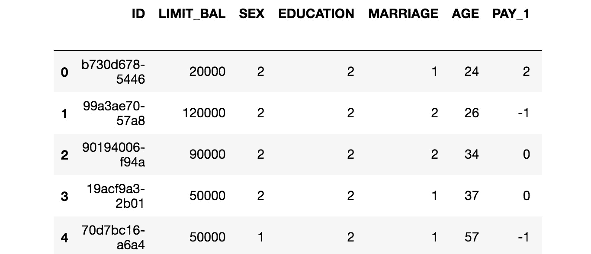

图 1.9：带有整数行索引在左侧、字符串列索引的 pandas DataFrame 示例

*图 1.9* 中的示例实际上就是案例研究的数据。作为使用 Jupyter 和 pandas 的第一步，我们现在将展示如何创建一个 Jupyter notebook 并使用 pandas 加载数据。在 pandas 中，你可以使用几个方便的函数来探索数据，包括 `.head()` 查看 DataFrame 的前几行，`.info()` 查看所有列的数据类型，`.columns` 返回列名的字符串列表，等等，我们将在接下来的练习中学习这些函数。

## 练习 1.02：在 Jupyter Notebook 中加载案例研究数据

现在你已经了解了 Jupyter notebooks——我们将编写代码的环境，和 pandas——数据处理包，让我们来创建第一个 Jupyter notebook。在这个 notebook 中，我们将使用 pandas 加载案例研究数据，并对其进行简单的检查。请按照以下步骤完成练习：

注意

本练习的 Jupyter notebook 可以在 [`packt.link/GHPSn`](https://packt.link/GHPSn) 找到。

1.  打开终端（macOS 或 Linux）或命令提示符窗口（Windows），然后输入 `jupyter notebook`（如果你使用的是 Anaconda 环境，请先激活环境）。

    您将在浏览器中看到 Jupyter 界面。如果浏览器没有自动打开，您可以将终端中的 URL 复制并粘贴到浏览器中。在此界面中，您可以从启动笔记本服务器时所在的目录开始浏览您的文件夹。

1.  导航到您将存储本书材料的方便位置，然后从 **New** 菜单创建一个新的 Python 3 笔记本，如下所示：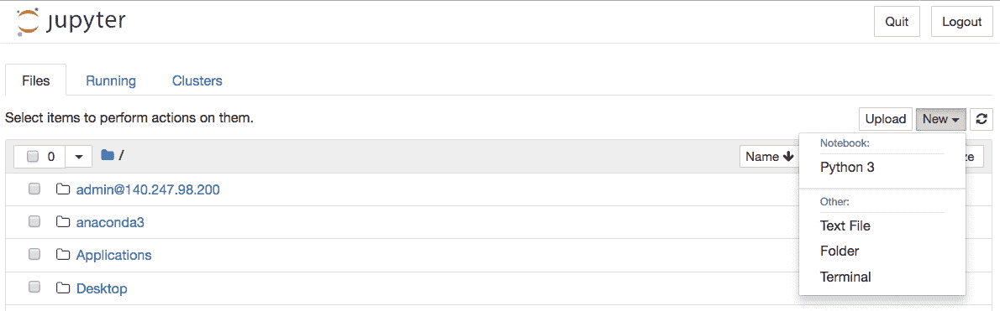

    图 1.10：Jupyter 首页

1.  在命令模式下（按 *Esc* 进入命令模式）通过输入 *m* 来将您的第一个单元格设置为 Markdown 单元格，然后在第一行的开头输入一个井号 `#`，后面加一个空格，以设置标题。为您的笔记本添加标题。接下来的几行，输入描述。

    下面是一个示例的截图，展示了其他类型的 Markdown 语法，如粗体、斜体，以及如何在 Markdown 单元格中书写代码风格的文本：

    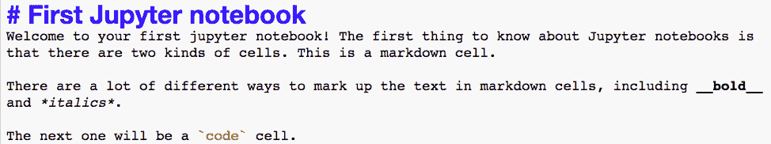

    图 1.11：未渲染的 Markdown 单元格

    请注意，良好的实践是为您的笔记本添加标题和简短的描述，以便读者了解其目的。

1.  按 *Shift* + *Enter* 来渲染 Markdown 单元格。

    这也应该会创建一个新的单元格，它将是一个代码单元格。您可以通过按 *m* 将其更改为 Markdown 单元格，通过按 *y* 恢复为代码单元格。您可以通过旁边的 `In [ ]:` 来判断它是代码单元格。

1.  在新单元格中输入 `import` `pandas` `as` `pd`，如下所示的截图所示：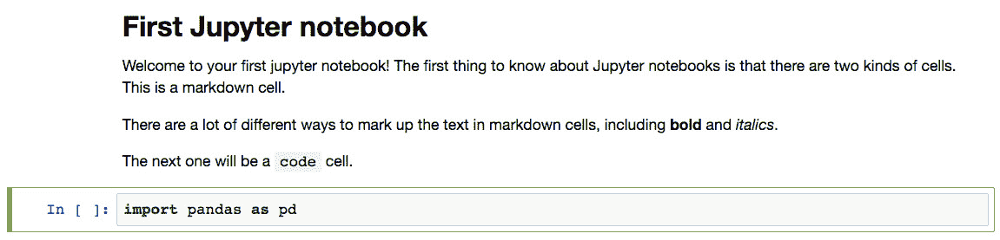

    图 1.12：渲染后的 Markdown 单元格和代码单元格

    执行此单元格后，`pandas` 模块将被加载到您的计算环境中。通常，我们会使用 `as` 来导入模块，并为其创建一个简短的别名，比如 `pd`。现在，我们将使用 pandas 加载数据文件。该文件是 Microsoft Excel 格式，因此我们可以使用 `pd.read_excel`。

    注意

    若要了解 `pd.read_excel` 的所有可能选项，请参考以下文档：[`pandas.pydata.org/pandas-docs/stable/reference/api/pandas.read_excel.html`](https://pandas.pydata.org/pandas-docs/stable/reference/api/pandas.read_excel.html)。

1.  使用 `pd.read_excel()` 方法将数据集（Excel 格式）作为 DataFrame 导入，如下所示的代码片段：

    ```py
    df = pd.read_excel('../../Data/default_of_credit_card_clients'\
                       '__courseware_version_1_21_19.xls')
    ```

    请注意，您需要指定 Excel 文件所在的位置。如果文件与您的笔记本在同一目录下，您可以只输入文件名。`pd.read_excel` 方法会将 Excel 文件加载到一个 `DataFrame` 中，我们将其命名为 `df`。默认情况下，电子表格的第一张表单会被加载，而在此情况下，只有这一张表单。现在我们可以使用 pandas 的强大功能了。

    让我们在接下来的几个步骤中进行一些快速检查。首先，行数和列数是否与我们在 Excel 中查看文件时看到的一致？

1.  使用 `.shape` 方法查看行列的数量，如以下代码片段所示：

    ```py
    df.shape
    ```

    一旦运行该单元格，你将得到以下输出：

    ```py
    Out[3]: (30000, 25)
    ```

    这应该与你在电子表格中的观察一致。如果不一致，你就需要查看 `pd.read_excel` 的各种选项，看看是否需要调整什么。

通过这个练习，我们成功地将数据集加载到 Jupyter 笔记本中。你还可以尝试对 DataFrame 使用 `.info()` 和 `.head()` 方法，分别查看所有列的信息，并显示 DataFrame 的前几行。现在你已经能够开始使用 pandas 处理数据了。

最后，虽然这可能已经很清楚了，但请注意，如果你在一个代码单元中定义了一个变量，它在笔记本中的其他代码单元也可以使用。这是因为，只要笔记本在运行，笔记本中的代码单元被认为共享**作用域**，如下面的截图所示：


图 1.13：单元格之间的变量作用域

每次启动 Jupyter 笔记本时，尽管代码和 Markdown 单元格会保存你之前的工作，但环境会重新初始化，你需要重新加载所有模块和数据才能继续工作。你也可以使用笔记本中的**内核**菜单手动关闭或重启笔记本。关于 Jupyter 笔记本的更多细节可以在这里找到：[`jupyter-notebook.readthedocs.io/en/stable/`](https://jupyter-notebook.readthedocs.io/en/stable/)。

注

在本书中，每个新的练习和活动都会在一个新的 Jupyter 笔记本中完成。然而，一些练习笔记本也包含在练习前的部分中展示的额外 Python 代码和输出。还有一些参考笔记本包含了每个章节的全部内容。例如，*第一章*《数据探索与清洗》的笔记本可以在这里找到：[`packt.link/zwofX`](https://packt.link/zwofX)。

## 熟悉数据并进行数据清洗

现在让我们初步查看一下这些数据。在你的数据科学家工作中，你可能会遇到几种收到这样的数据集的情况。包括以下几种：

1.  你创建了生成数据的 SQL 查询。

1.  一位同事根据你的意见为你写了一个 SQL 查询。

1.  一位了解数据的同事把它交给了你，但没有征求你的意见。

1.  你得到一个对数据了解不多的数据集。

在第 1 和第 2 种情况下，你的输入参与了数据的生成/提取。在这些场景中，你可能理解了商业问题，然后在数据工程师的帮助下找到所需的数据，或者自己做研究并设计了生成数据的 SQL 查询。通常，尤其是随着你在数据科学角色上经验的积累，第一步会是与商业合作伙伴会面，理解并完善商业问题的数学定义。然后，你将在定义数据集内容中发挥关键作用。

即使你对数据有相对较高的熟悉度，进行数据探索并查看不同变量的**汇总统计**仍然是一个重要的第一步。这个步骤将帮助你选择好的特征，或者给你一些如何构建新特征的思路。然而，在第三和第四种情况中，如果你的输入没有涉及或者你对数据了解较少，数据探索就显得更加重要。

数据科学过程中的另一个重要初步步骤是检查**数据字典**。数据字典是一个文档，解释了数据拥有者认为数据中应该包含的内容，比如列标签的定义。数据科学家的职责是仔细审查数据，确保这些定义与数据实际内容一致。在第 1 和第 2 种情况下，你可能需要自己创建数据字典，这应该视为重要的项目文档。在第 3 和第 4 种情况下，你应该尽可能寻找数据字典。

本书中我们将使用的案例研究数据类似于此处的第 3 种情况。

## 商业问题

我们的客户是一家信用卡公司。他们为我们提供了一个数据集，包含过去 6 个月内约 30,000 名账户持有人的一些人口统计信息和近期财务数据。该数据集是在信用账户级别的；换句话说，每一行代表一个账户（你应始终明确数据集中的每一行的定义）。每一行会标注账户所有者是否在 6 个月历史数据期之后的下一个月违约，或者换句话说，未能按时支付最低款项。

**目标**

你的目标是根据人口统计信息和历史数据，开发一个预测模型，预测账户下个月是否会违约。在本书后续部分，我们将讨论该模型的实际应用。

数据已经准备好，并且提供了数据字典。本书附带的数据集`default_of_credit_card_clients__courseware_version_1_21_19.xls`是 UCI 机器学习库中该数据集的修改版：[`archive.ics.uci.edu/ml/datasets/default+of+credit+card+clients`](https://archive.ics.uci.edu/ml/datasets/default+of+credit+card+clients)。请查看该网页，其中包含数据字典。

## 数据探索步骤

现在我们已经了解了业务问题，并对数据中应该包含的内容有了大致了解，我们可以将这些印象与实际数据进行对比。你在数据探索中的任务，不仅是通过直接查看数据以及使用数值和图形摘要来了解数据，还要批判性地思考这些数据是否合理，并与所提供的信息相匹配。这些都是数据探索中的有用步骤：

1.  数据中有多少列？

    这些可能是特征、响应或元数据。

1.  数据中有多少行（样本）？

1.  有哪些特征？哪些是**类别型**的，哪些是**数值型**的？

    类别特征的值属于离散的类别，例如“是”、“否”或“也许”。

    数值特征通常是连续的数值尺度，比如美元金额。

1.  这些特征中的数据看起来如何？

    为了查看这一点，你可以检查数值特征的值范围，或类别特征中不同类别的频率，例如。

1.  有没有缺失的数据？

我们在上一节已经回答了问题 1 和 2；数据中有 30,000 行和 25 列。当我们在接下来的练习中开始探索其余问题时，pandas 将是我们的首选工具。我们从验证基本数据完整性开始，进入下一个练习。

注意

请注意，与网站描述的数据字典相比，我们数据中的`X6`-`X11`被称为`PAY_1`-`PAY_6`。类似地，`X12`-`X17`对应的是`BILL_AMT1`-`BILL_AMT6`，而`X18`-`X23`则是`PAY_AMT1`-`PAY_AMT6`。

## 练习 1.03：验证基本数据完整性

在这个练习中，我们将进行基本的检查，验证我们的数据集是否包含我们所期望的内容，并检查样本数量是否正确。

数据应该包含 30,000 个信用账户的观察数据。虽然有 30,000 行数据，但我们还应该检查是否有 30,000 个唯一账户 ID。如果生成数据的 SQL 查询是在一个不熟悉的架构下运行的，那么本应唯一的值可能实际上并不唯一。

为了检查这一点，我们可以检查唯一账户 ID 的数量是否与行数相同。按照以下步骤完成练习：

注意

这个练习的 Jupyter 笔记本可以在这里找到：[`packt.link/EapDM`](https://packt.link/EapDM)。

1.  导入 pandas，加载数据，并运行以下命令检查列名，使用*Shift* + *Enter*：

    ```py
    import pandas as pd
    df = pd.read_excel('../Data/default_of_credit_card'\
                       '_clients__courseware_version_1_21_19.xls')
    df.columns
    ```

    DataFrame 的`.columns`方法用于检查所有列名。运行单元格后，你将得到以下输出：

    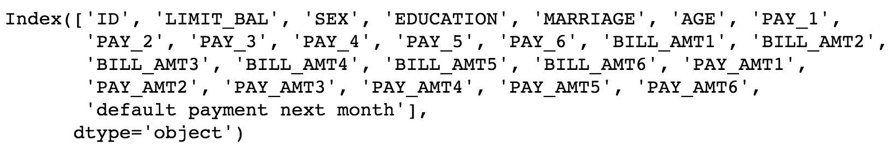

    图 1.14：数据集的列

    如可以观察到，所有列名都列出了。账户 ID 列被标记为 `ID`。其余列似乎是我们的特征，最后一列是响应变量。让我们快速回顾一下客户提供的数据集信息：

    `LIMIT_BAL`: 提供的信用额度（以新台币为单位），包括个人消费信用和家庭（附加）信用。

    `SEX`: 性别 (1 = 男性；2 = 女性)。

    注意

    出于伦理考虑，我们不会使用性别数据来决定信用评级。

    `EDUCATION`: 教育水平 (1 = 研究生; 2 = 大学; 3 = 高中; 4 = 其他)。

    `MARRIAGE`: 婚姻状况 (1 = 已婚；2 = 单身；3 = 其他)。

    `AGE`: 年龄（岁）。

    `PAY_1`–`PAY_6`: 过去付款记录。记录从 4 月到 9 月的每月付款，这些数据存储在这些列中。

    `PAY_1` 代表 9 月的还款状态；`PAY_2` 是 8 月的还款状态；依此类推，直到 `PAY_6`，代表 4 月的还款状态。

    还款状态的测量尺度如下：-1 = 按时支付；1 = 延迟支付 1 个月；2 = 延迟支付 2 个月；依此类推，直到 8 = 延迟支付 8 个月；9 = 延迟支付 9 个月及以上。

    `BILL_AMT1`–`BILL_AMT6`: 账单金额（新台币）。

    `BILL_AMT1` 代表 9 月的账单金额；`BILL_AMT2` 代表 8 月的账单金额；依此类推，直到 `BILL_AMT6`，代表 4 月的账单金额。

    `PAY_AMT1`–`PAY_AMT6`: 之前的付款金额（新台币）。`PAY_AMT1` 代表 9 月的支付金额；`PAY_AMT2` 代表 8 月的支付金额；依此类推，直到 `PAY_AMT6`，代表 4 月的支付金额。

    接下来，我们在下一步中使用 `.head()` 方法查看数据的前几行。默认情况下，这将返回前 5 行数据。

1.  在随后的单元格中运行以下命令：

    ```py
    df.head()
    ```

    这是你应该看到的输出的一部分：

    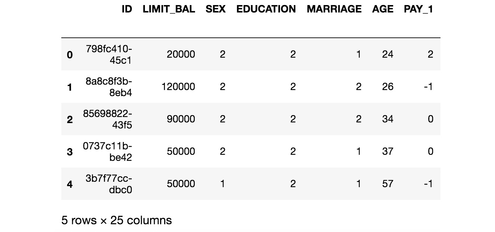

    图 1.15：DataFrame 的 .head() 方法

    ID 列似乎包含唯一标识符。现在，为了验证它们是否确实在整个数据集中是唯一的，我们可以使用 `.nunique()` 方法计算 `ID` 列（即 Series）的唯一值数量。我们首先使用方括号选择该列。

1.  选择列（`ID`）并使用以下命令计算唯一值：

    ```py
    df['ID'].nunique()
    ```

    以下是输出结果：

    ```py
    29687
    ```

    从前面的输出可以看出，唯一条目的数量是 `29,687`。

1.  运行以下命令以获取数据集中的行数：

    ```py
    df.shape 
    ```

    如下输出所示，数据集的总行数为 `30,000`：

    ```py
    (30000, 25)
    ```

    我们看到这里的唯一 ID 数少于行数。这意味着 ID 不是数据行的唯一标识符。所以我们知道 ID 有重复。那么重复的程度如何？某个 ID 是否重复多次？有多少个 ID 是重复的？

    我们可以在 ID Series 上使用`.value_counts()`方法来开始回答这些问题。这类似于一个`id_counts`变量。

1.  将值计数存储在定义为`id_counts`的变量中，然后使用`.head()`方法显示存储的值，如下所示：

    ```py
    id_counts = df['ID'].value_counts()
    id_counts.head()
    ```

    你将获得以下输出：

    

    图 1.16：获取账户 ID 的值计数

    请注意，`.head()`默认返回前五行。你可以通过在括号`()`中传入所需的数字来指定显示的条目数。

1.  通过运行另一个值计数来显示重复条目的数量：

    ```py
    id_counts.value_counts()
    ```

    你将获得以下输出：

    

图 1.17：获取账户 ID 的值计数

在这里，我们可以看到大多数 ID 都恰好出现一次，正如预期的那样。然而，313 个 ID 出现了两次。所以，没有任何 ID 出现超过两次。有了这些信息，我们可以开始仔细查看这个数据质量问题，并着手修复它。我们将创建布尔掩码来实现这一点。

## 布尔掩码

为了帮助清理案例研究数据，我们引入了`==`的概念，用来查找数组中包含某个特定值的位置。其他比较方式，如“大于” (`>`)、 “小于” (`<`)、 “大于或等于” (`>=`)、 “小于或等于” (`<=`)，也可以类似使用。此类比较的输出是一个`True/False`值的数组或 Series，如果条件成立，则为`True`，否则为`False`。为了说明其工作原理，我们将使用`np`。我们还将从 NumPy 中的 random 模块导入默认的随机数生成器：

```py
import numpy as np
from numpy.random import default_rng 
```

现在我们使用所谓的`12345`：

```py
rg = default_rng(12345)
```

接下来，我们使用`rg`的`integers`方法生成 100 个随机整数，传入合适的参数。我们生成的整数范围为 1 到 4 之间。请注意，`high`参数默认指定的是开区间，即范围的上限不包含在内：

```py
random_integers = rg.integers(low=1,high=5,size=100)
```

让我们看一下该数组的前五个元素，使用`random_integers[:5]`。输出应该如下所示：

```py
array ([3, 1, 4, 2, 1])
```

假设我们想知道`random_integers`中所有等于 3 的元素的位置。我们可以创建一个布尔掩码来实现：

```py
is_equal_to_3 = random_integers == 3
```

通过检查前五个元素，我们知道第一个元素等于 3，但其余的都不等于。所以在我们的布尔掩码中，我们期望第一个位置为`True`，接下来的四个位置为`False`。这是对的吗？

```py
is_equal_to_3[:5]
```

上述代码应当给出以下输出：

```py
array([ True, False, False, False, False])
```

这是我们所期待的。这显示了布尔掩码的创建。但我们还可以用它们做什么呢？假设我们想知道有多少个元素等于 3。为了知道这一点，你可以对布尔掩码进行求和，它将 `True` 解释为 1，将 `False` 解释为 0：

```py
sum(is_equal_to_3)
```

这将给我们以下输出：

```py
31
```

这很有道理，因为在一个随机、每个值等可能的 4 个值中，我们会预期每个值大约有 25% 的概率出现。除了看到数组中有多少个值符合布尔条件外，我们还可以使用布尔掩码选择数组中符合该条件的元素。布尔掩码可以直接用于索引数组，正如下面所示：

```py
random_integers[is_equal_to_3]
```

这将输出符合我们指定的布尔条件的 `random_integers` 数组元素。在这个例子中，31 个等于 3 的元素：

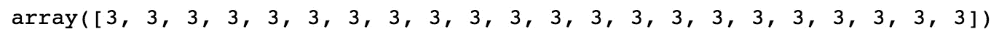

图 1.18：使用布尔掩码索引数组

现在你已经掌握了布尔数组的基础知识，它在许多情况下都非常有用。特别是，你可以使用 DataFrame 的 `.loc` 方法，通过布尔掩码对行进行索引，通过标签对列进行索引，从而获取满足条件的不同列中的值。让我们继续用这些技能探索案例研究数据。

注意

包含前一节中展示的代码和相应输出的 Jupyter notebook 可以在此找到：[`packt.link/pT9gT`](https://packt.link/pT9gT)。

## 练习 1.04：继续验证数据完整性

在本次练习中，利用我们对布尔数组的了解，我们将检查一些我们发现的重复 ID。在 *练习 03*，*验证基本数据完整性* 中，我们学到没有 ID 出现超过两次。我们可以利用这一点来定位重复的 ID 并进行检查。然后我们采取措施从数据集中删除质量可疑的行。按照以下步骤完成本次练习：

注意

本次练习的 Jupyter notebook 可以在这里找到：[`packt.link/snAP0`](https://packt.link/snAP0)。

1.  继续我们在 *练习 1.03*，*验证基本数据完整性* 中的内容，我们需要获取 `id_counts` Series 中计数为 `2` 的位置，以定位重复项。首先，我们加载数据并获取 ID 的值计数，以便回到 *练习 03*，*验证基本数据完整性* 中的位置，然后我们创建一个布尔掩码，定位重复的 ID，变量名为 `dupe_mask`，并显示前五个元素。使用以下命令：

    ```py
    import pandas as pd
    df = pd.read_excel('../../Data/default_of_credit_card_clients'\
                       '__courseware_version_1_21_19.xls')
    id_counts = df['ID'].value_counts()
    id_counts.head()
    dupe_mask = id_counts == 2
    dupe_mask[0:5]
    ```

    你将得到以下输出（请注意，ID 的排序在你的输出中可能不同，因为 `value_counts` 是按频率排序的，而不是 ID 的索引）：

    

    图 1.19：使用布尔掩码定位重复的 ID

    请注意，在上面的输出中，我们仅使用 `dupe_mask` 显示前五个条目，以说明此数组的内容。你可以编辑方括号 (`[]`) 中的整数索引来更改显示的条目数。

    下一步是使用此逻辑掩码选择重复的 ID。这些 ID 本身包含在 `id_count` 系列的索引中。我们可以访问该索引，以便使用逻辑掩码进行选择。

1.  使用以下命令访问 `id_count` 的索引，并显示前五行作为上下文：

    ```py
    id_counts.index[0:5]
    ```

    这样，你将获得以下输出：

    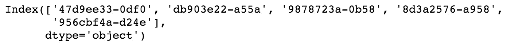

    图 1.20：重复的 ID

1.  使用以下命令选择并将重复的 ID 存储到名为 `dupe_ids` 的新变量中：

    ```py
    dupe_ids = id_counts.index[dupe_mask]
    ```

1.  将 `dupe_ids` 转换为列表，然后使用以下命令获取该列表的长度：

    ```py
    dupe_ids = list(dupe_ids)
    len(dupe_ids)
    ```

    你应该获得以下输出：

    ```py
    313
    ```

    我们将 `dupe_ids` 变量更改为 `list` 类型，因为在未来的步骤中我们将需要它以这种形式。该列表的长度为 `313`，如前面的输出所示，这与我们通过值计数了解到的重复 ID 数量一致。

1.  我们通过使用以下命令显示前五个条目来验证 `dupe_ids` 中的数据：

    ```py
    dupe_ids[0:5]
    ```

    我们获得了以下输出：

    

    图 1.21：制作重复 ID 列表

    我们可以从前面的输出中观察到，列表包含所需的重复 ID 条目。现在我们可以检查这些重复 ID 的数据，特别是我们想查看这些特征的值，看看是否有任何区别。我们将使用 DataFrame `df` 的 `.isin` 和 `.loc` 方法来实现这一目的。

    使用我们重复列表中的前三个 ID，`dupe_ids[0:3]`，我们将首先查找包含这些 ID 的行。如果我们将这个 ID 列表传递给 ID 系列的 `.isin` 方法，它将创建另一个逻辑掩码，我们可以用来在较大的 DataFrame 中显示包含这些 ID 的行。`.isin` 方法嵌套在 `.loc` 语句中，后者用于索引 DataFrame，以选择所有包含 `True` 的行的位置。`.loc` 索引语句的第二个参数是 `:`, 这意味着选择所有列。通过执行以下步骤，我们实际上是在过滤 DataFrame，以查看前三个重复 ID 的所有列。

1.  在你的笔记本中运行以下命令，以执行我们在上一步中制定的计划：

    ```py
    df.loc[df['ID'].isin(dupe_ids[0:3]),:]
    ```

    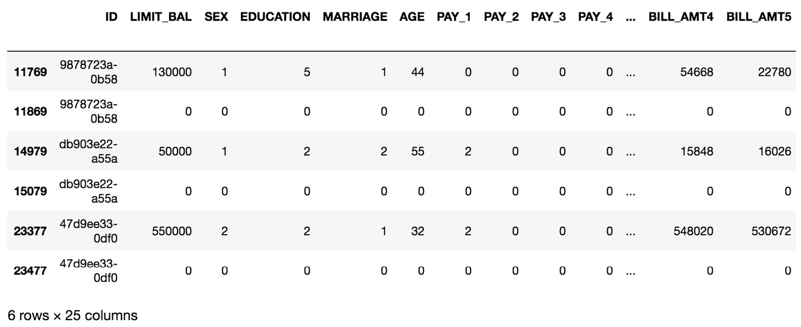

    图 1.22：检查重复 ID 的数据

    我们在这里观察到，每个重复的 ID 似乎都有一行看起来像有效数据的行，以及一行完全为零的行。花一点时间想一想，你会如何利用这些信息。

    经过一番反思，应该很明显，你应该删除所有值为零的行。也许这些行是由于 SQL 查询中的错误连接条件生成的数据？无论如何，一行全为零的数据肯定是无效的，因为一个人的年龄为零，信用额度为零等，显然没有意义。

    解决这个问题的一种方法是找到所有列为零的行，除了第一列（包含 ID）。这些行无论如何都是无效数据，可能如果我们删除这些行，就能解决重复 ID 的问题。我们可以通过创建一个与整个 DataFrame 大小相同的布尔矩阵，基于“是否等于零”这一条件，来找到 DataFrame 中等于零的条目。

1.  使用`==`创建一个与整个 DataFrame 大小相同的布尔矩阵，如下所示：

    ```py
    df_zero_mask = df == 0
    ```

    在接下来的步骤中，我们将使用`df_zero_mask`，它是另一个包含布尔值的 DataFrame。目标是创建一个布尔系列`feature_zero_mask`，标识出每一行，其中从第二列开始的所有元素（特征和响应，而不是 ID）都为 0。为此，我们首先需要使用整数索引（`.iloc`）方法对`df_zero_mask`进行索引。在此方法中，我们传递（`:`）来检查所有行，并传递（`1:`）来检查从第二列开始的所有列（索引 `1`）。最后，我们将在列轴（`axis=1`）上应用`all()`方法，只有当该行的每一列都是`True`时，它才会返回`True`。这个过程需要思考，但编写代码其实很简单，正如接下来的步骤所示。目标是得到一个与 DataFrame 长度相同的系列，告诉我们哪些行除了 ID 外，所有值都是零。

1.  创建布尔系列`feature_zero_mask`，如以下代码所示：

    ```py
    feature_zero_mask = df_zero_mask.iloc[:,1:].all(axis=1)
    ```

1.  使用以下命令计算布尔系列的总和：

    ```py
    sum(feature_zero_mask)
    ```

    你应该获得以下输出：

    ```py
    315
    ```

    上面的输出告诉我们，315 行除了第一列外每列都是零。这比重复 ID 的数量（313）还多，因此如果我们删除所有“零行”，可能就能解决重复 ID 的问题。

1.  使用以下代码清理 DataFrame，删除所有除了 ID 之外的值全为零的行：

    ```py
    df_clean_1 = df.loc[~feature_zero_mask,:].copy()
    ```

    在前面的清理操作中，我们返回了一个新的 DataFrame，名为 `df_clean_1`。请注意，在这里我们在 `.loc` 索引操作后使用了 `.copy()` 方法来创建该输出的副本，而不是对原始 DataFrame 的视图。你可以把它当作创建一个新的 DataFrame，而不是引用原始的 DataFrame。在 `.loc` 方法中，我们使用了逻辑非运算符 `~` 来选择所有没有零值的特征和响应变量的行，使用 `:` 来选择所有列。这是我们希望保留的有效数据。做完这个后，我们现在希望知道剩余的行数是否等于唯一 ID 的数量。

1.  通过运行以下代码，验证 `df_clean_1` 的行数和列数：

    ```py
    df_clean_1.shape
    ```

    你将得到以下输出：

    ```py
    (29685, 25)
    ```

1.  通过运行以下代码获取唯一 ID 的数量：

    ```py
    df_clean_1['ID'].nunique()
    ```

    这是输出：

    ```py
    29685
    ```

    从之前的输出中，我们可以看到我们成功地消除了重复项，因为唯一 ID 的数量等于行数。现在，深呼吸一下，拍拍自己背。这是对一些用于索引和表征数据的 pandas 技巧的快速介绍。现在，我们已经筛选出了重复的 ID，接下来可以开始查看实际的数据：特征，最终是响应变量。

完成这个练习后，按以下步骤将进度保存为 CSV（逗号分隔值）文件。请注意，在保存时我们不包括 DataFrame 的索引，因为这不是必需的，而且当我们稍后加载时可能会创建额外的列：

```py
df_clean_1.to_csv('../../Data/df_clean_1.csv', index=False)
```

## 练习 1.05：探索和清理数据

到目前为止，我们已经识别出一个与元数据相关的数据质量问题：我们曾被告知数据集中的每个样本都对应一个唯一的账户 ID，但发现事实并非如此。我们能够利用逻辑索引和 pandas 来纠正这个问题。这是一个基本的数据质量问题，仅涉及基于元数据的样本存在情况。除此之外，我们对账户 ID 的元数据列并不感兴趣：这些列不会帮助我们开发信用违约的预测模型。

现在，我们准备开始检查特征和响应变量的值，这些数据将用于开发我们的预测模型。按照以下步骤完成这个练习：

注意

这个练习的 Jupyter notebook 可以在这里找到：[`packt.link/q0huQ`](https://packt.link/q0huQ)。

1.  加载上一个练习的结果，并通过使用 `.info()` 方法获取数据中各列的数据类型，如下所示：

    ```py
    import pandas as pd
    df_clean_1 = pd.read_csv('../../Data/df_clean_1.csv')
    df_clean_1.info()
    ```

    你应该看到以下输出：

    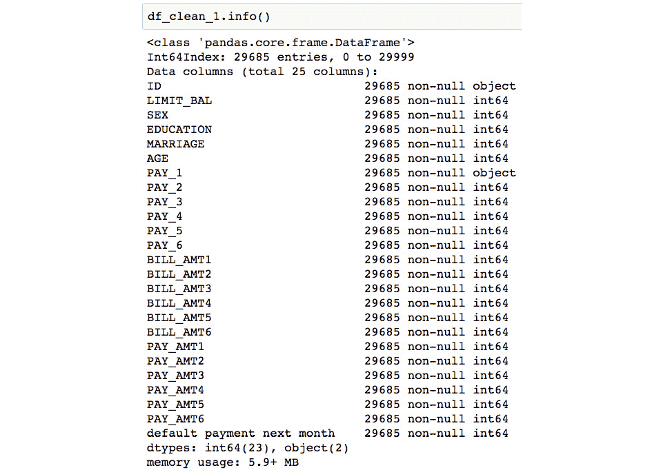

    图 1.23：获取列元数据

    我们可以从*图 1.23*中看到，数据中有 25 列。每行旁边都有 29,685 个 `int64`，这表示它们是 `ID` 和 `PAY_1`。我们已经熟悉了 `ID`；它包含的是字符串，即账户 ID。那么 `PAY_1` 呢？根据数据字典，我们可以预期它包含的是整数，就像其他所有特征一样。我们来仔细看看这一列。

1.  使用 `.head(n)` pandas 方法查看 `PAY_1` 列的前 `n` 行：

    ```py
    df_clean_1['PAY_1'].head(5)
    ```

    你应该得到以下输出：

    

    图 1.24：检查几列的内容

    输出结果左侧的整数是 DataFrame 索引，简单来说就是从 0 开始的连续整数。右侧显示的是 `PAY_1` 列的数据。它本应是最近一个月账单的还款状态，使用的值有 -1、1、2、3 等等。然而，我们可以看到这里存在值 0，这在数据字典中没有说明。根据数据字典，*“还款状态的测量尺度为：-1 = 按时还款；1 = 逾期一个月；2 = 逾期两个月；...；8 = 逾期八个月；9 = 逾期九个月及以上”* ([`archive.ics.uci.edu/ml/datasets/default+of+credit+card+clients`](https://archive.ics.uci.edu/ml/datasets/default+of+credit+card+clients))。我们来仔细看一下，使用该列的值计数。

1.  使用 `.value_counts()` 方法获取 `PAY_1` 列的值计数：

    ```py
    df_clean_1['PAY_1'].value_counts()
    ```

    你应该看到以下输出：

    

    图 1.25：`PAY_1` 列的值计数

    上述输出揭示了两个未记录的值：0 和 -2，并且解释了为什么 pandas 将该列导入为 `object` 数据类型，而不是我们预期的 `int64`（整数数据类型）：因为该列中存在 `'Not available'` 字符串，表示缺失数据。在本书后续的章节中，我们会回到这一点，讨论如何处理缺失数据。目前，我们将删除数据集中包含缺失值的行。

1.  使用 `!=` 操作符（在 Python 中表示“不等于”）创建一个逻辑掩码，查找所有 `PAY_1` 特征没有缺失数据的行：

    ```py
    valid_pay_1_mask = df_clean_1['PAY_1'] != 'Not available'
    valid_pay_1_mask[0:5]
    ```

    通过运行上面的代码，你将得到以下输出：

    

    图 1.26：创建布尔掩码

1.  通过计算掩码的和来检查有多少行没有缺失数据：

    ```py
    sum(valid_pay_1_mask)
    ```

    你将获得以下输出：

    ```py
    26664
    ```

    我们看到有 26,664 行 `PAY_1` 列没有 `'Not available'` 这个值。从值计数中我们可以看到，有 3,021 行有这个值。这样合理吗？从*图 1.23*中我们知道数据集中有 29,685 条记录（行），29,685 – 3,021 = 26,664，因此这一结果是正确的。

1.  清理数据，删除缺失值的`PAY_1`行，如下所示：

    ```py
    df_clean_2 = df_clean_1.loc[valid_pay_1_mask,:].copy()
    ```

1.  使用以下命令获取清理后数据的形状：

    ```py
    df_clean_2.shape
    ```

    你将得到以下输出：

    ```py
    (26664, 25)
    ```

    删除这些行后，我们检查结果 DataFrame 是否具有预期的形状。你还可以自己检查值计数是否表明所需的值已被删除，方法是：`df_clean_2['PAY_1'].value_counts()`。

    最后，为了使这一列的数据类型与其他列一致，我们将其从通用的`object`类型转换为`int64`类型，像所有其他特征一样，使用`.astype`方法。然后我们选择几列，包括`PAY_1`，检查数据类型，并确保转换成功。

1.  运行以下命令，将`PAY_1`的数据类型从`object`转换为`int64`，并使用列表选择多个列，显示`PAY_1`和`PAY_2`的列元数据：

    ```py
    df_clean_2['PAY_1'] = df_clean_2['PAY_1'].astype('int64')
    df_clean_2[['PAY_1', 'PAY_2']].info()
    ```

这是你将得到的输出：

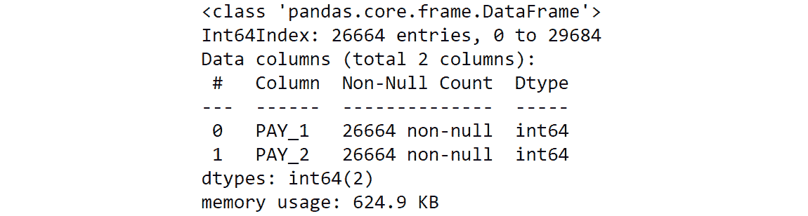

图 1.27：检查已清理列的数据类型

恭喜你，完成了第二次数据清理操作！但是，如果你还记得，在此过程中我们也注意到`PAY_1`中存在未记录的值-2 和 0。现在，假设我们再次与商业伙伴取得联系，并了解了以下信息：

+   -2 表示账户在该月初余额为零，并且从未使用过信用。

+   -1 表示账户的余额已全部还清。

+   0 表示至少支付了最低还款额，但并未偿还全部余额（即，存在正余额并转入下个月）。

我们感谢我们的商业伙伴，因为这回答了我们目前的问题。保持良好的沟通和合作关系非常重要，正如你所看到的，这可能决定一个项目的成败。

在你的笔记本中，像这样保存这次练习的进度：

```py
df_clean_2.to_csv('../../Data/df_clean_2.csv', index=False)
```

# 数据质量保证与探索

到目前为止，我们通过提出一些基本问题或查看`.info()`摘要，已经解决了两个数据质量问题。接下来我们来看看前几列的数据。在查看历史账单支付记录之前，我们首先有`LIMIT_BAL`账户的信用额度，还有`SEX`、`EDUCATION`、`MARRIAGE`和`AGE`这些人口统计特征。我们的商业伙伴已经联系了我们，告诉我们性别不应被用来预测信用状况，因为按照他们的标准，这是**不道德**的。因此我们会在今后的工作中考虑这一点。现在我们将继续检查其余列，并进行必要的更正。

为了进一步探索数据，我们将使用**直方图**。直方图是一种很好的方法，可以可视化那些连续值的数据，如货币金额和年龄。直方图将相似的值分组到不同的箱子中，并以条形图的方式显示这些箱子中的数据点数量。

为了绘制直方图，我们将开始熟悉 pandas 的图形功能。pandas 依赖于另一个名为`matplotlib`的库。使用这些工具，我们还将学习如何快速获取 pandas 中数据的统计摘要。

## 练习 1.06：探索信用额度和人口统计特征

在这个练习中，我们将开始探索数据中的信用额度和年龄特征。我们将可视化它们并获取统计摘要，以检查这些特征中的数据是否合理。然后，我们将查看教育和婚姻等分类特征，看看这些值是否合理，必要时进行修正。`LIMIT_BAL`和`AGE`是数值型特征，意味着它们是在一个连续的尺度上进行测量的。因此，我们将使用直方图来可视化它们。按照以下步骤完成练习：

注意

本练习的 Jupyter 笔记本可以在这里找到：[`packt.link/PRdtP`](https://packt.link/PRdtP)。

1.  除了 pandas，还需要导入`matplotlib`并使用以下代码片段设置一些绘图选项。注意 Python 中的注释用法，注释以`#`开头。任何出现在`#`后面的内容都会被 Python 解释器忽略：

    ```py
    import pandas as pd
    import matplotlib.pyplot as plt #import plotting package
    #render plotting automatically
    %matplotlib inline
    import matplotlib as mpl #additional plotting functionality
    mpl.rcParams['figure.dpi'] = 400 #high resolution figures
    ```

    这段代码导入了`matplotlib`并使用`.rcParams`设置了分辨率（`dpi` = 每英寸点数），以便得到清晰的图像；除非你准备展示这些内容，否则不需要担心最后这部分，因为它可能会使图片在笔记本中变得非常大。

1.  使用以下代码加载我们上一个练习的进度：

    ```py
    df_clean_2 = pd.read_csv('../Data/df_clean_2.csv'),
    ```

1.  运行`df_clean_2[['LIMIT_BAL', 'AGE']].hist()`，你应该能看到以下直方图：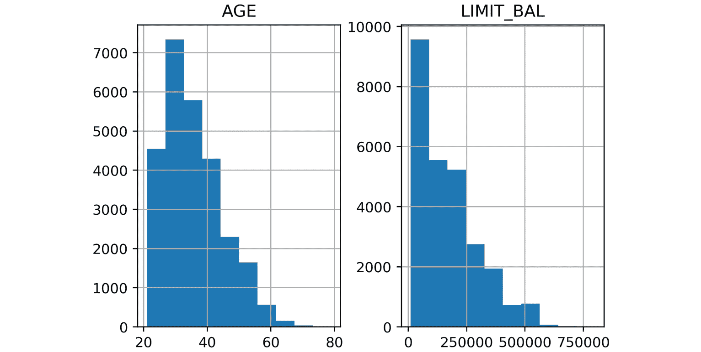

    图 1.28：信用额度和年龄数据的直方图

    这是这些特征的一个不错的视觉快照。我们可以通过这种方式快速大致地查看所有数据。为了查看均值和中位数（即第 50 百分位数）等统计信息，还有另一个有用的 pandas 函数。

1.  使用以下命令生成汇总统计的表格报告：

    ```py
    df_clean_2[['LIMIT_BAL', 'AGE']].describe()
    ```

    你应该看到以下输出：

    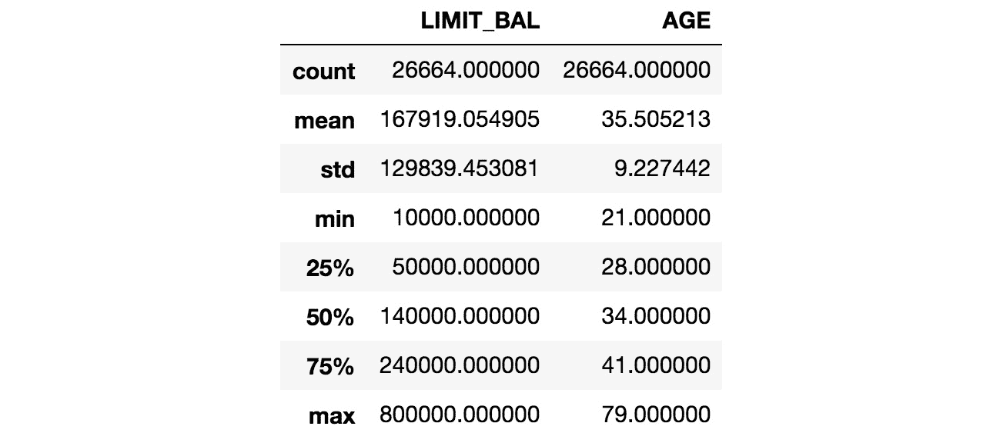

    图 1.29：信用额度和年龄数据的统计摘要

    基于直方图和通过`.describe()`计算的便捷统计数据，其中包括非空值的计数、均值和标准差、最小值、最大值以及四分位数，我们可以做出一些判断。

    `LIMIT_BAL`（信用额度）看起来是合理的。信用额度的最小值为 10,000。该数据集来自台湾，具体的货币单位（新台币）可能不太熟悉，但直观上，信用额度应该大于零。我们建议你查找与本地货币的兑换汇率并考虑这些信用额度。例如，1 美元大约等于 30 新台币。

    `AGE`特征看起来也分布得比较合理，且 21 岁以下的人群没有信用账户。

    对于分类特征，查看值计数是有用的，因为唯一值相对较少。

1.  使用以下代码获取`EDUCATION`特征的值计数：

    ```py
    df_clean_2['EDUCATION'].value_counts()
    ```

    你应该看到以下输出：

    

    图 1.30：EDUCATION 特征的值计数

    在这里，我们看到未记录的教育水平 0、5 和 6，因为数据字典只描述了`教育（1 = 研究生；2 = 大学；3 = 高中；4 = 其他）`。我们的业务合作伙伴告诉我们他们不知道其他教育水平。由于它们不太常见，我们将它们归类为`其他`类别，这似乎是合适的。

1.  运行此代码将`EDUCATION`特征中未记录的级别合并到`其他`级别中，然后检查结果：

    ```py
    df_clean_2['EDUCATION'].replace(to_replace=[0, 5, 6],\
                                    value=4, inplace=True)
    df_clean_2['EDUCATION'].value_counts()
    ```

    pandas 的`.replace`方法使得执行上述替换操作非常快速。运行代码后，你应该会看到以下输出：

    

    图 1.31：清理 EDUCATION 特征

    请注意，这里我们使用了`inplace=True`参数。这意味着，操作将直接修改现有的 DataFrame，而不是返回一个新的 DataFrame。

1.  使用以下代码获取`MARRIAGE`特征的值计数：

    ```py
    df_clean_2['MARRIAGE'].value_counts()
    ```

    你应该获得以下输出：

    

    图 1.32：原始 MARRIAGE 特征的值计数

    这里的问题与`EDUCATION`特征遇到的问题类似；有一个值 0，在数据字典中没有记录：`1 = 已婚；2 = 单身；3 = 其他`。因此，我们将其归类为`其他`。

1.  使用以下代码将`MARRIAGE`特征中的 0 值改为 3，并检查结果：

    ```py
    df_clean_2['MARRIAGE'].replace(to_replace=0, value=3, \
                                   inplace=True)
    df_clean_2['MARRIAGE'].value_counts()
    ```

    输出应该如下所示：

    

图 1.33：清理后的 MARRIAGE 特征的值计数

我们现在已经完成了大量数据的探索和清理。接下来，我们将在 DataFrame 中对其后的财务历史特征进行更高级的可视化和探索。首先，我们将考虑`EDUCATION`特征的含义，这是数据集中的一个分类特征。

按照以下方式保存此练习的进度：

```py
df_clean_2.to_csv('../../Data/df_clean_2_01.csv', index=False)
```

## 深度分析：分类特征

机器学习算法只处理数字。如果你的数据包含文本特征，例如，这些特征需要以某种方式转化为数字。我们上面了解到，我们的案例研究的数据实际上完全是数字化的。然而，值得思考的是它是如何变成这样的。特别是，考虑一下`EDUCATION`特征。

这是一个例子，说明什么是`研究生院`、`大学`、`高中`和`其他`。这些被称为**分类特征的等级**；这里有四个等级。正是通过已经为我们选择的映射，数据才在我们的数据集中以 1、2、3 和 4 的数字形式存在。这个将类别映射到数字的特定分配创建了所谓的**有序特征**，因为这些等级按顺序映射到数字。作为数据科学家，至少你需要意识到这样的映射，除非你自己选择这些映射。

**这种映射有什么影响？**

教育水平按等级排列是有一定道理的，1 对应我们数据集中最高的教育水平，2 对应次高水平，3 对应再高水平，4 可能包括最低水平。然而，当你将这种编码作为机器学习模型中的数值特征时，它会像处理任何其他数值特征一样被对待。对于某些模型，这种效果可能并不希望出现。

**如果一个模型试图找到特征与响应之间的直线关系，会怎样呢？**

这个问题可能看起来有些随意，尽管在书的后面你会了解区分线性模型和非线性模型的重要性。在本节中，我们将简要介绍一些模型确实会寻找特征与响应变量之间的线性关系。是否能够在教育特征的情况下起作用，取决于不同教育水平与我们试图预测的结果之间的实际关系。

在这里，我们考察了两个假设的合成数据案例，每个案例都包含 10 个等级的有序分类变量。这些等级衡量的是访问网站的客户自我报告的满意度。每个等级的客户在网站上停留的平均分钟数绘制在 y 轴上。我们还在每种情况下绘制了最佳拟合线，以说明线性模型如何处理这些数据，如下图所示：

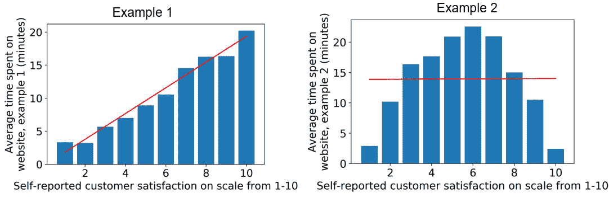

图 1.34：有序特征在线性模型中可能有效，也可能无效

我们可以看到，如果一个算法假设特征与响应变量之间存在线性（直线）关系，这可能根据真实关系的不同效果好坏不一。注意，在这个合成示例中，我们正在建模一个回归问题：响应变量采用连续的数字范围。虽然我们的案例研究涉及分类问题，但一些分类算法，如**逻辑回归**，也假设特征的线性效应。我们将在稍后更详细地讨论这个问题，当我们进入为案例研究建模的数据时。

大致而言，对于二分类问题，即响应变量只有两个结果，我们假设其编码为 0 和 1，您可以通过每个类别特征在每个水平内响应变量的平均值来查看类别特征的不同水平。这些平均值表示每个水平的正类“比率”（即响应变量=1 的样本）。这可以让您了解顺序编码是否适合与线性模型配合使用。假设您在 Jupyter 笔记本中导入了与前面章节相同的包，您可以通过`groupby`/`agg`聚合过程以及 pandas 中的条形图快速查看这一点。

这将根据`EDUCATION`特征中的值对数据进行分组，然后在每个组内通过`default payment next month`响应变量的平均值进行聚合：

```py
df_clean_2 = pd.read_csv('../../Data/df_clean_2_01.csv')
df_clean_2.groupby('EDUCATION').agg({'default payment next '\
                                     'month':'mean'})\
                               .plot.bar(legend=False)
plt.ylabel('Default rate')
plt.xlabel('Education level: ordinal encoding')
```

运行代码后，您应该会得到以下输出：

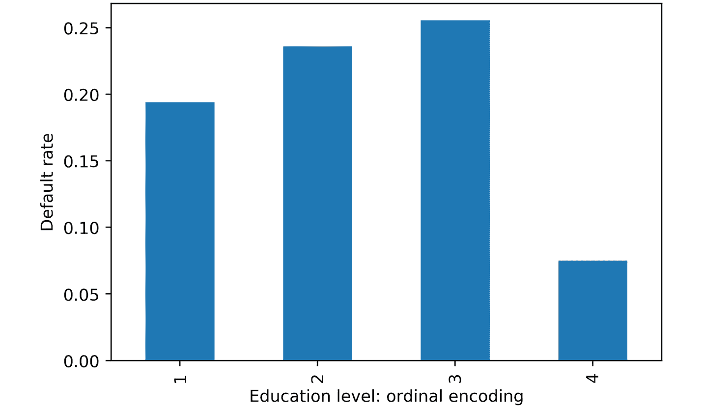

图 1.35：不同教育水平的违约率

与*图 1.34 中的示例 2*类似，这里的数据似乎不太适合用直线拟合来描述。如果某个特征具有类似的非线性效应，可能更适合使用更复杂的算法，例如**决策树**或**随机森林**。或者，如果需要更简单且更具可解释性的线性模型（如逻辑回归），我们可以避免使用顺序编码，而采用不同的类别变量编码方式。一种常见的方式叫做**独热编码**（**OHE**）。

OHE 是一种将类别特征（可能由原始数据中的文本标签组成）转换为数值特征的方法，以便在数学模型中使用。

让我们在一个练习中学习这个。如果你在想为什么逻辑回归更具可解释性，而随机森林更复杂，我们将在后续章节详细学习这些概念。

## 练习 1.07：为类别特征实现 OHE

在本次练习中，我们将“逆向工程”数据集中的`EDUCATION`特征，以获取表示不同教育水平的文本标签，然后展示如何使用 pandas 创建 OHE。作为初步步骤，请设置环境并加载之前练习的进度：

```py
import pandas as pd
import matplotlib as mpl #additional plotting functionality
mpl.rcParams['figure.dpi'] = 400 #high resolution figures
df_clean_2 = pd.read_csv('../../Data/df_clean_2_01.csv')
```

首先，让我们考虑`EDUCATION`特征在编码为顺序之前的样子。从数据字典中我们知道，1 = 研究生，2 = 大学，3 = 高中，4 = 其他。我们希望重新创建一个包含这些字符串的列，而不是数字。执行以下步骤完成练习：

注意

本次练习的 Jupyter 笔记本可以在这里找到：[`packt.link/akAYJ`](https://packt.link/akAYJ)。

1.  为类别标签创建一个空列，命名为`EDUCATION_CAT`。使用以下命令，每一行将包含字符串`'none'`：

    ```py
    df_clean_2['EDUCATION_CAT'] = 'none'
    ```

1.  检查 `EDUCATION` 和 `EDUCATION_CAT` 列的 DataFrame 的前几行：

    ```py
    df_clean_2[['EDUCATION', 'EDUCATION_CAT']].head(10)
    ```

    输出应如下所示：

    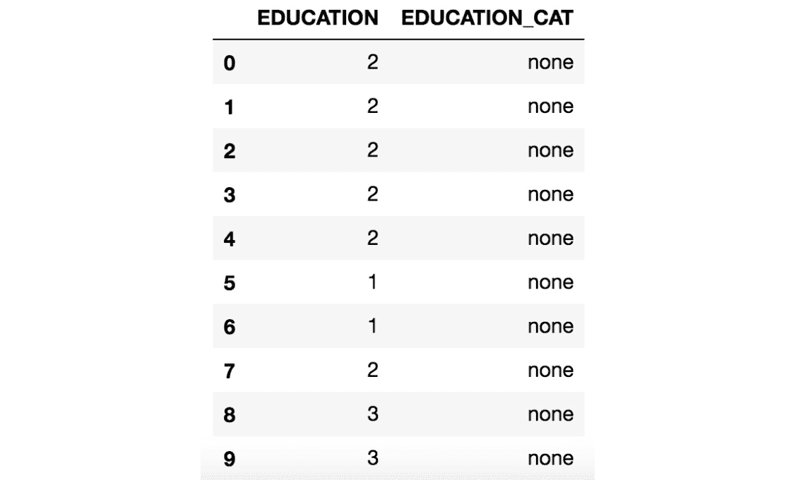

    图 1.36：选择列并查看前 10 行

    我们需要用适当的字符串填充这个新列。pandas 提供了一个方便的功能，可以将一个 Series 的所有值映射到新的值。这个函数实际上叫 `.map`，并依赖于一个字典来建立旧值和新值之间的对应关系。我们的目标是将 `EDUCATION` 中的数字映射到它们所代表的字符串。例如，当 `EDUCATION` 列的值为 1 时，我们将把 `'研究生'` 字符串赋值给 `EDUCATION_CAT` 列，其他教育水平也是如此。

1.  使用以下代码创建描述教育类别映射的字典：

    ```py
    cat_mapping = {1: "graduate school",\
                   2: "university",\
                   3: "high school",\
                   4: "others"}
    ```

1.  使用 `.map` 将映射应用到原始的 `EDUCATION` 列，并将结果赋值给新的 `EDUCATION_CAT` 列：

    ```py
    df_clean_2['EDUCATION_CAT'] = df_clean_2['EDUCATION']\
                                  .map(cat_mapping)
    df_clean_2[['EDUCATION', 'EDUCATION_CAT']].head(10)
    ```

    运行这些代码后，你应该看到以下输出：

    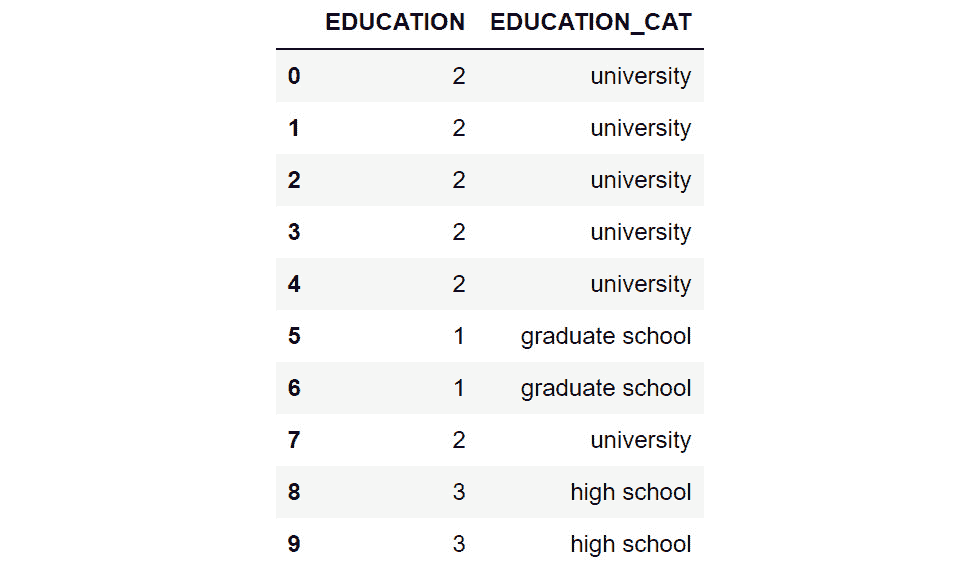

    图 1.37：检查对应于 EDUCATION 的序数编码的字符串值

    很好！请注意，我们本可以跳过*步骤 1*，直接通过*步骤 3*和*4*创建新列，而不需要先将新列赋值为 `'none'`。然而，有时候创建一个初始化为单一值的新列是有用的，因此了解如何做到这一点是值得的。

    现在我们准备进行一热编码。我们可以通过将一个 `DataFrame` 的 Series 传递给 pandas 的 `get_dummies()` 函数来实现。该函数得名于一热编码列也被称为**虚拟变量**。结果将是一个新的 DataFrame，包含与类别变量的级别数相等的列。

1.  运行此代码以创建 `EDUCATION_CAT` 列的一热编码 DataFrame。查看前 10 行：

    ```py
    edu_ohe = pd.get_dummies(df_clean_2['EDUCATION_CAT'])
    edu_ohe.head(10)
    ```

    这应该产生以下输出：

    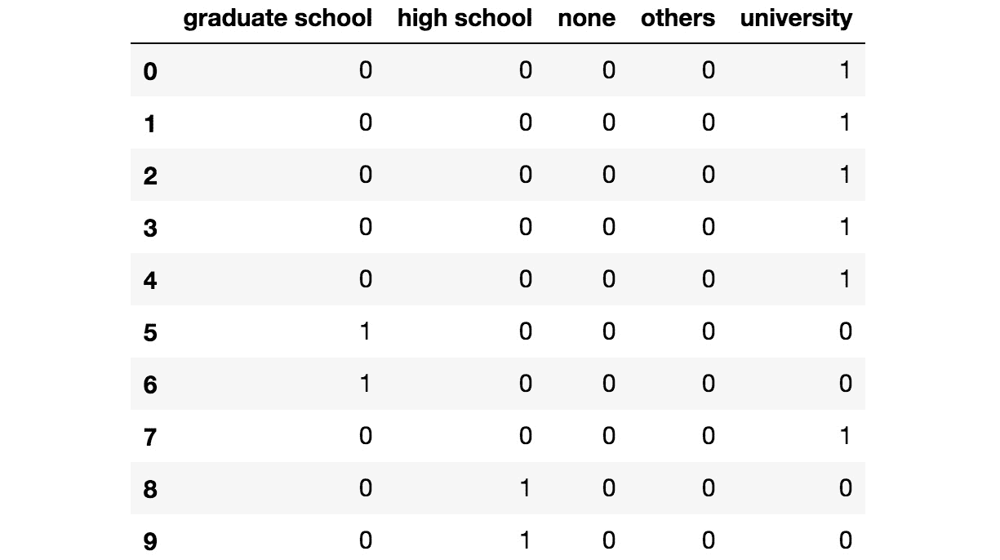

    图 1.38：一热编码的 DataFrame

    你现在可以理解为什么这叫做“独热编码”：在所有这些列中，任何一行都会在恰好一列中为 1，其余列为 0。对于给定的一行，含有 1 的列应该与原始分类变量的水平相匹配。为了验证这一点，我们需要将这个新的 DataFrame 与原始 DataFrame 进行合并，并并排查看结果。我们将使用 pandas 的 `concat` 函数，传入我们希望合并的 DataFrame 列表，并使用 `axis=1` 参数表示水平合并；也就是说，沿着列轴合并。这基本上意味着我们将这两个 DataFrame “并排”组合在一起，我们知道我们可以这样做，因为我们刚刚从原始 DataFrame 创建了这个新 DataFrame：我们知道它将有相同数量的行，且行的顺序与原始 DataFrame 一致。

1.  如下所示，将独热编码后的 DataFrame 合并到原始 DataFrame 中：

    ```py
    df_with_ohe = pd.concat([df_clean_2, edu_ohe], axis=1)
    df_with_ohe[['EDUCATION_CAT', 'graduate school',\
                 'high school', 'university', 'others']].head(10)
    ```

    你应该会看到以下输出：

    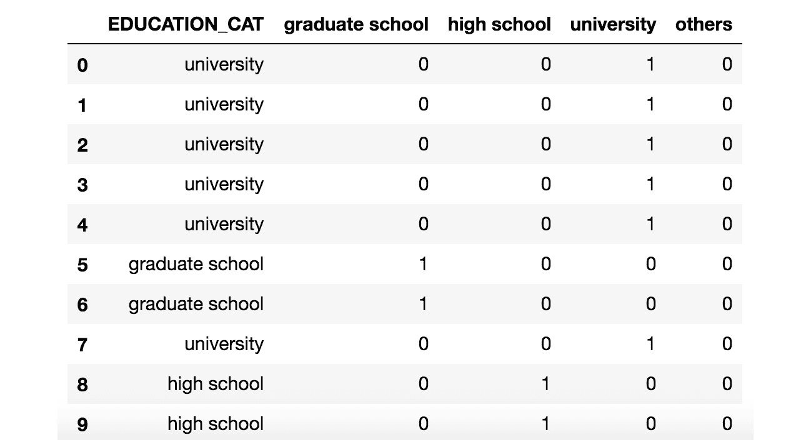

图 1.39：检查独热编码列

好的，看起来这个方法如预期一样有效。OHE 是另一种编码分类特征的方法，它避免了顺序编码中隐含的数值结构。然而，请注意这里发生了什么：我们将单一列 `EDUCATION` 拓展成了与特征水平数量相同的多列。在这种情况下，由于只有四个水平，因此问题不大。但如果你的分类变量有非常多的水平，你可能需要考虑使用其他策略，比如将某些水平合并为一个类别。

现在是时候保存我们创建的 DataFrame 了，它包含了我们清洗数据并添加 OHE 列的成果。

将最新的 DataFrame 写入文件，如下所示：`df_with_ohe.to_csv('../../Data/Chapter_1_cleaned_data.csv', index=False)`。

# 探索数据集中的财务历史特征

我们已经准备好探索案例研究数据集中的其余特征。首先设置环境并加载上一个练习中的数据。可以使用以下代码片段来实现：

```py
import pandas as pd
import matplotlib.pyplot as plt #import plotting package
#render plotting automatically
%matplotlib inline
import matplotlib as mpl #additional plotting functionality
mpl.rcParams['figure.dpi'] = 400 #high resolution figures
import numpy as np
df = pd.read_csv('../../Data/Chapter_1_cleaned_data.csv')
```

注意

你的 CSV 文件的路径可能会有所不同，具体取决于你保存的路径。

需要检查的其余特征是财务历史特征。它们自然分为三组：过去 6 个月的月度付款状态，以及同一时期的账单和已付款金额。首先，让我们来看一下付款状态。将这些特征拆分成一个列表，以便我们可以一起研究它们，比较方便。你可以使用以下代码来实现：

```py
pay_feats = ['PAY_1', 'PAY_2', 'PAY_3', 'PAY_4', 'PAY_5', \
             'PAY_6']
```

我们可以使用 `.describe` 方法对这六个 Series 进行汇总统计分析：

```py
df[pay_feats].describe()
```

这将产生以下输出：

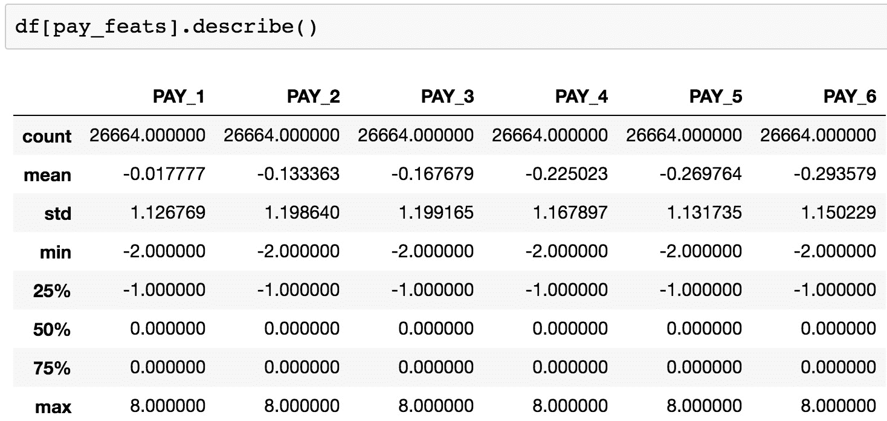

图 1.40：付款状态特征的摘要统计

在这里，我们观察到所有这些特征的值范围都是相同的：-2，-1，0，... 8。看起来，数据字典中描述的值为 9，即*九个月及以上的付款延迟*，从未出现过。

我们已经澄清了所有这些级别的含义，其中一些并不在原始数据字典中。现在让我们再次查看`PAY_1`的`value_counts()`，现在按我们正在计数的值进行排序，这些值是该 Series 的`index`：

```py
df[pay_feats[0]].value_counts().sort_index()
```

这应该产生以下输出：

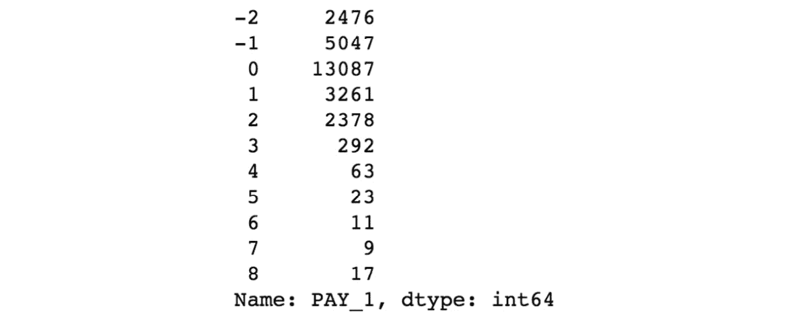

图 1.41：上个月付款状态的值计数

与正整数值相比，大多数值要么是-2，-1，要么是 0，这对应于上个月处于良好状态的帐户：未使用，全额支付，或至少支付了最低还款额。

请注意，由于此变量的其他值的定义（1 = 一个月的付款延迟；2 = 两个月的付款延迟，依此类推），此特征在分类和数值特征之间有点混合。为什么没有信用使用对应于-2 的值，而值为 2 表示 2 个月的延迟付款，依此类推？我们应该意识到，付款状态的数值编码-2，-1 和 0 构成了数据集创建者对如何对某些分类特征进行编码的决定，然后将其与一个真正数值的特征混合在一起：付款延迟的月数（值为 1 及以上）。稍后，我们将考虑这种做法对该特征的预测能力的潜在影响。

现在，我们将继续探索数据。这个数据集足够小，有 18 个这些财务特征和少数其他特征，我们可以负担得起逐个检查每个特征。如果数据集有数千个特征，我们可能会放弃这一点，而是探索`df[pay_feats[0]].hist()`，以产生这个：

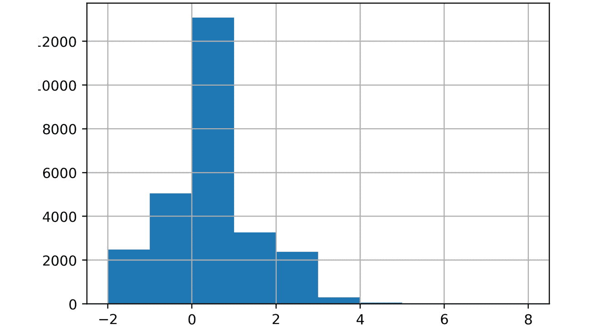

图 1.42：使用默认参数绘制的 PAY_1 直方图

现在我们将深入研究如何生成这个图形，并考虑它是否如此信息丰富。关于 pandas 的图形功能的一个关键点是`.hist()`方法是`**kwds`，文档指出这些是`matplotlib`关键字参数。

注意

欲了解更多信息，请参考以下链接：[`pandas.pydata.org/pandas-docs/stable/reference/api/pandas.DataFrame.hist.html`](https://pandas.pydata.org/pandas-docs/stable/reference/api/pandas.DataFrame.hist.html)。

查阅`matplotlib`文档中的`matplotlib.pyplot.hist`可以看到更多可以与 pandas 的`.hist()`方法一起使用的附加参数，比如绘制的直方图类型（更多详情请参见[`matplotlib.org/api/_as_gen/matplotlib.pyplot.hist.html`](https://matplotlib.org/api/_as_gen/matplotlib.pyplot.hist.html)）。通常，为了获得更详细的绘图功能，了解`matplotlib`是非常重要的，在某些场景下，你可能希望直接使用`matplotlib`而不是 pandas，以便更好地控制图形外观。

你应该意识到，pandas 使用了`matplotlib`，而`matplotlib`又使用了 NumPy。在使用`matplotlib`绘制直方图时，实际上生成直方图数值的计算是由 NumPy 的`.histogram`函数来执行的。这是代码复用的一个关键示例，或称“不要重复造轮子”。如果像绘制直方图这样的标准功能已经在 Python 中有了很好的实现，那么就没有理由重新创建它。而且，如果绘制直方图所需的数学计算已经实现，我们也应该利用它。这展示了 Python 生态系统的相互关联性。

现在我们将讨论计算和绘制直方图时出现的几个关键问题。

**箱体数量**

直方图通过将值分组到所谓的`PAY_1`特征中，那里有 11 个唯一的值。在这种情况下，最好手动将直方图的箱体数设置为唯一值的数量。

在当前的示例中，由于`PAY_1`的高箱体值非常少，图表可能看起来没有太大变化。但通常来说，绘制直方图时要牢记这一点。

**箱体边缘**

箱体边缘的位置决定了值在直方图中的分组方式。你可以选择不向绘图函数指定箱体数量，而是为`bins`关键字参数提供一个数字列表或数组。该输入将被解释为 x 轴上的箱体边缘位置。理解`matplotlib`如何使用这些边缘位置将值分组到箱体中是很重要的。除了最后一个箱体外，所有箱体都会将值从左边缘开始，包括左边缘，但不包括右边缘，换句话说，左边缘是闭合的，右边缘是开放的。然而，最后一个箱体则包括了两个边缘，它的左右边缘都是闭合的。当你将相对较少的唯一值分配到箱体边缘时，这一点特别重要。

为了更好地控制图形外观，通常最好指定箱体的边缘位置。我们将创建一个包含 12 个数字的数组，这将生成 11 个箱体，每个箱体都围绕`PAY_1`的一个唯一值进行中心对齐：

```py
pay_1_bins = np.array(range(-2,10)) - 0.5
pay_1_bins
```

输出显示了箱体的边缘位置：

```py
array([-2.5, -1.5, -0.5, 0.5, 1.5, 2.5,\
       3.5,4.5, 5.5, 6.5, 7.5,8.5])
```

最后一个风格点是，始终*标注你的图表*，使其具有可解释性。我们还没有手动标注，因为在某些情况下，pandas 会自动完成，其他情况下我们只是让图表保持无标签。从现在开始，我们将遵循最佳实践并标注所有图表。我们使用 `matplotlib` 中的 `xlabel` 和 `ylabel` 函数为此图表添加轴标签。代码如下：

```py
df[pay_feats[0]].hist(bins=pay_1_bins)
plt.xlabel('PAY_1')
plt.ylabel('Number of accounts')
```

输出应该如下所示：

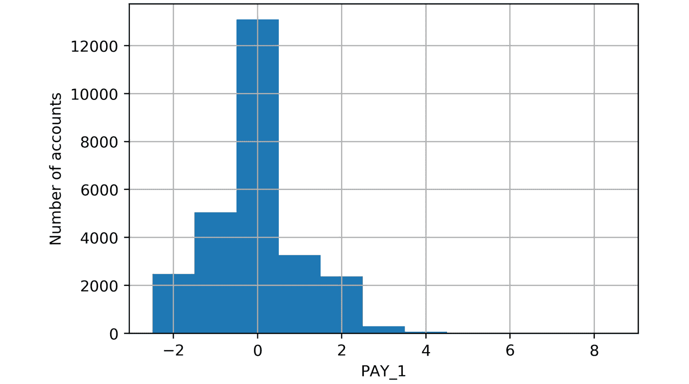

图 1.43：改进后的 PAY_1 直方图

*图 1.43* 展示了改进后的直方图，因为条形图已对齐实际数据值，每个唯一值对应一个条形图。虽然仅使用默认参数调用绘图函数很有吸引力，并且通常足够，但作为数据科学家的职责之一是创建*准确且具有代表性的数据可视化图表*。为此，有时你需要深入了解绘图代码的细节，就像我们在这里做的那样。

**我们从这次数据可视化中学到了什么？**

由于我们已经查看了值的计数，这进一步确认了大多数账户处于良好状态（值为 -2、-1 和 0）。对于那些没有处于良好状态的账户，"延迟月份" 较小的情况更为常见。这是有道理的；很可能大多数人会在不久后支付完余额。否则，他们的账户可能会被关闭或转交给收款公司。检查特征的分布并确保其合理性是与客户确认的好方法，因为数据的质量直接影响到你所进行的预测建模。

既然我们已经为直方图建立了一些良好的绘图风格，让我们使用 pandas 一起绘制多个直方图，并可视化最近 6 个月的还款状态特征。我们可以将包含列名的列表 `pay_feats` 传递给 `.hist()` 方法，指定我们已确定的箱子边界，并表示我们希望绘制 2 行 3 列的子图。首先，我们将字体大小设置得足够小，以适应这些**子图**之间的间距。以下是相关代码：

```py
mpl.rcParams['font.size'] = 4
df[pay_feats].hist(bins=pay_1_bins, layout=(2,3))
```

绘图标题已经根据列名自动生成。y 轴表示计数。生成的可视化结果如下：

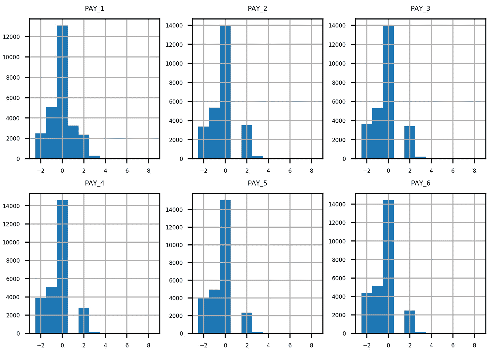

图 1.44：直方图子图的网格

我们已经看过了第一个图表，这很有意义。那么其余的呢？请记住这些特征的正整数值定义及其含义。例如，`PAY_2` 是 8 月的还款状态，`PAY_3` 是 7 月的还款状态，其他则追溯得更久。值为 1 表示延迟支付 1 个月，值为 2 表示延迟支付 2 个月，依此类推。

你有没有注意到似乎有什么不对劲？看看 7 月（`PAY_3`）和 8 月（`PAY_2`）之间的值。7 月，支付延迟 1 个月的账户非常少；在直方图中几乎看不见这一条。然而，到了 8 月，突然出现了数千个支付延迟 2 个月的账户。这不合逻辑：在一个月内，2 个月延迟的账户数量应该小于或等于前一个月支付延迟 1 个月的账户数量。

让我们仔细看看 8 月有 2 个月延迟的账户，查看它们在 7 月的支付状态。我们可以使用以下代码，通过布尔掩码和`.loc`来实现，代码示例如下：

```py
df.loc[df['PAY_2']==2, ['PAY_2', 'PAY_3']].head()
```

输出结果应该如下所示：

![图 1.45：8 月有 2 个月支付延迟的账户在 7 月的支付状态（PAY_3）

延迟支付状态（PAY_2）]

](img/B16925_01_45.jpg)

图 1.45：8 月有 2 个月支付延迟的账户在 7 月的支付状态（PAY_3）（PAY_2）

从*图 1.45*可以看出，8 月有 2 个月延迟的账户在 7 月的支付状态值是无意义的。实现 2 个月延迟的唯一途径应该是从前一个月的 1 个月延迟开始，但这些账户都没有显示这一点。

当你在数据中看到类似的情况时，你需要检查用来创建数据集的查询逻辑，或者联系提供数据集的人。在仔细检查这些结果之后，比如使用`.value_counts()`直接查看数字，我们联系了客户以询问这个问题。

客户告诉我们，他们在获取最新月份数据时遇到了问题，这导致了支付延迟 1 个月的账户报告错误。在 9 月，他们大部分修复了这些问题（尽管没有完全修复，这也是我们发现`PAY_1`特征中存在缺失值的原因）。因此，在我们的数据集中，除了 9 月（`PAY_1`特征）之外，所有月份中的 1 的值都被低估了。从理论上讲，客户可以创建查询来回溯他们的数据库，并确定`PAY_2`、`PAY_3`等的正确值。然而，出于实际原因，他们无法在我们需要的时候完成这一回溯分析并将结果纳入我们的项目中。

因此，我们的支付状态数据中只有最新月份是正确的。这意味着，在所有支付状态特征中，只有`PAY_1`能够代表未来数据，即将用于我们开发的模型进行预测的数据。这是一个关键点：*预测模型依赖于获取与其构建时相同类型的数据来进行预测*。这意味着我们可以将`PAY_1`作为模型中的特征，但不能使用`PAY_2`或来自前几个月的其他支付状态特征。

本章节展示了对数据质量进行彻底检查的重要性。只有通过仔细地梳理数据，我们才发现了这个问题。如果客户能提前告知我们，在数据集收集的那段时间里，他们在报告过程中遇到过问题，并且报告过程在那段时间内并不**一致**，那就好了。然而，最终建立一个可信的模型是我们的责任，因此我们需要通过这种详细的探索，确保我们相信数据是正确的。我们向客户解释，由于旧的特征不代表模型将在其上进行**评分**的未来数据（即预测未来几个月的数据），因此无法使用这些旧特征，并要求他们告知我们他们所知的任何进一步的数据问题。目前没有。

## 活动 1.01：探索数据集中的剩余财务特征

在本活动中，您将以类似于我们检查 `PAY_1`、`PAY_2`、`PAY_3` 等特征的方式检查剩余的财务特征。为了更好地可视化这些数据，我们将使用一个大家应该熟悉的数学函数：对数。您将使用 pandas 的 `apply` 方法，这个方法可以将任何函数应用到整个列或 DataFrame。在完成活动后，您应该得到以下一组非零支付对数变换的直方图：

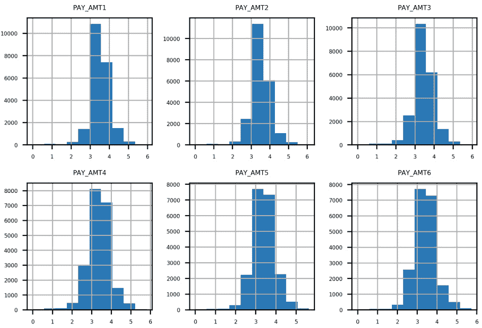

](img/B16925_01_46.jpg)

图 1.46：预期的直方图集

执行以下步骤以完成活动：

在开始之前，设置您的环境并按以下方式加载清理过的数据集：

```py
import pandas as pd
import matplotlib.pyplot as plt #import plotting package
#render plotting automatically
%matplotlib inline
import matplotlib as mpl #additional plotting functionality
mpl.rcParams['figure.dpi'] = 400 #high resolution figures
mpl.rcParams['font.size'] = 4 #font size for figures
from scipy import stats
import numpy as np
df = pd.read_csv('../../Data/Chapter_1_cleaned_data.csv')
```

1.  创建剩余财务特征的特征名称列表。

1.  使用 `.describe()` 检查账单金额特征的统计摘要。反思一下你看到的内容。这合理吗？

1.  使用 2x3 网格的直方图绘制账单金额特征。

    提示：您可以为此可视化使用 20 个区间。

1.  获取支付金额特征的 `.describe()` 摘要。这合理吗？

1.  绘制类似于账单金额特征的账单支付特征的直方图，但也使用 `xrot` 关键字参数对 x 轴标签进行旋转，以避免重叠。在任何绘图函数中，您都可以使用 `xrot=<角度>` 关键字参数，将 x 轴标签按给定角度（以度为单位）旋转。考虑一下结果。

1.  使用布尔掩码查看有多少支付金额数据正好等于 0。考虑一下在前一步的直方图中，这是否合理？

1.  使用您在前一步创建的掩码忽略 0 的支付，使用 pandas 的 `.apply()` 和 NumPy 的 `np.log10()` 对非零支付的对数变换进行直方图绘制。考虑一下结果。

    提示：您可以使用 `.apply()` 将任何函数，包括 `log10`，应用到 DataFrame 或列的所有元素，语法如下：`.apply(<函数名称>)`。

    注意

    包含本次活动的 Python 代码及对应输出的 Jupyter notebook 可以在这里找到：[`packt.link/FQQOB`](https://packt.link/FQQOB)。本次活动的详细逐步解决方案可以通过此链接找到。

# 总结

在本章的介绍部分，我们广泛使用了 pandas 来加载和探索案例研究数据。我们学习了如何通过结合统计摘要和可视化来检查基本的一致性和正确性。我们回答了诸如“唯一的账户 ID 真的唯一吗？”，“是否有缺失数据已被填充？”以及“特征的值是否符合其定义？”等问题。

你可能注意到，我们几乎将本章的所有时间都花在了识别和修正数据集的问题上。这通常是数据科学项目中最耗时的阶段。虽然这未必是最激动人心的部分，但它为你提供了构建激动人心的模型和洞察所需的原材料。这些将成为本书其余部分的大部分内容。

软件工具和数学概念的掌握使你能够在技术层面执行数据科学项目。然而，管理与客户的关系同样重要，因为客户依赖你的服务从数据中提取洞察。你必须尽可能多地利用业务伙伴对数据的理解。除非你已经是该领域的专家，否则他们对数据可能比你更熟悉。然而，即便如此，你的第一步应该是对所使用的数据进行彻底且批判性的审查。

在我们的数据探索过程中，我们发现了一个可能会破坏我们项目的问题：我们收到的数据在内部并不一致。大多数支付状态特征的月份存在数据报告问题，包括不合逻辑的值，而且这些数据并不是最新一个月的数据，也不是未来模型可能使用的数据。我们只有通过仔细查看所有特征才发现了这个问题。虽然这并非总是可能的，特别是当特征非常多时，但你应该始终抽时间检查尽可能多的特征。如果无法检查每个特征，那么在特征有类别时，比如财务或人口统计特征，检查每类中的几个特征会很有用。

在与客户讨论此类数据问题时，请确保保持尊重和专业。客户在向你提供数据时，可能只是忘记了这个问题。或者，他们可能知道这个问题，但出于某种原因认为它不会影响你的分析。无论如何，你通过提醒客户并解释为何使用有缺陷的数据建立模型会成为问题，实际上是在为他们提供一项重要的服务。尽量具体说明，展示你用来发现问题的图表和表格类型。

在下一章，我们将检查我们的案例研究问题中的响应变量，这将完成初步的数据探索。然后我们将开始接触机器学习模型，学习如何判断一个模型是否有用。当我们开始使用案例研究数据建立模型时，这些技能将变得非常重要。
