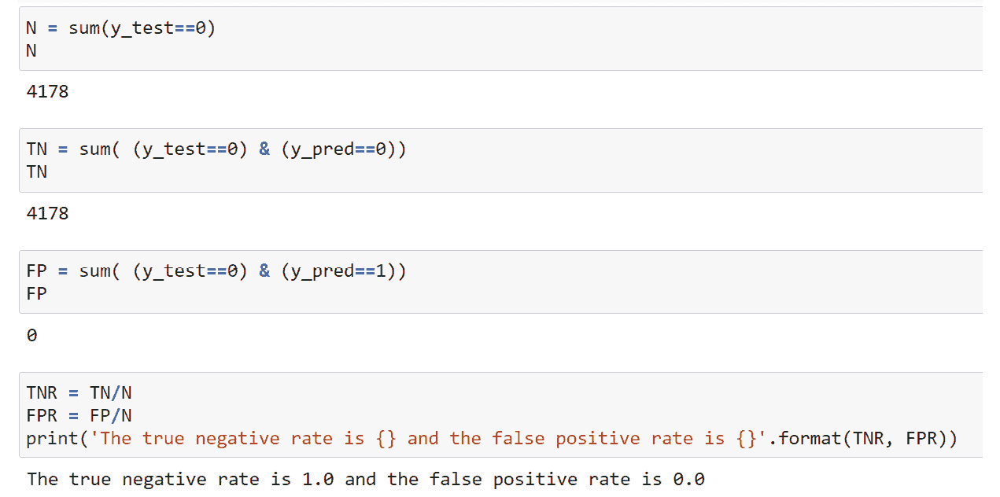

# 第二章：2\. Scikit-Learn 简介与模型评估

概述

在探索了案例研究数据的响应变量后，本章通过简单的逻辑回归和线性回归使用案例，介绍了 scikit-learn 在训练模型和进行预测方面的核心功能。我们将展示二分类模型的评估指标，包括**真阳性率和假阳性率**、**混淆矩阵**、**受试者工作特征**（**ROC**）**曲线**以及**精准率-召回率曲线**，既通过从头开始实现，也通过便捷的 scikit-learn 功能来演示。到本章结束时，你将能够使用 scikit-learn 构建和评估二分类模型。

# 介绍

在上一章中，你已经熟悉了基本的 Python，并学习了用于数据探索的 pandas 工具。通过使用 Python 和 pandas，你执行了如加载数据集、验证数据完整性以及对数据中的特征（即自变量）进行探索性分析等操作。

在本章中，我们将通过检查响应变量来完成数据的探索。在我们得出数据质量高且合理的结论后，就可以开始开发机器学习模型了。我们将以 scikit-learn 作为起步，scikit-learn 是 Python 语言中最流行的机器学习库之一。在下一章学习数学模型的具体细节之前，本章将让我们熟悉在 scikit-learn 中使用这些模型的语法。

我们还将学习一些常用技术，用来回答“这个模型好不好？”这个问题。模型评估有许多不同的方式。对于商业应用来说，进行财务分析以确定模型可能带来的价值，是了解工作潜在影响的重要方式。通常，最好在项目一开始就界定商业机会。然而，由于本书的重点是机器学习和预测建模，我们将在最后一章展示财务分析。

有几个重要的模型评估标准被视为数据科学和机器学习中的基本知识。我们将在这里介绍一些最广泛使用的分类模型性能指标。

# 探索响应变量并完成初步探索

我们现在已经检查过所有的**特征**，看看是否有缺失数据，并且对它们进行了一般性检查。特征很重要，因为它们构成了我们机器学习算法的**输入**。在模型的另一端是**输出**，即对**响应变量**的预测。对于我们的问题来说，这是一个二元标志，指示信用账户下个月是否会违约。

案例研究项目的关键任务是为该目标提出预测模型。由于响应变量是一个是/否标志，因此此问题被称为“下个月是否违约”的问题（`'default payment next month'` `= 1`），属于**正类**，而未违约的属于**负类**。

关于二元分类问题响应的主要信息是：正类的比例是多少？这是一个简单的检查。

在执行此检查之前，我们使用以下代码加载所需的软件包：

```py
import numpy as np #numerical computation
import pandas as pd #data wrangling
import matplotlib.pyplot as plt #plotting package
#Next line helps with rendering plots
%matplotlib inline
import matplotlib as mpl #add'l plotting functionality
mpl.rcParams['figure.dpi'] = 400 #high res figures
```

现在，我们像这样加载案例研究数据的清理版本：

```py
df = pd.read_csv('../../Data/Chapter_1_cleaned_data.csv')
```

注意

清理后的数据集应该已经保存在*第一章*，*数据探索和清理*中的工作结果中。如果您将其保存在不同的位置，则前面代码片段中的清理数据的路径可能会有所不同。

现在，要找出正类的比例，我们只需得到整个数据集上响应变量的平均值。这被解释为违约率。此外，使用`pandas`中的`groupby`和`count`来检查每个类别的样本数量是值得的。如下屏幕截图所示：


图 2.1：响应变量的类别平衡

由于目标变量为`1`或`0`，取这一列的均值表示违约账户的比例为 22%。正类（违约 = 1）的样本比例，也称为此类别的**类别分数**，是一个重要的统计量。在二元分类中，数据集通常描述为**平衡**或**不平衡**：正类和负类的比例是否相等？大多数机器学习分类模型都设计用于处理平衡数据：类别之间的 50/50 分布。

然而，在实际应用中，真实数据很少是平衡的。因此，有几种方法专门用于处理不平衡数据。这些包括以下方法：

+   **过采样**多数类别：随机丢弃多数类别的样本，直到类别分布相等，或至少更少不平衡。

+   **过采样**少数类别：随机添加少数类别的重复样本，以达到相同的目标。

+   **加权样本**：此方法作为训练步骤的一部分执行，因此少数类在训练模型中具有与多数类相同的“重视”。其效果类似于过采样。

+   更复杂的方法，如**合成少数类过采样技术**（**SMOTE**）。

虽然我们的数据在严格意义上不是平衡的，但我们也注意到，22%的正类比例并不是特别不平衡。在一些领域，比如欺诈检测，通常处理的正类比例更小，通常在 1%或更少。这是因为“坏演员”的比例相对于交易总量非常小；与此同时，如果可能的话，能够识别它们是很重要的。对于这类问题，使用方法来处理类别不平衡更可能带来显著更好的结果。

现在我们已经探索了响应变量，初步的数据探索也已经完成。然而，数据探索应该被视为一个持续的任务，应该在任何项目中时刻考虑。当你创建模型并生成新结果时，始终思考这些结果对数据意味着什么，这通常需要快速回到探索阶段进行迭代。一个特别有用的探索方法，通常也是在构建模型之前进行的，是检查特征与响应变量之间的关系。我们在*第一章*《数据探索与清洗》中已经展示了这一点，当时我们按照`EDUCATION`特征进行分组，并检查了响应变量的均值。我们以后还会做更多这样的工作。不过，这更涉及到构建模型，而不是检查数据的内在质量。

我们刚刚完成的对所有数据的初步浏览是项目开始时需要打下的重要基础。在此过程中，你应该问自己以下问题：

+   数据是否**完整**？

    是否存在缺失值或其他异常情况？

+   数据是否**一致**？

    数据分布是否随时间变化，如果是，是否可以预期？

+   数据是否**合理**？

    特征的值是否符合数据字典中的定义？

后两个问题有助于你判断数据是否**正确**。如果这些问题的答案是“否”，那么在继续项目之前应该解决这些问题。

此外，如果你想到任何可能有帮助的额外数据，并且可以获取，现在是项目生命周期中一个很好的时机将其加入到数据集中。例如，如果你有与账户相关的地址数据，可以将邮政编码级别的人口统计数据**加入**到数据集中。我们在案例研究数据中没有这些数据，因此决定在现有数据的基础上继续进行该项目。

# Scikit-Learn 简介

虽然 pandas 可以节省你大量加载、检查和清理数据的时间，但使你能够进行预测建模的机器学习算法位于其他包中。Scikit-learn 是一个基础的 Python 机器学习包，包含许多有用的算法，并且也影响了其他 Python 机器学习库的设计和语法。因此，我们将重点学习 scikit-learn，以培养预测建模的实践技能。虽然没有任何一个包能够提供所有功能，但就适配分类、回归和无监督学习的经典方法而言，scikit-learn 已经做得相当接近了。然而，它对一些较新的进展（如深度学习）并没有太多功能。

这里有几个其他相关的包，你应该了解：

**SciPy**:

+   到目前为止，我们使用的大多数包，如 NumPy 和 pandas，实际上都是 SciPy 生态系统的一部分。

+   SciPy 提供轻量级函数，支持经典方法，如线性回归和线性规划。

**StatsModels**:

+   更偏向于统计学，可能对于熟悉 R 的用户更为舒适

+   可以获取回归系数的 p 值和置信区间

+   时间序列模型的能力，如 ARIMA

**XGBoost 和 LightGBM**:

+   提供一套先进的集成模型，这些模型通常比随机森林表现更好。我们将在*第六章*，*梯度提升、SHAP 值和处理缺失数据*中学习 XGBoost。

**TensorFlow, Keras, 和 PyTorch**:

+   深度学习能力

还有许多其他的 Python 包可能会派上用场，但这些给你提供了一个大致的了解。

Scikit-learn 提供了丰富的不同模型用于各种任务，但方便的是，它们的使用语法是一致的。在这一节中，我们将使用 **逻辑回归** 模型来说明模型语法。尽管名字中带有“回归”，逻辑回归实际上是一个分类模型。这是最简单的分类模型之一，因此也是最重要的模型之一。在下一章中，我们将详细讲解逻辑回归的数学原理。在此之前，你可以简单地将其视为一个可以从标记数据中学习的黑箱，然后做出预测。

从第一章开始，你应该熟悉在标记数据上训练算法的概念，这样你就可以使用训练好的模型对新数据进行预测。Scikit-learn 将这些核心功能封装在 `.fit` 方法中用于训练模型，`.predict` 方法中用于进行预测。由于语法的一致性，你可以在任何 scikit-learn 模型上调用 `.fit` 和 `.predict`，从线性回归到分类树。

第一步是选择一个模型，在这个例子中是逻辑回归模型，并从`.fit`和数据中实例化它，例如从模型拟合过程学到的信息。当你从 scikit-learn 实例化一个模型类时，你是拿到 scikit-learn 为你提供的模型蓝图，并将其创建为一个有用的**对象**。你可以在你的数据上训练这个对象，然后将其保存到磁盘以供以后使用。以下代码片段可以用来执行这个任务。第一步是导入类：

```py
from sklearn.linear_model import LogisticRegression
```

将类实例化为对象的代码如下：

```py
my_lr = LogisticRegression()
```

该对象现在是我们工作区中的一个变量。我们可以使用以下代码进行检查：

```py
my_lr
```

这应该会输出以下内容：

```py
LogisticRegression()
```

请注意，创建模型对象的过程本质上并不需要了解逻辑回归是什么或它如何工作。尽管我们在创建逻辑回归模型对象时没有选择任何特定选项，但我们现在实际上使用了很多**默认选项**来构建和训练模型。实际上，这些是我们在不知道的情况下做出的关于模型实现细节的选择。像 scikit-learn 这样易于使用的包的危险在于，它可能会让你忽视这些选择。然而，每当你使用一个为你准备好的机器学习模型时，就像 scikit-learn 模型一样，你的首要任务是理解所有可用的选项。在这种情况下，最佳实践是，在创建对象时明确提供每个关键字参数给模型。即使你只是选择所有默认选项，这也有助于提高你对所做选择的意识。

我们稍后将回顾这些选择的解释，但现在这里是使用所有默认选项实例化逻辑回归模型的代码：

```py
my_new_lr = LogisticRegression(penalty='l2', dual=False,\
                               tol=0.0001, C=1.0,\
                               fit_intercept=True,\
                               intercept_scaling=1,\
                               class_weight=None,\
                               random_state=None,\
                               solver='lbfgs',\
                               max_iter=100,\
                               multi_class='auto',\
                               verbose=0, warm_start=False,\
                               n_jobs=None, l1_ratio=None)
```

尽管我们在`my_new_lr`中创建的对象与`my_lr`完全相同，但像这样显式地指定，尤其在你刚开始学习并了解不同模型时是非常有帮助的。一旦你更加熟悉，你可能希望只使用默认选项进行实例化，并在必要时稍后进行更改。在这里，我们展示了如何做到这一点。以下代码设置了两个选项并显示了模型对象的当前状态：

```py
my_new_lr.C = 0.1
my_new_lr.solver = 'liblinear'
my_new_lr
```

这应该会产生以下内容：

```py
Out[11]:LogisticRegression(C=0.1, solver='liblinear')
```

请注意，仅显示了我们已从默认值更新的选项。在这里，我们将一个叫做`C`的参数从默认值`1`更新为`0.1`，并且我们还指定了一个求解器。现在，了解超参数是你在将模型拟合到数据之前提供的选项就足够了。这些选项指定了模型将如何训练。稍后，我们将详细解释所有选项是什么以及如何有效选择它们的值。

为了说明核心功能，我们将用这个几乎默认的逻辑回归算法来拟合一些数据。监督学习算法依赖于带标签的数据。这意味着我们需要特征，通常包含在一个名为`X`的变量中，以及对应的响应，包含在一个名为`y`的变量中。我们将从数据集中借用前 10 个样本的一个特征和响应来说明：

```py
X = df['EDUCATION'][0:10].values.reshape(-1,1)
X
```

这应该显示前 10 个样本的`EDUCATION`特征值：


图 2.2：特征的前 10 个值

可以通过以下方式获得响应变量的前 10 个对应值：

```py
y = df['default payment next month'][0:10].values
y
```

这是输出结果：

```py
Out[13]: array([1, 1, 0, 0, 0, 0, 0, 0, 0, 0])
```

在这里，我们选择了 DataFrame 中的几个 Series（即列）：我们讨论过的`EDUCATION`特征和响应变量。然后我们选择了每个特征的前 10 个元素，并最终使用`.values`方法返回了 NumPy 数组。还注意到，我们使用了`.reshape`方法来调整特征的形状。Scikit-learn 期望特征数组的第一个维度（即行数）等于样本数，因此我们需要对`X`进行这种形状调整，但`y`不需要。`.reshape`的第一个位置参数中的`–1`表示根据输入数据的数量，在该维度上灵活调整输出数组的形状。由于这个例子中我们只有一个特征，所以我们指定了第二个参数，即列数为`1`，并让`–1`参数指示数组应根据需要填充第一维，容纳数据，在这个例子中是 10 个元素。请注意，虽然我们提取了数据并转换为 NumPy 数组来展示这种方法，但也可以直接将 pandas Series 作为输入传递给 scikit-learn。

现在让我们使用这些数据来拟合我们的逻辑回归。这只需要一行代码：

```py
my_new_lr.fit(X, y)
```

这是输出结果：

```py
Out[14]:LogisticRegression(C=0.1, solver='liblinear')
```

仅此而已。一旦数据准备好并且模型被指定，拟合模型几乎就像是顺便做的事。当然，我们现在忽略了所有重要的选项以及它们的含义。但从技术角度来看，拟合一个模型在代码层面是非常简单的。你可以看到，这个单元的输出只是打印出了我们已经看到的相同选项。虽然拟合过程没有返回任何内容，除了这个输出，但一个非常重要的变化已经发生。`my_new_lr`模型对象现在是一个已训练的模型。我们可以说，这个变化发生在`my_new_lr`，它已经被修改。这类似于修改 DataFrame 的原地操作。现在我们可以使用训练好的模型，利用新的样本特征来进行预测，而这些样本是模型之前从未“见过”的。让我们试试`EDUCATION`特征的接下来的 10 行。

我们可以使用一个新变量`new_X`来选择和查看这些特征：

```py
new_X = df['EDUCATION'][10:20].values.reshape(-1,1)
new_X
```


图 2.3: 新特征用于预测

预测是这样进行的：

```py
my_new_lr.predict(new_X)
```

这里是输出结果：

```py
array([0, 0, 0, 0, 0, 0, 0, 0, 0, 0])
```

我们还可以查看与这些预测对应的真实值，因为这些数据是有标签的：

```py
df['default payment next month'][10:20].values
```

这里是输出结果：

```py
Out[17]:array([0, 0, 0, 1, 0, 0, 1, 0, 0, 0])
```

在这里，我们展示了几件事。在获取到新的特征值后，我们调用了经过训练的模型的 `.predict` 方法。请注意，这个方法的唯一参数是一组特征，也就是我们称之为 `new_X` 的“X”。

我们的小模型表现得如何？我们可能天真地认为，因为模型预测了所有的 0，而且真实标签中 80% 是 0，所以我们有 80% 的预测是正确的，看起来似乎不错。另一方面，我们完全未能成功预测任何 1。所以，如果 1 的预测很重要，我们实际上表现得并不好。虽然这只是一个让你熟悉 scikit-learn 工作方式的例子，但值得考虑一下，对于这个问题，什么是“好的”预测。我们很快会详细讨论如何评估模型的预测能力。现在，先为自己鼓掌，因为你已经在实际数据中动手，完成了第一个机器学习模型的拟合。

## 生成合成数据

在接下来的练习中，你将独立完成模型拟合过程。我们将通过使用线性回归来引导这个过程，线性回归是最著名的数学模型之一，应该是基本统计学中比较熟悉的内容，也叫作最佳拟合线。如果你不知道它是什么，可以查阅基础统计学资料，尽管这里的目的是展示 scikit-learn 中模型拟合的机制，而不是深入理解模型。我们将在本书后面讨论其他数学模型的应用，如逻辑回归。在此之前，你将通过使用 `random` 库来生成随机数，以及 matplotlib 的 `scatter` 和 `plot` 函数来创建散点图和线图，来准备好数据。在线性回归部分的练习中，我们将使用 scikit-learn。

为了开始，我们使用 NumPy 创建一个由 1,000 个随机实数（也就是说，不仅仅是整数，还有小数）组成的单维特征数组 `X`，这些数字的范围在 0 到 10 之间。我们再次使用 `default_rng`（随机数生成器）的方法 `.uniform`，从均匀分布中抽取：在 `low`（包含）和 `high`（不包含）之间，选择任意数字的概率是相等的，并且返回一个由你指定的 `size` 大小组成的数组。我们创建一个包含 1,000 个元素的一维数组（即向量），然后检查前 10 个数字。所有这些都可以通过以下代码完成：

```py
from numpy.random import default_rng
rg = default_rng(12345)
X = rg.uniform(low=0.0, high=10.0, size=(1000,))
X[0:10]
```

输出应该如下所示：


图 2.4: 使用 NumPy 创建随机、均匀分布的数字

## 线性回归数据

现在我们需要一个响应变量。对于这个例子，我们将生成符合线性回归假设的数据：数据将展示出与特征之间的线性趋势，但同时具有正态分布的误差：


图 2.5：带有高斯噪声的线性方程

这里，*a* 是斜率，*b* 是截距，而高斯噪声的均值是 *µ*，标准差是 *σ*。为了实现这一点，我们需要创建一个对应的响应向量 `y`，它通过斜率乘以特征数组 `X`，再加上一些高斯噪声（同样使用 NumPy）和一个截距来计算。噪声将是一个包含 1,000 个数据点的数组，它与特征数组 `X` 的形状相同（`size`），噪声的均值（`loc`）为 0，标准差（`scale`）为 1\. 这样就会为我们的线性数据增加一点“散布”：

```py
slope = 0.25
intercept = -1.25
y = slope * X + rg.normal(loc=0.0, scale=1.0, size=(1000,))\
          + intercept
```

现在我们想要可视化这些数据。我们将使用 matplotlib 将 `y` 与特征 `X` 绘制为散点图。首先，我们使用 `.rcParams` 设置图像的分辨率（`dpi` = 每英寸点数），以获得清晰的图像。然后，我们使用 `plt.scatter` 创建散点图，其中 `X` 和 `y` 是前两个参数，`s` 参数指定点的大小。

这段代码可以用于绘图：

```py
mpl.rcParams['figure.dpi'] = 400
plt.scatter(X,y,s=1)
plt.xlabel('X')
plt.ylabel('y')
```

执行这些单元格后，你应该在你的笔记本中看到类似这样的内容：


图 2.6：绘制带噪声的线性关系

看起来像一些带噪声的线性数据，正如我们所希望的那样。现在让我们开始建模。

注意

如果你正在阅读本书的印刷版，可以通过访问以下链接下载并浏览本章某些图像的彩色版本：[`packt.link/0dbUp`](https://packt.link/0dbUp)。

## 练习 2.01：Scikit-Learn 中的线性回归

在本练习中，我们将使用刚刚生成的合成数据，并使用 scikit-learn 确定最佳拟合线，或线性回归。第一步是从 scikit-learn 导入线性回归模型类并创建一个对象。导入的过程类似于我们之前使用的 `LogisticRegression` 类。和任何模型类一样，你应该观察所有默认选项。请注意，对于线性回归，指定的选项并不多：你将在本练习中使用默认值。默认设置包括 `fit_intercept=True`，这意味着回归模型将包括截距项。这是完全合适的，因为我们已经在合成数据中添加了截距。请按照以下步骤完成练习，注意前面部分生成线性回归数据的代码必须先在同一个笔记本中运行（如 GitHub 上所见）：

注意

本练习的 Jupyter 笔记本可以在这里找到：[`packt.link/IaoyM`](https://packt.link/IaoyM)。

1.  执行这段代码以导入线性回归模型类并用所有默认选项实例化它：

    ```py
    from sklearn.linear_model import LinearRegression
    lin_reg = LinearRegression(fit_intercept=True, normalize=False,\
                               copy_X=True, n_jobs=None)
    lin_reg	
    ```

    你应该会看到以下输出：

    ```py
    Out[11]:LinearRegression()
    ```

    由于我们使用了所有默认选项，因此没有显示任何选项。现在我们可以使用我们的合成数据来拟合模型，记得像之前一样重新调整特征数组的形状（将样本放置在第一维）。在拟合线性回归模型后，我们查看`lin_reg.intercept_`，它包含拟合模型的截距，以及`lin_reg.coef_`，它包含斜率。

1.  运行这段代码以拟合模型并检查系数：

    ```py
    lin_reg.fit(X.reshape(-1,1), y)
    print(lin_reg.intercept_)
    print(lin_reg.coef_)
    ```

    你应该会看到截距和斜率的输出：

    ```py
    -1.2522197212675905
    [0.25711689]
    ```

    我们再次看到，一旦数据准备好并且模型选项确定，实际上在 scikit-learn 中拟合模型是一个非常简单的过程。这是因为所有关于确定模型参数的算法工作都被抽象化，用户无需关心。稍后我们将讨论这个过程，特别是在我们用来处理案例研究数据的逻辑回归模型。

    `X`。我们将其输出捕获为一个变量`y_pred`。这与*图 2.7*中的示例非常相似，只是这里我们是在用于拟合模型的相同数据上进行预测（之前我们是在不同的数据上进行预测），并且我们将`.predict`方法的输出放入一个变量中。

1.  运行这段代码以进行预测：

    ```py
    y_pred = lin_reg.predict(X.reshape(-1,1))
    ```

    我们可以将预测结果`y_pred`与特征`X`绘制成线图，叠加在特征和响应数据的散点图上，就像我们在*图 2.6*中所做的那样。在这里，我们添加了`plt.plot`，它默认会生成线图，用来绘制特征和模型预测的响应值。请注意，在调用`plt.plot`时，我们在`X`和`y`数据后跟上了`'r'`。这个关键字参数让线条变成红色，是图表格式化的一种简写语法。

1.  这段代码可以用来绘制原始数据，以及在这些数据上拟合的模型预测结果：

    ```py
    plt.scatter(X,y,s=1)
    plt.plot(X,y_pred,'r')
    plt.xlabel('X')
    plt.ylabel('y')
    ```

    执行这个单元格后，你应该会看到类似的输出：

    

图 2.7：绘制数据和回归线

绘图看起来像是最优拟合线，正如预期的那样。

在这个练习中，与我们之前在使用逻辑回归时调用 `.predict` 不同，我们在同一数据 `X` 上进行了预测，而这些数据也用于训练模型。这是一个重要的区别。虽然在这里，我们看到模型如何“拟合”它所训练的相同数据，但之前我们检查了模型在新数据上的预测。在机器学习中，我们通常关心的是预测能力：我们希望模型能帮助我们了解未来情景的可能结果。然而，事实证明，无论是模型在用于拟合的**训练数据**上的预测，还是在未用于拟合的**测试数据**上的预测，对于理解模型的工作原理都非常重要。我们将在稍后的*第四章*中正式定义这些概念，即讨论**偏差-方差权衡**时。

# 二分类模型性能指标

在我们开始认真构建预测模型之前，我们希望了解如何在创建模型后判断它在某种意义上是否“好”。正如你可能想象的那样，这个问题已引起了研究人员和实践者的广泛关注。因此，有许多不同的模型性能指标可供选择。

注意

为了了解选项的范围，可以查看 scikit-learn 模型评估页面：[`scikit-learn.org/stable/modules/model_evaluation.html#model-evaluation`](https://scikit-learn.org/stable/modules/model_evaluation.html#model-evaluation)。

在选择模型性能指标来评估模型的预测质量时，重要的是要牢记两点。

**该指标是否适用于问题**

指标通常只为特定类型的问题定义，比如分类或回归。对于二分类问题，有几个指标用来衡量模型回答“是”或“否”问题的正确性。这里的一个附加细节是，模型对于每个类别（正类和负类）的正确率如何。我们将在这里详细讨论这些指标。另一方面，回归指标旨在衡量预测值与目标数量的接近程度。如果我们试图预测房价，我们的预测与实际价格有多接近？我们是系统性地高估还是低估？我们是否在预测更贵的房子时出错，但预测便宜的房子正确？有许多不同的方式来观察回归指标。

**这个指标能回答业务问题吗？**

无论你正在处理哪类问题，都有许多选择可以用来衡量指标。哪一个是正确的呢？即便如此，你如何判断模型在该指标下是否“足够好”呢？在某种程度上，这是一个主观性问题。然而，当我们考虑模型的目标时，我们可以变得更加客观。在商业环境中，典型的目标是增加利润或减少损失。最终，你需要统一你的商业问题（通常以某种方式与金钱相关）和你用来评估模型的指标。

例如，在我们的信用违约问题中，未能正确识别将会违约的账户是否会产生特别高的成本？这是否比误分类一些不会违约的账户更为重要？

在本书的后续章节中，我们将结合正确和错误分类的相对成本与收益概念，并进行财务分析。首先，我们将介绍一些常用的指标，用于评估二元分类模型的预测质量，这也是我们案例研究中需要构建的模型类型。

## 数据拆分：训练集和测试集

在本章的 scikit-learn 介绍中，我们引入了使用训练好的模型对模型从未“见过”的新数据进行预测的概念。事实证明，这是预测建模中的一个基础概念。在我们创建具有预测能力的模型的过程中，我们需要某种衡量标准，来评估模型对未用于拟合模型的数据的预测能力。这是因为在拟合模型时，模型会“专门化”于学习特征和响应之间的关系，且仅限于用于拟合的特定标注数据集。虽然这很不错，但最终我们希望能够使用该模型对新的、未见过的数据做出准确的预测，而我们对于这些数据的标签值并不了解。

例如，在我们的案例研究中，一旦我们将训练好的模型交付给客户，他们就会生成一个新的特征数据集，特征与我们现在使用的相似，只不过数据范围不再是从四月到九月，而是从五月到十月。然后，我们的客户将使用这个模型来预测账户是否会在十一月违约。

为了了解我们预计模型在预测哪些账户将在 11 月违约时的表现（这在 12 月之前无法得知），我们可以将当前数据集中的一部分数据保留作为**测试数据**，并从模型训练过程中分离出来。这些数据也可以称为**外样本数据**，因为它们由未参与模型训练的样本组成。用于训练模型的样本称为**训练数据**。将一部分数据保留下来作为测试数据的做法，让我们能够了解模型在实际应用时的表现，即在对未用于训练的数据进行预测时的表现。在本章中，我们将创建一个示例的训练/测试拆分，以说明不同的二元分类指标。

我们将使用 scikit-learn 中方便的`train_test_split`功能来拆分数据，使得 80%的数据用于训练，剩余的 20%用于测试。这些百分比是常见的拆分方式；通常来说，你需要足够的训练数据，以便算法能够从代表性数据样本中充分“学习”。然而，这些百分比并不是固定不变的。如果你拥有大量样本，可能不需要占用那么大比例的训练数据，因为即便使用较小的比例，也能获得一个较大且具有代表性的训练集。我们鼓励你尝试不同的大小并观察其效果。此外，要注意，每个问题对于有效训练模型所需的数据量都是不同的。没有固定的规则来决定训练集和测试集的大小。

对于我们的 80/20 数据拆分，我们可以使用以下代码片段：

```py
from sklearn.model_selection import train_test_split
X_train, X_test, y_train, y_test = train_test_split\
                                   (df['EDUCATION']\
                                    .values.reshape(-1,1),\
                                    df['default payment\
                                       ' next month']\
                                    .values, test_size=0.2,\
                                    random_state=24)
```

注意我们将`test_size`设置为`0.2`，即 20%。训练数据的大小将自动设置为剩余的 80%。让我们检查一下训练数据和测试数据的形状，看看它们是否符合预期，如下所示的输出所示：


图 2.8：训练集和测试集的形状

你应该自行确认训练集和测试集中的样本（行数）是否与 80/20 拆分一致。

在进行训练/测试拆分时，我们还设置了`random_state`参数，这是一个随机数种子。使用这个参数可以确保在每次运行这个笔记本时，训练/测试拆分是一致的。否则，随机拆分过程每次运行时都会选择不同的 20%数据进行测试。

`train_test_split`的第一个参数是特征，在本例中是`EDUCATION`，第二个参数是响应。该函数有四个输出：分别是训练集和测试集中的样本特征，以及与这些特征集对应的响应变量。此函数所做的只是从数据集中随机选择 20%的行索引，并将这些特征和响应子集作为测试数据，剩下的用于训练。现在我们已经有了训练数据和测试数据，确保数据的性质在这些集合中是一致的很重要。特别是，正类的比例是否相似？您可以通过以下输出进行观察：


图 2.9: 训练数据和测试数据中的类别分布

训练集和测试集中的正类比例均约为 22%。这是好的，因为我们可以说训练集是测试集的代表。在这种情况下，由于我们拥有一个包含数万个样本的大型数据集，并且类别不太失衡，因此我们不必采取额外的预防措施来确保这种情况发生。

然而，您可以想象，如果数据集较小，且正类非常稀有，训练集和测试集之间的类别比例可能会明显不同，甚至更糟，测试集中可能根本没有正样本。为了防止这种情况，您可以使用`train_test_split`的`stratify`关键字参数。此过程也会随机地将数据划分为训练集和测试集，但可以确保类别比例相等或非常相似。

注意

**超时测试**

如果您的数据包含跨越较长时间段的特征和响应，最好尝试基于时间进行训练/测试集划分。例如，如果您有两年的数据，每个月都有特征和响应，您可能希望尝试依次用 12 个月的数据训练模型，然后用下一个月或下下个月的数据进行测试，具体取决于在模型使用时可操作的情况。您可以一直重复这个过程，直到数据用完，以获得几个不同的测试分数。这将为您提供有价值的模型性能洞察，因为它模拟了模型部署时实际面临的条件：一个在旧特征和响应上训练的模型将用于对新数据进行预测。在案例研究中，响应仅来自某一时刻（一个月内的信用违约），所以这里不适用此方法。

## 分类准确率

现在我们继续拟合一个示例模型，以说明二分类度量。我们将继续使用接近默认选项的逻辑回归，选择我们在*第一章*，*数据探索与清洗*中演示的相同选项：


图 2.10：加载模型类并创建模型对象

现在我们继续训练模型，正如你想象的那样，使用我们训练集中的标签数据。我们接着使用训练好的模型对从保留的测试集中的样本特征进行预测：


](img/B16925_02_11.jpg)

图 2.11：训练模型并对测试集进行预测

我们已经将测试集的模型预测标签存储在一个名为 `y_pred` 的变量中。现在我们该如何评估这些预测的质量呢？我们有真实标签，存储在 `y_test` 变量中。首先，我们将计算可能是所有二分类指标中最简单的一个：**准确度**。准确度被定义为正确分类样本所占的比例。

计算准确度的一种方法是创建一个逻辑掩码，当预测标签等于实际标签时，掩码为`True`，否则为`False`。我们可以计算这个掩码的平均值，将`True`视为 1，`False`视为 0，从而得到正确分类的比例：


](img/B16925_02_12.jpg)

图 2.12：使用逻辑掩码计算分类准确度

这表示模型在 78%的时间里是正确的。虽然这是一个非常直接的计算方法，但实际上使用 scikit-learn 更简便的方法来计算准确度。我们可以使用训练好的模型的 `.score` 方法，将测试数据的特征传递给它进行预测，同时传递测试标签。该方法会执行预测，然后进行我们之前所做的相同计算，所有这些都可以一步完成。或者，我们可以导入 scikit-learn 的 `metrics` 库，该库包含许多模型性能指标，比如 `accuracy_score`。为此，我们需要传递真实标签和预测标签：


](img/B16925_02_13.jpg)

图 2.13：使用 scikit-learn 计算分类准确度

这些方法都会得到相同的结果，正如预期的那样。现在我们知道了模型的准确度，那么如何解释这个指标呢？表面上看，78%的准确度可能听起来不错。我们大部分的预测都正确。然而，二分类准确度的一个重要测试是将其与一个非常简单的假设模型进行比较：这个假设模型对每个样本的预测都是相同的——无论特征是什么，它总是预测多数类别。虽然在实际中这个模型没有什么用处，但它提供了一个重要的极端情况，供我们用来与已训练模型的准确度进行比较。这样的极端情况有时被称为“零模型”。

想想看，这样一个空模型的准确率会是多少。在我们的数据集中，我们知道大约 22%的样本是正类。因此，负类是多数类，占剩余的 78%的样本。因此，一个总是预测负类的空模型在这个数据集中将有 78%的正确率。当我们将训练好的模型与这个空模型进行比较时，就会发现，78%的准确率其实并没有太大意义。我们可以通过一个不关注任何特征的模型来获得相同的准确率。

尽管我们可以通过多数类空模型来解释准确率，但还有其他一些二分类指标可以更深入地了解模型对正类和负类样本的表现。

## 真阳性率、假阳性率与混淆矩阵

在二分类中，只有两个标签需要考虑：正类和负类。作为比全体样本准确率更具描述性的模型性能评估方式，我们还可以仅查看那些正类标签样本的预测准确度。我们成功预测为正类的比例称为**真阳性率**（**TPR**）。如果我们设**P**为测试数据中**正类**样本的数量，**TP**为**真阳性**的数量，定义为被模型正确预测为正类的正类样本数，那么 TPR 公式如下：


图 2.14：TPR 公式

真阳性率的反面是**假阴性率**（**FNR**）。这表示我们错误地预测为负类的正类测试样本的比例。这样的错误被称为**假阴性**（**FN**），**假阴性率**（**FNR**）的计算公式如下：


图 2.15：FNR 公式

由于所有的正类样本要么被正确预测，要么被错误预测，因此真阳性数与假阴性数的总和等于正类样本的总数。从数学上讲，*P = TP + FN*，因此，结合 TPR 和 FNR 的定义，我们可以得到以下公式：


图 2.16：TPR 与 FNR 的关系

由于 TPR 和 FNR 的和为 1，因此只需要计算其中一个就足够了。

与 TPR 和 FNR 类似，还有**真负率**（**TNR**）和**假阳性率**（**FPR**）。如果**N**是**负类**样本的数量，那么**真负**样本（**TN**）的总和是那些被正确预测为负类的数量，**假阳性**（**FP**）样本的总和则是被错误预测为正类的样本数量：


图 2.17：TNR 公式


图 2.18：FPR 公式


图 2.19：TNR 与 FPR 之间的关系

真实正例、假正例和假负例可以方便地在一个表格中总结，这个表格叫做**混淆矩阵**。二分类问题的混淆矩阵是一个 2 x 2 的矩阵，其中真实类别位于一个轴上，预测类别位于另一个轴上。混淆矩阵快速总结了真实和假正例及假负例的数量：


图 2.20：二分类的混淆矩阵

由于我们希望做出正确的分类，我们希望混淆矩阵的**对角线**条目（即从左上角到右下角的对角线上的条目：TN 和 TP）相对较大，而非对角线条目较小，因为它们代表错误的分类。可以通过将对角线上的条目（即正确的预测）相加，然后除以所有预测的总数来计算准确度。

## 练习 2.02：在 Python 中计算真实和假正例与假负例率以及混淆矩阵

在本练习中，我们将使用之前创建的逻辑回归模型的测试数据和模型预测，只使用`EDUCATION`特征。我们将展示如何手动计算真实正例和假负例率，以及混淆矩阵所需的真实和假正例及假负例的数量。然后我们将展示使用 scikit-learn 快速计算混淆矩阵的方法。执行以下步骤来完成练习，注意在做此练习之前必须先运行上一部分的代码（如 GitHub 上所示）：

注意

本练习的 Jupyter 笔记本可以在此找到：[`packt.link/S02kz`](https://packt.link/S02kz)。

1.  运行此代码计算正例样本的数量：

    ```py
    P = sum(y_test)
    P
    ```

    输出应该如下所示：

    ```py
    1155
    ```

    现在我们需要真实正例的数量。这些是实际标签为 1 且预测也为 1 的样本。我们可以通过逻辑掩码来识别这些样本，其中正例为(`y_test==1`)，并且`&`是逻辑运算符，`y_pred==1`）。

1.  使用以下代码计算真实正例的数量：

    ```py
    TP = sum( (y_test==1) & (y_pred==1) )
    TP
    ```

    以下是输出：

    ```py
    0
    ```

    真实正例率是指真实正例与所有正例的比例，这在这里当然是 0。

1.  运行以下代码获取真实正例率（TPR）：

    ```py
    TPR = TP/P
    TPR
    ```

    你将获得以下输出：

    ```py
    0.0
    ```

    类似地，我们可以识别假负例。

1.  使用以下代码计算假负例的数量：

    ```py
    FN = sum( (y_test==1) & (y_pred==0) )
    FN
    ```

    输出应如下所示：1155

    我们还希望得到假负率（FNR）。

1.  使用以下代码计算假负率（FNR）：

    ```py
    FNR = FN/P
    FNR
    ```

    输出应如下所示：

    ```py
    1.0
    ```

    **从真实正例和假负例率中我们学到了什么？**

    首先，我们可以确认它们的总和为 1。这个事实很容易看出来，因为 TPR = 0 且 FPR = 1。这告诉我们关于模型什么信息？在测试集上，至少对于正样本，模型实际上表现得像一个多数类零模型。每个正样本都被预测为负样本，因此没有一个被正确预测。

1.  让我们找出测试数据的 TNR 和 FPR。由于这些计算与我们之前查看的非常相似，因此我们一次性展示它们，并介绍一个新的 Python 函数：

    图 2.21：计算真正负类率和假正类率并打印它们

    除了像我们之前那样计算 TNR 和 FPR，我们还展示了 Python 中的 `print` 函数，并结合 `.format` 方法来处理字符串，这样可以在大括号 `{}` 标记的位置替换变量。还有多种选项可以格式化数字，例如保留特定的小数位数。

    注意

    如需更多细节，请参考 [`docs.python.org/3/tutorial/inputoutput.html`](https://docs.python.org/3/tutorial/inputoutput.html)。

    那么，我们在这里学到了什么？事实上，我们的模型对所有样本（正样本和负样本）表现得像一个多数类零模型。显然，我们需要一个更好的模型。

    虽然我们在本次练习中手动计算了混淆矩阵的所有条目，但在 scikit-learn 中有一种快速的方法来做这件事。请注意，在 scikit-learn 中，真正类位于混淆矩阵的纵轴上，预测类位于横轴上，正如我们之前所展示的那样。

1.  使用以下代码在 scikit-learn 中创建混淆矩阵：

    ```py
    metrics.confusion_matrix(y_test, y_pred)
    ```

    你将获得以下输出：

    

图 2.22：我们示例模型的混淆矩阵

计算 TPR、FNR、TNR 和 FPR 所需的所有信息都包含在混淆矩阵中。我们还注意到，可以从混淆矩阵中派生出许多其他分类指标。实际上，其中一些实际上是我们已经讨论过的指标的同义词。例如，TPR 也叫做 **召回率** 和 **敏感性**。与召回率一起，二分类中常用的另一个指标是 **精确度**：它是正确的正类预测的比例（与正确预测的正样本比例相对）。在本章的活动中，我们将进一步了解精确度。

注意

**多类分类**

我们的案例研究涉及一个二分类问题，只有两种可能的结果：账户是否违约。另一种重要的机器学习分类问题是多分类问题。在多分类问题中，存在若干个相互排斥的结果。一个经典的例子是手写数字的图像识别；一个手写数字应该只能是 0、1、2、… 9 之一。尽管多分类问题超出了本书的范围，但我们现在学习的二分类指标可以扩展到多分类设置中。

## 发现预测概率：逻辑回归如何做出预测？

现在我们已经熟悉了准确率、真阳性和假阳性、真阴性和假阴性，以及混淆矩阵，我们可以探索使用逻辑回归学习更多高级的二分类指标的方法。到目前为止，我们仅将逻辑回归视为一个可以从标注的训练数据中学习，然后对新特征做出二分类预测的“黑箱”。虽然我们稍后会详细学习逻辑回归的工作原理，但我们现在可以开始窥探这个黑箱的内部。

理解逻辑回归的工作方式的一件事是，原始预测——换句话说，从定义逻辑回归的数学方程得出的直接输出——并不是二进制标签。它们实际上是一个从 0 到 1 的**概率**（尽管从技术上讲，这个方程永远不会允许概率等于 0 或 1，稍后我们将看到）。这些概率只有通过使用**阈值**才能转化为二分类预测。阈值是用来决定预测为正类的概率值，低于该值则预测为负类。scikit-learn 中的默认阈值是 0.5。这意味着，任何预测概率至少为 0.5 的样本都会被识别为正类，而预测概率小于 0.5 的样本则被判定为负类。然而，我们可以自由选择任何我们想要的阈值。事实上，选择阈值是逻辑回归以及其他机器学习分类算法中估计类别成员概率的关键灵活性之一。

## 练习 2.03：从训练好的逻辑回归模型中获取预测概率

在接下来的练习中，我们将熟悉逻辑回归的预测概率，以及如何从 scikit-learn 模型中获取它们。

我们可以通过进一步检查在本章中早些时候训练的逻辑回归模型对象上可用的方法，来开始发现预测概率。回想一下，在我们训练模型后，可以通过将新样本的特征值传递给训练好的模型的`.predict`方法，来进行二分类预测。这些是基于 0.5 的阈值假设做出的预测。

然而，我们可以直接访问这些样本的预测概率，使用`.predict_proba`方法。执行以下步骤来完成练习，请记住，如果您开始一个新的笔记本，您需要重新创建在本章中之前训练的相同模型：

注意

这个练习的 Jupyter 笔记本可以在这里找到：[`packt.link/yDyQn`](https://packt.link/yDyQn)。该笔记本包含训练模型的先决步骤，应该在这里显示的第一步之前执行。

1.  使用以下代码获取测试样本的预测概率：

    ```py
    y_pred_proba = example_lr.predict_proba(X_test)
    y_pred_proba
    ```

    输出应该如下所示：

    

    图 2.23：测试数据的预测概率

    我们可以在存储的`y_pred_proba`的输出中看到，那里有两列。这是因为我们的分类问题中有两个类别：负类和正类。假设负类标签编码为 0，正类标签编码为 1（如数据中所示），scikit-learn 会将负类成员资格的概率报告为第一列，正类成员资格的概率报告为第二列。

    由于这两个类别是互斥的，并且是唯一的选项，因此每个样本的两类预测概率和应为 1。让我们确认这一点。

    首先，我们可以在第一维度（列）上使用`np.sum`来计算每个样本的概率和。

1.  使用此代码计算每个样本的预测概率和：

    ```py
    prob_sum = np.sum(y_pred_proba,1)
    prob_sum
    ```

    输出如下所示：

    ```py
    array([1., 1., 1., ..., 1., 1., 1.])
    ```

    看起来确实全是 1。我们应该检查结果是否与测试数据标签的数组形状相同。

1.  使用此代码检查数组形状：

    ```py
    prob_sum.shape
    ```

    这应该输出以下内容：

    ```py
    (5333,)
    ```

    很好；这正是预期的形状。现在，检查每个值是否为 1。我们使用`np.unique`来显示这个数组中所有唯一的元素。这类似于 SQL 中的`DISTINCT`。如果所有概率和确实为 1，那么概率数组中应该只有一个唯一元素：1。

1.  使用此代码显示所有唯一的数组元素：

    ```py
    np.unique(prob_sum)
    ```

    这应该输出以下内容：

    ```py
    array([1.])
    ```

    在确认我们对预测概率的信心后，我们注意到，由于类概率和为 1，因此只考虑第二列，即正类成员资格的预测概率就足够了。让我们将这些捕获到一个数组中。

1.  运行此代码，将预测概率数组的第二列（正类成员资格的预测概率）放入一个数组中：

    ```py
    pos_proba = y_pred_proba[:,1]
    pos_proba
    ```

    输出应该如下所示：

    

    ](img/B16925_02_24.jpg)

    图 2.24：正类成员资格的预测概率

    这些预测概率看起来如何？一种了解它们的方法，也是评估模型输出的一个好诊断手段，就是绘制预测概率的直方图。直方图是一种自然的方式，我们可以使用 matplotlib 的`hist()`函数来实现。请注意，如果你只执行包含直方图函数的代码单元，你会在绘图之前得到 NumPy 直方图函数的输出。这个输出包括每个桶中的样本数和桶边界的位置。

1.  执行此代码可以查看直方图输出和一个未格式化的图（此处未显示）：

    ```py
    plt.hist(pos_proba)
    ```

    输出结果如下：

    

    图 2.25: 直方图计算的细节

    这些信息可能对你有用，并且也可以直接通过`np.histogram()`函数获得。然而，在这里我们主要关注图形，因此我们调整了字体大小并添加了一些坐标轴标签。

1.  运行此代码以获得格式化的预测概率直方图：

    ```py
    mpl.rcParams['font.size'] = 12
    plt.hist(pos_proba)
    plt.xlabel('Predicted probability of positive class '\
               'for test data')
    plt.ylabel('Number of samples')
    ```

    绘图应如下所示：

    

    图 2.26: 预测概率的直方图

    注意，在预测概率的直方图中，实际上只有四个桶中有样本，而且它们之间的间隔相当大。这是因为在我们的示例模型中，`EDUCATION`特征只有四个独特的值。

    此外，注意到所有预测概率都低于 0.5。正是因为使用了 0.5 的阈值，每个样本都被预测为负类。如果我们将阈值设定为低于 0.5，我们可能会得到不同的结果。例如，如果我们将阈值设置为 0.25，那么*图 2.26*最右边最小的那一栏中的所有样本都会被分类为正类，因为这些样本的预测概率都高于 0.25。如果我们能够看到这些样本中实际上有多少是正类标签，那么这对我们来说是有价值的信息。这样，我们就能知道将阈值调低到 0.25 是否能通过将最右边一栏的样本分类为正类来改善分类器的性能。

    实际上，我们可以通过以下方式轻松可视化这一点，使用`y_test == 1`来获取正样本，然后使用`y_test == 0`来获取负样本。

1.  使用以下代码隔离正负样本的预测概率：

    ```py
    pos_sample_pos_proba = pos_proba[y_test==1]
    neg_sample_pos_proba = pos_proba[y_test==0]
    ```

    现在，我们希望将这些数据绘制为堆叠直方图。代码与我们之前创建的直方图类似，不同之处在于，我们将传递一个包含数组的列表，这些数组分别是我们刚刚创建的正负样本的预测概率数组，并且添加一个关键字，指示我们希望柱形图堆叠而非并排显示。同时，我们还将创建一个图例，以便颜色能够在图中清晰区分。

1.  使用以下代码绘制堆叠直方图：

    ```py
    plt.hist([pos_sample_pos_proba, neg_sample_pos_proba],\
              histtype='barstacked')
    plt.legend(['Positive samples', 'Negative samples'])
    plt.xlabel('Predicted probability of positive class')
    plt.ylabel('Number of samples')
    ```

    绘图应如下所示：

    

图 2.27：按类别堆叠的预测概率直方图

该图展示了每个预测概率的样本的真实标签。现在我们可以考虑将阈值降低到 0.25 时的效果。花一点时间思考一下这意味着什么，记住任何预测概率达到或超过阈值的样本都将被分类为正样本。

由于*图 2.28*右侧的小区间几乎全是负样本，如果我们将阈值降低到 0.25，我们将错误地将这些样本分类为正样本，并增加我们的 FPR。与此同时，我们仍然未能正确分类很多（如果有的话）正样本，因此我们的 TPR 几乎不会增加。进行这样的改变似乎会降低模型的准确性。

## 接收者操作特征（ROC）曲线

为分类器决定一个阈值是一个找到“最佳点”的问题，在这个点上我们成功地回收了足够的真正正样本，同时没有引入太多的假正样本。随着阈值越来越低，正负样本都会增加。一个好的分类器能够捕捉到更多的真正正样本，而不会付出大量假正样本的代价。降低阈值进一步的效果是什么呢？基于前面练习中的预测概率，事实证明，在机器学习中有一种经典的可视化方法和一个相应的度量，可以帮助回答这种问题。

**接收者操作特征**（**ROC**）曲线是将从 1 逐渐降低到 0 的阈值所产生的 TPR（*y 轴*）和 FPR（*x 轴*）的配对图。你可以想象，当阈值为 1 时，没有正预测，因为逻辑回归仅预测 0 到 1 之间的概率（不包括端点）。由于没有正预测，TPR 和 FPR 都为 0，因此 ROC 曲线从(0, 0)开始。随着阈值降低，TPR 将开始增加，如果是一个好的分类器，TPR 增加的速度应该比 FPR 更快。最终，当阈值降到 0 时，每个样本都被预测为正样本，包括所有实际上是正样本的样本，但也包括所有实际上是负样本的样本。这意味着 TPR 为 1，但 FPR 也是 1。在这两个极端之间，是你可能希望设置阈值的合理选项，具体取决于针对特定问题正负样本的相对成本和收益。通过这种方式，你可以全面了解分类器在不同阈值下的性能，从而决定使用哪个阈值。

我们可以编写代码，通过使用预测概率并将阈值从 1 到 0 变化来确定 ROC 曲线的 TPR 和 FPR。相反，我们将使用 scikit-learn 的便捷功能，它将使用真实标签和预测概率作为输入，返回 TPR、FPR 数组以及导致它们的阈值。然后我们将绘制 TPR 与 FPR 的关系图来展示 ROC 曲线。运行此代码，使用 scikit-learn 生成 TPR 和 FPR 数组，用于生成 ROC 曲线，必要时导入 `metrics` 模块：

```py
from sklearn import metrics
fpr, tpr, thresholds = metrics.roc_curve(y_test, pos_proba)
```

现在我们需要生成一个图表。我们将使用 `plt.plot`，它会使用第一个参数作为 *x* 值（FPR），第二个参数作为 *y* 值（TPR），并使用缩写 `'*-'` 来表示带有星号符号的线性图，其中数据点所在的位置。我们还添加了一条从（0,0）到（1,1）的直线图，它将显示为红色（`'r'`）并为虚线（`'--'`）。我们还给图表添加了图例（我们稍后会解释），以及坐标轴标签和标题。此代码将生成 ROC 图：

```py
plt.plot(fpr, tpr, '*-')
plt.plot([0, 1], [0, 1], 'r--')
plt.legend(['Logistic regression', 'Random chance'])
plt.xlabel('FPR')
plt.ylabel('TPR')
plt.title('ROC curve')
```

并且图表应如下所示：


用于比较的随机机会显示

](img/B16925_02_28.jpg)

图 2.28：我们的逻辑回归的 ROC 曲线，带有随机机会线供比较

我们从 ROC 曲线中学到了什么？我们可以看到它从（0,0）开始，阈值足够高，以至于没有任何正分类。然后，正如我们之前所想，当将阈值降低到约 0.25 时，首先发生的事情是我们观察到假阳性率（FPR）增加，但真正的阳性率（TPR）几乎没有增加。继续降低阈值以使堆叠直方图图中*图 2.28*的其他条形图被视为正分类的效果，可以通过线条上的后续点来看。我们可以通过检查阈值数组（它不是图的一部分）来查看导致这些比率的阈值。使用以下代码查看用于计算 ROC 曲线的阈值：

```py
thresholds
```

输出应该如下所示：

```py
array([1.2549944 , 0.2549944 , 0.24007604, 0.22576598, 0.21207085]) 
```

请注意，第一个阈值实际上是大于 1 的；从实际角度来看，它只需要足够高，以至于没有正分类。

现在考虑什么样的 ROC 曲线是“好的”。随着我们降低阈值，我们希望看到 TPR 增加，这意味着我们的分类器能够很好地正确识别正样本。同时，理想情况下，FPR 应该不会增加太多。有效分类器的 ROC 曲线会紧贴图的左上角：高 TPR，低 FPR。你可以想象，完美的分类器将得到 1 的 TPR（恢复所有正样本）和 0 的 FPR，并且呈现为一种从（0,0）开始，直达（0,1），再到（1,1）的方形曲线。虽然在实践中这种表现极不可能出现，但它给我们提供了一个极限情况。

进一步考虑这样一个分类器的 **曲线下的面积（AUC）**，如果你曾学习过微积分，可以回想一下积分的概念。完美分类器的 AUC 为 1，因为曲线的形状将在单位区间 [0, 1] 上形成一个正方形。

另一方面，我们图中标记为“随机机会”的线是我们绘制的 ROC 曲线，它理论上是通过使用一个公正的硬币来作为分类器时产生的：它产生真阳性和假阳性的概率相同，因此，降低阈值会等比例地引入更多的每种情况，TPR 和 FPR 以相同的速度增加。这条 ROC 曲线下的 AUC 将是完美分类器 AUC 的一半，正如你从图形中看到的那样，值为 0.5。

因此，一般来说，ROC AUC 的值会在 0.5 和 1 之间（虽然技术上也有可能小于 0.5）。接近 0.5 的值表明模型的分类效果几乎与随机猜测（硬币投掷）相当，而接近 1 的值则表示更好的性能。**ROC AUC** 是衡量分类器质量的关键指标，并广泛应用于机器学习中。ROC AUC 也可以称为 **C 统计量**（一致性统计量）。

作为一个重要的指标，scikit-learn 提供了一种方便的方式来计算 ROC AUC。让我们看看逻辑回归分类器的 ROC AUC，方法是传递与 `roc_curve` 函数相同的信息。使用以下代码计算 ROC 曲线下的面积：

```py
metrics.roc_auc_score(y_test, pos_proba)
```

观察输出：

```py
0.5434650477972642
```

逻辑回归的 ROC AUC 值接近 0.5，这意味着它不是一个非常有效的分类器。考虑到我们目前没有花费任何精力去确定候选特征中哪些实际上是有用的，这一点并不令人惊讶。我们只是习惯于模型拟合语法，并学习如何使用仅包含 `EDUCATION` 特征的简单模型来计算模型质量指标。稍后，通过考虑其他特征，希望能够获得更高的 ROC AUC。

注意

**ROC 曲线：它是如何得到这个名字的？**

在第二次世界大战期间，雷达接收员根据他们判断雷达屏幕上出现的目标是否为敌机来评估他们的能力。这些决策涉及与我们在二元分类中关注的真阳性、假阳性和真阴性相同的概念。ROC 曲线就是为了衡量雷达接收设备操作员的有效性而设计的。

## 精度

在开始活动之前，我们将简要考虑之前介绍过的分类指标：**精度**。像 ROC 曲线一样，这个诊断在不同的阈值范围内都很有用。精度定义如下：


图 2.29：精度公式

考虑这一点的解释，考虑到在预测概率的范围内变化阈值，就像我们为 ROC 曲线所做的那样。在高阈值下，预测为正样本的样本相对较少。随着阈值的降低，越来越多的样本将被预测为正样本。我们的期望是，在执行这一操作时，真正的正样本数量会比假正样本的数量增加得更快，正如我们在 ROC 曲线中所看到的那样。精确度看的是真正的正样本数量与真正和假正样本总和的比例。考虑这里的分母：真正和假正样本的总和是多少？

这个总和实际上是所有正预测的总数，因为所有正预测要么是正确的，要么是错误的。因此，精确度衡量的是正确的正预测与所有正预测的比例。因此，它也被称为`metrics.precision_recall_curve`。精确度和召回率通常一起绘制，以评估正预测的质量，考虑哪些部分是正确的，同时考虑模型能够识别正类的比例。我们将在接下来的活动中绘制精确度-召回曲线。

为什么精确度是一个有用的分类器性能度量？想象一下，对于每个正的模型预测，你将采取一些昂贵的措施，比如对通过自动化程序标记为不当的内容进行耗时的复审。假正样本会浪费人工审阅者宝贵的时间。在这种情况下，你会希望确保你在做出哪些内容需要详细复审的决定时是正确的。精确度可能是这个情况中一个很好的度量指标。

## 活动 2.01：使用新特征执行逻辑回归并创建精确度-召回曲线

在这个活动中，你将使用除`EDUCATION`之外的特征来训练一个逻辑回归模型。然后，你将通过图形化评估精确度和召回率之间的权衡，并计算精确度-召回曲线下的面积。你还将计算训练集和测试集上的 ROC AUC 并进行比较。

执行以下步骤以完成该活动：

注意

该活动的代码和结果输出已加载到一个 Jupyter notebook 中，可以在此处找到：[`packt.link/SvAOD`](https://packt.link/SvAOD)。

1.  使用 scikit-learn 的`train_test_split`来生成一组新的训练数据和测试数据。这次，不使用`EDUCATION`，而使用`LIMIT_BAL`，即账户的信用额度，作为特征。

1.  使用从划分中得到的训练数据来训练一个逻辑回归模型。

1.  创建测试数据的预测概率数组。

1.  使用测试数据的预测概率和真实标签来计算 ROC AUC。将其与使用`EDUCATION`特征的 ROC AUC 进行比较。

1.  绘制 ROC 曲线。

1.  使用 scikit-learn 的功能，计算测试数据的**精确率-召回率曲线**的数据。

1.  使用 matplotlib 绘制精确率-召回率曲线。

1.  使用 scikit-learn 计算精确率-召回率曲线下的面积。你应该得到大约 0.315 的值。

1.  现在重新计算 ROC AUC，不过这次使用训练数据。与之前的计算在概念上和数量上有何不同？

    注意

    包含此活动 Python 代码解决方案的 Jupyter notebook 可以在这里找到：[`packt.link/SvAOD`](https://packt.link/SvAOD)。此活动的详细逐步解决方案可以通过这个链接查看。

# 总结

在本章中，我们通过检查响应变量完成了案例研究数据的初步探索。一旦我们对数据集的完整性和正确性充满信心，就准备好探索特征与响应之间的关系，并构建模型。

本章的大部分内容都在技术和编码层面上熟悉了 scikit-learn 中的模型拟合，并学习了我们可以在案例研究的二分类问题中使用的指标。在尝试不同的特征集和模型时，你将需要某种方法来判断哪种方法比另一种更有效。因此，你需要使用我们在本章中学到的模型性能指标。

尽管准确率作为正确分类百分比是一个熟悉且直观的指标，但我们了解到它可能无法有效评估分类器的性能。我们学会了如何使用多数类零假设模型来判断一个准确率是否真正优秀，还是仅仅与对所有样本预测最常见类别的结果没有差别。当数据不平衡时，准确率通常不是评判分类器的最佳方式。

为了更细致地了解模型的表现，必须将正类和负类分开，并独立评估它们的准确性。从由真正和虚假正负分类汇总而成的混淆矩阵中，我们可以得出其他几个指标：真正率、虚假正率和虚假负率。结合真正和虚假正负以及预测概率和可变预测阈值的概念，我们可以通过 ROC 曲线、精确率-召回率曲线及其下的面积进一步描述分类器的有效性。

有了这些工具，你已经能够充分回答任何领域中二分类器性能的一般问题。在本书后面的内容中，我们将学习如何通过为真阳性、假阳性、真阴性和假阴性分配成本和收益，来评估模型性能的应用特定方法。在此之前，从下一章开始，我们将开始学习可能是最流行且最简单的分类模型的细节：**逻辑回归**。
