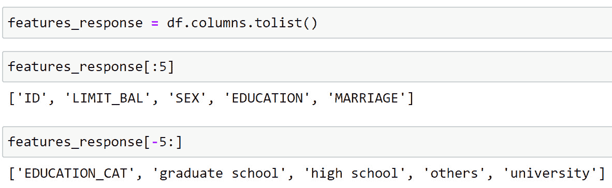
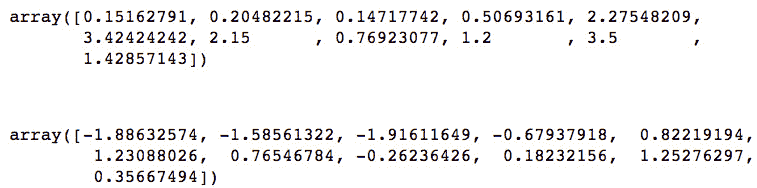

# 第三章：3\. 逻辑回归及特征探索的详细内容

概述

本章将教你如何快速高效地评估特征，以便了解哪些特征可能对机器学习模型最为重要。一旦我们掌握了这一点，我们将深入探讨逻辑回归的内部工作原理，让你能够继续在这一基础技术上迈向精通之路。阅读完本章后，你将能够制作多特征与响应变量的相关性图，并将逻辑回归解读为线性模型。

# 引言

在上一章中，我们使用 scikit-learn 开发了几个示例机器学习模型，以便熟悉它的工作原理。然而，我们使用的特征`EDUCATION`和`LIMIT_BAL`并不是以系统化的方式选择的。

在本章中，我们将开始开发评估特征在建模中有效性的方法。这将使你能够快速浏览所有候选特征，从而大致了解哪些特征可能是最重要的。对于最有潜力的特征，我们将看到如何创建视觉总结，以便作为有用的沟通工具。

接下来，我们将详细研究逻辑回归。我们将了解为什么逻辑回归被认为是一个线性模型，即使其公式中涉及了一些非线性函数。我们将学习什么是决策边界，并看到由于其线性特性，逻辑回归的决策边界可能会使得准确分类响应变量变得困难。在这个过程中，我们将通过使用列表推导和编写函数，更加熟悉 Python。

# 检查特征与响应变量之间的关系

为了准确预测响应变量，好的特征是必要的。我们需要那些与响应变量有明确联系的特征。到目前为止，我们已经通过计算特征和响应变量的`groupby`/`mean`值，或在模型中使用单独的特征并检查性能，来检查几个特征与响应变量之间的关系。然而，我们还没有系统地探讨所有特征与响应变量的关系。现在我们将进行这项工作，并开始利用我们在探索特征和确保数据质量时所付出的努力。

一种快速了解所有特征与响应变量之间关系，以及特征间相互关系的流行方法是使用**相关性图**。我们将首先为案例研究数据创建一个相关性图，然后讨论如何解读它，并提供一些数学细节。

为了创建相关性图，我们需要的输入包括我们计划探索的所有特征以及响应变量。由于我们将使用 DataFrame 中的大部分列名，获取适当列名列表的快速方法是在 Python 中从所有列名开始，然后移除那些我们不需要的列名。作为初步步骤，我们为本章启动一个新的笔记本，并加载*第一章*、*数据探索与清理*中的包和清理后的数据，代码如下：

```py
import numpy as np #numerical computation
import pandas as pd #data wrangling
import matplotlib.pyplot as plt #plotting package
#Next line helps with rendering plots
%matplotlib inline
import matplotlib as mpl #add'l plotting functionality
import seaborn as sns #a fancy plotting package
mpl.rcParams['figure.dpi'] = 400 #high res figures
df = pd.read_csv('../../Data/Chapter_1_cleaned_data.csv')
```

注

您的清理数据文件的路径可能不同，取决于您在*第一章*、*数据探索与清理*中保存的位置。本节中提供的代码和输出也可以在参考笔记本中找到：[`packt.link/pMvWa`](https://packt.link/pMvWa)。

注意，这个笔记本的开始与上一章的笔记本非常相似，唯一不同的是我们还导入了**Seaborn**包，它基于**Matplotlib**提供了许多方便的绘图功能。现在，让我们列出 DataFrame 中的所有列，并查看前五行和后五行：



图 3.1：获取列名列表

回想一下，由于伦理问题，我们不能使用`gender`变量，并且我们了解到`PAY_2`、`PAY_3`、…、`PAY_6`是错误的，应当忽略。此外，我们不会检查从`EDUCATION`变量创建的独热编码，因为这些列中的信息已经包含在原始特征中，至少以某种形式存在。我们将直接使用`EDUCATION`特征。最后，使用`ID`作为特征没有意义，因为它仅仅是一个唯一的账户标识符，与响应变量无关。我们需要列出那些既不是特征也不是响应变量的列名，并将它们从我们的分析中排除：

```py
items_to_remove = ['ID', 'SEX',\
                   'PAY_2', 'PAY_3', 'PAY_4', 'PAY_5', 'PAY_6',\
                   'EDUCATION_CAT',\
                   'graduate school', 'high school', 'none',\
                   'others', 'university']
```

为了拥有一个仅包含我们将使用的特征和响应的列名列表，我们需要从当前的`features_response`列表中删除`items_to_remove`中的列名。在 Python 中，有几种方法可以做到这一点。我们将利用这个机会学习一种特定的构建列表的方式，叫做**列表推导式**。当人们谈论某些构造是**Pythonic**或符合 Python 语言习惯时，列表推导式通常是其中之一。

什么是列表推导式？从概念上讲，它与`for`循环基本相同。然而，列表推导式使得可以将原本可能需要多行代码的`for`循环，用一行代码来实现。由于 Python 内置的优化，列表推导式通常比`for`循环稍微更快。虽然在这里这可能不会节省我们太多时间，但这是一个很好机会来熟悉它们。以下是一个列表推导式的例子：


图 3.2：列表推导示例

就是这么简单。

我们还可以使用其他子句来使列表推导更加灵活。例如，我们可以用它们重新赋值 `features_response` 变量，创建一个包含所有不在我们希望删除的字符串列表中的内容的列表：


图 3.3：使用列表推导修剪列名

在列表推导中使用 `if` 和 `not in` 是相当直观的。结构如列表推导的易读性是 Python 流行的原因之一。

注意

Python 文档（[`docs.python.org/3/tutorial/datastructures.html`](https://docs.python.org/3/tutorial/datastructures.html)）将列表推导定义为如下内容：

*“列表推导由包含一个表达式的括号组成，后面跟着一个 for 子句，然后是零个或多个 for 或 if 子句。”*

因此，列表推导可以让你通过更少的代码来完成任务，而且通常非常易读和易理解。

## Pearson 相关性

现在我们准备创建我们的相关性图。相关性图的基础是对这些列调用 `.corr()` 方法。在我们计算这个时，注意到在 pandas 中可用的相关性类型是**线性相关性**，也称为**Pearson 相关性**。Pearson 相关性用于衡量两个变量之间线性关系的强度和方向（即，正向或负向）：


图 3.4：相关性矩阵的前五行和列

在创建相关性矩阵后，注意到行和列名是相同的。然后，对于所有特征对之间的每一个可能的比较，以及所有特征和响应之间的比较，虽然在这里的前五行和列中我们还看不到响应，但每个比较都有一个数值。这个数值被称为这两列之间的**相关性**。所有的相关性都在 -1 和 1 之间；一列与自身的相关性为 1（即相关性矩阵的对角线），并且存在重复：每个比较都会出现两次，因为原始 DataFrame 中的每个列名都会同时作为行和列出现在相关性矩阵中。在进一步讨论相关性之前，我们将使用 Seaborn 绘制一个漂亮的图表。以下是绘图代码，后面是输出（如果你是在黑白模式下阅读，请参阅 GitHub 上的笔记本中的彩色图形；在这里这是必要的 - [`packt.link/pMvWa`](https://packt.link/pMvWa)）：

```py
sns.heatmap(corr,
            xticklabels=corr.columns.values,
            yticklabels=corr.columns.values,
            center=0)
```

你应该看到以下输出：


图 3.5：Seaborn 中相关性图的热力图

Seaborn 的 `heatmap` 功能能够清晰地可视化相关矩阵，参照*图 3.5*右侧的颜色标尺，这个功能叫做 `sns.heatmap`。除了矩阵外，我们还为 *x* 和 *y* 轴提供了**刻度标签**，这些刻度标签分别代表特征和响应名称，并且指出颜色条的中心应该是 0，这样正相关和负相关就能分别以红色和蓝色区分开来。

注意

如果你正在阅读这本书的印刷版，你可以通过访问以下链接下载并浏览本章部分图像的彩色版本：[`packt.link/veMmT`](https://packt.link/veMmT)。

这个图表告诉我们什么？从整体来看，如果两个特征或一个特征与响应之间的相关性**非常强**，那么你可以说它们之间存在很强的关联。与响应变量高度相关的特征将是预测中很好的特征。这个强相关性可以是正相关也可以是负相关；我们稍后会解释两者的区别。

为了查看与响应变量的相关性，我们可以查看底部行，或者等价地，最后一列。在这里我们看到，`PAY_1` 特征可能是与响应变量最强相关的特征。我们还可以看到许多特征彼此之间高度相关，特别是 `BILL_AMT` 特征。我们将在下一章讨论彼此相关的特征的重要性；对于某些模型（例如逻辑回归）来说，这一点非常重要，因为这些模型假设特征之间存在相关性。目前，我们可以观察到，`PAY_1` 很可能是我们模型中最好的、最具预测力的特征。另一个看起来可能重要的特征是 `LIMIT_BAL`，它与响应变量呈负相关。根据你的观察能力，只有这两个特征在*图 3.5*的底部行中看起来有颜色（即不同于黑色，表示 0 相关性）。

## 线性相关性数学

从数学角度来说，什么是线性相关性？如果你学过基础统计学，你可能已经对线性相关性有所了解。线性相关性与线性回归非常相似。对于两列数据，*X* 和 *Y*，线性相关性 *ρ*（希腊字母“rho”）定义如下：


图 3.6：线性相关性方程

这个方程描述了 `[-1, 1]`。因为皮尔逊相关性已经调整了数据的均值和标准差，所以数据的实际值并不像 *X* 和 *Y* 之间的关系那么重要。*较强的线性相关性越接近 1 或 -1。如果 X 和 Y 之间没有线性关系，相关性将接近 0。*

值得注意的是，尽管数据科学从业者在此背景下经常使用皮尔逊相关性，但对于二元响应变量，它并不严格适用，就像我们在案例研究问题中所遇到的那样。从技术上讲，皮尔逊相关性在其他一些限制条件下，仅适用于**连续数据**，例如我们在*第二章*中使用的数据——*Scikit-Learn 和模型评估入门*。然而，皮尔逊相关性仍然可以快速提供特征潜在有用性的初步了解。它也方便地可以在如 pandas 等软件库中找到。

在数据科学领域，通常会发现某些广泛使用的技术可能被应用于违反其正式统计假设的数据。了解分析方法背后的正式假设是很重要的。事实上，这些假设的知识可能会在数据科学职位的面试中进行考察。然而，在实际操作中，只要某项技术能帮助我们理解问题并找到有效的解决方案，它仍然可以是一个有价值的工具。

话虽如此，线性相关性并不是所有特征预测能力的有效衡量标准。特别是，它只关注线性关系。稍微转移我们的焦点，假设我们正在处理一个回归问题，看看以下例子，并讨论你预期的线性相关性是什么。注意，数据的 *x* 轴和 *y* 轴上的值没有标签；这是因为数据的位置（均值）和标准差（尺度）并不影响皮尔逊相关性，只有变量之间的关系会影响相关性，这可以通过将它们一起绘制出来来辨别：


图 3.7：示例变量之间关系的散点图

对于*示例 A*和*B*，根据前面给出的公式，这些数据集的实际皮尔逊相关性分别为 0.96 和 -0.97。从图表上看，很明显，接近 1 或 -1 的相关性为我们提供了关于这些变量之间关系的有用见解。对于*示例 C*，相关性为 0.06。接近 0 的相关性看起来有效地表明这里没有关联：*Y* 的值似乎与 *X* 的值没有太大关系。然而，在*示例 D*中，变量之间显然存在某种关系。但线性相关性实际上比前一个例子低，为 0.02。在这里，*X* 和 *Y* 在较小的尺度上“共同变化”，但在计算线性相关性时，这种关系会被所有样本的平均值所抵消。

注意

生成本节及前一节中所示图表的代码可以在此找到：[`packt.link/XrUJU`](https://packt.link/XrUJU)。

最终，任何你选择的汇总统计量（如相关系数）都只是汇总。它可能会隐藏重要的细节。因此，通常最好通过可视化来检查特征和响应之间的关系。这可能会占用页面上的大量空间，因此我们不会在案例研究中对所有特征进行演示。然而，pandas 和 Seaborn 都提供了创建**散点图矩阵**的功能。散点图矩阵类似于相关图，但它实际上显示了所有数据，以所有特征和响应变量的散点图网格的形式。这使你能够以简洁的格式直接检查数据。由于这可能包含大量数据和图表，你可能需要对数据进行降采样，并查看较少的特征，以便函数能够高效运行。

## F 检验

虽然皮尔逊相关系数在理论上对于连续响应变量是有效的，但案例研究数据中的二元响应变量可以视为分类数据，只有两个类别：0 和 1。在我们可以进行的不同类型的检验中，用于查看特征是否与分类响应相关的是 `f_classif` 和 `f_regression`。

我们将使用候选特征对案例研究数据进行 ANOVA F 检验。你将看到输出包括 F 统计量以及**p 值**。我们该如何解释这些输出？我们将重点关注 p 值，原因将在练习中解释清楚。p 值是一个在多种统计测量中都很有用的概念。例如，虽然我们没有检查它们，但之前为相关矩阵计算的每个皮尔逊相关系数都有一个相应的 p 值。对于线性回归系数、逻辑回归系数及其他测量值，也有类似的 p 值概念。

在 F 检验的背景下，p 值回答了这个问题：“对于正类样本，特征的平均值与负类样本的平均值相同的可能性有多大？”如果数据表明某个特征在正负类样本之间的平均值非常不同，那么以下情况将成立：

+   这些平均值相同的可能性将非常低（低 p 值）。

+   这个特征可能是我们模型中的一个好特征，因为它有助于我们区分正负类样本。

在接下来的练习中，请牢记以下几点。

## 练习 3.01：F 检验和单变量特征选择

在本次练习中，我们将使用 F 检验来检查特征和响应变量之间的关系。我们将使用这种方法进行所谓的**单变量特征选择**：逐一检验特征与响应变量的关系，看看哪些特征具有预测能力。请按以下步骤完成练习：

注：

这个练习的 Jupyter 笔记本可以在这里找到：[`packt.link/ZDPYf`](https://packt.link/ZDPYf)。该笔记本还包含加载清洗过的数据和导入必要库的先决步骤。在执行本练习的第一步之前，应该先执行这些步骤。

1.  进行 ANOVA F 检验的第一步是将特征和响应分离为 NumPy 数组，利用我们创建的列表以及 pandas 中的整数索引：

    ```py
    X = df[features_response].iloc[:,:-1].values
    y = df[features_response].iloc[:,-1].values
    print(X.shape, y.shape)
    ```

    输出应该显示特征和响应的形状：

    ```py
    (26664, 17) (26664, )
    ```

    有 17 个特征，并且特征和响应数组的样本数与预期相同。

1.  导入`f_classif`函数并传入特征和响应：

    ```py
    from sklearn.feature_selection import f_classif
    [f_stat, f_p_value] = f_classif(X, y)
    ```

    `f_classif`有两个输出：**F 统计量**和**p 值**，用于比较每个特征与响应变量之间的关系。我们可以创建一个新的 DataFrame，包含特征名称以及这些输出，以便于检查。我们展示了按 p 值升序排序的 DataFrame。

1.  使用以下代码创建一个包含特征名称、F 统计量和 p 值的 DataFrame，并按 p 值排序显示：

    ```py
    f_test_df = pd.DataFrame({'Feature':features_response[:-1],
                              'F statistic':f_stat,
                              'p value':f_p_value})
    f_test_df.sort_values('p value')
    ```

    输出应如下所示：

    

    图 3.8：ANOVA F 检验结果

    注意，每当 p 值降低时，F 统计量会增加，因此这些列中的信息在特征排名方面是相同的。

    从 F 统计量和 p 值的 DataFrame 中得出的结论与我们在相关性图中观察到的相似：`PAY_1`和`LIMIT_BAL`似乎是最有用的特征。它们的 p 值最小，表示这些特征的平均值是`SelectPercentile`类。还要注意，选择前`*k*`个特征（其中*k*是您指定的任何数字）有类似的类，称为`SelectKBest`。在这里，我们演示如何选择前 20%的特征。

1.  要根据 F 检验选择前 20%的特征，首先导入`SelectPercentile`类：

    ```py
    from sklearn.feature_selection import SelectPercentile
    ```

1.  实例化该类的一个对象，表示我们希望使用与本练习中已经考虑过的相同特征选择标准——ANOVA F 检验，并且我们希望选择前 20%的特征：

    ```py
    selector = SelectPercentile(f_classif, percentile=20)
    ```

1.  使用`.fit`方法对我们的特征和响应数据进行拟合，类似于模型拟合的方式：

    ```py
    selector.fit(X, y)
    ```

    输出应该如下所示：

    ```py
    SelectPercentile(percentile=20)
    ```

    有几种方法可以直接访问所选特征，你可以在 scikit-learn 文档中了解（即`.transform`方法，或与`.fit_transform`在同一步骤中使用）。然而，这些方法会返回 NumPy 数组，它们不会告诉你已选择的特征名称，只会给出特征的值。为此，你可以使用特征选择器对象的`.get_support`方法，它将返回所选特征数组的列索引。

1.  将所选特征的索引捕获到一个名为`best_feature_ix`的数组中：

    ```py
    best_feature_ix = selector.get_support()
    best_feature_ix
    ```

    输出应如下所示，表示一个逻辑索引，可与特征名称数组及其对应的值一起使用，前提是它们与传递给`SelectPercentile`的特征数组的顺序一致：

    ```py
    array([ True, False, False, False, True, False, False, False, False,
               False, False, True, True, False, False, False, False])
    ```

1.  可以通过索引`features_response`列表中的`:-1`，获取除最后一个元素（`name`响应变量）外的所有特征名称：

    ```py
    features = features_response[:-1]
    ```

1.  使用我们在*第 7 步*中创建的索引数组，通过列表推导式和`features`列表，查找所选特征名称，如下所示：

    ```py
    best_features = [features[counter]
                     for counter in range(len(features))
                     if best_feature_ix[counter]]
    best_features
    ```

    输出应如下所示：

    ```py
    ['LIMIT_BAL', 'PAY_1', 'PAY_AMT1', 'PAY_AMT2']
    ```

    在这段代码中，列表推导式通过`features`数组中的元素数量（`len(features)`）和`counter`循环递增，使用`best_feature_ix`布尔数组表示已选择的特征，在`if`语句中测试每个特征是否被选择，如果是，则捕获该特征的名称。

    所选特征与我们的 F 检验结果数据框的前四行一致，因此特征选择按预期工作。尽管从严格意义上讲不必两种方式都做，因为它们都会导致相同的结果，但检查你的工作是一个好习惯，尤其是在你学习新概念时。你应该意识到，使用像`SelectPercentile`这样的便捷方法时，你无法看到 F 统计量或 p 值。然而，在某些情况下，使用这些方法可能更方便，因为 p 值的排名作用可能不是特别重要。

## F 检验的细节：与两类 t 检验的等价性及注意事项

当我们使用 F 检验来查看仅两个组之间的均值差异时，正如我们在案例研究的二分类问题中所做的那样，实际上我们执行的检验会简化为**t 检验**。F 检验可以扩展到三个或更多组，因此对于多分类问题非常有用。t 检验仅比较两个样本组之间的均值，以查看这些均值之间的差异是否**具有统计显著性**。

虽然 F 检验在这里满足了我们的单变量特征选择目的，但仍有一些注意事项需要牢记。回到正式统计假设的概念，对于 F 检验，这些假设包括数据为 `y`，从矩阵 `X` 中提取了多个潜在特征，我们进行了统计学中所称的**多重比较**。简而言之，这意味着通过反复比较多个特征与同一响应的关系，我们找到“好特征”的机会会因为纯粹的随机机会而增加。然而，这些特征可能无法推广到新的数据。有针对**多重比较的统计修正**，即调整 p 值以考虑这一点。

即使我们没有遵循与这些方法相关的所有统计规则，我们仍然可以从中获得有用的结果。当 p 值是最终关注的量时，多重比较的修正会更为重要，例如在进行统计推断时。在这里，p 值只是对特征列表进行排序的一种手段。如果对 p 值进行了多重比较修正，排序的顺序不会发生变化。

除了了解哪些特征可能对建模有用外，深入理解重要特征也是很有必要的。因此，我们将在下一个练习中对这些特征进行详细的图形化探索。稍后我们还会查看其他特征选择方法，这些方法不作我们在此介绍的假设，并且与我们将要构建的预测模型更加直接集成。

## 假设和下一步

根据我们的单变量特征探索，和响应变量关联最强的特征是 `PAY_1`。这是否有意义？`PAY_1`的解释是什么？`PAY_1`是账户在最近一个月的付款状态。正如我们在最初的数据探索中所学到的，有些值表示账户状态良好：-2 表示未使用账户，-1 表示余额已全额支付，0 表示至少已支付最低金额。另一方面，正整数值表示延迟付款的月份数。上个月延迟付款的账户可以视为违约账户。实际上，这意味着该特征捕捉到了响应变量的历史值。像这样的特征非常重要，因为*几乎任何机器学习问题中最好的预测因子之一就是关于你要预测的同一事物的历史数据（即响应变量）*。这应该是合理的：曾经违约过的人可能是再次违约的最高风险群体。

`LIMIT_BAL`，账户的信用额度如何？考虑到信用额度的分配方式，我们的客户很可能在决定他们的信用额度时评估了借款人的风险。风险更高的客户应该被给予较低的限额，这样债权人的风险就较小了。因此，我们可能期望看到`LIMIT_BAL`较低值的账户的违约概率较高。

我们从我们的单变量特征选择练习中学到了什么？我们对我们模型中最重要的特征有了一个大致的了解。并且从相关矩阵中，我们对它们与响应变量的关系有了一些想法。然而，知道我们所使用的测试的限制是个好主意，最好将这些特征可视化，以更仔细地观察特征和响应变量之间的关系。我们还开始对这些特征发展了**假设**：我们为什么认为它们很重要？现在，通过可视化特征和响应变量之间的关系，我们可以确定我们的想法是否与数据中所见的相符。

这些假设和可视化通常是向客户展示结果的重要部分，客户可能对模型的工作方式感兴趣，而不仅仅是它能工作这个事实。

## 练习 3.02：可视化特征与响应变量之间的关系

在这个练习中，您将进一步了解本书中早期使用的 Matplotlib 绘图函数。您将学习如何自定义图形以更好地回答数据中的特定问题。随着您进行这些分析，您将创建关于`PAY_1`和`LIMIT_BAL`特征如何与响应变量相关的深刻可视化，这可能会支持您对这些特征形成的假设。这将通过更加熟悉 Matplotlib **应用程序编程接口**（**API**）来完成，换句话说，您用来与 Matplotlib 交互的语法。执行以下步骤完成本练习：

注意

在开始本练习的第一步之前，请确保已导入必要的库并加载了正确的数据框架。您可以参考以下笔记本获取先决步骤以及此练习的代码：[`packt.link/DOrZ9`](https://packt.link/DOrZ9)。

1.  使用 pandas 的 `.mean()` 计算整个数据集中响应变量的违约率基线：

    ```py
    overall_default_rate = df['default payment next month'].mean()
    overall_default_rate
    ```

    这个练习的输出应该如下所示：

    ```py
    0.2217971797179718
    ```

    如何有效地可视化`PAY_1`特征不同值的违约率？

    回想一下我们之前的观察，这个特征有点像混合型的类别和数值型特征。由于独特值的数量相对较少，我们选择以典型的类别特征方式来绘制它。在 *第一章*，《数据探索与清洗》中，我们在数据探索中使用了 `value_counts` 来查看这个特征的分布，之后我们学习了如何通过 `groupby` 和 `mean` 来查看 `EDUCATION` 特征的情况。`groupby` 和 `mean` 也是一个很好的方式来可视化不同支付状态下的违约率。

1.  使用这段代码来创建一个 `groupby`/`mean` 聚合：

    ```py
    group_by_pay_mean_y = df.groupby('PAY_1').agg(
    ```

    {'下个月违约支付': np.mean})

    ```py
    group_by_pay_mean_y 
    ```

    输出应该如下所示：

    

    图 3.9：按 PAY_1 特征分组的响应变量的均值

    看着这些值，你可能已经能够辨别出趋势了。我们直接开始绘制它们。我们将一步步进行，并介绍一些新的概念。你应该把从 *步骤 3* 到 *步骤 6* 的所有代码放在一个代码单元格中。

    在 Matplotlib 中，每个图表都存在于一个坐标轴（axes）和一个 `figure` 窗口中。通过创建 `axes` 和 `figure` 对象，你可以直接访问并修改它们的属性，包括坐标轴标签和坐标轴上的其他注释。

1.  使用以下代码在一个名为 `axes` 的变量中创建一个 `axes` 对象：

    ```py
    axes = plt.axes()
    ```

1.  将整体违约率绘制为一条红色的水平线。

    Matplotlib 使这变得简单；你只需要通过 `axhline` 函数来指示该直线的 *y* 截距。注意，现在我们不是从 `plt` 调用这个函数，而是作为 `axes` 对象的方法来调用：

    ```py
    axes.axhline(overall_default_rate, color='red')
    ```

    现在，我们希望在这条线的基础上，绘制每个 `PAY_1` 值组内的违约率。

1.  使用我们创建的分组数据的 DataFrame 的 `plot` 方法。指定在线条图中包括一个 `'x'` 标记，不要有 `legend` 实例（我们稍后会创建它），并且该图的 **父轴** 应该是我们当前使用的轴（否则，pandas 会擦除已经存在的内容并创建新的轴）：

    ```py
    group_by_pay_mean_y.plot(marker='x', legend=False, ax=axes)
    ```

    这就是我们要绘制的所有数据。

1.  设置 *y* 轴标签，并创建一个 `legend` 实例（有许多控制图例外观的选项，但一种简单的方法是提供一个字符串列表，表示按添加到轴上的顺序排列的图形元素的标签）：

    ```py
    axes.set_ylabel('Proportion of credit defaults')
    axes.legend(['Entire dataset', 'Groups of PAY_1'])
    ```

1.  执行从 *步骤 3* 到 *步骤 6* 的所有代码，结果应该是以下图表：

    图 3.10：数据集中的信用违约率

    我们对支付状态的可视化揭示了一个明确的，并且可能是预期的故事：那些曾经违约的人实际上更可能再次违约。保持良好状态的账户的违约率远低于整体违约率，后者我们之前知道大约是 22%。然而，根据这一点，超过 30% 上个月处于违约状态的账户下个月仍然会处于违约状态。这是一个很好的可视化，值得与我们的业务合作伙伴分享，因为它展示了我们模型中可能是最重要的特征之一的影响。

    现在，我们将注意力转向排名第二与目标变量关联最强的特征：`LIMIT_BAL`。这是一个具有许多唯一值的数值特征。对于分类问题，查看此类特征的一个好方法是将多个直方图绘制在同一坐标轴上，为不同类别使用不同的颜色。作为区分类别的一种方式，我们可以使用逻辑数组从 DataFrame 中索引它们。

1.  使用此代码为正类和负类样本创建逻辑掩码：

    ```py
    pos_mask = y == 1
    neg_mask = y == 0
    ```

    为了创建我们的双重直方图，我们将再创建一个 `axes` 对象，然后调用 `.hist` 方法分别为正类和负类直方图绘制两次。我们提供一些额外的关键字参数：第一个直方图将有黑色边缘和白色条形，而第二个将使用 `alpha` 来创建透明度，这样我们就可以看到两个直方图在重叠的地方。得到直方图后，我们旋转 *x* 轴刻度标签，使它们更易读，并创建一些其他自解释的注释。

1.  使用以下代码来创建具有上述属性的双重直方图：

    ```py
    axes = plt.axes()
    axes.hist(df.loc[neg_mask, 'LIMIT_BAL'],\
              edgecolor='black', color='white')
    axes.hist(df.loc[pos_mask, 'LIMIT_BAL'],\
              alpha=0.5, edgecolor=None, color='black')
    axes.tick_params(axis='x', labelrotation=45)
    axes.set_xlabel('Credit limit (NT$)')
    axes.set_ylabel('Number of accounts')
    axes.legend(['Not defaulted', 'Defaulted'])
    axes.set_title('Credit limits by response variable')
    ```

    图表应该如下所示：

    

    ```py
    df['LIMIT_BAL'].max()
    ```

1.  使用以下代码创建并显示直方图的箱子边缘：

    ```py
    bin_edges = list(range(0,850000,50000))
    print(bin_edges)
    ```

    输出应该如下所示：

    ```py
    [0, 50000, 100000, 150000, 200000, 250000, 300000, 350000, 40000, 450000,
    500000, 550000, 600000, 650000, 700000, 750000, 800000]
    ```

    归一化直方图的绘图代码与之前类似，但有几个关键的变化：使用 `bins` 关键字来定义箱子边缘的位置，`density=True` 用于归一化直方图，并对绘图注释进行了一些更改。最复杂的部分是我们需要调整 `np.round`，因为浮点数运算可能会有轻微的误差。

1.  运行此代码以生成归一化的直方图：

    ```py
    mpl.rcParams['figure.dpi'] = 400 
    axes = plt.axes()
    axes.hist(
        df.loc[neg_mask, 'LIMIT_BAL'],
        bins=bin_edges, density=True,
        edgecolor='black', color='white')
    axes.hist(
        df.loc[pos_mask, 'LIMIT_BAL'],
        bins=bin_edges, density=True, alpha=0.5,
        edgecolor=None, color='black')
    axes.tick_params(axis='x', labelrotation=45)
    axes.set_xlabel('Credit limit (NT$)')
    axes.set_ylabel('Proportion of accounts')
    y_ticks = axes.get_yticks()
    axes.set_yticklabels(np.round(y_ticks*50000,2))
    axes.legend(['Not defaulted', 'Defaulted'])
    axes.set_title('Normalized distributions of '\
                   'credit limits by response variable')
    ```

    图表应该如下所示：

    

图 3.12：归一化的双重直方图

你可以看到，Matplotlib 中的图表是高度可定制的。为了查看你可以从 Matplotlib 坐标轴中获取和设置的所有不同内容，可以查看这里：[`matplotlib.org/stable/api/axes_api.html`](https://matplotlib.org/stable/api/axes_api.html)。

我们从这个图表中能学到什么？看起来，违约的账户往往具有较高比例的低信用额度。信用额度低于新台币 150,000 元的账户更有可能违约，而对于信用额度高于这个数额的账户则相反。我们应该问自己，这是否有意义？我们的假设是，客户会给风险较高的账户设置较低的信用额度。这种直觉与我们在此观察到的低信用额度账户中违约者的较高比例相符。

根据模型构建的进展，如果我们在本次练习中检查的特征如我们预期的那样对预测建模非常重要，那么将这些图表展示给客户作为我们工作成果的一部分是很好的。这样可以让客户了解模型如何工作，以及对他们数据的洞察。

本节的一个重要学习点是，制作有效的视觉展示需要大量时间。最好在项目工作流程中预留一些时间用于此项工作。令人信服的视觉效果是值得付出努力的，因为它们应该能够迅速且有效地将重要的发现传达给客户。与其在制作材料时加入大量文字，视觉效果通常是更好的选择。定量概念的视觉传达是数据科学的核心技能。

# 单变量特征选择：它能做什么，不能做什么

在这一章中，我们学习了逐一查看特征以判断它们是否具有预测能力的技巧。这是一个良好的第一步，如果你已经有了对结果变量具有较强预测能力的特征，你可能不需要花太多时间考虑其他特征，便可以进行建模。然而，单变量特征选择也有其缺点，特别是它没有考虑特征之间的**相互作用**。例如，如果信用违约率特别高的是那些既有某种教育水平又有一定范围的信用额度的人群怎么办？

此外，我们在这里使用的方法仅能捕捉特征的线性效应。如果某个特征在经历某种**变换**（如**多项式**或**对数**变换，或者**分箱**（**离散化**））后能更好地预测，单变量特征选择的线性方法可能就不太有效。相互作用和变换是**特征工程**的例子，或者说，在这些情况下通过现有特征创建新特征。线性特征选择方法的不足可以通过非线性建模技术来弥补，包括决策树及其相关方法，我们将在后续进行讨论。但从简单关系入手，寻找那些可以通过线性方法实现的单变量特征选择，依然具有价值，而且这种方法非常迅速。

## 使用 Python 函数语法理解逻辑回归和 Sigmoid 函数

在这一部分，我们将全面揭开逻辑回归的“黑箱”：我们将全面理解它是如何工作的。我们将从介绍一个新的编程概念：**函数**开始。同时，我们将学习一个数学函数——sigmoid 函数，它在逻辑回归中起着关键作用。

从最基本的角度来看，计算机编程中的函数是一段接受输入并产生输出的代码。你在本书中已经使用了函数：这些函数是由别人编写的。每次你使用类似于这样的语法：`output = do_something_to(input)`时，你实际上就是在使用一个函数。例如，NumPy 有一个函数可以用来计算输入的均值：

```py
np.mean([1, 2, 3, 4, 5])
3.0
```

函数**抽象**了正在执行的操作，以便在我们的示例中，每次需要计算均值时，你不需要看到所有执行此操作的代码行。对于许多常见的数学函数，像 NumPy 这样的包中已经有了预定义的版本。你无需“发明轮子”。流行包中的实现之所以流行，可能是因为人们花了时间思考如何以最有效的方式创建它们。因此，使用它们是明智的。然而，由于我们使用的所有包都是**开源**的，如果你有兴趣查看我们使用的库中函数的实现，你可以查看它们的代码。

现在，为了说明，我们通过编写自己的算术平均数函数来学习 Python 函数语法。Python 中的函数语法类似于`for`或`if`块，其中函数体是缩进的，函数声明后面跟着一个冒号。下面是一个计算均值的函数代码：

```py
def my_mean(input_argument):
    output = sum(input_argument)/len(input_argument)
    return(output)
```

在你执行了包含此定义的代码单元后，函数在笔记本中的其他代码单元中可以使用。举个例子：

```py
my_mean([1, 2, 3, 4, 5])
3.0
```

定义函数的第一部分，如这里所示，是以`def`开始一行代码，后面跟一个空格，然后是你想为函数命名的名称。接下来是括号，括号内指定函数的**参数**名称。参数是输入变量的名称，这些名称是函数体内部的：作为参数定义的变量在函数被**调用**（使用）时可用，但在函数外部不可用。可以有多个参数；它们之间用逗号分隔。括号后跟冒号。

函数体是缩进的，可以包含对输入进行操作的任何代码。操作完成后，最后一行应以`return`开头，并包含输出变量，如果有多个输出变量，它们之间用逗号分隔。在这段非常简单的函数介绍中，我们省略了许多细节，但这些是你开始使用函数时需要掌握的基本部分。

函数的威力在于它的使用。注意，我们定义了函数后，在一个单独的代码块中，我们可以通过给定的名称 **调用** 它，它会对我们 **传递** 的输入进行操作。就像我们把所有代码复制粘贴到这个新位置一样，但看起来比实际复制粘贴要整洁得多。如果你需要多次使用相同的代码，函数可以大大减少代码的整体长度。

作为一个简短的补充说明，你可以选择明确指定输入参数的名称，这样在有多个输入时会更清晰：

```py
my_mean(input_argument=[1, 2, 3])
2.0
```

现在我们已经熟悉了 Python 函数的基础知识，接下来我们将讨论一个对逻辑回归非常重要的数学函数，叫做 **Sigmoid** 函数。这个函数也可以称为 **逻辑函数**。Sigmoid 的定义如下：


图 3.13：Sigmoid 函数

我们将分解这个函数的不同部分。正如你所看到的，sigmoid 函数涉及到 `exp`，它会自动将 `e` 提供给输入指数。如果你查看文档，你会看到这个过程叫做取“指数”，这听起来有点模糊。但通常理解的是，这里指数的底数是 *e*。一般来说，如果你想在 Python 中计算指数，比如 23（“2 的三次方”），语法是两个星号：`2**3`，例如结果为 8。

考虑如何将输入传递给 `np.exp` 函数。由于 NumPy 的实现是 **向量化** 的，这个函数可以接受单个数字，也可以接受数组或矩阵作为输入。为了说明单个参数，我们计算了 1 的指数，这显示了 *e* 的近似值，以及 *e0*，它当然等于 1，就像任何底数的零次方一样：

```py
np.exp(1)
2.718281828459045
np.exp(0)
1.0
```

为了说明 `np.exp` 的向量化实现，我们使用 NumPy 的 `linspace` 函数创建一个数字数组。这个函数输入一个范围的起始和结束点（包括这两个点），以及该范围内你希望包含的值的数量，以创建一个等间距的数组。这个函数的作用与 Python 的 `range` 类似，但还可以生成小数值：


图 3.14：使用 np.linspace 创建数组

由于 `np.exp` 是向量化的，它会一次性高效地计算整个数组的指数。这里是计算我们 `X_exp` 数组的指数并检查前五个值的代码和输出：


图 3.15：NumPy 的 exp 函数

## 练习 3.03：绘制 Sigmoid 函数

在本练习中，我们将使用先前创建的 `X_exp` 和 `Y_exp`，绘制指数函数在区间 `[-4, 4]` 上的图形。你需要先运行 *图 3.14* 和 *图 3.15* 中的所有代码，以便为本练习提供这些变量。接下来，我们将定义一个 sigmoid 函数，绘制它的图形，并考虑它与指数函数的关系。执行以下步骤以完成此练习：

注意

在开始本练习的第一步之前，请确保你已导入必要的库。导入库的代码以及练习其余步骤的代码可以在这里找到：[`packt.link/Uq012`](https://packt.link/Uq012)。

1.  使用此代码绘制指数函数：

    ```py
    plt.plot(X_exp, Y_exp)
    plt.title('Plot of $e^X$')
    ```

    图形应该是这样的：

    

    图 3.16：绘制指数函数

    注意，在图表标题中，我们利用了一种叫做 `^` 的语法。

    还要注意在 *图 3.16* 中，许多紧密间隔的点创造出平滑曲线的效果，但实际上它是由离散点通过线段连接而成的图形。

    **我们可以从指数函数中观察到什么？**

    它永远不会是负数：当 *X* 趋近于负无穷时，*Y* 趋近于 0。

    随着 *X* 的增加，*Y* 起初增长缓慢，但很快就“爆炸”了。这就是人们所说的“指数增长”来表示快速增长的含义。

    **你如何从指数函数的角度理解 sigmoid？**

    首先，sigmoid 涉及 *e*-X，而不是 *e*X。*e*-X 的图形只是 *e*X 关于 *y* 轴的反射。这可以很容易地绘制出来，并在图表标题中使用大括号标注多字符的上标。

1.  运行此代码以查看 *e*-X 的图形：

    ```py
    Y_exp = np.exp(-X_exp)
    plt.plot(X_exp, Y_exp)
    plt.title('Plot of $e^{-X}$')
    ```

    输出应该是这样的：

    

    图 3.17：exp(-X) 的图

    现在，在 sigmoid 函数中，*e*-X 位于分母，且加上了 1。分子是 1。那么，当 *X* 趋近于负无穷时，sigmoid 会发生什么呢？我们知道 *e*-X 会“爆炸”，变得非常大。总的来说，分母变得非常大，分数接近于 0。那么，当 *X* 增加到正无穷时，会怎样呢？我们可以看到 *e*-X 会变得非常接近于 0。所以，在这种情况下，sigmoid 函数大约等于 *1/1 = 1*。这应该给你一个直觉，sigmoid 函数始终保持在 0 和 1 之间。现在让我们在 Python 中实现一个 sigmoid 函数，并用它绘制一个图形，看看现实与这个直觉如何匹配。

1.  定义一个 sigmoid 函数，如下所示：

    ```py
    def sigmoid(X):
        Y = 1 / (1 + np.exp(-X))
        return Y
    ```

1.  扩大 *x* 值的范围以绘制 sigmoid 图。使用以下代码：

    ```py
    X_sig = np.linspace(-7,7,141)
    Y_sig = sigmoid(X_sig)
    plt.plot(X_sig,Y_sig)
    plt.yticks(np.linspace(0,1,11))
    plt.grid()
    plt.title('The sigmoid function')
    ```

    图形应该是这样的：

    

图 3.18：一个 sigmoid 函数图

这个图与我们预期的结果一致。此外，我们可以看到`sigmoid(0) = 0.5`。那么，sigmoid 函数有什么特别之处？这个函数的输出严格地限制在 0 和 1 之间。对于一个应该预测概率的函数来说，这个特性非常好，因为概率值也必须在 0 和 1 之间。技术上，概率值可以恰好等于 0 和 1，而 sigmoid 函数永远不会是。但 sigmoid 函数的值可以接近 0 或 1，这在实际中并不是一个限制。

回顾一下，我们将逻辑回归描述为生成**预测的类别概率**，而不是直接预测类别成员资格。这使得逻辑回归的实现更加灵活，可以选择阈值概率。sigmoid 函数是这些预测概率的来源。稍后，我们将看到不同特征是如何用于计算预测概率的。

## 函数的作用域

当你开始使用函数时，你应该对`sigmoid`函数的概念有所了解，我们在函数内部创建了一个变量`Y`。在函数内部创建的变量与在函数外部创建的变量不同。它们在函数被调用时会在函数内部有效地创建和销毁。这些变量在使用`sigmoid`函数后被称为`Y`变量：


图 3.19：Y 变量不在笔记本的作用域内

`Y`变量不在笔记本的**全局**作用域中。然而，在函数外部创建的全局变量可以在函数的局部作用域内使用，即使它们没有作为参数传递给函数。在这里，我们展示了如何在函数外部创建一个全局变量，然后在函数内部访问它。这个函数实际上没有接受任何参数，但如你所见，它可以使用全局变量的值来生成输出：


图 3.20：全局变量在函数的局部作用域中可用

注意

**更多关于作用域的细节**

变量的作用域可能会让人感到困惑，但当你开始更高级地使用函数时，了解作用域是非常有益的。虽然本书中并不要求了解这些内容，但你可能希望在这里了解更多关于 Python 中变量作用域的深度知识：[`nbviewer.jupyter.org/github/rasbt/python_reference/blob/master/tutorials/scope_resolution_legb_rule.ipynb`](https://nbviewer.jupyter.org/github/rasbt/python_reference/blob/master/tutorials/scope_resolution_legb_rule.ipynb)。

**sigmoid 曲线在科学应用中的应用**

除了在逻辑回归中是基础，S 型曲线还广泛应用于各种领域。在生物学中，它们可以用来描述生物体的生长过程，首先是缓慢开始，然后进入快速阶段，最后以平滑的方式逐渐趋于稳定，直到最终大小达到。S 型曲线也可以用来描述人口增长，其轨迹类似，快速增长后会减慢，直到环境的承载能力达到。

## 为什么逻辑回归被认为是线性模型？

我们之前提到，逻辑回归被认为是*第一章*《数据探索与清洗》中`EDUCATION`特征的`groupby`/`mean`，以及本章中`PAY_1`特征的`groupby`/`mean`，用来查看这些特征值之间的违约率是否表现出线性趋势。虽然这是一种快速近似判断这些特征是否“线性”的好方法，但在这里我们将形式化为什么逻辑回归是线性模型的概念。

如果计算预测所使用的特征变换是特征的**线性组合**，则该模型被认为是线性的。线性组合的可能性是每个特征可以乘以一个数值常数，这些项可以相加，并且可以添加一个额外的常数。例如，在一个简单的包含两个特征的模型中，*X*1 和 *X*2，线性组合的形式如下：


图 3.21：*X*1 和 *X*2 的线性组合

常数*𝜃*i 可以是任何数值，正数、负数或零，*i = 0, 1, 和 2*（尽管如果某个系数为 0，这将从线性组合中移除一个特征）。一个常见的线性变换的例子是单变量的直线方程 *y = mx + b*，如在*第二章*《Scikit-Learn 入门与模型评估》中讨论的那样。在这种情况下，*𝜃*o = *b*，*𝜃*1 = *m*。*𝜃*o 被称为线性组合的**截距**，这在代数中应该是熟悉的概念。

在线性变换中“禁止”哪些操作？除了刚才描述的内容之外，任何其他数学表达式，如下所示：

+   将特征与自身相乘；例如，*X*12 或 *X*13。这被称为多项式项。

+   将特征相乘；例如，*X*1*X*2。这被称为交互作用。

+   对特征应用非线性变换；例如，对数和平方根。

+   其他复杂的数学函数。

+   "如果...那么..."类型的语句。例如，"如果 *X*1 *> a*，那么 *y = b*"。

然而，虽然这些变换不是线性组合的基本形式，但它们可以通过**特征工程**添加到线性模型中，例如定义一个新特征，*X*3 = *X*12。

之前我们学过，逻辑回归的预测结果是概率形式，它们是通过 sigmoid 函数得出的。再看这里，我们可以清楚地看到这个函数是非线性的：


图 3.22：非线性 sigmoid 函数

那么，为什么逻辑回归被认为是线性模型呢？事实证明，答案在于 sigmoid 方程的另一种表述形式，即`logit`函数。我们可以通过求解 sigmoid 函数的*X*来推导出`logit`函数；换句话说，就是找到 sigmoid 函数的逆函数。首先，我们将 sigmoid 设为*p*，我们将其解释为观察到正类的概率，然后按如下方式求解*X*：


图 3.23：求解 X

在这里，我们利用了幂和对数的一些法则来求解*X*。你可能还会看到`logit`以以下形式表示：


图 3.24：logit 函数

在这个表达式中，`logit`函数也被称为**对数几率**，因为它是**几率比**的自然对数，*p/q*。几率比在赌博世界中可能比较常见，例如“*a*队战胜*b*队的几率是 2 比 1”。

一般来说，我们在这些操作中所称的大写*X*可以代表所有特征的线性组合。例如，在我们这个简单的包含两个特征的案例中，*X =* *𝜃*o *+* *𝜃*1*X*1 *+* *𝜃*2*X*2。逻辑回归被认为是线性模型，因为在考虑响应变量为对数几率时，包含在*X*中的特征实际上仅受限于线性组合。这是与 sigmoid 方程相比的一种问题表述方式。

将各部分组合在一起，特征*X*1、*X*2、…、*X*j 在 sigmoid 方程版逻辑回归中是这样的：


图 3.25：sigmoid 版逻辑回归

但在对数几率版本中它们看起来是这样的，这也是为什么逻辑回归被称为线性模型：


图 3.26：对数几率版逻辑回归

因此，从这种角度看待逻辑回归时，理想情况下，逻辑回归模型的特征应该是**在响应变量的对数几率上是线性的**。我们将在接下来的练习中看到这一点是什么意思。

逻辑回归是统计模型的一个更广泛类别，称为**广义线性模型**（**GLMs**）。广义线性模型与普通线性回归的基本概念有关，普通线性回归可能只有一个特征（即 **最佳拟合线**，*y = mx + b*，对于单个特征 *x*）或多个特征，称为**多元线性回归**。广义线性模型与线性回归之间的数学联系是**连接函数**。逻辑回归的连接函数是我们刚刚学习的对数几率函数。

## 练习 3.04：检查特征在逻辑回归中的适用性

在 *练习 3.02*，*可视化特征与响应变量之间的关系* 中，我们绘制了可能是模型中最重要特征之一的 `PAY_1` 特征的 `groupby`/`mean`。通过按 `PAY_1` 的值对样本进行分组，并查看响应变量的平均值，我们实际上是在查看每个组内的违约概率，*p*。

在本练习中，我们将评估`PAY_1`在逻辑回归中的适用性。我们通过检查这些组内的违约对数赔率来判断响应变量是否在对数赔率中是线性的，正如逻辑回归所正式假设的那样。完成以下步骤以完成本练习：

注意

在开始本练习的第 1 步之前，确保已经导入了必要的库。你可以参考以下笔记本中的先决步骤：[`packt.link/gtpF9`](https://packt.link/gtpF9)。

1.  确认你仍然可以访问 *练习 3.02*，*可视化特征与响应变量之间的关系* 中的变量，在笔记本中查看 `PAY_1` 不同值下响应变量的平均值的 DataFrame，使用以下代码：

    ```py
    group_by_pay_mean_y
    ```

    输出应该如下所示：

    

    图 3.27：按 PAY_1 值分组的违约率作为违约概率

1.  从这些组中提取响应变量的平均值，并将其放入一个变量 `p` 中，表示违约的概率：

    ```py
    p = group_by_pay_mean_y['default payment next month'].values
    ```

1.  创建一个不违约的概率`q`。由于这是一个二元问题，且所有结果的概率和始终为 1，因此很容易计算出`q`。同时打印出`p`和`q`的值以确认：

    ```py
    q = 1-p
    print(p)
    print(q)
    ```

    输出应该如下所示：

    

    图 3.28：从 p 计算 q

1.  使用 NumPy 的自然对数函数从`p`和`q`计算赔率比和对数赔率：

    ```py
    odds_ratio = p/q
    log_odds = np.log(odds_ratio)
    log_odds
    ```

    输出应该如下所示：

    

    图 3.29：赔率比和对数赔率

1.  为了绘制对数几率与特征值的关系，我们可以从包含`groupby`/`mean`的 DataFrame 的索引中获取特征值。你可以这样显示索引：

    ```py
    group_by_pay_mean_y.index
    ```

    这应该会产生以下输出：

    ```py
    Int64Index([-2, -1, 0, 1, 2, 3, 4, 5, 6, 7, 8], dtype='int64', name='PAY_1')
    ```

1.  创建一个类似我们已经做过的图表，展示对数几率与特征值之间的关系。以下是代码：

    ```py
    plt.plot(group_by_pay_mean_y.index, log_odds, '-x')
    plt.ylabel('Log odds of default')
    plt.xlabel('Values of PAY_1')
    ```

    图表应该如下所示：

    

图 3.30：PAY_1 值的违约对数几率

我们可以从这个图中看到，响应变量的对数几率与`PAY_1`特征之间的关系，与我们在*练习 3.02*中绘制的违约率与该特征之间的关系几乎没有什么不同，*可视化特征与响应变量之间的关系*。因此，如果“违约率”是一个更易于向业务伙伴传达的概念，那么它可能更合适。然而，在理解逻辑回归的工作原理方面，这个图正好展示了假定为线性的内容。

**直线拟合是否是此数据的良好模型？**

看起来在这个图中，画一条“最佳拟合线”应该是从左下角到右上角的。同时，这些数据似乎并不会导致一个真正的线性过程。我们可以通过一种方式来看待这些数据，即-2、-1 和 0 的值似乎落在了一个与其他值不同的对数几率范围内。`PAY_1 = 1`处于一个中间值，而其余的值则较大。也许基于此变量的工程特征，或者以不同方式编码-2、-1 和 0 所代表的类别，会对建模更有效。随着我们继续使用逻辑回归建模这些数据，并在本书后面介绍其他方法时，记住这一点。

## 从逻辑回归系数到使用 Sigmoid 的预测

在下一个练习之前，我们先来看一下逻辑回归的系数是如何用来计算预测概率的，最终为响应变量的类别做出预测的。

回忆一下，逻辑回归根据 Sigmoid 方程预测类成员的概率。在具有截距的两个特征的情况下，方程如下：


图 3.31：Sigmoid 函数预测两个特征的类成员概率

当你使用训练数据调用 scikit-learn 中逻辑回归模型对象的`.fit`方法时，*𝜃*0、*𝜃*1 和*𝜃*2 参数（截距和系数）是从这些有标签的训练数据中估计出来的。实际上，scikit-learn 会计算出如何选择*𝜃*0、*𝜃*1 和*𝜃*2 的值，以便尽可能准确地分类尽可能多的训练数据点。我们将在下一章中深入了解这个过程是如何运作的。

当你调用 `.predict` 时，scikit-learn 会根据拟合的参数值和 sigmoid 方程计算预测的概率。给定的样本将在 *p ≥ 0.5* 时被分类为正类，否则为负类。

我们知道，sigmoid 方程的图像如下所示，我们可以通过将 *X =* *𝜃*0 *+* *𝜃*1*X*1 *+* *𝜃*2*X*2 代入 *图 3.31* 中的方程来进行连接：


图 3.32：预测与真实类别一起绘制

请注意，如果 *X =* *𝜃*o *+* *𝜃*1*X*1 *+* *𝜃*2*X*2 *≥ 0* 时，在 *x* 轴上，则预测的概率为 *p ≥ 0.5*，该样本将被分类为正类。否则，*p* *<* *0.5*，样本将被分类为负类。我们可以利用这个观察结果，计算出一个线性条件来进行正向预测，基于 *X*1 和 *X*2 特征，使用系数和截距。解这个不等式，得到类似于 *y = mx + b* 形式的线性不等式：*X*2 *≥ -(**𝜃*1*/**𝜃*2*)X*1 *- (**𝜃*o*/**𝜃*2*)*。

这将帮助在以下练习中看到逻辑回归的线性决策边界在 *X*1*-X*2 **特征空间** 中的表现。

我们现在已经从理论和数学的角度了解了为什么逻辑回归被认为是一个线性模型。我们还检查了单个特征，并考虑了线性假设是否合理。理解线性假设也很重要，这涉及到我们可以期望逻辑回归具有多大的灵活性和强大性。我们将在接下来的练习中探讨这一点。

## 练习 3.05：逻辑回归的线性决策边界

在这个练习中，我们展示了二分类问题的**决策边界**的概念。我们使用合成数据创建一个清晰的示例，展示逻辑回归的决策边界与训练样本的对比。我们首先随机生成两个特征，*X*1 和 *X*2。由于有两个特征，我们可以说这个问题的数据是二维的，这使得可视化变得容易。我们在这里展示的概念可以推广到更多特征的情况，比如你在工作中可能会遇到的真实世界数据集；然而，决策边界在高维空间中更难以可视化。

执行以下步骤以完成练习：

注意

在开始此练习的第 1 步之前，请确保你已导入必要的库。你可以参考以下笔记本，获取前置步骤：[`packt.link/35ge1`](https://packt.link/35ge1)。

1.  使用以下代码生成特征：

    ```py
    from numpy.random import default_rng
    rg = default_rng(4)
    X_1_pos = rg.uniform(low=1, high=7, size=(20,1))
    print(X_1_pos[0:3])
    X_1_neg = rg.uniform(low=3, high=10, size=(20,1))
    print(X_1_neg[0:3])
    X_2_pos = rg.uniform(low=1, high=7, size=(20,1))
    print(X_2_pos[0:3])
    X_2_neg = rg.uniform(low=3, high=10, size=(20,1))
    print(X_2_neg[0:3])
    ```

    你不需要过于担心我们选择这些值的原因；我们稍后绘制的图形应该能够让你理解。不过要注意，我们同时分配了真实类别，通过定义哪些点（`X`1`, X`2）将属于正类和负类，来进行这一操作。这样，我们就得到了每个类别各 20 个样本，总共 40 个样本，并且每个样本有两个特征。我们展示了正类和负类每个特征的前三个值。

    输出应为以下内容：

    

    图 3.33：生成二分类问题的合成数据

1.  绘制这些数据，将正样本用红色方块表示，负样本用蓝色 *x* 形表示。绘图代码如下：

    ```py
    plt.scatter(X_1_pos, X_2_pos, color='red', marker='s')
    plt.scatter(X_1_neg, X_2_neg, color='blue', marker='x')
    plt.xlabel(‚$X_1$')
    plt.ylabel(‚$X_2$')
    plt.legend(['Positive class', 'Negative class'])
    ```

    结果应该如下所示：

    

    图 3.34：生成二分类问题的合成数据

    为了将我们的合成特征与 scikit-learn 一起使用，我们需要将它们组装成一个矩阵。我们使用 NumPy 的 `block` 函数来创建一个 40x2 的矩阵。因为总共有 40 个样本，所以会有 40 行，且每个样本有两个特征，因此有 2 列。我们会将正类样本的特征放在前 20 行，负类样本的特征放在后 20 行。

1.  创建一个 40x2 的矩阵，然后显示其形状和前三行：

    ```py
    X = np.block([[X_1_pos, X_2_pos], [X_1_neg, X_2_neg]])
    print(X.shape)
    print(X[0:3])
    ```

    输出应该如下所示：

    ```py
    (40, 2)
    [[6.65833663 5.15531227]
     [4.06796532 5.6237829  ]
     [6.85746223 2.14473103]]
    ```

    我们还需要一个响应变量来与这些特征配合使用。我们已经知道它们是如何定义的，但我们还需要一个 `y` 数组来告诉 scikit-learn。

1.  创建一个垂直堆叠（`vstack`）的 20 个 1 和 20 个 0，以匹配我们特征的排列方式，并重新调整形状以符合 scikit-learn 的要求。代码如下：

    ```py
    y = np.vstack((np.ones((20,1)), np.zeros((20,1)))).reshape(40,)
    print(y[0:5])
    print(y[-5:])
    ```

    你将获得以下输出：

    ```py
    [1\. 1\. 1\. 1\. 1.]
    [0\. 0\. 0\. 0\. 0.]
    ```

    目前，我们准备使用 scikit-learn 来拟合一个逻辑回归模型。我们将使用所有数据作为训练数据，并观察线性模型如何拟合这些数据。接下来的几个步骤应该与你在前几章学习的如何实例化模型类并拟合模型的内容相似。

1.  首先，使用以下代码导入模型类：

    ```py
    from sklearn.linear_model import LogisticRegression
    ```

1.  现在实例化模型，指定使用 `liblinear` 求解器，并使用以下代码显示模型对象：

    ```py
    example_lr = LogisticRegression(solver='liblinear')
    example_lr
    ```

    输出应该如下所示：

    ```py
    LogisticRegression(solver='liblinear')
    ```

    我们将在 *第四章*《偏差-方差权衡》中讨论 scikit-learn 中不同求解器的使用方法，但现在我们将使用这个求解器。

1.  现在在合成数据上训练模型：

    ```py
    example_lr.fit(X, y)
    ```

    对我们用于模型训练的相同样本应用 `.predict` 方法。然后，为了将这些预测添加到图中，我们将根据预测值是 1 还是 0，创建两个索引列表以与数组一起使用。看看你是否能理解我们是如何使用列表推导式，包括 `if` 语句，来完成这一步的。

1.  使用此代码获取预测值，并将其分离为正类和负类的索引。显示正类预测的索引作为检查：

    ```py
    y_pred = example_lr.predict(X)
    positive_indices = [counter for counter in range(len(y_pred))
                        if y_pred[counter]==1]
    negative_indices = [counter for counter in range(len(y_pred))
                        if y_pred[counter]==0]
    positive_indices
    ```

    输出应该如下所示：

    ```py
    [2, 3, 4, 5, 6, 7, 9, 11, 13, 15, 16, 17, 18, 19, 26, 34, 36]
    ```

    从正预测的索引，我们可以已经看出，并非训练数据中的每个样本都被正确分类：正样本是前 20 个样本，但这里有超出这个范围的索引。你可能已经猜到，线性决策边界无法完美地对这些数据进行分类，因为观察它后会得出这个结论。现在，让我们将这些预测显示在图上，形式为每个数据点周围的方框和圆圈，分别按照正负预测进行着色：红色表示正类，蓝色表示负类。

    你可以比较内层符号的颜色和形状（数据的真实标签）与外层符号（预测标签），以查看哪些点被正确分类，哪些点被错误分类。

1.  这是绘图代码：

    ```py
    plt.scatter(X_1_pos, X_2_pos, color='red', marker='s')
    plt.scatter(X_1_neg, X_2_neg, color='blue', marker='x')
    plt.scatter(X[positive_indices,0], X[positive_indices,1],
                s=150, marker='s',
                edgecolors='red', facecolors='none')
    plt.scatter(X[negative_indices,0], X[negative_indices,1],
                s=150, marker='o',
                edgecolors='blue', facecolors='none')
    plt.xlabel('$X_1$')
    plt.ylabel('$X_2$')
    plt.legend(['Positive class', 'Negative class',\
                'Positive predictions', 'Negative predictions'])
    ```

    绘图应该如下所示：

    

    图 3.35：预测值和真实类别一起绘制

    从图中可以看出，分类器在靠近线性决策边界位置的数据点上表现不佳；其中一些可能会出现在边界的另一侧。我们怎么做才能找出并可视化决策边界的实际位置呢？从前一节中，我们知道可以通过不等式 *X*2 *≥ -(**𝜃*1*/**𝜃*2*)X*1 *- (**𝜃*0*/**𝜃*2*)* 来获取逻辑回归的决策边界，在二维特征空间中。既然我们已经拟合了模型，就可以检索 *𝜃*1 和 *𝜃*2 的系数，以及 *𝜃*0 的截距，将这些值代入方程并绘制图表。

1.  使用此代码从拟合的模型中获取系数并打印它们：

    ```py
    theta_1 = example_lr.coef_[0][0]
    theta_2 = example_lr.coef_[0][1]
    print(theta_1, theta_2)
    ```

    输出应该如下所示：

    ```py
    -0.16472042583006558 -0.25675185949979507
    ```

1.  使用此代码获取截距：

    ```py
    theta_0 = example_lr.intercept_
    ```

    现在使用系数和截距来定义线性决策边界。这个边界捕捉了不等式的分界线，*X*2 *≥ -(**𝜃*1*/**𝜃*2*)X*1 *- (**𝜃*0*/**𝜃*2*)*：

    ```py
    X_1_decision_boundary = np.array([0, 10])
    X_2_decision_boundary = -(theta_1/theta_2)*X_1_decision_boundary\
                            - (theta_0/theta_2)
    ```

    总结最后几步，在使用 `.coef_` 和 `.intercept_` 方法来获取 *𝜃*1 和 *𝜃*2 的模型系数以及 *𝜃*0 的截距之后，我们使用这些值根据我们描述的决策边界方程创建了一条由两点定义的线。

1.  使用以下代码绘制决策边界，并做一些调整以分配正确的标签用于图例，同时将图例移动到图外的某个位置（`loc`），避免图表拥挤：

    ```py
    pos_true = plt.scatter(X_1_pos, X_2_pos,
                           color='red', marker='s',
                           label='Positive class')
    neg_true = plt.scatter(X_1_neg, X_2_neg,
                           color='blue', marker='x',
                           label='Negative class')
    pos_pred = plt.scatter(X[positive_indices,0],
                           X[positive_indices,1],
                           s=150, marker='s',
                           edgecolors='red', facecolors='none',
                           label='Positive predictions')
    neg_pred = plt.scatter(X[negative_indices,0],
                           X[negative_indices,1],
                           s=150, marker='o',
                           edgecolors='blue', facecolors='none',
                           label='Negative predictions')
    dec = plt.plot(X_1_decision_boundary, X_2_decision_boundary,
                   'k-', label='Decision boundary')
    plt.xlabel('$X_1$')
    plt.ylabel('$X_2$')
    plt.legend(loc=[0.25, 1.05])
    ```

    你将获得以下图形：

    

图 3.36：逻辑回归的真实类别、预测类别和决策边界

**决策边界的位置与你原本预想的有何不同？**

**你能看出线性决策边界永远无法完美分类这些数据吗？**

为了绕过这个问题，我们可以从现有特征中创建**工程特征**，例如多项式或交互特征，以便在逻辑回归中允许更复杂的非线性决策边界。或者，我们可以使用非线性模型，如随机森林，后者也能实现这一点，稍后我们会看到。

最后需要注意的是，由于只有两个特征，这个例子可以很容易地在二维中进行可视化。通常，决策边界可以通过**超平面**来描述，它是直线在多维空间中的推广。然而，线性决策边界的限制性质仍然是超平面的一个因素。

## 活动 3.01：拟合逻辑回归模型并直接使用系数

在这个活动中，我们将训练一个逻辑回归模型，使用在单变量特征探索中发现的两个最重要的特征，并学习如何使用拟合模型中的系数手动实现逻辑回归。这将展示如何在没有 scikit-learn 环境的计算环境中使用逻辑回归，但可以计算 sigmoid 函数所需的数学函数。成功完成该活动后，你应该会发现，使用 scikit-learn 预测和手动预测计算的 ROC AUC 值应该是相同的：大约为 0.63。

执行以下步骤完成活动：

1.  创建一个训练/测试划分（80/20），以`PAY_1`和`LIMIT_BAL`作为特征。

1.  导入`LogisticRegression`，使用默认选项，但将求解器设置为`'liblinear'`。

1.  在训练数据上训练，并使用测试数据获取预测类别及类别概率。

1.  从训练好的模型中提取系数和截距，并手动计算预测概率。你需要向特征中添加一列 1，以便与截距相乘。

1.  使用`0.5`的阈值，手动计算预测类别。与 scikit-learn 输出的类别预测进行比较。

1.  使用 scikit-learn 的预测概率和手动预测的概率计算 ROC AUC，并进行比较。

    注意

    包含此活动代码的 Jupyter 笔记本可以在这里找到：[`packt.link/4FHec`](https://packt.link/4FHec)。该笔记本仅包含 Python 代码及相应输出。完整的逐步解决方案可以通过此链接找到。

# 总结

在本章中，我们学习了如何逐一探索特征，使用包括皮尔逊相关系数和 ANOVA F 检验在内的单变量特征选择方法。虽然以这种方式查看特征并不总是能揭示完整的故事，因为可能会忽略特征间的重要交互作用，但这通常是一个有用的步骤。理解最具预测性的特征与响应变量之间的关系，并围绕它们创建有效的可视化，是向客户传达你的发现的好方法。我们使用了定制的图形，比如使用**Matplotlib**创建的重叠直方图，来可视化最重要的特征。

然后我们开始深入描述逻辑回归是如何工作的，探讨了如**sigmoid**函数、对数几率和线性决策边界等话题。虽然逻辑回归是最简单的分类模型之一，且通常不如其他方法强大，但它是应用最广泛的模型之一，并且是深度神经网络等更复杂分类模型的基础。因此，详细理解逻辑回归将帮助你在探索机器学习的更高级话题时提供帮助。而在某些情况下，简单的逻辑回归可能是唯一需要的模型。综合考虑所有因素，满足要求的最简单模型可能就是最好的模型。

如果你掌握了本章和下一章的内容，你将为在工作中使用逻辑回归做好充分准备。在下一章，我们将在这里学到的基础上进一步探讨，了解如何估计逻辑回归的系数，以及如何在特征数量较多的情况下有效使用逻辑回归，并用于特征选择。
