# 第四章：4\. 偏差-方差权衡

概述

本章将介绍逻辑回归的剩余部分，包括调用`.fit`训练模型时发生的事情，以及在使用此建模技术时应该注意的统计假设。你将学习如何在逻辑回归中使用 L1 和 L2 正则化来防止过拟合，并了解如何使用交叉验证实践来决定正则化的强度。阅读本章后，你将能够在工作中使用逻辑回归，并在模型拟合过程中使用正则化，以利用偏差-方差权衡并提高模型在未见数据上的表现。

# 引言

本章将介绍上一章中剩余的逻辑回归细节。除了能够使用 scikit-learn 拟合逻辑回归模型外，你还将深入了解梯度下降过程，这与 scikit-learn 中用于完成模型拟合的“幕后”过程类似。最后，我们将通过熟悉这种方法的正式统计假设，完成对逻辑回归模型的讨论。

我们通过探讨如何扩展逻辑回归模型以解决过拟合问题，开始探索机器学习中基础概念——过拟合、欠拟合和偏差-方差权衡。在回顾用于缓解过拟合的正则化方法的数学细节后，你将学到一种调优正则化超参数的实用方法：交叉验证。通过正则化方法和一些简单的特征工程，你将理解如何改进过拟合和欠拟合的模型。

虽然本章我们主要关注逻辑回归，但过拟合、欠拟合、正则化以及偏差-方差权衡的概念几乎适用于机器学习中所有监督学习建模技术。

# 估计逻辑回归的系数和截距

在上一章，我们学习了逻辑回归模型的系数（每个系数对应一个特定的特征）以及截距，这些值是在调用 scikit-learn 中逻辑回归模型的`.fit`方法时，使用训练数据来确定的。这些数值被称为模型的**参数**，而找到最佳参数值的过程称为参数**估计**。一旦参数确定，逻辑回归模型就基本完成了：只需要这些数值，我们就可以在任何可以执行常见数学函数的环境中使用逻辑回归模型。

显然，参数估计过程是非常重要的，因为正是通过这个过程，我们能够从数据中构建预测模型。那么，参数估计是如何工作的呢？要理解这一点，第一步是熟悉**代价函数**的概念。代价函数是一种衡量模型预测与数据完美描述之间距离的方式。模型预测与实际数据之间的差异越大，代价函数返回的“代价”就越大。

对于回归问题，这是一个直观的概念：预测值与真实值之间的差异可以用作代价，通过某种变换（例如取绝对值或平方）将代价值转换为正数，再对所有训练样本进行平均。

对于分类问题，特别是在拟合逻辑回归模型时，一个典型的代价函数是**对数损失**函数，也叫交叉熵损失。这是 scikit-learn 在拟合逻辑回归时使用的代价函数，经过修改：


图 4.1：对数损失函数

这里有*n*个训练样本，*y*i 是第 *i* 个样本的真实标签（0 或 1），*p*i 是第 *i* 个样本标签为 1 的预测概率，log 是自然对数。对所有训练样本求和的符号（即大写的希腊字母 sigma）和除以 *n*，用于对所有训练样本的代价函数进行平均。考虑到这一点，看看下面的自然对数函数图像，并思考这个代价函数的解释：

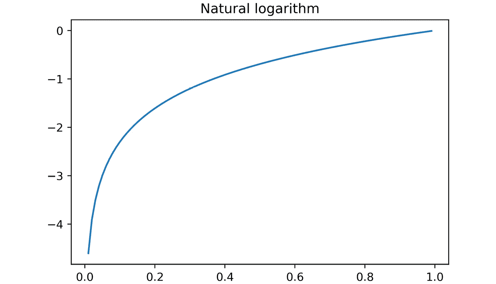

图 4.2：区间 (0, 1) 上的自然对数

为了理解对数损失代价函数是如何工作的，考虑一个样本，其中真实标签为 1，即 *y = 1*，因此代价函数的第二部分，*(1 - y*i*)log(1 - p*i*)*，将完全等于 0，不会影响结果。此时，代价函数的值为 *-y*i*log(p*i*) = -log(p*i*)*，因为 *y*i *= 1*。因此，该样本的代价就是预测概率的自然对数的负值。现在，由于该样本的真实标签为 1，考虑代价函数应该如何表现。我们期望，对于接近 1 的预测概率，代价函数会很小，表示预测值与真实值接近时的误差很小。对于接近 0 的预测，代价会更大，因为代价函数应当随着预测错误的增大而增大。

从*图 4.2*中的自然对数图中，我们可以看到，对于更接近 0 的*p*值，自然对数的值越来越负。这意味着成本函数将变得越来越大，因此，分类一个具有非常低概率的正样本的成本相对较高，这正是我们所期望的。相反，如果预测的概率更接近 1，则图形表明成本将接近 0——再次，这与一个“更正确”预测的期望一致。因此，成本函数在正样本的情况下表现如预期。对于标签为 0 的样本，也可以做类似的观察。

现在我们已经了解了对数损失成本函数在逻辑回归中的工作原理。但这与系数和截距的确定有什么关系呢？我们将在下一节学习。

注意

生成本节中展示的图表的代码可以在这里找到：[`packt.link/NeF8P`](https://packt.link/NeF8P)。

## 梯度下降寻找最优参数值

使用对数损失成本找到逻辑回归模型的参数值（系数和截距）的问题，归结为 scikit-learn 中逻辑回归模型的`.fit`方法的问题。找到具有最低成本的参数集有不同的解决技术，您可以在实例化模型类时使用`solver`关键字选择您想要使用的技术。所有这些方法都略有不同，但它们都基于**梯度下降**的概念。

梯度下降过程从`solver`关键字开始。然而，对于像深度神经网络这样的更高级机器学习算法，选择参数的初始猜测需要更多的关注。

为了说明问题，我们考虑一个只需要估计一个参数的情况。我们将观察一个假设的成本函数（*y = f(x) = x*2 *– 2x*）的值，并设计一个梯度下降过程来找到使成本*y*最小的参数值*x*。在这里，我们选择一些*x*值，创建一个返回成本函数值的函数，并观察在这个参数范围内成本函数的值。

执行此操作的代码如下：

```py
X_poly = np.linspace(-3,5,81)
print(X_poly[:5], '...', X_poly[-5:])
```

这是打印语句的输出：

```py
[-3\. -2.9 -2.8 -2.7 -2.6] ... [4.6 4.7 4.8 4.9 5\. ]
```

剩余的代码片段如下：

```py
def cost_function(X):
    return X * (X-2)
y_poly = cost_function(X_poly)
plt.plot(X_poly, y_poly)
plt.xlabel('Parameter value')
plt.ylabel('Cost function')
plt.title('Error surface')
```

结果图应如下所示：

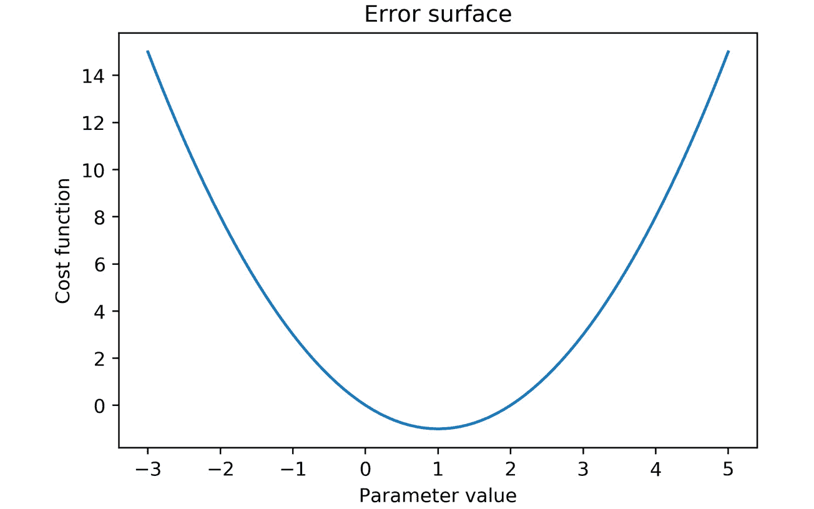

图 4.3：成本函数图

注意

在之前的代码片段中，我们假设您已经导入了必要的库。您可以参考以下笔记本，获取包括前述代码片段导入语句的完整代码：[`packt.link/A4VyF`](https://packt.link/A4VyF)。

查看 **误差面**（在 *图 4.3* 中），这是代价函数在一系列参数值上的图像，显而易见，哪个参数值将导致代价函数的最低值：*x = 1*。实际上，利用一些微积分，你可以通过将导数设置为零并求解 *x*，轻松确认 *x = 1* 是最小值。然而，通常来说，并不是所有问题都能如此简单地解决。在需要使用梯度下降的情况下，我们并不总是知道整个误差面的形状。相反，在我们选择了参数的初始猜测值之后，我们只能知道在该点周围区域内误差面的方向。

**梯度下降**是一种迭代算法；从初始猜测值开始，我们尝试找到一个新的猜测值，使代价函数降低，并继续进行，直到找到一个好的解决方案。我们试图在误差面上“下坡”，但我们只能根据当前猜测值附近的误差面形状知道该朝哪个方向移动以及在该方向上走多远。从数学角度看，我们只知道当前猜测值的参数处的 **导数**（在多维情况下称为 **梯度**）。如果你没有学习过微积分，可以把梯度理解为告诉你哪个方向是下坡，以及从你站立的地方山坡有多陡。我们利用这些信息在减少误差的方向上“迈出一步”。我们决定走多大的步伐取决于 **学习率**。由于梯度朝着误差减少的方向减小，我们希望朝梯度的负方向迈步。

这些概念可以通过以下方程进行形式化。为了从当前猜测值 *x*old 获得新猜测值 *x*new，其中 *f'(x*old*)* 是当前猜测值处代价函数的导数（即梯度）：


图 4.4：从当前猜测值获取新猜测值的方程

在下图中，我们可以看到从 *x = 4.5* 开始进行梯度下降过程的结果，学习率为 0.75，然后通过优化 *x* 使代价函数达到最小值：

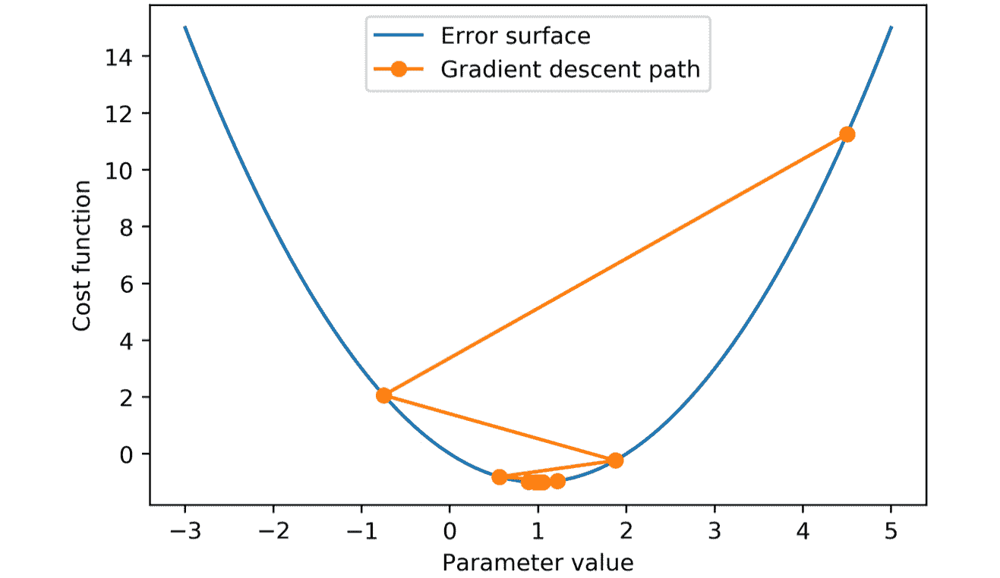

图 4.5：梯度下降路径

梯度下降也适用于更高维的空间；换句话说，适用于多个参数。然而，你只能在单一图表中可视化最多二维的误差面（即在三维图中同时展示两个参数）。

在描述了梯度下降的工作原理后，让我们进行一个练习，实现梯度下降算法，并扩展本节的例子。

注意

用于生成本节所呈现图表的代码可以在这里找到：[`packt.link/NeF8P`](https://packt.link/NeF8P)。如果你正在阅读本书的印刷版，你可以通过访问以下链接下载并浏览本章一些图像的彩色版本：[`packt.link/FAXBM`](https://packt.link/FAXBM)

## 练习 4.01：使用梯度下降最小化代价函数

在本练习中，我们的任务是找到一组最佳参数，以最小化以下假设的代价函数：*y = f(x) = x*2 *– 2x*。为此，我们将采用前面部分描述的梯度下降方法。执行以下步骤以完成练习：

注意

在开始本练习之前，请确保你已执行了导入必要库和加载清理后的数据框架的先决步骤。有关这些步骤以及本练习的代码，你可以在[`packt.link/NeF8P`](https://packt.link/NeF8P)找到。

1.  创建一个返回代价函数值的函数，并查看在一系列参数下代价函数的值。你可以使用以下代码来做到这一点（注意，这部分代码重复了前面的部分）：

    ```py
    X_poly = np.linspace(-3,5,81)
    print(X_poly[:5], '...', X_poly[-5:])
    def cost_function(X):
        return X * (X-2)
    y_poly = cost_function(X_poly)
    plt.plot(X_poly, y_poly)
    plt.xlabel('Parameter value')
    plt.ylabel('Cost function')
    plt.title('Error surface')
    ```

    你将获得以下的代价函数图：

    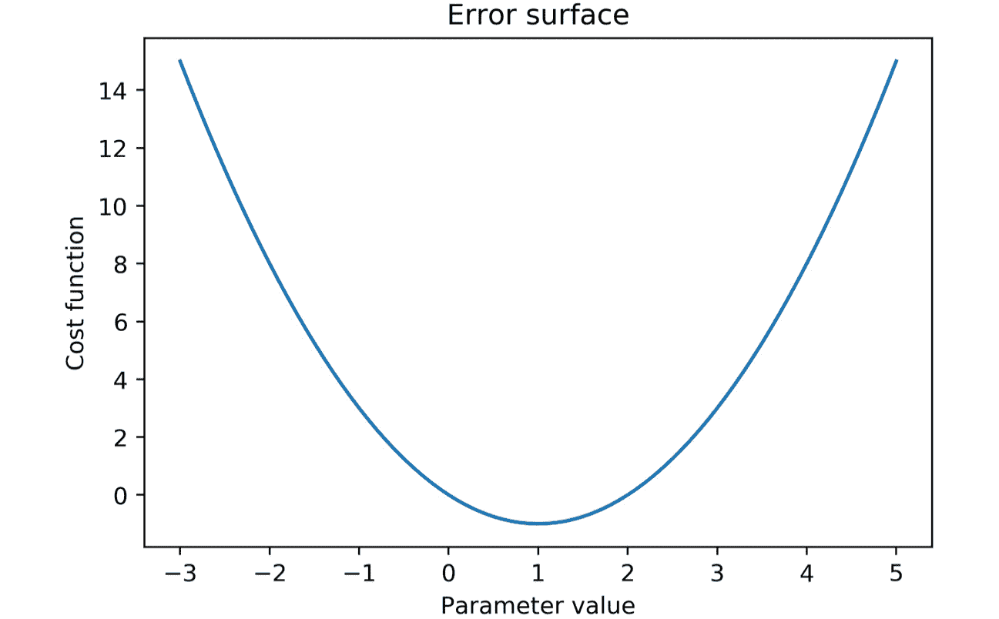

    图 4.6：代价函数图

1.  创建一个函数来求梯度值。这是代价函数的解析导数。使用此函数来计算在 *x = 4.5* 时的梯度，然后将其与学习率结合，找到梯度下降过程的下一步：

    ```py
    def gradient(X):
        return (2*X) - 2
    x_start = 4.5
    learning_rate = 0.75
    x_next = x_start - gradient(x_start)*learning_rate
    x_next
    -0.75
    ```

    这是 *x = 4.5* 后的下一个梯度下降步骤。

1.  使用以下代码绘制梯度下降路径，从起点到下一个点：

    ```py
    plt.plot(X_poly, y_poly)
    plt.plot([x_start, x_next],
             [cost_function(x_start), cost_function(x_next)],
             '-o')
    plt.xlabel('Parameter value')
    plt.ylabel('Cost function')
    plt.legend(['Error surface', 'Gradient descent path'])
    ```

    你将获得以下输出：

    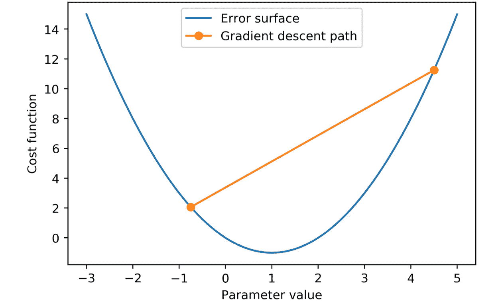

    图 4.7：第一次梯度下降路径步骤

    在这里，看起来我们似乎朝着正确的方向迈出了第一步。然而，很明显我们已经越过了我们想要到达的位置。可能是我们的学习率过大，因此我们采取了过大的步伐。虽然调节学习率是加速收敛到最优解的好方法，但在这个例子中，我们可以继续演示过程的其余部分。这里看起来我们可能还需要再迈几步。实际上，梯度下降会一直进行，直到步伐变得非常小，或者代价函数的变化变得非常小（你可以通过使用`tol`参数在 scikit-learn 的逻辑回归中指定多小），这表示我们已经接近一个好的解——也就是`max_iter`。

1.  通过使用以下代码片段执行 14 次迭代，以便向代价函数的局部最小值收敛（请注意，`iterations = 15`，但在调用 `range()` 时不包括终点）：

    ```py
    iterations = 15
    x_path = np.empty(iterations,)
    x_path[0] = x_start
    for iteration_count in range(1,iterations):
        derivative = gradient(x_path[iteration_count-1])
        x_path[iteration_count] = x_path[iteration_count-1] \
                                  - (derivative*learning_rate)
    x_path
    ```

    你将获得以下输出：

    ```py
    array([ 4.5       , -0.75      ,  1.875     ,  0.5625    ,  1.21875   ,
            0.890625  ,  1.0546875 ,  0.97265625,  1.01367188,  0.99316406,
            1.00341797,  0.99829102,  1.00085449,  0.99957275,  1.00021362])
    ```

    这个`for`循环将连续的估计值存储在`x_path`数组中，使用当前估计值计算导数并找到下一个估计值。从梯度下降过程的结果值来看，我们似乎已经非常接近（`1.00021362`）最优解 1。

1.  使用以下代码绘制梯度下降路径：

    ```py
    plt.plot(X_poly, y_poly)
    plt.plot(x_path, cost_function(x_path), '-o')
    plt.xlabel('Parameter value')
    plt.ylabel('Cost function')
    plt.legend(['Error surface', 'Gradient descent path'])
    ```

    你将获得以下输出：

    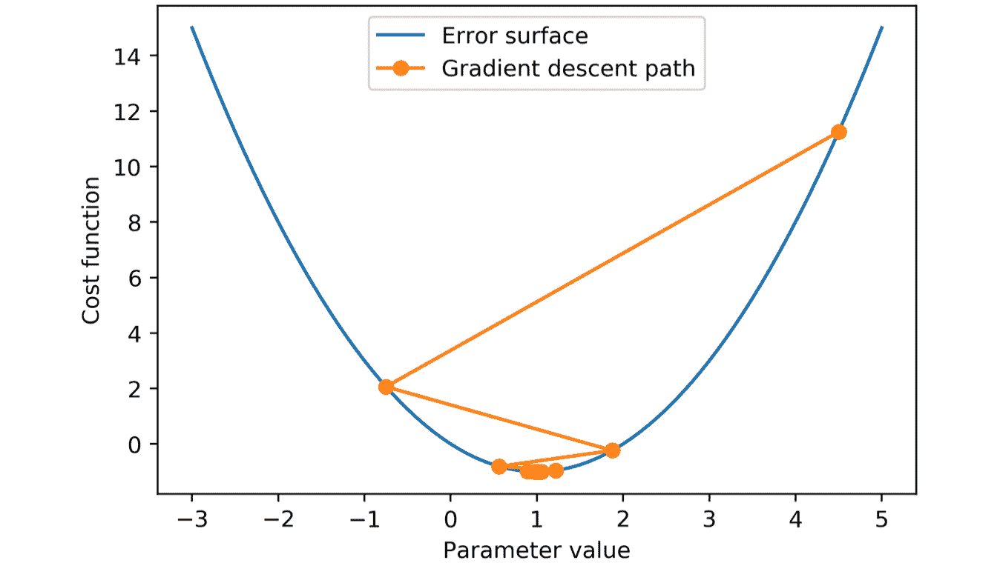

图 4.8：梯度下降路径

我们鼓励你重复之前的过程，尝试不同的学习率，看看它们如何影响梯度下降路径。选择合适的学习率，可以非常快速地收敛到一个高度准确的解。虽然在不同的机器学习应用中，学习率的选择很重要，但对于逻辑回归来说，这个问题通常比较容易解决，在 scikit-learn 中你不需要特别选择学习率。

当你尝试不同的学习率时，是否注意到当学习率大于 1 时发生了什么？在这种情况下，我们朝着减少误差的方向迈出的步伐过大，实际上会导致更高的误差。这个问题可能会自我加剧，甚至导致梯度下降过程远离最小误差区域。另一方面，如果步长太小，找到理想的解可能需要非常长的时间。

## 逻辑回归的假设

由于它是一个经典的统计模型，类似于我们已经考察过的 F 检验和皮尔逊相关性，逻辑回归对数据有一些假设。虽然不必严格遵循每一个假设，但了解它们是很有帮助的。这样，如果逻辑回归模型表现不佳，你可以尝试调查并找出原因，利用你对逻辑回归所期望的理想情况的理解。你可能会在不同的资源中看到略有不同的假设列表，然而这里列出的假设是被广泛接受的。

**特征在对数几率中是线性的**

我们在上一章*第三章*中学习了这个假设，*逻辑回归与特征探索的详细信息*。逻辑回归是一个线性模型，所以只要特征能够有效描述对数几率中的线性趋势，它就能很好地工作。特别地，逻辑回归无法捕捉特征之间的交互作用、多项式特征或特征的离散化。你可以将这些指定为“新特征”——即使它们可能是由现有特征衍生出来的。

记住上一章提到的，从单变量特征探索中，`PAY_1`特征在对数几率中并不是线性的。

**特征之间没有多重共线性**

多重共线性意味着特征之间存在相关性。这个假设最严重的违反情况是特征之间完全相关，例如一个特征与另一个特征完全相同，或者一个特征等于另一个特征乘以常数。我们可以使用我们已经熟悉的相关性图来调查特征的相关性，这个图也在单变量特征选择中出现过。以下是上一章的相关性图：

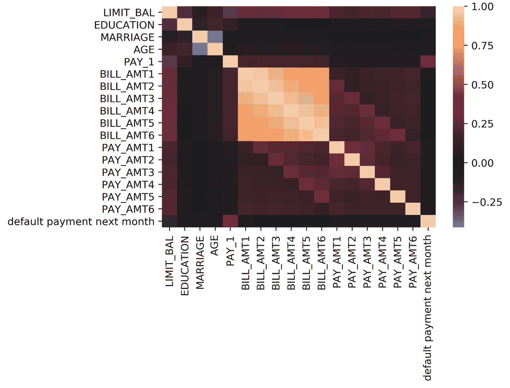

图 4.9: 特征与响应的相关性图

我们可以从相关性图中看到完美相关的样子：由于每个特征和响应变量与其自身的相关性为 1，我们可以看到 1 的相关性是浅色的奶油色。从颜色条中，我们可以知道没有-1 的相关性。

注意

包含本节中代码和相应图表的 Jupyter 笔记本可以在此找到：[`packt.link/UOEMp`](https://packt.link/UOEMp)。

在我们的案例研究数据中，最明显的相关预测变量是`BILL_AMT`特征。直观来看，账单在同一个账户的每个月可能会相似。例如，可能有一个账户通常保持零余额，或者有一个账户存在大量余额，且需要较长时间才能还清。`BILL_AMT`特征之间是否存在完全相关？从*图 4.9*来看，似乎没有。所以，虽然这些特征可能没有提供太多独立的信息，但我们目前不会出于担心多重共线性的原因而删除它们。

**观察值的独立性**

这是经典统计模型中的一个常见假设，包括线性回归。在这里，假设观察值（或样本）是独立的。这个假设在案例研究数据中是否合理？我们需要与客户确认，数据集中的同一个人是否可以拥有多个信用账户，并根据这种情况的普遍性来决定如何处理。假设我们已经被告知，在我们的数据中，每个信用账户都属于唯一的人，因此我们可以假设在这一点上观察值是独立的。

在不同的数据领域中，观察值独立性的一些常见违反情况如下：

+   **空间自相关**的观察值；例如，在自然现象中，如土壤类型，其中地理上彼此接近的观察值可能相似。

+   **时间自相关**的观察值，通常出现在时间序列数据中。在时间序列数据中，通常假设当前时刻的观察值与最近的时刻（们）相关。

然而，这些问题与我们的案例研究数据无关。

**无异常值**

异常值是指特征（或响应）的值与大多数数据的差异非常大，或者在其他方面有所不同。对于特征值的异常值，更恰当的术语是高杠杆点，因为“异常值”通常用于描述响应变量。然而，在我们的二分类问题中，不可能有响应变量的异常值，因为它只能取值 0 或 1。在实际应用中，您可能会看到这两个术语都用于描述特征。

为了理解为什么这些类型的点通常会对线性模型产生不利影响，请看这个包含 100 个点的合成线性数据以及由线性回归得到的最佳拟合线：

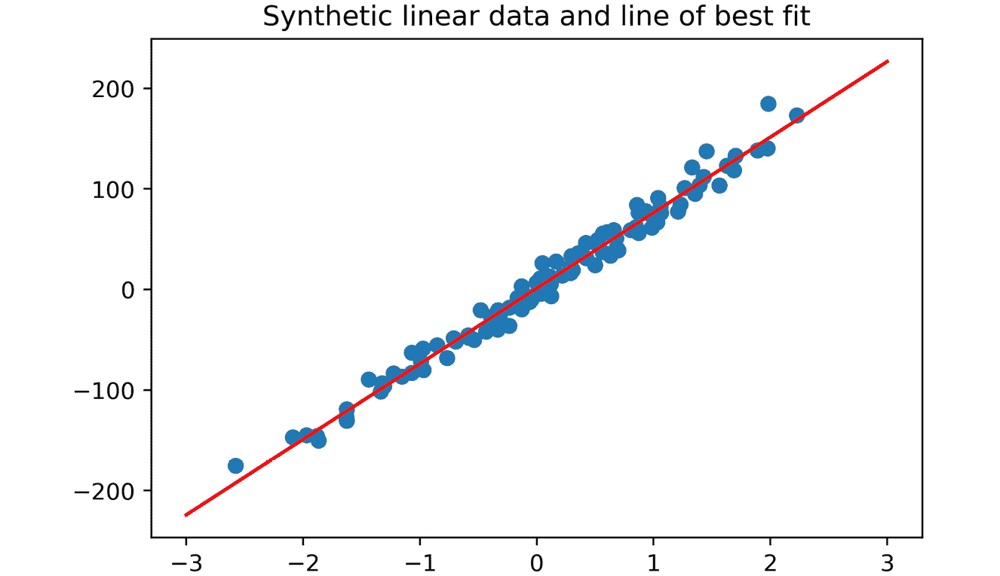

图 4.10：“表现良好”的线性数据和回归拟合

在这里，模型直观上看似与数据拟合得很好。然而，如果加入一个异常值特征值会怎样呢？为了说明这一点，我们添加了一个点，其 x 值与大多数观测值非常不同，而 y 值与其他观测值处于相似范围。然后，我们展示了结果回归线：

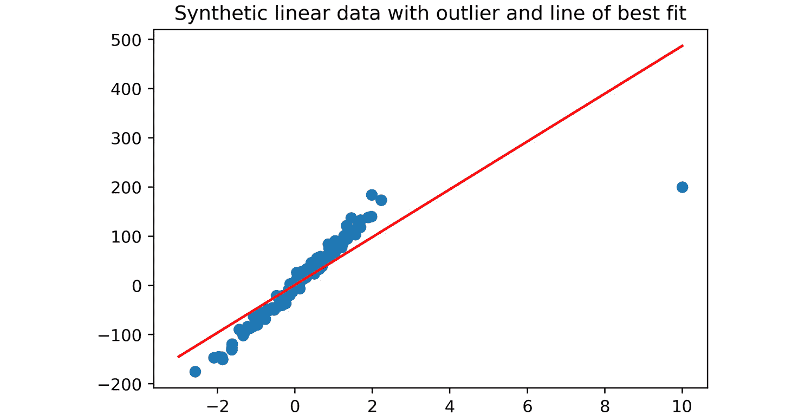

图 4.11：显示当包含异常值时会发生什么的图表

由于存在一个高杠杆点，所有数据的回归模型拟合不再很好地代表大部分数据。这展示了单个数据点对线性模型的潜在影响，特别是当该点似乎与其余数据的趋势不一致时。

处理异常值有很多方法。但一个更根本的问题是：“这样的数据现实吗？”如果数据看起来不太对，可以询问客户这些异常值是否可信。如果不可信，应该将它们排除。但如果它们代表有效的数据，则应使用非线性模型或其他方法。

在我们的案例研究数据中，在特征探索过程中绘制的直方图中并没有观察到异常值。因此，我们没有这个顾虑。

**你应该包含多少个特征？**

这不完全是一个假设，更像是构建模型的指导原则。没有明确的定律说明在逻辑回归模型中应该包含多少个特征。然而，一个常见的经验法则是“10 的法则”，即每出现 10 次最稀有的结果类别，就可以在模型中添加 1 个特征。例如，在一个包含 100 个样本的二分类逻辑回归问题中，如果类别平衡是 20%的正样本和 80%的负样本，那么正样本总数只有 20 个，因此模型中应该仅使用 2 个特征。此外，还建议采用“20 的法则”，它对包含的特征数量设定了更严格的限制（在我们的例子中为 1 个特征）。

另一个需要考虑的点是，对于二进制特征（例如由独热编码产生的特征），即该特征有多少样本会有正值。如果该特征非常不平衡，换句话说，包含 1 或 0 的样本非常少，那么将其纳入模型可能没有意义。

对于案例研究数据，我们很幸运拥有相对较多的样本和较为平衡的特征，因此这些问题并不显著。

注意

本节中呈现的绘图代码可以在此处找到：[`packt.link/SnX3y`](https://packt.link/SnX3y)。

## 正则化的动机：偏差-方差权衡

我们可以通过使用一种强大的概念——**收缩**或**正则化**，来扩展我们所学的基本逻辑回归模型。实际上，到目前为止，您在 scikit-learn 中拟合的每一个逻辑回归模型都使用了一定量的正则化。这是因为正则化是逻辑回归模型对象中的默认选项。不过，直到现在，我们一直忽视了它。

当你对这些概念有更深入的了解时，你还会熟悉一些机器学习中的基础概念：**过拟合**、**欠拟合**和**偏差-方差权衡**。如果一个模型在训练数据上的表现（例如，ROC AUC）远远好于在保留的测试集上的表现，那么这个模型被认为是对训练数据进行了过拟合。换句话说，在训练集上的良好表现并不能推广到未见过的测试集。我们在*第二章*，*Scikit-Learn 简介与模型评估*中开始讨论这些概念，当时我们区分了模型训练分数和测试分数。

当一个模型对训练数据发生过拟合时，它被认为具有较高的**方差**。换句话说，训练数据中存在的任何变异性，模型都学得非常好——实际上，学得太好了。这将在较高的训练得分中得到体现。然而，当这样的模型用于对新的、未见过的数据进行预测时，其表现较差。以下情况下，过拟合的可能性更大：

+   可用的特征数量相较于样本数量非常庞大。尤其是，可能存在如此多的特征，以至于直接检查所有特征变得繁琐，就像我们在案例研究数据中能够做到的那样。

+   使用了更复杂的模型，即比逻辑回归更复杂的模型。这些包括梯度提升集成模型或神经网络等。

在这种情况下，模型有机会在模型拟合过程中开发出关于特征与响应变量之间关系的更复杂的**假设**，从而使过拟合的可能性增加。

相反，如果一个模型无法很好地拟合训练数据，这就是所谓的欠拟合，模型被认为具有较高的**偏差**。

我们可以通过在一些假设数据上拟合多项式模型，来检查欠拟合、过拟合和理想模型之间的区别：

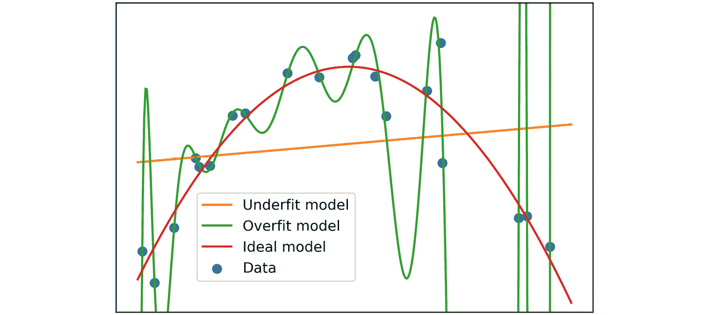

图 4.12：包含欠拟合、过拟合和理想模型的二次数据

在*图 4.12*中，我们可以看到，包含过少特征（在这种情况下，是仅有两个特征的*y*线性模型，一个斜率和一个截距）显然不是对数据的良好表示。这被称为欠拟合模型。然而，如果我们包含过多特征，即许多高次多项式项，比如*x*²、*x*³、*x*⁴、…… *x*¹⁰，虽然可以几乎完美地拟合训练数据，但这不一定是好事。当我们观察过拟合模型在训练数据点之间的结果时，尤其是在可能需要进行新预测的地方，我们可以看到模型不稳定，并且可能无法为未出现在训练集中的数据提供可靠的预测。我们仅凭对特征与响应变量之间关系的直观理解，就能看出这一点，这种理解来自于对数据的可视化。

注意

生成本节中展示的图表的代码可以在此找到：[`packt.link/SnX3y`](https://packt.link/SnX3y)。

本例中的合成数据是通过二次（即二次方）多项式生成的。知道这一点后，我们可以通过将二次多项式拟合到训练数据上，轻松找到理想模型，如*图 4.12*所示。

然而，通常情况下，我们无法提前知道理想模型的公式。因此，我们需要通过比较训练和测试得分，来评估模型是否存在过拟合或欠拟合的情况。

在某些情况下，引入一些偏差到模型训练过程中是可取的，特别是当这样做可以减少过拟合，并提高模型在新数据（即未见过的数据）上的表现时。通过这种方式，可能可以利用偏差-方差权衡来改善模型。我们可以使用**正则化**方法来实现这一点。此外，我们也可以将这些方法用于**变量选择**，作为建模过程的一部分。使用预测模型来选择变量，是我们之前探讨的单变量特征选择方法的替代方案。在接下来的练习中，我们将开始实验这些概念。

## 练习 4.02：生成和建模合成分类数据

在本练习中，我们将通过使用合成数据集来观察过拟合现象。假设你现在面临一个二分类数据集，包含许多候选特征（200 个），而你没有时间逐一检查它们。可能其中一些特征是高度相关的，或者以其他方式相互关联。然而，特征的数量如此之多，可能会使得有效地探索每个特征变得困难。此外，数据集的样本数量相对较少：只有 1,000 个样本。我们将通过使用 scikit-learn 提供的一个功能来生成这个具有挑战性的数据集，该功能允许你创建合成数据集，用于进行此类概念性探索。请按照以下步骤完成练习：

注意

在开始本练习之前，请确保你已经执行了导入必要库的前提步骤。这些步骤及本练习的代码可以在 [`packt.link/mIMsT`](https://packt.link/mIMsT) 找到。

1.  使用以下代码导入 `make_classification`、`train_test_split`、`LogisticRegression` 和 `roc_auc_score` 类：

    ```py
    from sklearn.datasets import make_classification
    from sklearn.model_selection import train_test_split
    from sklearn.linear_model import LogisticRegression
    from sklearn.metrics import roc_auc_score
    ```

    请注意，我们从 scikit-learn 导入了几个熟悉的类，另外还导入了一个我们之前没有见过的新类：`make_classification`。这个类的功能正如其名所示——它用于生成分类问题的数据。通过使用各种关键字参数，你可以指定要包含多少样本和特征，以及响应变量将有多少个类别。还有一系列其他选项，可以有效控制问题的“难易程度”。

    注意

    更多信息，请参考[`scikit-learn.org/stable/modules/generated/sklearn.datasets.make_classification.html`](https://scikit-learn.org/stable/modules/generated/sklearn.datasets.make_classification.html)。简单来说，我们在这里选择了使问题相对容易解决的选项，但也加入了一些复杂因素。换句话说，我们期望模型表现良好，但我们需要付出一点努力才能实现这一点。

1.  生成一个包含两个变量的数据集，`x_synthetic` 和 `y_synthetic`。`x_synthetic` 包含 200 个候选特征，`y_synthetic` 包含响应变量，每个包含 1,000 个样本。使用以下代码：

    ```py
    X_synthetic, y_synthetic = make_classification(
        n_samples=1000, n_features=200,
        n_informative=3, n_redundant=10,
        n_repeated=0, n_classes=2,
        n_clusters_per_class=2,
        weights=None, flip_y=0.01,
        class_sep=0.8, hypercube=True,
        shift=0.0, scale=1.0,
        shuffle=True, random_state=24)
    ```

1.  使用以下代码检查数据集的形状以及响应变量的类别比例：

    ```py
    print(X_synthetic.shape, y_synthetic.shape)
    print(np.mean(y_synthetic))
    ```

    你将获得以下输出：

    ```py
    (1000, 200) (1000,)
    0.501
    ```

    检查输出形状后，注意到我们生成了一个几乎完美平衡的数据集：类别平衡接近 50/50。还需要注意的是，我们已生成所有特征，使它们具有相同的`shift`和`scale`——即均值为 0，标准差为 1。确保特征在相同的尺度上，或者说具有大致相同的取值范围，是使用正则化方法的关键点——稍后我们将看到为什么。如果原始数据集中的特征尺度差异较大，建议对其进行归一化，以确保它们处于相同的尺度上。Scikit-learn 提供了简便的方法来实现这一点，我们将在本章末的活动中学习。

1.  使用以下代码将前几个特征绘制为直方图，以显示它们的取值范围相同：

    ```py
    for plot_index in range(4):
        plt.subplot(2, 2, plot_index+1)
        plt.hist(X_synthetic[:, plot_index])
        plt.title('Histogram for feature {}'.format(plot_index+1))
    plt.tight_layout()
    ```

    您将得到以下输出：

    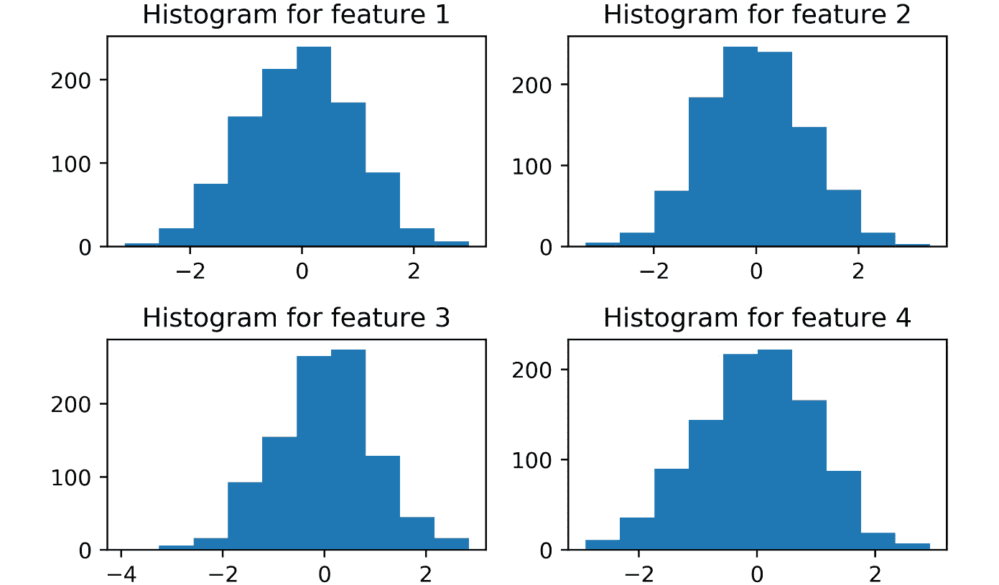

    图 4.13：200 个合成特征中的前 4 个特征的直方图

    由于我们生成了这个数据集，因此无需直接检查所有 200 个特征来确保它们在相同的尺度上。那么，这个数据集可能存在哪些问题呢？由于响应变量的类别比例已经平衡，因此我们无需进行欠采样、过采样或使用其他对不平衡数据有帮助的方法。那么特征之间以及特征与响应变量之间的关系呢？这些关系有很多，直接调查它们是一个挑战。根据我们的经验法则（即每 10 个稀有类别样本对应 1 个特征），200 个特征过多。我们在最稀有类别中有 500 个观察值，所以根据这个规则，我们不应该有超过 50 个特征。特征数量过多可能会导致模型训练过程过拟合。接下来，我们将开始学习如何在 scikit-learn 的逻辑回归中使用选项来防止这种情况发生。

1.  使用 80/20 的比例将数据拆分为训练集和测试集，然后使用以下代码实例化一个逻辑回归模型对象：

    ```py
    X_syn_train, X_syn_test, y_syn_train, y_syn_test = \
    train_test_split(X_synthetic, y_synthetic,\
                     test_size=0.2, random_state=24)
    lr_syn = LogisticRegression(solver='liblinear', penalty='l1',
                                C=1000, random_state=1)
    lr_syn.fit(X_syn_train, y_syn_train)
    ```

    请注意，我们在逻辑回归模型中指定了一些新的选项，这是我们之前未关注的。首先，我们将`penalty`参数设置为`l1`。这意味着我们将使用`C`参数，值为 1,000。根据 scikit-learn 文档（[`scikit-learn.org/stable/modules/generated/sklearn.linear_model.LogisticRegression.html`](https://scikit-learn.org/stable/modules/generated/sklearn.linear_model.LogisticRegression.html)），`C`是“正则化强度的倒数”。这意味着较大的`C`值对应较少的正则化。通过选择相对较大的数值，如 1,000，我们使用的是相对较少的正则化。`C`的默认值是 1。所以，我们这里实际上并没有使用太多正则化，而只是熟悉如何使用这些选项。最后，我们使用`liblinear`求解器，这是我们以前使用过的。

    尽管我们这里使用的是经过缩放的数据（所有特征的均值为 0，标准差为 1），但值得注意的是，在我们可用的各种求解器选项中，`liblinear`是“对未缩放数据具有鲁棒性的”。另外要注意的是，`liblinear`是唯一支持 L1 惩罚的两个求解器选项之一，另一个选项是`saga`。

    注意

    您可以在[`scikit-learn.org/stable/modules/linear_model.html#logistic-regression`](https://scikit-learn.org/stable/modules/linear_model.html#logistic-regression)上了解更多关于可用求解器的信息。

1.  使用以下代码在训练数据上拟合逻辑回归模型：

    ```py
    lr_syn.fit(X_syn_train, y_syn_train)
    ```

    这是输出结果：

    ```py
    LogisticRegression(C=1000, penalty='l1', random_state=1, \
                       solver='liblinear')
    ```

1.  使用以下代码计算训练得分，首先获取预测概率，然后得到 ROC AUC：

    ```py
    y_syn_train_predict_proba = lr_syn.predict_proba(X_syn_train)
    roc_auc_score(y_syn_train, y_syn_train_predict_proba[:,1])
    ```

    输出应如下所示：

    ```py
    0.9420000000000001
    ```

1.  使用与计算训练得分相似的方法计算测试得分：

    ```py
    y_syn_test_predict_proba = lr_syn.predict_proba(X_syn_test)
    roc_auc_score(y_syn_test, y_syn_test_predict_proba[:,1])
    ```

    输出应如下所示：

    ```py
    0.8075807580758075
    ```

    从这些结果来看，很明显，逻辑回归模型已经过拟合数据。也就是说，训练数据上的 ROC AUC 得分远高于测试数据上的得分。

## Lasso (L1) 和 Ridge (L2) 正则化

在将正则化应用于逻辑回归模型之前，我们先花点时间理解什么是正则化以及它是如何工作的。在 scikit-learn 中，正则化逻辑回归模型的两种方式分别叫做`penalty = 'l1'`或`'l2'`。它们被称为“惩罚”，因为正则化的作用是增加惩罚或成本，以防止逻辑回归模型中系数的值过大。

正如我们已经学到的，逻辑回归模型中的系数描述了响应变量的对数几率与每个特征之间的关系。因此，如果某个系数值特别大，那么该特征的微小变化将在预测中产生较大的影响。当模型正在拟合并学习特征与响应变量之间的关系时，模型可能开始学习数据中的噪声。我们之前在*图 4.12*中看到过这一点：如果在拟合模型时可用的特征很多，并且没有对它们系数值施加限制，那么模型拟合过程可能会试图发现特征与响应变量之间的关系，这些关系无法推广到新数据。这样，模型就会变得更适应现实世界中不完美数据中的不可预测的随机噪声。不幸的是，这只会提高模型对训练数据的预测能力，而这并不是我们的最终目标。因此，我们应该努力从模型中剔除这些虚假的关系。

Lasso 和岭回归正则化使用不同的数学公式来实现这一目标。这些方法通过对模型拟合时使用的成本函数进行修改来工作，我们之前介绍过这个函数是对数损失函数。Lasso 正则化使用的是所谓的**1-范数**（因此也叫 L1）：

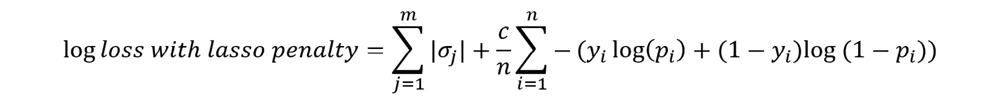

图 4.14：带 Lasso 惩罚的对数损失方程

1-范数，即*图 4.14*中方程的第一项，实际上是* m *个不同特征系数绝对值的和。使用绝对值是因为无论系数是正向还是负向过大，都可能导致过拟合。那么，这个成本函数与我们之前看到的对数损失函数相比，有什么不同呢？嗯，现在有一个*C*因子，它乘以了对数损失函数前面分数的部分。

这是“正则化强度的倒数”，正如 scikit-learn 文档中所描述的（[`scikit-learn.org/stable/modules/generated/sklearn.linear_model.LogisticRegression.html`](https://scikit-learn.org/stable/modules/generated/sklearn.linear_model.LogisticRegression.html)）。由于这个因子位于计算预测误差的成本函数项前面，而不是正则化项前面，因此增大它会让预测误差在成本函数中变得更加重要，而正则化则变得不那么重要。简而言之，*在 scikit-learn 实现中，C 值越大，正则化越少*。

L2 或岭回归正则化类似于 L1 正则化，不同之处在于，岭回归使用的是系数的平方和，而不是绝对值之和，这个平方和被称为**2-范数**：

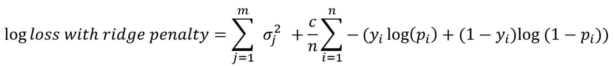

图 4.15：带脊回归惩罚的对数损失方程

请注意，如果你查看 scikit-learn 文档中的逻辑回归成本函数，具体形式与这里使用的不同，但总体思路是相似的。此外，在你熟悉了套索（lasso）和脊回归（ridge）惩罚的概念之后，你应该知道还有一种叫做 **弹性网（elastic-net）** 的额外正则化方法，它是套索和脊回归的结合。

**为什么正则化有两种不同的公式？**

可能其中一个方法会提供更好的样本外表现，因此你可能希望同时测试这两种方法。这些方法之间还有另一个关键差异：L1 惩罚除了执行正则化外，还进行特征选择。它通过在正则化过程中将某些系数值设置为零，从而有效地从模型中去除这些特征。L2 正则化则是将系数值变小，但不会完全消除它们。并非所有的求解器选项都支持 L1 和 L2 正则化，因此你需要为你想使用的正则化技术选择合适的求解器。

注意

为什么 L1 正则化会去除特征，而 L2 不会的数学原理超出了本书的范围。然而，关于这个话题的更深入解释以及进一步的阅读，我们推荐一本非常易读（且免费的）资源——*Gareth James 等人编著的《统计学习导论》*。特别是，参见修订版第七印刷的 *第 222 页*，上面有一幅有助于理解 L1 和 L2 正则化差异的图示。

**截距和正则化**

我们并没有过多讨论截距，除了提到我们已经通过线性模型估计了它们，以及与每个特征相关的系数。那么，应该使用截距吗？答案可能是肯定的，直到你对线性模型有了更深入的理解，并确信在特定情况下不需要使用它。然而，确实存在这样的情况，例如在一个特征和响应变量都已归一化为零均值的线性回归模型中。

截距与任何特定特征无关。因此，对其进行正则化没有太大意义，因为它不应该有助于过拟合。请注意，在 L1 的正则化惩罚项中，求和从 *j = 1* 开始，同样在 L2 中，我们跳过了 *σ*0，这就是截距项。

这是理想的情况：不对截距进行正则化。然而，scikit-learn 中的一些求解器，如 `liblinear`，实际上会对截距进行正则化。你可以通过提供一个 `intercept_scaling` 选项来对抗这一效应。我们在这里没有展示这一点，因为虽然从理论上讲，这样做是不正确的，但在实践中，正则化截距通常对模型的预测质量影响不大。

**缩放与正则化**

如前一个练习所述，最佳实践是`LIMIT_BAL`在我们的数据集中远大于其他特征，比如`PAY_1`，实际上，可能希望为`PAY_1`的系数赋予较大的值，而为`LIMIT_BAL`的系数赋予较小的值，从而使它们在特征和系数的线性组合中对模型预测的影响处于相同的尺度。通过在使用正则化之前对所有特征进行标准化，可以避免因尺度差异而引发的此类复杂问题。

事实上，缩放数据可能也是必要的，这取决于你使用的求解器。scikit-learn 中可用的不同梯度下降变体可能无法有效处理未缩放的数据。

**选择合适求解器的重要性**

如我们所了解的，scikit-learn 中可用的不同逻辑回归求解器在以下方面有不同的表现：

+   它们是否支持 L1 和 L2 正则化

+   它们如何在正则化过程中处理截距

+   它们如何处理未缩放的数据

    注意

    还有其他的区别。一个有用的表格比较了这些和其他特性，可以参考[`scikit-learn.org/stable/modules/linear_model.html#logistic-regression`](https://scikit-learn.org/stable/modules/linear_model.html#logistic-regression)。你可以使用这个表格来决定哪个求解器最适合你的问题。

总结这一部分内容，我们学习了 lasso 和 ridge 正则化的数学基础。*这些方法通过将系数值收缩到接近 0 来工作，在 lasso 的情况下，还会将某些系数精确地设为 0，从而执行特征选择*。你可以想象，在我们*图 4.12*中的过拟合例子中，如果复杂的过拟合模型将一些系数收缩到接近 0，它将更像理想模型，而理想模型的系数较少。

这里是一个正则化回归模型的图示，使用与过拟合模型相同的高阶多项式特征，但加上了脊岭惩罚：

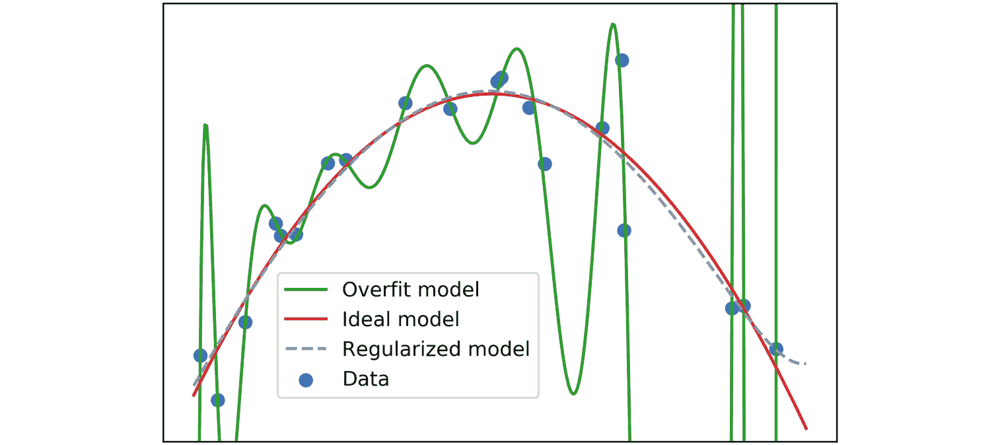

图 4.16：一个过拟合模型和使用相同特征的正则化模型

正则化后的模型看起来类似于理想模型，展示了正则化纠正过拟合的能力。然而，需要注意的是，正则化模型不应推荐用于外推。在此，我们可以看到正则化模型在*图 4.16*的右侧开始增加。这个增加应该被视为可疑，因为训练数据中没有任何迹象表明这是可以预期的。这是*不推荐对超出训练数据范围的模型预测进行外推*的一般观点的一个例子。然而，从*图 4.16*可以清楚地看到，即使我们没有关于生成这些合成数据的模型的知识（因为在现实世界的预测建模工作中，我们通常没有数据生成过程的知识），我们仍然可以使用正则化来减少在有大量候选特征时的过拟合影响。

**模型与特征选择**

L1 正则化是一种使用模型（如逻辑回归）进行特征选择的方法。其他方法包括从候选特征池中进行前向或后向**逐步选择**。这些方法背后的高层次思想如下：在**前向选择**的情况下，特征一个一个地添加到模型中，并观察外样本性能的变化。在每次迭代时，都会考虑将所有候选池中的特征添加到模型中，并选择能够最大化外样本性能提升的特征。当添加更多特征不再改善模型性能时，就不需要再从候选特征中添加更多特征。在**后向选择**的情况下，首先从模型中开始使用所有特征，并确定应该删除哪个特征：删除后对外样本性能影响最小的特征。你可以继续按这种方式删除特征，直到性能开始显著下降。

注意

本节中展示的生成图表的代码可以在此找到：[`packt.link/aUBMb`](https://packt.link/aUBMb)。

# 交叉验证：选择正则化参数

到目前为止，你可能会怀疑我们是否可以使用正则化来减少在尝试对*练习 4.02*中的合成数据建模时观察到的过拟合现象，*生成与建模合成分类数据*。问题是，我们该如何选择正则化参数*C*呢？*C*是一个模型的**超参数**示例。超参数与在训练模型时估计的参数不同，例如逻辑回归的系数和截距。超参数不像参数那样通过自动化程序估计，而是由用户直接输入作为关键字参数，通常在实例化模型类时进行输入。那么，我们如何知道应该选择什么值呢？

超参数比参数更难估算。这是因为数据科学家需要决定最佳值，而不是让优化算法来寻找它。然而，程序化选择超参数值是可能的，这可以被视为一种优化过程。从实际角度看，在正则化参数*C*的情况下，最常见的做法是，使用特定的*C*值在一组数据上拟合模型，确定模型的训练性能，然后在另一组数据上评估*out-of-sample*性能。

我们已经熟悉使用模型训练集和测试集的概念。然而，这里有一个关键的区别；例如，如果我们多次使用测试集，以查看不同*C*值的效果，会发生什么？

你可能会想到，在第一次使用未见过的测试集来评估特定值的*out-of-sample*性能后，它就不再是“未见过”的测试集了。虽然在估算模型参数（即系数和截距）时仅使用了训练数据，但现在测试数据被用来估算超参数*C*。实际上，测试数据已经变成了额外的训练数据，因为它用于寻找超参数的最佳值。

因此，通常将数据分为三部分：训练集、测试集和**验证集**。验证集有多个用途：

**估算超参数**

验证集可以反复使用，以评估不同超参数值的*out-of-sample*性能，从而选择超参数。

**不同模型的比较**

除了为模型找到超参数值外，验证集还可以用来估算不同模型的*out-of-sample*性能；例如，如果我们想将逻辑回归与随机森林进行比较。

注意

**数据管理最佳实践**

作为数据科学家，如何划分数据以进行不同的预测建模任务是你的责任。在理想情况下，你应该保留一部分数据用于流程的最后阶段，即在你已经选择了模型超参数并确定了最佳模型之后。这**未见过的测试集**被保留到最后一步，可以用来评估你模型构建工作的最终结果，查看最终模型如何泛化到新的未见数据。在保留测试集时，最好确保特征和响应的特性与其余数据相似。换句话说，类别比例应该相同，特征的分布应该相似。这样，测试数据就能代表你用来构建模型的数据。

虽然模型验证是一个好习惯，但它引发了一个问题：我们为训练集、验证集和测试集选择的特定拆分，是否对我们跟踪的结果有任何影响。例如，也许特征和响应变量之间的关系在我们保留的未见测试集或验证集与训练集之间略有不同。要消除所有此类变异几乎是不可能的，但我们可以使用**交叉验证**的方法，以避免对某一特定数据拆分过度依赖。

Scikit-learn 提供了便捷的函数来促进交叉验证分析。这些函数与我们已经使用的 `train_test_split` 起到类似的作用，尽管默认行为有些不同。现在让我们来熟悉它们。首先，导入这两个类：

```py
from sklearn.model_selection import StratifiedKFold
from sklearn.model_selection import KFold
```

类似于 `train_test_split`，我们需要指定数据集用于训练和测试的比例。然而，在交叉验证中（特别是我们刚刚导入的类中实现的**k 折交叉验证**），我们不直接指定比例，而是简单地指明我们希望有多少个折叠——即“**k 折**”。这里的想法是，数据将被分成**k**个相等的部分。例如，如果我们指定 4 个折叠，那么每个折叠将包含 25%的数据。这些折叠将在四个单独的模型训练实例中作为测试数据，而每个折叠的其余 75%将用于训练模型。在此过程中，每个数据点总共会作为训练数据使用 *k - 1* 次，而仅作为测试数据使用一次。

在实例化该类时，我们指定了折数、是否在拆分数据前进行洗牌，以及是否设置随机种子，以确保在不同运行中得到可重复的结果：

```py
n_folds = 4
k_folds = KFold(n_splits=n_folds, shuffle=False)
```

这里，我们实例化了一个具有四个折叠且没有洗牌的对象。我们使用返回的对象（我们称之为 `k_folds`）的方法是将我们希望用于交叉验证的特征数据和响应数据传递给该对象的 `.split` 方法。这会输出 `X_syn_train` 和 `y_syn_train`，我们可以像这样遍历这些拆分：

```py
for train_index, test_index in k_folds_iterator.split(X_syn_train,
                                                      y_syn_train):
```

迭代器将返回 `X_syn_train` 和 `y_syn_train` 的行索引，我们可以用这些索引来获取数据。在这个 `for` 循环内部，我们可以编写代码，使用这些索引反复选择数据进行模型训练和测试，使用不同的数据子集。通过这种方式，我们可以获得一个稳健的模型外表现指标，当使用某一特定超参数值时，然后重复整个过程，使用另一个超参数值。因此，交叉验证循环可能会**嵌套**在一个外部的超参数值循环中。我们将在下面的练习中演示这一点。

不过，首先，这些拆分看起来是什么样子的？如果我们只是将`train_index`和`test_index`的索引用不同的颜色绘制出来，我们将得到如下图所示的效果：

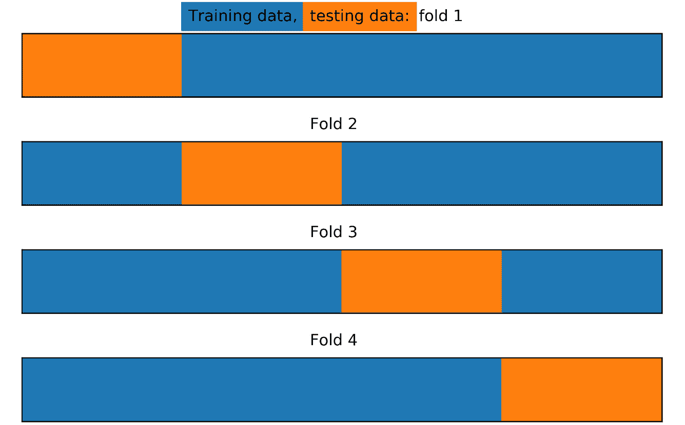

图 4.17：没有打乱的四折 k 折训练/测试拆分

在这里，我们可以看到，按照我们为`KFold`类指定的选项，程序简单地将数据的前 25%（按行的顺序）作为第一个测试折，然后将下一个 25%的数据作为第二个折，依此类推。但如果我们想要分层抽样折呢？换句话说，如果我们希望确保每个折中的响应变量的类别比例相等呢？虽然`train_test_split`允许通过关键字参数实现这个选项，但有一个独立的`StratifiedKFold`类，它为交叉验证实现了这个功能。我们可以通过以下方式来说明分层拆分的效果：

```py
k_folds = StratifiedKFold(n_splits=n_folds, shuffle=False)
```

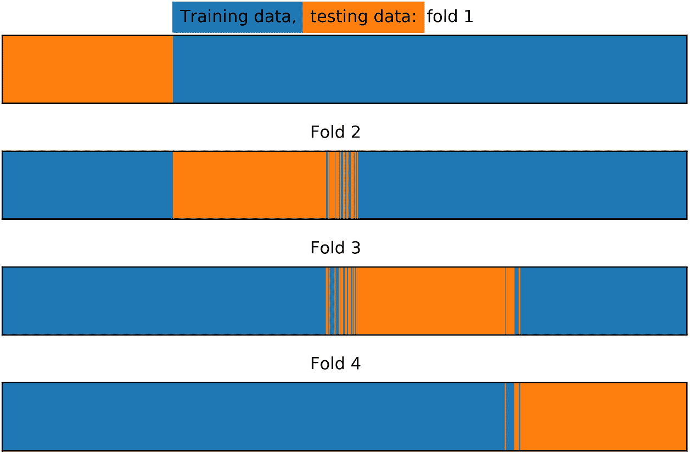

图 4.18：分层 k 折训练/测试拆分

在*图 4.18*中，我们可以看到不同折之间已经进行了一定程度的“打乱”。程序根据需要在折之间移动样本，以确保每个折中的类别比例相等。

那么，如果我们想要将数据打乱，以便从每个测试折中选择整个索引范围的样本，该怎么办呢？首先，为什么我们想这么做？嗯，对于我们为这个问题创建的合成数据，我们可以确定数据是没有特定顺序的。然而，在许多实际情况下，我们收到的数据可能以某种方式进行了排序。

例如，数据的行可能是按账户创建日期排序的，或按其他逻辑排序的。因此，在拆分数据之前先打乱数据可能是个好主意。这样，任何可能被用于排序的特征，应该在每个折中都能保持一致。否则，不同折中的数据可能会有不同的特征，可能导致特征与响应之间的关系不同。

这可能导致模型在不同折之间的表现不均衡。为了在数据集的所有行索引中“打乱”折，只需要将`shuffle`参数设置为`True`：

```py
k_folds = StratifiedKFold(n_splits=n_folds, shuffle=True,
                          random_state=1)
```

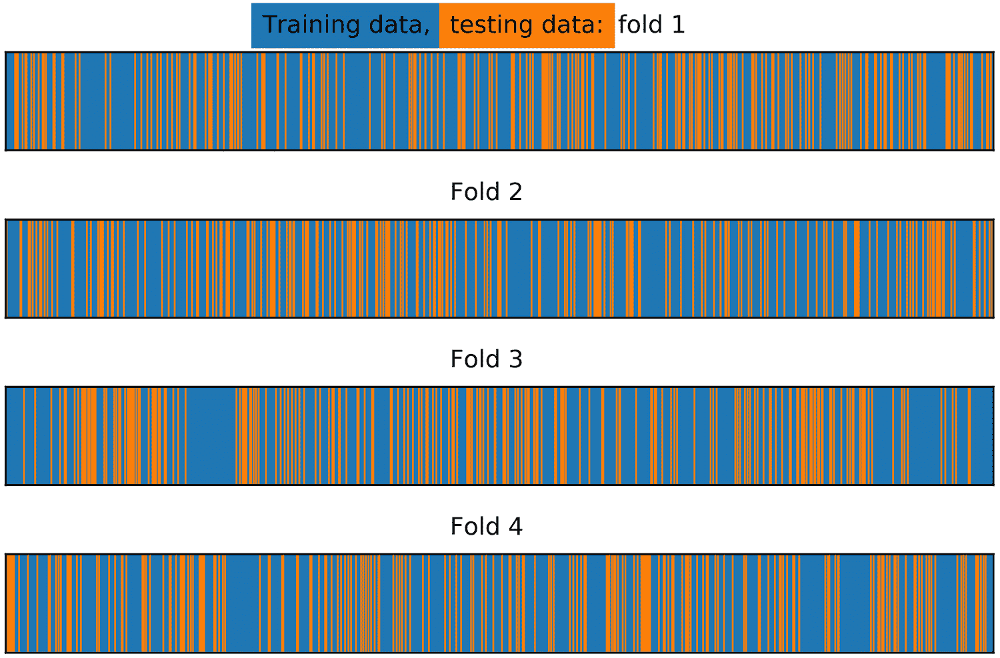

图 4.19：带有打乱的分层 k 折训练/测试拆分

通过打乱，测试折会随机且均匀地分布在输入数据的索引上。

K 折交叉验证是数据科学中广泛使用的一种方法。然而，选择使用多少折数取决于手头的特定数据集。使用较小的折数意味着每个折中的训练数据量相对较小。因此，这增加了模型过拟合的机会，因为模型通常在更多数据的训练下效果更好。建议尝试几种不同的折数，看看 k 折测试分数的均值和变异性如何变化。常见的折数范围通常是从 4 或 5 到 10。

在数据集非常小的情况下，可能需要在交叉验证折中尽可能多地使用数据进行训练。在这种情况下，可以使用一种叫做**留一法交叉验证**（**LOOCV**）的方法。在 LOOCV 中，每个折的测试集由一个单一的样本组成。换句话说，折数将与训练数据中的样本数量相同。在每次迭代中，模型会在除一个样本外的所有样本上进行训练，并对该样本进行预测。然后，可以根据这些预测来构建准确度或其他性能指标。

与创建测试集相关的其他问题，如为那些需要使用过去的观测值来预测未来事件的问题选择超时测试集，也同样适用于交叉验证。

在*练习 4.02*，*生成和建模合成分类数据*中，我们看到对训练数据拟合逻辑回归导致了过拟合。事实上，测试分数（*ROC AUC = 0.81*）明显低于训练分数（*ROC AUC = 0.94*）。我们实际上使用了非常少或没有正则化，因为我们将正则化参数*C*设置为一个相对较大的值（1,000）。现在我们将看到当我们在一个较宽的范围内调整*C*时会发生什么。

注意

本节中呈现的生成图形的代码可以在这里找到：[`packt.link/37Zks`](https://packt.link/37Zks)。

## 练习 4.03：减少合成数据分类问题中的过拟合

本练习是*练习 4.02*，*生成和建模合成分类数据*的延续。在这里，我们将使用交叉验证程序来找到超参数*C*的一个合适值。我们将通过仅使用训练数据来完成此任务，将测试数据保留到模型构建完成后再使用。请做好准备——这将是一个较长的练习——但它将展示一个通用过程，您可以将其应用于许多不同类型的机器学习模型，因此，花费时间完成它是非常值得的。按照以下步骤完成此练习：

注意

在开始此练习之前，您需要执行一些先决步骤，这些步骤可以在以下笔记本中找到，并附有此练习的代码：[`packt.link/JqbsW`](https://packt.link/JqbsW)。

1.  调整正则化参数 *C* 的值，使其范围从 *C = 1000* 到 *C = 0.001*。你可以使用以下代码片段来实现这一点。

    首先，定义指数，它们将是 10 的幂次方，如下所示：

    ```py
    C_val_exponents = np.linspace(3,-3,13)
    C_val_exponents
    ```

    以下是前面代码的输出：

    ```py
    array([ 3\. ,  2.5,  2\. ,  1.5,  1\. ,  0.5,  0\. , -0.5, -1\. , -1.5, -2\. , -2.5, -3\. ])
    ```

    现在，按 10 的幂次方调整 *C* 值，如下所示：

    ```py
    C_vals = np.float(10)**C_val_exponents
    C_vals
    ```

    以下是前面代码的输出：

    ```py
    array([1.00000000e+03, 3.16227766e+02, 1.00000000e+02, 3.16227766e+01,
           1.00000000e+01, 3.16227766e+00, 1.00000000e+00, 3.16227766e-01,
           1.00000000e-01, 3.16227766e-02, 1.00000000e-02, 3.16227766e-03,
           1.00000000e-03])
    ```

    通常，最好通过 10 的幂次方来调整正则化参数，或者使用类似的策略，因为训练模型可能需要大量时间，特别是在使用 k 折交叉验证时。这能让你更好地了解不同的*C*值如何影响偏差-方差权衡，而无需训练大量模型。除了 10 的整数次方，我们还包括 log10 坐标轴上大约位于中间的点。如果在这些相对间隔较大的值之间似乎有一些有趣的行为，你可以在可能值的较小范围内添加更多细化的 *C* 值。

1.  导入 `roc_curve` 类：

    ```py
    from sklearn.metrics import roc_curve
    ```

    我们将继续使用 ROC AUC 分数来评估、训练和测试性能。现在，我们有几个不同的 *C* 值要尝试，并且有多个折（在这个例子中是四个）进行交叉验证，我们将需要存储每个折和每个 *C* 值对应的训练和测试分数。

1.  定义一个函数，该函数接受 `k_folds` 交叉验证分割器、*C* 值数组（`C_vals`）、模型对象（`model`）、特征和响应变量（`X` 和 `Y`）作为输入，以通过 k 折交叉验证探索不同的正则化量。使用以下代码：

    ```py
    def cross_val_C_search(k_folds, C_vals, model, X, Y):
    ```

    注意

    我们在此步骤中开始的函数将返回 ROC AUC 和 ROC 曲线数据。返回块将在后续步骤中编写。现在，你可以按照原样编写上述代码，因为我们将在练习过程中定义 `k_folds`、`C_vals`、`model`、`X` 和 `Y`。

1.  在这个函数块内，创建一个 NumPy 数组来保存模型性能数据，数组的维度为 `n_folds` × `len(C_vals)`：

    ```py
    n_folds = k_folds.n_splits
    cv_train_roc_auc = np.empty((n_folds, len(C_vals)))
    cv_test_roc_auc = np.empty((n_folds, len(C_vals)))
    ```

    接下来，我们将把与每个测试 ROC AUC 分数相关联的真正阳性率、假阳性率和阈值存储在一个**列表的列表**中。

    注意

    这是存储所有模型性能信息的一种方便方式，因为 Python 中的列表可以包含任何类型的数据，包括另一个列表。在这里，**列表的列表**中的每个内层列表项将是一个元组，包含每个折叠的 TPR、FPR 和阈值数组，对于每个*C*值。元组是 Python 中的有序集合数据类型，类似于列表，但与列表不同的是它们是不可变的：一旦元组创建，元组中的项不能更改。当一个函数返回多个值时，像 scikit-learn 的 roc_curve 函数，这些值可以输出到一个单一的变量中，这个变量将是一个包含这些值的元组。这种存储结果的方式，在我们稍后访问这些数组以进行检查时，应该更为明显。

1.  使用 `[[]]` 和 `*len(C_vals)` 创建一个空列表，如下所示：

    ```py
    cv_test_roc = [[]]*len(C_vals)
    ```

    使用 `*len(C_vals)` 表示每个*C*值应该有一个包含指标（TPR、FPR、阈值）元组的列表。

    我们已经在前一节中学习了如何在交叉验证中遍历不同的折叠。接下来我们需要做的是编写一个外部循环，其中嵌套交叉验证循环。

1.  为每个*C*值创建一个外部循环来训练和测试每个 k 折：

    ```py
    for c_val_counter in range(len(C_vals)):
        #Set the C value for the model object
        model.C = C_vals[c_val_counter]
        #Count folds for each value of C
        fold_counter = 0
    ```

    我们可以重用已经有的相同模型对象，并在每次循环中设置一个新的*C*值。在*C*值的循环中，我们运行交叉验证循环。我们从为每个拆分生成训练和测试数据的行索引开始。

1.  获取每个折叠的训练和测试索引：

    ```py
    for train_index, test_index in k_folds.split(X, Y):
    ```

1.  使用以下代码索引特征和响应变量，以获取该折叠的训练和测试数据：

    ```py
    X_cv_train, X_cv_test = X[train_index], X[test_index]
    y_cv_train, y_cv_test = Y[train_index], Y[test_index]
    ```

    然后使用当前折叠的训练数据来训练模型。

1.  在训练数据上拟合模型，如下所示：

    ```py
    model.fit(X_cv_train, y_cv_train)
    ```

    这将有效地“重置”模型，从之前的系数和截距中恢复，反映出在这组新数据上的训练。

    然后获得训练和测试的 ROC AUC 分数，以及与测试数据相关的 TPR、FPR 和阈值数组。

1.  获取训练 ROC AUC 分数：

    ```py
    y_cv_train_predict_proba = model.predict_proba(X_cv_train)
    cv_train_roc_auc[fold_counter, c_val_counter] = \
    roc_auc_score(y_cv_train, y_cv_train_predict_proba[:,1])
    ```

1.  获取测试 ROC AUC 分数：

    ```py
    y_cv_test_predict_proba = model.predict_proba(X_cv_test)
    cv_test_roc_auc[fold_counter, c_val_counter] = \
    roc_auc_score(y_cv_test, y_cv_test_predict_proba[:,1])
    ```

1.  使用以下代码获取每个折叠的测试 ROC 曲线：

    ```py
    this_fold_roc = roc_curve(y_cv_test, y_cv_test_predict_proba[:,1])
    cv_test_roc[c_val_counter].append(this_fold_roc)
    ```

    我们将使用一个折叠计数器来跟踪递增的折叠，在交叉验证循环之外，打印状态更新到标准输出。每当执行长时间的计算过程时，定期打印作业的状态是个好主意，这样你可以监控进展并确认一切正常工作。这个交叉验证过程在你的笔记本电脑上可能只需要几秒钟，但对于较长的任务，这样做尤其令人放心。

1.  使用以下代码递增折叠计数器：

    ```py
    fold_counter += 1
    ```

1.  编写以下代码以显示每个*C*值的执行进度：

    ```py
    print('Done with C = {}'.format(lr_syn.C))
    ```

1.  编写代码以返回 ROC AUC 和 ROC 曲线数据并完成函数：

    ```py
    return cv_train_roc_auc, cv_test_roc_auc, cv_test_roc
    ```

    请注意，我们将继续使用之前展示的四折拆分，但鼓励你尝试使用不同数量的折来比较效果。

    我们在前面的步骤中已经覆盖了很多内容。你可能想花几分钟时间和你的同学一起复习一下，以确保你理解每个部分。运行这个函数相对简单。这就是设计良好的函数的魅力——所有复杂的部分都被抽象化了，允许你专注于如何使用它。

1.  运行我们设计的函数来检查交叉验证的性能，使用我们之前定义的*C*值，并使用我们在上一个练习中使用的模型和数据。使用以下代码：

    ```py
    cv_train_roc_auc, cv_test_roc_auc, cv_test_roc = \
    cross_val_C_search(k_folds, C_vals, lr_syn, X_syn_train, y_syn_train)
    ```

    当你运行此代码时，你应该会看到以下输出，随着每个*C*值的交叉验证完成，输出会出现在代码单元格下方：

    ```py
    Done with C = 1000.0
    Done with C = 316.22776601683796
    Done with C = 100.0
    Done with C = 31.622776601683793
    Done with C = 10.0
    Done with C = 3.1622776601683795
    Done with C = 1.0
    Done with C = 0.31622776601683794
    Done with C = 0.1
    Done with C = 0.03162277660168379
    Done with C = 0.01
    Done with C = 0.0031622776601683794
    Done with C = 0.001
    ```

    那么，交叉验证的结果是什么样的呢？有几种方法可以查看这个结果。单独查看每一折的性能是很有用的，这样你可以看到结果的变化程度。

    这告诉你数据的不同子集作为测试集的表现，从而大致了解你可以从未见过的测试集期望的表现范围。我们在这里感兴趣的是，是否能够通过正则化来缓解我们所看到的过拟合问题。我们知道使用*C = 1,000*导致了过拟合——我们通过比较训练和测试分数得知这一点。但对于我们尝试的其他*C*值呢？一个很好的可视化方法是将训练和测试分数绘制在*y 轴*上，将*C*值绘制在*x 轴*上。

1.  使用以下代码，循环遍历每一折，以单独查看它们的结果：

    ```py
    for this_fold in range(k_folds.n_splits):
        plt.plot(C_val_exponents, cv_train_roc_auc[this_fold], '-o',\
                 color=cmap(this_fold),\
                 label='Training fold {}'.format(this_fold+1))
        plt.plot(C_val_exponents, cv_test_roc_auc[this_fold], '-x',\
                 color=cmap(this_fold),\
                 label='Testing fold {}'.format(this_fold+1))
    plt.ylabel('ROC AUC')
    plt.xlabel('log$_{10}$(C)')
    plt.legend(loc = [1.1, 0.2])
    plt.title('Cross validation scores for each fold')
    ```

    你将获得以下输出：

    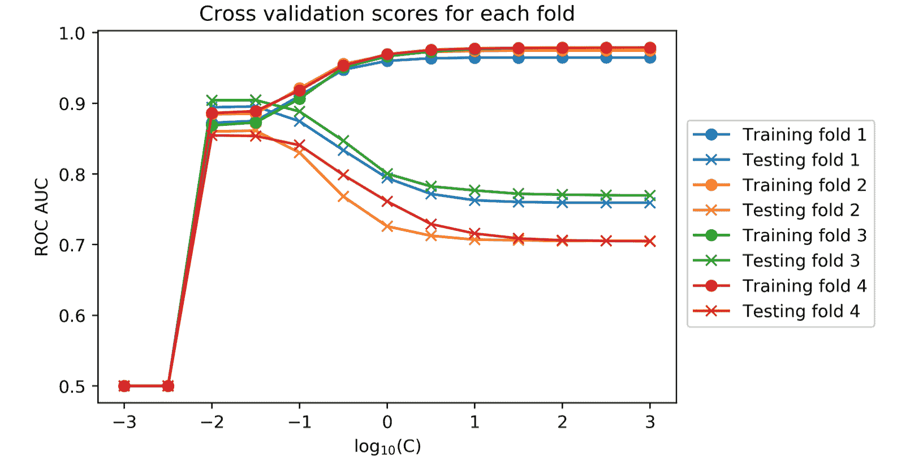

    图 4.20：每一折和 C 值的训练和测试得分

    我们可以看到，对于交叉验证的每一折，随着*C*值的减小，训练性能也在下降。然而，与此同时，测试性能却在增加。对于某些折和*C*的值，测试的 ROC AUC 分数实际上超过了训练数据的分数，而对于其他情况，这两个指标则趋向于接近。在所有情况下，我们可以说，10^-1.5 和 10^-2 的*C*值在测试性能上表现相似，明显高于*C = 10³*的测试性能。因此，似乎正则化成功解决了我们的过拟合问题。

    那么*C*的较低值呢？对于低于 10-2 的值，ROC AUC 指标突然下降到 0.5。正如您所知，这个值意味着分类模型基本上是无用的，性能不比抛硬币好。当探索正则化如何影响系数值时，鼓励您稍后检查这一点；然而，当应用了如此多的 L1 正则化以至于所有模型系数都收缩到 0 时，就会发生这种情况。显然，这样的模型对我们没有用，因为它们不包含关于特征和响应变量之间关系的任何信息。

    查看每个 k 折分割的训练和测试性能有助于了解当模型在新的未见数据上得分时可能预期的模型性能的变化。但为了总结 k 折过程的结果，一个常见的方法是对每个正在考虑的超参数值的性能指标进行折叠平均。我们将在下一步中执行此操作。

1.  使用以下代码绘制每个*C*值的训练和测试 ROC AUC 分数的平均值：

    ```py
    plt.plot(C_val_exponents, np.mean(cv_train_roc_auc, axis=0), \
             '-o', label='Average training score')
    plt.plot(C_val_exponents, np.mean(cv_test_roc_auc, axis=0), \
             '-x', label='Average testing score')
    plt.ylabel('ROC AUC')
    plt.xlabel('log$_{10}$(C)')
    plt.legend()
    plt.title('Cross validation scores averaged over all folds')
    ```

    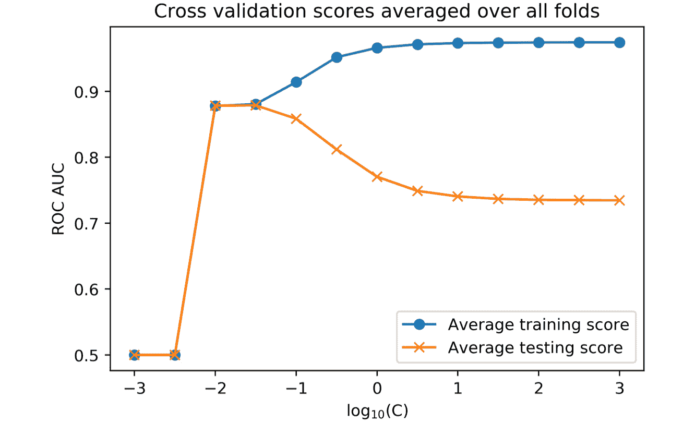

    图 4.21：跨交叉验证折叠的平均训练和测试分数

    从这个图中可以看出，*C = 10*-1.5 和*10*-2 是最佳的*C*值。这里几乎没有过拟合，因为平均训练和测试分数几乎相同。您可以搜索更精细的*C*值网格（即*C = 10*-1.1*、*10*-1.2 等），以更精确地定位*C*值。然而，从我们的图表中，我们可以看到*C = 10*-1.5 或*C = 10*-2 可能是很好的解决方案。我们将继续使用*C = 10*-1.5。

    检查 ROC AUC 的摘要指标是了解模型性能的快速方法。然而，对于任何真实的业务应用程序，您通常需要选择一个特定的阈值，该阈值与特定的真正和假正率相对应。这些将需要使用分类器来做出所需的“是”或“否”决定，在我们的案例研究中，这是关于账户是否会违约的预测。因此，查看交叉验证的不同折叠中的 ROC 曲线是有用的。为了方便起见，前面的函数已经被设计为返回每个测试折叠和*C*值的真正和假正率以及阈值，在`cv_test_roc`列表的列表中。首先，我们需要找到对应于我们选择的*C*值*10*-1.5 的外部列表的索引。

    要实现这一点，我们可以简单地查看我们的*C*值列表并手动计数，但最好通过编程方式找到布尔数组的非零元素的索引来进行操作，如下一步所示。

1.  使用布尔数组找到*C = 10*-1.5 的索引，并使用以下代码将其转换为整数数据类型：

    ```py
    best_C_val_bool = C_val_exponents == -1.5
    best_C_val_bool.astype(int)
    ```

    以下是前面代码的输出：

    ```py
    array([0, 0, 0, 0, 0, 0, 0, 0, 0, 1, 0, 0, 0])
    ```

1.  使用`nonzero`函数将布尔数组的整数版本转换为单个整数索引，代码如下：

    ```py
    best_C_val_ix = np.nonzero(best_C_val_bool.astype(int)) best_C_val_ix[0][0]
    ```

    以下是前面代码的输出：

    ```py
    9
    ```

    我们现在已经成功找到了我们希望使用的*C*值。

1.  访问真正阳性和假阳性率，以绘制每个折叠的 ROC 曲线：

    ```py
    for this_fold in range(k_folds_n_splits):
        fpr = cv_test_roc[best_C_val_ix[0][0]][this_fold][0]
        tpr = cv_test_roc[best_C_val_ix[0][0]][this_fold][1]
        plt.plot(fpr, tpr, label='Fold {}'.format(this_fold+1))
    plt.xlabel('False positive rate')
    plt.ylabel('True positive rate')
    plt.title('ROC curves for each fold at C = $10^{-1.5}$')
    plt.legend()
    ```

    你将得到以下输出：

    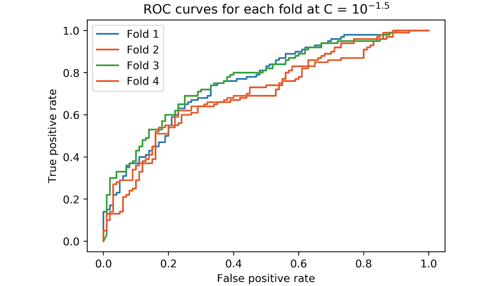

    图 4.22：每个折叠的 ROC 曲线

    看起来 ROC 曲线存在相当大的变异性。例如，如果出于某种原因，我们想将假阳性率限制在 40%，那么从图中可以看出，我们可能能够实现的真正阳性率大约在 60%到 80%之间。你可以通过检查我们绘制的数组来找到精确值。这给你一个关于在新数据上部署模型时，性能波动的预期情况。通常，训练数据越多，交叉验证的折叠之间的变异性就越小，因此这也可能是一个收集更多数据的好主意，尤其是当训练折叠之间的变异性似乎不可接受地高时。你可能还希望尝试使用不同数量的折叠进行此过程，以查看结果变异性对折叠之间的影响。

    虽然通常我们会尝试在我们的合成数据问题上使用其他模型，例如随机森林或支持向量机，但如果我们假设在交叉验证中，逻辑回归证明是最好的模型，我们将决定将其作为最终选择。当最终模型被选定后，可以使用所有训练数据来拟合该模型，使用在交叉验证中选择的超参数。最好在模型拟合时使用尽可能多的数据，因为通常情况下，模型在训练时使用更多的数据效果更好。

1.  在我们的合成问题中，使用所有训练数据训练逻辑回归，并比较训练和测试分数，使用以下步骤所示的保留测试集。

    注意

    这是模型选择过程中的最后一步。只有在你选择好模型和超参数之后，才能使用未见过的测试集，否则它就不再是“未见过”的。

1.  设置*C*值，并使用以下代码在所有训练数据上训练模型：

    ```py
    lr_syn.C = 10**(-1.5)
    lr_syn.fit(X_syn_train, y_syn_train)
    ```

    以下是前面代码的输出：

    ```py
    LogisticRegression(C=0.03162277660168379, penalty='l1', \
                       random_state=1, solver='liblinear'))
    ```

1.  使用以下代码获取训练数据的预测概率和 ROC AUC 分数：

    ```py
    y_syn_train_predict_proba = lr_syn.predict_proba(X_syn_train)
    roc_auc_score(y_syn_train, y_syn_train_predict_proba[:,1])
    ```

    以下是前面代码的输出：

    ```py
    0.8802812499999999
    ```

1.  使用以下代码获取测试数据的预测概率和 ROC AUC 分数：

    ```py
    y_syn_test_predict_proba = lr_syn.predict_proba(X_syn_test)
    roc_auc_score(y_syn_test, y_syn_test_predict_proba[:,1])
    ```

    以下是前面代码的输出：

    ```py
    0.8847884788478848
    ```

    在这里，我们可以看到，通过使用正则化，模型的训练分数和测试分数相似，表明过拟合问题已大大减轻。训练分数较低，因为我们在模型中引入了偏差，牺牲了方差。然而，这没关系，因为最重要的测试分数较高。样本外测试分数才是预测能力的关键。建议您通过打印我们之前绘制的数组中的值，检查这些训练分数和测试分数是否与交叉验证过程中的结果相似；您应该发现它们是相似的。

    注意

    在一个实际项目中，在将这个模型交付给客户用于生产使用之前，您可能希望在所有提供的数据上训练模型，包括未见过的测试集。这遵循了一个想法，即模型看到的数据越多，实际表现可能越好。然而，一些从业者更喜欢只使用经过测试的模型，这意味着您只会交付在训练数据上训练的模型，而不包括测试集。

    我们知道，L1 正则化通过减少逻辑回归系数的大小（即绝对值）来工作。它还可以将一些系数设置为零，从而执行特征选择。在下一步，我们将确定有多少个系数被设置为零。

1.  使用以下代码访问训练模型的系数，并确定有多少个系数不等于零（`!= 0`）：

    ```py
    sum((lr_syn.coef_ != 0)[0])
    ```

    输出应如下所示：

    ```py
    2
    ```

    这段代码对一个布尔数组求和，表示非零系数的位置，因此显示模型中有多少个系数没有被 L1 正则化设置为零。在 200 个特征中，只有 2 个被选择了！

1.  使用以下代码检查截距的值：

    ```py
    lr_syn.intercept_
    ```

    输出应如下所示：

    ```py
    array([0.])
    ```

    这表明截距被正则化为 0。

在这个练习中，我们完成了几个目标。我们使用了 k 折交叉验证过程来调整正则化超参数。我们看到了正则化在减少过拟合方面的强大作用，并且在逻辑回归中的 L1 正则化情况下，还能进行特征选择。

许多机器学习算法提供某种类型的特征选择功能。许多算法还需要调整超参数。这里的函数通过循环超参数并执行交叉验证，提供了一个强大的概念，可以推广到其他模型。Scikit-learn 提供了简化这个过程的功能；特别是，`sklearn.model_selection.GridSearchCV`过程，它对超参数进行网格搜索并应用交叉验证。当需要调整多个超参数时，**网格搜索**非常有帮助，因为它可以查看您指定的不同超参数范围的所有组合。**随机网格搜索**可以通过随机选择较少的组合来加速这一过程，尤其是在全面的网格搜索过于耗时的情况下。一旦您熟悉了这里展示的概念，建议您通过使用像这些方便的函数来简化工作流程。

## Scikit-Learn 中逻辑回归的选项

我们已经使用并讨论了在实例化或调整`LogisticRegression`模型类的超参数时，您可能提供的大部分选项。在这里，我们列出了所有选项，并提供了一些关于它们使用的通用建议：

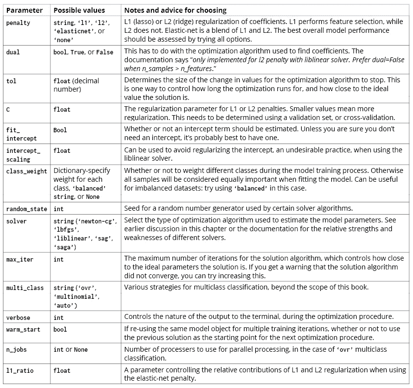

图 4.23：Scikit-learn 中逻辑回归模型的完整选项列表

如果您对使用哪个选项进行逻辑回归感到疑惑，我们建议您参考 scikit-learn 文档以获取进一步的指导（[`scikit-learn.org/stable/modules/linear_model.html#logistic-regression`](https://scikit-learn.org/stable/modules/linear_model.html#logistic-regression)）。一些选项，例如正则化参数*C*，或正则化惩罚的选择，需要通过交叉验证过程来探索。在这里，正如许多数据科学决策一样，没有一种通用的方法适用于所有数据集。查看使用哪些选项最适合给定数据集的最佳方法是尝试其中的几个，并查看哪一个在样本外表现最好。交叉验证为您提供了一种稳健的方式来做到这一点。

## 在 Scikit-Learn 中的缩放数据、管道和交互特征

**缩放数据**

与我们之前处理的合成数据相比，案例研究数据相对较大。如果我们想使用 L1 正则化，那么根据官方文档（[`scikit-learn.org/stable/modules/linear_model.html#logistic-regression`](https://scikit-learn.org/stable/modules/linear_model.html#logistic-regression)），我们应该使用 `saga` 解算器。然而，这个解算器对未缩放的数据集不具备鲁棒性。因此，我们需要确保对数据进行缩放。每当进行正则化时，这也是一个好主意，这样所有特征就处于相同的尺度，并且在正则化过程中会受到同等的惩罚。确保所有特征具有相同尺度的一个简单方法是将它们都通过一个变换过程，即减去最小值并除以最小值到最大值的范围。这将把每个特征转换为使其最小值为 0，最大值为 1。为了实例化一个执行这一过程的 `MinMaxScaler` 缩放器，我们可以使用以下代码：

```py
from sklearn.preprocessing import MinMaxScaler
min_max_sc = MinMaxScaler()
```

**管道**

以前，我们在交叉验证循环中使用了逻辑回归模型。然而，现在我们对数据进行了缩放，新的考虑因素是什么？缩放实际上是通过训练数据的最小值和最大值来“学习”的。之后，逻辑回归模型将基于由模型训练数据的极值缩放过的数据进行训练。然而，我们无法知道新数据（未见数据）的最小值和最大值。因此，按照使交叉验证成为评估未见数据模型性能的有效指标的理念，我们需要在每个交叉验证折叠中使用训练数据的最小值和最大值，以便在该折叠中对测试数据进行缩放，然后再对测试数据进行预测。Scikit-learn 提供了便捷的功能来结合多个训练和测试步骤，以应对这种情况：`Pipeline`。我们的管道将包括两个步骤：缩放器和逻辑回归模型。这两个步骤可以都在训练数据上进行拟合，然后用于对测试数据进行预测。拟合管道的过程在代码中作为一个单一步骤执行，因此从这个角度看，管道的所有部分都是一次性拟合的。以下是如何实例化一个`Pipeline`：

```py
from sklearn.pipeline import Pipeline
scale_lr_pipeline = Pipeline(steps=[('scaler', min_max_sc), \
                                    ('model', lr)])
```

**交互特征**

考虑到案例研究数据，你认为一个包含所有可能特征的逻辑回归模型会过拟合还是欠拟合？你可以从经验法则的角度来考虑，例如“10 法则”，以及我们拥有的特征数（17 个）与样本数（26,664 个）之间的关系。或者，你也可以回顾我们迄今为止在这个数据上所做的所有工作。例如，我们已经有机会对所有特征进行可视化，并确保它们是合理的。由于特征相对较少，并且由于我们通过数据探索工作对它们的质量有较高的信心，我们的情况与本章中使用合成数据的练习不同，后者有大量特征，但我们对其了解较少。因此，可能目前我们的案例研究数据过拟合问题不太明显，正则化的好处可能也不会显著。

实际上，使用仅有的 17 个特征，我们可能会出现欠拟合。应对这种情况的一种策略是进行特征工程。我们讨论过的一些简单特征工程技术包括交互特征和多项式特征。考虑到某些数据的编码方式，多项式特征可能没有意义；例如，*-1*2 = 1*，这对于`PAY_1`可能并不合理。然而，我们可能希望尝试创建交互特征，以捕捉特征之间的关系。`PolynomialFeatures`可以用来仅创建交互特征，而不包括多项式特征。示例代码如下：

```py
make_interactions = PolynomialFeatures(degree=2, \
                                       interaction_only=True, \
                                       include_bias=False)
```

这里，`degree`表示多项式特征的阶数，`interaction_only`是布尔值（将其设置为`True`表示仅创建交互特征），`include_bias`也是布尔值，它会向模型添加截距项（默认值为`False`，这里是正确的，因为逻辑回归模型会自动添加截距）。

## 活动 4.01：使用案例研究数据进行交叉验证和特征工程

在本活动中，我们将应用本章中学到的交叉验证和正则化知识到案例研究数据中。我们将进行基础的特征工程。为了为案例研究数据的正则化逻辑回归模型估计参数，由于该数据集比我们之前使用的合成数据集大，因此我们将使用`saga`求解器。为了使用此求解器，并出于正则化的目的，我们需要使用 scikit-learn 中的`Pipeline`类。完成活动后，你应当能够得到使用交互特征的改进版交叉验证测试表现，具体如下图所示：

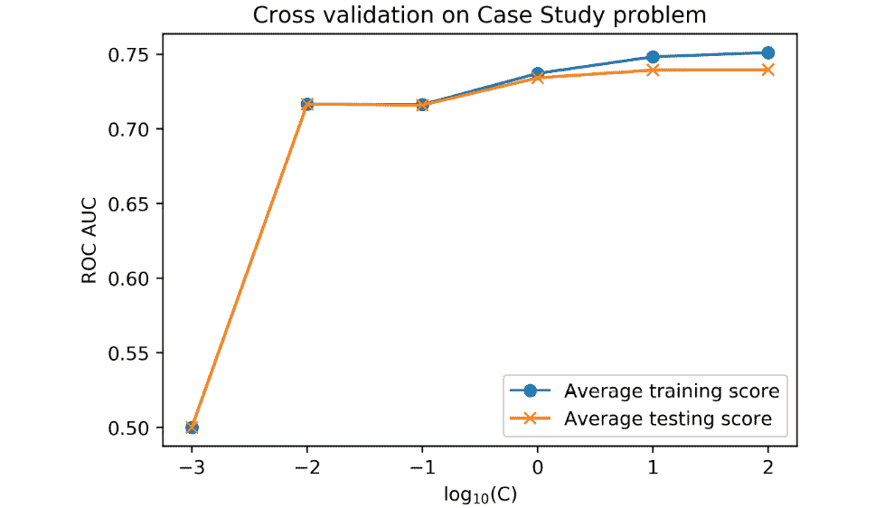

图 4.24：改进的模型测试表现

执行以下步骤以完成活动：

1.  从案例研究数据的数据框中选择特征。

    你可以使用我们在本章中已经创建的特征名称列表，但一定要确保不包括响应变量，因为它是一个非常好的（但完全不适当的）特征！

1.  使用随机种子 24 进行训练/测试集划分。

    我们将继续使用这个并将此测试数据保留为未见过的测试集。通过指定随机种子，我们可以轻松创建包含其他建模方法的独立笔记本，并使用相同的训练数据。

1.  实例化`MinMaxScaler`来缩放数据。

1.  使用`saga`求解器、L1 惩罚并将`max_iter`设置为`1000`来实例化一个逻辑回归模型，因为我们希望求解器有足够的迭代次数来找到一个良好的解。

1.  导入`Pipeline`类，并使用`'scaler'`和`'model'`作为步骤名称，分别创建一个包含缩放器和逻辑回归模型的流水线。

1.  使用`get_params`和`set_params`方法查看每个流水线阶段的参数，并进行更改。

1.  创建一个较小范围的*C*值以进行交叉验证测试，因为这些模型在使用比我们之前练习更多数据时，训练和测试将花费更长时间；我们推荐的*C*值为 *C = [10*2*, 10, 1, 10*-1*, 10*-2*, 10*-3*]。

1.  创建一个新的`cross_val_C_search`函数版本，名为`cross_val_C_search_pipe`。这个函数将不再使用`model`参数，而是接受一个`pipeline`参数。函数内部的更改将是通过在流水线中使用`set_params(model__C = <value you want to test>)`来设置*C*值，替换`fit`和`predict_proba`方法中的模型为流水线，并通过`pipeline.get_params()['model__C']`访问*C*值，以打印状态更新。

1.  像之前的练习一样运行这个函数，但使用新的*C*值范围、你创建的流水线，以及来自案例研究数据训练集的特征和响应变量。

    你可能会看到关于求解器不收敛的警告，可能出现在此处或后续步骤中；你可以尝试使用`tol`或`max_iter`选项来实现收敛，尽管使用`max_iter = 1000`获得的结果可能已经足够。

1.  绘制每个*C*值在各折交叉验证中的平均训练和测试 ROC AUC。

1.  为案例研究数据创建交互特征，并确认新特征的数量是合理的。

1.  重复交叉验证过程，并观察在使用交互特征时模型的表现。

    注意，由于特征数量较多，这将需要更多时间，但可能不超过 10 分钟。那么，交互特征是否改善了平均交叉验证测试性能？正则化有用吗？

    注意

    包含此活动的 Python 代码的 Jupyter notebook 可以在[`packt.link/ohGgX`](https://packt.link/ohGgX)找到。此活动的详细逐步解决方案可以通过此链接查看。

# 总结

在本章中，我们介绍了逻辑回归的最终细节，并继续学习如何使用`scikit-learn`拟合逻辑回归模型。通过了解代价函数的概念，我们对模型拟合过程有了更多的了解，代价函数通过梯度下降过程来最小化，从而在模型拟合过程中估计参数。

我们还通过引入欠拟合和过拟合的概念，了解到正则化的必要性。为了减少过拟合，我们了解了如何调整代价函数，通过 L1 或 L2 惩罚对逻辑回归模型的系数进行正则化。我们使用交叉验证来选择正则化的程度，通过调整正则化超参数来进行选择。为了减少欠拟合，我们还学习了如何通过交互特征进行一些简单的特征工程，来处理案例研究数据。

我们现在已经熟悉了一些机器学习中最重要的概念。到目前为止，我们仅使用了一个非常基础的分类模型：逻辑回归。然而，随着你逐步扩展所掌握的模型工具箱，你会发现过拟合和欠拟合的概念、偏差-方差权衡以及超参数调优将一次又一次地出现。这些概念，以及我们在本章中编写的交叉验证函数的便捷`scikit-learn`实现，将帮助我们在探索更先进的预测方法时提供支持。

在下一章，我们将学习决策树，这是一种完全不同于逻辑回归的预测模型类型，以及基于决策树的随机森林。然而，我们将使用在本章中学到的相同概念——交叉验证和超参数搜索——来调优这些模型。
