# 第五章：5. 决策树与随机森林

概述

在本章中，我们将重点介绍近年来在数据科学中风靡一时的另一类机器学习模型：基于树的模型。在本章中，在单独学习决策树后，你将学习由多棵树组成的模型（即随机森林），它们如何改善单棵树所产生的过拟合问题。读完本章后，你将能够为机器学习训练决策树、可视化训练好的决策树，并训练随机森林并可视化结果。

# 引言

在过去的两章中，我们已经深入理解了逻辑回归的工作原理，并且已经积累了大量使用 Python 中的 scikit-learn 包来创建逻辑回归模型的经验。

在本章中，我们将介绍一种强大的预测模型，这种模型与逻辑回归模型采用完全不同的方法：**决策树**。决策树及其基础上的模型是目前可用于一般机器学习应用的最具表现力的模型之一。使用树状过程进行决策的概念简单明了，因此，决策树模型易于理解。然而，决策树的一个常见批评是它们容易对训练数据过拟合。为了解决这个问题，研究人员开发了**集成方法**，如**随机森林**，通过将多棵决策树结合在一起，协同工作，做出比任何单棵树更好的预测。

我们将看到，决策树和随机森林可以提升案例研究数据的预测建模质量，超越我们目前使用逻辑回归所取得的成果。

# 决策树

**决策树**及其基础上的机器学习模型，特别是**随机森林**和**梯度提升树**，与广义线性模型（GLM），如逻辑回归，是根本不同的模型类型。GLM 源自经典统计学理论，这些理论有着悠久的历史。线性回归背后的数学最初由勒让德和高斯在 19 世纪初提出。因此，正态分布也被称为高斯分布。

相比之下，虽然使用树状过程进行决策的想法相对简单，决策树作为数学模型的流行是在最近才兴起的。我们目前用于制定决策树的数学方法是在 1980 年代发布的。之所以出现这种较新的发展，是因为用于生长决策树的方法依赖于计算能力——即快速处理大量数字的能力。如今我们理所当然地拥有这种能力，但在数学历史上，直到近代才广泛可用。

那么，决策树是什么意思呢？我们可以通过一个实际的例子来说明基本概念。假设你正在考虑是否在某一天外出。你做决定时唯一依赖的信息是天气，特别是阳光是否明媚以及气温有多暖和。如果是晴天，你对凉爽气温的耐受性会提高，只要气温至少为 10°C，你就会外出。

然而，如果是阴天，你需要稍微温暖一些的气温，并且只有当气温达到 15°C 或更高时，你才会外出。你的决策过程可以通过以下树状图表示：

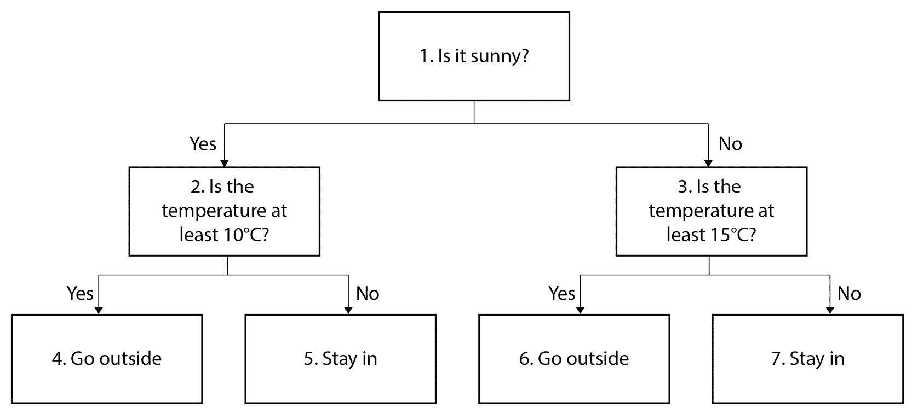

图 5.1：根据天气决定是否外出的决策树

正如你所看到的，决策树具有直观的结构，并模拟了人类可能做出逻辑决策的方式。因此，它们是一个高度**可解释**的数学模型类型，这在某些受众中可能是一个特别理想的特性。例如，数据科学项目的客户可能特别关注如何清晰地理解一个模型是如何工作的。只要其性能足够，决策树是满足这一要求的好方法。

## 决策树术语及其与机器学习的关系

看图中的*图 5.1*，我们可以开始熟悉一些决策树的术语。因为在第一层基于云层条件，第二层基于气温做出决策，所以我们说这棵决策树的**深度**为二。这里，第二层的两个**节点**都是基于气温做出的决策，但在同一层次内，决策的种类可能不同；例如，如果不是晴天，我们也可以根据是否下雨来做决定。

在机器学习的背景下，用于在节点处做决策（换句话说，**分裂**节点）的量是特征。在*图 5.1*中的示例中，特征包括是否晴天的二元分类特征和温度的连续特征。虽然我们在树的给定分支中只展示了每个特征被使用一次，但同一个特征也可以在一个分支中被多次使用。例如，我们可能选择在阳光明媚的日子里，温度至少为 10 °C 时外出，但如果温度超过 40 °C，就不出去了——那太热了！在这种情况下，*图 5.1*中的节点 4 将根据“温度是否大于 40 °C？”这一条件进行分裂，如果答案是“是”，结果是“待在室内”，如果答案是“否”，则结果是“外出”，这意味着温度在 10 °C 到 40 °C 之间。因此，决策树能够捕捉特征的非线性效应，而不是假设温度越高，我们越可能外出的一种线性关系，无论温度有多高。

考虑树通常是如何表示的，例如在*图 5.1*中。分支基于二元决策向下生长，这些二元决策可以将节点分裂成两个子节点。这些二元决策可以被视为“如果，那么”的规则。换句话说，如果某个条件满足，就做这个，否则做别的事情。我们示例树中的决策类似于机器学习中的响应变量的概念。如果我们为信用违约的案例研究问题做一个决策树，决策将会是预测二元响应值，即“此账户违约”或“此账户不违约”。回答二元是/否问题的树被称为**分类树**。然而，决策树非常多功能，也可以用于多类分类和回归问题。

树的最底层节点被称为**叶子**，或叶节点。在我们的示例中，叶子是最终的决策，即是否外出或待在室内。我们的树上有四个叶子，尽管你可以想象，如果树的深度只有一层，其中的决策仅基于云层情况，那么将会有两个叶子；在*图 5.1*中，节点 2 和节点 3 将是叶节点，分别以“外出”和“待在室内”作为决策。

在我们的示例中，每个层次上的每个节点都被分裂了。在严格意义上，这并非必要，因为你可能会选择在任何阳光明媚的日子外出，无论温度如何。在这种情况下，节点 2 将不会被分裂，因此该分支会在第一层次以“是”的决策结束。然而，在阴天的情况下，你的决策可能会涉及温度，这意味着该分支可以扩展到更深的层次。如果每个节点在最终层次之前都被分裂，考虑一下随着层数增加，叶子数量增长的速度。

例如，如果我们将*图 5.1*中的决策树再向下生长一个额外的层级，或许增加一个风速特征，以便考虑四种云层条件和温度的风寒效应会发生什么情况。现在作为叶子的四个节点，编号从四到七的节点*图 5.1*，将会基于每种情况的风速被拆分成两个更多的叶节点。然后，叶节点将变为*4 × 2 = 8*个。一般来说，应该清楚的是，在一个有 n 层的树中，若每个最终层之前的节点都被拆分，那么将会有*2n*个叶节点。考虑到这一点是很重要的，因为**最大深度**是你可以为决策树分类器设置的超参数之一。接下来我们将在以下练习中探讨这一点。

## 练习 5.01：在 Scikit-Learn 中使用决策树

在本练习中，我们将使用案例研究数据来生长一棵决策树，其中我们指定最大深度。我们还将使用一些便捷的功能来可视化决策树，使用的是 `graphviz` 包。请按以下步骤完成练习：

注意

本练习的 Jupyter notebook 可在 [`packt.link/IUt7d`](https://packt.link/IUt7d) 找到。在开始练习之前，请确保你已按照*前言*中的说明设置好环境并导入必要的库。

1.  加载我们一直在使用的几个包，并额外加载一个包 `graphviz`，以便我们可以可视化决策树：

    ```py
    import numpy as np #numerical computation
    import pandas as pd #data wrangling
    import matplotlib.pyplot as plt #plotting package
    #Next line helps with rendering plots
    %matplotlib inline
    import matplotlib as mpl #add'l plotting functionality
    mpl.rcParams['figure.dpi'] = 400 #high res figures
    import graphviz #to visualize decision trees
    ```

1.  加载清理后的案例研究数据：

    ```py
    df = pd.read_csv('../Data/Chapter_1_cleaned_data.csv')
    ```

    注意

    清理后的数据的位置可能因你保存数据的位置而有所不同。

1.  获取数据框的列名列表：

    ```py
    features_response = df.columns.tolist()
    ```

1.  创建一个列出要移除的不是特征或响应变量的列的列表：

    ```py
    items_to_remove = ['ID', 'SEX', 'PAY_2', 'PAY_3',\
                       'PAY_4', 'PAY_5', 'PAY_6',\
                       'EDUCATION_CAT', 'graduate school',\
                       'high school', 'none',\
                       'others', 'university']
    ```

1.  使用列表推导式从我们的特征列表和响应变量中移除这些列名：

    ```py
    features_response = [item for item in features_response if item not in items_to_remove]
    features_response
    ```

    这应该输出特征列表和响应变量：

    ```py
    ['LIMIT_BAL',
     'EDUCATION',
     'MARRIAGE',
     'AGE',
     'PAY_1',
     'BILL_AMT1',
     'BILL_AMT2',
     'BILL_AMT3',
     'BILL_AMT4',
     'BILL_AMT5',
     'BILL_AMT6',
     'PAY_AMT1',
     'PAY_AMT2',
     'PAY_AMT3',
     'PAY_AMT4',
     'PAY_AMT5',
     'PAY_AMT6',
     'default payment next month']
    ```

    现在特征列表已准备好。接下来，我们将从 scikit-learn 导入一些库。我们需要进行训练/测试集拆分，这是我们已经熟悉的操作。我们还需要导入决策树功能。

1.  运行以下代码从 scikit-learn 进行导入：

    ```py
    from sklearn.model_selection import train_test_split
    from sklearn import tree
    ```

    scikit-learn 的 `tree` 库包含与决策树相关的类。

1.  使用我们在全书中使用的相同随机种子，将数据拆分为训练集和测试集：

    ```py
    X_train, X_test, y_train, y_test = \
    train_test_split(df[features_response[:-1]].values,
                     df['default payment next month'].values,
                     test_size=0.2, random_state=24)
    ```

    在这里，我们使用列表中的所有元素（除了最后一个）来获取特征名称，而不是响应变量：`features_response[:-1]`。我们用它从 DataFrame 中选择列，然后使用`.values`方法检索它们的值。我们对响应变量也做类似的操作，但直接指定列名。在进行训练/测试数据划分时，我们使用与之前相同的随机种子以及相同的划分比例。这样，我们可以直接将本章所做的工作与以前的结果进行比较。此外，我们继续保留与模型开发过程中的“未见测试集”相同的数据集。

    现在我们准备实例化决策树类。

1.  通过将`max_depth`参数设置为`2`来实例化决策树类：

    ```py
    dt = tree.DecisionTreeClassifier(max_depth=2)
    ```

    我们使用了`DecisionTreeClassifier`类，因为这是一个分类问题。由于我们指定了`max_depth=2`，当我们使用案例研究数据生长决策树时，树的最大深度将为`2`。现在让我们训练这个模型。

1.  使用以下代码拟合决策树模型并生长树：

    ```py
    dt.fit(X_train, y_train)
    ```

    这应显示以下输出：

    ```py
    DecisionTreeClassifier(max_depth=2)
    ```

    现在我们已经拟合了这个决策树模型，我们可以使用`graphviz`包来显示树的图形表示。

1.  使用以下代码将训练好的模型导出为`graphviz`包可以读取的格式：

    ```py
    dot_data = tree.export_graphviz(dt,
                                    out_file=None,
                                    filled=True,
                                    rounded=True,
                                    feature_names=\
                                    features_response[:-1],
                                    proportion=True,
                                    class_names=[
                                    'Not defaulted', 'Defaulted'])
    ```

    在这里，我们为`.export_graphviz`方法提供了多个选项。首先，我们需要指定要绘制的训练模型，即`dt`。接下来，我们说不需要输出文件：`out_file=None`。相反，我们提供了`dot_data`变量来保存此方法的输出。其余选项设置如下：

    `filled=True`：每个节点将填充颜色。

    `rounded=True`：节点将呈现圆角边缘，而不是矩形。

    `feature_names=features_response[:-1]`：我们列表中的特征名称将被使用，而不是像`X[0]`这样的通用名称。

    `proportion=True`：每个节点中训练样本的比例将显示（我们稍后会进一步讨论）。

    `class_names=['Not defaulted', 'Defaulted']`：每个节点将显示预测类的名称。

    这个方法的输出是什么？

    如果检查`dot_data`的内容，你会发现它是一个长文本字符串。`graphviz`包可以解析这个文本字符串并创建可视化效果。

1.  使用`graphviz`包的`.Source`方法从`dot_data`创建图像并显示它：

    ```py
    graph = graphviz.Source(dot_data) 
    graph
    ```

    输出应如下所示：

    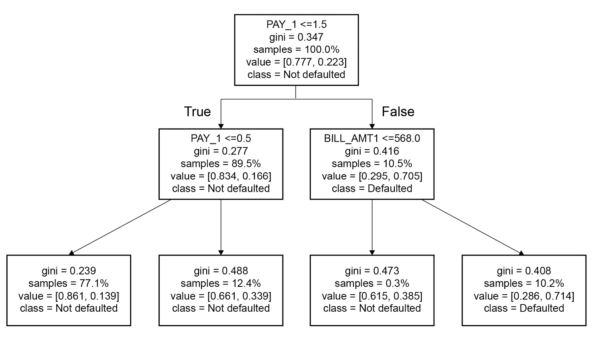

    图 5.2：来自 graphviz 的决策树图

    决策树的图形表示应直接呈现在你的 Jupyter 笔记本中，如*图 5.2*所示。

    注意

    或者，你可以通过为`out_file`关键字参数提供文件路径，将`.export_graphviz`的输出保存到磁盘。例如，要将这个输出文件转换为图像文件，如`.png`文件，以便在演示中使用，你可以在命令行运行以下代码，并根据需要替换文件名：`$ dot -Tpng <exported_file_name> -o <image_file_name_you_want>.png`。

    关于`.export_graphviz`选项的更多细节，你应参考 scikit-learn 文档（[`scikit-learn.org/stable/modules/generated/sklearn.tree.export_graphviz.html`](https://scikit-learn.org/stable/modules/generated/sklearn.tree.export_graphviz.html)）。

    *图 5.2*中的可视化包含了许多有关决策树训练和如何使用它进行预测的信息。我们稍后会更详细地讨论训练过程，但简而言之，训练决策树的过程是从树顶部初始节点的所有训练样本开始，然后根据第一个节点中的`PAY_1 <= 1.5`将这些样本分成两组。

    所有`PAY_1`特征值小于或等于`1.5`的样本将在此布尔条件下表示为`True`。如*图 5.2*所示，这些样本会根据旁边写着`True`的箭头被排序到树的左侧。

    正如你在图表中看到的，每个被拆分的节点包含拆分标准的第一行文本。下一行与`gini`有关，我们稍后会讨论。

    下一行包含每个节点中样本比例的信息。在顶部节点，我们从所有样本（`samples = 100.0%`）开始。第一次拆分后，89.5%的样本被排序到左侧节点，剩余的 10.5%进入右侧节点。这些信息直接显示在可视化中，反映了如何使用训练数据来创建树。让我们通过检查训练数据来确认这一点。

1.  要确认训练样本中`PAY_1`特征小于或等于`1.5`的比例，首先识别该特征在`features_response[:-1]`特征名称列表中的索引：

    ```py
    features_response[:-1].index('PAY_1')
    ```

    这段代码应输出如下内容：

    ```py
    4
    ```

1.  现在，观察训练数据的形状：

    ```py
    X_train.shape
    ```

    这应为你提供以下输出：

    ```py
    (21331, 17)
    ```

    要确认决策树第一次拆分后的样本比例，我们需要知道满足`PAY_1`特征布尔条件的样本比例，这些样本被用于进行此拆分。为此，我们可以使用训练数据中`PAY_1`特征的索引，这对应于特征名称列表中的索引，并使用训练数据中的样本数量，这个数量是我们从`.shape`观察到的行数。

1.  使用此代码确认决策树第一次拆分后的样本比例：

    ```py
    (X_train[:,4] <= 1.5).sum()/X_train.shape[0]
    ```

    输出应如下所示：

    ```py
    0.8946134733486475
    ```

    通过对训练数据中与`PAY_1`特征对应的列应用逻辑条件，然后计算满足该条件的样本数量，再除以样本总数，我们将其转换为比例。我们可以看到，从训练数据直接计算出的比例与*图 5.2*中第一次分裂后的左节点显示的比例相等。

    在第一次分裂之后，第一层中每个节点包含的样本会再次被分裂。随着进一步的分裂，树枝后续层级中任何给定节点的训练数据所占比例会越来越小，这一点可以在*图 5.2*中看到。

    现在我们要解释节点中其余文本行的含义，这些节点出现在*图 5.2*中。以`value`开头的行给出了每个节点中样本的响应变量类别比例。例如，在顶部节点中，我们看到`value = [0.777, 0.223]`。这些只是整体训练集的类别比例，你可以在下一步中验证这些比例。

1.  使用以下代码计算训练集中的类别比例：

    ```py
    y_train.mean()
    ```

    输出应如下所示：

    ```py
    0.223102526838873
    ```

    这等同于在顶部节点中`value`后面那对数字的第二个数；第一个数字就是减去该数字后的结果，换句话说，就是负类训练样本的比例。在每个后续节点中，都会显示该节点中样本的类别比例。类别比例也决定了节点的颜色：负类比例高于正类的节点为橙色，较深的橙色表示比例越高，而正类比例较高的节点则采用类似的蓝色配色方案。

    最后，以`class`开头的行表示如果某个节点是叶节点，决策树如何根据给定的节点进行预测。分类的决策树通过确定样本根据特征值会被划分到哪个叶节点，然后预测该叶节点中大多数训练样本的类别来进行预测。这一策略意味着，树结构和叶节点中的类别比例是做出预测所需的信息。

    例如，如果我们没有进行任何分裂，且只能在不知道其他信息的情况下，仅凭整体训练数据的类别比例做出预测，那么我们将选择多数类别。由于大多数人不会违约，顶部节点的类别为`未违约`。然而，深层节点中的类别比例不同，导致不同的预测。scikit-learn 是如何决定树的结构的呢？我们将在接下来的部分讨论训练过程。

**max_depth 的重要性**

回想一下，在本练习中我们指定的唯一超参数是`max_depth`，也就是在模型训练过程中决策树可以生长的最大深度。事实证明，这是最重要的超参数之一。如果没有对深度进行限制，树将继续生长，直到其他由其他超参数指定的限制起作用。这可能导致非常深的树，并且节点数量非常多。例如，考虑一棵深度为 20 的树，它可能有多少叶节点呢？这将是*220*个叶节点，超过 100 万个！我们甚至有足够的训练样本来将所有这些节点填充吗？在这种情况下，我们没有。显然，使用这些训练数据生长这样的树是不可能的，因为在最终层之前的每个节点都会被分裂。然而，如果我们移除`max_depth`限制并重新运行本练习的模型训练，观察效果：

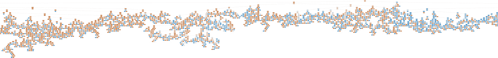

](img/B16392_05_03.jpg)

图 5.3：没有最大深度限制的决策树的一部分

这里展示了一个使用默认选项生成的决策树的一部分，默认选项包括`max_depth=None`，意味着树的深度没有限制。整个树大约是这里展示部分的两倍宽。树的节点非常多，以至于它们只作为非常小的橙色或蓝色斑点出现；每个节点的具体解释并不重要，因为我们只是想说明树的规模可能会非常大。可以清楚地看出，如果没有超参数来控制树的生长过程，可能会生成极其庞大且复杂的树。

## 训练决策树：节点不纯度

到此为止，你应该已经了解了决策树是如何利用特征进行预测的，以及叶节点中训练样本的类别分布。现在，我们将学习决策树是如何训练的。训练过程涉及选择特征来对节点进行分裂，并决定分裂的阈值，例如在前面练习中的树的第一次分裂是`PAY_1 <= 1.5`。从计算角度来看，这意味着每个节点中的样本必须根据每个特征的值进行排序，以考虑分裂，并且在排序后的特征值之间的每对连续值都会被考虑作为潜在的分裂点。所有特征都可以被考虑，或者如我们稍后将要学习的那样，仅考虑一部分特征。

**在训练过程中，如何决定分裂？**

由于预测方法是选择叶节点的多数类，因此我们希望找到主要来自某一类的叶节点；选择多数类将是更准确的预测，节点越接近只包含某一类，其预测越准确。在理想情况下，训练数据可以被划分，使得每个叶节点完全包含正类或完全包含负类样本。然后，我们就可以高信心地认为，一旦新样本被分配到其中一个节点，它将是正类或负类。然而，在实践中，这种情况很少发生，几乎不会发生。然而，这说明了训练决策树的目标——也就是做出分裂，使得分裂后的两个节点具有更高的 **纯度**，换句话说，更接近只包含正类或负类样本。

在实践中，决策树实际上是使用纯度的逆，即 **节点不纯度** 进行训练的。这是衡量节点中训练样本距离完全属于某一类的程度的一个指标，类似于代价函数的概念，表示给定解决方案与理论上完美解决方案的差距。节点不纯度的最直观概念是 **误分类率**。采用广泛使用的符号（例如， [`scikit-learn.org/stable/modules/tree.html`](https://scikit-learn.org/stable/modules/tree.html)）表示每个节点中属于某一类的样本比例，我们可以定义 *p*mk 为第 *m* 个节点中属于第 *k* 类的样本比例。在二分类问题中，只有两类：*k* = 0 和 *k* = 1。对于给定的节点 *m*，误分类率就是该节点中较少见类别的比例，因为当该节点中的多数类作为预测类别时，所有这些样本都会被误分类。

让我们将误分类率可视化，作为开始思考决策树训练方式的一种方法。在程序中，我们使用 NumPy 的 `linspace` 函数考虑负类 *k* = 0 在节点 *m* 中可能的类比例 *p*m0，范围从 0.01 到 0.99：

```py
pm0 = np.linspace(0.01,0.99,99)
pm1 = 1 - pm0
```

然后，这个节点的正类比例是 1 减去 *p*m0：


图 5.4：计算节点 m0 的正类比例的公式

现在，这个节点的误分类率将是 *p*m0 和 *p*m1 之间较小的类比例。我们可以使用 NumPy 的 `minimum` 函数来找到两个形状相同的数组中对应元素的较小值：

```py
misclassification_rate = np.minimum(pm0, pm1)
```

误分类率与负类可能的类比例绘制出来是什么样的？

我们可以使用以下代码绘制这个图：

```py
mpl.rcParams['figure.dpi'] = 400
plt.plot(pm0, misclassification_rate,
         label='Misclassification rate')
plt.xlabel('$p_{m0}$')
plt.legend()
```

你应该得到这个图：

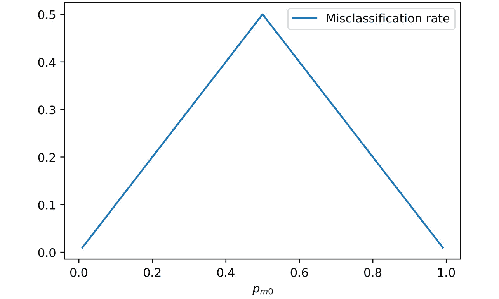

图 5.5：节点的误分类率

现在，很明显，负类的类分数*p*m0 越接近 0 或 1，误分类率就越低。那么在构建决策树时，如何利用这些信息呢？考虑一下可能遵循的过程。

每次在构建决策树时进行节点划分时，都会创建两个新节点。由于这两个新节点的预测值只是多数类，因此一个重要的目标是减少误分类率。因此，我们需要找到一个特征和该特征的一个值作为切分点，使得在所有类别上取平均后，两个新节点的误分类率尽可能低。这与实际训练决策树时使用的过程非常接近。

继续讨论最小化误分类率的思路，决策树训练算法通过考虑所有特征进行节点划分，尽管如果你将`max_features`超参数设置为少于特征总数的值，算法可能只会考虑一个随机选择的特征子集。稍后我们将讨论为什么要这么做。在任何情况下，算法会考虑每个候选特征的所有可能阈值，并选择那个能使得不纯度最低的阈值，不纯度的计算方式是通过加权每个节点的样本数量，计算两个新节点的平均不纯度。节点划分过程如*图 5.6*所示。该过程会一直重复，直到树的停止准则（如`max_depth`）达到：


图 5.6：如何选择特征和阈值来划分节点

虽然误分类率是一个直观的衡量不纯度的指标，但实际上还有更好的指标可以用来在模型训练过程中找到最佳分裂。scikit-learn 提供了两种可供选择的计算不纯度的方法，你可以通过`criterion`关键字参数来指定，分别是**基尼不纯度**和**交叉熵**。在这里，我们将从数学上描述这些方法，并展示它们与误分类率的比较。

基尼不纯度通过以下公式计算节点*m*的不纯度：


图 5.7：计算基尼不纯度的公式

在这里，求和是对所有类别进行的。在二分类问题中，只有两个类别，我们可以像下面这样编写程序：

```py
gini = (pm0*(1-pm0)) + (pm1*(1-pm1))
```

交叉熵通过以下公式计算：


图 5.8：计算交叉熵的公式

使用这段代码，我们可以计算交叉熵：

```py
cross_ent = -1*((pm0*np.log(pm0)) + (pm1*np.log(pm1)))
```

为了将 Gini 不纯度和交叉熵添加到我们的误分类率图中并查看它们的比较，我们只需要在绘制误分类率后添加以下代码行：

```py
mpl.rcParams['figure.dpi'] = 400
plt.plot(pm0, misclassification_rate,\
         label='Misclassification rate')
plt.plot(pm0, gini, label='Gini impurity')
plt.plot(pm0, cross_ent, label='Cross entropy')
plt.xlabel('$p_{m0}$')
plt.legend()
```

最终的图形应如下所示：

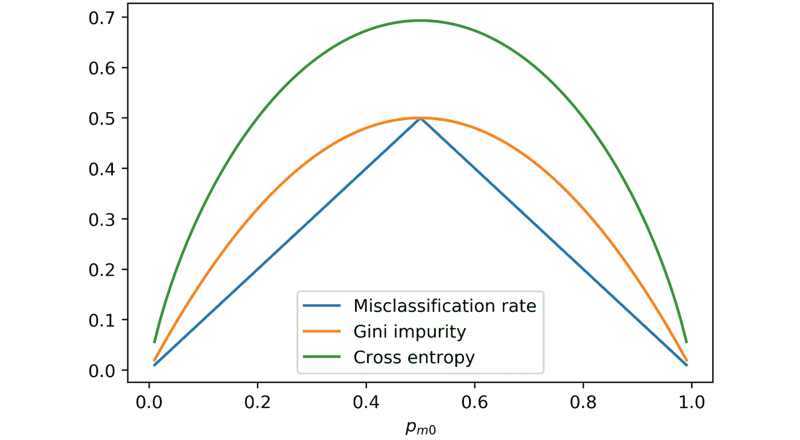

图 5.9：误分类率、Gini 不纯度和交叉熵

注意

如果你正在阅读本书的纸质版，你可以通过访问以下链接下载并浏览本章中某些图像的彩色版本：

[`packt.link/mQ4Xn`](https://packt.link/mQ4Xn)

与误分类率类似，Gini 不纯度和交叉熵在类别比例为 0.5 时最大，随着节点变得更加纯净——换句话说，当它们包含的类别比例更高时——它们会逐渐降低。然而，Gini 不纯度在某些类别比例区域比误分类率变化得更陡峭，这使得它能够更有效地找到最佳分裂点。交叉熵看起来变化得更加陡峭。那么，哪一个更适合你的工作呢？这是一个在所有数据集上都没有明确答案的问题。你应该在交叉验证超参数的过程中同时考虑这两种不纯度度量，以确定最合适的一个。需要注意的是，在 scikit-learn 中，Gini 不纯度可以通过 `criterion` 参数使用 `'gini'` 字符串来指定，而交叉熵则简单地称为 `'entropy'`。

## 用于第一次分裂的特征：与单变量特征选择和交互的关系

我们可以根据*图 5.2*所示的小树开始了解不同特征对决策树模型的重要性。注意，`PAY_1`是第一次分裂时选择的特征。这意味着它是在减少包含所有训练样本的节点不纯度方面表现最好的特征。回想我们在*第三章*“逻辑回归和特征探索的细节”中的单变量特征选择经验，其中`PAY_1`是通过 F 检验选出的最佳特征。因此，考虑到我们之前的分析，`PAY_1`出现在决策树的第一次分裂中是合理的。

在树的第二层，`PAY_1`上有另一个分裂，同时也有在`BILL_AMT_1`上的分裂。`BILL_AMT_1`在单变量特征选择中并没有列为重要特征。然而，可能是`BILL_AMT_1`与`PAY_1`之间存在一个重要的交互作用，而这种交互作用在单变量方法中无法发现。特别是，从决策树选择的分裂来看，似乎那些`PAY_1`值为 2 或更大的账户，并且`BILL_AMT_1`大于 568 的账户，尤其容易违约。`PAY_1`和`BILL_AMT_1`的这种组合效应是一种交互作用，这也可能是我们通过在前一章的活动中包含交互项来改善逻辑回归性能的原因。

## 训练决策树：一种贪婪算法

没有保证通过前述过程训练得到的决策树是找到最低不纯度叶节点的最佳决策树。这是因为训练决策树所使用的算法是一种所谓的贪婪算法。在这种情况下，这意味着在每次分裂节点的机会中，算法都会寻找当前时刻最佳的分裂，而不会考虑后续分裂机会受到影响的事实。

例如，考虑以下假设场景：案例研究的训练数据的最佳初始分裂涉及`PAY_1`，正如我们在*图 5.2*中所看到的。但是，如果我们改为在`BILL_AMT_1`上进行分裂，然后在下一级做`PAY_1`的后续分裂呢？即使初始在`BILL_AMT_1`上的分裂不是最优的，最终结果可能会更好，如果树是这样生长的。如果存在这样的解决方案，算法是无法找到的，因为它只考虑每个节点的最佳分裂，而不考虑未来可能的分裂。

我们仍然使用贪心的树生长算法的原因是，考虑所有可能的分裂方式需要的时间相当长，这样才能找到真正最优的树。尽管决策树训练过程中有这一缺陷，但仍然有方法可以减少贪心算法可能带来的不利影响。你可以将`splitter`关键字参数设置为`random`，以便在每个节点选择一个随机特征进行分裂，而不是寻找最优的分裂。默认值是`best`，它会搜索所有特征以找到最佳分裂。另一个我们已经讨论过的选项是，通过`max_features`关键字限制在每次分裂时将搜索的特征数量。最后，你还可以使用决策树的集成方法，如随机森林，我们稍后会介绍。请注意，所有这些选项除了可能避免贪心算法的副作用外，也是解决决策树常被批评的过拟合问题的选项。

## 训练决策树：不同的停止标准与其他选项

我们已经回顾了使用`max_depth`参数来限制树的生长深度。然而，scikit-learn 中还有几个其他可选项。这些选项主要与叶子节点中样本的数量相关，或者进一步分裂节点时如何减少不纯度。如前所述，树的生长深度可能会受到数据集大小的限制。如果分裂过程不再找到具有显著更高纯度的节点，那么继续加深树的深度可能没有意义。

我们在这里总结了你可以提供给`DecisionTreeClassifier`类的所有关键字参数，适用于 scikit-learn：

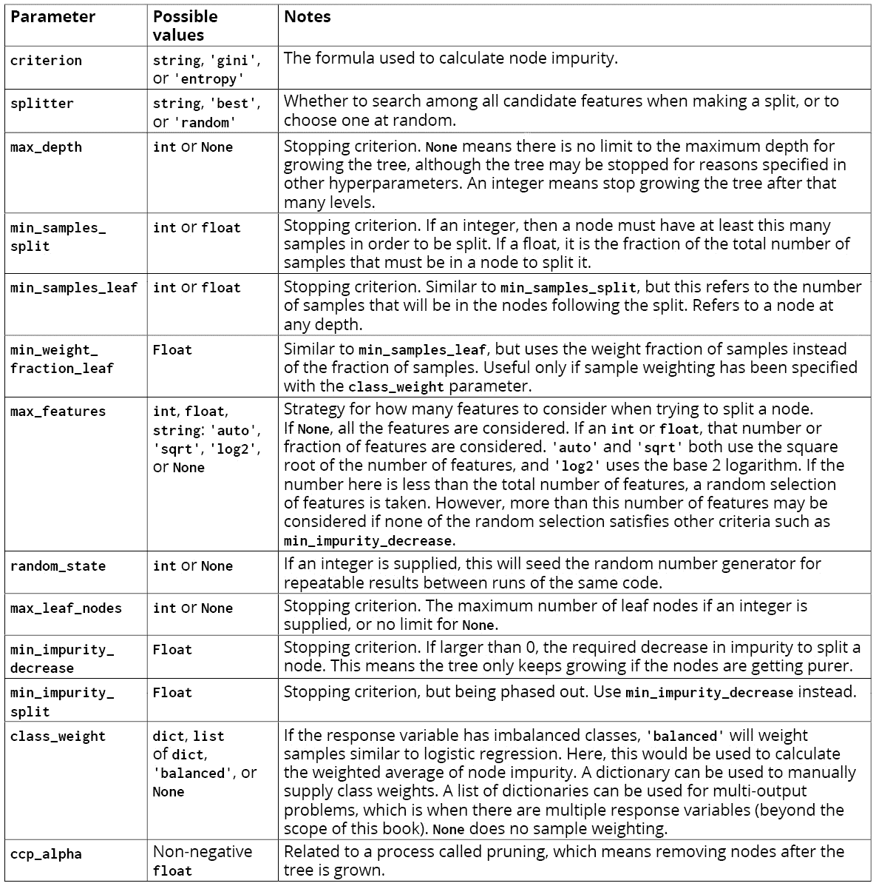

图 5.10：scikit-learn 中决策树分类器的完整选项列表

## 使用决策树：优势与预测概率

尽管决策树在概念上很简单，但它们具有多个实际优势。

**无需缩放特征**

考虑我们为什么需要对特征进行缩放以应用逻辑回归。一个原因是，对于一些基于梯度下降的解决算法，特征必须在相同的尺度上，以便快速找到成本函数的最小值。另一个原因是，当我们使用 L1 或 L2 正则化来惩罚系数时，所有特征必须在相同的尺度上，这样才能均等地对它们进行惩罚。而对于决策树，节点分裂算法会单独考虑每个特征，因此特征是否在相同尺度上并不重要。

**非线性关系与交互作用**

因为决策树中的每个后续分裂都是在先前分裂产生的训练样本子集上进行的，所以决策树能够描述单个特征的复杂非线性关系，以及特征之间的交互作用。回想我们之前在*首次分裂所使用的特征：与单变量特征选择和交互作用的关联*部分中的讨论。另外，作为一个假设的例子，考虑以下分类的合成数据集：

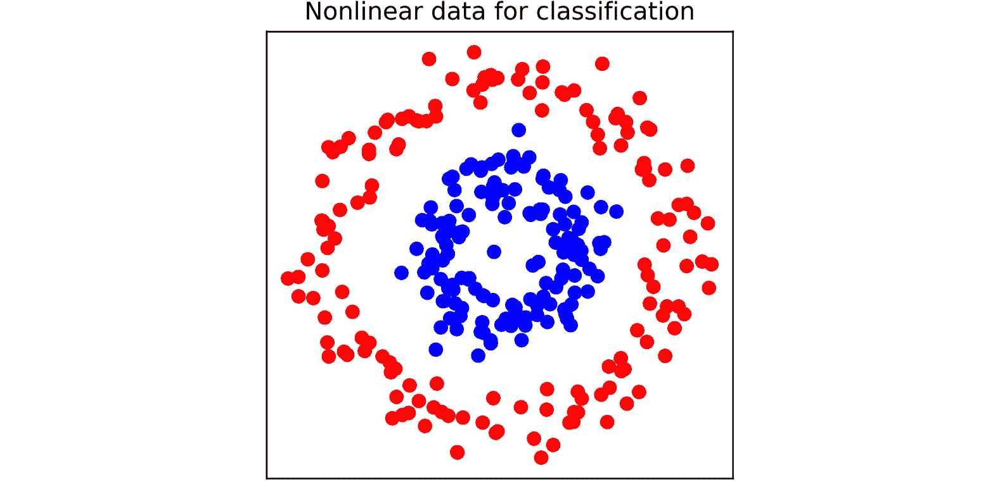

图 5.11：一个示例分类数据集，类别以红色和蓝色显示（如果是黑白阅读，请参阅 GitHub 仓库获取该图的彩色版本；蓝色点位于内圆圈内）

我们从*第三章*，*逻辑回归和特征探索的详细信息*中了解到，逻辑回归具有线性决策边界。那么，你认为逻辑回归如何处理像*图 5.11*中展示的数据集呢？你会在哪里画一条线来分隔蓝色和红色类别？应该很明显，在没有额外工程特征的情况下，逻辑回归不太可能是这个数据的好分类器。现在想一想决策树的“如果，那么”的规则，它可以与*图 5.11*中*X*和*Y*轴上表示的特征一起使用。你认为决策树对这组数据有效吗？

在这里，我们在背景中绘制了这两个模型的类别成员预测概率，使用红色和蓝色表示：

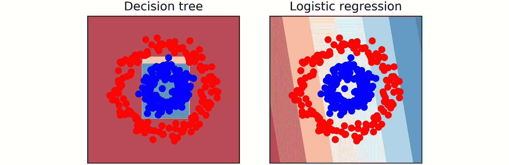

图 5.12：决策树和逻辑回归预测

在*图 5.12*中，两个模型的预测概率已经上色，深红色表示红色类别的较高预测概率，深蓝色表示蓝色类别的较高预测概率。我们可以看到，决策树能够将蓝色类别从红色点的中间圈分隔出来。这是因为，通过在节点分裂过程中使用*X*和*Y*坐标的阈值，决策树可以在数学上模拟蓝色和红色类别的位置依赖于*X*和*Y*坐标（交互作用），并且每个类别的可能性不是*X*或*Y*的线性增减函数（非线性）。因此，决策树方法能够正确分类大多数数据。

注意

生成*图 5.11*和*图 5.12*的代码可以在参考笔记本中找到：[`packt.link/9W4WN`](https://packt.link/9W4WN)。

然而，逻辑回归具有线性决策边界，这将是背景中最浅蓝色和红色区域之间的直线。逻辑回归的决策边界穿过数据的中间，并未提供一个有效的分类器。这展示了决策树“开箱即用”的强大功能，而无需工程化非线性或交互特征。

**预测概率**

我们知道逻辑回归输出的是概率。然而，决策树是根据叶节点中的多数类来做出预测的。那么，像*图 5.12*中所示的预测概率从哪里来呢？实际上，决策树在 scikit-learn 中确实提供了`.predict_proba`方法来计算预测概率。该概率基于用于给定预测的叶节点中多数类的比例。例如，如果一个叶节点中 75%的样本属于正类，那么该节点的预测将是正类，预测的概率将是 0.75。来自决策树的预测概率在统计上不如广义线性模型的预测概率严谨，但它们仍然被广泛用于通过变化分类阈值来衡量模型性能的方法，如 ROC 曲线或精确度-召回曲线。

注意

在这里，我们专注于分类决策树，因为案例研究的性质。然而，决策树也可以用于回归，这使它成为一种多功能的方法。决策树的生长过程对于回归和分类是类似的，唯一的区别是，回归树不是寻求减少节点的不纯度，而是寻求最小化其他指标，如**均方误差**（**MSE**）或**平均绝对误差**（**MAE**），其中节点的预测可能是该节点中样本的平均值或中位数。

## 更便捷的交叉验证方法

在*第四章*，*偏差-方差权衡*中，我们通过编写自己的函数来进行交叉验证，深入理解了交叉验证的概念，使用`KFold`类来生成训练和测试索引。这对于全面理解这个过程如何工作非常有帮助。然而，scikit-learn 提供了一个便捷的类，可以为我们做更多繁重的工作：`GridSearchCV`。`GridSearchCV`可以作为输入，接受我们想要寻找最优超参数的模型，如决策树或逻辑回归，以及我们希望进行交叉验证的超参数“网格”。例如，在逻辑回归中，我们可能希望获得不同正则化参数**C**值下，所有折叠的平均交叉验证得分。在决策树中，我们可能希望探索不同的树深度。

你也可以一次性搜索多个参数，例如，如果我们想尝试不同的树深度和不同数量的`max_features`来考虑每个节点的分裂。

`GridSearchCV`执行的是所谓的“穷举式网格搜索”，遍历我们提供的所有可能的参数组合。这意味着，如果我们为每个超参数提供五个不同的值，那么交叉验证过程将运行 5 x 5 = 25 次。如果你在搜索许多超参数的多个值时，交叉验证的运行次数会迅速增加。在这种情况下，你可能会想使用`RandomizedSearchCV`，它会从你提供的网格中搜索超参数组合的一个随机子集。 

`GridSearchCV`通过简化交叉验证过程，可以加速你的工作。你应该已经了解了前一章中交叉验证的概念，因此我们直接列出`GridSearchCV`可用的所有选项。

在接下来的练习中，我们将通过实际操作使用`GridSearchCV`，结合案例研究数据，来搜索决策树分类器的超参数。以下是`GridSearchCV`的选项：

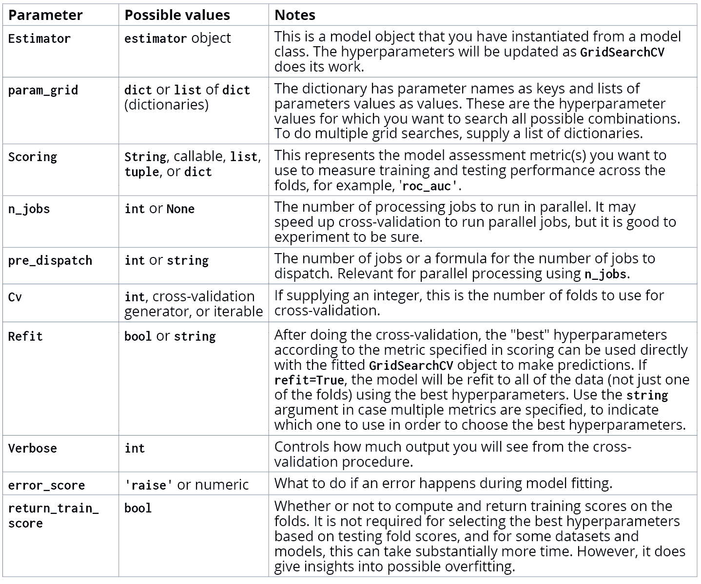

图 5.13：GridSearchCV 的选项

在接下来的练习中，我们将利用**均值的标准误差**来创建误差条。我们将对模型性能指标在测试折中的平均值进行计算，误差条将帮助我们可视化模型性能在各个折中的变化程度。

平均值的标准误差也被称为样本均值的抽样分布的标准差。这个名字很长，但概念并不复杂。其背后的思想是，我们希望为模型性能度量创建误差条的总体，代表了从一个理论上较大的类似样本群体中抽取样本的一种可能方式，例如如果有更多数据可用并用它进行更多的测试折叠。如果我们能从较大的总体中进行反复抽样，每次抽样事件会导致略微不同的均值（样本均值）。通过反复抽样事件构建这些均值的分布（样本均值的抽样分布）可以让我们知道这个抽样分布的方差，这将作为样本均值的不确定性度量。事实证明，这个方差（我们称之为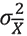，其中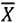表示这是样本均值的方差）取决于我们样本中的观察次数（n）：它与样本大小成反比，但也与更大、未观察的总体方差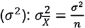成正比。如果您在处理样本均值的标准差，简单地对两边取平方根：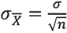。虽然我们不知道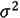的真实值，因为我们无法观察到理论总体，但我们可以通过观察到的测试折叠的总体方差来估计它。

这是统计学中的一个关键概念，称为**中心极限定理**。

## 练习 5.02：为决策树寻找最优超参数

在本练习中，我们将使用`GridSearchCV`来调优决策树模型的超参数。您将学习一种使用 scikit-learn 搜索不同超参数的便捷方法。请执行以下步骤来完成练习：

注意

在开始本练习之前，您需要导入必要的包并加载已清理的数据框。您可以参考以下 Jupyter notebook 来了解前提步骤：[`packt.link/SKuoB`](https://packt.link/SKuoB)。

1.  使用以下代码导入`GridSearchCV`类：

    ```py
    from sklearn.model_selection import GridSearchCV
    ```

    下一步是定义我们希望使用交叉验证进行搜索的超参数。我们将通过`max_depth`参数找到树的最佳最大深度。深度较大的树会有更多的节点分裂，这些分裂使用特征将训练集划分为越来越小的子空间。虽然我们无法预先知道最佳的最大深度，但在考虑用于网格搜索的参数范围时，考虑一些极限情况是有帮助的。

    我们知道，1 是最小深度，由只有一个分割的树构成。至于最大深度，你可以考虑你的训练数据中有多少个样本，或者更适当地，在这种情况下，考虑交叉验证每次分割时，训练折叠中有多少个样本。我们将像上一章一样执行 4 折交叉验证。那么，每个训练折叠中将有多少样本，这与树的深度有什么关系？

1.  使用以下代码查找训练数据中的样本数量：

    ```py
    X_train.shape
    ```

    输出应如下所示：

    ```py
    (21331, 17)
    ```

    在 21,331 个训练样本和 4 折交叉验证的情况下，每个训练折叠中将有三分之四的样本，即大约 16,000 个样本。

    `max_depth` 超参数。我们将探索从 1 到 12 的深度范围。

1.  定义一个字典，键为超参数名称，值为我们想要在交叉验证中搜索的该超参数的值列表：

    ```py
    params = {'max_depth':[1, 2, 4, 6, 8, 10, 12]}
    ```

    在这种情况下，我们只搜索一个超参数。然而，你可以定义一个字典，包含多个键值对，来同时搜索多个超参数。

1.  如果你在一个笔记本中运行本章的所有练习，可以重用之前的决策树对象`dt`。如果没有，你需要为超参数搜索创建一个决策树对象：

    ```py
    dt = tree.DecisionTreeClassifier()
    ```

    现在我们想要实例化`GridSearchCV`类。

1.  使用这些选项实例化`GridSearchCV`类：

    ```py
    cv = GridSearchCV(dt, param_grid=params, scoring='roc_auc',
                      n_jobs=None, refit=True, cv=4, verbose=1,
                      pre_dispatch=None, error_score=np.nan,
                      return_train_score=True)
    ```

    请注意，我们使用的是 ROC AUC 指标（`scoring='roc_auc'`），进行 4 折交叉验证（`cv=4`），并计算训练分数（`return_train_score=True`）来评估偏差-方差权衡。

    一旦交叉验证对象被定义，我们可以像使用模型对象一样，简单地对其使用`.fit`方法。这基本上封装了我们在上一章中编写的交叉验证循环的所有功能。

1.  使用以下代码执行 4 折交叉验证，搜索最优的最大深度：

    ```py
    cv.fit(X_train, y_train)
    ```

    输出应如下所示：

    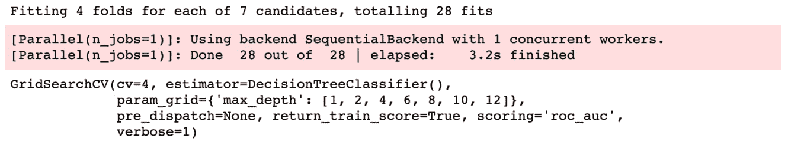

    图 5.14：交叉验证拟合输出

    我们指定的所有选项都会作为输出打印出来。此外，还有一些关于执行了多少次交叉验证拟合的输出信息。我们有 4 个折叠和 7 个超参数，意味着执行了 4 x 7 = 28 次拟合。还显示了这所花费的时间。你可以通过`verbose`关键字参数控制从该过程中获得的输出量；较大的数字意味着更多的输出。

    现在是时候查看交叉验证过程的结果了。在已拟合的 `GridSearchCV` 对象上，有一个方法是 `.cv_results_`。这是一个字典，字典的键是结果的名称，值是结果本身。例如，`mean_test_score` 键包含了每个超参数的平均测试得分。你可以通过在代码单元中运行 `cv.cv_results_` 来直接查看这个输出。然而，这样查看输出不太方便。具有这种结构的字典可以直接用于创建 pandas DataFrame，这样查看结果会稍微容易一些。

1.  运行以下代码来创建并查看一个 pandas DataFrame，该 DataFrame 显示了交叉验证的结果：

    ```py
    cv_results_df = pd.DataFrame(cv.cv_results_)
    cv_results_df
    ```

    输出应如下所示：

    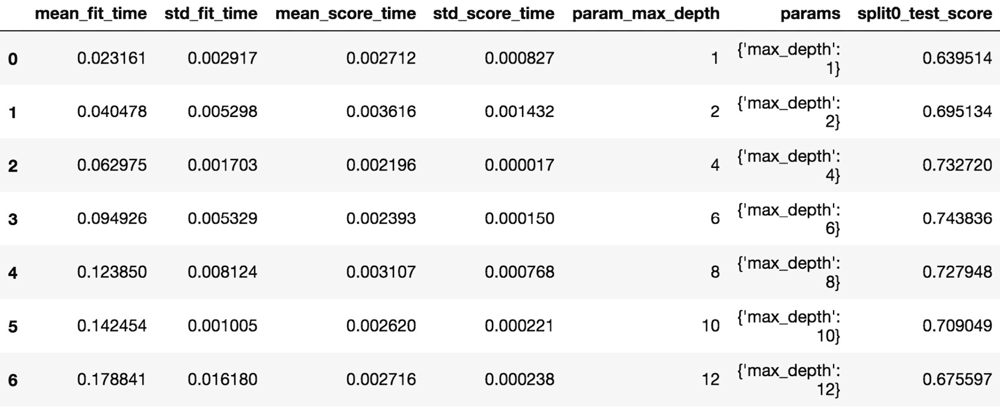

    ](img/B16392_05_15.jpg)

    图 5.15：交叉验证结果 DataFrame 的前几列

    DataFrame 中每一行代表网格中每一组超参数的组合。由于我们这里只搜索一个超参数，因此每一行代表我们搜索的七个值之一。你可以看到每一行的输出信息，包括每一折训练（拟合）和测试（评分）所用时间的均值和标准差，单位为秒。搜索的超参数值也会显示出来。在*图 5.16*中，我们可以看到第一折（索引 0）的测试数据的 ROC AUC 分数。那么结果 DataFrame 中其余的列包含了什么内容呢？

1.  使用以下代码查看结果 DataFrame 中剩余列的名称：

    ```py
    cv_results_df.columns
    ```

    输出应如下所示：

    ```py
    Index(['mean_fit_time', 'std_fit_time',\
           'mean_score_time', 'std_score_time',\
           'param_max_depth', 'params',\
           'split0_test_score', 'split1_test_score',\
           'split2_test_score', 'split3_test_score',\
           'mean_test_score', 'std_test_score',\
           'rank_test_score', 'split0_train_score',\
           'split1_train_score', 'split2_train_score',\
           'split3_train_score', 'mean_train_score',\
           'std_train_score'],
          dtype='object')
    ```

    交叉验证结果 DataFrame 中的列包括每一折的测试得分、它们的平均值和标准差，以及训练得分的相同信息。

    一般来说，“最佳”超参数组合是具有最高平均测试得分的组合。这是对使用这些超参数拟合的模型，在新数据上评分时可能表现如何的估计。我们绘制一张图，展示平均测试得分如何随 `max_depth` 超参数变化。我们还将在同一张图上展示平均训练得分，以查看随着我们允许在模型拟合过程中生长更深、更复杂的树，偏差和方差是如何变化的。

    我们将 4 折的训练和测试得分的标准误差作为误差条，使用 Matplotlib 的 `errorbar` 函数。这将显示得分在各折之间的变异情况。

1.  执行以下代码，创建一个关于每个 `max_depth` 值的训练和测试得分的误差条图，这些值是在交叉验证中进行检查的：

    ```py
    ax = plt.axes()
    ax.errorbar(cv_results_df['param_max_depth'],
                cv_results_df['mean_train_score'],
                yerr=cv_results_df['std_train_score']/np.sqrt(4),
                label='Mean $\pm$ 1 SE training scores')
    ax.errorbar(cv_results_df['param_max_depth'],
                cv_results_df['mean_test_score'],
                yerr=cv_results_df['std_test_score']/np.sqrt(4),
                label='Mean $\pm$ 1 SE testing scores')
    ax.legend()
    plt.xlabel('max_depth')
    plt.ylabel('ROC AUC')
    ```

    该图应如下所示：

    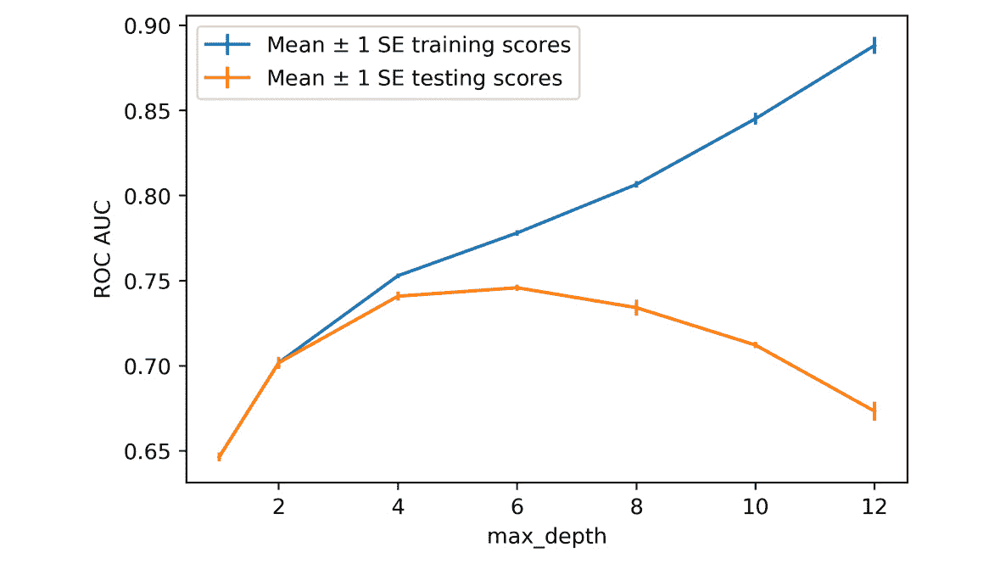

    ](img/B16392_05_15.jpg)

图 5.16：跨四折的训练和测试得分的误差条图

请注意，标准误差是通过标准差除以折叠数量的平方根来计算的。训练和测试评分的标准误差以垂直线的形式显示在每个尝试过的`max_depth`值处；平均分数上下的距离表示 1 个标准误差。在制作误差条图时，最好确保误差测量的单位与*y*轴的单位相同。在本例中，它们是相同的，因为标准误差的单位与底层数据相同，而不是像方差那样的平方单位。

错误条表示评分在不同折叠之间的变动情况。如果各个折叠之间的变异性很大，这表明数据在不同折叠之间的性质存在差异，从而影响了我们模型的拟合能力。这可能是个问题，因为这意味着我们可能没有足够的数据来训练一个能在新数据上稳定表现的模型。然而，在我们这里，折叠之间的变异性并不大，因此这不是问题。

那么，不同`max_depth`值下训练和测试评分的总体趋势如何呢？我们可以看到，随着树的深度越来越大，模型对训练数据的拟合越来越好。如前所述，如果我们把树长得足够深，使得每个叶节点只有一个训练样本，我们将会创建一个非常针对训练数据的模型。事实上，它将完美地拟合训练数据。我们可以说，这样的模型具有极高的**方差**。

但是，训练集上的表现不一定会转化到测试集上。在*图 5.16*中，我们可以明显看到，增加`max_depth`只会在某个点之前提高测试评分，而超过该点后，树的深度增加反而导致测试表现下降。这是另一个例子，说明我们如何利用**偏差-方差权衡**来创建更好的预测模型——类似于我们使用正则化的逻辑回归。较浅的树具有更高的**偏差**，因为它们无法很好地拟合训练数据。但这是可以接受的，因为如果我们接受一定的偏差，我们将在测试数据上获得更好的表现，而测试数据才是我们最终关心的指标。

在这种情况下，我们选择`max_depth` = 6。你也可以通过尝试 2 到 12 之间的每个整数来进行更彻底的搜索，而不是像我们这里那样每次跳 2 个值。一般来说，最好尽可能深入地探索参数空间，直到你有的计算时间为止。在本例中，这将导致相同的结果。

**模型比较**

到目前为止，我们已经对案例研究数据进行了几种不同机器学习模型的 4 折交叉验证。那么，我们的表现如何呢？到目前为止，我们的最佳表现是什么？在上一章中，我们使用逻辑回归得到了平均测试 ROC AUC 为 0.718，通过在逻辑回归中工程化交互特征得到了 0.740。而在这里，使用决策树，我们可以达到 0.745。所以，我们在模型性能上有所提升。现在，让我们探索另一种基于决策树的模型，看看是否能够进一步提高性能。

# 随机森林：决策树的集成

正如我们在前面的练习中看到的，决策树容易出现过拟合问题。这是它们使用的主要批评之一，尽管它们具有高度的可解释性。然而，我们通过限制树的最大深度，能够在一定程度上限制这种过拟合。

基于决策树的概念，机器学习研究人员利用多棵树作为更复杂过程的基础，最终形成了一些最强大且最广泛使用的预测模型。在本章中，我们将重点介绍决策树的随机森林。随机森林是所谓的集成模型的例子，因为它们是通过组合其他更简单的模型形成的。通过结合多个模型的预测，可以改善任何给定模型的缺陷。这有时被称为将多个弱学习者结合成一个强学习者。

一旦你理解了决策树，随机森林背后的概念就非常简单。那是因为随机森林只是许多决策树的集成；这种集成中的所有模型都具有相同的数学形式。那么，一个随机森林中会包括多少个决策树模型呢？这是构建随机森林模型时需要指定的超参数之一，`n_estimators`。一般来说，树木越多越好。随着树木数量的增加，整个集成的方差将减少。这应该导致随机森林模型对新数据的泛化能力更强，反映在测试分数的提高上。然而，在某个点之后，增加树木的数量将不再显著提高模型的性能。

那么，随机森林是如何减少影响决策树的高方差（过拟合）问题的呢？这个问题的答案在于森林中不同树的不同之处。树之间的差异主要有两种方式，其中一种我们已经熟悉：

+   每次划分时考虑的特征数量

+   用于生长不同树的训练样本

**每次划分时考虑的特征数量**

我们已经熟悉了`DecisionTreeClassifier`类中的这个选项：`max_features`。在之前使用该类时，我们将`max_features`保持在默认值`None`，这意味着每次分割时会考虑所有特征。通过使用所有特征来拟合训练数据，可能会导致过拟合。通过限制每次分割时考虑的特征数量，随机森林中的某些决策树可能会找到更好的分割点。这是因为，尽管它们仍在贪心地寻找最佳分割，但它们是在有限的特征选择下进行的。这可能会使得某些分割在树的后续部分变得可能，而如果在每次分割时都搜索所有特征，可能就无法找到这些分割点。

在 scikit-learn 中的`RandomForestClassifier`类中有一个`max_features`选项，就像在`DecisionTreeClassifier`类中一样，这两个选项是类似的。然而，对于随机森林，默认设置是`'auto'`，这意味着算法每次分割时只会搜索可能特征数量的平方根的随机选择。例如，从总共有 9 个可能特征中，随机选择√9 = 3 个特征。由于森林中的每棵树在生长过程中可能会选择不同的特征随机分割，因此森林中的树木不会完全相同。

**用于生成不同树木的样本**

随机森林中的树木彼此之间的另一种区别是它们通常使用不同的训练样本进行生长。为此，需要使用一种叫做自助抽样（bootstrapping）的统计方法，这意味着从原始数据中生成新的合成数据集。合成数据集通过从原始数据集中随机选择样本来创建，并允许重复选择。这里的“重复选择”意味着，如果我们选择了某个样本，我们将继续考虑该样本用于选择，也就是说，它在被采样后会被“替换”到原始数据集中。合成数据集中的样本数量与原始数据集中的样本数量相同，但由于替换机制，一些样本可能会重复，而另一些样本则可能完全不在其中。

使用随机抽样创建合成数据集并分别对其进行训练的过程称为袋装法（bagging），即自助聚合（bootstrapped aggregation）的简称。事实上，袋装法可以与任何机器学习模型一起使用，而不仅仅是决策树，scikit-learn 提供了该功能，用于分类问题（`BaggingClassifier`）和回归问题（`BaggingRegressor`）。对于随机森林来说，袋装法默认开启，且`bootstrap`选项被设置为`True`。但是，如果你希望森林中的所有树都使用全部训练数据进行生长，可以将该选项设置为`False`。

现在你应该对随机森林有了一个较好的理解。正如你所见，如果你已经熟悉决策树，那么理解随机森林并不涉及太多额外的知识。这个事实的体现是，`scikit-learn`中的`RandomForestClassifier`类的超参数大多数与`DecisionTreeClassifier`类的超参数相同。

除了我们之前讨论过的`n_estimators`和`bootstrap`，还有两个新选项，它们超出了决策树的可用选项：

+   `oob_score`，一个`bool`值：此选项控制是否计算 OOB 分数，`True`表示计算，`False`（默认值）表示不计算。

+   `warm_start`，一个`bool`值：默认值为`False`——如果将其设置为`True`，则重新使用相同的随机森林模型对象会在已生成的森林中添加额外的树。

+   `max_samples`，一个`int`或`float`值：控制在使用自助法程序训练每棵树时使用多少样本。默认值是使用与原始数据集相同的样本数。

**其他类型的集成模型**

随着我们现在所知道的，随机森林是袋装集成的一种示例。另一种集成方法是**提升**集成。提升的一般思路是使用一系列相同类型的新模型，并且将它们训练在前一个模型的错误上。通过这种方式，后续模型学习到早期模型未能解决的问题，并对这些错误进行修正。提升在决策树中获得了成功的应用，并且在`scikit-learn`和另一个流行的 Python 库 XGBoost 中都可以使用。我们将在下一章讨论提升。

**堆叠**集成方法是一种较为高级的集成方法，在这种方法中，集成中的不同模型（估计器）不需要像在袋装法和提升法中那样是相同类型的。例如，你可以通过随机森林和逻辑回归来构建一个堆叠集成。集成中不同成员的预测会通过另一个模型（**堆叠器**）结合起来进行最终预测，该模型将**堆叠**模型的预测作为特征来考虑。

## 随机森林：预测与可解释性

由于随机森林只是决策树的集合，因此，必须以某种方式将所有这些树的预测结合起来，以得出随机森林的预测。

在模型训练后，分类树将接受一个输入样本并生成一个预测类别，例如，在我们的案例研究问题中，预测信用账户是否会违约。将这些树的预测组合成森林的最终预测的一种直观方法是采用多数投票。也就是说，无论所有树的最常见预测是什么，它就成为该样本的森林预测。这是最初描述随机森林的文献中采用的方法（[`scikit-learn.org/stable/modules/ensemble.html#forest`](https://scikit-learn.org/stable/modules/ensemble.html#forest)）。然而，scikit-learn 使用的是一种稍有不同的方法：将每个类别的预测概率相加，然后选择具有最高概率和的类别。这比仅仅选择预测类别捕获了更多来自每棵树的信息。

**随机森林的可解释性**

决策树的主要优势之一是它能够直观地看到每个单独预测的生成过程。你可以通过一系列“如果， 那么”的规则追溯任何样本的决策路径，准确知道它是如何得出该预测的。相反，假设你有一个包含 1,000 棵树的随机森林，这意味着有 1,000 组这样的规则，它们比单一规则更难以向人类传达！

尽管如此，仍然有多种方法可以用来理解随机森林是如何做出预测的。一种简单的方法是观察**特征重要性**，这种方法可以在 scikit-learn 中使用。随机森林的特征重要性是衡量在生成森林中的树木时，每个特征的有用程度。这种有用性是通过结合每个特征在训练样本中被用于分裂的比例，以及由此导致的节点杂质降低来度量的。

由于特征重要性计算，可以通过该计算按特征在随机森林模型中的影响力对特征进行排序，因此，随机森林还可以用于特征选择。

## 练习 5.03：拟合随机森林

在这个练习中，我们将通过使用随机森林模型并在案例研究中的训练数据上进行交叉验证，来扩展我们在决策树方面的工作。我们将观察增加森林中树木数量的效果，并检查可以使用随机森林模型计算的特征重要性。请执行以下步骤来完成此练习：

注意

本练习的 Jupyter 笔记本可以在[`packt.link/VSz2T`](https://packt.link/VSz2T)找到。此笔记本包含了导入必要库和加载清洗后的数据框的前提步骤。请在开始本练习之前执行这些步骤。

1.  按如下方式导入随机森林分类器模型类：

    ```py
    from sklearn.ensemble import RandomForestClassifier
    ```

1.  使用这些选项实例化类：

    ```py
    rf = RandomForestClassifier(n_estimators=10,\
                                criterion='gini',\
                                max_depth=3,\
                                min_samples_split=2,\
                                min_samples_leaf=1,\
                                min_weight_fraction_leaf=0.0,\
                                max_features='auto',\
                                max_leaf_nodes=None,\
                                min_impurity_decrease=0.0,\
                                min_impurity_split=None,\
                                bootstrap=True,\
                                oob_score=False,\
                                n_jobs=None,
                                random_state=4,\
                                verbose=0,\
                                warm_start=False,\
                                class_weight=None)
    ```

    对于这个练习，我们主要使用默认选项。但请注意，我们将设置`max_depth = 3`。在这里，我们只探索使用不同数量的树的效果，因此选择相对较浅的树以便更短的运行时间。要找到最佳模型性能，通常会尝试更多的树和更深的树。

    我们还为了保证运行结果的一致性设置了`random_state`。

1.  创建参数网格以便在范围从 10 到 100 的树中搜索：

    ```py
    rf_params_ex = {'n_estimators':list(range(10,110,10))}
    ```

    我们使用 Python 的`range()`函数创建所需整数值的迭代器，然后使用`list()`将其转换为列表。

1.  使用先前步骤中的参数网格实例化随机森林模型的网格搜索交叉验证对象。否则，您可以使用与决策树交叉验证相同的选项：

    ```py
    cv_rf_ex = GridSearchCV(rf, param_grid=rf_params_ex,
                            scoring='roc_auc', n_jobs=None,
                            refit=True, cv=4, verbose=1,
                            pre_dispatch=None, error_score=np.nan,
                            return_train_score=True)
    ```

1.  将交叉验证对象拟合如下：

    ```py
    cv_rf_ex.fit(X_train, y_train)
    ```

    拟合过程应该输出以下内容：

    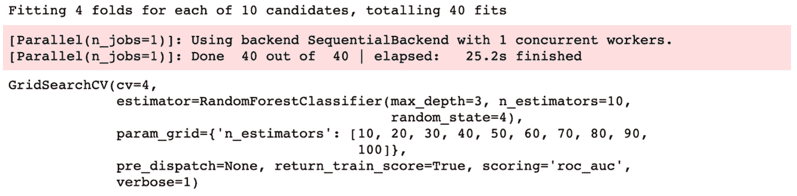

    图 5.17：随机森林在不同数量的树上的交叉验证输出

    你可能已经注意到，尽管我们只在 10 个超参数值上进行交叉验证，与前一练习中决策树所检验的 7 个值相比，这次的交叉验证花费的时间明显更长。考虑一下我们在这种情况下生成了多少棵树。对于最后一个超参数`n_estimators = 100`，我们在所有交叉验证的拆分中总共生成了 400 棵树。

    我们刚才尝试的各种树的模型拟合时间是多长？通过使用更多的树，我们在交叉验证测试性能方面获得了多大的提升？这些都是通过绘图来检查的好方法。首先，我们将交叉验证结果提取到一个 pandas DataFrame 中，就像以前做过的那样。

1.  将交叉验证结果放入 pandas DataFrame 中：

    ```py
    cv_rf_ex_results_df = pd.DataFrame(cv_rf_ex.cv_results_)
    ```

    您可以在附带的 Jupyter 笔记本中查看整个 DataFrame。这里，我们直接转向创建感兴趣的量的图形。我们将制作一条线图，其中包含每个超参数的平均拟合时间（包含在`mean_fit_time`列中的符号），以及一个测试分数的误差条形图，这些我们已经为决策树做过。两个图都将根据* x *轴上的树数量进行绘制。

1.  创建两个子图，分别显示平均训练时间和平均测试分数及标准误差：

    ```py
    fig, axs = plt.subplots(nrows=1, ncols=2, figsize=(6, 3))
    axs[0].plot(cv_rf_ex_results_df['param_n_estimators'],
                cv_rf_ex_results_df['mean_fit_time'],
                '-o')
    axs[0].set_xlabel('Number of trees')
    axs[0].set_ylabel('Mean fit time (seconds)')
    axs[1].errorbar(cv_rf_ex_results_df['param_n_estimators'],
                    cv_rf_ex_results_df['mean_test_score'],
                    yerr=cv_rf_ex_results_df['std_test_score']/np.sqrt(4))
    axs[1].set_xlabel('Number of trees')
    axs[1].set_ylabel('Mean testing ROC AUC $\pm$ 1 SE ')
    plt.tight_layout()
    ```

    在这里，我们使用`plt.subplots`一次创建了一个 figure 内的两个轴，配置为一行两列。然后，我们通过对返回的`axs`轴数组进行索引来访问轴对象，以便创建绘图。

    输出应该类似于此图：

    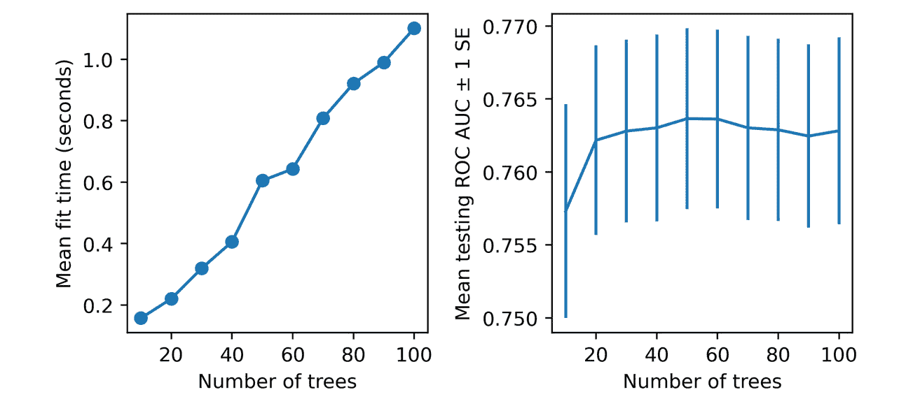

    图 5.18：不同数量树木的森林的平均拟合时间和测试分数

    注

    由于平台差异或设置了不同的随机种子，你的结果可能会有所不同。

    关于这些可视化，还有几个要注意的点。首先，我们可以看到，通过使用随机森林，我们在交叉验证测试折叠上的模型表现超过了我们之前的任何尝试。虽然我们还没有调整随机森林的超参数以获得最佳的模型性能，但这是一个有前景的结果，表明随机森林将是我们建模工作中一个有价值的补充。

    然而，随着这些更高模型测试分数的提升，请注意，折叠之间的变异性也比我们在决策树中看到的更大；这种变异性在模型测试分数的标准误差中表现得更加明显。虽然这表明使用该模型时，模型性能的范围可能更广，但我们建议直接在 Jupyter notebook 中的 pandas DataFrame 中查看各个折叠的模型测试分数。你会看到，即使是个别折叠的最低分数，仍然高于决策树的平均测试分数，这表明使用随机森林会更好。

    那么，我们用这个可视化来探讨的其他问题如何呢？我们感兴趣的是查看拟合不同数量树木的随机森林模型需要多长时间，以及使用更多树木时模型性能的提升。*图 5.18* 左侧的小图显示，随着树木数量的增加，训练时间呈现出相当线性的增长。这可能是可以预期的；通过增加更多树木，我们实际上是在增加训练过程中需要进行的计算量。

    但是，考虑到模型性能的提升，这额外的计算时间是否值得呢？*图 5.18* 右侧的小图显示，超过大约 20 棵树后，添加更多树木并不一定能可靠地提高测试性能。虽然拥有 50 棵树的模型得分最高，但添加更多树木实际上使测试分数略有下降，这表明 50 棵树的 ROC AUC 增益可能只是由于随机性，因为理论上增加更多树木应该提高模型性能。基于这个推理，如果我们将 `max_depth = 3` 作为限制，我们可能会选择 20 棵或许 50 棵树的森林继续进行。但在本章最后的活动中，我们将更全面地探索这个参数空间。

    最后，请注意，我们没有在这里显示训练集的 ROC AUC 指标。如果你绘制这些或在结果数据框中查看，你会发现训练分数高于测试分数，这表明某些过拟合现象正在发生。尽管如此，仍然可以确定这个随机森林模型的交叉验证测试分数比我们观察到的任何其他模型的分数要高。基于这个结果，我们很可能会选择此时的随机森林模型。

    为了更深入地了解我们可以通过拟合的交叉验证对象访问哪些内容，让我们看看最佳超参数和特征重要性。

1.  使用以下代码查看交叉验证中最好的超参数：

    ```py
    cv_rf_ex.best_params_
    ```

    这应该是输出结果：

    ```py
    {'n_estimators': 50}
    ```

    这里，best 仅仅指的是那些导致最高平均模型测试分数的超参数。

1.  运行此代码以创建特征名称和重要性的数据框，然后显示按重要性排序的横向条形图：

    ```py
    feat_imp_df = pd.DataFrame({
        'Importance':cv_rf_ex.best_estimator_.feature_importances_
        },
        index=features_response[:-1]) 
    feat_imp_df.sort_values('Importance', ascending=True).plot.barh()
    ```

    图表应该是这样的：

    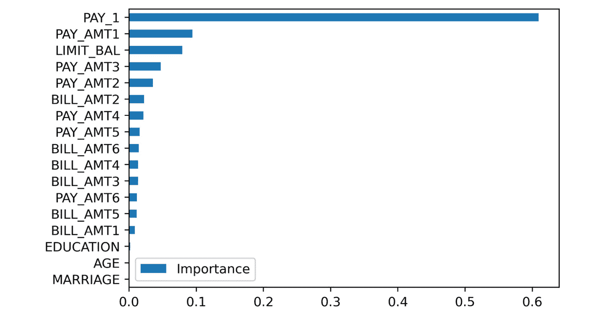

图 5.19：来自随机森林的特征重要性

在这段代码中，我们创建了一个包含特征重要性的字典，并将它与特征名称作为索引一起使用，以创建一个数据框。特征重要性来自拟合后的交叉验证对象的`best_estimator_`方法，所以它指的是具有最高平均测试分数的模型（换句话说，就是具有 50 棵树的模型）。这是一种访问随机森林模型对象的方法，该对象已经在所有训练数据上进行了训练，并使用了交叉验证网格搜索找到的最佳超参数。`feature_importances_`是可以在已拟合的随机森林模型上使用的方法。

在访问了所有这些属性后，我们将它们绘制在一个横向条形图上，这是一种方便查看特征重要性的方法。请注意，来自随机森林的前五个最重要特征与*第三章*中通过 ANOVA F 检验选择的前五个特征相同，尽管它们的顺序有所不同。这是不同方法之间的一种良好确认。

## 棋盘图

在继续进行活动之前，我们展示了一种在 Matplotlib 中进行可视化的技术。绘制一个二维网格，并在其上用彩色方块或其他形状表示数据，当你想展示数据的三个维度时，这种方法很有用。这里，颜色表示第三维度。例如，您可能想要在两个超参数的网格上可视化模型的测试分数，就像我们将在*活动 5.01*中做的那样，*使用随机森林的交叉验证网格搜索*。

过程的第一步是创建 *x* 和 *y* 坐标的网格。可以使用 NumPy 的 `meshgrid` 函数来完成这项工作。该函数接受一维的 *x* 和 *y* 坐标数组，并创建所有可能的坐标对的网格。网格中的点将是棋盘图中每个方块的角落。下面是一个 4 x 4 彩色块网格的代码示例。由于我们指定了角落，所以我们需要一个 5 x 5 的点网格。我们还展示了 *x* 和 *y* 坐标的数组：

```py
xx_example, yy_example = np.meshgrid(range(5), range(5))
print(xx_example)
print(yy_example)
```

输出如下：

```py
[[0 1 2 3 4]
 [0 1 2 3 4]
 [0 1 2 3 4]
 [0 1 2 3 4]
 [0 1 2 3 4]]
[[0 0 0 0 0]
 [1 1 1 1 1]
 [2 2 2 2 2]
 [3 3 3 3 3]
 [4 4 4 4 4]]
```

用于在此网格上绘制的数据应该具有 4 x 4 的形状。我们创建了一个包含从 1 到 16 的整数的一维数组，并将其重塑为一个二维的 4 x 4 网格：

```py
z_example = np.arange(1,17).reshape(4,4)
z_example
```

这将输出以下内容：

```py
array([[ 1,  2,  3,  4],
       [ 5,  6,  7,  8],
       [ 9, 10, 11, 12],
       [13, 14, 15, 16]])
```

我们可以使用以下代码在 `xx_example, yy_example` 网格上绘制 `z_example` 数据。请注意，我们使用 `pcolormesh` 来生成图表，并采用 `jet` 色图，这会给出彩虹色的颜色刻度。我们还添加了一个 `colorbar`，它需要传入 `pcolor_ex` 对象（由 `pcolormesh` 返回）作为参数，这样颜色刻度的解释就会清晰：

```py
ax = plt.axes()
pcolor_ex = ax.pcolormesh(xx_example, yy_example, z_example,
                          cmap=plt.cm.jet)
plt.colorbar(pcolor_ex, label='Color scale')
ax.set_xlabel('X coordinate')
ax.set_ylabel('Y coordinate') 
```

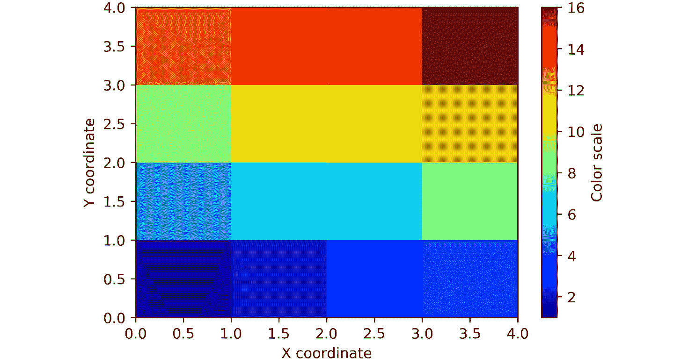

图 5.20：连续整数的 pcolormesh 图

## 活动 5.01：使用随机森林进行交叉验证网格搜索

在这个活动中，你将对随机森林模型在案例研究数据上进行网格搜索，搜索的超参数包括森林中的树木数量（`n_estimators`）和树的最大深度（`max_depth`）。然后，你将创建一个可视化，展示你搜索过的超参数网格的平均测试得分。请按照以下步骤完成此活动：

1.  创建一个字典，表示将要搜索的 `max_depth` 和 `n_estimators` 超参数的网格。包括深度 3、6、9 和 12，以及树木数量 10、50、100 和 200。将其他超参数保持为默认值。

1.  使用本章前面提到的相同选项实例化一个 `GridSearchCV` 对象，但使用步骤 1 中创建的超参数字典。设置 `verbose=2`，以查看每次拟合过程的输出。你可以重用我们之前使用的随机森林模型对象 `rf`，或者创建一个新的。

1.  在训练数据上拟合 `GridSearchCV` 对象。

1.  将网格搜索的结果放入 pandas DataFrame 中。

1.  创建一个 `pcolormesh` 可视化，显示每个超参数组合的平均测试得分。你应该得到类似于以下的可视化效果：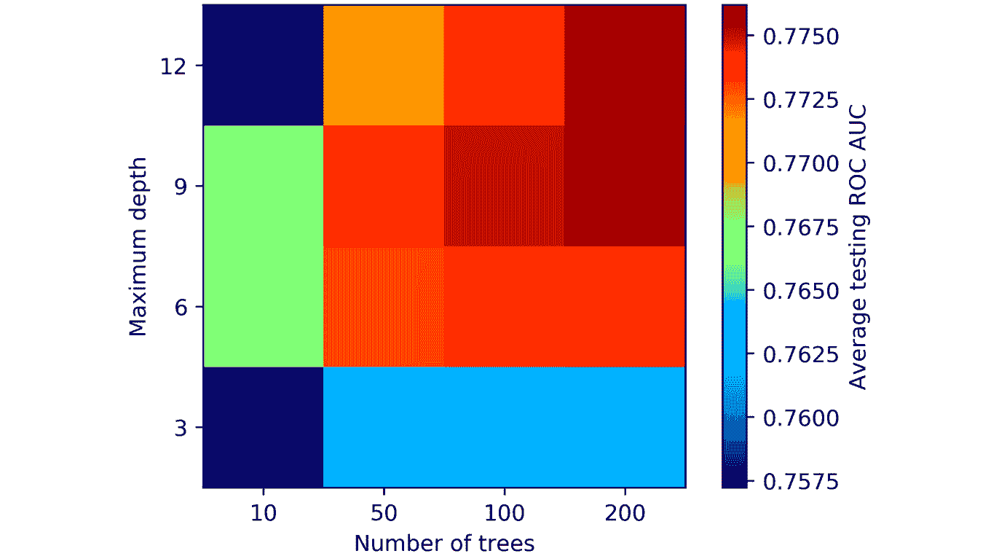

    图 5.21：随机森林在具有两个超参数的网格上的交叉验证结果

1.  确定使用哪组超参数。

    注意

    包含此活动的 Python 代码的 Jupyter 笔记本可以在[`packt.link/D0OBc`](https://packt.link/D0OBc)找到。此活动的详细分步解决方案可以通过这个链接找到。

# 总结

在本章中，我们学习了如何使用决策树和由多个决策树组成的集成模型——随机森林。通过使用这些简单构思的模型，我们能够比使用逻辑回归做出更好的预测，这从交叉验证的 ROC AUC 分数中可以看出。这种情况在许多实际问题中都适用。决策树对于很多可能影响逻辑回归模型性能的潜在问题具有较强的鲁棒性，例如特征与响应变量之间的非线性关系，以及特征之间复杂交互的存在。

尽管单棵决策树容易出现过拟合问题，但随机森林集成方法已被证明能够减少这一高方差问题。随机森林通过训练多棵树来构建。通过仅在部分可用训练集上训练每棵树（自助聚合或袋 ging），并且在每个节点分裂时只考虑减少的特征数量，树的集成可以减少方差，同时增加单棵树的偏差。

现在我们已经尝试了几种不同的机器学习方法来建模案例数据，发现有些方法效果更好；例如，经过调优的超参数的随机森林提供了最高的平均交叉验证 ROC AUC 分数 0.776，正如我们在*活动 5*中看到的，*使用随机森林进行交叉验证网格搜索*。

在下一章中，我们将学习另一种集成方法——梯度提升，它通常与决策树结合使用。梯度提升在所有机器学习模型中为二分类问题提供了一些最佳性能。我们还将学习一种强大的方法，通过**SHapely 加法解释**（**SHAP**）值来解释和解读梯度提升树集成的预测。
