# 第六章：6\. 梯度提升、XGBoost 与 SHAP 值

概述

阅读完本章后，您将能够描述梯度提升的概念，这是 XGBoost 包的基本理念。然后，您将通过合成数据训练 XGBoost 模型，并在此过程中学习早期停止以及几个 XGBoost 超参数。除了使用我们之前讨论的相似方法来生成树（通过设置`max_depth`），您还将发现 XGBoost 提供的另一种生成树的新方式：基于损失的树生成。在学习了 XGBoost 之后，您将接触到一种新的、强大的模型预测解释方法，称为**SHAP**（**SHapley Additive exPlanations**）。您将看到如何使用 SHAP 值为任何数据集的模型预测提供个性化的解释，而不仅仅是训练数据，同时也理解 SHAP 值的加法属性。

# 介绍

正如我们在上一章中看到的，基于决策树和集成模型提供了强大的方法来创建机器学习模型。尽管随机森林已经存在了几十年，但最近关于另一种树集成方法——梯度提升树的研究，已经产生了最先进的模型，这些模型在预测建模领域，尤其是在使用结构化表格数据（如案例研究数据）方面，占据了主导地位。如今，机器学习数据科学家使用的两个主要包是 XGBoost 和 LightGBM，用于创建最准确的预测模型。在本章中，我们将使用合成数据集熟悉 XGBoost，然后在活动中将其应用到案例研究数据中。

注意

也许使用 XGBoost 的最佳动机之一，来自于描述这个机器学习系统的论文，尤其是在 Kaggle 这个流行的在线机器学习竞赛论坛的背景下：

“在 2015 年 Kaggle 博客上发布的 29 个挑战获胜解决方案中，有 17 个解决方案使用了 XGBoost。在这些解决方案中，8 个仅使用 XGBoost 来训练模型，而大多数其他解决方案则将 XGBoost 与神经网络结合使用在集成中。相比之下，第二受欢迎的方法——深度神经网络，在 11 个解决方案中得到了使用。”（陈和郭斯特林，2016，[`dl.acm.org/doi/abs/10.1145/2939672.2939785`](https://dl.acm.org/doi/abs/10.1145/2939672.2939785)）

正如我们将看到的，XGBoost 将我们迄今为止讨论的几种不同思想结合起来，包括决策树、集成建模以及梯度下降。

除了性能更强的模型，近年来的机器学习研究还提供了更详细的模型预测解释方式。我们不再依赖仅仅表示模型训练集整体的解释方法，比如逻辑回归系数或随机森林的特征重要性，而是通过一个名为 SHAP 的新包，能够为任何我们希望的 dataset（如验证集或测试集）逐个解释模型预测。这对于帮助我们数据科学家以及我们的业务合作伙伴深入理解模型的工作原理非常有帮助，即使是对于新数据也是如此。

# 梯度提升和 XGBoost

## 什么是提升（Boosting）？

**提升（Boosting）**是一种创建多个机器学习模型或**估计器**集成的方法，类似于随机森林模型背后的袋装（bagging）概念。像袋装方法一样，提升可以与任何类型的机器学习模型一起使用，但它通常用于构建决策树的集成模型。与袋装方法的一个主要区别是，在提升过程中，每个新加入集成的估计器都依赖于之前加入的所有估计器。由于提升过程是按顺序进行的，并且集成成员的预测结果会加总以计算整体集成预测结果，因此它也被称为**逐步加法建模（stagewise additive modeling）**。袋装和提升的区别可以如*图 6.1*所示：

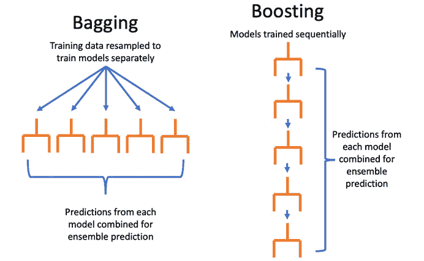

](img/B16925_06_01.jpg)

图 6.1：袋装与提升的对比

虽然袋装方法使用不同的训练数据随机样本训练多个估计器，但提升则通过利用上一轮估计器错误分类的样本信息来训练新估计器。通过将新的估计器集中在这些错误分类的样本上，目标是使得整体集成在整个训练数据集上的表现更好。**AdaBoost**，作为**XGBoost**的前身，通过为错误分类的样本赋予更多的权重，达到了这一目标，从而训练新的估计器加入集成。

## 梯度提升与 XGBoost

XGBoost 是一种建模过程和 Python 包，是当今最受欢迎的机器学习方法之一，因其在许多领域（从商业到自然科学）的卓越表现而广受欢迎。XGBoost 还证明是机器学习竞赛中最成功的工具之一。我们不会讨论 XGBoost 实现的所有细节，而是了解它如何工作的高层次概念，并查看一些最重要的超参数。有关详细信息，感兴趣的读者应参考 Tianqi Chen 和 Carlos Guestrin 的论文《XGBoost: A Scalable Tree Boosting System》（[`dl.acm.org/doi/abs/10.1145/2939672.2939785`](https://dl.acm.org/doi/abs/10.1145/2939672.2939785)）。

XGBoost 实现的梯度提升过程是一个逐步加法模型，类似于 AdaBoost。然而，XGBoost 并不是直接在模型训练过程中对分类错误的样本赋予更多权重，而是使用一种类似于梯度下降的过程。回想一下*第四章*，*偏差方差权衡*，梯度下降优化利用了**损失函数**（成本函数的另一种称呼）导数的信息，在训练逻辑回归模型时更新估计的系数。损失函数的导数包含了关于每次迭代中如何调整系数估计的方向和幅度的信息，从而减少预测中的误差。

XGBoost 将梯度下降的思想应用于逐步加法建模，利用损失函数的梯度（导数的另一种说法）信息训练新的决策树，加入到集成模型中。实际上，XGBoost 在梯度下降的基础上更进一步，正如*第四章*，*偏差方差权衡*中所描述的，它同时利用了损失函数的一阶和二阶导数。使用误差梯度训练决策树的方法是*第五章*，*决策树与随机森林*中引入的节点不纯度思想的替代方案。从概念上讲，XGBoost 训练新树的目标是将集成预测朝着减少误差的方向移动。朝这个方向迈多大的步伐由 `learning_rate` 超参数控制，类似于*第 4.01 章 使用梯度下降最小化成本函数*中的 `learning_rate`，该内容也出现在*第四章*，*偏差方差权衡*中。

到此为止，我们应该已经掌握了足够的知识，了解 XGBoost 如何工作，可以开始动手实践了。为了说明 XGBoost，我们将使用 scikit-learn 的 `make_classification` 函数创建一个用于二分类的合成数据集。该数据集包含 5,000 个样本和 40 个特征。这里的其余选项控制了分类任务的难度，你应当查阅 scikit-learn 文档以更好地理解它们。特别值得注意的是，我们将使用多个簇（`n_clusters_per_class`），意味着在多维特征空间中会有几个属于某一类别的点的区域，类似于上一章*图 5.3*中展示的簇。基于树的模型应该能够识别这些簇。此外，我们还指定在 40 个特征中只有 3 个是有信息的（`n_informative`），另外有 2 个冗余特征（`n_redundant`），它们包含与有信息特征相同的信息。因此，总的来说，在 40 个特征中，只有 5 个特征在做出预测时是有用的，而且这些信息都编码在其中的 3 个特征中。

如果你想在自己的电脑上跟随本章的示例进行操作，请参考 Jupyter 笔记本：[`packt.link/L5oS7`](https://packt.link/L5oS7)：

```py
from sklearn.datasets import make_classification
X, y = make_classification(n_samples=5000, n_features=40,\
                           n_informative=3, n_redundant=2,\
                           n_repeated=0, n_classes=2,\
                           n_clusters_per_class=3,\
                           weights=None, flip_y=0.05,\
                           class_sep=0.1, hypercube=True,\
                           shift=0.0,scale=1.0, shuffle=True,\
                           random_state=2)
```

请注意，响应变量`y`的类别比例大约为 50%：

```py
y.mean()
```

这应该输出以下内容：

```py
0.4986
```

本章中，我们将一次性将此合成数据集划分为训练集和验证集，而不是使用交叉验证。然而，我们在这里介绍的概念可以扩展到交叉验证场景。我们将把合成数据集划分为 80%的训练集和 20%的验证集。在现实世界的数据问题中，我们还希望保留一个测试集，供以后评估最终模型时使用，但在这里我们不做此操作：

```py
from sklearn.model_selection import train_test_split
X_train, X_val, y_train, y_val = \
train_test_split(X, y, test_size=0.2, random_state=24)
```

现在我们已经为建模准备好了数据，接下来需要实例化一个`XGBClassifier`类的对象。请注意，我们现在将使用 XGBoost 包，而不是 scikit-learn，来开发预测模型。然而，XGBoost 的 API（应用程序接口）设计得与 scikit-learn 类似，因此使用这个类应该是直观的。`XGBClassifier`类可以用来创建一个模型对象，并提供`fit`、`predict`方法以及其他常见功能，我们还可以在实例化类时指定模型的超参数。我们在此仅指定几个已经讨论过的超参数：`n_estimators`是用于模型的提升轮数（换句话说，是阶段性加法建模过程中的阶段数），`objective`是用来计算梯度的损失函数，`learning_rate`控制每个新估计器对集成模型的贡献，或者本质上控制减少预测误差的步长。剩余的超参数与在模型训练过程中希望看到的输出量（`verbosity`）以及即将被弃用的`label_encoder`选项有关，XGBoost 的开发者建议将其设置为`False`：

```py
xgb_model_1 = xgb.XGBClassifier(n_estimators=1000,\
                                verbosity=1,\
                                use_label_encoder=False,\
                                objective='binary:logistic',\
                                learning_rate=0.3)
```

我们所指定的超参数值表示：

+   我们将使用 1,000 个估计器，或提升轮次。稍后我们会详细讨论需要多少轮次；默认值是 100。

+   我们熟悉二元逻辑回归的目标函数（也称为代价函数），这在*第四章*《偏差-方差权衡》中有所介绍。XGBoost 还提供了各种目标函数，适用于分类和回归等多种任务。

+   学习率设置为`0.3`，这是默认值。可以通过超参数搜索程序探索不同的值，我们将在后续演示。

    注意

    推荐使用 Anaconda 环境安装 XGBoost 和 SHAP，具体方法可参考*前言*。如果安装与此处所示版本不同，您的结果可能与此处展示的不同。

现在我们有了模型对象和一些训练数据，可以开始拟合模型了。这与在 scikit-learn 中的做法类似：

```py
%%time
xgb_model_1.fit(X_train, y_train,\
                eval_metric="auc",\
                verbose=True)
```

在这里，我们正在使用 Jupyter notebook 中的 `%%time` “单元魔法”来跟踪拟合过程所需的时间。我们需要提供训练数据的特征 `X_train` 和响应变量 `y_train`。我们还需要提供 `eval_metric` 并设置详细程度，我们稍后将解释。执行此单元格后，应显示类似以下的输出：

```py
CPU times: user 52.5 s, sys: 986 ms, total: 53.4 s
Wall time: 17.5 s
Out[7]:
XGBClassifier(base_score=0.5, booster='gbtree',\
              colsample_bylevel=1, colsample_bynode=1,\
              colsample_bytree=1, gamma=0, gpu_id=-1,\
              importance_type='gain',interaction_constraints='',\
              learning_rate=0.3, max_delta_step=0, max_depth=6,\
              min_child_weight=1, missing=nan,\
              monotone_constraints='()', n_estimators=1000,\
              n_jobs=4, num_parallel_tree=1, random_state=0,\
              reg_alpha=0, reg_lambda=1, scale_pos_weight=1,\
              subsample=1, tree_method='exact',\
              use_label_encoder=False, validate_parameters=1,\
              verbosity=1)
```

输出告诉我们，这个单元格执行了 17.5 秒，称为“墙时”，即你墙上的时钟上显示的经过时间。CPU 时间比这个更长，因为 XGBoost 高效地同时使用多个处理器。XGBoost 还打印出所有超参数，包括我们设置的和那些保留默认值的超参数。

现在，为了检查这个拟合模型的性能，我们将评估验证集上的 ROC 曲线下的面积。首先，我们需要获取预测的概率：

```py
val_set_pred_proba = xgb_model_1.predict_proba(X_val)[:,1]
from sklearn.metrics import roc_auc_score
roc_auc_score(y_val, val_set_pred_proba)
```

此单元格的输出应如下所示：

```py
0.7773798710782294
```

这表示 ROC AUC 约为 0.78。这将是我们模型性能的基准，使用 XGBoost 的几乎默认选项。

# XGBoost 超参数

## 早期停止

在使用 XGBoost 训练决策树集成时，有许多选项可以用于减少过拟合并利用偏差-方差权衡。**早期停止**是其中一种简单的方式，可以帮助自动回答“需要多少次提升轮次？”的问题。值得注意的是，早期停止依赖于拥有一个独立的验证集数据，而不仅仅是训练集。然而，这个验证集实际上会在模型训练过程中使用，因此它不算作“未见过”的数据，这与我们在*第四章*《偏差-方差权衡》中使用验证集来选择模型超参数的方式类似。

当 XGBoost 训练连续的决策树以减少训练集上的误差时，可能会出现添加越来越多的树到集成中，能够提供越来越好的拟合训练数据，但开始导致在保留数据上的性能下降。为避免这种情况，我们可以使用一个验证集，也叫做评估集或 XGBoost 称之为 `eval_set`。评估集将作为特征及其对应响应变量的元组列表提供。该列表中最后的元组将用于早期停止。我们希望这个验证集，因为训练数据将用于拟合模型，无法提供对样本外泛化的估计：

```py
eval_set = [(X_train, y_train), (X_val, y_val)]
```

现在我们可以再次拟合模型，但这次我们提供`eval_set`关键字参数，并传入我们刚刚创建的评估集。此时，`eval_metric`中的`auc`变得非常重要。这意味着在每轮提升之后，在训练另一个决策树之前，ROC 曲线下面积将在所有通过`eval_set`提供的数据集上进行评估。由于我们将`verbosity=True`，因此我们将在单元格下方看到输出，其中包含训练集和验证集的 ROC AUC。这提供了一个实时视图，展示随着更多提升轮次的训练，模型在训练和验证数据上的性能变化。

由于在预测建模中，我们主要关心模型在新数据和未见过的数据上的表现，当我们发现进一步的提升轮次不再改善模型在样本外数据上的表现时，我们希望停止训练额外的提升轮次。`early_stopping_rounds=30`参数表示一旦完成 30 轮提升，且在验证集上的 ROC AUC 没有任何进一步的提升，XGBoost 就会停止模型训练。一旦模型训练完成，最终拟合的模型将只包含获得最高验证集性能所需的集成成员。这意味着最后的 30 个集成成员将被丢弃，因为它们没有提供验证集性能的提升。现在我们来拟合这个模型，并观察进展：

```py
%%time
xgb_model_1.fit(X_train, y_train, eval_set=eval_set,\
                eval_metric='auc',\
                verbose=True, early_stopping_rounds=30)
```

输出应该类似于这样：

```py
[0]	validation_0-auc:0.80412	validation_1-auc:0.75223
[1]	validation_0-auc:0.84422	validation_1-auc:0.79207
[2]	validation_0-auc:0.85920	validation_1-auc:0.79278
[3]	validation_0-auc:0.86616	validation_1-auc:0.79517
[4]	validation_0-auc:0.88261	validation_1-auc:0.79659
[5]	validation_0-auc:0.88605	validation_1-auc:0.80061
[6]	validation_0-auc:0.89226	validation_1-auc:0.80224
[7]	validation_0-auc:0.89826	validation_1-auc:0.80305
[8]	validation_0-auc:0.90559	validation_1-auc:0.80095
[9]	validation_0-auc:0.91954	validation_1-auc:0.79685
[10]	validation_0-auc:0.92113	validation_1-auc:0.79608
…
[33]	validation_0-auc:0.99169	validation_1-auc:0.78323
[34]	validation_0-auc:0.99278	validation_1-auc:0.78261
[35]	validation_0-auc:0.99329	validation_1-auc:0.78139
[36]	validation_0-auc:0.99344	validation_1-auc:0.77994
CPU times: user 2.65 s, sys: 136 ms, total: 2.78 s
Wall time: 2.36 s
…
```

请注意，这比之前的拟合花费了更少的时间。这是因为通过提前停止，我们只训练了 37 轮提升（请注意提升轮次是零索引的）。这意味着提升过程只需 8 轮就能达到最佳验证得分，而不是我们之前尝试的 1,000 轮！你可以通过模型对象的`booster`属性访问达到最佳验证集得分所需的提升轮数以及该得分。这个属性提供了比我们一直在使用的 scikit-learn API 更底层的模型接口：

```py
xgb_model_1.get_booster().attributes()
```

输出应该如下所示，确认迭代次数和最佳验证得分：

```py
{'best_iteration': '7', 'best_score': '0.80305'}
```

从训练过程，我们还可以看到每一轮的 ROC AUC，包括训练数据的`validation_0-auc`和验证数据的`validation_1-auc`，这些都能提供有关随着提升过程进行，模型是否过拟合的洞见。在这里，我们可以看到验证得分在第 8 轮之前一直在上升，但之后开始下降，表明进一步提升可能会导致模型过拟合。然而，训练得分则持续上升，直到过程被终止，这展示了 XGBoost 在拟合训练数据方面的强大能力。

我们还可以进一步确认拟合后的模型对象仅表示七轮提升，并通过手动计算 ROC AUC（如前所述）来检查验证集的表现：

```py
val_set_pred_proba_2 = xgb_model_1.predict_proba(X_val)[:,1]
roc_auc_score(y_val, val_set_pred_proba_2)
```

这应该输出如下内容：

```py
0.8030501882609966
```

这与经过七轮提升后获得的最高验证分数一致。因此，通过对模型训练过程进行一次简单的调整——使用验证集和提前停止，我们成功地将模型在验证集上的表现从大约 0.78 提升到 0.80，取得了显著的提高。这展示了提前停止在提升中的重要性。

这里自然会有一个问题：“我们怎么知道 30 轮提前停止就足够了？”你可以像调整任何超参数一样尝试不同的轮数，对于不同的数据集，可能需要不同的值。你可以观察验证分数在每轮提升中的变化来大致判断。有时，验证分数在每轮之间可能会出现跳跃性波动，因此最好有足够的轮数，以确保找到最大值，并且越过任何暂时的下降。

## 调整学习率

学习率在 XGBoost 文档中也被称为**eta**，以及**步长缩减**。这个超参数控制每个新估算器对集成预测的贡献大小。如果你增加学习率，你可能会更快地达到最佳模型，即在验证集上表现最好的模型。然而，设置学习率过高的风险在于，这可能会导致提升步骤过大。在这种情况下，梯度提升过程可能无法收敛到最优模型，这与*第四章 偏差方差权衡*中的*练习 4.01，使用梯度下降最小化成本函数*中讨论的梯度下降中的大学习率问题类似。接下来，让我们探讨学习率如何影响我们合成数据上的模型表现。

学习率是一个介于零和 1 之间的数字（包含端点，尽管零学习率没有实际意义）。我们创建一个包含 25 个在 0.01 和 1 之间均匀分布的数字的数组，用来测试不同的学习率：

```py
learning_rates = np.linspace(start=0.01, stop=1, num=25)
```

现在我们设置一个`for`循环，为每个学习率训练一个模型，并将验证分数保存在数组中。我们还会追踪达到最佳迭代所需的提升轮数。接下来的几个代码块应该作为一个单元格在 Jupyter notebook 中一起运行。我们首先通过测量所需的时间，创建空列表来存储结果，并开启`for`循环：

```py
%%time
val_aucs = []
best_iters = []
for learning_rate in learning_rates:
```

在每次循环迭代中，`learning_rate`变量将保存`learning_rates`数组的连续元素。一旦进入循环，第一步是用新的学习率更新模型对象的超参数。这是通过`set_params`方法完成的，我们用双星号`**`和一个字典来传递超参数名称和值。Python 中的`**`函数调用语法允许我们传递任意数量的关键字参数，也称为**kwargs**，以字典的形式传递。在这种情况下，我们只改变一个关键字参数，所以字典中只有一个项：

```py
    xgb_model_1.set_params(**{'learning_rate':learning_rate})
```

现在我们已经在模型对象上设置了新的学习率，我们按照之前的方法使用早期停止来训练模型：

```py
    xgb_model_1.fit(X_train, y_train, eval_set=eval_set,\
                    eval_metric='auc',\
                    verbose=False, early_stopping_rounds=30)
```

经过拟合后，我们获得了验证集的预测概率，并使用这些概率来计算验证集的 ROC AUC。然后，我们使用`append`方法将其添加到结果列表中：

```py
    val_set_pred_proba_2 = xgb_model_1.predict_proba(X_val)[:,1]
    val_aucs.append(roc_auc_score(y_val, val_set_pred_proba_2))
```

最后，我们还捕捉了每个学习率所需的轮次数量：

```py
     best_iters.append(
        int(xgb_model_1.get_booster().\
                        attributes()['best_iteration']))
```

前面提到的五个代码片段应该一起在一个单元格中运行。输出结果应该类似于以下内容：

```py
CPU times: user 1min 23s, sys: 526 ms, total: 1min 24s
Wall time: 22.2 s
```

现在我们已经得到了这个超参数搜索的结果，可以可视化验证集的性能和迭代次数。由于这两个指标的尺度不同，我们希望创建一个双* y *轴图。pandas 使这变得简单，因此首先我们将所有数据放入一个数据框：

```py
learning_rate_df = \
pd.DataFrame({'Learning rate':learning_rates,\
              'Validation AUC':val_aucs,\
              'Best iteration':best_iters})
```

现在我们可以像这样可视化不同学习率下的性能和迭代次数，注意：

+   我们设置了索引（`set_index`），使得学习率绘制在* x *轴上，其他列绘制在* y *轴上。

+   `secondary_y`关键字参数指示要绘制在右侧* y *轴上的列。

+   `style`参数允许我们为每一列指定不同的线条样式。`-o`是带点的实线，而`--o`是带点的虚线：

    ```py
    mpl.rcParams['figure.dpi'] = 400
    learning_rate_df.set_index('Learning rate')\
    .plot(secondary_y='Best iteration', style=['-o', '--o'])
    ```

结果图应该如下所示：

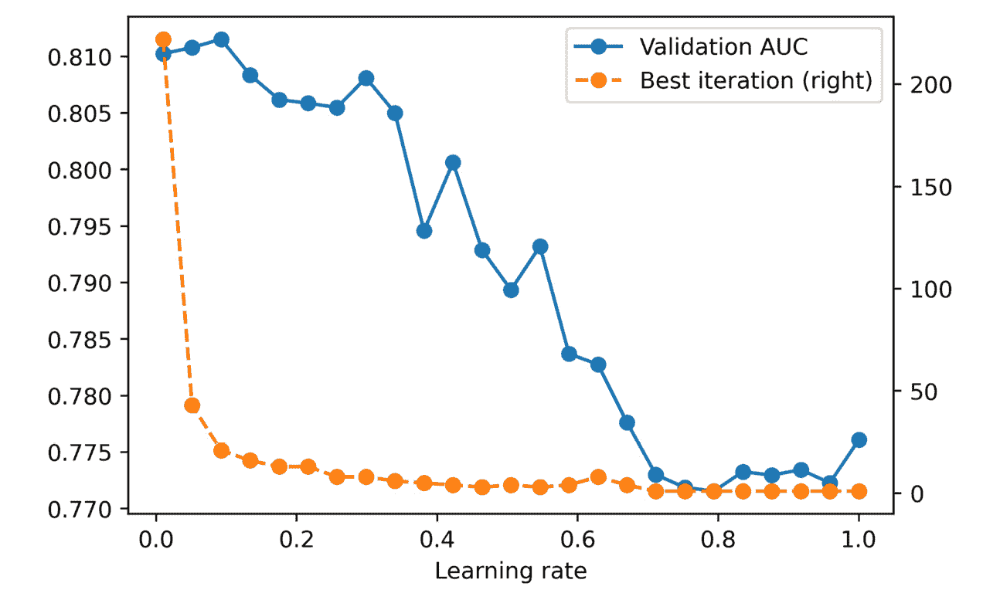

图 6.2：XGBoost 模型在验证集上的表现，以及不同学习率下直到最佳迭代的提升轮次

总的来说，似乎较小的学习率能够使这个合成数据集上的模型表现更好。通过使用小于默认值 0.3 的学习率，我们能得到的最佳表现如下所示：

```py
max(val_aucs)
```

输出如下：

```py
0.8115309360232714
```

通过调整学习率，我们将验证 AUC 从大约 0.80 提高到 0.81，表明使用适当的学习率是有益的。

通常，较小的学习率通常会导致更好的模型性能，尽管它们需要更多的提升轮次，因为每轮的贡献较小。这将导致模型训练所需的时间增加。在*图 6.2*的轮次与最佳迭代的关系图中，我们可以看到这一点。在这种情况下，看起来可以通过少于 50 轮来获得良好的性能，并且对于这组数据，模型训练时间不会很长。对于较大的数据集，训练时间可能会更长。根据你的计算时间，如果减少学习率并训练更多轮次，可能是提高模型性能的有效方法。

在探索较小学习率时，务必将`n_estimators`超参数设置得足够大，以便训练过程能够找到最佳模型，理想情况下与早停策略结合使用。

## XGBoost 中的其他重要超参数

我们已经看到，XGBoost 中的过拟合可以通过使用不同的学习率以及早停策略来进行补偿。还有哪些其他可能相关的超参数？XGBoost 有很多超参数，我们不会在这里列出所有内容。建议你查阅文档（[`xgboost.readthedocs.io/en/latest/parameter.html`](https://xgboost.readthedocs.io/en/latest/parameter.html)）获取完整列表。

在接下来的练习中，我们将对六个超参数的范围进行网格搜索，其中包括学习率。我们还将包含`max_depth`，该参数在*第五章*《决策树与随机森林》中应该已经熟悉，它控制集成中树的生长深度。除了这些，我们还会考虑以下内容：

+   `gamma`通过仅在损失函数值减少超过一定量时才允许节点分裂，从而限制集成中树的复杂性。

+   `min_child_weight`也通过仅在节点的“样本权重”达到一定量时才分裂节点，从而控制树的复杂性。如果所有样本的权重相等（如我们练习中一样），这就相当于节点中的最小训练样本数。这类似于 scikit-learn 中决策树的`min_weight_fraction_leaf`和`min_samples_leaf`。

+   `colsample_bytree`是一个随机选择的特征子集，用于在集成中生长每棵树。这类似于 scikit-learn 中的`max_features`参数（该参数在节点级别进行选择，而不是在树级别进行选择）。XGBoost 还提供了`colsample_bylevel`和`colsample_bynode`，分别在每棵树的每一层和每个节点进行特征采样。

+   `subsample`控制从训练数据中随机选择的样本比例，在为集成模型生长新树之前进行选择。这类似于 scikit-learn 中随机森林的`bootstrap`选项。`subsample`和`colsample`参数都限制了模型训练期间可用的信息，增加了各个集成成员的偏差，但希望也能减少整体集成的方差，从而改善样本外模型的表现。

正如你所看到的，XGBoost 中的梯度提升树实现了许多来自决策树和随机森林的概念。现在，让我们探索这些超参数如何影响模型性能。

## 练习 6.01：用于调优 XGBoost 超参数的随机网格搜索

在这个练习中，我们将使用随机网格搜索来探索六个超参数的空间。当你有许多超参数值需要搜索时，随机网格搜索是一个不错的选择。在这里，我们将研究六个超参数。例如，如果每个超参数有五个值需要测试，我们就需要进行*5*6 = 15,625*次搜索。即使每次模型拟合只需要一秒钟，我们也仍然需要几个小时来穷举所有可能的组合。通过只搜索这些组合的随机样本，随机网格搜索也能取得令人满意的结果。这里，我们将展示如何使用 scikit-learn 和 XGBoost 来实现这一点。

随机网格搜索的第一步是为每个超参数指定你希望从中采样的值的范围。你可以通过提供值列表或分布对象来实现这一点。对于离散超参数，如`max_depth`，它只有少数几个可能的值，因此可以将其指定为列表。而对于连续超参数，如`subsample`，它可以在区间(0, 1]上任意变化，因此我们不需要指定一个值列表。相反，我们可以要求网格搜索在这个区间内以均匀的方式随机采样值。我们将使用均匀分布来采样我们考虑的几个超参数：

注意

本练习的 Jupyter 笔记本可以在[`packt.link/TOXso`](https://packt.link/TOXso)找到。

1.  从`scipy`导入`uniform`分布类，并使用字典指定所有需要搜索的超参数的范围。`uniform`可以接受两个参数，`loc`和`scale`，分别指定采样区间的下界和区间的宽度：

    ```py
    from scipy.stats import uniform
    param_grid = {'max_depth':[2,3,4,5,6,7],
                  'gamma':uniform(loc=0.0, scale=3),
                  'min_child_weight':list(range(1,151)),
                  'colsample_bytree':uniform(loc=0.1, scale=0.9),
                  'subsample':uniform(loc=0.5, scale=0.5),
                  'learning_rate':uniform(loc=0.01, scale=0.5)}
    ```

    在这里，我们根据实验和经验选择了参数范围。例如，对于`subsample`，XGBoost 文档建议选择至少 0.5 的值，因此我们表示为`uniform(loc=0.5, scale=0.5)`，这意味着从区间[0.5, 1]中采样。

1.  现在我们已经指明了要从哪些分布中采样，我们需要进行采样。scikit-learn 提供了`ParameterSampler`类，它将随机采样提供的`param_grid`参数，并返回请求的样本数量（`n_iter`）。我们还设置了`RandomState`，以便在不同的 notebook 运行中得到可重复的结果：

    ```py
    from sklearn.model_selection import ParameterSampler
    rng = np.random.RandomState(0)
    n_iter=1000
    param_list = list(ParameterSampler(param_grid, n_iter=n_iter,
                                       random_state=rng))
    ```

    我们已经将结果以字典列表的形式返回，字典包含特定的参数值，对应于 6 维超参数空间中的位置。

    请注意，在本次练习中，我们正在遍历 1,000 个超参数组合，这可能需要超过 5 分钟。您可能希望减少这个数字，以便获得更快的结果。

1.  检查`param_list`的第一个项目：

    ```py
    param_list[0]
    ```

    这应该返回一个包含六个参数值的组合，来自所指示的分布：

    ```py
    {'colsample_bytree': 0.5939321535345923,
     'gamma': 2.1455680991172583,
     'learning_rate': 0.31138168803582195,
     'max_depth': 5,
     'min_child_weight': 104,
     'subsample': 0.7118273996694524}
    ```

1.  观察如何使用`**`语法，通过字典同时设置多个 XGBoost 超参数。首先，为本次练习创建一个新的 XGBoost 分类器对象。

    ```py
    xgb_model_2 = xgb.XGBClassifier(
        n_estimators=1000,
        verbosity=1,
        use_label_encoder=False,
        objective='binary:logistic')
    xgb_model_2.set_params(**param_list[0])
    ```

    输出应该显示所设置的超参数：

    ```py
    XGBClassifier(base_score=0.5, booster='gbtree',\
                  colsample_bylevel=1, colsample_bynode=1,\
                  colsample_bytree=0.5939321535345923,\
                  gamma=2.1455680991172583, gpu_id=-1,\
                  importance_type='gain',interaction_constraints='',\
                  learning_rate=0.31138168803582195,\
                  max_delta_step=0, max_depth=5,\
                  min_child_weight=104, missing=nan,\
                  monotone_constraints='()', n_estimators=1000,\
                  n_jobs=4, num_parallel_tree=1,\
                  random_state=0, reg_alpha=0, reg_lambda=1,\
                  scale_pos_weight=1, subsample=0.7118273996694524,\
                  tree_method='exact', use_label_encoder=False,\
                  validate_parameters=1, verbosity=1)
    ```

    我们将在循环中使用此过程，以查看所有超参数值。

1.  接下来的几个步骤将包含在`for`循环的一个单元格中。首先，测量执行此操作所需的时间，创建一个空列表以保存验证 AUC 值，然后启动计数器：

    ```py
    %%time
    val_aucs = []
    counter = 1
    ```

1.  打开`for`循环，设置超参数，并拟合 XGBoost 模型，类似于调整学习率的前述示例：

    ```py
    for params in param_list:
        #Set hyperparameters and fit model
        xgb_model_2.set_params(**params)
        xgb_model_2.fit(X_train, y_train, eval_set=eval_set,\
                        eval_metric='auc',\
                        verbose=False, early_stopping_rounds=30)
    ```

1.  在`for`循环内，获取预测概率和验证集 AUC 值：

    ```py
        #Get predicted probabilities and save validation ROC AUC
        val_set_pred_proba = xgb_model_2.predict_proba(X_val)[:,1]
        val_aucs.append(roc_auc_score(y_val, val_set_pred_proba))
    ```

1.  由于这个过程需要几分钟时间，最好将进度打印到 Jupyter notebook 输出中。我们使用 Python 余数语法`%`，每 50 次迭代打印一次信息，换句话说，当`counter`除以 50 的余数为零时。最后，我们增加计数器：

    ```py
        #Print progress
        if counter % 50 == 0:
            print('Done with {counter} of {n_iter}'.format(
                counter=counter, n_iter=n_iter))
        counter += 1
    ```

1.  将步骤 5-8 组合在一个单元格中并运行 for 循环，应该得到如下输出：

    ```py
    Done with 50 of 1000
    Done with 100 of 1000
    …
    Done with 950 of 1000
    Done with 1000 of 1000
    CPU times: user 24min 20s, sys: 18.9 s, total: 24min 39s
    Wall time: 6min 27s
    ```

1.  现在我们已经得到所有超参数探索的结果，我们需要对其进行检查。我们可以很容易地将所有超参数组合放入数据框中，因为它们是作为字典列表组织的。做这件事并查看前几行：

    ```py
    xgb_param_search_df = pd.DataFrame(param_list)
    xgb_param_search_df.head()
    ```

    输出应该像这样：

    

    图 6.3：来自随机网格搜索的超参数组合

1.  我们还可以将验证集的 ROC AUC 值添加到数据框中，查看最大值：

    ```py
    xgb_param_search_df['Validation ROC AUC'] = val_aucs
    max_auc = xgb_param_search_df['Validation ROC AUC'].max()
    max_auc
    ```

    输出应该如下：

    ```py
    0.8151220995602575
    ```

    在超参数空间搜索的结果是验证集 AUC 大约为 0.815。虽然这个值比我们通过提前停止和学习率搜索得到的 0.812 稍大（*图 6.3*），但差距不大。这意味着，对于这组数据，默认的超参数（除了学习率）已经足够实现相当好的性能。虽然我们没有通过超参数搜索大幅提升性能，但观察超参数变化如何影响模型表现依然具有启发性。在接下来的步骤中，我们将逐个检查 AUC 相对于每个参数的边际分布。这意味着我们将查看当一个超参数逐渐变化时，AUC 如何变化，并牢记在网格搜索结果中其他超参数也在变化。

1.  使用以下代码设置一个六个子图的网格，用于绘制每个超参数与性能之间的关系，同时调整图像分辨率并启动一个计数器，我们将用它来遍历子图：

    ```py
    mpl.rcParams['figure.dpi'] = 400
    fig, axs = plt.subplots(3,2,figsize=(8,6))
    counter = 0
    ```

1.  打开一个 `for` 循环来遍历超参数名称，它们是数据框的列，不包括最后一列。通过将 `subplot` 返回的 3 x 2 数组展平，并使用 `counter` 索引来访问轴对象。对于每个超参数，使用数据框的 `plot.scatter` 方法在适当的坐标轴上绘制散点图。*x* 轴将显示超参数，*y* 轴显示验证 AUC，其他选项帮助我们获得具有白色内部的黑色圆形标记：

    ```py
    for col in xgb_param_search_df.columns[:-1]:
        this_ax = axs.flatten()[counter]
        xgb_param_search_df.plot.scatter(x=col,\
                                         y='Validation ROC AUC',\
                                         ax=this_ax, marker='o',\
                                         color='w',\
                                         edgecolor='k',\
                                         linewidth=0.5)
    ```

1.  数据框的 `plot` 方法会自动创建 *x* 和 *y* 轴标签。然而，由于 *y* 轴标签对于所有这些图来说是相同的，我们只需要在第一个图中包含它。因此，我们将其他所有图的标签设置为空字符串 `''`，并递增计数器：

    ```py
        if counter > 0:
            this_ax.set_ylabel('')
        counter += 1
    ```

    由于我们将绘制边际分布图，在观察验证集 AUC 随着给定超参数变化时，其他所有超参数也会发生变化。这意味着关系可能会有噪声。为了了解整体趋势，我们还将创建折线图，显示每个超参数的分位数中验证 AUC 的平均值。分位数将数据按值是否落入最低 10%、接下来的 10% 等，直到最高 10% 来组织成不同的箱体。pandas 提供了一个名为`qcut`的函数，可以将一个 Series 切分成分位数（分位数是均匀大小的箱体中的一个，例如在 10 个箱体的情况下是一个十分位数），返回另一个 Series，包含这些分位数以及分位数的边界值，您可以把它们看作是直方图的边缘。

1.  使用 pandas 的`qcut`为每个超参数（除了`max_depth`）生成一个分位数序列（10 个分位数），返回区间边界（对于 10 个分位数会有 11 个边界），如果唯一值不足以分成 10 个分位数，则删除不需要的区间边界（`duplicates='drop'`）。创建一个列表，包含每对区间边界之间的中点，用于绘图：

    ```py
        if col != 'max_depth':
            out, bins = pd.qcut(xgb_param_search_df[col], q=10,\
                                retbins=True, duplicates='drop')
            half_points = [(bins[ix] + bins[ix+1])/2
                           for ix in range(len(bins)-1)]
    ```

1.  对于`max_depth`，由于只有六个唯一值，我们可以像处理分位数一样直接使用这些值：

    ```py
        else:
            out = xgb_param_search_df[col]
            half_points = np.sort(xgb_param_search_df[col].unique())
    ```

1.  通过复制超参数搜索数据框创建一个临时数据框，创建一个包含分位数序列的新列，并利用此列查找每个超参数分位数内的验证 AUC 平均值：

    ```py
        tmp_df = xgb_param_search_df.copy()
        tmp_df['param_decile'] = out
        mean_df = tmp_df.groupby('param_decile').agg(
            {'Validation ROC AUC':'mean'})
    ```

1.  我们可以通过在每个散点图的同一坐标轴上，绘制表示每个分位数平均值的虚线图来可视化结果。关闭`for`循环并使用`plt.tight_layout()`清理子图格式：

    ```py
        this_ax.plot(half_points,\
                     mean_df.values,\
                     color='k',\
                     linestyle='--')
    plt.tight_layout()
    ```

    运行`for`循环后，生成的图像应如下所示：

    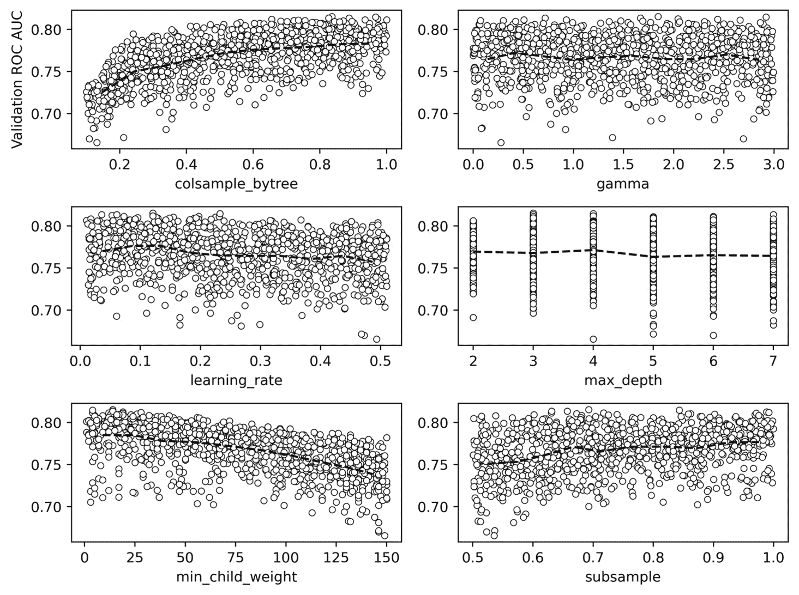

    图 6.4：验证集 AUC 与每个超参数的关系图，并显示每个超参数分位数内的平均值

    尽管我们注意到，本次练习中的超参数搜索并未显著提高验证 AUC，相较于本章之前的尝试，但*图 6.4*中的图表仍能展示 XGBoost 超参数如何影响该特定数据集的模型表现。XGBoost 通过在生成树时限制可用数据来对抗过拟合，一种方式是随机选择每棵树可用的特征的一部分（`colsample_bytree`），或者随机选择训练样本的一部分（`subsample`）。然而，在该合成数据中，似乎当每棵树使用 100% 的特征和样本时，模型表现最佳；低于此比例时，模型表现逐渐下降。另一种控制过拟合的方法是通过控制树的复杂度来限制集成中的树，方法包括限制`max_depth`、叶子节点中的最小训练样本数（`min_child_weight`）或分裂节点所需的最小损失函数减少值（`gamma`）。在我们这里的例子中，`max_depth`和`gamma`似乎对模型表现没有太大影响，而限制叶子节点中的样本数量似乎会带来负面效果。

    看起来在这个案例中，梯度提升过程本身足够稳健，能够在没有额外技巧的情况下实现良好的模型表现，以减少过拟合。然而，正如我们上面所观察到的，较小的`learning_rate`是有益的。

1.  我们可以显示最佳的超参数组合及其对应的验证集 AUC，如下所示：

    ```py
    max_ix = xgb_param_search_df['Validation ROC AUC'] == max_auc
    xgb_param_search_df[max_ix]
    ```

    这应该返回类似于以下的数据框行：

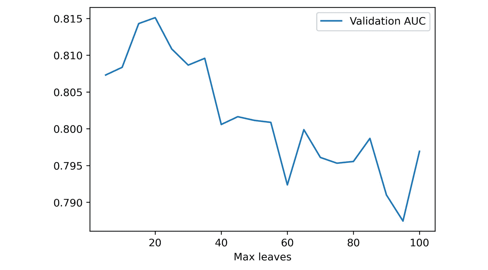

](img/B16925_06_05.jpg)

图 6.5：最佳超参数组合与验证集 AUC

验证集 AUC 与我们在上一步（*步骤 10*）通过仅调整学习率所达到的结果相似。

# 另一种生长树的方式：XGBoost 的 grow_policy

除了通过`max_depth`超参数限制树的最大深度外，还有一种控制树生长的范式：寻找一个节点，在这个节点上分裂将导致损失函数的最大减少，并进行分裂，而不考虑这会使树变得多深。这可能导致树有一个或两个非常深的分支，而其他分支可能不会生长得很远。XGBoost 提供了一个名为`grow_policy`的超参数，设置为`lossguide`时会产生这种树的生长方式，而`depthwise`选项是默认设置，会将树生长到指定的`max_depth`，正如我们在*第五章*《决策树与随机森林》中所做的，以及在本章至今为止的操作一样。`lossguide`生长策略是 XGBoost 中的一个较新选项，它模拟了 LightGBM（另一个流行的梯度提升包）的行为。

要使用`lossguide`策略，需要设置我们尚未讨论的另一个超参数`tree_method`，它必须设置为`hist`或`gpu-hist`。不详细讲解，`hist`方法将使用更快的方式来搜索分裂。它不会在节点中对训练样本的每一对排序特征值进行逐一比较，而是构建一个直方图，仅考虑直方图边缘的分裂。例如，如果一个节点中有 100 个样本，它们的特征值可能被分为 10 组，这意味着只考虑 9 个可能的分裂，而不是 99 个。

我们可以按照如下方式实例化一个使用`lossguide`生长策略的 XGBoost 模型，使用学习率`0.1`，这是根据我们在前一个练习中进行的超参数探索的直觉得出的：

```py
xgb_model_3 = xgb.XGBClassifier(
    n_estimators=1000,
    max_depth=0,
    learning_rate=0.1,
    verbosity=1,
    objective='binary:logistic',
    use_label_encoder=False,
    n_jobs=-1,
    tree_method='hist',
    grow_policy='lossguide')
```

请注意，我们已经设置了`max_depth=0`，因为该超参数与`lossguide`策略无关。相反，我们将设置一个名为`max_leaves`的超参数，它简单地控制将要生长的树的最大叶子数。我们将进行一个超参数搜索，范围从 5 到 100 个叶子：

```py
max_leaves_values = list(range(5,105,5))
print(max_leaves_values[:5])
print(max_leaves_values[-5:])
```

这将输出如下内容：

```py
[5, 10, 15, 20, 25]
[80, 85, 90, 95, 100]
```

现在我们准备好在这一系列超参数值范围内反复进行模型拟合和验证，类似于我们之前做过的操作：

```py
%%time
val_aucs = []
for max_leaves in max_leaves_values:
    #Set parameter and fit model
    xgb_model_3.set_params(**{'max_leaves':max_leaves})
    xgb_model_3.fit(X_train, y_train, eval_set=eval_set,\
                    eval_metric='auc', verbose=False,\
                    early_stopping_rounds=30)
    #Get validation score
    val_set_pred_proba = xgb_model_3.predict_proba(X_val)[:,1]
    val_aucs.append(roc_auc_score(y_val, val_set_pred_proba))
```

输出将包括所有这些拟合的壁钟时间，在测试中大约是 24 秒。现在，让我们把结果放入数据框中：

```py
max_leaves_df = \
pd.DataFrame({'Max leaves':max_leaves_values,
              'Validation AUC':val_aucs})
```

我们可以可视化验证集 AUC 随最大叶子数的变化，类似于我们对学习率的可视化：

```py
mpl.rcParams['figure.dpi'] = 400
max_leaves_df.set_index('Max leaves').plot()
```

这将产生如下图所示的图形：

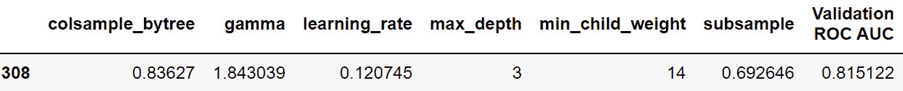

](img/B16925_06_06.jpg)

图 6.6：验证集 AUC 与 max_leaves 超参数的关系

较小的`max_leaves`值会限制生成的树的复杂度，这将理想地增加偏差，但也会减少方差，从而提高样本外的表现。当树的叶子数限制在 15 或 20 时，我们可以看到验证集 AUC 有所提高。那么，最大验证集 AUC 是多少呢？

```py
max_auc = max_leaves_df['Validation AUC'].max()
max_auc
```

这应该输出以下内容：

```py
0.8151200989120475
```

让我们确认最大验证 AUC 出现在`max_leaves=20`时，如*图 6.6*所示：

```py
max_ix = max_leaves_df['Validation AUC'] == max_auc
max_leaves_df[max_ix]
```

这应该返回数据框的一行：


图 6.7：最优 max_leaves

通过使用`lossguide`增长策略，我们可以实现至少与我们迄今为止尝试过的任何方法一样好的性能。`lossguide`策略的一个关键优势是，对于较大的数据集，它能够提供比`depthwise`策略更快的训练速度，特别是在`max_leaves`较小的情况下。尽管这里的数据集足够小，这一速度差异并没有实际重要性，但在其他应用中，这种速度可能是理想的。

# 使用 SHAP 值解释模型预测

随着像 XGBoost 这样的前沿建模技术的发展，解释模型预测的实践在近年来有了显著的进展。到目前为止，我们已经了解到，逻辑回归的系数，或者随机森林中的特征重要性，可以为模型预测的原因提供洞察。2017 年，Scott Lundberg 和 Su-In Lee 在论文《*统一模型预测解释方法*》中描述了一种更强大的模型预测解释技术（[`arxiv.org/abs/1705.07874`](https://arxiv.org/abs/1705.07874)）。该技术被称为**SHAP**（**Shapley 加法解释**），它基于数学家 Lloyd Shapley 的早期工作。Shapley 发展了博弈论中的一个领域，用以理解玩家联盟如何为博弈的总体结果做出贡献。近期的机器学习研究在模型解释方面借鉴了这一概念，考虑了预测模型中的特征组或联盟如何贡献于模型的最终预测输出。通过考虑不同特征组的贡献，SHAP 方法能够孤立出单一特征的影响。

注意

在撰写本文时，*第六章*《*梯度提升、XGBoost 和 SHAP 值*》中使用的 SHAP 库与 Python 3.9 不兼容。因此，如果您使用的是 Python 3.9 作为基础环境，我们建议您按照*前言*中所述，设置 Python 3.8 环境。

使用 SHAP 值解释模型预测的一些显著特点包括：

+   SHAP 值可以用来对模型预测做**个性化**解释；换句话说，可以通过 SHAP 理解单个样本的预测结果，分析每个特征的贡献。这与我们之前见过的随机森林特征重要性解释方法不同，后者仅考虑特征在模型训练集中的平均重要性。

+   SHAP 值是相对于背景数据集计算的。默认情况下，这是训练数据集，当然也可以提供其他数据集。

+   SHAP 值是可加的，这意味着对于单个样本的预测，SHAP 值可以加起来恢复预测值，例如预测的概率。

SHAP 方法有不同的实现，适用于各种类型的模型，这里我们将专注于树模型的 SHAP（Lundberg 等，2019 年，[`arxiv.org/abs/1802.03888`](https://arxiv.org/abs/1802.03888)），以便了解我们在验证集上的 XGBoost 模型预测。首先，我们将使用最优的`max_leaves`（即 20）重新拟合上一节中的`xgb_model_3`：

```py
%%time
xgb_model_3.set_params(**{'max_leaves':20})
xgb_model_3.fit(X_train, y_train,\
                eval_set=eval_set,\
                eval_metric='auc',
                verbose=False,\
                early_stopping_rounds=30)
```

现在我们准备开始计算验证数据集的 SHAP 值。这里有 40 个特征和 1000 个样本：

```py
X_val.shape
```

这将输出以下内容：

```py
(1000, 40)
```

为了自动标注我们可以使用`shap`包绘制的图，我们将把验证集特征放入一个带列名的数据框中。我们将使用列表推导来生成通用的特征名称，例如“Feature 0, Feature 1, …”，并按如下方式创建数据框：

```py
feature_names = ['Feature {number}'.format(number=number)
                 for number in range(X_val.shape[1])]
X_val_df = pd.DataFrame(data=X_val, columns=feature_names)
X_val_df.head()
```

`dataframe`的头部应如下所示：

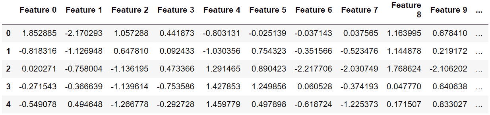

图 6.8：验证特征的数据框

使用训练好的模型`xgb_model_3`和验证特征的数据框，我们准备创建一个`explainer`接口。SHAP 包有多种类型的解释器，我们将使用专门针对树模型的解释器：

```py
explainer = shap.explainers.Tree(xgb_model_3, data=X_val_df)
```

这创建了一个使用模型验证数据作为背景数据集的解释器。现在我们已经准备好使用该解释器来获取 SHAP 值。SHAP 包使这变得非常简单。我们需要做的就是传入我们想要解释的数据集：

```py
shap_values = explainer(X_val_df)
```

就是这样！那么，创建的这个变量`shap_values`是什么呢？如果你直接检查`shap_values`变量的内容，你会看到它包含三个属性。第一个是`values`，它包含 SHAP 值。让我们查看它的形状：

```py
shap_values.values.shape
```

这将返回以下结果：

```py
(1000, 40)
```

因为 SHAP 提供了个性化的解释，每个验证集中的 1,000 个样本都有一行数据。总共有 40 列，因为我们有 40 个特征，SHAP 值告诉我们每个特征对每个样本预测的贡献。`shap_values` 还包含一个 `base_values` 属性，即在考虑任何特征贡献之前的初始预测值，也定义为整个数据集的平均预测值。每个样本（1,000 个）都有一个这样的值。最后，还有一个 `data` 属性，包含特征值。所有这些信息可以通过不同的方式结合起来解释模型预测。

幸运的是，`shap` 包不仅提供了快速便捷的计算 SHAP 值的方法，还提供了一整套丰富的可视化技术。其中最受欢迎的一种是 SHAP 汇总图，它可视化每个特征对每个样本的贡献。我们来创建这个图表，然后理解其中展示的内容。请注意，大多数有趣的 SHAP 可视化使用了颜色，因此如果你正在阅读的是黑白版本，请参考 GitHub 仓库中的彩色图形：

```py
mpl.rcParams['figure.dpi'] = 75
shap.summary_plot(shap_values.values, X_val_df)
```

这应该会生成以下内容：

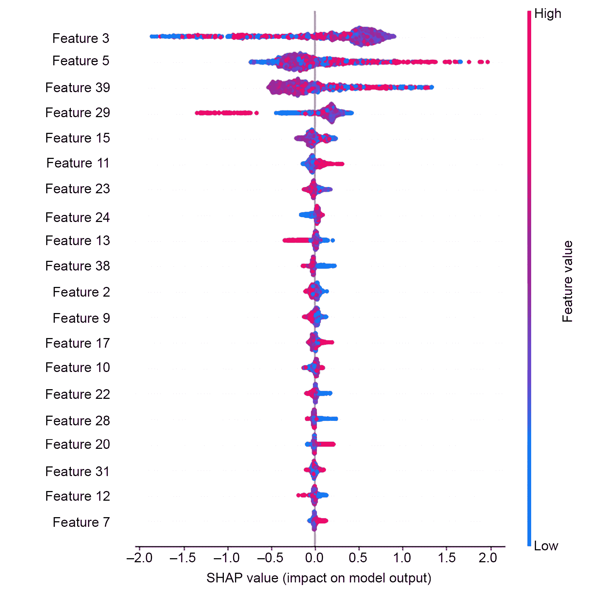

图 6.9：合成数据验证集的 SHAP 汇总图

注意

如果你正在阅读本书的印刷版，你可以通过访问以下链接下载并浏览本章中部分图像的彩色版本：[`packt.link/ZFiYH`](https://packt.link/ZFiYH)

*图 6.9* 包含了大量信息，帮助我们解释模型。汇总图可能包含多达 40,000 个绘制点，每个特征对应一个点，每个样本（1,000 个验证样本）对应一个点（尽管默认情况下只显示前 20 个特征）。我们先从理解 *x* 轴开始。SHAP 值表示每个特征值对样本预测的加性贡献。这里显示的 SHAP 值是相对于预期值的，预期值即前面提到的 `base_values`。因此，如果某个特征对某个样本的预测影响较小，它将不会使预测偏离预期值太远，SHAP 值接近于零。然而，如果某个特征的影响较大，对于我们的二分类问题而言，这意味着预测的概率将被推向 0 或 1，SHAP 值会远离 0。负的 SHAP 值表示某个特征使得预测值更接近 0，正的 SHAP 值则表示更接近 1。

注意，*图 6.9*中显示的 SHAP 值不能直接解释为预测概率。默认情况下，XGBoost 二分类模型的 SHAP 值，使用 `binary:logistic` 目标函数计算并绘制，使用的是概率的对数赔率表示法，这在*第三章*中的*逻辑回归细节和特征探索*部分的*为什么逻辑回归被认为是线性模型？*小节中介绍过。这意味着 SHAP 值可以进行加减，换句话说，我们可以对其进行线性变换。

那么，*图 6.9*中点的颜色如何解释呢？这些颜色代表了每个样本的特征值，红色表示特征值较高，蓝色表示特征值较低。因此，例如，在图的第四行，我们可以看到特征 29 的高特征值（红点）对应的是最低的 SHAP 值。

点的垂直排列，换句话说，每个特征的点带宽度，表示在该位置上 *x* 轴上有多少个点。如果样本多，点带的宽度就会更大。

图中特征的垂直排列是根据特征重要性进行的。最重要的特征，也就是那些对模型预测具有最大平均影响（均值绝对 SHAP 值）的特征，排在列表的顶部。

虽然*图 6.9*中的总结图是查看所有最重要特征及其 SHAP 值的好方法，但它可能无法揭示一些有趣的关系。例如，最重要的特征——特征 3，似乎在特征值范围的中间部分有一大簇紫色点，这些点的 SHAP 值为正，而该特征的负 SHAP 值可能来自于特征值过高或过低。

这是什么情况呢？通常，当从 SHAP 总结图中看不出特征的影响时，我们使用的基于树的模型正在捕捉特征之间的交互效应。为了进一步了解单个特征及其与其他特征的交互作用，我们可以使用 SHAP 散点图。首先，我们绘制特征 3 的 SHAP 值散点图。注意，我们可以像索引数据框一样索引 `shap_values` 对象：

```py
shap.plots.scatter(shap_values[:,'Feature 3'])
```

这将生成如下图所示：

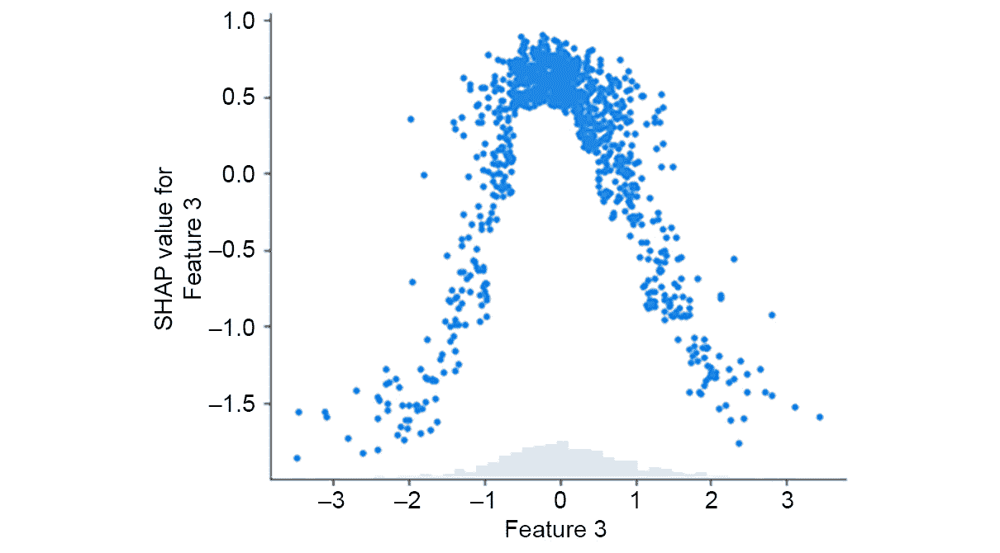

](img/B16925_06_10.jpg)

图 6.10：特征 3 的 SHAP 值散点图

从*图 6.10*中，我们几乎可以得出与*图 6.9*总结图相同的信息：特征值在范围中间的部分对应较高的 SHAP 值，而极值部分的 SHAP 值较低。然而，`scatter`方法还允许我们通过另一个特征值来为散点图上的点上色，这样我们就可以看到特征之间是否存在交互作用。我们将使用第二重要特征——特征 5，为点上色：

```py
shap.plots.scatter(shap_values[:,'Feature 3'],
                   color=shap_values[:,'Feature 5'])
```

生成的图应该像这样：

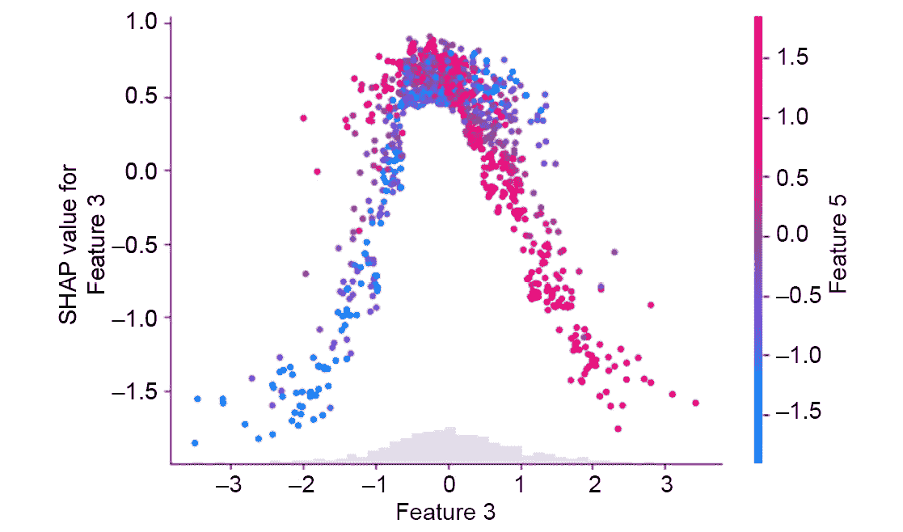

图 6.11：特征 3 的 SHAP 值散点图，按特征 5 的特征值着色。箭头 A 和 B 指示这些特征之间有趣的交互效应

*图 6.11* 显示了特征 3 和特征 5 之间的有趣交互。当样本位于特征 3 的特征值范围的中间时，也就是说，位于 *图 6.11* 中山丘形状的顶部时，从底部到顶部的点的颜色似乎变得越来越红（箭头 A）。这意味着，对于特征 3 范围中间的特征值，随着特征 5 的值增加，特征 3 的 SHAP 值也会增加。我们还可以看到，随着特征 3 的特征值沿 *x* 轴从中间向上升高，这种关系发生反转，特征 5 的较高特征值开始对应于特征 3 较低的 SHAP 值（箭头 B）。因此，与特征 5 的交互似乎对特征 3 的 SHAP 值有显著影响。

*图 6.11* 展示了复杂的关系，说明当存在交互效应时，增加特征值可能导致 SHAP 值增加或减少。*图 6.11* 中模式的具体原因与我们建模的合成数据集的创建有关，在此数据集中，我们在特征空间中指定了多个簇。如 *第五章* 中讨论的，*决策树与随机森林*，在 *使用决策树：优势与预测概率* 部分中提到，基于树的模型，如 XGBoost，能够有效地在多维特征空间中建模属于某一类别的点簇。SHAP 解释有助于我们理解模型如何进行这些表示。

在这里，我们使用了合成数据，特征没有现实世界的解释，因此我们无法为观察到的交互分配任何含义。然而，对于现实世界的数据，结合 SHAP 值和交互作用的详细探索可以提供有关模型如何表示客户或用户属性之间复杂关系的见解。例如，SHAP 值也很有用，因为它们可以提供相对于任何背景数据集的解释。尽管逻辑回归系数和随机森林的特征重要性完全由模型训练数据决定，SHAP 值可以为任何背景数据集计算；到目前为止，在本章中，我们一直使用的是验证数据。这为当预测模型部署到生产环境中时，提供了一个了解新预测是如何做出的机会。如果新预测的 SHAP 值与模型训练和测试数据的 SHAP 值非常不同，这可能表明传入数据的性质发生了变化，可能是时候考虑开发一个新模型了。在最后一章中，我们将讨论这些在实际应用中使用模型的实际问题。

## 练习 6.02：绘制 SHAP 交互作用、特征重要性，并从 SHAP 值中重构预测概率

在本练习中，你将更熟悉使用 SHAP 值来提供模型工作原理的可见性。首先，我们将再次查看特征 3 和特征 5 之间的交互作用，然后使用 SHAP 值计算特征重要性，类似于我们在*第五章* *决策树与随机森林*中使用随机森林模型所做的那样。最后，我们将看到如何从 SHAP 值中获取模型输出，利用它们的加法性质：

注意

本练习的 Jupyter notebook 可以在[`packt.link/JcMoA`](https://packt.link/JcMoA)找到。

1.  由于本节已经完成了初步步骤，我们可以再次查看特征 3 和特征 5 之间的交互作用，它们是合成数据集中的两个最重要的特征。使用以下代码制作*图 6.11*的另一个版本，不过这次我们关注的是特征 5 的 SHAP 值，并按照特征 3 的值进行着色：

    ```py
    shap.plots.scatter(shap_values[:,'Feature 5'],
                       color=shap_values[:,'Feature 3'])
    ```

    结果图应如下所示：

    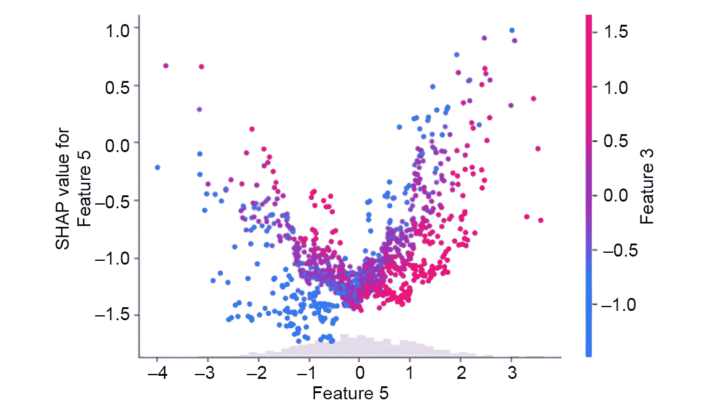

    图 6.12：特征 5 的 SHAP 值散点图，按特征 3 的特征值着色

    与*图 6.11*不同，这里我们看到的是特征 5 的 SHAP 值。一般来说，从散点图来看，我们可以看到，随着特征 5 的特征值增加，SHAP 值也趋向增加。然而，确实有一些反例与这一普遍趋势相悖，并且与特征 3 有一个有趣的交互作用：对于特征 5 的给定值，可以将其视为图像中的一个垂直切片，点的颜色可以从下到上变得更红，表示负特征值，或者对于正特征值，点的颜色变得不那么红。这意味着对于特征 5 的给定值，它的 SHAP 值依赖于特征 3 的值。这进一步说明了特征 3 和 5 之间有趣的交互作用。在实际项目中，您选择展示哪个图表取决于您希望通过数据讲述什么样的故事，涉及特征 3 和 5 可能代表的实际世界中的量。

1.  使用以下代码创建特征重要性条形图：

    ```py
    mpl.rcParams['figure.dpi'] = 75
    shap.summary_plot(shap_values.values, X_val, plot_type='bar')
    ```

    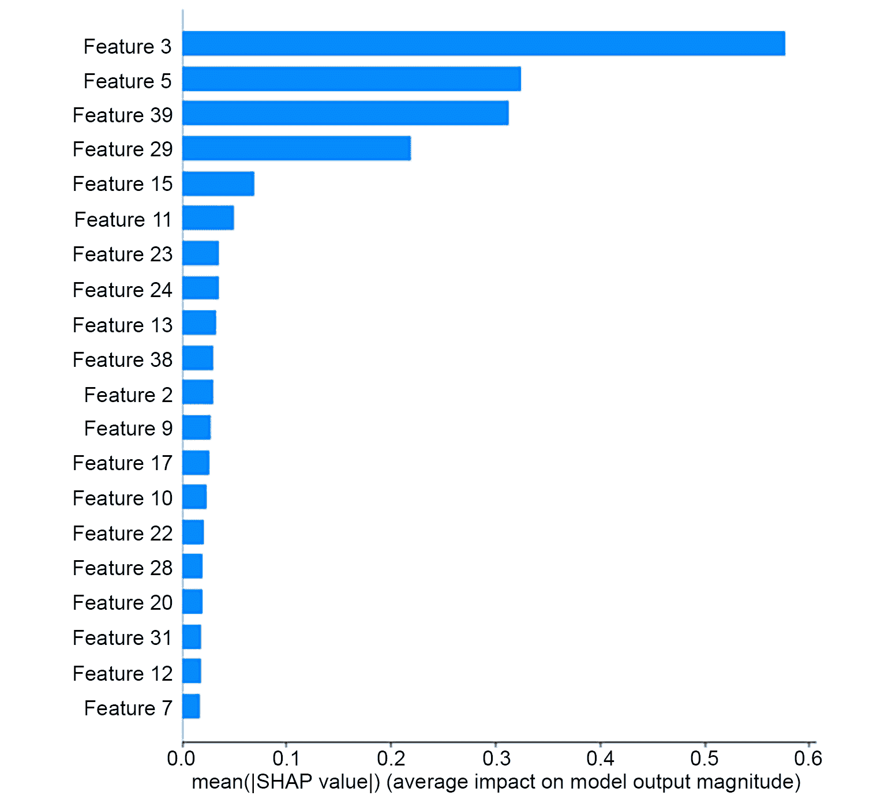

    图 6.13: 使用 SHAP 值的特征重要性条形图

    特征重要性条形图提供了类似于*第五章《决策树与随机森林》*中的*练习 5.03，拟合随机森林*所获得的信息的可视化呈现：这是每个特征的一个数字，表示它对数据集的总体重要性。

    这些结果合理吗？回想一下，我们是通过创建包含三个有信息的特征和两个冗余特征的合成数据来实现的。在*图 6.13*中，似乎有四个特征的显著性比其他所有特征重要，因此，可能其中一个冗余特征的创建方式导致 XGBoost 经常选择它来进行节点分裂，而另一个冗余特征则使用较少。

    与我们在*第五章*《决策树与随机森林》中找到的特征重要性相比，这里的特征重要性有些不同。我们从 scikit-learn 中获得的随机森林模型的特征重要性是通过特征导致的节点杂质下降以及特征划分的训练样本的比例来计算的。相比之下，使用 SHAP 值计算的特征重要性是这样得到的：首先，取所有 SHAP 值（`shap_values.values`）的绝对值，然后对每个特征取所有样本的平均值，正如 *x* 轴标签所示。感兴趣的读者可以通过直接从 `shap_values` 计算这些指标来确认这一点。

    现在我们已经熟悉了 SHAP 值的多种用法，让我们看看它们的加法性质是如何允许重建预测概率的。

1.  SHAP 值是相对于模型的期望值或基准值计算的。这可以解释为背景数据集中所有样本的平均预测值。然而，正如前面提到的，为了支持可加性，预测将以对数几率单位表示，而不是概率。可以通过以下方式从解释器对象中访问模型的期望值：

    ```py
    explainer.expected_value
    ```

    输出应如下所示：

    ```py
    -0.30949621941894295
    ```

    这条信息本身并不特别有用。然而，它为我们提供了一个基准，我们可以用它来重构预测概率。

1.  回顾一下，SHAP 值矩阵的形状是样本数和特征数。在我们对验证数据进行的练习中，形状将是 1,000 x 40。为了将每个样本的所有 SHAP 值相加，我们需要对列轴（`axis=1`）进行求和。这将把所有特征的贡献加在一起，实际上提供了与期望值的偏移量。如果我们将期望值加到其中，就得到了以下的预测值：

    ```py
    shap_sum = shap_values.values.sum(axis=1) + explainer.expected_value
    shap_sum.shape
    ```

    这应该返回以下结果：

    ```py
    (1000,)
    ```

    这意味着我们现在为每个样本有了一个单一的数值。然而，这些预测是在对数几率空间中。为了将它们转换为概率空间，我们需要应用在*第三章，逻辑回归细节与特征探索*中介绍的逻辑函数。

1.  如此应用逻辑转换到对数几率预测：

    ```py
    shap_sum_prob = 1 / (1 + np.exp(-1 * shap_sum))
    ```

    现在，我们希望将通过 SHAP 值获得的预测概率与直接模型输出进行比较以确认。

1.  获取模型验证集的预测概率，并使用以下代码检查其形状：

    ```py
    y_pred_proba = xgb_model_3.predict_proba(X_val)[:,1]
    y_pred_proba.shape
    ```

    输出应如下所示：

    ```py
    (1000,)
    ```

    这与我们从 SHAP 导出的预测结果形状相同，如预期的那样。

1.  将模型输出和 SHAP 值的总和放在数据框中进行并排比较，并随机检查五行数据：

    ```py
    df_check = pd.DataFrame(
        {'SHAP sum':shap_sum_prob,
         'Predicted probability':y_pred_proba})
    df_check.sample(5, random_state=1)
    ```

    输出应该确认这两种方法的结果是相同的：

    

    图 6.14：SHAP 导出的预测概率与直接从 XGBoost 获得的预测概率比较

    随机检查表明这五个样本具有相同的值。虽然由于机器算术的四舍五入误差，这些值可能不完全相等，但你可以使用 NumPy 的 `allclose` 函数，确保它们在用户配置的四舍五入误差范围内相同。

1.  确保 SHAP 导出的概率和模型输出的概率非常接近，如下所示：

    ```py
    np.allclose(df_check['SHAP sum'],\
                df_check['Predicted probability'])
    ```

    输出应如下所示：

    ```py
    True
    ```

    这表明这两列中的所有元素在四舍五入误差范围内是相等的。`allclose` 在出现四舍五入误差时非常有用，而精确相等（可以通过 `np.array_equal` 进行测试）通常不成立。

到目前为止，你应该对 SHAP 值在帮助理解机器学习模型方面的强大功能有了一些印象。SHAP 值的样本特定、个性化特性开启了非常详细的分析可能性，这可以帮助回答来自业务利益相关者的各种潜在问题，比如“模型会如何对像这样的人的数据做出预测？”或“为什么模型会对这个特定人做出这样的预测？”现在，我们已经熟悉了 XGBoost 和 SHAP 值，这两种先进的机器学习技术，接下来我们将回到案例研究数据上应用它们。

# 缺失数据

关于同时使用 XGBoost 和 SHAP 的最后一点说明，这两个包的一个宝贵特性是它们能够处理缺失值。回想一下在*第一章*，*数据探索与清洗*中，我们发现案例研究数据中一些样本在`PAY_1`特征上存在缺失值。到目前为止，我们的方法是，在构建模型时，简单地将这些样本从数据集中移除。这是因为，如果不以某种方式专门处理缺失值，scikit-learn 实现的机器学习模型将无法处理这些数据。忽略缺失值是一种方法，尽管这可能不令人满意，因为它涉及丢弃数据。如果缺失的数据仅占很小的比例，这可能没问题；然而，一般来说，知道如何处理缺失值是很重要的。

有几种方法可以填充缺失值，例如使用该特征非缺失值的均值或众数，或者随机选择一个非缺失值。你还可以构建一个模型，将该特征作为响应变量，所有其他特征作为该新模型的特征，然后预测缺失的特征值。这些方法在本书的第一版中有所探讨（[`packt.link/oLb6C`](https://packt.link/oLb6C)）。然而，由于 XGBoost 通常在使用我们这里的表格数据进行二分类任务时，表现至少与其他机器学习模型一样好，并且能够处理缺失值，因此我们将不再深入探讨填充缺失值的问题，而是让 XGBoost 来为我们完成这项工作。

XGBoost 如何处理缺失数据？在每次有机会分裂节点时，XGBoost 仅考虑非缺失的特征值。如果一个特征包含缺失值且被选择用于分裂，缺失该特征值的样本会被发送到一个子节点，在最小化损失函数的基础上选择最优路径。

## 将 Python 变量保存到文件

在本章的活动中，为了进行文件读写，我们将使用新的 Python 语句（`with`）和`pickle`包。`with`语句使得处理文件更加方便，因为它们不仅打开文件，还会在使用完成后自动关闭文件，而无需用户单独进行这些操作。你可以使用如下代码片段将变量保存到文件中：

```py
with open('filename.pkl', 'wb') as f:
    pickle.dump([var_1, var_2], f)
```

其中`filename.pkl`是你选择的文件路径，`'wb'`表示文件以二进制格式打开以供写入，`pickle.dump`将变量`var_1`和`var_2`保存到该文件中。要打开此文件并加载这些变量，可能需要在另一个 Jupyter Notebook 中，代码类似，但现在需要以二进制格式（`'rb'`）打开文件：

```py
with open('filename.pkl', 'rb') as f:
    var_1, var_2 = pickle.load(f)
```

## 活动 6.01：使用 XGBoost 建模案例研究数据并使用 SHAP 解释模型

在本活动中，我们将利用本章所学的内容，使用一个合成数据集，并将其应用于案例研究数据。我们将观察 XGBoost 模型在验证集上的表现，并使用 SHAP 值解释模型预测。我们已通过替换先前忽略的、`PAY_1`特征缺失值的样本来准备数据集，同时保持没有缺失值的样本的训练/测试划分。你可以在本活动的笔记本附录中查看数据是如何准备的。

注意

包含解决方案以及附录的 Jupyter 笔记本可以在这里找到：[`packt.link/YFb4r`](https://packt.link/YFb4r)。

1.  加载已为此练习准备好的案例研究数据。文件路径为`../../Data/Activity_6_01_data.pkl`，变量包括：`features_response, X_train_all, y_train_all, X_test_all, y_test_all`。

1.  定义一个验证集，用于训练 XGBoost 并进行早期停止。

1.  实例化一个 XGBoost 模型。使用`lossguide`增长策略，以便检查验证集在多个`max_leaves`值下的表现。

1.  创建一个`max_leaves`值的列表，范围从 5 到 200，步长为 5。

1.  创建用于早期停止的评估集。

1.  遍历超参数值并创建一个验证 ROC AUC 的列表，使用与*练习 6.01：随机网格搜索调优 XGBoost 超参数*相同的技术。

1.  创建一个超参数搜索结果的数据框，并绘制验证 AUC 与`max_leaves`的关系图。

1.  观察对应于验证集上最高 ROC AUC 的`max_leaves`数量。

1.  使用最佳超参数重新拟合 XGBoost 模型。这样我们就可以检查验证集的 SHAP 值，制作该数据的数据框。

1.  使用验证数据作为背景数据集，为我们的新模型创建 SHAP 解释器，获取 SHAP 值，并绘制总结图。

1.  绘制`LIMIT_BAL` SHAP 值的散点图，按与最强交互特征相关的颜色进行着色。

1.  将训练好的模型以及训练数据和测试数据保存到一个文件中。

    注意

    该活动的解决方案可以通过此链接找到。

# 总结

在本章中，我们学习了一些构建机器学习模型的前沿技术，尤其是针对表格数据。虽然其他类型的数据，如图像或文本数据，需要使用不同类型的模型（如神经网络）进行探索，但许多标准的商业应用仍然依赖于表格数据。XGBoost 和 SHAP 是一些最先进且流行的工具，你可以用它们来构建和理解这类数据的模型。在通过这些工具与合成数据进行实践并积累经验后，在接下来的活动中，我们将回到案例研究的数据集，看看如何使用 XGBoost 来对其建模，包括包含缺失特征值的样本，并利用 SHAP 值来理解模型。
