# 第七章：7. 测试集分析、财务洞察和交付给客户

概述

本章介绍了几种分析模型测试集的技术，用于推导未来可能的模型表现。这些技术包括我们已经计算过的相同模型性能指标，例如 ROC AUC，以及一些新的可视化方法，如按预测概率分组的违约风险变化和预测概率的校准。阅读本章后，您将能够弥合机器学习的理论指标与商业世界财务指标之间的差距。您将能够识别关键洞察，并估算模型的财务影响，向客户提供如何实现这一影响的指导。最后，我们讨论了交付和部署模型时需要考虑的关键因素，如交付格式和监控模型使用情况的方法。

# 引言

在上一章中，我们使用了 XGBoost 进一步提高了模型的性能，超越了我们之前的所有努力，并学会了如何通过 SHAP 值解释模型预测。现在，我们将认为模型构建已完成，并解决交付给客户之前需要关注的剩余问题。本章的关键内容是对测试集的分析，包括财务分析，以及交付模型给希望在现实世界中使用它的客户时需要考虑的事项。

我们通过查看测试集来了解模型未来的表现。通过计算我们已知的指标，如 ROC AUC，但这次是针对测试集的，我们可以增强对模型在新数据上有用性的信心。我们还将学习一些直观的方法来可视化模型将客户分为不同违约风险等级的能力，比如十分位图。

您的客户可能会欣赏您在创建更准确的模型或更高 ROC AUC 模型方面所做的努力。然而，他们一定会更重视了解模型能够帮助他们赚取或节省多少钱，并且可能会乐于接受关于如何最大化模型潜力的具体指导。对测试集的财务分析可以模拟基于模型的不同策略场景，帮助客户选择适合他们的策略。

在完成财务分析后，我们将总结如何交付模型给客户使用，并讨论如何随着时间推移监控其表现。

# 模型结果回顾

为了开发满足客户商业需求的二分类模型，我们已经尝试了几种建模技术，取得了不同程度的成功。最终，我们希望选择性能最好的模型进行进一步分析，并呈现给客户。然而，向客户传达我们探索的其他选项也是很重要的，这样可以展示我们进行了一项彻底的研究项目。

在这里，我们回顾了针对案例研究问题所尝试的不同模型、需要调整的超参数以及交叉验证结果，或者在 XGBoost 的情况下使用的验证集。我们仅包括使用所有可能特征所做的工作，而不包括早期只使用一两个特征的探索性模型：

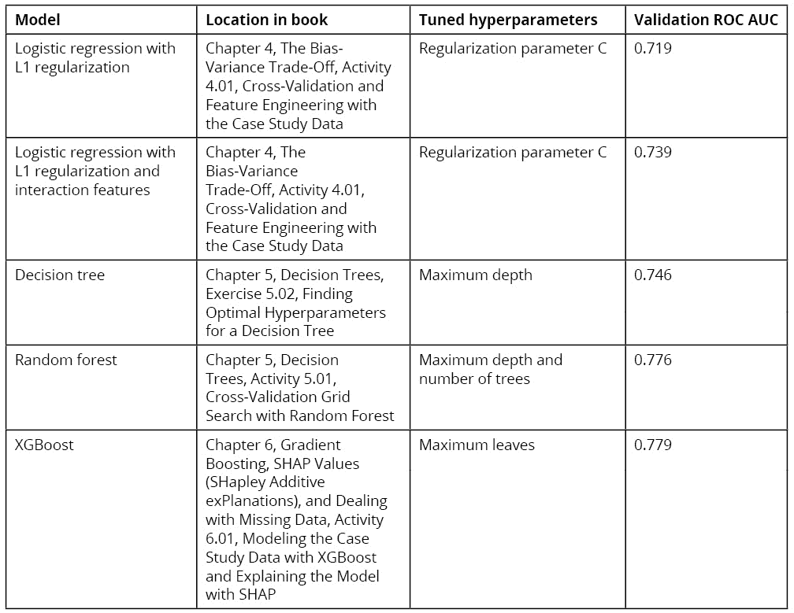

图 7.1：使用案例研究数据的建模活动总结

在向客户展示结果时，你应该准备好为各个技术背景层次的业务伙伴解释这些结果，包括那些技术背景很少的人。例如，业务伙伴可能不理解 ROC AUC 指标的推导过程；然而，这是一个重要的概念，因为它是我们用来评估模型的主要性能指标。你可能需要解释它是一个介于 0.5 和 1 之间变化的指标，并给出这些界限的直观解释：0.5 就像是抛硬币一样，而 1 是完美的，实际上几乎是无法达到的。

我们的结果介于两者之间，最佳模型接近 0.78。虽然一个给定模型的 ROC AUC 可能单独来看没有太大意义，*图 7.1* 显示我们尝试了几种方法，并且在最初的尝试基础上取得了性能的提升。最终，对于像案例研究这样的商业应用，像 ROC AUC 这样的抽象模型性能指标如果能配合财务分析，效果会更好。我们将在本章后面深入探讨这一点。

注：关于解释 ROC AUC

ROC AUC 分数的一个有趣解释是，对于两个样本，其中一个是正面结果，另一个是负面结果，正面样本的预测概率会比负面样本高。换句话说，对于评估数据集中所有可能的正负样本对，正面样本的模型预测高于负面样本的比例等于 ROC AUC。

从*图 7.1*中，我们可以看到，对于案例研究，通过工程化新特征来增强简单的逻辑回归模型或创建决策树集成模型来构建更**复杂模型**的努力，取得了更好的模型性能。特别是随机森林和 XGBoost 模型表现相似，尽管这些验证得分在技术上并不直接可比，因为在随机森林的情况下我们排除了缺失值，并且使用了 4 倍交叉验证，而在 XGBoost 中，缺失值被包含在内，且只有一个验证集用于提前停止。然而，*图 7.1* 表明，XGBoost 或随机森林可能是最好的选择。我们将在这里继续使用 XGBoost 模型。

现在我们已经决定了要交付的模型，考虑一下在模型开发过程中我们可能尝试过的其他方法也是好的。这些概念本书中不会展开，但你可能希望自己进行实验。

## 特征工程

提高模型性能的另一种方式，我们简要提到过的是`LIMIT_BAL`。与此特征最强交互的特征是两个月前的账单金额。尽管 XGBoost 可以找到类似的交互并在一定程度上对其进行建模，我们还可以构造一个新特征：过去每月账单金额与信用额度的比率，假设账单金额是账户的余额。这样计算得到的**信用利用率**可能是一个更强的特征，并且在这种方式下计算可能会比将信用额度和每月账单金额分别提供给模型的效果更好。

特征工程可能表现为通过操作现有特征来创建新特征，如之前的示例，或者它可能涉及引入完全新的数据源并用它们来创建特征。

新特征的灵感可能来自领域知识：与业务伙伴讨论他们认为可能是良好特征的内容会非常有帮助，尤其是在你对所从事的应用领域了解不如他们时。检查现有特征的交互作用也是假设新特征的一种方式，就像我们在*活动 6.01*中看到的与信用利用率相关的交互作用那样，*使用 XGBoost 建模案例数据并用 SHAP 解释模型*。

## 集成多个模型

在选择最终交付的案例研究项目模型时，交付随机森林或 XGBoost 中的任何一个都可能是可以接受的。机器学习中另一种常用的方法是**集成**多个模型。这意味着将不同模型的预测结果结合起来，类似于随机森林和 XGBoost 将多个决策树结合的方式。但在这种情况下，如何结合模型预测由数据科学家决定。创建模型集成的一种简单方式是取它们预测结果的平均值。

集成通常是在存在多个模型时进行的，可能是不同种类的模型或使用不同特征训练的模型，这些模型都具有良好的表现。在我们的案例中，可能使用随机森林和 XGBoost 的平均预测会比单独使用任何一个模型的表现更好。为了探索这一点，我们可以在验证集上比较表现，例如，用于 XGBoost 早停的验证集。

## 不同的建模技术

根据你为项目分配的时间和在不同建模技术方面的专业知识，你可能希望尝试尽可能多的方法。更高级的方法，例如用于分类的神经网络，可能在这个问题上提供更好的表现。我们鼓励你继续学习并掌握如何使用这些模型。然而，对于像我们这个案例研究中使用的表格数据，XGBoost 是一个非常好的默认选择，并且很可能提供优秀的表现，甚至可能是所有方法中最好的表现。

## 平衡类别

请注意，我们并没有处理响应变量中的类别不平衡。我们鼓励你尝试使用 scikit-learn 中的 `class_weight='balanced'` 选项或在 XGBoost 中使用 `scale_pos_weight` 超参数来拟合模型，以观察其效果。

尽管这些是进一步模型开发的有趣方向，但就本书而言，我们在此时已经完成了模型构建。我们将继续向前，检查 XGBoost 模型在测试集上的表现。

# 测试集上的模型表现

我们已经通过验证集对 XGBoost 模型的外部样本表现有了一些了解。然而，验证集在模型拟合过程中通过提前停止被使用。因此，我们能够做出的最严格的预期未来表现估计应该使用完全没有用于模型拟合的数据。这也是我们从模型构建过程中预留一个测试数据集的原因。

你可能会注意到，我们已经在一定程度上检查了测试集，例如，在第一章中评估数据质量和进行数据清理时。预测建模的金标准是在项目开始时预留出一个测试集，并且在模型完成之前不要对其进行任何检查。这是确保测试集中的任何知识没有在模型开发过程中“泄漏”到训练集中的最简单方法。当发生这种情况时，就有可能测试集不再能真实地代表未来的未知数据。然而，有时将所有数据一起探索和清理是很方便的，就像我们做的那样。如果测试数据与其余数据有相同的质量问题，那么就不会发生泄漏。最重要的是确保在决定使用哪些特征、拟合不同的模型并比较它们的表现时，不要查看测试集。

我们通过加载来自 *活动 6.01*、*使用 XGBoost 构建案例研究数据模型并使用 SHAP 解释模型* 中训练好的模型，连同训练数据、测试数据和特征名称，使用 Python 的 `pickle` 开始对测试集进行检查：

```py
with open('../../Data/xgb_model_w_data.pkl', 'rb') as f:
    features_response, X_train_all, y_train_all, X_test_all,\
    y_test_all, xgb_model_4 = pickle.load(f)
```

在将这些变量加载到笔记本后，我们可以对测试集进行预测并进行分析。首先，获取测试集的预测概率：

```py
test_set_pred_proba = xgb_model_4.predict_proba(X_test_all)[:,1]
```

现在，从 scikit-learn 导入 ROC AUC 计算函数，使用它来计算测试集的这一指标并显示出来：

```py
from sklearn.metrics import roc_auc_score
test_auc = roc_auc_score(y_test_all, test_set_pred_proba)
test_auc
```

结果应如下所示：

```py
0.7735528979671706
```

测试集上的 ROC AUC 为 0.774，略低于我们在验证集上看到的 XGBoost 模型的 0.779；然而，它们差异不大。由于模型拟合过程是针对验证集的性能进行了优化，因此在新数据上看到稍微低一点的表现并不完全令人意外。总体来说，测试性能符合预期，我们可以认为该模型在 ROC AUC 指标上已经成功测试。

虽然我们这里不会做这个，但在交付训练好的模型之前，最后一步可能是使用所有可用的数据，包括未见过的测试集，来拟合模型。这可以通过将训练数据和测试数据的特征（`X_train_all`，`X_test_all`）以及标签（`y_train_all`，`y_test_all`）进行拼接，使用它们来拟合一个新的模型，可能通过定义一个新的验证集来进行早停，或者使用当前的测试集来进行早停。这个方法的动机是机器学习模型通常在更多数据上训练时表现更好。缺点是，由于在这种情况下没有未见过的测试集，最终的模型可能被认为是未经测试的。

数据科学家对于采用哪种方法有不同的看法：是仅使用未见过的测试集进行模型评估，还是在完成所有前期步骤后，利用尽可能多的数据（包括测试集）来训练最终模型。一个考虑因素是模型是否会从更多数据中受益。这可以通过构建**学习曲线**来确定。虽然我们在这里不做说明，但学习曲线的概念是训练一个模型，使用不断增加的数据量，并计算在同一验证集上的验证分数。例如，如果你有 10,000 个训练样本，你可以留出 500 个作为验证集，然后先用前 1,000 个样本训练模型，再用前 2,000 个样本，依此类推，直到用完所有 9,500 个不在验证集中的样本。如果在更多数据上训练时，验证分数持续提高，甚至在使用所有可用数据时仍然有效，这表明使用更多数据训练模型会带来好处。然而，如果模型性能在某个点开始趋于平稳，并且似乎额外的数据并不能提升模型表现，那么你可能不需要这么做。学习曲线可以为如何使用测试集以及项目中是否需要更多数据提供指导。

就本案例研究而言，我们假设重新使用测试集来重新拟合模型不会带来任何益处。所以，现在我们主要关注的是向客户展示模型，帮助他们设计使用模型以实现业务目标的策略，并提供如何监控模型表现随时间变化的指导。

## 预测概率分布和十分位图

ROC AUC 指标很有帮助，因为它提供了一个总结模型在数据集上表现的单一数值。然而，观察模型在不同子集上的表现也是很有洞察力的。将数据集划分为不同子集的一种方式是使用模型预测结果。使用测试集，我们可以通过直方图可视化预测的概率：

```py
mpl.rcParams['figure.dpi'] = 400
plt.hist(test_set_pred_proba, bins=50)
plt.xlabel('Predicted probability')
plt.ylabel('Number of samples')
```

这段代码应当生成如下图：

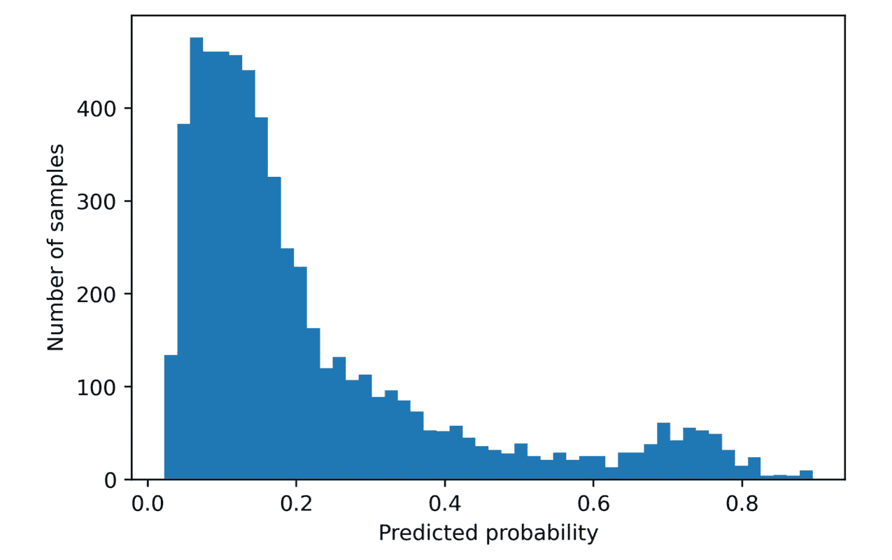

图 7.2：测试集的预测概率分布

测试集预测概率的直方图显示大多数预测集中在 `[0, 0.2]` 范围内。换句话说，根据模型，大多数借款人违约的概率在 0 到 20% 之间。然而，似乎有一小部分借款人存在更高的风险，集中在 0.7 附近。

检查模型在不同预测违约风险区域表现的直观方式是创建一个十分位图表，该图表根据预测概率的十分位将借款人分组。在每个十分位中，我们可以计算真实的违约率。我们预计会看到从最低预测十分位到最高预测十分位违约率的稳步上升。

我们可以像在 *练习 6.01* 中那样，使用 pandas 的 `qcut` 计算十分位数，*随机网格搜索调优 XGBoost 超参数*：

```py
deciles, decile_bin_edges = pd.qcut(x=test_set_pred_proba,\
                                    q=10,\
                                    retbins=True)
```

在这里，我们正在拆分测试集的预测概率，这些预测概率通过 `x` 关键字参数提供。我们希望将它们分成 10 个大小相等的区间，预测概率最低的 10% 在第一个区间，以此类推，因此我们设置 `q=10` 分位数。然而，你可以将其分成任何数量的区间，比如 20（百分位）或 5（五分位）。由于我们设置了 `retbins=True`，区间的边界会保存在 `decile_bin_edges` 变量中，而十分位标签的序列则保存在 `deciles` 中。我们可以查看创建 10 个区间所需的 11 个区间边界：

```py
decile_bin_edges
```

这应当产生如下图所示：

```py
array([0.02213463, 0.06000734, 0.08155108, 0.10424594, 0.12708404,
       0.15019046, 0.18111563, 0.23032923, 0.32210371, 0.52585585,
       0.89491451])
```

为了使用 `decile` 序列，我们可以将其与测试集的真实标签和预测概率合并成一个 DataFrame：

```py
test_set_df = pd.DataFrame({'Predicted probability':test_set_pred_proba,\
                            'Prediction decile':deciles,\
                            'Outcome':y_test_all})
test_set_df.head()
```

DataFrame 的前几行应如下所示：

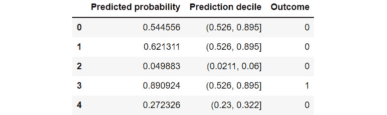

图 7.3：包含预测概率和十分位数的 DataFrame

在 DataFrame 中，我们可以看到每个样本都被标注上了一个十分位区间，这个区间通过包含预测概率的区间边界来指示。结果显示了真实标签。我们希望在十分位图表中展示的是真实的违约率。为此，我们可以使用 pandas 的 `groupby` 功能。首先，我们通过对 `decile` 列进行分组来创建一个 `groupby` 对象：

```py
test_set_gr = test_set_df.groupby('Prediction decile')
```

`groupby`对象可以通过其他列进行聚合。特别是在这里，我们关注的是每个十分位箱中的违约率，它是`outcome`变量的平均值。我们还计算了每个箱中数据的计数。由于分位数（如十分位）将总体分成相等大小的箱，因此我们预期计数应该相同或相似：

```py
gr_df = test_set_gr.agg({'Outcome':['count', 'mean']})
```

查看我们的分组 DataFrame，`gr_df`：

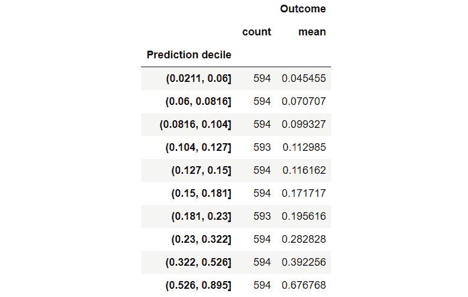

图 7.4：测试集上预测概率的十个分位中的违约率

在*图 7.4*中，我们可以看到所有箱中的计数几乎相等。我们还可以看出，真实的违约率随着十分位的增加而增加，这是我们所期望的，因为我们知道我们的模型表现良好。在可视化数据之前，值得注意的是，这个 DataFrame 有一种特殊的列索引，叫做`Outcome`，以及第二级索引，标签分别为`count`和`mean`。访问具有多重索引的 DataFrame 的数据比我们之前使用的 DataFrame 要稍微复杂一些。我们可以通过以下方式显示列索引：

```py
gr_df.columns
```

这将生成以下结果：

```py
MultiIndex([('Outcome', 'count'),
            ('Outcome',  'mean')],
           )
```

在这里我们可以看到，要访问多重索引中的某一列，我们需要使用元组来指定索引的每一层级，例如，`gr_df[('Outcome','count')]`。虽然在这里 MultiIndex 并不是必需的，因为我们只对一列（`Outcome`）进行了聚合，但在对多个列进行聚合时，它会变得非常有用。

现在我们想要创建一个可视化图表，展示模型的预测如何将借款人准确地分组，并且这些组的违约风险不断上升。我们将展示每个箱中的计数，以及每个箱中的违约风险。由于这些列的量级不同，计数在数百之间，风险在 0 到 1 之间，因此我们应该使用双*y*轴图。为了对图表外观有更多的控制，我们将使用 Matplotlib 函数来创建这个图，而不是通过 pandas 来做。首先，我们绘制每个箱中样本数量的图，并用与图表相同的颜色标注*y*轴刻度，确保清晰。请参阅 GitHub 上的笔记本，如果你是以黑白阅读的，因为颜色对该图很重要。这段代码应该与接下来的代码段在同一个单元格中运行。这里我们创建了一组坐标轴，然后添加了图表并进行了格式化和标注：

```py
ax_1 = plt.axes()
color_1 = 'tab:blue'
gr_df[('Outcome', 'count')].plot.bar(ax=ax_1, color=color_1)
ax_1.set_ylabel('Count of observations', color=color_1)
ax_1.tick_params(axis='y', labelcolor=color_1)
ax_1.tick_params(axis='x', labelrotation = 45)
```

请注意，我们正在为样本大小创建一个`bar`图。我们希望在此基础上添加一条线形图，显示每个箱中的违约率，且该线图使用右侧的*y*轴，但与现有图表共享相同的*x*轴。Matplotlib 为此目的提供了一个叫做`twinx`的方法，该方法可以在`axes`对象上调用，返回一个共享相同*x*轴的新坐标轴对象。我们采取类似的步骤，然后绘制违约率并进行标注：

```py
ax_2 = ax_1.twinx()
color_2 = 'tab:red'
gr_df[('Outcome', 'mean')].plot(ax=ax_2, color=color_2)
ax_2.set_ylabel('Default rate', color=color_2)
ax_2.tick_params(axis='y', labelcolor=color_2)
```

在运行前两个代码片段后，应该会出现以下图形：

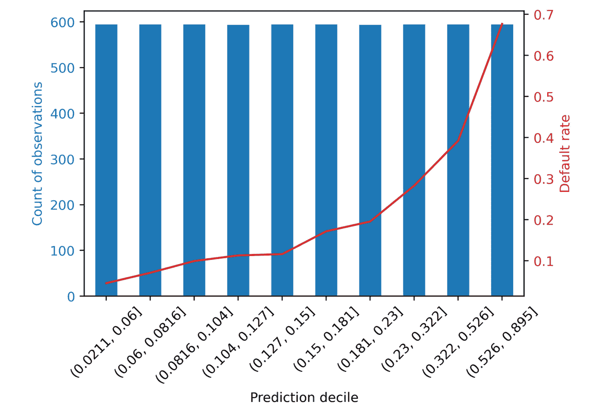

图 7.5：根据模型预测十分位数的违约率

*图 7.5* 包含与 *图 7.4* 中显示的数据框相同的信息，但呈现方式更为美观。很明显，违约风险随着每个十分位数的增加而增加，风险最大的 10%借款人的违约率接近 70%，而风险最小的借款人违约率低于 10%。当一个模型能够有效地区分出违约风险持续增加的借款人群体时，称该模型**倾斜**了所研究的总体。还要注意，违约率在最低的 5 到 7 个十分位数之间相对平坦，这可能是因为这些观察值大多集中在预测风险范围[0, 0.2]中，如*图 7.2*中的直方图所示。

将测试集分成等人口十分位数是评估模型性能的一种方式，特别是在违约风险倾斜方面。然而，客户可能希望查看按不同群体划分的违约率，例如按等间隔箱（例如，将所有预测范围为 0, 0.2)、[0.2, 0.4)等的观察值放在一起，而不管每个箱中的样本大小），或以其他方式。你将在接下来的练习中探索如何在 pandas 中轻松实现这一点。

在接下来的练习中，我们将使用一些统计学概念来帮助创建误差条，包括我们之前学到的**均值的标准误差**和**二项分布的正态近似**。

我们从*第五章*，*决策树和随机森林*中知道，我们可以估计样本均值的方差为 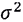 是一个理论上更大总体的未观察到的方差。虽然我们不知道 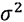，但可以通过我们观察到的样本方差来估计。对于二元变量，样本方差可以计算为 *p(1-p)*，其中 *p* 是成功的比例，或者说是案例研究中的违约比例。根据上面的样本均值方差公式，我们可以代入观察到的方差，然后取平方根得到均值的标准误差：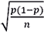。在某些情况下，这个公式也被称为二项分布的正态近似。我们将在下面使用它来为不同模型预测区间的违约率的等间隔图表创建误差条。有关这些概念的更多细节，建议查阅统计学教材。

## 练习 7.01：等间隔图表

在这个练习中，你将制作一个类似于*图 7.5*所示的图表；然而，与你将测试集拆分为预测概率的等人口十分位不同，你将使用预测概率的等间隔区间。如果业务伙伴希望使用某些得分范围来思考潜在的基于模型的策略，指定这些区间可能会有帮助。你可以使用 pandas 的 `cut` 来创建等间隔区间，或者使用一个区间边界数组创建自定义区间，这类似于你使用 `qcut` 来创建分位标签的方式：

注意

你可以在 [`packt.link/4Ev3n`](https://packt.link/4Ev3n) 找到这个练习的 Jupyter notebook。

1.  使用以下代码创建等间隔标签系列，针对 5 个区间：

    ```py
    equal_intervals, equal_interval_bin_edges = \
        pd.cut(x=test_set_pred_proba,\
               bins=5,\
               retbins=True)
    ```

    请注意，这与调用 `qcut` 类似，不同的是在这里使用 `cut` 时，我们可以通过向 `bins` 参数传递一个整数来指定我们想要的等间隔区间数。你也可以为此参数提供一个数组来指定自定义的区间边界。

1.  使用以下代码检查等间隔区间边界：

    ```py
    equal_interval_bin_edges
    ```

    结果应如下所示：

    ```py
    array([0.02126185, 0.1966906 , 0.37124658, 0.54580256, 0.72035853,
           0.89491451])
    ```

    你可以通过从第一个元素到倒数第二个元素的子数组与从第二个元素开始到最后一个元素的子数组相减，来确认这些区间边界之间是等间隔的。

1.  使用以下代码检查区间边界之间的间隔：

    ```py
    equal_interval_bin_edges[1:] - equal_interval_bin_edges[:-1]
    ```

    结果应如下所示：

    ```py
    array([0.17542876, 0.17455598, 0.17455598, 0.17455598, 0.17455598])
    ```

    你可以看到区间边界之间的距离大致相等。第一个区间边界比最小的预测概率稍小，你可以自行确认这一点。

    为了创建一个类似于*图 7.5*的图表，首先我们需要将区间标签与响应变量放入一个 DataFrame，就像我们之前使用十分位标签时做的那样。我们还将预测概率放入 DataFrame 以供参考。

1.  创建一个包含预测概率、区间标签和测试集响应变量的 DataFrame，如下所示：

    ```py
    test_set_bins_df =\
    pd.DataFrame({'Predicted probability':test_set_pred_proba,\
                  'Prediction bin':equal_intervals,\
                  'Outcome':y_test_all})
    test_set_bins_df.head()
    ```

    结果应如下所示：

    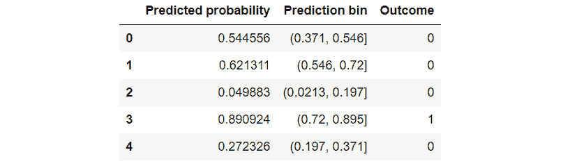

    图 7.6：包含等间隔区间的 DataFrame

    我们可以使用这个 DataFrame 按照区间标签进行分组，然后获取我们感兴趣的指标：表示默认率和每个区间内样本数量的聚合数据。

1.  使用以下代码按区间标签分组并计算各区间内的默认率和样本数：

    ```py
    test_set_equal_gr = test_set_bins_df.groupby('Prediction bin')
    gr_eq_df = test_set_equal_gr.agg({'Outcome':['count', 'mean']})
    gr_eq_df
    ```

    结果的 DataFrame 应该如下所示：

    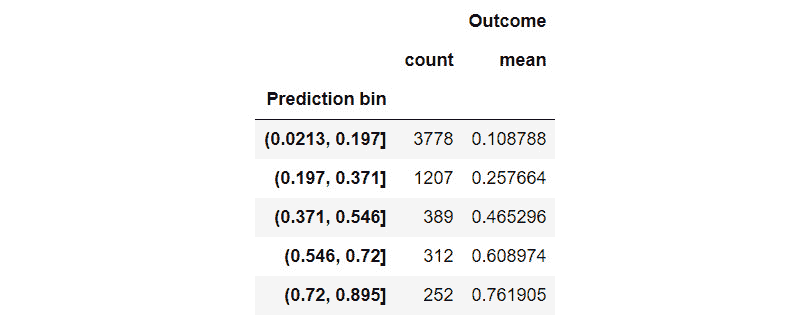

    图 7.7：五个等间隔区间的分组数据

    请注意，与分位数不同，这里每个区间内的样本数是不同的。默认率在各区间之间呈现一致的增长趋势。让我们绘制这个 DataFrame，创建一个类似于*图 7.5*的可视化。

    在创建此可视化之前，为了考虑到由于这些范围内的样本量减少，高预测概率的违约率估计可能不够稳健，我们将计算违约率的标准误差。

1.  使用以下代码计算箱体内违约率的标准误差：

    ```py
    p = gr_eq_df[('Outcome', 'mean')].values
    n = gr_eq_df[('Outcome', 'count')].values
    std_err = np.sqrt(p * (1-p) / n)
    std_err
    ```

    结果应该如下所示：

    ```py
    array([0.00506582, 0.01258848, 0.02528987, 0.02762643, 0.02683029])
    ```

    注意，对于那些高分范围且样本较少的箱体，标准误差较大。将这些标准误差与违约率一起可视化会非常有帮助。

1.  使用以下代码创建一个违约率与样本大小的等间隔图。该代码与 *图 7.5* 所需的代码非常相似，不同之处在于这里我们使用 `yerr` 关键字和上一阶段的结果，在违约率图上加入了误差条：

    ```py
    ax_1 = plt.axes()
    color_1 = 'tab:blue'
    gr_eq_df[('Outcome', 'count')].plot.bar(ax=ax_1, color=color_1)
    ax_1.set_ylabel('Count of observations', color=color_1)
    ax_1.tick_params(axis='y', labelcolor=color_1)
    ax_1.tick_params(axis='x', labelrotation = 45)
    ax_2 = ax_1.twinx()
    color_2 = 'tab:red'
    gr_eq_df[('Outcome', 'mean')].plot(ax=ax_2, color=color_2,
                                       yerr=std_err)
    ax_2.set_ylabel('Default rate', color=color_2)
    ax_2.tick_params(axis='y', labelcolor=color_2)
    ```

    结果应该如下所示：

    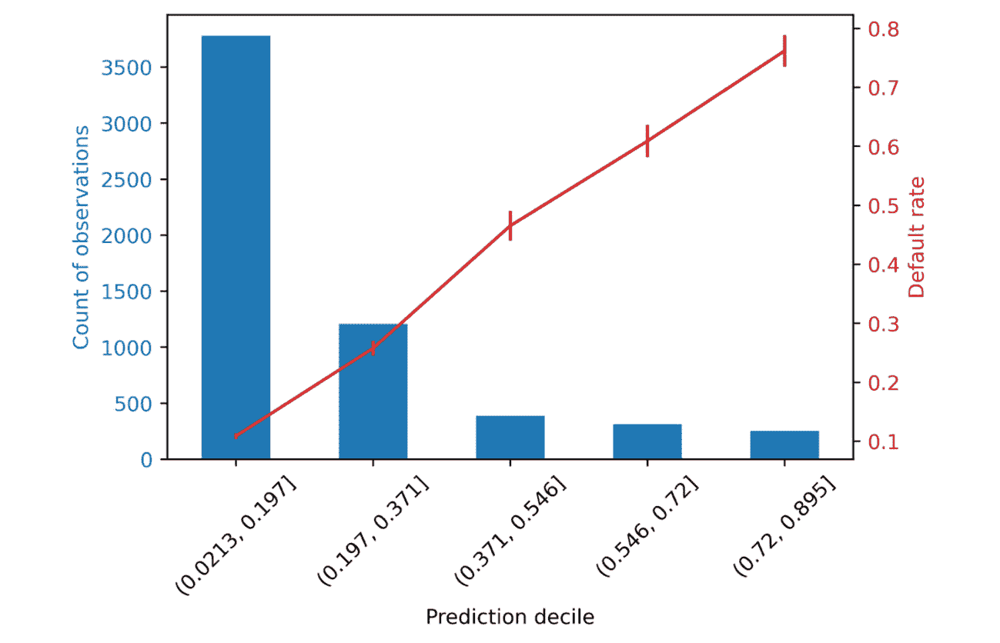

图 7.8：等间隔箱体中的违约率与样本数量的图

我们可以在 *图 7.8* 中看到，不同箱体中的样本数量差异较大，与分位数方法形成对比。尽管高分数箱体中的样本相对较少，导致较大的标准误差，但违约率图上的误差条仍然较小，相比于从低分到高分箱体的总体趋势，我们可以对这一趋势有信心。

## 预测概率的校准

*图 7.8* 的一个有趣特点是，违约率的折线图从一个箱体到下一个箱体大致增加相同的量。与 *图 7.5* 中的十分位图对比，违约率最初增加缓慢，然后迅速增加。还要注意，违约率大致是每个箱体内预测概率边缘的中点。这意味着违约率与每个箱体的平均模型预测相似。换句话说，我们的模型不仅能有效地按照从低到高的违约风险对借款人进行排序（通过 ROC AUC 量化），而且还似乎能够准确预测违约概率。

衡量预测概率与实际概率的匹配程度是**校准****概率**的目标。概率校准的标准度量遵循上述讨论的概念，称为**期望校准误差**（**ECE**），定义为：


图 7.9：期望校准误差

其中，索引 *i* 从 1 到箱体数目（*N*）范围，*F*i 是所有样本中落入箱体 *i* 的比例，*o*i 是箱体 *i* 中为正样本（即在案例研究中为违约者）的比例，*e*i 是箱体 *i* 内预测概率的平均值。

我们可以使用一个与*图 7.4*中非常相似的 DataFrame 来计算测试集中分位区间内预测概率的 ECE，这个 DataFrame 用于创建分位图。我们唯一需要添加的是每个区间内的平均预测概率。按如下方式创建这样的 DataFrame：

```py
cal_df = test_set_gr.agg({'Outcome':['count', 'mean'],\
                          'Predicted probability':'mean'})
cal_df
```

输出的 DataFrame 应如下所示：

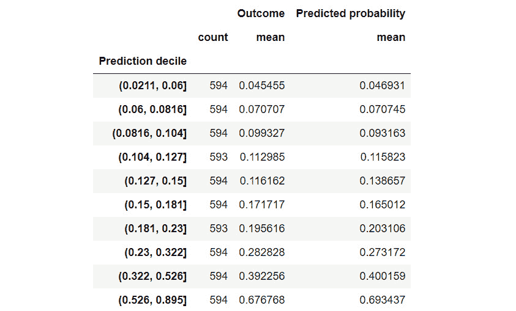

图 7.10：计算 ECE 指标的 DataFrame

为了方便起见，我们定义一个变量`F`，表示每个区间中样本的比例。这是从上面的 DataFrame 中每个区间的计数除以样本总数，后者是从测试集响应变量的形状中获得的：

```py
F = cal_df[('Outcome', 'count')].values/y_test_all.shape[0]
F
```

输出应为：

```py
array([0.10003368, 0.10003368, 0.10003368, 0.09986527, 0.10003368,
       0.10003368, 0.09986527, 0.10003368, 0.10003368, 0.10003368])
```

因此，每个区间大约包含 10%的样本。这是预期的，当然，因为区间是使用分位数方法创建的。然而，对于其他分箱方法，区间中的样本数量可能不相等。现在让我们在代码中实现 ECE 的公式来计算这个指标：

```py
ECE = np.sum(
    F
    * np.abs(
             cal_df[('Outcome', 'mean')]
             - cal_df[('Predicted probability', 'mean')]))
ECE
```

输出应为：

```py
0.008144502190176022
```

这个数字代表我们最终模型在测试集上的 ECE。单独来看，这个数字并没有太多意义。然而，像这样的指标可以在时间上进行监控，在模型投入生产并在实际应用中使用之后。如果 ECE 开始增加，这表示模型的校准性变差，可能需要重新训练，或者对输出应用校准过程。

检查我们预测概率的校准的一个更直观方法是绘制 ECE 所需的各个成分，特别是响应变量的真实违约率，与每个区间内模型预测的平均值进行对比。在此基础上，我们加上一条 1-1 线，表示完美校准，作为参考点：

```py
ax = plt.axes()
ax.plot([0, 0.8], [0, 0.8], 'k--', linewidth=1,
        label='Perfect calibration')
ax.plot(cal_df[('Outcome', 'mean')],\
        cal_df[('Predicted probability', 'mean')],\
        marker='x',\
        label='Model calibration on test set')
ax.set_xlabel('True default rate in bin')
ax.set_ylabel('Average model prediction in bin')
ax.legend()
```

结果图应如下所示：

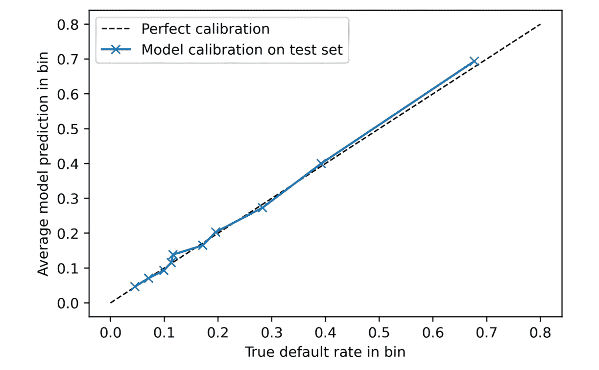

图 7.11：预测概率的校准图

*图 7.11*显示了模型预测的概率与真实的违约率非常接近，因此模型似乎被良好校准。为了获得更多见解，你可以尝试自己向这个图添加误差条作为练习。还要注意，scikit-learn 提供了一个函数来计算创建*图 7.11*所需的信息：`sklearn.calibration.calibration_curve`。然而，这个函数并不会返回每个区间的样本大小。

对于概率校准，另一个需要注意的点是，一些处理类别不平衡的方法，如过采样或欠采样，会改变训练数据集中类别的比例，这会影响预测的概率，并可能使其不那么准确。不过，这一点可能不那么重要，特别是与模型根据借款人违约风险进行排名的能力（通过 ROC AUC 衡量）相比，这取决于客户的需求。

# 财务分析

我们目前计算的模型性能指标基于一些抽象的度量，可以应用于分析任何分类模型：模型的准确度、模型在不同阈值下识别真阳性与假阳性能力的准确性（ROC AUC）、正向预测的正确性（精确度），或诸如斜坡风险等直观的度量。这些指标对于理解模型的基本工作原理非常重要，并且在机器学习领域广泛使用，因此理解它们非常关键。然而，在将模型应用于商业案例时，我们并不能总是直接使用这些性能指标来制定如何使用模型来指导商业决策或评估模型可能创造的价值的策略。为了更进一步地将预测概率和阈值的数学世界与成本和收益的商业世界联系起来，通常需要进行某种财务分析。

为了帮助客户进行此分析，数据科学家需要了解根据模型预测可能采取的决策和行动。这应该是与客户的对话内容，最好在项目生命周期的早期进行。我们将其留到本书的最后，以便建立对预测建模是什么以及如何工作的基础理解。然而，在项目开始时了解模型使用的商业背景，可以让你为模型性能设定目标，并在整个项目过程中追踪这些目标，就像我们追踪不同模型的 ROC AUC 一样。将模型性能指标转化为财务术语是本节的主题。

对于像案例研究中的二分类模型，数据科学家需要了解以下几个问题的答案，以帮助客户弄清楚如何使用该模型：

+   客户希望通过模型帮助做出哪些决策？

+   如何利用二分类模型的预测概率来帮助做出这些决策？

+   它们是是/否决策吗？如果是，那么选择一个单一的预测概率阈值就足够了。

+   是否会根据模型结果做出超过两级的活动决策？如果是，那么选择两个或更多的阈值，例如将预测结果分为低、中、高风险，可能是解决方案。例如，预测概率低于 0.5 可以视为低风险，0.5 到 0.75 之间为中风险，0.75 以上为高风险。

+   根据模型指导，采取不同行动方案的成本是什么？

+   从模型指导下采取成功行动可能获得的潜在好处是什么？

## 与客户的财务对话

我们向案例研究客户询问了上述要点，得知以下信息：对于那些高风险违约的信贷账户，客户正在设计一个新项目，为账户持有人提供个性化的咨询，鼓励他们按时支付账单，或在无法按时支付的情况下提供替代付款选项。信贷咨询由经过培训的客户服务代表在呼叫中心进行。每次咨询的费用为新台币 7,500 元，每次咨询的预期成功率为 70%，意味着平均来说，70% 接到提供咨询电话的客户会按时支付账单，或者采取对债权人可接受的替代安排。成功咨询的潜在收益在于，如果账户本应违约但在咨询后未违约，则账户的每月账单金额将视为节省。目前，违约账户的每月账单会被报告为损失。

在与客户进行前述对话后，我们已经获得了进行财务分析所需的材料。客户希望我们帮助他们决定应该联系哪些成员并提供信贷咨询。如果我们能帮助他们缩小需要联系进行咨询的人员名单，就能通过避免不必要和昂贵的联系方式为他们节省费用。客户在信贷咨询上的有限资源将更合适地用于高风险违约账户。这应该能够通过预防违约带来更大的节省。此外，客户告诉我们，如果我们能给他们一个关于值得提供多少次咨询的概念，我们的分析可以帮助他们申请咨询项目的预算。

在进行财务分析时，我们看到模型将帮助客户做出的决策是逐个账户进行的“是/否”决策：是否为给定账户的持有人提供咨询。因此，我们的分析应该专注于找到一个合适的预测概率阈值，通过该阈值我们可以将账户分为两组：高风险账户将接受咨询，低风险账户则不接受。

## 练习 7.02: 成本与节省的描述

模型输出与客户将做出的业务决策之间的联系，归结为为预测概率选择一个阈值。因此，在本次练习中，我们将描述咨询程序的预期成本（以提供单独咨询会议的成本表示）以及预期节省（以预防违约的节省表示），这些将在一系列阈值下进行计算。每个阈值下会有不同的成本和节省，因为每个阈值预计会导致不同数量的正预测结果，并且在这些结果中会有不同数量的真正正例。第一步是创建一个潜在阈值的数组。我们将使用从 0 到 1，步长为 0.01 的值。执行以下步骤以完成本次练习：

注意

本次练习的 Jupyter notebook 可以在这里找到：[`packt.link/yiMEr`](https://packt.link/yiMEr)。基于本章前面的结果，已在 notebook 中添加了准备数据的额外步骤。请确保在进行本次练习前，先执行 notebook 中展示的前提步骤。

1.  使用以下代码创建一个阈值范围，以计算咨询的预期成本和收益：

    ```py
    thresholds = np.linspace(0, 1, 101)
    ```

    这会在 0 到 1 之间（包括 0 和 1）创建 101 个等间距的点。

    现在，我们需要了解预防违约的潜在节省。为了精确计算这一点，我们需要知道下个月的月度账单。然而，客户已经告知我们，在他们需要创建待联系账户持有者名单时，这些数据将无法提供。因此，为了估算潜在节省，我们将使用最近的月度账单。

    我们将使用测试数据来创建此分析，因为它提供了模型交付给客户后使用的模拟：在未用于模型训练的新账户上。

1.  确认测试数据特征数组中对应最近一个月账单的索引：

    ```py
    features_response[5]
    ```

    输出应为：

    ```py
    'BILL_AMT1'
    ```

    索引 5 对应的是最近几个月的账单，我们稍后会用到。

1.  将咨询成本存储在一个变量中，以便用于分析：

    ```py
    cost_per_counseling = 7500
    ```

    我们还知道，客户告知我们，咨询程序的效果并不是 100%的。我们应该在分析中考虑这一点。

1.  存储客户提供的有效性率，以便用于分析：

    ```py
    effectiveness = 0.70
    ```

    现在，我们将计算每个阈值的成本和节省。我们会逐步讲解每个计算过程，但目前我们需要创建空数组来存储每个阈值的结果。

1.  创建空数组来存储分析结果。我们将在后续步骤中解释每个数组的作用：

    ```py
    n_pos_pred = np.empty_like(thresholds)
    total_cost = np.empty_like(thresholds)
    n_true_pos = np.empty_like(thresholds)
    total_savings = np.empty_like(thresholds)
    ```

    这些创建了与我们分析中的阈值数量相同的空数组。我们将遍历每个阈值值来填充这些数组。

1.  创建一个`counter`变量并打开一个`for`循环来遍历各个阈值：

    ```py
    counter = 0
    for threshold in thresholds:
    ```

    对于每个阈值，根据预测概率高于该阈值的数量，会有不同数量的正向预测。这些预测对应的是被认为会违约的账户。每个被预测为违约的账户都会接到一次咨询电话，这会产生相应的费用。因此，这是成本计算的第一部分。

1.  确定在该阈值下哪些账户获得了正向预测：

    ```py
        pos_pred = test_set_pred_proba > threshold
    ```

    `pos_pred` 是一个布尔数组。`pos_pred` 的总和表示在该阈值下预测的违约数量。

1.  计算给定阈值下的正向预测数量：

    ```py
        n_pos_pred[counter] = sum(pos_pred)
    ```

1.  计算给定阈值下的咨询总成本：

    ```py
        total_cost[counter] \
            = n_pos_pred[counter] * cost_per_counseling
    ```

    现在，我们已经了解了咨询项目在每个阈值下的可能成本，我们需要查看预期的节省。在提供咨询服务给正确的账户持有人时，会获得节省：即那些本来会违约的账户。从分类问题的角度来看，这些是正向预测，其响应变量的真实值也是正向的——换句话说，是真正的正向预测。

1.  基于正向预测数组和响应变量，确定哪些账户是真正的正向预测：

    ```py
        true_pos = pos_pred & y_test_all.astype(bool)
    ```

1.  通过对真正的正向预测数组求和来计算真正的正向预测数量：

    ```py
        n_true_pos[counter] = sum(true_pos)
    ```

    我们从成功为原本会违约的账户持有人提供咨询所能获得的节省，取决于每个预防违约的节省金额以及咨询的有效性率。我们无法预防每一个违约。

1.  使用真正的正向预测数量、预防违约的节省（通过上个月的账单估算）和咨询的有效性率来计算每个阈值下的预期节省：

    ```py
        total_savings[counter] = np.sum(
            true_pos.astype(int)
            * X_test_all[:,5]
            * effectiveness
            ) 
    ```

1.  增加计数器：

    ```py
    counter += 1
    ```

    *步骤 5* 到 *13* 应该作为 `for` 循环在 Jupyter Notebook 的一个单元格中运行。之后，可以通过将节省减去成本来计算每个阈值的净节省。

1.  通过将节省和成本数组相减，计算所有阈值的净节省：

    ```py
    net_savings = total_savings - total_cost
    ```

    现在，我们可以可视化通过为合适的账户持有人提供咨询服务，我们可能帮助客户节省多少钱。让我们来可视化一下。

1.  按照如下方式绘制净节省与阈值的关系：

    ```py
    mpl.rcParams['figure.dpi'] = 400
    plt.plot(thresholds, net_savings)
    plt.xlabel('Threshold')
    plt.ylabel('Net savings (NT$)')
    plt.xticks(np.linspace(0,1,11))
    plt.grid(True)
    ```

    结果图应如下所示：

    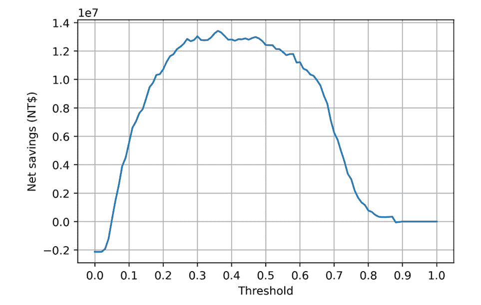

    图 7.12：净节省与阈值的关系图

    图表显示，阈值的选择非常重要。虽然在许多不同的阈值下都能实现净节省，但看起来通过将阈值设置在大约 0.25 到 0.5 之间的某个范围内，可以获得最大的净节省。

    让我们确认产生最大节省的最佳阈值，并查看节省的具体数额。

1.  使用 NumPy 的`argmax`查找净节省数组中最大元素的索引：

    ```py
    max_savings_ix = np.argmax(net_savings)
    ```

1.  显示产生最大净节省的阈值：

    ```py
    thresholds[max_savings_ix]
    ```

    输出应如下所示：

    ```py
    0.36
    ```

1.  显示最大的净节省：

    ```py
    net_savings[max_savings_ix]
    ```

    输出应如下所示：

    ```py
    13415710.0
    ```

我们发现，最大净节省发生在 0.36 的阈值下。在这个阈值下，所实现的净节省金额超过 1300 万新台币，针对这个测试数据集中的账户。这些节省需要根据客户所服务的账户数量进行规模化估算，以推算出总的可能节省金额，前提是我们所使用的数据能够代表所有这些账户。

然而需要注意的是，节省金额在约 0.5 的阈值之前大致相同，如*图 7.12*所示。

随着阈值的增加，我们在“提高标准”，即要求客户的风险更高，才能与他们联系并提供咨询服务。从 0.36 提高到 0.5 意味着我们只会联系那些风险较高、概率大于 0.5 的客户。这意味着联系的客户较少，从而减少了项目的前期成本。*图 7.12* 表明，即使我们联系较少的客户，可能仍然能够创造大致相同的净节省。虽然净效应相同，但咨询的初始支出较小。这对客户来说可能是更可取的。我们将在接下来的活动中进一步探讨这个概念。

## 活动 7.01：得出财务见解

财务分析的原始数据已完成。然而，在本活动中，你的目标是从这些结果中生成一些额外的见解，为客户提供更多的背景信息，帮助他们理解我们构建的预测模型如何为他们创造价值。特别地，我们已经查看了模型构建中保留的测试集结果。客户可能拥有比他们提供给我们的更多的账户，这些账户能代表他们的业务。你应该向他们报告可以轻松扩展到他们业务规模的结果，具体来说，是以账户数量为基础。

我们还可以帮助客户了解这个项目的成本；虽然净节省是需要考虑的一个重要数字，但客户必须在实现这些节省之前为咨询项目提供资金。最后，我们将把财务分析与标准的机器学习模型性能指标关联起来。

一旦完成活动，你应该能够向客户传达咨询项目的初步成本，并获得诸如下图所示的精确率和召回率的图表：

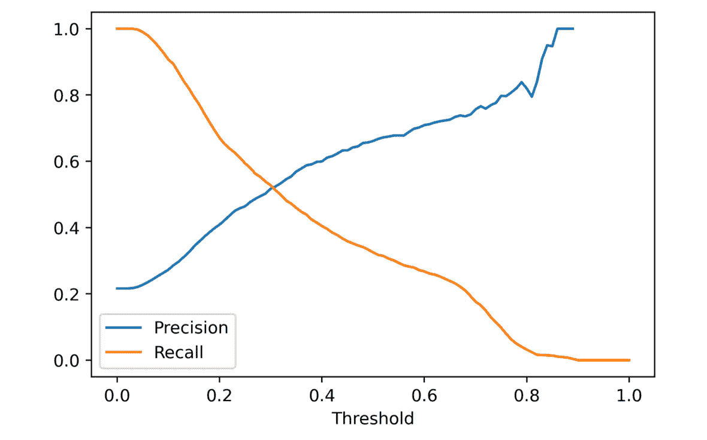

图 7.13：预期的精确率-召回率曲线

这个曲线在解释模型在不同阈值下创造的价值时非常有用。

执行以下步骤以完成活动：

注意

包含此活动代码的 Jupyter 笔记本可以在此处找到：[`packt.link/2kTVB`](https://packt.link/2kTVB)。根据本章先前的结果，已向笔记本添加了为此活动准备数据的额外步骤。请按照笔记本中呈现的先决步骤执行这些步骤。

1.  使用测试集，计算如果没有辅导计划，所有违约的成本。

1.  计算辅导计划可以减少违约成本的百分比。

1.  计算在最优阈值下每个帐户的净储蓄，考虑可能能够辅导的所有帐户，换句话说，相对于整个测试集。

1.  绘制每个阈值下每个帐户的净储蓄与每个帐户的辅导成本。

1.  绘制在每个阈值下预测为正的帐户的比例（这称为“标志率”）。

1.  绘制测试数据的精确率-召回率曲线。

1.  在*y*-轴上分别绘制精确率和召回率，对应*x*-轴上的阈值。

    注意

    通过此链接可找到此活动的解决方案。

# 关于向客户交付预测模型的最终思考

我们现在已经完成了建模活动，并创建了财务分析，以指示客户如何使用模型。虽然我们已完成了数据科学家的基本智力贡献，但需要与客户达成一致意见，以确定所有这些贡献的交付形式。

关键贡献是训练模型中体现的预测能力。假设客户可以使用我们用 XGBoost 创建的训练模型对象，此模型可以像我们所做的那样保存到磁盘并发送给客户。然后，客户可以在其工作流程中使用它。这种模型交付路径可能需要数据科学家与客户组织的工程师合作，以在客户基础设施中部署模型。

或者，可能需要将模型表达为数学方程（例如，使用逻辑回归系数）或一组 if-then 语句（如决策树或随机森林），客户可以使用 SQL 实现预测能力。虽然由于可能存在许多树和许多级别，将随机森林表达为 SQL 代码是很繁琐的，但有软件包可以根据训练好的 scikit-learn 模型为您创建此表示（例如，[`pypi.org/project/SKompiler/`](https://pypi.org/project/SKompiler/)）。

注意：云平台用于模型开发和部署

在本书中，我们使用 scikit-learn 和 XGBoost 包在本地计算机上构建预测模型。最近，云平台如**亚马逊网络服务**（**AWS**）通过 Amazon SageMaker 等服务提供了机器学习能力。SageMaker 包含了一个 XGBoost 的版本，您可以使用类似于我们在这里所做的语法来训练模型。在本书中展示的方法和亚马逊 SageMaker 的模型训练实现之间可能存在细微差异，建议您在每一步检查您的工作，以确保结果符合预期。例如，在 SageMaker 中使用早停止来拟合 XGBoost 模型可能需要额外的步骤，以确保训练的模型使用最佳迭代进行预测，而不是在训练停止时的最后迭代。

云平台如 AWS 很有吸引力，因为它们可能极大地简化将训练好的机器学习模型集成到客户的技术堆栈中的过程，而这在许多情况下可能已经建立在云平台上。

在使用模型进行预测之前，客户需要*确保数据的准备方式与我们之前构建模型时相同*。例如，删除所有特征值为`0`的样本以及清理`EDUCATION`和`MARRIAGE`特征的操作必须与我们在本章前面演示的方式相同。另外，还有其他可能的交付模型预测的方式，比如客户将特征提供给数据科学家，然后接收预测结果。

讨论交付内容的另一个重要考虑因素是：*预测结果应该以什么格式交付？* 二元分类模型的典型交付格式，例如我们为案例研究创建的模型，是按照预测违约概率对账户进行排名。预测的概率应该与账户 ID 以及客户希望的其他列一起提供。这样，当呼叫中心逐个联系账户持有人以提供咨询时，他们可以首先联系那些违约风险最高的人，然后根据时间和资源的允许继续联系优先级较低的账户持有人。客户应该被告知使用哪个预测概率阈值，以获得最高的净节省。这个阈值将代表按照违约概率排名的账户持有人联系的终止点。

## 模型监控

根据客户与数据科学家的合作时间，持续监控模型性能随时间的变化始终是有益的，因为它在使用过程中是否保持稳定或逐渐下降？在评估此案例时，需要牢记，如果账户持有人正在接受辅导，他们的违约概率可能会低于预测的概率，因为新辅导计划的预期效果。因此，为了测试辅导计划的有效性，最好将一部分随机选择的账户持有人保留下来，这部分人将不会接受任何辅导，无论他们的违约风险如何。这部分人被称为**对照组**，它应该相对于接受辅导的账户群体较小，但足够大以便得出统计学上显著的推论。

尽管本书的范围并不包括如何设计和使用对照组的细节，但在这里可以简要说明，模型的预测能力可以通过对照组进行评估，因为他们没有接受任何辅导，类似于模型训练时使用的账户群体。对照组的另一个好处是，可以将违约率及因违约而产生的财务损失与那些接受了模型引导辅导计划的账户进行比较。如果该计划按预期运行，接受辅导的账户应具有较低的违约率和较小的违约财务损失。对照组可以提供证据，证明该计划实际上是有效的。

注意：选择性治疗的高级建模技术——提升建模

当一家企业考虑是否有选择地为其客户提供昂贵的治疗方案（如案例研究中的辅导计划）时，应考虑使用一种被称为提升建模的技术。提升建模旨在基于个体来确定治疗的有效性。我们假设电话辅导对客户的有效性平均为 70%。然而，效果可能因客户而异；一些客户更容易接受，另一些则不太容易。有关提升建模的更多信息，请参见[`www.steveklosterman.com/uplift-modeling/`](https://www.steveklosterman.com/uplift-modeling/)。

一种相对简单的监控模型实施方法是查看模型预测的分布是否随着时间变化，与用于模型训练的人群相比有所变化。我们在*图 7.2*中绘制了测试集的预测概率直方图。如果预测概率的直方图形状发生了显著变化，这可能表明特征发生了变化，或者特征与响应之间的关系发生了变化，模型可能需要重新训练或重建。为了量化分布的变化，感兴趣的读者可以查阅统计资源，学习卡方拟合优度检验或 Kolmogorov-Smirnov 检验。如果模型预测的分布发生变化，或者根据所选择的阈值，预测违约账户的比例发生明显变化，也可能会显现出来。

本章及全书中呈现的所有其他模型评估指标也可以是监控模型在生产环境中表现的好方法：十分位数图和等间距图、校准、ROC AUC 等。

## 预测建模中的伦理问题

随着机器学习的应用扩展到大多数现代企业，模型是否做出公平预测的问题受到了更多关注。公平性可以通过模型是否同样擅长为不同受保护类群体的成员做出预测来评估，例如，不同性别群体。

在本书中，我们采用了将性别从模型特征中移除的方法。然而，其他特征可能有效地充当性别的代理，因此即使性别没有作为特征使用，模型也可能对不同性别群体产生偏见的结果。筛查这种偏见可能性的一个简单方法是检查模型中使用的特征是否与受保护类群体有特别高的关联性，例如，可以通过使用 t 检验来进行检查。如果是这样，最好将这些特征从模型中移除。

如何判断模型是否公平，以及如果不公平，应该如何处理，这个问题是当前研究的热点。我们鼓励你熟悉像 AI Fairness 360（[`aif360.mybluemix.net/`](https://aif360.mybluemix.net/)）这样的努力，这些努力正在提供工具，以提高机器学习中的公平性。在开始与公平性相关的工作之前，理解客户对于公平的定义至关重要，因为不同国家的法律和客户组织的具体政策可能会导致公平的定义因地区而异。

# 总结

在本章中，你学习了几种分析技术，以提供对模型性能的洞察，例如按模型预测区间划分的违约率的十分位和等距图表，以及如何调查模型校准的质量。通过使用模型测试集得出这些洞察并计算诸如 ROC AUC 等指标是很好的，因为这旨在代表模型在真实世界中新数据上的表现。

我们还看到如何进行模型性能的财务分析。虽然我们将此部分留到了书的最后，但对与模型决策相关的成本和节省的理解应该从典型项目开始时就有所了解。这些使数据科学家能够朝着通过增加利润或节省成本的具体目标努力。对于二分类模型，这一过程的关键步骤是选择一个预测概率阈值，以此来宣布一个正向预测，从而最大化由模型指导决策所带来的利润或节省。

最后，我们考虑了与交付和监控模型相关的任务，包括建立对照组以监控模型性能并测试任何由模型输出指导的程序有效性的想法。对照组的结构和模型监控策略会因项目而异，因此你需要在每个新案例中确定合适的行动方案。为了进一步了解在现实世界中使用模型，你应继续研究如实验设计、可以用于训练和部署模型的云平台（例如 AWS）以及预测建模中的公平性问题等主题。

你现在已经完成了项目，并准备向客户交付你的研究成果。除了将训练好的模型保存到磁盘或你可能提供给客户的其他数据产品或服务外，你还可能希望创建一个演示文稿，通常是一个幻灯片展示，详细说明你的进展。此类演示文稿的内容通常包括问题陈述、数据探索和清理结果、你构建的不同模型的性能比较、模型解释（如 SHAP 值），以及展示你的工作价值的财务分析。在制作你的工作演示文稿时，通常更好的是*通过图片讲述故事，而不是大量的文字*。在整本书中，我们展示了许多可用于此目的的可视化技术，你应继续探索描绘数据和建模结果的方式。

始终确保询问客户他们可能希望在演示文稿中看到的具体内容，并确保回答他们所有的问题。当客户看到你能够以易于理解的方式为他们创造价值时，你就成功了。
