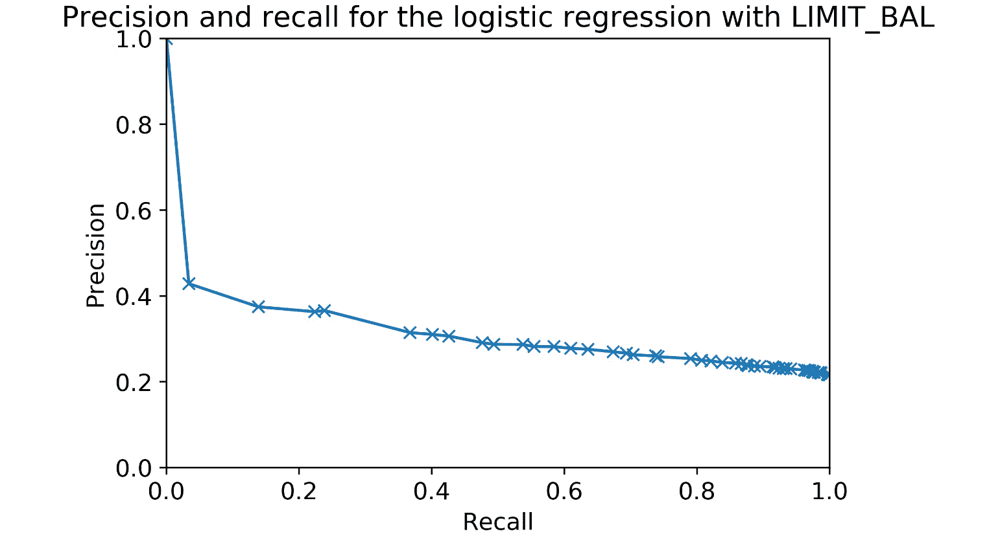
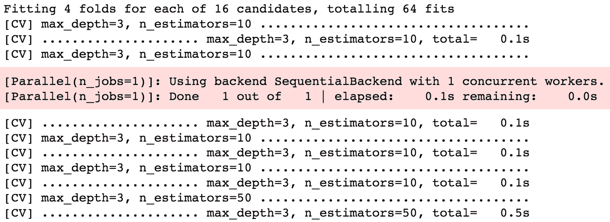

# 附录

# 1\. 数据探索与清理

## 活动 1.01：探索数据集中剩余的财务特征

**解决方案：**

在开始之前，设置好你的环境并按如下方式加载已清理的数据集：

```py
import pandas as pd
import matplotlib.pyplot as plt #import plotting package
#render plotting automatically
%matplotlib inline
import matplotlib as mpl #additional plotting functionality
mpl.rcParams['figure.dpi'] = 400 #high resolution figures
mpl.rcParams['font.size'] = 4 #font size for figures
from scipy import stats
import numpy as np
df = pd.read_csv('../../Data/Chapter_1_cleaned_data.csv')
```

1.  为剩余的财务特征创建特征名称列表。

    这些可以分为两组，因此我们将像之前一样列出特征名称，以便一起分析。你可以使用以下代码来实现：

    ```py
    bill_feats = ['BILL_AMT1', 'BILL_AMT2', 'BILL_AMT3', \
                  'BILL_AMT4', 'BILL_AMT5', 'BILL_AMT6']
    pay_amt_feats = ['PAY_AMT1', 'PAY_AMT2', 'PAY_AMT3', \
                     'PAY_AMT4', 'PAY_AMT5', 'PAY_AMT6']
    ```

1.  使用`.describe()`方法查看账单金额特征的统计摘要。反思你所看到的内容。这合理吗？

    使用以下代码查看摘要：

    ```py
    df[bill_feats].describe()
    ```

    输出应该如下所示：

    

    图 1.47：过去 6 个月账单金额的统计描述

    我们看到平均每月账单大约是 40,000 到 50,000 新台币。建议你检查一下本地货币的汇率。例如，1 美元约等于 30 新台币。做一下换算，问问自己，这个月度支付是否合理？我们也应该向客户确认这一点，但看起来是合理的。

    我们还注意到有些账单金额为负。这似乎是合理的，因为可能是前一个月的账单超额支付了，或许是预期当前账单中会有某项购买。类似的情况会导致该账户余额为负，意味着该账户持有人有了一个信用额度。

1.  使用以下代码，按 2x3 的网格方式可视化账单金额特征的直方图：

    ```py
    df[bill_feats].hist(bins=20, layout=(2,3))
    ```

    图表应该是这样的：

    

    图 1.48：账单金额的直方图

    *图 1.48*中的直方图从多个方面来看是有意义的。大多数账户的账单金额较小。随着账单金额的增加，账户的数量逐渐减少。看起来账单金额的分布在每个月之间大致相似，因此我们没有像处理支付状态特征时那样发现数据不一致问题。该特征似乎通过了我们的数据质量检查。现在，我们将继续分析最后一组特征。

1.  使用`.describe()`方法，通过以下代码获取支付金额特征的摘要：

    ```py
    df[pay_amt_feats].describe()
    ```

    输出应如下所示：

    

    图 1.49：过去 6 个月账单支付金额的统计描述

    平均支付金额大约比我们在前面的活动中总结的平均账单金额低一个数量级（10 的幂）。这意味着“平均情况”是一个每月未还清全部余额的账户。从我们对 `PAY_1` 特征的探索来看，这很有意义，因为该特征中最常见的值是 0（账户至少支付了最低付款额，但没有支付全部余额）。没有负支付，这也似乎是合理的。

1.  绘制与账单金额特征类似的支付金额特征的直方图，但还要使用 `xrot` 关键字参数对 *x 轴* 标签进行旋转，以避免重叠。使用 `xrot=<角度>` 关键字参数按给定的角度（以度为单位）旋转 *x 轴* 标签，使用以下代码：

    ```py
    df[pay_amt_feats].hist(layout=(2,3), xrot=30)
    ```

    在我们的案例中，我们发现 30 度的旋转效果很好。绘图应如下所示：

    

    ```py```

    图 1.50：原始支付金额数据的直方图

    这张图的快速浏览表明，这不是一个非常有用的图形；大多数直方图只有一个区间的高度较为显著。这不是可视化这些数据的有效方式。看起来，月度支付金额主要集中在包含 0 的区间中。那么，实际上有多少项是 0 呢？

1.  使用布尔掩码来查看支付金额数据中有多少项恰好等于 0，使用以下代码：使用以下代码执行此操作：

    ```
    pay_zero_mask = df[pay_amt_feats] == 0
    pay_zero_mask.sum()
    ```py

    输出应如下所示：

    

    图 1.51：支付金额等于 0 的账单计数

    `pay_zero_mask` 是一个包含 `True` 和 `False` 值的 DataFrame，表示支付金额是否等于 0。第二行对该 DataFrame 进行列求和，将 `True` 视为 1，将 `False` 视为 0，因此列的和表示每个特征中支付金额为 0 的账户数。

    我们可以看到，约 20-25% 的账户在任何给定的月份里账单支付额为 0。然而，大多数账单支付额大于 0。那么，为什么我们在直方图中看不到它们呢？这是由于账单支付额的**范围**相对于大多数账单支付额的值。

    在统计摘要中，我们可以看到一个月中的最大账单支付额通常比平均账单支付额大两个数量级（100 倍）。看起来这些非常大的账单支付可能只有少数几个。然而，由于直方图的创建方式，使用相同大小的区间，几乎所有数据都被聚集在最小的区间中，较大的区间几乎不可见，因为它们的账户数太少。我们需要一种有效的策略来可视化这些数据。

1.  忽略前一步创建的掩码中的 0 支付值，使用 pandas 的`.apply()`方法和 NumPy 的`np.log10()`方法绘制非零支付的对数转换直方图。你可以使用`.apply()`将任何函数（包括`log10`）应用到 DataFrame 的所有元素。使用以下代码来完成此操作：

    ```
    df[pay_amt_feats][~pay_zero_mask].apply(np.log10)\
                                     .hist(layout=(2,3))
    ```py

    这是 pandas 的一个相对高级的使用方法，所以如果你自己没弄明白也不必担心。然而，开始理解如何用相对少量的代码在 pandas 中做很多事情是很有帮助的。

    输出应如下所示：

    

图 1.52：非零账单支付金额的 10 为基对数

虽然我们本可以尝试创建不同宽度的区间来更好地可视化支付金额，但另一种常用且便捷的方法是对数变换，或称为**对数变换**。我们使用了 10 为基的对数变换。大致来说，这种变换告诉我们一个数值中有多少个零。换句话说，一个余额至少为 100 万美元但不到 1000 万美元的账户，其对数变换结果会是 6 到 7 之间，因为 106 = 1,000,000（而`log10(1,000,000)` = 6），而 107 = 10,000,000。

为了将此变换应用到我们的数据，首先需要屏蔽掉零支付值，因为`log10(0)`是未定义的（另一种常见方法是对所有值加上一个非常小的数字，例如 0.01，这样就没有零值）。我们使用了 Python 逻辑运算符`not`（`~`）和我们已经创建的零值掩码。然后，我们使用了 pandas 的`.apply()`方法，它可以将我们喜欢的任何函数应用到我们选择的数据上。在这种情况下，我们希望应用的是一个基于 10 的对数，使用`np.log10`来计算。最后，我们对这些值绘制了直方图。

结果是更加有效的数据可视化：这些值在直方图的区间中分布得更具信息量。我们可以看到，最常出现的账单支付金额位于千元范围内（`log10(1,000) = 3`），这与我们在统计摘要中观察到的平均账单支付金额一致。也有一些非常小的账单支付金额，以及少数较大的支付金额。总体来看，账单支付金额的分布从每月来看似乎非常一致，因此我们没有发现该数据中存在任何潜在问题。

# 2\. Scikit-Learn 简介与模型评估

## 活动 2.01：使用新特征执行逻辑回归并创建精准率-召回率曲线

**解决方案：**

1.  使用 scikit-learn 的`train_test_split`生成新的训练和测试数据集。这次，使用`LIMIT_BAL`，即账户的信用额度，作为特征，而不是`EDUCATION`。

    执行以下代码来实现：

    ```
    X_train_2, X_test_2, y_train_2, y_test_2 = train_test_split\
                                              (df['LIMIT_BAL']\
                                               .values\
                                               .reshape(-1,1),\
                                               df['default'\
                                                  'payment next'\
                                                  'month'].values,\
                                               test_size=0.2,\
                                               random_state=24))
    ```py

    请注意，这里我们创建了新的训练和测试数据集，并且变量名称也发生了变化。

1.  使用你拆分后的训练数据训练一个逻辑回归模型。

    以下代码实现了这个功能：

    ```
    example_lr.fit(X_train_2, y_train_2)
    ```py

    如果你在一个单一的笔记本中运行整个章节，可以重新使用之前使用的模型对象`example_lr`。你可以**重新训练**这个对象，以学习这个新特征与响应之间的关系。如果你愿意，也可以尝试不同的训练/测试拆分，而不必创建新的模型对象。在这些场景中，现有的模型对象已经被**原地更新**。

1.  创建测试数据的预测概率数组。

    这里是此步骤的代码：

    ```
    y_test_2_pred_proba = example_lr.predict_proba(X_test_2)
    ```py

1.  使用预测的概率和测试数据的真实标签计算 ROC AUC。将其与使用`EDUCATION`特征的 ROC AUC 进行比较。

    运行以下代码进行这一步操作：

    ```
    metrics.roc_auc_score(y_test_2, y_test_2_pred_proba[:,1])
    ```py

    输出结果如下：

    ```
    0.6201990844642832
    ```py

    请注意，我们对预测的概率数组进行了索引，以便从第二列获取正类的预测概率。与`EDUCATION`的逻辑回归 ROC AUC 相比，结果如何？AUC 更高。这可能是因为现在我们使用的是与账户财务状况（信用额度）相关的特征，来预测与账户财务状况相关的另一项内容（是否违约），而不是使用与财务关系较弱的特征。

1.  绘制 ROC 曲线。

    这里是实现此功能的代码；它与我们在前一个练习中使用的代码类似：

    ```
    fpr_2, tpr_2, thresholds_2 = metrics.roc_curve\
                                 (y_test_2, \
                                  y_test_2_pred_proba[:,1])
    plt.plot(fpr_2, tpr_2, '*-')
    plt.plot([0, 1], [0, 1], 'r--')
    plt.legend(['Logistic regression', 'Random chance'])
    plt.xlabel('FPR')
    plt.ylabel('TPR')
    plt.title('ROC curve for logistic regression with '\
              'LIMIT_BAL feature')
    ```py

    图形应如下所示：

    

    图 2.30：LIMIT_BAL 逻辑回归的 ROC 曲线

    这看起来有点像我们希望看到的 ROC 曲线：它比仅使用`EDUCATION`特征的模型更远离随机机会线。还注意到，真实和假阳性率的变化在阈值范围内更加平滑，反映了`LIMIT_BAL`特征具有更多不同的值。

1.  使用 scikit-learn 的功能计算测试数据上精确度-召回率曲线的数据。

    精确度通常与召回率一起考虑。我们可以使用`sklearn.metrics`中的`precision_recall_curve`来自动调整阈值，并计算每个阈值下的精确度和召回率对。以下是提取这些值的代码，类似于`roc_curve`：

    ```
    precision, recall, thresh_3 = metrics.precision_recall_curve\
                                  (y_test_2,\
                                   y_test_2_pred_proba[:,1])
    ```py

1.  使用 matplotlib 绘制精确度-召回率曲线：我们可以通过以下代码实现这一点。

    注意，我们将召回率放在`x`轴，将精确度放在`y`轴，并将坐标轴的限制设置为[0, 1]范围：

    ```
    plt.plot(recall, precision, '-x')
    plt.xlabel('Recall')
    plt.ylabel('Precision')
    plt.title('Precision and recall for the logistic'\
              'regression 'with LIMIT_BAL')
    plt.xlim([0, 1])
    plt.ylim([0, 1])
    ```py

    

    图 2.31：精确度-召回率曲线图

1.  使用 scikit-learn 计算精确度-召回率曲线下的面积。

    以下是实现此操作的代码：

    ```
    metrics.auc(recall, precision)
    ```py

    你将获得以下输出：

    ```
    0.31566964427378624
    ```py

    我们看到，精确率-召回率曲线表明，该模型的精确率通常相对较低；在几乎所有阈值范围内，精确率（即正确的正类分类所占比例）都不到一半。我们可以通过计算精确率-召回率曲线下面积来比较这个分类器与我们可能考虑的其他模型或特征集。

    Scikit-learn 提供了一个计算任何`x-y`数据 AUC 的功能，使用的是梯形规则，你可能还记得这个方法来自微积分：`metrics.auc`。我们使用这个功能来获取精确率-召回率曲线下面积。

1.  现在重新计算 ROC AUC，不过这次要计算训练数据的 ROC AUC。这在概念上和定量上与之前的计算有何不同？

    首先，我们需要使用训练数据而不是测试数据来计算预测概率。然后，我们可以使用训练数据标签来计算 ROC AUC。以下是代码：

    ```
    y_train_2_pred_proba = example_lr.predict_proba(X_train_2)
    metrics.roc_auc_score(y_train_2, y_train_2_pred_proba[:,1])
    ```py

    你应该得到以下输出：

    ```
    0.6182918113358344
    ```py

定量来看，我们可以看到这个 AUC 与我们之前计算的测试数据 ROC AUC 差别不大。两者都大约是 0.62。概念上，这有什么不同？当我们在训练数据上计算这个指标时，我们衡量的是模型在预测“教会”模型如何进行预测的相同数据上的能力。我们看到的是*模型如何拟合数据*。另一方面，测试数据的指标表示模型在未见过的外部样本数据上的表现。如果这些得分差异很大，通常表现为训练得分高于测试得分，那就意味着虽然模型很好地拟合了数据，但训练好的模型无法很好地泛化到新的、未见过的数据。

在这种情况下，训练得分和测试得分相似，这意味着模型在训练数据和未见过的数据（外部样本数据）上的表现差不多。我们将在*第四章*，*偏差-方差权衡*中学习更多关于通过比较训练和测试得分可以获得的见解。

# 3\. 逻辑回归和特征探索的详细信息

## 活动 3.01：拟合逻辑回归模型并直接使用系数

**解答：**

前几个步骤与我们在之前的活动中做的类似：

1.  创建一个训练/测试数据集（80/20），以`PAY_1`和`LIMIT_BAL`作为特征：

    ```
    from sklearn.model_selection import train_test_split
    X_train, X_test, y_train, y_test = train_test_split(
        df[['PAY_1', 'LIMIT_BAL']].values,
        df['default payment next month'].values,
        test_size=0.2, random_state=24)
    ```py

1.  导入`LogisticRegression`，使用默认选项，但将求解器设置为`'liblinear'`：

    ```
    from sklearn.linear_model import LogisticRegression
    lr_model = LogisticRegression(solver='liblinear')
    ```py

1.  在训练数据上进行训练，并使用测试数据获取预测类别以及类别概率：

    ```
    lr_model.fit(X_train, y_train)
    y_pred = lr_model.predict(X_test)
    y_pred_proba = lr_model.predict_proba(X_test)
    ```py

1.  从训练好的模型中提取系数和截距，并手动计算预测概率。你需要在特征中添加一列值为 1 的列，以便与截距相乘。

    首先，让我们创建特征数组，添加一列 1 值，使用水平堆叠：

    ```
    ones_and_features = np.hstack\
                        ([np.ones((X_test.shape[0],1)), X_test])
    ```py

    现在我们需要截距和系数，我们将从 scikit-learn 输出中重新调整形状并连接它们：

    ```
    intercept_and_coefs = np.concatenate\
                          ([lr_model.intercept_.reshape(1,1), \
                            lr_model.coef_], axis=1)
    ```py

    为了反复将截距和系数乘以 `ones_and_features` 的所有行，并求每行的和（也就是求线性组合），你可以使用乘法和加法将这些全部写出来。不过，使用点积会更快：

    ```
    X_lin_comb = np.dot(intercept_and_coefs,\
                        np.transpose(ones_and_features))
    ```py

    现在 `X_lin_comb` 包含了我们需要传递给我们定义的 sigmoid 函数的参数，以计算预测概率：

    ```
    y_pred_proba_manual = sigmoid(X_lin_comb)
    ```py

1.  使用 `0.5` 的阈值，手动计算预测的类别。与 scikit-learn 输出的类别预测进行比较。

    手动预测的概率 `y_pred_proba_manual` 应该与 `y_pred_proba` 相同，我们马上检查这一点。首先，使用阈值手动预测类别：

    ```
    y_pred_manual = y_pred_proba_manual >= 0.5
    ```py

    这个数组的形状将与 `y_pred` 不同，但它应该包含相同的值。我们可以像这样检查两个数组的所有元素是否相等：

    ```
    np.array_equal(y_pred.reshape(1,-1), y_pred_manual)
    ```py

    如果数组相等，这应该返回一个逻辑值`True`。

1.  使用 scikit-learn 的预测概率和手动预测的概率计算 ROC AUC，并进行比较。

    首先，导入以下内容：

    ```
    from sklearn.metrics import roc_auc_score
    ```py

    然后，在两个版本上计算此指标，确保访问正确的列，或根据需要调整形状：

    

图 3.37：从预测概率计算 ROC AUC

实际上，AUC 是相同的。我们在这里做了什么？我们已经确认，从这个拟合的 scikit-learn 模型中，我们实际上只需要三个数字：截距和两个系数。一旦我们得到了这些，就可以使用几行代码，借助数学函数，来创建模型预测，这与直接从 scikit-learn 生成的预测是等效的。

这有助于确认你对知识的理解，但除此之外，你为什么要这么做呢？我们将在最后一章讨论**模型部署**。不过，根据你的具体情况，你可能会遇到一种情形，在其中你没有 Python 环境来为模型输入新的特征进行预测。例如，你可能需要完全在 SQL 中进行预测。虽然这在一般情况下是一个限制，但使用逻辑回归时，你可以利用 SQL 中可用的数学函数重新创建逻辑回归预测，只需要将截距和系数粘贴到 SQL 代码的某个地方即可。点积可能不可用，但你可以使用乘法和加法来实现相同的目的。

那么，结果如何呢？我们看到的是，通过稍微提高模型的表现，我们可以超过之前的尝试：在上一章的活动中，仅使用 `LIMIT_BAL` 作为特征时，ROC AUC 稍低为 0.62，而此处为 0.63。下一章我们将学习使用逻辑回归的高级技术，进一步提升性能。

# 4\. 偏差-方差权衡

## 活动 4.01：使用案例研究数据进行交叉验证和特征工程

**解答：**

1.  从案例研究数据的 DataFrame 中选择特征。

    你可以使用我们在本章中已经创建的特征名称列表，但请确保不要包括响应变量，它本可以是一个非常好的（但完全不合适的）特征：

    ```
    features = features_response[:-1]
    X = df[features].values
    ```py

1.  使用随机种子 24 进行训练/测试集拆分：

    ```
    X_train, X_test, y_train, y_test = \
    train_test_split(X, df['default payment next month'].values,
                     test_size=0.2, random_state=24)
    ```py

    我们将在后续中使用这个数据，并将其作为未见测试集进行保留。通过指定随机种子，我们可以轻松创建包含其他建模方法的独立笔记本，使用相同的训练数据。

1.  实例化 `MinMaxScaler` 来缩放数据，如下所示的代码：

    ```
    from sklearn.preprocessing import MinMaxScaler
    min_max_sc = MinMaxScaler()
    ```py

1.  实例化一个逻辑回归模型，使用 `saga` 求解器，L1 惩罚，并将 `max_iter` 设置为 `1000`，因为我们希望允许求解器有足够的迭代次数来找到一个好的解：

    ```
    lr = LogisticRegression(solver='saga', penalty='l1',
                            max_iter=1000)
    ```py

1.  导入 `Pipeline` 类并创建一个包含缩放器和逻辑回归模型的管道，分别使用 `'scaler'` 和 `'model'` 作为步骤的名称：

    ```
    from sklearn.pipeline import Pipeline
    scale_lr_pipeline = Pipeline(
        steps=[('scaler', min_max_sc), ('model', lr)])
    ```py

1.  使用 `get_params` 和 `set_params` 方法查看每个阶段的参数，并更改它们（在你的笔记本中分别执行以下每行代码并观察输出）：

    ```
    scale_lr_pipeline.get_params()
    scale_lr_pipeline.get_params()['model__C']
    scale_lr_pipeline.set_params(model__C = 2)
    ```py

1.  创建一个较小范围的 *C* 值进行交叉验证测试，因为这些模型相比我们之前的练习，在训练和测试时需要更多的数据，因此训练时间会更长；我们推荐的 *C = [10*2*, 10, 1, 10*-1*, 10*-2*, 10*-3*]*：

    ```
    C_val_exponents = np.linspace(2,-3,6)
    C_vals = np.float(10)**C_val_exponents
    ```py

1.  创建 `cross_val_C_search` 函数的新版本，命名为 `cross_val_C_search_pipe`。这个函数将接受一个 `pipeline` 参数，而不是 `model` 参数。函数内的更改是使用 `set_params(model__C = <你想测试的值>)` 设置 *C* 值，替换模型为管道，并在 `fit` 和 `predict_proba` 方法中使用管道，且通过 `pipeline.get_params()['model__C']` 获取 *C* 值以打印状态更新。

    更改如下：

    ```
    def cross_val_C_search_pipe(k_folds, C_vals, pipeline, X, Y):
    ##[…]
    pipeline.set_params(model__C = C_vals[c_val_counter])
    ##[…]
    pipeline.fit(X_cv_train, y_cv_train)
    ##[…]
    y_cv_train_predict_proba = pipeline.predict_proba(X_cv_train)
    ##[…]
    y_cv_test_predict_proba = pipeline.predict_proba(X_cv_test)
    ##[…]
    print('Done with C = {}'.format(pipeline.get_params()\
                                    ['model__C']))
    ```py

    注意

    有关完整的代码，请参阅 [`packt.link/AsQmK`](https://packt.link/AsQmK)。

1.  按照上一个练习的方式运行这个函数，但使用新的*C*值范围、你创建的管道以及从案例研究数据训练集分割得到的特征和响应变量。你可能会在此或后续步骤中看到关于求解器未收敛的警告；你可以尝试调整`tol`或`max_iter`选项以尝试实现收敛，尽管使用`max_iter = 1000`时得到的结果应该是足够的。以下是执行此操作的代码：

    ```
    cv_train_roc_auc, cv_test_roc_auc, cv_test_roc = \
    cross_val_C_search_pipe(k_folds, C_vals, scale_lr_pipeline,
                            X_train, y_train)
    ```py

    你将获得以下输出：

    ```
    Done with C = 100.0
    Done with C = 10.0
    Done with C = 1.0
    Done with C = 0.1
    Done with C = 0.01
    Done with C = 0.001
    ```py

1.  使用以下代码绘制每个*C*值下，跨折叠的平均训练和测试 ROC AUC：

    ```
    plt.plot(C_val_exponents, np.mean(cv_train_roc_auc, axis=0),
             '-o', label='Average training score')
    plt.plot(C_val_exponents, np.mean(cv_test_roc_auc, axis=0),
             '-x', label='Average testing score')
    plt.ylabel('ROC AUC')
    plt.xlabel('log$_{10}$(C)')
    plt.legend()
    plt.title('Cross-validation on Case Study problem')
    ```py

    你将获得以下输出：

    

    图 4.25：交叉验证测试性能

    你应该注意到，正则化在这里并没有带来太多好处，正如预期的那样：对于较低的*C*值，即较强的正则化，模型的测试（以及训练）性能下降。虽然通过使用所有可用特征，我们能够提高模型的性能，但似乎并没有出现过拟合。相反，训练和测试分数差不多。与其说是过拟合，不如说我们可能存在欠拟合的情况。让我们尝试构建一些交互特征，看看它们是否能提升性能。

1.  使用以下代码为案例研究数据创建交互特征，并确认新特征的数量是合理的：

    ```
    from sklearn.preprocessing import PolynomialFeatures
    make_interactions = PolynomialFeatures(degree=2,
                                           interaction_only=True,
                                           include_bias=False)
    X_interact = make_interactions.fit_transform(X)
    X_train, X_test, y_train, y_test = train_test_split(
        X_interact, df['default payment next month'].values,
        test_size=0.2, random_state=24)
    print(X_train.shape)
    print(X_test.shape)
    ```py

    你将获得以下输出：

    ```
    (21331, 153)
    (5333, 153)
    ```py

    从中你应该看到新特征的数量是 153，计算方式是*17 + "17 选 2" = 17 + 136 = 153*。*“17 选 2”*部分来自于从 17 个原始特征中选择所有可能的两个特征的组合进行交互。

1.  重复交叉验证过程，并观察使用交互特征时模型的表现；也就是说，重复*步骤 9*和*步骤 10*。请注意，由于特征数量增加，这将需要更多时间，但应该不会超过 10 分钟。

    你将获得以下输出：

    

图 4.26：通过添加交互特征改善的交叉验证测试性能

那么，交互特征是否改善了平均交叉验证测试性能？正则化是否有用？

构造交互特征使得最佳模型测试分数在各折叠之间平均约为*ROC AUC = 0.74*，而没有交互特征时大约是 0.72。这些分数出现在*C = 100*时，即几乎没有正则化。在包含交互特征的模型的训练与测试分数对比图上，你可以看到训练分数稍高于测试分数，因此可以说存在一定程度的过拟合。然而，在这里我们无法通过正则化来提高测试分数，因此这可能不是过拟合的一个问题实例。在大多数情况下，任何能够产生最高测试分数的策略就是最佳策略。

总结来说，添加交互特征提高了交叉验证的表现，而正则化在目前使用逻辑回归模型的案例中似乎并不有用。我们将在稍后进行全量训练数据拟合的步骤，当我们尝试其他模型并在交叉验证中找到最佳模型时再进行。

# 5\. 决策树与随机森林

## 活动 5.01：使用随机森林进行交叉验证网格搜索

**解决方案：**

1.  创建一个字典，表示将要搜索的`max_depth`和`n_estimators`超参数的网格。包括深度为 3、6、9 和 12，以及树的数量为 10、50、100 和 200。保持其他超参数为默认值。使用以下代码创建字典：

    ```
    rf_params = {'max_depth':[3, 6, 9, 12],
                 'n_estimators':[10, 50, 100, 200]}
    ```py

    注意

    还有许多其他可能的超参数需要搜索。特别是，scikit-learn 文档中关于随机森林指出：“使用这些方法时，主要调整的参数是`n_estimators`和`max_features`”，并且“经验上良好的默认值是……分类任务时，`max_features=sqrt(n_features)`。”

    来源：https://scikit-learn.org/stable/modules/ensemble.html#parameters

    出于本书的目的，我们将使用`max_features='auto'`（等同于`sqrt(n_features)`）并将探索限制在`max_depth`和`n_estimators`上，以缩短运行时间。在实际情况中，你应根据可承受的计算时间探索其他超参数。记住，为了在特别大的参数空间中搜索，你可以使用`RandomizedSearchCV`，以避免为网格中每个超参数组合计算所有指标。

1.  使用我们在本章之前使用的相同选项实例化一个`GridSearchCV`对象，但使用步骤 1 中创建的超参数字典。设置`verbose=2`以查看每次拟合的输出。你可以重用我们一直在使用的相同随机森林模型对象`rf`，或者创建一个新的。创建一个新的随机森林对象，并使用以下代码实例化`GridSearchCV`类：

    ```
    rf = RandomForestClassifier(n_estimators=10,\
                                criterion='gini',\
                                max_depth=3,\
                                min_samples_split=2,\
                                min_samples_leaf=1,\
                                min_weight_fraction_leaf=0.0,\
                                max_features='auto',\
                                max_leaf_nodes=None,\
                                min_impurity_decrease=0.0,\
                                min_impurity_split=None,\
                                bootstrap=True,\
                                oob_score=False,\
                                n_jobs=None,
                                random_state=4,\
                                verbose=0,\
                                warm_start=False,\
                                class_weight=None)
    cv_rf = GridSearchCV(rf, param_grid=rf_params,\
                         scoring='roc_auc',\
                         n_jobs=-1,\
                         refit=True,\
                         cv=4,\
                         verbose=2,\
                         error_score=np.nan,\
                         return_train_score=True)
    ```py

1.  在训练数据上拟合`GridSearchCV`对象。使用以下代码执行网格搜索：

    ```
    cv_rf.fit(X_train, y_train)
    ```py

    由于我们选择了`verbose=2`选项，你将看到笔记本中相对较多的输出。每个超参数组合都会有输出，并且对于每个折叠，都有拟合和测试的输出。以下是输出的前几行：

    

    图 5.22：交叉验证的冗长输出

    虽然在较短的交叉验证过程中不必查看所有这些输出，但对于较长的交叉验证，看到这些输出可以让你确认交叉验证正在进行，并且能给你一些关于不同超参数组合下拟合所需时间的概念。如果某些操作花费的时间过长，你可能需要通过点击笔记本顶部的停止按钮（方形）中断内核，并选择一些运行时间更短的超参数，或者使用一个更有限的超参数集。

    当这一切完成时，你应该会看到以下输出：

    

    图 5.23：交叉验证完成后的输出

    这个交叉验证任务大约运行了 2 分钟。随着任务规模的增大，你可能希望通过`n_jobs`参数探索并行处理，以查看是否能够加速搜索。使用`n_jobs=-1`进行并行处理时，运行时间应该比串行处理更短。然而，在并行处理中，你将无法看到每个单独模型拟合操作的输出，如*图 5.23*所示。

1.  将网格搜索结果放入 pandas DataFrame 中。使用以下代码将结果放入 DataFrame：

    ```
    cv_rf_results_df = pd.DataFrame(cv_rf.cv_results_)
    ```py

1.  创建一个`pcolormesh`可视化图，显示每个超参数组合的平均测试分数。以下是创建交叉验证结果网格图的代码。它与我们之前创建的示例图类似，但带有特定于此处执行的交叉验证的注释：

    ```
    ax_rf = plt.axes()
    pcolor_graph = ax_rf.pcolormesh\
                   (xx_rf, yy_rf,\
                    cv_rf_results_df['mean_test_score']\
                    .values.reshape((4,4)), cmap=cm_rf)
    plt.colorbar(pcolor_graph, label='Average testing ROC AUC')
    ax_rf.set_aspect('equal')
    ax_rf.set_xticks([0.5, 1.5, 2.5, 3.5])
    ax_rf.set_yticks([0.5, 1.5, 2.5, 3.5])
    ax_rf.set_xticklabels\
    ([str(tick_label) for tick_label in rf_params['n_estimators']])
    ax_rf.set_yticklabels\
    ([str(tick_label) for tick_label in rf_params['max_depth']])
    ax_rf.set_xlabel('Number of trees')
    ax_rf.set_ylabel('Maximum depth')
    ```py

    我们与之前示例的主要区别在于，我们不是绘制从 1 到 16 的整数，而是绘制我们通过`cv_rf_results_df['mean_test_score'].values.reshape((4,4))`检索并重塑的平均测试分数。这里的另一个新内容是，我们使用列表推导式基于网格中超参数的数值，创建字符串的列表作为刻度标签。我们从定义的字典中访问这些数值，然后在列表推导式中将它们逐一转换为`str`（字符串）数据类型，例如，`ax_rf.set_xticklabels([str(tick_label) for tick_label in rf_params['n_estimators']])`。我们已经使用`set_xticks`将刻度位置设置为我们希望显示刻度的位置。此外，我们使用`ax_rf.set_aspect('equal')`创建了一个正方形图形。图形应该如下所示：

    

    图 5.24：在两个超参数的网格上进行随机森林交叉验证的结果

1.  确定使用哪一组超参数。

    从我们的网格搜索中可以得出什么结论？显然，使用深度大于 3 的树有一定的优势。在我们尝试的参数组合中，`max_depth=9`且树木数量为 200 的组合提供了最佳的平均测试得分，你可以在数据框中查找并确认其 ROC AUC = 0.776。

    这是我们迄今为止所有努力中找到的最佳模型。

    在实际场景中，我们可能会进行更彻底的搜索。接下来的好步骤是尝试更多的树木数量，并且不再花费时间在`n_estimators` < 200 上，因为我们知道至少需要 200 棵树才能获得最佳性能。你还可以更精细地搜索`max_depth`的空间，而不是像我们这里一样按 3 递增，并尝试其他超参数，比如`max_features`。不过为了我们的目的，我们将假设已经找到了最佳超参数并继续前进。

# 6. 梯度提升、XGBoost 和 SHAP 值

## 活动 6.01：使用 XGBoost 建模案例研究数据并通过 SHAP 解释模型

**解决方案：**

在本次活动中，我们将结合本章学习的内容，使用合成数据集并将其应用到案例研究数据中。我们将观察 XGBoost 模型在验证集上的表现，并使用 SHAP 值解释模型预测。我们已经通过替换之前忽略的`PAY_1`特征缺失值的样本来准备该数据集，同时保留了没有缺失值的样本的训练/测试分割。你可以在本活动的笔记本附录中查看数据是如何准备的。

1.  加载为本次练习准备的案例研究数据。文件路径为`../../Data/Activity_6_01_data.pkl`，变量包括：`features_response, X_train_all, y_train_all, X_test_all, y_test_all`：

    ```
    with open('../../Data/Activity_6_01_data.pkl', 'rb') as f:
        features_response, X_train_all, y_train_all, X_test_all,\
        y_test_all = pickle.load(f)
    ```py

1.  定义一个验证集，用于训练 XGBoost 并进行提前停止：

    ```
    from sklearn.model_selection import train_test_split
    X_train_2, X_val_2, y_train_2, y_val_2 = \
    train_test_split(X_train_all, y_train_all,\
                     test_size=0.2, random_state=24)
    ```py

1.  实例化一个 XGBoost 模型。我们将使用`lossguide`增长策略，并检查不同`max_leaves`值下的验证集表现：

    ```
    xgb_model_4 = xgb.XGBClassifier(
        n_estimators=1000,
        max_depth=0,
        learning_rate=0.1,
        verbosity=1,
        objective='binary:logistic',
        use_label_encoder=False,
        n_jobs=-1,
        tree_method='hist',
        grow_policy='lossguide')
    ```py

1.  搜索`max_leaves`的值，从 5 到 200，步长为 5：

    ```
    max_leaves_values = list(range(5,205,5))
    ```py

1.  创建用于提前停止的评估集：

    ```
    eval_set_2 = [(X_train_2, y_train_2), (X_val_2, y_val_2)]
    ```py

1.  遍历超参数值，并创建一个验证集的 ROC AUC 列表，采用与*练习 6.01：随机化网格搜索调优 XGBoost 超参数*相同的方法：

    ```
    %%time
    val_aucs = []
    for max_leaves in max_leaves_values:
        #Set parameter and fit model
        xgb_model_4.set_params(**{'max_leaves':max_leaves})
        xgb_model_4.fit(X_train_2, y_train_2,\
                        eval_set=eval_set_2,\
                        eval_metric='auc',\
                        verbose=False,\
                        early_stopping_rounds=30)
        #Get validation score
        val_set_pred_proba = xgb_model_4.predict_proba(X_val_2)[:,1]
        val_aucs.append(roc_auc_score(y_val_2, val_set_pred_proba))
    ```py

1.  创建一个数据框，记录超参数搜索结果，并绘制验证 AUC 与`max_leaves`的关系：

    ```
    max_leaves_df_2 = \
    pd.DataFrame({'Max leaves':max_leaves_values,\
                  'Validation AUC':val_aucs})
    mpl.rcParams['figure.dpi'] = 400
    max_leaves_df_2.set_index('Max leaves').plot()
    ```py

    图表应该看起来像这样：

    

    图 6.15：案例研究数据中验证 AUC 与`max_leaves`的关系

    尽管关系有些噪声，我们可以看到，通常较低的`max_leaves`值会导致较高的验证集 ROC AUC。这是因为通过允许较少的叶子来限制树的复杂度，从而减少了过拟合，增加了验证集得分。

1.  观察`max_leaves`对应于验证集上最高 ROC AUC 的数量：

    ```
    max_auc_2 = max_leaves_df_2['Validation AUC'].max()
    max_auc_2
    max_ix_2 = max_leaves_df_2['Validation AUC'] == max_auc_2
    max_leaves_df_2[max_ix_2]
    ```py

    结果应如下所示：

    

    图 6.16：案例研究数据的最佳`max_leaves`和验证集 AUC

    我们希望结合之前在建模案例数据方面的努力来解释这些结果。这不是一个完美的对比，因为这里我们在训练和验证数据中有缺失值，而之前我们忽略了这些缺失值，并且这里只有一个验证集，而不像之前使用的 k 折交叉验证（尽管有兴趣的读者可以尝试在 XGBoost 中使用 k 折交叉验证进行多个训练/验证分割，并加上早停）。

    然而，即使考虑到这些限制，下面的验证结果应提供一个类似于我们之前进行的 k 折交叉验证的样本外表现度量。我们注意到，这里的验证 ROC AUC 值为 0.779，比之前在*活动 5.01*中使用随机森林获得的 0.776 略高，*随机森林的交叉验证网格搜索*，出自*第五章，决策树与随机森林*。这些验证分数相当接近，实际上使用这两种模型都应该是可以的。接下来我们将继续使用 XGBoost 模型。

1.  使用最佳超参数重新拟合 XGBoost 模型：

    ```
    xgb_model_4.set_params(**{'max_leaves':40})
    xgb_model_4.fit(X_train_2, y_train_2, eval_set=eval_set_2,
                    eval_metric='auc',
                    verbose=False, early_stopping_rounds=30)
    ```py

1.  为了能够检查验证集的 SHAP 值，我们需要将此数据做成一个数据框：

    ```
    X_val_2_df = pd.DataFrame(data=X_val_2,
                              columns=features_response[:-1])
    ```py

1.  创建一个 SHAP 解释器，使用验证数据作为背景数据集，获取 SHAP 值，并制作一个摘要图：

    ```
    explainer_2 = shap.explainers.Tree(xgb_model_4, data=X_val_2_df)
    shap_values_2 = explainer_2(X_val_2_df)
    mpl.rcParams['figure.dpi'] = 75
    shap.summary_plot(shap_values_2.values, X_val_2_df)
    ```py

    图应如下所示：

    

    图 6.17：案例研究数据在验证集上的 XGBoost 模型 SHAP 值

    从*图 6.17*中，我们可以看到，XGBoost 模型中最重要的特征与我们在*第五章，决策树与随机森林*中探索的随机森林模型中的特征略有不同（参见*图 5.15*）。`PAY_1`不再是最重要的特征，尽管它仍然在第三位，仍然很重要。现在，`LIMIT_BAL`（借款人的信用额度）是最重要的特征。这个结果是合理的，因为贷方可能根据借款人的风险来设定信用额度，因此它应该是一个很好的违约风险预测因子。

    让我们探索`LIMIT_BAL`是否与其他特征有任何有趣的 SHAP 交互。我们可以通过不为颜色参数指定特征，允许`shap`包自动选择与其他特征交互最强的特征，从而绘制散点图。

1.  绘制`LIMIT_BAL`的 SHAP 值散点图，按最强交互特征进行着色：

    ```
    shap.plots.scatter(shap_values_2[:,'LIMIT_BAL'],
                       color=shap_values_2)
    ```py

    该图应如下所示：

    

    图 6.18：`LIMIT_BAL`和与之有最强交互特征的 SHAP 值散点图

    `BILL_AMT2`，即两个月前的账单金额，和`LIMIT_BAL`的交互最强。我们可以看到，对于大多数`LIMIT_BAL`的值，如果账单特别高，这会导致更高的 SHAP 值，意味着违约风险增加。通过观察*图 6.18*中最红的点分布，可以发现这些点集中在点带的顶部。这符合直觉：即使借款人获得了较大的信用额度，如果账单金额过大，也可能意味着违约风险增加。

    最后，我们将保存模型以及训练和测试数据以供分析，并交付给我们的商业伙伴。我们通过使用 Python 的`pickle`功能来完成此操作。

1.  将训练好的模型以及训练和测试数据保存到文件中：

    ```
    with open('../Data/xgb_model_w_data.pkl', 'wb') as f:
        pickle.dump([X_train_all, y_train_all,\
                     X_test_all, y_test_all,\
                     xgb_model_4], f)
    ```py

# 7. 测试集分析、财务洞察和交付给客户

## 活动 7.01：推导财务洞察

**解决方案：**

1.  使用测试集，计算如果没有辅导程序的所有违约成本。

    使用此代码进行计算：

    ```
    cost_of_defaults = np.sum(y_test_all * X_test_all[:,5])
    cost_of_defaults 
    ```py

    输出应为：

    ```
    60587763.0
    ```py

1.  计算辅导项目可以降低违约成本的百分比。

    违约成本的潜在降低是辅导项目可能带来的最大净节省量，除以在没有辅导项目情况下所有违约的成本：

    ```
    net_savings[max_savings_ix]/cost_of_defaults
    ```py

    输出应为：

    ```
    0.2214260658542551
    ```py

    结果表明，使用辅导程序可以将违约成本降低 22%，这一结果是通过预测建模得出的。

1.  计算在最优阈值下每个账户的净节省（考虑所有可能进行辅导的账户，也就是相对于整个测试集）。

    使用此代码进行计算：

    ```
    net_savings[max_savings_ix]/len(y_test_all)
    ```py

    输出应如下所示：

    ```
    2259.2977433479286
    ```py

    这样的结果帮助客户根据辅导项目的潜在节省量，推算其可以为服务的所有账户节省的金额。

1.  绘制每个阈值下，每个账户的净节省与每个账户辅导成本的关系图。

    使用此代码创建图表：

    ```
    plt.plot(total_cost/len(y_test_all),
             net_savings/len(y_test_all))
    plt.xlabel\
    ('Upfront investment: cost of counselings per account (NT$)')
    plt.ylabel('Net savings per account (NT$)')
    ```py

    生成的图应如下所示：

    

    图 7.14：实现一定节省金额所需的咨询项目初始成本

    这表明客户需要在某个月份为咨询项目预算多少资金，以实现一定的节省金额。看起来最大利益可以通过为每个账户预算大约 NT$1300 来实现（你可以使用 `np.argmax` 找到对应于最大净节省的精确预算金额）。然而，在 NT$1000 到 2000 之间，前期投资的净节省相对平稳，超出此范围则较低。客户实际上可能无法为该项目预算这么多资金，但这个图表为他们提供了证据，如果需要的话可以为更大预算进行辩护。

    这个结果与我们在上一个练习中的图形相对应。虽然我们显示了最优阈值是 0.36，但对客户而言，使用更高的阈值（高至 0.5）可能是可以接受的，这样就会做出更少的正预测，向更少的账户持有者提供咨询，并且前期项目成本较小。*图 7.14* 显示了这一点在成本和每个账户的净节省方面的体现。

1.  在每个阈值下，绘制预测为正的账户比例（这称为“标记率”）。

    使用此代码绘制标记率与阈值的关系：

    ```
    plt.plot(thresholds, n_pos_pred/len(y_test_all))
    plt.ylabel('Flag rate')
    plt.xlabel('Threshold')
    ```py

    图表应如下所示：

    

    图 7.15：信用咨询项目的标记率与阈值关系

    这个图表显示了在每个阈值下，将被预测为违约并因此会被推荐接触的账户比例。看起来在最优阈值 0.36 时，只有大约 20% 的账户会被标记为需要咨询。这表明，使用模型优先考虑需要咨询的账户可以帮助集中资源，减少资源浪费。更高的阈值，可能会导致几乎最优的节省，直到约 0.5 的阈值，如 *图 7.12* 所示（*第七章*，*测试集分析、财务洞察及交付给客户*）会导致更低的标记率。

1.  使用以下代码为测试数据绘制精度-召回率曲线：

    ```
    plt.plot(n_true_pos/sum(y_test_all),\
             np.divide(n_true_pos, n_pos_pred)) 
    plt.xlabel('Recall')
    plt.ylabel('Precision')
    ```py

    该图应如下所示：

    

    图 7.16：精度-召回率曲线

    *图 7.16* 显示，为了开始获得高于 0 的真实正率（即召回率），我们需要接受约 0.8 或更低的精准度。

    精度和召回率与项目的成本和节省直接相关：我们预测越精准，由于模型预测错误而浪费在咨询上的钱就越少。而且，召回率越高，我们就能通过成功识别即将违约的账户创造更多节省。将此步骤中的代码与上一个练习中用于计算成本和节省的代码进行比较，即可看到这一点。

    为了查看精度和召回率与定义正负预测的阈值之间的关系，分别绘制它们可能会很有启发性。

1.  将精度和召回率分别绘制在*y*轴上，阈值绘制在*x*轴上。

    使用这个代码来生成图表：

    ```
    plt.plot(thresholds, np.divide(n_true_pos, n_pos_pred),
             label='Precision')
    plt.plot(thresholds, n_true_pos/sum(y_test_all),
             label='Recall')
    plt.xlabel('Threshold')
    plt.legend()
    ```

    图表应如下所示：

    

图 7.17：精度和召回率分别绘制与阈值的关系

这个图表揭示了为何最佳阈值为 0.36 的原因。虽然最佳阈值还取决于成本和节省的财务分析，但我们可以看到，精度最初增加的陡峭部分，代表了正向预测的准确性，因此也反映了模型引导的咨询有多具成本效益，发生在大约 0.36 的阈值之前。


## 嘿！

我是 Stephen Klosterman，本书的作者。我非常希望你喜欢阅读我的书，并且觉得它对你有所帮助。

如果你能在亚马逊上留下关于《*使用 Python 进行数据科学项目*》第二版的评论，分享你的想法，将对我（和其他潜在读者！）非常有帮助。

请访问链接[`packt.link/r/1800564481`](https://packt.link/r/1800564481)。

或者

扫描二维码留下你的评论。


你的评论将帮助我了解这本书中哪些地方做得好，哪些地方可以改进，以便为未来的版本做出改进，因此我非常感激。

最好的祝愿，

Stephen Klosterman
