# 第一章：*第一章*

# 数据科学与数据预处理简介

## 学习目标

到本章结束时，您将能够：

+   使用各种 Python 机器学习库

+   处理缺失数据和异常值

+   执行数据集成，将来自不同来源的数据汇集在一起

+   执行数据转换，将数据转换为机器可读的形式

+   对数据进行缩放，以避免不同量级值所带来的问题

+   将数据拆分为训练集和测试集

+   描述不同类型的机器学习

+   描述机器学习模型的不同性能评估指标

本章介绍了数据科学，并涵盖了构建机器学习模型中涉及的各种过程，特别关注预处理部分。

## 介绍

我们生活在一个充满数据的世界中。因此，能够理解和处理数据是绝对必要的。

数据科学是一个处理数据描述、分析和预测的领域。举个我们日常生活中的例子：每天，我们都会在手机上使用多个社交媒体应用。这些应用收集并处理数据，以便为每个用户创造更个性化的体验——例如，向我们展示可能感兴趣的新闻文章，或根据我们的位置信息调整搜索结果。数据科学的这一分支被称为**机器学习**。

机器学习是计算机通过程序化学习和统计表示来完成任务的过程，无需人工干预。换句话说，它是通过模式和推断来教计算机自己执行任务，而不是依赖于明确的指令。一些常见的机器学习算法应用包括电子邮件过滤、计算机视觉和计算语言学。

本书将专注于使用 Python 进行机器学习及数据科学的其他方面。Python 是数据科学中一种流行的编程语言，因为它多功能且相对易用。它还拥有多个现成的库，非常适合用于数据处理。

## Python 库

在本书中，我们将使用各种 Python 库，包括 pandas、Matplotlib、Seaborn 和 scikit-learn。

**pandas**

pandas 是一个开源包，具有许多用于加载和处理数据的功能，以便为机器学习任务做好准备。它还具有用于分析和操纵数据的工具。可以使用 pandas 从多种格式读取数据。本书主要使用 CSV 数据。要读取 CSV 数据，您可以使用 `read_csv()` 函数，并将 `filename.csv` 作为参数传入。以下是示例代码：

```py
>>> import pandas as pd
>>> pd.read_csv("data.csv")
```

在前面的代码中，`pd` 是给 pandas 起的别名。为 pandas 起别名并非强制要求。要可视化一个 pandas DataFrame，您可以使用 `head()` 函数来列出前五行数据。接下来的练习中会展示这一点。

#### 注意

请访问以下链接了解更多关于 pandas 的信息：[`pandas.pydata.org/pandas-docs/stable/`](https://pandas.pydata.org/pandas-docs/stable/)。

**NumPy**

NumPy 是 Python 提供的主要包之一。它主要用于科学计算相关的实践，特别是在进行数学运算时。它包含的工具使我们能够处理数组和数组对象。

**Matplotlib**

Matplotlib 是一个数据可视化包。它对于在二维空间中绘制数据点非常有用，可以借助 NumPy 实现。

**Seaborn**

Seaborn 也是一个基于 matplotlib 的数据可视化库。使用 Seaborn 创建的可视化在图形效果上比 matplotlib 更具吸引力。

**scikit-learn**

scikit-learn 是一个用于机器学习的 Python 包。它的设计方式使其可以与 Python 中的其他数值和科学库互操作，从而实现算法的实现。

这些现成可用的库吸引了开发者的兴趣，特别是在数据科学领域。现在我们已经介绍了 Python 中的各种库，接下来我们将探索构建机器学习模型的路线图。

## 构建机器学习模型的路线图

构建机器学习模型的路线图非常直接，包含五个主要步骤，下面进行解释：

+   **数据预处理**

    这是构建机器学习模型的第一步。数据预处理是指在将数据输入模型之前对数据进行的转换。它处理的是将无法使用的原始数据转化为干净、可靠数据的技术。

    由于数据收集通常不是以受控方式进行的，原始数据通常包含异常值（例如，年龄=120）、无意义的数据组合（例如，模型：自行车，类型：四轮车）、缺失值、尺度问题等。因此，原始数据不能直接输入机器学习模型，因为它可能会影响结果的质量。因此，这是数据科学过程中最重要的一步。

+   **模型学习**

    在对数据进行预处理并将其拆分为训练集/测试集（稍后会详细介绍）之后，我们进入建模阶段。模型只是一些被称为算法的明确定义的方法，这些算法使用预处理过的数据来学习模式，之后可以用来做预测。学习算法有不同的类型，包括监督学习、半监督学习、无监督学习和强化学习。这些将在后面讨论。

+   **模型评估**

    在此阶段，模型通过特定的性能指标进行评估。通过这些指标，我们可以进一步调整模型的超参数以改进模型。这个过程称为**超参数优化**。我们将重复这一步骤，直到对模型的性能满意为止。

+   **预测**

    一旦我们对评估步骤的结果满意，我们将进入预测阶段。当训练好的模型接触到新的数据集时，它会进行预测。在商业环境中，这些预测可以与决策者共享，以做出有效的商业决策。

+   **模型部署**

    机器学习的整个过程不仅仅止于模型构建和预测。它还涉及利用模型构建带有新数据的应用程序。根据商业需求，部署可能是一个报告，或者是一些需要执行的重复性数据科学步骤。部署后，模型需要定期进行适当的管理和维护，以确保其正常运行。

本章主要关注预处理部分。我们将讨论数据预处理中的不同任务，如数据表示、数据清理等。

## 数据表示

机器学习的主要目标是构建能够理解数据并发现潜在模式的模型。为了实现这一目标，将数据以计算机能够理解的方式进行输入是非常重要的。为了将数据输入到模型中，它必须以表格或矩阵的形式表示，且具有所需的维度。在预处理能够正确开始之前，将数据转换为正确的表格形式是第一步。

**以表格形式表示的数据**

数据应该安排在由行和列组成的二维空间中。这种数据结构使得理解数据和发现问题变得容易。以下是一些存储为 CSV（**逗号分隔值**）文件的原始数据示例：


###### 图 1.1：CSV 格式的原始数据

相同数据在表格中的表示如下：

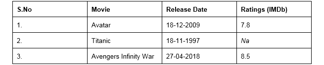

###### 图 1.2：表格格式的 CSV 数据

如果你对比 CSV 格式和表格格式中的数据，你会发现两者都有缺失值。我们将在本章后续部分讨论如何处理这些缺失值。要加载 CSV 文件并将其作为表格处理，我们使用 pandas 库。这里的数据被加载到称为 DataFrame 的表格中。

#### 注意

要了解更多关于 pandas 的信息，请访问以下链接：[`pandas.pydata.org/pandas-docs/version/0.15/tutorials.html`](http://pandas.pydata.org/pandas-docs/version/0.15/tutorials.html)。

### 自变量和目标变量

我们使用的数据框（DataFrame）包含可以分为两类的变量或特征。这些是自变量（也称为**预测变量**）和因变量（也称为**目标变量**）。自变量用于预测目标变量。顾名思义，自变量应该彼此独立。如果它们不独立，需要在预处理（清理）阶段加以处理。

**自变量**

这些是 DataFrame 中所有的特征，除了 **目标变量**。它们的尺寸是 (m, n)，其中 m 是观测值的数量，n 是特征的数量。这些变量必须服从正态分布，并且不应包含以下内容：

+   缺失值或 NULL 值

+   高度分类的数据特征或高基数特征（这些术语将在后面详细讨论）

+   异常值

+   不同尺度的数据

+   人为错误

+   多重共线性（相互关联的自变量）

+   非常大的独立特征集（自变量过多，难以管理）

+   稀疏数据

+   特殊字符

**特征矩阵和目标向量**

一条数据称为标量。多个标量组成一个向量，多个向量组成一个矩阵。矩阵是通过行和列来表示的。特征矩阵数据由独立的列组成，而目标向量则依赖于特征矩阵的列。为了更好地理解这一点，我们来看一下以下表格：

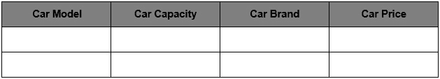

###### 图 1.3：包含汽车详细信息的表格

正如你在表格中看到的，有多个列：汽车型号、汽车容量、汽车品牌和汽车价格。除了汽车价格之外，所有列都是自变量，代表特征矩阵。汽车价格是因变量，它依赖于其他列（汽车型号、汽车容量和汽车品牌）。它是一个目标向量，因为它依赖于特征矩阵的数据。在下一部分，我们将通过一个基于特征和目标矩阵的练习来全面理解。

#### 注意

所有练习和活动将主要在 Jupyter Notebook 中进行开发。建议为不同的作业保持一个单独的 notebook，除非有特别的要求。另外，为了加载样本数据集，将使用 pandas 库，因为它能以表格形式显示数据。其他加载数据的方法将在后续章节中解释。

### 练习 1：加载样本数据集并创建特征矩阵和目标矩阵

在本次练习中，我们将把 `House_price_prediction` 数据集加载到 pandas DataFrame 中，并创建特征矩阵和目标矩阵。`House_price_prediction` 数据集来自 UCI 机器学习库。该数据收集自美国的多个郊区，包含 5,000 条记录和与房屋相关的 6 个特征。按照以下步骤完成此练习：

#### 注意

`House_price_prediction` 数据集可以在以下位置找到：https://github.com/TrainingByPackt/Data-Science-with-Python/blob/master/Chapter01/Data/USA_Housing.csv。

1.  打开一个 Jupyter notebook，并添加以下代码来导入 pandas：

    ```py
    import pandas as pd 
    ```

1.  现在我们需要将数据集加载到 pandas DataFrame 中。由于数据集是一个 CSV 文件，我们将使用 `read_csv()` 函数来读取数据。添加以下代码来实现：

    ```py
    dataset = "https://github.com/TrainingByPackt/Data-Science-with-Python/blob/master/Chapter01/Data/USA_Housing.csv"
    df = pd.read_csv(dataset, header = 0)
    ```

    正如你在上面的代码中看到的，数据存储在名为 `df` 的变量中。

1.  要打印数据框的所有列名，我们将使用`df.columns`命令。在笔记本中编写以下代码：

    ```py
    df.columns
    ```

    上述代码生成了以下输出：

    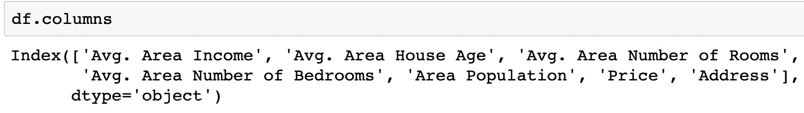

    ###### 图 1.4：数据框中存在的列列表

1.  数据集包含 n 个数据点。我们可以使用以下命令找到行数的总数：

    ```py
    df.index
    ```

    上述代码生成了以下输出：

    

    ###### 图 1.5：数据框中的总索引

    如前图所示，我们的数据集包含 5000 行，索引从 0 到 5000。

    #### 注意

    你可以在 pandas 中使用`set_index()`函数将某一列转换为数据框中行的索引。这有点像使用该列中的值作为行标签。

    `Dataframe.set_index('column name', inplace = True')'`

1.  让我们将`Address`列设置为索引，然后将其重置回原始数据框。pandas 库提供了`set_index()`方法，将列转换为数据框中的行索引。添加以下代码来实现：

    ```py
    df.set_index('Address', inplace=True)
    df
    ```

    上述代码生成了以下输出：

    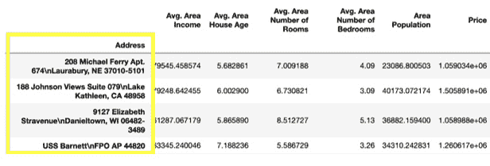

    ###### 图 1.6：带有索引的地址列的数据框

    `set_index()`函数中的`inplace`参数默认为`False`。如果将其值更改为`True`，那么我们执行的任何操作都会直接修改数据框的内容，而不会创建副本。

1.  要重置给定对象的索引，我们使用`reset_index()`函数。编写以下代码来实现：

    ```py
    df.reset_index(inplace=True)
    df
    ```

    上述代码生成了以下输出：

    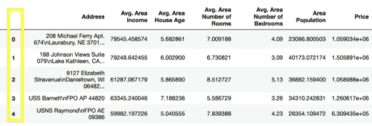

    ###### 图 1.7：重置索引的数据框

    #### 注意

    索引就像是给行和列起的名字。行和列都有索引。你可以通过行/列号或者行/列名来索引。

1.  我们可以使用行号和列号来检索前四行和前三列数据。这可以通过 pandas 中的`iloc`索引器来完成，该索引器通过索引位置检索数据。添加以下代码来实现：

    ```py
    df.iloc[0:4 , 0:3]
    ```

    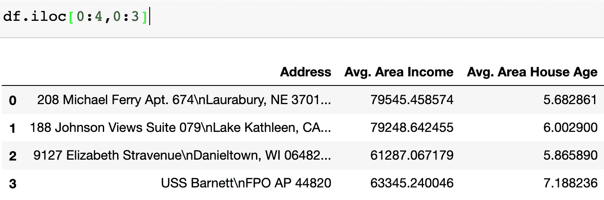

    ###### 图 1.8：包含四行和三列的数据集

1.  要使用标签检索数据，我们使用`loc`索引器。添加以下代码来检索收入和年龄列的前五行：

    ```py
    df.loc[0:4 , ["Avg. Area Income", "Avg. Area House Age"]]
    ```

    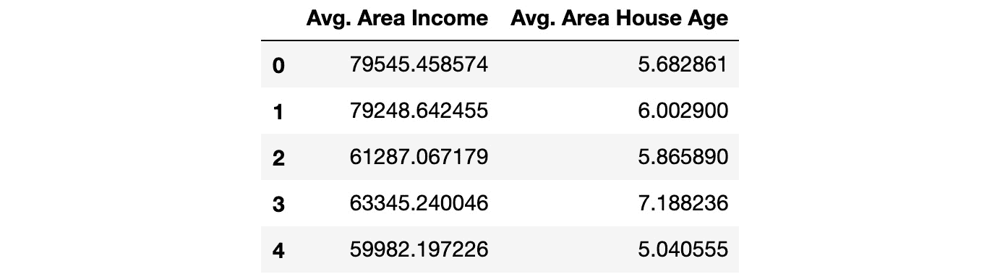

    ###### 图 1.9：包含五行和两列的数据集

1.  现在创建一个名为`X`的变量来存储独立特征。在我们的数据集中，我们将把除了价格以外的所有特征视为独立变量，并使用`drop()`函数将它们包括进来。完成后，打印出`X`变量的前五个实例。可以添加以下代码来实现：

    ```py
    X = df.drop('Price', axis=1)
    X.head()
    ```

    前面的代码生成了以下输出：

    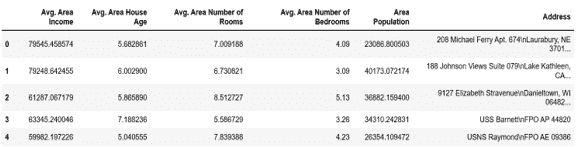

    ###### 图 1.10：显示特征矩阵前五行的数据集

    #### 注意

    默认情况下，获取头部的实例数量为五，因此如果你没有指定数量，它将默认输出五个观测值。前面的截图中的 axis 参数表示你是否想从行（axis = 0）或列（axis = 1）中删除标签。

1.  使用`X.shape`命令打印你新创建的特征矩阵的形状。添加以下代码来实现这一功能：

    ```py
    X.shape
    ```

    前面的代码生成了以下输出：

    

    ###### 图 1.11：特征矩阵的形状

    在前面的图中，第一个值表示数据集中观测值的数量（**5000**），第二个值表示特征的数量（**6**）。

1.  同样，我们将创建一个名为`y`的变量，用来存储目标值。我们将使用索引来获取目标列。索引允许你访问一个更大元素的部分。在这种情况下，我们想从`df`数据框中获取名为 Price 的列。然后，我们希望打印出该变量的前 10 个值。添加以下代码来实现这一功能：

    ```py
    y = df['Price']
    y.head(10)
    ```

    前面的代码生成了以下输出：

    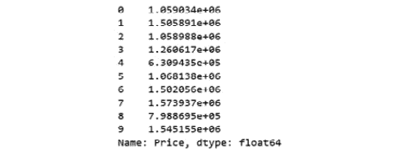

    ###### 图 1.12：显示目标矩阵前 10 行的数据集

1.  使用`y.shape`命令打印你新变量的形状。形状应该是一维的，长度仅等于观测值的数量（**5000**）。添加以下代码来实现这一功能：

    ```py
    y.shape
    ```

    前面的代码生成了以下输出：


###### 图 1.13：目标矩阵的形状

你已成功创建了数据集的特征矩阵和目标矩阵。你已完成建立预测模型过程中的第一步。这个模型将从特征矩阵（`X`中的列）中学习模式，并了解它们如何与目标向量（`y`）中的值相匹配。这些模式可以用于基于新房屋的特征，从新数据中预测房价。

在下一部分，我们将探讨更多的数据预处理步骤。

## 数据清理

数据清理包括填补缺失值和处理不一致的过程。它可以检测到损坏的数据，并进行替换或修改。

**缺失值**

如果你想掌握成功管理和理解数据的技能，理解缺失值的概念是非常重要的。让我们看看下图：

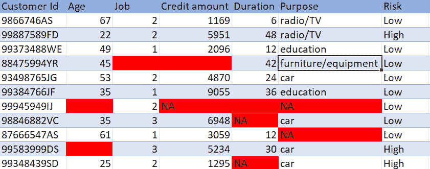

###### 图 1.14：银行客户信用数据

正如你所看到的，这些数据来自一家银行；每一行代表一个独立的客户，每一列包含他们的详细信息，如年龄和信用额度。有些单元格中要么是**NA**，要么是空白。这些都是缺失数据。银行需要知道每个客户的每一项信息。如果任何信息缺失，银行就难以预测是否能够向该客户提供贷款。

**处理缺失数据**

智能地处理缺失数据将帮助构建一个强健的模型，能够应对复杂的任务。处理缺失数据有多种方法。接下来我们将看看其中的一些方法。

**删除数据**

检查缺失值是数据预处理中的第一步，也是最重要的一步。模型无法接受包含缺失值的数据。这是一个非常简单且常用的方法来处理缺失值：如果缺失值出现在某行中的位置，就删除该行；或者如果某一列的缺失数据超过 70%-75%，就删除该列。同样，阈值不是固定的，取决于你希望修复多少数据。

这种方法的好处在于它快速且简单，并且在很多情况下，缺少数据比错误的数据更好。缺点是，你可能会丢失重要的信息，因为你是基于几个缺失值删除整个特征的。

### 练习 2：删除缺失数据

在这个练习中，我们将把`Banking_Marketing.csv`数据集加载到 pandas DataFrame 中，并处理缺失数据。这个数据集与葡萄牙一家银行的直接营销活动有关。营销活动包括打电话给客户，尝试让他们订阅某一特定产品。数据集包含了每个被联系客户的详细信息，以及他们是否订阅了该产品。请按照以下步骤完成这个练习：

#### 注意

`Banking_Marketing.csv`数据集可以在此位置找到：https://github.com/TrainingByPackt/Data-Science-with-Python/blob/master/Chapter01/Data/Banking_Marketing.csv。

1.  打开一个 Jupyter 笔记本。插入一个新单元格，并添加以下代码以导入 pandas 并获取`Banking_Marketing.csv`数据集：

    ```py
    import pandas as pd
    dataset = 'https://github.com/TrainingByPackt/Data-Science-with-Python/blob/master/Chapter01/Data/Banking_Marketing.csv'
    #reading the data into the dataframe into the object data
    df = pd.read_csv(dataset, header=0)
    ```

1.  一旦获取了数据集，打印出每一列的数据类型。为此，可以使用 pandas DataFrame 的`dtypes`属性：

    ```py
    df.dtypes
    ```

    上述代码会生成以下输出：

    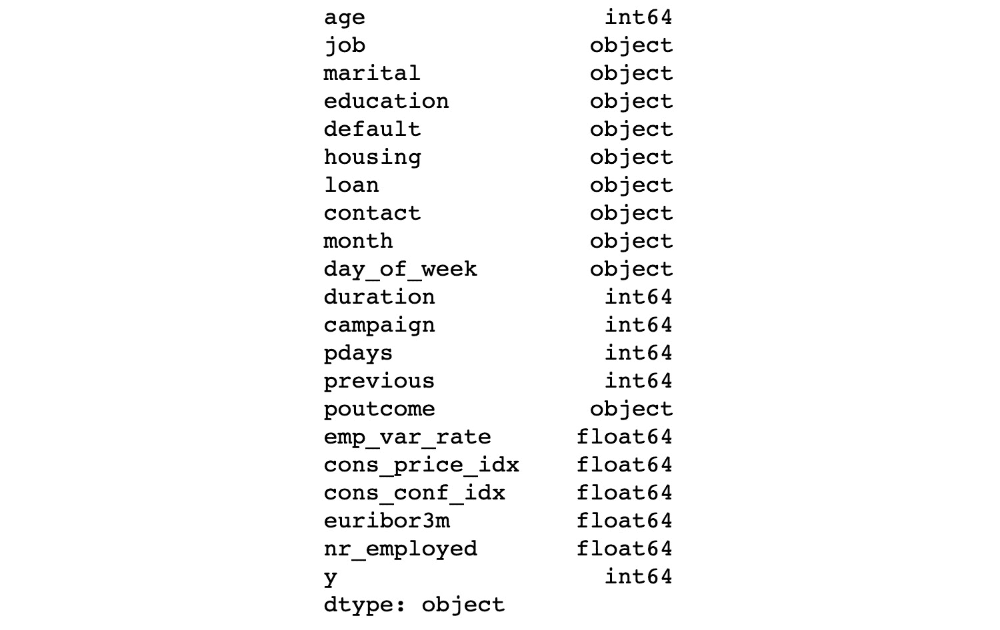

    ###### 图 1.15：每个特征的数据类型

1.  现在，我们需要找到每一列的缺失值。为此，我们使用 pandas 提供的`isna()`函数：

    ```py
    df.isna().sum()
    ```

    上述代码会生成以下输出：

    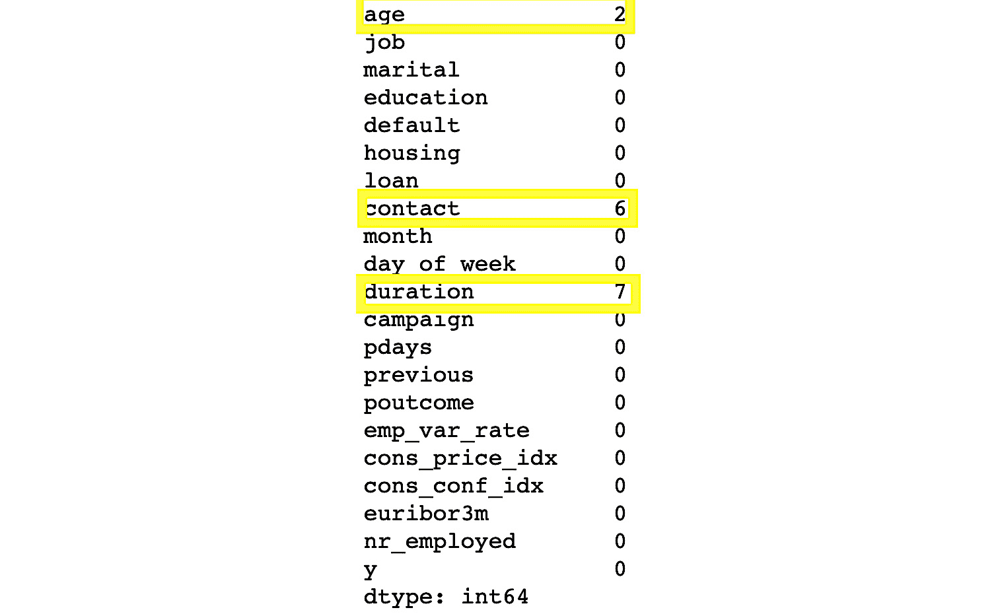

    ###### 图 1.16：数据集中每列的缺失值

    在上面的图中，我们可以看到有三列数据缺失，分别是`age`、`contact`和`duration`。**age**列有两个缺失值，**contact**列有六个缺失值，**duration**列有七个缺失值。

1.  一旦你弄清楚所有缺失的细节，我们就从 DataFrame 中删除所有缺失的行。为此，我们使用`dropna()`函数：

    ```py
    #removing Null values
    data = data.dropna()
    ```

1.  为了检查缺失值是否仍然存在，可以使用`isna()`函数：

    ```py
    df.isna().sum()
    ```

    上面的代码会生成以下输出：

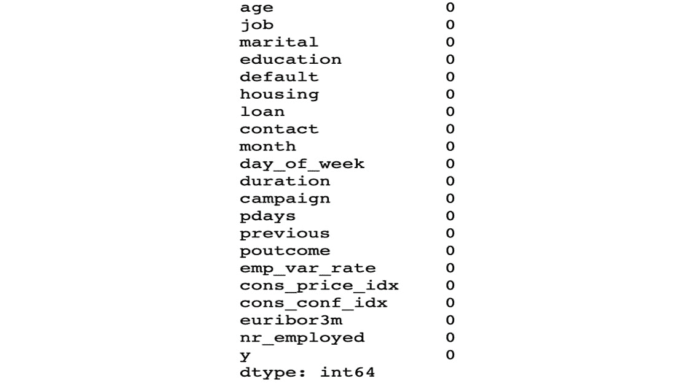

###### 图 1.17：数据集中每列没有缺失值

你已经成功地从 DataFrame 中删除了所有缺失数据。在接下来的章节中，我们将介绍第二种处理缺失数据的方法，即使用填补法。

**均值/中位数/众数填补**

对于数值数据，我们可以计算其均值或中位数，并用结果替换缺失值。对于类别（非数值）数据，我们可以计算其众数来替代缺失值。这就是所谓的填补法（imputation）。

使用填补法（imputation）而不是直接删除数据的好处在于，它可以防止数据丢失。缺点是你无法知道在特定情况下，使用均值、中位数或众数的准确性如何。

让我们来看一个练习，使用填补法来解决缺失数据问题。

### 练习 3：填补缺失数据

在这个练习中，我们将把`Banking_Marketing.csv`数据集加载到 pandas 的 DataFrame 中，并处理缺失数据。我们将使用填补法。请按照以下步骤完成这个练习：

#### 注意

`Banking_Marketing.csv`数据集可以在以下位置找到：https://github.com/TrainingByPackt/Data-Science-with-Python/blob/master/Chapter01/Data/Banking_Marketing.csv。

1.  打开一个 Jupyter 笔记本并添加一个新单元格，将数据集加载到 pandas 的 DataFrame 中。添加以下代码来实现这一点：

    ```py
    import pandas as pd
    dataset = 'https://github.com/TrainingByPackt/Data-Science-with-Python/blob/master/Chapter01/Data/Banking_Marketing.csv'
    df = pd.read_csv(dataset, header=0)
    ```

1.  使用`age`列的均值填补缺失的数值数据。为此，首先使用 pandas 的`mean()`函数找到`age`列的均值，然后打印出来：

    ```py
    mean_age = df.age.mean()
    print(mean_age)
    ```

    上面的代码会生成以下输出：

    

    ###### 图 1.18：年龄列的均值

1.  一旦完成，使用`fillna()`函数用均值填补缺失数据。可以通过以下代码来完成：

    ```py
    df.age.fillna(mean_age, inplace=True)
    ```

1.  现在我们用持续时间列的中位数填补缺失的数值数据。为此，首先使用 pandas 的`median()`函数找到持续时间列的中位数。添加以下代码来实现这一点：

    ```py
    median_duration = df.duration.median()
    print(median_duration)
    ```

    

    ###### 图 1.19：持续时间的中位数

1.  使用`fillna()`函数，用持续时间的中位数填补缺失数据。

    ```py
    df. duration.fillna(median_duration,inplace=True)
    ```

1.  使用`mode()`函数，将`contact`列的类别数据填补为其众数。为此，首先使用 pandas 的`mode()`函数找到`contact`列的众数。添加以下代码来实现这一点：

    ```py
    mode_contact = df.contact.mode()[0]
    print(mode_contact)
    ```

    

    ###### 图 1.20：联系方式的众数

1.  使用`fillna()`函数用众数填充联系方式列的缺失数据。添加以下代码来实现：

    ```py
    df.contact.fillna(mode_contact,inplace=True)
    ```

    与均值和中位数不同，列中可能有多个众数。因此，我们只取第一个众数，其索引为 0。

你已经成功地以不同的方式填充了缺失数据，并使数据完整且清洁。

数据清理的另一个部分是处理异常值，我们将在下一节讨论。

**异常值**

异常值是指与其他数据的分布相比，非常大或非常小的值。我们只能在数值数据中找到异常值。箱型图是一种有效的识别数据集异常值的方法，如下图所示：

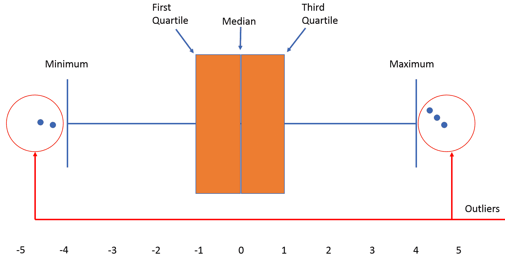

###### 图 1.21：箱型图中的异常值示例

#### 注意

异常值不一定是坏数据！借助商业理解和客户互动，你可以判断是否要移除或保留异常值。

让我们通过一个简单的例子来学习如何查找异常值。考虑一个地方在不同时间的温度样本数据集：

```py
71, 70, 90, 70, 70, 60, 70, 72, 72, 320, 71, 69
```

现在我们可以执行以下操作：

1.  首先，我们对数据进行排序：

    ```py
    60,69, 70, 70, 70, 70, 71, 71, 72, 72, 90, 320
    ```

1.  接下来，我们计算中位数（Q2）。中位数是排序后的中间数据。

    在这里，排序后中间的项是 70 和 71。

    中位数是*(70 + 71) / 2 = 70.5*

1.  然后我们将计算下四分位数（Q1）。Q1 是数据集前半部分的中位数。

    数据的前半部分 = `60, 69, 70, 70, 70, 70`

    下 6 个数据点的第 3 和第 4 个都等于 70。

    平均值是*(70 + 70) / 2 = 70*

    Q1 = 70

1.  然后计算上四分位数（Q3）。

    Q3 是数据集后半部分的中位数。

    数据的后半部分 = `71, 71, 72, 72, 90, 320`

    上 6 个数据点的第 3 和第 4 个是 72 和 72。

    平均值是*(72 + 72) / 2 = 72*

    Q3 = 72

1.  然后我们找出四分位距（IQR）。

    IQR = Q3 – Q1 = 72 – 70

    IQR = 2

1.  接下来，我们找出上限和下限。

    下限 = Q1 – 1.5 (IQR) = 70 – 1.5(2) = 67

    上限 = Q3 + 1.5 (IQR) = 71.5 + 1.5(2) = 74.5

    我们的边界值 = 67 和 74.5

任何低于下限并大于上限的数据点都是异常值。因此，我们例子中的异常值是 60、90 和 320。

### 练习 4：查找和移除数据中的异常值

在本练习中，我们将加载`german_credit_data.csv`数据集到 pandas DataFrame 中，并去除异常值。该数据集包含 1,000 条记录和 20 个分类/符号属性，由 Hofmann 教授准备。每条记录代表一个从银行借贷的人。根据这些属性，每个人被分类为良好或不良信用风险。按照以下步骤完成本练习：

#### 注意

`german_credit_data.csv` 数据集的链接可以在这里找到：https://github.com/TrainingByPackt/Data-Science-with-Python/blob/master/Chapter01/Data/german_credit_data.csv。

1.  打开一个 Jupyter 笔记本并添加一个新单元格。编写以下代码来导入必要的库：pandas、NumPy、matplotlib 和 seaborn。获取数据集并将其加载到 pandas DataFrame 中。添加以下代码来实现：

    ```py
    import pandas as pd
    import numpy as np
    %matplotlib inline  
    import seaborn as sbn
    dataset = 'https://github.com/TrainingByPackt/Data-Science-with-Python/blob/master/Chapter01/Data/german_credit_data.csv'
    #reading the data into the dataframe into the object data
    df = pd.read_csv(dataset, header=0)
    ```

    在前面的代码中，`%matplotlib inline` 是一个魔法函数，如果我们希望图表在笔记本中可见，它是必不可少的。

1.  这个数据集包含一个 `Age` 列。让我们绘制 `Age` 列的箱型图。为此，使用 seaborn 库中的 `boxplot()` 函数：

    ```py
    sbn.boxplot(df['Age'])
    ```

    前面的代码生成了以下输出：

    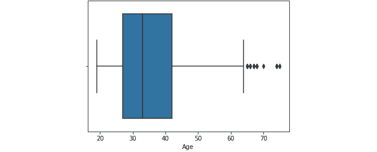

    ###### 图 1.22：年龄列的箱型图

    我们可以在箱型图中看到一些数据点是异常值。

1.  箱型图使用 IQR 方法来显示数据和异常值（数据的形状）。但是，为了打印出异常值，我们使用数学公式来检索它。添加以下代码来使用 IQR 方法查找 `Age` 列的异常值：

    ```py
    Q1 = df["Age"].quantile(0.25)
    Q3 = df["Age"].quantile(0.75)
    IQR = Q3 - Q1
    print(IQR)
    >>> 15.0
    ```

    在前面的代码中，Q1 是第一四分位数，Q3 是第三四分位数。

1.  现在通过添加以下代码，我们可以找到上边界和下边界，并打印所有高于上边界和低于下边界的数据。添加以下代码来实现：

    ```py
    Lower_Fence = Q1 - (1.5 * IQR)
    Upper_Fence = Q3 + (1.5 * IQR)
    print(Lower_Fence)
    print(Upper_Fence)
    >>> 4.5
    >>> 64.5
    ```

1.  为了打印所有高于上边界和低于下边界的数据，添加以下代码：

    ```py
    df[((df["Age"] < Lower_Fence) |(df["Age"] > Upper_Fence))]
    ```

    前面的代码生成了以下输出：

    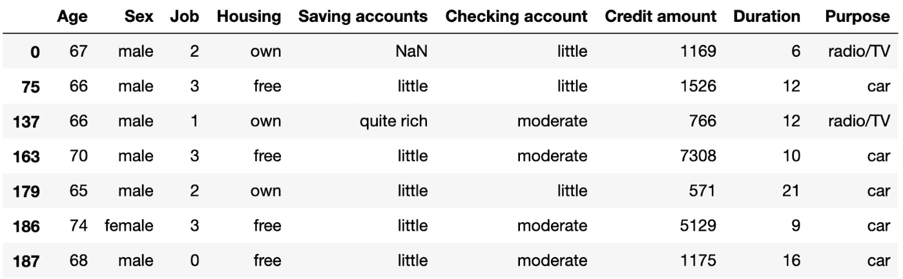

    ###### 图 1.23：基于年龄列的异常数据

1.  筛选掉异常数据并只打印潜在数据。为此，只需使用 `~` 运算符否定前面的结果：

    ```py
    df = df[~((df ["Age"] < Lower_Fence) |(df["Age"] > Upper_Fence))]
    df
    ```

    前面的代码生成了以下输出：

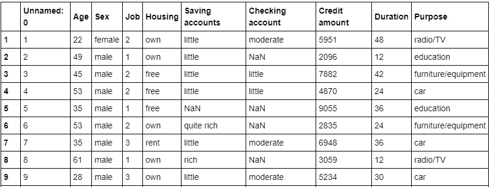

###### 图 1.24：基于年龄列的潜在数据

你已经成功地使用 IQR 找到了异常值。在接下来的部分，我们将探讨另一种预处理方法——数据集成。

## 数据集成

到目前为止，我们已经确保移除数据中的杂质，使其变得干净。现在，下一步是将来自不同来源的数据合并，以获得一个统一的结构，包含更有意义和有价值的信息。如果数据被拆分到不同的来源，这通常是必需的。为了简单起见，假设我们有一些 CSV 格式的数据，存放在不同的地方，所有这些数据都描述的是相同的场景。比如，我们有一些关于某个员工的数据存储在一个数据库中。我们不能指望所有关于员工的数据都存在同一个表格中。可能员工的个人信息在一个表格中，员工的项目历史在第二个表格中，员工的考勤数据在另一个表格中，等等。因此，如果我们想对员工进行分析，我们需要将所有员工数据整合到一个共同的地方。这一过程被称为数据整合。为了进行数据整合，我们可以使用 `merge` 函数合并多个 pandas DataFrame。

让我们通过一个数据整合的练习来清晰地理解它。

### 练习 5：数据整合

在本练习中，我们将合并来自两个数据集（`student.csv` 和 `marks.csv`）的学生信息。`student` 数据集包含诸如 `Age`（年龄）、`Gender`（性别）、`Grade`（年级）和 `Employed`（是否就业）等列。`marks.csv` 数据集包含 `Mark`（分数）和 `City`（城市）等列。`Student_id` 列在两个数据集之间是共同的。按照以下步骤完成此练习：

#### 注意

`student.csv` 数据集可以在此位置找到：https://github.com/TrainingByPackt/Data-Science-with-Python/blob/master/Chapter01/Data/student.csv。

`marks.csv` 数据集可以在此位置找到：https://github.com/TrainingByPackt/Data-Science-with-Python/blob/master/Chapter01/Data/mark.csv。

1.  打开一个 Jupyter notebook 并添加一个新单元格。编写以下代码以导入 pandas 并将 `student.csv` 和 `marks.csv` 数据集加载到 `df1` 和 `df2` pandas DataFrame 中：

    ```py
    import pandas as pd
    dataset1 = "https://github.com/TrainingByPackt/Data-Science-with-Python/blob/master/Chapter01/Data/student.csv"
    dataset2 = "https://github.com/TrainingByPackt/Data-Science-with-Python/blob/master/Chapter01/Data/mark.csv"
    df1 = pd.read_csv(dataset1, header = 0)
    df2 = pd.read_csv(dataset2, header = 0)
    ```

1.  要打印第一个 DataFrame 的前五行，请添加以下代码：

    ```py
    df1.head()
    ```

    上述代码生成以下输出：

    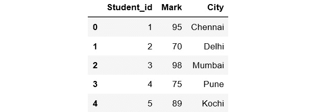

    ###### 图 1.25：第一个 DataFrame 的前五行

1.  要打印第二个 DataFrame 的前五行，请添加以下代码：

    ```py
    df2.head()
    ```

    上述代码生成以下输出：

    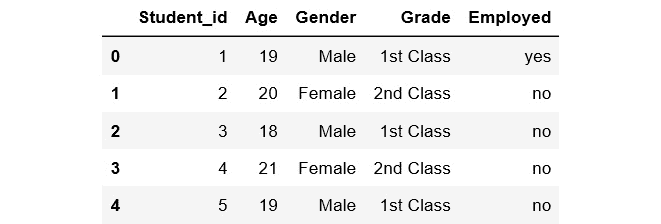

    ###### 图 1.26：第二个 DataFrame 的前五行

1.  `Student_id` 在两个数据集中都是共同的。使用 `pd.merge()` 函数对两个 DataFrame 进行数据整合，基于 `Student_id` 列，然后打印新 DataFrame 的前 10 个值：

    ```py
    df = pd.merge(df1, df2, on = 'Student_id')
    df.head(10)
    ```

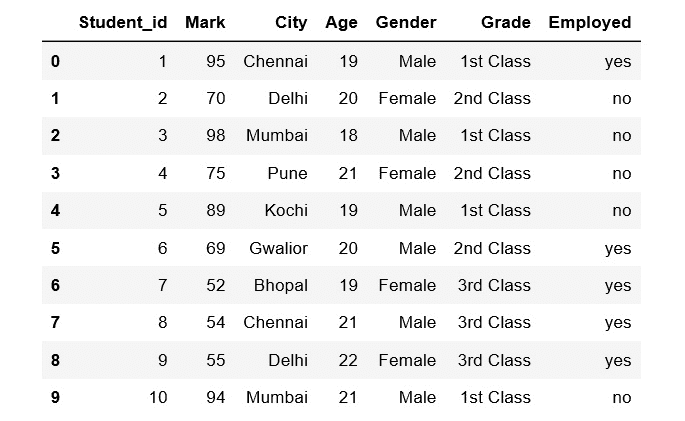

###### 图 1.27：合并后的 DataFrame 的前 10 行

这里，`df1` 数据框的数据与 `df2` 数据框的数据进行了合并。合并后的数据存储在一个名为 `df` 的新数据框中。

我们现在已经学习了如何进行数据集成。在下一部分中，我们将探索另一个预处理任务——数据转换。

## 数据转换

之前，我们已经看到如何将来自不同来源的数据合并成一个统一的数据框。现在，我们有很多列，包含不同类型的数据。我们的目标是将数据转换为机器学习可以处理的格式。所有机器学习算法都是基于数学的。因此，我们需要将所有列转换为数值格式。在此之前，让我们看一下我们所拥有的不同类型的数据。

从更广泛的角度来看，数据可以分为数值型数据和分类数据：

+   **数值型**：顾名思义，这些是可以量化的数字数据。

+   **分类数据**：数据是字符串或非数值型数据，具有定性特征。

数值型数据进一步分为以下几类：

+   **离散型**：简单来说，任何可以计数的数值数据称为离散型数据，例如家庭中的人数或班级中的学生人数。离散型数据只能取某些特定值（如 1、2、3、4 等）。

+   **连续型**：任何可测量的数值数据都称为连续型数据，例如一个人的身高或到达某地所花费的时间。连续型数据可以取几乎任何值（例如，1.25、3.8888 和 77.1276）。

分类数据进一步分为以下几类：

+   **有序型**：任何有顺序的分类数据称为有序型分类数据，例如电影评分（优秀、好、差、最差）和反馈（满意、不差、差）。你可以将有序数据看作是可以在一个量表上标记的内容。

+   **名义型**：任何没有顺序的分类数据称为名义型分类数据。例如，性别和国家。

在这些不同类型的数据中，我们将重点讨论分类数据。在下一部分中，我们将讨论如何处理分类数据。

### 处理分类数据

有些算法可以很好地处理分类数据，例如决策树。但大多数机器学习算法不能直接处理分类数据。这些算法要求输入和输出都必须是数值型的。如果需要预测的输出是分类数据，那么在预测之后，我们将其从数值数据转换回分类数据。让我们讨论一下处理分类数据时面临的一些关键挑战：

+   **高基数**：基数指的是数据的唯一性。在这种情况下，数据列将包含大量不同的值。一个很好的例子是用户 ID——在一个包含 500 个不同用户的表格中，用户 ID 列将有 500 个独特的值。

+   **稀有出现**：这些数据列可能包含非常少见的变量，因此它们对模型的影响不足。

+   **频繁出现**：数据列中可能存在一个类别，它出现的次数很多，但方差很小，这样的类别对模型没有影响。

+   **无法适应**：这些未处理的类别数据无法适应我们的模型。

**编码**

为了解决与类别数据相关的问题，我们可以使用编码。这是将类别变量转换为数字形式的过程。在这里，我们将介绍三种简单的编码类别数据的方法。

**替换**

这是一种将类别数据替换为数字的技术。这是一个简单的替换过程，不涉及太多逻辑处理。让我们通过一个练习更好地理解这一点。

### 练习 6：将类别数据简单替换为数字

在本练习中，我们将使用前面看到的`student`数据集。我们将数据加载到 pandas 数据框中，并将所有类别数据简单地替换为数字。按照以下步骤完成此练习：

#### 注意

`student`数据集可以在以下位置找到：https://github.com/TrainingByPackt/Data-Science-with-Python/blob/master/Chapter01/Data/student.csv。

1.  打开一个 Jupyter notebook 并添加一个新单元格。写入以下代码以导入 pandas，并将数据集加载到 pandas 数据框中：

    ```py
    import pandas as pd
    import numpy as np
    dataset = "https://github.com/TrainingByPackt/Data-Science-with-Python/blob/master/Chapter01/Data/student.csv"
    df = pd.read_csv(dataset, header = 0)
    ```

1.  找到类别列，并将其与其他数据分开。为此，使用 pandas 中的`select_dtypes()`函数：

    ```py
    df_categorical = df.select_dtypes(exclude=[np.number])
    df_categorical
    ```

    上述代码生成的输出如下：

    

    ###### 图 1.28：数据框的类别列

1.  找到`Grade`列中的不同唯一值。为此，使用 pandas 中的`unique()`函数，指定列名：

    ```py
    df_categorical['Grade'].unique()
    ```

    上述代码生成的输出如下：

    

    ###### 图 1.29：Grade 列中的唯一值

1.  找到每个类别列的频率分布。为此，使用`value_counts()`函数对每一列进行处理。此函数返回对象中唯一值的计数：

    ```py
    df_categorical.Grade.value_counts()
    ```

    这一步的输出结果如下：

    

    ](img/C13322_01_30.jpg)

    ###### 图 1.30：Grade 列中每个唯一值的总计数

1.  对于`Gender`列，写入以下代码：

    ```py
    df_categorical.Gender.value_counts()
    ```

    这段代码的输出结果如下：

    

    ](img/C13322_01_31.jpg)

    ###### 图 1.31：Gender 列中每个唯一值的总计数

1.  类似地，对于`Employed`列，写入以下代码：

    ```py
    df_categorical.Employed.value_counts()
    ```

    这段代码的输出结果如下：

    

    ](img/C13322_01_32.jpg)

    ###### 图 1.32：Employed 列中每个唯一值的总计数

1.  替换`Grade`列中的条目。将`1st class`替换为`1`，`2nd class`替换为`2`，`3rd class`替换为`3`。为此，使用`replace()`函数：

    ```py
    df_categorical.Grade.replace({"1st Class":1, "2nd Class":2, "3rd Class":3}, inplace= True)
    ```

1.  替换`Gender`列中的条目。将`Male`替换为`0`，将`Female`替换为`1`。为此，使用`replace()`函数：

    ```py
    df_categorical.Gender.replace({"Male":0,"Female":1}, inplace= True)
    ```

1.  替换`Employed`列中的条目。将`no`替换为`0`，将`yes`替换为`1`。为此，使用`replace()`函数：

    ```py
    df_categorical.Employed.replace({"yes":1,"no":0}, inplace = True)
    ```

1.  一旦完成三列的所有替换操作，我们需要打印数据框。添加以下代码：

    ```py
    df_categorical.head()
    ```


###### 图 1.33：替换后的数值数据

你已经成功地使用简单的手动替换方法将分类数据转换为数值数据。接下来我们将看看另一种编码分类数据的方法。

**标签编码**

这是一种技术，其中我们将分类列中的每个值替换为从 0 到 N-1 的数字。例如，假设我们在一列中有一份员工名字列表。进行标签编码后，每个员工名字将分配一个数值标签。但这对于所有情况可能不适用，因为模型可能会将数值视为分配给数据的权重。标签编码是处理有序数据的最佳方法。scikit-learn 库提供了`LabelEncoder()`，可以帮助进行标签编码。接下来我们将在下一节中查看一个练习。

### 练习 7：使用标签编码将分类数据转换为数值数据

在本次练习中，我们将把`Banking_Marketing.csv`数据集加载到 pandas 数据框中，并使用标签编码将分类数据转换为数值数据。请按照以下步骤完成此练习：

#### 注意

`Banking_Marketing.csv`数据集可以在以下位置找到：https://github.com/TrainingByPackt/Master-Data-Science-with-Python/blob/master/Chapter%201/Data/Banking_Marketing.csv。

1.  打开一个 Jupyter 笔记本并添加一个新单元格。编写代码导入 pandas 并将数据集加载到 pandas 数据框中：

    ```py
    import pandas as pd
    import numpy as np
    dataset = 'https://github.com/TrainingByPackt/Master-Data-Science-with-Python/blob/master/Chapter%201/Data/Banking_Marketing.csv'
    df = pd.read_csv(dataset, header=0)
    ```

1.  在进行编码之前，删除所有缺失的数据。为此，使用`dropna()`函数：

    ```py
    df = df.dropna()
    ```

1.  使用以下代码选择所有非数值类型的列：

    ```py
    data_column_category = df.select_dtypes(exclude=[np.number]).columns
    data_column_category	
    ```

    要了解选择的内容，请参见以下截图：

    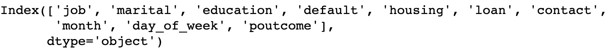

    ###### 图 1.34：数据框中的非数值列

1.  打印新数据框的前五行。添加以下代码来执行此操作：

    ```py
    df[data_column_category].head()
    ```

    上述代码生成了以下输出：

    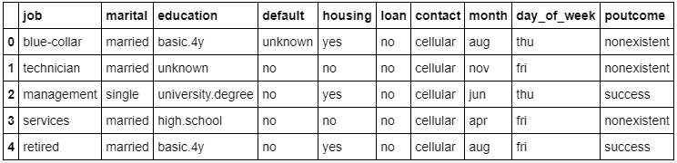

    ###### 图 1.35：列中的非数值类型

1.  遍历`category`列，并使用`LabelEncoder()`将其转换为数值数据。为此，导入`sklearn.preprocessing`包并使用`LabelEncoder()`类来转换数据：

    ```py
    #import the LabelEncoder class
    from sklearn.preprocessing import LabelEncoder
    #Creating the object instance
    label_encoder = LabelEncoder()
    for i in data_column_category:
        df[i] = label_encoder.fit_transform(df[i])
    print("Label Encoded Data: ")
    df.head()
    ```

    上述代码生成了以下输出：


###### 图 1.36：非数值列转换为数值形式

在上面的截图中，我们可以看到所有的值已经从类别数据转换为数值数据。这里，原始值已被转换并替换为新编码的数据。

你已经成功使用 `LabelEncoder` 方法将类别数据转换为数值数据。在接下来的章节中，我们将探讨另一种编码方法：独热编码。

**独热编码**

在标签编码中，类别数据被转换为数值数据，并为每个值分配标签（如 1、2 和 3）。使用这些数值数据进行分析的预测模型有时可能会误认为这些标签具有某种顺序（例如，模型可能认为标签 3 比标签 1 "更好"，这是错误的）。为了避免这种混淆，我们可以使用独热编码。在这里，标签编码的数据进一步被分成 n 列，其中 n 表示标签编码时生成的唯一标签的总数。例如，假设通过标签编码生成了三个新标签。那么，在执行独热编码时，列将分为三部分。所以，n 的值为 3。让我们通过一个练习来进一步澄清。

### 练习 8：使用独热编码将类别数据转换为数值数据

在本练习中，我们将把 `Banking_Marketing.csv` 数据集加载到 pandas 数据框中，并使用独热编码将类别数据转换为数值数据。按照以下步骤完成此练习：

#### 注意

`Banking_Marketing` 数据集可以在这里找到：[`github.com/TrainingByPackt/Data-Science-with-Python/blob/master/Chapter01/Data/Banking_Marketing.csv`](https://github.com/TrainingByPackt/Data-Science-with-Python/blob/master/Chapter01/Data/Banking_Marketing.csv)。

1.  打开 Jupyter 笔记本并添加一个新单元格。编写代码导入 pandas 并将数据集加载到 pandas 数据框中：

    ```py
    import pandas as pd
    import numpy as np
    from sklearn.preprocessing import OneHotEncoder
    dataset = 'https://github.com/TrainingByPackt/Master-Data-Science-with-Python/blob/master/Chapter%201/Data/Banking_Marketing.csv'
    #reading the data into the dataframe into the object data
    df = pd.read_csv(dataset, header=0)
    ```

1.  在进行编码之前，移除所有缺失数据。为此，使用 `dropna()` 函数：

    ```py
    df = df.dropna()
    ```

1.  使用以下代码选择所有非数值型的列：

    ```py
    data_column_category = df.select_dtypes(exclude=[np.number]).columns
    data_column_category
    ```

    上述代码生成以下输出：

    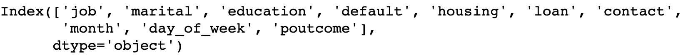

    ###### 图 1.37：数据框的非数值列

1.  打印新数据框的前五行。添加以下代码来实现：

    ```py
    df[data_column_category].head()
    ```

    上述代码生成以下输出：

    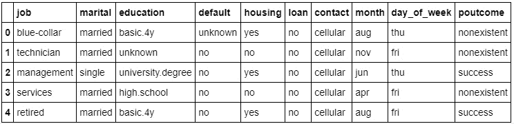

    ###### 图 1.38：列的非数值值

1.  迭代这些类别列，并使用 `OneHotEncoder` 将其转换为数值数据。为此，导入 `sklearn.preprocessing` 包，并使用 `OneHotEncoder()` 类进行转换。在执行独热编码之前，我们需要先进行标签编码：

    ```py
    #performing label encoding
    from sklearn.preprocessing import LabelEncoder
    label_encoder = LabelEncoder()
    for i in data_column_category:
        df[i] = label_encoder.fit_transform(df[i])
    print("Label Encoded Data: ")
    df.head()
    ```

    上述代码生成以下输出：

    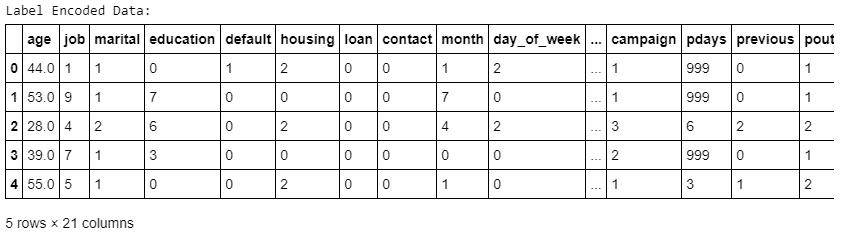

    ###### 图 1.39：非数值列转换为数值数据

1.  一旦我们完成了标签编码，就可以执行一热编码。添加以下代码来实现这一操作：

    ```py
    #Performing Onehot Encoding
    onehot_encoder = OneHotEncoder(sparse=False)
    onehot_encoded = onehot_encoder.fit_transform(df[data_column_category])
    ```

1.  现在我们创建一个包含编码数据的新数据框，并打印前五行。添加以下代码来实现这一操作：

    ```py
    #Creating a dataframe with encoded data with new column name
    onehot_encoded_frame = pd.DataFrame(onehot_encoded, columns = onehot_encoder.get_feature_names(data_column_category))
    onehot_encoded_frame.head()
    ```

    上述代码生成了以下输出：

    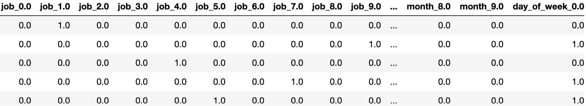

    ###### 图 1.40：具有一热编码值的列

1.  由于一热编码，新的数据框架中的列数增加了。为了查看和打印所有创建的列，请使用`columns`属性：

    ```py
    onehot_encoded_frame.columns
    ```

    上述代码生成了以下输出：

    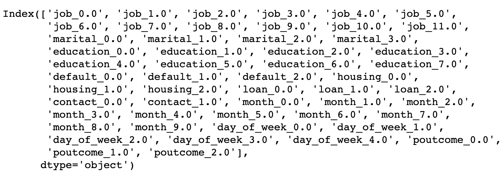

    ###### 图 1.41：经过一热编码生成的新列列表

1.  对于每个级别或类别，会创建一个新的列。为了在列名前加上类别名，你可以使用另一种方法来创建一热编码。为了在列名前加上类别名，可以写下以下代码：

    ```py
    df_onehot_getdummies = pd.get_dummies(df[data_column_category], prefix=data_column_category)
    data_onehot_encoded_data = pd.concat([df_onehot_getdummies,df[data_column_number]],axis = 1)
    data_onehot_encoded_data.columns
    ```

    上述代码生成了以下输出：

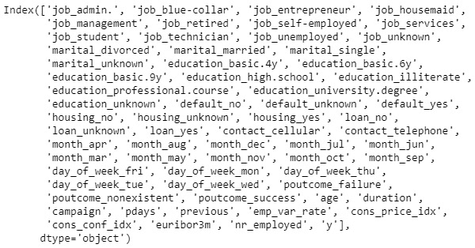

###### 图 1.42：包含类别的新列列表

你已经成功地使用`OneHotEncoder`方法将分类数据转换为数值数据。

现在我们将进入另一个数据预处理步骤——如何处理数据中的不同量级范围。

## 不同尺度的数据

在现实生活中，数据集中的值可能具有不同的量级、范围或尺度。使用距离作为参数的算法可能不会以相同的方式加权这些特征。存在多种数据转换技术，用于将数据特征转换到相同的尺度、量级或范围。这确保了每个特征对模型预测的影响是合适的。

我们数据中的某些特征可能具有较大的数值（例如，年薪），而其他特征的数值可能相对较小（例如，在公司工作的年数）。仅仅因为某些数据的值较小并不意味着它不重要。因此，为了确保我们的预测不会因为数据中特征的不同量级而有所不同，我们可以进行特征缩放、标准化或归一化（这三种方式都用于处理数据中的量级问题）。

### 练习 9：使用标准缩放器方法实现缩放

在本练习中，我们将把`Wholesale customer's data.csv`数据集加载到 pandas 数据框中，并使用标准缩放器方法进行缩放。该数据集指的是某批发分销商的客户信息，包含了在不同产品类别上每年花费的货币数额。按照以下步骤完成本练习：

#### 注意

`Wholesale customer`数据集可以在此找到：https://github.com/TrainingByPackt/Data-Science-with-Python/blob/master/Chapter01/Data/Wholesale%20customers%20data.csv。

1.  打开一个 Jupyter 笔记本并添加一个新单元格。编写代码以导入 pandas 并将数据集加载到 pandas 数据框中：

    ```py
    import pandas as pd
    dataset = 'https://github.com/TrainingByPackt/Data-Science-with-Python/blob/master/Chapter01/Data/Wholesale%20customers%20data.csv'
    df = pd.read_csv(dataset, header=0)
    ```

1.  检查是否有任何缺失数据。如果有，删除缺失数据：

    ```py
    null_ = df.isna().any()
    dtypes = df.dtypes
    info = pd.concat([null_,dtypes],axis = 1,keys = ['Null','type'])
    print(info)
    ```

    上述代码生成了以下输出：

    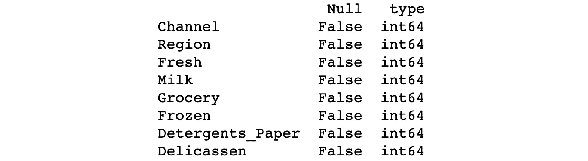

    ###### 图 1.43：数据框的不同列

    如我们所见，数据框中有八列，都是`int64`类型。由于空值为`False`，这意味着在任何列中都没有空值。因此，无需使用`dropna()`函数。

1.  现在执行标准缩放，并打印新数据集的前五行。为此，使用`sklearn.preprocessing`中的`StandardScaler()`类，并实现`fit_transform()`方法：

    ```py
    from sklearn import preprocessing
    std_scale = preprocessing.StandardScaler().fit_transform(df)
    scaled_frame = pd.DataFrame(std_scale, columns=df.columns)
    scaled_frame.head()
    ```

    上述代码生成了以下输出：

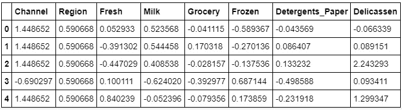

###### 图 1.44：特征数据缩放为统一单位

使用`StandardScaler`方法，我们已将数据缩放为所有列的统一单位。正如前面的表格所示，所有特征的值已转换为相同范围和尺度的统一值。因此，模型更容易进行预测。

你已经成功使用`StandardScaler`方法对数据进行了缩放。在接下来的部分，我们将尝试一个练习，使用`MinMax`缩放器方法来实现数据缩放。

### 练习 10：使用 MinMax 缩放器方法实现缩放

在本练习中，我们将把`Wholesale customers data.csv`数据集加载到 pandas 数据框中，并使用`MinMax`缩放器方法进行缩放。按照以下步骤完成此练习：

#### 注意

`Whole customers data.csv`数据集可以在此找到：https://github.com/TrainingByPackt/Data-Science-with-Python/blob/master/Chapter01/Data/Wholesale%20customers%20data.csv。

1.  打开一个 Jupyter 笔记本并添加一个新单元格。编写以下代码以导入 pandas 库并将数据集加载到 pandas 数据框中：

    ```py
    import pandas as pd
    dataset = 'https://github.com/TrainingByPackt/Data-Science-with-Python/blob/master/Chapter01/Data/Wholesale%20customers%20data.csv'
    df = pd.read_csv(dataset, header=0)
    ```

1.  检查是否有任何缺失数据。如果有，删除缺失数据：

    ```py
    null_ = df.isna().any()
    dtypes = df.dtypes
    info = pd.concat([null_,dtypes],axis = 1,keys = ['Null','type'])
    print(info)
    ```

    上述代码生成了以下输出：

    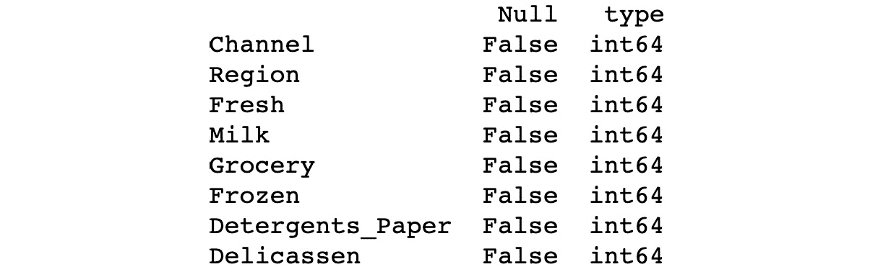

    ###### 图 1.45：数据框的不同列

    如我们所见，数据框中有八列，都是`int64`类型。由于空值为`False`，这意味着在任何列中都没有空值。因此，无需使用`dropna()`函数。

1.  执行`MinMax`缩放，并打印新数据集的前五个值。为此，使用`sklearn.preprocessing`中的`MinMaxScaler()`类，并实现`fit_transform()`方法。添加以下代码以实现此功能：

    ```py
    from sklearn import preprocessing
    minmax_scale = preprocessing.MinMaxScaler().fit_transform(df)
    scaled_frame = pd.DataFrame(minmax_scale,columns=df.columns)
    scaled_frame.head()
    ```

    上述代码生成了以下输出：

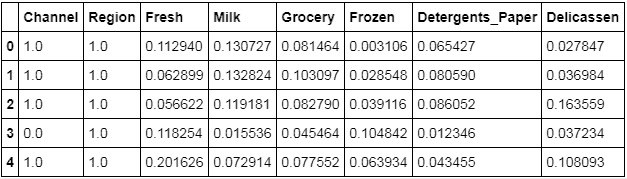

###### 图 1.46：特征数据被缩放到统一的单位

使用 `MinMaxScaler` 方法，我们再次将所有列的数据缩放到统一的单位。正如在上述表格中所看到的，所有特征的值已经被转换为相同范围的统一尺度。你已经成功地使用 `MinMaxScaler` 方法缩放了数据。

在下一部分，我们将探讨另一个预处理任务：数据离散化。

## 数据离散化

到目前为止，我们已经通过编码处理了类别数据，并通过缩放处理了数值数据。

**数据离散化**是将连续数据通过分组转换为离散桶的过程。离散化还因数据的易维护性而闻名。与使用连续数据训练模型相比，使用离散数据训练模型更加快速和有效。尽管连续值数据包含更多信息，但大量数据会拖慢模型的运行速度。在这里，离散化可以帮助我们在两者之间找到平衡。数据离散化的一些著名方法包括**分箱**和使用直方图。尽管数据离散化有用，但我们需要有效地选择每个桶的范围，这是一项挑战。

离散化的主要挑战是选择区间或桶的数量，以及如何决定它们的宽度。

这里我们使用一个叫做 `pandas.cut()` 的函数。这个函数对于实现数据的分桶和排序非常有用。

### 练习 11：连续数据的离散化

在这个练习中，我们将加载 `Student_bucketing.csv` 数据集并执行分桶操作。该数据集包含学生的详细信息，如 `Student_id`、`Age`、`Grade`、`Employed` 和 `marks`。按照以下步骤完成此练习：

#### 注意

`Student_bucketing.csv` 数据集可以在这里找到：https://github.com/TrainingByPackt/Data-Science-with-Python/blob/master/Chapter01/Data/Student_bucketing.csv。

1.  打开一个 Jupyter Notebook，添加一个新单元格。编写以下代码以导入所需的库并将数据集加载到 pandas 数据框中：

    ```py
    import pandas as pd
    dataset = "https://github.com/TrainingByPackt/Data-Science-with-Python/blob/master/Chapter01/Data/Student_bucketing.csv"
    df = pd.read_csv(dataset, header = 0)
    ```

1.  一旦加载数据框，显示数据框的前五行。添加以下代码以完成此操作：

    ```py
    df.head()
    ```

    上述代码生成以下输出：

    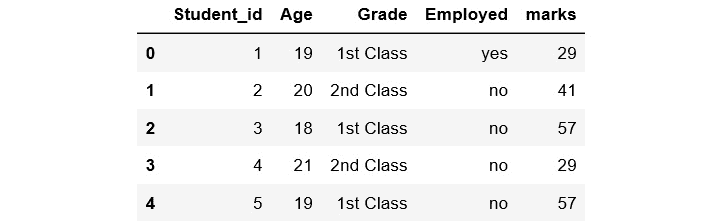

    ###### 图 1.47：数据框的前五行

1.  使用 `pd.cut()` 函数对 `marks` 列进行分桶，并显示前 10 列。`cut()` 函数接受如 `x`、`bins` 和 `labels` 等参数。在这里，我们只使用了三个参数。添加以下代码以实现此功能：

    ```py
    df['bucket']=pd.cut(df['marks'],5,labels=['Poor','Below_average','Average','Above_Average','Excellent'])
    df.head(10)
    ```

    上述代码生成以下输出：


###### 图 1.48：具有五个离散桶的 `marks` 列

在上述代码中，第一个参数表示一个数组。在这里，我们已从数据框中选择 `marks` 列作为数组。`5` 表示要使用的箱数。由于我们设置了箱数为 `5`，因此需要相应地填充标签，使用五个值：`Poor`, `Below_average`, `Average`, `Above_average` 和 `Excellent`。在上述图中，我们可以看到整个连续的 **marks** 列被放入了五个离散的桶中。我们已经学会了如何进行分桶。

我们现在已经涵盖了所有预处理中涉及的主要任务。在下一节中，我们将详细讨论如何训练和测试您的数据。

## 训练和测试数据

一旦您将数据预处理为可以被模型使用的格式，您需要将数据分割为训练集和测试集。这是因为您的机器学习算法将使用训练集中的数据来学习所需的内容。然后，它将使用所学内容对测试集中的数据进行预测。您随后可以将此预测与测试集中的实际目标变量进行比较，以查看模型的准确性。下一节的练习将更加详细地解释这一点。

我们将按比例进行训练/测试分割。数据分割的较大部分将是训练集，较小部分将是测试集。这将有助于确保您使用足够的数据来准确训练您的模型。

通常情况下，我们按照 80:20 的比例进行训练-测试分割，遵循帕累托原则。帕累托原则指出："对于许多事件，大约 80% 的效果来自于 20% 的原因。" 但是，如果您有一个大型数据集，无论是 80:20 还是 90:10 或者 60:40 都无关紧要。（如果我们的过程计算密集型，使用较小的训练集可能会更好，但这可能会导致过拟合问题 – 这将在本书的后续部分进行讨论。）

### 练习 12: 将数据分割为训练集和测试集

在此练习中，我们将加载 `USA_Housing.csv` 数据集（您之前看到的）到 pandas 数据框中，并执行训练/测试分割。按照以下步骤完成此练习：

#### 注意

`USA_Housing.csv` 数据集可在此处获取：https://github.com/TrainingByPackt/Data-Science-with-Python/blob/master/Chapter01/Data/USA_Housing.csv.

1.  打开一个 Jupyter 笔记本，并添加一个新的单元格来导入 pandas 并将数据集加载到 pandas 中：

    ```py
    import pandas as pd
    dataset = 'https://github.com/TrainingByPackt/Data-Science-with-Python/blob/master/Chapter01/Data/USA_Housing.csv'
    df = pd.read_csv(dataset, header=0)
    ```

1.  创建一个名为 `X` 的变量来存储独立特征。使用 `drop()` 函数来包括所有特征，留出依赖或目标变量，本例中名为 `Price`。然后，打印出该变量的前五个实例。添加以下代码来完成这一步骤：

    ```py
    X = df.drop('Price', axis=1)
    X.head()
    ```

    上述代码生成以下输出：

    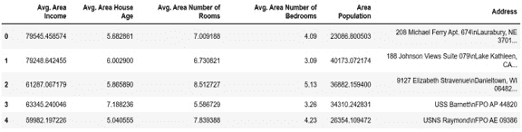

    ###### 图 1.49: 包含独立变量的数据框

1.  使用 `X.shape` 命令打印出你新创建的特征矩阵的形状：

    ```py
    X.shape
    ```

    上面的代码生成了以下输出：

    

    ###### 图 1.50：X 变量的形状

    在前面的图中，第一个值表示数据集中的观察数（**5000**），第二个值表示特征数（**6**）。

1.  同样地，我们将创建一个名为 `y` 的变量来存储目标值。我们将使用索引来获取目标列。索引允许我们访问更大元素的一部分。在本例中，我们希望从 `df` 数据框中提取名为 Price 的列，并打印出前 10 个值。添加以下代码来实现：

    ```py
    y = df['Price']
    y.head(10)
    ```

    上面的代码生成了以下输出：

    

    ###### 图 1.51：y 变量的前 10 个值

1.  使用 `y.shape` 命令打印出你新创建的变量的形状：

    ```py
    y.shape
    ```

    上面的代码生成了以下输出：

    

    ###### 图 1.52：y 变量的形状

    数据集的形状应为一维，长度等于观察数量（**5000**）。

1.  将数据集按 80:20 的比例分成训练集和测试集。为此，请使用来自 `sklearn.model_selection` 包的 `train_test_split()` 函数。添加以下代码来实现：

    ```py
    from sklearn.model_selection import train_test_split
    X_train, X_test, y_train, y_test = train_test_split(X, y, test_size=0.2, random_state=0)
    ```

    在上面的代码中，`test_size` 是一个浮动值，定义了测试数据的大小。如果值为 0.2，则为 80:20 的分割比例。`test_train_split` 会将数组或矩阵随机分割成训练集和测试集。每次我们运行代码而不指定 `random_state` 时，都会得到不同的结果。

1.  打印出 `X_train`、`X_test`、`y_train` 和 `y_test` 的形状。添加以下代码来实现：

    ```py
    print("X_train : ",X_train.shape)
    print("X_test : ",X_test.shape)
    print("y_train : ",y_train.shape)
    print("y_test : ",y_test.shape)
    ```

    上面的代码生成了以下输出：


###### 图 1.53：训练集和测试集的数据形状

你已经成功地将数据分割成训练集和测试集。

在接下来的章节中，你将完成一项活动，其中你将对数据集进行预处理。

### 活动 1：使用银行营销订阅数据集进行预处理

在这个活动中，我们将对 `Bank Marketing Subscription` 数据集进行各种预处理任务。该数据集与葡萄牙银行机构的直接营销活动相关。通过电话营销新产品，并记录每个客户是否订阅了该产品。

按照以下步骤完成此活动：

#### 注意

`Bank Marketing Subscription` 数据集可以在此处找到： [`github.com/TrainingByPackt/Data-Science-with-Python/blob/master/Chapter01/Data/Banking_Marketing.csv`](https://github.com/TrainingByPackt/Data-Science-with-Python/blob/master/Chapter01/Data/Banking_Marketing.csv)。

1.  从给定的链接加载数据集到 pandas 数据框中。

1.  通过找到行数和列数、列出所有列、找到所有列的基本统计信息（可以使用`describe().transpose()`函数）和列出列的基本信息（可以使用`info()`函数），探索数据的特征。

1.  检查是否有任何缺失（或 NULL）值，并找出每列有多少个缺失值。

1.  删除任何缺失值。

1.  打印`education`列的频率分布。

1.  数据集的`education`列有许多类别。减少类别以进行更好的建模。

1.  选择并执行适合数据的编码方法。

1.  将数据分为训练集和测试集。目标数据在`y`列中，独立数据在其余列中。将数据以 80%的训练集和 20%的测试集分割。

    #### 注意

    此活动的解决方案可以在第 324 页找到。

现在我们已经涵盖了各种数据预处理步骤，让我们更详细地看看数据科学家可用的不同类型的机器学习。

## 监督学习

监督学习是一种使用标记数据（目标变量已知的数据）进行训练的学习系统。模型学习如何将特征矩阵中的模式映射到目标变量。当训练后的机器用新数据集进行输入时，它可以利用所学内容预测目标变量。这也可以称为预测建模。

监督学习广泛分为两类。这些类别如下：

**分类** 主要处理分类目标变量。分类算法有助于预测数据点属于哪个组或类。

当预测处于两个类之间时，称为二元分类。例如，预测客户是否会购买产品（在这种情况下，类别为是和否）。

如果预测涉及超过两个目标类，则称为多分类；例如，预测客户将购买的所有物品。

**回归** 处理数值目标变量。回归算法基于训练数据集预测目标变量的数值。

线性回归 测量一个或多个 预测变量 与一个 结果变量 之间的关联。例如，线性回归可以帮助列举年龄、性别和饮食（预测变量）对身高（结果变量）的相对影响。

**时间序列分析**，顾名思义，处理的是随时间分布的数据，即按时间顺序排列的数据。股市预测和客户流失预测是时间序列数据的两个例子。根据需求或必要性，时间序列分析可以是回归或分类任务。

## 无监督学习

与有监督学习不同，无监督学习过程涉及的数据既没有分类也没有标记。算法将对数据进行分析，而不需要指导。机器的任务是根据数据中的相似性将未分组的信息进行分组。其目标是让模型在数据中发现模式，从而为我们提供数据的洞察力并进行预测。

一个例子是，使用一整批未标记的客户数据来寻找模式，将客户分成不同的群体。然后可以针对不同的群体推销不同的产品，以实现最大的利润。

无监督学习大致分为两类：

+   **聚类**：聚类过程有助于发现数据中的内在模式。

+   **关联**：关联规则是一种独特的方式，用来发现与大量数据相关的模式，例如当某人购买产品 1 时，他们也倾向于购买产品 2。

## 强化学习

强化学习是机器学习的一个广泛领域，在这个领域中，机器通过观察已执行操作的结果来学习如何在环境中执行下一步操作。强化学习没有固定的答案，学习代理根据任务的要求决定应该做什么。它从以前的经验中学习。这种学习方式涉及奖励和惩罚。

无论你使用何种机器学习方法，你都希望能够衡量你的模型效果。你可以通过各种性能指标来做到这一点。你将在本书的后续章节中看到这些如何使用，但这里简要概述了其中一些最常见的指标。

## 性能指标

机器学习中有不同的评估指标，这些指标依赖于数据的类型和需求。以下是一些常见的指标：

+   混淆矩阵

+   精确度

+   召回

+   准确率

+   F1 分数

**混淆矩阵**

**混淆矩阵**是一个表格，用来定义分类模型在测试数据上的表现，其中实际值是已知的。为了更好地理解这一点，请看下图，展示了预测值与实际值：

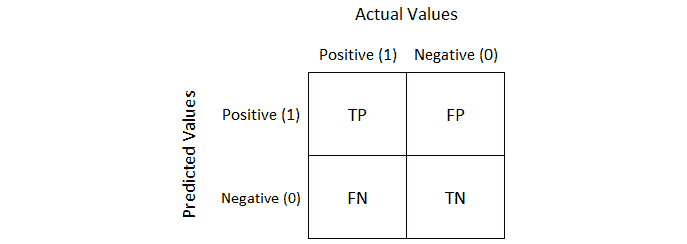

###### 图 1.54：预测值与实际值

让我们详细了解混淆矩阵及其指标，TP、TN、FP 和 FN。假设你正在构建一个预测怀孕的模型：

+   `True`。

+   `True`，这是不可能发生的。它是一种错误，称为类型 1 错误。

+   `False`，这也是一种错误，称为类型 2 错误。

+   `False`；即**真正负类**。

类型 1 错误比类型 2 错误更危险。根据问题的不同，我们必须弄清楚是需要减少类型 1 错误还是类型 2 错误。

**精确度**

精确度是 TP 结果与模型预测的所有正向结果的比例。精确度衡量我们模型的准确性，如下所示：


###### 图 1.55：精度公式

**召回率**

召回率计算我们模型预测出的 TP（真正例）结果所占的比例：


###### 图 1.56：召回率公式

**准确率**

准确率计算模型在所有预测中正确预测正例的比例：


###### 图 1.57：准确率公式

**F1 得分**

F1 得分是另一种准确度衡量方法，但它允许我们在精度和召回率之间寻求平衡：


###### 图 1.58：F1 得分

在考虑模型表现时，我们必须理解预测误差的另外两个重要概念：偏差和方差。

**什么是偏差？**

**偏差**是指预测值与实际值之间的差距。高偏差意味着模型非常简单，无法捕捉到数据的复杂性，导致所谓的欠拟合。

**什么是方差？**

**高方差**是指模型在训练数据集上表现得过好。这会导致过拟合，使得模型对训练数据过于特定，也就是说，模型在测试数据上表现不佳。

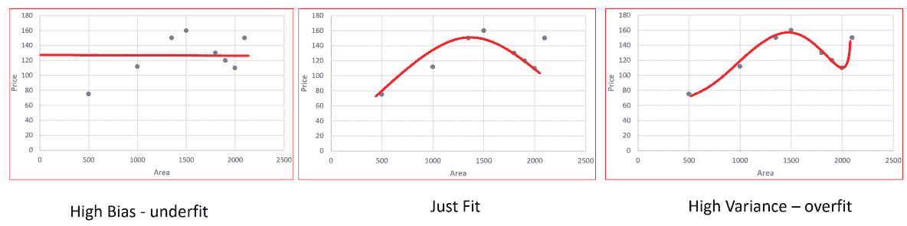

###### 图 1.59：高方差

假设你正在构建一个线性回归模型，目的是预测一个国家中汽车的市场价格。假设你有关于汽车及其价格的大量数据集，但仍有一些汽车的价格需要预测。

当我们用数据集训练模型时，我们希望模型仅仅在数据集中找到那个模式，仅此而已，因为如果超出这个范围，它就会开始记住训练集中的数据。

我们可以通过调整模型的超参数来改进模型——书中的后续章节会详细介绍这一点。我们通过使用另一个数据集，即验证集，来努力最小化误差并最大化准确率。第一个图表显示模型还没有学到足够的知识来在测试集上进行良好的预测。第三个图表显示模型已经记住了训练数据集，这意味着准确率将是 100，误差为 0。但如果我们在测试数据上进行预测，中间的模型表现会优于第三个。

## 总结

在本章中，我们介绍了数据科学的基础，并探讨了使用科学方法、过程和算法从数据中提取潜在信息的过程。接着我们进入了数据预处理，包括数据清洗、数据集成、数据转换和数据离散化。

我们看到在使用机器学习算法构建模型时，如何将预处理过的数据分为训练集和测试集。我们还讨论了监督学习、无监督学习和强化学习算法。

最后，我们介绍了不同的度量标准，包括混淆矩阵、精度、召回率和准确率。

在下一章中，我们将介绍数据可视化。
