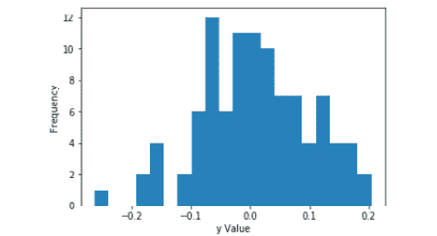

# 第十一章：*第二章*

# 数据可视化

## 学习目标

本章结束时，您将能够：

+   使用函数式方法创建和自定义折线图、条形图、直方图、散点图和箱线图

+   开发程序化的、描述性的图表标题

+   描述使用面向对象方法创建 Matplotlib 图表的优势

+   创建一个包含单个轴或多个轴的可调用图表对象

+   调整大小并保存包含多个子图的图表对象

+   使用 Matplotlib 创建和自定义常见的图表类型。

本章将涵盖属于数据可视化范畴的各种概念。

## 简介

数据可视化是一种强大的工具，允许用户快速消化大量数据。有不同类型的图表用于各种目的。在业务中，折线图和条形图通常用于显示随时间变化的趋势和比较不同组之间的指标。而统计学家可能更感兴趣的是使用散点图或相关矩阵来检查变量之间的相关性。他们还可以使用直方图检查变量的分布或使用箱线图检查异常值。在政治中，饼图广泛用于比较不同类别之间的总数据。数据可视化可以非常复杂和创造性，仅限于个人的想象力。

Python 库 Matplotlib 是一个文档良好的二维绘图库，可以用来创建各种强大的数据可视化，其宗旨是“...让简单的事情变得简单，让困难的事情变得可能”（https://matplotlib.org/index.html）。

Matplotlib 创建图表的两种方法分别是**函数式方法**和**面向对象方法**。

在函数式方法中，创建一个包含单个图表的图形。通过一系列顺序函数来创建和自定义图表。但是，函数式方法不允许我们将图表保存到我们的环境中作为一个对象；这可以通过面向对象的方法实现。在面向对象的方法中，我们创建一个**图形对象**，为一个图表或多个子图分配一个轴或多个轴。然后，我们可以自定义轴或轴，并通过调用图形对象来调用单个图表或多个图表集合。

在本章中，我们将使用函数式方法来创建和自定义折线图、条形图、直方图、散点图和箱线图。然后，我们将学习如何使用面向对象的方法来创建和自定义单轴和多轴图。

## 函数式方法

在 Matplotlib 中使用函数式方法绘图是一种快速生成单轴图形的方式。通常，这是教给初学者的方法。函数式方法允许用户自定义并将图形保存为所选目录中的图像文件。在以下的练习和活动中，你将学习如何使用函数式方法绘制线形图、条形图、直方图、箱线图和散点图。

### 练习 13：函数式方法 – 线形图

要开始使用 Matplotlib，我们将从创建一个线形图开始，并对其进行自定义：

1.  使用以下代码生成一个水平轴的数字数组，范围从 0 到 10，共 20 个均匀分布的值：

    ```py
    import numpy as np
    x = np.linspace(0, 10, 20)
    ```

1.  创建一个数组并将其保存为对象`y`。以下代码片段将`x`的值立方并保存到数组`y`中：

    ```py
    y = x**3
    ```

1.  按如下方式创建图形：

    ```py
    import matplotlib.pyplot as plt
    plt.plot(x, y)
    plt.show()
    ```

    参见这里的结果输出：

    

    ###### 图 2.1：y 与 x 的线形图

1.  使用以下代码添加一个 x 轴标签，内容为'`Linearly Spaced Numbers`'：

    ```py
    plt.xlabel('Linearly Spaced Numbers')
    ```

1.  使用以下代码添加一个 y 轴标签，内容为'`y Value`'：

    ```py
    plt.ylabel('y Value')
    ```

1.  使用以下代码添加一个标题，内容为'`x by x cubed`'：

    ```py
    plt.title('x by x Cubed')
    ```

1.  通过在`plt.plot()`函数中将颜色参数指定为`k`，将线条颜色更改为黑色：

    ```py
    plt.plot(x, y, 'k')
    ```

    使用`plt.show()`将图形打印到控制台。

    查看以下截图，查看结果输出：

    

    ###### 图 2.2：带有标签轴和黑色线条的线形图

1.  将线条字符改为菱形；使用字符参数（即 D）结合颜色字符（即 k），如下所示：

    ```py
    plt.plot(x, y, 'Dk')
    ```

    查看下图，查看结果输出：

    

    ###### 图 2.3：带有未连接的黑色菱形标记的线形图

1.  使用以下代码通过在`D`和`k`之间添加'`-`'来连接菱形，形成实线：

    ```py
    plt.plot(x, y, 'D-k')
    ```

    参见下图查看输出：

    

    ###### 图 2.4：带有连接的黑色菱形标记的线形图

1.  使用`plt.title()`函数中的`fontsize`参数来增大标题的字体大小，如下所示：

    ```py
    plt.title('x by x Cubed', fontsize=22)
    ```

1.  使用以下代码将图形打印到控制台：

    ```py
    plt.show()
    ```

1.  输出可以在下图中看到：


###### 图 2.5：带有较大标题的线形图

在这里，我们使用函数式方法创建了一个单线的线形图，并对其进行了样式化，使其更具美感。然而，在同一个图中比较多个趋势并不罕见。因此，接下来的练习将详细讲解如何在同一线形图中绘制多条线并创建图例来区分这些线条。

### 练习 14：函数式方法 – 向线形图添加第二条线

Matplotlib 通过简单地指定另一个 `plt.plot()` 实例，使得在折线图中添加另一条线变得非常容易。在本练习中，我们将使用单独的线绘制 x 的立方和 x 的平方：

1.  创建另一个 y 对象，就像我们为第一个 y 对象所做的那样，不过这次是对 x 进行平方，而不是立方，如下所示：

    ```py
    y2 = x**2
    ```

1.  现在，通过在现有图表中添加 `plt.plot(x, y2)`，将 `y2` 绘制在与 y 相同的图表上。

    参考此处的输出：

    

    ###### 图 2.6：y 和 y2 随 x 的多条折线图

1.  使用以下代码将 `y2` 的颜色更改为红色虚线：

    ```py
    plt.plot(x, y2, '--r')
    ```

    输出显示在以下图示中：

    

    ###### 图 2.7：y2 为红色虚线的多条折线图

1.  要创建图例，我们必须首先使用 `plt.plot()` 函数中的 label 参数为我们的线条创建标签。

1.  要将 y 标记为 '`x 的立方`'，使用以下代码：

    ```py
    plt.plot(x, y, 'D-k', label='x cubed') 
    ```

1.  使用以下代码将 `y2` 标记为 '`x 的平方`'：

    ```py
    plt.plot(x, y2, '--r', label='x squared')
    ```

1.  使用 `plt.legend(loc='upper left')` 来指定图例的位置。

    请查看以下截图以查看最终输出：

    

    ###### 图 2.8：带有图例的多条折线图

1.  为了在新行开始时将一行文本分割成多行，我们使用字符串中的'`\n`'。因此，使用以下代码，我们可以创建此处显示的标题：

    ```py
    plt.title('As x increases, \nx Cubed (black) increases \nat a Greater Rate than \nx Squared (red)', fontsize=22)
    ```

    请查看以下截图中的输出：

    

    ###### 图 2.9：带有多行标题的多条折线图

1.  要更改图表的尺寸，我们需要在 `plt` 实例的顶部添加 `plt.figure(figsize=(10,5))`。`figsize` 参数中的 10 和 5 分别指定了图表的宽度和高度。

    要查看输出，请参考以下图示：


###### 图 2.10：增加图表尺寸的多条折线图

在本练习中，我们学习了如何使用函数式方法在 Matplotlib 中创建和设置单条和多条折线图。为了巩固我们的学习，我们将绘制另一张稍微不同样式的单条折线图。

### 活动 2：折线图

在本活动中，我们将创建一个折线图，分析从一月到六月每月销售商品的趋势。趋势将是正向的并且呈线性增长，并将使用带星形标记的蓝色虚线表示。x 轴将标记为 '`月份`'，y 轴将标记为 '`销售商品数`'。标题将显示为 '销售商品数呈线性增长：'

1.  创建一个包含六个字符串的 x 列表，表示一月到六月的月份。

1.  创建一个包含六个值的 y 列表，这些值表示 '`销售商品数`'，从 1000 开始，每个值增加 200，直到最后一个值为 2000。

1.  生成上述描述的图表。

    查看以下截图以获取结果输出：


###### 图 2.11：按月份销售的商品线形图

#### 注意

我们可以参考第 333 页的本活动解决方案。

到目前为止，我们已经获得了很多创建和自定义线形图的实践。线形图通常用于显示趋势。然而，在比较各组之间和/或组内的值时，条形图通常是首选的可视化方式。在接下来的练习中，我们将探讨如何创建条形图。

### 练习 15：创建条形图

在本练习中，我们将按商品类型显示销售收入：

1.  创建一个商品类型的列表，并使用以下代码将其保存为 `x`：

    ```py
    x = ['Shirts', 'Pants','Shorts','Shoes']
    ```

1.  创建一个销售收入的列表，并按如下方式将其保存为 `y`：

    ```py
    y = [1000, 1200, 800, 1800]
    ```

1.  要创建条形图并将其打印到控制台，请参考以下代码：

    ```py
    import matplotlib.pyplot as plt
    plt.bar(x, y)
    plt.show()
    ```

    以下截图显示了结果输出：

    

    ###### 图 2.12：按商品类型划分的销售收入条形图

1.  使用以下代码添加标题“`Sales Revenue by Item Type`”：

    ```py
    plt.title('Sales Revenue by Item Type')
    ```

1.  使用以下代码创建一个显示“`Item Type`”的 x 轴标签：

    ```py
    plt.xlabel('Item Type')
    ```

1.  使用以下代码添加一个 y 轴标签，显示“`Sales Revenue ($)`”：

    ```py
    plt.ylabel('Sales Revenue ($)')
    ```

    以下截图显示了输出：

    

    ###### 图 2.13：带有自定义轴和标题的条形图

1.  我们将创建一个标题，该标题会根据绘制的数据进行更改。对于这个示例，标题将是“`Shoes Produce the Most Sales Revenue`”。首先，我们将找到 y 中最大值的索引，并使用以下代码将其保存为 `index_of_max_y` 对象：

    ```py
    index_of_max_y = y.index(max(y))
    ```

1.  使用以下代码，将列表 `x` 中与 `index_of_max_y` 索引相等的项保存到 `most_sold_item` 对象：

    ```py
    most_sold_item = x[index_of_max_y]
    ```

1.  按照以下方式使标题具有程序化功能：

    ```py
    plt.title('{} Produce the Most Sales Revenue'.format(most_sold_item))
    ```

    查看以下输出：

    

    ###### 图 2.14：带有程序化标题的条形图

1.  如果我们希望将图表转换为水平条形图，可以通过将 `plt.bar(x, y)` 替换为 `plt.barh(x, y)` 来实现。

    以下截图显示了输出：

    

    ###### 图 2.15：带有错误标注轴的水平条形图

    #### 注意

    记住，当条形图从垂直转为水平时，x 轴和 y 轴需要互换。

1.  将 x 和 y 的标签分别从 `plt.xlabel('Item Type')` 和 `plt.ylabel('Sales Revenue ($)')` 互换为 `plt.xlabel('Sales Revenue ($)')` 和 `plt.ylabel('Item Type')`。

查看以下输出，获取最终的条形图：


###### 图 2.16：带有正确标注轴的水平条形图

在前一个练习中，我们学习了如何创建条形图。使用 Matplotlib 创建条形图非常简单。在接下来的活动中，我们将继续练习构建条形图。

### 活动 3：条形图

在本活动中，我们将创建一个条形图，比较五支获得最多冠军头衔的 NBA 球队的冠军数量。该图将按标题数从大到小排序，拥有最多头衔的球队在左侧，最少的在右侧。柱状条将为红色，x 轴将命名为 '`NBA 球队`'，y 轴将命名为 '`冠军数量`'，标题将是程序化的，解释哪支球队拥有最多冠军及其数量。在进行此活动之前，请确保在线查找所需的 NBA 球队数据。此外，我们将使用 `plt.xticks(rotation=45)` 将 x 轴刻度标签旋转 45 度，以避免重叠，并将图表保存到当前目录：

1.  为 `x` 创建一个包含五个字符串的列表，这些字符串是获得最多冠军头衔的 NBA 球队名称。

1.  为 `y` 创建一个包含五个值的列表，这些值对应于 `x` 中的字符串，表示 '`获得的冠军头衔`'。

1.  将 x 和 y 放入一个数据框，其中列名分别为 '`队伍`' 和 '`冠军头衔`'。

1.  按 '`标题`' 进行降序排序数据框。

1.  创建一个程序化的标题并将其保存为 `title`。

1.  生成描述的图形。

    #### 注意

    我们可以参考第 334 页的解答来完成此活动。

折线图和条形图是两种非常常见且有效的可视化方式，分别用于报告趋势和比较不同组。然而，若要进行更深入的统计分析，生成能揭示特征特性（而这些特征在折线图和条形图中无法显现）的图形就显得尤为重要。因此，在接下来的练习中，我们将学习创建常见的统计图表。

### 练习 16：函数式方法 – 直方图

在统计学中，在进行任何类型的分析之前，了解连续变量的分布是非常重要的。为了展示分布，我们将使用直方图。直方图通过给定数组的区间显示频率：

1.  为了展示如何创建直方图，我们将生成一个包含 100 个符合正态分布的值的数组，均值为 0，标准差为 0.1，并使用以下代码将其保存为 y：

    ```py
    import numpy as np
    y = np.random.normal(loc=0, scale=0.1, size=100)
    ```

1.  导入 Matplotlib 后，使用以下代码创建直方图：

    ```py
    plt.hist(y, bins=20)
    ```

1.  使用以下代码为 x 轴创建一个名为 '`y 值`' 的标签：

    ```py
    plt.xlabel('y Value')
    ```

1.  使用以下代码将 y 轴命名为 '`频率`'：

    ```py
    plt.ylabel('Frequency')
    ```

1.  使用 `plt.show()` 将其打印到控制台：

1.  查看以下截图中的输出：

    ###### 图 2.17：带有标注坐标轴的 y 直方图

    #### 注意

    当我们查看直方图时，我们通常会判断分布是否为正态分布。有时，一个分布看起来是正态分布，但实际上不是；而有时，一个分布看起来不是正态分布，但实际上是正态的。为了检测正态性，有一个叫做 Shapiro-Wilk 检验的方法。Shapiro-Wilk 检验的原假设是数据是正态分布的。因此，p 值 < 0.05 表示非正态分布，而 p 值 > 0.05 表示正态分布。我们将使用 Shapiro-Wilk 检验的结果来创建一个程序化标题，告知读者分布是否为正态分布。

1.  使用元组解包，将 Shapiro-Wilk 检验中的 W 统计量和 p 值分别保存到`shap_w`和`shap_p`对象中，代码如下：

    ```py
    from scipy.stats import shapiro
    shap_w, shap_p = shapiro(y)
    ```

1.  我们将使用 if-else 语句来判断数据是否为正态分布，并将适当的字符串存储在`normal_YN`对象中。

    ```py
    if shap_p > 0.05:
        normal_YN = 'Fail to reject the null hypothesis. Data is normally distributed.'
    else:
        normal_YN = 'Null hypothesis is rejected. Data is not normally distributed.'
    ```

1.  使用`plt.title(normal_YN)`将`normal_YN`赋值给我们的图表，并使用`plt.show()`将其打印到控制台。

    请查看此截图中的最终输出：


###### 图 2.18：带有程序化标题的 y 的直方图

如前所述，直方图用于显示数组的分布。另一个常用的统计图表用于探索数值特征的是箱线图，也称为箱型图。

箱线图显示了一个数组的分布，基于最小值、第一个四分位数、中位数、第三个四分位数和最大值，但它们主要用于表示分布的偏斜程度并识别离群值。

### 练习 17：函数式方法 – 箱线图

在本练习中，我们将学习如何创建箱线图，并在标题中呈现关于分布形状和离群值数量的信息：

1.  使用以下代码生成一个均值为 0，标准差为 0.1 的 100 个正态分布的数字数组，并将其保存为 y：

    ```py
    import numpy as np
    y = np.random.normal(loc=0, scale=0.1, size=100)
    ```

1.  如下创建并显示图表：

    ```py
    import matplotlib.pyplot as plt
    plt.boxplot(y) 
    plt.show() 
    ```

    有关输出，请参见下图：

    

    ###### 图 2.19：y 的箱线图

    #### 注意

    该图显示了一个框，表示四分位距（IQR）。框的顶部是第 25 百分位（即 Q1），框的底部是第 75 百分位（即 Q3）。穿过盒子的橙色线是中位数。框上方和下方延伸的两条线是“胡须”。上胡须的顶部是“最大”值，通过 Q1 - 1.5*IQR 计算得出。下胡须的底部是“最小”值，通过 Q3 + 1.5*IQR 计算得出。离群值（或边缘离群值）以点的形式显示在“最大”胡须上方或“最小”胡须下方。

1.  使用以下代码将 Shapiro W 和 p 值从`shapiro`函数保存：

    ```py
    from scipy.stats import shapiro
    shap_w, shap_p = shapiro(y)
    ```

1.  参考以下代码将`y`转换为 z 得分：

    ```py
    from scipy.stats import zscore
    y_z_scores = zscore(y)
    ```

    #### 注意

    这是衡量数据的一种方式，显示每个数据点与均值的标准差差异。

1.  使用以下代码迭代 `y_z_scores` 数组，以找到离群值的数量：

    ```py
    total_outliers = 0 
    for i in range(len(y_z_scores)): 
        if abs(y_z_scores[i]) >= 3:
            total_outliers += 1
    ```

    #### 注释

    由于生成的数组 y 是正态分布的，因此我们可以预期数据中没有离群值。

1.  生成一个标题，传达数据是否呈正态分布，以及离群值的数量。如果 `shap_p` 大于 0.05，则我们的数据呈正态分布。如果小于 0.05，则数据不呈正态分布。我们可以通过以下逻辑设置并包含离群值的数量：

    ```py
    if shap_p > 0.05:
        title = 'Normally distributed with {} outlier(s).'.format(total_outliers)
    else:
        title = 'Not normally distributed with {} outlier(s).'.format(total_outliers)
    ```

1.  使用 `plt.title`（标题）设置我们的图表标题，并通过以下方式打印到控制台：

    ```py
    plt.show()
    ```

1.  在下图中检查最终输出：


###### 图 2.20：带程序生成标题的 y 的箱线图

直方图和箱线图在探索数值数组特征时非常有效。然而，它们并不能提供数组之间关系的信息。在下一个练习中，我们将学习如何创建散点图——一种常见的可视化方式，用于展示两个连续数组之间的关系。

### 练习 18：散点图

在本练习中，我们将创建一个体重与身高的散点图。我们将再次创建一个标题来解释该图所展示的信息：

1.  使用以下方法生成一个表示身高的数字列表，并将其保存为 y：

    ```py
    y = [5, 5.5, 5, 5.5, 6, 6.5, 6, 6.5, 7, 5.5, 5.25, 6, 5.25]
    ```

1.  使用以下方法生成一个表示体重的数字列表，并将其保存为 x：

    ```py
    x = [100, 150, 110, 140, 140, 170, 168, 165, 180, 125, 115, 155, 135]
    ```

1.  使用以下代码创建一个基本的散点图，体重为 x 轴，身高为 y 轴：

    ```py
    import matplotlib.pyplot as plt
    plt.scatter(x, y)
    ```

1.  将 x 轴标记为 '`体重`'，如下所示：

    ```py
    plt.xlabel('Weight')
    ```

1.  将 y 轴标记为 '`身高`'，如下所示：

    ```py
    plt.ylabel('Height')
    ```

1.  使用 `plt.show()` 将图表打印到控制台。

    我们的输出应类似于以下内容：

    

    ###### 图 2.21：按体重绘制的身高散点图

1.  我们希望图表标题能告知读者关系的强度和 Pearson 相关系数。因此，我们将计算 Pearson 相关系数，并在标题中解释该系数的值。计算 Pearson 相关系数的代码如下：

    ```py
    from scipy.stats import pearsonr
    correlation_coeff, p_value = pearsonr(x, y)
    ```

1.  Pearson 相关系数是一个指标，用于衡量两个连续数组之间线性关系的强度和方向。使用 if-else 逻辑，我们将通过以下代码返回相关系数的解释：

    ```py
    if correlation_coeff == 1.00:
        title = 'There is a perfect positive linear relationship (r = {0:0.2f}).'.format(correlation_coeff)
    elif correlation_coeff >= 0.8:
        title = 'There is a very strong, positive linear relationship (r = {0:0.2f}).'.format(correlation_coeff)
    elif correlation_coeff >= 0.6:
        title = 'There is a strong, positive linear relationship (r = {0:0.2f}).'.format(correlation_coeff)
    elif correlation_coeff >= 0.4:
        title = 'There is a moderate, positive linear relationship (r = {0:0.2f}).'.format(correlation_coeff)
    elif correlation_coeff >= 0.2:
        title = 'There is a weak, positive linear relationship (r = {0:0.2f}).'.format(correlation_coeff)
    elif correlation_coeff > 0:
        title = 'There is a very weak, positive linear relationship (r = {0:0.2f}).'.format(correlation_coeff)
    elif correlation_coeff == 0:
        title = 'There is no linear relationship (r = {0:0.2f}).'.format(correlation_coeff)
    elif correlation_coeff <= -0.8:
        title = 'There is a very strong, negative linear relationship (r = {0:0.2f}).'.format(correlation_coeff)
    elif correlation_coeff <= -0.6:
        title = 'There is a strong, negative linear relationship (r = {0:0.2f}).'.format(correlation_coeff)
    elif correlation_coeff <= -0.4:
        title = 'There is a moderate, negative linear relationship (r = {0:0.2f}).'.format(correlation_coeff)
    elif correlation_coeff <= -0.2:
        title = 'There is a weak, negative linear relationship (r = {0:0.2f}).'.format(correlation_coeff)
    else: 
        title = 'There is a very weak, negative linear relationship (r = {0:0.2f}).'.format(correlation_coeff)
    print(title)
    ```

1.  现在，我们可以使用新创建的标题对象作为标题，方法是使用 `plt.title(title)`。

    请参阅下图以了解结果输出：


###### 图 2.22：按体重绘制的身高散点图，带程序生成的标题

到目前为止，我们已经学习了如何使用函数式方法为不同目的创建和设置各种图表样式。虽然这种绘图方法非常有效，可以快速生成可视化图表，但它无法创建多个子图，也无法将图表保存为我们环境中的对象。为了将图表保存为对象，我们必须使用面向对象的方法，这将在接下来的练习和活动中进行介绍。

## 使用子图的面向对象方法

使用 Matplotlib 的函数式绘图方法不允许用户将图表保存为我们环境中的对象。在面向对象的方法中，我们创建一个图形对象，作为一个空画布，然后我们将一组坐标轴或子图添加到图形中。该图形对象是可调用的，如果被调用，将返回该图形到控制台。我们将通过绘制与*练习 13*中相同的 x 和 y 对象来演示这一过程。

### 练习 19：使用子图绘制单条线

当我们学习 Matplotlib 的函数式绘图方法时，我们从创建和自定义一条线性图开始。在本次练习中，我们将使用函数式绘图方法创建并设置样式的线性图：

1.  使用以下代码将`x`保存为从 0 到 10 的数组，间隔为 20 个线性步长：

    ```py
    import numpy as np
    x = np.linspace(0, 10, 20)
    ```

    使用以下代码将`y`保存为 x 的三次方：

    ```py
    y = x**3
    ```

1.  按以下步骤创建图形和坐标轴：

    ```py
    import matplotlib.pyplot as plt 
    fig, axes = plt.subplots() 
    plt.show() 
    ```

    查看以下屏幕截图以查看输出结果：

    

    ###### 图 2.23：可调用的图形和坐标轴集

    #### 注意

    `fig`对象现在是可调用的，并返回我们可以绘制的坐标轴。

1.  使用以下代码绘制 y（即 x 的平方）与 x 的关系：

    ```py
    axes.plot(x, y)
    ```

    下图显示了输出结果：

    

    ###### 图 2.24：按 x 绘制 y 的可调用线性图

1.  将图表样式设置与*练习 13*中的样式相同。首先，按照以下步骤更改线条颜色和标记：

    ```py
    axes.plot(x, y, 'D-k')
    ```

1.  使用以下代码将 x 轴标签设置为'`线性间隔数字`'：

    ```py
    axes.set_xlabel('Linearly Spaced Numbers')
    ```

1.  使用以下代码将 y 轴设置为'`y 值`'：

    ```py
    axes.set_ylabel('y Value')
    ```

1.  使用以下代码将标题设置为'`随着 x 的增加，y 按 x 的三次方增加`'：

    ```py
    axes.set_title('As x increases, y increases by x cubed')
    ```

    下图显示了输出结果：


###### 图 2.25：按 x 绘制 y 的可调用样式线图

在本次练习中，我们创建了一个与*练习 13*中的第一个图表非常相似的图表，但现在它是一个可调用的对象。使用面向对象的绘图方法的另一个优势是可以在单个图形对象上创建多个子图。

在某些情况下，我们希望并排比较不同的数据视图。我们可以在 Matplotlib 中使用子图来实现这一点。

### 练习 20：使用子图绘制多条线

因此，在本练习中，我们将绘制与练习 14 中相同的线条，但我们将在同一个可调用的图形对象中绘制两个子图。子图是通过网格格式布局的，并可以通过 [行，列] 索引访问。例如，如果我们的图形对象包含四个子图，排列成两行两列，我们可以通过 `axes[0,0]` 引用左上角的图形，使用 `axes[1,1]` 引用右下角的图形，如下图所示。


###### 图 2.26：坐标轴索引引用

在剩余的练习和活动中，我们将有很多机会练习生成子图并访问各种坐标轴。在本练习中，我们将使用子图绘制多个线图：

1.  首先，使用以下代码创建 `x`、`y` 和 `y2`：

    ```py
    import numpy as np
    x = np.linspace(0, 10, 20)
    y = x**3
    y2 = x**2
    ```

1.  创建一个包含两个坐标轴（即子图）的图像，它们并排显示（即 1 行 2 列），如下所示：

    ```py
    import matplotlib.pyplot as plt
    fig, axes = plt.subplots(nrows=1, ncols=2)
    ```

    结果输出如下所示：

    

    ###### 图 2.27：包含两个子图的图像

1.  要访问左侧的子图，请将其引用为 `axes[0]`。要访问右侧的图形，请将其引用为 `axes[1]`。在左侧坐标轴上，使用以下代码绘制 y 对 x 的图像：

    ```py
    axes[0].plot(x, y)
    ```

1.  使用以下内容添加标题：

    ```py
    axes[0].set_title('x by x Cubed')
    ```

1.  使用以下代码行生成 x 轴标签：

    ```py
    axes[0].set_xlabel('Linearly Spaced Numbers')
    ```

1.  使用以下代码创建 y 轴标签：

    ```py
    axes[0].set_ylabel('y Value')
    ```

    结果输出如下所示：

    

    ###### 图 2.28：包含两个子图的图像，左侧已创建

1.  在右侧坐标轴上，使用以下代码绘制 `y2` 对 `x` 的图像：

    ```py
    axes[1].plot(x, y2)
    ```

1.  使用以下代码添加标题：

    ```py
    axes[1].set_title('x by x Squared')
    ```

1.  使用以下代码生成 x 轴标签：

    ```py
    axes[1].set_xlabel('Linearly Spaced Numbers')
    ```

1.  使用以下代码创建 y 轴标签：

    ```py
    axes[1].set_ylabel('y Value')
    ```

    以下截图显示了输出结果：

    

    ###### 图 2.29：包含两个子图的图像

1.  我们已经成功创建了两个子图。然而，看起来右侧的图的 y 轴与左侧图重叠。为了防止图形重叠，可以使用 `plt.tight_layout()`。

    这里显示的是输出结果：


###### 图 2.30：包含两个不重叠子图的图像

使用面向对象的方法，我们只需调用 `fig` 对象即可显示两个子图。我们将在活动 4 中进一步练习面向对象的绘图方法。

### 活动 4：使用子图绘制多种图类型

到目前为止，我们已经学习了如何使用函数式方法构建、定制和编程线性图、条形图、直方图、散点图和箱形图。在第 19 个练习中，我们介绍了面向对象的方法，而在第 20 个练习中，我们学习了如何使用子图创建包含多个图的图形。因此，在本活动中，我们将利用子图创建一个包含多个图表和图表类型的图形。我们将创建一个包含六个子图的图形。子图将按三行两列的布局显示（见图 2.31）：


](img/C13322_02_31.jpg)

###### 图 2.31：子图布局

一旦我们生成了六个子图的图形，我们可以通过'行，列'索引访问每个子图（见图 2.32）：


###### 图 2.32：坐标轴索引引用

因此，要访问线性图（即左上角），使用`axes[0, 0]`。要访问直方图（即中右），使用`axes[1, 1]`。我们将在接下来的活动中练习这一点：

1.  从 GitHub 导入'`Items_Sold_by_Week.csv`'和'`Weight_by_Height.csv`'，并生成一个符合正态分布的数字数组。

1.  生成一个包含六个空子图的图形，使用三行两列的布局，确保子图不重叠。

1.  设置图形标题，确保六个子图排列成三行两列且不重叠。

1.  在'`Line`'、'`Bar`'和'`Horizontal Bar`'坐标轴上，使用'`Items_Sold_by_Week.csv`'绘制按'`Week`'排序的'`Items_Sold`'数据。

1.  在'`Histogram`'和'`Box-and-Whisker`'坐标轴上，绘制包含 100 个符合正态分布的数字的数组。

1.  在'`Scatter`'坐标轴上，使用'`Weight_by_Height.csv`'绘制按身高排序的体重图。

1.  为每个子图标注 x 轴和 y 轴。

1.  增加图形的大小并保存。

    #### 注意

    本活动的解决方案可以在第 338 页找到。

## 总结

在本章中，我们使用了 Python 绘图库 Matplotlib 来创建、定制和保存图表，采用了函数式方法。然后，我们讲解了描述性标题的重要性，并创建了我们自己的描述性编程标题。然而，函数式方法并不创建可调用的图形对象，也不返回子图。因此，为了创建一个可调用的图形对象并能够包含多个子图，我们采用了面向对象的方法来创建、定制和保存图表。绘图需求因分析而异，因此在本章中覆盖所有可能的图表并不实际。为了创建满足每个分析需求的强大图表，熟悉 Matplotlib 文档页面中的文档和示例至关重要。

在下一章中，我们将应用一些这些绘图技巧，进入使用 scikit-learn 的机器学习部分。
