# 第十三章：*第三章*

# 通过 Scikit-Learn 进行机器学习简介

## 学习目标

本章结束时，你将能够：

+   为不同类型的有监督学习模型准备数据。

+   使用网格搜索调整模型的超参数。

+   从调整过的模型中提取特征重要性。

+   评估分类和回归模型的表现。

在本章中，我们将讲解处理数据并使数据准备好进行分析的关键概念。

## 介绍

**scikit-learn** 是一个免费的开源库，专为 Python 构建，包含一系列有监督和无监督的机器学习算法。此外，scikit-learn 提供数据预处理、超参数调优和模型评估的功能，我们将在接下来的章节中涉及到这些内容。它简化了模型构建过程，并且易于在各种平台上安装。scikit-learn 起步于 2007 年，由 David Corneapeau 在 Google Summer of Code 项目中创建，经过一系列的开发和发布，scikit-learn 已经发展成学术界和专业人士广泛使用的机器学习工具之一。

本章中，我们将学习构建一系列广泛使用的建模算法，即线性回归和逻辑回归、支持向量机（SVM）、决策树和随机森林。首先，我们将介绍线性回归和逻辑回归。

## 线性回归与逻辑回归简介

在回归分析中，使用一个或多个自变量来预测单一的因变量或结果变量。回归的应用场景包括但不限于以下预测：

+   根据各种球队统计数据预测球队的胜率

+   根据家族病史及一系列身体和心理特征预测患心脏病的风险

+   根据多个气候指标预测降雪的可能性

由于线性回归和逻辑回归具有易于解释和透明的特点，并且能够对未在训练数据中出现的值进行外推，因此它们是预测此类结果的流行选择。线性回归的最终目标是绘制一条直线，使得这条直线与观测值之间的绝对距离最小（即最佳拟合线）。因此，在线性回归中，假设特征与连续因变量之间的关系是线性的。线的形式通常是斜截式（即 *y = a + bx*），其中 *a* 为截距（即当 *x* 为 0 时 *y* 的值），*b* 为斜率，*x* 为自变量。本章将介绍两种线性回归：简单线性回归和多重线性回归。

### 简单线性回归

简单线性回归模型通过*y =* *α* *+* *β**x*定义一个特征与连续结果变量之间的关系。这个方程类似于斜截式，其中*y*表示因变量的预测值，*α*表示截距，*β*（贝塔）代表斜率，*x*是自变量的值。给定*x*值后，回归模型计算出能够最小化预测的*y*值（即*ŷ*）与实际*y*值之间绝对差异的*α*和*β*的值。

例如，如果我们使用身高（米）作为唯一预测变量来预测一个人的体重（千克），并且简单线性回归模型计算出*α*的值为 1.5，*β*的系数为 50，那么该模型可以解释为：每增加 1 米身高，体重大约增加 50 千克。因此，我们可以预测身高为 1.8 米的人的体重大约是 91.5 千克，计算公式为 y = 1.5 + (50 x 1.8)。在接下来的练习中，我们将演示如何使用 scikit-learn 进行简单线性回归。

### 练习 21：为线性回归模型准备数据

为了准备我们的数据以用于简单的线性回归模型，我们将使用一个随机子集，该子集来自 2006 至 2016 年间匈牙利塞格德市的天气数据集。该数据集包含从 2006 年 4 月 1 日到 2016 年 9 月 9 日的每小时天气测量数据。经过处理的数据以`.csv`文件形式提供（https://github.com/TrainingByPackt/Data-Science-with-Python/blob/master/Chapter02/weather.csv），并包含 10,000 条观察记录，涵盖 8 个变量：

+   `Temperature_c`：温度，单位为摄氏度

+   `Humidity`：湿度比例

+   `Wind_Speed_kmh`：风速，单位为公里每小时

+   `Wind_Bearing_Degrees`：风向，按顺时针方向从正北开始的角度

+   `Visibility_km`：能见度，单位为公里

+   `Pressure_millibars`：大气压力，单位为毫巴

+   `Rain`：雨=1，雪=0

+   `Description`：温暖、正常或寒冷

1.  使用以下代码导入`weather.csv`数据集：

    ```py
    import pandas as pd
    df = pd.read_csv('weather.csv')
    ```

1.  使用`df.info()`探索数据：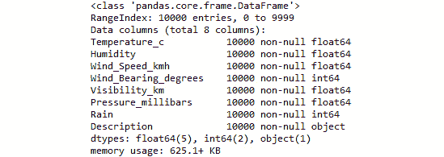

    ](img/C13322_03_01.jpg)

    ###### 图 3.1：描述 df 的信息

1.  `Description`列是`df`中的唯一类别变量。可以按如下方式检查`Description`中的层级数量：

    ```py
    levels = len(pd.value_counts(df['Description']))
    print('There are {} levels in the Description column'.format(levels))
    ```

    层级的数量如下图所示：

    

    ###### 图 3.2：'Description'列中的层级数量

    #### 注意

    多类类别变量必须通过一种称为“虚拟编码”的过程转换为虚拟变量。对多类类别变量进行虚拟编码会创建 n-1 个新的二元特征，这些特征对应于类别变量中的层级。例如，一个具有三个层级的多类类别变量将创建两个二元特征。经过虚拟编码后，必须删除原始特征。

1.  要对所有多分类的类别变量进行虚拟编码，请参考以下代码：

    ```py
    import pandas as pd
    df_dummies = pd.get_dummies(df, drop_first=True)
    ```

    #### 注意

    原始的 DataFrame `df`包含八列，其中一列（即`Description`）是一个具有三个级别的多分类类别变量。

1.  在第 4 步中，我们将这个特征转换为 n-1（即 2）个分开的虚拟变量，并删除了原始特征`Description`。因此，`df_dummies`现在应该包含比`df`多一列（即 9 列）。使用以下代码检查这一点：

    ```py
    print('There are {} columns in df_dummies'	.format(df_dummies.shape[1]))
    ```

    

    ###### 图 3.3：虚拟编码后列的数量

1.  为了消除数据中可能存在的顺序效应，良好的实践是先对数据的行进行洗牌，然后再将数据拆分为特征（`X`）和结果（`y`）。要对`df_dummies`中的行进行洗牌，请参考以下代码：

    ```py
    from sklearn.utils import shuffle
    df_shuffled = shuffle(df_dummies, random_state=42)
    ```

1.  现在数据已经被洗牌，我们将把数据的行拆分为特征（`X`）和因变量（`y`）。

    #### 注意

    线性回归用于预测连续的结果。因此，在本次练习中，我们假设连续变量`Temperature_c`（摄氏温度）是因变量，我们正在准备数据来拟合一个线性回归模型。

1.  将`df_shuffled`拆分为`X`和`y`如下所示：

    ```py
    DV = 'Temperature_c'
    X = df_shuffled.drop(DV, axis=1)
    y = df_shuffled[DV]
    ```

1.  使用以下代码将`X`和`y`拆分为测试数据和训练数据：

    ```py
    from sklearn.model_selection import train_test_split
    X_train, X_test, y_train, y_test = train_test_split(X, y, test_size=0.33, random_state=42)
    ```

    现在，数据已经进行了虚拟编码、洗牌、拆分成`X`和`y`，并进一步划分为测试数据集和训练数据集，准备好用于线性回归或逻辑回归模型。

    这里的截图展示了`X_train`的前五行：


###### 图 3.4：`X_train`的前五行

### 练习 22：拟合简单线性回归模型并确定截距和系数

在本次练习中，我们将继续使用练习 21 中准备的数据，通过简单线性回归模型来预测摄氏温度与湿度之间的关系。

从练习 21 继续，执行以下步骤：

1.  要实例化一个线性回归模型，请参考以下代码：

    ```py
    from sklearn.linear_model import LinearRegression
    model = LinearRegression()
    ```

1.  使用以下代码将模型拟合到训练数据中的`Humidity`列：

    ```py
    model.fit(X_train[['Humidity']], y_train)
    ```

    

    ###### 图 3.5：拟合简单线性回归模型的输出

1.  使用以下代码提取截距的值：

    ```py
    intercept = model.intercept_
    ```

1.  使用以下代码提取`coefficient`的值：

    ```py
    coefficient = model.coef_
    ```

1.  现在，我们可以使用以下代码打印出预测摄氏温度的公式：

    ```py
    print('Temperature = {0:0.2f} + ({1:0.2f} x Humidity)'.format(intercept, coefficient[0]))
    ```

    

###### 图 3.6：使用简单线性回归从湿度预测摄氏温度的公式

干得好！根据这个简单线性回归模型，一个湿度值为 0.78 的日子预测温度为 10.56 摄氏度。现在我们已经熟悉了提取简单线性回归模型的截距和系数，是时候生成预测并评估模型在未见过的测试数据上的表现了。

#### 教学提示

练习在不同湿度水平下计算温度。

### 练习 23：生成预测并评估简单线性回归模型的表现

监督学习的核心目的是使用现有的标记数据生成预测。因此，本练习将演示如何在测试特征上生成预测，并通过将预测与实际值进行比较来生成模型性能指标。

从*练习 22*继续，执行以下步骤：

1.  使用以下代码在测试数据上生成预测：

    ```py
    predictions = model.predict(X_test[['Humidity']])
    ```

    #### 注意

    评估模型性能的一种常见方法是使用散点图检查预测值与实际值之间的相关性。散点图展示了实际值与预测值之间的关系。一个完美的回归模型将在预测值和实际值之间显示一条直线。预测值与实际值之间的关系可以通过皮尔逊 r 相关系数来量化。在接下来的步骤中，我们将创建一个预测值与实际值的散点图。

1.  如果相关系数显示在图表标题中会更有帮助。以下代码将演示如何做到这一点：

    ```py
    import matplotlib.pyplot as plt
    from scipy.stats import pearsonr
    plt.scatter(y_test, predictions)
    plt.xlabel('Y Test (True Values)')
    plt.ylabel('Predicted Values')
    plt.title('Predicted vs. Actual Values (r = {0:0.2f})'.format(pearsonr(y_test, predictions)[0], 2))
    plt.show()
    ```

    这是生成的输出结果：

    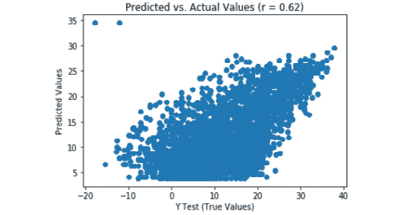

    ###### 图 3.7：简单线性回归模型的预测值与实际值对比

    #### 注意

    皮尔逊 r 值为 0.62，表明预测值与实际值之间存在中等程度的正向线性相关性。一个完美的模型会使散点图中的所有点都在一条直线上，并且 r 值为 1.0。

1.  一个与数据拟合得非常好的模型，其残差应该呈正态分布。要创建残差的密度图，请参照以下代码：

    ```py
    import seaborn as sns
    from scipy.stats import shapiro
    sns.distplot((y_test - predictions), bins = 50)
    plt.xlabel('Residuals')
    plt.ylabel('Density')
    plt.title('Histogram of Residuals (Shapiro W p-value = {0:0.3f})'.format(shapiro(y_test - predictions)[1]))
    plt.show()
    ```

    请参阅此处的输出结果：

    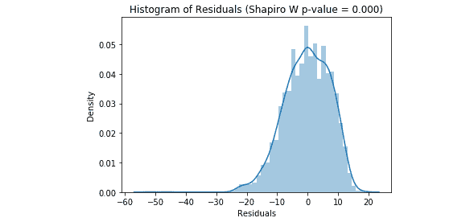

    ###### 图 3.8：简单线性回归模型的残差直方图

    #### 注意

    直方图显示残差呈负偏态，标题中的 Shapiro W p 值告诉我们该分布不是正态分布。这进一步证明我们的模型还有改进空间。

1.  最后，我们将计算平均绝对误差、均方误差、均方根误差和 R 平方值，并使用以下代码将它们放入一个数据框中：

    ```py
    from sklearn import metrics
    import numpy as np
    metrics_df = pd.DataFrame({'Metric': ['MAE', 
                                          'MSE', 
                                          'RMSE', 
                                          'R-Squared'],
                              'Value': [metrics.mean_absolute_error(y_test, predictions),
                                        metrics.mean_squared_error(y_test, predictions),
                                        np.sqrt(metrics.mean_squared_error(y_test, predictions)),
                                        metrics.explained_variance_score(y_test, predictions)]}).round(3)
    print(metrics_df)
    ```

    请参阅生成的输出结果：


###### 图 3.9：简单线性回归模型的模型评估指标

**平均绝对误差**（**MAE**）是预测值与实际值之间的平均绝对差。**均方误差**（**MSE**）是预测值与实际值之间差的平方的平均值。**均方根误差**（**RMSE**）是 MSE 的平方根。R 方告诉我们可以由模型解释的因变量方差的比例。因此，在这个简单线性回归模型中，湿度仅能解释温度方差的 38.9%。此外，我们的预测值在±6.052 摄氏度范围内。

在这里，我们成功地使用 scikit-learn 拟合和评估了一个简单线性回归模型。这是成为机器学习专家之旅中的第一步。接下来，我们将继续扩展我们对回归的知识，并通过探索多元线性回归来改进这个模型。

## 多元线性回归

多元线性回归模型通过 *y =* *α* *+* *β**1**x**i1* *+* *β**2**x**i2* *+ … +* *β**p-1**x**i,p-1* 定义了两个或更多特征与连续结果变量之间的关系。再次说明，*α* 表示截距，*β* 表示模型中每个特征（*x*）的斜率。因此，如果我们使用身高（*m*）、总胆固醇（*mg/dL*）和每日心血管运动分钟数来预测个体的体重（kg），且多元线性回归模型计算出 *α* 为 1.5，*β**1* 为 50，*β**2* 为 0.1，*β**3* 为-0.4，这个模型可以解释为：在控制模型中的所有其他特征的情况下，每增加 1 *m* 的身高，体重增加 50 kg。此外，每增加 1 mg/dL 的总胆固醇，体重增加 0.1 kg。最后，每天每增加 1 分钟的心血管运动，体重减少 0.4 kg。因此，我们可以预测一个身高为 1.8 m、总胆固醇为 200 mg/dL，并每天完成 30 分钟心血管运动的个体的体重为 99.5 kg，使用 *y = 1.5 + (0.1 x 50) + (200 x 0.5) + (30 x -0.4)*。在下一项练习中，我们将演示如何使用 scikit-learn 进行多元线性回归。

### 练习 24：拟合多元线性回归模型并确定截距和系数

在这个练习中，我们将继续使用我们在*练习 21*中准备的数据，拟合一个多元线性回归模型，以预测数据中所有特征对应的温度（摄氏度）。

继续自练习 23，执行以下步骤：

1.  要实例化一个线性回归模型，请参考以下代码：

    ```py
    from sklearn.linear_model import LinearRegression
    model = LinearRegression()
    ```

1.  使用以下代码将模型拟合到训练数据中：

    ```py
    model.fit(X_train, y_train) 
    ```

    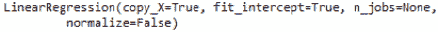

    ###### 图 3.10：拟合多元线性回归模型的输出结果

1.  使用以下代码提取截距值：

    ```py
    intercept = model.intercept_
    ```

1.  按照以下方法提取系数值：

    ```py
    coefficients = model.coef_
    ```

1.  现在，我们可以打印出一个消息，显示使用此代码预测摄氏温度的公式：

    ```py
    print('Temperature = {0:0.2f} + ({1:0.2f} x Humidity) + ({2:0.2f} x Wind Speed) + ({3:0.2f} x Wind Bearing Degrees) + ({4:0.2f} x Visibility) + ({5:0.2f} x Pressure) + ({6:0.2f} x Rain) + ({7:0.2f} x Normal Weather) + ({8:0.2f} x Warm Weather)'.format(intercept,
    coefficients[0],
    coefficients[1],
    coefficients[2],
    coefficients[3],
    coefficients[4],
    coefficients[5],
    coefficients[6],
    coefficients[7]))
    ```

    我们的输出应如下所示：

    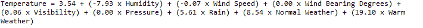

###### 图 3.11：使用多元线性回归根据湿度预测摄氏温度的公式

做得好！根据这个多元回归模型，一天湿度为 0.78，风速为 5.0 km/h，风向为自正北顺时针 81 度，能见度为 3 km，气压为 1000 毫巴，没有降雨，且天气被描述为正常，那么该天预测的摄氏温度为 5.72 度。现在我们已经熟悉了如何提取多元线性回归模型的截距和系数，我们可以生成预测并评估模型在测试数据上的表现。

### 活动 5：生成预测并评估多元线性回归模型的性能

在*练习 23*中，*生成预测并评估简单线性回归模型的性能*，我们学习了如何使用多种方法生成预测并评估简单线性回归模型的性能。为了减少代码的冗余，我们将使用*练习 23*中*步骤 4*的指标来评估多元线性回归模型的性能，并确定多元线性回归模型相对于简单线性回归模型的表现是更好还是更差。

从练习 24 开始，执行以下步骤：

1.  使用所有特征在测试数据上生成预测。

1.  使用散点图绘制预测值与实际值的关系。

1.  绘制残差的分布图。

1.  计算均值绝对误差、均方误差、均方根误差和 R 平方，并将结果放入 DataFrame 中。

1.  确定多元线性回归模型相较于简单线性回归模型的表现是更好还是更差。

    #### 注意

    此活动的解决方案可以在第 343 页找到。

你应该发现，相较于简单线性回归模型，多元线性回归模型在每个指标上表现得更好。最显著的是，在简单线性回归模型中，模型只能解释温度方差的 38.9%。然而，在多元线性回归模型中，特征的组合解释了 86.6% 的温度方差。此外，我们的简单线性回归模型预测的温度平均误差为 ± 6.052 度，而我们的多元线性回归模型预测的温度平均误差为 ± 2.861 度。

截距和回归系数的透明性使得线性回归模型非常易于解释。在商业中，通常要求数据科学家解释某一特征对结果的影响。因此，线性回归提供了可用的指标，从而合理回应了之前的业务询问。

然而，大多数情况下，问题要求数据科学家预测一个不是连续的，而是分类的结果变量。例如，在保险领域，给定客户的某些特征，预测该客户是否会续保的概率是多少？在这种情况下，数据中的特征与结果变量之间不存在线性关系，因此线性回归方法会失败。对于分类因变量，进行回归分析的一个可行选择是逻辑回归。

## 逻辑回归

逻辑回归使用分类变量和连续变量来预测分类结果。当所选因变量有两个分类结果时，分析称为二元逻辑回归。然而，如果结果变量有多个水平，则该分析称为多项式逻辑回归。本章的学习将集中在前者上。

在预测二元结果时，特征与结果变量之间并不存在线性关系，这违反了线性回归的假设。因此，为了以线性方式表达非线性关系，我们必须使用对数转换来转换数据。因此，逻辑回归使我们能够预测在给定模型中特征的情况下二元结果发生的概率。

对于具有 1 个预测变量的逻辑回归，逻辑回归方程如下所示：


###### 图 3.12：具有 1 个预测变量的逻辑回归公式

在上图中，*P(Y)* 是结果发生的概率，*e* 是自然对数的底数，*α* 是截距，*β* 是回归系数，*x* 是预测变量的值。该方程可以扩展到多个预测变量，使用以下公式：


###### 图 3.13：具有多个预测变量的逻辑回归公式

因此，使用逻辑回归来建模事件发生的概率，就相当于拟合一个线性回归模型，只是连续的结果变量已被替换为成功的对数比（另一种表达概率的方式），用于二元结果变量。在线性回归中，我们假设预测变量与结果变量之间存在线性关系。而逻辑回归则假设预测变量与 *p/(1-p)* 的自然对数之间存在线性关系，其中 *p* 是事件发生的概率。

在接下来的练习中，我们将使用 `weather.csv` 数据集，演示如何构建一个逻辑回归模型，利用我们数据中的所有特征来预测降雨的概率。

### 练习 25：拟合逻辑回归模型并确定截距和系数

为了使用数据中的所有特征来建模降雨的概率（而非雪），我们将使用 `weather.csv` 文件，并将二元变量 `Rain` 作为结果测量。

1.  使用以下代码导入数据：

    ```py
    import pandas as pd
    df = pd.read_csv('weather.csv')
    ```

1.  如下所示对 `Description` 变量进行虚拟编码：

    ```py
    import pandas as pd
    df_dummies = pd.get_dummies(df, drop_first=True)
    ```

1.  使用此处的代码对 `df_dummies` 进行洗牌：

    ```py
    from sklearn.utils import shuffle
    df_shuffled = shuffle(df_dummies, random_state=42)
    ```

1.  如下所示，将特征和结果分别拆分为 `X` 和 `y`：

    ```py
    DV = 'Rain' 
    X = df_shuffled.drop(DV, axis=1) 
    y = df_shuffled[DV] 
    ```

1.  使用以下代码将特征和结果拆分为训练数据和测试数据：

    ```py
    from sklearn.model_selection import train_test_split
    X_train, X_test, y_train, y_test = train_test_split(X, y, test_size=0.33, random_state=42)
    ```

1.  使用以下代码实例化一个逻辑回归模型：

    ```py
    from sklearn.linear_model import LogisticRegression
    model = LogisticRegression()
    ```

1.  使用 `model.fit(X_train, y_train)` 将逻辑回归模型拟合到训练数据中。我们应该得到以下输出：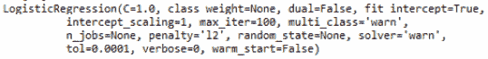

    ###### 图 3.14：拟合逻辑回归模型的输出

1.  使用以下代码获取截距：

    ```py
    intercept = model.intercept_
    ```

1.  使用以下代码提取系数：

    ```py
    coefficients = model.coef_
    ```

1.  如下所示，将系数放入列表：

    ```py
    coef_list = list(coefficients[0,:])
    ```

1.  将特征与它们的系数匹配，放入 DataFrame 中，并按如下方式将 DataFrame 打印到控制台：

    ```py
    coef_df = pd.DataFrame({'Feature': list(X_train.columns),
                            'Coefficient': coef_list})
    print(coef_df)
    ```

    请参考此处的输出：

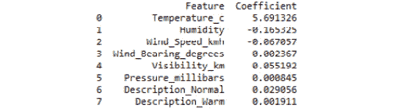

###### 图 3.15：逻辑回归模型的特征及其系数

温度的系数可以解释为：每增加 1 度温度，降雨的对数几率增加 5.69，同时控制模型中的其他特征。为了生成预测，我们可以将对数几率转换为几率，再将几率转换为概率。然而，scikit-learn 提供了生成预测概率以及预测类别的功能。

### 练习 26：生成预测并评估逻辑回归模型的表现

在*练习 25*中，我们学习了如何拟合一个逻辑回归模型，并提取生成预测所需的元素。然而，scikit-learn 通过提供函数来预测结果的概率以及预测结果的类别，使我们的工作变得更加轻松。在本练习中，我们将学习如何生成预测的概率和类别，并使用混淆矩阵和分类报告评估模型的表现。

从练习 25 开始，执行以下步骤：

1.  使用以下代码生成预测概率：

    ```py
    predicted_prob = model.predict_proba(X_test)[:,1]
    ```

1.  使用以下代码生成预测类别：

    ```py
    predicted_class = model.predict(X_test)
    ```

1.  使用混淆矩阵按如下方式评估表现：

    ```py
    from sklearn.metrics import confusion_matrix
    import numpy as np
    cm = pd.DataFrame(confusion_matrix(y_test, predicted_class))
    cm['Total'] = np.sum(cm, axis=1)
    cm = cm.append(np.sum(cm, axis=0), ignore_index=True)
    cm.columns = ['Predicted No', 'Predicted Yes', 'Total']
    cm = cm.set_index([['Actual No', 'Actual Yes', 'Total']])
    print(cm)
    ```

    请参考此处的输出：

    

    ###### 图 3.16：我们逻辑回归模型的混淆矩阵

    #### 注意

    从混淆矩阵中，我们可以看到，在 383 个未被分类为“雨天”的观测值中，377 个被正确分类；在 2917 个被分类为“雨天”的观测值中，2907 个被正确分类。为了进一步检查我们模型的性能，我们将使用精度、召回率和`f1`得分等指标生成分类报告。

1.  使用以下代码生成分类报告：

    ```py
    from sklearn.metrics import classification_report
    print(classification_report(y_test, predicted_class))
    ```

    请参考结果输出：

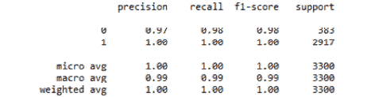

###### 图 3.17：我们逻辑回归模型生成的分类报告

从我们的混淆矩阵和分类报告中可以看出，我们的模型表现非常好，可能很难进一步改进。然而，机器学习模型，包括逻辑回归，包含许多可以调整的超参数，调优这些超参数可以进一步提高模型性能。在下一个练习中，我们将学习如何找到超参数的最佳组合，以最大化模型性能。

### 练习 27：调优多重逻辑回归模型的超参数

在*练习 25*的*步骤 7*中，我们拟合了一个逻辑回归模型，随后该模型的输出显示在图 3.14 中。`LogisticRegression()`函数中的每个参数都设置为默认超参数。为了调优模型，我们将使用 scikit-learn 的网格搜索功能，它会为每个可能的超参数值组合拟合模型，并确定每个超参数的最佳值，从而得到最好的模型。在本练习中，我们将学习如何使用网格搜索来调优模型。

继续从*练习 26*：

1.  数据已经为我们准备好了（见练习 26）；因此，我们可以直接开始实例化一个可能的超参数值网格，如下所示：

    ```py
    import numpy as np
    grid = {'penalty': ['l1', 'l2'],
            'C': np.linspace(1, 10, 10),
            'solver': ['liblinear']}
    ```

1.  实例化一个网格搜索模型，寻找具有最大`f1`得分（即精度和召回率的调和平均数）的模型，如下所示：

    ```py
    from sklearn.model_selection import GridSearchCV
    from sklearn.linear_model import LogisticRegression
    model = GridSearchCV(LogisticRegression(solver='liblinear'), grid, scoring='f1', cv=5)
    ```

1.  使用`model.fit(X_train, y_train)`在训练集上拟合模型（请记住，这可能需要一些时间），并找到此处的结果输出：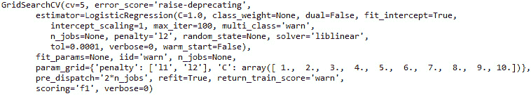

    ###### 图 3.18：我们逻辑回归网格搜索模型的输出

1.  我们可以如下所示返回超参数的最佳组合，以字典形式表示：

    ```py
    best_parameters = model.best_params_
    print(best_parameters)
    ```

    请参考此处的结果输出：


###### 图 3.19：我们逻辑回归网格搜索模型调优后的超参数

我们已经找到了最大化`f1`得分的超参数组合。请记住，仅仅使用*练习 25*中的默认超参数就能得到一个在测试数据上表现非常好的模型。因此，在接下来的活动中，我们将评估调优过的超参数模型在测试数据上的表现。

### 活动 6：生成预测并评估调优后的逻辑回归模型性能

一旦找到了最佳的超参数组合，我们需要像在*练习 25* 中一样评估模型的性能。

从练习 27 继续：

1.  生成预测的降雨概率。

1.  生成预测的降雨类别。

1.  使用混淆矩阵评估性能，并将其存储为数据框。

1.  打印分类报告。

    #### 注意

    此活动的解决方案可以在第 346 页找到。

通过调整逻辑回归模型的超参数，我们能够改进已经表现非常良好的逻辑回归模型。我们将在接下来的练习和活动中继续扩展调整不同类型的模型。

## 最大边界分类使用 SVM

SVM 是一种监督学习算法，可以解决分类和回归问题。然而，SVM 最常用于分类问题，因此，在本章中，我们将重点讨论 SVM 作为二分类器。SVM 的目标是确定超平面的最佳位置，在多维空间中创建数据点之间的类别边界。为帮助澄清这一概念，请参见图 3.20。

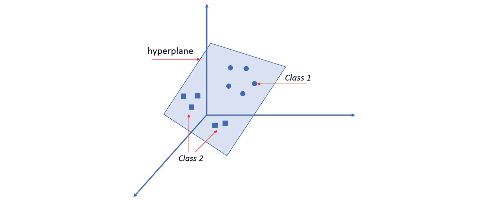

###### 图 3.20：超平面（蓝色）在三维空间中将圆形与方形分开

在图 3.20 中，方形和圆形是同一数据框中的观测值，代表不同的类别。在该图中，超平面由一个半透明的蓝色边界表示，位于圆形和方形之间，划分出两个不同的类别。在这个例子中，观测点被认为是线性可分的。

超平面的位置是通过找到在两类之间创建最大分隔（即边界）的位置来确定的。因此，这被称为**最大边界超平面**（MMH），并提高了点保持在超平面边界正确一侧的可能性。可以通过每个类中最接近 MMH 的点来表达 MMH。这些点被称为支持向量，每个类至少有 1 个。图 3.21 直观地展示了支持向量与 MMH 在二维空间中的关系：

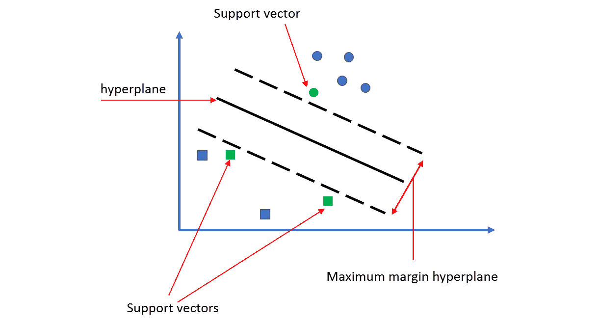

###### 图 3.21：支持向量与 MMH 的关系

实际上，大多数数据是不可线性分割的。在这种情况下，SVM 使用松弛变量，创建一个软边界（与最大边界相对），允许一些观测点落在边界的错误一侧。请参见以下图示：

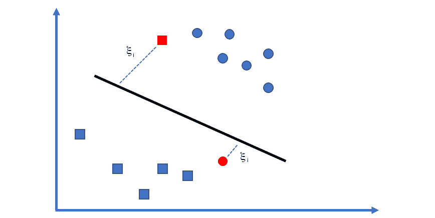

###### 图 3.22：两个观测值（用灰色阴影和希腊字母Χi 表示）位于软边界线的错误一侧

对误分类的数据点应用一个成本值，算法的目标不是找到最大边界，而是最小化总成本。随着成本参数的增加，SVM 优化将更加严格，目标是 100%的分类分离，这可能导致过拟合训练数据。相反，较低的成本参数则强调更宽的边界，可能导致欠拟合训练数据。因此，为了创建在测试数据上表现良好的 SVM 模型，重要的是确定一个平衡过拟合和欠拟合的成本参数。

此外，非线性可分的数据可以通过使用核技巧转换到更高维度的空间。在映射到高维空间后，原本的非线性关系可能变得线性。通过对原始数据进行转换，SVM 可以发现原始特征中没有明确体现的关联。scikit-learn 默认使用高斯 RBF 核，但也提供了常用的核函数，如线性核、多项式核和 sigmoid 核。为了最大化 SVM 分类器模型的性能，必须确定核函数和成本函数的最佳组合。幸运的是，可以通过网格搜索超参数调整轻松实现这一点，正如练习 27 中介绍的那样。在接下来的练习和活动中，我们将学习如何实现这一目标。

### 练习 28：为支持向量分类器（SVC）模型准备数据

在为预测二元结果变量（在此案例中为雨或雪）拟合 SVM 分类器模型之前，我们必须先准备数据。由于 SVM 是一个“黑箱”模型，即输入和输出之间的过程不明确，因此我们不需要担心模型的可解释性。因此，在拟合模型之前，我们将数据中的特征转换为 z 分数。以下步骤将展示如何进行：

1.  使用以下代码导入`weather.csv`：

    ```py
    import pandas as pd
    df = pd.read_csv('weather.csv')
    ```

1.  将分类特征`Description`进行虚拟编码，方法如下：

    ```py
    import pandas as pd
    df_dummies = pd.get_dummies(df, drop_first=True)
    ```

1.  使用以下代码对`df_dummies`进行洗牌，以去除任何排序效应：

    ```py
    from sklearn.utils import shuffle
    df_shuffled = shuffle(df_dummies, random_state=42)
    ```

1.  使用以下代码将`df_shuffled`拆分为`X`和`y`：

    ```py
    DV = 'Rain'
    X = df_shuffled.drop(DV, axis=1) 
    y = df_shuffled[DV]
    ```

1.  使用以下代码将`X`和`y`划分为测试数据和训练数据：

    ```py
    from sklearn.model_selection import train_test_split
    X_train, X_test, y_train, y_test = train_test_split(X, y, test_size=0.33, random_state=42)
    ```

1.  为了防止数据泄漏，通过拟合一个缩放器模型到`X_train`并分别将其转换为 z 分数，按如下方式对`X_train`和`X_test`进行缩放：

    ```py
    from sklearn.preprocessing import StandardScaler
    model = StandardScaler() 
    X_train_scaled = model.fit_transform(X_train)
    X_test_scaled = model.transform(X_test)
    ```

现在，我们的数据已经正确地划分为特征和结果变量，分为测试数据和训练数据，并且已分别进行了缩放，因此我们可以使用网格搜索调整 SVC 模型的超参数。

### 练习 29：使用网格搜索调整 SVC 模型

之前，我们讨论了确定 SVM 分类器模型的最佳成本函数和核函数的重要性。在练习 27 中，我们学习了如何使用 scikit-learn 的网格搜索功能找到超参数的最佳组合。在本练习中，我们将演示如何使用网格搜索来找到最佳的成本函数和核函数组合。

从*练习 28*继续：

1.  使用以下代码实例化要搜索的网格：

    ```py
    import numpy as np
    grid = {'C': np.linspace(1, 10, 10),
            'kernel': ['linear', 'poly', 'rbf', 'sigmoid']}
    ```

1.  使用 `gamma` 超参数设置为 `auto` 来避免警告，并将概率设置为 `True`，以便我们可以提取雨的概率，如下所示：

    ```py
    from sklearn.model_selection import GridSearchCV
    from sklearn.svm import SVC
    model = GridSearchCV(SVC(gamma='auto'), grid, scoring='f1', cv=5)
    ```

1.  使用 `model.fit(X_train_scaled, y_train)` 拟合网格搜索模型：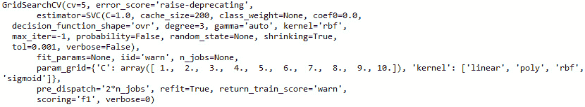

    ###### 图 3.23：拟合 SVC 网格搜索模型的输出

1.  使用以下代码打印最佳参数：

    ```py
    best_parameters = model.best_params_
    print(best_parameters)
    ```

    参见下面的结果输出：


###### 图 3.24：我们 SVC 网格搜索模型的调优超参数

一旦确定了超参数的最佳组合，就可以开始生成预测，并随后评估我们的模型在未见测试数据上的表现。

### 活动 7：生成预测并评估 SVC 网格搜索模型的性能

在之前的练习/活动中，我们学习了如何生成预测并评估分类器模型的性能。在本活动中，我们将再次评估模型的性能，通过生成预测、创建混淆矩阵并打印分类报告。

从练习 29 继续：

1.  提取预测的类别。

1.  创建并打印混淆矩阵。

1.  生成并打印分类报告。

    #### 注意

    本活动的解决方案可以在第 348 页找到。

在这里，我们展示了如何通过网格搜索调优 SVC 模型的超参数。调优后的 SVC 模型在预测雨/雪方面的表现不如调优后的逻辑回归模型。此外，SVC 模型是一个**黑箱**，因为它们无法提供特征对结果的贡献的洞察。在接下来的*决策树*部分，我们将介绍一种不同的算法——决策树，它采用“*分而治之*”的方法生成预测，并提供特征重要性属性，用于确定每个特征对结果的影响。

## 决策树

假设我们正在考虑换工作。我们正在权衡潜在工作机会的利弊，在当前职位待了几年后，我们开始意识到对我们来说重要的东西。然而，职业的各个方面并非都同等重要。事实上，在工作几年后，我们决定职位最重要的方面是我们对所做项目的兴趣，其次是薪酬，再然后是工作压力，接着是通勤时间，最后是福利。我们刚刚创建了一个认知决策树的框架。我们可以进一步详细说明，我们希望找到一份工作，其中分配的项目我们非常感兴趣，年薪至少为$55k，工作压力较低，通勤时间不超过 30 分钟，并且有良好的牙科保险。创建心理决策树是我们天生就会利用的一种决策过程，也是决策树成为当今最广泛使用的机器学习算法之一的原因。

在机器学习中，决策树使用*基尼*不纯度或*熵*信息增益作为衡量拆分质量的标准。首先，决策树算法确定能够最大化拆分质量值的特征。这被称为根节点，因为它是数据中最重要的特征。在前面提到的工作机会中，对潜在项目非常感兴趣会被视为根节点。考虑到根节点，工作机会被分为那些有非常有趣项目的和那些没有非常有趣项目的。

接下来，在考虑前一个特征的基础上，将这两个类别细分为下一个最重要的特征，以此类推，直到潜在工作被识别为感兴趣或不感兴趣。

这种方法被称为递归划分，或称为"*分而治之*"，因为它持续不断地拆分和细分数据，直到算法判断数据子集已足够同质化，或者：

+   对应节点的几乎所有观察结果都属于同一类别（即纯度）。

+   数据中没有进一步的特征可供拆分。

+   树已达到事先决定的大小限制。

例如，如果纯度是通过熵来决定的，我们必须理解熵是衡量一组值内部随机性的指标。决策树通过选择最小化熵（随机性）的切分来运作，进而最大化信息增益。信息增益是通过计算切分与所有后续切分之间的熵差值来确定的。然后，计算总熵的方法是将每个分区的熵加权求和，权重是该分区中观察值的比例。幸运的是，scikit-learn 提供了一个函数来帮助我们完成这些操作。在接下来的练习和活动中，我们将实现决策树分类器模型，用以预测是否在下雨或下雪，使用熟悉的`weather.csv`数据集。

### 活动 8：为决策树分类器准备数据

在本活动中，我们将为决策树分类器模型准备数据。执行以下步骤完成活动：

1.  导入`weather.csv`并将其存储为 DataFrame

1.  为多层次的分类特征`Summary`编写虚拟代码

1.  打乱数据，以去除可能的顺序效应

1.  将数据拆分为特征和结果

1.  进一步将特征和结果拆分为测试数据和训练数据

1.  使用以下代码缩放`X_train`和`X_test`：

    ```py
    from sklearn.preprocessing import StandardScaler
    model = StandardScaler()
    X_train_scaled = model.fit_transform(X_train)
    X_test_scaled = model.transform(X_test)
    ```

    #### 注意

    本活动的解决方案可以在第 349 页找到

在接下来的练习中，我们将学习如何调优和拟合决策树分类器模型。

### 练习 30：使用网格搜索调优决策树分类器

在本练习中，我们将实例化一个超参数空间，并使用网格搜索来调优决策树分类器的超参数。

继续进行*活动 8*，执行以下步骤：

1.  按如下方式指定超参数空间：

    ```py
    import numpy as np
    grid = {'criterion': ['gini', 'entropy'],
            'min_weight_fraction_leaf': np.linspace(0.0, 0.5, 10),
            'min_impurity_decrease': np.linspace(0.0, 1.0, 10),
            'class_weight': [None, 'balanced'],
    'presort': [True, False]}Instantiate the GridSearchCV model
    ```

1.  使用以下代码实例化网格搜索模型：

    ```py
    from sklearn.model_selection import GridSearchCV
    from sklearn.tree import DecisionTreeClassifier
    model = GridSearchCV(DecisionTreeClassifier(), grid, scoring='f1', cv=5)
    ```

1.  使用以下方法拟合训练集：

    ```py
    model.fit(X_train_scaled, y_train)
    ```

    查看此处显示的结果输出：

    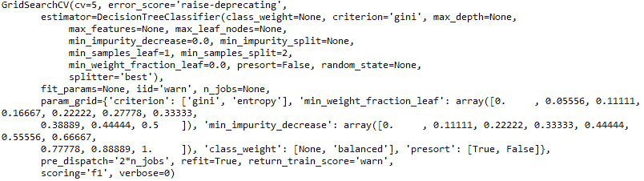

    ###### 图 3.25：拟合我们的决策树分类器网格搜索模型的输出

1.  打印调优后的参数：

    ```py
    best_parameters = model.best_params_
    print(best_parameters)
    ```

    查看下面的结果输出：

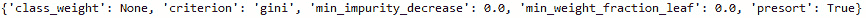

###### 图 3.26：我们决策树分类器网格搜索模型的调优超参数

我们可以从图 3.26 中看到，它使用了**gini**不纯度作为切分质量的标准。关于超参数的进一步解释超出了本章范围，但可以在决策树分类器的 scikit-learn 文档中找到。

记住，在实际应用中，决策者常常会询问不同特征如何影响预测。在线性回归和逻辑回归中，截距和系数使得模型预测非常透明。

#### 注意

决策树也非常容易解释，因为我们可以看到做出决策的地方，但这需要安装并正确配置 Graphviz，并且特征需要未经过缩放。

与接下来的练习不同，我们将探索 scikit-learn 树形模型算法中找到的一个属性 '`feature_importances_`'，该属性返回一个包含每个特征相对重要性值的数组。需要注意的是，这个属性在网格搜索模型中不可用。因此，在下一个练习中，我们将学习如何从 `best_parameters` 字典中程序化提取值，并重新拟合调优后的决策树模型，从而访问决策树分类器函数提供的属性。

### 练习 31：程序化地从决策树分类器网格搜索模型中提取调优后的超参数

在前一个练习中，我们将调优后的超参数保存为 `best_parameters` 字典中的键值对。这使我们能够以编程方式访问这些值并将它们分配给决策树分类器模型的相应超参数。通过拟合调优后的决策树模型，我们将能够访问 scikit-learn 决策树分类器函数提供的属性。

继续进行 *练习 30*，执行以下步骤：

1.  证明我们可以通过以下方式访问 '`Tree_criterion`' 的值：

    ```py
    print(best_parameters['criterion'])
    ```

    在这里查看结果输出：

    

    ###### 图 3.27：在 `best_parameters` 字典中分配给 'Tree_criterion' 键的值

1.  实例化决策树分类器模型，并将相应的超参数值分配如下：

    ```py
    from sklearn.tree import DecisionTreeClassifier
    model = DecisionTreeClassifier(class_weight=best_parameters['class_weight'],
                                   criterion=best_parameters['criterion'],
                          min_impurity_decrease=best_parameters['min_impurity_decrease'],
                   min_weight_fraction_leaf=best_parameters['min_weight_fraction_leaf'],
                                   presort=best_parameters['presort'])
    ```

1.  使用以下代码将网格搜索模型拟合到标准化的训练数据：

    ```py
    model.fit(X_train_scaled, y_train)
    ```

    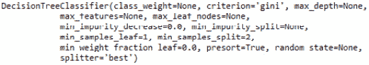

    ###### 图 3.28：使用调优后的超参数拟合决策树分类器模型的输出

1.  使用以下代码提取 `feature_importances` 属性：

    ```py
    print(model.feature_importances_)
    The resultant output is shown below:
    ```

    

    ###### 图 3.29：我们调优后的决策树分类器模型的特征重要性数组

    从图 3.29 的数组中，我们可以看到第一个特征在特征重要性上完全主导了其他变量。

1.  使用以下代码可视化：

    ```py
    import pandas as pd
    import matplotlib.pyplot as plt
    df_imp = pd.DataFrame({'Importance': list(model.feature_importances_)}, index=X.columns)
    df_imp_sorted = df_imp.sort_values(by=('Importance'), ascending=True)
    df_imp_sorted.plot.barh(figsize=(5,5))
    plt.title('Relative Feature Importance')
    plt.xlabel('Relative Importance')
    plt.ylabel('Variable')
    plt.legend(loc=4)
    plt.show()
    ```

    在这里查看结果输出：

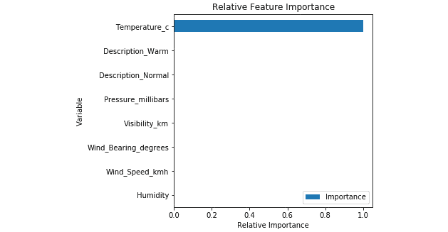

###### 图 3.30：调优后的决策树分类器模型的特征重要性

看起来摄氏温度是这个分类问题的唯一驱动因素。由于结果衡量标准是 `rain ('Rain'=1)` 或 `snow ('Rain'=0)`，而决策树通过“*分而治之*”的方式做出划分决策，因此算法使用温度来判断测量时是否有降雨或降雪，这也有其合理性。在接下来的活动中，我们将评估模型的表现。

### 活动 9：生成预测并评估决策树分类器模型的性能

在之前的练习和活动中，我们已经生成了预测并评估了模型性能。在本次活动中，我们将采取相同的方法来评估我们调整过的决策树分类器模型的性能。

从第 31 次练习继续，执行以下步骤：

1.  生成降水的预测概率。

1.  生成降水的预测类别。

1.  生成并打印混淆矩阵。

1.  打印分类报告。

    #### 注意

    本活动的解决方案可以在第 350 页找到。

你应该会发现只有一个观测值被误分类。因此，通过在我们的 `weather.csv` 数据集上调整决策树分类器模型，我们能够高精度地预测降雨（或降雪）。我们可以看到，唯一的驱动特征是摄氏温度。这是有道理的，因为决策树使用递归分割的方法来进行预测。

有时候，经过评估后，单一模型是一个弱学习器，表现不佳。然而，通过组合多个弱学习器，我们可以创建一个更强的学习器。将多个弱学习器组合成一个强学习器的方式称为集成。随机森林模型将多个决策树模型组合在一起，形成一个更强的集成模型。随机森林可以用于分类或回归问题。

## 随机森林

如前所述，随机森林是决策树的集成，可以用来解决分类或回归问题。随机森林使用数据的一小部分来拟合每棵树，因此能够处理非常大的数据集，而且相较于其他算法，它们对“*维度灾难*”的敏感性较低。维度灾难是指数据中有大量特征时，模型的性能会下降。随机森林的预测是通过将每棵树的预测结果结合起来得到的。与支持向量机（SVM）一样，随机森林是一个**黑箱**，其输入和输出无法解释。

在接下来的练习和活动中，我们将使用网格搜索调整并拟合随机森林回归器，以预测摄氏温度。然后，我们将评估模型的性能。

### 练习 32：为随机森林回归器准备数据

首先，我们将为随机森林回归器准备数据，使用 '`Temperature_c`' 作为因变量，就像我们在第 21 次练习中做的那样：

1.  导入 '`weather.csv`' 并使用以下代码将其保存为 `df`：

    ```py
    import pandas as pd
    df = pd.read_csv('weather.csv')
    ```

1.  对多类分类变量 `Description` 进行虚拟编码，方法如下：

    ```py
    import pandas as pd
    df_dummies = pd.get_dummies(df, drop_first=True)
    ```

1.  使用以下代码通过打乱 `df_dummies` 来去除可能的排序效应：

    ```py
    from sklearn.utils import shuffle
    df_shuffled = shuffle(df_dummies, random_state=42)
    ```

1.  使用以下代码将 `df_shuffled` 划分为 `X` 和 `y`：

    ```py
    DV = 'Temperature_c'
    X = df_shuffled.drop(DV, axis=1)
    y = df_shuffled[DV]
    ```

1.  将 `X` 和 `y` 按照如下方式划分为测试数据和训练数据：

    ```py
    from sklearn.model_selection import train_test_split
    X_train, X_test, y_train, y_test = train_test_split(X, y, test_size=0.33, random_state=42)
    ```

1.  使用以下代码对 `X_train` 和 `X_test` 进行缩放：

    ```py
    from sklearn.preprocessing import StandardScaler
    scaler = StandardScaler()
    X_train_scaled = scaler.fit_transform(X_train)
    X_test_scaled = scaler.transform(X_test)
    ```

现在，我们已经导入、打乱、将数据分为特征（`X`）和因变量（`y`），将`X`和`y`拆分为测试数据和训练数据，并对`X_train`和`X_test`进行缩放，我们将使用网格搜索调优随机森林回归模型。

### 活动 10：调优随机森林回归模型

数据已准备好用于随机森林回归模型。现在，我们必须设置超参数空间，并使用网格搜索找到超参数的最佳组合。

从练习 32 继续，执行以下步骤：

1.  指定超参数空间。

1.  实例化`GridSearchCV`模型以优化解释方差。

1.  将网格搜索模型拟合到训练集。

1.  打印调优后的参数。

    #### 注意

    该活动的解决方案可以在第 351 页找到。

在对我们的随机森林回归超参数进行网格搜索后，我们需要使用调优后的超参数拟合一个随机森林回归模型。我们将编程提取`best_parameters`字典中的值，并将它们分配给随机森林回归函数中的相应超参数，以便我们可以访问来自该函数的属性。

### 练习 33：从随机森林回归网格搜索模型中编程提取调优的超参数并确定特征重要性

通过从`best_parameters`字典中的键值对提取值，我们消除了手动错误的可能性，并且使我们的代码更加自动化。在本练习中，我们将复制*练习 31*中的步骤，但将代码调整为适应随机森林回归模型。

从*活动 10*继续，执行以下步骤：

1.  实例化一个随机森林回归模型，将`best_parameters`字典中每个键的值分配给相应的超参数：

    ```py
    from sklearn.ensemble import RandomForestRegressor
    model = RandomForestRegressor(criterion=best_parameters['criterion'],
                                  max_features=best_parameters['max_features'],
                                  min_impurity_decrease=best_parameters['min_impurity_decrease'],
                                  bootstrap=best_parameters['bootstrap'],
                                  warm_start=best_parameters['warm_start'])
    ```

1.  使用以下代码在训练数据上拟合模型：

    ```py
    model.fit(X_train_scaled, y_train)
    ```

    在此处查找结果输出：

    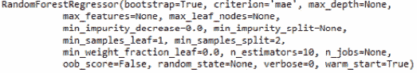

    ###### 图 3.31：使用调优超参数拟合随机森林回归模型的输出

1.  使用以下代码按降序绘制特征重要性：

    ```py
    import pandas as pd
    import matplotlib.pyplot as plt
    df_imp = pd.DataFrame({'Importance': list(model.feature_importances_)}, index=X.columns)
    df_imp_sorted = df_imp.sort_values(by=('Importance'), ascending=True)
    df_imp_sorted.plot.barh(figsize=(5,5))
    plt.title('Relative Feature Importance')
    plt.xlabel('Relative Importance')
    plt.ylabel('Variable')
    plt.legend(loc=4)
    plt.show()
    ```

    在此处查看结果输出：

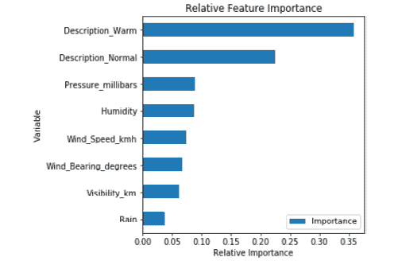

###### 图 3.32：来自调优超参数的随机森林回归模型的特征重要性

从图 3.32 中，我们可以看到'`Description_Warm`'虚拟变量和'`Humidity`'是摄氏温度的主要驱动因素。与此同时，'`Visibility_km`'和'`Wind_Bearing_degrees`'对温度的影响较小。接下来，我们将检查我们的模型在测试数据上的表现。

### 活动 11：生成预测并评估调优后的随机森林回归模型的性能

在*练习 23*和*活动 5*中，我们学习了如何生成预测并评估回归模型在预测连续结果时的性能。在本次活动中，我们将采用相同的方法来评估我们随机森林回归模型在预测摄氏温度时的性能。

继续执行*练习 33*中的步骤，进行以下操作：

1.  在测试数据上生成预测。

1.  绘制预测值与实际值的相关性图。

1.  绘制残差的分布图。

1.  计算指标，然后将其放入数据框并打印出来。

    #### 注意

    这个活动的解决方案可以在第 352 页找到。

随机森林回归模型似乎表现不如多元线性回归，这一点通过更大的 MAE、MSE 和 RMSE 值以及较低的解释方差得到了证实。此外，预测值与实际值之间的相关性较弱，残差也远未呈正态分布。然而，通过利用随机森林回归器的集成方法，我们构建了一个模型，该模型解释了 75.8%的温度方差，并预测摄氏温度±3.781 度。

## 总结

本章介绍了 Python 的开源机器学习库 scikit-learn。你学习了如何预处理数据，以及如何调整和拟合几种不同的回归和分类算法。最后，你学习了如何快速有效地评估分类和回归模型的性能。这是对 scikit-learn 库的全面介绍，在这里使用的策略可以应用于构建 scikit-learn 提供的众多其他算法。

在下一章，你将学习降维和无监督学习。
