# 第十四章：*第四章*

# 降维和无监督学习

## 学习目标

在本章结束时，您将能够：

+   比较层次聚类分析（HCA）和 k-means 聚类

+   进行层次聚类分析（HCA）并解读输出结果

+   调整 k-means 聚类的聚类数

+   选择一个最佳的主成分数进行降维

+   使用线性判别分析（LDA）进行监督式降维

本章将介绍降维和无监督学习下的各种概念。

## 介绍

在无监督学习中，**描述性模型**用于探索性分析，以揭示未标记数据中的模式。无监督学习任务的例子包括**聚类**算法和**降维**算法。在聚类中，观察值被分配到组中，其中组内同质性高而组间异质性大。简而言之，观察值被归类到与其他非常相似的观察值的样本群体中。聚类算法的应用场景广泛。例如，分析师通过根据顾客的购物行为将顾客分开，进而为特定顾客群体定向营销广告和促销活动，从而提高销售额。

#### 注意

此外，层次聚类已被应用于学术神经科学和运动行为研究（https://www.researchgate.net/profile/Ming-Yang_Cheng/project/The-Effect-of-SMR-Neurofeedback-Training-on-Mental-Representation-and-Golf-Putting-Performance/attachment/57c8419808aeef0362ac36a5/AS:401522300080128@1472741784217/download/Schack+-+2012+-+Measuring+mental+representations.pdf?context=ProjectUpdatesLog），而 k-means 聚类已被用于欺诈检测（https://www.semanticscholar.org/paper/Fraud-Detection-in-Credit-Card-by-Clustering-Tech/3e98a9ac78b5b89944720c2b428ebf3e46d9950f）。

然而，在构建描述性或预测性模型时，确定哪些特征应纳入模型以提高模型效果，以及哪些特征应排除因为它们会削弱模型，可能是一个挑战。特征过多可能会导致问题，因为模型中变量的数量越多，多重共线性和模型过拟合的可能性就越高。此外，过多的特征增加了模型的复杂性，并延长了模型调优和拟合的时间。

当数据集变大时，这会变得更加棘手。幸运的是，另一种无监督学习的应用场景是通过创建原始特征的组合来减少数据集中的特征数量。减少数据中的特征数量有助于消除多重共线性，并汇聚出一组特征组合，从而生成一个在未见测试数据上表现良好的模型。

#### 注意

多重共线性是指至少有两个变量之间存在相关性。这在回归模型中是一个问题，因为它无法孤立地描述每个独立变量与结果变量之间的关系。因此，系数和 p 值变得不稳定，且精确度较低。

在本章中，我们将介绍两种广泛使用的无监督聚类算法：*层次聚类分析（HCA）*和*k 均值聚类*。此外，我们还将探索使用*主成分分析（PCA）*进行降维，并观察降维如何改善模型性能。最后，我们将实现线性判别函数分析*(LDA)*用于监督式降维。

## 层次聚类分析（HCA）

层次聚类分析（HCA）最适用于用户不知道预先聚类数量的情况。因此，HCA 常作为其他聚类技术的前驱方法，其中建议使用预定数量的聚类。HCA 的工作原理是将相似的观测值合并成聚类，并继续合并距离最近的聚类，直到所有观测值合并为一个单一的聚类。

HCA 通过计算观测值之间的欧几里得距离来确定相似性，并根据两个点之间的距离建立链接。

使用特征数* n *表示，欧几里得距离的计算公式如下：


###### 图 4.1: 欧几里得距离

在计算了观测值和聚类之间的距离后，通过树状图显示所有观测值之间的关系。树状图是类似树的结构，通过水平线表示链接之间的距离。

Thomas Schack 博士（[链接](https://www.researchgate.net/profile/Ming-Yang_Cheng/project/The-Effect-of-SMR-Neurofeedback-Training-on-Mental-Representation-and-Golf-Putting-Performance/attachment/57c8419808aeef0362ac36a5/AS:401522300080128@1472741784217/download/Schack+-+2012+-+Measuring+mental+representations.pdf?context=ProjectUpdatesLog)）将这种结构与人脑相联系，在人脑中，每个观测值都是一个节点，观测值之间的链接则是神经元。

这创建了一个层次结构，其中关系紧密的项目会被“打包”到一起，形成聚类。这里展示了一个示例树状图：

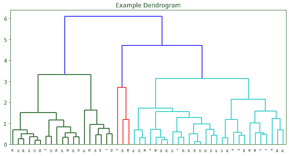

](img/C13322_04_02.jpg)

###### 图 4.2: 一个示例树状图

y 轴表示欧几里得距离，x 轴表示每个观察值的行索引。水平线表示观察值之间的连接，越接近 x 轴的连接表示越短的距离及其更紧密的关系。在此示例中，似乎有三个聚类。第一个聚类包含绿色标记的观察值，第二个聚类包含红色标记的观察值，第三个聚类包含青绿色标记的观察值。

### 练习 34：构建 HCA 模型

为了演示 HCA，我们将使用加利福尼亚大学欧文分校（https://github.com/TrainingByPackt/Data-Science-with-Python/tree/master/Chapter04）提供的适配版本的玻璃数据集。该数据集包含 218 个观察值和 9 个特征，对应于玻璃中各种氧化物的质量百分比：

+   RI：折射率

+   Na：钠的质量百分比

+   Mg：镁的质量百分比

+   Al：铝的质量百分比

+   Si：硅的质量百分比

+   K：钾的质量百分比

+   Ca：钙的质量百分比

+   Ba：钡的质量百分比

+   Fe：铁的质量百分比

在这个练习中，我们将使用折射率（RI）和每种氧化物的质量百分比来对玻璃类型进行分段。

1.  首先，我们将导入 pandas 并使用以下代码读取`glass.csv`文件：

    ```py
    import pandas as pd
    df = pd.read_csv('glass.csv')
    ```

1.  通过使用以下代码打印`df.info()`到控制台，查看一些基本的 DataFrame 信息：

    ```py
    print(df.info()):
    ```

    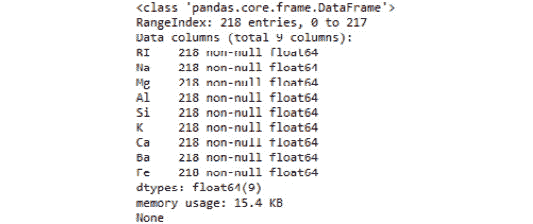

    ###### 图 4.3：DataFrame 信息

1.  为了去除数据中的可能的顺序效应，我们将在构建任何模型之前打乱行，并将其保存为新的数据框对象，如下所示：

    ```py
    from sklearn.utils import shuffle
    df_shuffled = shuffle(df, random_state=42)
    ```

1.  通过拟合并转换打乱后的数据，使用以下方法将每个观察值转换为 z 分数：

    ```py
    from sklearn.preprocessing import StandardScaler
    scaler = StandardScaler() 
    scaled_features = scaler.fit_transform(df_shuffled)
    ```

1.  使用`scaled_features`执行分层聚类，使用连接函数。以下代码将向你展示如何操作：

    ```py
    from scipy.cluster.hierarchy import linkage 
    model = linkage(scaled_features, method='complete')
    ```

恭喜！你已成功构建 HCA 模型。

### 练习 35：绘制 HCA 模型并分配预测标签

现在 HCA 模型已经构建完成，我们将继续分析，使用树状图可视化聚类，并利用该可视化生成预测。

1.  通过绘制连接模型来显示树状图，如下所示：

    ```py
    import matplotlib.pyplot as plt 
    from scipy.cluster.hierarchy import dendrogram
    plt.figure(figsize=(10,5))
    plt.title('Dendrogram for Glass Data')
    dendrogram(model, leaf_rotation=90, leaf_font_size=6)
    plt.show()
    ```

    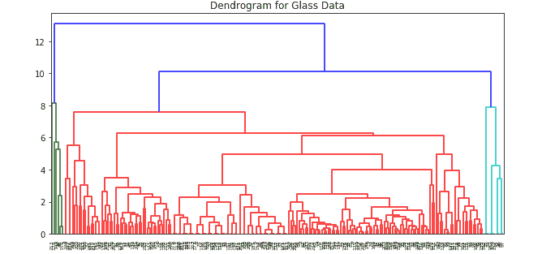

    ###### 图 4.4：玻璃数据的树状图

    #### 注意

    数据集中的每个观察值或行的索引在 x 轴上。欧几里得距离在 y 轴上。水平线表示观察值之间的连接。默认情况下，scipy 会为它找到的不同聚类进行颜色编码。

    现在我们已经得到了预测的观察值聚类，我们可以使用`fcluster`函数生成一个标签数组，该数组与`df_shuffled`中的行对应。

1.  使用以下代码生成预测的标签，表示一个观察值属于哪个聚类：

    ```py
    from scipy.cluster.hierarchy import fcluster
    labels = fcluster(model, t=9, criterion='distance')
    ```

1.  使用以下代码将标签数组作为一列添加到打乱的数据中，并预览前五行：

    ```py
    df_shuffled['Predicted_Cluster'] = labels
    print(df_shuffled.head(5))
    ```

1.  查看下图中的输出：

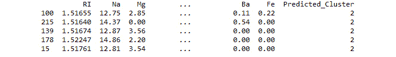

](img/C13322_04_05.jpg)

###### 图 4.5：在预测与观察值匹配后，df_shuffled 的前五行数据。

我们已经成功地学习了监督学习与无监督学习的区别，如何构建 HCA 模型，如何可视化和解释 HCA 的树状图，以及如何将预测的聚类标签分配给相应的观察值。

在这里，我们使用 HCA 将数据分成了三组，并将观察值与其预测的聚类匹配起来。HCA 模型的一些优点包括：

+   它们容易构建

+   无需提前指定聚类的数量

+   可视化结果容易理解

然而，HCA 的一些缺点包括：

+   终止标准的模糊性（即何时最终确定聚类数量）

+   一旦做出聚类决策，算法无法进行调整

+   在大数据集且特征较多的情况下，构建 HCA 模型可能会非常耗费计算资源

接下来，我们将为您介绍另一种聚类算法——K-means 聚类。该算法通过能够在初始生成聚类后进行调整，解决了 HCA 的一些不足。它比 HCA 更加节省计算资源。

## K-means 聚类

与 HCA 相似，K-means 也使用距离将未标记数据的观察值分配到聚类中。然而，与 HCA 将观察值相互连接不同，K-means 会将观察值分配到 *k*（用户定义数量）个聚类中。

为了确定每个观察值所属的聚类，K-means 会随机生成聚类中心，并将观察值分配到其欧几里得距离与聚类中心最接近的聚类中。类似于人工神经网络中的起始权重，聚类中心是随机初始化的。在聚类中心被随机生成后，算法分为两个阶段：

+   指派阶段

+   更新阶段

    #### 注意

    随机生成的聚类中心非常重要，我们将在本章稍后进行讨论。有人认为这种随机生成聚类中心的方式是算法的弱点，因为在对相同数据拟合相同模型时，结果会有所不同，且无法确保将观察值分配到合适的聚类。我们可以通过利用循环的强大功能将其转化为优势。

在指派阶段，观察值会被分配到距离它最近的聚类，如下图所示：

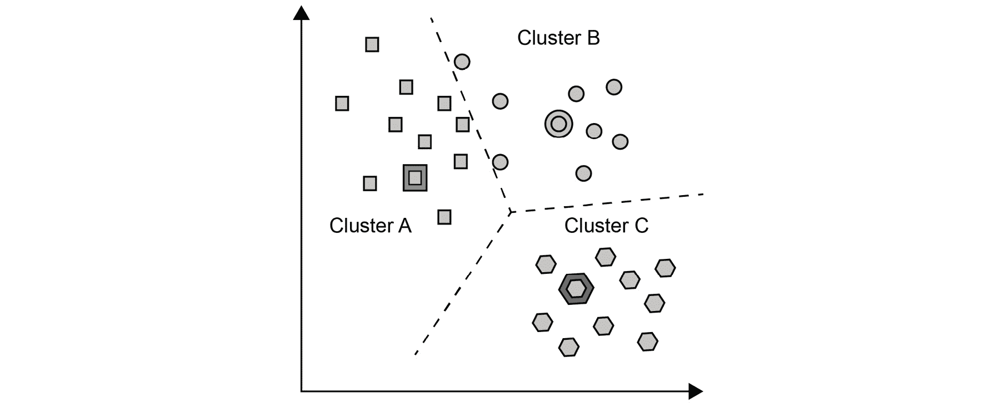

###### 图 4.6：观察值的散点图以及用星号、三角形和菱形表示的聚类中心。

接下来，在更新阶段，聚类中心会移动到该聚类中各点的均值位置。这些聚类均值被称为质心，如下图所示：

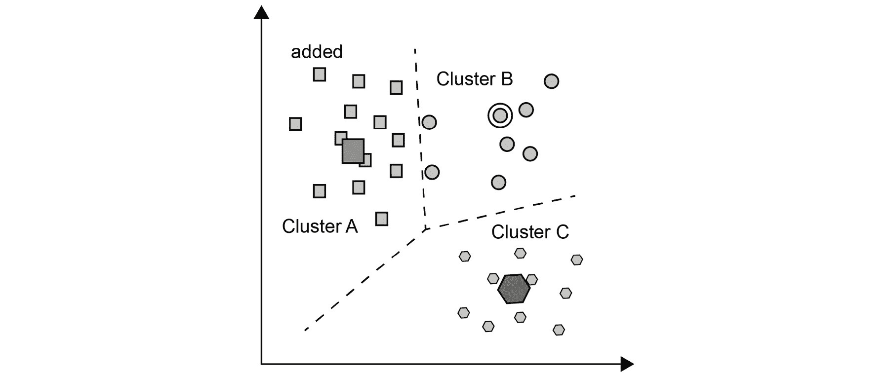

###### 图 4.7：聚类中心向质心移动。

然而，一旦计算出质心，由于某些观察比以前的聚类中心更接近新的质心，这些观察将被重新分配到不同的聚类。因此，模型必须再次更新其质心。此过程在下图中展示：

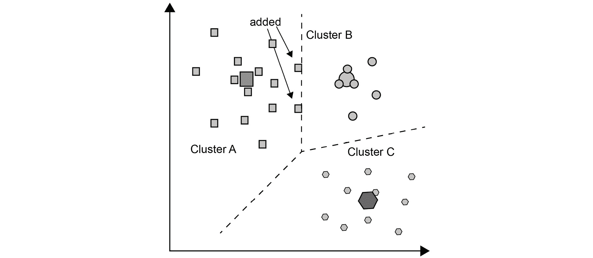

###### 图 4.8：观察重新分配后质心的更新。

更新质心的过程持续进行，直到没有进一步的观察重新分配。最终的质心如下图所示：

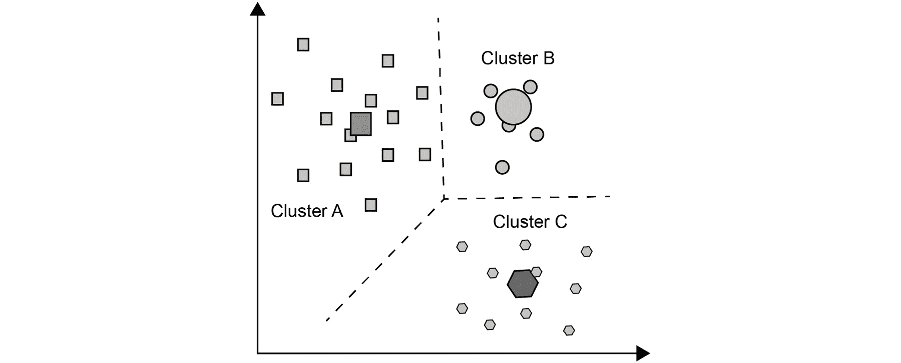

###### 图 4.9：最终质心位置和聚类分配。

使用与*练习 34*中相同的玻璃数据集，*构建 HCA 模型*，我们将拟合一个具有用户定义聚类数量的 K-Means 模型。接下来，由于质心的选择具有随机性，我们将通过构建一个具有给定聚类数量的 K-Means 模型集成，并将每个观察分配给预测聚类的众数，从而提高我们预测的可靠性。之后，我们将通过监控平均*惯性*（或聚类内平方和）随聚类数量的变化，来调节最佳的聚类数，并找出增加聚类数时，惯性减少的临界点。

### 练习 36：拟合 K-Means 模型并分配预测

由于我们的数据已经准备好（请参见*练习 34，构建 HCA 模型*），并且我们理解 K-Means 算法背后的概念，我们将学习如何轻松地拟合 K-Means 模型，生成预测，并将这些预测分配到相应的观察。

在导入、打乱和标准化玻璃数据集后：

1.  使用以下代码实例化一个 KMeans 模型，假设聚类数为任意数，这里为两个聚类：

    ```py
    from sklearn.cluster import KMeans
    model = KMeans(n_clusters=2)
    ```

1.  使用以下代码行将模型拟合到 `scaled_features`：

    ```py
    model.fit(scaled_features)
    ```

1.  使用以下代码将模型的聚类标签保存到数组 labels 中：

    ```py
    labels = model.labels_
    ```

1.  生成标签的频率表：

    ```py
    import pandas as pd
    pd.value_counts(labels)
    ```

    为了更好地理解，请参见以下截图：

    

    ###### 图 4.10：两个聚类的频率表

    使用两个聚类，将 61 个观察分配到第一个聚类，157 个观察分配到第二个聚类。

1.  使用以下代码将标签数组作为 '`预测聚类`' 列添加到 `df_shuffled` 数据框中，并预览前五行：

    ```py
    df_shuffled['Predicted_Cluster'] = labels
    print(df_shuffled.head(5))
    ```

1.  查看以下图中的输出：


###### 图 4.11：`df_shuffled` 的前五行

### 活动 12：集成 K-Means 聚类与预测计算

当算法使用随机性作为寻找最佳解决方案的一部分时（即在人工神经网络和 k-means 聚类中），在相同数据上运行相同的模型可能会得出不同的结论，从而限制我们对预测结果的信心。因此，建议多次运行这些模型，并使用所有模型的汇总度量（即均值、中位数和众数）生成预测。在本活动中，我们将构建 100 个 k-means 聚类模型的集成。

在导入、打乱和标准化玻璃数据集之后（请参见 *练习 34*，*构建 HCA 模型*）：

1.  实例化一个空数据框架，以便为每个模型附加标签，并将其保存为新的数据框架对象 `labels_df`。

1.  使用 for 循环，迭代 100 个模型，在每次迭代时将预测标签作为新列附加到 `labels_df` 中。计算 `labels_df` 中每行的众数，并将其作为新列保存到 `labels_df` 中。输出应如下所示：

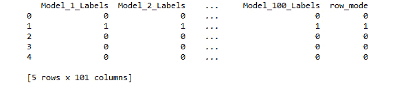

###### 图 4.12：labels_df 的前五行

#### 注意

本活动的解答可以在第 356 页找到。

通过迭代多个模型并在每次迭代中保存预测结果，我们极大地提高了对预测结果的信心，并将最终预测结果作为这些预测的众数。然而，这些预测是由使用预定聚类数的模型生成的。除非我们事先知道聚类数，否则我们需要发现最佳的聚类数来分割我们的观测数据。

### 练习 37：通过 n_clusters 计算平均惯性

k-means 算法通过最小化簇内平方和（或惯性）来将观测数据分组到不同的簇中。因此，为了提高我们对 k-means 模型的聚类数调优的信心，我们将把在 *活动 12，集成 k-means 聚类与计算预测* 中创建的循环（经过少许调整）放入另一个循环中，后者将迭代一个 `n_clusters` 范围。这会创建一个嵌套循环，迭代 10 个 `n_clusters` 的可能值，并在每次迭代时构建 100 个模型。在 100 次内层迭代中的每一次中，模型惯性将被计算出来。对于 10 次外层迭代中的每一次，将计算 100 个模型的平均惯性，从而得出每个 `n_clusters` 值的平均惯性值。

在导入、打乱和标准化玻璃数据集之后（请参见 *练习 34，构建 HCA 模型*）：

1.  如下所示，在循环外部导入我们所需的包：

    ```py
    from sklearn.cluster import KMeans
    import numpy as np
    ```

1.  从内到外构建和理解嵌套循环会更容易。首先，实例化一个空列表 `inertia_list`，我们将在内部循环的每次迭代后将惯性值附加到该列表，如下所示：

    ```py
    inertia_list = []
    ```

1.  在 for 循环中，我们将使用以下代码迭代 100 个模型：

    ```py
    for i in range(100):
    ```

1.  在循环内部，构建一个 `KMeans` 模型，使用 `n_clusters=x`，如下所示：

    ```py
    model = KMeans(n_clusters=x)
    ```

    #### 注意

    x 的值由外部 for 循环确定，我们还没有讲解这个部分，但很快会详细介绍。

1.  如下所示，将模型拟合到 `scaled_features`：

    ```py
    model.fit(scaled_features)
    ```

1.  获取惯性值并将其保存为对象惯性，如下所示：

    ```py
    inertia = model.inertia_
    ```

1.  使用以下代码将惯性添加到 `inertia_list` 中：

    ```py
    inertia_list.append(inertia)
    ```

1.  移动到外部循环，实例化另一个空列表来存储平均惯性值，如下所示：

    ```py
    mean_inertia_list = []
    ```

1.  使用以下代码循环遍历 `n_clusters` 从 1 到 10 的值：

    ```py
    for x in range(1, 11):
    ```

1.  在内部 for 循环运行完 100 次迭代，并将 100 个模型的惯性值添加到 `inertia_list` 后，计算该列表的均值并保存为对象 `mean_inertia`，如下面所示：

    ```py
    mean_inertia = np.mean(inertia_list)
    ```

1.  如下所示，将 `mean_inertia` 添加到 `mean_inertia_list` 中：

    ```py
    mean_inertia_list.append(mean_inertia)
    ```

1.  在完成 100 次迭代并进行 10 次，合计 1000 次迭代后，`mean_inertia_list` 包含 10 个值，这些值是每个 `n_clusters` 值的平均惯性值。

1.  按如下代码打印 `mean_inertia_list`。这些值在下图中显示：

    ```py
    print(mean_inertia_list)  
    ```

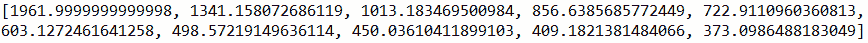

###### 图 4.13：mean_inertia_list

### 练习 38：按 n_clusters 绘制均值惯性

继续进行练习 38：

现在我们已经为每个 `n_clusters` 值生成了 100 个模型的均值惯性，接下来我们将按 `n_clusters` 绘制均值惯性。然后，我们将讨论如何从视觉上评估选择 `n_clusters` 的最佳值。

1.  首先，按如下方式导入 matplotlib：

    ```py
    import matplotlib.pyplot as plt
    ```

1.  创建一个数字列表并将其保存为对象 x，以便在 x 轴上绘制，如下所示：

    ```py
    x = list(range(1, len(mean_inertia_list)+1))
    ```

1.  将 `mean_inertia_list` 保存为对象 y，如下所示：

    ```py
    y = mean_inertia_list
    ```

1.  如下所示，按聚类数量绘制均值惯性：

    ```py
    plt.plot(x, y)
    ```

1.  使用以下代码将图表标题设置为 '`Mean Inertia by n_clusters`'：

    ```py
     plt.title('Mean Inertia by n_clusters') 
    ```

1.  使用 `plt.xlabel('n_clusters')` 将 x 轴标签标记为 '`n_clusters`'，使用以下代码将 y 轴标签标记为 '`Mean Inertia`'：

    ```py
    plt.ylabel ('Mean Inertia')
    ```

1.  使用以下代码将 x 轴的刻度标签设置为 x 中的值：

    ```py
    plt.xticks(x)
    ```

1.  使用 `plt.show()` 显示图表。为了更好地理解，参见以下代码：

    ```py
    plt.plot(x, y)
    plt.title('Mean Inertia by n_clusters')
    plt.xlabel('n_clusters')
    plt.xticks(x)
    plt.ylabel('Mean Inertia')
    plt.show()
    ```

    对于结果输出，请参见以下截图：

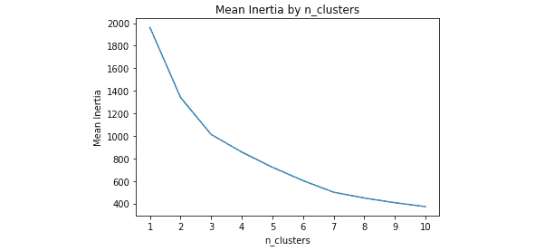

###### 图 4.14：按 n_clusters 计算的均值惯性

为了确定最佳的 `n_clusters` 数量，我们将使用“肘部法则”。即在图中，随着聚类数量增加，新增聚类带来的复杂度增加，而均值惯性减少的幅度逐渐减缓。从图 4.14 中可以看出，从 `n_clusters` 为 1 到 3 时，均值惯性急剧下降。而当 `n_clusters` 等于 3 后，均值惯性的下降似乎变得缓慢，并且惯性减少可能不足以抵消增加额外聚类的复杂性。因此，在这种情况下，合适的 `n_clusters` 数量是 3。

然而，如果数据的维度过多，k-means 算法可能会受到维度灾难的影响，因为欧几里得距离膨胀，导致结果错误。因此，在拟合 k-Means 模型之前，建议使用降维策略。

降低维度有助于消除多重共线性，并减少拟合模型的时间。**主成分分析**（**PCA**）是一种常见的降维方法，通过发现数据中一组潜在的线性变量来减少维度。

## 主成分分析（PCA）

从高层次来看，PCA 是一种通过原始特征创建不相关线性组合的技术，这些组合被称为**主成分**。在主成分中，第一个成分解释了数据中最大比例的方差，而后续的成分则逐渐解释较少的方差。

为了演示 PCA，我们将：

+   使用所有主成分拟合 PCA 模型

+   通过设置解释方差的阈值来调整主成分的数量，以便保留数据中的信息。

+   将这些成分拟合到 k-means 聚类分析中，并比较 PCA 转换前后 k-means 的性能

### 练习 39：拟合 PCA 模型

在本练习中，您将学习如何使用我们在*练习 34：构建 HCA 模型*中准备的数据和 PCA 简要说明来拟合一个通用的 PCA 模型。

1.  按照以下方式实例化 PCA 模型：

    ```py
    from sklearn.decomposition import PCA
    model = PCA()
    ```

1.  将 PCA 模型拟合到`scaled_features`，如下代码所示：

    ```py
    model.fit(scaled_features)
    ```

1.  获取数据中每个主成分的解释方差比例，将数组保存为对象`explained_var_ratio`，并将值打印到控制台，如下所示：

    ```py
    explained_var_ratio = model.explained_variance_ratio_
    print(explained_var_ratio)
    ```

1.  对于结果输出，请参阅以下屏幕截图：

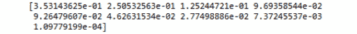

###### 图 4.15：每个主成分的数据解释方差

每个主成分解释了数据中的一部分方差。在本练习中，第一个主成分解释了数据中 35%的方差，第二个主成分解释了 25%，第三个主成分解释了 13%，依此类推。总的来说，这九个成分解释了数据中 100%的方差。降维的目标是减少数据中的维度，以限制过拟合和后续模型拟合的时间。因此，我们不会保留所有九个成分。然而，如果我们保留的成分太少，数据中的解释方差比例将很低，后续模型将出现欠拟合。因此，数据科学家的挑战在于确定最小化过拟合和欠拟合的`n_components`数量。

### 练习 40：使用解释方差阈值选择 n_components

在*练习 39*，*拟合 PCA 模型*中，你学会了用所有可用的主成分拟合 PCA 模型。然而，保留所有主成分并不会减少数据的维度。在本练习中，我们将通过保留解释一定方差阈值的主成分来减少数据的维度。

1.  通过计算每个主成分解释的方差的累计和，确定最少 95%数据方差由多少个主成分解释。让我们看以下代码，看看它是如何实现的：

    ```py
    import numpy as np
    cum_sum_explained_var = np.cumsum(model.explained_variance_ratio_)
    print(cum_sum_explained_var)
    ```

    对于结果输出，请参考以下截图：

    

    ###### 图 4.16：每个主成分的解释方差的累计和

1.  将数据中保持的方差百分比阈值设置为 95%，如下所示：

    ```py
    threshold = .95
    ```

1.  使用这个阈值，我们将遍历累计解释方差的列表，看看它们是否解释了数据中不少于 95%的方差。由于我们将循环遍历`cum_sum_explained_var`的索引，因此我们将使用以下方式实例化我们的循环：

    ```py
    for i in range(len(cum_sum_explained_var)):
    ```

1.  检查`cum_sum_explained_var`中的项是否大于或等于 0.95，如下所示：

    ```py
    if cum_sum_explained_var[i] >= threshold:
    ```

1.  如果满足该逻辑，则我们将在该索引上加 1（因为我们不能有 0 个主成分），将值保存为一个对象，并退出循环。为此，我们将在 if 语句中使用`best_n_components = i+1`，并在下一行执行 break。看看以下代码，了解如何操作：

    ```py
    best_n_components = i+1
    break
    ```

    if 语句中的最后两行指示循环如果逻辑不满足时不做任何操作：

    ```py
    else:
    pass
    ```

1.  使用以下代码打印一条消息，详细说明最佳的主成分数量：

    ```py
    print('The best n_components is {}'.format(best_n_components))
    ```

    查看上一行代码的输出：


###### 图 4.17：显示组件数量的输出信息

`best_n_components`的值为 6。我们可以用`n_components = 6`重新拟合一个 PCA 模型，将数据转换为主成分，并在新的 k-means 模型中使用这些主成分来降低惯性值。此外，我们可以将使用 PCA 变换后的数据构建的模型与使用未经 PCA 变换的数据构建的模型在`n_clusters`值上的惯性值进行比较。

### 活动 13：通过 PCA 变换后按聚类评估平均惯性

现在我们知道了保留至少 95%数据方差的主成分数量，知道如何将特征转换为主成分，并且有了一个方法来通过嵌套循环调整 k-means 聚类的最优聚类数量，接下来我们将在这个活动中将它们整合起来。

接着进行*练习 40*：

1.  使用`n_components`参数等于`best_n_components`的值实例化 PCA 模型（也就是说，记住，`best_n_components = 6`）。

1.  将模型拟合到`scaled_features`并将其转换为前六个主成分

1.  使用嵌套循环，计算在`n_clusters`值从 1 到 10 之间的 100 个模型的均值惯性（参见*练习 40*，*使用方差解释阈值选择 n_components*）。

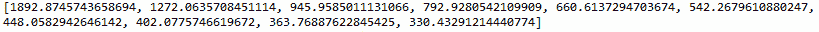

###### 图 4.18：mean_inertia_list_PCA

现在，就像在*练习 38*中所做的那样，*按 n_clusters 绘制均值惯性*，我们有每个`n_clusters`值（1 到 10）的均值惯性值。然而，`mean_inertia_list_PCA`包含 PCA 变换后每个`n_clusters`值的均值惯性值。但是，我们如何知道 PCA 变换后 k-means 模型的表现是否更好呢？在下一个练习中，我们将视觉对比每个`n_clusters`值下 PCA 变换前后的均值惯性。

#### 注意

本活动的解答可以在第 357 页找到。

### 练习 41：按 n_clusters 进行惯性视觉对比

为了视觉对比 PCA 变换前后的均值惯性，我们将稍微修改在*练习 38，按 n_clusters 绘制均值惯性*中创建的图表，方法如下：

+   向图表中添加一条显示 PCA 变换后按`n_clusters`绘制的均值惯性曲线

+   创建一个图例来区分各条线

+   更改标题

    #### 注意

    为了让这个可视化正常工作，*练习 38*中的`mean_inertia_list`，*按 n_clusters 绘制均值惯性*，必须仍然存在于环境中。

继续进行*活动 13*：

1.  使用以下代码导入 Matplotlib：

    ```py
    import matplotlib.pyplot as plt
    ```

1.  创建一个数字列表并将其保存为对象 x，以便我们可以在 x 轴上绘制，方法如下：

    ```py
    x = list(range(1,len(mean_inertia_list_PCA)+1))
    ```

1.  使用以下代码将`mean_inertia_list_PCA`保存为对象 y：

    ```py
    y = mean_inertia_list_PCA
    ```

1.  使用以下代码将`mean_inertia_list`保存为对象 y2：

    ```py
    y2 = mean_inertia_list
    ```

1.  使用以下代码按聚类数绘制 PCA 变换后的均值惯性：

    ```py
    plt.plot(x, y, label='PCA')
    ```

    使用以下方法在 PCA 变换之前，按聚类数添加我们的第二条均值惯性线：

    ```py
    plt.plot(x, y2, label='No PCA)
    ```

1.  将图表标题设置为'`Mean Inertia by n_clusters for Original Features and PCA Transformed Features`'，如下所示：

    ```py
    plt.title('Mean Inertia by n_clusters for Original Features and PCA Transformed Features')
    ```

1.  使用以下代码将 x 轴标签标记为'`n_clusters`'：

    ```py
    plt.xlabel('n_clusters')
    ```

1.  使用以下代码将 y 轴标签标记为'`Mean Inertia`'：

    ```py
    plt.ylabel('Mean Inertia')
    ```

1.  使用`plt.xticks(x)`将 x 轴的刻度标签设置为 x 中的值。

1.  使用并显示图表如下所示，显示图例：

    ```py
    plt.legend()
    plt.show()
    ```

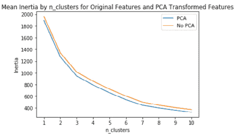

###### 图 4.19：原始特征（橙色）和 PCA 变换特征（蓝色）按 n_clusters 的均值惯性

从图表中，我们可以看到，在模型中使用 PCA 转换后的特征时，每个聚类数的惯性较低。这表明，在 PCA 转换后，相比于转换前，各聚类的组质心与观测值之间的距离更小。因此，通过对原始特征进行 PCA 转换，我们能够减少特征数量，并同时通过减少组内平方和（即惯性）来改进我们的模型。

HCA 和 k-means 聚类是两种广泛使用的无监督学习技术，用于数据分割。PCA 可用于帮助减少数据维度，并以无监督的方式改进模型。而线性判别函数分析（LDA）则是一种监督方法，通过数据压缩来减少维度。

## 使用线性判别分析（LDA）进行监督数据压缩

如前所述，PCA 将特征转换为一组最大化特征间方差的变量。在 PCA 中，输出标签在拟合模型时不被考虑。与此同时，LDA 使用因变量来帮助将数据压缩成能最好区分结果变量类别的特征。在这一部分中，我们将演示如何使用 LDA 作为监督数据压缩技术。

为了演示如何使用 LDA 作为监督的降维压缩技术，我们将：

+   使用所有可能的 `n_components` 拟合一个 LDA 模型

+   将我们的特征转换为 `n_components`

+   调整 `n_components` 的数量

### 练习 42：拟合 LDA 模型

为了使用 LDA 算法的默认参数将模型作为监督学习者拟合，我们将使用一个稍有不同的玻璃数据集，`glass_w_outcome.csv`。（https://github.com/TrainingByPackt/Data-Science-with-Python/tree/master/Chapter04）此数据集包含与玻璃数据集相同的九个特征，但还包括一个结果变量 Type，表示玻璃的类型。Type 被标记为 1、2 和 3，分别对应建筑窗户浮法处理、建筑窗户非浮法处理和车灯。

1.  导入 `glass_w_outcome.csv` 文件，并使用以下代码将其保存为对象 df：

    ```py
    import pandas as pd
    df = pd.read_csv(‘glass_w_outcome.csv’)
    ```

1.  打乱数据以消除任何顺序效应，并将其保存为数据框 `df_shuffled`，如下所示：

    ```py
    from sklearn.utils import shuffle
    df_shuffled = shuffle(df, random_state=42)
    ```

1.  将 `Type` 保存为 `DV`（即，因变量），如下所示：

    ```py
    DV = ‘Type’
    ```

1.  使用 `X = df_shuffled.drop(DV, axis=1)` 和 `y = df_shuffled[DV]` 将打乱后的数据拆分为特征（即 X）和结果（即 y）。

1.  按照如下方式将 X 和 y 拆分为测试集和训练集：

    ```py
    from sklearn.model_selection import train_test_split
    X_train, X_test, y_train, y_test = train_test_split(X, y, test_size=0.33, random_state=42)
    ```

1.  使用以下代码分别对 `X_train` 和 `X_test` 进行缩放：

    ```py
    from sklearn.preprocessing import StandardScaler
    scaler = StandardScaler() 
    X_train_scaled = scaler.fit_transform(X_train) 
    X_test_scaled = scaler.fit_transform(X_test)
    ```

1.  实例化 LDA 模型并将其保存为模型。以下将向您展示如何操作。

    ```py
    from sklearn.discriminant_analysis import LinearDiscriminantAnalysis
    -model = LinearDiscriminantAnalysis()
    ```

    #### 注意

    通过实例化一个不带参数 `for n_components` 的 LDA 模型，我们将返回所有可能的成分。

1.  使用以下代码将模型拟合到训练数据：

    ```py
    model.fit(X_train_scaled, y_train)
    ```

1.  请参见下面的结果输出：![图 4.20：线性判别函数分析的拟合结果输出]

    ](img/C13322_04_20.jpg)

    ###### 图 4.20：拟合线性判别分析函数后的输出

1.  与 PCA 类似，我们可以返回每个组件解释的方差百分比。

    ```py
    model.explained_variance_ratio_
    ```

    输出如下图所示。


###### 图 4.21：按组件解释的方差。

#### 注意

第一个组件解释了数据中 95.86% 的方差，第二个组件解释了数据中 4.14% 的方差，总共为 100%。

我们成功地将 LDA 模型拟合到数据中，将数据从九个特征压缩到两个特征。将特征减少到两个可以减少调优和拟合机器学习模型的时间。然而，在将这些特征应用于分类器模型之前，我们必须将训练和测试特征转换为其两个组成部分。在下一个练习中，我们将展示如何实现这一过程。

### 练习 43：在分类模型中使用 LDA 转换的组件

通过监督式数据压缩，我们将把训练和测试特征（即 `X_train_scaled` 和 `X_test_scaled`）转换为其组成部分，并在其上拟合 `RandomForestClassifier` 模型。

继续进行*练习 42*：

1.  将`X_train_scaled`压缩为其组成部分，如下所示：

    ```py
    X_train_LDA = model.transform(X_train_scaled)
    ```

1.  使用以下方式将`X_test`压缩为其组成部分：

    ```py
    X_test_LDA = model.transform(X_test_scaled)
    ```

1.  按如下方式实例化一个`RandomForestClassifier`模型：

    ```py
    from sklearn.ensemble import RandomForestClassifier
    model = RandomForestClassifier()
    ```

    #### 注意

    我们将使用`RandomForestClassifier`模型的默认超参数，因为超参数调优超出了本章的范围。

1.  使用以下代码将模型拟合到压缩后的训练数据：

    ```py
    model.fit(X_train_LDA, y_train)
    ```

    请参见下方的结果输出：

    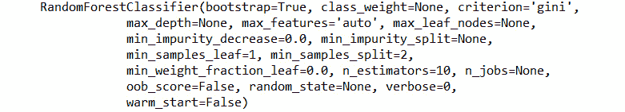

    ###### 图 4.22：拟合随机森林分类器模型后的输出

1.  使用以下代码在`X_test_LDA`上生成预测并将其保存为数组 predictions：

    ```py
    predictions = model.predict(X_test_LDA)
    ```

1.  通过将预测与 `y_test` 进行比较，使用混淆矩阵评估模型性能。要生成并打印混淆矩阵，请参见以下代码：

    ```py
    from sklearn.metrics import confusion_matrix 
    import pandas as pd
    import numpy as np
    cm = pd.DataFrame(confusion_matrix(y_test, predictions))
    cm[‘Total’] = np.sum(cm, axis=1)
    cm = cm.append(np.sum(cm, axis=0), ignore_index=True)
    cm.columns = [‘Predicted 1’, ‘Predicted 2’, ‘Predicted 3’, ‘Total’]
    cm = cm.set_index([[‘Actual 1’, ‘Actual 2’, ‘Actual 3’, ‘Total’]])
    print(cm)
    ```

    输出如下图所示：

    

###### 图 4.23：使用 LDA 压缩数据评估随机森林分类器模型性能的 3x3 混淆矩阵

## 总结

本章向你介绍了两种广泛使用的无监督聚类算法——HCA 和 k-means 聚类。在学习 k-means 聚类时，我们利用循环的力量创建了多个模型集，以调节聚类的数量，并提高我们预测的可靠性。在 PCA 部分，我们确定了用于降维的主成分数量，并将这些成分拟合到 k-means 模型中。此外，我们比较了 PCA 转换前后 k-means 模型性能的差异。我们还介绍了一种算法——LDA，它以监督方式减少维度。最后，我们通过遍历所有可能的成分值，并通过编程返回使得随机森林分类器模型获得最佳准确度得分的值，来调节 LDA 中的成分数量。现在，你应该已经对降维和无监督学习技术感到得心应手。

本章简要介绍了如何创建图表；然而，在下一章，我们将学习结构化数据以及如何使用 XGboost 和 Keras 库。
