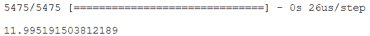

# 第十五章：*第五章*

# 掌握结构化数据

## 学习目标

在本章结束时，你将能够：

+   使用结构化数据创建高精度模型

+   使用 XGBoost 库训练提升模型

+   使用 Keras 库训练神经网络模型

+   微调模型参数以获得最佳准确性

+   使用交叉验证

+   保存并加载你的训练模型

本章将介绍如何创建高精度的结构化数据模型的基础知识。

## 简介

数据主要分为两种类型：结构化数据和非结构化数据。结构化数据指的是具有定义格式的数据，通常以表格形式存储，例如存储在 Excel 表格或关系型数据库中的数据。非结构化数据没有预定义的模式，任何无法存储在表格中的数据都属于这一类。例如语音文件、图片和 PDF 文件等。

在本章中，我们将重点讨论结构化数据，并使用 XGBoost 和 Keras 创建机器学习模型。XGBoost 算法因其能够快速交付高精度模型以及其分布式特性而被业界专家和研究人员广泛使用。分布式特性指的是能够并行处理数据和训练模型；这使得训练速度更快，数据科学家的周转时间更短。另一方面，Keras 让我们能够创建神经网络模型。在某些情况下，神经网络的效果远胜于提升算法，但找到合适的网络和网络配置是非常困难的。以下主题将帮助你熟悉这两个库，确保你能应对数据科学旅程中的任何结构化数据。

## 提升算法

提升方法是一种提高任何学习算法准确性的方式。提升方法通过将粗略的、高层次的规则结合成一个比任何单一规则更准确的预测。它通过迭代地将训练数据集的一个子集输入到一个“弱”算法中来生成一个弱模型。这些弱模型随后被结合在一起，形成最终的预测。两种最有效的提升算法是梯度提升机和 XGBoost。

### 梯度提升机（GBM）

GBM 利用分类树作为弱算法。结果通过使用可微分的损失函数来改进这些弱模型的估算。该模型通过考虑前一棵树的净损失来拟合连续的树；因此，每棵树都部分地参与了最终的解决方案。因此，提升树会降低算法的速度，但它们提供的透明度能带来更好的结果。GBM 算法有很多参数，而且对噪声和极端值非常敏感。同时，GBM 会发生过拟合，因此需要一个合适的停止点，但它通常是最佳的模型。

### XGBoost（极端梯度提升）

XGBoost 是全球研究人员在构建结构化数据模型时的首选算法。XGBoost 同样使用树作为弱学习算法。那么，为什么当数据科学家看到结构化数据时，XGBoost 是他们首先想到的算法呢？XGBoost 是可移植和分布式的，这意味着它可以在不同的架构中轻松使用，并且可以利用多个核心（单台机器）或多台机器（集群）。作为额外的好处，XGBoost 库是用 C++编写的，这使它非常快速。当处理大数据集时，它特别有用，因为它允许将数据存储在外部磁盘上，而不必将所有数据加载到内存中。

#### 注意

你可以在这里阅读更多关于 XGBoost 的内容：[`arxiv.org/abs/1603.02754`](https://arxiv.org/abs/1603.02754)

### 练习 44：使用 XGBoost 库进行分类

在本练习中，我们将使用 Python 的 XGBoost 库对批发客户数据集进行分类（[`github.com/TrainingByPackt/Data-Science-with-Python/tree/master/Chapter05/data`](https://github.com/TrainingByPackt/Data-Science-with-Python/tree/master/Chapter05/data)）。该数据集包含批发分销商客户的购买数据，包括在各种产品类别上的年度花费。我们将根据不同产品的年度支出预测渠道。这里的“渠道”描述了客户是酒店/餐厅/咖啡馆（horeca）客户还是零售客户。

1.  打开你虚拟环境中的 Jupyter Notebook。

1.  导入 XGBoost、Pandas 和 sklearn，这些是我们将用于计算准确度的函数。准确度对于理解我们的模型性能至关重要。

    ```py
    import pandas as pd
    import xgboost as xgb from sklearn.metrics import accuracy_score
    ```

1.  使用 pandas 读取批发客户数据集，并通过以下命令检查数据是否成功加载：

    ```py
    data = pd.read_csv("data/wholesale-data.csv")
    ```

1.  使用`head()`命令检查数据集的前五个条目。输出如下面的截图所示：

    ```py
    data.head()
    ```

    

    ###### 图 5.1：显示数据集前五个元素的截图

1.  现在，“`data`”数据框包含所有数据。它有目标变量，在我们的例子中是“`Channel`”，以及预测变量。因此，我们将数据分为特征（预测变量）和标签（目标变量）。

    ```py
    X = data.copy()X.drop("Channel", inplace = True, axis = 1)Y = data.Channel
    ```

1.  按照前面章节的讨论，创建训练集和测试集。在这里，我们使用 80:20 的比例进行分割，因为数据集中的数据点较少。你可以尝试不同的分割比例。

    ```py
    X_train, X_test = X[:int(X.shape[0]*0.8)].values, X[int(X.shape[0]*0.8):].values Y_train, Y_test = Y[:int(Y.shape[0]*0.8)].values, Y[int(Y.shape[0]*0.8):].values
    ```

1.  将 pandas 数据框转换为 DMatrix，这是 XGBoost 用于存储训练和测试数据集的内部数据结构。

    ```py
    train = xgb.DMatrix(X_train, label=Y_train)test = xgb.DMatrix(X_test, label=Y_test)
    ```

1.  指定训练参数并训练模型。

    #### 注意

    ```py
    param = {'max_depth':6, 'eta':0.1, 'silent':1, 'objective':'multi:softmax', 'num_class': 3}num_round = 5 model = xgb.train(param, train, num_round)
    ```

    #### 注意

    默认情况下，XGBoost 会使用所有可用线程进行多线程处理。要限制线程数，你可以使用`nthread`参数。有关更多信息，请参阅下一节。

1.  使用我们刚刚创建的模型预测测试集的“`Channel`”值。

    ```py
    preds = model.predict(test)
    ```

1.  获取我们为测试数据集训练的模型的准确度。

    ```py
    acc = accuracy_score(Y_test, preds)print("Accuracy: %.2f%%" % (acc * 100.0))
    ```

    输出截图如下：


###### 图 5.2：最终准确度

恭喜！你刚刚使用大约 90%的准确率创建了你的第一个 XGBoost 模型，而且几乎没有进行调优！

## XGBoost 库

我们用于执行上述分类的库名为 XGBoost。该库通过许多参数提供了大量的自定义选项。在接下来的章节中，我们将深入了解 XGBoost 库的不同参数和功能。

#### 注意

欲了解更多关于 XGBoost 的信息，请访问网站：https://xgboost.readthedocs.io

**训练**

影响任何 XGBoost 模型训练的参数如下所示。

+   `booster`: 尽管我们在介绍中提到 XGBoost 的基础学习器是回归树，但使用此库时，我们也可以将线性回归作为弱学习器使用。另一种弱学习器，DART 增强器，是一种新的树增强方法，它通过随机丢弃树来防止过拟合。使用树增强时，传递"`gbtree`"（默认）；使用线性回归时，传递"`gblinear`"；若要进行带有丢弃的树增强，传递"`dart`"。

    #### 注意

    你可以通过这篇论文了解更多关于 DART 的信息：http://www.jmlr.org/proceedings/papers/v38/korlakaivinayak15.pdf

+   `silent`: 0 打印训练日志，而 1 则为静默模式。

+   `nthread`: 这表示要使用的并行线程数。默认情况下，它是系统中可用的最大线程数。

    #### 注意

    参数`silent`已被弃用，现已被`verbosity`替代，`verbosity`可以取以下值：0（静默）、1（警告）、2（信息）、3（调试）。

+   `seed`: 这是随机数生成器的种子值。在此处设置一个常量值，可以得到可重复的结果。默认值是 0。

+   `objective`: 这是模型尝试最小化的函数。接下来的几个点将介绍目标函数。

    `reg:linear`: 线性回归应该用于连续型目标变量（回归问题）。 （默认）

    `binary:logistic`: 用于二分类的逻辑回归。它输出概率而非类别。

    `binary:hinge`: 这是二分类，它输出的是 0 或 1 的预测，而不是概率。当你不关心概率时，使用此方法。

    `multi:softmax`: 如果你想进行多类别分类，使用此方法来执行基于 softmax 目标的分类。必须将`num_class`参数设置为类别数。

    `multi:softprob`: 这与 softmax 的作用相同，但输出的是每个数据点的概率，而不是预测类别。

+   `eval_metric`: 需要在验证集上观察模型的表现（如在*第一章*，*数据科学与数据预处理介绍*中讨论）。此参数用于指定验证数据的评估指标。默认的评估指标根据目标函数选择（回归使用`rmse`，分类使用`logloss`）。你可以使用多个评估指标。

    `rmse`：均方根误差（RMSE）对较大误差的惩罚更重。因此，当误差为 1 比误差为 3 更为严重时，它是合适的。

    `mae`：平均绝对误差（MAE）适用于当误差为 1 和误差为 3 的情况类似时。

    以下图表显示了随着实际值与预测值之间差异的增加，误差也随之增加。图示如下：


###### 图 5.3：实际值与预测值的差异


###### 图 5.4：随着误差变化，惩罚的变化；|X| 为 mae，X² 为 rmse

`logloss`：模型的负对数似然（`logloss`）等同于最大化模型的准确度。它在数学上被定义为：


###### 图 5.5：Logloss 方程示意图

这里，N 是数据点的数量，M 是类别的数量，1 或 0 取决于预测是否正确，表示的是预测数据点 *i* 为标签 *j* 的概率。

`AUC`：**曲线下面积**在二分类中广泛使用。如果你的数据集存在**类别不平衡问题**，你应该始终使用它。类别不平衡问题发生在数据未能均匀分配到不同类别中；例如，如果类别 A 占数据的 90%，而类别 B 占 10%。我们将在“处理不平衡数据集”一节中进一步讨论类别不平衡问题。

`aucpr`：**精准率-召回率**（**PR**）曲线下的面积与 AUC 曲线相同，但在处理高度不平衡的数据集时应优先使用。我们将在“处理不平衡数据集”一节中讨论这一点。

#### 注意

在处理二分类数据集时，应作为经验法则使用 AUC 或 AUCPR。

**树提升器**

特定于基于树的模型的参数如下所示：

+   `eta`：这是学习率。修改此值以防止过拟合，正如我们在*第一章*，*数据科学与数据预处理简介*中讨论的那样。学习率决定了每一步更新权重的幅度。权重的梯度会与学习率相乘，并加到权重上。默认值为 0.3，最大值为 1，最小值为 0。

+   `gamma`：这是进行划分所需的最小损失减少量。gamma 值越大，算法越保守。更加保守有助于防止过拟合。该值依赖于数据集和使用的其他参数。其范围从 0 到无限大，默认值为 0。较小的值会导致树较浅，较大的值则会导致树更深。

    #### 注意

    gamma 值大于 1 通常不会得到好的结果。

+   `max_depth`：这是任何树的最大深度，如*第三章*《通过 Sklearn 介绍机器学习》中所讨论的。增加最大深度将使模型更容易发生过拟合。0 表示没有限制。默认值为 6。

+   `subsample`：将其设置为 0.5 将导致算法在生成树之前随机抽取一半的训练数据。这可以防止过拟合。每次提升迭代时会进行一次子采样，默认值为 1，这意味着模型会使用完整的数据集，而不是样本。

+   `lambda`：这是 L2 正则化项。L2 正则化将系数的平方值作为惩罚项添加到损失函数中。增大该值可以防止过拟合。其默认值为 1。

+   `alpha`：这是 L1 正则化项。L1 正则化将系数的绝对值作为惩罚项添加到损失函数中。增大该值可以防止过拟合。其默认值为 0。

+   `scale_pos_weight`：当类别极度不平衡时非常有用。我们将在接下来的章节中学习更多关于不平衡数据的内容。一个典型的考虑值是：负实例的总和 / 正实例的总和。其默认值为 1。

+   `predictor`：有两个预测器。`cpu_predictor`使用 CPU 进行预测，默认使用。`gpu_predictor`使用 GPU 进行预测。

    #### 注意

    获取所有参数的列表，请访问：https://xgboost.readthedocs.io/en/latest/parameter.html

### 控制模型过拟合

如果你观察到训练数据集上的准确度很高，但在测试数据集上的准确度较低，那么你的模型已经对训练数据过拟合，如*第一章*《数据科学和数据预处理简介》中所示。XGBoost 中有两种主要方法可以限制过拟合：

+   在监控训练和测试指标的同时调整`max_depth`、`min_child_weight`和`gamma`，以便获得最佳模型而不对训练数据集过拟合。你将在接下来的章节中学到更多相关内容。

+   `colsample_bytree`的作用与子采样相同，但它是对列进行采样，而不是对行进行采样。

为了更好地理解，请参见下图中的训练和准确度图表：


###### 图 5.6：训练和准确度图表

要理解具有过拟合和适当拟合模型的数据集的概念化，请参阅下图：


###### 图 5.7：具有过拟合和适当拟合模型的数据集示意图

#### 注意

黑线表示模型适配良好，而红线表示的模型已经对数据集过拟合。

### 处理不平衡数据集

不平衡数据集给数据科学家带来了许多问题。一个不平衡数据集的例子是信用卡欺诈数据。在这种情况下，大约 95%的交易是合法的，只有 5%是欺诈性的。在这种情况下，一个将所有交易预测为正确的模型会得到 95%的准确率，但实际上这是一个非常糟糕的模型。为了查看类别的分布情况，你可以使用以下函数：

```py
data['target_variable'].value_counts()
```

输出结果如下：


###### 图 5.8：类别分布

为了处理不平衡数据集，你可以使用以下方法：

+   **对记录数较多的类别进行欠采样**：以信用卡欺诈为例，你可以通过随机抽取合法交易样本，使其记录数与欺诈记录相等。这样就能实现欺诈类别和合法类别的均衡分布。

+   **对记录数较少的类别进行过采样**：以信用卡欺诈为例，你可以通过添加新数据点或复制现有数据点来增加欺诈交易样本的数量。这样就能实现欺诈类别和合法类别的均衡分布，**欺诈**和**合法**。

+   **使用 scale_pos_weight 来平衡正负权重**：你可以通过该参数为数据点较少的类别分配更高的权重，从而人为地平衡各类别。该参数的值可以是：


###### 图 5.9：值参数方程

你可以使用以下代码查看各类别的分布情况：

```py
positive = sum(Y == 1)
negative = sum(Y == 0)
scale_pos_weight = negative/positive
```

+   **使用 AUC 或 AUCPR 进行评估**：如前所述，AUC 和 AUCPR 指标对于不平衡数据集非常敏感，不像准确率那样，它会给出一个高值，尽管模型通常预测的是多数类别。AUC 仅适用于二分类问题。它表示的是在不同阈值（0、0.01、0.02...1）下的**真正例率与假正例率**的关系。如下图所示：


###### 图 5.10：TPR 和 FPR 方程

该指标是绘制**TPR** 和 **FPR** 后所得到的曲线下面积。在处理高度偏斜的数据集时，AUCPR 能提供更好的结果，因此它是首选。AUCPR 表示在不同阈值下的精确度和召回率。


###### 图 5.11：精确度和召回率方程

作为经验法则，当处理不平衡类别时，应使用 AUC 或 AUCPR 作为评估指标，因为它能提供更清晰的模型表现。

#### 注意

机器学习算法无法轻松处理作为字符串表示的字符串或类别变量，因此我们必须将它们转换为数字。

### 活动 14：训练并预测一个人的收入

在本次活动中，我们将尝试预测一个人的收入是否超过$50,000。成人收入数据集（[链接](https://github.com/TrainingByPackt/Data-Science-with-Python/tree/master/Chapter05/data)）的数据来源于 1994 年人口普查数据集（[链接](https://archive.ics.uci.edu/ml/datasets/adult)），包含个人收入、教育资格和职业等信息。让我们来看一个场景：你在一家汽车公司工作，你需要创建一个系统，让公司的销售代表能够判断应该向哪个人推荐哪种汽车。

为此，你需要创建一个机器学习模型来预测潜在买家的收入，从而为销售人员提供正确的信息，以便销售正确的汽车。

1.  使用 pandas 加载收入数据集（`adult-data.csv`）。

1.  数据应该如下所示：

    ###### 图 5.12：显示人口普查数据集五个元素的截图

    使用以下代码来指定列名：

    ```py
    data = pd.read_csv("../data/adult-data.csv", names=['age', 'workclass','education-num', 'occupation', 'capital-gain', 'capital-loss', 'hoursper-week', 'income'])
    ```

1.  使用 sklearn 将所有分类变量从字符串转换为整数。

1.  使用 XGBoost 库进行预测，并进行参数调优，使准确率超过 80%。

我们成功地使用数据集预测了收入，准确率约为 83%。

#### 注意

该活动的解决方案可以在第 360 页找到。

## 外部内存使用

当你有一个异常大的数据集，无法将其加载到内存中时，XGBoost 库的外部内存功能将帮助你。这个功能将训练 XGBoost 模型，而无需将整个数据集加载到内存中。

使用这个功能几乎不需要额外努力；你只需要在文件名的末尾添加缓存前缀。

```py
train = xgb.DMatrix('data/wholesale-data.dat.train#train.cache')
```

该功能仅支持`libsvm`文件。因此，我们现在将把一个已加载到 pandas 的数据集转换为`libsvm`文件，以便使用外部内存功能。

#### 注意

你可能需要根据数据集的大小分批进行处理。

```py
from sklearn.datasets import dump_svmlight_file
dump_svmlight_file(X_train, Y_train, 'data/wholesale-data.dat.train', zero_based=True, multilabel=False)
```

这里，`X_train`和`Y_train`分别是预测变量和目标变量。`libsvm`文件将保存在数据文件夹中。

## 交叉验证

交叉验证是一种帮助数据科学家评估模型在未见数据上的表现的技术。当数据集不够大，无法创建三个划分（训练集、测试集和验证集）时，交叉验证特别有用。交叉验证通过给模型呈现同一数据集的不同划分，帮助模型避免过拟合。它通过在每次交叉验证的过程中，向模型提供不同的训练集和验证集来实现。10 折交叉验证是最常用的方式，数据集被分成 10 个完全不同的子集，并对每个子集进行训练，最后平均各项指标，以获得模型的准确预测性能。在每一轮交叉验证中，我们进行以下操作：

1.  将数据集打乱并将其分成 k 个不同的组（k=10 用于 10 折交叉验证）。

1.  在 k-1 个组上训练模型，并在 1 个组上进行测试。

1.  评估模型并存储结果。

1.  重复步骤 2 和 3，使用不同的组，直到所有 k 种组合都训练完毕。

1.  最终指标是不同轮次生成的指标的平均值。


###### 图 5.13：交叉验证数据集示意图

XGBoost 库内置了一个进行交叉验证的函数。本节将帮助你熟悉如何使用它。

### 练习 45：使用交叉验证找到最佳超参数

在本练习中，我们将使用 XGBoost 库在 Python 中为上一个活动中的成人数据集找到最佳超参数。为此，我们将利用该库的交叉验证功能。

1.  从*活动 14*加载人口普查数据集，并执行所有预处理步骤。

    ```py
    import pandas as pd
    import numpy as np
    data = pd.read_csv("../data/adult-data.csv", names=['age', 'workclass', 'fnlwgt', 'education-num', 'occupation', 'capital-gain', 'capital-loss', 'hours-per-week', 'income'])
    ```

    使用 sklearn 中的 Label Encoder 对字符串进行编码。首先，导入 Label Encoder，然后逐个编码所有字符串类型的列。

    ```py
    from sklearn.preprocessing import LabelEncoder
    data['workclass'] = LabelEncoder().fit_transform(data['workclass'])
    data['occupation'] = LabelEncoder().fit_transform(data['occupation'])
    data['income'] = LabelEncoder().fit_transform(data['income'])
    ```

1.  从数据中创建训练集和测试集，并将数据转换为 D 矩阵。

    ```py
    import xgboost as xgb
    X = data.copy()
    X.drop("income", inplace = True, axis = 1)
    Y = data.income
    X_train, X_test = X[:int(X.shape[0]*0.8)].values, X[int(X.shape[0]*0.8):].values
    Y_train, Y_test = Y[:int(Y.shape[0]*0.8)].values, Y[int(Y.shape[0]*0.8):].values
    train = xgb.DMatrix(X_train, label=Y_train)
    test = xgb.DMatrix(X_test, label=Y_test)
    ```

1.  不使用 train 函数，而是使用以下代码进行 10 折交叉验证，并将结果存储在`model_metrics`数据框中。for 循环遍历不同的树深度值，以找到最适合我们数据集的深度。

    ```py
    test_error = {}
    for i in range(20):
        param = {'max_depth':i, 'eta':0.1, 'silent':1, 'objective':'binary:hinge'}
        num_round = 50
        model_metrics = xgb.cv(param, train, num_round, nfold = 10)
        test_error[i] = model_metrics.iloc[-1]['test-error-mean']
    ```

1.  使用 Matplotlib 可视化结果。

    ```py
    import matplotlib.pyplot as plt
    plt.scatter(test_error.keys(),test_error.values())
    plt.xlabel('Max Depth')
    plt.ylabel('Test Error')
    plt.show()
    ```

    

    ###### 图 5.14：最大深度与测试误差的图表

    从图中我们可以看到，9 的最大深度对于我们的数据集效果最好，因为它的测试误差最低。

1.  找到最佳学习率。运行这段代码会花费一些时间，因为它会遍历多个学习率，每个学习率运行 500 轮。

    ```py
    for i in range(1,100,5):
        param = {'max_depth':9, 'eta':0.001*i, 'silent':1, 'objective':'binary:hinge'}
        num_round = 500
        model_metrics = xgb.cv(param, train, num_round, nfold = 10)
        test_error[i] = model_metrics.iloc[-1]['test-error-mean']
    ```

1.  可视化结果。

    ```py
    lr = [0.001*(i) for i in test_error.keys()]
    plt.scatter(temp,test_error.values())
    plt.xlabel('Learning Rate')
    plt.ylabel('Error')
    plt.show()
    ```

    

    ###### 图 5.15：学习率与测试误差的图表

    从图中可以看到，约 0.01 的学习率对我们的模型效果最好，因为它的误差最小。

1.  让我们可视化学习率为 0.01 时每一轮的训练和测试误差。

    ```py
    param = {'max_depth':9, 'eta':0.01, 'silent':1, 'objective':'binary:hinge'}
    num_round = 500
    model_metrics = xgb.cv(param, train, num_round, nfold = 10)
    plt.scatter(range(500),model_metrics['test-error-mean'], s = 0.7, label = 'Test Error')
    plt.scatter(range(500),model_metrics['train-error-mean'], s = 0.7, label = 'Train Error')
    plt.legend()
    plt.show()
    ```

    

    ](img/C13322_05_16.jpg)

    ###### 图 5.16：训练和测试误差随轮次变化的图表

    #### 注意

    ```py
    list(model_metrics['test-error-mean']).index(min(model_metrics['test-error-mean']))
    ```

1.  要理解这一点，可以查看输出结果。


###### 图 5.17：最小误差

#### 注意

对于该数据集，效果最好的最终模型参数为：

最大深度 = 9

学习率 = 0.01

轮次数 = 496

## 保存和加载模型

掌握结构化数据的最后一步是能够保存和加载你已经训练和微调的模型。每次需要预测时都重新训练一个新模型会浪费大量时间，因此能够保存已训练的模型对于数据科学家来说至关重要。保存的模型使我们能够复制结果，并创建使用机器学习模型的应用程序和服务。步骤如下：

1.  要保存 XGBoost 模型，你需要调用 `save_model` 函数。

    ```py
    model.save_model('wholesale-model.model')
    ```

1.  要加载之前保存的模型，您需要在初始化的 XGBoost 变量上调用 `load_model`。

    ```py
    loaded_model = xgb.Booster({'nthread': 2})
    loaded_model.load_model('wholesale-model.model')
    ```

    #### 注意

    如果您让 XGBoost 获取所有可用的线程，您的计算机在训练或预测时可能会变慢。

现在你已经准备好使用 XGBoost 库来开始建模你的结构化数据集了！

### 练习 46：创建一个基于实时输入进行预测的 Python 脚本

在这个练习中，我们将首先创建一个模型并保存它。然后，我们将创建一个 Python 脚本，利用这个保存的模型对用户输入的数据进行预测。

1.  将活动 14 中的收入数据集加载为 pandas 数据框。

    ```py
    import pandas as pd
    import numpy as np
    data = pd.read_csv("../data/adult-data.csv", names=['age', 'workclass', 'education-num', 'occupation', 'capital-gain', 'capital-loss', 'hours-per-week', 'income'])
    ```

1.  去除所有尾随空格。

    ```py
    data[['workclass', 'occupation', 'income']] = data[['workclass', 'occupation', 'income']].apply(lambda x: x.str.strip())
    ```

1.  使用 scikit 将所有分类变量从字符串转换为整数。

    ```py
    from sklearn.preprocessing import LabelEncoder
    from collections import defaultdict
    label_dict = defaultdict(LabelEncoder)
    data[['workclass', 'occupation', 'income']] = data[['workclass', 'occupation', 'income']].apply(lambda x: label_dict[x.name].fit_transform(x))
    ```

1.  将标签编码器保存到一个 pickle 文件中，以供将来使用。pickle 文件存储 Python 对象，以便我们在需要时可以访问它们。

    ```py
    import pickle
    with open( 'income_labels.pkl', 'wb') as f:
            pickle.dump(label_dict, f, pickle.HIGHEST_PROTOCOL)
    ```

1.  将数据集拆分为训练集和测试集并创建模型。

1.  将模型保存到文件。

    ```py
    model.save_model('income-model.model')
    ```

1.  在 Python 脚本中，加载模型和标签编码器。

    ```py
    import xgboost as xgb
    loaded_model = xgb.Booster({'nthread': 8})
    loaded_model.load_model('income-model.model')
    def load_obj(file):
          with open(file + '.pkl', 'rb') as f:
                return pickle.load(f)
    label_dict = load_obj('income_labels')
    ```

1.  从用户那里读取输入。

    ```py
    age = input("Please enter age: ")
    workclass = input("Please enter workclass: ")
    education_num = input("Please enter education_num: ")
    occupation = input("Please enter occupation: ")
    capital_gain = input("Please enter capital_gain: ")
    capital_loss = input("Please enter capital_loss: ")
    hours_per_week = input("Please enter hours_per_week: ")
    ```

1.  创建一个数据框来存储这些数据。

    ```py
    data_list = [age, workclass, education_num, occupation, capital_gain, capital_loss, hours_per_week]
    data = pd.DataFrame([data_list])
    data.columns = ['age', 'workclass', 'education-num', 'occupation', 'capital-gain', 'capital-loss', 'hours-per-week']
    ```

1.  预处理数据。

    ```py
    data[['workclass', 'occupation']] = data[['workclass', 'occupation']].apply(lambda x: label_dict[x.name].transform(x))
    ```

1.  转换为 Dmatrix 并使用模型进行预测。

    ```py
    data = data.astype(int)
    data_xgb = xgb.DMatrix(data)
    pred = loaded_model.predict(data_xgb)
    ```

1.  执行逆变换以获取结果。

    ```py
    income = label_dict['income'].inverse_transform([int(pred[0])])
    ```

    输出如下：


###### 图 5.18：逆变换输出

#### 注意

确保你输入的 `workclass` 和 `occupation` 值在训练数据中存在，否则脚本会抛出错误。当 `LabelEncoder` 遇到它之前未见过的新值时，就会发生此错误。

恭喜！你构建了一个使用用户输入数据进行预测的脚本。现在你可以将你的模型部署到任何你想要的地方。

### 活动 15：预测客户流失

在本活动中，我们将尝试预测一个客户是否会转移到另一个电信提供商。数据来自 IBM 示例数据集。让我们来看以下场景：你在一家电信公司工作，最近，许多用户开始转向其他提供商。现在，为了能够给流失的客户提供折扣，你需要预测哪些客户最有可能流失。为此，你需要创建一个机器学习模型，预测哪些客户会流失。

1.  使用 pandas 加载电信流失（`telco-churn.csv`）数据集（https://github.com/TrainingByPackt/Data-Science-with-Python/tree/master/Chapter05/data）。该数据集包含有关电信服务提供商客户的信息。数据集的原始来源链接为： https://www.ibm.com/communities/analytics/watson-analytics-blog/predictive-insights-in-the-telco-customer-churn-data-set/。数据集中包含多个字段，如费用、服务期限、流媒体信息，以及一个变量表示客户是否流失。前几行数据应该如下所示：

    ###### 图 5.19：显示电信流失数据集前五个元素的截图

1.  删除不必要的变量。

1.  使用 scikit 将所有类别变量从字符串转换为整数。你可以使用以下代码： `data.TotalCharges = pd.to_numeric(data.TotalCharges, errors='coerce')`

1.  修复使用 pandas 加载时的数据类型不匹配问题。

1.  使用 XGBoost 库进行预测，并通过交叉验证进行参数调优，提升准确率至超过 80%。

1.  保存你的模型以供将来使用。

    #### 注意

    本活动的解决方案可以在第 361 页找到。

## 神经网络

神经网络是数据科学家使用的最流行的机器学习算法之一。它在需要图像或数字媒体来解决问题的场景中，始终优于传统的机器学习算法。在拥有足够数据的情况下，它在结构化数据问题中也超越了传统的机器学习算法。拥有超过两层的神经网络被称为深度神经网络，而利用这些“深度”网络解决问题的过程被称为深度学习。为了处理非结构化数据，神经网络有两种主要类型：**卷积神经网络**（**CNN**）可以用于处理图像，**递归神经网络**（**RNN**）可以用于处理时间序列和自然语言数据。我们将在*第六章*《解码图像》和*第七章*《处理人类语言》中深入讨论 CNN 和 RNN。接下来，让我们看看一个普通的神经网络是如何工作的。在这一部分，我们将简要讲解神经网络的不同部分，接下来的章节会详细解释每个话题。

### 什么是神经网络？

神经网络的基本单元是神经元。神经网络的灵感来源于生物大脑，因此神经元这一名称也由此得来。神经网络中的所有连接，就像大脑中的突触一样，可以将信息从一个神经元传递到另一个神经元。在神经网络中，输入信号的加权组合会被汇聚，然后经过一个函数处理后将输出信号传递出去。这个函数是一个非线性激活函数，代表着神经元的激活阈值。多个相互连接的神经元层组成了一个神经网络。神经网络中只有非输出层包含偏置单元。与每个神经元相关的权重和这些偏置共同决定了整个网络的输出；因此，这些就是我们在训练过程中为了拟合数据而修改的参数。


###### 图 5.20：单层神经网络的表示

神经网络的第一层包含的节点数与数据集中的独立变量数量相等。这个层被称为输入层，接下来是多个隐藏层，最后是输出层。输入层的每个神经元接收数据集中的一个独立变量。输出层则输出最终的预测结果。如果是回归问题，这些输出可以是连续的（如 0.2、0.6、0.8）；如果是分类问题，则输出为分类标签（如 2、4、5）。神经网络的训练通过调整网络的权重和偏置来最小化误差，这个误差是期望值与输出值之间的差异。权重与输入相乘，偏置值则与这些权重的组合相加，最终得到输出。


###### 图 5.21：神经元输出

在这里，*y* 是神经元的输出，*x* 是输入，*w* 和 *b* 分别是权重和偏置，*f* 是激活函数，我们将在后面进一步学习它。

### 优化算法

为了最小化模型的误差，我们训练神经网络以最小化预定义的损失函数，使用优化算法。对于这个优化算法，有许多选择，具体选择哪个取决于你的数据和模型。在本书的大部分内容中，我们将使用**随机梯度下降（SGD）**，它在大多数情况下表现良好，但我们会在需要时解释其他优化器。SGD 通过迭代地计算梯度来工作，梯度是权重相对于误差的变化。在数学上，它是相对于输入的偏导数。它找到的梯度有助于最小化给定的函数，在我们这个案例中就是损失函数。当我们接近解决方案时，梯度的大小会减小，从而防止我们超越最优解。

理解 SGD（随机梯度下降）最直观的方式是将其视为下坡的过程。最初，我们会采取陡峭的下降，然后当我们接近谷底时，坡度会变小。


###### 图 5.22：梯度下降的直观理解（k 表示梯度的大小）

### 超参数

一个决定训练模型所需时间的重要参数叫做**学习率**，它本质上是我们进行下降时采取的步长。步长过小，模型需要很长时间才能找到最优解；步长过大，则会超越最优解。为了解决这个问题，我们从较大的学习率开始，并在进行几步后降低学习率。这有助于我们更快地达到最小值，并且由于步长的减小，防止模型超越解决方案。

接下来是权重的初始化。我们需要对神经网络的权重进行初始化，以便从一个起始点开始，然后调整权重以最小化误差。初始化在防止**消失梯度**和**爆炸梯度**问题中起着重要作用。

**消失梯度问题**指的是每经过一层，梯度逐渐变小，因为任何小于 1 的数相乘会变得更小，因此经过多层后，这个值会变为 0。

**爆炸梯度问题**发生在较大的误差梯度累加时，导致模型更新过大。如果模型的损失变为 NaN，这可能是一个问题。

使用**Xavier 初始化**，我们可以防止这些问题，因为它在初始化权重时考虑了网络的大小。Xavier 初始化通过从以 0 为中心的截断正态分布中抽取权重进行初始化，标准差为


###### 图 5.23：Xavier 初始化使用的标准差。

其中 xi 是该层输入神经元的数量，yi 是输出神经元的数量。

这确保了即使网络中的层数非常大，输入和输出的方差仍然保持不变。

**损失函数**

另一个需要考虑的超参数是损失函数。根据问题的类型，分类或回归，使用不同的损失函数。对于分类，我们选择交叉熵、铰链等损失函数；对于回归，我们使用均方误差、平均绝对误差（MAE）和 Huber 损失函数。不同的损失函数适用于不同的数据集。我们将在使用过程中逐步介绍它们。

**激活函数**

在创建神经网络层时，您需要定义一个激活函数，这取决于该层是隐藏层还是输出层。对于隐藏层，我们将使用 ReLU 或 tanh 激活函数。激活函数帮助神经网络模型实现非线性函数。几乎没有实际问题可以通过线性模型来解决。除了这些，不同的激活函数具有不同的特点。Sigmoid 输出的值在 0 和 1 之间，而 tanh 则将输出围绕 0 进行中心化，有助于更好的学习。ReLU 则可以防止梯度消失问题，并且在计算上更为高效。下面是 ReLU 图形的表示。


###### 图 5.24：ReLU 激活函数的表示

Softmax 输出的是概率，用于多分类问题，而 sigmoid 输出的是介于 0 和 1 之间的值，仅用于二分类问题。线性激活通常用于解决回归问题的模型。下图展示了 sigmoid 激活函数的表示：


###### 图 5.25：Sigmoid 激活函数的表示

上一部分介绍了很多新信息；如果您感到困惑，不必担心。我们将在接下来的章节中实践所有这些概念，这将加强对这些主题的理解。

## Keras

Keras 是一个用 Python 编写的开源高级神经网络 API，能够在 TensorFlow、微软认知工具包（CNTK）或 Theano 上运行。Keras 的开发旨在快速实验，从而帮助加速应用程序开发。使用 Keras，用户可以以最短的延迟从创意到结果。由于强大的社区支持，Keras 支持几乎所有最新的数据科学模型，尤其是与神经网络相关的模型。它包含了多种常用构建块的实现，如层、批量归一化、Dropout、目标函数、激活函数和优化器。同时，Keras 允许用户为智能手机（Android 和 iOS）、Web 或 **Java 虚拟机** (**JVM**) 创建模型。使用 Keras，您可以在 GPU 上训练模型，而无需更改代码。

鉴于 Keras 的所有这些特性，数据科学家必须学习如何使用该库的各个方面。掌握 Keras 的使用将极大地帮助你成为一名优秀的数据科学家。为了展示 Keras 的强大功能，我们将安装它并创建一个单层神经网络模型。

#### 注意

你可以在这里阅读更多关于 Keras 的信息：[`keras.io/`](https://keras.io/)

### 练习 47：为 Python 安装 Keras 库并使用它进行分类

在本练习中，我们将使用 Python 的 Keras 库对批发客户数据集（我们在*练习 44*中使用的那个）进行分类。

1.  在虚拟环境中运行以下命令以安装 Keras。

    ```py
    pip3 install keras
    ```

1.  从你的虚拟环境中打开 Jupyter Notebook。

1.  导入 Keras 和其他所需的库。

    ```py
    import pandas as pd
    from keras.models import Sequential
    from keras.layers import Dense
    import numpy as np
    from sklearn.metrics import accuracy_score
    ```

1.  使用 pandas 读取批发客户数据集，并使用以下命令检查数据是否成功加载：

    ```py
    data = pd.read_csv("data/wholesale-data.csv")
    data.head()
    ```

    输出应该是这样的：

    

    ###### 图 5.26：显示数据集前五个元素的截图

1.  将数据拆分为特征和标签。

    ```py
    X = data.copy()X.drop("Channel", inplace = True, axis = 1)Y = data.Channel
    ```

1.  创建训练集和测试集。

    ```py
    X_train, X_test = X[:int(X.shape[0]*0.8)].values, X[int(X.shape[0]*0.8):].values Y_train, Y_test = Y[:int(Y.shape[0]*0.8)].values, Y[int(Y.shape[0]*0.8):].values
    ```

1.  创建神经网络模型。

    ```py
    model = Sequential()
    model.add(Dense(units=8, activation='relu', input_dim=7))
    model.add(Dense(units=16, activation='relu'))
    model.add(Dense(units=1, activation='sigmoid'))
    ```

    在这里，我们创建了一个四层网络，其中包含一个输入层、两个隐藏层和一个输出层。隐藏层使用 ReLU 激活函数，输出层使用 softmax 激活函数。

1.  编译并训练模型。我们使用的是二元交叉熵损失函数，这与我们之前讨论的 logloss 相同；我们选择了随机梯度下降作为优化器。我们将训练运行五个 epoch，批量大小为八。

    ```py
    model.compile(loss='binary_crossentropy',
                  optimizer='sgd',
                  metrics=['accuracy'])
    model.fit(X_train, Y_train, epochs=5, batch_size=8)
    ```

    #### 注意

    你将看到模型训练日志。Epoch 表示训练的迭代次数，352 表示数据集的大小除以批量大小。在进度条之后，你可以看到一次迭代所用的时间。接下来，你会看到训练每个批次所需的平均时间。接下来是模型的损失，这里是二元交叉熵损失，然后是迭代后的准确度。这些术语中的一些是新的，但我们将在接下来的章节中逐一了解它们。

    

    ###### 图 5.27：模型训练日志截图

1.  预测测试集的值。

    ```py
    preds = model.predict(X_test, batch_size=128)
    ```

1.  获取模型的准确度。

    ```py
    accuracy = accuracy_score(Y_test, preds.astype(int))
    print("Accuracy: %.2f%%" % (accuracy * 100.0))
    ```

    输出结果如下：


###### 图 5.28：输出准确度

恭喜！你刚刚成功创建了第一个神经网络模型，准确率约为 81%，而且没有进行任何微调！你会注意到，与 XGBoost 相比，这个准确率相当低。在接下来的章节中，你将学习如何提高这个准确度。准确率较低的一个主要原因是数据的大小。为了让神经网络模型真正发挥作用，它必须有一个大型的数据集来进行训练，否则会出现过拟合。

### Keras 库

Keras 使得模块化成为可能。所有的初始化器、损失函数、优化器、层、正则化器和激活函数都是独立的模块，可以用于任何类型的数据和网络架构。你会发现几乎所有最新的函数都已经在 Keras 中实现。这使得代码的可重用性和快速实验成为可能。作为数据科学家，你不会受到内建模块的限制；创建自己的自定义模块并与其他内建模块一起使用是非常简单的。这促进了研究并有助于不同的应用场景。例如，你可能需要编写一个自定义的损失函数来最大化汽车销量，并对利润更高的汽车赋予更大的权重，从而提高整体利润。

所有你需要创建神经网络的不同种类的层在 Keras 中都有定义。我们将在使用它们时进行探讨。在 Keras 中创建神经模型的主要方式有两种，顺序模型和功能性 API。

**顺序模型**：**顺序模型**是一个层的线性堆叠。这是使用 Keras 创建神经网络模型的最简单方式。下面给出了该模型的代码片段：

```py
model = Sequential()model.add(Dense(128, input_dim=784))model.add(Activation('relu'))
model.add(Dense(10))model.add(Activation('softmax'))
```

**功能性 API**：**功能性 API** 是构建复杂模型的方式。由于顺序模型是线性的，无法创建复杂模型。功能性 API 让你能够创建模型的多个部分，然后将它们合并在一起。通过功能性 API 创建的相同模型如下所示：

```py
inputs = Input(shape=(784,))
x = Dense(128, activation='relu')(inputs)prediction = Dense(10, activation='softmax')(x)model = Model(inputs=inputs, outputs=prediction)
```

Keras 的一个强大功能是回调函数。回调函数允许你在训练过程的任何阶段使用函数。这对于获取统计信息和在不同阶段保存模型非常有用。它还可以用来对学习率应用自定义衰减，并执行提前停止。

```py
filepath="model-weights-{epoch:02d}-{val_loss:.2f}.hdf5"
model_ckpt = ModelCheckpoint(filepath, monitor='val_loss', verbose=1, save_best_only=True, mode='auto')
callbacks = [model_ckpt]
```

要保存你在 Keras 上训练的模型，你只需要使用以下代码：

```py
model.save('Path to model')
```

要从文件中加载模型，使用以下代码：

```py
keras.models.load_model('Path to model')
```

提前停止是一个可以通过回调函数实现的有用功能。提前停止有助于节省训练模型的时间。如果指定的指标变化小于设定的阈值，训练过程将停止。

```py
EarlyStopping(monitor='val_loss', min_delta=0.01, patience=5, verbose=1, mode='auto')
```

上述回调函数将在验证损失的变化小于 0.01 且持续五个周期时停止训练。

#### 注意

始终使用 `ModelCheckpoint` 来存储模型状态。对于大型数据集和更大的网络，这一点尤为重要。

### 练习 48：使用神经网络预测鳄梨价格

让我们应用本节所学的知识，创建一个优秀的神经网络模型，用于预测不同种类鳄梨的价格。数据集（https://github.com/TrainingByPackt/Data-Science-with-Python/tree/master/Chapter05/data）包含了如产物的平均价格、产物的体积、鳄梨生产区域、以及所使用袋子大小等信息。它还包含一些未知变量，可能对我们的模型有所帮助。

#### 注意

原始来源网站：[www.hassavocadoboard.com/retail/volume-and-price-data](http://www.hassavocadoboard.com/retail/volume-and-price-data)

1.  导入鳄梨数据集并观察列。你将看到如下内容：

    ```py
    import pandas as pd
    import numpy as np
    data = pd.read_csv('data/avocado.csv')
    data.T
    ```

    

    ###### 图 5.29：展示鳄梨数据集的截图

1.  浏览数据并将日期列拆分为天和月。这将帮助我们捕捉季节性变化，同时忽略年份。现在，删除日期和未命名的列。

    ```py
    data['Day'], data['Month'] = data.Date.str[:2], data.Date.str[3:5] 
    data = data.drop(['Unnamed: 0', 'Date'], axis = 1)
    ```

1.  使用`LabelEncoder`对分类变量进行编码，以便 Keras 可以使用它来训练模型。

    ```py
    from sklearn.preprocessing import LabelEncoder
    from collections import defaultdict
    label_dict = defaultdict(LabelEncoder)
    data[['region', 'type', 'Day', 'Month', 'year']] = data[['region', 'type', 'Day', 'Month', 'year']].apply(lambda x: label_dict[x.name].fit_transform(x))
    ```

1.  将数据分为训练集和测试集。

    ```py
    from sklearn.model_selection import train_test_split
    X = data
    y = X.pop('AveragePrice')
    X_train, X_test, y_train, y_test = train_test_split(X, y, test_size=0.3, random_state=9)
    ```

1.  使用回调函数在损失改善时保存模型，并在模型表现不佳时进行早停。

    ```py
    from keras.callbacks import ModelCheckpoint, EarlyStopping
    filepath="avocado-{epoch:02d}-{val_loss:.2f}.hdf5"
    model_ckpt = ModelCheckpoint(filepath, monitor='val_loss', verbose=1, save_best_only=True, mode='auto')
    es = EarlyStopping(monitor='val_loss', min_delta=1, patience=5, verbose=1)
    callbacks = [model_ckpt, es]
    ```

1.  创建神经网络模型。这里，我们使用与之前相同的模型。

    ```py
    from keras.models import Sequential
    from keras.layers import Dense
    model = Sequential()
    model.add(Dense(units=16, activation='relu', input_dim=13))
    model.add(Dense(units=8, activation='relu'))
    model.add(Dense(units=1, activation='linear'))
    model.compile(loss='mse', optimizer='adam')
    ```

1.  训练并评估模型，以获取模型的 MSE。

    ```py
    model.fit(X_train, y_train, validation_data = (X_test, y_test), epochs=40, batch_size=32)
    model.evaluate(X_test, y_test) 
    ```

1.  查看下方截图中的最终输出：



###### 图 5.30：模型的 MSE

恭喜！你刚刚训练了你的神经网络，得到了合理的误差值，应用于鳄梨数据集。上面显示的值是模型的均方误差。修改一些超参数并使用剩余数据，看看能否获得更好的误差分数。利用前面章节提供的信息。

#### 注意

MSE（均方误差）下降是理想的。最优值将取决于具体情况。例如，在预测汽车速度时，低于 100 的值是理想的，而在预测一个国家的 GDP 时，1000 的 MSE 已经足够好。

## 分类变量

分类变量是其值可以表示为不同类别的变量。例如，球的颜色、狗的品种和邮政编码等。将这些分类变量映射到单一维度会导致它们之间相互依赖，这是不正确的。尽管这些分类变量没有顺序或依赖关系，但将它们作为单一特征输入神经网络时，神经网络会根据顺序在这些变量之间创建依赖关系，而实际上，顺序并不代表任何意义。在本节中，我们将学习如何解决这个问题并训练有效的模型。

### 独热编码

映射分类变量的最简单且最广泛使用的方法是使用独热编码。使用此方法，我们将一个分类特征转换为等于特征中类别数量的多个特征。


###### 图 5.31：分类特征转换

使用以下步骤将分类变量转换为独热编码变量：

1.  如果数据类型不是整数，则将数据转换为数字。有两种方法可以做到这一点。

1.  你可以直接使用 sklearn 的`LabelEncoder`方法。

1.  创建箱子以减少类别的数量。类别的数量越高，模型的难度越大。你可以选择一个整数来表示每个箱子。请记住，进行这种操作会导致信息的丧失，并可能导致模型效果不佳。你可以使用以下规则进行直方图分箱：

    如果分类列的数量少于 25，使用 5 个箱子。

    如果分类列的数量在 25 到 100 之间，使用 n/5 个箱子，其中 n 是分类列的数量；如果超过 100，使用 10 * log (n)个箱子。

    #### 注意

    你可以将频率小于 5%的类别合并为一个类别。

1.  使用 pandas 的`get_dummies`函数将步骤 1 中的数值数组转换为一热向量。


###### 图 5.32：get_dummies 函数的输出

一热编码不是使用分类数据的最佳方法，主要有两个原因：

+   假设分类变量的不同值是完全独立的。这会导致它们之间关系信息的丧失。

+   拥有许多类别的分类变量会导致一个计算成本非常高的模型。数据集越宽广，生成有意义的模型所需的数据点就越多。这就是所谓的维度灾难。

为了解决这些问题，我们将使用实体嵌入。

### 实体嵌入

实体嵌入将分类特征表示在一个多维空间中。这确保了网络学习不同类别之间的正确关系。这个多维空间的维度没有特定的意义；它可以是模型认为合适学习的任何内容。例如，在一周的日子中，一维可以表示是否是工作日，另一维可以表示与工作日的距离。这种方法的灵感来源于自然语言处理中的词嵌入，用于学习词汇和短语之间的语义相似性。创建嵌入可以帮助教会神经网络如何区分星期五和星期三，或者小狗和狗的区别。例如，一周七天的四维嵌入矩阵可能如下所示：


](img/C13322_05_33.jpg)

###### 图 5.33：四维嵌入矩阵

从上面的矩阵中，你可以看到嵌入学习了类别之间的依赖关系：它知道周六和周日比周四和周五更相似，因为周六和周日的向量是相似的。当数据集中有大量分类变量时，实体嵌入会提供巨大的优势。要在 Keras 中创建实体嵌入，你可以使用嵌入层。

#### 注意

总是尽量使用词嵌入，因为它能提供最佳的结果。

### 练习 49：使用实体嵌入预测鳄梨价格

让我们利用实体嵌入的知识，通过创建一个更好的神经网络模型来预测鳄梨价格。我们将使用之前的鳄梨数据集。

1.  导入鳄梨价格数据集并检查是否有空值。将日期列拆分为月份和日期列。

    ```py
    import pandas as pd
    import numpy as np
    data = pd.read_csv('data/avocado.csv')
    data['Day'], data['Month'] = data.Date.str[:2], data.Date.str[3:5]
    data = data.drop(['Unnamed: 0', 'Date'], axis = 1)
    data = data.dropna()
    ```

1.  对分类变量进行编码。

    ```py
    from sklearn.preprocessing import LabelEncoder
    from collections import defaultdict
    label_dict = defaultdict(LabelEncoder)
    data[['region', 'type', 'Day', 'Month', 'year']] = data[['region', 'type', 'Day', 'Month', 'year']].apply(lambda x: label_dict[x.name].fit_transform(x))
    ```

1.  将数据拆分为训练集和测试集。

    ```py
    from sklearn.model_selection import train_test_split
    X = data
    y = X.pop('AveragePrice')
    X_train, X_test, y_train, y_test = train_test_split(X, y, test_size=0.3, random_state=9)
    ```

1.  创建一个字典，将分类列名映射到其中的唯一值。

    ```py
    cat_cols_dict = {col: list(data[col].unique()) for col in ['region', 'type', 'Day', 'Month', 'year'] }
    ```

1.  接下来，获取嵌入神经网络可以接受的输入数据格式。

    ```py
    train_input_list = []
    test_input_list = []
    for col in cat_cols_dict.keys():
        raw_values = np.unique(data[col])
        value_map = {}
        for i in range(len(raw_values)):
            value_map[raw_values[i]] = i       
        train_input_list.append(X_train[col].map(value_map).values)
        test_input_list.append(X_test[col].map(value_map).fillna(0).values)
    other_cols = [col for col in data.columns if (not col in cat_cols_dict.keys())]
    train_input_list.append(X_train[other_cols].values)
    test_input_list.append(X_test[other_cols].values)
    ```

    在这里，我们要做的是创建一个包含所有变量的数组列表。

1.  接下来，创建一个字典，用于存储嵌入层的输出维度。这是变量所表示的值的数量。你必须通过反复试验来确定正确的数字。

    ```py
    cols_out_dict = {
        'region': 12, 
        'type': 1, 
        'Day': 10, 
        'Month': 3, 
        'year': 1
    }
    ```

1.  现在，为分类变量创建嵌入层。在循环的每次迭代中，我们为分类变量创建一个嵌入层。

    ```py
    from keras.models import Model
    from keras.layers import Input, Dense, Concatenate, Reshape, Dropout
    from keras.layers.embeddings import Embedding
    inputs = []
    embeddings = []
    for col in cat_cols_dict.keys():

        inp = Input(shape=(1,), name = 'input_' + col)
        embedding = Embedding(cat_cols_dict[col], cols_out_dict[col], input_length=1, name = 'embedding_' + col)(inp)
        embedding = Reshape(target_shape=(cols_out_dict[col],))(embedding)
        inputs.append(inp)
        embeddings.append(embedding)
    ```

1.  现在，将连续变量添加到网络中并完成模型。

    ```py
    input_numeric = Input(shape=(8,))
    embedding_numeric = Dense(16)(input_numeric) 
    inputs.append(input_numeric)
    embeddings.append(embedding_numeric)
    x = Concatenate()(embeddings)
    x = Dense(16, activation='relu')(x)
    x = Dense(4, activation='relu')(x)
    output = Dense(1, activation='linear')(x)
    model = Model(inputs, output)
    model.compile(loss='mse', optimizer='adam')
    ```

1.  用我们在第 5 步创建的 train_input_list 训练模型，训练 50 个 epoch。

    ```py
    model.fit(train_input_list, y_train, validation_data = (test_input_list, y_test), epochs=50, batch_size=32)
    ```

1.  现在，从嵌入层获取权重以可视化嵌入。

    ```py
    embedding_region = model.get_layer('embedding_region').get_weights()[0]
    ```

1.  执行 PCA，并使用区域标签绘制输出（你可以通过对我们之前创建的字典执行逆变换获得区域标签）。PCA 通过将维度降至二维，将相似的数据点聚集在一起。在这里，我们仅绘制前 25 个区域。

    如果你想的话，可以绘制所有它们。

    ```py
    import matplotlib.pyplot as plt
    from sklearn.decomposition import PCA
    pca = PCA(n_components=2)
    Y = pca.fit_transform(embedding_region[:25])
    plt.figure(figsize=(8,8))
    plt.scatter(-Y[:, 0], -Y[:, 1])
    for i, txt in enumerate((label_dict['region'].inverse_transform(cat_cols_dict['region']))[:25]):
        plt.annotate(txt, (-Y[i, 0],-Y[i, 1]), xytext = (-20, 8), textcoords = 'offset points')
    plt.show()
    ```


###### 图 5.34：使用实体嵌入表示鳄梨生长区域的图形

恭喜！你通过使用实体嵌入提高了模型的准确性。从嵌入图中可以看出，模型能够识别出平均价格高和低的区域。你可以绘制其他变量的嵌入，看看网络从数据中得出了什么关系。另外，尝试通过超参数调优来提高模型的准确性。

### 活动 16：预测顾客的购买金额

在本活动中，我们将尝试预测顾客在某一产品类别上的消费金额。数据集（https://github.com/TrainingByPackt/Data-Science-with-Python/tree/master/Chapter05/data）包含零售店中的交易记录。让我们来看一个场景：你在一家大型零售连锁店工作，想预测哪种类型的顾客会在某个特定产品类别上花费多少钱。这样做将帮助你的前线员工向顾客推荐合适的产品，从而提高销售额和顾客满意度。为此，你需要创建一个机器学习模型，预测每笔交易的购买金额。

1.  使用 pandas 加载 Black Friday 数据集。该数据集是一个零售店的交易记录集合。它包含的信息包括客户的年龄、城市、婚姻状况、购买商品的类别以及账单金额。前几行应该像这样：

    ###### 图 5.35：显示 Black Friday 数据集前五个元素的截图

    移除不必要的变量和空值。移除`Product_Category_2`和`Product_Category_3`列。

1.  对所有分类变量进行编码。

1.  通过使用 Keras 库创建神经网络进行预测。利用实体嵌入并进行超参数调优。

1.  保存你的模型以便日后使用。

    #### 注意

    本活动的解决方案可以在第 364 页找到。

## 总结

在这一章中，我们学习了如何创建高精度的结构化数据模型，了解了 XGBoost 是什么，以及如何使用该库来训练模型。在开始之前，我们曾经想知道什么是神经网络，以及如何使用 Keras 库来训练模型。了解了神经网络后，我们开始处理分类数据。最后，我们学习了什么是交叉验证以及如何使用它。

现在你已经完成了这一章的内容，你可以处理任何类型的结构化数据，并用它创建机器学习模型。在下一章，你将学习如何为图像数据创建神经网络模型。
