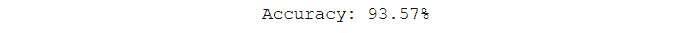

# 第十六章：*第六章*

# 解码图像

## 学习目标

到本章结束时，你将能够：

+   创建能够将图像分类为不同类别的模型

+   使用 Keras 库训练图像的神经网络模型

+   在不同的商业场景中利用图像增强的概念

+   从图像中提取有意义的信息

本章将涵盖如何读取和处理图像的各种概念。

## 介绍

到目前为止，我们只处理过数字和文本。在本章中，我们将学习如何使用机器学习解码图像并提取有意义的信息，比如图像中存在的物体类型或图像中写的数字。你有没有停下来思考过我们的大脑是如何解读它们从眼睛接收到的图像的？经过数百万年的进化，我们的大脑已经变得非常高效和准确，能够从眼睛接收到的图像中识别物体和模式。我们已经能够通过相机复制眼睛的功能，但让计算机识别图像中的模式和物体却是一项非常艰巨的任务。与理解图像中存在的内容相关的领域被称为计算机视觉。计算机视觉领域在过去几年里经历了巨大的研究和进展。卷积神经网络（CNN）和在 GPU 上训练神经网络的能力是其中最重大的突破之一。如今，CNN 被广泛应用于任何计算机视觉问题中，例如自动驾驶汽车、人脸识别、物体检测、物体追踪以及创建完全自主的机器人。在本章中，我们将学习这些 CNN 是如何工作的，并了解它们相比传统方法有哪些显著的改进。

## 图像

我们今天使用的数码相机将图像存储为一个巨大的数字矩阵，这些就是我们所说的数字图像。矩阵中的每个数字代表图像中的一个像素。每个数字代表该像素的颜色强度。对于灰度图像，这些值的范围是 0 到 255，其中 0 是黑色，255 是白色。对于彩色图像，这个矩阵是三维的，每个维度对应红色、绿色和蓝色的值。矩阵中的值代表各自颜色的强度。我们将这些值作为输入，用于我们的计算机视觉程序或数据科学模型，以进行预测和识别。

现在，有两种方法可以让我们使用这些像素来创建机器学习模型：

+   将单独的像素作为不同的输入变量输入神经网络

+   使用卷积神经网络

创建一个将单个像素值作为输入变量的全连接神经网络是目前最简单、最直观的方法，因此我们将从创建这个模型开始。在下一节中，我们将学习 CNN，并了解它们在处理图像时的优势。

### 练习 50：使用全连接神经网络分类 MNIST

在本次练习中，我们将对 **修改后的国家标准与技术研究所数据库**（**MNIST**）数据集进行分类。MNIST 是一个手写数字数据集，已被规范化以适应 28 x 28 像素的边界框。该数据集包含 60,000 张训练图像和 10,000 张测试图像。在完全连接的网络中，我们将单个像素作为特征输入到网络中，然后像训练第一个神经网络一样训练它，就像在 *第五章* *掌握结构化数据* 中训练的第一个神经网络一样。

完成此练习，请执行以下步骤：

1.  加载所需的库，如下所示：

    ```py
    import numpy as np
    import matplotlib.pyplot as plt
    from sklearn.preprocessing import LabelBinarizer
    from keras.datasets import mnist
    from keras.models import Sequential
    from keras.layers import Dense
    ```

1.  使用 Keras 库加载 MNIST 数据集：

    ```py
    (x_train, y_train), (x_test, y_test) = mnist.load_data()
    ```

1.  从数据集的形状，你可以推测数据是以 2D 格式呈现的。第一个元素是可用图像的数量，接下来的两个元素是图像的宽度和高度：

    ```py
    x_train.shape
    ```

    输出结果如下：

    

    ###### 图 6.1：图像的宽度和高度

1.  绘制第一张图像，查看你正在处理的数据类型：

    ```py
    plt.imshow(x_test[0], cmap=plt.get_cmap(‘gray'))
    plt.show()
    ```

    

    ###### 图 6.2：MNIST 数据集的样本图像

1.  将 2D 数据转换为 1D 数据，以便我们的神经网络可以将其作为输入（28 x 28 像素 = 784）：

    ```py
    x_train = x_train.reshape(60000, 784)
    x_test = x_test.reshape(10000, 784)
    ```

1.  将目标变量转换为 one-hot 向量，这样我们的网络就不会在不同的目标变量之间形成不必要的连接：

    ```py
    label_binarizer = LabelBinarizer()
    label_binarizer.fit(range(10))
    y_train = label_binarizer.transform(y_train)
    y_test = label_binarizer.transform(y_test)
    ```

1.  创建模型。建立一个小型的两层网络；你可以尝试其他架构。接下来你将学习更多关于交叉熵损失的内容：

    ```py
    model = Sequential()
    model.add(Dense(units=32, activation='relu', input_dim=784))
    model.add(Dense(units=32, activation='relu'))
    model.add(Dense(units=10, activation='softmax'))
    model.compile(loss='categorical_crossentropy', optimizer='adam', metrics = [‘acc'])
    model.summary()
    ```

    

    ###### 图 6.3：稠密网络的模型架构

1.  训练模型并检查最终准确率：

    ```py
    model.fit(x_train, y_train, validation_data = (x_test, y_test), epochs=40, batch_size=32)
    score = model.evaluate(x_test, y_test)
    print(“Accuracy: {0:.2f}%”.format(score[1]*100))
    ```

    输出结果如下：



###### 图 6.4：模型准确率

恭喜！你现在已经创建了一个能够以 93.57% 的准确率预测图像上的数字的模型。你可以使用以下代码绘制不同的测试图像，并查看网络的结果。更改图像变量的值来获取不同的图像：

```py
image = 6
plt.imshow(x_test[image].reshape(28,28), 
cmap=plt.get_cmap(‘gray'))
plt.show()
y_pred = model.predict(x_test)
print(“Prediction: {0}”.format(np.argmax(y_pred[image])))
```


###### 图 6.5：带有稠密网络预测的 MNIST 图像

你可以仅可视化错误的预测，以了解你的模型在哪些地方失败：

```py
incorrect_indices = np.nonzero(np.argmax(y_pred,axis=1) != np.argmax(y_test,axis=1))[0]
image = 4
plt.imshow(x_test[incorrect_indices[image]].reshape(28,28), 
cmap=plt.get_cmap(‘gray'))
plt.show()
print(“Prediction: {0}”.format(np.argmax(y_pred[incorrect_indices[image]])))
```


###### 图 6.6：稠密网络错误分类的示例

如你在之前的截图中所见，模型失败了，因为我们预测的类别是 2，而正确的类别是 3。

## 卷积神经网络

**卷积神经网络**（**CNN**）是指具有卷积层的神经网络。这些卷积层借助卷积滤波器高效地处理原始图像的高维度。CNN 使我们能够识别图像中的复杂模式，这是简单神经网络无法做到的。CNN 还可以用于自然语言处理。

CNN 的前几层是卷积层，网络在这些层中应用不同的滤波器来寻找图像中的有用模式；接着是池化层，它们有助于下采样卷积层的输出。激活层控制信号从一层流向下一层，模拟我们大脑中的神经元。网络中的最后几层是全连接层；这些层与我们在之前练习中使用的层相同。

### 卷积层

卷积层由多个滤波器组成，它们在看到初始层中的特征、边缘或颜色时会激活，最终能够识别出面孔、蜂窝图案和车轮等。这些滤波器就像我们常用的 Instagram 滤镜一样。滤镜通过以某种方式改变像素来改变图像的外观。以一个检测水平边缘的滤波器为例。


###### 图 6.7：水平边缘检测滤波器

如前面截图所示，滤波器将图像转换成另一幅图像，其中水平线被突出显示。为了得到这种转换，我们将图像的部分区域与滤波器逐一相乘。首先，我们取图像的左上角 3x3 区域，并与滤波器进行矩阵乘法，得到转换后的第一个左上角像素。然后，我们将滤波器向右移动一个像素，得到转换后的第二个像素，依此类推。转换后的图像是一幅只突出显示水平线部分的图像。滤波器参数的值（此处为 9）是卷积层在训练过程中学习的权重或参数。有些滤波器可能学会检测水平线，有些则是垂直线，或者是 45 度角的线。随后的层将学习到更复杂的结构，比如车轮或人脸的模式。

这里列出了一些卷积层的超参数：

+   **滤波器**：这是网络中每层的滤波器数量。这个数字也反映了转换的维度，因为每个滤波器将导致输出的一个维度。

+   **滤波器大小**：这是网络将学习的卷积滤波器的大小。这个超参数将决定输出转换的大小。

+   **步长**：在前述水平边缘示例中，我们每次通过都将滤波器移动一个像素。这就是步长。它指的是滤波器每次通过时移动的量。这个超参数还决定了输出转换的大小。

+   **填充**：这是一个超参数，使网络在图像的所有边缘填充零。在某些情况下，这有助于保留边缘信息，并确保输入和输出的大小相同。

    #### 注意

    如果进行填充，则得到的图像大小与卷积操作的输出相同或更大。如果不进行填充，则图像大小将会减小。

## 池化层

**池化层** 将输入图像的大小减小，以减少网络中的计算量和参数。池化层周期性地插入到卷积层之间，以控制过拟合。最常见的池化变体是 2 x 2 最大池化，步长为 2。此变体通过下采样输入，保留输出中四个像素的最大值。深度维度保持不变。


###### 图 6.8：最大池化操作

在过去，我们也进行过平均池化，但是现在更常见的是使用最大池化，因为在实践中已经证明其效果更好。许多数据科学家不喜欢使用池化层，仅仅是因为池化操作会伴随信息的丢失。关于这个主题已经有一些研究，发现在某些时候，简单的没有池化层的架构能够超越最先进的模型。为了减少输入的大小，建议偶尔在卷积层中使用更大的步长。

#### 注意

研究论文 *Striving for Simplicity: The All Convolutional Net* 评估具有池化层的模型，发现在有足够数据可用时，池化层并不总是能够提高网络的性能。有关更多信息，请阅读 *Striving for Simplicity: The All Convolutional Net* 论文：https://arxiv.org/abs/1412.6806

## Adam 优化器

优化器通过损失函数更新权重。选择错误的优化器或优化器的错误超参数可能会导致在找到问题的最优解时延迟。

Adam 的名称源自自适应矩估计。Adam 是专门设计用于训练深度神经网络的优化器。由于其快速接近最优解的速度，Adam 在数据科学社区中被广泛使用。因此，如果您想要快速收敛，请使用 **Adam 优化器**。但是，Adam 并不总是导致最优解；在这种情况下，带有动量的 SGD 有助于实现最先进的结果。以下是参数：

+   **学习率**：这是优化器的步长。较大的值（0.2）会导致更快的初始学习速度，而较小的值（0.00001）会在训练过程中减慢学习速度。

+   **Beta 1**：这是梯度均值估计的指数衰减率。

+   **Beta 2**：这是梯度的未中心化方差估计的指数衰减率。

+   **Epsilon**：这是一个非常小的数值，用于防止除零错误。

对于深度学习问题，一个好的起始点是学习率 = 0.001，Beta 1 = 0.9，Beta 2 = 0.999，Epsilon = 10^-8。

#### 注意

欲了解更多信息，请阅读 Adam 论文：[`arxiv.org/abs/1412.6980v8`](https://arxiv.org/abs/1412.6980v8)

## 交叉熵损失

**交叉熵损失**用于分类问题中，其中每个类别的输出是介于 0 和 1 之间的概率值。这里的损失随着模型偏离实际值而增加；它遵循一个负对数图形。当模型预测的概率远离实际值时，这种损失尤为有效。例如，如果真实标签的概率是 0.05，我们会给模型一个很大的惩罚损失。另一方面，如果真实标签的概率是 0.40，我们则给予它较小的惩罚损失。


](img/C13322_06_09.jpg)

###### 图 6.9：对数损失与概率的关系图

上面的图表显示，当预测值远离真实标签时，损失会呈指数增长。交叉熵损失遵循的公式如下：


](img/C13322_06_12.jpg)

###### 图 6.10：交叉熵损失公式

*M*是数据集中的类别数（对于 MNIST 来说是 10），*y*是真实标签，*p*是该类别的预测概率。我们偏好使用交叉熵损失来进行分类，因为随着我们接近真实值，权重更新会变得越来越小。交叉熵损失只会惩罚正确类别的概率。

### 练习 51：使用 CNN 对 MNIST 进行分类

在这个练习中，我们将使用 CNN 对**修改后的国家标准与技术研究院（MNIST）**数据集进行分类，而不是像*练习 50*中那样使用全连接层。我们将完整的图像作为输入，得到图像上的数字作为输出：

1.  使用 Keras 库加载 MNIST 数据集：

    ```py
    from keras.datasets import mnist
    (x_train, y_train), (x_test, y_test) = mnist.load_data()
    ```

1.  将二维数据转换为三维数据，第三维只有一层，这是 Keras 要求的输入格式：

    ```py
    x_train = x_train.reshape(-1, 28, 28, 1)
    x_test = x_test.reshape(-1, 28, 28, 1)
    ```

1.  将目标变量转换为一个独热编码向量，这样我们的网络就不会在不同的目标变量之间形成不必要的连接：

    ```py
    from sklearn.preprocessing import LabelBinarizer
    label_binarizer = LabelBinarizer()
    label_binarizer.fit(range(10))
    y_train = label_binarizer.transform(y_train)
    y_test = label_binarizer.transform(y_test)
    ```

1.  创建模型。这里，我们构建了一个小型 CNN。你可以尝试其他架构：

    ```py
    from keras.models import Model, Sequential
    from keras.layers import Dense, Conv2D, MaxPool2D, Flatten
    model = Sequential()
    ```

    添加卷积层：

    ```py
    model.add(Conv2D(32, kernel_size=3, 
    padding=”same”,input_shape=(28, 28, 1),    activation = ‘relu'))
    model.add(Conv2D(32, kernel_size=3, activation = ‘relu'))
    ```

    添加池化层：

    ```py
    model.add(MaxPool2D(pool_size=(2, 2)))
    ```

1.  将二维矩阵展平成一维向量：

    ```py
    model.add(Flatten())
    ```

1.  使用全连接层作为模型的最后几层：

    ```py
    model.add(Dense(128, activation = “relu”))
    model.add(Dense(10, activation = “softmax”))
    model.compile(loss='categorical_crossentropy', optimizer='adam', 
    metrics = [‘acc'])
    model.summary()
    ```

    为了完全理解这一点，请查看模型输出的以下截图：

    

    ](img/C13322_06_10.jpg)

    ###### 图 6.11：CNN 的模型架构

1.  训练模型并检查最终的准确度：

    ```py
    model.fit(x_train, y_train, validation_data = (x_test, y_test), 
    epochs=10, batch_size=1024)
    score = model.evaluate(x_test, y_test)
    print(“Accuracy: {0:.2f}%”.format(score[1]*100))
    ```

    输出如下：


](img/C13322_06_12.jpg)

###### 图 6.12：最终模型准确率

恭喜你！现在你已经创建了一个能够以 98.62% 的准确率预测图像上数字的模型。你可以使用*练习 50*中提供的代码绘制不同的测试图像，并查看你的网络结果。还可以绘制错误预测，看看模型哪里出错：

```py
import numpy as np
import matplotlib.pyplot as plt
incorrect_indices = np.nonzero(np.argmax(y_pred,axis=1) != np.argmax(y_test,axis=1))[0]
image = 4
plt.imshow(x_test[incorrect_indices[image]].reshape(28,28), 
cmap=plt.get_cmap(‘gray'))
plt.show()
print(“Prediction: {0}”.format(np.argmax(y_pred[incorrect_indices[image]])))
```


###### 图 6.13：模型的错误预测；真实标签为 2

如你所见，模型在预测模糊的图像时遇到了困难。你可以尝试调整层和超参数，看看是否能获得更好的准确率。尝试用更高步幅的卷积层替代池化层，正如前面一节中建议的那样。

## 正则化

**正则化**是一种通过修改学习算法帮助机器学习模型更好地泛化的技术。它有助于防止过拟合，并使我们的模型在训练过程中未见过的数据上表现得更好。在本节中，我们将学习可用的不同正则化方法。

### 丢弃层

**丢弃（Dropout）**是一种我们用来防止神经网络模型过拟合的正则化技术。在训练过程中，我们随机忽略网络中的神经元。这样可以防止这些神经元的激活信号继续传播下去，且在反向传播时这些神经元的权重更新不会被应用。神经元的权重被调节来识别特定的特征，而与它们相邻的神经元则变得依赖于这些特征，这可能会导致过拟合，因为这些神经元可能会过于专门化于训练数据。当神经元被随机丢弃时，相邻的神经元会介入并学习这些表示，从而使网络学习到多种不同的表示。这使得网络能更好地进行泛化，并防止模型过拟合。一个需要注意的重要事项是，当你进行预测或测试模型时，不应使用丢弃层。这会使模型失去宝贵的信息，并导致性能下降。Keras 会自动处理这个问题。

在使用丢弃层时，建议创建更大的网络，因为这能为模型提供更多学习的机会。我们通常使用 0.2 到 0.5 之间的丢弃概率。该概率指的是神经元在训练过程中被丢弃的概率。每层之后使用丢弃层通常能得到较好的效果，因此你可以从每层之后放置一个丢弃层，概率设置为 0.2，然后从那里进行微调。

要在 Keras 中创建一个丢弃层（dropout layer），且其概率为 0.5，你可以使用以下函数：

```py
keras.layers.Dropout(0.5)
```


###### 图 6.14：在密集神经网络中可视化丢弃

### L1 和 L2 正则化

**L2** 是最常见的正则化类型，其次是 **L1**。这些正则化器通过向模型的损失中添加一个项来工作，以获得最终的代价函数。这一额外的项会导致模型的权重减少，从而使模型具有良好的泛化能力。

L1 正则化的代价函数如下所示：


](img/C13322_06_15.jpg)

###### 图 6.15：L1 正则化的代价函数

这里，λ 是正则化参数。L1 正则化会导致权重非常接近零。这使得应用 L1 正则化的神经元仅依赖于最重要的输入，并忽略噪声输入。

L2 正则化的代价函数如下所示：


###### 图 6.16：L2 正则化的代价函数

L2 正则化对高权重向量进行重罚，并偏好扩散的权重。L2 正则化也被称为 权重衰减，因为它迫使网络的权重衰减到接近零，但与 L1 正则化不同，L2 正则化并不会完全将权重压缩到零。我们可以将 L1 和 L2 正则化结合使用。要实现这些正则化器，您可以在 Keras 中使用以下函数：

```py
keras.regularizers.l1(0.01)
keras.regularizers.l2(0.01)
keras.regularizers.l1_l2(l1=0.01, l2=0.01)
```

### 批量归一化

在*第一章*，*数据科学与数据预处理简介*中，我们学习了如何进行归一化，以及它如何帮助加速我们机器学习模型的训练。在这里，我们将对神经网络的每一层应用相同的归一化方法。**批量归一化**允许各层独立学习，而不受其他层的影响。它通过将层的输入标准化，使其具有固定的均值和方差来实现这一点；这可以防止前一层的参数变化对当前层的输入产生过大影响。它还有一定的正则化作用；类似于 dropout，它防止过拟合，但它是通过在小批量的值中引入噪声来实现的。在使用批量归一化时，请确保使用较低的 dropout，这样更好，因为 dropout 会导致信息丢失。然而，不要完全依赖批量归一化而去除 dropout，因为两者结合使用效果更好。使用批量归一化时，可以使用较高的学习率，因为它确保了不会有动作过大或过小。


###### 图 6.17：批量归一化方程

这里，(xi) 是层的输入，y 是标准化后的输入。μ 是批量均值，σ2 是批量的标准差。批量归一化引入了两个新的（x_i）̂损失。

要在 Keras 中创建批量归一化层，您可以使用以下函数：

```py
keras.layers.BatchNormalization()
```

### 练习 52：使用正则化改进图像分类，使用 CIFAR-10 图像

在本次练习中，我们将对加拿大高级研究院（CIFAR-10）数据集进行分类。该数据集包含 60,000 张 32 x 32 的彩色图像，分为 10 类。这 10 类分别是：鸟类、飞机、猫、汽车、青蛙、鹿、狗、卡车、船和马。它是机器学习研究中最广泛使用的数据集之一，主要用于卷积神经网络（CNN）领域。由于图像的分辨率较低，模型可以在这些图像上更快速地训练。我们将使用该数据集实现我们在上一节中学到的一些正则化技术：

#### 注

若要获取原始 CIFAR-10 文件和 CIFAR-100 数据集，请访问 https://www.cs.toronto.edu/~kriz/cifar.html。

1.  使用 Keras 库加载 CIFAR-10 数据集：

    ```py
    from keras.layers import Dense, Conv2D, MaxPool2D, Flatten, Dropout, BatchNormalization
    from keras.datasets import cifar10
    (x_train, y_train), (x_test, y_test) = cifar10.load_data()
    ```

1.  检查数据的维度：

    ```py
    x_train.shape
    ```

    输出结果如下：

    

    ###### 图 6.18：x 的维度

    相似的维度，针对 `y`：

    ```py
    y_train.shape
    ```

    输出结果如下：

    

    ###### 图 6.19：y 的维度

    由于这些是彩色图像，它们有三个通道。

1.  将数据转换为 Keras 所需的格式：

    ```py
    x_train = x_train.reshape(-1, 32, 32, 3)
    x_test = x_test.reshape(-1, 32, 32, 3)
    ```

1.  将目标变量转换为 one-hot 向量，以确保网络在不同的目标变量之间不会形成不必要的连接：

    ```py
    from sklearn.preprocessing import LabelBinarizer
    label_binarizer = LabelBinarizer()
    label_binarizer.fit(range(10))
    y_train = label_binarizer.transform(y_train)
    y_test = label_binarizer.transform(y_test)
    ```

1.  创建模型。在这里，我们首先创建一个不带正则化的小型 CNN：

    ```py
    from keras.models import Sequential
    model = Sequential()
    ```

    添加卷积层：

    ```py
    model.add(Conv2D(32, (3, 3), activation='relu', padding='same', input_shape=(32,32,3)))    
    model.add(Conv2D(32, (3, 3), activation='relu'))
    ```

    添加池化层：

    ```py
    model.add(MaxPool2D(pool_size=(2, 2)))
    ```

1.  将 2D 矩阵展平为 1D 向量：

    ```py
    model.add(Flatten())
    ```

1.  使用密集层作为模型的最终层并编译模型：

    ```py
    model.add(Dense(512, activation='relu'))
    model.add(Dense(10, activation='softmax'))
    model.compile(loss='categorical_crossentropy', optimizer='adam', 
    metrics = [‘acc'])
    ```

1.  训练模型并检查最终准确度：

    ```py
    model.fit(x_train, y_train, validation_data = (x_test, y_test), 
    epochs=10, batch_size=512)
    ```

1.  现在检查模型的准确度：

    ```py
    score = model.evaluate(x_test, y_test)
    print(“Accuracy: {0:.2f}%”.format(score[1]*100))
    ```

    输出结果如下：

    

    ###### 图 6.20：模型的准确度

1.  现在创建相同的模型，但加入正则化。你也可以尝试其他架构：

    ```py
    model = Sequential()
    ```

    添加卷积层：

    ```py
    model.add(Conv2D(32, (3, 3), activation='relu', padding='same', input_shape=(32,32,3)))    
    model.add(Conv2D(32, (3, 3), activation='relu'))   
    ```

    添加池化层：

    ```py
    model.add(MaxPool2D(pool_size=(2, 2)))
    ```

1.  添加批量归一化层和 Dropout 层：

    ```py
    model.add(BatchNormalization())
    model.add(Dropout(0.10))
    ```

1.  将 2D 矩阵展平为 1D 向量：

    ```py
    model.add(Flatten())
    ```

1.  使用密集层作为模型的最终层并编译模型：

    ```py
    model.add(Dense(512, activation='relu'))
    model.add(Dropout(0.5))
    model.add(Dense(10, activation='softmax'))
    model.compile(loss='categorical_crossentropy', optimizer='adam', 
    metrics = [‘acc'])
    model.summary()
    ```

    

    ###### 图 6.21：带正则化的 CNN 架构

1.  训练模型并检查最终准确度：

    ```py
    model.fit(x_train, y_train, validation_data = (x_test, y_test), 
    epochs=10, batch_size=512)
    score = model.evaluate(x_test, y_test)
    print(“Accuracy: {0:.2f}%”.format(score[1]*100))
    ```

    输出结果如下：


###### 图 6.22：最终准确度输出

恭喜！你通过使用正则化使得模型比以前表现得更好。如果你的模型没有看到改善，尝试将训练时间延长，增加更多的训练轮数。你也会发现，可以训练更多的轮次而不必担心过拟合。

你可以绘制不同的测试图像，并使用*练习 50* 中给出的代码查看网络的结果。同时，绘制错误预测，看看模型哪里出错：

```py
import numpy as np
import matplotlib.pyplot as plt
y_pred = model.predict(x_test)
incorrect_indices = np.nonzero(np.argmax(y_pred,axis=1) != np.argmax(y_test,axis=1))[0]
labels = [‘airplane', ‘automobile', ‘bird', ‘cat', ‘deer', ‘dog', ‘frog', ‘horse', ‘ship', ‘truck']
image = 3
plt.imshow(x_test[incorrect_indices[image]].reshape(32,32,3))
plt.show()
print(“Prediction: {0}”.format(labels[np.argmax(y_pred[incorrect_indices[image]])]))
```


###### 图 6.23：模型的错误预测

如你所见，模型在预测模糊图像时遇到了困难。真实标签是*马*。你可以尝试调整层和超参数，看看是否能提高准确率。尝试创建更复杂的模型并进行正则化，训练更长时间。

## 图像数据预处理

本节将介绍数据科学家可以用来预处理图像的一些技术。首先，我们将介绍图像归一化，然后学习如何将彩色图像转换为灰度图像。最后，我们将探讨如何将数据集中的所有图像调整为相同尺寸。预处理图像是必要的，因为数据集中的图像大小不同，我们需要将它们转换为标准大小，以便在其上训练机器学习模型。一些图像预处理技术通过简化模型识别重要特征或通过减少维度（如灰度图像的情况）来帮助减少模型的训练时间。

### 归一化

对于图像而言，像素的规模在同一量级，范围是 0 到 255。因此，这一步归一化是可选的，但它可能有助于加速学习过程。再重申一下，数据中心化并将其缩放到相同的量级，有助于确保梯度不会失控。神经网络共享参数（神经元）。如果输入数据没有缩放到相同的量级，那么网络学习将变得困难。

### 转换为灰度图像

根据数据集和问题的不同，你可以将图像从 RGB 转换为灰度图像。这有助于网络更快地工作，因为它需要学习的参数要少得多。根据问题类型，你可能不希望这样做，因为这会导致丢失图像颜色所提供的信息。要将 RGB 图像转换为灰度图像，可以使用**Pillow**库：

```py
from PIL import Image
image = Image.open(‘rgb.png').convert(‘LA')
image.save(‘greyscale.png')
```


###### 图 6.24：转换为灰度的汽车图像

### 将所有图像调整为相同大小

在处理现实生活中的数据集时，你会经常遇到一个主要的挑战，那就是数据集中的所有图像大小可能不相同。你可以根据情况执行以下步骤来解决这个问题：

+   `resize`函数是用于获取调整大小后新像素的算法。双三次插值算法速度较快，是上采样时最好的像素重采样算法之一。


###### 图 6.25：上采样的汽车图像

+   `resize`函数是用于获取调整大小后新像素的算法，如前所述。抗锯齿算法有助于平滑像素化的图像。它比双三次插值算法效果更好，但速度较慢。抗锯齿是最适合下采样的像素重采样算法之一。


###### 图 6.26：下采样的汽车图像

+   **裁剪**：将所有图像裁剪为相同大小的另一种方法是裁剪它们。如前所述，可以使用不同的中心来防止信息丢失。你可以使用以下代码裁剪图像：

    ```py
    area = (1000, 500, 2500, 2000)
    cropped_img = img.crop(area)
    ```


###### 图 6.27：裁剪后的汽车图像

+   **填充**：填充是指在图像周围添加一层零或一的边界，以增加图像的大小。执行填充时，请使用以下代码：

    ```py
    size = (2000,2000)
    back = Image.new(“RGB”, size, “white”)
    offset = (250, 250)
    back.paste(cropped_img, offset)
    ```


###### 图 6.28：裁剪后的填充汽车图像

### 其他有用的图像操作

**Pillow** 库提供了许多用于修改和创建新图像的功能。这些功能将帮助我们从现有的训练数据中创建新图像。

要翻转图像，可以使用以下代码：

```py
img.transpose(Image.FLIP_LEFT_RIGHT)
```


###### 图 6.29：翻转后的裁剪汽车图像

要将图像旋转 45 度，可以使用以下代码：

```py
img.rotate(45)
```


###### 图 6.30：旋转 45 度后的裁剪汽车图像

要将图像平移 1,000 像素，可以使用以下代码：

```py
import PIL
width, height = img.size
image = PIL.ImageChops.offset(img, 1000, 0)
image.paste((0), (0, 0, 1000, height))
```


###### 图 6.31：旋转后的裁剪汽车图像

### 活动 17：预测图像是猫还是狗

在本活动中，我们将尝试预测提供的图像是猫还是狗。微软提供的猫狗数据集（https://github.com/TrainingByPackt/Data-Science-with-Python/tree/master/Chapter06）包含了 25,000 张猫和狗的彩色图像。假设你在一家兽医诊所工作，诊所里有两位兽医，一位专门治疗狗，另一位专门治疗猫。你希望通过判断下一位客户是狗还是猫，来自动安排兽医的预约。为此，你创建了一个 CNN 模型：

1.  加载狗与猫数据集并预处理图像。

1.  使用图像文件名找到每个图像的猫或狗标签。第一张图像应该是这样的：

    ###### 图 6.32：狗与猫类别的第一张图像

1.  获取形状正确的图像以进行训练。

1.  创建一个使用正则化的 CNN。

    #### 注意

    本活动的解决方案可以在第 369 页找到。

你应该发现该模型的测试集准确率为 70.4%。训练集准确率非常高，约为 96%。这意味着模型已经开始出现过拟合。改进模型以获得最佳准确率的任务留给你作为练习。你可以使用前面练习中的代码绘制错误预测的图像，从而了解模型的表现：

```py
import matplotlib.pyplot as plt
y_pred = model.predict(x_test)
incorrect_indices = np.nonzero(np.argmax(y_pred,axis=1) != np.argmax(y_test,axis=1))[0]
labels = [‘dog', ‘cat']
image = 5
plt.imshow(x_test[incorrect_indices[image]].reshape(50,50),  cmap=plt.get_cmap(‘gray'))
plt.show()
print(“Prediction: {0}”.format(labels[np.argmax(y_pred[incorrect_indices[image]])]))
```


###### 图 6.33：常规 CNN 模型错误地预测为狗

## 数据增强

在训练机器学习模型时，我们数据科学家经常遇到类别不平衡和训练数据不足的问题。这导致模型性能不佳，在实际应用中表现差强人意。应对这些问题的一种简单方法是数据增强。数据增强有多种方式，例如旋转图像、平移物体、裁剪图像、剪切扭曲图像、放大图像的某部分，以及更复杂的方法，如使用生成对抗网络（GANs）生成新图像。GAN 只是两个相互竞争的神经网络。生成器网络试图生成与已有图像相似的图像，而判别器网络则尝试判断图像是生成的还是原始数据的一部分。训练完成后，生成器网络能够创造出并非原始数据的一部分，但与真实拍摄的图像相似，几乎可以误认为是摄像机拍摄的图像。

#### 注意

你可以在这篇论文中了解更多关于 GAN 的信息：https://arxiv.org/abs/1406.2661。


###### 图 6.34：左侧是一个由生成对抗网络（GAN）生成的假图像，而右侧是一个真实人物的图像

#### 注意

来源：http://www.whichfaceisreal.com

回到传统的图像增强方法，我们执行之前提到的操作，如翻转图像，然后在原始图像和变换后的图像上训练我们的模型。假设我们有以下左侧的翻转猫图像：


###### 图 6.35：右侧是猫的正常图像，左侧是翻转后的图像

现在，一个在左侧图像上训练的机器学习模型可能会很难将右侧翻转后的图像识别为猫的图像，因为它朝向相反。这是因为卷积层被训练成只检测朝左看的猫图像。它已经对身体的不同特征位置建立了规则。

因此，我们在所有增强后的图像上训练我们的模型。数据增强是获得 CNN 模型最佳结果的关键。我们利用 Keras 中的`ImageDataGenerator`类轻松执行图像增强。你将在下一节中了解更多关于生成器的内容。

## 生成器

在上一章中，我们讨论了大数据集如何由于 RAM 的限制而导致训练问题。当处理图像时，这个问题会更严重。Keras 实现了生成器，帮助我们在训练时动态获取输入图像及其相应标签。这些生成器还帮助我们在训练前对图像进行数据增强。首先，我们将看看如何利用`ImageDataGenerator`类为我们的模型生成增强后的图像。

为了实现数据增强，我们只需要稍微修改我们的*练习 3* 代码。我们将用以下代码替代`model.fit()`：

```py
BATCH_SIZE = 32
aug = ImageDataGenerator(rotation_range=20, 
width_shift_range=0.2, height_shift_range=0.2, 
shear_range=0.15, zoom_range=0.15,
horizontal_flip=True, vertical_flip=True, 
fill_mode=”nearest”)

log = model.fit_generator(
aug.flow(x_train, y_train, batch_size= BATCH_SIZE),
validation_data=( x_test, y_test), steps_per_epoch=len(x_train) // BATCH_SIZE, epochs=10)
```

现在我们来看一下`ImageDataGenerator`实际在做什么：

+   `rotation_range`：此参数定义图像可以旋转的最大角度。旋转是随机的，可以小于该值的任何数值。这确保了没有两张图像是相同的。

+   `width_shift_range`/`height_shift_range`：该值定义了图像可以移动的范围。如果值小于 1，则认为它是总宽度的一个比例；如果大于 1，则表示像素数。范围将在（`-shift_range`，`+ shift_range`）区间内。

+   `shear_range`：这是剪切角度，单位为度（逆时针方向）。

+   `zoom_range`：这里的值可以是[`lower_range`, `upper_range`]，或者是浮动值，表示[`1-zoom_range`, `1+zoom_range`]，这是随机缩放的范围。

+   `horizontal_flip` / `vertical_flip`：此处的布尔值为真时，生成器会随机水平或垂直翻转图像。

+   `fill_mode`：这帮助我们决定在旋转和剪切过程中产生的空白区域应填充什么内容。

    `constant`：此选项将用常数值填充空白区域，常数值需要通过`cval`参数定义。

    `nearest`：这会用最近的像素填充空白区域。

    `reflect`：这会产生反射效果，就像镜子一样。

    `wrap`：这会使图像环绕并填充空白区域。

生成器会随机应用前述操作到它遇到的所有图像上。这确保了模型不会看到相同的图像两次，从而减轻过拟合问题。在使用生成器时，我们需要使用`fit_generator()`函数，而不是`fit()`函数。我们根据训练时可用的内存大小，向生成器传递合适的批处理大小。

默认的 Keras 生成器有一些内存开销；为了去除这些开销，你可以创建自己的生成器。为此，你需要确保实现生成器的以下四个部分：

1.  读取输入图像（或任何其他数据）。

1.  读取或生成标签。

1.  对图像进行预处理或增强。

    #### 注意

    确保随机增强图像。

1.  以 Keras 所期望的形式生成输出。

这里提供了一个示例代码，帮助你创建自己的生成器：

```py
def custom_image_generator(images, labels, batch_size = 128):    
    while True:
          # Randomly select images for the batch           batch_images = np.random.choice(images, 
                                     size = batch_size)          batch_input = []          batch_output = []           
          # Read image, perform preprocessing and get labels
          for image in batch_images:
               # Function that reads and returns the image
              input = get_input(image)
              # Function that gets the label of the image
                output = get_output(image,labels =labels)
              # Function that pre-processes and augments the image
                input = preprocess_image(input)
              batch_input += [input]              batch_output += [output]

          batch_x = np.array( batch_input )          batch_y = np.array( batch_output )          
            # Return a tuple of (images,labels) to feed the network           yield(batch_x, batch_y)
```

实现 `get_input`、`get_output` 和 `preprocess_image` 被留作练习。

### 练习 53：使用图像增强对 CIFAR-10 图像进行分类

在本练习中，我们将对 CIFAR-10（加拿大高级研究院）数据集进行分类，类似于*练习 52*。在这里，我们将使用生成器来增强训练数据。我们将随机旋转、平移和翻转图像：

1.  使用 Keras 库加载 CIFAR-10 数据集：

    ```py
    from keras.datasets import cifar10
    (x_train, y_train), (x_test, y_test) = cifar10.load_data()
    ```

1.  将数据转换为 Keras 所需的格式：

    ```py
    x_train = x_train.reshape(-1, 32, 32, 3)
    x_test = x_test.reshape(-1, 32, 32, 3)
    ```

1.  将目标变量转换为 one-hot 向量，以便我们的网络不会在不同的目标变量之间形成不必要的连接：

    ```py
    from sklearn.preprocessing import LabelBinarizer
    label_binarizer = LabelBinarizer()
    label_binarizer.fit(range(10))
    y_train = label_binarizer.transform(y_train)
    y_test = label_binarizer.transform(y_test)
    ```

1.  创建模型。我们将使用*练习 3*中的网络：

    ```py
    from keras.models import Sequential
    model = Sequential()
    ```

    添加卷积层：

    ```py
    from keras.layers import Dense, Dropout, Conv2D, MaxPool2D, Flatten, BatchNormalization
    model.add(Conv2D(32, (3, 3), activation='relu', padding='same', input_shape=(32,32,3)))
    model.add(Conv2D(32, (3, 3), activation='relu'))
    ```

    添加池化层：

    ```py
    model.add(MaxPool2D(pool_size=(2, 2)))
    ```

    添加批归一化层，并附加一个丢弃层：

    ```py
    model.add(BatchNormalization())
    model.add(Dropout(0.10))
    ```

1.  将 2D 矩阵展平为 1D 向量：

    ```py
    model.add(Flatten())
    ```

1.  使用全连接层作为模型的最后一层：

    ```py
    model.add(Dense(512, activation='relu'))
    model.add(Dropout(0.5))
    model.add(Dense(10, activation='softmax'))
    ```

1.  使用以下代码编译模型：

    ```py
    model.compile(loss='categorical_crossentropy', optimizer='adam', 
    metrics = [‘acc'])
    ```

1.  创建数据生成器并传递所需的增强方式：

    ```py
    from keras.preprocessing.image import ImageDataGenerator
    datagen = ImageDataGenerator(
        rotation_range=45,
        width_shift_range=0.2,  
        height_shift_range=0.2,  
        horizontal_flip=True)
    ```

1.  训练模型：

    ```py
    BATCH_SIZE = 128
    model_details = model.flow(datagen.flow(x_train, y_train, batch_size = BATCH_SIZE),
                        steps_per_epoch = len(x_train) // BATCH_SIZE, 
                        epochs = 10, 
                        validation_data= (x_test, y_test),
                        verbose=1)
    ```

1.  检查模型的最终准确度：

    ```py
    score = model.evaluate(x_test, y_test)
    print(“Accuracy: {0:.2f}%”.format(score[1]*100))
    ```

    输出如下所示：


###### 图 6.36：模型准确度输出

恭喜！你已经使用数据增强让你的模型识别更广泛的图像。你一定注意到模型的准确率下降了。这是因为我们训练模型的 epochs 数量较少。使用数据增强的模型需要更多的 epochs 来训练。你还会看到，即使训练更多 epochs 也不用担心过拟合。这是因为每个 epoch，模型看到的数据都是新图像，数据集中的图像很少重复，甚至几乎不重复。如果你训练更多 epochs，一定会看到进展。试着尝试更多的架构和增强方式。

这里你可以看到一个错误分类的图像。通过检查错误识别的图像，你可以评估模型的表现，并找出其表现不佳的地方。

```py
y_pred = model.predict(x_test)
incorrect_indices = np.nonzero(np.argmax(y_pred,axis=1) != np.argmax(y_test,axis=1))[0]
labels = ['airplane', 'automobile', 'bird', 'cat', 'deer', 'dog', 'frog', 'horse', 'ship', 'truck']
image = 2
plt.imshow(x_test[incorrect_indices[image]].reshape(32,32,3))
plt.show()
print("Prediction: {0}".format(labels[np.argmax(y_pred[incorrect_indices[image]])]))
```

请查看以下截图以检查错误预测：


###### 图 6.37：基于增强数据训练的 CNN 模型的错误预测

### 活动 18：识别和增强图像

在本活动中，我们将尝试预测图像是猫还是狗，类似于*活动 17*。不过这次我们将使用生成器来处理图像，并对它们进行数据增强，以获得更好的结果：

1.  创建函数以获取每个图像和每个图像标签。然后，创建一个函数来预处理加载的图像并对其进行增强。最后，创建一个数据生成器（如**生成器**部分所示），利用上述函数在训练期间将数据传递给 Keras。

1.  加载未增强的测试数据集。使用*活动 17*中的函数。

1.  创建一个 CNN 模型，用于识别给定的图像是猫还是狗。确保使用正则化。

    #### 注意

    本活动的解决方案可以在第 373 页找到。

你应该会发现该模型的测试集准确度大约为 72%，相比*活动 17*中的模型有所提升。你还会观察到训练集的准确度非常高，约为 98%。这意味着该模型开始出现过拟合，就像*活动 17*中的模型一样。这可能是由于数据增强不足造成的。尝试更改数据增强参数，看看准确度是否有所变化。或者，你可以修改神经网络的架构，以获得更好的结果。你可以绘制出错误预测的图像，了解模型的表现如何。

```py
import matplotlib.pyplot as plt
y_pred = model.predict(validation_data[0])
incorrect_indices = np.nonzero(np.argmax(y_pred,axis=1) != np.argmax(validation_data[1],axis=1))[0]
labels = ['dog', 'cat']
image = 7
plt.imshow(validation_data[0][incorrect_indices[image]].reshape(50,50), cmap=plt.get_cmap('gray'))
plt.show()
print("Prediction: {0}".format(labels[np.argmax(y_pred[incorrect_indices[image]])]))
```

下图展示了一个例子：


###### 图 6.38：数据增强 CNN 模型错误预测为猫

## 总结

本章中，我们学习了数字图像是什么以及如何使用它们创建机器学习模型。然后，我们讲解了如何使用 Keras 库训练图像的神经网络模型。我们还介绍了什么是正则化，如何在神经网络中使用正则化，什么是图像增强，以及如何使用它。我们探讨了 CNN 是什么以及如何实现 CNN。最后，我们讨论了各种图像预处理技术。

现在你已经完成了本章内容，你将能够处理任何类型的数据来创建机器学习模型。在下一章中，我们将学习如何处理人类语言。
