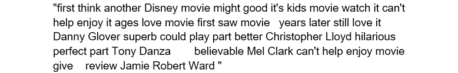

# 第十七章：*第七章*

# 处理人类语言

## 学习目标

到本章结束时，您将能够：

+   为文本数据创建机器学习模型

+   使用 NLTK 库对文本进行预处理

+   使用正则表达式清洗和分析字符串

+   使用 Word2Vec 模型创建词向量

本章将介绍处理人类语言的相关概念。

## 介绍

人工智能（AI）最重要的目标之一是理解人类语言，以执行任务。拼写检查、情感分析、问答、聊天机器人和虚拟助手（如 Siri 和 Google 助手）都具有自然语言处理（NLP）模块。NLP 模块使虚拟助手能够处理人类语言并根据语言执行相应的操作。例如，当我们说“OK Google，设定一个早上 7 点的闹钟”时，语音首先被转换为文本，然后由 NLP 模块处理。处理完毕后，虚拟助手会调用闹钟/时钟应用程序的适当 API。处理人类语言有其自身的挑战，因为语言具有歧义性，词汇的意义取决于其所处的上下文。这是 AI 语言处理中的最大痛点。

另一个重要原因是完整信息的缺乏。在交流时，我们往往省略大部分信息；这些信息通常是常识，或者是普遍真实或错误的事情。例如，句子“I saw a man on a hill with a telescope”根据上下文信息的不同，可以有不同的含义。例如，它可能意味着“我看到一个手持望远镜的男人站在山上”，也可能意味着“我通过望远镜看到一个站在山上的男人”。计算机很难跟踪这些信息，因为大部分是上下文性的。由于深度学习的进步，今天的自然语言处理（NLP）比我们以前使用传统方法（如聚类和线性模型）时更为有效。这也是我们将使用深度学习来处理文本语料库解决 NLP 问题的原因。像其他任何机器学习问题一样，NLP 也有两个主要部分：数据处理和模型创建。在接下来的内容中，我们将学习如何处理文本数据，随后我们将学习如何使用这些处理过的数据来创建机器学习模型，以解决我们的实际问题。

## 文本数据处理

在我们开始为文本数据构建机器学习模型之前，我们需要对数据进行处理。首先，我们将学习不同的方法来理解数据的组成。这有助于我们了解数据的真正内容，并决定下一步要使用的预处理技术。接下来，我们将学习有助于预处理数据的技术。这一步有助于减少数据的大小，从而缩短训练时间，并帮助我们将数据转换为机器学习算法更易于提取信息的形式。最后，我们将学习如何将文本数据转换为数字，以便机器学习算法可以实际使用这些数据来创建模型。我们通过词嵌入来实现这一点，就像我们在*第五章*：“*掌握结构化数据*”中进行的实体嵌入一样。

### 正则表达式

在我们开始处理文本数据之前，我们需要了解正则表达式（RegEx）。正则表达式并不真正属于预处理技术，而是一串定义字符串中搜索模式的字符。正则表达式是处理文本数据时的强大工具，它帮助我们在文本集合中查找特定的序列。正则表达式由元字符和普通字符组成。


###### 图 7.1：包含在正则表达式中使用的元字符的表格，以及一些示例

使用正则表达式，我们可以在文本中搜索复杂的模式。例如，我们可以用它来从文本中删除 URL。我们可以使用 Python 的`re`模块删除 URL，如下所示：

```py
re.sub(r"https?\://\S+\s", '', "https://www.asfd.com hello world")
```

`re.sub`接受三个参数：第一个是正则表达式，第二个是你想要替换匹配模式的表达式，第三个是它应该搜索该模式的文本。

命令的输出如下：


###### 图 7.2：输出命令

#### 注意

记住所有正则表达式的约定很困难，因此在使用正则表达式时，参考备忘单是个不错的选择，例如： (http://www.pyregex.com/)。

### 练习 54：使用正则表达式进行字符串清理

在这个练习中，我们将使用 Python 的`re`模块来修改和分析字符串。在本练习中，我们将简单地学习如何使用正则表达式，接下来的部分我们将展示如何使用正则表达式来预处理数据。我们将使用 IMDB 电影评论数据集中的一条评论（https://github.com/TrainingByPackt/Data-Science-with-Python/tree/master/Chapter07），稍后我们将在本章中利用它来创建情感分析模型。该数据集已经经过处理，一些单词已被删除。处理预构建数据集时，通常会出现这种情况，因此在开始工作之前，了解你所使用的数据集是非常重要的。

1.  在这个练习中，我们将使用来自 IMDB 的电影评论。将评论文本保存到一个变量中，如以下代码所示。你也可以使用任何其他段落的文本进行这个练习：

    ```py
    string = "first think another Disney movie, might good, it's kids 	movie. watch it, can't help enjoy it. ages love movie. first saw movie 10 8 years later still love it! Danny Glover superb could play part better. Christopher Lloyd hilarious perfect part. Tony Danza believable Mel Clark. can't help, enjoy movie! give 10/10!<br /><br />- review Jamie Robert Ward (http://www.invocus.net)"
    ```

1.  计算评论的长度，以确定我们需要减少多大的大小。我们将使用`len(string)`并获得输出，如以下代码所示：

    ```py
    len(string)
    ```

    输出长度如下：

    

    ###### 图 7.3：字符串长度

1.  有时，当你从网站抓取数据时，超链接也会被记录下来。大多数情况下，超链接不会为我们提供任何有用信息。通过使用复杂的正则表达式字符串（如"`https?\://\S+`"），删除数据中的任何超链接。这将选择任何包含`https://`的子字符串：

    ```py
    import re
    string = re.sub(r"https?\://\S+", '', string)
    string
    ```

    去除超链接后的字符串如下：

    

    ###### 图 7.4：去除超链接后的字符串

1.  接下来，我们将从文本中删除`br` HTML 标签，这些标签是我们在读取字符串时观察到的。有时，这些 HTML 标签会被添加到抓取的数据中：

    ```py
    string = re.sub(r'<br />', ' ', string)
    string
    ```

    去除`br`标签后的字符串如下：

    

    ###### 图 7.5：去除 br 标签后的字符串

1.  现在，我们将从文本中删除所有数字。当数字对我们没有意义时，这有助于减少数据集的大小：

    ```py
    string = re.sub('\d','', string)
    string
    ```

    去除数字后的字符串如下所示：

    

    ###### 图 7.6：去除数字后的字符串

1.  接下来，我们将删除所有特殊字符和标点符号。根据你的问题，这些可能只是占用空间，且不会为机器学习算法提供相关信息。所以，我们使用以下正则表达式模式将它们移除：

    ```py
    string = re.sub(r'[_"\-;%()|+&=*%.,!?:#$@\[\]/]', '', string)
    string
    ```

    去除特殊字符和标点符号后的字符串如下所示：

    

    ###### 图 7.7：没有特殊字符的字符串

1.  现在，我们将把`can't`替换为`cannot`，并将`it's`替换为`it is`。这有助于减少训练时间，因为唯一单词的数量减少了：

    ```py
    string = re.sub(r"can\'t", "cannot", string)
    string = re.sub(r"it\'s", "it is", string)
    string
    ```

    最终的字符串如下：

    

    ###### 图 7.8：最终字符串

1.  最后，我们将计算清理后字符串的长度：

    ```py
    len(string)
    ```

    字符串的输出大小如下：

    

    ###### 图 7.9：清理后的字符串长度

    我们将评论的大小减少了 14%。

1.  现在，我们将使用正则表达式分析数据，并获取所有以大写字母开头的单词：

    #### 注意

    ```py
    re.findall(r"[A-Z][a-z]*", string)
    ```

    单词如下：

    

    ###### 图 7.10：以大写字母开头的单词

1.  要在文本中查找所有一字母和二字母的单词，请使用以下方法：

    ```py
    re.findall(r"\b[A-z]{1,2}\b", string)
    ```

    输出如下：


###### 图 7.11：一字母和二字母单词

恭喜你！你已经成功使用 `re` 模块和正则表达式修改并分析了评论字符串。

### 基本特征提取

基本特征提取帮助我们了解数据的组成。这有助于我们选择进行数据预处理的步骤。基本特征提取包括计算平均词数和特殊字符计数等操作。我们将在本节中使用 IMDB 电影评论数据集作为示例：

```py
data = pd.read_csv('movie_reviews.csv', encoding='latin-1')
```

让我们看看数据集包含了什么：

```py
data.iloc[0]
```

输出如下：


###### 图 7.12：SentimentText 数据

`SentimentText` 变量包含实际评论，`Sentiment` 变量包含评论的情绪。`1` 表示正面情绪，`0` 表示负面情绪。让我们打印出第一条评论，以便了解我们处理的数据：

```py
data.SentimentText[0]
```

第一条评论如下：


###### 图 7.13：第一条评论

现在，我们将尝试通过获取数据集的关键统计数据来了解我们正在处理的数据类型。

**词数**

我们可以使用以下代码获取每条评论中的词数：

```py
data['word_count'] = data['SentimentText'].apply(lambda x: len(str(x).split(" ")))
```

现在，DataFrame 中的 `word_count` 变量包含评论中的总词数。`apply` 函数会将 `split` 函数逐行应用于数据集。现在，我们可以获取每一类评论的平均词数，看看正面评论是否比负面评论有更多的词汇。

`mean()` 函数计算 pandas 中某列的平均值。对于负面评论，使用以下代码：

```py
data.loc[data.Sentiment == 0, 'word_count'].mean()
```

负面情绪的平均词数如下：


###### 图 7.14：负面情绪的总词数

对于正面评论，使用以下代码：

```py
data.loc[data.Sentiment == 1, 'word_count'].mean()
```

正面情绪的平均词数如下：


###### 图 7.15：正面情绪的总词数

我们可以看到，正负情绪的平均词数差异不大。

**停用词**

停用词是语言中最常见的词汇——例如，“I”、“me”、“my”、“yours”和“the”。大多数时候，这些词汇不会提供句子的实际信息，因此我们将它们从数据集中移除，以减少数据的大小。`nltk` 库提供了一个可以访问的英文停用词列表。

```py
from nltk.corpus import stopwords
stop = stopwords.words('english')
```

为了获取这些停用词的计数，我们可以使用以下代码：

```py
data['stop_count'] = data['SentimentText'].apply(lambda x: len([x for x in x.split() if x in stop]))
```

然后，我们可以使用以下代码查看每个类别的平均停用词数量：

```py
data.loc[data.Sentiment == 0, 'stop_count'].mean()
```

负面情绪的平均停用词数量如下：


###### 图 7.16：负面情绪的平均停用词数

现在，为了获取正面情绪的停用词数量，我们使用以下代码：

```py
data.loc[data.Sentiment == 1, 'stop_count'].mean()
```

这里显示的是正面情感的停用词平均数量：


###### 图 7.17：正面情感的停用词平均数量

**特殊字符数量**

根据你处理的问题类型，你可能需要保留诸如 `@`、`#`、`$` 和 `*` 等特殊字符，或者将它们移除。要做到这一点，你首先需要弄清楚数据集中出现了多少特殊字符。要获取数据集中 `^`、`&`、`*`、`$`、`@` 和 `#` 的数量，可以使用以下代码：

```py
data['special_count'] = data['SentimentText'].apply(lambda x: len(re.sub('[^\^&*$@#]+' ,'', x)))
```

### 文本预处理

现在我们已经知道了数据的组成部分，我们需要对其进行预处理，以便机器学习算法能够轻松地在文本中找到模式。在本节中，我们将介绍一些用于清理和减少我们输入机器学习算法的数据维度的技术。

**小写化**

我们执行的第一个预处理步骤是将所有数据转换为小写字母。这可以防止出现同一个词的多个副本。你可以使用以下代码轻松将所有文本转换为小写：

```py
data['SentimentText'] = data['SentimentText'].apply(lambda x: " ".join(x.lower() for x in x.split()))
```

apply 函数会将 `lower` 函数迭代地应用于数据集的每一行。

**停用词移除**

如前所述，停用词应从数据集中移除，因为它们提供的信息非常有限。停用词不会影响句子的情感。我们执行此步骤是为了去除停用词可能引入的偏差：

```py
data['SentimentText'] = data['SentimentText'].apply(lambda x: " ".join(x for x in x.split() if x not in stop))
```

**常见词移除**

停用词是一些常见的词汇，如 'a'、'an' 和 'the'。然而，在这一步，你将移除数据集中最常见的词。例如，可以从推文数据集中移除的词包括 `RT`、`@username` 和 `DM`。首先，找出最常见的词汇：

```py
word_freq = pd.Series(' '.join(data['SentimentText']).split()).value_counts()
word_freq.head()
```

最常见的词汇是：


###### 图 7.18：推文数据集中最常见的词汇

从输出结果中，我们得到一个提示：文本包含 HTML 标签，这些标签可以去除，从而大大减少数据集的大小。因此，我们首先去除所有 `<br />` HTML 标签，然后去除诸如 'movie' 和 'film' 这样的词，这些词对情感分析器的影响不大：

```py
data['SentimentText'] = data['SentimentText'].str.replace(r'<br />','')
data['SentimentText'] = data['SentimentText'].apply(lambda x: " ".join(x for x in x.split() if x not in ['movie', 'film']))
```

**标点符号和特殊字符移除**

接下来，我们从文本中移除所有标点符号和特殊字符，因为它们对文本提供的信息很少。要移除标点符号和特殊字符，可以使用以下正则表达式：

```py
punc_special = r"[^A-Za-z0-9\s]+"
data['SentimentText'] = data['SentimentText'].str.replace(punc_special,'')
```

正则表达式选择所有字母数字字符和空格。

**拼写检查**

有时，同一个词的拼写错误会导致我们拥有相同词汇的多个副本。通过使用自动纠正库进行拼写检查，可以纠正这种问题：

```py
from autocorrect import spell
data['SentimentText'] = [' '.join([spell(i) for i in x.split()]) for x in data['SentimentText']]
```

**词干提取**

`nltk` 库：

```py
from nltk.stem import PorterStemmer
stemmer = PorterStemmer()
data['SentimentText'] = data['SentimentText'].apply(lambda x: " ".join([stemmer.stem(word) for word in x.split()]))
```

#### 注意

拼写检查、词干提取和词形还原的处理时间可能会很长，具体取决于数据集的大小，因此，在执行这些步骤之前，请先检查数据集，确保需要进行这些操作。

**词形还原**

#### 提示

你应该更倾向于使用词形还原（lemmatization）而非词干提取（stemming），因为它更为有效。

`nltk` 库：

```py
lemmatizer = nltk.stem.WordNetLemmatizer()
data['SentimentText'][:5].apply(lambda x: " ".join([lemmatizer.lemmatize(word) for word in x.split()])) 
```

#### 注意

我们正在减少数据集的维度，原因是“维度灾难”。随着维度（因变量）增加，数据集会变得稀疏。这会导致数据科学技术失效，因为很难对高维特征进行建模以得到正确的输出。随着数据集特征数量的增加，我们需要更多的数据点来进行建模。因此，为了克服高维数据的灾难，我们需要获取更多的数据，这样会增加处理这些数据所需的时间。

**分词**

`nltk` 库：

```py
import nltk
nltk.word_tokenize("Hello Dr. Ajay. It's nice to meet you.")
```

标记后的列表如下：


###### 图 7.19：分词后的列表

如你所见，它将标点符号与单词分开，并检测像“Dr.”这样的复杂词语。

### 练习 55：预处理 IMDB 电影评论数据集

在这个练习中，我们将预处理 IMDB 电影评论数据集，使其适用于任何机器学习算法。该数据集包含 25,000 条电影评论以及评论的情感（正面或负面）。我们希望通过评论预测情感，因此在进行预处理时需要考虑这一点。

1.  使用 pandas 加载 IMDB 电影评论数据集：

    ```py
    import pandas as pd
    data = pd.read_csv('../../chapter 7/data/movie_reviews.csv', 	encoding='latin-1')
    ```

1.  首先，我们将数据集中的所有字符转换为小写字母：

    ```py
    data.SentimentText = data.SentimentText.str.lower()
    ```

1.  接下来，我们将编写一个 `clean_str` 函数，在其中使用 `re` 模块清理评论：

    ```py
    import re
    def clean_str(string):
         string = re.sub(r"https?\://\S+", '', string)
         string = re.sub(r'\<a href', ' ', string)
         string = re.sub(r'&amp;', 'and', string) 
         string = re.sub(r'<br />', ' ', string)
         string = re.sub(r'[_"\-;%()|+&=*%.,!?:#$@\[\]/]', ' ', string)
         string = re.sub('\d','', string)
         string = re.sub(r"can\'t", "cannot", string)
         string = re.sub(r"it\'s", "it is", string)
         return string
    ```

    #### 注意

    ```py
    data.SentimentText = data.SentimentText.apply(lambda x: clean_str(str(x)))
    ```

    使用 pandas 的 apply 函数对整个数据集进行评论清理。

1.  接下来，使用以下代码检查数据集中的词语分布：

    ```py
    pd.Series(' '.join(data['SentimentText']).split()).value_counts().head(10)
    ```

    排名前 10 的词汇出现频率如下：

    

    ###### 图 7.20：排名前 10 的词语

1.  从评论中移除停用词：

    #### 注意

    这将通过首先对评论进行分词，然后移除从 `nltk` 库加载的停用词来完成。

1.  我们将'`movie`'、'`film`' 和 '`time`' 加入停用词列表，因为它们在评论中出现频率很高，且对理解评论情感没有太大帮助：

    ```py
    from nltk.corpus import stopwords
    from nltk.tokenize import word_tokenize,sent_tokenize
    stop_words = stopwords.words('english') + ['movie', 'film', 'time']
    stop_words = set(stop_words)
    remove_stop_words = lambda r: [[word for word in word_tokenize(sente) if word not in stop_words] for sente in sent_tokenize(r)]
    data['SentimentText'] = data['SentimentText'].apply(remove_stop_words)
    ```

1.  接下来，我们将分词后的内容转回为句子，并去除那些全部由停用词组成的评论：

    ```py
    def combine_text(text):    
        try:
            return ' '.join(text[0])
        except:
            return np.nan
    data.SentimentText = data.SentimentText.apply(lambda x: combine_text(x))
    data = data.dropna(how='any')
    ```

1.  下一步是将文本转换为词汇表中的标记，再转换为数字。我们将使用 Keras Tokenizer，因为它能同时完成这两个步骤：

    ```py
    from keras.preprocessing.text import Tokenizer
    tokenizer = Tokenizer(num_words=250)
    tokenizer.fit_on_texts(list(data['SentimentText']))
    sequences = tokenizer.texts_to_sequences(data['SentimentText'])
    ```

1.  要获取词汇表的大小，使用以下代码：

    ```py
    word_index = tokenizer.word_index
    print('Found %s unique tokens.' % len(word_index))
    ```

    唯一标记的数量如下：

    

    ###### 图 7.21：唯一词汇的数量

1.  为了减少模型的训练时间，我们将把评论的长度限制在 200 个单词以内。你可以调整这个数字，以找到最适合的准确率。

    #### 注意

    ```py
    from keras.preprocessing.sequence import pad_sequences
    reviews = pad_sequences(sequences, maxlen=200)
    ```

1.  你应该保存分词器，以便在之后将评论转回为文本：

    ```py
    import pickle
    with open('tokenizer.pkl', 'wb') as handle:
                pickle.dump(tokenizer, 
                            handle, 
                            protocol=pickle.HIGHEST_PROTOCOL)
    ```

    要预览清理过的评论，运行以下命令：

    ```py
    data.SentimentText[124]
    ```

    一个清理过的评论如下所示：


###### 图 7.22：已清理的评论

要获取下一步骤的实际输入，请运行以下命令：

```py
reviews[124]
```

`reviews` 命令的下一步骤输入大致如下所示：


###### 图 7.23：下一步骤的输入，已清理的评论

恭喜！你已经成功预处理了你的第一个文本数据集。评论数据现在是一个包含 25,000 行（即评论）和 200 列（即单词）的矩阵。接下来，我们将学习如何将这些数据转换为嵌入，以便更容易预测情感。

### 文本处理

现在我们已经清理好了数据集，将其转化为机器学习模型可以使用的形式。回顾一下*第五章*，*结构化数据的掌握*，我们讨论了神经网络无法处理单词，因此我们需要将单词表示为数字才能处理它们。因此，为了执行情感分析等任务，我们需要将文本转换为数字。

所以，我们首先讨论的方法是独热编码（one-hot encoding），它在处理单词时表现较差，因为单词之间存在某些关系，而独热编码却将单词当作彼此独立的来计算。例如，假设我们有三个单词：‘car’（车），‘truck’（卡车），和‘ship’（船）。现在，‘car’在相似度上更接近‘truck’，但它与‘ship’仍然有一定相似性。独热编码未能捕捉到这种关系。

词嵌入也是单词的向量表示，但它们捕捉了每个单词与其他单词之间的关系。获取词嵌入的不同方法将在以下部分中解释。

**计数嵌入（Count Embedding）**

**计数嵌入（Count embedding）** 是一种简单的词向量表示，依据单词在文本中出现的次数来构建。假设有一个数据集，其中包含 *n* 个唯一单词和 *M* 个不同记录。要获得计数嵌入，你需要创建一个 *N x M* 矩阵，其中每一行代表一个单词，每一列代表一个记录。矩阵中任何 *(n,m)* 位置的值将包含单词 *n* 在记录 *m* 中出现的次数。

**TF-IDF 嵌入（TF-IDF Embedding）**

**TF-IDF** 是一种衡量每个单词在一组单词或文档中重要性的方法。它代表词频-逆文档频率（term frequency-inverse document frequency）。在 TF-IDF 中，单词的重要性随着该单词的频率而增加，但这一重要性会被包含该单词的文档数量所抵消，从而有助于调整某些使用频率较高的单词。换句话说，单词的重要性是通过计算该单词在训练集中的一个数据点的频率来得出的。这一重要性会根据单词在训练集中的其他数据点的出现情况而增加或减少。

TF-IDF 生成的权重由两个术语组成：

+   **词频**（**TF**）：单词在文档中出现的频率，如下图所示：


###### 图 7.24：词频公式

其中 w 是单词。

+   **逆文档频率**（**IDF**）：单词提供的信息量，如下图所示：


###### 图 7.25：逆文档频率公式

权重是这两个项的乘积。在 TF-IDF 的情况下，我们用这个权重替代词频，在我们之前用于计数嵌入部分的 *N x M* 矩阵中。

**连续词袋模型嵌入**

**连续词袋模型**（**CBOW**）通过使用神经网络进行工作。当输入是某个单词的上下文单词时，它预测该单词。神经网络的输入是上下文单词的独热向量。输入单词的数量由窗口参数决定。网络只有一个隐藏层，输出层通过 softmax 激活函数来获取概率。层与层之间的激活函数是线性的，但更新梯度的方法与常规神经网络相同。

语料库的嵌入矩阵是隐藏层和输出层之间的权重。因此，这个嵌入矩阵的维度将是 *N x H*，其中 *N* 是语料库中唯一单词的数量，*H* 是隐藏层节点的数量。由于其概率性质和低内存需求，CBOW 比之前讨论的两种方法表现更好。


###### 图 7.26：CBOW 网络的表示

**Skip-gram 嵌入**

使用神经网络，skip-gram 根据输入单词预测其周围的单词。这里的输入是单词的独热向量，输出是周围单词的概率。输出单词的数量由窗口参数决定。与 CBOW 类似，这种方法使用一个只有单层隐藏层的神经网络，且所有激活函数均为线性，除了输出层，我们使用 softmax 函数。一个重要的区别是误差的计算方式：为每个被预测的单词计算不同的误差，然后将所有误差加起来得到最终的误差。每个单词的误差是通过将输出概率向量与目标独热向量相减来计算的。

这里的嵌入矩阵是输入层和隐藏层之间的权重矩阵。因此，这个嵌入矩阵的维度将是 *H x N*，其中 *N* 是语料库中唯一单词的数量，*H* 是隐藏层节点的数量。对于较少频繁出现的单词，skip-gram 的表现远好于 CBOW，但通常较慢：


###### 图 7.27：跳字模型的表示

#### 提示

对于词汇较少但样本量大的数据集，使用 CBOW；对于词汇量较大且样本量较小的数据集，使用 skip-gram。

**Word2Vec**

`gensim`库：

```py
model = gensim.models.Word2Vec(
        tokens,
        iter=5
        size=100,
        window=5,
        min_count=5,
        workers=10,
        sg=0)
```

为了训练模型，我们需要将令牌化的句子作为参数传递给`gensim`的`Word2Vec`类。`iter`是训练的轮数，`size`指的是隐藏层节点数，也决定了嵌入层的大小。`window`是指在训练神经网络时，考虑的上下文单词数。`min_count`是指某个单词至少出现多少次才能被考虑。`workers`是训练时使用的线程数，`sg`是指使用的训练算法，*0*代表 CBOW，*1*代表 skip-gram。

要获取训练好的词向量中的唯一词汇数量，可以使用以下代码：

```py
vocab = list(model.wv.vocab)
len(vocab)
```

在使用这些词向量之前，我们需要确保它们是正确的。为此，我们通过查找相似的单词来验证：

```py
model.wv.most_similar('fun')
```

输出结果如下：


###### 图 7.28：相似单词

要将你的词向量保存到文件中，请使用以下代码：

```py
model.wv.save_word2vec_format('movie_embedding.txt', binary=False)
```

要加载预训练的词向量，可以使用这个函数：

```py
def load_embedding(filename, word_index , num_words, embedding_dim):
    embeddings_index = {}
    file = open(filename, encoding="utf-8")
    for line in file:
        values = line.split()
        word = values[0]
        coef = np.asarray(values[1:])
        embeddings_index[word] = coef
    file.close()

    embedding_matrix = np.zeros((num_words, embedding_dim))
    for word, pos in word_index.items():
        if pos >= num_words:
            continue
        print(num_words)
        embedding_vector = embeddings_index.get(word)
        if embedding_vector is not None:
            embedding_matrix[pos] = embedding_vector
    return embedding_matrix
```

该函数首先读取嵌入文件`filename`，并获取文件中所有的嵌入向量。然后，它会创建一个嵌入矩阵，将这些嵌入向量堆叠在一起。`num_words`参数限制了词汇表的大小，在 NLP 算法训练时间过长的情况下非常有用。`word_index`是一个字典，键是语料库中的唯一单词，值是该单词的索引。`embedding_dim`是训练时指定的嵌入向量的大小。

#### 提示

有很多非常好的预训练词向量可供使用。一些流行的包括 GloVe: https://nlp.stanford.edu/projects/glove/ 和 fastText: https://fasttext.cc/docs/en/english-vectors.html

### 练习 56：使用 Gensim 创建词向量

在本练习中，我们将使用`gensim`库创建我们自己的 Word2Vec 词向量。这个词向量将为我们正在使用的 IMDB 电影评论数据集创建。我们将从*练习 55*的结束部分继续。

1.  评审变量包含的是以令牌形式表示的评论，但它们已经被转换成数字。`gensim`的 Word2Vec 要求令牌为字符串形式，因此我们回溯到步骤 6 中将令牌重新转换为句子的部分，即*练习 55*。

    ```py
    data['SentimentText'] [0]
    ```

    第一条评论的令牌如下：

    

    ###### 图 7.29：第一条评论的令牌

1.  现在，我们使用`pandas`的`apply`函数将每一行的列表转换为单个列表，使用如下代码：

    ```py
    data['SentimentText'] = data['SentimentText'].apply(lambda x: x[0])
    ```

1.  现在，我们将这些预处理过的数据输入到 Word2Vec 中，以创建词向量：

    ```py
    from gensim.models import Word2Vec
    model = Word2Vec(
            data['SentimentText'],
            iter=50,
            size=100,
            window=5,
            min_count=5,
            workers=10)
    ```

1.  让我们通过查看一些相似的单词来检查模型的表现：

    ```py
    model.wv.most_similar('insight')
    ```

    数据集中与'`insight`'最相似的词语是：

    

    ###### 图 7.30：与'insight'相似的词语

1.  要获得两个词之间的相似度，请使用：

    ```py
    model.wv.similarity(w1='violent', w2='brutal')
    ```

1.  这里显示了相似度的输出结果：

    ###### 图 7.31：相似度输出

    相似度分数的范围是从`0`到`1`，其中`1`表示两个词完全相同，`0`表示两个词完全不同，毫无关联。

1.  将嵌入结果绘制在二维空间中，以理解哪些词语被发现彼此相似。

    首先，使用 PCA 将嵌入转换为二维。我们将仅绘制前 200 个词。（如果愿意，你可以绘制更多的词。）

    ```py
    from sklearn.decomposition import PCA
    word_limit = 200
    X = model[model.wv.vocab][: word_limit]
    pca = PCA(n_components=2)
    result = pca.fit_transform(X)
    ```

1.  现在，使用`matplotlib`将结果绘制成散点图：

    ```py
    import matplotlib.pyplot as plt
    plt.scatter(result[:, 0], result[:, 1])
    words = list(model.wv.vocab)[: word_limit]
    for i, word in enumerate(words):
        plt.annotate(word, xy=(result[i, 0], result[i, 1]))
    plt.show()
    ```

    你的输出结果应该如下所示：

    

    ###### 图 7.32：使用 PCA 表示前 200 个词的嵌入

    #### 注意

    在词嵌入的表示中，坐标轴没有任何特定含义。表示仅显示不同词语之间的相似度。

1.  将嵌入保存到文件中，以便稍后检索：

    ```py
    model.wv.save_word2vec_format('movie_embedding.txt', binary=False)
    ```

恭喜！你刚刚创建了你的第一个词嵌入。你可以玩转这些嵌入，查看不同词语之间的相似性。

### 活动 19：预测电影评论的情感

在本活动中，我们将尝试预测电影评论的情感。数据集（https://github.com/TrainingByPackt/Data-Science-with-Python/tree/master/Chapter07）包含 25,000 条来自 IMDB 的电影评论及其情感（正面或负面）。让我们看看以下情景：你在一家 DVD 租赁公司工作，必须根据评论者的评价预测某部电影需要制作的 DVD 数量。为此，你创建一个机器学习模型，能够分析评论并判断电影的受欢迎程度。

1.  读取并预处理电影评论。

1.  创建评论的词嵌入。

1.  创建一个完全连接的神经网络来预测情感，这与我们在*第五章*中创建的神经网络模型类似：*掌握结构化数据*。输入将是评论的词嵌入，而模型的输出将是`1`（正面情感）或`0`（负面情感）。

    #### 注意

    该活动的解决方案可以在第 378 页找到。

输出结果有些晦涩，因为停用词和标点符号已经被移除，但你仍然可以理解评论的大致意思。

恭喜你！你刚刚创建了你的第一个 NLP 模块。你应该会发现该模型的准确率大约是 76%，这是比较低的。这是因为它是基于单个词来预测情感的；它无法理解评论的上下文。例如，它会将“not good”预测为积极情感，因为它看到了“good”这个词。如果它能看到多个词，就能理解这是负面情感。在接下来的章节中，我们将学习如何创建能够保留过去信息的神经网络。

## 递归神经网络（RNN）

到目前为止，我们讨论的所有问题都没有时间依赖性，这意味着预测不仅依赖于当前输入，还依赖于过去的输入。例如，在狗与猫分类器的案例中，我们只需要一张狗的图片就能将其分类为狗。不需要其他信息或图片。而如果你想创建一个分类器，用于预测狗是走路还是站着，你将需要一系列的图片或视频，以确定狗的行为。RNNs 就像我们之前讨论的完全连接的网络。唯一的区别是，RNN 具有存储关于之前输入的信息作为状态的记忆。隐藏层的输出作为下一个输入的输入。


###### 图 7.33：递归神经网络的表示

从图像中，你可以理解隐藏层的输出是如何作为下一个输入的输入。这在神经网络中充当记忆元素。另一个需要注意的事项是，普通神经网络的输出是输入和网络权重的函数。

这使得我们能够随机输入任何数据点以获得正确的输出。然而，RNNs（递归神经网络）却不是这样。在 RNN 的情况下，我们的输出取决于之前的输入，因此我们需要按照正确的顺序输入数据。


###### 图 7.34：递归层的表示

在前面的图像中，你可以看到左边“折叠”模型中的单个 RNN 层。U 是输入权重，V 是输出权重，W 是与记忆输入相关的权重。RNN 的记忆也被称为状态。右边的“展开”模型展示了 RNN 如何处理输入序列[xt-1, xt, xt+1]。该模型会根据应用的不同而有所变化。例如，在情感分析中，输入序列最终只需要一个输出。这个问题的展开模型如下所示：


###### 图 7.35：用于情感分析的递归层展开表示

### LSTM（长短期记忆网络）

**长短期记忆**（**LSTM**）单元是一种特殊的 RNN 单元，能够在长时间段内保持信息。Hochreiter 和 Schmidhuber 在 1997 年引入了 LSTM。RNN 遭遇了梯度消失问题。它们在长时间段内会丢失所检测到的信息。例如，如果我们在对一篇文本进行情感分析，第一句话说“我今天很高兴”，然后接下来的文本没有任何情感，RNN 就无法有效地检测到文本的情感是高兴的。长短期记忆（LSTM）单元通过长时间存储某些输入而不忘记它们，克服了这个问题。大多数现实世界的递归机器学习实现都使用 LSTM。RNN 单元和 LSTM 单元的唯一区别在于记忆状态。每个 RNN 层接受一个记忆状态作为输入，并输出一个记忆状态，而每个 LSTM 层则接受长期记忆和短期记忆作为输入，并输出这两者。长期记忆使得网络能够保留信息更长时间。

LSTM 单元在 Keras 中已经实现，你可以轻松地将 LSTM 层添加到模型中：

```py
model.add(keras.layers.LSTM(units, activation='tanh', dropout=0.0, recurrent_dropout=0.0, return_sequences=False))
```

在这里，`units` 是层中节点的数量，`activation` 是该层使用的激活函数。`recurrent_dropout` 和 `dropout` 分别是递归状态和输入的丢弃概率。`return_sequences` 指定输出是否应包含序列；当你计划在当前层后面使用另一个递归层时，这一选项设置为 `True`。

#### 注意

LSTM 通常比 RNN 更有效。

### 练习 57：使用 LSTM 执行情感分析

在本次练习中，我们将修改之前为前一个活动创建的模型，使其使用 LSTM 单元。我们将继续使用之前处理过的 IMDB 电影评论数据集。大多数预处理步骤与*活动 19*中的步骤相似。

1.  使用 pandas 在 Python 中读取 IMDB 电影评论数据集：

    ```py
    import pandas as pd
    data = pd.read_csv('../../chapter 7/data/movie_reviews.csv', encoding='latin-1')
    ```

1.  将推文转换为小写，以减少唯一词汇的数量：

    ```py
    data.text = data.text.str.lower()
    ```

1.  使用 RegEx 和 `clean_str` 函数清理评论：

    ```py
    import re
    def clean_str(string):

        string = re.sub(r"https?\://\S+", '', string)
        string = re.sub(r'\<a href', ' ', string)
        string = re.sub(r'&amp;', '', string) 
        string = re.sub(r'<br />', ' ', string)
        string = re.sub(r'[_"\-;%()|+&=*%.,!?:#$@\[\]/]', ' ', string)
        string = re.sub('\d','', string)
        string = re.sub(r"can\'t", "cannot", string)
        string = re.sub(r"it\'s", "it is", string)
        return string
    data.SentimentText = data.SentimentText.apply(lambda x: clean_str(str(x)))
    ```

1.  接下来，去除评论中的停用词和其他频繁出现的不必要的词语。此步骤将字符串转换为标记（这在下一步中会有所帮助）：

    ```py
    from nltk.corpus import stopwords
    from nltk.tokenize import word_tokenize,sent_tokenize
    stop_words = stopwords.words('english') + ['movie', 'film', 'time']
    stop_words = set(stop_words)
    remove_stop_words = lambda r: [[word for word in word_tokenize(sente) if word not in stop_words] for sente in sent_tokenize(r)]
    data['SentimentText'] = data['SentimentText'].apply(remove_stop_words)
    ```

1.  将这些标记组合成一个字符串，然后删除任何在去除停用词后内容为空的评论：

    ```py
    def combine_text(text):    
        try:
            return ' '.join(text[0])
        except:
            return np.nan
    data.SentimentText = data.SentimentText.apply(lambda x: combine_text(x))
    data = data.dropna(how='any')
    ```

1.  使用 Keras Tokenizer 对评论进行标记化，并将它们转换为数字：

    ```py
    from keras.preprocessing.text import Tokenizer
    tokenizer = Tokenizer(num_words=5000)
    tokenizer.fit_on_texts(list(data['SentimentText']))
    sequences = tokenizer.texts_to_sequences(data['SentimentText'])
    word_index = tokenizer.word_index
    ```

1.  最后，将推文填充为最多 100 个单词。如果单词数少于 100，将补充 0，超过 100 则会删除多余的单词：

    ```py
    from keras.preprocessing.sequence import pad_sequences
    reviews = pad_sequences(sequences, maxlen=100)
    ```

1.  使用 `load_embedding` 函数加载先前创建的嵌入，获取嵌入矩阵，该函数在*文本处理*部分中有讨论，使用以下代码：

    ```py
    import numpy as np
    def load_embedding(filename, word_index , num_words, embedding_dim):
        embeddings_index = {}
        file = open(filename, encoding="utf-8")
        for line in file:
            values = line.split()
            word = values[0]
            coef = np.asarray(values[1:])
            embeddings_index[word] = coef
        file.close()

        embedding_matrix = np.zeros((num_words, embedding_dim))
        for word, pos in word_index.items():
            if pos >= num_words:
                continue
            embedding_vector = embeddings_index.get(word)
            if embedding_vector is not None:
                embedding_matrix[pos] = embedding_vector
        return embedding_matrix
    embedding_matrix = load_embedding('movie_embedding.txt', word_index, len(word_index), 16)
    ```

1.  将数据分为训练集和测试集，按 80:20 的比例划分。此比例可以调整，以找到最佳的划分方式：

    ```py
    from sklearn.model_selection import train_test_split
    X_train, X_test, y_train, y_test = train_test_split(reviews, pd.get_dummies(data.Sentiment), test_size=0.2, random_state=9)
    ```

1.  创建并编译包含一个 LSTM 层的 Keras 模型。你可以尝试不同的层和超参数：

    ```py
    from keras.models import Model
    from keras.layers import Input, Dense, Dropout, BatchNormalization, Embedding, Flatten, LSTM
    inp = Input((100,))
    embedding_layer = Embedding(len(word_index),
                        16,
                        weights=[embedding_matrix],
                        input_length=100,
                        trainable=False)(inp)
    model = Dropout(0.10)(embedding_layer)
    model = LSTM(128, dropout=0.2)(model)
    model = Dense(units=256, activation='relu')(model)
    model = Dense(units=64, activation='relu')(model)
    model = Dropout(0.3)(model)
    predictions = Dense(units=2, activation='softmax')(model)
    model = Model(inputs = inp, outputs = predictions)
    model.compile(loss='binary_crossentropy', optimizer='sgd', metrics = ['acc'])
    ```

1.  使用以下代码训练模型 10 个 epoch，以查看其表现是否优于*活动 1*中的模型：

    ```py
    model.fit(X_train, y_train, validation_data = (X_test, y_test), epochs=10, batch_size=256)
    ```

1.  检查模型的准确度：

    ```py
    from sklearn.metrics import accuracy_score
    preds = model.predict(X_test)
    accuracy_score(np.argmax(preds, 1), np.argmax(y_test.values, 1))
    ```

    LSTM 模型的准确度为：

    

    ###### 图 7.36：LSTM 模型准确度

1.  绘制模型的混淆矩阵，以便更好地理解模型的预测：

    ```py
    y_actual = pd.Series(np.argmax(y_test.values, axis=1), name='Actual')
    y_pred = pd.Series(np.argmax(preds, axis=1), name='Predicted')
    pd.crosstab(y_actual, y_pred, margins=True)
    ```

    

    ###### 图 7.37：模型的混淆矩阵（0 = 负面情感，1 = 正面情感）

1.  使用以下代码检查模型的表现，通过查看随机评论的情感预测结果：

    ```py
    review_num = 110
    print("Review: \n"+tokenizer.sequences_to_texts([X_test[review_num]])[0])
    sentiment = "Positive" if np.argmax(preds[review_num]) else "Negative"
    print("\nPredicted sentiment = "+ sentiment)
    sentiment = "Positive" if np.argmax(y_test.values[review_num]) else "Negative"
    print("\nActual sentiment = "+ sentiment)
    ```

    输出结果如下：


###### 图 7.38：来自 IMDB 数据集的负面评论

恭喜！你刚刚实现了一个 RNN 来预测电影评论的情感。这个网络比我们之前创建的网络表现得稍微好一点。可以通过调整网络架构和超参数来提高模型的准确度。你还可以尝试使用来自 fastText 或 GloVe 的预训练词嵌入来提高模型的准确度。

### 活动 20：从推文中预测情感

在这个活动中，我们将尝试预测推文的情感。提供的数据集（https://github.com/TrainingByPackt/Data-Science-with-Python/tree/master/Chapter07）包含 150 万条推文及其情感（正面或负面）。让我们来看以下情境：你在一家大型消费者组织工作，该公司最近创建了一个 Twitter 账户。部分对公司有不满经历的顾客开始在 Twitter 上表达他们的情感，导致公司声誉下降。你被指派识别这些推文，以便公司可以与这些顾客取得联系，提供更好的支持。你通过创建一个情感预测器来完成这项任务，预测器可以判断推文的情感是正面还是负面。在将你的情感预测器应用到关于公司实际的推文之前，你将先在提供的推文数据集上进行测试。

1.  读取数据并去除所有不必要的信息。

1.  清理推文，进行分词，最后将其转换为数字。

1.  加载 GloVe Twitter 嵌入并创建嵌入矩阵（https://nlp.stanford.edu/projects/glove/）。

1.  创建一个 LSTM 模型来预测情感。

    #### 注意

    该活动的解决方案可以在第 383 页找到。

恭喜！你刚刚创建了一个机器学习模块，用于从推文中预测情感。现在你可以使用 Twitter API 将其部署，用于实时推文情感分析。你可以尝试不同的 GloVe 和 fastText 嵌入，并查看模型能提高多少准确度。

## 总结

在本章中，我们学习了计算机如何理解人类语言。我们首先了解了什么是正则表达式（RegEx），以及它如何帮助数据科学家分析和清洗文本数据。接下来，我们了解了停用词，它们是什么，以及为什么要从数据中去除停用词以减少维度。接着，我们学习了句子切分及其重要性，然后是词嵌入。词嵌入是我们在*第五章*《*掌握结构化数据*》中讲解的主题；在这里，我们学习了如何创建词嵌入以提升我们的自然语言处理（NLP）模型的性能。为了创建更好的模型，我们研究了循环神经网络（RNN），这是一种特殊类型的神经网络，能够保留过去输入的记忆。最后，我们学习了 LSTM 单元及其为何优于普通 RNN 单元。

现在你已经完成了本章的学习，你已经能够处理文本数据并为自然语言处理创建机器学习模型。在下一章中，你将学习如何通过迁移学习和一些技巧加速模型的训练。
