# 第十八章：*第八章*

# 行业技巧与窍门

## 学习目标

到本章结束时，你将能够：

+   通过迁移学习的帮助，更快地创建更好的深度学习模型

+   通过帮助分离的训练、开发和测试数据集，利用和使用更好的模型

+   使用真实数据集

+   利用 AutoML 找到最优的网络，几乎不需要任何工作

+   可视化神经网络模型

+   更好地使用训练日志

本章最后将描述迁移学习的概念，并展示如何有效地使用训练日志。

## 介绍

现在我们已经涵盖了你启动数据科学之旅所需的几乎所有主题，我们将介绍一些数据科学家用来提高效率、创建更好的机器学习系统的工具和技巧。你将首先学习迁移学习，它可以帮助你在数据不足时训练模型。然后，我们将介绍一些重要的工具和技巧，帮助你成为更好的数据科学家。

## 迁移学习

训练一个复杂的神经网络很困难且耗时，因为需要大量的数据进行训练。迁移学习帮助数据科学家将一个网络获得的部分知识转移到另一个网络上。这类似于人类如何将知识从一个人传递给另一个人，这样每个人就不必从头开始学习每一项新事物。迁移学习帮助数据科学家更快且用更少的数据点训练神经网络。根据情况，有两种方法可以执行迁移学习。具体如下：

+   **使用预训练模型**：在这种方法中，我们使用一个预训练的神经网络模型，并用它来解决当前的问题。预训练模型是为与当前任务不同的目的而创建的神经网络，已经在某个其他数据集上进行了训练，并且已被保存以供将来重用。预训练模型必须在类似或相同的数据集上进行训练，以获得合理的准确度。

+   **创建一个模型**：在这种方法中，我们在一个类似实际问题的数据集上训练神经网络模型。然后，我们使用这个模型执行与预训练模型方法相同的步骤。当实际数据集较小，且我们无法创建一个可接受的模型时，这种方法非常有用。

如*第六章*《解码图像》中所讨论的那样，神经网络的不同层次学习图像的不同特征。例如，第一层可能学习识别水平线，而几层后，网络可能学会识别眼睛。这也是为什么迁移学习在图像上有效的原因；我们得到的特征提取器可以用来从同一分布的新图像中提取信息。现在，你一定会好奇，为什么我们不在每个问题上都使用迁移学习呢？

让我们通过以下图示来理解这一点。这里，原始数据集指的是用于训练我们将要迁移知识的网络的数据集：

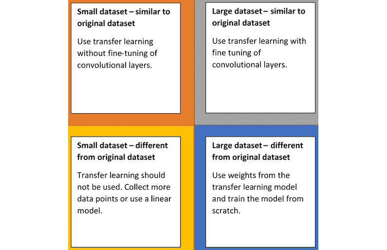

###### 图 8.1: 不同条件下进行迁移学习的步骤

在图示中，有四个区域：

+   **小数据集**（类似于原始数据集）：这是最常见的情况，也是迁移学习最有效的场景。由于当前数据集与用于训练预训练模型的数据集相似，我们可以使用预训练模型的各层，并根据问题类型只修改最后的全连接层部分。

+   **大数据集**（类似于原始数据集）：这是最理想的情况。由于数据的可用性，建议从头开始训练模型，并且为了加速学习，我们可以使用预训练模型的权重作为起点。

+   **小数据集**（与原始数据集不同）：这是迁移学习和深度学习中最糟糕的情况。面对这种情况，唯一的解决方案是找到一个类似当前数据集的数据集，在其上训练一个模型，然后再使用迁移学习。

+   **大数据集**（与原始数据集不同）：由于数据集非常大，我们可以从头开始训练模型。为了加快训练速度，可以将预训练模型的权重作为起点，但这并不推荐。

迁移学习仅在两种类型的数据集上取得了成功——图像数据集和自然语言（文本数据）数据集。我们在 *第七章* 中讨论的词嵌入就是一个迁移学习的例子。接下来，我们将看看如何将迁移学习应用于图像数据。

### 图像数据的迁移学习

在本节中，我们将使用 Keras 加载一个预训练模型并进行迁移学习。你将学到如何处理数据集与预训练模型数据集相似的两种情况。要开始迁移学习，我们首先必须加载一个预训练模型。我们将使用 Keras 加载 Inception 模型：

```py
import keras
base_model = keras.applications.inception_v3.InceptionV3(include_top=False, weights='imagenet')
```

`include_top=False` 去除了网络中的第一个全连接层，使我们可以输入任何大小的图像，而不依赖于原始数据集的图像大小。`weights='imagenet'` 确保加载预训练权重。如果没有传递给 `weights`，则权重将随机初始化。Inception 模型在现有的 **卷积神经网络**（**CNN**）分类器上做出了巨大的改进。在 Inception 之前，最好的模型只是堆叠多个卷积层，希望能获得更好的性能。而 Inception 则不同，它采用了许多技巧，在提高准确率的同时，也减少了预测时间。

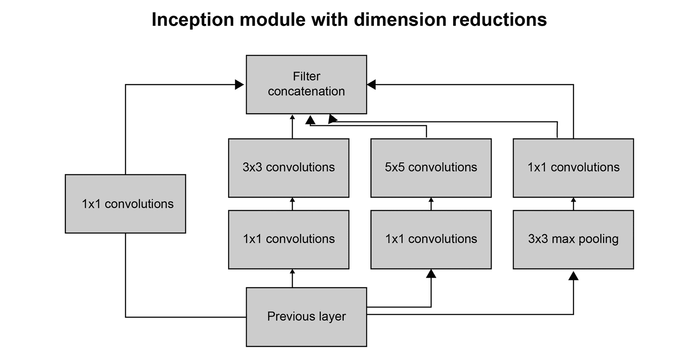

###### 图 8.2：Inception 网络的单个细胞

我们将首先查看的案例是一个与原始数据集相似的小型数据集。在这种情况下，我们需要首先冻结预训练模型的层。为此，我们只需使基础模型的所有层不可训练：

```py
for layer in base_model.layers:
    layer.trainable = False
```

下一个案例是一个与原始数据集相似的大型数据集。在这种情况下，我们需要通过将预训练权重作为起点来训练模型。在这种情况下，我们不做任何修改，只是训练整个模型，该模型是`base_model`与一些额外的全连接层的组合，具体取决于我们的任务。例如，如果任务是二分类问题，我们需要使最后一层全连接层有 2 个输出。我们在这种情况下还可以做的一件事是冻结前几层的权重，这样训练过程会更快。冻结前几层是有帮助的，因为这些层学习的是简单的形状，可以应用于任何类型的问题。要在 Keras 中冻结前五层，请使用以下代码：

```py
for layer in base_model.layers[:5]:   layer.trainable = False
```

### 练习 58：使用 InceptionV3 比较和分类图像

在这个练习中，我们将利用 Keras 提供的 InceptionV3 模型进行猫狗分类。我们将使用与*第六章*《解码图像》相同的数据集（https://github.com/TrainingByPackt/Data-Science-with-Python/tree/master/Chapter08），并比较我们的结果。我们将冻结 Inception 卷积层，这样就不需要重新训练它们：

1.  首先，创建函数从文件名读取图像及其标签。这里，`PATH` 变量包含训练数据集的路径：

    ```py
    from PIL import Image
    def get_input(file):
        return Image.open(PATH+file)
    def get_output(file):	
        class_label = file.split('.')[0]
        if class_label == 'dog': label_vector = [1,0]
        elif class_label == 'cat': label_vector = [0,1]
        return label_vector
    ```

1.  设置图像的大小和通道：

    ```py
    SIZE = 200
    CHANNELS = 3
    ```

1.  然后，创建一个函数来预处理图像：

    ```py
    def preprocess_input(image):

        # Data preprocessing
        image = image.resize((SIZE,SIZE))
        image = np.array(image).reshape(SIZE,SIZE,CHANNELS)

        # Normalize image
        image = image/255.0

        return image
    ```

1.  现在创建一个生成器函数，读取图像和标签并处理图像：

    ```py
    import numpy as np
    def custom_image_generator(images, batch_size = 128):

        while True:
            # Randomly select images for the batch
            batch_images = np.random.choice(images, size = batch_size)
            batch_input = []
            batch_output = [] 

            # Read image, perform preprocessing and get labels
            for file in batch_images:
                # Function that reads and returns the image
                input_image = get_input(file)
                # Function that gets the label of the image
                label = get_output(file)
                # Function that pre-processes and augments the image
                image = preprocess_input(input_image)
                batch_input.append(image)
                batch_output.append(label)
            batch_x = np.array(batch_input)
            batch_y = np.array(batch_output)
            # Return a tuple of (images,labels) to feed the network
            yield(batch_x, batch_y)
    ```

1.  接下来，我们将读取验证数据。创建一个函数来读取图像及其标签：

    ```py
    from tqdm import tqdm
    def get_data(files):
        data_image = []
        labels = []
        for image in tqdm(files):
            label_vector = get_output(image)

            img = Image.open(PATH + image)
            img = img.resize((SIZE,SIZE))

            labels.append(label_vector)
            img = np.asarray(img).reshape(SIZE,SIZE,CHANNELS)
            img = img/255.0
            data_image.append(img)

        data_x = np.array(data_image)
        data_y = np.array(labels)

        return (data_x, data_y)
    ```

1.  读取验证文件：

    ```py
    from random import shuffle
    files = os.listdir(PATH)
    random.shuffle(files)
    train = files[:7000]
    test = files[7000:]
    validation_data = get_data(test)
    ```

1.  从数据集中绘制一些图像，查看是否正确加载了文件：

    ```py
    import matplotlib.pyplot as plt
    plt.figure(figsize=(20,10))
    columns = 5
    for i in range(columns):
        plt.subplot(5 / columns + 1, columns, i + 1)
        plt.imshow(validation_data[0][i])
    ```

    样本图像如下：

    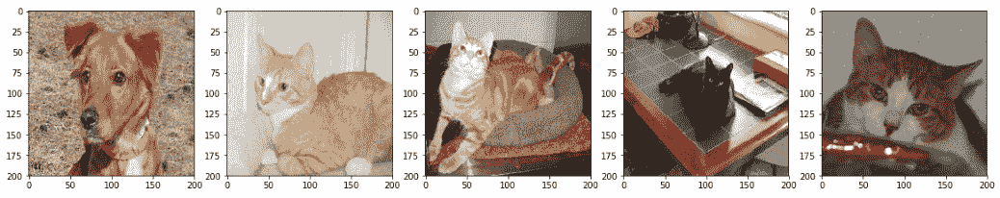

    ###### 图 8.3：从加载的数据集中提取的样本图像

1.  加载 Inception 模型并传入输入图像的形状：

    ```py
    from keras.applications.inception_v3 import InceptionV3
    base_model = InceptionV3(weights='imagenet', include_top=False, input_shape=(200,200,3))
    ```

1.  冻结 Inception 模型层，使得训练过程中不会对它们进行训练：

    ```py
    for layer in base_model.layers:
        layer.trainable = False
    ```

1.  现在根据我们的问题，添加输出的全连接层。这里，`keep_prob`是训练过程中保留节点的比例。因此，丢弃率将是`1 – keep_prob`：

    ```py
    from keras.layers import GlobalAveragePooling2D, Dense, Dropout
    from keras.models import Model
    x = base_model.output
    x = GlobalAveragePooling2D()(x)
    x = Dense(256, activation='relu')(x)
    keep_prob = 0.5
    x = Dropout(rate = 1 - keep_prob)(x)
    predictions = Dense(2, activation='softmax')(x)
    model = Model(inputs=base_model.input, outputs=predictions)
    ```

1.  接下来，编译模型，使其准备好进行训练：

    ```py
    model.compile(loss='categorical_crossentropy', 
                  optimizer='adam',
                  metrics = ['accuracy'])
    ```

    然后进行模型训练：

    ```py
    EPOCHS = 5
    BATCH_SIZE = 128
    model_details = model.fit_generator(custom_image_generator(train, batch_size = BATCH_SIZE),
                        steps_per_epoch = len(train) // BATCH_SIZE, 
                        epochs = EPOCHS, 
                        validation_data= validation_data,
                        verbose=1)
    ```

1.  评估模型并获取准确性：

    ```py
    score = model.evaluate(validation_data[0], validation_data[1])
    print("Accuracy: {0:.2f}%".format(score[1]*100))
    ```

    准确度如下：


###### 图 8.4：模型的准确性

如前所示，模型的准确率为 97.8%，这比我们在*第六章*，*解码图像*中获得的 73%的准确率要高得多。你可以尝试修改我们附加到 Inception 模型上的模型，看看是否能提高准确率。你还可以绘制错误预测的图像，来了解模型的表现如何。

```py
y_pred = model.predict(validation_data[0])
incorrect_indices = np.nonzero(np.argmax(y_pred,axis=1) != np.argmax(validation_data[1],axis=1))[0]
labels = ['dog', 'cat']
image = 5
plt.imshow(validation_data[0][incorrect_indices[image]].reshape(SIZE, SIZE, CHANNELS),  cmap=plt.get_cmap('gray'))
plt.show()
print("Prediction: {0}".format(labels[np.argmax(y_pred[incorrect_indices[image]])]))
```

错误预测的图像如下所示：

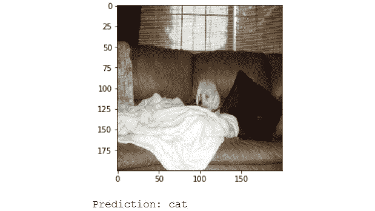

](img/C13322_08_05.jpg)

###### 图 8.5：错误预测的样本

### 活动 21：使用 InceptionV3 进行图像分类

在本活动中，我们将使用 Keras 提供的 InceptionV3 模型进行猫狗分类。我们将使用*第六章*，*解码图像*中使用的相同数据集并比较我们的结果。在这里，我们将训练整个模型，但我们将使用 Inception 预训练模型中的权重作为起点。这类似于我们刚才讨论的练习，但没有冻结层。

1.  创建一个生成器来获取图像和标签。

1.  创建一个函数来获取标签和图像。然后，创建一个函数来预处理图像并对其进行增强。

1.  加载验证数据集，这些数据集不会进行增强处理。

1.  加载 Inception 模型并添加最终的全连接层。训练整个网络。

你应该看到这个模型的准确率为 95.4%，这比我们在*第六章*，*解码图像*中获得的 73%的准确率要高得多。

你一定注意到前面的代码与*练习 58*相似，但这里我们没有冻结层。模型显然从 Inception 模型的权重中受益，将其作为起点。你可以绘制错误预测的图像，来了解模型的表现如何：

```py
y_pred = model.predict(validation_data[0])
incorrect_indices = np.nonzero(np.argmax(y_pred,axis=1) != np.argmax(validation_data[1],axis=1))[0]
labels = ['dog', 'cat']
image = 5
plt.imshow(validation_data[0][incorrect_indices[image]].reshape(SIZE, SIZE, CHANNELS),  cmap=plt.get_cmap('gray'))
plt.show()
print("Prediction: {0}".format(labels[np.argmax(y_pred[incorrect_indices[image]])]))
```

#### 注意

本活动的解决方案可以在第 387 页找到。

错误预测的图像如下所示：

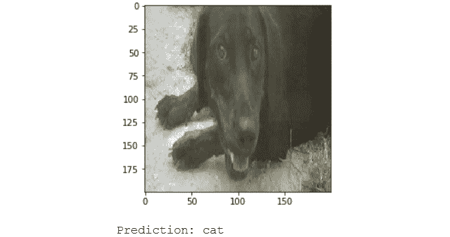

](img/C13322_08_06.jpg)

###### 图 8.6：数据集中错误预测的样本

## 有用的工具和技巧

在本节中，你将首先了解数据集的不同拆分的重要性。之后，你将学到一些技巧，这些技巧在处理未经过处理的数据集时会派上用场。然后，我们将介绍像 pandas profiling 和 TensorBoard 这样的工具，它们通过提供简便的信息访问，使你的工作更加轻松。我们还将看看 AutoML，以及它如何在无需大量人工操作的情况下获得高性能模型。最后，我们将可视化我们的 Keras 模型并将模型图导出到文件。

### 训练集、开发集和测试集

我们在前几章中简要讨论了训练集、开发集和测试集。在这里，我们将深入探讨这个话题。

训练集（或训练数据集）是从数据集中获取的一个样本，我们用它来创建我们的机器学习模型。开发集（或验证集，也称为开发数据集）是一个样本，帮助我们调整已创建模型的超参数。测试集（或测试数据集）是我们用来最终评估模型的样本。拥有这三种数据集对模型开发至关重要。

**数据集的分布**

开发集和测试集应该来自相同的分布，并且应该代表你期望模型在未来接收到的数据。如果分布不同，模型将会调优到一个在未来看不见的分布，这会影响部署后的模型表现。由于训练集和测试/开发集之间的分布差异，模型可能会表现不佳。为了解决这个问题，你可以从测试/开发集获取一些数据点并将其引入到训练集中。确保原始图像主导各自的数据集，以防止出现不正确的结果。

如果训练集和开发集的分布不同，我们无法识别模型是否过拟合；在这种情况下，应引入一个新的训练-开发集来检查模型的过拟合情况。训练集和训练-开发集必须具有相同的分布。如果开发集和训练-开发集的误差差异很大，那么就存在数据不匹配的问题。为了解决这个问题，你需要进行手动误差分析，并在大多数情况下，收集更多的数据点。

#### 注意

开发集与我们一直使用的验证集相同，我们有时称之为测试集，但那只是为了让你入门。还应该注意，我们仅在训练数据集上训练模型。

**数据集的大小**

开发集和测试集的大小应根据数据集的总体大小来确定。如果数据集的大小是 10,000 个数据点，那么 60%/20%/20%的划分会很好，因为测试集和开发集都有足够的数据点来准确衡量模型的性能。另一方面，如果数据集有 1,000,000 个数据点，那么 98%/1%/1%的划分就足够了，因为 10,000 个数据点已经足够评估模型的表现。

三个数据集的样本应该保持一致，以便我们在相同的环境中评估所有模型。为此，你可以在创建随机样本时设置一个“种子”值。设置随机数种子有助于每次运行实验时获得相同的随机数据划分。

### 处理未处理的数据集

当你开始处理更复杂且未经过多处理的数据集时，你会发现大多数情况下，你无法获得创建令人满意模型所需的所有数据。为了解决这个问题，你需要识别可以帮助你创建合格模型的外部数据集。你使用的附加数据可以有以下两种类型：

+   **相同数据的更多数据点**：当模型由于数据集较小而过拟合时，这非常有用。如果无法获取更多数据点，可以使用更简单的模型——例如层数较少的神经网络或线性模型。

+   **来自不同来源的额外数据**：有时候数据集中会缺少一些数据，例如数据集中城市的州或国家，或者数据集中列出的国家的宏观经济因素，如 GDP 和人均收入。此类数据可以轻松在互联网上找到，并可用于改进您创建的模型。

最佳实践是始终从**探索性数据分析**（**EDA**）开始。EDA 帮助我们深入了解数据集，有助于识别最佳模型及可用于机器学习的变量。EDA 的另一个重要方面是检查数据是否存在异常。这可以确保数据在传输过程中没有发生错误。EDA 的结果可以与利益相关者共享，以确认数据的有效性。数据科学家在项目中可能需要多次回顾 EDA 步骤。

另一个需要牢记的事项是模型的应用场景。了解您的模型是用于实时处理还是批处理非常重要。这将帮助您选择合适的工具和模型。例如，如果实时处理是优先考虑的目标，那么您可能会使用一个能在不到一秒钟内产生结果的模型；而如果应用程序需要批处理，那么您可以使用那些需要几秒钟以上才能产生预测的复杂神经网络模型。

接下来，我们将探讨一些处理训练和进行超参数调优的最佳实践。在将数据拆分为训练集和测试集之前，始终对数据进行洗牌。另一个有助于更快收敛的做法是在训练过程中对训练数据进行洗牌。Keras 的`fit`函数有一个非常有用的参数，名为`True`，它会在每个训练周期前洗牌训练数据。需要记住的一个重要参数是随机数种子；它帮助数据科学家即使在随机洗牌和拆分的情况下，也能创建可重复的结果。要为 Keras 设置种子，请使用以下方法：

```py
from numpy.random import seed
seed(1)
from tensorflow import set_random_seed
set_random_seed(1)
```

前两行设置了 NumPy 的随机种子，接下来的两行则为 TensorFlow 设置了种子，这是 Keras 使用的后端。

如果您正在处理一个大型数据集，建议先使用数据的子集来创建模型。尝试通过加深网络或使其更复杂来使模型过拟合。您可以使用正则化来限制模型过拟合数据。当您对模型有信心时，使用完整的训练数据并调整已创建的模型，以提高模型的性能。

Dropout 是一种非常强大的正则化方法；你应该尝试不同的 dropout 率，因为最优的 dropout 率因数据集不同而不同。如果 dropout 概率太低，效果就不会显现。另一方面，如果概率过高，模型就会开始欠拟合。通常，20%到 50%之间的 dropout 率效果最好。

学习率是一个重要的超参数。学习率过大会导致模型越过最优解，而学习率过小则会导致模型学习非常缓慢。如*第五章*《掌握结构化数据》中提到的，我们可以从较高的学习率开始，并在经过几步后降低学习率。

这有助于我们更快地达到最优点，同时由于步长减小，避免了模型越过解的情况。为了实现学习率的减少，我们可以使用 Keras 中的`ReduceLROnPlateau`回调函数。如果选择的指标停止改进，该回调函数会按照预定义的因子降低学习率。

#### 注意

要进一步了解数据集，请参考文档：https://keras.io/callbacks/#reducelronplateau。

```py
from keras.callbacks import ReduceLROnPlateau
ReduceLROnPlateau(monitor='val_loss', factor=0.1, patience=10, min_delta=0.0001, min_lr=0)
```

我们将要监控的数量传递给`monitor`参数。`factor`指的是学习率需要减少的倍数；新的学习率将等于当前学习率乘以这个因子。`patience`是回调函数等待的 epochs 数量，等待后才会改变学习率。`min_delta`表示衡量模型在监控指标上改进的阈值。`min_lr`表示学习率的下限。

### pandas Profiling

在前几章中，你学习了不同的探索结构化数据集的方法。EDA 在构建结构化数据模型时起着重要作用。执行 EDA 的步骤，如空值识别、相关性分析和计数唯一值等，通常不变，因此最好创建一个函数来完成这些任务，避免编写大量代码。pandas profiling 库正是做到了这一点：它接收一个 DataFrame，对数据进行分析并以交互式的输出形式展示结果。

输出包含相关列的以下信息：

+   **基本信息**：包含关于变量类型、唯一值和缺失值的信息。

+   **分位数统计**：包含关于最小值、Q1、中央値、Q3、最大值、范围和四分位距的信息。

+   **描述性统计**：包含关于均值、众数、标准差、总和、中位数绝对偏差和变异系数的信息。

+   **最频繁的值**：包含关于最常见值的计数以及其百分比频率的信息。

+   **直方图**：包含关于数据集不同特征值频率的图表信息。

+   **相关性**：这些突出显示了高度相关的变量，并建议将其移除。

要使用 pandas profiling，只需将数据框传递给 `pandas_profiling` 对象。使用以下代码：

```py
import pandas_profiling
pandas_profiling.ProfileReport(df)
```

以下截图显示了我们在 *第五章* 中处理的电信流失数据集的 pandas profiling 输出的一部分，*精通结构化数据*

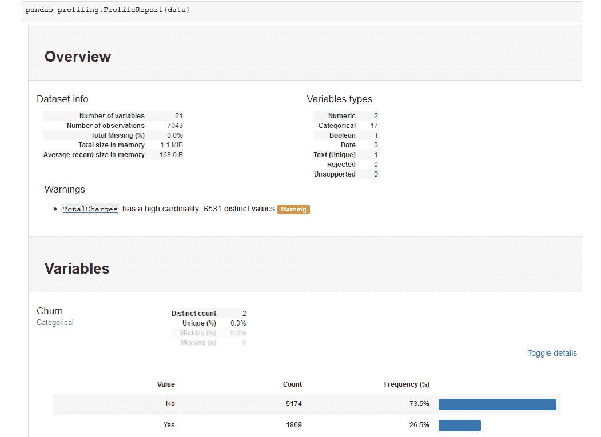

](img/C13322_08_07.jpg)

###### 图 8.7：pandas profiling 输出的截图

您可以使用这个功能来探索我们在前几章中处理的数据集。pandas profiling 提供交互式输出，鼓励您去操作并玩转这些输出。

### TensorBoard

**TensorBoard** 是一个可以用来查看训练日志并可视化模型准确率和损失度量的 Web 应用。它最初是为了与 TensorFlow 一起使用而创建的，但我们可以通过 Keras 中的 **TensorBoard 回调** 来使用 TensorBoard。要开始可视化，请创建 Keras 回调。使用以下代码来实现：

```py
import keras
keras.callbacks.TensorBoard(log_dir='./logs', update_freq='epoch')
```

记住您在此处指定的日志目录；稍后您会需要它。您可以在 `update_freq` 中传递 '`batch`'、'`epoch`' 或整数值；这表示日志应写入的频率。下一步是启动 TensorBoard；为此，打开终端并运行以下命令：

```py
tensorboard --logdir logs --port 6607
```

现在开始训练。不要忘记将回调传递给 `fit` 函数。TensorBoard 的第一个标签页显示了模型的训练日志。您可以在日志文件夹内创建多个子文件夹，以便在同一图表上获取不同模型的日志进行比较：

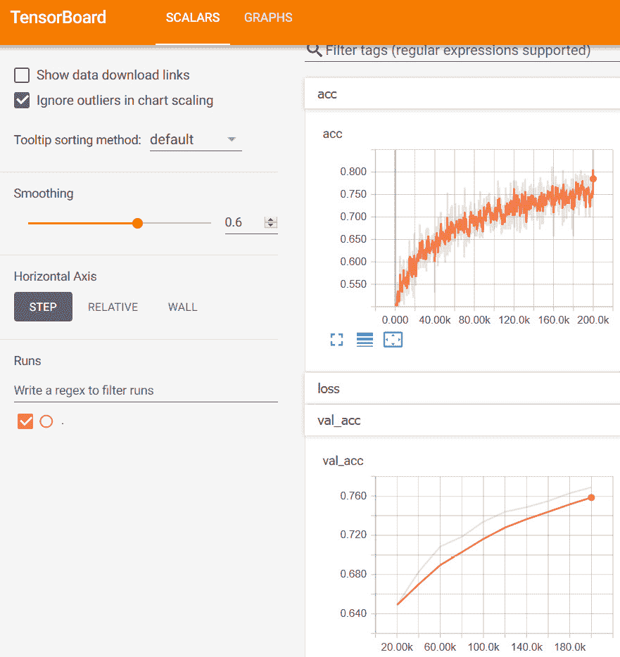

](img/C13322_08_08.jpg)

###### 图 8.8：显示 TensorBoard 仪表盘的截图

在第二个标签页中，您可以可视化您创建的模型。下图展示了我们在上一章的第一个活动中创建的模型：

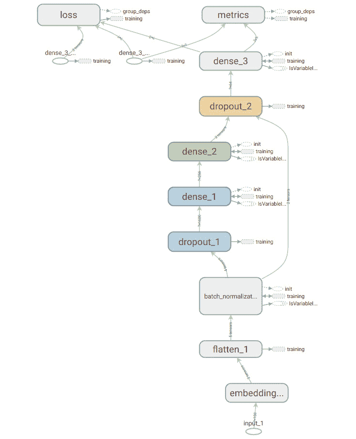

](img/C13322_08_09.jpg)

###### 图 8.9：Keras 解释的模型

在 Jupyter Notebook 中可视化训练日志的另一种方法是使用 Matplotlib 绘制它们：

```py
import matplotlib.pyplot as plt
plt.plot(model_details.history['acc'])
plt.plot(model_details.history['val_acc'])
plt.title('Cats vs. Dogs model accuracy')
plt.ylabel('Accuracy')
plt.xlabel('Epoch')
plt.legend(['Train set', 'Dev set'], loc='upper left')
plt.show()
```

下图显示了我们在 *活动 1* 中使用的猫狗模型的训练集和测试集的准确率图：

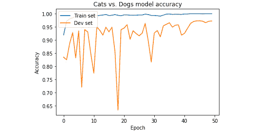

](img/C13322_08_10.jpg)

###### 图 8.10：模型的准确率日志

上面的准确率日志显示了训练集和开发集的准确率在不同的 epoch 上是如何变化的。正如你所看到的，开发集的准确率比训练集的准确率更为波动。这是因为模型没有见过这些例子，在初期的 epochs 中波动较大，但随着我们在更多的 epochs 上进行训练，模型变得更稳健，准确率波动会减小。

```py
plt.plot(model_details.history['loss'])
plt.plot(model_details.history['val_loss'])
plt.title('Cats vs. Dogs model loss')
plt.ylabel('Loss')
plt.xlabel('Epoch')
plt.legend(['Train set', 'Test set'], loc='upper left')
plt.show()
```

下图显示了我们在 *活动 21* 中使用的猫狗模型的训练集和测试集的损失图：

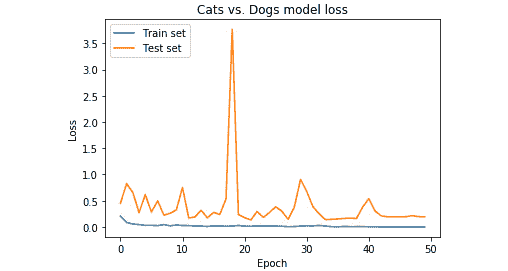

](img/C13322_08_11.jpg)

###### 图 8.11：模型的损失日志

类似于准确度日志，上面给出的损失日志显示了训练集和开发集的损失在不同 epochs 中的变化。第 19 个 epoch 附近的波峰表明，模型曾因过拟合于训练集而表现非常糟糕，但最终模型开始稳定，并在开发集上也给出了更好的结果。

如果你只关心模型日志，那么你可以使用之前给出的代码，在训练结束后绘制模型日志。然而，如果你正在训练一个需要较长时间的模型，建议使用 TensorBoard，因为它可以实时绘制训练损失和准确度。

## AutoML

现在你已经创建了多个神经网络模型，你明白了构建表现良好的网络的两个主要组成部分。它们分别是：

+   神经网络的架构

+   神经网络的超参数

根据问题的不同，可能需要经过数十次迭代才能得到最佳网络。到目前为止，我们一直在手动创建架构并调优超参数。AutoML 可以帮助我们执行这些任务，它会为当前数据集搜索最优的网络和参数。Auto-Keras 是一个开源库，帮助我们在 Keras 上实现 AutoML。让我们通过一个练习来学习如何使用 Auto-Keras。

### 练习 59：使用 Auto-Keras 获取表现良好的网络

在本练习中，我们将利用 Auto-Keras 库，为 cats-vs-dogs 数据集（https://github.com/TrainingByPackt/Data-Science-with-Python/tree/master/Chapter08）找到最优的网络和参数。

1.  首先，创建一个加载图像标签的函数：

    ```py
    def get_label(file):
        class_label = file.split('.')[0]
        if class_label == 'dog': label_vector = 0
        elif class_label == 'cat': label_vector = 1
        return label_vector
    ```

1.  设置 `SIZE`，它是输入图像的维度（宽高相等的图像）。

    ```py
    SIZE = 50
    ```

1.  然后创建一个函数来读取图像及其标签。此处 `PATH` 变量包含训练数据集的路径。

    ```py
    import os
    from PIL import Image
    import numpy as np
    from random import shuffle
    def get_data():
        data = []
        files = os.listdir(PATH)
        for image in tqdm(files):
            label_vector = get_label(image)

            img = Image.open(PATH + image).convert('L')
            img = img.resize((SIZE,SIZE))

            data.append([np.asarray(img),np.array(label_vector)])

        shuffle(data)
        return data
    ```

1.  加载数据并将其划分为训练集和测试集：

    ```py
    data = get_data()
    train = data[:7000]
    test = data[7000:]
    x_train = [data[0] for data in train]
    y_train = [data[1] for data in train]
    x_test = [data[0] for data in test]
    y_test = [data[1] for data in test]
    x_train = np.array(x_train).reshape(-1,SIZE,SIZE,1)
    x_test = np.array(x_test).reshape(-1,SIZE,SIZE,1)
    ```

1.  现在，让我们开始使用 AutoML。

    首先，创建一个数组来设置 AutoKeras 的训练时间。时间一到，它会停止寻找最佳模型的过程：

    ```py
    TRAINING_TIME = 60 * 60 * 1 # 1 hour
    ```

    我们将给 AutoKeras 一小时的时间来寻找最佳方法。

1.  使用 AutoKeras 创建一个图像分类模型，并进行前一步中指定时间的训练：

    ```py
    import autokeras as ak
    model = ak.ImageClassifier(verbose=True)
    model.fit(x_train, y_train, time_limit=TRAINING_TIME)
    model.final_fit(x_train, y_train, x_test, y_test, retrain=True)
    ```

1.  输出将如下所示：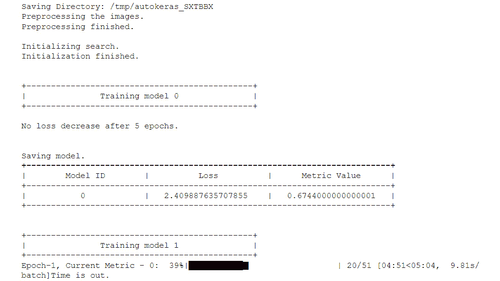

    ###### 图 8.12：图像分类模型

1.  接下来，我们保存模型，以便以后可以再次使用它：

    ```py
    model.export_autokeras_model("model.h5")
    ```

1.  加载训练好的模型并使用它进行预测：

    ```py
    from autokeras.utils import pickle_from_file
    model = pickle_from_file("model.h5")
    predictions = model.predict(x_test)
    ```

1.  评估由 AutoKeras 创建的模型的准确性：

    ```py
    score = model.evaluate(x_test, y_test)
    print("\nScore: {}".format(score))
    ```

1.  模型的准确度如下：

    ###### 图 8.13：模型最终准确度

1.  我们成功地利用 autokeras 创建了一个图像分类器，用于检测提供的图像是猫还是狗。经过一小时的运行，这个模型的准确率为 72%，考虑到我们在*第六章*，*解码图像*，*活动 22* 中创建的模型准确率为 73%，这已经相当不错了。这显示了 AutoML 的强大功能，但有时我们在可接受的时间框架内可能无法获得足够好的结果。

### 使用 Keras 进行模型可视化

到目前为止，我们已经创建了一些神经网络模型，但还没有可视化它们。Keras 提供了一个非常实用的工具函数，可以绘制任何模型的图。要创建一个图形，首先定义模型，我们将使用*第六章*中的模型，*解码图像*，如下面的代码所示：

```py
model = Sequential()

model.add(Conv2D(48, (3, 3), activation='relu', padding='same', input_shape=(50,50,1)))    
model.add(Conv2D(48, (3, 3), activation='relu'))    
model.add(MaxPool2D(pool_size=(2, 2)))
model.add(BatchNormalization())
model.add(Dropout(0.10))
model.add(Flatten())
model.add(Dense(512, activation='relu'))
model.add(Dropout(0.5))
model.add(Dense(2, activation='softmax'))
model.summary()
```

然后使用 `plot_model` 将模型保存为图像，如以下代码所示。

```py
from keras.utils import plot_model
plot_model(model, to_file='model.png', show_shapes=True)
```

`show_shapes` 参数会展示层的输入和输出形状。保存的图像如下：

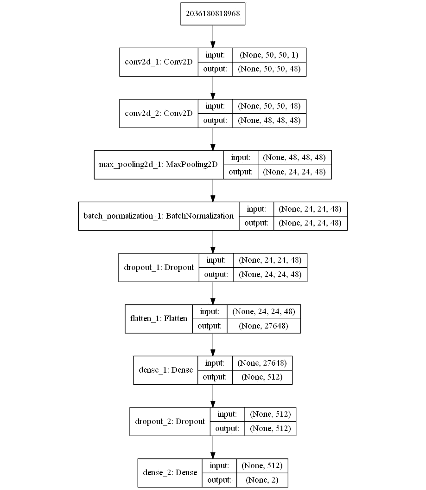

###### 图 8.14：由 Keras 创建的模型可视化

### 活动 22：使用迁移学习预测图像

我们将创建一个项目，使用迁移学习来预测给定图片是狗还是猫。你将使用的基准模型是 InceptionV3\。我们将对这个模型进行微调，以适应我们的数据集，从而将模型调整为区分猫和狗。我们将使用 TensorBoard 实时监控训练指标，并使用本章中讨论的最佳实践。确保结果是可复现的：

1.  重复你在前一个活动中的*第 1 步*所做的一切。

1.  加载开发集和测试集，这些数据集将不会进行数据增强。

1.  加载 Inception 模型并添加最终的全连接层。训练整个网络。

1.  使用所有有用的回调函数。

1.  使用 TensorBoard 可视化训练过程。

    #### 注意

    这个活动的解决方案可以在第 391 页找到。

你可以使用以下代码片段绘制预测错误的图像，以了解模型的性能：

```py
y_pred = model.predict(test_data[0])
incorrect_indices = np.nonzero(np.argmax(y_pred,axis=1) != np.argmax(test_data[1],axis=1))[0]
labels = ['dog', 'cat']
image = 5
plt.imshow(test_data[0][incorrect_indices[image]].reshape(SIZE, SIZE, CHANNELS),  cmap=plt.get_cmap('gray'))
plt.show()
print("Prediction: {0}".format(labels[np.argmax(y_pred[incorrect_indices[image]])]))
```

错误预测的图像如下：


###### 图 8.15：错误预测的样本

## 总结

在本章中，我们介绍了迁移学习并利用它加速深度学习模型的创建。接着我们学习了训练集、开发集和测试集分开的重要性，并讨论了如何处理现实生活中的未处理数据集。之后，我们讲解了什么是 AutoML，以及如何以最少的工作量找到最优的网络。最后，我们学习了如何可视化神经网络模型和训练日志。

现在，你已经完成了本章的学习，具备了处理任何数据以创建机器学习模型的能力。

最后，完成本书后，你应该对数据科学的概念有一个深入的理解，并且能够使用 Python 语言处理不同的数据集来解决商业案例问题。你所学到的不同概念，包括预处理、数据可视化、图像增强和自然语言处理等，应该帮助你全面掌握如何处理数据。
