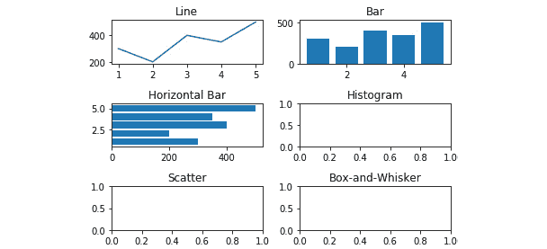
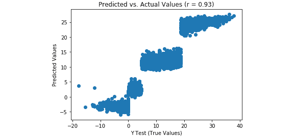
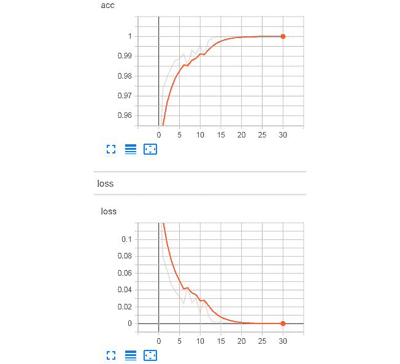

# 第十九章：*附录*

## 关于

本节内容是为帮助您完成书中活动而包含的。它包括学生需要执行的详细步骤，以便完成并实现书中的目标。

## 第一章：数据科学与数据预处理简介

### 活动 1：使用银行营销订阅数据集进行预处理

解决方案

让我们对`Bank Marketing Subscription`数据集进行各种预处理任务。我们还将把数据集分为训练数据和测试数据。按照以下步骤完成此活动：

1.  打开一个 Jupyter 笔记本并添加一个新单元格，导入 pandas 库并将数据集加载到 pandas 数据框中。首先需要导入该库，然后使用`pd.read_csv()`函数，如下所示：

    ```py
    import pandas as pd
    Link = 'https://github.com/TrainingByPackt/Data-Science-with-Python/blob/master/Chapter01/Data/Banking_Marketing.csv'
    #reading the data into the dataframe into the object data
    df = pd.read_csv(Link, header=0)
    ```

1.  要查找数据集中的行数和列数，请添加以下代码：

    ```py
    #Finding number of rows and columns
    print("Number of rows and columns : ",df.shape)
    ```

    上述代码生成以下输出：

    

    ###### 图 1.60：数据集中的行数和列数

1.  要打印所有列的列表，请添加以下代码：

    ```py
    #Printing all the columns
    print(list(df.columns))
    ```

    上述代码生成以下输出：

    

    ###### 图 1.61：数据集中包含的列列表

1.  要概览每一列的基本统计数据，如计数、均值、中位数、标准差、最小值、最大值等，可以添加以下代码：

    ```py
    #Basic Statistics of each column
    df.describe().transpose()
    ```

    上述代码生成以下输出：

    

    ###### 图 1.62：每一列的基本统计数据

1.  要打印每一列的基本信息，请添加以下代码：

    ```py
    #Basic Information of each column
    print(df.info())
    ```

    上述代码生成以下输出：

    

    ###### 图 1.63：每一列的基本信息

    在上面的图中，可以看到没有任何列包含空值。此外，还提供了每一列的数据类型。

1.  现在让我们检查缺失值和每个特征的类型。请添加以下代码来执行此操作：

    ```py
    #finding the data types of each column and checking for null
    null_ = df.isna().any()
    dtypes = df.dtypes
    sum_na_ = df.isna().sum()
    info = pd.concat([null_,sum_na_,dtypes],axis = 1,keys = ['isNullExist','NullSum','type'])
    info
    ```

    查看下面图中的输出结果：

    

    ###### 图 1.64：每一列的信息，包括空值的数量和数据类型

1.  由于我们已经将数据集加载到`data`对象中，我们将从数据集中删除空值。要删除空值，可以添加以下代码：

    ```py
    #removing Null values
    df = df.dropna()
    #Total number of null in each column
    print(df.isna().sum())# No NA
    ```

    查看下面图中的输出结果：

    

    ###### 图 1.65：无空值的数据集特征

1.  现在我们检查数据集中`education`列的频率分布。使用`value_counts()`函数来实现这一点：

    ```py
    df.education.value_counts()
    ```

    查看下面图中的输出结果：

    

    ###### 图 1.66：education 列的频率分布

1.  在前面的图中，我们可以看到数据集的`education`列有很多类别。我们需要减少这些类别，以便更好地建模。为了检查`education`列中的各种类别，我们使用`unique()`函数。输入以下代码来实现这一点：

    ```py
    df.education.unique()  
    ```

    输出如下：

    

    ###### 图 1.67：education 列的各种类别

1.  现在让我们将`basic.4y`、`basic.9y`和`basic.6y`这些类别合并为一个`basic`类别。为此，我们可以使用 pandas 的`replace`函数：

    ```py
    df.education.replace({"basic.9y":"Basic","basic.6y":"Basic","basic.4y":"Basic"},inplace=True)
    ```

1.  要检查分组后的类别列表，添加以下代码：

    ```py
    df.education.unique()  
    ```

    

    ###### 图 1.68：education 列的各种类别

    在前面的图中，你可以看到`basic.9y`、`basic.6y`和`basic.4y`被合并为`Basic`。

1.  现在我们选择并执行适当的数据编码方法。添加以下代码来实现这一点：

    ```py
    #Select all the non numeric data using select_dtypes function
    data_column_category = df.select_dtypes(exclude=[np.number]).columns
    ```

    前面的代码生成了以下输出：

    

    ###### 图 1.69：数据集的各个列

1.  现在我们定义一个包含数据中所有类别特征名称的列表。此外，我们循环遍历列表中的每个变量，获取虚拟变量编码的输出。添加以下代码来实现这一点：

    ```py
    cat_vars=data_column_category
    for var in cat_vars:
        cat_list='var'+'_'+var
        cat_list = pd.get_dummies(df[var], prefix=var)
        data1=df.join(cat_list)
        df=data1
     df.columns
    ```

    前面的代码生成了以下输出：

    

    ###### 图 1.70：数据中类别特征的列表

1.  现在我们忽略已经进行了编码的类别列。我们将只选择数值列和已编码的类别列。添加代码以实现此操作：

    ```py
    #Categorical features
    cat_vars=data_column_category
    #All features
    data_vars=df.columns.values.tolist()
    #neglecting the categorical column for which we have done encoding
    to_keep = []
    for i in data_vars:
        if i not in cat_vars:
            to_keep.append(i)

    #selecting only the numerical and encoded catergorical column
    data_final=df[to_keep]
    data_final.columns
    ```

    前面的代码生成了以下输出：

    

    ###### 图 1.71：数值列和已编码类别列的列表

1.  最后，我们将数据拆分为训练集和测试集。添加以下代码来实现这一点：

    ```py
    #Segregating Independent and Target variable
    X=data_final.drop(columns='y')
    y=data_final['y']
    from sklearn. model_selection import train_test_split
    X_train, X_test, y_train, y_test = train_test_split(X, y, test_size=0.2, random_state=0)
    print("FULL Dateset X Shape: ", X.shape )
    print("Train Dateset X Shape: ", X_train.shape )
    print("Test Dateset X Shape: ", X_test.shape )
    ```

    输出如下：


###### 图 1.72：完整数据集、训练集和测试集的形状

## 第二章：数据可视化

### 活动 2：折线图

**解决方案**：

1.  创建一个包含从一月到六月的六个字符串的列表，并将其保存为 x，使用以下代码：

    ```py
    x = ['January','February','March','April','May','June']
    ```

1.  创建一个包含 6 个值的列表，代表'`Items Sold`'，其值从 1000 开始，每次增加 200，直到最终值为 2000，并将其保存为 y，如下所示：

    ```py
    y = [1000, 1200, 1400, 1600, 1800, 2000]
    ```

1.  使用以下代码绘制 y（'`Items Sold`'）与 x（'`Month`'）的折线图，线为虚线，标记为星形：

    ```py
    plt.plot(x, y, '*:b')
    ```

1.  使用以下代码将 x 轴设置为'`Month`'：

    ```py
    plt.xlabel('Month')
    ```

1.  将 y 轴设置为'`Items Sold`'，如下所示：

    ```py
    plt.ylabel('Items Sold')
    ```

1.  要将标题设置为'`Items Sold has been Increasing Linearly`'，请参考以下代码：

    ```py
    plt.title('Items Sold has been Increasing Linearly')
    ```

    查看以下截图，查看结果输出：


###### 图 2.33：按月销售项目的折线图

### 活动 3：条形图

**解决方案**：

1.  使用以下代码为`x`创建一个包含五个字符串的列表，表示获得最多冠军的 NBA 球队名称：

    ```py
    x = ['Boston Celtics','Los Angeles Lakers', 'Chicago Bulls', 'Golden State Warriors', 'San Antonio Spurs']
    ```

1.  使用以下代码为`y`创建一个包含五个值的列表，这些值对应于`x`中的字符串，表示'`Titles Won`'：

    ```py
    y = [17, 16, 6, 6, 5]
    ```

1.  将`x`和`y`放入数据框中，列名分别为'`Team`'和'`Titles`'，如下所示：

    ```py
    import pandas as pd

    df = pd.DataFrame({'Team': x,
                       'Titles': y})
    ```

1.  使用以下代码对数据框按'Titles'进行降序排序，并将结果保存为 df_sorted：

    ```py
    df_sorted = df.sort_values(by=('Titles'), ascending=False)
    ```

    #### 注意

    如果我们使用`ascending=True`进行排序，图表中较大的值会出现在右侧。由于我们希望较大的值出现在左侧，我们将使用`ascending=False`。

1.  编写一个程序化的标题，并首先通过以下代码找到获得最多冠军的球队，并将其保存为`team_with_most_titles`对象：

    ```py
    team_with_most_titles = df_sorted['Team'][0]
    ```

1.  然后，使用以下代码检索获得最多冠军的球队的冠军数量：

    ```py
    most_titles = df_sorted['Titles'][0]
    ```

1.  最后，使用以下代码创建一个字符串'`The Boston Celtics have the most titles with 17`'：

    ```py
    title = 'The {} have the most titles with {}'.format(team_with_most_titles, most_titles)
    ```

1.  使用以下代码绘制一个条形图，显示各球队的冠军数量：

    ```py
    import matplotlib.pyplot as plt

    plt.bar(df_sorted['Team'], df_sorted['Titles'], color='red')
    ```

1.  使用以下代码将 x 轴标签设置为'`Team`'：

    ```py
    plt.xlabel('Team')
    ```

1.  使用以下代码将 y 轴标签设置为'`Number of Championships`'：

    ```py
    plt.ylabel('Number of Championships')
    ```

1.  为了防止 x 轴刻度标签重叠，我们将它们旋转 45 度，请参考以下代码：

    ```py
    plt.xticks(rotation=45)
    ```

1.  将图表的标题设置为我们创建的程序化`title`对象，如下所示：

    ```py
    plt.title(title)
    ```

1.  使用以下代码将图表保存到当前工作目录下，文件名为'`Titles_by_Team.png`'：

    ```py
    plt.savefig('Titles_by_Team)
    ```

1.  使用`plt.show()`打印图表。为了更好地理解这一点，请查看以下输出截图：

    ###### 图 2.34：NBA 球队拥有的冠军数量的条形图

    #### 注意

    当我们使用`plt.show()`将图表打印到控制台时，它会按预期显示；然而，当我们打开我们创建的名为'`Titles_by_Team.png`'的文件时，我们会看到它裁剪了 x 轴刻度标签。

    下图显示了裁剪了 x 轴刻度标签的条形图。

    

    ###### 图 2.35：裁剪了 x 轴刻度标签的'Titles_by_Team.png'

1.  为了修复裁剪问题，在`plt.savefig()`中添加`bbox_inches='tight'`作为参数，如下所示：

    ```py
    plt.savefig('Titles_by_Team', bbox_inches='tight')
    ```

1.  现在，当我们从工作目录中打开保存的'`Titles_by_Team.png`'文件时，我们看到 x 轴刻度标签没有被裁剪。

    查看以下输出，查看最终结果：


###### 图 2.36：未裁剪 x 轴刻度标签的'Titles_by_Team.png'

### 活动 4：使用子图展示多种图表类型

**解决方案**：

1.  导入'`Items_Sold_by_Week.csv`'文件，并使用以下代码将其保存为`Items_by_Week`数据框对象：

    ```py
    import pandas as pd

    Items_by_Week = pd.read_csv('Items_Sold_by_Week.csv')
    ```

1.  导入`Weight_by_Height.csv`文件并将其保存为`Weight_by_Height`数据框对象，如下所示：

    ```py
    Weight_by_Height = pd.read_csv('Weight_by_Height.csv')
    ```

1.  使用以下代码生成一个包含 100 个正态分布数字的数组，作为直方图和箱形图的数据，并将其保存为 y：

    ```py
    y = np.random.normal(loc=0, scale=0.1, size=100)
    ```

1.  为了生成一个包含六个子图、按三行两列排列且不重叠的图形，请参考以下代码：

    ```py
    import matplotlib.pyplot as plt

    fig, axes = plt.subplots(nrows=3, ncols=2)
    plt.tight_layout()
    ```

1.  使用以下代码将相应的坐标轴标题设置为与图 2.32 中相同：

    ```py
    axes[0,0].set_title('Line') 
    axes[0,1].set_title('Bar') 
    axes[1,0].set_title('Horizontal Bar') 
    axes[1,1].set_title('Histogram') 
    axes[2,0].set_title('Scatter') 
    axes[2,1].set_title('Box-and-Whisker') 
    ```

    

    ###### 图 2.37：标题、无重叠的空子图

1.  在`Line`、`Bar`和`Horizontal Bar`坐标轴上，使用以下代码绘制`Items_Sold`与`Week`的关系：

    ```py
    axes[0,0].plot(Items_by_Week['Week'], Items_by_Week['Items_Sold'])
    axes[0,1].bar(Items_by_Week['Week'], Items_by_Week['Items_Sold'])
    axes[1,0].barh(Items_by_Week['Week'], Items_by_Week['Items_Sold'])
    ```

    请在以下图中查看结果输出：

    

    ###### 图 2.38：添加的折线图、条形图和水平条形图

1.  在`Histogram`和`Box-and-Whisker`坐标轴上，使用以下代码绘制包含 100 个正态分布数字的数组：

    ```py
    axes[1,1].hist(y, bins=20)axes[2,1].boxplot(y)
    ```

    结果输出如下所示：

    

    ###### 图 2.39：添加的直方图和箱形图

1.  使用以下代码在`Weight_by_Height`数据框的`Scatterplot`坐标轴上绘制`Weight`与`Height`的关系：

    ```py
    axes[2,0].scatter(Weight_by_Height['Height'], Weight_by_Height['Weight'])
    ```

    请参阅这里的图示，以查看结果输出：

    

    ###### 图 2.40：添加的散点图

1.  使用`axes[row, column].set_xlabel('X-Axis Label')`和`axes[row, column].set_ylabel('Y-Axis Label')`分别标注每个子图的 x 轴和 y 轴。

    请参阅这里的图示，以查看结果输出：

    

    ###### 图 2.41：X 和 Y 轴已被标注

1.  使用`figsize`参数在子图函数中增加图形的大小，如下所示：

    ```py
    fig, axes = plt.subplots(nrows=3, ncols=2, figsize=(8,8))
    ```

1.  使用以下代码将图形保存为当前工作目录中的`Six_Subplots`：

    ```py
    fig.savefig('Six_Subplots')
    ```

    以下图显示了`Six_Subplots.png`文件：


###### 图 2.42：Six_Subplots.png 文件

## 第三章：通过 Scikit-Learn 介绍机器学习

### 活动 5：生成预测并评估多元线性回归模型的性能

**解决方案**：

1.  使用以下代码在测试数据上生成预测：

    ```py
    predictions = model.predict(X_test)
    2.    Plot the predicted versus actual values on a scatterplot using the following code:
    import matplotlib.pyplot as plt
    from scipy.stats import pearsonr

    plt.scatter(y_test, predictions)
    plt.xlabel('Y Test (True Values)')
    plt.ylabel('Predicted Values')
    plt.title('Predicted vs. Actual Values (r = {0:0.2f})'.format(pearsonr(y_test, predictions)[0], 2))
    plt.show()
    ```

    请参阅这里的结果输出：

    

    ###### 图 3.33：来自多元线性回归模型的预测值与实际值的散点图

    #### 注意

    在多元线性回归模型中，预测值与实际值之间的线性相关性（r = 0.93）比简单线性回归模型（r = 0.62）强得多。

1.  为了绘制残差的分布，请参考这里的代码：

    ```py
    import seaborn as sns
    from scipy.stats import shapiro

    sns.distplot((y_test - predictions), bins = 50)
    plt.xlabel('Residuals')
    plt.ylabel('Density')
    plt.title('Histogram of Residuals (Shapiro W p-value = {0:0.3f})'.format(shapiro(y_test - predictions)[1]))
    plt.show()
    ```

    请参阅这里的结果输出：

    

    ###### 图 3.34：多元线性回归模型的残差分布

    #### 注意

    我们的残差呈负偏态且非正态分布，但相比简单线性模型，这种偏态较小。

1.  计算平均绝对误差、均方误差、均方根误差和 R 方，并将它们放入 DataFrame，如下所示：

    ```py
    from sklearn import metrics
    import numpy as np

    metrics_df = pd.DataFrame({'Metric': ['MAE', 
                                          'MSE', 
                                          'RMSE', 
                                          'R-Squared'],
                              'Value': [metrics.mean_absolute_error(y_test, predictions),
                                          metrics.mean_squared_error(y_test, predictions),
                                        np.sqrt(metrics.mean_squared_error(y_test, predictions)),
                                        metrics.explained_variance_score(y_test, predictions)]}).round(3)
    print(metrics_df)
    ```

    请参考结果输出：

    

###### 图 3.35：多元线性回归模型的模型评估指标

与简单线性回归模型相比，多元线性回归模型在每个指标上表现更好。

### 活动 6：生成预测并评估调整后的逻辑回归模型性能

**解决方案**：

1.  使用以下代码生成降雨的预测概率：

    ```py
    predicted_prob = model.predict_proba(X_test)[:,1]
    ```

1.  使用 `predicted_class = model.predict(X_test)` 生成降雨的预测类别。

1.  使用混淆矩阵评估性能，并使用以下代码将其保存为 DataFrame：

    ```py
    from sklearn.metrics import confusion_matrix
    import numpy as np

    cm = pd.DataFrame(confusion_matrix(y_test, predicted_class))
    cm['Total'] = np.sum(cm, axis=1)
    cm = cm.append(np.sum(cm, axis=0), ignore_index=True)
    cm.columns = ['Predicted No', 'Predicted Yes', 'Total']
    cm = cm.set_index([['Actual No', 'Actual Yes', 'Total']])
    print(cm)
    ```

    

    ###### 图 3.36：我们逻辑回归网格搜索模型的混淆矩阵

    #### 注意

    很棒！我们将假阳性的数量从 6 降低到 2。此外，假阴性从 10 降低到了 4（请参见 *练习 26*）。请注意，结果可能会略有不同。

1.  为了进一步评估，打印分类报告，如下所示：

    ```py
    from sklearn.metrics import classification_report

    print(classification_report(y_test, predicted_class))
    ```


###### 图 3.37：我们逻辑回归网格搜索模型的分类报告

通过调整逻辑回归模型的超参数，我们能够在已经表现良好的逻辑回归模型基础上进一步优化。

### 活动 7：生成预测并评估 SVC 网格搜索模型的性能

**解决方案**：

1.  使用以下代码提取降雨的预测类别：

    ```py
    predicted_class = model.predict(X_test)
    ```

1.  使用以下代码创建并打印混淆矩阵：

    ```py
    from sklearn.metrics import confusion_matrix
    import numpy as np

    cm = pd.DataFrame(confusion_matrix(y_test, predicted_class))
    cm['Total'] = np.sum(cm, axis=1)
    cm = cm.append(np.sum(cm, axis=0), ignore_index=True)
    cm.columns = ['Predicted No', 'Predicted Yes', 'Total']
    cm = cm.set_index([['Actual No', 'Actual Yes', 'Total']])
    print(cm)
    ```

    请查看结果输出：

    

    ###### 图 3.38：我们 SVC 网格搜索模型的混淆矩阵

1.  生成并打印分类报告，如下所示：

    ```py
    from sklearn.metrics import classification_report

    print(classification_report(y_test, predicted_class))
    ```

    请查看结果输出：


###### 图 3.39：我们 SVC 网格搜索模型的分类报告

在这里，我们展示了如何使用网格搜索调整 SVC 模型的超参数。

### 活动 8：为决策树分类器准备数据

**解决方案**：

1.  导入 `weather.csv` 并使用以下代码将其存储为 DataFrame：

    ```py
    import pandas as pd

    df = pd.read_csv('weather.csv')
    ```

1.  将 `Description` 列进行虚拟编码，如下所示：

    ```py
    import pandas as pd

    df_dummies = pd.get_dummies(df, drop_first=True)
    ```

1.  使用以下代码打乱 `df_dummies`：

    ```py
    from sklearn.utils import shuffle

    df_shuffled = shuffle(df_dummies, random_state=42)
    ```

1.  按照以下步骤将 `df_shuffled` 分割为 X 和 y：

    ```py
    DV = 'Rain'
    X = df_shuffled.drop(DV, axis=1)
    y = df_shuffled[DV]
    ```

1.  将 `X` 和 `y` 分割为测试数据和训练数据：

    ```py
    from sklearn.model_selection import train_test_split

    X_train, X_test, y_train, y_test = train_test_split(X, y, test_size=0.33, random_state=42)
    ```

1.  使用以下代码缩放 `X_train` 和 `X_test`：

    ```py
    from sklearn.preprocessing import StandardScaler

    model = StandardScaler()
    X_train_scaled = model.fit_transform(X_train)
    X_test_scaled = model.transform(X_test)
    ```

### 活动 9：生成预测并评估决策树分类器模型的表现

**解决方案**：

1.  使用以下代码生成预测的降雨概率：

    ```py
    predicted_prob = model.predict_proba(X_test_scaled)[:,1]
    ```

1.  使用以下代码生成降雨的预测类别：

    ```py
    predicted_class = model.predict(X_test)
    ```

1.  使用以下代码生成并打印混淆矩阵：

    ```py
    from sklearn.metrics import confusion_matrix
    import numpy as np

    cm = pd.DataFrame(confusion_matrix(y_test, predicted_class))
    cm['Total'] = np.sum(cm, axis=1)
    cm = cm.append(np.sum(cm, axis=0), ignore_index=True)
    cm.columns = ['Predicted No', 'Predicted Yes', 'Total']
    cm = cm.set_index([['Actual No', 'Actual Yes', 'Total']])
    print(cm)
    ```

    请参考此处的结果输出：

    

    ###### 图 3.40：经过调优的决策树分类器模型的混淆矩阵

1.  按以下方式打印分类报告：

    ```py
    from sklearn.metrics import classification_report
    print(classification_report(y_test, predicted_class))
    ```

    请参考此处的结果输出：


###### 图 3.41：经过调优的决策树分类器模型的分类报告

只有一个被错误分类的观测值。因此，通过在 `weather.csv` 数据集上调优决策树分类器模型，我们能够以极高的准确度预测降雨（或降雪）。我们可以看到，唯一的驱动特征是摄氏度温度。考虑到决策树通过递归分区进行预测，这一点是有意义的。

### 活动 10：调优随机森林回归模型

**解决方案**：

1.  按以下方式指定超参数空间：

    ```py
    import numpy as np

    grid = {'criterion': ['mse','mae'],
            'max_features': ['auto', 'sqrt', 'log2', None],
            'min_impurity_decrease': np.linspace(0.0, 1.0, 10),
            'bootstrap': [True, False],
            'warm_start': [True, False]}
    ```

1.  实例化 `GridSearchCV` 模型，使用以下代码优化解释方差：

    ```py
    from sklearn.model_selection import GridSearchCV
    from sklearn.ensemble import RandomForestRegressor

    model = GridSearchCV(RandomForestRegressor(), grid, scoring='explained_variance', cv=5)
    ```

1.  使用以下代码将网格搜索模型拟合到训练集（注意这可能需要一些时间）：

    ```py
    model.fit(X_train_scaled, y_train)
    ```

    请参阅此处的输出：

    

    ###### 图 3.42：经过调优的随机森林回归模型网格搜索的输出

1.  按以下方式打印调优后的参数：

    ```py
    best_parameters = model.best_params_
    print(best_parameters)
    ```

    请参阅以下结果输出：


###### 图 3.43：经过调优的随机森林回归模型网格搜索的超参数

### 活动 11：生成预测并评估调优后的随机森林回归模型的表现

**解决方案**：

1.  使用以下代码在测试数据上生成预测：

    ```py
    predictions = model.predict(X_test_scaled)
    ```

1.  使用以下代码绘制预测值与实际值的相关性：

    ```py
    import matplotlib.pyplot as plt
    from scipy.stats import pearsonr

    plt.scatter(y_test, predictions)
    plt.xlabel('Y Test (True Values)')
    plt.ylabel('Predicted Values')
    plt.title('Predicted vs. Actual Values (r = {0:0.2f})'.format(pearsonr(y_test, predictions)[0], 2))
    plt.show()
    ```

    请参考此处的结果输出：

    

    ###### 图 3.44：经过调优超参数的随机森林回归模型的预测值与实际值的散点图

1.  按照以下步骤绘制残差的分布：

    ```py
    import seaborn as sns
    from scipy.stats import shapiro

    sns.distplot((y_test - predictions), bins = 50)
    plt.xlabel('Residuals')
    plt.ylabel('Density')
    plt.title('Histogram of Residuals (Shapiro W p-value = {0:0.3f})'.format(shapiro(y_test - predictions)[1]))
    plt.show()
    ```

    请参考此处的结果输出：

    

    ###### 图 3.45：经过调优超参数的随机森林回归模型的残差直方图

1.  使用以下代码计算指标，将其放入 DataFrame 中，并打印：

    ```py
    from sklearn import metrics
    import numpy as np

    metrics_df = pd.DataFrame({'Metric': ['MAE', 
                                          'MSE', 
                                          'RMSE', 
                                          'R-Squared'],
                              'Value': [metrics.mean_absolute_error(y_test, predictions),
                                        metrics.mean_squared_error(y_test, predictions),
                                        np.sqrt(metrics.mean_squared_error(y_test, predictions)),
                                        metrics.explained_variance_score(y_test, predictions)]}).round(3)
    print(metrics_df)
    ```

    在此查看结果输出：


###### 图 3.46：调优超参数后的随机森林回归模型的模型评估指标

与多元线性回归相比，随机森林回归模型似乎表现不佳，表现为较大的 MAE、MSE 和 RMSE 值，以及较低的解释方差。此外，预测值与实际值之间的相关性较弱，残差也远离正态分布。然而，通过利用集成方法使用随机森林回归器，我们构建了一个能够解释 75.8%温度方差并预测温度（摄氏度+3.781 度）的模型。

## 第四章：降维与无监督学习

### 活动 12：集成 k-means 聚类与预测计算

**解决方案**：

在玻璃数据集被导入、打乱并标准化之后（参见练习 58）：

1.  实例化一个空的数据框，附加每个模型，并使用以下代码将其保存为新的数据框对象`labels_df`：

    ```py
    import pandas as pd
    labels_df = pd.DataFrame()
    ```

1.  使用以下代码在循环外导入`KMeans`函数：

    ```py
    from sklearn.cluster import KMeans
    ```

1.  完成 100 次迭代，如下所示：

    ```py
    for i in range(0, 100):
    ```

1.  使用以下代码保存一个具有两个簇（事先任意决定）的 KMeans 模型对象：

    ```py
    model = KMeans(n_clusters=2)
    ```

1.  使用以下代码拟合模型至`scaled_features`：

    ```py
    model.fit(scaled_features)
    ```

1.  生成标签数组，并将其保存为标签对象，如下所示：

    ```py
    labels = model.labels_
    ```

1.  使用以下代码将标签存储为`labels_df`中的一列，列名为迭代名称：

    ```py
    labels_df['Model_{}_Labels'.format(i+1)] = labels
    ```

1.  在为每个 100 个模型生成标签后（参见活动 21），使用以下代码计算每一行的众数：

    ```py
    row_mode = labels_df.mode(axis=1)
    ```

1.  将`row_mode`分配给`labels_df`中的新列，如下代码所示：

    ```py
    labels_df['row_mode'] = row_mode
    ```

1.  查看`labels_df`的前五行

    ```py
    print(labels_df.head(5))
    ```


###### 图 4.24：labels_df 的前五行

我们通过迭代多个模型，保存每次迭代的预测结果，并将最终的预测结果设为这些预测结果的众数，从而大幅提高了对预测的信心。然而，这些预测是由使用预定簇数的模型生成的。除非我们事先知道簇的数量，否则我们需要发现最优的簇数来对观察结果进行分割。

### 活动 13：PCA 变换后按簇评估平均惯性

**解决方案**：

1.  实例化一个 PCA 模型，将`n_components`参数的值设置为`best_n_components`（即，记住，`best_n_components = 6`），如下所示：

    ```py
    from sklearn.decomposition import PCA
    model = PCA(n_components=best_n_components)
    ```

1.  将模型拟合到`scaled_features`并将其转化为六个组件，如下所示：

    ```py
    df_pca = model.fit_transform(scaled_features)
    ```

1.  使用以下代码将`numpy`和`KMeans`函数导入循环外：

    ```py
    from sklearn.cluster import KMeans
    import numpy as np
    ```

1.  实例化一个空列表 `inertia_list`，我们将在每次迭代后使用以下代码将惯性值附加到该列表中：

    ```py
    inertia_list = []
    ```

1.  在内部的 for 循环中，我们将遍历 100 个模型，如下所示：

    ```py
    for i in range(100):
    ```

1.  使用以下代码构建我们的 `KMeans` 模型，`n_clusters=x`：

    ```py
    model = KMeans(n_clusters=x)
    ```

    #### 注意

    x 的值将由外部循环决定，详细内容请参见此处。

1.  如下所示，将模型拟合到 `df_pca`：

    ```py
    model.fit(df_pca)
    ```

1.  获取惯性值并使用以下代码将其保存到对象惯性中：

    ```py
    inertia = model.inertia_
    ```

1.  使用以下代码将惯性附加到 `inertia_list`：

    ```py
    inertia_list.append(inertia)
    ```

1.  进入外部循环后，使用以下代码实例化另一个空列表，以存储平均惯性值：

    ```py
    mean_inertia_list_PCA = []
    ```

1.  由于我们想要检查在 `n_clusters` 从 1 到 10 的 100 个模型中的平均惯性，我们将如下实例化外部循环：

    ```py
    for x in range(1, 11):
    ```

1.  在内部循环完成 100 次迭代后，将每个模型的惯性值附加到 `inertia_list`，计算该列表的平均值，并使用以下代码将对象保存为 `mean_inertia`：

    ```py
    mean_inertia = np.mean(inertia_list)
    ```

1.  使用以下代码将 `mean_inertia` 附加到 `mean_inertia_list_PCA`：

    ```py
    mean_inertia_list_PCA.append(mean_inertia)
    ```

1.  使用以下代码将 `mean_inertia_list_PCA` 打印到控制台：

    ```py
    print(mean_inertia_list_PCA)
    ```

1.  注意以下屏幕截图中的输出：


###### 图 4.25: mean_inertia_list_PCA

## 第五章: 精通结构化数据

### 活动 14: 训练和预测一个人的收入

**解决方案**：

1.  导入库并使用 pandas 加载收入数据集。首先，导入 pandas，然后使用 `read_csv` 读取数据。

    ```py
    import pandas as pd
    import xgboost as xgb
    import numpy as np
    from sklearn.metrics import accuracy_score
    data = pd.read_csv("../data/adult-data.csv", names=['age', 'workclass', 'education-num', 'occupation', 'capital-gain', 'capital-loss', 'hours-per-week', 'income'])
    ```

    我们传递列名的原因是因为数据中没有这些列名。我们这样做是为了让我们的工作更轻松。

1.  使用来自 sklearn 的 Label Encoder 对字符串进行编码。首先，导入 `Label Encoder`，然后逐一编码所有字符串类别列。

    ```py
    from sklearn.preprocessing import LabelEncoder
    data['workclass'] = LabelEncoder().fit_transform(data['workclass'])
    data['occupation'] = LabelEncoder().fit_transform(data['occupation'])
    data['income'] = LabelEncoder().fit_transform(data['income'])
    ```

    在这里，我们对所有类别字符串数据进行了编码。我们还有另一种方法可以避免重复编写相同的代码。看看你能否找到它。

1.  我们首先将因变量和自变量分开。

    ```py
    X = data.copy()
    X.drop("income", inplace = True, axis = 1)
    Y = data.income
    ```

1.  然后，我们将其分为 80:20 的训练集和测试集。

    ```py
    X_train, X_test = X[:int(X.shape[0]*0.8)].values, X[int(X.shape[0]*0.8):].values
    Y_train, Y_test = Y[:int(Y.shape[0]*0.8)].values, Y[int(Y.shape[0]*0.8):].values
    ```

1.  接下来，我们将它们转换为 DMatrix，这是该库支持的数据结构。

    ```py
    train = xgb.DMatrix(X_train, label=Y_train)
    test = xgb.DMatrix(X_test, label=Y_test)
    ```

1.  然后，我们使用以下参数通过 XGBoost 训练模型。

    ```py
    param = {'max_depth':7, 'eta':0.1, 'silent':1, 'objective':'binary:hinge'} num_round = 50
    model = xgb.train(param, train, num_round)
    ```

1.  检查模型的准确性。

    ```py
    preds = model.predict(test)
    accuracy = accuracy_score(Y[int(Y.shape[0]*0.8):].values, preds)
    print("Accuracy: %.2f%%" % (accuracy * 100.0))
    ```

    输出如下：


###### 图 5.36: 最终模型的准确性

### 活动 15: 预测客户流失

**解决方案**：

1.  使用 pandas 加载收入数据集。首先，导入 pandas，然后使用 `read_csv` 读取数据。

    ```py
    import pandas as pd
    import numpy as np
    data = data = pd.read_csv("data/telco-churn.csv")
    ```

1.  `customerID` 变量不是必需的，因为任何未来的预测都会有一个唯一的 `customerID`，这使得该变量在预测中无用。

    ```py
    data.drop('customerID', axis = 1, inplace = True)
    ```

1.  使用 scikit 将所有类别变量转换为整数。下面给出一个例子。

    ```py
    from sklearn.preprocessing import LabelEncoder
    data['gender'] = LabelEncoder().fit_transform(data['gender'])
    ```

1.  检查数据集中变量的数据类型。

    ```py
    data.dtypes
    ```

    变量的数据类型将如下所示：

    

    ###### 图 5.37：变量的数据类型

1.  如你所见，`TotalCharges`是一个对象。所以，将`TotalCharges`的数据类型从对象转换为数值型。`coerce`会将缺失值设置为 null。

    ```py
    data.TotalCharges = pd.to_numeric(data.TotalCharges, errors='coerce')
    ```

1.  将数据框转换为 XGBoost 变量，并使用之前的练习作为参考，找到适合数据集的最佳参数。

    ```py
    import xgboost as xgb
    import matplotlib.pyplot as plt
    X = data.copy()
    X.drop("Churn", inplace = True, axis = 1)
    Y = data.Churn
    X_train, X_test = X[:int(X.shape[0]*0.8)].values, X[int(X.shape[0]*0.8):].values
    Y_train, Y_test = Y[:int(Y.shape[0]*0.8)].values, Y[int(Y.shape[0]*0.8):].values
    train = xgb.DMatrix(X_train, label=Y_train)
    test = xgb.DMatrix(X_test, label=Y_test)
    test_error = {}
    for i in range(20):
        param = {'max_depth':i, 'eta':0.1, 'silent':1, 'objective':'binary:hinge'}
        num_round = 50
        model_metrics = xgb.cv(param, train, num_round, nfold = 10)
        test_error[i] = model_metrics.iloc[-1]['test-error-mean']

    plt.scatter(test_error.keys(),test_error.values())
    plt.xlabel('Max Depth')
    plt.ylabel('Test Error')
    plt.show()
    ```

    查看以下截图中的输出：

    

    ###### 图 5.38：电信流失数据集的最大深度与测试误差的关系图

    从图中可以清楚地看到，最大深度为 4 时误差最小。因此，我们将使用这一深度来训练我们的模型。

1.  使用我们在前一步中选择的`max_depth`参数创建模型。

    ```py
    param = {'max_depth':4, 'eta':0.1, 'silent':1, 'objective':'binary:hinge'}
    num_round = 100
    model = xgb.train(param, train, num_round)
    preds = model.predict(test)
    from sklearn.metrics import accuracy_score
    accuracy = accuracy_score(Y[int(Y.shape[0]*0.8):].values, preds)
    print("Accuracy: %.2f%%" % (accuracy * 100.0))
    ```

    输出如下：

    

    ###### 图 5.39：最终准确率

1.  使用以下代码保存模型以供将来使用：

    ```py
    model.save_model('churn-model.model')
    ```

### 活动 16：预测客户的购买金额

**解决方案**：

1.  使用 pandas 加载`黑色星期五`数据集。首先，导入`pandas`，然后使用`read_csv`读取数据。

    ```py
    import pandas as pd
    import numpy as np
    data = data = pd.read_csv("data/BlackFriday.csv")
    ```

1.  `User_ID`变量不需要用于新用户 ID 的预测，因此我们将其删除。

    ```py
    data.isnull().sum()
    data.drop(['User_ID', 'Product_Category_2', 'Product_Category_3'], axis = 1, inplace = True)
    ```

    产品类别变量有较高的空值比例，因此我们也会将其删除。

1.  使用 scikit-learn 将所有分类变量转换为整数。

    ```py
    from collections import defaultdict
    from sklearn.preprocessing import LabelEncoder, MinMaxScaler
    label_dict = defaultdict(LabelEncoder)
    data[['Product_ID', 'Gender', 'Age', 'Occupation', 'City_Category', 'Stay_In_Current_City_Years', 'Marital_Status', 'Product_Category_1']] = data[['Product_ID', 'Gender', 'Age', 'Occupation', 'City_Category', 'Stay_In_Current_City_Years', 'Marital_Status', 'Product_Category_1']].apply(lambda x: label_dict[x.name].fit_transform(x)) 
    ```

1.  将数据拆分为训练集和测试集，并转换为嵌入层所需的格式。

    ```py
    from sklearn.model_selection import train_test_split
    X = data
    y = X.pop('Purchase')
    X_train, X_test, y_train, y_test = train_test_split(X, y, test_size=0.3, random_state=9)

    cat_cols_dict = {col: list(data[col].unique()) for col in ['Product_ID', 'Gender', 'Age', 'Occupation', 'City_Category', 'Stay_In_Current_City_Years', 'Marital_Status', 'Product_Category_1']}
    train_input_list = []
    test_input_list = []

    for col in cat_cols_dict.keys():
        raw_values = np.unique(data[col])
        value_map = {}
        for i in range(len(raw_values)):
            value_map[raw_values[i]] = i       
        train_input_list.append(X_train[col].map(value_map).values)
        test_input_list.append(X_test[col].map(value_map).fillna(0).values)
    ```

1.  使用 Keras 中的嵌入层和全连接层创建网络，并进行超参数调整以获得最佳准确率。

    ```py
    from keras.models import Model
    from keras.layers import Input, Dense, Concatenate, Reshape, Dropout
    from keras.layers.embeddings import Embedding
    cols_out_dict = {
        'Product_ID': 20,
        'Gender': 1,
        'Age': 2,
        'Occupation': 6,
        'City_Category': 1,
        'Stay_In_Current_City_Years': 2,
        'Marital_Status': 1,
        'Product_Category_1': 9
    }

    inputs = []
    embeddings = []

    for col in cat_cols_dict.keys():

        inp = Input(shape=(1,), name = 'input_' + col)
        embedding = Embedding(len(cat_cols_dict[col]), cols_out_dict[col], input_length=1, name = 'embedding_' + col)(inp)
        embedding = Reshape(target_shape=(cols_out_dict[col],))(embedding)
        inputs.append(inp)
        embeddings.append(embedding)
    ```

1.  现在，我们在嵌入层之后创建一个三层网络。

    ```py
    x = Concatenate()(embeddings)
    x = Dense(4, activation='relu')(x)
    x = Dense(2, activation='relu')(x)
    output = Dense(1, activation='relu')(x)

    model = Model(inputs, output)

    model.compile(loss='mae', optimizer='adam')

    model.fit(train_input_list, y_train, validation_data = (test_input_list, y_test), epochs=20, batch_size=128)
    ```

1.  检查模型在测试集上的 RMSE。

    ```py
    from sklearn.metrics import mean_squared_error
    y_pred = model.predict(test_input_list)
    np.sqrt(mean_squared_error(y_test, y_pred))
    ```

    RMSE 为：

    

    ###### 图 5.40：RMSE 模型

1.  可视化产品 ID 的嵌入。

    ```py
    import matplotlib.pyplot as plt
    from sklearn.decomposition import PCA
    embedding_Product_ID = model.get_layer('embedding_Product_ID').get_weights()[0]
    pca = PCA(n_components=2) 
    Y = pca.fit_transform(embedding_Product_ID[:40])
    plt.figure(figsize=(8,8))
    plt.scatter(-Y[:, 0], -Y[:, 1])
    for i, txt in enumerate(label_dict['Product_ID'].inverse_transform(cat_cols_dict['Product_ID'])[:40]):
        plt.annotate(txt, (-Y[i, 0],-Y[i, 1]), xytext = (-20, 8), textcoords = 'offset points')
    plt.show()
    ```

    图表如下：

    

    ###### 图 5.41：聚类模型的图

    从图中可以看出，相似的产品已被模型聚集在一起。

1.  保存模型以供将来使用。

    ```py
    model.save ('black-friday.model')
    ```

## 第六章：解码图像

### 活动 17：预测图像是猫还是狗

**解决方案**：

1.  如果你查看数据集中的图像名称，你会发现狗的图像名称以 dog 开头，后面跟着'.'和数字，例如："dog.123.jpg"。类似地，猫的图像名称以 cat 开头。让我们创建一个函数，从文件名中提取标签：

    ```py
    def get_label(file):
        class_label = file.split('.')[0]
        if class_label == 'dog': label_vector = [1,0]
        elif class_label == 'cat': label_vector = [0,1]
        return label_vector
    ```

    然后，创建一个函数来读取、调整大小并预处理图像：

    ```py
    import os
    import numpy as np
    from PIL import Image
    from tqdm import tqdm
    from random import shuffle

    SIZE = 50

    def get_data():
        data = []
        files = os.listdir(PATH)

        for image in tqdm(files): 
            label_vector = get_label(image) 
            img = Image.open(PATH + image).convert('L')
            img = img.resize((SIZE,SIZE)) 
            data.append([np.asarray(img),np.array(label_vector)])

        shuffle(data)
        return data
    ```

    这里的`SIZE`指的是我们输入模型的最终方形图像的尺寸。我们将图像调整为长度和宽度均为`SIZE`。

    #### 注意

    当运行`os.listdir(PATH)`时，你会发现所有猫的图像会先出现，紧接着是狗的图像。

1.  为了让训练集和测试集中的两个类别具有相同的分布，我们将对数据进行洗牌。

1.  定义图像的尺寸并读取数据。将加载的数据拆分为训练集和测试集：

    ```py
    data = get_data()
    train = data[:7000]
    test = data[7000:]
    x_train = [data[0] for data in train]
    y_train = [data[1] for data in train]
    x_test = [data[0] for data in test]
    y_test = [data[1] for data in test]
    ```

1.  将列表转换为 numpy 数组，并将图像重塑为 Keras 接受的格式：

    ```py
    y_train = np.array(y_train)
    y_test = np.array(y_test)
    x_train = np.array(x_train).reshape(-1, SIZE, SIZE, 1)
    x_test = np.array(x_test).reshape(-1, SIZE, SIZE, 1)
    ```

1.  创建一个使用正则化的 CNN 模型来进行训练：

    ```py
    from keras.models import Sequential
    from keras.layers import Dense, Dropout, Conv2D, MaxPool2D, Flatten, BatchNormalization
    model = Sequential() 
    ```

    添加卷积层：

    ```py
    model.add(Conv2D(48, (3, 3), activation='relu', padding='same', input_shape=(50,50,1)))    
    model.add(Conv2D(48, (3, 3), activation='relu'))  
    ```

    添加池化层：

    ```py
    model.add(MaxPool2D(pool_size=(2, 2)))
    ```

1.  使用以下代码添加批量归一化层和 dropout 层：

    ```py
    model.add(BatchNormalization())
    model.add(Dropout(0.10))
    ```

1.  将二维矩阵展平为一维向量：

    ```py
    model.add(Flatten())
    ```

1.  使用密集层作为模型的最终层：

    ```py
    model.add(Dense(512, activation='relu'))
    model.add(Dropout(0.5))
    model.add(Dense(2, activation='softmax'))
    ```

1.  编译模型并使用训练数据进行训练：

    ```py
    model.compile(loss='categorical_crossentropy', 
                  optimizer='adam',
                  metrics = ['accuracy'])
    Define the number of epochs you want to train the model for:
    EPOCHS = 10
    model_details = model.fit(x_train, y_train,
                        batch_size = 128, 
                        epochs = EPOCHS, 
                        validation_data= (x_test, y_test),
                        verbose=1)
    ```

1.  打印模型在测试集上的准确度：

    ```py
    score = model.evaluate(x_test, y_test)
    print("Accuracy: {0:.2f}%".format(score[1]*100)) 
    ```

    

    ###### 图 6.39：测试集上的模型准确度

1.  打印模型在训练集上的准确度：

    ```py
    score = model.evaluate(x_train, y_train)
    print("Accuracy: {0:.2f}%".format(score[1]*100)) 
    ```


###### 图 6.40：训练集上的模型准确度

该模型在测试集上的准确度为 70.4%。训练集的准确度非常高，达到了 96%。这意味着模型已经开始出现过拟合。提高模型以获得最佳的准确度是留给你作为练习的部分。你可以使用之前练习中的代码绘制错误预测的图像，以了解模型的表现：

```py
import matplotlib.pyplot as plt
y_pred = model.predict(x_test)
incorrect_indices = np.nonzero(np.argmax(y_pred,axis=1) != np.argmax(y_test,axis=1))[0]
labels = ['dog', 'cat']
image = 5
plt.imshow(x_test[incorrect_indices[image]].reshape(50,50),  cmap=plt.get_cmap('gray'))
plt.show()
print("Prediction: {0}".format(labels[np.argmax(y_pred[incorrect_indices[image]])]))
```


###### 图 6.41：正则化的 CNN 模型错误预测狗

### 活动 18：识别和增强图像

**解决方案**：

1.  创建获取数据集图像和标签的函数：

    ```py
    from PIL import Image
    def get_input(file):
        return Image.open(PATH+file)

    def get_output(file):
        class_label = file.split('.')[0]
        if class_label == 'dog': label_vector = [1,0]
        elif class_label == 'cat': label_vector = [0,1]
        return label_vector
    ```

1.  创建预处理和增强图像的函数：

    ```py
    SIZE = 50
    def preprocess_input(image):
        # Data preprocessing
        image = image.convert('L')
        image = image.resize((SIZE,SIZE))

        # Data augmentation
        random_vertical_shift(image, shift=0.2)
        random_horizontal_shift(image, shift=0.2)
        random_rotate(image, rot_range=45)
        random_horizontal_flip(image)

        return np.array(image).reshape(SIZE,SIZE,1)
    ```

1.  实现增强函数，在传入图像时随机执行增强，并返回增强后的图像结果。

    这是水平翻转：

    ```py
    import random
    def random_horizontal_flip(image):
        toss = random.randint(1, 2)
        if toss == 1:
            return image.transpose(Image.FLIP_LEFT_RIGHT)
        else:
            return image
    ```

    这是旋转：

    ```py
    def random_rotate(image, rot_range):
        value = random.randint(-rot_range,rot_range)
        return image.rotate(value)
    ```

    这是图像平移：

    ```py
    import PIL
    def random_horizontal_shift(image, shift):
        width, height = image.size
        rand_shift = random.randint(0,shift*width)
        image = PIL.ImageChops.offset(image, rand_shift, 0)
        image.paste((0), (0, 0, rand_shift, height))
        return image
     def random_vertical_shift(image, shift):
        width, height = image.size
        rand_shift = random.randint(0,shift*height)
        image = PIL.ImageChops.offset(image, 0, rand_shift)
        image.paste((0), (0, 0, width, rand_shift))
        return image
    ```

1.  最后，创建一个生成器，用于生成用于训练模型的图像批次：

    ```py
    import numpy as np
    def custom_image_generator(images, batch_size = 128):
        while True:
            # Randomly select images for the batch
            batch_images = np.random.choice(images, size = batch_size)
            batch_input = []
            batch_output = [] 

            # Read image, perform preprocessing and get labels
            for file in batch_images:
                # Function that reads and returns the image
                input_image = get_input(file)
                # Function that gets the label of the image
                label = get_output(file)
                # Function that pre-processes and augments the image
                image = preprocess_input(input_image)

                batch_input.append(image)
                batch_output.append(label)

            batch_x = np.array(batch_input)
            batch_y = np.array(batch_output)

            # Return a tuple of (images,labels) to feed the network
            yield(batch_x, batch_y)
    ```

1.  创建加载测试数据集图像和标签的函数：

    ```py
    def get_label(file):
        class_label = file.split('.')[0]
        if class_label == 'dog': label_vector = [1,0]
        elif class_label == 'cat': label_vector = [0,1]
        return label_vector
    ```

    这个`get_data`函数类似于我们在*活动 1*中使用的函数。这里的修改是，我们将图像列表作为输入参数，然后返回一个包含图像及其标签的元组：

    ```py
    def get_data(files):
        data_image = []
        labels = []
        for image in tqdm(files):

            label_vector = get_label(image)

            img = Image.open(PATH + image).convert('L')
            img = img.resize((SIZE,SIZE))

            labels.append(label_vector)
            data_image.append(np.asarray(img).reshape(SIZE,SIZE,1))

        data_x = np.array(data_image)
        data_y = np.array(labels)

        return (data_x, data_y)
    ```

1.  现在，创建训练集和测试集的划分，并加载测试数据集：

    ```py
    import os
    files = os.listdir(PATH)
    random.shuffle(files)
    train = files[:7000]
    test = files[7000:]
    validation_data = get_data(test)
    ```

1.  创建模型并进行训练：

    ```py
    from keras.models import Sequential
    model = Sequential()
    ```

    添加卷积层

    ```py
    from keras.layers import Input, Dense, Dropout, Conv2D, MaxPool2D, Flatten, BatchNormalization
    model.add(Conv2D(32, (3, 3), activation='relu', padding='same', input_shape=(50,50,1)))    
    model.add(Conv2D(32, (3, 3), activation='relu'))
    ```

    添加池化层：

    ```py
    model.add(MaxPool2D(pool_size=(2, 2)))
    ```

1.  添加批量归一化层以及一个 dropout 层：

    ```py
    model.add(BatchNormalization())
    model.add(Dropout(0.10))
    ```

1.  将二维矩阵展平为一维向量：

    ```py
    model.add(Flatten())
    ```

1.  使用密集层作为模型的最终层：

    ```py
    model.add(Dense(512, activation='relu'))
    model.add(Dropout(0.5))

    model.add(Dense(2, activation='softmax'))
    ```

1.  编译模型并使用你创建的生成器进行训练：

    ```py
    EPOCHS = 10
    BATCH_SIZE = 128
    model.compile(loss='categorical_crossentropy', 
                  optimizer='adam',
                  metrics = ['accuracy']) 
    model_details = model.fit_generator(custom_image_generator(train, batch_size = BATCH_SIZE),
                        steps_per_epoch = len(train) // BATCH_SIZE, 
                        epochs = EPOCHS, 
                        validation_data= validation_data,
                        verbose=1) 
    ```

该模型的测试集准确率为 72.6%，相比于*活动 21*中的模型有所提升。你会发现训练准确率非常高，达到 98%。这意味着该模型已经开始过拟合，类似于*活动 21*中的模型。可能是由于数据增强不足所致。尝试更改数据增强参数，看看准确率是否有所变化。或者，你可以修改神经网络的架构以获得更好的结果。你可以绘制预测错误的图像，以了解模型的表现。

```py
import matplotlib.pyplot as plt
y_pred = model.predict(validation_data[0])
incorrect_indices = np.nonzero(np.argmax(y_pred,axis=1) != np.argmax(validation_data[1],axis=1))[0]
labels = ['dog', 'cat']
image = 7
plt.imshow(validation_data[0][incorrect_indices[image]].reshape(50,50), cmap=plt.get_cmap('gray'))
plt.show()
print("Prediction: {0}".format(labels[np.argmax(y_pred[incorrect_indices[image]])]))
```


###### 图 6.42：数据增强 CNN 模型错误预测一只猫

## 第七章：处理人类语言

### 活动 19：预测电影评论的情感

**解决方案**：

1.  使用 pandas 在 Python 中读取 IMDB 电影评论数据集：

    ```py
    import pandas as pd
    data = pd.read_csv('../../chapter 7/data/movie_reviews.csv', encoding='latin-1')
    ```

1.  将推文转换为小写字母，以减少唯一单词的数量：

    ```py
    data.text = data.text.str.lower()
    ```

    #### 注意：

    请记住，"`Hello`" 和 "`hellow`" 对计算机来说是不同的。

1.  使用 RegEx 和 `clean_str` 函数清洗评论：

    ```py
    import re
    def clean_str(string):

        string = re.sub(r"https?\://\S+", '', string)
        string = re.sub(r'\<a href', ' ', string)
        string = re.sub(r'&amp;', '', string) 
        string = re.sub(r'<br />', ' ', string)
        string = re.sub(r'[_"\-;%()|+&=*%.,!?:#$@\[\]/]', ' ', string)
        string = re.sub('\d','', string)
        string = re.sub(r"can\'t", "cannot", string)
        string = re.sub(r"it\'s", "it is", string)
        return string
    data.SentimentText = data.SentimentText.apply(lambda x: clean_str(str(x)))
    ```

1.  接下来，从评论中去除停用词和其他频繁出现的不必要的词：

    #### 注意：

    要了解我们如何找到这些内容，单词请参见*练习 51*。

1.  这一步将字符串转换为标记（在下一步中会派上用场）：

    ```py
    from nltk.corpus import stopwords
    from nltk.tokenize import word_tokenize,sent_tokenize
    stop_words = stopwords.words('english') + ['movie', 'film', 'time']
    stop_words = set(stop_words)
    remove_stop_words = lambda r: [[word for word in word_tokenize(sente) if word not in stop_words] for sente in sent_tokenize(r)]
    data['SentimentText'] = data['SentimentText'].apply(remove_stop_words)
    ```

1.  使用前一步骤中创建的标记来创建评论的词嵌入。在这里，我们将使用 gensim 的 Word2Vec 来创建这些嵌入向量：

    ```py
    from gensim.models import Word2Vec
    model = Word2Vec(
            data['SentimentText'].apply(lambda x: x[0]),
            iter=10,
            size=16,
            window=5,
            min_count=5,
            workers=10)
    model.wv.save_word2vec_format('movie_embedding.txt', binary=False)
    ```

1.  将标记合并为一个字符串，然后删除任何在去除停用词后为空的评论：

    ```py
    def combine_text(text):    
        try:
            return ' '.join(text[0])
        except:
            return np.nan

    data.SentimentText = data.SentimentText.apply(lambda x: combine_text(x))
    data = data.dropna(how='any')
    ```

1.  使用 Keras 的 Tokenizer 对评论进行分词，并将其转换为数字：

    ```py
    from keras.preprocessing.text import Tokenizer
    tokenizer = Tokenizer(num_words=5000)
    tokenizer.fit_on_texts(list(data['SentimentText']))
    sequences = tokenizer.texts_to_sequences(data['SentimentText'])
    word_index = tokenizer.word_index
    ```

1.  最后，将推文填充到最多 100 个单词。这将删除超过 100 个单词限制后的任何单词，并在单词数少于 100 时填充 0：

    ```py
    from keras.preprocessing.sequence import pad_sequences
    reviews = pad_sequences(sequences, maxlen=100)
    ```

1.  加载创建的嵌入，使用在*文本处理*部分中讨论的 `load_embedding` 函数获取嵌入矩阵：

    ```py
    import numpy as np

    def load_embedding(filename, word_index , num_words, embedding_dim):
        embeddings_index = {}
        file = open(filename, encoding="utf-8")
        for line in file:
            values = line.split()
            word = values[0]
            coef = np.asarray(values[1:])
            embeddings_index[word] = coef
        file.close()

        embedding_matrix = np.zeros((num_words, embedding_dim))
        for word, pos in word_index.items():
            if pos >= num_words:
                continue
            embedding_vector = embeddings_index.get(word)
            if embedding_vector is not None:
                embedding_matrix[pos] = embedding_vector
        return embedding_matrix

    embedding_matrix = load_embedding('movie_embedding.txt', word_index, len(word_index), 16)
    ```

1.  使用 pandas 的 `get_dummies` 函数将标签转换为 one-hot 向量，并以 80:20 的比例将数据集分为测试集和训练集：

    ```py
    from sklearn.model_selection import train_test_split
    labels = pd.get_dummies(data.Sentiment)
    X_train, X_test, y_train, y_test = train_test_split(reviews,labels, test_size=0.2, random_state=9)
    ```

1.  创建神经网络模型，首先是输入层和嵌入层。该层将输入的单词转换为其嵌入向量：

    ```py
    from keras.layers import Input, Dense, Dropout, BatchNormalization, Embedding, Flatten
    from keras.models import Model
    inp = Input((100,))
    embedding_layer = Embedding(len(word_index),
                        16,
                        weights=[embedding_matrix],
                        input_length=100,
                        trainable=False)(inp)
    ```

1.  使用 Keras 创建其余的全连接神经网络：

    ```py
    model = Flatten()(embedding_layer)
    model = BatchNormalization()(model)
    model = Dropout(0.10)(model)
    model = Dense(units=1024, activation='relu')(model)
    model = Dense(units=256, activation='relu')(model)
    model = Dropout(0.5)(model)
    predictions = Dense(units=2, activation='softmax')(model)
    model = Model(inputs = inp, outputs = predictions)
    ```

1.  编译并训练模型 10 个 epoch。你可以修改模型和超参数，尝试获得更好的准确性：

    ```py
    model.compile(loss='binary_crossentropy', optimizer='sgd', metrics = ['acc'])
    model.fit(X_train, y_train, validation_data = (X_test, y_test), epochs=10, batch_size=256)
    ```

1.  使用以下方法计算模型在测试集上的准确性，以查看我们的模型在先前未见数据上的表现如何：

    ```py
    from sklearn.metrics import accuracy_score
    preds = model.predict(X_test)
    accuracy_score(np.argmax(preds, 1), np.argmax(y_test.values, 1))
    ```

    模型的准确率是：

    

    ###### 图 7.39：模型准确性

1.  绘制模型的混淆矩阵，以便更好地理解模型的预测效果：

    ```py
    y_actual = pd.Series(np.argmax(y_test.values, axis=1), name='Actual')
    y_pred = pd.Series(np.argmax(preds, axis=1), name='Predicted')
    pd.crosstab(y_actual, y_pred, margins=True)
    ```

    检查以下内容：

    

    ###### 图 7.40: 模型的混淆矩阵（0 = 负面情感，1 = 正面情感）

1.  使用以下代码检查模型的表现，查看随机评论上的情感预测：

    ```py
    review_num = 111
    print("Review: \n"+tokenizer.sequences_to_texts([X_test[review_num]])[0])
    sentiment = "Positive" if np.argmax(preds[review_num]) else "Negative"
    print("\nPredicted sentiment = "+ sentiment)
    sentiment = "Positive" if np.argmax(y_test.values[review_num]) else "Negative"
    print("\nActual sentiment = "+ sentiment)
    ```

    检查你是否收到以下输出：


###### 图 7.41: 来自 IMDB 数据集的评论

### 活动 20: 从推文中预测情感

**解决方案**：

1.  使用 pandas 读取推文数据集，并按照以下代码重命名列：

    ```py
    import pandas as pd
    data = pd.read_csv('tweet-data.csv', encoding='latin-1', header=None)
    data.columns = ['sentiment', 'id', 'date', 'q', 'user', 'text']
    ```

1.  删除以下列，因为我们不会使用它们。如果你想在尝试提高准确性时分析和使用它们，可以自行操作：

    ```py
    data = data.drop(['id', 'date', 'q', 'user'], axis=1)
    ```

1.  我们仅在数据的一个子集（400,000 条推文）上执行此活动，以节省时间。如果你愿意，可以处理整个数据集：

    ```py
    data = data.sample(400000).reset_index(drop=True)
    ```

1.  将推文转换为小写，以减少唯一单词的数量。请记住，"`Hello`" 和 "`hellow`" 对计算机来说是不同的：

    ```py
    data.text = data.text.str.lower()
    ```

1.  使用`clean_str`函数清洗推文：

    ```py
    import re
    def clean_str(string):
        string = re.sub(r"https?\://\S+", '', string)
        string = re.sub(r"@\w*\s", '', string)
        string = re.sub(r'\<a href', ' ', string)
        string = re.sub(r'&amp;', '', string) 
        string = re.sub(r'<br />', ' ', string)
        string = re.sub(r'[_"\-;%()|+&=*%.,!?:#$@\[\]/]', ' ', string)
        string = re.sub('\d','', string)
        return string

    data.text = data.text.apply(lambda x: clean_str(str(x)))
    ```

1.  移除推文中的所有停用词，就像在`文本预处理`部分所做的那样：

    ```py
    from nltk.corpus import stopwords
    from nltk.tokenize import word_tokenize,sent_tokenize
    stop_words = stopwords.words('english')
    stop_words = set(stop_words)
    remove_stop_words = lambda r: [[word for word in word_tokenize(sente) if word not in stop_words] for sente in sent_tokenize(r)]
    data['text'] = data['text'].apply(remove_stop_words)

    def combine_text(text):    
        try:
            return ' '.join(text[0])
        except:
            return np.nan

    data.text = data.text.apply(lambda x: combine_text(x))

    data = data.dropna(how='any')
    ```

1.  使用 Keras Tokenizer 对推文进行分词，并将其转换为数字：

    ```py
    from keras.preprocessing.text import Tokenizer
    tokenizer = Tokenizer(num_words=5000)
    tokenizer.fit_on_texts(list(data['text']))
    sequences = tokenizer.texts_to_sequences(data['text'])
    word_index = tokenizer.word_index
    ```

1.  最后，将推文填充为最多 50 个单词。这将删除超过 50 个单词后的任何单词，并在单词数少于 50 时添加 0：

    ```py
    from keras.preprocessing.sequence import pad_sequences
    tweets = pad_sequences(sequences, maxlen=50)
    ```

1.  使用`load_embedding`函数从下载的 GloVe 嵌入文件中创建嵌入矩阵：

    ```py
    import numpy as np
    def load_embedding(filename, word_index , num_words, embedding_dim):
        embeddings_index = {}
        file = open(filename, encoding="utf-8")
        for line in file:
            values = line.split()
            word = values[0]
            coef = np.asarray(values[1:])
            embeddings_index[word] = coef
        file.close()

        embedding_matrix = np.zeros((num_words, embedding_dim))
        for word, pos in word_index.items():
            if pos >= num_words:
                continue
            embedding_vector = embeddings_index.get(word)
            if embedding_vector is not None:
                embedding_matrix[pos] = embedding_vector
        return embedding_matrix

    embedding_matrix = load_embedding('../../embedding/glove.twitter.27B.50d.txt', word_index, len(word_index), 50)
    ```

1.  将数据集分割为训练集和测试集，比例为 80:20。你可以尝试不同的分割方式：

    ```py
    from sklearn.model_selection import train_test_split  
    X_train, X_test, y_train, y_test = train_test_split(tweets, pd.get_dummies(data.sentiment), test_size=0.2, random_state=9)
    ```

1.  创建 LSTM 模型来预测情感。你可以修改它以创建自己的神经网络：

    ```py
    from keras.models import Sequential
    from keras.layers import Dense, Dropout, BatchNormalization, Embedding, Flatten, LSTM
    embedding_layer = Embedding(len(word_index),
                               50,
                               weights=[embedding_matrix],
                               input_length=50,
                                trainable=False)
    model = Sequential()
    model.add(embedding_layer)
    model.add(Dropout(0.5))
    model.add(LSTM(100, dropout=0.2))
    model.add(Dense(2, activation='softmax'))

    model.compile(loss='binary_crossentropy', optimizer='sgd', metrics = ['acc'])
    ```

1.  训练模型。此处我们仅训练 10 个 epochs。你可以增加 epochs 的数量以尝试获得更好的准确性：

    ```py
    model.fit(X_train, y_train, validation_data = (X_test, y_test), epochs=10, batch_size=256)
    ```

1.  通过预测测试集中的几条推文的情感，检查模型的表现：

    ```py
    preds = model.predict(X_test)
    review_num = 1
    print("Tweet: \n"+tokenizer.sequences_to_texts([X_test[review_num]])[0])
    sentiment = "Positive" if np.argmax(preds[review_num]) else "Negative"
    print("\nPredicted sentiment = "+ sentiment)
    sentiment = "Positive" if np.argmax(y_test.values[review_num]) else "Negative"
    print("\nActual sentiment = "+ sentiment)
    ```

    输出如下：


###### 图 7.42: 正面（左）和负面（右）推文及其预测结果

## 第八章：行业技巧和窍门

### 活动 21: 使用 InceptionV3 进行图像分类

**解决方案**：

1.  创建函数以获取图像和标签。此处的`PATH`变量包含训练数据集的路径。

    ```py
    from PIL import Image
    def get_input(file):
        return Image.open(PATH+file)
    def get_output(file):
        class_label = file.split('.')[0]
        if class_label == 'dog': label_vector = [1,0]
        elif class_label == 'cat': label_vector = [0,1]
        return label_vector
    ```

1.  设置`SIZE`和`CHANNELS`。`SIZE`是方形图像输入的维度。`CHANNELS`是训练数据图像中的通道数。RGB 图像有 3 个通道。

    ```py
    SIZE = 200
    CHANNELS = 3
    ```

1.  创建一个函数来预处理和增强图像：

    ```py
    def preprocess_input(image):

        # Data preprocessing
        image = image.resize((SIZE,SIZE))
        image = np.array(image).reshape(SIZE,SIZE,CHANNELS)

        # Normalize image 
        image = image/255.0

        return image
    ```

1.  最后，开发生成批次的生成器：

    ```py
    import numpy as np
    def custom_image_generator(images, batch_size = 128):

        while True:
            # Randomly select images for the batch
            batch_images = np.random.choice(images, size = batch_size)
            batch_input = []
            batch_output = [] 

            # Read image, perform preprocessing and get labels
            for file in batch_images:
                # Function that reads and returns the image
                input_image = get_input(file)
                # Function that gets the label of the image
                label = get_output(file)
                # Function that pre-processes and augments the image
                image = preprocess_input(input_image)

                batch_input.append(image)
                batch_output.append(label)

            batch_x = np.array(batch_input)
            batch_y = np.array(batch_output)

            # Return a tuple of (images,labels) to feed the network
            yield(batch_x, batch_y)
    ```

1.  接下来，我们将读取验证数据。创建一个函数来读取图像及其标签：

    ```py
    from tqdm import tqdm
    def get_data(files):
        data_image = []
        labels = []
        for image in tqdm(files):
            label_vector = get_output(image)

            img = Image.open(PATH + image)
            img = img.resize((SIZE,SIZE))

            labels.append(label_vector)
            img = np.asarray(img).reshape(SIZE,SIZE,CHANNELS)
            img = img/255.0
            data_image.append(img)

        data_x = np.array(data_image)
        data_y = np.array(labels)

        return (data_x, data_y)
    ```

1.  读取验证文件：

    ```py
    import os
    files = os.listdir(PATH)
    random.shuffle(files)
    train = files[:7000]
    test = files[7000:]
    validation_data = get_data(test)
    7\.    Plot a few images from the dataset to see whether you loaded the files correctly:
    import matplotlib.pyplot as plt
    plt.figure(figsize=(20,10))
    columns = 5
    for i in range(columns):
        plt.subplot(5 / columns + 1, columns, i + 1)
        plt.imshow(validation_data[0][i])
    ```

    这里展示了一些图像的随机样本：

    

    ###### 图 8.16: 加载数据集中的样本图像

1.  加载 Inception 模型并传递输入图像的形状：

    ```py
    from keras.applications.inception_v3 import InceptionV3
    base_model = InceptionV3(weights='imagenet', include_top=False, input_shape=(SIZE,SIZE,CHANNELS))
    ```

1.  根据我们的问题添加输出的全连接层：

    ```py
    from keras.layers import GlobalAveragePooling2D, Dense, Dropout
    from keras.models import Model
    x = base_model.output
    x = GlobalAveragePooling2D()(x)
    x = Dense(256, activation='relu')(x)
    x = Dropout(0.5)(x)
    predictions = Dense(2, activation='softmax')(x)

    model = Model(inputs=base_model.input, outputs=predictions)
    ```

1.  接下来，编译模型，使其准备好进行训练：

    ```py
    model.compile(loss='categorical_crossentropy', 
                  optimizer='adam',
                  metrics = ['accuracy'])
    And then perform the training of the model:
    EPOCHS = 50
    BATCH_SIZE = 128

    model_details = model.fit_generator(custom_image_generator(train, batch_size = BATCH_SIZE),
                        steps_per_epoch = len(train) // BATCH_SIZE, 
                        epochs = EPOCHS, 
                        validation_data= validation_data,
                        verbose=1)
    ```

1.  评估模型并获取准确率：

    ```py
    score = model.evaluate(validation_data[0], validation_data[1])
    print("Accuracy: {0:.2f}%".format(score[1]*100))
    ```

    准确率如下：


](img/C13322_08_17.jpg)

###### 图 8.17：模型准确率

### 活动 22：使用迁移学习预测图像

**解决方案**：

1.  首先，设置随机数种子，以确保结果是可重复的：

    ```py
    from numpy.random import seed
    seed(1)
    from tensorflow import set_random_seed
    set_random_seed(1)
    ```

1.  设置 `SIZE` 和 `CHANNELS`

    `SIZE` 是输入图像的维度，`CHANNELS` 是训练数据图像中的通道数。RGB 图像有 3 个通道。

    ```py
    SIZE = 200
    CHANNELS = 3
    ```

1.  创建函数以获取图像和标签。这里的 `PATH` 变量包含训练数据集的路径。

    ```py
    from PIL import Image
    def get_input(file):
        return Image.open(PATH+file)
    def get_output(file):
        class_label = file.split('.')[0]
        if class_label == 'dog': label_vector = [1,0]
        elif class_label == 'cat': label_vector = [0,1]
        return label_vector
    ```

1.  创建一个函数来预处理和增强图像：

    ```py
    def preprocess_input(image):

        # Data preprocessing
        image = image.resize((SIZE,SIZE))
        image = np.array(image).reshape(SIZE,SIZE,CHANNELS)

        # Normalize image 
        image = image/255.0

        return image
    ```

1.  最后，创建生成器，它将生成批量数据：

    ```py
    import numpy as np
    def custom_image_generator(images, batch_size = 128):

        while True:
            # Randomly select images for the batch
            batch_images = np.random.choice(images, size = batch_size)
            batch_input = []
            batch_output = [] 

            # Read image, perform preprocessing and get labels
            for file in batch_images:
                # Function that reads and returns the image
                input_image = get_input(file)
                # Function that gets the label of the image
                label = get_output(file)
                # Function that pre-processes and augments the image
                image = preprocess_input(input_image)

                batch_input.append(image)
                batch_output.append(label)

            batch_x = np.array(batch_input)
            batch_y = np.array(batch_output)

            # Return a tuple of (images,labels) to feed the network
            yield(batch_x, batch_y)
    ```

1.  接下来，我们将读取开发集和测试集数据。创建一个函数来读取图像及其标签：

    ```py
    from tqdm import tqdm
    def get_data(files):
        data_image = []
        labels = []
        for image in tqdm(files):

            label_vector = get_output(image)

            img = Image.open(PATH + image)
            img = img.resize((SIZE,SIZE))

            labels.append(label_vector)
            img = np.asarray(img).reshape(SIZE,SIZE,CHANNELS)
            img = img/255.0
            data_image.append(img)

        data_x = np.array(data_image)
        data_y = np.array(labels)

        return (data_x, data_y)
    ```

1.  现在读取开发集和测试集文件。训练/开发/测试集的比例为 `70%/15%/15%`。

    ```py
    import random
    random.shuffle(files)
    train = files[:7000]
    development = files[7000:8500]
    test = files[8500:]
    development_data = get_data(development)
    test_data = get_data(test)
    ```

1.  从数据集中绘制一些图像，检查是否正确加载了文件：

    ```py
    import matplotlib.pyplot as plt
    plt.figure(figsize=(20,10))
    columns = 5
    for i in range(columns):
        plt.subplot(5 / columns + 1, columns, i + 1)
        plt.imshow(validation_data[0][i])
    ```

    查看以下截图中的输出：

    

    ](img/C13322_08_18.jpg)

    ###### 图 8.18：加载数据集中的样本图像

1.  加载 Inception 模型并传入输入图像的形状：

    ```py
    from keras.applications.inception_v3 import InceptionV3
    base_model = InceptionV3(weights='imagenet', include_top=False, input_shape=(200,200,3))
    10\.  Add the output dense layer according to our problem:
    from keras.models import Model
    from keras.layers import GlobalAveragePooling2D, Dense, Dropout
    x = base_model.output
    x = GlobalAveragePooling2D()(x)
    x = Dense(256, activation='relu')(x)
    keep_prob = 0.5
    x = Dropout(rate = 1 - keep_prob)(x)
    predictions = Dense(2, activation='softmax')(x)

    model = Model(inputs=base_model.input, outputs=predictions)
    ```

1.  这一次，我们将冻结模型的前五层，以帮助加快训练时间：

    ```py
    for layer in base_model.layers[:5]:
        layer.trainable = False
    ```

1.  编译模型，使其准备好进行训练：

    ```py
    model.compile(loss='categorical_crossentropy', 
                  optimizer='adam',
                  metrics = ['accuracy'])
    ```

1.  为 Keras 创建回调函数：

    ```py
    from keras.callbacks import ModelCheckpoint, ReduceLROnPlateau, EarlyStopping, TensorBoard
    callbacks = [
        TensorBoard(log_dir='./logs',
                    update_freq='epoch'),
        EarlyStopping(monitor = "val_loss",
                     patience = 18,
                     verbose = 1,
                     min_delta = 0.001,
                     mode = "min"),
        ReduceLROnPlateau(monitor = "val_loss",
                         factor = 0.2,
                         patience = 8,
                         verbose = 1,
                         mode = "min"),
        ModelCheckpoint(monitor = "val_loss",
                       filepath = "Dogs-vs-Cats-InceptionV3-{epoch:02d}-{val_loss:.2f}.hdf5", 
                       save_best_only=True,
                       period = 1)]
    ```

    #### 注意

    ```py
    EPOCHS = 50
    BATCH_SIZE = 128
    model_details = model.fit_generator(custom_image_generator(train, batch_size = BATCH_SIZE),
                       steps_per_epoch = len(train) // BATCH_SIZE, 
                       epochs = EPOCHS, 
                       callbacks = callbacks,
                       validation_data= development_data,
                       verbose=1)
    ```

    以下是 TensorBoard 上的训练日志：

    

    ](img/C13322_08_19.jpg)

    ###### 图 8.19：TensorBoard 上的训练集日志

1.  现在，您可以通过将开发集的准确率作为指标来微调超参数。

    TensorBoard 工具显示了开发集的日志：

    

    ###### 图 8.20：TensorBoard 上的验证集日志

    可以从下图中观察到学习率的下降：

    

    ](img/C13322_08_21.jpg)

    ###### 图 8.21：TensorBoard 上的学习率日志

1.  在测试集上评估模型并获取准确率：

    ```py
    score = model.evaluate(test_data[0], test_data[1])
    print("Accuracy: {0:.2f}%".format(score[1]*100))
    ```

    为了完全理解，请参考以下输出截图：


](img/C13322_08_22.jpg)

###### 图 8.22：模型在测试集上的最终准确率

如您所见，模型在测试集上的准确率为 93.6%，这与开发集的准确率（TensorBoard 训练日志中的 93.3%）不同。早停回调函数在开发集的损失没有显著改善时停止了训练，这帮助我们节省了时间。学习率在九个 epoch 后减少，这有助于训练，正如以下所示：


###### 图 8.23：模型训练日志片段

## 内容

1.  前言

    1.  关于本书

        1.  关于作者

        1.  学习目标

        1.  读者群体

        1.  方法

        1.  最低硬件要求

        1.  软件要求

        1.  安装和设置

        1.  使用 Kaggle 加速实验

        1.  约定

        1.  安装代码包

1.  第一章

1.  数据科学和数据预处理简介

    1.  介绍

    1.  Python 库

    1.  建立机器学习模型的路线图

    1.  数据表示

        1.  自变量和目标变量

        1.  练习 1：加载示例数据集并创建特征矩阵和目标矩阵

    1.  数据清洗

        1.  练习 2：删除缺失数据

        1.  练习 3：填补缺失数据

        1.  练习 4：查找并删除数据中的异常值

    1.  数据集成

        1.  练习 5：集成数据

    1.  数据转换

        1.  处理分类数据

        1.  练习 6：用数字简单替换分类数据

        1.  练习 7：使用标签编码将分类数据转换为数值数据

        1.  练习 8：使用独热编码将分类数据转换为数值数据

    1.  不同规模的数据

        1.  练习 9：使用标准缩放器方法实现缩放

        1.  练习 10：使用 MinMax 缩放器方法实现缩放

    1.  数据离散化

        1.  练习 11：连续数据的离散化

    1.  训练和测试数据

        1.  练习 12：将数据分割为训练和测试集

        1.  活动 1：使用银行营销订阅数据集进行预处理

    1.  监督学习

    1.  无监督学习

    1.  强化学习

    1.  性能指标

    1.  总结

1.  第二章

1.  数据可视化

    1.  介绍

    1.  功能方法

        1.  练习 13：功能方法 – 线图

        1.  练习 14：功能方法 – 在线图中添加第二条线

        1.  活动 2：线图

        1.  练习 15：创建条形图

        1.  活动 3：条形图

        1.  练习 16：功能方法 – 直方图

        1.  练习 17：功能方法 – 箱线图

        1.  练习 18：散点图

    1.  使用子图的面向对象方法

        1.  练习 19：使用子图绘制单线图

        1.  练习 20：使用子图绘制多条线图

        1.  活动 4：使用子图绘制多种图表类型

    1.  总结

1.  第三章

1.  通过 Scikit-Learn 介绍机器学习

    1.  介绍

    1.  线性和逻辑回归介绍

        1.  简单线性回归

        1.  练习 21：为线性回归模型准备数据

        1.  练习 22：拟合简单线性回归模型并确定截距和系数

        1.  练习 23：生成预测并评估简单线性回归模型的性能

    1.  多元线性回归

        1.  练习 24：拟合多元线性回归模型并确定截距和系数

        1.  活动 5：生成预测并评估多元线性回归模型的性能

    1.  逻辑回归

        1.  练习 25：拟合逻辑回归模型并确定截距和系数

        1.  练习 26：生成预测并评估逻辑回归模型的性能

        1.  练习 27：调优多元逻辑回归模型的超参数

        1.  活动 6：生成预测并评估调优后的逻辑回归模型性能

    1.  最大间隔分类（SVM）

        1.  练习 28：为支持向量分类器（SVC）模型准备数据

        1.  练习 29：使用网格搜索调优 SVC 模型

        1.  活动 7：生成预测并评估 SVC 网格搜索模型的性能

    1.  决策树

        1.  活动 8：为决策树分类器准备数据

        1.  练习 30：使用网格搜索调优决策树分类器

        1.  练习 31：通过编程提取决策树分类器网格搜索模型中的调优超参数

        1.  活动 9：生成预测并评估决策树分类模型的性能

    1.  随机森林

        1.  练习 32：为随机森林回归模型准备数据

        1.  活动 10：调优随机森林回归模型

        1.  练习 33：通过编程提取调优后的超参数并确定随机森林回归模型网格搜索中的特征重要性

        1.  活动 11：生成预测并评估调优后的随机森林回归模型的性能

    1.  总结

1.  第四章

1.  降维与无监督学习

    1.  简介

    1.  层次聚类分析（HCA）

        1.  练习 34：构建 HCA 模型

        1.  练习 35：绘制 HCA 模型并分配预测

    1.  K-means 聚类

        1.  练习 36：拟合 k-means 模型并分配预测

        1.  活动 12：集成 k-means 聚类与计算预测

        1.  练习 37：通过 n_clusters 计算均值惯性

        1.  练习 38：通过 n_clusters 绘制均值惯性图

    1.  主成分分析（PCA）

        1.  练习 39：拟合 PCA 模型

        1.  练习 40：使用解释方差的阈值选择 n_components

        1.  活动 13：PCA 转换后评估每个聚类的均值惯性

        1.  练习 41：通过 n_clusters 的惯性进行视觉比较

    1.  使用线性判别分析（LDA）进行监督数据压缩

        1.  练习 42：拟合 LDA 模型

        1.  练习 43：在分类模型中使用 LDA 转换后的成分

    1.  总结

1.  第五章

1.  掌握结构化数据

    1.  介绍

    1.  提升算法

        1.  梯度提升机（GBM）

        1.  XGBoost（极端梯度提升）

        1.  练习 44：使用 XGBoost 库进行分类

    1.  XGBoost 库

        1.  控制模型过拟合

        1.  处理不平衡数据集

        1.  活动 14：训练并预测一个人的收入

    1.  外部内存使用

    1.  交叉验证

        1.  练习 45：使用交叉验证查找最佳超参数

    1.  保存和加载模型

        1.  练习 46：创建一个根据实时输入进行预测的 Python 脚本

        1.  活动 15：预测客户流失

    1.  神经网络

        1.  什么是神经网络？

        1.  优化算法

        1.  超参数

    1.  Keras

        1.  练习 47：安装 Keras 库并使用其进行分类

        1.  Keras 库

        1.  练习 48：使用神经网络预测鳄梨价格

    1.  分类变量

        1.  独热编码

        1.  实体嵌入

        1.  练习 49：使用实体嵌入预测鳄梨价格

        1.  活动 16：预测客户购买金额

    1.  总结

1.  第六章

1.  解码图像

    1.  介绍

    1.  图像

        1.  练习 50：使用全连接神经网络分类 MNIST

    1.  卷积神经网络

        1.  卷积层

    1.  池化层

    1.  Adam 优化器

    1.  交叉熵损失

        1.  练习 51：使用 CNN 分类 MNIST

    1.  正则化

        1.  Dropout 层

        1.  L1 和 L2 正则化

        1.  批量归一化

        1.  练习 52：使用正则化改进图像分类（使用 CIFAR-10 图像）

    1.  图像数据预处理

        1.  归一化

        1.  转换为灰度图

        1.  将所有图像调整为相同大小

        1.  其他有用的图像操作

        1.  活动 17：预测图像是猫还是狗

    1.  数据增强

    1.  生成器

        1.  练习 53：使用图像增强对 CIFAR-10 图像进行分类

        1.  活动 18：识别并增强图像

    1.  总结

1.  第七章

1.  处理人类语言

    1.  介绍

    1.  文本数据处理

        1.  正则表达式

        1.  练习 54：使用正则表达式进行字符串清理

        1.  基本特征提取

        1.  文本预处理

        1.  练习 55：预处理 IMDB 电影评论数据集

        1.  文本处理

        1.  练习 56：使用 Gensim 创建词向量

        1.  活动 19：预测电影评论情感

    1.  循环神经网络（RNN）

        1.  LSTM

        1.  练习 57：使用 LSTM 执行情感分析

        1.  活动 20：预测推文情感

    1.  总结

1.  第八章

1.  行业技巧与窍门

    1.  介绍

    1.  迁移学习

        1.  图像数据的迁移学习

        1.  练习 58：使用 InceptionV3 比较并分类图像

        1.  活动 21：使用 InceptionV3 进行图像分类

    1.  有用的工具和技巧

        1.  训练、开发和测试数据集

        1.  处理未处理的数据集

        1.  pandas Profiling

        1.  TensorBoard

    1.  AutoML

        1.  练习 59：使用 Auto-Keras 获取高性能网络

        1.  使用 Keras 进行模型可视化

        1.  活动 22：使用迁移学习预测图像

    1.  总结

1.  附录

    1.  第一章：数据科学与数据预处理简介

        1.  活动 1：使用银行营销订阅数据集进行预处理

    1.  第二章：数据可视化

        1.  活动 2：折线图

        1.  活动 3：条形图

        1.  活动 4：使用子图的多种绘图类型

    1.  第三章：通过 Scikit-Learn 介绍机器学习

        1.  活动 5：生成预测并评估多元线性回归模型的性能

        1.  活动 6：生成预测并评估调优后的逻辑回归模型性能

        1.  活动 7：生成预测并评估 SVC 网格搜索模型的性能

        1.  活动 8：为决策树分类器准备数据

        1.  活动 9：生成预测并评估决策树分类器模型的性能

        1.  活动 10：调优随机森林回归模型

        1.  活动 11：生成预测并评估调优后的随机森林回归模型的性能

    1.  第四章：降维与无监督学习

        1.  活动 12：集成 k-means 聚类与预测计算

        1.  活动 13：PCA 转换后按簇评估均值惯性

    1.  第五章：掌握结构化数据

        1.  活动 14：训练并预测一个人的收入

        1.  活动 15：预测客户流失

        1.  活动 16：预测客户的购买金额

    1.  第六章：解码图像

        1.  活动 17：预测图像是猫还是狗

        1.  活动 18：识别并增强图像

    1.  第七章：处理人类语言

        1.  活动 19：预测电影评论的情感

        1.  活动 20：从推文中预测情感

    1.  第八章：行业技巧与窍门

        1.  活动 21：使用 InceptionV3 分类图像

        1.  活动 22：使用迁移学习预测图像

## 地标

1.  封面

1.  目录
