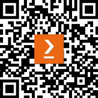

# 前言

Web3 的到来带来了大量的数据，这些数据具有独特的属性，催生了新概念，并赋予了已有概念新的生命。在广阔的 Web3 生态系统中，数据呈现多样的形式，分布在多个平台和格式上，从链上的交易数据到独立的新闻聚合器、预言机和社交网络等。总的来说，Web3 是一个持续生成与其生态系统直接或间接相关的数据的体系。

Web3 凭借其固有的特性，已在多个领域解锁了价值。**去中心化**证明了没有中央权威的商业模式是可能的。**无信任**的互动推动了实体之间的协调，使得即便在陌生人之间、没有中介的情况下，区块链上也能顺利交换商品和服务。这使得价值转移能够以极低的成本覆盖全球的偏远角落，促进了艺术家与收藏家的直接连接，也让众筹得以通过直接支持产品开发者的方式实现，除此之外，还有许多其他应用场景。

然而，Web3 中一个尚未充分探索但却蕴藏巨大价值的方面是**透明度**。透明度促进了信任，这是大众采用的基石。当普通人能够无缝地与 Web3 互动时，且建立在可信赖的、可验证的信息基础上，这将是行业取得的重要里程碑。为了充分实现透明度的潜力，Web3 的数据科学家和分析师需要具备必要的技能、概念知识、工具，并对数据和商业环境有深刻的理解。这也是本书的目标——赋能你成长为能够理解并从数据中提取价值的 Web3 数据专家。

本书分为三个部分。第一部分涵盖了执行数据分析任务所需的基础概念。你将深入了解链上数据，学习如何访问并提取洞察，探索相关的链外数据源，并解决潜在的障碍。此外，本书还将深入探讨两个产生大量数据的领域——NFT 和 DeFi，它们各自有着独特的业务规则和技术概念。

第二部分将重点转向利用 Web3 数据的机器学习应用场景。我们精选了数据科学家， 无论是自由职业者还是雇佣专业人员，在工作中可能遇到的实际案例。

*附录*解答了一个问题：我们应该如何利用所获得的知识？它提供了有关如何在去中心化工作环境中导航的指导，帮助理解行业对未来数据员工的期望，并识别成功所需的软技能和硬技能。为了让读者对行业的未来有一瞥，我们与 Web3 数据领域的领袖进行了互动，他们分享了自己的经验、观点和愿景。本部分的目的是缩短找到工作或以其他方式为行业做出贡献所需的时间。

去中心化、无信任交互和贸易透明度的优势不容忽视，这也是该行业年年增长的原因，解锁了新的应用场景并创造了新的就业机会。本书的目的是帮助读者理解 Web3 所产生的数据，使你能够为塑造*下一代互联网*做好准备。

# 本书的受众

本书的格式和涵盖的主题使其适合那些对 Web3 生态系统感兴趣的数据专业人士。书中的解释经过简化，面向那些没有数据科学背景但渴望利用数据工具深入分析区块链数据的专业人士。你被鼓励参与共享的代码库，并试验提供的解决方案，从而培养实践学习经验。虽然不是强制要求，但具备基础的统计学、机器学习、SQL 和 Python 知识会更加有利。

# 本书的内容

*第一章*，*数据与 Web3 的交汇点*，介绍了 Web3 和数据科学工具的基本概念。

*第二章*，*使用链上数据*，探讨了链上数据的结构。

*第三章*，*使用链外数据*，深入探讨了行业相关的链外数据以及如何找到这些数据的指导。

*第四章*，*探索 NFT 的数字独特性——游戏、艺术与身份*，研究了 NFT 业务以及如何计算相关指标。

*第五章*，*探索 DeFi 分析*，介绍了 DeFi 业务以及如何计算核心指标。

*第六章*，*准备与探索我们的数据*，展示了处理 Web3 数据时常用的预处理步骤。

*第七章*，*机器学习与深度学习入门*，深入探讨了推进第二部分机器学习案例所需的核心概念。

*第八章*，*情感分析——自然语言处理与加密新闻*，探讨了自然语言处理（NLP）在加密情感分析中的应用。

*第九章*，*为 NFT 创作生成艺术*，研究了支持 NFT 计划的艺术生成示例。

*第十章*，*安全性与欺诈检测入门*，探讨了一种用于欺诈检测的应用。

*第十一章*，*基于时间序列的价格预测*，深入探讨了使用时间序列预测价格的应用。

*第十二章*，*使用图表进行营销发现*，探讨了一种通过链上数据识别影响者和社区的应用。

*第十三章*，*通过加密数据构建经验 – BUIDL*，介绍了 Web3 领域中求职或继续深造的多种选择。

*第十四章*，*与 Web3 数据领袖的访谈*，通过深入探讨 Web3 数据领袖对行业及其未来的看法，来总结本书内容。

# 要充分利用本书

一个 Jupyter 或 Google Colab notebook 就足以覆盖所有示例。在某些情况下，为了访问数据，我们需要注册账户并获得 API 密钥。

| **书中涉及的软件/硬件** | **操作系统要求** |
| --- | --- |
| Python 3.7+ | Windows、macOS 或 Linux |
| Google Colaboratory 或 Jupyter notebook |

**如果您使用的是本书的数字版本，我们建议您自行输入代码或从本书的 GitHub 仓库中获取代码（链接将在下一节提供）。这样可以帮助您避免与复制和粘贴代码相关的潜在错误。**

免责声明

本书中所表达的所有观点仅为个人意见，不应视为投资或跟随某一特定策略的诱导。它们仅供参考，不应依赖于做出投资决策。在做出任何投资决策之前，请咨询合格的财务顾问。

# 下载示例代码文件

您可以从 GitHub 下载本书的示例代码文件，网址为 [`github.com/PacktPublishing/Data-Science-for-Web3`](https://github.com/PacktPublishing/Data-Science-for-Web3)。如果代码有更新，GitHub 仓库会进行更新。

我们还在 [`github.com/PacktPublishing/`](https://github.com/PacktPublishing/) 提供了来自我们丰富的书籍和视频目录中的其他代码包。快去看看吧！

# 使用的约定

本书中使用了若干文本约定。

`文本中的代码`：表示文本中的代码词汇、数据库表名、文件夹名称、文件名、文件扩展名、路径名、虚拟 URL、用户输入和 Twitter 用户名。例如：“以下信息来自 CSV 文件，并通过 `Betweenness` `centrality` 列进行过滤。”

代码块如下所示：

```py
{'domain': {'id': '131',
'name': 'Unified Twitter Taxonomy',
'description': 'A taxonomy of user interests. '},
'entity': {'id': '913142676819648512',
'name': 'Cryptocurrencies',
'description': 'Cryptocurrency'}},
```

当我们希望将您的注意力引导到代码块的某个特定部分时，相关的行或项目会以粗体显示：

```py
'annotations': 'annotations': {'start': 10,
'end': 18,
'probability': 0.8568,
'type': 'Organization',
'normalized_text': 'Blackrock'},
```

任何命令行输入或输出都按以下方式书写：

```py
decompose = seasonal_decompose(df, model= 'additive').plot(observed=True, seasonal=True, trend=True, resid=True, weights=False)
```

**粗体**：表示新术语、重要词汇或屏幕上显示的文字。例如，菜单或对话框中的文字通常以**粗体**显示。以下是一个例子：“一旦我们在 API 页面上填写了必填项，我们就可以按下蓝色的**执行**按钮，它会返回我们可以使用的 URL。”

提示或重要说明

如此显示。

# 联系我们

我们始终欢迎读者的反馈。

**一般反馈**：如果您对本书的任何方面有疑问，请通过邮件联系[customercare@packtpub.com，并在邮件主题中提及书名。

**勘误**：尽管我们已尽一切努力确保内容的准确性，但错误仍然会发生。如果您发现本书中的任何错误，请报告给我们。请访问[www.packtpub.com/support/errata](http://www.packtpub.com/support/errata)并填写表格。

**盗版**：如果您在互联网上发现我们作品的任何非法版本，我们将感激您提供相关的链接或网站名称。请通过版权@packt.com 联系我们，并附上该内容的链接。

**如果您有兴趣成为作者**：如果您在某个领域拥有专业知识，并且有兴趣写书或为书籍贡献内容，请访问[authors.packtpub.com](http://authors.packtpub.com)。

# 分享您的想法

阅读完*Data Science for Web3*后，我们很想听听您的意见！请[点击这里直接进入亚马逊的评论页面](https://packt.link/r/1-837-63754-7)，分享您的反馈。

您的评价对我们以及技术社区非常重要，帮助我们确保提供优质的内容。

# 下载本书的免费 PDF 副本

感谢购买本书！

您喜欢随时随地阅读，但又无法随身携带纸质书籍吗？您的电子书购买是否与您选择的设备不兼容？

别担心，现在购买每本 Packt 书籍，您都可以免费获得该书的无 DRM 版 PDF。

在任何地方、任何设备上阅读。直接从您喜爱的技术书籍中搜索、复制并粘贴代码到您的应用程序中。

福利不止这些！您还可以每天通过邮件获取独家折扣、新闻通讯和精彩的免费内容。

按照以下简单步骤获取好处：

1.  扫描以下二维码或访问链接：



[`packt.link/free-ebook/9781837637546`](https://packt.link/free-ebook/9781837637546)

1.  提交您的购买凭证。

1.  就是这样！我们会直接通过电子邮件将您的免费 PDF 及其他福利发送给您。

# 第一部分 Web3 数据分析基础

本书的这一部分将探讨 Web3 数据的表现形式，并识别可靠的提取源。在各个章节中，我们将审视最重要协议的业务流程，并学习如何从它们生态系统中生成的数据中获取可操作的洞见。

本部分包括以下章节：

+   *第一章**，数据与 Web3 的交汇处*

+   *第二章**，与链上数据合作*

+   *第三章**，与链外数据合作*

+   *第四章**，探索 NFT 的数字独特性——游戏、艺术与身份*

+   *第五章**，探索 DeFi 中的分析*
