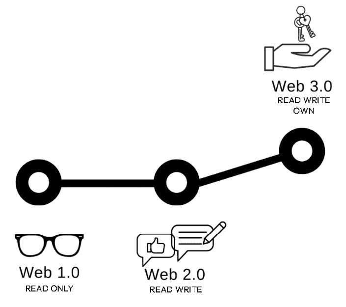
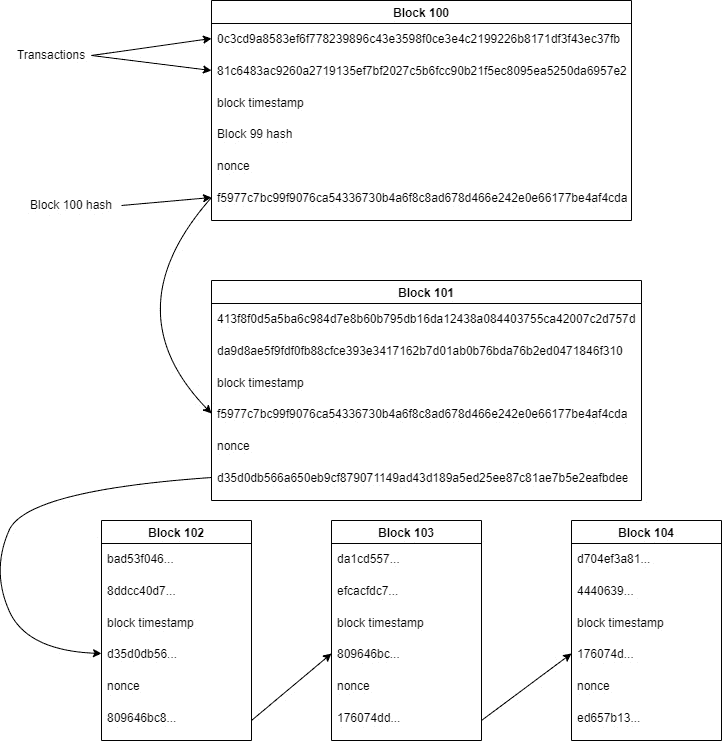
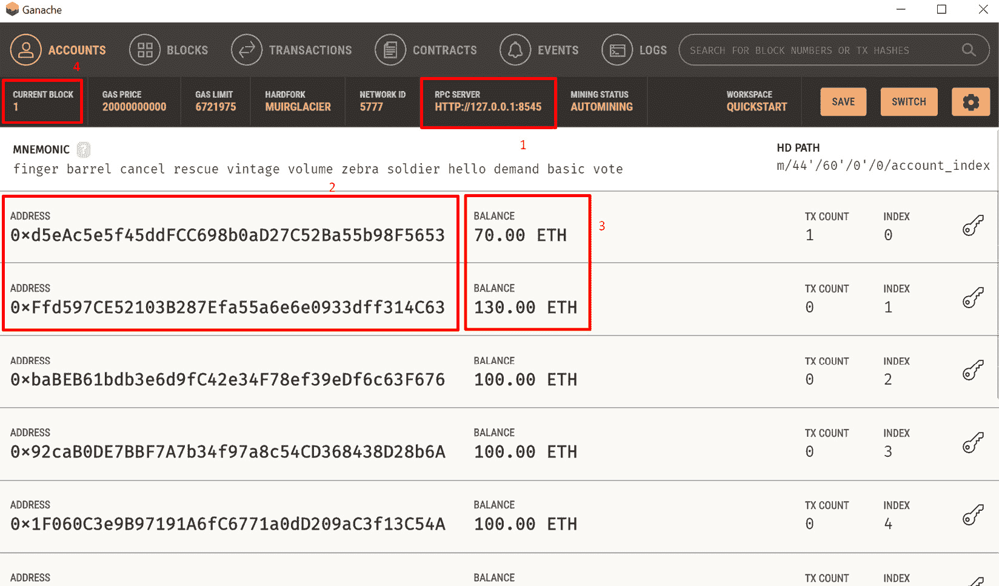
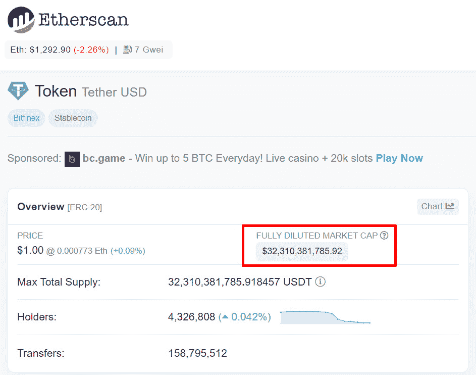
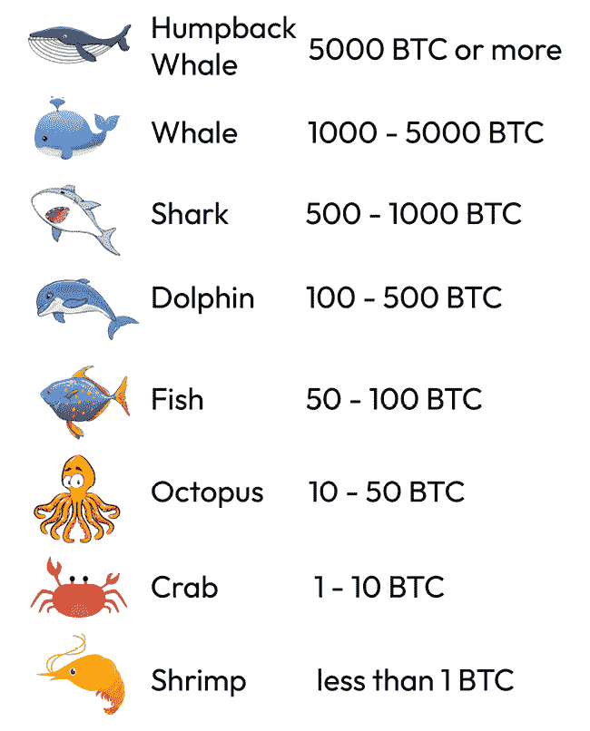
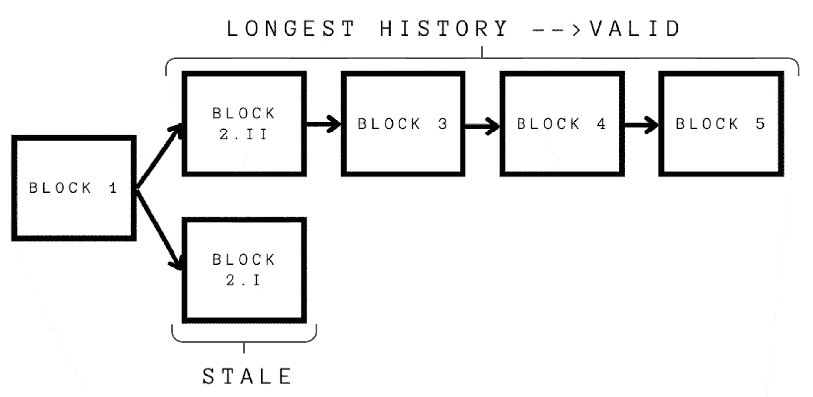

# 第一章：数据与 Web3 相遇的地方

由于我们假设读者没有数据或区块链的先验知识，本章将介绍这两个主题的基本概念。充分理解这些概念对于处理 Web3 数据科学项目至关重要，因为我们将在后续内容中提到它们。Web3 数据科学项目旨在通过数据解决商业问题或释放新的价值；它是应用科学的一个例子。它有两个主要组成部分：数据科学成分和区块链成分，这两部分我们将在本章中讲解。

在*探索数据成分*部分，我们将分析数据科学的概念、可用的数据工具以及我们将遵循的一般步骤，并提供一个轻松的 Python 实践入门。在*理解区块链成分*部分，我们将介绍区块链是什么，它的主要特性，以及为什么它被称为价值的互联网。

在本章的最后部分，我们将深入探讨一些行业概念及如何使用它们。我们还将分析与数据和概念的质量和标准化相关的挑战。最后，我们将简要回顾 API 的概念，并描述我们将在全书中使用的 API。

在本章中，我们将涵盖以下主题：

+   什么是商业数据科学项目？

+   什么是数据成分？

+   介绍区块链成分

+   接近相关行业指标

+   数据质量和标准化的挑战

+   分类 API

# 技术要求

我们将使用 Web3.py，这是一款为与基于 EVM 的区块链（如以太坊）交互而设计的库。最初是一个 JavaScript 库，后来它“*向着 Python 开发者的需求和习惯舒适度*”发展，如其文档所述。Web3.py 是一个简化连接和与区块链交互的库。

如果你以前没有使用过 Web3.py，它可以通过以下代码进行安装：

```py
pip install web3
```

区块链数据是通过连接到托管在节点上的区块链副本来访问的。**Infura** 作为云基础设施提供商，简化了我们与以太坊网络的连接，省去了自己运行节点的需求。创建帐户并获取 API 密钥的详细步骤请参见*附录* 1。

此外，我们将使用**Ganache**，这是一款能够在计算机上创建本地区块链用于测试和开发的程序。这个工具使我们能够模拟真实区块链的行为，而无需为交互支付真实的加密货币。有关如何使用 Ganache 的详细指南，请参见*附录* 1\。

你可以在本书的 GitHub 仓库中找到本章的所有数据和代码文件，链接为[`github.com/PacktPublishing/Data-Science-for-Web3/tree/main/Chapter01`](https://github.com/PacktPublishing/Data-Science-for-Web3/tree/main/Chapter01)。我们建议你通读`Chapter01`文件夹中的代码文件，以便跟上进度。

# 探索数据的组成部分

重要提示

如果你有数据科学背景，可以跳过这一部分。

然而，如果你没有相关背景，这一基础介绍对于理解本书中讨论的概念和工具至关重要。

数据科学是一个跨学科领域，它结合了数学、统计学、编程和机器学习与特定学科知识，旨在提取有意义的洞察。

假设你在一家顶级银行工作，该银行正在考虑首次投资区块链协议，他们要求你根据相关指标提出一个投资协议的候选清单。你可能有一些关于应该考虑哪些指标的想法，但你如何知道哪个指标和数值最相关，从而决定哪些协议应该进入候选名单？一旦你确定了指标，如何找到数据并进行计算呢？

这就是数据科学的作用。通过分析交易数据（链上数据）和非链上的数据（链外数据），我们可以识别出有助于我们做出明智决策的模式和洞察。例如，我们可能会发现某些协议在与银行所在时区不同的时间段内更为活跃。在这种情况下，银行可以决定是否准备好投资于服务不同时间区客户的产品。我们还可以检查协议中锁定的价值，以评估普通投资者对该智能合约的信任度，以及其他许多指标。

但数据科学不仅仅是分析过去的数据。我们还可以使用预测建模来预测未来趋势，并将这些趋势纳入我们的评估。例如，我们可以使用机器学习算法基于协议的价格历史预测该协议发行的代币的价格范围。

对于这项数据分析，我们需要合适的工具、技能和业务知识。我们需要知道如何收集和清理数据，如何使用统计技术分析数据，如何分辨哪些数据对业务相关，哪些数据不相关，以及如何将我们的发现可视化以便有效沟通。做出数据驱动的决策是提高所有相关业务指标的最有效方式，而在这个竞争激烈的世界中，这比以往任何时候都更具价值。

由于数据生成速度快且市场上数据科学家稀缺，《哈佛商业评论》将数据科学家称为“*21 世纪最性感的职业*”。数据经济为多个角色打开了大门，例如数据分析师、数据科学家、数据工程师、数据架构师、商业智能（BI）分析师和机器学习工程师。根据问题的复杂性和数据的规模，我们可以看到他们在一个典型的数据科学项目中扮演着不同的角色。

一个典型的 Web3 数据科学项目包括以下步骤：

1.  **问题定义**：在这个阶段，我们试图回答一个问题，即这个问题是否可以通过数据来解决，如果可以，哪些数据对回答这个问题会有帮助。数据科学家与业务用户之间的协作在定义问题时至关重要，因为后者是专家，是那些将使用数据科学家所产出结果的人。BI 工具，如 Tableau、Looker 和 Power BI，或 Python 数据可视化库，如 Seaborn 和 Matplotlib，在与业务利益相关者的会议中非常有用。值得注意的是，尽管许多 BI 工具目前为常用数据源提供优化包，如 Facebook 广告或 HubSpot，但截至写作时，我尚未看到针对链上数据的优化。因此，最好选择那些高度灵活的数据可视化工具，能够适应任何可视化需求。

1.  **调查与数据获取**：在这个阶段，我们试图回答这样一个问题：我们在哪里可以找到可以用于该项目的必要数据？在本书中，尤其是*第二章*和*第三章*，我们将列出多个与 Web3 相关的数据源，帮助回答这个问题。一旦我们找到了数据所在的位置，就需要构建一个数据摄取管道，供数据科学家使用。这个过程被称为**ETL**，即**提取、转换、加载**。这些步骤对于将干净且有组织的数据提供给数据分析师或数据科学家是必要的。

    数据收集或**提取**是 ETL 过程的第一步，可以包括手动输入、网页抓取、设备的实时流式传输或与 API 的连接。数据可以以结构化格式呈现，意味着它是以预定义的方式存储的，或以非结构化格式呈现，意味着它没有预定义的存储格式，只是以其本地方式存储。**转换**包括修改原始数据，以便进行存储或分析。数据转换可能涉及的活动包括数据归一化、数据去重和数据清洗。最后，**加载**是将转换后的数据移入数据存储并使其可用的过程。在谈到数据可用性时，还需要考虑一些额外的方面，如以正确的格式存储数据、包括所有相关元数据、为合适的团队成员提供正确的访问权限，并确保数据是最新的、准确的或足以满足数据科学家的需求。ETL 过程通常由数据工程师主导，但在确定数据源时，业务所有者和数据科学家也会有发言权。

1.  **分析/建模**：在这个阶段，我们分析数据以提取结论，并可能需要对其建模，尝试预测未来的结果。一旦数据可用，我们可以执行以下操作：

    +   **描述性分析**：这使用数据分析和方法来描述数据展示的内容，深入了解趋势、组成、分布等。例如，对**去中心化金融**（**DeFi**）协议的描述性分析可以揭示其客户最活跃的时段以及**总价值锁定**（**TVL**）和锁定价值随时间的变化情况。

    +   **诊断性分析**：这使用数据分析解释某些事件发生的原因。这类分析通常采用数据组成、相关性分析和深入挖掘等技术。例如，一位区块链分析师可能会试图理解新地址激增与某些地址活动之间的相关性，以识别这些用户在链上所用的应用。

    +   **预测性分析**：这利用历史数据来预测未来的趋势或事件。技术方法包括机器学习、聚类分析和时间序列预测。例如，一位交易员可能会根据某种加密货币的历史表现，试图预测其未来的走势。

    +   **规范性分析**：这使用预测分析的结果作为输入，建议最佳的响应或最佳行动方案。例如，一个机器人可以建议是否买入或卖出某种加密货币。

    +   **生成式 AI**：这使用机器学习技术和大量数据来学习模式，并生成新的原创输出。人工智能可以创建图像、视频、音频、文本等内容。生成模型的应用包括 ChatGPT、Leonardo AI 和 Midjourney 等。

1.  **评估**：在这个阶段，我们的分析或建模结果会被评估和测试，以确认它是否符合项目目标并为企业提供价值。我们会识别出模型中的任何偏差或弱点，如果需要，整个过程将重新开始，以解决这些错误。

1.  **展示/部署**：这个过程的最终阶段取决于问题的性质。如果是一个需要公司做出决策的分析，我们的工作可能会以展示和解释我们的发现为结束。或者，如果我们是作为更大软件管道的一部分工作，我们的模型很可能会被部署或集成到数据管道中。

这是一个迭代过程，这意味着，尤其在*步骤 4*中，我们常常会从业务团队那里收到有价值的反馈，进而根据反馈调整初步结论。传统数据科学的规律同样适用于 Web3 行业，因为这是一个数据在建立信任、推动投资和一般性地解锁新价值方面发挥关键作用的行业。

尽管数据科学不是一个编程职业，但由于可用的数据量巨大，它在很大程度上依赖于编程。在本书中，我们将使用**Python**语言和一些**SQL**来查询数据库。Python 是一种通用编程语言，数据科学社区常用它，它因其简单的语法而容易学习。Python 的替代品是 R，R 是一种统计编程语言，通常用于数据分析、机器学习、科学研究和数据可视化。访问 Python 或 R 及其相关库和工具的一种简单方法是安装 Anaconda 发行版。它包括流行的数据科学库（如 Python 的 NumPy、pandas 和 Matplotlib），并简化了设置环境的过程，以便开始进行数据分析和机器学习项目。

本书中的活动将在三个工作环境中进行：

+   `.ipynb`格式非常适合用于数据分析或训练模型。在机器学习章节中，我们将使用 Colab 笔记本，因为它为用户提供了免费层次的 GPU 资源。

+   `.py`格式非常适合用于构建应用程序。大多数 IDE 允许用户下载扩展插件来处理笔记本文件。

+   **查询平台**：在*第二章*中，我们将访问具有内置查询系统的链上数据平台。那些平台的例子包括 Dune Analytics、Flipside、Footprint Analytics 和 Increment。

Anaconda Jupyter 笔记本和 IDE 使用我们的计算机资源（如 RAM），而 Google Colaboratory 使用云服务（有关资源的更多信息，请参见*附录*1）。

请参阅*附录*1 以安装之前提到的任何环境。

一旦我们有了干净的笔记本，我们将通过`Chapter01/Python_warm_up`笔记本来热身我们的 Python 技能，该笔记本遵循[`learnxinyminutes.com/docs/python/`](https://learnxinyminutes.com/docs/python/)的教程。为了更深入学习 Python，我们鼓励你阅读 Packt Publishing 的《*Data Science with Python*》或《*Python Data Science Handbook*》，这两本书都列在本章的*进一步阅读*部分。

一旦我们完成热身练习，我们将使用 Web3.py 库启动 Web3 客户端。让我们在接下来的章节中了解这些概念。

# 了解区块链成分

如果你有区块链开发背景，可以跳过本节内容。Web3 代表了基于去中心化数据库、无权限和无需信任的互动以及本地支付的下一代万维网。这个互联网的新概念开辟了各种商业可能性，其中一些仍处于早期阶段。



图 1.1 – 网络的演变

目前，我们正处于 Web2 阶段，在这一阶段，集中式公司存储着大量来自我们与应用程序互动的数据。Web3 的承诺是，我们将与**去中心化应用**（**dApps**）进行互动，这些应用仅将相关信息存储在区块链上，且所有人都可以访问。

在撰写本文时，Web3 存在一些以以太坊组织为代表的局限性：

+   **速度**：区块链更新的速度构成了可扩展性挑战。正在测试多个方案以尝试解决这个问题。

+   **直觉**：与 Web3 互动仍然很难理解。其逻辑和用户体验不如 Web2 直观，且在用户能够大规模使用之前，需要进行大量的教育工作。

+   **成本**：将整个业务流程记录在链上是昂贵的。作为 dApp 一部分的多个智能合约对开发者和用户来说都花费巨大。

区块链技术是支撑 Web3 的基础技术。它基于**分布式账本技术**（**DLT**），该技术在信息经过加密验证后进行存储。一旦记录在账本中，每笔交易都无法修改，并且多个方拥有其完整副本。

该技术的两个结构特征如下：

+   它是由一组区块构成的，每个区块包含关于前一个区块的信息（经过加密哈希处理——我们将在本章进一步了解这一点），使得后期无法修改。每个区块通过这一加密共享机制与前一个区块相链。



图 1.2 – 一组区块的表示

+   它是去中心化的。整个账本的副本分布在多个服务器上，我们称这些服务器为节点。每个节点都有一份完整的账本副本，并且在每次添加新块到区块链上时都会验证一致性。

该结构为双重支付问题提供了解决方案，使得首次通过互联网实现了去中心化的价值转移。这就是为什么 Web3 被称为*价值* *互联网*的原因。

由于完整的账本版本分布在区块链的所有参与者之间，任何与先前存储信息相矛盾的新交易都不会被成功处理（无法达成共识添加它）。这一特性使得不相识的各方能够在无需中介担任担保人角色的情况下进行交易，这就是为什么这项技术被称为无信任技术。

去中心化存储也将控制权从每个服务器中移除，因此，一旦交易被添加到区块链中，就没有单一的权威能够更改任何数据点。由于摧毁一个节点不会影响网络，如果黑客想要攻击数据库，他们将需要极高的计算能力，尝试的成本将变得经济上不可行。这为区块链带来了集中式服务器所没有的安全级别。

## 三代区块链

第一代区块链是**比特币**，它基于中本聪的论文《*比特币：一种点对点的电子现金系统*》。该区块链的主要用途是金融。尽管最初这项技术被视为绕过银行等中介机构的方式，但现在，传统金融系统和加密货币世界开始合作，尤其是在比特币方面，因为它现在被视为一种数字价值储存手段，一种数字黄金。尽管如此，两者系统的整合仍面临许多监管和实际障碍。

第二代区块链在之前描述的数据库结构中加入了智能合约的概念，**以太坊**是第一个引入这一概念的区块链。通过以太坊，用户可以在交易执行之前就达成协议条款。这个链开启了智能合约的时代，正如尼克·萨博所描述的，智能合约的逻辑就像自动售货机，可以自主执行代码，包括数字资产的管理，这是一场真正的革命。为了实现这一点，网络中有一个**以太坊虚拟机**（**EVM**），它可以执行任意代码。

最后，第三代区块链是在前两代区块链的基础上进行构建，旨在解决可扩展性和互操作性问题。本书中提到的*链上*数据，指的是由第二代和第三代区块链生成的、与 EVM 兼容的数据，因为在本书写作时，这正是大多数开发工作进行的地方（例如，以太坊、BSC 或 Rootstock）。因此，比特币数据和非 EVM 结构不在讨论范围内。

## 引入区块链要素

现在，让我们来了解一些与区块链相关的重要附加概念。

### Gas（燃料）

为了让汽车前进，我们使用汽油作为燃料。这使我们能够到达期望的目的地，但也需要付出代价。汽油价格根据油价和运输成本等因素波动。区块链技术中也有类似的概念。为了在链上保存一个交易，必须支付一定的燃气费用。简而言之，燃气是支付给网络的指令费用，用以执行我们的交易。建立这种费用的目的有两个：一是燃气费用支付给矿工/验证者，作为他们服务的报酬，并激励他们继续融入区块链；二是为用户设定一个费用标准，使他们在使用资源时更加谨慎，鼓励区块链只记录那些价值高于支付燃气费用的内容。本书中我们将学习的所有网络都适用这一概念。

燃气费用具有多重成本含义。由于燃气费用是用网络的原生币支付的，如果价格上涨，使用网络的成本可能变得过于昂贵，从而抑制了其采用。这正是以太坊所经历的情况，导致它对内部规则进行了多次更改，以解决这一问题。

如前所述，每次与区块链的互动都会产生费用。因此，并不是所有内容都需要存储在区块链中，采用这种数据库（区块链）需要根据业务需求进行验证。

加密货币可以被划分为更小的单位，就像美元可以划分为美分一样。比特币的最小单位是 Satoshi，以太坊的最小单位是 Wei。以下是一个单位和面值的表格，便于跟踪燃气费用。

| **单位名称** | **Wei** | **Ether** |
| --- | --- | --- |
| Wei | 1 | 10-18 |
| Kwei | 1,000 | 10-15 |
| Mwei | 1,000,000 | 10-12 |
| Gwei | 1,000,000,000 | 10-9 |
| 微以太 | 1,000,000,000,000 | 10-6 |
| Milliether | 1,000,000,000,000,000 | 10-3 |
| Ether | 1,000,000,000,000,000,000 | 1 |

表 1.1 – 单位面值及其数值

### 地址

当我们使用除现金之外的支付方式时，我们传输一串字母或数字，或两者的组合，以便转移我们的资金。这串字符对于识别收款方的国家、银行和账户，以及持有我们资金的实体至关重要。类似地，地址执行了相似的功能，并作为区块链上的标识号码。它是一串字母和数字，可以*发送或接收*加密货币。例如，以太坊地址由 42 个十六进制字符组成。地址是一个非对称密钥对的公钥哈希，它包含了第三方转移加密货币所需的所有信息。这个公钥是从私钥派生的，但反向过程（从公钥推导私钥）是不可执行的。私钥用于授权/签署交易或访问存储在账户中的资金。

地址可以分为两类：**外部拥有地址**（**EOA**）和合约账户。它们都可以接收、持有和发送资金，并与智能合约交互。EOA 由持有私钥的用户拥有，用户可以根据需要创建任意数量的 EOA。合约账户是部署了智能合约的地址，并由合约代码控制。它们之间的另一个区别是创建成本。创建 EOA 不需要支付 gas 费用，而创建智能合约地址需要支付 gas 费用。只有 EOA 账户能够发起交易。

市场上还有一种产品，叫做智能账户，它利用了账户抽象概念。该开发背后的理念是方便用户在账户中编程更多的安全性和更好的用户体验，例如设置每日消费限额或选择支付 gas 的代币。这些都是可编程的智能合约。

尽管“钱包”和“地址”这两个术语常常互换使用，但它们之间存在技术上的区别。如前所述，地址是非对称密钥对的公钥哈希。另一方面，钱包是存储公钥和私钥的抽象位置。它是一个简化与网络交互的软件接口或应用程序，便于查询账户、签署交易等。

### 共识协议

当多个方一起合作时，特别是当他们彼此不认识时，需要达成一套可持续工作的规则。在区块链的情况下，需要确定如何将交易添加到区块中并改变其状态。这就是共识协议的作用所在。共识是指区块链所有节点达成一致，通过向链中添加新区块来改变链的状态。协议包含一套参与规则、奖励/惩罚以对齐激励机制等内容。参与的节点越多，网络越去中心化，安全性也越高。

共识可以通过几种方式达成，但在开放网络中存在两个主要概念。

#### 工作量证明（PoW）

这是比特币使用的共识协议。它涉及解决数学方程，方程的难度取决于网络的拥堵程度。

解决这些谜题消耗大量能源，导致硬件密集型竞争。试图解决谜题的各方被称为矿工。

胜利方找到符合方程规则的整数并通知其他节点答案。其他方验证答案是否正确，并将该区块添加到他们的区块链副本中。胜利方因解决谜题而获得奖励，这是一种预定数量的加密货币。这就是系统发行从未被花费的比特币的方式，称为 Coinbase 交易。

在比特币协议中，奖励每 21,000 个区块减半。

#### 权益证明（PoS）

这是以太坊区块链（截至 2022 年 9 月 15 日，共识协议为 PoW）以及许多其他区块链（如 Cardano）目前使用的协议。

PoS 背后的原理是，参与方通过将自己的加密货币抵押在区块链中，获得验证交易、更新区块链并赚取奖励的机会。通常，成为验证者需要抵押一定数量的加密货币。之所以称为“在押”，是因为规则包括对验证者（处理交易并向区块链添加新区块的节点）如果离线或行为不当时的潜在处罚或“削减”。削减意味着失去一部分存入的加密货币。

正如我们所看到的，通过奖励和处罚机制，所有参与者的激励得以对齐，朝着单一版本的区块链发展。

共识协议的列表在不断发展，反映了人们为解决 Web3 中的一些局限性（如速度或成本）而持续努力的过程。一些替代的共识协议包括权威证明（Proof of Authority）——在这种协议下，少数节点有权验证交易并将区块添加到区块链中——以及空间证明（Proof of Space）——它利用磁盘空间来验证交易。

## 进行第一次交易

有了这些概念后，我们现在将在本地环境中使用 Ganache 中的本地以太坊执行一笔交易。

首先，让我们打开一个本地的 Jupyter 笔记本，并启动 Ganache 的快速入门版本。

这里是我们需要的信息：



图 1.3 – Ganache 主页面及连接所需的相关信息

让我们看一下代码：

1.  导入 Web3.py 库：

    ```py
    from web3 import Web3
    ```

1.  连接到在我们 Ganache 页面（第 1 项）中描述的端口上运行的区块链：

    ```py
    ganache_url= "http://127.0.0.1:8545"
    web3= Web3(Web3.HTTPProvider(ganache_url))
    ```

1.  定义接收和发送地址（第 2 项）：

    ```py
    from_account="0xd5eAc5e5f45ddFCC698b0aD27C52Ba55b98F5653"
    to_account= "0xFfd597CE52103B287Efa55a6e6e0933dff314C63"
    ```

1.  定义交易。在这种情况下，我们将在先前定义的账户之间转移 30 个以太币：

    ```py
    transaction= web3.eth.send_transaction({
      'to': to_account,
      'from': from_account,
    'value': web3.toWei(30, "ether")
    })
    ```

1.  我们可以通过以下代码片段查看交易前后的账户余额：

    ```py
    web3.fromWei(web3.eth.getBalance(from_account),'ether'))
    web3.fromWei (web3.eth.getBalance(to_account), 'ether'))
    ```

恭喜！如果你从未在区块链上转移过价值，那么你已经达成了第一个里程碑。完整的代码可以在`Chapter01/First_transaction`中找到。

关于 CBDC 的说明

什么是**CBDC**？这个缩写代表**中央银行数字货币**。它是一种由各国中央银行发行的全新形式的电子货币。

很多国家在这一发展路线图中处于不同的阶段。2022 年 1 月 20 日，美国联邦储备委员会发布了关于 CBDC 的讨论文件，在 COVID-19 疫情之前，他们还通报了关于 CBDC 可能带给系统的益处的持续研究。截至 2022 年 7 月，已有 100 种 CBDC 处于研究和开发阶段。各国正在寻找最佳的基础设施，研究其对社区的影响，并且关注这种新的价值转移方式可能给金融系统带来的新风险，这些系统可能对变革持保守态度。

我们在本章中介绍的一些概念将对 CBDC 时代有用，但根据项目及其特点，并非所有概念都会出现。特别有趣的是，看看它们如何解决集中化问题。以下链接提供了一个非常有用的项目状态追踪器：[`cbdctracker.org/`](https://cbdctracker.org/)。

在本节中，我们分析了区块链技术的基础，包括燃气费、地址和共识协议等关键概念，并探讨了 Web3 的演变。我们还使用 Ganache 和 Web3.py 执行了一笔交易。

在对交易流有了基础理解后，我们现在将重点转向分析初始指标，并更好地理解这一行业中的数据挑战。

# 接近 Web3 行业指标

在本节中，我们回顾了一些在每个 Web3 仪表板中都非常标准的指标。然而，这仅仅是一个基础层次，每个行业参与者都会添加与其相关的额外指标。

为了从以太坊区块链中提取信息，我们需要通过一个节点建立与区块链的连接，该节点持有区块链的副本。有多种方式可以连接到区块链，我们将在*第二章*中更详细地探讨这个问题。对于以下指标，我们将使用**Infura**。*有关如何连接到 Infura 的逐步指南，请参阅* *附录 1*。

## 区块高度

这指的是区块链上的当前区块。创世区块通常被称为区块 0，之后的区块按顺序编号。要检查区块高度，可以使用以下代码片段：

```py
web3.eth.blockNumber
```

区块号可以作为区块的 ID。追踪它有助于确定交易已获得多少次确认，这相当于在感兴趣的区块之后开采或添加了多少个附加区块。交易在链上的位置越深，安全性和不可逆性越高。

## 时间

在讨论区块链中的时间时，需要考虑两个概念。第一个是区块之间的时间间隔，这取决于区块链的不同。在以太坊中，经过最近的协议更改，每个时间段为 12 秒。每个验证者都在这段时间内获得一个插槽来提议一个区块，如果所有验证者都在线，将不会有空白插槽，从而每 12 秒就会添加一个新区块。第二个概念是区块被添加到区块链时的时间戳，通常以 Unix 时间戳格式存储。Unix 时间戳是一种追踪时间流逝的方式，记录自 1970 年 1 月 1 日（UTC 时间）以来的秒数总和。

要提取区块时间戳，请使用以下代码片段：

```py
web3.eth.get_block(latest).timestamp
```

## 代币经济学

代币经济学指的是区块链上代币项目内部经济的特征，包括供应、需求和通货膨胀。这涉及到确定将发行多少数字资产，是否对总量有所限制，代币的使用场景，以及控制流通资产数量的销毁机制。

代币白皮书通常包含了关于基本代币经济学问题的官方解释。

比特币代币经济学

比特币的供应量被限制为 2100 万个比特币，这一数量不能超过。新的比特币通过挖矿进入流通，矿工每次成功添加一个区块到链上时都会获得奖励。

每个区块大约每 10 分钟挖掘一次，因此到 2140 年，所有 2100 万个比特币将全部流通。

每挖掘 210,000 个区块，获得的比特币奖励数量就会减半，这样每大约四年就会发生一次减半。直到所有 2100 万个比特币被挖掘完毕，矿工将不再收到区块奖励，而将完全依赖交易费用来获得收入。

代币，因此它们的代币经济学，在去中心化金融（DeFi）平台的运作和可持续性中起着基础性作用。受此技术影响最大的行业之一是金融行业，它催生了一个新的概念，即**去中心化金融**，或称**DeFi**。DeFi 由建立在公共区块链上的点对点金融解决方案组成。这些计划提供类似银行及其他金融机构的服务，如存款利息、贷款和资产交易，且无需银行或其他中心化金融机构的介入。通过一套开放的智能合约（或协议），任何拥有地址的人都可以参与其中。

DeFi 的一个具体例子是 Aave，这是一个借贷平台，允许用户在没有银行等中介的情况下借贷各种加密货币。例如，如果 Jane 想要借 10 个 ETH，她可以去 Aave，创建借贷请求，并等待智能合约将她的请求与愿意借出 ETH 的可用借款人匹配。借出的 ETH 会按照反映供需水平的利率借出。借出的资金来自一个流动性池，借款人将他们的加密货币存入该池以赚取利息。通过 Aave 的去中心化平台，借款人和贷方可以直接交易，无需通过传统金融机构。

我们将在*第五章*深入探讨 DeFi。

## 锁仓总值（TVL）

TVL 是指当前在特定 DeFi 协议中锁仓的资产总值。它通过用户在协议中存入的资金量来衡量某个协议的健康状况。当用户在协议中存入更多资产时，TVL 会增加；反之，当用户取出资产时，TVL 会减少。它的计算方法是将协议中锁仓的资产价值相加，并乘以当前价格。

不同的 DeFi 协议可能有不同的 TVL 计算方式，准确的计算需要了解每个协议的运作方式。一个专门测量 TVL 的网站是 DefiLlama（可访问 [`defillama.com/`](https://defillama.com/)）。

TVL 还可以通过将该数字除以该协议发行的代币的市值（或流通中的总供应量）来帮助交易者判断某个代币是否被低估。

这个指标有助于将不同的 DeFi 协议进行比较。

## 总市值

市值代表某个代币市场的规模，与传统金融概念密切相关。市值的计算方法是将发行的代币数量乘以其当前市场价格。**流通供应量**是当前由公众持有的代币总和。要获得这个数字，我们需要计算所有不是铸造和销毁地址的地址中的代币，并减去我们已知由协议控制或分配给开发团队或一些投资者的地址所持有的价值。

**最大供应量**或**总供应量**是由某个智能合约发行的代币总数。将最大供应量乘以当前价格将得到完全稀释的市值。获取总供应量有两种方法，分别是通过状态数据和交易数据。

在*第二章*中，我们将学习如何访问状态数据，因为代币的智能合约有一个可以通过 Web3.py 查询的功能。为此，我们需要 `Chapter01/Relevant` `metrics II.ipynb` 文件。

另一种访问交易数据库并计算总供应量的方法是通过 SQL 对智能合约的所有铸币事件进行求和，然后减去销毁事件。在*第五章*中，我们将学习如何做这件事。

市值是动态的，因为随着市场价格和代币供应量的波动，市值也会变化。代币市值在加密货币行业中被广泛用作衡量不同代币表现的基准。

在`Chapter01/Relevant metrics II.ipynb`中，我们分析了**Wrapped BTC**（**WBTC**）代币，这是一个 TVL 和总市值重合的案例，因为该代币与抵押品按 1:1 的比例挂钩。

数据科学家将面临的最大挑战之一是达成共识，定义共同的标准并找到可信的数据源。我们可能对计算复杂金融指标的数学公式有很好的掌握，但如果没有可靠的数据和社区共识的标准，我们传达研究结果的能力将会受到限制。在下一节中，我们将探讨这些挑战并讨论如何克服它们。

# 数据质量挑战

在本节中，我们将讨论数据质量的挑战，这些挑战不仅仅是 Web3 特有的，而是所有基于数据做出决策的专业人士都需要面对的问题。数据质量的挑战包括从获取不完整、不准确或不一致的数据到数据安全、隐私或治理等问题。然而，Web3 数据分析师将面临的一个最重要的挑战是数据源的可靠性。

例如，市值是通过将两个数据源进行简单乘法运算得出的：区块链数据提供了流通中的代币总供应量，市场价格则提供了相应的价格。然而，这种乘法运算的结果会根据不同的来源而有所不同。让我们以 USDT 的市值为例。在一个来源中，出现了以下信息：



图 1.4 – USDT 市值信息（来源：https://etherscan.io/token/0xdac17f958d2ee523a2206206994597c13d831ec7）

在 CoinMarketCap 网站上，对于同一代币，完全稀释后的市值为 70,158,658,274 美元（https://coinmarketcap.com/currencies/tether/）。

从这个例子中我们可以看到，相同的概念根据我们查看的来源显示方式不同。那么，当我们有多个信息来源时，如何选择呢？

关于区块链活动，最可信和最全面的真实数据来源是*节点的完整副本*。访问一个节点可以确保我们始终能够访问区块链的最新版本。一些服务会对区块链进行索引，以便方便地访问和查询，比如 Google BigQuery、Covalent 或 Dune，它们会不断更新自己的副本。这些副本是受控制和集中的。

当谈到价格时，有很多来源。获取价格的常见方法是连接到在线加密货币市场，通常称为交易所，如**币安**或**Kraken**，以提取它们的市场价格。然而，由于各种原因，这些市场的商业化可能会被暂停。例如，在著名的**Terra USD**（**TUSD**）脱钩事件中，当稳定币失去了与美元的 1:1 挂钩时，许多交易所停止了商业化，理由是消费者保护问题。如果我们的工作流程依赖于此类数据，就可能受到干扰或显示不准确的旧价格。为了解决这个问题，建议从多个交易所平均价格的来源获取数据，这样可以提供更强大的信息。

在这一阶段，理解什么构成对我们公司来说的高质量信息至关重要。我们是优先考虑快速且实时更新的信息，还是更注重相对较慢但精准的信息？虽然在每个项目中不一定需要考虑这一点，但决定某些来源并标准化流程将为我们节省未来的时间。

一旦我们确定了要使用的信息质量，我们需要商定我们想要分析的概念。

# 数据标准挑战

作为一个年轻的行业，许多概念的含义仍没有完全达成共识。让我们来看几个例子。

## 零售

在加密货币领域，有一个完整的水生生态系统，用于根据地址持有的加密货币数量对其进行分类。较大的地址通常被称为“鲸鱼”，而较小的地址则有自己的名称。请参见以下插图以供参考：



图 1.5 – 加密货币持有量及其水生等价物

尽管在分类中使用的水生等价物有共识，但对于每个类别代表的比特币数量，并没有统一的协议。快速的谷歌搜索会揭示出对于什么构成某一类别的地址标准各不相同。

另一种分类，尤其对于分析师来说非常有价值，是区分零售地址（小投资者）和专业地址。挑战在于确定区分二者的阈值。目前有多种方法可供使用，我们可以遵循前面提到的水生等价物定义，或者采用由一家名为 Chainalysis 的法务公司提出的定义：“*零售交易者（…）每次在交易所存入的比特币价值少于 10,000 美元*。”

## 确认

在传统银行或中心化机构中，当用户发送一笔交易时，一旦交易被接收，就会得到确认并视为完成。而在区块链领域，由于网络的去中心化特性，产生了不同的动态，因此，通常需要不同数量的确认，才能将不同金额的交易视为有效。

在去中心化网络中，完全有可能在世界的不同地方同时开采出两个区块。协议会等待下一个区块被挖掘出来，并根据其附加的位置来判断哪条链是最长的（最长的链被视为有效链）。在比特币中，未能成为最长链一部分的区块被称为**过时区块**，而在以太坊（合并前）中，它们被称为**叔块**。一旦交易被包含进一个区块，它会被赋予一次确认。如果我们的交易进入了一个过时区块，它将在比特币中被逆转并返回到内存池，或在以太坊中被添加到另一个区块中，重新开始确认计数。

然而，考虑到逆转的可能性，尽管非常小，交易对手方通常会要求在确认交易不可逆转之前，获得一定数量的确认。随着包含我们交易的区块之后链条的增长，交易被逆转的可能性越小。在以太坊合并后（发生在区块`15537394`），叔块不再生成，但一些做法在市场参与者中依然存在。

对于所需确认数量没有统一标准。建议可能有所不同，有些建议比特币需要六次确认，而小额转账则只需两次确认。对于以太坊，通常的确认次数在 20 次到 40 次之间。值得注意的是，像 Coinbase 这样的中心化交易所仍然可能要求比特币确认两次，或以太坊确认 35 次。



图 1.6 – 过时交易与有效交易

## NFT 地板价

NFT 地板价作为一个衡量指标，用于确定集合中任何 NFT 的最低售价，为市场参与者提供有关项目公正定价的宝贵见解。

计算方法没有普遍接受的标准。一个基本的方法是找出在某个集合中，NFT 曾经卖出的最低价格。然而，由于存在多个市场，每个市场有其独特的定价结构，另一种方法是考虑来自最主要艺术市场的价格，或者从多个来源聚合价格，并给重要市场更多的权重。

此外，必须考虑像“洗盘交易”这样的做法，它会人为地夸大所分析的指标。我们将在*第四章*中进一步分析这一概念。

## “丢失”这一概念

假设我们需要计算未来五年内比特币的流通供应量。在这样的计算中，我们不仅要考虑将开采多少比特币，还要考虑有多少比特币可以被视为“丢失”。我们如何确定一定数量的加密货币已丢失？

要在区块链上转移资产，我们需要使用私钥签名该转移。如果该私钥丢失，我们将无法访问这些资产，因此，这些资产必须视为丢失。考虑到这一点，我们可以安全地假设，目前提供的一部分比特币已经丢失或将会丢失。在查看区块链时，我们可以看到某个地址拥有这些资金，但完全有可能该地址无法处置这些资金。由于这是一个伪匿名系统，我们无法联系比特币持有者并询问他们是否可以访问自己的资金；也没有集中式的方式来验证这一点。

名为 Chainalysis 的取证公司提出了“*五年内未动过的比特币被视为丢失*”这一定义。根据这一定义，20% 的已开采比特币将被视为丢失。这是一个提议的概念，尚需观察它是否成为标准。

总结来说，我们可以达成三种理想的 Web3 数据处理方法：

+   深入了解将在仪表板上展示的指标或将被我们的模型消耗的数据。彻底阅读相关概念和文档。

+   保持开放的心态，寻找同一市场主题的不同处理方式。由于行业还在增长，某些事情还没有固定的做法。

+   准备好见证随着行业成熟和精细化最佳实践，概念的变化。

要了解智能合约的技术方面，OpenZeppelin 文档是一个宝贵的参考。同样，对于市场相关的概念，正如之前提到的，Chainalysis 定义了许多概念，并可以作为起点帮助理解。

# **API** 简要概述

**API**（应用程序接口）通过一系列请求和响应促进两个软件服务之间的通信。例如，当我们在电话应用中收到有关代币价格下跌的通知时，这意味着我们的应用通过 API 与价格提供者（如 CoinMarketCap）进行通信。为了构造请求以获得所需的响应，我们必须始终参考相关的 API 文档。

为了更全面地理解 API，我们可以参考 Packt 出版社的《*Python API 开发基础*》一书。由于我们将频繁与 API 交互以提取信息，因此复习不同 API 的主要特性将大有裨益。这将大大帮助我们在编程时访问信息。

为此，我们将重点关注以下内容：

+   **远程过程调用（RPC）API**：在 RPC API 中，客户端在服务器上启动一个函数，服务器返回输出。实际上，我们将函数的方法（端点）包含在 URL 中，将参数包含在查询字符串中。在这种情况下，客户端需要掌握有关端点的所有信息，有时还需要构建一个包含从其他 URL 查询的信息的工作流。一个用 JSON 格式编码的 RPC API 示例是我们在前面章节中使用的 Infura 套件。

+   `GET`、`POST`、`PUT` 或 `DELETE`，服务器响应通常以 JSON 格式返回。一个 REST 请求通常包括 HTTP 方法、端点、头部和主体。端点标识在线资源，头部提供服务器信息，如身份验证，主体包含发送方希望传输到服务器的请求信息。

Facebook 开发了一种替代方法，名为开源查询语言 **GraphQL**。与前述的 API 最大的区别是，GraphQL 是一种查询语言，而 REST 是一种软件架构概念。GraphQL 是一种数据检索语法，允许客户端指定所需信息，而不像 REST 基础设施那样，查询返回每个端点的固定数据集（有时包括比必要更多的信息）。

GraphQL 的一个显著特点是能够通过单次 API 调用从多个资源中获取数据。**Graph** 是以 GraphQL 查询的以太坊网络索引器和查询协议，我们将在 *第二章* 中进一步深入探讨。

# 总结

在本章中，我们概述了数据科学和 Web3 的概念，涵盖了数据科学项目的典型步骤、Web3 的发展以及共识、地址和 gas 等基本概念。我们还深入探讨了 Web3 这一快速发展的领域中存在的普遍度量和挑战。

在接下来的章节中，我们将深入探讨链上数据，这是 Web3 的主要数据集。我们的探索将包括对区块和交易的详细分析。我们还将讨论访问这些宝贵数据的各种方法。在该章节结束时，你将对链上数据及如何有效地浏览和利用它有一个扎实的理解。

# 进一步阅读

为了补充本章内容，以下链接可能会有所帮助：

+   数据要素：

    +   Python 代码风格指南： [`peps.python.org/pep-0008/`](https://peps.python.org/pep-0008/)

    +   *数据科学与* *Python*： [`www.packtpub.com/product/data-science-with-python/9781789346251`](https://www.packtpub.com/product/data-science-with-python/9781789346251)

    +   *Python 数据科学* *手册*： [`jakevdp.github.io/PythonDataScienceHandbook/`](https://jakevdp.github.io/PythonDataScienceHandbook/)

    +   Web3.py 文档： [`web3py.readthedocs.io/en/latest/#`](https://web3py.readthedocs.io/en/latest/#)

+   区块链构成：

    +   EVM 文档： [`ethereum.org/en/developers/docs/evm/`](https://ethereum.org/en/developers/docs/evm/)

    +   中本聪的论文： [`bitcoin.org/bitcoin.pdf`](https://bitcoin.org/bitcoin.pdf)

    +   EVM 解释： [`www.youtube.com/watch?v=GPoze5RmDVU`](https://www.youtube.com/watch?v=GPoze5RmDVU)

    +   gas 文档： [`ethereum.org/en/developers/docs/gas/`](https://ethereum.org/en/developers/docs/gas/)

    +   Wackerow, P. 等人, 2022\. Web2 与 Web3 | ethereum.org. [在线] ethereum.org. 可在 [`ethereum.org/en/developers/docs/web2-vs-web3/`](https://ethereum.org/en/developers/docs/web2-vs-web3/) 获取

    +   Szabo, N., 2022\. 智能合约：数字市场的构建模块。 [在线] Fon.hum.uva.nl. 可在 [`www.fon.hum.uva.nl/rob/Courses/InformationInSpeech/CDROM/Literature/LOTwinterschool2006/szabo.best.vwh.net/smart_contracts_2.xhtml`](https://www.fon.hum.uva.nl/rob/Courses/InformationInSpeech/CDROM/Literature/LOTwinterschool2006/szabo.best.vwh.net/smart_contracts_2.xhtml) 获取

    +   Stanley, A., 2022\. CBDC 的崛起。 [在线]. 可在 <[`www.imf.org/en/Publications/fandd/issues/2022/09/Picture-this-The-ascent-of-CBDCs`](https://www.imf.org/en/Publications/fandd/issues/2022/09/Picture-this-The-ascent-of-CBDCs)> 获取

    +   Covalent. 2022\. Covalent 区块链数据 API 参考 – Covalent [在线]. 可在 [`www.covalenthq.com/docs/api/#/0/0/USD/1`](https://www.covalenthq.com/docs/api/#/0/0/USD/1) 获取。

    +   Ethereum-etl.readthedocs.io. 2022\. Google BigQuery – Ethereum ETL [在线]. 可在 [`ethereum-etl.readthedocs.io/en/latest/google-bigquery/`](https://ethereum-etl.readthedocs.io/en/latest/google-bigquery/) 获取。

+   相关行业指标：

    +   更多关于 gas 费用计算的信息： [`growingdata.com.au/how-to-calculate-gas-fees-on-ethereum/`](https://growingdata.com.au/how-to-calculate-gas-fees-on-ethereum/)

    +   以太坊黄皮书： [`ethereum.github.io/yellowpaper/paper.pdf`](https://ethereum.github.io/yellowpaper/paper.pdf)

    +   *智能语料库：以太坊智能合约源代码及* *指标的组织化存储库*： [`arxiv.org/pdf/2011.01723.pdf`](https://arxiv.org/pdf/2011.01723.pdf)

    +   NFT 地板价的演变： [`chain.link/education-hub/what-is-an-nft-floor-price`](https://chain.link/education-hub/what-is-an-nft-floor-price)

    +   Team, Chainalysis., 2022\. *60%的比特币被长期持有，作为数字黄金。剩下的呢？* 可在 <[`blog.chainalysis.com/reports/bitcoin-market-data-exchanges-trading/`](https://blog.chainalysis.com/reports/bitcoin-market-data-exchanges-trading/)> 获取 [访问时间：2022 年 10 月 12 日]

    +   Liiv, Innar (2021) *加密货币区块链的数据科学技术*。Springer’s Collection on Behaviormetrics: 定量研究人类行为的方法
