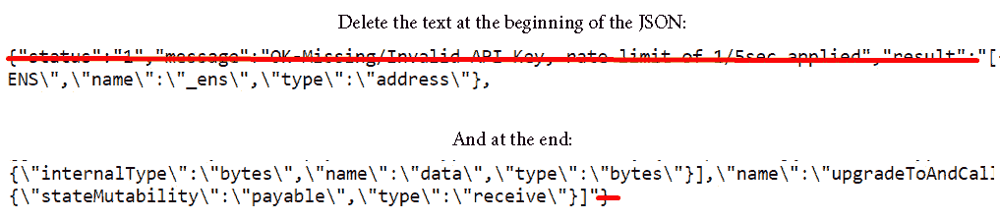

# 第二章：使用链上数据

在*第一章*中，我们学习了区块链的基本概念。我们发现区块链是一个分布式账本，由一系列区块组成，每个区块通过加密方式与前一个区块相连。每个区块包含交易信息以及前一个区块的哈希值。此外，交易可以修改**以太坊虚拟机**（**EVM**）链上的状态数据。

链上数据代表了每个交易在区块链中的痕迹。它以字节数据的形式存储，需要解析才能变成人类可读的格式。为了说明这一点，下面展示了一段比特币创世区块的原始数据，来源于[`wiki.bitcoinsv.io/index.php/Genesis_block`](https://wiki.bitcoinsv.io/index.php/Genesis_block)（许可证：CC BY 3.0）：

```py
00000000  01 00 00 00 00 00 00 00  00 00 00 00 00 00 00 00
...
00000080  01 04 45 54 68 65 20 54  69 6D 65 73 20 30 33 2F   ..Ethe Times 03/
00000090  4A 61 6E 2F 32 30 30 39  20 43 68 61 6E 63 65 6C   Jan/2009 Chancel
000000A0  6C 6F 72 20 6F 6E 20 62  72 69 6E 6B 20 6F 66 20   lor on brink of
000000B0  73 65 63 6F 6E 64 20 62  61 69 6C 6F 75 74 20 66   second bailout f
000000C0  s6F 72 20 62 61 6E 6B 73  FF FF FF FF 01 00 F2 05   or banksÿÿÿÿ..ò.
...
00000110   8A 4C 70 2B 6B F1 1D 5F  AC 00 00 00 00            ŠLp+kñ._¬
```

这些数据可以通过提供额外的信息来解析和丰富：

```py
{"hash": "000000000019d6689c085ae165831e934ff763ae46a2a6c172b3f1b60a8ce26f", …, "minerInfo": { "name": "\u0004��\u0000\u001d\u0001\.dat files containing the raw concatenated block data.
Data stored *on-chain* is serialized, so in order to extract valuable insights, we must understand its structure, decode its content, and make it readable. With that in mind, in this chapter, we will delve into blockchain transactions and dissect the anatomy of a transaction. We will examine its essential components, such as sender and recipient addresses, transaction amounts, gas fees, and more. Furthermore, we will focus on the building blocks of a blockchain – the blocks. We will explore the block structure, including the block header, timestamp, difficulty, and nonce.
Additionally, we will delve into blockchain state data, learning how to connect with smart contracts and retrieve contract variables’ values for any block.
Toward the end of the chapter, we will explore popular on-chain data providers and APIs, understanding how to access the exact source that suits our needs, while considering their advantages and disadvantages.
In summary, this chapter will cover the following topics:

*   Dissecting a transaction
*   Dissecting a block
*   Exploring state data
*   Reviewing data sources

Technical requirements
In this chapter, we will extensively utilize the `requests` library. This popular and user-friendly Python library simplifies the process of sending HTTP requests and handling responses. HTTP requests form the foundation of client-server communication in web applications and APIs, enabling clients to request specific resources or perform actions on the server, such as data retrieval, creation, modification, and deletion.
If you haven’t installed `requests` yet, you can do so by executing the following command:

```

pip install requests

```py

 The documentation for `requests` is available at the following link: [`requests.readthedocs.io/en/latest/`](https://requests.readthedocs.io/en/latest/).
You can find all the data and code files for this chapter in the book’s GitHub repository, accessible here: [`github.com/PacktPublishing/Data-Science-for-Web3/tree/main/Chapter02`](https://github.com/PacktPublishing/Data-Science-for-Web3/tree/main/Chapter02).
We recommend that you read through the code files in the `Chapter02` folder to follow along with the chapter.
A note on differences between blockchains and databases
Blockchains and databases have architectural differences. We have observed that a blockchain leverages distributed ledger technology while databases operate on a client-server relationship. This fundamental difference has an impact on two aspects: authority and performance. There is no sole server in charge of a blockchain; therefore, to modify anything on it, the nodes will need to reach a consensus, which takes time and results in slower performance. In contrast, databases are highly time-efficient and continue to improve their speed every day.
Another consequence of this relates to the manipulation of stored information. In the case of a blockchain, it is not possible to update a data point that has been added to a block. On the other hand, databases offer **Create, Read, Update, Delete** (**CRUD**) operations, with their only limitation being dependent on admin privileges.
It is worth noting that these characteristics primarily apply to public blockchains. Hybrid blockchains, commonly used for corporate purposes, blur the distinction between traditional databases and blockchains.
Let’s visualize each transaction as a row in the blockchain ledger, and imagine that these rows fill up the pages of a book. Each completed page represents a block containing a collection of transactions. We will start our analysis by studying the data each row contains.
Dissecting a transaction
As data analysts, it’s crucial for us to grasp the unique structure of each blockchain we analyze, as it influences how we search for and interpret information.
For instance, Bitcoin follows a structure based on spent and unspent transactions, while Ethereum operates on an account-based protocol. The underlying structure changes our approach to the data we want to fetch.
In the case of Ethereum, a transaction is a message initiated by an **Externally Owned Account** (**EOA**) that gets recorded on the network. A transaction is the kick-off moment that triggers the Ethereum machinery and leads to a change in its state.
To exemplify the concepts described in the subsequent sections, we will dissect a transaction associated with the `0x1aD91ee08f21bE3dE0BA2ba6918E714dA6B45836` Address. This address belongs to the mining pool named *Hiveon*.
The transaction’s hash is `0x032ed60363beb809a2b9c9790bb7dadd83b743040945a087aeecbe9e6b2dc2af`. By pasting this hash into Etherscan, we can gather more information about the transaction:


Figure 2.1 – Transaction details on Etherscan
Etherscan provides valuable metadata that offers context about when the transaction was executed, helping us understand it with its user-friendly interface.
We will begin by examining the basic transaction data, which consists of the following fields, as extracted in `Chapter01/Transaction.ipynb`:

  **Nonce**
 |
  3460171
 |

  **Gas Price**
 |
  0.000000019209576968 Ether (19.209576968 Gwei)
 |

  **Gas Limit**
 |
  100000
 |

  **Recipient**
 |
  0x3c16183c1C0E28F1a0cB9F8ee4b21D0Db208cA46
 |

  **Value**
 |
  48000000000000000000
 |

  **Data**
 |
  0x
 |

  **V,R,S**
 |
  (1, ‘0x2c1561644259bffe2872ea57690d103b
c57b611c8882ed7f2b5e0bfe40e4c807’, ‘0x4bc9255e7b24d321edd9af354589140 acc7347e35d91fcffde07fb81c27741d8’)
 |

Table 2.1 – Transaction information stored on-chain
Let’s delve into the details of each of these fields.
Nonce
A nonce is a cumulative number that keeps track of the total transactions sent by the executing address. Smart contracts also have a nonce that keeps track of the number of contract creations.
The *Ethereum Yellow Paper* defines it as follows: “*nonce: A scalar value equal to the number of transactions sent from this address or, in the case of accounts with associated code, the number of contract-creations made by* *this account.*”
As per the definition, the nonce provides information about the sending address. It serves two purposes:

*   It establishes the order of transaction processing for each address. A transaction with a higher nonce number will not be processed until all transactions with smaller nonces have been validated.
*   It identifies a transaction. Multiple transactions with the same nonce can be sent to `mempool`, but once a transaction with a particular nonce is added to the blockchain, subsequent transactions with the same nonce will not be processed.

We can extract the next nonce of an address with the following code:

```

web3.eth.getTransactionCount(address)

```py

 The nonce of a specific transaction can be extracted with the following code:

```

web3.eth.get_transaction(transaction).nonce

```py

 The nonce counting starts at zero, so the result of the transaction count always reflects the next available transaction for that specific address. We can refer to the `First transaction` notebook from `Chapter01/First_transaction.ipynb`, specifically the last cell, as a reference:


Figure 2.2 – Screenshot displaying the first nonce of an address
Gas price
Gas price (`gasPrice`, as seen in *Figure 2**.2*) is determined by the sender of the transaction and represents the price they are willing to pay for each unit of gas. Transactions with higher gas prices are prioritized for confirmation. The gas price is denoted in *Wei per unit* *of gas*.
To extract the gas price of a transaction, we can use the following code:

```

web3.eth.get_transaction(transaction).gasPrice

```py

 Gas limit
Gas limit (or `gas`) represents the maximum number of gas units (money invested) that the sender is willing to spend on the transaction. It is the upper limit of gas consumption for a transaction.
To extract the gas limit of a transaction, you can use the following code:

```

web3.eth.get_transaction(transaction).gas

```py

 Recipient
The recipient of a transaction is specified in the `to` parameter, which contains the public address of the recipient. In the case of Ethereum, addresses are 42 characters long (40 hexadecimal characters beginning with `0x`) and can be either an EOA or a smart contract. At the public address level, there is no distinction between the two. On other blockchains, additional information may be required to identify the recipient (for example, a tag ID/memo for EOS transfers).
It is important to note that any combination of characters that meets the technical requirements mentioned in the preceding paragraph will generate a valid transaction. If we send tokens to an address that has no private key, we cannot access those tokens, resulting in them being effectively *burned*. Burning tokens can be a deliberate part of a token’s economy or may occur as a result of a mistake. To address the latter, protocols such as **Ethereum Name Service** (**ENS**) or **RIF Name Service** (**RNS**) have been created, following the idea of traditional DNS. These protocols enable the leasing of human-readable names on the blockchain, which can replace long string addresses.
To extract the `to` field of a transaction, we can use the following code:

```

web3.eth.get_transaction(transaction).to

```py

 Depending on what information this field has, we can classify transactions into these categories:

*   **Regular**: A transaction from one address to another address.
*   `to` field is `null` and where the `data` field is used for the contract code. In this case, the sender is creating a smart contract.
*   `to` field is a smart contract address, and therefore the transaction represents the interaction with a deployed smart contract.

Sender
This is the address that signs the transaction and will be found in the `from` parameter. The address will be an externally-owned account given that contract accounts cannot send transactions.
To extract the `from` field of a transaction, we can use the following code:

```

web3.eth.get_transaction(transaction).from

```py

 The sender address is derived from the signature (the V,R,S letters shown in *Table 2.1*).
Value
The `value` field denotes the quantity of the native currency transferred in the transaction, expressed with the number of decimal places particular to the specific blockchain. In this instance, the value represents Ether and it is expressed with 18 decimal places. In other blockchains, the native currency will vary; for instance, Rootstock Platform (RSK) employs RBTC, while Cardano uses ADA, and so on.
To extract the value and transform it into decimal values, we can use the following code:

```

value= web3.eth.get_transaction(transaction).value

value*10**-18

```py

 The transfer of tokens is not stored in the `value` field; for that information, we need access to the transaction logs.
Input data
The `input data` field contains “*Any extra information required by the transaction*," as defined by the Ethereum documentation. This field is mostly used when interacting with or deploying a smart contract.
When a transaction interacts with a smart contract, the input data comprises the function and parameters necessary for interacting with the contract. This input data adheres to the type format outlined in the smart contract’s **Application Binary Interface** (**ABI**). To decode the data field for our analysis, we will require the ABI.
In the case of a transaction that deploys a contract, the input data field contains the contract bytecode.
To extract the input data of a transaction, we can use the following code:

```

web3.eth.get_transaction(transaction).input

```py

 As you may have noticed, in the transaction we have been analyzing, there is no input data. However, let’s change that for example purposes. Let’s consider a transaction that mints a Bored Ape Yacht Club NFT (“Bored Ape” for future reference). For example, let’s take Bored Ape ID `6633` (as of the day of this writing, held by Neymar Jr.).
We can observe that the minting transaction is hashed as `0xb3827bb3cca1a693ec69edb744755f64d8ff8c90f89f69cbfbfafd17b0083159`.
In this transaction, the `0x9909017A0F637380af916257D05c3e7dD2F6c68a` address interacts with the smart contract at this address: `0xBC4CA0EdA7647A8aB7C2061c2E118A18a936f13D`. This transaction has the following input data: `'input': '``0xa723533e0000000000000000000000000000000000000000000000000000000000000001'`.
This input data holds a meaning in the context of the Bored Ape ABI. An ABI documents the smart contract’s functions, state data, and events. Smart contracts are compiled at the machine code level, and ABIs serve as translators to decode them, as they include each function’s input and return parameters. ABIs enable the readability of all the functions of a smart contract.
In summary, to translate the input data, we need to access the ABI document. One way to do this is by following these steps:

1.  Navigate to `https://etherscan.io/address/[smart_contract_address]`; in this case, this is https://etherscan.io/address/0xBC4CA0EdA7647A8aB7C2061c2E118A18a936f13D.
2.  Scroll down to the middle of the page and find the horizontal menu. Click on **Contract**:


Figure 2.3 – Contract tab on Etherscan

1.  Scroll down and you will find the **Contract** **ABI** Section:


Figure 2.4 – Export ABI option selection
Now, you can copy and paste the ABI in a text or JSON format. Be cautious and delete the initial parts of the text where some metadata from Etherscan’s API is also written, as detailed in the following note. An alternative is to programmatically obtain it by creating a free account with an API key.
Note that, Etherscan adds extra text to the ABI JSON when its official API isn’t used. This text should be removed when incorporating it into our code in Jupyter Notebook.


Figure 2.5 – Text to be deleted from the JSON data
For simplicity purposes, we have also uploaded the Bored Ape ABI to the book’s GitHub repository.
There are alternative tools to retrieve the ABI when the code is not verified. These tools, although still in beta, are listed in the *Further* *reading* section.
With the `decode_function_input` method, we can combine the information from the ABI with the input data text and we will see the decoded version. The step-by-step process can be found in `Chapter02/Transaction`:


Figure 2.6 – The decode_function_input method
As we can see, the `mintApe` function was triggered by this transaction, and Ape 6633 was born. This is a simple function with one parameter, but we need to be prepared for more complex functions, such as swapping contracts, lending, bids, and more.
V,R,S
These are the components of the signature by the `from` address. The digital signature gives validity that the message sent was executed by the originating address. For more on this matter, you can read the *Mastering Ethereum* book. Depending on where we obtain our transaction data, we may not encounter this field (for example, Covalent does not provide it when querying for a specific transaction).
Transaction receipt
Once the transaction is executed, we gain access to a valuable source of information, called a transaction receipt. This receipt stores information that results from executing the transaction.
Of particular interest to us are the following fields: `status`, `gasUsed`, `cumulativeGasUsed`, and `logs`.
Status
The status field can have a value of either 1 or 0\. A value of 1 indicates a successful transaction, while a value of 0 indicates an unsuccessful transaction, leading to the transaction being reverted.
Gas used and Cumulative gas used
The Gas used field represents the amount of gas that was actually consumed by the transaction. This value will be below the gas limit. We can retrieve it with the following code:

```

web3.eth.getTransactionReceipt (transaction).gasUsed

```py

 Additionally, we have the Cumulative gas used field, which provides the total amount of gas consumed by all previous transactions within the same block, including the transaction under analysis.
Gas prices are crucial data points that analysts often consider. These fields represent the actual cost of using the blockchain for a specific transaction. Analyzing gas costs can help answer questions such as: What is the best time of the day to execute a set of transactions? When should we deploy a set of smart contracts to minimize gas expenses?.... and so on.
Logs
Any change on the blockchain can be stored in state data or event logs. The latter is less expensive and provides a very rich source of information. We will analyze state data in the following section.
In the context of smart contract operations, logs are short pieces of information that record specific events at a given point in time.
An event log, or log record, can be created by providing specific instructions to the EVM. These instructions are known as **opcodes**, and there are five opcodes that emit event logs. The *Ethereum Yellow Paper* provides more information about opcodes under the title *Logging operations*.
Log events consist of two components: topics and data. When examining the source code, we will find that log events are preceded by the `event` or `emit` keyword.
**Topics** describe the nature of an event and can include up to a maximum of four topics per log. Typically, topics consist of the event’s signature or name, along with the type of parameters passed.
Topics are searchable but limited in terms of the number of bytes they can include. As a result, the information contained within topics is usually referential. In the context of a Python dictionary, topics can be considered as keys.
**Data**, the other component, has no such limit in terms of number of bytes and is less expensive to store on the blockchain. This allows for more flexibility in the information that can be included, such as larger strings. If we were to compare this with a Python dictionary, data would correspond to the values.
Let’s continue the examination of the minting of Bored Ape 6633\. Depending on the data provider we use to query the blockchain, we may receive the logs already decoded or we might need to decode them ourselves. To be able to decode them, we will need the ABI, as extracted in the previously analyzed *Input data* section. The code essentially compares events from the ABI with events from the log. If there is a match, the code translates the log. In `Chapter02/Transaction.ipynb`, we will see the entire process, which is summarized in the following steps:

1.  Creates a list of events from the contract.
2.  Generates a hexadecimal value for each event extracted from the ABI.
3.  Extracts the receipt for the transaction.
4.  Iterates through each log and compares the hexadecimal value of the first parameter of the log (the topic) with the list created in *step 2*. If there is a match, the code uses the name within the `processReceipt` function, and it will return a tuple with the decoded logs.

In the Bored Ape transaction under analysis, the log contains some interesting information. It provides details about the minting of the NFT, the original holder, and the corresponding ID. We can use the ID to view the information in the gallery using the **BY ID** search filter ([`boredapeyachtclub.com/#/gallery`](https://boredapeyachtclub.com/#/gallery)).
We have reviewed the main components of a transaction and the information they provide; we now shift our focus to the next vital element of the blockchain ecosystem: the block. As transactions are the purpose of a blockchain, blocks serve as the foundational units that bring together multiple transactions, creating a comprehensive ledger of activity.
Dissecting a block
A block is formed by combining a list of transactions with a header. As depicted in the flow diagram in *Figure 2**.7*, when transactions are added to a block, they alter the state of the blockchain:


Figure 2.7 – How a blockchain evolves (adapted from https://ethereum.org/en/developers/docs/blocks)
The preceding diagram illustrates the progressive evolution of blockchain state data, one block at a time. Blocks are strictly ordered, allowing us to trace the history of each state variation.
In the *Ethereum Yellow Paper*, a block is defined as “*the collection of relevant pieces of information (known as block header) [...], together with information corresponding to the comprised transactions, [...] and a set of other block headers [...] that are known to have a parent equal to the present’s block’s parent (such blocks are known* *as ommers).*”
Therefore, a block consists of three main components:

*   A block header
*   A list of transactions
*   An uncle block header

Uncle blocks refer to blocks that were mined simultaneously. Since the Merge on September 15, 2022, when the Ethereum network transitioned from **Proof-of-Work** (**PoW**) to **Proof-of-Stake** (**PoS**) consensus, the uncle block header is now empty as uncle blocks no longer occur.
Let’s begin by understanding the information provided by the block header. For explanatory purposes, let’s consider block `15813288`. If we want to review the Etherscan version, we can access it through the following URL: https://etherscan.io/block/15813288.
In `Chapter02/Block.ipynb`, we programmatically access it, and we can observe the following fields:

  `parentHash`
 |
  0x9b930569ef6794eb018d54d6a0768f4445f757d62ddffa79698cd5c1fea04b31
 |

  `beneficiary`
 |
  0x690B9A9E9aa1C9dB991C7721a92d351Db4FaC990
 |

  `stateRoot`
 |
  0x91c1b2292997a9aa87aa7bf75b387df4bc5a6869fa83b3ce9d4c6793d3acaaa1
 |

  `transactionsRoot`
 |
  0x7896f544f241e7aa3bae8e3f70b45d9db34794ddb60187c1d46dd80958ea3e41
 |

  `receiptsRoot`
 |
  0x6698a263fd7b24a301e1060c624e7aa7510db8d4d215779ee43ebe8f5c18889a
 |

  `difficulty`
 |
  0
 |

  `totalDifficulty`
 |
  58750003716598352816469
 |

  `number`
 |
  15813288
 |

  `size`
 |
  63648
 |

  `gasLimit`
 |
  30000000
 |

  `gasUsed`
 |
  13247169
 |

  `baseFeePerGas`
 |
  15649778689
 |

  `timestamp`
 |
  1666557983
 |

  `extraData`
 |
  0x406275696c64657230783639
 |

  `nonce`
 |
  0x0000000000000000
 |

  `transactions`
 |
  List of 112 transactions
 |

Table 2.2 – 15813288 block information
Let’s understand what information each field comprises:

*   `parentHash`: This is the hash of the previous block, establishing a link between blocks in the blockchain and providing historical order to the network.
*   `beneficiary`: This field indicates the address of the miner or validator who successfully added the block to the chain and received rewards and fees.
*   `stateRoot`/`transactionRoot`/`receiptsRoot`: These fields provide the hash of the trie structure containing information related to the modified state, transactions, and transaction receipts. A Merkle Patricia Trie is an internal structure utilized by Ethereum to expedite data retrieval.
*   `difficulty` and `totalDifficulty`: `difficulty` represents the level of mining difficulty required for this block. `totalDifficulty` denotes the cumulative difficulty of the entire blockchain up to the specific block. These features changed after the Merge as they were associated with the previous PoW consensus. `totalDifficulty` has remained unchanged since the transition, and `difficulty` was set to zero. Refer to block `15537393` to have a look at the last block mined using PoW.
*   `number`: This indicates the block height, as discussed in *Chapter 1*, following a sequential order of blocks. The genesis block, mined in July 2015, holds the block number 0.
*   `size`: This denotes the data storage capacity of a block in bytes, with the limit imposed by the required gas for validation.
*   `gasLimit`/`gasUsed`: `gasLimit` represents the maximum amount of gas allowed to be expended in the block, while `gasUsed` indicates the total gas consumed by all transactions within the analyzed block. If `gasUsed` if below `gasLimit`, we can observe that blocks are not fully utilized, leaving idle space.
*   `baseFeePerGas`: This field represents the reserve price or minimum price required for a transaction to ensure its inclusion in a block. The calculation is based on previous blocks, aiming to provide more predictability for gas costs to end users.
*   `timestamp`: This denotes the Unix timestamp at the time the block was mined, representing the cumulative number of seconds elapsed since January 1, 1970.
*   `extraData`: This arbitrary array contains data relevant to the specific block. It was previously written by miners and is now populated by validators.
*   `nonce`: Short for “number used only once,” this field is a number added to the block that must generate a hash meeting the difficulty criteria. It is still used in Bitcoin to regulate difficulty. After the merge in Ethereum, this number was set to 0.
*   `transactions`: This field returns a list of transactions added to the block; in the example under analysis, this is 112 transactions. The following code snippet provides a list of each transaction, along with the information reviewed in the previous section:

    ```

    web3.eth.getBlock(block_identifier=15813288).transactions

    ```py

Analyzing block data is very useful when trying to grasp a general overview of the chain under analysis. Aggregating the data from the fields detailed previously, we are able to answer questions about how a chain is used, the average transaction per block, the time between blocks, how expensive the base fee is, and so on.
Having examined the structure and components of a transaction and a block in detail, we now shift our focus to the state data within the Ethereum blockchain. State data encompasses the current state of all accounts, contracts, and smart contracts on the network, reflecting the outcome of executed transactions and operations. It serves as a fundamental building block for the blockchain’s functionality and provides a comprehensive snapshot of the system at any given point in time.
Exploring state data
In the *Ethereum Yellow Paper*, the state, also known as the world state, is defined as “*a mapping between addresses and account states.*” Up to this point, we have been discussing transactional data that is permanent, meaning that once incorporated into the blockchain, it cannot be changed. Unlike transactional data, the state is dynamic and evolves with each new block.
To ensure accessibility for users interacting with accounts and contracts, Ethereum employs **trie** data structures. Specifically, the state trie contains key-value pairs for every existing account that has engaged in a valid transaction. The key represents the Ethereum account’s address, while the value comprises hashed information encompassing the account balance, nonce, code, and storage root.
The concept of roots leads us to an explanation of tries and the special implementation of the **Merkle Patricia Trie** on Ethereum (that exceeds the scope of this work). We will briefly mention that the trie structure or search tree is used for storing and searching a key in a set. It facilitates the searching, adding, and deleting complexities for sequences of characters. The trie starts with a root and connects characters in its branches. We have seen roots in our previous analysis: the state, transaction, and receipt’s roots hashes are part of the block information. The state root, together with additional information, is stored as the value of the address.
For a more in-depth understanding, please refer to the cited documentation in the *Further* *reading* section.
Why is this useful for data analysis?
The storage of state data in this manner enables us to easily retrieve the blockchain’s status at specific points in time—a capability leveraged by smart contracts.
To illustrate this, let’s consider the Bored Ape smart contract we examined earlier.
On the Jupyter notebook on `Chapter02/State.ipynb`, do the following:

1.  Upload the ABI following the instructions outlined in the *Dissecting a* *transaction* section.
2.  With the following code, we will gain access to all the contract’s functions:

```

baContract.all_functions()

```py

 We can see that each function tells us which parameter it needs to be able to execute the query. For example, `<Function ownerOf(uint256)>` tells us that it needs an integer, which in the context of this example is the Bored Ape ID under analysis: 6633.
The code will be as follows:

```

baContract.functions.ownerOf(6633).call()

```py

 After executing this cell, we will see that the current owner of the Bored Ape ID is `0xC4505dB8CC490767fA6f4b6f0F2bDd668B357A5D`. If no `block_identifier` parameter is specified, the call retrieves the current state data, assuming `latest` as the default value.
Let’s imagine that we want to know who was the previous owner of the Bored Ape 6633 ID. In that case, we would need to provide in the `block_identifier` parameter the number of the block previous to the transfer to the current owner occurring. In the case of Bored Ape 6633, the transfer took place in block `14044022`, so we query the state of the blockchain at block `14044021` with the following code:

```

baContract.functions.ownerOf(6633).call(block_identifier=14044021)

```py

 The result is that the previous owner was `0xDE2b87d1539904f4b37E98C0d5CE383E890006eF`. An alternative is using Etherscan’s **Read Contract** function, which will only respond with the current state data.
The steps are the following:

1.  Paste and search the smart contract address on Etherscan:


Figure 2.8 – Etherscan search bar

1.  Navigate to the **Contract** tab, shown in *Figure 2**.3*.
2.  Click on the **Read** **Contract** tab:


Figure 2.9 – Read Contract tab

1.  Locate the relevant function; in this case, the `ownerOf` function:


Figure 2.10 – ownerOf function

1.  Add `6633` to it and click on **Query**. The response provides the current owner of Bored Ape ID 6633:


Figure 2.11 – Response to function execution
This approach is useful for extracting state data really fast.
After studying state data and understanding its significance, the next step is to gain access to on-chain data for practical use. In the following section, we will explore multiple data sources and learn to connect with them.
Reviewing data sources
Alice: Would you tell me, please, which way I ought to go from here?
The Cheshire Cat: That depends a good deal on where you want to get to.- Lewis Carroll, Alice in Wonderland
We will encounter a similar dilemma to Alice’s when trying to access *on-chain* data without context or a clear vision of the needs and resources that are at our disposal.
The choice of a data source relies on various factors, primarily driven by our needs and available resources. As discussed in *Chapter 1*, our approach to blockchain data will be shaped by the problems we aim to solve and the questions we seek to answer. If we need to add to a dashboard aggregated metrics that involve comprehensive scanning of the entire blockchain, we will need access to SQL-based solutions. On the other hand, integrating specific data points, such as balances or token prices, into our platform may lead us toward extracting information from a node with `web3.py`.
Additionally, each data source carries its own set of costs and levels of flexibility. The expertise of the data scientists responsible for managing these resources also influences our decision-making process. Options ranging from traditional SQL-based datasets to MongoDB and GraphQL are at our disposal.
Importantly, our decision must consider whether integration of on-chain data with off-chain data is necessary, and the ease with which it can be achieved. Seamlessly merging these two worlds should be taken into account. A website that gives us continuous updates is [primodata.org/blockchain_data](http://primodata.org/blockchain_data), which is maintained by the X account, [twitter.org/primodata](http://twitter.org/primodata).
Let us now present some available options, bearing in mind that this list requires periodic updates to keep pace with the ever-evolving landscape. We test each of the alternatives in `Chapter02/Data Sources.ipynb`.
Block explorers
A block explorer is a user-friendly tool that provides detailed analytics about a blockchain network. For Ethereum, we have been interacting with Etherscan ([`etherscan.io/`](https://etherscan.io/)), and for RSK, Rootstock ([`rootstock.blockscout.com/`](https://rootstock.blockscout.com/)) among many other examples . A block explorer acts as a search engine and browser where users can find information about individual blocks, public addresses, and transactions associated with a specific cryptocurrency. Each chain has its own block explorer. Of all the sources described here, this is the only one that is widely used by blockchain enthusiasts and everyday users to explore and monitor the activities happening on a blockchain network.
Infura
Infura is one of the providers that we have utilized throughout the book’s exercises and examples. It offers API access over HTTPS and WebSockets to a node, making it accessible for querying through clients such as `web3.py` or `web3.js`.
For more detailed information, please visit [`blog.infura.io/post/getting-started-with-infura-28e41844cc89`](https://blog.infura.io/post/getting-started-with-infura-28e41844cc89).
Additionally, a comprehensive step-by-step guide on how to start interacting with this source can be found in *Appendix 1*. It’s important to note that the node provided by Infura is situated within a developer suite specifically designed for dApp development. Consequently, the most effective approach to accessing this dataset is through programming languages such as Python or Java. The API’s response is in the widely used JSON format.
Moralis
Similar to Infura, Moralis is considered part of a developer suite for blockchain developers. It indexes EVM-based chains and Solana, but what sets it apart is its advanced features, including pre-built queries that enable cross-analysis. Accessing Moralis requires an API key, and the response data is in JSON format.
For more detailed information, please visit [`docs.moralis.io/docs/quickstart`](https://docs.moralis.io/docs/quickstart).
GetBlock
GetBlock is another **node as-a-service** (**NaaS**) provider, similar to Infura. However, Getblock offers access to a broader range of chains compared to Infura and Moralis. To use GetBlock, you’ll need to set up an account, and the response from the API will be in JSON format.
For more detailed information, please visit [`getblock.io/`](https://getblock.io/).
Dune
Dune is an excellent web-based data analysis tool for creating interactive dashboards and charts. It offers both free and premium versions, with the latter allowing the creation of private dashboards. The data is indexed at various stages of decoding, ranging from raw Ethereum data to tables enriched with extensive metadata contributed by the community. One notable aspect is the platform’s commitment to knowledge sharing, as queries and dashboards are openly accessible to everyone.
If we want to see how a query was built, we have to click on the title of the metric, as shown in *Figure 2**.12*, and it will open the query space with the relevant query. Dune Analytics uses the DuneSQL query engine, based on Trino:


Figure 2.12 – Dune Analytics access to query
Additionally, Dune Analytics provides valuable resources such as tutorials, documentation, and a forum to support users on their analytical journey.
For more detailed information, please visit [`dune.com/docs`](https://dune.com/docs).
Covalent
Covalent is another API that necessitates users to create an account and acquire API keys. The company has indexed over 40 chains and consistently updates the data with minimal delay compared to the node. Similar to Infura, interaction with Covalent’s API follows a programmatic approach, and the response is in JSON format. Covalent provides a range of pre-defined basic endpoints that are valuable for data scientists. Furthermore, certain on-chain data endpoints offer enriched information, such as prices or 24-hour aggregations of specific metrics. For more detailed information, please visit [`www.covalenthq.com/platform/#/auth/register/`](https://www.covalenthq.com/platform/#/auth/register/).
Notably, Covalent is currently developing a new **business intelligence** (**BI**) product called **Increment**, which offers greater flexibility. Increment is a comprehensive database encompassing all the indexed chains (EVM compatible), enabling users to query the data using SQL or a simple no-code drag-and-drop system. The database contains all the data generated by all chains collectively, recognizing the growing number of blockchains and the necessity for companies to monitor users and value across multiple chains. Increment’s unified database provides a convenient solution for this purpose. It’s important to note that certain information stored in this database is encoded in hexadecimal format, including addresses, transaction input data, and transaction value. To access Increment, please visit [`www.covalenthq.com/platform/#/increment/`](https://www.covalenthq.com/platform/#/increment/) and create an account.
Once we have access, we will notice that there are dashboards built by the community. If we come across a metric of interest and wish to understand how a query was constructed, click on the dots of the metric, select **Go to SQL**, and it will open the SQL builder on a separate page with the logic:


Figure 2.13 – Increment access to query
Flipside
Flipside is another excellent provider that allows us to query on-chain tables using SQL for multiple chains, including some external tables maintained by market authorities such as DefiLlama for **Total Value** **Locked** (**TVL**).
Flipside offers two main products. The first one is Flipside Data Studio ([`www.flipsidecrypto.xyz/`](https://www.flipsidecrypto.xyz/)), which enables dashboard visualizations in a social network environment with an impressive community. All the queries are open, and analysts compete to create useful dashboards for the community.
The other product is the Flipside API ([`flipsidecrypto.xyz`](http://flipsidecrypto.xyz)), which allows us to submit queries directly from our developer environment. This service, included in the free tier, enables us to query the database and retrieve results that we can ingest in our systems, internal dashboards, and so on.
To use Flipside, we need to create an account and obtain the necessary API keys. For more detailed information, please visit [`docs.flipsidecrypto.com/`](https://docs.flipsidecrypto.com/).
The Graph
The Graph is based on GraphQL and is primarily focused on smart contracts. Currently, subgraphs are limited to the Ethereum blockchain. Subgraphs allow access to the ecosystem created by a specific protocol rather than the entire blockchain. It operates in a decentralized and collaborative manner to index blockchain information, with various roles such as **Developer**, **Indexer**, **Curator**, and **Delegator**, each incentivized to participate.
Queries can be accessed through a URL, making integration into our apps possible. It is particularly interesting that each subgraph comes with its own documentation and a playground where we can test our queries.
Numerous projects are actively developing subgraphs to facilitate decentralized access to their data. At present, I have come across ENS, Sablier, and Superfluid are examples of projects maintaining subgraphs on this service.
To test our queries, we can use the online playground, which requires creating an account and connecting our wallet to obtain the necessary API keys:


Figure 2.14 – Screenshot of The Graph’s playground
For more detailed information, please visit [`thegraph.com/explorer`](https://thegraph.com/explorer).
Google BigQuery
Google BigQuery maintains a table indexing for both the Ethereum and Bitcoin chains. You can access the data using Google Cloud. A limited tier is accessible through the Kaggle website. To access the data, please visit [`bigquery.cloud.google.com/dataset/bigquery-public-data:crypto_ethereum`](https://bigquery.cloud.google.com/dataset/bigquery-public-data:crypto_ethereum).
Lastly, it’s important to note that each product uses its own terminology to refer to the same information. This brings us back to the first part of the chapter, which focuses on how data is presented. The data we observe from the aforementioned providers is subject to translation, and each indexer applies its own criteria. It will be our responsibility to determine the specific information we require.
A note on decentralization
These are information providers. With the exception of The Graph, whose product is a decentralized information protocol, the remaining companies primarily focus on keeping updated their indexes or node points, rather than prioritizing decentralization.
It is important to emphasize this point because, in a decentralized ecosystem, these providers serve as centralized points. Consequently, they can be influenced by regulations, leading to potential exposure of information or censorship, among other possibilities. A recent example involves Infura, which, while attempting to comply with international sanctions in the Ukraine-Russia conflict, also blocked MetaMask access to Venezuela. MetaMask relies on Infura’s suite, and this decision affected all IPs, even those located in countries geographically distant from the sanctioned areas.
It may or may not be relevant for the data area of our company but, as mentioned in *Chapter 1*, our job is typically aligned with a business that may have, as a product feature, respect for decentralization and all its benefits.
Summary
In conclusion, this chapter delved into the world of on-chain data, which serves as the primary data source in Web3\. We started the chapter by dissecting individual transactions and gaining insights into their structure and components. This understanding was further expanded as we explored the anatomy of blocks.
Moving forward, we delved into an analysis of state data. By examining state variables and their significance, we gained a deeper understanding of how data is stored and accessed within a blockchain.
To further enhance our ability to work with on-chain data, we explored a range of data providers. From widely used block explorers such as Etherscan to powerful APIs such as Infura, Moralis, and Covalent, and SQL-accessible tables such us Dune and Flipside, we built a comprehensive list of resources that grant us access to on-chain data. Each provider offers unique features, data formats, and querying capabilities, allowing us to tailor our approach based on the specific needs of our projects.
Throughout this chapter, we have acquired the foundational knowledge necessary to navigate and interact with on-chain data effectively. In the next chapter, we will study how off-chain data can play a key role in Web3.
Further reading
To complement this chapter, the following links may help:

*   Dissecting a transaction:
    *   *Antonopoulos, Andreas*. *Mastering Ethereum* book, *Chapter 6*: Transactions · GitBook, 2018, [cypherpunks-core.github.io/ethereumbook/06transactions.xhtml](http://cypherpunks-core.github.io/ethereumbook/06transactions.xhtml).
    *   *Piper Merriam* and *Jason Carver*. *Ethereum Name Service — Web3.py documentation*, *2018*, [`web3py.readthedocs.io/en/stable/ens_overview.xhtml`](https://web3py.readthedocs.io/en/stable/ens_overview.xhtml).
    *   *KLmoney*. *Bitcoin: Dissecting Transactions | Crypto­Tokens*, *May 26,* *2017*, [`klmoney.wordpress.com/bitcoin-dissecting-transactions`](https://klmoney.wordpress.com/bitcoin-dissecting-transactions).
    *   A very detailed analysis of the Bitcoin transaction can be found in Nick Furneaux’s book *Investigating Cryptocurrencies*.
    *   [`abi-parser-nvk.vercel.app/`](https://abi-parser-nvk.vercel.app/) and [`github.com/shazow/whatsabi`](https://github.com/shazow/whatsabi).
*   Dissecting a block:
    *   *Buterin, Vitalik*. *Merkling in Ethereum | Ethereum Foundation Blog*, *2015*, [`blog.ethereum.org/2015/11/15/merkling-in-ethereum`](https://blog.ethereum.org/2015/11/15/merkling-in-ethereum).
    *   *Furneaux, Nick*. *Investigating Cryptocurrencies,* *Chapter 3**: Understanding, Extracting, and Analyzing Blockchain Evidence*, *Wiley*, *2018*.
*   State data:
    *   *Ethereum.org*. *Merkle Patricia Trie*, , [`ethereum.org/en/developers/docs/data-structures-and-encoding/patricia-merkle-trie/`](https://ethereum.org/en/developers/docs/data-structures-and-encoding/patricia-merkle-trie/).
    *   *Day, Allen* and *Evgeny Medvedev*. *GitHub - Blockchain-etl/Awesome-bigquery-views: Useful SQL Queries for Blockchain ETL Datasets in BigQuery*, *GitHub*, *October 27,* *2022*, [`github.com/blockchain-etl/awesome-bigquery-views`](https://github.com/blockchain-etl/awesome-bigquery-views).

```
