# 第三章：使用链下数据

在前一章中，我们了解到链上数据是 Web3 数据分析的主要来源。它是开放的、分布式的且值得信赖的。尽管链上数据对于解答大多数商业数据科学问题至关重要，但必须用链下数据源的相关信息来补充，这也是本章的重点。

假设我们收到一个请求，要求评估一个智能合约的经济相关性。我们可以查询该合约中锁定的代币数量，但要完成分析，我们还需要确定这些代币的货币价值。为了实现这一点，我们必须将链上数据与价格进行整合，而这些价格通常来自链下来源。

价格、新闻和观点不存储在链上，必须从外部来源获取。本章将深入探讨这些来源，并从选定的 API 获取数据。具体而言，我们将讨论获取价格的替代方法，分析一个加密新闻聚合器，并探讨社交媒体，尤其是 X（前 Twitter）的重要性。

链下数据的性质与链上数据不同，因此在处理这些来源时，必须特别注意其可靠性。本章讨论的这些来源通常是集中式的，意味着实体完全控制其数据。这直接影响我们将要使用的数据集，因为数据点可能会被删除、缺失或篡改。相比之下，链上数据交易原则上无法被修改。

本章具体涵盖以下主题：

+   将价格整合到我们的数据集

+   将新闻融入我们的数据集

+   将社交网络数据添加到我们的数据集中

# 技术要求

我们将使用**Tweepy**，这是一个 Python 库，允许我们轻松地与 X 进行交互。使用 Tweepy，我们可以获取、发布和检索关于推文、用户以及更多的信息。要开始使用 Tweepy，我们首先需要在 Twitter 开发者网站上注册一个开发者账户，并获取一组 API 密钥，如*附录 2*所述。Tweepy 的文档可以在[`docs.tweepy.org/en/stable/`](https://docs.tweepy.org/en/stable/)找到。

如果你之前没有使用过 Tweepy，可以通过以下代码进行安装：

```py
pip install tweepy
```

此外，我们将使用 Plotly **图形对象**和 Plotly **Express**，这两个可视化库使我们能够用 Python 创建互动式可视化。Plotly Express 是一个高级库，允许我们用最少的代码行绘制常见类型的图表——如散点图、折线图、地图、饼图等。Plotly Express 的文档可以在[`plotly.com/python/plotly-express/`](https://plotly.com/python/plotly-express/)找到。

Plotly 图形对象提供了更多的灵活性和控制力，使得创建高度自定义的复杂图表成为可能。Plotly 图形对象的文档可以在[`plotly.com/python/graph-objects/`](https://plotly.com/python/graph-objects/)找到。

为了使用这两个库，我们需要安装 Plotly 库。如果你之前没有使用过 Plotly，可以通过以下代码片段安装：

```py
pip install plotly
```

你可以在本书的 GitHub 仓库中找到包含本章讨论示例的 Jupyter 笔记本，地址为[`github.com/PacktPublishing/Data-Science-for-Web3/tree/main/Chapter03`](https://github.com/PacktPublishing/Data-Science-for-Web3/tree/main/Chapter03)。我们建议你阅读`Chapter03`文件夹中的代码文件，以便跟进学习。

# 入门示例 – 列出数据来源

让我们来看看这个标题：

**狗狗币上涨 25%，因为 Elon Musk 确认 Tesla 将接受 DOGE** **用于商品购买**

（来源 – Cointelegraph: [`cointelegraph.com/news/dogecoin-gains-25-after-elon-musk-confirms-tesla-will-accept-doge-for-merchandise`](https://cointelegraph.com/news/dogecoin-gains-25-after-elon-musk-confirms-tesla-will-accept-doge-for-merchandise)。）

这个标题引用了三个数据来源：

+   **标题（新闻）**：一份专注于 Web3 行业的在线报纸生成了这个标题。区块链新闻逐渐进入主流平台，类似的信息也可以在传统的金融新闻索引中找到，例如路透社。

+   **价格**：这个标题提到的是某种特定加密货币的价格波动。价格数据通常不会从链上数据源获取；相反，它是数据科学家认为有用的、需要从第三方数据源集成的信息。

+   **X（前身为 Twitter）/社交网络**：许多具有市场影响力的事件发生在社交网络上，Web3 生态系统中的关键人物在这些平台上建立了重要的在线声誉。这些有影响力的人物的一条推文可以改变价格，或引起对骗局或失败谈判的关注。大多数 Web3 公司在 X 上保持活跃，通常在创建 LinkedIn 页面之前。在这个案例中，标题中提到的对狗狗币的影响来自于 Elon Musk 的一条推文：“*Tesla 将让一些商品用 Doge 购买，看看效果如何*”（来源：[`twitter.com/elonmusk/status/1470703708677840896`](https://twitter.com/elonmusk/status/1470703708677840896)）。

我们描述了三个与我们的业务数据科学项目相关的链外数据来源，我们必须学习如何以适合数据科学家使用的格式有效地集成它们。我们将在接下来的章节中讨论每一个数据来源。

# 向我们的数据集添加价格

价格信息通常存储在链外，多个来源提供对此数据的访问。一些最受欢迎的 API 包括以下几种：

+   CoinGecko

+   CoinMarketCap

+   Binance

+   Chainlink

+   OHLC 数据：Kraken

每个 API 都有其自身的限制，我们需要在决定是否将其集成到项目中时加以考虑。具体细节可以在各自的文档中找到。

关于价格数据，理解它是如何计算的非常重要，如以下示例所示：

+   CoinMarketCap 通过考虑所有交易市场的加权平均价格来计算资产的价格。这种方法基于这样的假设：更具流动性的市场不易受到价格波动或操纵，因此更可靠。

+   Binance 根据其平台上的交易报告价格。根据交易对，它提供市场上最近一次交易的价格。

让我们简要分析一下其中的每一个。

## CoinGecko

**CoinGecko** ([`www.coingecko.com/`](https://www.coingecko.com/))的文档清晰易懂，且提供了一个无需注册的免费层。通过他们的 URL 引擎，可以根据用户需求构建端点 URL，使请求更加高效。

我们可以在[`www.coingecko.com/api/documentation`](https://www.coingecko.com/es/api/documentation)找到他们的文档。让我们也通过这个链接测试`simple/price`端点。

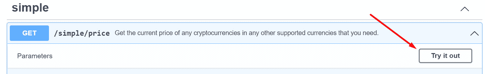

图 3.1 – CoinGecko API 视图

如*图 3**.2*所示，此端点所需的参数是`ids`和`vs_currencies`：

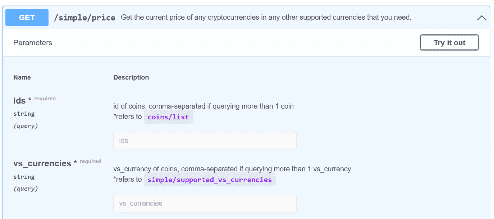

图 3.2 – 简单/价格查询参数的部分视图

还有一些可选参数，如下所示：

+   `include_market_cap`

+   `include_24hr_vol`

+   `include_24hr_change`

+   `include_last_updated_at`

+   `precision`

要获取特定资产的*ID*，我们可以去 CoinGecko 的主页并按名称搜索该资产。例如，如果我们想获取比特币的当前价格，我们需要在查询中添加比特币的 ID。要查找它，我们只需去 CoinGecko 的主页并在搜索框中输入`Bitcoin`，如*图 3**.3*所示：

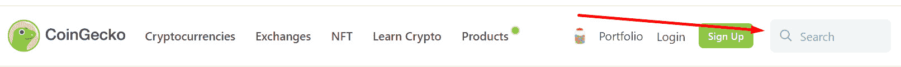

图 3.3 – CoinGecko 搜索框

这将引导我们进入 CoinGecko 上的比特币信息页面([`www.coingecko.com/en/coins/bitcoin`](https://www.coingecko.com/en/coins/bitcoin))，如*图 3**.4*所示，我们可以找到作为查询参数使用的 API ID：

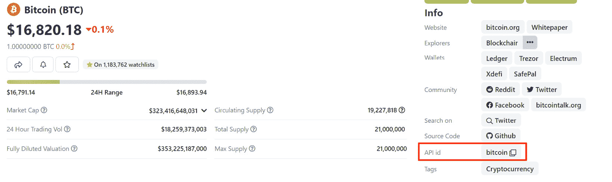

图 3.4 – CoinGecko 比特币（BTC）页面视图

对于我们的`simple/price`请求，我们还需要输入`vs_currencies`参数，它决定了价格的货币类型。在本例中，我们将使用`usd`。

填写完 API 页面上的必填项后，我们可以点击蓝色的**执行**按钮，这将返回我们可以使用的 URL：

```py
https://api.coingecko.com/api/v3/simple/price?ids=bitcoin&vs_currencies=usd
```

让我们来看一下在`prices.ipynb`中的操作。

## CoinMarketCap

CoinMarketCap ([`coinmarketcap.com/`](https://coinmarketcap.com/)) 提供了广泛的文档，可以通过以下链接访问：[`coinmarketcap.com/api/documentation/v1/`](https://coinmarketcap.com/api/documentation/v1/)。尽管这些文档可能看起来有些复杂，但对于我们的目的，定位到页面左侧的**加密货币**类别，通过包含多个与价格相关的端点的下拉菜单可以进行访问：

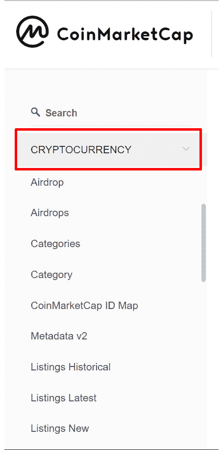

图 3.5 – CoinMarketCap 左侧栏视图

对于我们的目的，我们将使用以下链接文档中的端点：[`coinmarketcap.com/api/documentation/v1/#operation/getV2CryptocurrencyQuotesLatest`](https://coinmarketcap.com/api/documentation/v1/#operation/getV2CryptocurrencyQuotesLatest)。

CoinMarketCap 提供多个服务层级，API 限制和端点各不相同。对于这次的介绍性说明，我们将依赖免费的层级。

我们通过 CoinMarketCap 的 API 在`prices.ipynb`笔记本中提取最新的比特币价格。为了识别特定币种的 ID，我们可以执行映射 ID 端点，它显示了所有在 CoinMarketCap 网站上列出的加密货币及其唯一 ID。有关该端点的更多细节可以在文档中访问：[`coinmarketcap.com/api/documentation/v1/#operation/getV1CryptocurrencyMap`](https://coinmarketcap.com/api/documentation/v1/#operation/getV1CryptocurrencyMap)。比特币的 ID 是`slug`参数，它包含了加密货币的字符串名称——在我们的例子中，简单地就是`bitcoin`。

关于链接和骗局的提示

高度复杂的骗局可以通过搜索引擎欺骗受害者。通过点击搜索引擎中的链接访问项目，特别是我们之前未访问过的小型或不太知名的项目，存在更高的风险，骗子可以通过操控网页将其提升为排名靠前的建议链接。CoinGecko 和 CoinMarketCap 已经证明在提供指向官方网站的真实链接方面非常可靠。关于安全性更深入的探讨将在*第十章*中提供。

## Binance

这是目前活跃的最重要的中心化交易所之一。该交易所提供一个无需注册的基础数据计划。文档根据交易所提供的产品进行组织。

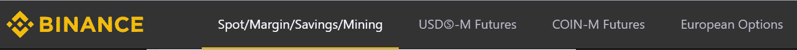

图 3.6 – Binance 主菜单

要提取比特币的现货价格，请导航到**现货/保证金/储蓄/挖矿**标签，如*图 3.6*所示。文档和可用端点在页面左侧的下拉菜单中列出。

该端点的 URL 由两部分组成——一个通用的基础端点和查询部分：

+   基础端点位于**常规信息**部分，可以通过以下链接访问：[`binance-docs.github.io/apidocs/spot/en/#general-info`](https://binance-docs.github.io/apidocs/spot/en/#general-info)

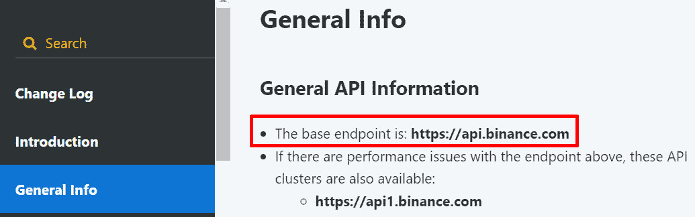

图 3.7 – 币安一般信息视图

+   我们将使用的查询部分如下：

    ```py
     /api/v3/ticker/price
    ```

这段代码的文档位于 *市场数据端点* 部分，可以通过以下链接访问：[`binance-docs.github.io/apidocs/spot/en/#symbol-price-ticker`](https://binance-docs.github.io/apidocs/spot/en/#symbol-price-ticker)。

在 `prices.ipynb` 中，我们从这个来源提取最新的比特币价格。该端点需要一个 `symbol` 参数，以交易对格式表示，我们使用 `BTCUSDT`。

要获取可用交易对的列表，有两个选项。第一个是在币安平台上，第二个是在 TradingView 上，可以在 [`es.tradingview.com/`](https://es.tradingview.com/) 创建一个账户。

在 TradingView 的主页上，进入 **符号搜索**，如 *图 3.8* 所示：

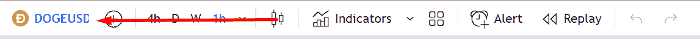

图 3.8 – TradingView 符号搜索栏

这将打开一个下拉菜单，显示所有的交易对列表。要按交易所进行过滤，修改 **所有来源** 参数，如 *图 3.9* 所示：

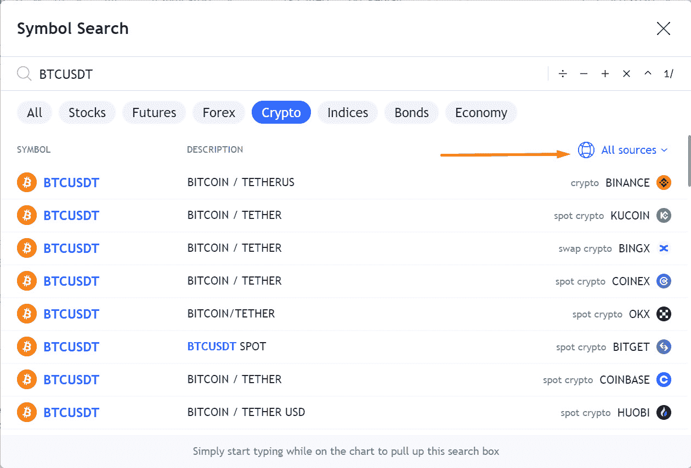

图 3.9 – TradingView 数据源

当搜索框在 `Binance` 上打开时，按 *Enter* 键：

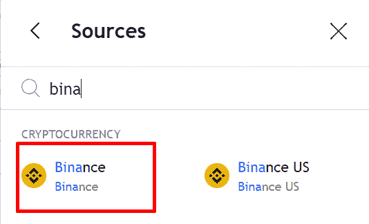

图 3.10 – TradingView 来源选择

这将显示特定交易所的所有交易对，位于 **SYMBOL** 列中。这个符号是我们将作为参数传递给查询的字符串。

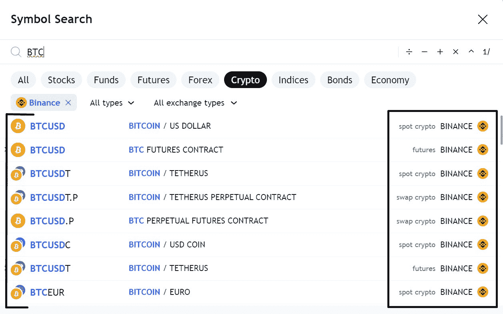

图 3.11 – 在 TradingView 上显示的 Binance 交易对/符号

币安的 API 提供了超越价格信息的全面数据，使其成为一个宝贵的探索资源。

## 预言机 – Chainlink

**预言机** 作为智能合约与现实世界数据之间的桥梁。考虑一个为特定气候相关事件（例如雨水）提供保险的智能合约。在其区块链的封闭环境中，智能合约如何判断当前是否下雨？解决方案在于预言机，它们建立了智能合约与外部信息之间的联系，确保必要的数据能在区块链内反映出来。

**Chainlink** 是最广泛使用的预言机之一。本章重点讨论智能合约的价格数据源，虽然也有其他数据源，例如储备证明数据源或 NFT 价格数据源（将在 *第四章* 中讨论）。讨论的步骤的文档可在 [`docs.chain.link/data-feeds/api-reference`](https://docs.chain.link/data-feeds/api-reference) 找到。

大多数价格共识发生在链外，当需要更新区块链时，经过一致同意的价格会通过价格数据源预言机记录在链上。

例如，比特币价格会持续更新，并可在 [`data.chain.link/ethereum/mainnet/crypto-usd/btc-usd`](https://data.chain.link/ethereum/mainnet/crypto-usd/btc-usd) 查看。价格会基于 *触发参数* 在链上更新，如 *图 3.13* 所示：

+   **偏差阈值**：当链下数据与最后更新的价格偏差超过 0.5% 时触发。

+   **心跳**：在自上次更新以来经过指定时间后激活。每个价格信息源都有其特定的心跳时间。对于比特币价格信息源，该间隔设置为一小时。因此，价格信息将在一小时后刷新，前提是之前的触发事件没有在此之前发生。

如果我们想从这些智能合约中获取数据，我们需要关注心跳，并检查其时间戳，确保最新的答案足够新，以便将其添加到我们的数据集中。

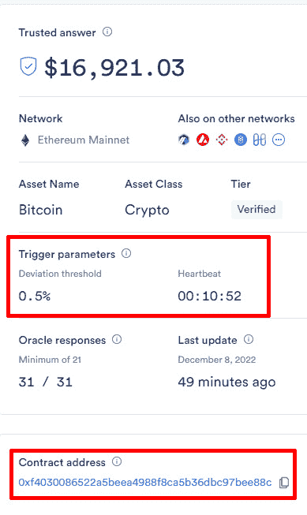

图 3.12 – Chainlink 价格信息视图

要提取最新价格或 **最新回合** 的价格，我们需要合约地址，如前面图示中的第二个红框所示。

合约 `prices.ipynb`。

可用的 `read` 函数用于价格信息智能合约，包括以下内容：

+   `decimals()`：返回响应中的小数位数。在 `prices.ipynb` 示例中，此值为 `8`，通过以下代码片段获取：

    ```py
    description(): Returns the description of the data feed. In the prices.ipynb example, this result is BTC / USD, and it is retrieved with the following code snippet:

    ```

    getRoundData(uint80)：返回特定回合中的数据。

    ```py

    ```

+   `latestRoundData()`：返回最新的回合数据。

+   `version()`：返回合约版本。

要获取价格，我们需要执行 `latestRoundData` 函数，如下所示：

```py
contract.functions.latestRoundData().call()
```

结果是一个由以下元素组成的列表：

| `roundId` | 每次更新预言机时，都会生成一个 `roundId` 值。要获取历史回合的答案，我们需要调用 `getRoundData(uint80)` 函数，并提供该数字作为参数。 |
| --- | --- |
| `answer` | 这是返回的资产价格，即所需的数据点。 |
| `startedAt` | 这是回合开始时间的时间戳。 |
| `updatedAt` | 这是回合更新时间的时间戳。 |

表 3.1 – 预言机响应

响应中还有一个最后的元素（`answeredInRound`），这是一个遗留变量，现已不再使用。

一旦获取到 `answer`，根据 `decimals()` 函数指示的小数位数，将逗号移动相应的位置，转换为传统的小数格式：

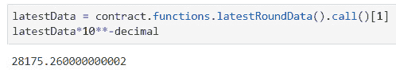

图 3.13 – 由 Chainlink 提供的比特币价格

## OHLC – Kraken

**开盘、最高、最低、收盘** (**OHLC**) 数据是一种特定的数据集，其中每行包括一个时间戳和四列数据：

+   **开盘价** (**O**)：这是该资产在分析期间开始时的价格。

+   **最高价格** (**H**)：这是在分析期间该资产的最高价格。

+   **最低价格** (**L**)：这是在分析期间该资产的最低价格。

+   **收盘价**（**C**）：这是分析期间结束时最后的资产价格。

可以在 *表 3.2* 中看到一个示例：

| **时间戳** | **开盘价** | **最高价** | **最低价** | **收盘价** |
| --- | --- | --- | --- | --- |
| `2022-12-06 00:00:00` | `16965.7` | `17089.1` | `16965.7` | `17011.0` |

表 3.2 – OHLC 数据示例

OHLC 列提供了有关资产在特定时间段内价格变化的信息。*图 3.14* 显示了一个可以使用 OHLC 数据创建的蜡烛图示例。

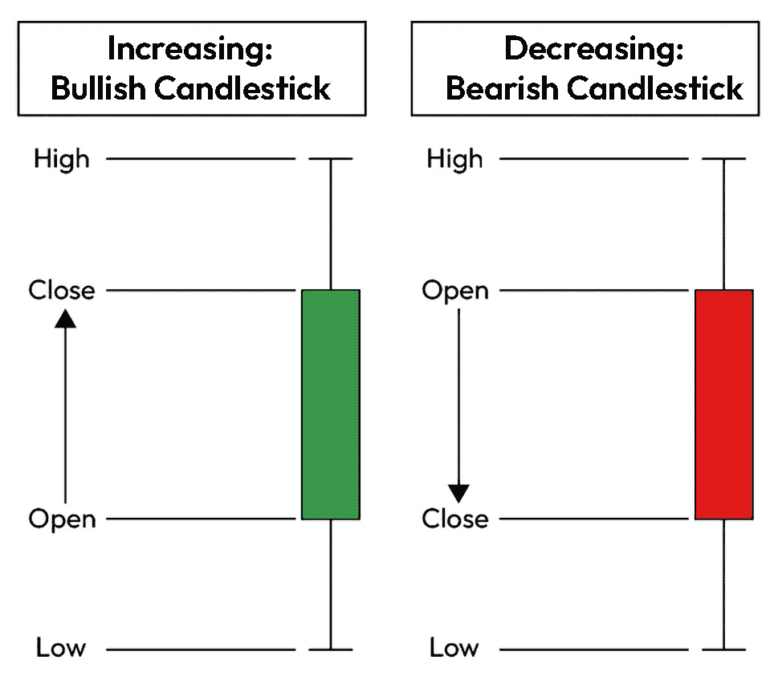

图 3.14 – 蜡烛图设计

数据集中的每一行可以用来绘制一个蜡烛图。*收盘价*和*开盘价*告诉我们，在给定的时间段内，资产的价格是下降（*收盘价*低于*开盘价*）还是上升（*收盘价*高于*开盘价*）。这些信息用于给蜡烛图的实体上色。

OHLC 数据可以包括额外的列，如成交量或交易数量。请参阅 `prices.ipynb` 中的示例。

像移动平均线或布林带等技术指标，在交易中非常流行，也可以使用 OHLC 数据进行绘制。

**Kraken** 集中交易所通过其开放 API 提供 OHLC 数据，并且文档非常完善。正如我们在使用 Binance 时学到的那样，使用交易所时，每个价格查询都必须以交易对的形式表达。

文档可以在 [`docs.kraken.com/rest/#section/General-Usage`](https://docs.kraken.com/rest/#section/General-Usage) 找到。我们将使用的端点在 [`docs.kraken.com/rest/#tag/Market-Data/operation/getOHLCData`](https://docs.kraken.com/rest/#tag/Market-Data/operation/getOHLCData) 中有详细说明。

在处理 OHLC 数据时，考虑数据的时间间隔或粒度非常重要。在短时间内看似高或低的价格，在较长时间段内分析时可能并不重要。时间粒度将取决于 API。通常，可以提取秒、分钟、小时和天数以及它们的组合。在 Kraken 中，可以使用以下参数进行提取：

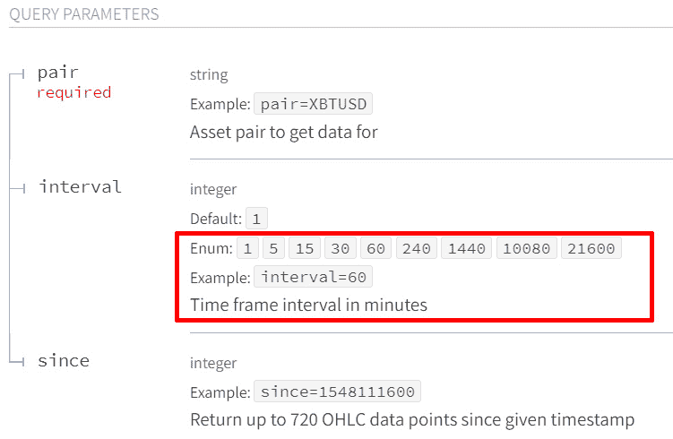

图 3.15 – 以秒为单位表示的间隔参数

要绘制蜡烛图，我们可以使用 `plotly.graph_objects` 库。在 `prices.ipynb` 中，我们提取了 2023 年 4 月 1 日至 4 月 5 日之间四小时周期的比特币 OHLC 数据集，并使用该库绘制相应的蜡烛图。

## 关于价格的最终思考

在我们对价格进行了深入讨论后，以下是一些需要记住的关键点：

+   并非所有法定货币都被这些 API 支持。对于不是美元或欧元的货币，API 可能会显示该国中央银行与美元的官方汇率，这可能与实际市场价格有很大差异。特别是对于那些有监管经济或高通货膨胀的国家来说，这一点尤其如此。在将这些价格添加到我们的数据集之前，有必要了解这些 API 数据的来源。

+   代币或硬币的价格并不是我们可能需要跟踪的唯一产品。我们还可能会收到跟踪某个 NFT 系列的地板价格的请求。

+   在写这篇文章时，Web3 资产在短时间内仍然表现出显著的价格波动。在计算平均值时，我们必须注意可能影响这些平均值的异常值。来自低流动性市场（如小型交易所）的数据更容易受到异常值的影响。请阅读这些价格如何计算的说明，并定期与其他来源进行比较，或像 CoinMarketCap 一样创建加权平均值。

新闻常常引发价格波动，因此让我们现在探索一个专门的新闻聚合器，它跟踪 Web3 世界中的相关信息。

# 将新闻添加到我们的数据集

一位教授曾提到，在加密世界中，新闻只需五分钟就能影响一个资产的价格。

新闻不仅仅对价格产生影响，营销团队也可能要求分析品牌、活动或产品的社会影响，或者可能需要获取某个算法等应用。为了这个目的，数据科学家需要格式化适合分析的新闻数据。

截至目前，已有一个名为**CryptoPanic**的专门数据聚合源，它专门索引与 Web3 生态系统相关的新闻。网站链接是 [`cryptopanic.com/`](https://cryptopanic.com/)。

它的数据可以通过 API 访问，注册后可以获得 API 密钥。

在主页面，点击左侧菜单中的**登录**选项卡：

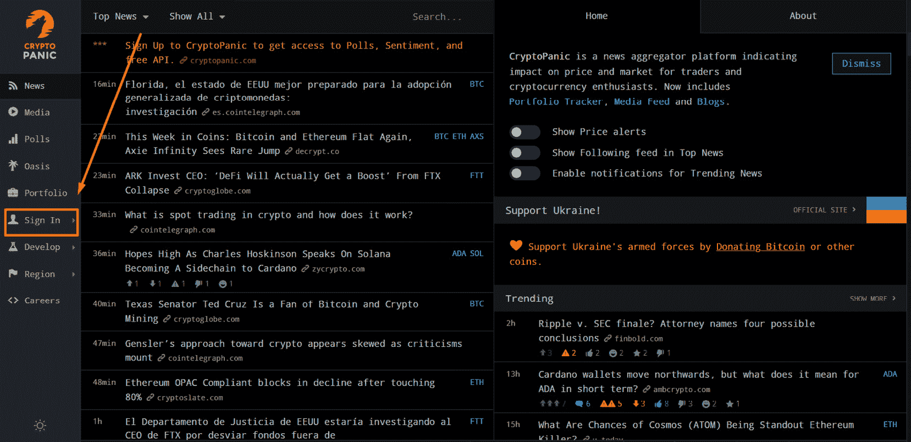

图 3.16 – CryptoPanic 主界面概览

如果这是你第一次注册，你需要确认你的电子邮件。之后，你就完成注册了。点击主页上的**开发**选项卡：

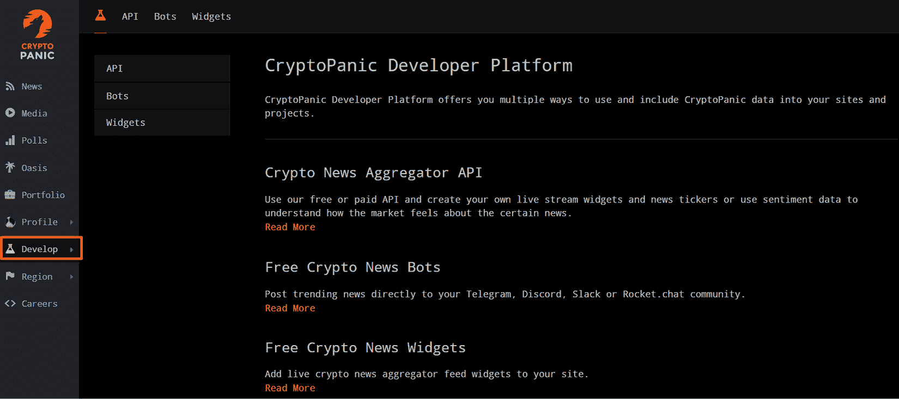

图 3.17 – 开发选项卡

点击新页面上的任一**API**选项卡：

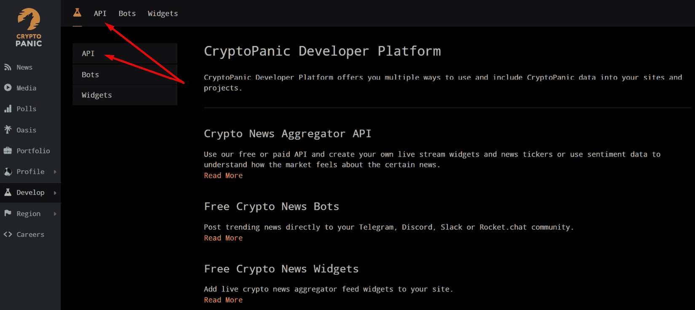

图 3.18 – API 文档

点击**API 密钥**，它会打开一个新页面，其中包含凭证：

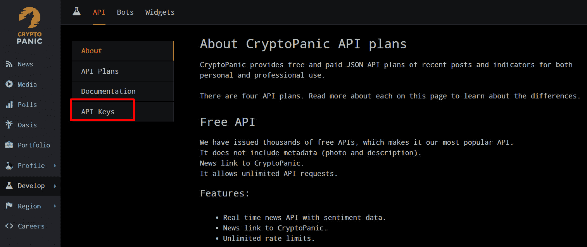

图 3.19 – API 密钥

文档可通过此链接访问：[`cryptopanic.com/developers/api/`](https://cryptopanic.com/developers/api/)。

我们将使用传统的`requests`库进行查询，并将 API 密钥添加到文档中列出的端点。获取新闻列表的详细步骤可以在`news.ipynb`中看到。

我们可以对请求应用过滤器，以限制接收的信息量。这些过滤器包括以下内容：

+   货币：在索引新闻中提到的资产

+   区域：语言

+   UI：包括以下类别——上升、热门、看涨、看跌、重要、保存和笑话

+   类型：这可以是媒体或新闻

过滤器可以组合使用，每个过滤器都可以接受多个参数。例如，可以通过在 URL 中添加以下字符串来获取英文和西班牙文的新闻：

```py
regions=en,es
```

在`news.ipynb`中，我们应用了两个过滤器：货币和类型：

```py
url= 'https://cryptopanic.com/api/v1/posts/?auth_token=[YOUR API KEY]&currencies=BTC&kind=news'
response = requests.get(url)
```

该 API 还提供专业付费选项（在其网站上称为“pro”），这些选项可以访问额外的元数据或获取原始来源的链接。

这个 API 的另一个有趣之处在于，返回的请求内容包括以下内容：

+   社区对头条新闻情绪的看法。这对构建情绪分析算法尤为有用，例如我们将在*第八章*中构建的算法。

+   发布新闻的时间戳。这样我们就可以将头条新闻与价格结合起来，比较新闻对价格的历史影响。

正如在本章开头的介绍示例中所看到的，社交网络上的事件甚至在记者写文章之前就能对价格产生重大影响。因此，重要的是将社交网络的数据添加到我们的数据集中。

# 将社交网络添加到我们的数据集中

Web3 是一个在线行业，因此在线发生的所有事件，从意见到互动，都具有重要的影响力。

**情绪分析**，即衡量对产品或代币的反应，在营销团队、分析师和交易员中都发挥着至关重要的作用。一个突出的例子，说明了这种指标的重要性，就是 CoinStats 的恐惧与贪婪指数。这个指数可以在[`coinstats.app/fear-and-greed/`](https://coinstats.app/fear-and-greed/)查看，结合了社交媒体帖子等因素来衡量市场情绪。

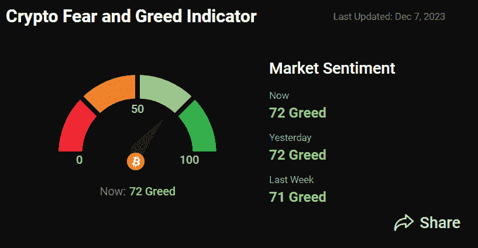

图 3.20 – 加密恐惧与贪婪指数

根据 CoinStats 的解释，该指数结合了来自不同来源的数据。为了捕捉心理动能，它们还从 X 上的社交媒体互动中获取见解，专注于具有恐惧和贪婪元素的特定标签，这些因素共同参与了总体计算。根据文档，社交媒体因素在最终指数中占有 15%的权重。

## X（前身为 Twitter）

X 可能是目前 Web3 相关对话中最重要的社交媒体平台，而且该服务无需介绍。

注释

我们将*X*和*Twitter*交替使用。尽管该平台的用户界面现在使用的是 X 这个名称，但在开发者工具和所有网址中，它仍然保留着原来的名称 Twitter。

一个典型的例子，说明了 X 上发生的事情如何影响行业，是在 Binance 在其官方 X 页面上宣布，“*由于公司尽职调查，以及关于客户资金处理不当和美国机构调查的最新新闻报道，我们决定不再追求对 FTX.com 的潜在收购*”（来源：[`twitter.com/binance/status/1590449161069268992`](https://twitter.com/binance/status/1590449161069268992)）。

X 数据访问自 2023 年 2 月起成为付费服务，订阅详情可通过开发者门户网站 [`developer.twitter.com/`](https://developer.twitter.com/) 获得。本节中的练习使用了基础订阅和 API v2。

要获取具有读取权限的 API 密钥，我们需要创建一个项目并连接一个应用程序，具体步骤请参见 *附录 2*。

大多数用户的推文是公开的，定制查询允许我们根据用户、主题、语言或位置等多种标准获取推文。在 `social.ipynb` 中，我们提取了最新的 100 条包含 *Bitcoin* 和 *BTC* 的推文，排除了转发，并限制为英文推文，查询如下：

```py
query = 'bitcoin btc -is:retweet lang:en'
```

有关构建有效查询的更多说明，请参见 [`developer.twitter.com/en/docs/twitter-api/tweets/search/integrate/build-a-query`](https://developer.twitter.com/en/docs/twitter-api/tweets/search/integrate/build-a-query)。

检查点

推文提取流程的逐步版本详见 `social.ipynb`。或者，生成的 CSV 文件已上传到本书的 GitHub，并可以在 `tweets_100.csv` 中访问。

使用 v2 端点，可以请求 `annotations`，为推文添加上下文信息。此功能对数据分析非常有价值，因为它在有限的分类法中对内容进行标准化。例如，考虑 *图 3.21* 中展示的推文：

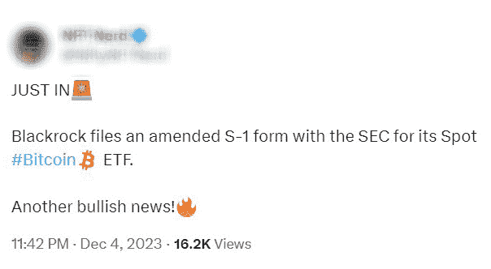

图 3.21 – 示例推文（ID: 1731806102101033329）

X 提供了实体识别和上下文注释功能，用于该推文。`Person`、`Place`、`Product`、`Organization` 和 `Other`。

推文正文中识别出三个实体。两个是组织 – `Blackrock` 和 `SEC` – 第三个属于 `Other` 类别，指的是 `Bitcoin`：

```py
'annotations': 'annotations': [{'start': 10,
    'end': 18,
    'probability': 0.8568,
    'type': 'Organization',
    'normalized_text': 'Blackrock'},
    {'start': 55,
    'end': 57,
    'probability': 0.7281,
    'type': 'Organization',
    'normalized_text': 'SEC'},
    {'start': 73,
    'end': 79,
    'probability': 0.9581,
    'type': 'Other',
    'normalized_text': 'Bitcoin'}]
```

该推文的完整实体字典可以在 `social.ipynb` 中查看。

X 通过 **上下文注释**进一步丰富推文信息，这些注释是从文本的语义、关键词和标签中推断出来的。已经制定了一个全面的关键词、标签和用户名单，并根据具体上下文进行标记。如果这些元素出现在推文中，它们将被适当标记。截至 2022 年 6 月，已有超过 80 个上下文领域。相关文档链接可以在 *进一步* *阅读* 部分找到。

下面是一个示例：

```py
{'domain': {'id': '131',
    'name': 'Unified Twitter Taxonomy',
    'description': 'A taxonomy of user interests. '},
    'entity': {'id': '913142676819648512',
    'name': 'Cryptocurrencies',
    'description': 'Cryptocurrency'}},
```

这些信息对于分类和自然语言处理（NLP）机器学习算法非常有价值。

该推文的完整上下文注释列表可在`social.ipynb`中找到。

营销和产品团队常用的一种方法是分析与产品或品牌相关的词汇，这通常通过分析客户评论、反馈或社交媒体评论来实现。这种方法可以更深入地了解受众及其看法。实现这一目标的图形化方式之一是创建词云，突出显示最常被提到的词汇。这有助于一目了然地识别客户的情感、偏好和痛点。

为了重现词云，我们利用推文作为数据源，特别是提取了 1,000 条针对 NFT 领域中的一个协议（在*第四章*中介绍）——即 OpenSea 的推文。为了执行此提取，我们使用了以下查询：

```py
new_query = 'opensea -is:retweet lang:en'
```

检查点

推文提取管道的逐步版本详见`social.ipynb`。另外，生成的 CSV 文件已上传到本书的 GitHub，并可以通过`tweets_df.csv`访问。

在笔记本中，我们将找到用于清理推文的库和方法，在计算单词出现频率之前对其进行标准化。这些是传统的 NLP 步骤，我们将在*第八章*中更详细地描述。OpenSea 的词云结果如*图 3.22*所示：


图 3.22 – OpenSea 词云

一旦我们学会提取社交链外数据，就可以将其与链上数据结合，扩展我们的分析。推文、Discord 对话、Telegram 互动以及其他社区论坛都有时间戳和地理位置标签，可以用于将链外活动与链上发生的交易进行合并。这有助于分析师推测链或协议的活跃时间、推断客户的地理位置等。这些类型的分析通常是营销团队请求的，以改善他们广告活动的方向。

一个利用这两种世界之间连接的公司例子是 Spindl，该公司正在努力将 Web2 营销数据源与链上数据合并，以构建 Web3 领域的第一个营销漏斗工具。

一个关于 Twitter 个人资料的说明

这里有一些有趣的个人资料可以关注，以进行 Web3 数据分析/内容创作，除此之外还有许多其他有趣的个人资料：

`@``0xGembus`: [`twitter.com/0xGembus`](https://twitter.com/0xGembus)

`@``0xAtomist`: [`twitter.com/0xAtomist`](https://twitter.com/0xAtomist)

`@``hildobby_`: [`twitter.com/hildobby_`](https://twitter.com/hildobby_)

其他值得探索的社交媒体数据源如下：

+   **Reddit**：该平台托管了许多与 Web3 相关的对话，形式为 Subreddits。Subreddit 中的帖子和评论提供了宝贵的信息。

+   **BitcoinTalk.org 论坛**：该论坛上的公开帖子也是一个有趣的信息来源。

# 摘要

在本章中，我们考察了与 Web3 经济相关的各种链外数据来源，并将分析分为三个主要领域。对于价格，我们探索了来自传统来源到交易所的多个 API，以及一个预言机。关于新闻，我们学习了如何提取实时头条，这些头条来自当时最优秀的专门新闻索引器——CryptoPanic。至于 X（前身为 Twitter），我们利用其 API 来衡量围绕 NFT 协议的情绪。这个资源清单并不详尽，我们只触及了我们能够为这些数据提供的所有用途的表面。

在下一章中，我们将深入探讨 NFT 及其在游戏、艺术和命名服务行业中的应用。

# 进一步阅读

为了补充本章，以下链接可能对你有所帮助：

+   价格：

    +   支持 CoinMarketCap。（2020）。安全检查。如何计算 CoinMarketCap 上的价格？[`support.coinmarketcap.com/hc/en-us/articles/360015968632-How-are-prices-calculated-on-CoinMarketCap-`](https://support.coinmarketcap.com/hc/en-us/articles/360015968632-How-are-prices-calculated-on-CoinMarketCap-)

    +   加密 API 文档。（无日期）。CoinGecko。[`www.coingecko.com/api/documentation`](https://www.coingecko.com/es/api/documentation)

    +   账户。（无日期）。加密货币价格、图表与市值 | CoinMarketCap。[`coinmarketcap.com/api/documentation/v1/`](https://coinmarketcap.com/api/documentation/v1/)

    +   CoinMarketCap。（无日期）。最受信任的加密货币市场数据 API | CoinMarketCap。coinmarketcap.com。[`coinmarketcap.com/api/faq`](https://coinmarketcap.com/api/faq)

    +   有用的 Chainlink 教程。Chainlink。（2022）。学习资源。Chainlink 文档：[`docs.chain.link/getting-started/other-tutorials/`](https://docs.chain.link/getting-started/other-tutorials/)

    +   进一步扩展关于预言机的内容。Chainlink，*区块链中的预言机是什么？ » 解释*。Chainlink: 混合智能合约的区块链预言机：[`chain.link/education/blockchain-oracles`](https://chain.link/education/blockchain-oracles)

    +   数据流 API 参考。（无日期）。Chainlink 文档。[`docs.chain.link/data-feeds/api-reference`](https://docs.chain.link/data-feeds/api-reference)

    +   价格信息合约地址。（无日期）。Chainlink 文档。[`docs.chain.link/data-feeds/price-feeds/addresses/`](https://docs.chain.link/data-feeds/price-feeds/addresses/)

+   新闻：

    +   下载网站的逐步过程。Furneaux, Nick。“调查加密货币。理解、提取与分析区块链证据” Wiley，2018。*第八章*。- 第 125 至 130 页。

+   社交网络：

    +   安装 — Tweepy 4.13.0 文档。（无日期）。Tweepy 文档 — tweepy 4.13.0 文档。[`docs.tweepy.org/en/stable/install.xhtml`](https://docs.tweepy.org/en/stable/install.xhtml)

    +   Getting-started-with-the-twitter-api-v2-for-academic-research/5-how-to-write-search-queries.md at main · twitterdev/getting-started-with-the-twitter-api-v2-for-academic-research. (n.d.). GitHub. [`github.com/twitterdev/getting-started-with-the-twitter-api-v2-for-academic-research/blob/main/modules/5-how-to-write-search-queries.md`](https://github.com/twitterdev/getting-started-with-the-twitter-api-v2-for-academic-research/blob/main/modules/5-how-to-write-search-queries.md)

    +   概述. (n.d.). 用例、教程和文档 | Twitter 开发者平台. [`developer.twitter.com/en/docs/twitter-api/annotations/overview`](https://developer.twitter.com/en/docs/twitter-api/annotations/overview) 和 [`developer.twitter.com/en/docs/twitter-api/annotations/faq`](https://developer.twitter.com/en/docs/twitter-api/annotations/faq)
