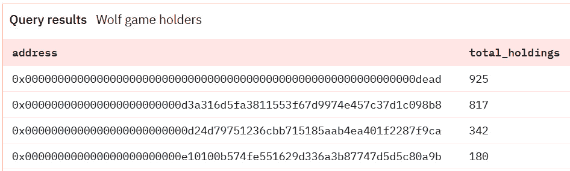
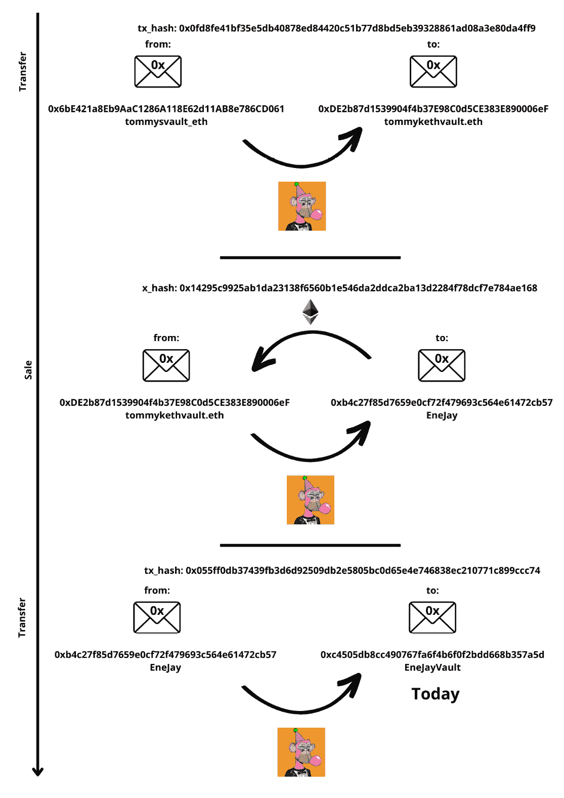
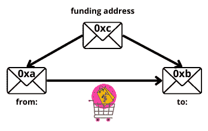

# 第四章：探索 NFT 的数字独特性——游戏、艺术与身份

在本章中，我们将探讨**非同质化代币**（**NFT**）及其各种经济应用场景。我们将从了解 NFT 是什么开始，如何在交易数据中记录相关信息，以及获取这些信息的替代方式。此外，我们还将分析游戏、艺术和身份行业如何利用这项技术，并探讨一些与各行各业相关的指标。

商业举措通过一组智能合约执行，我们称之为“协议”。我们将深入了解基本的协议指标，快速了解每个协议的结构和用户构成。为此，我们可以选择使用数据框架，这对于商业分析师来说是一项非常有价值的工具，帮助我们组织分析并在展示结果时构建有力的叙述。此类结构的一个例子是*覆盖率、留存率和* *收入*框架。

**覆盖率**指标帮助我们了解增长的来源、客户获取成本、目标市场等；**留存率**指标为评估产品效果提供了衡量标准，涵盖客户使用频率、流失率和群体分析等因素；**收入**指标则提供有关产品盈利能力的见解。值得注意的是，Covalent 团队设计了一项数据分析师培训计划，详情我们将在*第十三章*中进行更详细的介绍，该计划将链上分析学习与这一框架结构结合。

在本章中，我们将探索每个类别的具体指标示例。

本章将深入探讨以下主题：

+   NFT 数据简介

+   游戏、艺术与身份行业的协议和数据库探索

+   游戏、艺术与身份行业相关指标

本章结束时，我们将能够自信地处理数据分析师在处理 NFT 时通常研究的各项指标。

技术要求

我们将使用在**Dune Analytics、Increment、Footprint Analytics** 和 **Flipside** 等平台上可用的索引数据。为了跟上进度，请在这些平台上开设账户，并通过*第二章*提供的链接进行操作。交易数据是通过 **SQL** 服务查询的，语法因查询引擎的不同而有所差异。

我们还将使用 `web3.py` 中包含的 `ens` 模块，`web3.py` 是我们在*第一章*中安装的。要使用它，只需通过以下代码片段导入：

```py
from ens import ENS
```

你可以在本书的 GitHub 仓库中找到包含本章讨论示例的 Jupyter notebook，链接为[`github.com/PacktPublishing/Data-Science-for-Web3/tree/main/Chapter04`](https://github.com/PacktPublishing/Data-Science-for-Web3/tree/main/Chapter04)。

此外，Dune 上有一个实时仪表板，展示了本章中解释的许多查询，网址为 [`dune.com/gabriela/chapter-4-nft`](https://dune.com/gabriela/chapter-4-nft)。对于所有 Dune 仪表板，查询可以通过点击相关图表的标题来访问。以下是一个示例：


图 4.1 – 点击此处打开查询。Dune 仪表板 @hildobby (https://dune.com/hildobby/NFTs)

我们建议同时探索这两个资源，以获得全面的理解。

# 通过使用 NFT 在区块链上实现独特资产追踪

本节包括两个主要部分：*业务需求*，将揭示这一解决方案起源的具体需求；以及*技术解决方案*，将提供标准智能合约的结构性概述，包括其方法和事件。

## 业务需求

当一个资产与另一个相同性质的资产具有相同的质量和价值，可以互换时，该资产被视为**可替代**的。例如，一美元可以与另一美元互换，同样适用于本地加密货币和代币，如 DAI 或 USDT。

相反，如果一个资产是**不可替代**的，这意味着它是独一无二的，无法被另一个相同的资产替代，因为没有等价物。考虑索罗拉的《海滩散步》画作，它是独特的，尽管我们可以通过 Google 复制它因为我们欣赏它，但我们并不真正拥有它，也无法证明拥有权：


图 4.2 – 索罗拉的画作《海滩散步》

数字艺术面临着类似甚至更为尖锐的困境。一旦一件艺术作品被上传到互联网，它就可以被无限复制，而不恰当地承认其作者或所有权，更不用说支付版税了。

使用区块链技术追踪独特资产的所有权为解决这一问题提供了方案，并且已经彻底改变了那些以独特性为交易价值的行业，如艺术、游戏或身份认证。

## 技术解决方案

**以太坊评论请求 721**，或称为**ERC 721**标准，包括一组合约，允许以太坊实现一个 API，为区块链上的某些资产提供不可变的身份。一旦身份被赋予，这些资产就可以被追踪、估值、出售等。NFT 的身份由一对数据点组成：


图 4.3 – NFT 的身份

合约地址可能根据所考虑的行业有不同的名称。例如，在处理 ENS 时，它可能被称为**注册人**合约，在研究艺术时，则可能被称为**收藏**合约。

需要注意的是，使用此标准时，Ethereum 支持连接外部资源，智能合约会引用第三方服务器来获取关于 NFT 的信息。这意味着，如果智能合约指向的 URI 发生变化，NFT 的信息可能无法再访问，或者发生变化。以太坊开发者曾考虑将所有资产的元数据存储在区块链上，但由于注册在区块链上的 gas 费用非常昂贵，这会妨碍可用性。

本解决方案的基本合约方法和事件在 2018 年由 William Entriken、Dieter Shirley、Jacob Evans 和 Nastassia Sachs 提出的 ERC 721 中进行了详细说明。另一个有价值的信息来源是 Open Zeppelin 实现，它详细描述了每个函数和方法。

我们将遇到的`read`方法如下：

+   `balanceOf(address _owner)`：该方法告诉我们特定地址拥有多少 NFT。

+   `ownerOf(uint256 _tokenId)`：该方法告诉我们拥有特定 NFT 的地址。

可选地，我们将看到元数据扩展：

+   `name()`：集合的名称

+   `symbol()`

+   `tokenURI(uint256 _tokenId)`

枚举扩展是可选的，它启用以下方法，提供对集合的全面视图：

+   `totalSupply()`

+   `tokenByIndex(uint256 _index)`

+   `tokenOfOwnerByIndex(_owner, uint256 _index)`

以下是一些重要事件：

+   `Transfer(address indexed _from, address indexed _to, uint256 indexed _tokenId)`：当 NFT 的所有权发生变化时，会触发此事件。该事件签名的哈希为`0xddf252ad1be2c89b69c2b068fc378daa952ba7f163c4a11628f55a4df523b3ef`，我们将在许多查询中看到它。

+   `Approval(address indexed _owner, address indexed _approved, uint256 indexed _tokenId)`。

+   `ApprovalForAll(address indexed _owner, address indexed _operator, bool _approved)`。

NFTs 的应用，尤其是在游戏中，突显了最初提出的 NFT 的高成本。随后，另一组作者在 2018 年提出了 ERC 1155 多代币标准。ERC-1155 用于在同一合约中组合可替代代币和 NFT，节省时间和 gas 费用，同时减少以太坊上的冗余代码。

我们将遇到以下相关的读取函数方法：

`balanceOfBatch(address[] calldata _owners, uint256[] calldata _ids)`：该方法允许你查询多个地址在某些代币 ID 上的所有权。

事件如下：

+   `TransferSingle`

+   `TransferBatch`

+   `ApprovalForAll`

+   `URI`

到目前为止，我们已经列出了在分析 NFT 数据时将遇到的事件和函数。我们在*第二章*中学习了如何与它们交互，因此现在直接进行更多使用 NFT 生成数据的案例研究，并为其构建度量标准。

# 区块链游戏 – GameFi 提案

对于每个行业，我们将简要回顾目前活跃的企业、玩家以及相关的指标。

根据商业案例的不同，这些指标可以进一步扩展。*进一步阅读*部分包含了额外的资源。

## 商业格局介绍

游戏产业在区块链发展史中占有一席之地，在推动该技术的采用方面取得了显著成功，同时重塑了奖励和所有权的格局。

游戏产业经历了重大的变革，从“付费游玩”模式转变为“免费游玩”在线格式。在“付费游玩”模式下，玩家需要购买实物游戏卡带、光盘或订阅服务才能访问游戏内容。而区块链技术的出现进一步推动了边界，引入了**玩赚**（**P2E**）模式。P2E 赋予玩家财产权，让他们真正拥有游戏内资产。过去，玩家可能获得过游戏内的奖励或物品，但他们并不拥有这些物品的真正所有权，无法出售或交换这些资产。NFT 的引入为游戏生态系统带来了真正的改变，为玩家提供了真正的所有权感，并通过区块链技术铺平了游戏与金融融合的道路。这一转变不仅仅发生在游戏本身，还影响了玩家在虚拟世界之外的生活。因此，出现了一种新的商业结构，称为**游戏公会**，它们旨在将相关的游戏内资产租赁给玩家，同时为成员提供培训和社区支持。

区块链支持的游戏兴起始于 2018 年，当时推出了《加密猫》这款游戏，玩家可以繁育和交易数字猫。这款游戏引入了可交易的数字收藏品的概念。随之而来的是《Axie Infinity》的重大里程碑，它吸引了大量非加密货币用户加入生态系统，创下了行业前所未有的数字。Axie Infinity 为区块链游戏带来了主流采用。在本书撰写时，许多游戏正在不断推出，不断推动创新的边界。

这些区块链游戏创造了一个不断发展的生态系统，经济模式超越了玩家，甚至涉及到非玩家，为他们提供了角色，甚至推广了跨境奖学金，以通过游戏公会组织玩家并得到投资者的支持。游戏与金融在这一市场细分中的融合被称为 GameFi，并且是由区块链技术实现的。金融概念和激励措施已经被整合到游戏产业中，例如收益耕作、质押或治理代币等。

GameFi 还使得游戏数据的获取变得更加民主化，以前这些数据完全由大型游戏公司控制。现在，通过正确的知识，我们可以通过查询区块链跟踪资产、玩家以及整个游戏内经济。

## 分析

现在，让我们分析一款声称其所有数据集都存储在以太坊网络上的游戏，该游戏被称为`$Wool`，是该生态系统的货币。

要参与游戏，玩家必须拥有一只羊或一只狼。这些角色可以在 NFT 市场如 OpenSea 上购买，稍后我们将在本章的*通过区块链重新定义艺术产业*一节中进一步定义。以下是 Wolf Game 收藏品的链接：[`opensea.io/collection/wolf-game`](https://opensea.io/collection/wolf-game)。我们可以通过识别 Wolf Game 收藏品的智能合约`0x7f36182dee28c45de6072a34d29855bae76dbe2f`开始我们的分析。

方法论说明

在首次处理一个项目时，尤其是当这个项目较为陌生时，我们可以按照以下步骤进行：

1. 确定我们想要通过数据回答的具体问题。

2. 找到一个交易示例，能够体现回答问题所需的信息。

3. 分析交易，正如我们在《第二章》中学到的那样，了解智能合约如何记录数据。

让我们应用这一方法论：

1.  假设我们想要确定 Wolf Game 中铸造的羊和狼的数量。铸造的 NFT 数量是 NFT 稀缺性的一个重要指标。

1.  要理解智能合约如何记录铸造数据，我们将搜索一个铸造交易。例如，考虑`0xc7fa87b19a6cc7735c49753442fc034fd6ed5d5c1b5250c56eebed428376272e`这个交易哈希。

在 Etherscan 上，交易显示如下：


图 4.4 – Etherscan 视图中的交易哈希概览

交易回执日志显示如下：


图 4.5 – Etherscan 视图中的交易日志概览

我们也可以在`Chapter4/Games.ipynb`中探索日志，同时遵循《第二章》中描述的方法论，在该章节中，我们获取交易回执并解码日志。解码后的日志显示了以下数据结构：

| **事件名称或** **Topic [0]** | **Transfer** |
| --- | --- |
| From - Topic [1] | `0x0000000000000000000000000000000000000000` |
| To - Topic [2] | `0x0a2542a170aA02B96B588aA3AF8B09AB22a9D7ac`（发起交易的 EOA） |
| tokenID - Topic [3] | `4618` |

表 4.1 – 解码日志的数据结构

从这些结果中，我们可以推导出以下信息：

1.  我们所寻找的数据位于以太坊地址`0x7f36182dee28c45de6072a34d29855bae76dbe2f`中。

1.  在这些日志中，我们需要查找“Transfer”事件，其中“from”地址是`0x0000000000000000000000000000000000000000`。

1.  最后，我们需要统计唯一的`tokenID`值。

如果我们将这些步骤转化为 SQL 查询，我们可以得出结论，共铸造了 13,737 个 NFTs。SQL 查询如下：

```py
SELECT count (distinct ("topic3")) as total_nfts
FROM ethereum.logs
WHERE "contract_address" = 0x7f36182dee28c45de6072a34d29855bae76dbe2f
AND "topic0" = 0xddf252ad1be2c89b69c2b068fc378daa952ba7f163c4a11628f55a4df523b3ef
AND "topic1" = 0x0000000000000000000000000000000000000000000000000000000000000000
```

值得注意的是，如果转移来源地址为 `0x0000`，我们可以将其解读为铸造事件。如果该地址或 `0x000dEad` 出现在交易的“to”部分，则可以认为是销毁转移。与加密货币类似，*铸造* NFT 表示其创建，而 *销毁* 则意味着它们被发送到不可恢复的地址，实际上将其从流通中移除。这可以用来控制供应量或淘汰不再市场化的游戏资产。

另一个常见的度量标准是识别**主要持有者**。该度量标准告诉我们哪些地址持有最多的代币以及它们拥有的数量。基于我们之前检查的数据结构，我们可以使用以下 SQL 查询来计算该指标：

```py
WITH cte as (
select address, nftid, sum (indicator) as indicator
from
      (select "topic1" as address, "topic3" as nftid, -1 as indicator
        from ethereum.logs
        where "contract_address" = 0x7f36182dee28c45de6072a34d29855bae76dbe2f
        AND "topic0" = 0xddf252ad1be2c89b69c2b068fc378daa952ba7f163c4a11628f55a4df523b3ef
        union all
        select "topic2" as address, "topic3" as nftid, 1 as indicator
        from ethereum.logs
        where "contract_address" = 0x7f36182dee28c45de6072a34d29855bae76dbe2f
        AND "topic0" = 0xddf252ad1be2c89b69c2b068fc378daa952ba7f163c4a11628f55a4df523b3ef)
    GROUP BY address, nftid
    HAVING SUM(indicator) > 0)
select address, sum (indicator) as total_holdings
from cte
group by address
order by total_holdings DESC
limit 10
```

该查询生成了一个包含两列的表格——一列列出主要持有者的十六进制地址，另一列指示它们持有的 NFTs 数量：



图 4.6 – NFTs 的主要持有者

我们可以在 OpenSea 分析平台上验证此信息（[`opensea.io/collection/wolf-game/analytics?tab=items`](https://opensea.io/collection/wolf-game/analytics?tab=items)），以确保检索到的数据与地址和持有量的准确性一致：


图 4.7 – OpenSea 分析平台的主要持有者

通过选择以下功能，也可以用状态数据验证此结果：

```py
contract.functions.balanceOf(address).call()
```

在`Chapter4/Games.ipynb`中，我们将这个函数应用于列出的地址；结果与我们查询的交易数据相同。

要访问状态数据，我们必须按照以下步骤操作：

1.  在 Etherscan 上搜索相关的 ABI。对于 Wolf Game，我们已经在本书的 GitHub 仓库中提供了 ABI。

1.  使用 Infura 连接以太坊网络。

1.  使用 `web3.eth.contract()` 方法连接智能合约地址和 ABI。

1.  执行 `balanceOf()` 读取函数查询智能合约。在这种情况下，我们传递一个地址列表来检查持有量。结果与我们查询的交易数据相同：


图 4.8 – 每个地址的持有状态数据

若要获取更多度量标准和见解，考虑探索基于 Dune 构建的 Wolf Game 仪表板：[`dune.com/gabriela/chapter-4`](https://dune.com/gabriela/chapter-4)。

值得注意的是，Axie Infinity 在其专用链 Ronin 上运营，已经对 NFT 领域产生了重大影响，直到 2022 年 3 月发生了一起黑客事件，损失了 6 亿美元的 ETH。Ronin 有自己的区块链浏览器，其交易数据被我们在*第二章*中分析的所有数据提供商进行索引。其中一个数据提供商 Flipside 在[`flipsidecrypto.xyz/dumplings/axie-infinity-axie-infinity-r5iPOK`](https://flipsidecrypto.xyz/dumplings/axie-infinity-axie-infinity-r5iPOK)上维护了一个有趣的仪表盘。

Ronin 社区也非常活跃，许多开发者已加入该生态系统。官方 Axie Infinity Discord 服务器（https://discord.gg/axie）设有一个“tools-api-etc”频道，提供帮助和信息。开发者创建了特定的端点来访问游戏数据。例如，我们可以探索 REST API（https://documenter.getpostman.com/view/23367645/2s7YfPfEGh#intro），还可以使用以下 GraphQL 端点：[`axie-graphql.web.app/`](https://axie-graphql.web.app/)。

Sky Mavis 还提供了一个官方 API 来获取游戏数据。要访问该 API，我们必须先注册并获取 API 密钥。相关文档可以在[`docs.skymavis.com/reference/general`](https://docs.skymavis.com/reference/general)找到。我们可以使用此 API 来提取游戏领袖在`Chapter4/Games.ipynb`笔记本中所拥有的物品数据。这对于竞争玩家来说是非常有价值的信息。

在分析了游戏垂直领域后，我们将深入探讨另一个行业，NFT 在其中被用于与身份相关的目的。

# 区块链中的身份

正如我们在上一节中所做的，我们将简要回顾一些在身份业务中活跃的项目，并了解其中的参与者和相关指标。

## 行业格局简介

身份一直是 Web3 项目的重点领域。在线领域面临着与身份相关的各种挑战，如解决身份盗窃、国际信用评分转移以及防止 Sybil 攻击等问题。

一个值得关注的项目是“人类证明”，该项目旨在创建一个基于以太坊网络启动的防 Sybil 的个人列表。要加入该项目，已经注册的个人必须为你的个人资料担保，从而扩展信任网络。注册有效期为 2 年，以确保注册表持续更新，从而将已故个人或曾经进入列表的机器人移除。身份拥有者可以注销或更新他们的信息。该项目的主页突出了通过验证身份可以提供显著好处的各种用例，包括信用评分、反垃圾邮件工具和自我主权身份。

鼓励更多个人加入这个信任网络的一个强有力的激励是**基本收入**（**UBI**）的概念。在链外世界中，UBI 是一种福利政策，国家通过这一政策为每个公民提供固定的、无条件的收入。“人类证明”通过向所有成功注册的身份发放一个名为$UBI 的代币，模拟这一政策。我们可以在这个网页上找到相关地址：https://kleros.gitbook.io/docs/developer/deployment-addresses。一个有趣的$UBI 仪表盘可以在[`dune.com/jeremyarbid/Proof-of-Humanity-Universal-Basic-Income-(UBI)`](https://dune.com/jeremyarbid/Proof-of-Humanity-Universal-Basic-Income-(UBI))找到。

关于 Sybil 攻击的说明

Sybil 攻击是对在线系统的一种安全威胁，其中一个实体通过创建多个账户、节点或计算机来试图控制网络。一个简单的例子是一个人创建多个社交媒体账户来操控民意调查的结果。

在这一领域，利用 NFT 的主要产品是**区块链名称服务**。在*第二章*中，我们介绍了**以太坊名称服务**（**ENS**）和**RIF 名称服务**（**RNS**）的协议名称。这些项目遵循传统的**域名服务**（**DNS**）概念，后者用易读的名称替代 IP 地址，以便访问网站。以同样的方式，这些协议在区块链上租赁或出售易读的名称，这些名称帮助替代用于标识地址的长十六进制字符串，使得与品牌和个人的互动更加便捷。一个额外的优势是，这些名称服务是去中心化的，因此不受中央权威的审查。

几个项目积极参与解决这一用例，每个项目都提出了独特的价值主张。有些协议提供名称服务的销售，而其他一些则提供租赁选项，包括子域等变体。这些项目大多数都是基于 ERC-721 标准的共同基础构建的。

若要从这些项目中提取数据，首先要定位文档和构成整个项目的智能合约列表。成熟的项目通常会提供透明的合约地址列表，如这里所示：

| **网络** | **合约地址** |
| --- | --- |
| 以太坊主网 | `0x…` |
| 以太坊测试网（Goerli） | `0x…` |
| Polygon 主网 | `0x…` |
| Rootstock 主网 | `0x…` |

表 4.2 – 项目地址的典型参考表

这种透明性简化了访问和验证。对于 ENS，已部署的智能合约可以在[`docs.ens.domains/ens-deployments`](https://docs.ens.domains/ens-deployments)找到。

## 分析

ENS 库简化了与协议的互动，部分应用程序可以在`Chapter04/Identity.ipynb`中找到。以下代码片段帮助我们获取特定 ENS 的所有者地址：

```py
from ens import ENS
ns = ENS.fromWeb3(web3)
ns.owner("COMPLETE WITH THE ENS OF CHOICE")
```

该协议由两种类型的智能合约组成：

+   *注册表*，管理已铸造的名称

+   *注册商*，处理新域名的采购

每个域名的注册商地址如下：

| **域名** | **合约地址** |
| --- | --- |
| `.``eth` | `0x57f1887a8BF19b14fC0dF6Fd9B2acc9Af147eA85` |
| `.``art` | `0x828D6e836e586B53f1da3403FEda923AEd431019` |
| `.``xyz` | `0x58774Bb8acD458A640aF0B88238369A167546ef2` |

表 4.3 – 注册商地址。来源: https://docs.ens.domains/ens-deployments

在本书的 GitHub 仓库中，我们已添加来自 Etherscan 的永久注册 ABI，帮助获取有关特定代币持有者或特定 ENS 的状态数据。以下代码片段提供了有关地址持有多少 NFTs 的信息：

```py
ethregContract.functions.balanceOf(owner_address).call()
```

`Chapter04/Identity.ipynb` 展示了如何提取其他代币信息，如代币 ID 和到期日期。代币 ID 对应于构成域名的规范化名称或标签的哈希值。有了这些信息，就可以从 ENS API 获取代币的元数据，例如关联的图像（如果存在），可以访问 [`metadata.ens.domains/docs`](https://metadata.ens.domains/docs)。

值得注意的是，ENS 文档中包含一个特别的“ENS 数据指南”，列出了相关资源。该协议已经在 **The Graph** 服务上启用了子图，并且在 Dune 的 SQL 服务上有许多可用的表格。请考虑探索 [`dune.com/makoto/ens`](https://dune.com/makoto/ens)，该页面提供了 ENS 生态的度量概述，包括创建的 ENS 名称总数、参与地址以及这些指标的月度变化。

我邀请您探索这些列出的其他项目或网络的度量数据。以下是其中的一些：

+   **不可阻挡的** **域名**: [`unstoppabledomains.com/`](https://unstoppabledomains.com/)

+   **RIF 名称** **服务**: [`dev.rootstock.io/rif/rns/mainnet/`](https://dev.rootstock.io/rif/rns/mainnet/)

+   **比特币名称** **服务**: [`btc.us/`](https://btc.us/)

到此为止，我们已经解释了区块链名称服务是什么，并分析了数据来源和 ENS 的主要度量指标，ENS 是利用与身份相关的数字唯一性的一种产品。目前，只有 2% 在过去一年中活跃的地址持有 ENS，这表明在 Web3 空间内身份领域仍有许多工作要做。

在下一部分中，我们将探讨数字唯一性在艺术领域的影响。

# 用区块链重新定义艺术商业

在这一部分中，我们将简要回顾 Web3 生态环境，谁是活跃的参与者，以及一些相关的度量指标。

## 商业环境介绍

ERC-721 协议背后最重要的应用之一，就是艺术领域，特别是在交易量方面。区块链技术通过实现唯一作品的交易和追踪其真实性，对艺术行业产生了深远影响。投资者和画廊为保证艺术品的真实性投入了大量的时间和精力。传统艺术界玩家已经通过多种方式活跃在这一领域，从涉足数字艺术世界（例如贝尔维德尔博物馆展示了 10,000 件数字版的克林姆特名作《接吻》）到在 Web3 原生平台上提供传统艺术，扩展他们的服务到新的观众群体。

此外，原本与艺术无关的公司也开始探索这一领域。Covalent 最近分析了耐克通过发行 NFT 推广其标志性运动鞋所带来的收入。这一举措通过首次和二次销售，产生了近 2 亿美元的收入，占这家价值十亿美元公司的 Web3 初次尝试收入的 0.4%。

新的 `0xCB8399D84e17fD5B4e955C716647c7BB2C35Ab63` 合约，根据艺术家的收入向持有者提供版税。

该生态系统庞大、动态且持续扩展，给数据调查者带来了许多待解答的问题。

这个行业的参与者可以按以下方式分类：

+   艺术家

+   市场（可能存在，也可能不存在）

+   客户/收藏家

**艺术家** 可以是一个个人或公司，创作稀有且独特的艺术作品，无论是画作、音乐作品，还是任何可以在线上传并注册的文件。艺术家可以选择出售作品，并在某些情况下，建立版税结构，从每笔销售中获得一定比例的收入（次级销售）。

**市场** 是一个平台，通常是一个去中心化应用（dApp），在这里，想要出售艺术品的艺术品所有者和有意购买的客户可以相互连接。它促进了藏品的创建，并通过视觉方式组织展示艺术作品，提供所有必要的信息并促进资金转移。这些市场已经发展成美丽的在线画廊，展示着成千上万件艺术作品。它们的收入来自平台上每笔销售所获得的部分收益，并且它们可能会收取创建或展示藏品的费用。相关的市场包括 Open Sea、Rarible、Blur 和 X2Y2。

**客户**，无论是收藏家还是艺术交易者，都是愿意购买艺术品以供个人欣赏或投机的个体。如果他们拥有一件艺术品，他们可能会将其出售，如果智能合约允许，二次销售价格的一部分会作为版税转给艺术家。

在这个结构中，市场是可选的。艺术家可以直接铸造他们的系列并进行销售，尽管这种方式需要大量的专业工作来吸引潜在买家。市场在这一过程中扮演了这个角色。

艺术市场在不断发展，未来可能会有新的参与者出现。

## 数据提取

让我们通过考虑两个案例来讨论数据提取过程。

### 无聊猿系列案例

最著名的数字艺术作品之一是**无聊猿游艇俱乐部**（**BAYC**）NFT。截至本文撰写时，它已产生了 1,307,484 个以太坊的交易量。这个 NFT 的用途是作为游艇俱乐部的会员卡，授予持有者专享的会员福利。创建这一系列作品的公司叫做 Yugga Labs，并发行了一种名为 Ape Coin 的代币。基于这一系列作品在数字艺术市场中的重要性，我们将通过它来了解 NFT 艺术世界中的数据。

根据无聊猿系列网页（[`boredapeyachtclub.com/#/provenance`](https://boredapeyachtclub.com/#/provenance)），该系列地址是`0xBC4CA0EdA7647A8aB7C2061c2E118A18a936f13D`：


图 4.10 – BAYC 的地址网页

每个无聊猿都会通过其代币 ID 来标识。让我们以代币 ID 6633 作为研究样本进行进一步分析——这可以在`Chapter04/Art.ipynb`中找到。

使用以下脚本，我们可以找到持有者的地址：

```py
baContract.functions.ownerOf(6633).call())
```

我们可以使用任何支持查询特定地址的 API，来搜索 Bored Ape 6633 到当前持有者的转账历史。在笔记本中，我们已经回顾了从 Covalent API 获取的响应的快速搜索。

关于区块链调查的说明

Nick Furneaux 在提供区块链调查提示时建议：“*在做笔记时，使用地址的前五或六个字符。比特币、以太坊或任何使用私钥作为地址系统的加密货币的长地址，对于人眼来说是复杂的。只使用前五或六个字符，使得字符串更容易处理，如果你再次看到它时也更容易识别*。”

请参阅示意图，展示 Bored Ape 6633 到当前持有者（内马尔·儒尼奥尔）的最后三次转移。请注意，我们使用了地址和哈希的所有字符，出于编辑目的，但 Nick Furneaux 的建议已被证明非常有用：



图 4.11 – BAYC 代币 6633 的最后三笔交易总结

如果我们搜索该代币的最后一次转移，将得到以下交易哈希和详细信息（如在 Etherscan 上所示）：


图 4.12 – 分析中的交易在 Etherscan 的视图

在市场平台中可以找到一个非常用户友好的代币资料页面。例如，对于该代币，我们可以通过以下链接访问 OpenSea 的网站：[`opensea.io/assets/ethereum/0xbc4ca0eda7647a8ab7c2061c2e118a18a936f13d/6633`](https://opensea.io/assets/ethereum/0xbc4ca0eda7647a8ab7c2061c2e118a18a936f13d/6633)。

相关信息如支付价格、代币的交易次数等，可以通过交易的**日志**提取，方式与我们在 *区块链游戏 – GameFi 提案* 部分分析的相同。

在接下来的部分，我们将探讨在这一新兴行业中发挥重要作用的市场平台。

### 市场平台

正如预期的那样，市场平台目前在数字艺术生态系统中扮演着重要角色，这导致了与市场相关的数据分析需求激增。为了满足这一需求，数据服务逐步加入了更多数据点，并预处理原始日志表格，简化信息处理，方便分析师更轻松、更快捷地获取信息。

在 Dune 中，有一个名为 **nft.trades** 的特定表格，索引了主要市场平台的交易。根据其文档（[`dune.com/docs/data-tables/spellbook/top-tables/nft.trades/`](https://dune.com/docs/data-tables/spellbook/top-tables/nft.trades/)），可以找到以下市场平台的交易数据：

+   OpenSea

+   Rarible

+   SuperRare

+   CryptoPunks

+   基础

+   LooksRare

此外，在 Increment 中，有一个名为 `reports.nft_sales_all_chains` 的特定表格，涵盖了它所索引的 20 条不同区块链上的 46 个市场平台。NFT 活动不仅限于以太坊。根据每条链的优势，用户会将资产从一条链转移到另一条链上，企业也会构建产品，充分利用每条链的优势。作为分析师，我们必须准备好进行或解读多链分析，这时这个 Increment 工具尤其有用。

区块链带来的另一个额外功能是能够直接分配**版税**到二级市场的销售中。由于艺术家的地址是已知的，并且永远与该艺术作品相连接，像 OpenSea 或 Rarible 这样的市场平台在其智能合约中设置了将艺术品二级销售部分收入支付给作者的功能。这在物理世界中通常通过一个中介解决，中介通常会收取艺术家收入的相当一部分。在 Web3 中，这一过程是通过智能合约来设计的。

每个市场平台都有自己的规则，而且这些规则可能会根据市场环境的变化而有所不同。有些市场平台将版税分配功能标记为可选项，因此某些收藏品可能在二级销售中无法为作者带来收入。但平台始终会生成收入。

相关的百分比信息可以在每个市场平台的文档中找到，因此需要仔细查阅文档以做出正确的查询：

+   OpenSea: [`docs.opensea.io/docs/10-setting-fees-on-secondary-sales`](https://docs.opensea.io/docs/10-setting-fees-on-secondary-sales)

+   Rarible: [`docs.rarible.org/overview/tokens-fees-royalties/#royalties`](https://docs.rarible.org/overview/tokens-fees-royalties/#royalties)

Dune 有一个`fees`表格，我们可以使用以下 SQL 片段进行查询：

```py
select count (distinct (tx_hash)) as transactions,
       sum (platform_fee_amount_usd) as platform_fee,
       sum (royalty_fee_amount_usd) as authors_royalty,
       sum(royalty_fee_amount) as total_royalties
from nft.fees
where blockchain='ethereum'
and nft_contract_address= '0xbc4ca0eda7647a8ab7c2061c2e118a18a936f13d'
and project = 'opensea'
```

另一种方法是查询`trades`表，并根据销售价格计算`fees`百分比：

```py
select count (distinct ("tx_hash")) as transactions,
       sum ("original_amount")*0.025 as platform_fee
from nft.trades
where nft_contract_address= 0xbc4ca0eda7647a8ab7c2061c2e118a18a936f13d
and platform = 'OpenSea'
```

这些查询的结果，和许多其他指标一样，可以在 Dune 仪表板上找到，网址为[`dune.com/gabriela/chapter-4-nft`](https://dune.com/gabriela/chapter-4-nft)。

## 最低价和洗盘交易

让我们来看一些对艺术行业中的 NFT 相关的其他指标。

**最低价**：如在*第一章*中所预测，某一集合的最低价可以定义为在某一时刻该集合中任一 NFT 的最低价格。这个价格回答了一个问题：以买家的身份进入该集合需要多少资金，同时不考虑可能增加价格的其他因素，如稀有性、卖方身份等。

这个数值可能会受到异常值的较大影响，并且在集中式所有权的集合中可能会被操控，也就是说，如果一个小团体拥有该集合的大量 NFT，并且流动性较低，这个数值可能会受到很大影响。流动性资产可以快速转化为现金，并保持其市场价值。避免受到异常值影响的一个方法是，将多个市场的价格进行比较，或在一定时间内计算中位数。

获取 BAYC 集合中位价格的查询可能如下所示：

```py
with cte1 as (select min ("amount_original") as min_price,
        "project" as platform, ----platform
        "block_time"
from nft.trades
where nft_contract_address= 0xbc4ca0eda7647a8ab7c2061c2e118a18a936f13d
and block_time > timestamp '2022-01-31 00:00:00'
and block_time < timestamp '2023-01-31 00:00:00'
and blockchain= 'ethereum'
and project in ('looksrare','opensea')
group by project, block_time)
select approx_percentile(min_price, 0.5) as floor_price , platform  ------  avg (min_price)
from cte1
group by platform
```

查询的结果可以在以下图表中查看。该图表的实时版本可以在本章节的 Dune 仪表板上找到，网址为[`dune.com/gabriela/chapter-4-nft`](https://dune.com/gabriela/chapter-4-nft)：


图 4.13 – 2022 年最低价

该指标的另一个信息来源是专门的网页，如 NFT Bank ([`nftbank.ai/`](https://nftbank.ai/))，以及从各种来源汇总数据的预言机，这些数据来源包括链上和链下数据。尽管我们无法控制这些来源如何计算价格，但它们可以作为我们计算的有用对比点。关于 Chainlink 对最低价格的回应，您可以参考`Chapter4/Art.ipynb`。

**洗钱交易**：洗钱交易是人为地围绕某个资产创造交易，以抬高其价格。这是一种市场操纵行为，在许多司法管辖区内，非加密金融市场中的洗钱交易被视为非法。如果我们应用相同的标准，洗钱交易可以被视为一种欺诈行为，因为价格并不反映真实需求，而是项目方的操控结果。项目方的目标之一是围绕某个收藏品制造**错失恐惧症**（**FOMO**）。例如，通过提高某个收藏品的地板价格并使其出现在市场排名中，可以在潜在买家中营造一种紧迫感。另一个目标可能是从市场推出的激励计划中获利，以吸引用户。

`@hildobby` 撰写的两篇优秀文章强调了洗钱交易在 NFT 世界中的广泛存在，并且它可能在分析过程中对我们的指标产生重大影响。作者提出了一些基本检查方法来识别洗钱交易：

+   当买方和卖方地址相同：


图 4.14 – 洗钱交易前提 1

+   当两个地址的所有者在这两个地址之间重复转移相同的 NFT 时：


图 4.15 – 洗钱交易前提 2

+   如果相同的地址购买或出售相同的 NFT 超过三次：


图 4.16 – 洗钱交易前提 3

+   如果买方和卖方是由同一个“母”地址提供资金：



图 4.17 – 洗钱交易前提 4

相关文章可以在 Dune 社区博客中找到。你可以通过点击仪表板标题获取查询：[`dune.com/hildobby/nfts-wash-trading`](https://dune.com/hildobby/nfts-wash-trading)。

Dune 还有一个名为 `nft.wash_trades` 的表，专门根据前面描述的洗钱交易标准，详细列出每一笔交易。该表的列说明可以在这里查看：

|  | **标准** | **列名** |
| --- | --- | --- |
| 1 | 当买方和卖方地址相同 | `filter_1_same_buyer_seller` |
| 2 | 当两个地址的所有者在这两个地址之间重复转移相同的 NFT | `Filter_2_back_and_forth_trade` |
| 3 | 如果相同的地址购买或出售相同的 NFT 超过三次 | `Filter_3_bought_or_sold_3x` |
| 4 | 如果买方和卖方由同一个“母”地址提供资金 | `filter_4_first_funded_by_same_wallet` |

表 4.4 – nft.wash_trades 相关列

最后一列包含了 `is_wash_trade` 标志，该标志可以是 `true` 或 `false`。通过简单的查询，我们可以检查任何项目是否存在洗盘交易，或者计算项目中洗盘交易的百分比。例如，以下查询用于查看 BAYC 项目的洗盘交易百分比：

```py
with is_wash as (select count (distinct tx_hash) as wash_trades, nft_contract_address
from nft.wash_trades
where is_wash_trade = true
and nft_contract_address= 0xBC4CA0EdA7647A8aB7C2061c2E118A18a936f13D
group by nft_contract_address),
total_tx as (
select count (distinct tx_hash) as wash_trades_total, nft_contract_address
from nft.wash_trades
where nft_contract_address=0xBC4CA0EdA7647A8aB7C2061c2E118A18a936f13D
group by nft_contract_address)
select wash_trades, wash_trades_total, (CAST(wash_trades AS double) / CAST(wash_trades_total AS double))*100 as wash_trading_percentage
from total_tx t
left join is_wash i
on t.nft_contract_address=i.nft_contract_address
```

结果显示，13% 的交易符合此处列出的一个或多个洗盘交易条件：


图 4.18 – BAYC 项目的洗盘交易

Dune 提供的这个数据库是研究项目投资前的绝佳来源。

由 Mayukh Mukhopadhyay 和 Kaushik Ghosh 撰写的论文《非同质化代币的市场微观结构》提供了完整的附加动机和模式列表，并对洗盘交易模式的复杂程度进行了分类，参考文献中有更多阅读内容。

## 反洗钱（AML）措施的相关说明

洗钱和恐怖融资可能与我们的工作看似无关，但识别异常资金流动在很大程度上依赖于数据分析，政府对 Web3 世界的关注日益增加。

艺术品在过去曾被用作洗钱的渠道。在传统艺术市场中，画廊、拍卖行、经销商等不同实体互动并拥有支持定价的知识，形成一个相对受控的环境。然而，Web3 市场故意更加开放，任何人都可以创建并销售一个收藏品，而无需中介。价格由供需关系决定，价值主观波动。反洗钱从业者看到在这一环境中可能会发生洗钱的风险。

反洗钱（AML）条款试图避免的犯罪行为是严重的，当出现一些异常模式时，分析师应该保持警觉。可疑模式的例子可能包括某些 NFT 的地板价格持续异常，或洗盘交易的情况。美国政府最近发布的一份名为《通过艺术品交易促进洗钱和恐怖融资研究》的报告提到了洗盘交易，作为一种自我洗钱的方式，文中提到：“*此外，NFT 可以用于进行自我洗钱，犯罪分子可能使用非法资金购买 NFT，并与自己进行交易，以在区块链上创建销售记录。然后，该 NFT 可以卖给一个不知情的个人，后者用与先前犯罪无关的干净资金支付给犯罪分子。*”

# 总结

在本章中，我们深入探讨了 NFT 的世界，研究了其结构，并深入了解了获取数据的三种关键应用场景。我们对游戏应用场景进行了深度分析，特别是《狼游戏》的案例分析。此外，我们还研究了 ENS，阐明了其在在线身份中的作用。最后，我们进入了广阔且不断发展的艺术生态系统，涵盖了艺术家和市场的活动，并生成了与地板价和洗盘交易相关的指标。在所有这些案例中，我们结合了从交易数据中提取的指标，并在 Dune 仪表板（https://dune.com/gabriela/chapter-4-nft）上展示，以及本书 Jupyter 笔记本中的状态数据。

需要注意的是，我们在这里探讨的应用程序只是冰山一角。NFT 的生态系统极为多样，我们可能会遇到要求分析 NFT 在其他各种领域中的应用，比如时尚、特定事件的出席证明协议（POAPs）、正在迁移的政府注册信息，甚至是非命名的机票，如 TravelX 所示。

能够理解这些不同的 NFT 产品提出了有趣的问题，开启了新的探索路径。如果我们将链上数据与 Web2 数据结合起来，就像一些项目正在做的那样（例如，[`www.spindl.xyz/`](https://www.spindl.xyz/)），我们可以增强特定 NFT 集合参与者的用户基础画像，提升社区参与度，开发更有针对性的功能，并根据数据驱动的决策来改进我们的产品。

在即将到来的章节中，我们将把重点转向**去中心化金融**（**DeFi**）行业，在那里我们将探索其产品及其影响。

# 进一步阅读

为了补充本章内容，以下链接可能会有所帮助：

+   技术介绍

    +   了解更多关于 EIP 1155 提案的信息：[`ethereum.org/en/developers/docs/standards/tokens/erc-1155/`](https://ethereum.org/en/developers/docs/standards/tokens/erc-1155/)

    +   了解更多关于 EIP 721 提案的信息：[`eips.ethereum.org/EIPS/eip-721`](https://eips.ethereum.org/EIPS/eip-721)

    +   Open Zeppelin 的实现：[`docs.openzeppelin.com/contracts/3.x/api/token/erc721#ERC721`](https://docs.openzeppelin.com/contracts/3.x/api/token/erc721#ERC721)

    +   如何在 Google Colab 中使用 Web3.py 构建、部署和铸造 NFT。请查看以下四个视频：

        1.  *构建 Solidity 0.8.12 NFT 智能合约* *2022*：[`www.youtube.com/watch?v=SQ-chPSNgGw&list=PLw-9a9yL-pt0tD7ZBci5ybHy-T2XuHBtV&index=41`](https://www.youtube.com/watch?v=SQ-chPSNgGw&list=PLw-9a9yL-pt0tD7ZBci5ybHy-T2XuHBtV&index=41)

        1.  *用 Python 编译 NFT 智能合约*：[`www.youtube.com/watch?v=HOJ-Xl9_FYg&list=PLw-9a9yL-pt0tD7ZBci5ybHy-T2XuHBtV&index=42`](https://www.youtube.com/watch?v=HOJ-Xl9_FYg&list=PLw-9a9yL-pt0tD7ZBci5ybHy-T2XuHBtV&index=42)

        1.  *使用* *Python* 部署 NFT 智能合约：[`www.youtube.com/watch?v=lL5s9FDYo64&list=PLw-9a9yL-pt0tD7ZBci5ybHy-T2XuHBtV&index=44`](https://www.youtube.com/watch?v=lL5s9FDYo64&list=PLw-9a9yL-pt0tD7ZBci5ybHy-T2XuHBtV&index=44)

        1.  *使用* *Python* 与 NFT 智能合约交互：[`www.youtube.com/watch?v=DjMoJEnnvXs&list=PLw-9a9yL-pt0tD7ZBci5ybHy-T2XuHBtV&index=45`](https://www.youtube.com/watch?v=DjMoJEnnvXs&list=PLw-9a9yL-pt0tD7ZBci5ybHy-T2XuHBtV&index=45)

+   游戏：

    +   Covalent 对 Game Fi 领域的有趣分析：[`www.covalenthq.com/blog/gamefi-ebook/`](https://www.covalenthq.com/blog/gamefi-ebook/)

    +   对游戏 NFT 的有趣分析：[`dune.com/sunflower_land/analytics`](https://dune.com/sunflower_land/analytics)

+   身份

    +   更多关于人类证明的信息：[`kleros.gitbook.io/docs/products/proof-of-humanity/proof-of-humanity-tutorial`](https://kleros.gitbook.io/docs/products/proof-of-humanity/proof-of-humanity-tutorial)

    +   哈希如何生成：[`docs.ens.domains/contract-api-reference/name-processing`](https://docs.ens.domains/contract-api-reference/name-processing)

    +   ENS 数据指南：[`docs.ens.domains/dapp-developer-guide/ens-data-guide`](https://docs.ens.domains/dapp-developer-guide/ens-data-guide)

    +   ENS 作为 NFT： [`docs.ens.domains/dapp-developer-guide/ens-as-nft`](https://docs.ens.domains/dapp-developer-guide/ens-as-nft)

+   艺术：

    +   耐克如何通过 NFT 获得成功。（n.d.）。*新经济的区块链数据* | Covalent：[`www.covalenthq.com/blog/how-nike-won-with-nfts/`](https://www.covalenthq.com/blog/how-nike-won-with-nfts/)

    +   *耐克公司报告 2022 财年第四季度及全年财务结果*。（2022 年 6 月 27 日）。NIKE, Inc. - 投资者关系：[`investors.nike.com/investors/news-events-and-reports/investor-news/investor-news-details/2022/NIKE-Inc.-Reports-Fiscal-2022-Fourth-Quarter-and-Full-Year-Results/default.aspx`](https://investors.nike.com/investors/news-events-and-reports/investor-news/investor-news-details/2022/NIKE-Inc.-Reports-Fiscal-2022-Fourth-Quarter-and-Full-Year-Results/default.aspx)

    +   传统的贝尔维德尔博物馆与克里姆特的 NFT：一份数字爱情宣言。（n.d.）。贝尔维德尔博物馆维也纳 | 首页：[`www.belvedere.at/en/digital-declaration-love`](https://www.belvedere.at/en/digital-declaration-love)

    +   Rihanna 的歌曲：[`cdn.anotherblock.io/payouts/2.0/bbhmm.pdf`](https://cdn.anotherblock.io/payouts/2.0/bbhmm.pdf)

    +   Rihanna 歌曲的 Etherscan 页面：[`etherscan.io/address/0xCB8399D84e17fD5B4e955C716647c7BB2C35Ab63`](https://etherscan.io/address/0xCB8399D84e17fD5B4e955C716647c7BB2C35Ab63)

    +   `nft.trades` 表的文档：[`dune.com/docs/tables/spells/nft.trades/`](https://dune.com/docs/tables/spells/nft.trades/)

    +   关于洗盘交易的更多信息，Dune 社区博客中的链接：[`community.dune.com/blog/nft-wash-trading-on-ethereum`](https://community.dune.com/blog/nft-wash-trading-on-ethereum) 和 [`dune.com/blog/wash-trading-2-blur`](https://dune.com/blog/wash-trading-2-blur)

    +   Mukhopadhyay, Mayukh 和 Ghosh, Kaushik. (2021). *非同质化代币的市场微观结构*。SSRN 电子期刊。10.2139/ssrn.3934676。网址：[`www.researchgate.net/publication/356192381_Market_Microstructure_of_Non_Fungible_Tokens`](https://www.researchgate.net/publication/356192381_Market_Microstructure_of_Non_Fungible_Tokens)

    +   *通过艺术品交易促进洗钱和恐怖融资的研究*： [`home.treasury.gov/system/files/136/Treasury_Study_WoA.pdf`](https://home.treasury.gov/system/files/136/Treasury_Study_WoA.pdf) 第 25 页

    +   Furneaux, Nick. *调查加密货币*，*第十章*。区块链证据的理解、提取与分析，Wiley，2018

    +   一些最佳的**用户覆盖、用户保持**和**收入**分析可以在[`0xatomist.notion.site/`](https://0xatomist.notion.site/)找到。

    +   一个优秀的 Dune 用户，值得关注进行 NFT 分析的是`@``hildobby`：[`dune.com/hildobby`](https://dune.com/hildobby)
