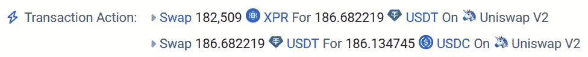

# 第五章：探索 DeFi 分析

当前 Web3 领域中，推动交易最多的有两类产品：我们在*第四章*中讨论过的 NFT，以及在本章中将深入探讨的**去中心化金融**（**DeFi**）。

DeFi 这个名字来源于与当前金融系统的中心化特征相对立。根据 CoinGecko 的书籍《如何参与 DeFi：初学者指南》，"*去中心化金融（DeFi）是一项允许用户利用金融服务，如借贷、借款和交易，而不依赖中心化实体的运动*。" DeFi 并非单一的产品，而是一系列旨在满足 Web3 领域金融需求的项目。

这些项目利用了**可组合性**的概念，即在其他方创建的部分基础上进行构建。这个概念通常被形象地比喻为用乐高积木搭建，在这里开发者将不同的组件组合起来，构建新的基础设施。

DeFi 引入了曾经是中央银行专属的产品，例如新币的铸造。目前，一些协议通过收取费用使资金的借贷和借款成为可能，这些费用完全依赖于池子的流动性，而非外部因素。这些项目提供不同程度的去中心化。例如，在之前提到的铸币服务中，我们可以遇到由一个名为 Tether 的中心化实体发行的稳定币，或一个去中心化的选项，如 DAI，这是一个由一组智能合约组成、没有中央权威的协议。

DeFi 还扩展了它的产品范围，涵盖了其他原生 Web3 业务，如链间桥接和闪电贷款。我们将在后续部分详细解释这些内容：


图 5.1 – 银行服务与区块链服务

金融服务在不同人群中的差异并不新鲜，许多 DeFi 项目旨在扩大金融服务的覆盖面，凡是有互联网接入的地方，就可以实现这些服务。作为 Web3 分析师，我们可以利用 Web3 的主要特点之一——**透明性**——来解锁更多的价值，并帮助这些项目实现可持续发展。传统上只有 VIP 分析师能够接触到的金融数据，或者那些在不同时间释放到市场的数据，现在可以公开供我们阅读、结合并提取出有价值的洞察，供我们使用。区块链已经使信息获取变得民主化；剩下的任务是我们学习如何解读这些信息并提取出可操作的洞察。

要通过我们的工作创造价值，理解不仅仅是生成的数据，还有 DeFi 的业务流程至关重要。就像我们在*第四章*中做的那样，我们将深入探讨基础协议的指标，提供关于每个协议结构和用户组成的快速见解，同时还会讲解那些解释一个项目如何产生收入、吸引客户、应对潜在威胁以及其他相关方面的指标。

本章将探讨以下内容的数据结构和业务逻辑：

+   ERC-20 代币和稳定币

+   去中心化交易所（DEX）和聚合器

+   借贷（并附有关于闪电贷的评论）

+   桥接

这份产品清单并未涵盖所有的去中心化金融（DeFi）领域。还有许多其他的产品，如去中心化衍生品、保险、治理、彩票等。

# 技术要求

*第四章*中列出的技术要求同样适用于本章。我们将使用 SQL 表格服务中的索引数据，如**Dune Analytics**、**Increment**和**Flipside**。为了跟进，请通过 *第二章*中的链接，在这些平台中开设账户。交易数据通过 SQL 服务查询，具体语法取决于查询引擎。

你可以在本书的 GitHub 仓库中找到包含本章讨论示例的 Jupyter 笔记本，地址为 [`github.com/PacktPublishing/Data-Science-for-Web3/tree/main/Chapter05`](https://github.com/PacktPublishing/Data-Science-for-Web3/tree/main/Chapter05)。我们建议阅读 `Chapter05` 文件夹中的代码文件以跟进学习。

# 稳定币和其他代币

根据 Coinbase 的说法，“*稳定币是一种与‘稳定’储备资产（如美元或黄金）挂钩的数字货币*。” 由于比特币或以太坊等未挂钩的加密货币波动性较大，稳定币已成为可靠的交换媒介。根据撰写时的市值，主要的稳定币列在*图 5.2*中：


图 5.2 – 加密货币恐慌稳定币排名

稳定币是与外部资产的价值挂钩的特定类别代币，提供价格稳定性。稳定币有多种类型，包括那些价值与政府发行的货币（如美元，称为法定货币）、加密货币和商品（如黄金）挂钩的稳定币。为了保持“挂钩”，稳定币团队探索了多种路径。可以在*图 5.2*中的“机制”一栏看到这一点。

主要的稳定币是与法定货币挂钩（“法定支持”），意味着发行此类代币的公司只有在其存有备用资金的金融机构中时，才会发行这些代币。USDT 和 USDC 就是这样的稳定币的例子。

加密货币支持的稳定币依赖于智能合约协议，这些协议发行由一篮子其他加密货币支持的稳定币。这些协议通过控制利率来平衡供需，从而确保价格稳定，并影响买卖双方的行为。系统通常是过度抵押的，以确保在高波动时价格稳定，主要作为借贷系统运作。此机制的主要例子是名为 DAI 的代币，它由 MakerDAO 发行，目前由一系列中心化和去中心化资产支持，如 USDC、以太坊、包装比特币等。

稳定币可以被创建以反映支持它们的加密货币的价值，或模仿法定货币的价值。前者的一个例子是**包装**版本的资产，通常称为“包装代币”，它是基础资产的表示，通常是加密货币或数字资产，已被代币化并使其与特定区块链或网络兼容。“包装”过程涉及将原始资产（例如，比特币）锁定在其原生区块链上，然后在另一个区块链上发行相应的等值代币，如以太坊。这就是**Wrapped Bitcoin**（**WBTC**）的运作方式，它在以太坊区块链上代表比特币，使得比特币能够在以太坊生态系统内用于去中心化应用、DeFi 平台和其他目的。

尽管非稳定代币在历史上早于稳定币出现，但通过学习稳定币，更容易理解代币的概念。**代币**仅仅是区块链上的一种价值表示，这种价值可以来源于任何理由。例如，有些代币代表着对特定项目的所有权、服务的访问权限，甚至作为一种迷因或文化运动的一部分。值得注意的是，一些代币，如始于迷因的狗狗币，已经取得了显著的市值，展示了加密货币领域代币的多样性。如今，这种迷因币已经是市值排名第八的加密货币。

现在我们已经了解了业务案例，让我们深入探讨数据结构。

## 了解代币、原生资产以及 ERC-20 数据结构

加密货币作为区块链的原生资产，如比特币链中的 BTC、以太坊链中的 ETH 和 Rootstock 链中的 RBTC。其主要功能通常是支付网络上的交易费用（gas 费用），并激励验证者/节点维持加密货币网络的安全性。

相比之下，代币是在现有区块链上创建的，并不是区块链本身的原生资产。稳定币、池代币以及以太坊生态系统中的所有 ERC-20 代币都是代币的例子。

开发者利用 ERC-20 标准及其后续演进来构建代币，该标准为功能性代币提供了标准化框架，并确保它们的可替代性。回顾一下，可替代性是指资产或代币在价值上相同，可以一对一交换，且同类型的代币单位之间没有区别。ERC-20 标准最初于 2015 年推出，并在 2017 年通过以太坊创始人 Vitalik Buterin 和以太坊开发者 Fabian Vogelsteller 撰写的**以太坊改进提案**（**EIP**）获得官方认可。

跟随这些方法和事件的智能合约被称为 ERC-20 兼容合约，它将维护已发出代币的注册信息，因此分析师了解其基本特征非常重要。

我们将遇到的函数方法如下：

+   `totalSupply()`: 返回合约中的代币总供应量。

+   `balanceOf()`: 用于读取地址余额。

+   `transfer()`: 将代币从发送者的账户转移到另一个账户。

+   `transferFrom()`: 用于消耗授权额度。该函数由支出者调用，意味着进行两个操作——即转账支出的金额并减少相应的授权额度。

+   `approve()`: 允许支出者从代币持有者账户中多次提取资金，最多为授权的金额。

+   `allowance()`: 返回代币持有者账户中允许提取的金额。

可以找到`mint`和`burn`函数，它们根据特定的业务逻辑修改代币的总供应量。以下是一些可选的函数：

+   `name()`: 返回代币的名称

+   `symbol()`: 返回代币的符号。

+   `decimals()`: 返回代币使用的十进制位数。

这里是一些重要的事件：

+   `transfer`: 该事件由`transfer()`函数触发。关于铸造和销毁的相同考虑适用于*第四章*，如果转账来源地址为`0x0000,`，我们可以将其解释为铸造事件。如果该地址或`0x000dEad`出现在交易的`to`部分，则可以视为销毁转账。铸造意味着代币的创建，而销毁则意味着将代币发送到不可恢复的地址，将其从流通中移除。该函数的哈希值为`0xddf252ad1be2c89b69c2b068fc378daa952ba7f163c4a11628f55a4df5``23b3ef`。

+   `approval`: 该事件由`approve()`函数触发，包含授权值和支出者地址。

## 实际操作示例

现在我们了解了基础知识，接下来进入 Jupyter notebook（`Chapter05/Stablecoins.ipynb`），在其中我们将连接到 DAI 合约（`0x6B175474E89094C44Da98b954EedeAC495271d0F`）并提取公共视图信息。

**视图**函数意味着它不会改变状态数据，因此可以在单个节点上执行，而不需要每个区块链节点都运行它。这种函数不会生成交易，也不会消耗 Gas。

要检查 DAI 合约，我们将使用 DAI 的 ABI，它可以在本书的仓库中找到。首先，使用以下代码片段提取某个地址的余额：

```py
daiContract.functions.balanceOf('0x60FaAe176336dAb62e284Fe19B885B095d29fB7F').call()*10**-18
```

相关的 ERC-20 事件存储在交易日志中。让我们分析 `0x2a9317882853dc5e0193a76dab76b29e4dc8045718af7925d8d166cdb0eec637` 交易，该交易涉及两地址之间转账 120 DAI：


图 5.3 – DAI 转账交易（来源：https://etherscan.io/tx/0x2a9317882853dc5e0193a76dab76b29e4dc8045718af7925d8d166cdb0eec637）

如果我们搜索交易日志，我们将获得以下信息：


图 5.4 – DAI 转账交易日志（来源：https://etherscan.io/tx/0x2a9317882853dc5e0193a76dab76b29e4dc8045718af7925d8d166cdb0eec637）

我们在这里看到的数据属于以太坊`0x6b175474e89094c44da98b954eedeac495271d0f`。

原始日志结构如下所示：

| 事件名称或主题 [0] | 转账（或`0xddf252ad1be2c89b69c2b068fc 378daa952ba7f163c4a11628f55a``4df523b3ef`） |
| --- | --- |
| 来源 - 主题 [1] | `0xc6DA6f76a389Df871fffad8bb5049cbcF6b7015F` |
| 目标 - 主题 [2] | `0x762EcaaF67097b3eb66a9a6904f42b835b52DC15` |
| wad - 主题 [3] | `0x0000000000000000000000000000000000000000000000068155a43676e00000`（或 `120000000000000000000`） |

表 5.1 – 原始日志结构

**wad** 是一个具有 18 位精度的十进制数字，它被表示为整数。在此交易中，它表示转账的代币数量，即 120。如果我们将 wad 值粘贴到一个十六进制到十进制的转换器中，如 [`www.rapidtables.com/convert/number/hex-to-decimal.xhtml`](https://www.rapidtables.com/convert/number/hex-to-decimal.xhtml)，它将显示带有 18 位数字的十进制表示。

我们研究的所有数据供应商在 *第二章* 中都有特殊的表格，用于存储具有不同预处理级别的交易日志。最基本的版本是原始日志，经过更多筛选的版本只显示 ERC 20 代币转账和转账时代币的价格。其中一个例子是 Flipside，它有一个名为 `core__fact_token_transfers` 的特定表格，包含以 `'Transfer'` 为名称的所有以太坊区块链事件；这指代代币地址。类似地，Dune Analytics 也提供了一个类似的表格，名为 `erc20_ethereum.evt_Transfer`，Increment 有一个名为 `token balance` 的模型。

通过聚合这些数据，我们可以得出各种各样的指标。让我们通过利用 `erc20_ethereum.evt_Transfer` 表格来看一下 DAI 当前供应量的计算：

```py
WITH current_supply AS
(
    SELECT
   cast (tr.value as double)/ 1e18 AS supply
   FROM erc20_ethereum.evt_Transfer tr
    WHERE "contract_address" = 0x6b175474e89094c44da98b954eedeac495271d0f -- DAI
    and tr."from" = 0x0000000000000000000000000000000000000000
UNION ALL
    SELECT
 - cast (tr.value as double)/ 1e18 AS supply
   FROM erc20_ethereum.evt_Transfer tr
    WHERE "contract_address" = 0x6b175474e89094c44da98b954eedeac495271d0f -- DAI
    and tr."to" = 0x0000000000000000000000000000000000000000
)
select sum (supply)/1000000000 as supply
from current_supply
```

在这个查询中，我们通过聚合 DAI 合约地址内的转账来计算 DAI 当前的供应量。这里，我们执行以下操作：

+   查询使用 `current_supply` 来构建数据。

+   CTE 的第一部分通过将转移的金额（从 wei 转换为 DAI）相加来计算总供应量的增加，其中 DAI 被转移 *从* 零地址（`0x0000000000000000000000000000000000000000`）。这代表了新 DAI 代币的创建。

+   CTE 的第二部分通过将转移的金额（也从 wei 转换为 DAI）相加来计算总供应量的减少，其中 DAI 被转移 *到* 零地址。这代表了 DAI 代币的销毁或从流通中移除。

+   主查询通过将总供应量的减少从总供应量的增加中减去（即供应增加 - 供应减少）来计算最终的总供应量。

+   结果除以 1,000,000,000 以将其转换为十亿 DAI。

总结来说，这个查询通过考虑铸造和销毁交易，计算 DAI 代币总供应量的净变化，然后将结果转换为十亿 DAI。

我们在以下仪表盘中提出了额外的指标逻辑：[`dune.com/gabriela/dai-cockpit`](https://dune.com/gabriela/dai-cockpit)。此外，还有一个很棒的开源稳定币仪表盘，网址是 https://dune.com/hagaetc/stablecoins。

这个相同的分析可以应用于任何 ERC-20 代币；它不仅限于稳定币。例如，如果我们以 MKR 代币为例，可以在 [`dune.com/livethelife/mkr`](https://dune.com/livethelife/mkr) 找到一个出色的开源仪表盘。

ERC-20 代币的一个关键特点是它们在以太坊网络中可以无缝互换。这一特点在**去中心化交易所**（**DEX**）的运行中发挥着重要作用。DEX 利用 ERC-20 标准，允许用户直接从他们的钱包中交易各种代币，无需中介。ERC-20 代币与 DEX 之间的联系构成了去中心化金融（DeFi）空间的基石，使用户能够进行交易、投资并参与金融活动。

# 理解 DEX

加密货币可以通过多种方式进行交换，包括**点对点**（**P2P**）交易、**中心化交易所**（**CEX**）和 DEX。每种方式都有其优势和特点：

+   **P2P**：在这种方式中，双方直接在彼此之间买卖加密货币，不涉及中介。它优先考虑隐私，并且提供多种支付选项，使全球用户都能使用。然而，为了确保交易的完成，出现了一些角色，他们可能作为中介收取少量费用，例如托管服务、评价平台或争议解决服务。

+   **CEX**：该方式为在其平台上拥有账户的用户提供加密货币交换服务。它主要通过订单簿匹配买家和卖家，市场做市商和交易者在其中下单。CEX 通过每笔交易收取交易费用来获得收入。主要的 CEX 包括 Binance、OKX、Coinbase 和 Crypto.com。CEX 还会验证每个开户人的身份，遵循相关国家的法规。这些交易所用户友好，提供流动性和丰富的交易对。它们通常是许多进入加密市场用户的起点。“中心化”一词指的是交易所对其中交换的资金的控制。这有几个含义：由于用户并不掌管自己的资产，如果 CEX 遭到攻击或因任何原因（如银行挤兑）破产，就有资金丧失的风险。

+   **DEX**：DEX 通过智能合约运行，不涉及第三方实体，优先考虑用户控制、隐私和安全性。它允许用户在交易完成之前，保持对钱包中资金的控制，从而进行资产交换。DEX 在加密市场中越来越受欢迎，在 2021 年牛市中，其交易量甚至超过了 CEX。然而，相比 CEX，DEX 的流动性通常较低。

现在，让我们进一步分析一下 DEX 的一些特点：

+   **资产托管**：用户不将资产托管给第三方。

+   **无需身份验证**：用户可以自由地与去中心化交易所（DEX）互动，无需任何形式的身份验证。所需的仅仅是一个地址来连接到 DEX。

+   **高额的矿工费**：与 CEX 交易相比，DEX 交易通常会产生更高的区块链矿工费。

+   **流动性问题与滑点**：滑点是指资产的预期价格与交易执行时实际价格之间的差异。由于流动性由用户提供而非集中式实体，交易的大小可能会影响资产的价格。当大宗交易执行时，它可能导致价格朝不利方向波动，从而导致滑点。这意味着交易者在购买时支付的价格稍微高于预期，或在卖出时收到的价格稍微低于预期。滑点是去中心化金融（DeFi）交易中的现实，尤其是在流动性较差的市场中。

+   **无常损失**：这是流动性提供者在**自动化市场制造商**（**AMM**）平台中面临的潜在风险。当流动性提供者向流动性池中添加资金时，他们贡献了用于在平台上交易的资产。随着交易的进行，池中资产的相对价值可能会因市场波动而变化。如果池中某一资产的价格相对于另一资产发生显著变化，流动性提供者可能会经历无常损失。这种损失是“无常的”，因为只有当流动性提供者决定从池中提取资金时，它才会真正体现。

+   **复杂的用户体验与学习曲线**：与 DEX 协议的交互对于 DeFi 用户来说仍然具有挑战性，整体用户体验可能需要改进。诸如滑点或无常损失等概念仍然会影响交易体验。

+   **漏洞与利用**：与任何基于智能合约的系统一样，DEX 也可能容易受到漏洞和安全利用的影响。

要分析一个 DEX 的分析数据，我们需要理解流动性锁定的位置、交易对是如何组织的，以及智能合约是如何生成收益的。这样，我们就能迅速接近相关的智能合约。

## 实际操作示例 – 流动性池与 AMM

为了理解去中心化交易所（DEX），需要引入两个重要概念：流动性池和 AMM。DEX 使用流动性池和 AMM 来促进交易活动，也称为**交换**。

**流动性池**是允许用户与其交换代币的代币储备。任何人都可以通过提供必要的资金来开设一个池，而无需寻求任何中央权威的许可。流动性在曲线价格中进行分配，算法根据该曲线放置买单和卖单以执行交换。Chainlink 将**AMM**定义为“*算法化的‘货币机器人’，让个人交易者轻松买卖加密资产。与传统订单簿直接与其他人交易不同，用户通过* *AMM*直接进行交易*。”

一个突出的去中心化交易所（DEX）是**Uniswap**，它使用流动性池和 AMM。其登录页面如下所示：


图 5.5 – Uniswap 的首页（来源：https://app.uniswap.org/#/swap）

Uniswap 有一个池仪表盘，网址为[`info.uniswap.org/#/pools`](https://info.uniswap.org/#/pools)，其中包含一些关于活跃流动性池的基本分析。在撰写时，**TVL**和**交易量**排名第一的池是 USDC/ETH 交易对（https://info.uniswap.org/#/pools/0x88e6a0c2ddd26feeb64f039a2c41296fcb3f5640）：


图 5.6 – 所有池仪表盘

该池的智能合约地址是[`etherscan.io/address/0x88e6a0c2ddd26feeb64f039a2c41296fcb3f5640`](https://etherscan.io/address/0x88e6a0c2ddd26feeb64f039a2c41296fcb3f5640)。

通过在`Chapter05/Liquidity_pool.ipynb`中以编程方式探索池的状态数据，我们可以使用池的 ABI 并通过以下代码片段读取智能合约数据，从而识别出构成该池的代币：

```py
poolContract.functions.token0().call()
poolContract.functions.token1().call()
```

结果如下：

+   代币 0：`0xA0b86991c6218b36c1d19D4a2e9Eb0cE3606eB48`，即 USDC

+   代币 1：`0xC02aaA39b223FE8D0A0e5C4F27eAD9083C756Cc2`，即 wETH

这两者都是稳定币，其中一个与美元挂钩，另一个则是以包装形式存在的原生以太坊资产。

要获取每个代币的锁仓余额，我们可以使用`erc_20.abi`，它可以在本书的 GitHub 仓库中找到，并使用以下代码片段查询池：

```py
web3.eth.contract(address=token0, abi=erc_abi)
```

更多关于可用视图函数的信息可以在文档中找到：[`docs.uniswap.org/contracts/v3/reference/core/interfaces/pool/IUniswapV3PoolState`](https://docs.uniswap.org/contracts/v3/reference/core/interfaces/pool/IUniswapV3PoolState)。

为了从交易数据中提取信息，我们需要深入分析日志。让我们回顾一次交换交易，尝试理解我们需要的信息是如何记录的。要分析的交换交易是`0x78490143b8a80b23752bd305b51c7796add5373af089059beb3920c8e431ae78`，它在`0x3041cbd36888becc7bbcbc0045e3b1f144466f5f`池中执行，池内的交换是 USDC 和 USDT 之间的兑换。

在 Etherscan（https://etherscan.io/tx/0x78490143b8a80b23752bd305b51c7796add5373af089059beb3920c8e431ae78/）上，我们可以看到以下内容：

+   来源或发送方：`0xaDAf0dA2F42bf54E2Ccf455F795A04ECD744138B`

+   目标地址：`0x3fC91A3afd70395Cd496C647d5a6CC9D4B2b7FAD`（Uniswap: Universal Router）

如今，大多数交换并不会直接影响池智能合约，而是与路由器智能合约交互，例如 Uniswap 的 Universal 智能合约。路由器的任务是接收用户定义的参数（如最大滑点或交换接收方），并执行必要的交换以达成交易者的目标。路由器可以组合多个池，甚至包括 NFT 市场，并且经过优化，能找到最低价格和最低的燃气费。

交易摘要如下：



图 5.7 – 交易交换

从*图 5.7*中，我们可以解读出用户在一次交易中进行了 XPR 换 USDT 的操作，并随后与正在分析的池交互，将 USDT 换成 USDC。

*图 5.8* 显示了交易日志页面的部分快照。特别是最后一条日志包含了宝贵的信息：


图 5.8 – 交换日志

*图 5.8* 显示了与交换相关的信息位于池子地址的日志中。正如你在*第二章*中回忆的那样，`topic_0`是函数签名。在这种情况下，`0xd78ad95fa46c994b6551d0da85fc275fe613ce37657fb8d5e3d130840159d822` 是**交换**函数。

其他相关函数包括铸造或添加流动性功能，它的签名为`0x4c209b5fc8ad50758f13e2e1088ba56a560dff690a1c6fef26394f4c03821c4f`，以及销毁或移除流动性功能，它的签名为`0xdccd412f0b1252819cb1fd330b93224ca42612892bb3f4f789976e6d81936496`。

当流动性被添加或移除时，**流动性提供者**（**LPs**）会收到代表其在池子中份额的 LP 代币。这些 LP 代币可以在二级市场上进行交易，产生利息，并在你希望将流动性提取回 LP 时再次发送到池子中。

如果我们在 Dune 中与`ethereum.logs`表进行交互，就可以提取池子执行的交换次数，如下所示：

```py
select count (*) as n_trades
from ethereum.logs
where contract_address= 0x3041cbd36888becc7bbcbc0045e3b1f144466f5f
and topic0=0xd78ad95fa46c994b6551d0da85fc275fe613ce37657fb8d5e3d13 0840159d822
```

另一个重要的信息是，比较一个池子与另一个可能提供相同代币交换的池子时，要考虑池子的流动性强度，特别是在进行大额交易时。当大宗交易影响到池子的储备时，就会出现滑点问题，正如我们所看到的，这会影响最终支付的价格。在这里，研究与 TVL、池子流动性等相关的指标非常重要。这些指标通常是从聚合的交易数据中计算出来的。我们在以下仪表盘中提出了一些指标逻辑：[`dune.com/gabriela/pool-basic-metrics`](https://dune.com/gabriela/pool-basic-metrics)。

正如我们在*第二章*中提到的，我们研究了存储交易日志的特殊表格，这些表格有不同程度的预处理，能够满足分析师的需求。一些链上数据提供者甚至提供了可以让我们在不编写代码的情况下查询区块链的模型。此类解码服务的例子包括 Dune 上的`dex.trades`表或 Covalent 上的 Increment 平台，它提供了一个拖拽式分析服务。Dune 和 Footprint 都在开发自然语言查询，以简化交易数据的基本分析。

这些表格和解码数据在不同的提供商之间可能有所不同，但最重要的是理解每个查询背后的逻辑，并熟悉日志数据的结构。这将帮助我们提取信息或根据需要将查询适应不同的表格格式，甚至在使用不同平台时，也能确保 NLP 模型返回的结果是正确的。如果我们了解业务逻辑以及数据如何在区块链上记录，我们就能够使用每个平台解决数据问题。

利用我们已经学到的知识和此处列出的 Dune Analytics 表格，我们可以创建用于跟踪所分析的 USDC/USDT 池的活动和收入的指标。表格如下：

+   一个名为 `ethereum.logs` 的原始数据表格

+   一个名为 `erc20_ethereum.evt_Transfer` 的中级处理表格，其中包含被签名为转账的日志

+   一个名为 `dex.trades` 的高级解码表格

以下是位于 https://dune.com/gabriela/pool-basic-metrics 仪表盘上展示的指标背后的逻辑简要说明：

| **仪表盘中的名称** | **逻辑** |
| --- | --- |
| 交易数量 | 统计池智能合约日志中具有指定签名的交换数量。 |
| 交易者日志 24 小时 | 统计在池智能合约日志中，主题 0 为“swap”的主题 2 中出现的不同地址数量。 |
| 平均交换量 24 小时 | 使用 `dex.trades` 表格，求出池智能合约中以美元计的总量，并将其除以 24 小时内执行的交易数量。 |
| 池 TVL | 将所有池作为接收方的存款转账相加，并减去所有资金离开池的转账。 |
| 池收入 | 池的收入由手续费产生。手续费从交易对的交换量中扣除。 |

表 5.2 – Dune 仪表盘查询逻辑

历史上，DEX 通过更高的收益来激励资金流入，这导致了寻找这些优势的专业基金的出现。此外，为了避免高滑点，大额交易可能需要通过不同的池进行路由，以实现更具成本效益的交易。在单个交易中路由多个流动性池可以节省 gas 并最小化滑点。总之，聚合器作为流动性路由器和交换器而建立。

## DEX 聚合器

DEX 聚合器从不同的 DEX 获取流动性，为用户提供比单一 DEX 更好的代币交换汇率。这些聚合器可以优化由滑点、交换费用和代币价格产生的成本，从而为用户提供更有利的汇率，前提是能够有效执行。DEX 通常希望与 DEX 聚合器进行集成，因为这有助于吸引更多用户和交易量。**1Inch** 是一个著名的 DEX 聚合器例子。

由 1Inch 团队维护的构成协议的智能合约地图可以在 [`dune.com/queries/2238512`](https://dune.com/queries/2238512) 查看。一个包含聚合指标的优秀仪表盘可以在 [`dune.com/1inch/token`](https://dune.com/1inch/token) 查看。

此外，**Increment** 是由 Covalent 构建的无代码产品，拥有一个名为 Dex 的模型，其中包含跨不同链的所有 1Inch 智能合约，使分析变得更加容易。该产品的一个有价值的特点是“规范化”事件，它包括将事件签名转换为人类可读的词汇并进行标准化。每个智能合约可能会为类似的事件使用不同的名称，知道准确的名称对于查询它们是必要的。然而，Increment 对这些名称进行了标准化，从而使查询变得更加简便且具有跨平台性。另一个值得注意的特点是，它公开了由模型生成的查询，允许定制化并且便于向第三方解释模型中的逻辑。

在传统金融中，信贷、贷款和基于担保的金融服务长期以来一直是该行业的基石。去中心化金融（DeFi）也有一个关于信用和担保化的章节，现在用户可以在无需银行等中介的情况下获取信贷。我们将在下一节中进行分析。

# Web3 上的借贷服务

银行接收存款，将其中一部分存储以便在所有者需要取回现金时能够偿还，另一部分则以一定的利率作为贷款提供给市场。贷款可以是有担保的或无担保的，这取决于借款人的风险。利率设置得足够高，以便为银行和存款人产生收益。某些链上协议复现了类似的机制，正如我们将在本节中描述的那样。

截至目前，主要的借贷协议仅支持有担保的贷款。这个过程类似于抵押贷款，用户提供房屋作为贷款偿还的担保。如果贷款未能全部偿还，银行将保留房屋。在这种情况下，如果贷款的担保比例未得到维持，协议将会清算担保物。

假设 Alice 想要投资一个以 USD 稳定币为基础的项目，但她的担保物是 ETH。她确信 ETH 会增值，因此宁愿不将其出售为稳定币。解决方案是一个协议，它接受 Alice 的 ETH 并借给她一个与美元挂钩的稳定币，如 DAI。一个正是如此运作的协议是 Maker，我们之前已经提到过。为了发行 DAI，协议需要提供 1.5 倍于所发行 DAI 的担保物（ETH）；这就是所谓的超额担保。担保物与借出资产之间的比例被称为担保比例。通常，这些协议会收取清算费，以减少被清算的可能性。

另一个成熟的协议是**Compound**，它类似于一个流动性池，流动性提供者将资金供给池中以换取利息，而借款人则以债务的利息为代价借款。利率被称为**年化收益率**（**APY**），并且根据池中的流动性和需求在不同池之间有所变化。

当资金存入 Compound 时，市场制造商会收到 cTokens，这些 cTokens 代表了资金池中资金的比例，并会累积利息。cToken 是一种在生态系统内使用的加密货币代币。它们是带有利息的代币，代表用户存入 Compound 平台的加密货币金额。cToken 合约列表可以在[`docs.compound.finance/#developer-resources`](https://docs.compound.finance/#developer-resources)找到。

让我们探索协议`0xF25212E676D1F7F89Cd72fFEe66158f541246445`，它被称为`cUSDCv3`。

该合约有许多视图函数，所有这些函数在`Lending_borrowing.ipynb`笔记本中都有探讨。

一些主要函数如下：

+   `numAssets()`: 可用于作为抵押品的资产数量。在当前分析的情况下，有三种资产，即 ETH、wBTC 和 Matic。

+   `baseToken()`: 可以以抵押品为担保借贷的代币——在我们这个例子中是 USDC。

+   `getAssetInfo()`: 返回抵押资产的信息，例如抵押地址或 Chainlink 上的价格源地址。

+   `Totalsupply()`: 基础代币的总供应量加上已积累的利息。

+   `getReserves()`: 基础或抵押资产的余额，保护用户免受坏账的影响。我们稍后将分析坏账。

+   `getUtilization()`: 基础资产（即 USDC）的协议利用率。此计算的函数为`TotalBorrows` / `TotalSupply`。

还可以查询更多用于状态数据的函数；更多详细信息请参阅文档。

交易数据也非常有用，可以用来提取洞察。例如，可以通过查询抵押资产的日志来计算 TVL 和进一步的抵押信息。语法与我们在*理解 DEX*部分回顾过的一致。仪表板示例如下：[`dune.com/datanut/Compound-Finance-Deposits-and-Loans`](https://dune.com/datanut/Compound-Finance-Deposits-and-Loans)。

借贷协议通过借款人支付的利息产生收入。衡量收入生成的重要指标是协议的利用率，该指标是借款量/总价值（TVL）的结果。该比例告诉我们协议在将锁定的价值投入使用时的效率。利用率越高，效果越好。

具体来说，在 Compound 协议中，部分利息会进入其储备金，作为保险，但这种收入分配可以由协议的治理方修改，治理方是 COMP 代币的持有者。COMP 是一个 ERC-20 代币，使社区能够治理 Compound 协议。COMP 代币持有者可以参与讨论、提案并投票决定协议的变更。

在这个行业中，有一种加密原生产品应运而生，它使得零抵押的快速贷款成为可能：闪电贷。

## 闪电贷

**闪电贷**是加密原生产品，**AAVE**是这一领域中最著名的协议之一。闪电贷允许借款人以零抵押的方式获得贷款，前提是贷款及其利息必须在同一笔交易中偿还。如果借款人在交易中未能按时偿还贷款，整个交易将被撤销。闪电贷主要有两种用途：套利和清算。

**套利**涉及在不同市场中同时购买和出售相同或不同的资产，在这些市场中价格存在差异。套利者从小的价格差异中获利，但通常需要相当大的资金量才能产生显著的差异。这种做法有助于将市场恢复到平衡状态，确保相同资产的价格在多个市场中保持稳定。

在抵押品比率丧失并且贷款违约的情况下，第三方清算者可以获取抵押品进行清算。清算者代表借款人将抵押品出售给市场，偿还债务，并因完成清算工作获得清算奖金。所有这些步骤可以通过闪电贷在一笔交易中执行，并且无需任何抵押品。这些复杂的交易通常由机器人执行，机器人有助于维持 DeFi 生态系统中的流动性，并保持市场价格的稳定。

如需进一步了解闪电贷交易数据，请查看以下仪表板中的查询：https://dune.com/hildobby/flashloans。

## 关于协议坏账的说明

闪电贷曾被用于攻击 DeFi 协议，导致这些协议出现坏账。坏账发生在向某个交易对提供流动性的用户决定退出池时，无法取回其资金。我们来看一个例子：

1.  攻击者获取了代币 A 的闪电贷。

1.  攻击者将代币 A 存入去中心化交易所（DEX）或中心化交易所（CEX），并将其兑换为代币 B，这导致代币 A 的供应增加，代币 B 的流动性下降，进而推动代币 B 的价格上涨。

1.  重新估值后的代币 B 随后作为抵押品用于借贷协议，以借入代币 A。由于抵押品 B 的价格被人为抬高，协议借出的代币 A 数量超过了抵押品处于均衡价格时的借贷额度。

1.  攻击者以 A 代币的形式偿还贷款，保留 A 代币的盈余。当价格回归正常时，清算人试图以市场价格清算 B 代币，但这不足以覆盖 A 代币的贷款。因此，产生了坏账，最后的 A 代币供应商承担了损失。

当价格来源于单一预言机时，攻击容易得手，因为它容易受到操控。此外，闪电贷的低成本特性（不需要抵押品）使得此类攻击更加可行。

Risk DAO 创建了一个有趣的仪表盘，跟踪协议的坏账情况，使用链上数据进行监控。你可以在这里探索：[`bad-debt.riskdao.org/`](https://bad-debt.riskdao.org/)。

世界正在朝着多链环境发展，成功的链条提供差异化的产品，吸引不同的创意，这些创意最终形成了 **去中心化应用（dApps）**。例如，Near 以低手续费发展了 Sweat 经济，而 Avalanche 的子网使游戏能够构建自己的链上生态系统，而不需要与主链争夺 gas 插槽。随着更多协议在多个链上开放其服务，它们旨在利用每个链的优势，覆盖更广泛的用户群体。

随着不同区块链之间资金转移需求的增加，出现了被称为桥接的加密原生产品，我们将在下一节中进行探讨。

# 多链协议和跨链桥接

桥接是一个结构，它促进了不同区块链之间的资金和信息转移。市场将区块链分为三类：

+   **L1 链**是广为人知的区块链，例如比特币和以太坊。之所以被称为 Layer 1，是因为核心团队在基础层上生成了一层解决方案，以增加可扩展性。L1 的演变例子是以太坊的合并，这一事件发生在 2022 年 9 月。

+   **L2 链**是运行在区块链上的集成系统，旨在改善特定方面，通常专注于可扩展性。这些扩展解决方案允许主链将数据卸载到并行架构上，在那里进行处理，并将结果保存到主链上。成功的 L2 链包括 Optimism、Arbitrum 和 Polygon zkEVM。

+   **侧链**是连接到主区块链的新区块链。例如，**Rootstock**与比特币相连，允许使用以太坊虚拟机（EVM）智能合约编程，同时保持比特币的去中心化和安全性。侧链是独立的链，意味着共识方法、燃料规则和其他方面可能有所不同。

鉴于各类区块链产品的持续涌现以及这一趋势看似没有停止的迹象，用户将继续探索从一个区块链过渡到另一个区块链，以利用每个区块链所提供的独特优势。这也凸显了区块链之间桥接连接的持续需求，预计这一需求将继续保持强劲。

根据桥接的运作方式，交易结构和需要分析的数据点可能会有所不同。通常，桥接主要分为两种类型：中心化桥和无信任桥。**中心化桥**由一个中心实体负责桥接安全性。例如，Ronin 桥和 Multichain 桥。另一方面，**无信任桥**完全依赖智能合约，比如 Near 桥和 Hop 桥。

## 实操示例 – Hop 桥

让我们深入了解像 Hop 这样的多链桥是如何工作的。Hop 在[`hop.exchange/`](https://hop.exchange/)中自我描述为“*可扩展的 rollup 到 rollup 的通用代币桥*”。它支持 ETH 与其 L2 解决方案之间的桥接，比如 Polygon、Gnosis、Optimism 和 Arbitrum。

Hop 桥有三个核心产品：

+   Hop 代币与在每个链中铸造的底层资产的价值挂钩，其中 Hop 在 L1 链中处于活跃状态并可以兑换。

+   一个 bonder 或流动性提供者

+   自动化做市商使我们能够在 Hop 代币和目标链中的本地代币之间进行交换。

让我们考虑一个示例交易：

1.  Alice 希望使用在 Optimism 上活跃的 dApp，但她的资金是 ETH。所以，为了与 dApp 互动，她需要**oETH**，即 Optimism 上的封装 ETH。

1.  Alice 通过以下方式将她的 ETH 桥接到 Optimism：

    1.  桥接交易在 ETH 上发起，并将在等待时间和退出时间过后在本地桥上执行。

    1.  作为桥接操作的一部分，bonder 将 hop-ETH 或**hETH**存入 Alice 在 Optimism 上的地址，金额为桥接金额减去费用和油费。

1.  Alice 可以将 hETH 兑换为 oETH，并与 dApp 进行交互。

1.  在退出时间过去后，bonder 将收回之前提供给 Alice 的资金，并附加一小部分费用。

这是一笔桥接交易，用户可以在链之间迅速转移资金，发送一种资产到一个链中，并在另一个链中收到等价物（减去费用）。在这个示例中，我们提到了像 oETH 和 hETH 这样的代币，这些代币在每条链上被铸造和销毁，用于表示链之间的资金流动。这被称为锁定和铸造类型的桥接。

要分析桥接合约，请参考[`github.com/hop-protocol/hop/blob/develop/packages/core/src/addresses/mainnet.ts`](https://github.com/hop-protocol/hop/blob/develop/packages/core/src/addresses/mainnet.ts)中提供的完整列表。该列表中包含了一些`view`函数。

一个有用的视图函数是`l1CanonicalToken()`，它提供有关桥接中锁定代币的信息。通过了解这些信息，我们可以计算 TVL，正如`Bridges.ipynb`笔记本中所解释的。

对于汇总的交易数据分析，了解交易结构至关重要。例如，分析`0xaf6089e3d7377b5b0c4ad86e486406a19e29280410402aab71195b0995608e81`哈希下的交易，涉及将 0.4378 ETH 转账到 Optimism 上的相同地址：

）](img/B19446_05_09.jpg)

图 5.9 – 交易详情（来源：[`etherscan.io/tx/0xaf6089e3d7377b5b0c4ad86e486406a19e29280410402aab71195b0995608e81`](https://etherscan.io/tx/0xaf6089e3d7377b5b0c4ad86e486406a19e29280410402aab71195b0995608e81)）

若要在任何数据提供商的 `raw_transactions` 表中找到此数据，请参考 *第二章*，查找签名或 `TransferSentToL2` 事件，该事件包括转账金额、担保人和用户：


图 5.10 – 桥接跨链交易日志 – ETH 侧

该交易与 Optimism 链有关。相关信息位于 `l2canonical` 代币的日志中，按照文档，wETH 的地址是 `'0x4200000000000000000000000000000000000006'`。在 Optimism 上的交易是：[`optimistic.etherscan.io/tx/0x4e76ee9b997868ba894ea9362347bfa9ed64c2aaf5b4482d6482940efbe3e738`](https://optimistic.etherscan.io/tx/0x4e76ee9b997868ba894ea9362347bfa9ed64c2aaf5b4482d6482940efbe3e738)，相关日志如下所示：


图 5.11 – 桥接跨链交易日志 – OPT 侧

这些主要协议中的大多数已经被主要数据提供商索引并翻译，使得分析变得更加容易。例如，可以探索一个非常有趣的仪表板，[`dune.com/rchen8/Hop-Exchange`](https://dune.com/rchen8/Hop-Exchange)，该仪表板利用了经过审查的智能合约中的事件。

Hop 还提供了一个子图，查询示例可以在文档中找到：[`docs.hop.exchange/v/developer-docs/subgraphs/queries`](https://docs.hop.exchange/v/developer-docs/subgraphs/queries)。

关于 DeFi 风险和挑战的说明

DeFi 是一个年轻且不断发展的行业，面临许多挑战。数据从业者在防止黑客攻击、识别异常活动、衡量与某些决策相关的风险以及处理损失控制方面发挥着关键作用。

可能会有一些情况，我们发现自己支持政府的努力，以建立一个监管框架，为资金向该生态系统的流入铺平道路。到目前为止，监管不确定性和多样的规则仍然占主导地位。尽管有多个倡议旨在创造立法的一致性，但这仍然是一个进行中的工作。这种情况直接影响着行业，其中像存款担保这样的概念并未得到应用，导致许多用户在遭遇黑客攻击后不可恢复地失去了他们的资金。

DeFi 体验仍处于初期阶段，数据从业者可能会发现自己也在研究产品体验，以增强用户互动或教育用户如何更好地与这些产品互动。诸如 SAFE 钱包等举措旨在弥合 Web2 和 Web3 体验之间的差距。这家公司在扩展钱包功能以匹配传统家庭银行体验方面处于领先地位。

这个领域的创造机会非常广阔，数据驱动的决策至关重要。

# 摘要

在本章中，我们深入探讨了 DeFi 的世界，探索了该领域的核心组件和主要产品。我们的分析涵盖了多个领域，包括代币、稳定币、以及以池和 DEX 聚合为重点的去中心化交易所（DEX）、借贷协议和桥梁在促进跨链交易中的重要性。

在每种情况下，我们分析了业务流程及其如何产生收入，并利用一些数据提供者生成汇总指标。

虽然 DeFi 领域不断发展，新的参与者不断涌现并推出创新服务，但我们的重点依然是理解其基本的商业模型和机制。了解这些协议的本质使我们能够有效地追踪交易细节，并构建有用的指标以供进一步分析。

分析公司在简化这一领域中发挥着至关重要的作用。通过利用链上和链下数据，并与协议开发者合作，这些公司提供了宝贵的洞察力。通过从一些成熟的分析公司开始我们的分析，我们可以加速理解 DeFi 领域。然而，我们在本章获得的知识使我们能够建立自己的标准，深入研究代码和数学原理，并根据我们独特的需求定制指标。这种灵活性使我们能够深入了解 DeFi 领域，并根据特定需求做出明智决策。

在下一章中，我们将深入探讨数据准备的细节。

# 进一步阅读

为了补充本章，以下资源可能对您有所帮助：

+   Lau, D., Lau, D., Jin, T. S., Kho, K., Azmi, E., Fang, L., Hor, B., & Win, K. W. (2021). *如何进行 DeFi:* *初学者指南*。CoinGecko。

+   Fang, L., Hor, B., Azmi, E., Khor, W. W., & Gecko, C. (2021). *如何进行 DeFi:* *进阶篇*。CoinGecko。

+   *深入探讨自动化市场制造商去中心化交易所*（Uniswap v1）。(n.d.)。LearnWeb3：[`learnWeb3.io/degrees/ethereum-developer-degree/sophomore/a-deep-dive-into-automated-market-maker-decentralized-exchanges-uniswap-v1/`](https://learnWeb3.io/degrees/ethereum-developer-degree/sophomore/a-deep-dive-into-automated-market-maker-decentralized-exchanges-uniswap-v1/)。

+   *Maker 协议白皮书* | 2020 年 2 月。 (n.d.)。MakerDAO | 一个无偏的全球金融系统：[`makerdao.com/en/whitepaper#abstract`](https://makerdao.com/en/whitepaper#abstract)。

+   Fabian Vogelsteller <fabian@ethereum.org>, Vitalik Buterin <vitalik.buterin@ethereum.org>, *ERC-20: 代币标准*, 以太坊改进提案，第 20 号，2015 年 11 月。[在线系列]. 可在 [`eips.ethereum.org/EIPS/eip-20`](https://eips.ethereum.org/EIPS/eip-20) 查看。

+   Ori Pomerantz. (n.d.). *ERC-20 合约讲解*. ethereum.org: [`ethereum.org/developers/tutorials/erc20-annotated-code/#the-actual-contract`](https://ethereum.org/es/developers/tutorials/erc20-annotated-code/#the-actual-contract).

+   *介绍 Permit2 和通用路由器*. (2022 年 11 月 17 日). Uniswap 协议: [`blog.uniswap.org/permit2-and-universal-router#universal-router-unified-token-and-nft-swaps`](https://blog.uniswap.org/permit2-and-universal-router#universal-router-unified-token-and-nft-swaps).

+   Finematics. (n.d.). *什么是 DeFi？去中心化金融解释*（以太坊，MakerDAO，Compound，Uniswap，Kyber）[视频]. YouTube: [`www.youtube.com/watch?v=k9HYC0EJU6E`](https://www.youtube.com/watch?v=k9HYC0EJU6E).

+   *助手函数*. (n.d.). Compound III 文档: [`docs.compound.finance/helper-functions/`](https://docs.compound.finance/helper-functions/).

+   *Dune Analytics*. (n.d.). 如何编写 SQL 获取 TVL 和多样化指标，如 HHI 和加权波动率 [第四部分] [视频]. YouTube: [`www.youtube.com/watch?v=UiETadtYaLY`](https://www.youtube.com/watch?v=UiETadtYaLY).

+   *闪电* *贷款*: https://docs.aave.com/faq/flash-loans.

+   Jp12\. (2022 年 6 月 17 日). *Optimism 桥接比较*. Medium: [`jp12.medium.com/optimism-bridge-comparison-453fa1f476f6`](https://jp12.medium.com/optimism-bridge-comparison-453fa1f476f6).

+   Dogecoin. (n.d.). *每天只做好的事*. Dogecoin – 一个开源的点对点数字货币: [`dogecoin.com/#what-is-dogecoin`](https://dogecoin.com/#what-is-dogecoin).

+   更多 Hop 统计数据：

    +   [`dune.com/eliasimos/Bridge-Away-(from-Ethereum)`](https://dune.com/eliasimos/Bridge-Away-(from-Ethereum))

    +   [`dune.com/queries/417810`](https://dune.com/queries/417810)

    +   [`dune.xyz/rchen8/Hop-Exchange`](https://dune.xyz/rchen8/Hop-Exchange)

    +   [`DeFillama.com/protocol/hop-protocol`](https://DeFillama.com/protocol/hop-protocol)

    +   [`cryptofees.info/`](https://cryptofees.info/)

    +   [`vfat.tools/polygon/hop/`](https://vfat.tools/polygon/hop/)

    +   [`explorer.hop.exchange/`](https://explorer.hop.exchange/)

    +   [`app.hop.exchange/stats`](https://app.hop.exchange/stats)

    +   [`volume.hop.exchange/`](https://volume.hop.exchange/)

+   Hop Bridge. (n.d.). *Hop 转移示意图*. GitHub: [`github.com/hop-exchange/contracts/blob/master/assets/Hop_Transfer_Diagrams.jpg`](https://github.com/hop-exchange/contracts/blob/master/assets/Hop_Transfer_Diagrams.jpg).

+   以下是一些非常有价值的仪表盘和分析资源列表：

    | **CoinStats** | [`coinstats.app/`](https://coinstats.app/es/) |
    | --- | --- |
    | **DeFillama** | [`DeFillama.com/`](https://DeFillama.com/) |
    | **Debank** | [`debank.com/`](https://debank.com/) |
    | **DeFiPulse** | [`www.DeFipulse.com/`](https://www.DeFipulse.com/) |
    | **LoanScan** | [`linen.app/interest-rates/`](https://linen.app/interest-rates/) |
    | **Nansen** | [`www.nansen.ai/`](https://www.nansen.ai/) |
    | **Token Terminal** | [`tokenterminal.com/terminal/markets/lending`](https://tokenterminal.com/terminal/markets/lending) |
    | **Zapper** | [`zapper.xyz/dashboard`](https://zapper.xyz/dashboard) |
    | **Zerion** | [`zerion.io/`](https://zerion.io/) |
    | **DEXTools** | [`www.dextools.io/app/en`](https://www.dextools.io/app/en) |
    | **GeckoTerminal** | [`www.geckoterminal.com/`](https://www.geckoterminal.com/) |
    | **Into** **the Block** | [`www.intotheblock.com/`](https://www.intotheblock.com/) |
    | **Messari** | [`messari.io/`](https://messari.io/) |
    | **稳定币仪表板** | [`stablecoins.wtf/`](https://stablecoins.wtf/) |

表 5.3 – 有价值的仪表板列表

# 第二部分 Web3 机器学习案例

在本书的这一部分，我们将应用常见的人工智能任务于 Web3 相关数据。这一方法为我们提供了 Web3 领域常用工具的概述，并基于书中*第一部分*探索的数据和来源进行扩展。

本部分包括以下章节：

+   *第六章*, *数据准备与探索*

+   *第七章*, *机器学习与深度学习概论*

+   *第八章*, *情感分析——自然语言处理与加密新闻*

+   *第九章*, *NFT 的生成艺术*

+   *第十章*, *安全性与欺诈检测概论*

+   *第十一章*, *时间序列预测价格*

+   *第十二章*, *利用图表进行市场营销发现*
