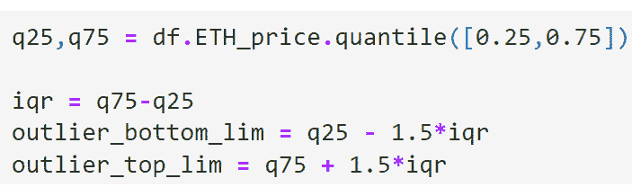

# 第六章：准备和探索我们的数据

数据准备是数据科学中的一个常见主题，超出了与机器学习流程的关联。它有各种不同的名称，如数据整理、数据清洗和特征工程的数据预处理。

在这里，我们强调将会投入大量时间进行数据清洗、特征工程和探索性分析，并且我们认识到强有力的预处理对结果的积极影响，无论是面向业务利益相关者的展示，还是与机器学习模型的整合。

**数据清洗**包括专注于识别和修正数据问题的任务，特别是错误和伪影。错误通常是由于在获取过程中数据丢失，而伪影则来源于生成数据的系统。清洗的工作涉及处理缺失数据、处理异常值、去除重复数据，以及为数据的可读性和转换执行必要的翻译。

**数据准备**涵盖了理解和转化接收到的数据，以使其与后续的流程步骤对接。这一章节深入探讨了在理解、预处理和从链上数据中提取信息时常见的情景。具体话题包括十进制处理、智能合约演变的方法和校验和验证。此外，本章还介绍了**探索性数据分析**（**EDA**）的概念，并利用汇总统计和异常值检测技术来展示其优势和见解。

本章探讨了准备链上数据的复杂性，并引入了 EDA 概念，促进了从分析到机器学习的过渡。由于这个数据科学领域的广泛性，本章并不旨在提供所有工具和方法的详尽概述。

总结来说，本章将涵盖以下主题：

+   链上数据准备

+   探索性数据分析介绍

# 技术要求

我们广泛使用 Pandas 库，它是一个流行且实用的 Python 库，用于处理 DataFrame 和系列。Pandas 提供了众多函数来分析、总结、探索、归一化和操作它们。系列是一个一维的类似数组的对象，而 DataFrame 是一个二维的表格结构，包含行和列。本书中的所有练习都将使用 Pandas 来执行上述活动。

如果你还没有安装 Pandas，可以通过以下代码片段来安装：

```py
pip install pandas.
```

Pandas 的文档可以在 [`pandas.pydata.org/docs/`](https://pandas.pydata.org/docs/) 查阅。

对于数据可视化，我们使用 Matplotlib 和 Seaborn 库。Matplotlib 提供了广泛的工具和对我们构建图像的控制，而 Seaborn 构建在 Matplotlib 之上，更加用户友好，但灵活性较差。

两个库的文档分别可以在[`seaborn.pydata.org/`](https://seaborn.pydata.org/)和[`matplotlib.org/`](https://matplotlib.org/)找到。

你可以在本书的 GitHub 仓库中找到本章的所有数据和代码文件，网址为[`github.com/PacktPublishing/Data-Science-for-Web3/tree/main/Chapter06`](https://github.com/PacktPublishing/Data-Science-for-Web3/tree/main/Chapter06)。我们建议你阅读`Chapter06`文件夹中的代码文件，以便跟随学习。

# 数据准备

在处理来自不同数据源的信息时，确保所有记录和字段的一致性和统一性非常关键，这样才能提取出有价值的见解或将数据输入到机器学习模型中。在这一部分，我们将探索与链上数据特别相关的各种数据准备任务。

## 十六进制值

十六进制表示法是一个基于 16 的系统，使用符号表示从 0 到 9 的数字值和从 A 到 F 的字母值。相比之下，我们日常使用的十进制表示法使用 10 个符号表示数字值（0-9）。十六进制表示法通过包括 A 到 F，将范围扩展到 10 到 15。这种表示法通常用于数据存储，因为它能够高效地表示二进制数字，每个十六进制数字表示 4 位二进制数。

在`Chapter06/Preparation`中的示例中，我们通过遵循[`developers.rsk.co/rsk/public-nodes/`](https://developers.rsk.co/rsk/public-nodes/)提供的文档，从 Rootstock 公共节点检索最新的区块编号。

结果值以十六进制数字的形式呈现，例如`0x4e07d0`：


图 6.1 – 十六进制区块编号

这个十六进制数字可以通过以下代码片段解码为十进制数字，基数为（`16`）：


图 6.2 – 解码后的十六进制区块编号

按照这些步骤，我们能够将 RSK 节点返回的十六进制响应转换为我们的十进制系统。为了验证转换后的信息的准确性，我们可以将结果与链上浏览器中的数据进行对比，浏览器网址为[`explorer.rsk.co/blocks`](https://explorer.rsk.co/blocks)或[`rootstock.blockscout.com/`](https://rootstock.blockscout.com/)。我们会看到该区块刚刚被添加到链上：


图 6.3 – 区块浏览器

某些 SQL 数据库引擎具备将十六进制值直接转换为人类可读格式的能力。例如，Covalent 使用的 ClickHouse 系统提供了`unhex`方法。你可以在[`clickhouse.com/docs/en/sql-reference/functions/encoding-functions#unhex`](https://clickhouse.com/docs/en/sql-reference/functions/encoding-functions#unhex)的文档中找到更多详情。

## 校验和

校验和是一种哈希地址的算法，使得以太坊可以验证地址是否有效。在以太坊中，校验和地址包含了特定模式的大小写字母。

| **校验和地址** | **非校验和地址** |
| --- | --- |
| `0x95222290DD7278Aa3Ddd389Cc1E1d 165CC4BAfe5` | `0x95222290dd7278aa3ddd389cc1e1 d165cc4bafe5` |

表 6.1 – 地址之间的区别

以太坊将小写字母和校验和地址视为有效地址，发送到任一版本的资金将会被定向到同一接收者。然而，使用校验和地址能提供额外的安全层，防止意外地将资金发送到不存在的地址。

本节有两个重要的意义。首先，Python 和许多 SQL 引擎一样，区分大小写。因此，在比较或合并来自不同源的数据时，管理小写和校验和地址之间的差异变得至关重要。这可以保证数据分析的兼容性和精确性。第二个方面是区分有效和无效地址，这在保持数据完整性和加速查询方面非常关键。

在 `Chapter06/Preparation` 中，我们测试一个地址是否是有效的校验和以太坊地址。为此，我们利用 `test()` 函数将一个小写字母地址转换为其校验和版本。

另一个例子请参见`Chapter10/EDA`，在该章节中我们演示了如何在过滤器中应用校验和地址，以移除无效的以太坊地址。

## 小数处理

Solidity 是 EVM 区块链中最常用的智能合约编程语言，但它不支持浮动数值。为了在 Solidity 中表示小数，我们使用整数。在 Jupyter Notebook 中的 `Chapter04/Art` 部分，在 *Chainlink* 小节中，我们可以看到来自预言机的响应是以以下方式表示的：


图 6.4 – Chainlink 底价响应

这样大的数字在经济学背景下没有意义，无法直接包含在仪表盘或报告中。因此，有必要将其转换为我们的十进制系统，使其更具实用性。

智能合约通过特定的函数提供小数位数。在 Chainlink 的数据馈送智能合约中，`decimals()` 函数告知我们定点数，或者在实际应用中，告诉我们应该将小数点向左移动多少位才能将响应转换为我们的十进制系统。在*第二章* *探索状态数据* 一节中解释了如何查询智能合约，正如 Jupyter Notebook 中所展示的，结果是 `18`：


图 6.5 – 数据馈送小数

以下图展示了我们可以在数据管道后续部分使用的转换后的数字：


图 6.6 – 结果

通过应用`fromWei()`函数，可以按照以下代码片段实现相同的结果：

```py
Web3.fromWei(latestData), 'ether')
```

我们刚刚探讨的小数处理方法对于代币也同样适用。`decimal()`，它*返回代币使用的小数位数，例如 8，这意味着将代币数量除以 100000000（10 的 8 次方）来获得其* *用户表示*。

更多标准内容已在*第五章*中进行了分析。

小数位说明

以太坊智能合约最常见的十进制基数是 18，而比特币使用 8，USDT 则使用 6 个小数位。

在本节中，我们了解到，消费链上数据通常需要进行大量转换。如果我们的数据集包含过于庞大的字符串且缺乏经济意义，我们可能需要查找智能合约的十进制值，以正确定位小数点位置。此外，如果我们的数据集包含十六进制值，我们需要将其解码为十进制系统。最后，我们还发现了如何将小写地址转换为校验和地址，以确保与区分大小写的编程语言兼容。

## 从 Unix 时间戳到日期时间格式

Unix 时间戳在数据分析中常被使用，但为了在仪表盘和报告中进行可视化，需要将其转换为人类可读的格式。Unix 时间表示自 1970 年 1 月 1 日以来已过去的秒数，提供了一种通过单一整数值来追踪时间的系统。

在大多数 SQL 引擎中，可以利用`truncate`函数从时间戳中提取相关的日期部分。

在 Python 中，我们可以使用`datetime`模块的`fromtimestamp()`函数，将 Unix 时间戳转换为本地日期时间，使用`utcfromtimestamp()`函数，将其转换为 UTC 日期时间。

在 Jupyter Notebook 的`Chapter06/Preparation`部分，我们使用以下代码将 Unix 时间戳转换为日期时间：


图 6.7 – 日期时间转换

为了验证我们的结果，我们可以将其与[`www.unixtimestamp.com/`](https://www.unixtimestamp.com/)网站上的数据进行对比，该工具展示了相同的信息：


图 6.8 – Unix 时间戳转换器

## 智能合约的演变

智能合约和任何软件产品一样，可能会因为业务需求、安全事件或减少燃气费用等多种原因而发生变化和需要升级。然而，根据设计，区块链上部署的一切都是不可变的。以下信息来自[Ethereum.org](http://Ethereum.org)，概述了多种实现升级的方法。内容引用自**创意共享署名 4.0 国际**（**CC BY 4.0**）许可协议，符合使用条款。原文可以在本章的*进一步阅读*部分找到。

智能合约的升级可以通过以下方式实现：

+   创建多个版本的智能合约，并将状态（即数据）从旧合约迁移到新合约实例

+   创建独立的合约来存储业务逻辑和状态

+   使用代理模式将函数调用从不可变的代理合约委托给可修改的逻辑合约

+   创建一个不可变的主合约，该合约通过灵活的卫星合约执行特定功能

+   使用钻石模式将代理合约的函数调用委托给逻辑合约

总之，升级智能合约的方法并不涉及修改已部署的代码，而是用一个合约替代另一个。目前，升级智能合约最流行的方法是**代理模式**。这种模式将代理合约和包含逻辑的执行合约分离。代理合约代表逻辑智能合约，将前端的交易重定向到后端正确的智能合约。可以在后端交换逻辑智能合约，并更新代理合约，使其开始将交易重定向到新部署的智能合约，该合约包含最新的逻辑。

合约可能发生变化，这意味着我们的查询需要适应这些变化。例如，如果一个智能合约在某个区块开始触发事件，我们需要意识到这一点，以便捕捉新的信息。正如我们在*第二章*中看到的，我们需要**应用程序二进制接口**（**ABI**）来解码智能合约，这些合约需要在升级后适当地更新以解码交易。如果我们没有意识到正在解析的合约已经发生了变化，可能会错过某些事件，并且可能对我们的分析产生负面影响。

在分析具体项目时，重要的是要关注新闻发布、项目代表和官方信息渠道，了解是否有任何新开发，这样我们可以将查询指向更不容易变动的智能合约。

总之，尽管智能合约设计为不可更改，但在某些情况下，升级和更改变得必要，我们需要做好准备，调整我们的查询或代码以适应这些变化。例如，如果我们正在分析以太坊，我们需要意识到整个区块链在 2022 年 9 月的合并（Merge）后发生了变化，并且这种变化会在数据层面产生影响。

# 探索性数据分析

在数据清洗阶段和建模或正式统计分析之间，存在一个中间步骤，称为 EDA，这是数据科学的一个基本方面。EDA 作为理解和解释数据集的主要方法，提供了关于“样本之外的总体”的洞察，并将原始数据转化为可供企业使用的可操作信息。EDA 可以包括多种技术和方法：

+   **数据摘要或描述性统计**：用于总结数据集中的中心趋势。

+   **数据可视化**：采用直方图、箱形图、散点图和折线图等图形技术来可视化数据，帮助识别模式、检测异常值，并理解变量之间的关系。此外，数据可视化在向非技术性观众展示结论时特别有效。

+   **数据探索**：帮助我们理解变量的分布，评估其形态和偏斜度，识别异常的存在。

+   **处理缺失数据**：这使我们能够识别缺失的行并评估它们对结果的影响。它有助于确定缺失值的模式，并制定有效处理它们的策略。

+   **异常值检测**：识别与数据集其他部分显著偏离的值，并评估其对分析的影响。这些异常值可能来自多种原因，我们将在后续部分讨论这些原因。

+   **相关性和模式**：通过相关分析和散点图等技术，探索变量之间的关系。此外，它们有助于识别数据随时间变化的趋势或季节性。

有关 EDA 的简要描述可以在[`towardsdatascience.com/exploratory-data-analysis-8fc1cb20fd15`](https://towardsdatascience.com/exploratory-data-analysis-8fc1cb20fd15)找到：“*探索性数据分析是指对数据进行初步调查，以发现模式、识别异常、测试假设和检查假设，借助于汇总统计和* *图形表示法。*"

在本章中，我们将简要介绍汇总统计和利用图形表示法进行异常值检测。我们选择这两个主题，因为它们可能适用于我们在旅程中遇到的所有数据集。有关 EDA 主题的进一步探索，欢迎参考*进一步阅读*部分中的书籍，它们非常有用。

为了举例说明本节中学到的概念，我们将使用 Kaggle 上提供的**Witches**数据集（[`www.kaggle.com/datasets/harrywang/crypto-coven?select=witches.csv`](https://www.kaggle.com/datasets/harrywang/crypto-coven?select=witches.csv)）。该数据集包含关于 Crypto Coven NFT 项目的信息，每一行代表一个女巫 NFT。Witches 项目的主页可以在[`www.cryptocoven.xyz/`](https://www.cryptocoven.xyz/)找到。

## 数据汇总

我们的数据集将包含分类变量或定量变量。分类变量是指可以分为组的变量，例如颜色或品牌。另一方面，定量变量代表数值量，例如价格或销售数量。`df.describe()`代码片段返回定量变量及其分布情况。

计算分类数据的分布涉及确定每个类别的频率。这种分析可以提供有意义的见解。例如，在市场营销中，理解年龄组、收入水平或消费者偏好等分类变量的分布可以帮助企业有效地细分目标受众，并制定更具针对性和成功的营销活动。另一个例子是在欺诈检测中，分类变量如交易类型或用户行为模式在识别欺诈活动中至关重要。通过研究这些变量的分布，可以识别出异常或不寻常的模式，从而使组织能够开发出有效的欺诈检测模型和策略。

在 NFT 领域中的一个应用是帮助确定一个系列是由零售公众拥有，还是由少数收藏者（集中化）持有。关于艺术品收藏的所有权特征的了解，可以帮助投资者评估项目价格是否与市场价值一致，或者是否容易受到操控。更加去中心化的所有权结构意味着价格更接近市场价值。

在`Chapter06/EDA.ipynb`中，我们通过创建两类持有者来研究 NFT 的分布：那些拥有超过三个同系列 NFT 的地址，我们称之为*收藏者*，以及那些持有少于三个 NFT 的地址，也就是*普通公众*。我们遵循三个步骤：

1.  我们统计每个地址持有的 NFT 数量，相当于 SQL 查询中的`GROUP BY`操作。这使我们能够了解每个地址的持有情况。

1.  我们创建了一个地址列表，这些地址持有来自同一系列的超过三个 NFT。每个地址持有的 NFT 数量是我们分析的一部分，也是我们在 EDA 过程中做出的决策。这些微小的决策会影响最终结果，文档化它们是一个良好的实践。

1.  我们根据地址是否在步骤 2 的列表中，分别构建`collectors_df`和`distributed_df`数据集。

通过这些简单的步骤，我们可以计算项目中收藏者和分布所有者的百分比。*图 6.9* 显示，收藏者的百分比只有 32%，而其余的 68% 是由公众持有的。


图 6.9 – 收藏者和分布百分比

为了总结定量变量，我们引入了均值、平均值、偏差、异常值等概念。我们从集中趋势或总结性统计量开始，它们用于用单一的数值来描述一组值。这些统计量包括均值、中位数和众数。

**平均数**，即算术平均数，是最常用的度量方式。它是通过将数据集中所有值相加，并除以值的个数来计算的：

```py
Formula: Mean = (Sum of all values) / (Total number of values)
```

例如：如果我们的值是 `5`、`7`、`2`、`10` 和 `6`，则平均数为 (5 + 7 + 2 + 10 + 6) / 5 = 6。

Pandas 提供了 `mean()` 函数，它返回传递给列的均值。如果我们计算 Witch 数据集中的价格均值，我们将所有价格相加，然后将结果除以行数。请参见 `Chapter06/EDA.ipynb` 中的以下代码片段，我们在其中计算了 `price` 列的均值：

```py
df['price'].mean()
```

计算均值时，所有值都会被考虑在内，但计算出的数值可能不在分析的样本中。另一个重要的方面是，均值受到异常值的强烈影响。因此，在计算均值之前，需要清理数据集并删除异常值。

当数据存在偏斜时，均值并不是集中趋势的完美度量。一个更好的替代方案是中位数。

**中位数**被定义为按大小顺序排列后的列的中间值，从最小到最大。要手动计算中位数，我们可以按照以下步骤进行：

1.  将 `price` 列中的所有值从小到大排序。

1.  找到位于数据集中心的数值，将数据集分成两部分：

    `公式（奇数个值）：中位数 =` `中间值`

    `公式（偶数个值）：中位数 = （两个中间值的总和）/ 2`

    例如：对于数据集 `5`、`7`、`2`、`10` 和 `6`，当按升序排列时，中位数将是 6。

Pandas 提供了 `median()` 函数来执行这个计算。例如，要计算 `price` 列的中位数，我们可以使用以下代码片段，这也显示在 `Chapter06/EDA.ipynb` 中：

```py
df['price'].median()
```

在处理偏斜数据或存在异常值的数据时，中位数通常优于均值。

在 `Chapter04/Art.ipynb` 中，当总结数据以寻找多个市场在一段时间内的最低价格时，我们选择显示中位数而不是平均值，结果如下：


图 6.10 – 按市场划分的中位数最低价格

如果我们使用平均值，图形将显示市场之间的显著差异，如*图 6.11* 所示。基于平均值分析地板价格并不准确，特别是当我们提到 OpenSea 报价时。


图 6.11 – 各市场的平均地板价格

**众数**是另一种集中趋势的度量，表示数据集中最频繁出现的值。从图形上讲，它由直方图中最高的柱形表示。它也可以与分类变量一起使用。要手动计算众数，我们需要识别数据集中最常出现的价格：

```py
Formula: No specific formula
```

例如，在 `15`、`20`、`18`、`22`、`15`、`20`、`18`、`20`、`22` 和 `25` 的数据集中，出现频率最高的值是 20\。它出现了三次。

Pandas 提供了 `mode()` 函数来计算某列的众数，如 `Chapter06/EDA.ipynb` 中的以下代码片段所示：

```py
df['price'].mode()[0]
```

缺失价格的说明

集中趋势的度量不仅有助于总结我们的数据集，还能帮助解决数据集中的缺失值问题。

例如，在极端波动期间，某些交易所可能会暂停商业化。这适用于传统市场和集中化的加密货币交易所。如果我们的数据库恰好从这种交易所获取价格数据，可能会出现缺失的数据行。在这种情况下，可以使用 pandas 函数，如 `fillna()` 或 `interpolate()`，来填充缺失值。使用 `fillna()` 函数，我们可以指定是否用均值或中位数来填充 NaN 值。

总之，在我们的 EDA 中，我们探讨了集中趋势的度量方法，如均值、中位数和众数，这些方法提供了关于我们数据分布和特征的洞察。

在我们探讨集中趋势的基础上，现在我们将注意力转向异常值检测。异常值是偏离数据集整体模式的数据点，它们可能对我们的分析和解释产生重大影响。在接下来的部分中，我们将深入研究识别异常值的各种技术和方法。

## 异常值检测

根据 Rafael A. Irizarry 的《数据科学导论》一书，异常值被定义为 *“与集中趋势相差较远的数据样本”*。虽然异常值本身既不一定是好也不一定是坏的，但它们可以显著影响我们的分析，并导致不正确的结论。特别是在处理价格时，市场波动性可能会扭曲交易资产的真实价值。价格作为价值的代理，但重要的是要认识到，有些价格显著偏离实际价值，成为异常值。

在某些情况下，主要目标是识别和分析异常值，这通常是异常检测技术的重点，例如在*第四章*中讨论的技术，特别是用于揭露欺诈或洗钱。

异常值出现的原因有多种：

+   仪器测量误差，如 API 断开或不平衡的秤

+   数据录入错误

+   处理的样本或群体比最初假设的要不均匀

让我们探索一些识别数据集异常值的技巧：

+   **箱线图**（**胡须图**）：这种图形表示法通过五个重要数字总结数据：最小值、第一个四分位数、中位数、第三个四分位数和最大值。我们可以将远离箱体的数据点识别为异常值：


图 6.12 – 箱线图的部分

这张图像可以通过以下代码片段由 Pandas 自动生成：

```py
Chapter06/Outliers).

*   `df.quantile()` function. Once we have them, we can calculate other parts of this formula.

    In `Chapter05/Outliers`, we calculate the IQR, bottom, and upper limits in this part of the code:



Figure 6.13 – Calculation of IQR and limits
The 1.5 multiplier is common practice but can be adjusted to adapt to our case.

*   **Three-sigma rule** (**Z-score**): The three-sigma rule states that 99.7% of data falls within three standard deviations (three-sigma) of the mean in a normal distribution. This rule is used for outlier detection because data points outside the three sigmas can be considered outliers.

    This method uses the mean as a starting point, which can be influenced by outliers. A more robust modified Z-score method can be employed, which incorporates the median and median absolute deviation in its formula. The metric is a statistical measure that helps identify outliers in a dataset by comparing each data point to the median and median absolute deviation. It provides a robust way to detect extreme values, especially in datasets with skewed distributions.

Summary
This chapter has addressed various preparation methods applicable to on-chain data scenarios. We explored techniques such as unhexing data, decimal treatment, handling checksum addresses, and converting Unix timestamps to datetime formats. These methods have proven foundational in preparing the on-chain data for subsequent analysis.
Moreover, we introduced the concept of EDA as a crucial step in understanding and summarizing datasets, with a specific focus on central tendency metrics. Additionally, we delved into outlier detection techniques, such as box plots and the IQR method, aiding in the identification of extreme observations deviating significantly from the majority of the data.
By applying these cleaning and EDA techniques, we have equipped ourselves with essential tools for the effective analysis and interpretation of on-chain data. These foundational concepts serve as building blocks for more advanced techniques and methodologies as we continue this journey. For more insights into these methodologies, please refer to the *Further* *reading* section.
Further reading
The following links may help to complement this chapter:

*   Technical requirements:
    *   *10 minutes to pandas, pandas 1.5.3 documentation, pandas - Python Data Analysis* *Library:* https://pandas.pydata.org/docs/user_guide/10min.xhtml#min
*   Evolution of smart contracts:
    *   *Upgrading Smart Contracts,* *ethereum.org:* [`ethereum.org/en/developers/docs/smart-contracts/upgrading/`](https://ethereum.org/en/developers/docs/smart-contracts/upgrading/)
*   Exploratory Data Analysis:
    *   *Introduction to Data Science: A Python Approach to Concepts, Techniques and Applications,* Laura Igual, Santi Seguí, Springer
    *   *Three Ways to Detect Outliers, Colin Gorrie, Colin Gorrie’s Data* *Story:* [`colingorrie.github.io/outlier-detection.xhtml#modified-z-score-method`](https://colingorrie.github.io/outlier-detection.xhtml#modified-z-score-method)
    *   *Python for Data Analysis: Data Wrangling With Pandas, NumPy, and Jupyter,* Wes McKinney, O’Reilly Media
    *   *Box Plot Review, Khan* *Academy:* [`www.khanacademy.org/math/statistics-probability/summarizing-quantitative-data/box-whisker-plots/a/box-plot-review`](https://www.khanacademy.org/math/statistics-probability/summarizing-quantitative-data/box-whisker-plots/a/box-plot-review)
    *   *Hands-On Exploratory Data Analysis With Python: Perform EDA Techniques to Understand, Summarize, and Investigate Your Data,* Usman Ahmed, Suresh Kumar Mukhiya, O’Reilly Media*:* [`www.packtpub.com/product/hands-on-exploratory-data-analysis-with-python/9781789537253`](https://www.packtpub.com/product/hands-on-exploratory-data-analysis-with-python/9781789537253)
    *   *The Data Science Design Manual,* Steven Skiena, Springer
*   Cleaning:
    *   *RSK* *Explorer*: [`explorer.rsk.co/blocks`](https://explorer.rsk.co/blocks)
    *   *More on Time on the Blockchain, Nick Furneaux, Wiley*, *Chapter 9*, Investigating Cryptocurrencies, Understanding, Extracting, and Analyzing Blockchain Evidence, Page 156 to Page 161

```
